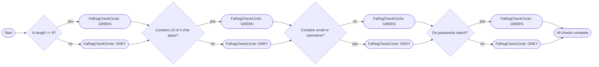

# Diagram: web/portal/src/components/PasswordChecks.js

> Auto-generated by Obscura crawlers

## Mermaid

### SVG

<svg id="container" width="2535.5048828125" xmlns="http://www.w3.org/2000/svg" class="flowchart" height="294" viewBox="0.0000019073486328125 0 2535.5048828125 294" role="graphics-document document" aria-roledescription="flowchart-v2"><g><marker id="container_flowchart-v2-pointEnd" class="marker flowchart-v2" viewBox="0 0 10 10" refX="5" refY="5" markerUnits="userSpaceOnUse" markerWidth="8" markerHeight="8" orient="auto"><path d="M 0 0 L 10 5 L 0 10 z" class="arrowMarkerPath" style="stroke-width: 1; stroke-dasharray: 1, 0;"></path></marker><marker id="container_flowchart-v2-pointStart" class="marker flowchart-v2" viewBox="0 0 10 10" refX="4.5" refY="5" markerUnits="userSpaceOnUse" markerWidth="8" markerHeight="8" orient="auto"><path d="M 0 5 L 10 10 L 10 0 z" class="arrowMarkerPath" style="stroke-width: 1; stroke-dasharray: 1, 0;"></path></marker><marker id="container_flowchart-v2-circleEnd" class="marker flowchart-v2" viewBox="0 0 10 10" refX="11" refY="5" markerUnits="userSpaceOnUse" markerWidth="11" markerHeight="11" orient="auto"><circle cx="5" cy="5" r="5" class="arrowMarkerPath" style="stroke-width: 1; stroke-dasharray: 1, 0;"></circle></marker><marker id="container_flowchart-v2-circleStart" class="marker flowchart-v2" viewBox="0 0 10 10" refX="-1" refY="5" markerUnits="userSpaceOnUse" markerWidth="11" markerHeight="11" orient="auto"><circle cx="5" cy="5" r="5" class="arrowMarkerPath" style="stroke-width: 1; stroke-dasharray: 1, 0;"></circle></marker><marker id="container_flowchart-v2-crossEnd" class="marker cross flowchart-v2" viewBox="0 0 11 11" refX="12" refY="5.2" markerUnits="userSpaceOnUse" markerWidth="11" markerHeight="11" orient="auto"><path d="M 1,1 l 9,9 M 10,1 l -9,9" class="arrowMarkerPath" style="stroke-width: 2; stroke-dasharray: 1, 0;"></path></marker><marker id="container_flowchart-v2-crossStart" class="marker cross flowchart-v2" viewBox="0 0 11 11" refX="-1" refY="5.2" markerUnits="userSpaceOnUse" markerWidth="11" markerHeight="11" orient="auto"><path d="M 1,1 l 9,9 M 10,1 l -9,9" class="arrowMarkerPath" style="stroke-width: 2; stroke-dasharray: 1, 0;"></path></marker><g class="root"><g class="clusters"></g><g class="edgePaths"><path d="M68.277,147.5L72.36,147.417C76.444,147.333,84.61,147.167,92.194,147.083C99.777,147,106.777,147,110.277,147L113.777,147" id="L_Start_Length_0" class="edge-thickness-normal edge-pattern-solid edge-thickness-normal edge-pattern-solid flowchart-link" style=";" data-edge="true" data-et="edge" data-id="L_Start_Length_0" data-points="W3sieCI6NjguMjc2ODM3NDMxODI3MjksInkiOjE0Ny41MDAwMDAwMDAwMDAwM30seyJ4Ijo5Mi43NzY4MzYzOTUyNjM2NywieSI6MTQ3fSx7IngiOjExNy43NzY4MzYzOTUyNjM2NywieSI6MTQ3fV0=" marker-end="url(#container_flowchart-v2-pointEnd)"></path><path d="M252.887,125.173L262.693,121.394C272.499,117.615,292.11,110.058,307.501,106.353C322.892,102.649,334.061,102.798,339.646,102.872L345.23,102.947" id="L_Length_LenOK_0" class="edge-thickness-normal edge-pattern-solid edge-thickness-normal edge-pattern-solid flowchart-link" style=";" data-edge="true" data-et="edge" data-id="L_Length_LenOK_0" data-points="W3sieCI6MjUyLjg4NzAxNzk0MDQxMTg4LCJ5IjoxMjUuMTcyNjgxNTQ1MTQ4MjF9LHsieCI6MzExLjcyMjE0ODg5NTI2MzcsInkiOjEwMi41fSx7IngiOjM0OS4yMjk5NjEzOTUyNjQ4LCJ5IjoxMDMuMDAwMDAwMDAwMDAwMDN9XQ==" marker-end="url(#container_flowchart-v2-pointEnd)"></path><path d="M252.887,168.827L262.693,172.606C272.499,176.385,292.11,183.942,308.398,187.797C324.686,191.651,337.649,191.802,344.131,191.878L350.613,191.953" id="L_Length_LenFail_0" class="edge-thickness-normal edge-pattern-solid edge-thickness-normal edge-pattern-solid flowchart-link" style=";" data-edge="true" data-et="edge" data-id="L_Length_LenFail_0" data-points="W3sieCI6MjUyLjg4NzAxNzk0MDQxMTg4LCJ5IjoxNjguODI3MzE4NDU0ODUxOH0seyJ4IjozMTEuNzIyMTQ4ODk1MjYzNywieSI6MTkxLjV9LHsieCI6MzU0LjYxMjc3Mzg5NTI1MjM2LCJ5IjoxOTJ9XQ==" marker-end="url(#container_flowchart-v2-pointEnd)"></path><path d="M554.835,103L558.918,102.917C563.002,102.833,571.168,102.667,583.719,104.881C596.27,107.095,613.206,111.691,621.673,113.988L630.141,116.286" id="L_LenOK_Regex_0" class="edge-thickness-normal edge-pattern-solid edge-thickness-normal edge-pattern-solid flowchart-link" style=";" data-edge="true" data-et="edge" data-id="L_LenOK_Regex_0" data-points="W3sieCI6NTU0LjgzNDkyMzgyNzA5MzgsInkiOjEwM30seyJ4Ijo1NzkuMzM0OTI2NjA1MjI0NiwieSI6MTAyLjV9LHsieCI6NjM0LjAwMTU5MzI3MTg5MTIsInkiOjExNy4zMzMzMzMzMzMzMzMzM31d" marker-end="url(#container_flowchart-v2-pointEnd)"></path><path d="M549.452,192L554.433,191.917C559.413,191.833,569.374,191.667,582.822,189.286C596.27,186.905,613.206,182.309,621.673,180.012L630.141,177.714" id="L_LenFail_Regex_0" class="edge-thickness-normal edge-pattern-solid edge-thickness-normal edge-pattern-solid flowchart-link" style=";" data-edge="true" data-et="edge" data-id="L_LenFail_Regex_0" data-points="W3sieCI6NTQ5LjQ1MjExMTMyNzA5NjQsInkiOjE5Mn0seyJ4Ijo1NzkuMzM0OTI2NjA1MjI0NiwieSI6MTkxLjV9LHsieCI6NjM0LjAwMTU5MzI3MTg5MTIsInkiOjE3Ni42NjY2NjY2NjY2NjY2Nn1d" marker-end="url(#container_flowchart-v2-pointEnd)"></path><path d="M854.284,118.949L865.127,116.207C875.97,113.466,897.656,107.983,914.084,105.316C930.512,102.649,941.682,102.798,947.266,102.872L952.851,102.947" id="L_Regex_RegOK_0" class="edge-thickness-normal edge-pattern-solid edge-thickness-normal edge-pattern-solid flowchart-link" style=";" data-edge="true" data-et="edge" data-id="L_Regex_RegOK_0" data-points="W3sieCI6ODU0LjI4Mzc2NjI4NjM1ODQsInkiOjExOC45NDg4Mzk2ODExMzM3NX0seyJ4Ijo5MTkuMzQyNzM5MTA1MjI0NiwieSI6MTAyLjV9LHsieCI6OTU2Ljg1MDU1MTYwNTIyNjEsInkiOjEwMy4wMDAwMDAwMDAwMDAwM31d" marker-end="url(#container_flowchart-v2-pointEnd)"></path><path d="M854.284,175.051L865.127,177.793C875.97,180.534,897.656,186.017,914.981,188.834C932.306,191.651,945.27,191.802,951.752,191.878L958.234,191.953" id="L_Regex_RegFail_0" class="edge-thickness-normal edge-pattern-solid edge-thickness-normal edge-pattern-solid flowchart-link" style=";" data-edge="true" data-et="edge" data-id="L_Regex_RegFail_0" data-points="W3sieCI6ODU0LjI4Mzc2NjI4NjM1ODQsInkiOjE3NS4wNTExNjAzMTg4NjYyN30seyJ4Ijo5MTkuMzQyNzM5MTA1MjI0NiwieSI6MTkxLjV9LHsieCI6OTYyLjIzMzM2NDEwNTIyNDMsInkiOjE5Mn1d" marker-end="url(#container_flowchart-v2-pointEnd)"></path><path d="M1162.456,103L1166.539,102.917C1170.622,102.833,1178.789,102.667,1191.34,104.881C1203.891,107.095,1220.826,111.691,1229.294,113.988L1237.762,116.286" id="L_RegOK_ContainsEmail_0" class="edge-thickness-normal edge-pattern-solid edge-thickness-normal edge-pattern-solid flowchart-link" style=";" data-edge="true" data-et="edge" data-id="L_RegOK_ContainsEmail_0" data-points="W3sieCI6MTE2Mi40NTU1MTQwMzcwNDI2LCJ5IjoxMDN9LHsieCI6MTE4Ni45NTU1MTY4MTUxODU1LCJ5IjoxMDIuNX0seyJ4IjoxMjQxLjYyMjE4MzQ4MTg1MjMsInkiOjExNy4zMzMzMzMzMzMzMzMzM31d" marker-end="url(#container_flowchart-v2-pointEnd)"></path><path d="M1157.073,192L1162.053,191.917C1167.034,191.833,1176.995,191.667,1190.443,189.286C1203.891,186.905,1220.826,182.309,1229.294,180.012L1237.762,177.714" id="L_RegFail_ContainsEmail_0" class="edge-thickness-normal edge-pattern-solid edge-thickness-normal edge-pattern-solid flowchart-link" style=";" data-edge="true" data-et="edge" data-id="L_RegFail_ContainsEmail_0" data-points="W3sieCI6MTE1Ny4wNzI3MDE1MzcwNjg1LCJ5IjoxOTJ9LHsieCI6MTE4Ni45NTU1MTY4MTUxODU1LCJ5IjoxOTEuNX0seyJ4IjoxMjQxLjYyMjE4MzQ4MTg1MjMsInkiOjE3Ni42NjY2NjY2NjY2NjY2Nn1d" marker-end="url(#container_flowchart-v2-pointEnd)"></path><path d="M1461.904,118.949L1472.748,116.207C1483.591,113.466,1505.277,107.983,1521.705,105.316C1538.133,102.649,1549.302,102.798,1554.887,102.872L1560.471,102.947" id="L_ContainsEmail_EmailOK_0" class="edge-thickness-normal edge-pattern-solid edge-thickness-normal edge-pattern-solid flowchart-link" style=";" data-edge="true" data-et="edge" data-id="L_ContainsEmail_EmailOK_0" data-points="W3sieCI6MTQ2MS45MDQzNTY0OTYzMTkyLCJ5IjoxMTguOTQ4ODM5NjgxMTMzNzV9LHsieCI6MTUyNi45NjMzMjkzMTUxODU1LCJ5IjoxMDIuNX0seyJ4IjoxNTY0LjQ3MTE0MTgxNTE4MTcsInkiOjEwMy4wMDAwMDAwMDAwMDAwM31d" marker-end="url(#container_flowchart-v2-pointEnd)"></path><path d="M1461.904,175.051L1472.748,177.793C1483.591,180.534,1505.277,186.017,1522.602,188.834C1539.927,191.651,1552.891,191.802,1559.372,191.878L1565.854,191.953" id="L_ContainsEmail_EmailFail_0" class="edge-thickness-normal edge-pattern-solid edge-thickness-normal edge-pattern-solid flowchart-link" style=";" data-edge="true" data-et="edge" data-id="L_ContainsEmail_EmailFail_0" data-points="W3sieCI6MTQ2MS45MDQzNTY0OTYzMTkyLCJ5IjoxNzUuMDUxMTYwMzE4ODY2Mjd9LHsieCI6MTUyNi45NjMzMjkzMTUxODU1LCJ5IjoxOTEuNX0seyJ4IjoxNTY5Ljg1Mzk1NDMxNTE5NjIsInkiOjE5Mn1d" marker-end="url(#container_flowchart-v2-pointEnd)"></path><path d="M1770.076,103L1774.159,102.917C1778.243,102.833,1786.409,102.667,1798.492,105.321C1810.575,107.975,1826.574,113.449,1834.573,116.186L1842.573,118.924" id="L_EmailOK_Match_0" class="edge-thickness-normal edge-pattern-solid edge-thickness-normal edge-pattern-solid flowchart-link" style=";" data-edge="true" data-et="edge" data-id="L_EmailOK_Match_0" data-points="W3sieCI6MTc3MC4wNzYxMDQyNDcwMjYsInkiOjEwM30seyJ4IjoxNzk0LjU3NjEwNzAyNTE0NjUsInkiOjEwMi41fSx7IngiOjE4NDYuMzU3MzcxMDEyMjU2LCJ5IjoxMjAuMjE4NzM2MDEyODkwNTJ9XQ==" marker-end="url(#container_flowchart-v2-pointEnd)"></path><path d="M1764.693,192L1769.674,191.917C1774.654,191.833,1784.615,191.667,1797.595,188.846C1810.575,186.025,1826.574,180.551,1834.573,177.814L1842.573,175.076" id="L_EmailFail_Match_0" class="edge-thickness-normal edge-pattern-solid edge-thickness-normal edge-pattern-solid flowchart-link" style=";" data-edge="true" data-et="edge" data-id="L_EmailFail_Match_0" data-points="W3sieCI6MTc2NC42OTMyOTE3NDcwNDAzLCJ5IjoxOTJ9LHsieCI6MTc5NC41NzYxMDcwMjUxNDY1LCJ5IjoxOTEuNX0seyJ4IjoxODQ2LjM1NzM3MTAxMjI1NiwieSI6MTczLjc4MTI2Mzk4NzEwOTQ3fV0=" marker-end="url(#container_flowchart-v2-pointEnd)"></path><path d="M2004.612,121.943L2014.957,118.702C2025.301,115.462,2045.989,108.981,2061.918,105.815C2077.847,102.649,2089.016,102.798,2094.601,102.872L2100.186,102.947" id="L_Match_MatchOK_0" class="edge-thickness-normal edge-pattern-solid edge-thickness-normal edge-pattern-solid flowchart-link" style=";" data-edge="true" data-et="edge" data-id="L_Match_MatchOK_0" data-points="W3sieCI6MjAwNC42MTI0MDA2ODI3NTM4LCJ5IjoxMjEuOTQyNTQzNjU3NjA3MX0seyJ4IjoyMDY2LjY3NzY2OTUyNTE0NjUsInkiOjEwMi41fSx7IngiOjIxMDQuMTg1NDgyMDI1MTI3NCwieSI6MTAzLjAwMDAwMDAwMDAwMDAzfV0=" marker-end="url(#container_flowchart-v2-pointEnd)"></path><path d="M2004.612,172.057L2014.957,175.298C2025.301,178.538,2045.989,185.019,2062.815,188.335C2079.641,191.651,2092.605,191.802,2099.087,191.878L2105.569,191.953" id="L_Match_MatchFail_0" class="edge-thickness-normal edge-pattern-solid edge-thickness-normal edge-pattern-solid flowchart-link" style=";" data-edge="true" data-et="edge" data-id="L_Match_MatchFail_0" data-points="W3sieCI6MjAwNC42MTI0MDA2ODI3NTM4LCJ5IjoxNzIuMDU3NDU2MzQyMzkyOX0seyJ4IjoyMDY2LjY3NzY2OTUyNTE0NjUsInkiOjE5MS41fSx7IngiOjIxMDkuNTY4Mjk0NTI1MTEyNCwieSI6MTkyfV0=" marker-end="url(#container_flowchart-v2-pointEnd)"></path><path d="M2309.79,103L2313.874,102.917C2317.957,102.833,2326.124,102.667,2339.89,106.579C2353.657,110.491,2373.023,118.483,2382.706,122.479L2392.389,126.474" id="L_MatchOK_End_0" class="edge-thickness-normal edge-pattern-solid edge-thickness-normal edge-pattern-solid flowchart-link" style=";" data-edge="true" data-et="edge" data-id="L_MatchOK_End_0" data-points="W3sieCI6MjMwOS43OTA0NDQ0NTY5NjU0LCJ5IjoxMDN9LHsieCI6MjMzNC4yOTA0NDcyMzUxMDc0LCJ5IjoxMDIuNX0seyJ4IjoyMzk2LjA4NjYxMDIxNTQzMzcsInkiOjEyOH1d" marker-end="url(#container_flowchart-v2-pointEnd)"></path><path d="M2304.408,192L2309.388,191.917C2314.369,191.833,2324.33,191.667,2338.99,187.746C2353.65,183.825,2373.009,176.149,2382.689,172.312L2392.368,168.474" id="L_MatchFail_End_0" class="edge-thickness-normal edge-pattern-solid edge-thickness-normal edge-pattern-solid flowchart-link" style=";" data-edge="true" data-et="edge" data-id="L_MatchFail_End_0" data-points="W3sieCI6MjMwNC40MDc2MzE5NTY5NTYzLCJ5IjoxOTJ9LHsieCI6MjMzNC4yOTA0NDcyMzUxMDc0LCJ5IjoxOTEuNX0seyJ4IjoyMzk2LjA4NjYxMDIxNTQzMzcsInkiOjE2N31d" marker-end="url(#container_flowchart-v2-pointEnd)"></path></g><g class="edgeLabels"><g class="edgeLabel"><g class="label" data-id="L_Start_Length_0" transform="translate(0, 0)"><foreignObject width="0" height="0">

</foreignObject></g></g><g class="edgeLabel" transform="translate(311.7221488952637, 102.5)"><g class="label" data-id="L_Length_LenOK_0" transform="translate(-12.0078125, -12)"><foreignObject width="24.015625" height="24">

yes

</foreignObject></g></g><g class="edgeLabel" transform="translate(311.7221488952637, 191.5)"><g class="label" data-id="L_Length_LenFail_0" transform="translate(-9.3671875, -12)"><foreignObject width="18.734375" height="24">

no

</foreignObject></g></g><g class="edgeLabel"><g class="label" data-id="L_LenOK_Regex_0" transform="translate(0, 0)"><foreignObject width="0" height="0">

</foreignObject></g></g><g class="edgeLabel"><g class="label" data-id="L_LenFail_Regex_0" transform="translate(0, 0)"><foreignObject width="0" height="0">

</foreignObject></g></g><g class="edgeLabel" transform="translate(919.3427391052246, 102.5)"><g class="label" data-id="L_Regex_RegOK_0" transform="translate(-12.0078125, -12)"><foreignObject width="24.015625" height="24">

yes

</foreignObject></g></g><g class="edgeLabel" transform="translate(919.3427391052246, 191.5)"><g class="label" data-id="L_Regex_RegFail_0" transform="translate(-9.3671875, -12)"><foreignObject width="18.734375" height="24">

no

</foreignObject></g></g><g class="edgeLabel"><g class="label" data-id="L_RegOK_ContainsEmail_0" transform="translate(0, 0)"><foreignObject width="0" height="0">

</foreignObject></g></g><g class="edgeLabel"><g class="label" data-id="L_RegFail_ContainsEmail_0" transform="translate(0, 0)"><foreignObject width="0" height="0">

</foreignObject></g></g><g class="edgeLabel" transform="translate(1526.9633293151855, 102.5)"><g class="label" data-id="L_ContainsEmail_EmailOK_0" transform="translate(-9.3671875, -12)"><foreignObject width="18.734375" height="24">

no

</foreignObject></g></g><g class="edgeLabel" transform="translate(1526.9633293151855, 191.5)"><g class="label" data-id="L_ContainsEmail_EmailFail_0" transform="translate(-12.0078125, -12)"><foreignObject width="24.015625" height="24">

yes

</foreignObject></g></g><g class="edgeLabel"><g class="label" data-id="L_EmailOK_Match_0" transform="translate(0, 0)"><foreignObject width="0" height="0">

</foreignObject></g></g><g class="edgeLabel"><g class="label" data-id="L_EmailFail_Match_0" transform="translate(0, 0)"><foreignObject width="0" height="0">

</foreignObject></g></g><g class="edgeLabel" transform="translate(2066.6776695251465, 102.5)"><g class="label" data-id="L_Match_MatchOK_0" transform="translate(-12.0078125, -12)"><foreignObject width="24.015625" height="24">

yes

</foreignObject></g></g><g class="edgeLabel" transform="translate(2066.6776695251465, 191.5)"><g class="label" data-id="L_Match_MatchFail_0" transform="translate(-9.3671875, -12)"><foreignObject width="18.734375" height="24">

no

</foreignObject></g></g><g class="edgeLabel"><g class="label" data-id="L_MatchOK_End_0" transform="translate(0, 0)"><foreignObject width="0" height="0">

</foreignObject></g></g><g class="edgeLabel"><g class="label" data-id="L_MatchFail_End_0" transform="translate(0, 0)"><foreignObject width="0" height="0">

</foreignObject></g></g></g><g class="nodes"><g class="node default" id="flowchart-Start-0" transform="translate(37.888418197631836, 147)"><g class="basic label-container outer-path"><path d="M-10.3984375 -19.5 C-4.54958580254333 -19.5, 1.29926589491334 -19.5, 10.3984375 -19.5 C10.3984375 -19.5, 10.398437499999998 -19.5, 10.398437499999998 -19.5 C10.809329831852029 -19.48682348267091, 11.22022216370406 -19.473646965341825, 11.6478067896239 -19.45993515863156 C12.03010681714994 -19.423055134759174, 12.412406844675981 -19.386175110886786, 12.892042152847864 -19.3399052695533 C13.159540315615105 -19.296658241076326, 13.427038478382347 -19.253411212599353, 14.126030759676757 -19.140403561325776 C14.37088305054352 -19.08451762374596, 14.615735341410284 -19.02863168616614, 15.34470188623539 -18.862249829261074 C15.688134410298499 -18.76032085883325, 16.031566934361607 -18.658391888405426, 16.543047751460602 -18.50658706670804 C16.810547921708753 -18.408144531312253, 17.078048091956905 -18.309701995916466, 17.716144095147794 -18.074876768247425 C18.025057053543787 -17.938130165142848, 18.33397001193978 -17.80138356203827, 18.85917041279238 -17.568892924097174 C19.099807379759405 -17.44335277256581, 19.340444346726432 -17.31781262103445, 19.967429764076783 -16.990714730406097 C20.27534758967059 -16.80405313500513, 20.5832654152644 -16.617391539604167, 21.036368073605697 -16.342718045390892 C21.44333312695048 -16.05883684141079, 21.850298180295262 -15.774955637430692, 22.061592844578712 -15.627565626425154 C22.42970898104984 -15.334002803571227, 22.797825117520965 -15.040439980717299, 23.03889120850187 -14.848196188198123 C23.23441395210239 -14.670627605708443, 23.429936695702906 -14.493059023218763, 23.964247236767985 -14.007812326905688 C24.26723943606568 -13.694948005008623, 24.570231635363374 -13.382083683111556, 24.833858442968648 -13.10986736009568 C25.145513583338474 -12.743779498537425, 25.4571687237083 -12.377691636979169, 25.644151408126582 -12.158051136245305 C25.899596608143845 -11.815777839758635, 26.155041808161105 -11.473504543271964, 26.391796464640635 -11.156274872382312 C26.636842919629338 -10.779817713333046, 26.88188937461804 -10.403360554283777, 27.073721378604247 -10.108655082055241 C27.238566643847776 -9.815955621222189, 27.403411909091304 -9.523256160389138, 27.6871239742735 -9.019496659696287 C27.86193403514627 -8.656499827957868, 28.036744096019042 -8.293502996219448, 28.22948364880834 -7.893275190886684 C28.338752503140412 -7.623379008116888, 28.44802135747248 -7.3534828253470925, 28.698571729970325 -6.734618561215508 C28.7899459936778 -6.459413837440428, 28.881320257385276 -6.1842091136653465, 29.09246063421488 -5.548287939305138 C29.20223584157753 -5.129667496755528, 29.31201104894018 -4.711047054205919, 29.40953178754556 -4.339158212148133 C29.478634451697438 -3.9843306365814843, 29.547737115849316 -3.629503061014835, 29.648482276581777 -3.1121979531509023 C29.69934498103997 -2.7177168613502127, 29.75020768549816 -2.323235769549523, 29.808330202509367 -1.872449005199798 C29.836524108516432 -1.4333061614284146, 29.8647180145235 -0.9941633176570313, 29.888418715913414 -0.6250057626472757 C29.888418715913414 -0.21525214264069664, 29.888418715913414 0.1945014773658824, 29.888418715913414 0.625005762647271 C29.872372456159027 0.8749392106295879, 29.85632619640464 1.1248726586119049, 29.808330202509367 1.8724490051997846 C29.759390024697172 2.2520193599799505, 29.710449846884977 2.631589714760116, 29.648482276581777 3.1121979531508885 C29.57714239197958 3.4785131828932156, 29.505802507377386 3.8448284126355423, 29.40953178754556 4.339158212148129 C29.33579657830288 4.620342522032303, 29.262061369060202 4.9015268319164775, 29.092460634214884 5.548287939305125 C28.939052864917578 6.010327698219896, 28.785645095620268 6.472367457134668, 28.69857172997033 6.734618561215495 C28.529983308100096 7.151035222670375, 28.36139488622986 7.567451884125255, 28.229483648808344 7.893275190886679 C28.090019812030512 8.18287483200392, 27.95055597525268 8.47247447312116, 27.687123974273504 9.019496659696284 C27.52812055909636 9.301823324185005, 27.369117143919215 9.584149988673724, 27.07372137860425 10.108655082055236 C26.856974735210294 10.441636130931522, 26.640228091816333 10.77461717980781, 26.39179646464064 11.156274872382301 C26.170053407826188 11.453390367305614, 25.948310351011738 11.750505862228927, 25.644151408126582 12.158051136245302 C25.334452727101358 12.521840829331701, 25.024754046076133 12.8856305224181, 24.83385844296866 13.10986736009567 C24.60792727834622 13.343159836861922, 24.381996113723783 13.576452313628176, 23.96424723676799 14.007812326905684 C23.659192041498578 14.284855383931191, 23.354136846229167 14.5618984409567, 23.038891208501887 14.848196188198111 C22.79839751282621 15.039983510693448, 22.557903817150528 15.231770833188786, 22.061592844578715 15.627565626425152 C21.73894391124837 15.852631555069191, 21.41629497791802 16.07769748371323, 21.036368073605708 16.34271804539089 C20.681109392095898 16.55807794585388, 20.325850710586092 16.773437846316874, 19.967429764076787 16.990714730406093 C19.56657992479352 17.1998378348036, 19.165730085510255 17.4089609392011, 18.859170412792388 17.56889292409717 C18.600516287170084 17.68339143280814, 18.341862161547784 17.797889941519106, 17.716144095147804 18.07487676824742 C17.254322382985908 18.244831427356107, 16.792500670824012 18.414786086464794, 16.543047751460616 18.506587066708033 C16.143131673225383 18.62528005952592, 15.743215594990152 18.743973052343808, 15.344701886235413 18.86224982926107 C14.875984762388756 18.969231454113988, 14.407267638542098 19.07621307896691, 14.126030759676766 19.140403561325773 C13.74088867922342 19.20267034607203, 13.355746598770075 19.264937130818282, 12.892042152847878 19.3399052695533 C12.59953812267009 19.368122781556984, 12.307034092492302 19.396340293560673, 11.6478067896239 19.45993515863156 C11.31926797972033 19.470470758803167, 10.99072916981676 19.481006358974774, 10.398437500000004 19.5 C10.398437500000004 19.5, 10.398437500000002 19.5, 10.3984375 19.5 C6.069207360227065 19.5, 1.7399772204541293 19.5, -10.398437499999996 19.5 C-10.723455271666296 19.489577312671376, -11.048473043332596 19.47915462534275, -11.647806789623893 19.45993515863156 C-11.96338225016047 19.429491973488616, -12.278957710697044 19.39904878834567, -12.892042152847871 19.3399052695533 C-13.368683735691487 19.26284555484982, -13.845325318535103 19.185785840146348, -14.126030759676759 19.140403561325773 C-14.55601642194025 19.042262139832804, -14.986002084203742 18.944120718339835, -15.344701886235388 18.862249829261074 C-15.737117161046893 18.74578303552683, -16.129532435858398 18.629316241792587, -16.54304775146059 18.506587066708043 C-16.899051776709896 18.375574294551164, -17.255055801959205 18.244561522394285, -17.716144095147797 18.074876768247425 C-18.151228668937474 17.882277733756055, -18.58631324272715 17.689678699264682, -18.85917041279238 17.568892924097174 C-19.24358023495532 17.36834656610101, -19.627990057118264 17.167800208104847, -19.96742976407678 16.990714730406097 C-20.27625406349835 16.803503625243714, -20.58507836291992 16.616292520081327, -21.036368073605686 16.3427180453909 C-21.32931319029302 16.13837221337953, -21.622258306980356 15.93402638136816, -22.061592844578712 15.627565626425156 C-22.345402459895404 15.401235010701143, -22.629212075212095 15.17490439497713, -23.03889120850187 14.848196188198125 C-23.3912543818348 14.52818927719584, -23.743617555167724 14.208182366193556, -23.964247236767974 14.007812326905697 C-24.2488812773391 13.71390431112668, -24.533515317910222 13.419996295347662, -24.833858442968655 13.109867360095677 C-25.001337951834007 12.913136399128412, -25.168817460699355 12.716405438161148, -25.64415140812658 12.158051136245307 C-25.812646444014508 11.932283138369034, -25.98114147990244 11.70651514049276, -26.391796464640635 11.156274872382316 C-26.65663540918001 10.7494111343556, -26.921474353719383 10.342547396328886, -27.073721378604244 10.108655082055249 C-27.257488110130126 9.782358641831653, -27.441254841656008 9.456062201608058, -27.6871239742735 9.019496659696289 C-27.89123037779414 8.59566534560825, -28.095336781314785 8.171834031520211, -28.22948364880834 7.893275190886686 C-28.411134855754394 7.444593197742771, -28.592786062700444 6.995911204598856, -28.698571729970325 6.73461856121551 C-28.83001534517311 6.338731334920733, -28.961458960375893 5.942844108625955, -29.09246063421488 5.5482879393051325 C-29.16599136991575 5.267883375655275, -29.23952210561662 4.987478812005419, -29.409531787545557 4.339158212148136 C-29.457654664217092 4.092057411213399, -29.505777540888626 3.8449566102786616, -29.648482276581777 3.112197953150904 C-29.684092157269045 2.8360147505067697, -29.71970203795631 2.5598315478626352, -29.808330202509364 1.872449005199809 C-29.824457715535996 1.6212499719158093, -29.840585228562627 1.3700509386318096, -29.888418715913414 0.6250057626472781 C-29.888418715913414 0.22869257418459943, -29.888418715913414 -0.16762061427807928, -29.888418715913414 -0.6250057626472687 C-29.85866158533402 -1.088497090944854, -29.82890445475462 -1.5519884192424391, -29.808330202509367 -1.8724490051997822 C-29.75894670145605 -2.255457687494018, -29.709563200402734 -2.6384663697882536, -29.648482276581777 -3.112197953150895 C-29.59105673446615 -3.407065975022025, -29.53363119235052 -3.701933996893155, -29.40953178754556 -4.339158212148126 C-29.345660578658983 -4.5827268135896935, -29.2817893697724 -4.826295415031262, -29.092460634214884 -5.548287939305123 C-28.965466343947774 -5.930774507797306, -28.838472053680665 -6.31326107628949, -28.698571729970332 -6.734618561215485 C-28.531275688995834 -7.147843016871413, -28.363979648021335 -7.56106747252734, -28.229483648808344 -7.893275190886676 C-28.012543330297216 -8.343756404054252, -27.79560301178609 -8.794237617221826, -27.687123974273504 -9.019496659696282 C-27.542195127791732 -9.276832502261746, -27.39726628130996 -9.53416834482721, -27.073721378604247 -10.108655082055243 C-26.81448326528607 -10.506914439292432, -26.555245151967895 -10.905173796529622, -26.39179646464064 -11.156274872382308 C-26.166139034177164 -11.458635271388538, -25.94048160371369 -11.760995670394767, -25.644151408126586 -12.158051136245302 C-25.422122552282065 -12.418858864120075, -25.20009369643754 -12.679666591994849, -24.833858442968662 -13.10986736009567 C-24.557295276874253 -13.395441535346361, -24.280732110779844 -13.681015710597052, -23.964247236767996 -14.007812326905677 C-23.639911317447353 -14.302365627374508, -23.31557539812671 -14.596918927843339, -23.038891208501887 -14.848196188198107 C-22.805837249270088 -15.034050518859154, -22.572783290038288 -15.2199048495202, -22.06159284457872 -15.627565626425149 C-21.756352604443563 -15.840488004306403, -21.45111236430841 -16.053410382187657, -21.03636807360571 -16.342718045390885 C-20.678605323514308 -16.55959592694358, -20.320842573422905 -16.776473808496277, -19.96742976407679 -16.99071473040609 C-19.526072191312547 -17.22097069341418, -19.0847146185483 -17.451226656422268, -18.859170412792388 -17.56889292409717 C-18.431758638133548 -17.75809543801882, -18.004346863474705 -17.94729795194047, -17.716144095147804 -18.07487676824742 C-17.398096288954942 -18.191921300928087, -17.080048482762077 -18.308965833608752, -16.54304775146062 -18.506587066708033 C-16.231576834754655 -18.59902999984216, -15.920105918048689 -18.691472932976286, -15.344701886235413 -18.862249829261067 C-15.065204063862852 -18.92604338332386, -14.785706241490292 -18.989836937386656, -14.126030759676768 -19.140403561325773 C-13.865848409584753 -19.18246782594439, -13.605666059492739 -19.224532090563006, -12.89204215284788 -19.3399052695533 C-12.619983278232805 -19.36615046198875, -12.347924403617732 -19.392395654424195, -11.647806789623903 -19.45993515863156 C-11.381566167034322 -19.46847297719207, -11.115325544444742 -19.477010795752587, -10.398437500000005 -19.5 C-10.398437500000004 -19.5, -10.398437500000004 -19.5, -10.3984375 -19.5" stroke="none" stroke-width="0" fill="#ECECFF" style=""></path><path d="M-10.3984375 -19.5 C-2.650705398922595 -19.5, 5.09702670215481 -19.5, 10.3984375 -19.5 M-10.3984375 -19.5 C-2.8768255823818585 -19.5, 4.644786335236283 -19.5, 10.3984375 -19.5 M10.3984375 -19.5 C10.3984375 -19.5, 10.398437499999998 -19.5, 10.398437499999998 -19.5 M10.3984375 -19.5 C10.3984375 -19.5, 10.398437499999998 -19.5, 10.398437499999998 -19.5 M10.398437499999998 -19.5 C10.809647278379053 -19.48681330277866, 11.220857056758108 -19.473626605557325, 11.6478067896239 -19.45993515863156 M10.398437499999998 -19.5 C10.748881375815756 -19.488761947000214, 11.099325251631516 -19.477523894000427, 11.6478067896239 -19.45993515863156 M11.6478067896239 -19.45993515863156 C11.99745328623085 -19.42620518161532, 12.3470997828378 -19.392475204599084, 12.892042152847864 -19.3399052695533 M11.6478067896239 -19.45993515863156 C11.925821443288902 -19.433115419354035, 12.203836096953903 -19.406295680076514, 12.892042152847864 -19.3399052695533 M12.892042152847864 -19.3399052695533 C13.354669957817103 -19.265111193778083, 13.81729776278634 -19.19031711800287, 14.126030759676757 -19.140403561325776 M12.892042152847864 -19.3399052695533 C13.372240469627043 -19.262270529690007, 13.852438786406223 -19.184635789826714, 14.126030759676757 -19.140403561325776 M14.126030759676757 -19.140403561325776 C14.37048048680098 -19.08460950629322, 14.614930213925206 -19.028815451260662, 15.34470188623539 -18.862249829261074 M14.126030759676757 -19.140403561325776 C14.451037215188395 -19.066222958720573, 14.776043670700034 -18.992042356115366, 15.34470188623539 -18.862249829261074 M15.34470188623539 -18.862249829261074 C15.636047131094656 -18.775780089889242, 15.927392375953922 -18.68931035051741, 16.543047751460602 -18.50658706670804 M15.34470188623539 -18.862249829261074 C15.670683655710238 -18.765500151194164, 15.996665425185087 -18.668750473127254, 16.543047751460602 -18.50658706670804 M16.543047751460602 -18.50658706670804 C16.900722614305135 -18.374959410871064, 17.258397477149668 -18.243331755034088, 17.716144095147794 -18.074876768247425 M16.543047751460602 -18.50658706670804 C16.896523146231658 -18.37650485394156, 17.24999854100271 -18.246422641175084, 17.716144095147794 -18.074876768247425 M17.716144095147794 -18.074876768247425 C18.16475133406698 -17.87629165103883, 18.61335857298617 -17.677706533830232, 18.85917041279238 -17.568892924097174 M17.716144095147794 -18.074876768247425 C18.068702836536563 -17.918809471718095, 18.421261577925332 -17.76274217518877, 18.85917041279238 -17.568892924097174 M18.85917041279238 -17.568892924097174 C19.18140000372823 -17.400785952903846, 19.503629594664076 -17.232678981710517, 19.967429764076783 -16.990714730406097 M18.85917041279238 -17.568892924097174 C19.13763699566228 -17.423617086180307, 19.41610357853218 -17.27834124826344, 19.967429764076783 -16.990714730406097 M19.967429764076783 -16.990714730406097 C20.25152836114189 -16.818492491316555, 20.535626958206997 -16.646270252227012, 21.036368073605697 -16.342718045390892 M19.967429764076783 -16.990714730406097 C20.30326305345619 -16.787130616808827, 20.6390963428356 -16.583546503211558, 21.036368073605697 -16.342718045390892 M21.036368073605697 -16.342718045390892 C21.341112954361044 -16.130141208769228, 21.645857835116395 -15.917564372147565, 22.061592844578712 -15.627565626425154 M21.036368073605697 -16.342718045390892 C21.386348490241126 -16.09858685715407, 21.736328906876555 -15.854455668917252, 22.061592844578712 -15.627565626425154 M22.061592844578712 -15.627565626425154 C22.437973321807 -15.327412211740732, 22.814353799035292 -15.027258797056312, 23.03889120850187 -14.848196188198123 M22.061592844578712 -15.627565626425154 C22.41395966852513 -15.346562461202875, 22.766326492471546 -15.065559295980595, 23.03889120850187 -14.848196188198123 M23.03889120850187 -14.848196188198123 C23.252937379917416 -14.653805118669878, 23.466983551332966 -14.45941404914163, 23.964247236767985 -14.007812326905688 M23.03889120850187 -14.848196188198123 C23.31404142142876 -14.598312044893618, 23.589191634355654 -14.348427901589114, 23.964247236767985 -14.007812326905688 M23.964247236767985 -14.007812326905688 C24.202827233084115 -13.761458892927305, 24.44140722940024 -13.51510545894892, 24.833858442968648 -13.10986736009568 M23.964247236767985 -14.007812326905688 C24.243576529821272 -13.719381898466706, 24.522905822874563 -13.430951470027724, 24.833858442968648 -13.10986736009568 M24.833858442968648 -13.10986736009568 C25.007394121785136 -12.906022477297979, 25.180929800601625 -12.702177594500276, 25.644151408126582 -12.158051136245305 M24.833858442968648 -13.10986736009568 C25.014580139794244 -12.897581371648474, 25.195301836619837 -12.685295383201266, 25.644151408126582 -12.158051136245305 M25.644151408126582 -12.158051136245305 C25.880536533660745 -11.84131660315748, 26.116921659194908 -11.524582070069654, 26.391796464640635 -11.156274872382312 M25.644151408126582 -12.158051136245305 C25.856857753532164 -11.873044011348531, 26.069564098937747 -11.588036886451757, 26.391796464640635 -11.156274872382312 M26.391796464640635 -11.156274872382312 C26.552775351457942 -10.9089680733472, 26.713754238275254 -10.661661274312088, 27.073721378604247 -10.108655082055241 M26.391796464640635 -11.156274872382312 C26.61361877882743 -10.815496230159779, 26.83544109301423 -10.474717587937246, 27.073721378604247 -10.108655082055241 M27.073721378604247 -10.108655082055241 C27.238601464539578 -9.815893793557919, 27.403481550474908 -9.523132505060598, 27.6871239742735 -9.019496659696287 M27.073721378604247 -10.108655082055241 C27.214650395296925 -9.858421342307002, 27.3555794119896 -9.608187602558765, 27.6871239742735 -9.019496659696287 M27.6871239742735 -9.019496659696287 C27.877665574556506 -8.623832949771494, 28.06820717483951 -8.2281692398467, 28.22948364880834 -7.893275190886684 M27.6871239742735 -9.019496659696287 C27.85163091892978 -8.67789446923278, 28.01613786358606 -8.336292278769276, 28.22948364880834 -7.893275190886684 M28.22948364880834 -7.893275190886684 C28.406798887672615 -7.455303122735003, 28.584114126536885 -7.017331054583322, 28.698571729970325 -6.734618561215508 M28.22948364880834 -7.893275190886684 C28.354201322673262 -7.5852201251881395, 28.478918996538184 -7.277165059489594, 28.698571729970325 -6.734618561215508 M28.698571729970325 -6.734618561215508 C28.80598970869378 -6.41109272403115, 28.91340768741723 -6.087566886846792, 29.09246063421488 -5.548287939305138 M28.698571729970325 -6.734618561215508 C28.80524002788295 -6.413350643187954, 28.911908325795572 -6.0920827251604, 29.09246063421488 -5.548287939305138 M29.09246063421488 -5.548287939305138 C29.16369959676524 -5.2766228999389435, 29.234938559315598 -5.00495786057275, 29.40953178754556 -4.339158212148133 M29.09246063421488 -5.548287939305138 C29.19270132046293 -5.166026758053086, 29.29294200671098 -4.783765576801033, 29.40953178754556 -4.339158212148133 M29.40953178754556 -4.339158212148133 C29.467243810924263 -4.042819169538959, 29.524955834302965 -3.746480126929784, 29.648482276581777 -3.1121979531509023 M29.40953178754556 -4.339158212148133 C29.473894397526543 -4.008669812938232, 29.53825700750752 -3.67818141372833, 29.648482276581777 -3.1121979531509023 M29.648482276581777 -3.1121979531509023 C29.689540777594768 -2.793756327212235, 29.73059927860776 -2.4753147012735677, 29.808330202509367 -1.872449005199798 M29.648482276581777 -3.1121979531509023 C29.711997712990083 -2.619584770909661, 29.77551314939839 -2.1269715886684204, 29.808330202509367 -1.872449005199798 M29.808330202509367 -1.872449005199798 C29.828826948659763 -1.5531956392316504, 29.84932369481016 -1.2339422732635026, 29.888418715913414 -0.6250057626472757 M29.808330202509367 -1.872449005199798 C29.828027107007404 -1.5656538185877298, 29.847724011505438 -1.2588586319756616, 29.888418715913414 -0.6250057626472757 M29.888418715913414 -0.6250057626472757 C29.888418715913414 -0.26084008476817, 29.888418715913414 0.1033255931109357, 29.888418715913414 0.625005762647271 M29.888418715913414 -0.6250057626472757 C29.888418715913414 -0.3273289675047177, 29.888418715913414 -0.029652172362159668, 29.888418715913414 0.625005762647271 M29.888418715913414 0.625005762647271 C29.87205017817246 0.8799589504084699, 29.85568164043151 1.134912138169669, 29.808330202509367 1.8724490051997846 M29.888418715913414 0.625005762647271 C29.86639827722374 0.9679918698171207, 29.84437783853407 1.3109779769869703, 29.808330202509367 1.8724490051997846 M29.808330202509367 1.8724490051997846 C29.756961203049432 2.2708568210547426, 29.705592203589497 2.6692646369097, 29.648482276581777 3.1121979531508885 M29.808330202509367 1.8724490051997846 C29.775947720733694 2.123601139207586, 29.743565238958023 2.3747532732153878, 29.648482276581777 3.1121979531508885 M29.648482276581777 3.1121979531508885 C29.586437013355656 3.430787266546005, 29.52439175012953 3.749376579941121, 29.40953178754556 4.339158212148129 M29.648482276581777 3.1121979531508885 C29.56728351263623 3.529136444646441, 29.486084748690683 3.9460749361419936, 29.40953178754556 4.339158212148129 M29.40953178754556 4.339158212148129 C29.3123482651253 4.709761102741628, 29.215164742705042 5.080363993335127, 29.092460634214884 5.548287939305125 M29.40953178754556 4.339158212148129 C29.310762212580695 4.715809408493742, 29.211992637615825 5.092460604839356, 29.092460634214884 5.548287939305125 M29.092460634214884 5.548287939305125 C28.947236024191888 5.985681326295042, 28.80201141416889 6.423074713284958, 28.69857172997033 6.734618561215495 M29.092460634214884 5.548287939305125 C29.00356911526213 5.816015031450635, 28.914677596309378 6.083742123596145, 28.69857172997033 6.734618561215495 M28.69857172997033 6.734618561215495 C28.51886730456757 7.178491966309019, 28.33916287916481 7.622365371402543, 28.229483648808344 7.893275190886679 M28.69857172997033 6.734618561215495 C28.523679949103272 7.1666046412596796, 28.34878816823622 7.598590721303865, 28.229483648808344 7.893275190886679 M28.229483648808344 7.893275190886679 C28.115247589178605 8.130488812967945, 28.001011529548865 8.367702435049212, 27.687123974273504 9.019496659696284 M28.229483648808344 7.893275190886679 C28.06057061332358 8.244026723230771, 27.891657577838817 8.594778255574864, 27.687123974273504 9.019496659696284 M27.687123974273504 9.019496659696284 C27.507536580189406 9.338372263088184, 27.327949186105307 9.657247866480086, 27.07372137860425 10.108655082055236 M27.687123974273504 9.019496659696284 C27.553354799849092 9.257017374484567, 27.419585625424684 9.494538089272853, 27.07372137860425 10.108655082055236 M27.07372137860425 10.108655082055236 C26.865909812200897 10.427909453269832, 26.658098245797547 10.747163824484428, 26.39179646464064 11.156274872382301 M27.07372137860425 10.108655082055236 C26.800995363568607 10.527635478339196, 26.528269348532962 10.946615874623156, 26.39179646464064 11.156274872382301 M26.39179646464064 11.156274872382301 C26.095193675075585 11.553695589329472, 25.798590885510528 11.951116306276644, 25.644151408126582 12.158051136245302 M26.39179646464064 11.156274872382301 C26.208359293722726 11.402063969942251, 26.02492212280481 11.6478530675022, 25.644151408126582 12.158051136245302 M25.644151408126582 12.158051136245302 C25.43975639118473 12.398145153551143, 25.235361374242874 12.638239170856982, 24.83385844296866 13.10986736009567 M25.644151408126582 12.158051136245302 C25.441996394758313 12.395513917893798, 25.23984138139004 12.632976699542294, 24.83385844296866 13.10986736009567 M24.83385844296866 13.10986736009567 C24.486858879845013 13.468172898214792, 24.13985931672137 13.826478436333915, 23.96424723676799 14.007812326905684 M24.83385844296866 13.10986736009567 C24.639862571566987 13.310184024675145, 24.44586670016532 13.510500689254622, 23.96424723676799 14.007812326905684 M23.96424723676799 14.007812326905684 C23.725316860886924 14.224802572529544, 23.486386485005855 14.441792818153406, 23.038891208501887 14.848196188198111 M23.96424723676799 14.007812326905684 C23.71666179846982 14.232662871216355, 23.46907636017165 14.457513415527028, 23.038891208501887 14.848196188198111 M23.038891208501887 14.848196188198111 C22.7818845215529 15.053152181804759, 22.524877834603913 15.258108175411408, 22.061592844578715 15.627565626425152 M23.038891208501887 14.848196188198111 C22.76810787331269 15.064138692164319, 22.497324538123497 15.280081196130528, 22.061592844578715 15.627565626425152 M22.061592844578715 15.627565626425152 C21.77153208605221 15.82989945504538, 21.481471327525707 16.032233283665608, 21.036368073605708 16.34271804539089 M22.061592844578715 15.627565626425152 C21.67370316762415 15.898140673595172, 21.28581349066959 16.168715720765192, 21.036368073605708 16.34271804539089 M21.036368073605708 16.34271804539089 C20.76539595841213 16.506982934030137, 20.494423843218556 16.671247822669386, 19.967429764076787 16.990714730406093 M21.036368073605708 16.34271804539089 C20.7269302328898 16.53030108289147, 20.417492392173894 16.71788412039205, 19.967429764076787 16.990714730406093 M19.967429764076787 16.990714730406093 C19.70219849828442 17.12908571188124, 19.436967232492055 17.26745669335638, 18.859170412792388 17.56889292409717 M19.967429764076787 16.990714730406093 C19.65489763187551 17.153762543589114, 19.342365499674234 17.316810356772134, 18.859170412792388 17.56889292409717 M18.859170412792388 17.56889292409717 C18.410830061778675 17.76735989794696, 17.962489710764963 17.965826871796754, 17.716144095147804 18.07487676824742 M18.859170412792388 17.56889292409717 C18.54644066081867 17.707329108497447, 18.23371090884496 17.845765292897724, 17.716144095147804 18.07487676824742 M17.716144095147804 18.07487676824742 C17.27345788278654 18.237789386542854, 16.830771670425282 18.400702004838287, 16.543047751460616 18.506587066708033 M17.716144095147804 18.07487676824742 C17.397140252843087 18.19227313105475, 17.078136410538367 18.309669493862078, 16.543047751460616 18.506587066708033 M16.543047751460616 18.506587066708033 C16.18393958643867 18.613168485089325, 15.824831421416722 18.719749903470614, 15.344701886235413 18.86224982926107 M16.543047751460616 18.506587066708033 C16.258981980315145 18.59089629649235, 15.974916209169677 18.675205526276663, 15.344701886235413 18.86224982926107 M15.344701886235413 18.86224982926107 C15.005367827484765 18.93970061380923, 14.666033768734117 19.017151398357388, 14.126030759676766 19.140403561325773 M15.344701886235413 18.86224982926107 C15.05623043206309 18.92809155622374, 14.767758977890768 18.993933283186408, 14.126030759676766 19.140403561325773 M14.126030759676766 19.140403561325773 C13.685040750955181 19.211699406007284, 13.244050742233595 19.282995250688796, 12.892042152847878 19.3399052695533 M14.126030759676766 19.140403561325773 C13.784747914851977 19.195579524989054, 13.443465070027187 19.250755488652338, 12.892042152847878 19.3399052695533 M12.892042152847878 19.3399052695533 C12.431701975625082 19.384313732809918, 11.971361798402286 19.428722196066538, 11.6478067896239 19.45993515863156 M12.892042152847878 19.3399052695533 C12.448881031953293 19.382656489906775, 12.005719911058707 19.42540771026025, 11.6478067896239 19.45993515863156 M11.6478067896239 19.45993515863156 C11.304547892639512 19.470942803344936, 10.961288995655122 19.481950448058317, 10.398437500000004 19.5 M11.6478067896239 19.45993515863156 C11.384821077792864 19.468368598539346, 11.121835365961827 19.476802038447133, 10.398437500000004 19.5 M10.398437500000004 19.5 C10.398437500000002 19.5, 10.3984375 19.5, 10.3984375 19.5 M10.398437500000004 19.5 C10.398437500000004 19.5, 10.398437500000002 19.5, 10.3984375 19.5 M10.3984375 19.5 C4.229067777031458 19.5, -1.9403019459370832 19.5, -10.398437499999996 19.5 M10.3984375 19.5 C4.561796834161772 19.5, -1.2748438316764563 19.5, -10.398437499999996 19.5 M-10.398437499999996 19.5 C-10.848117673710068 19.48557963207848, -11.297797847420137 19.471159264156956, -11.647806789623893 19.45993515863156 M-10.398437499999996 19.5 C-10.765320032425445 19.488234791278643, -11.13220256485089 19.47646958255729, -11.647806789623893 19.45993515863156 M-11.647806789623893 19.45993515863156 C-12.083843505900019 19.417871221023276, -12.519880222176145 19.375807283414993, -12.892042152847871 19.3399052695533 M-11.647806789623893 19.45993515863156 C-11.912410421758693 19.43440916447194, -12.177014053893494 19.408883170312325, -12.892042152847871 19.3399052695533 M-12.892042152847871 19.3399052695533 C-13.263205687008192 19.279898427766454, -13.634369221168512 19.21989158597961, -14.126030759676759 19.140403561325773 M-12.892042152847871 19.3399052695533 C-13.318310161080943 19.27098956373995, -13.744578169314012 19.202073857926603, -14.126030759676759 19.140403561325773 M-14.126030759676759 19.140403561325773 C-14.477600899226394 19.060159971183136, -14.829171038776026 18.979916381040496, -15.344701886235388 18.862249829261074 M-14.126030759676759 19.140403561325773 C-14.580857096952379 19.03659241786184, -15.035683434228 18.932781274397907, -15.344701886235388 18.862249829261074 M-15.344701886235388 18.862249829261074 C-15.773734011884908 18.73491534640388, -16.20276613753443 18.607580863546687, -16.54304775146059 18.506587066708043 M-15.344701886235388 18.862249829261074 C-15.80232060968424 18.72643099423115, -16.259939333133094 18.590612159201232, -16.54304775146059 18.506587066708043 M-16.54304775146059 18.506587066708043 C-16.930409400678744 18.36403439906393, -17.3177710498969 18.221481731419814, -17.716144095147797 18.074876768247425 M-16.54304775146059 18.506587066708043 C-16.914785940345023 18.369783976888424, -17.286524129229452 18.232980887068805, -17.716144095147797 18.074876768247425 M-17.716144095147797 18.074876768247425 C-17.98236884236985 17.957026969928755, -18.248593589591906 17.83917717161009, -18.85917041279238 17.568892924097174 M-17.716144095147797 18.074876768247425 C-17.99799950315005 17.95010774006844, -18.279854911152302 17.825338711889458, -18.85917041279238 17.568892924097174 M-18.85917041279238 17.568892924097174 C-19.115895647720798 17.43495953347538, -19.37262088264922 17.301026142853583, -19.96742976407678 16.990714730406097 M-18.85917041279238 17.568892924097174 C-19.09464146555399 17.44604782669785, -19.330112518315605 17.323202729298522, -19.96742976407678 16.990714730406097 M-19.96742976407678 16.990714730406097 C-20.21571677383414 16.84020168599476, -20.464003783591494 16.689688641583423, -21.036368073605686 16.3427180453909 M-19.96742976407678 16.990714730406097 C-20.38721274890948 16.736239818081874, -20.806995733742177 16.481764905757647, -21.036368073605686 16.3427180453909 M-21.036368073605686 16.3427180453909 C-21.309396537588597 16.152265208128135, -21.582425001571508 15.961812370865372, -22.061592844578712 15.627565626425156 M-21.036368073605686 16.3427180453909 C-21.419501401119117 16.075460821691966, -21.80263472863255 15.808203597993034, -22.061592844578712 15.627565626425156 M-22.061592844578712 15.627565626425156 C-22.316457809356756 15.424317599256216, -22.571322774134796 15.221069572087275, -23.03889120850187 14.848196188198125 M-22.061592844578712 15.627565626425156 C-22.37527517519258 15.377412315197983, -22.68895750580645 15.12725900397081, -23.03889120850187 14.848196188198125 M-23.03889120850187 14.848196188198125 C-23.2370249828351 14.668256336681084, -23.435158757168328 14.488316485164043, -23.964247236767974 14.007812326905697 M-23.03889120850187 14.848196188198125 C-23.246110466488375 14.660005140815905, -23.453329724474877 14.471814093433684, -23.964247236767974 14.007812326905697 M-23.964247236767974 14.007812326905697 C-24.26242902940994 13.699915144822405, -24.560610822051903 13.392017962739116, -24.833858442968655 13.109867360095677 M-23.964247236767974 14.007812326905697 C-24.165630386023604 13.799867691435217, -24.367013535279234 13.591923055964738, -24.833858442968655 13.109867360095677 M-24.833858442968655 13.109867360095677 C-25.076239070265693 12.825153283424175, -25.31861969756273 12.540439206752675, -25.64415140812658 12.158051136245307 M-24.833858442968655 13.109867360095677 C-25.157212511637038 12.730037271670053, -25.480566580305425 12.35020718324443, -25.64415140812658 12.158051136245307 M-25.64415140812658 12.158051136245307 C-25.936964726045055 11.765707966076585, -26.22977804396353 11.373364795907863, -26.391796464640635 11.156274872382316 M-25.64415140812658 12.158051136245307 C-25.899303834578802 11.816170129663572, -26.154456261031022 11.474289123081837, -26.391796464640635 11.156274872382316 M-26.391796464640635 11.156274872382316 C-26.661312694976115 10.742225567345686, -26.93082892531159 10.328176262309059, -27.073721378604244 10.108655082055249 M-26.391796464640635 11.156274872382316 C-26.578437591852175 10.869543980825249, -26.765078719063716 10.582813089268182, -27.073721378604244 10.108655082055249 M-27.073721378604244 10.108655082055249 C-27.263052071932908 9.772479264238585, -27.45238276526157 9.436303446421922, -27.6871239742735 9.019496659696289 M-27.073721378604244 10.108655082055249 C-27.300658647798745 9.705704980710054, -27.527595916993246 9.30275487936486, -27.6871239742735 9.019496659696289 M-27.6871239742735 9.019496659696289 C-27.866085239817973 8.647879762635531, -28.045046505362443 8.276262865574772, -28.22948364880834 7.893275190886686 M-27.6871239742735 9.019496659696289 C-27.842425970325944 8.697008741963, -27.997727966378385 8.37452082422971, -28.22948364880834 7.893275190886686 M-28.22948364880834 7.893275190886686 C-28.413703366359744 7.438248926888776, -28.597923083911148 6.983222662890865, -28.698571729970325 6.73461856121551 M-28.22948364880834 7.893275190886686 C-28.407533546520547 7.453488501176943, -28.585583444232757 7.013701811467199, -28.698571729970325 6.73461856121551 M-28.698571729970325 6.73461856121551 C-28.797546671608867 6.436521806515626, -28.89652161324741 6.138425051815742, -29.09246063421488 5.5482879393051325 M-28.698571729970325 6.73461856121551 C-28.81186014631553 6.393411901241643, -28.92514856266074 6.0522052412677745, -29.09246063421488 5.5482879393051325 M-29.09246063421488 5.5482879393051325 C-29.20976178231528 5.100967822959138, -29.32706293041568 4.653647706613143, -29.409531787545557 4.339158212148136 M-29.09246063421488 5.5482879393051325 C-29.18382098786589 5.199891315006096, -29.275181341516895 4.851494690707059, -29.409531787545557 4.339158212148136 M-29.409531787545557 4.339158212148136 C-29.493422662772883 3.908396298198584, -29.577313538000208 3.4776343842490323, -29.648482276581777 3.112197953150904 M-29.409531787545557 4.339158212148136 C-29.4598842840079 4.080608784817921, -29.510236780470237 3.8220593574877046, -29.648482276581777 3.112197953150904 M-29.648482276581777 3.112197953150904 C-29.680700121929306 2.8623227067686363, -29.712917967276834 2.6124474603863685, -29.808330202509364 1.872449005199809 M-29.648482276581777 3.112197953150904 C-29.68318038219842 2.8430862979041946, -29.71787848781506 2.573974642657485, -29.808330202509364 1.872449005199809 M-29.808330202509364 1.872449005199809 C-29.825798729965857 1.6003625897233291, -29.843267257422355 1.3282761742468492, -29.888418715913414 0.6250057626472781 M-29.808330202509364 1.872449005199809 C-29.828934137888233 1.5515260804766273, -29.8495380732671 1.2306031557534456, -29.888418715913414 0.6250057626472781 M-29.888418715913414 0.6250057626472781 C-29.888418715913414 0.22220935338500908, -29.888418715913414 -0.18058705587725998, -29.888418715913414 -0.6250057626472687 M-29.888418715913414 0.6250057626472781 C-29.888418715913414 0.13350123700183741, -29.888418715913414 -0.3580032886436033, -29.888418715913414 -0.6250057626472687 M-29.888418715913414 -0.6250057626472687 C-29.86493598342761 -0.9907682760341805, -29.841453250941804 -1.3565307894210923, -29.808330202509367 -1.8724490051997822 M-29.888418715913414 -0.6250057626472687 C-29.861693913783764 -1.0412661276885766, -29.834969111654114 -1.4575264927298845, -29.808330202509367 -1.8724490051997822 M-29.808330202509367 -1.8724490051997822 C-29.760833356493183 -2.240825163588179, -29.713336510477003 -2.6092013219765757, -29.648482276581777 -3.112197953150895 M-29.808330202509367 -1.8724490051997822 C-29.764721276451898 -2.210671224145033, -29.721112350394428 -2.548893443090283, -29.648482276581777 -3.112197953150895 M-29.648482276581777 -3.112197953150895 C-29.593190263909236 -3.3961107522533793, -29.537898251236694 -3.680023551355864, -29.40953178754556 -4.339158212148126 M-29.648482276581777 -3.112197953150895 C-29.561508257064567 -3.5587911614062286, -29.47453423754736 -4.005384369661562, -29.40953178754556 -4.339158212148126 M-29.40953178754556 -4.339158212148126 C-29.33097780449723 -4.638718595023022, -29.2524238214489 -4.938278977897918, -29.092460634214884 -5.548287939305123 M-29.40953178754556 -4.339158212148126 C-29.30302400029559 -4.745318565699253, -29.196516213045623 -5.15147891925038, -29.092460634214884 -5.548287939305123 M-29.092460634214884 -5.548287939305123 C-29.00080330872346 -5.824345200073693, -28.90914598323203 -6.100402460842263, -28.698571729970332 -6.734618561215485 M-29.092460634214884 -5.548287939305123 C-29.007015859844568 -5.805633985932506, -28.921571085474252 -6.062980032559888, -28.698571729970332 -6.734618561215485 M-28.698571729970332 -6.734618561215485 C-28.52752332683566 -7.157111423954034, -28.356474923700983 -7.579604286692583, -28.229483648808344 -7.893275190886676 M-28.698571729970332 -6.734618561215485 C-28.565052986555962 -7.064412438858277, -28.431534243141588 -7.3942063165010685, -28.229483648808344 -7.893275190886676 M-28.229483648808344 -7.893275190886676 C-28.095743225034354 -8.17099004244002, -27.962002801260365 -8.448704893993362, -27.687123974273504 -9.019496659696282 M-28.229483648808344 -7.893275190886676 C-28.031944808154435 -8.30346882015861, -27.834405967500526 -8.713662449430544, -27.687123974273504 -9.019496659696282 M-27.687123974273504 -9.019496659696282 C-27.477436078525205 -9.391818751799283, -27.267748182776902 -9.764140843902284, -27.073721378604247 -10.108655082055243 M-27.687123974273504 -9.019496659696282 C-27.546470517613834 -9.26924111470244, -27.405817060954163 -9.518985569708597, -27.073721378604247 -10.108655082055243 M-27.073721378604247 -10.108655082055243 C-26.88858860967316 -10.393068730242625, -26.703455840742073 -10.677482378430007, -26.39179646464064 -11.156274872382308 M-27.073721378604247 -10.108655082055243 C-26.90017816302253 -10.37526406406716, -26.726634947440818 -10.641873046079077, -26.39179646464064 -11.156274872382308 M-26.39179646464064 -11.156274872382308 C-26.233241605309516 -11.368723939241178, -26.07468674597839 -11.581173006100048, -25.644151408126586 -12.158051136245302 M-26.39179646464064 -11.156274872382308 C-26.115075350205508 -11.52705595591325, -25.83835423577037 -11.897837039444191, -25.644151408126586 -12.158051136245302 M-25.644151408126586 -12.158051136245302 C-25.32555437984216 -12.532293334352662, -25.00695735155773 -12.906535532460024, -24.833858442968662 -13.10986736009567 M-25.644151408126586 -12.158051136245302 C-25.44456272821801 -12.39249935658353, -25.244974048309434 -12.626947576921758, -24.833858442968662 -13.10986736009567 M-24.833858442968662 -13.10986736009567 C-24.5361942856678 -13.417230041190619, -24.238530128366943 -13.72459272228557, -23.964247236767996 -14.007812326905677 M-24.833858442968662 -13.10986736009567 C-24.508096592189375 -13.446243216570632, -24.182334741410084 -13.782619073045597, -23.964247236767996 -14.007812326905677 M-23.964247236767996 -14.007812326905677 C-23.62831276377843 -14.312899126935712, -23.29237829078886 -14.617985926965748, -23.038891208501887 -14.848196188198107 M-23.964247236767996 -14.007812326905677 C-23.758049502223002 -14.195075653726349, -23.551851767678006 -14.382338980547019, -23.038891208501887 -14.848196188198107 M-23.038891208501887 -14.848196188198107 C-22.717171050904803 -15.104759452548839, -22.395450893307714 -15.361322716899569, -22.06159284457872 -15.627565626425149 M-23.038891208501887 -14.848196188198107 C-22.739560909499104 -15.086904136139042, -22.44023061049632 -15.325612084079976, -22.06159284457872 -15.627565626425149 M-22.06159284457872 -15.627565626425149 C-21.689147876187462 -15.887367113492065, -21.316702907796206 -16.14716860055898, -21.03636807360571 -16.342718045390885 M-22.06159284457872 -15.627565626425149 C-21.779692985934027 -15.824206764567489, -21.49779312728933 -16.02084790270983, -21.03636807360571 -16.342718045390885 M-21.03636807360571 -16.342718045390885 C-20.816127996932586 -16.476228874144486, -20.59588792025946 -16.609739702898086, -19.96742976407679 -16.99071473040609 M-21.03636807360571 -16.342718045390885 C-20.636431607991213 -16.585161881133942, -20.236495142376715 -16.827605716877002, -19.96742976407679 -16.99071473040609 M-19.96742976407679 -16.99071473040609 C-19.65201110770297 -17.15526844140102, -19.336592451329153 -17.31982215239595, -18.859170412792388 -17.56889292409717 M-19.96742976407679 -16.99071473040609 C-19.655068670622285 -17.153673312784477, -19.34270757716778 -17.316631895162864, -18.859170412792388 -17.56889292409717 M-18.859170412792388 -17.56889292409717 C-18.508207150807326 -17.724253949222692, -18.157243888822265 -17.879614974348215, -17.716144095147804 -18.07487676824742 M-18.859170412792388 -17.56889292409717 C-18.50556669483007 -17.72542280075748, -18.15196297686775 -17.88195267741779, -17.716144095147804 -18.07487676824742 M-17.716144095147804 -18.07487676824742 C-17.403441339166427 -18.189954273041156, -17.09073858318505 -18.305031777834895, -16.54304775146062 -18.506587066708033 M-17.716144095147804 -18.07487676824742 C-17.358383396209497 -18.206536012560367, -17.000622697271186 -18.338195256873313, -16.54304775146062 -18.506587066708033 M-16.54304775146062 -18.506587066708033 C-16.292520817971752 -18.58094214552482, -16.04199388448289 -18.655297224341606, -15.344701886235413 -18.862249829261067 M-16.54304775146062 -18.506587066708033 C-16.100077156560655 -18.63805841407424, -15.657106561660692 -18.76952976144045, -15.344701886235413 -18.862249829261067 M-15.344701886235413 -18.862249829261067 C-15.024036636629702 -18.93543957994726, -14.70337138702399 -19.008629330633454, -14.126030759676768 -19.140403561325773 M-15.344701886235413 -18.862249829261067 C-15.072156768686671 -18.924456473818463, -14.799611651137928 -18.986663118375862, -14.126030759676768 -19.140403561325773 M-14.126030759676768 -19.140403561325773 C-13.82310737277041 -19.189377865314842, -13.520183985864055 -19.238352169303912, -12.89204215284788 -19.3399052695533 M-14.126030759676768 -19.140403561325773 C-13.817065372115659 -19.190354689124288, -13.50809998455455 -19.240305816922803, -12.89204215284788 -19.3399052695533 M-12.89204215284788 -19.3399052695533 C-12.60648012257428 -19.367453095175204, -12.320918092300682 -19.39500092079711, -11.647806789623903 -19.45993515863156 M-12.89204215284788 -19.3399052695533 C-12.486432734364167 -19.379033922337726, -12.080823315880455 -19.418162575122157, -11.647806789623903 -19.45993515863156 M-11.647806789623903 -19.45993515863156 C-11.331975303115826 -19.47006325967518, -11.01614381660775 -19.480191360718795, -10.398437500000005 -19.5 M-11.647806789623903 -19.45993515863156 C-11.241419580213165 -19.472967205452644, -10.835032370802425 -19.48599925227373, -10.398437500000005 -19.5 M-10.398437500000005 -19.5 C-10.398437500000004 -19.5, -10.398437500000004 -19.5, -10.3984375 -19.5 M-10.398437500000005 -19.5 C-10.398437500000004 -19.5, -10.398437500000002 -19.5, -10.3984375 -19.5" stroke="#9370DB" stroke-width="1.3" fill="none" stroke-dasharray="0 0" style=""></path></g><g class="label" style="" transform="translate(-17.5234375, -12)"><rect></rect><foreignObject width="35.046875" height="24">

Start

</foreignObject></g></g><g class="node default" id="flowchart-Length-1" transform="translate(196.24558639526367, 147)"><polygon points="78.46875,0 156.9375,-78.46875 78.46875,-156.9375 0,-78.46875" class="label-container" transform="translate(-77.96875, 78.46875)"></polygon><g class="label" style="" transform="translate(-51.46875, -12)"><rect></rect><foreignObject width="102.9375" height="24">

Is length &gt;= 8?

</foreignObject></g></g><g class="node default" id="flowchart-LenOK-3" transform="translate(451.53244400024414, 102.5)"><g class="basic label-container outer-path"><path d="M-83.3125 -19.5 C-48.492989859965014 -19.5, -13.673479719930029 -19.5, 83.3125 -19.5 C83.3125 -19.5, 83.3125 -19.5, 83.3125 -19.5 C83.73492127941229 -19.48645377176239, 84.15734255882458 -19.472907543524776, 84.5618692896239 -19.45993515863156 C84.82904173706775 -19.43416135394853, 85.0962141845116 -19.408387549265502, 85.80610465284786 -19.3399052695533 C86.29601572025572 -19.26070024749187, 86.78592678766358 -19.181495225430435, 87.04009325967675 -19.140403561325776 C87.33040524047374 -19.074141746171584, 87.62071722127074 -19.007879931017392, 88.25876438623538 -18.862249829261074 C88.58836753714301 -18.764425344193935, 88.91797068805064 -18.6666008591268, 89.4571102514606 -18.50658706670804 C89.73005371930195 -18.406141347480666, 90.0029971871433 -18.305695628253293, 90.6302065951478 -18.074876768247425 C90.9836600388242 -17.91841341355576, 91.3371134825006 -17.761950058864098, 91.77323291279238 -17.568892924097174 C92.17699875337992 -17.358248543687015, 92.58076459396747 -17.14760416327686, 92.88149226407678 -16.990714730406097 C93.20586456853226 -16.794078333221936, 93.53023687298774 -16.597441936037775, 93.9504305736057 -16.342718045390892 C94.32861697862357 -16.078911580676035, 94.70680338364144 -15.81510511596118, 94.97565534457871 -15.627565626425154 C95.20639020605476 -15.443560714510534, 95.43712506753081 -15.259555802595916, 95.95295370850187 -14.848196188198123 C96.29541769819522 -14.53717945385925, 96.6378816878886 -14.226162719520378, 96.87830973676799 -14.007812326905688 C97.12083878859991 -13.75738116888376, 97.36336784043183 -13.506950010861834, 97.74792094296865 -13.10986736009568 C98.03129228956068 -12.777003252102283, 98.3146636361527 -12.444139144108885, 98.55821390812658 -12.158051136245305 C98.70816558563189 -11.957129549267039, 98.8581172631372 -11.756207962288773, 99.30585896464063 -11.156274872382312 C99.50286752646142 -10.853616817219466, 99.69987608828218 -10.55095876205662, 99.98778387860425 -10.108655082055241 C100.21726895905546 -9.701181083829892, 100.44675403950667 -9.293707085604543, 100.6011864742735 -9.019496659696287 C100.76800148643336 -8.673101717676865, 100.93481649859322 -8.326706775657442, 101.14354614880834 -7.893275190886684 C101.32319268547293 -7.449544772095627, 101.50283922213754 -7.00581435330457, 101.61263422997033 -6.734618561215508 C101.76390340644787 -6.279019903135401, 101.9151725829254 -5.823421245055293, 102.00652313421489 -5.548287939305138 C102.08646527438495 -5.2434339116939865, 102.166407414555 -4.938579884082834, 102.32359428754556 -4.339158212148133 C102.40101682122898 -3.941609864942042, 102.47843935491241 -3.544061517735951, 102.56254477658177 -3.1121979531509023 C102.61963589667461 -2.6694104996277246, 102.67672701676744 -2.226623046104547, 102.72239270250937 -1.872449005199798 C102.7469516906906 -1.489922940618637, 102.77151067887183 -1.107396876037476, 102.80248121591342 -0.6250057626472757 C102.80248121591342 -0.3479846817568624, 102.80248121591342 -0.07096360086644915, 102.80248121591342 0.625005762647271 C102.77207220116127 1.0986507131268621, 102.74166318640913 1.5722956636064531, 102.72239270250937 1.8724490051997846 C102.6636489484009 2.3280539617986604, 102.60490519429244 2.783658918397536, 102.56254477658177 3.1121979531508885 C102.47377313312946 3.5680215803850412, 102.38500148967715 4.0238452076191935, 102.32359428754556 4.339158212148129 C102.19915987028325 4.813680575386923, 102.07472545302093 5.288202938625717, 102.00652313421489 5.548287939305125 C101.86714028694135 5.968086867652146, 101.72775743966783 6.387885795999167, 101.61263422997033 6.734618561215495 C101.44805742891337 7.141126441702168, 101.2834806278564 7.547634322188841, 101.14354614880834 7.893275190886679 C100.99399989508483 8.203811186520781, 100.84445364136133 8.514347182154884, 100.6011864742735 9.019496659696284 C100.40385540318437 9.36987795835277, 100.20652433209521 9.720259257009257, 99.98778387860425 10.108655082055236 C99.81476007719273 10.374466104419495, 99.64173627578121 10.640277126783754, 99.30585896464065 11.156274872382301 C99.12375982604374 11.400271128529356, 98.94166068744683 11.644267384676413, 98.55821390812659 12.158051136245302 C98.30001820658732 12.461342499024944, 98.04182250504805 12.764633861804588, 97.74792094296866 13.10986736009567 C97.4575788615943 13.409669396642894, 97.16723678021994 13.709471433190119, 96.87830973676799 14.007812326905684 C96.64649834561028 14.21833729896181, 96.41468695445256 14.428862271017934, 95.9529537085019 14.848196188198111 C95.74407263362497 15.014773286853616, 95.53519155874802 15.18135038550912, 94.97565534457871 15.627565626425152 C94.73804920316518 15.793309384871147, 94.50044306175165 15.959053143317142, 93.9504305736057 16.34271804539089 C93.59555353926453 16.557846589097448, 93.24067650492336 16.772975132804003, 92.88149226407678 16.990714730406093 C92.64062390457171 17.11637559927634, 92.39975554506665 17.242036468146583, 91.77323291279238 17.56889292409717 C91.54212611770892 17.671197046741124, 91.31101932262544 17.773501169385078, 90.6302065951478 18.07487676824742 C90.25738546230896 18.212078391452888, 89.88456432947012 18.349280014658355, 89.45711025146062 18.506587066708033 C89.16394692330468 18.593596403659006, 88.87078359514872 18.68060574060998, 88.25876438623541 18.86224982926107 C87.94291851904259 18.93433958736093, 87.62707265184977 19.006429345460788, 87.04009325967677 19.140403561325773 C86.64931552082892 19.203581475616065, 86.25853778198109 19.26675938990636, 85.80610465284788 19.3399052695533 C85.44638729362961 19.374606770573664, 85.08666993441135 19.409308271594032, 84.5618692896239 19.45993515863156 C84.0732078233244 19.47560558073394, 83.5845463570249 19.491276002836322, 83.3125 19.5 C83.3125 19.5, 83.3125 19.5, 83.3125 19.5 C27.713888979143313 19.5, -27.884722041713374 19.5, -83.3125 19.5 C-83.75679729784183 19.48575225043044, -84.20109459568364 19.47150450086088, -84.5618692896239 19.45993515863156 C-85.05257265322238 19.41259759530235, -85.54327601682087 19.36526003197314, -85.80610465284786 19.3399052695533 C-86.25139215164806 19.267914640003408, -86.69667965044827 19.19592401045352, -87.04009325967675 19.140403561325773 C-87.42399656196453 19.052780137781756, -87.80789986425232 18.965156714237743, -88.25876438623538 18.862249829261074 C-88.72680205347793 18.723338706403336, -89.19483972072048 18.584427583545597, -89.45711025146059 18.506587066708043 C-89.7763539828454 18.389102422501733, -90.0955977142302 18.271617778295422, -90.6302065951478 18.074876768247425 C-90.93288489652336 17.940890062861264, -91.23556319789891 17.8069033574751, -91.77323291279238 17.568892924097174 C-92.12023414050604 17.38786260586385, -92.4672353682197 17.20683228763053, -92.88149226407678 16.990714730406097 C-93.25679348773548 16.7632049231094, -93.63209471139416 16.5356951158127, -93.95043057360569 16.3427180453909 C-94.28920875005136 16.106401054973293, -94.62798692649703 15.870084064555687, -94.97565534457871 15.627565626425156 C-95.29704291879159 15.371267588472918, -95.61843049300447 15.114969550520678, -95.95295370850187 14.848196188198125 C-96.17048774688467 14.650637530174114, -96.38802178526748 14.453078872150101, -96.87830973676797 14.007812326905697 C-97.15633833986391 13.72072496763632, -97.43436694295983 13.433637608366944, -97.74792094296865 13.109867360095677 C-97.95352920842784 12.868348192045586, -98.15913747388701 12.626829023995494, -98.55821390812658 12.158051136245307 C-98.84141961892944 11.778581284340508, -99.12462532973228 11.399111432435708, -99.30585896464063 11.156274872382316 C-99.45431326483795 10.928209201717932, -99.60276756503526 10.700143531053547, -99.98778387860425 10.108655082055249 C-100.11805464007351 9.877346153721556, -100.24832540154277 9.646037225387863, -100.6011864742735 9.019496659696289 C-100.79640415706302 8.614122964394593, -100.99162183985253 8.208749269092896, -101.14354614880834 7.893275190886686 C-101.27438761014338 7.570094251741584, -101.40522907147842 7.246913312596482, -101.61263422997033 6.73461856121551 C-101.75305953945703 6.311679902776236, -101.89348484894371 5.888741244336961, -102.00652313421489 5.5482879393051325 C-102.11080336597327 5.150622220272091, -102.21508359773165 4.75295650123905, -102.32359428754556 4.339158212148136 C-102.41280349066817 3.8810878084852938, -102.50201269379077 3.4230174048224518, -102.56254477658177 3.112197953150904 C-102.60408802872885 2.7899966931412497, -102.64563128087592 2.467795433131595, -102.72239270250937 1.872449005199809 C-102.73876033620239 1.6175098987148329, -102.75512796989541 1.3625707922298567, -102.80248121591342 0.6250057626472781 C-102.80248121591342 0.2679156683186307, -102.80248121591342 -0.0891744260100168, -102.80248121591342 -0.6250057626472687 C-102.78121930592548 -0.9561771730141966, -102.75995739593755 -1.2873485833811245, -102.72239270250937 -1.8724490051997822 C-102.66765770286887 -2.2969628537632647, -102.61292270322836 -2.721476702326747, -102.56254477658177 -3.112197953150895 C-102.474111203489 -3.5662856605400224, -102.38567763039622 -4.02037336792915, -102.32359428754556 -4.339158212148126 C-102.23823395822967 -4.6646741432303465, -102.1528736289138 -4.990190074312567, -102.00652313421489 -5.548287939305123 C-101.927096173148 -5.787509291070932, -101.8476692120811 -6.026730642836741, -101.61263422997033 -6.734618561215485 C-101.50593722158692 -6.998162234768821, -101.39924021320351 -7.261705908322157, -101.14354614880834 -7.893275190886676 C-100.96789866790189 -8.258010943242962, -100.79225118699543 -8.622746695599249, -100.6011864742735 -9.019496659696282 C-100.35736373372835 -9.452428625263959, -100.11354099318318 -9.885360590831638, -99.98778387860425 -10.108655082055243 C-99.81449248502786 -10.37487719784331, -99.64120109145146 -10.641099313631374, -99.30585896464063 -11.156274872382308 C-99.07344380362684 -11.467690014684052, -98.84102864261304 -11.779105156985798, -98.55821390812659 -12.158051136245302 C-98.35714602410673 -12.394236913901754, -98.15607814008685 -12.630422691558206, -97.74792094296866 -13.10986736009567 C-97.46002566365794 -13.407142872626002, -97.17213038434721 -13.704418385156336, -96.87830973676799 -14.007812326905677 C-96.6219530707226 -14.24062866818241, -96.3655964046772 -14.473445009459143, -95.9529537085019 -14.848196188198107 C-95.71429230943637 -15.0385223029063, -95.47563091037085 -15.228848417614492, -94.97565534457871 -15.627565626425149 C-94.69187565457061 -15.825518053550017, -94.4080959645625 -16.023470480674884, -93.95043057360571 -16.342718045390885 C-93.58524810657532 -16.564093802955096, -93.22006563954491 -16.785469560519306, -92.88149226407678 -16.99071473040609 C-92.65334894478578 -17.109736953947436, -92.42520562549478 -17.228759177488783, -91.7732329127924 -17.56889292409717 C-91.45700440347748 -17.70887790458545, -91.14077589416256 -17.848862885073725, -90.63020659514781 -18.07487676824742 C-90.26053448706178 -18.210919521234587, -89.89086237897575 -18.346962274221752, -89.45711025146062 -18.506587066708033 C-89.15603164495087 -18.595945616726272, -88.85495303844111 -18.685304166744512, -88.25876438623541 -18.862249829261067 C-87.79718239615815 -18.967602906392223, -87.33560040608089 -19.072955983523375, -87.04009325967677 -19.140403561325773 C-86.63783408278945 -19.205437705478406, -86.23557490590214 -19.27047184963104, -85.80610465284788 -19.3399052695533 C-85.52013036521807 -19.367492865146545, -85.23415607758825 -19.395080460739795, -84.5618692896239 -19.45993515863156 C-84.29539335812377 -19.468480523090832, -84.02891742662365 -19.477025887550106, -83.3125 -19.5 C-83.3125 -19.5, -83.3125 -19.5, -83.3125 -19.5" stroke="none" stroke-width="0" fill="#ECECFF" style=""></path><path d="M-83.3125 -19.5 C-42.41909469715206 -19.5, -1.5256893943041234 -19.5, 83.3125 -19.5 M-83.3125 -19.5 C-37.440990609388464 -19.5, 8.430518781223071 -19.5, 83.3125 -19.5 M83.3125 -19.5 C83.3125 -19.5, 83.3125 -19.5, 83.3125 -19.5 M83.3125 -19.5 C83.3125 -19.5, 83.3125 -19.5, 83.3125 -19.5 M83.3125 -19.5 C83.57122098100356 -19.491703321709057, 83.82994196200713 -19.48340664341811, 84.5618692896239 -19.45993515863156 M83.3125 -19.5 C83.6695461370798 -19.488550225331995, 84.02659227415961 -19.477100450663993, 84.5618692896239 -19.45993515863156 M84.5618692896239 -19.45993515863156 C85.01023809136473 -19.416681559569998, 85.45860689310554 -19.37342796050844, 85.80610465284786 -19.3399052695533 M84.5618692896239 -19.45993515863156 C84.83100467464565 -19.43397199172117, 85.10014005966741 -19.408008824810775, 85.80610465284786 -19.3399052695533 M85.80610465284786 -19.3399052695533 C86.19994234127286 -19.276232646345637, 86.59378002969785 -19.21256002313797, 87.04009325967675 -19.140403561325776 M85.80610465284786 -19.3399052695533 C86.14843833076968 -19.284559415344223, 86.49077200869148 -19.229213561135147, 87.04009325967675 -19.140403561325776 M87.04009325967675 -19.140403561325776 C87.42666772284173 -19.052170462742495, 87.8132421860067 -18.963937364159214, 88.25876438623538 -18.862249829261074 M87.04009325967675 -19.140403561325776 C87.29464795925388 -19.08230311227195, 87.549202658831 -19.024202663218126, 88.25876438623538 -18.862249829261074 M88.25876438623538 -18.862249829261074 C88.52293364318251 -18.78384578045189, 88.78710290012965 -18.70544173164271, 89.4571102514606 -18.50658706670804 M88.25876438623538 -18.862249829261074 C88.52268346824414 -18.783920031060408, 88.78660255025291 -18.705590232859738, 89.4571102514606 -18.50658706670804 M89.4571102514606 -18.50658706670804 C89.74816069394394 -18.39947781343337, 90.03921113642728 -18.292368560158707, 90.6302065951478 -18.074876768247425 M89.4571102514606 -18.50658706670804 C89.77806315148175 -18.388473432644176, 90.09901605150287 -18.270359798580312, 90.6302065951478 -18.074876768247425 M90.6302065951478 -18.074876768247425 C90.95085444364562 -17.93293547739791, 91.27150229214345 -17.790994186548396, 91.77323291279238 -17.568892924097174 M90.6302065951478 -18.074876768247425 C91.0569101618865 -17.885987756963775, 91.48361372862522 -17.697098745680126, 91.77323291279238 -17.568892924097174 M91.77323291279238 -17.568892924097174 C92.1297931699383 -17.382875666331895, 92.48635342708421 -17.196858408566616, 92.88149226407678 -16.990714730406097 M91.77323291279238 -17.568892924097174 C92.01962049861476 -17.440352678392422, 92.26600808443713 -17.311812432687667, 92.88149226407678 -16.990714730406097 M92.88149226407678 -16.990714730406097 C93.10770562402905 -16.85358286222577, 93.3339189839813 -16.71645099404545, 93.9504305736057 -16.342718045390892 M92.88149226407678 -16.990714730406097 C93.20274705402419 -16.795968188837282, 93.52400184397158 -16.60122164726847, 93.9504305736057 -16.342718045390892 M93.9504305736057 -16.342718045390892 C94.24873015572591 -16.134637170084616, 94.54702973784613 -15.92655629477834, 94.97565534457871 -15.627565626425154 M93.9504305736057 -16.342718045390892 C94.19015332734371 -16.175497829814013, 94.42987608108172 -16.00827761423713, 94.97565534457871 -15.627565626425154 M94.97565534457871 -15.627565626425154 C95.20896187728088 -15.441509875142748, 95.44226840998306 -15.25545412386034, 95.95295370850187 -14.848196188198123 M94.97565534457871 -15.627565626425154 C95.32513773997806 -15.348862716211288, 95.67462013537742 -15.070159805997422, 95.95295370850187 -14.848196188198123 M95.95295370850187 -14.848196188198123 C96.19480708052457 -14.62855135481667, 96.43666045254727 -14.408906521435217, 96.87830973676799 -14.007812326905688 M95.95295370850187 -14.848196188198123 C96.22355944868144 -14.602439214802578, 96.494165188861 -14.356682241407034, 96.87830973676799 -14.007812326905688 M96.87830973676799 -14.007812326905688 C97.05545380816716 -13.8248965293873, 97.23259787956634 -13.64198073186891, 97.74792094296865 -13.10986736009568 M96.87830973676799 -14.007812326905688 C97.16002446441772 -13.716918741398054, 97.44173919206746 -13.426025155890418, 97.74792094296865 -13.10986736009568 M97.74792094296865 -13.10986736009568 C97.93604864744805 -12.888881853644545, 98.12417635192743 -12.66789634719341, 98.55821390812658 -12.158051136245305 M97.74792094296865 -13.10986736009568 C97.9615388622047 -12.858939596957068, 98.17515678144075 -12.608011833818454, 98.55821390812658 -12.158051136245305 M98.55821390812658 -12.158051136245305 C98.85577453739755 -11.759347001353197, 99.15333516666853 -11.360642866461088, 99.30585896464063 -11.156274872382312 M98.55821390812658 -12.158051136245305 C98.80862218888723 -11.822526852689718, 99.05903046964787 -11.48700256913413, 99.30585896464063 -11.156274872382312 M99.30585896464063 -11.156274872382312 C99.52537030532946 -10.819046506035935, 99.74488164601829 -10.481818139689558, 99.98778387860425 -10.108655082055241 M99.30585896464063 -11.156274872382312 C99.51489848545592 -10.835134033439072, 99.72393800627118 -10.513993194495832, 99.98778387860425 -10.108655082055241 M99.98778387860425 -10.108655082055241 C100.21731702751681 -9.70109573340931, 100.44685017642936 -9.293536384763378, 100.6011864742735 -9.019496659696287 M99.98778387860425 -10.108655082055241 C100.13354906560511 -9.849834232209478, 100.27931425260597 -9.591013382363714, 100.6011864742735 -9.019496659696287 M100.6011864742735 -9.019496659696287 C100.73836882795587 -8.734634567042699, 100.87555118163823 -8.44977247438911, 101.14354614880834 -7.893275190886684 M100.6011864742735 -9.019496659696287 C100.8023580867726 -8.601759501958968, 101.00352969927168 -8.184022344221649, 101.14354614880834 -7.893275190886684 M101.14354614880834 -7.893275190886684 C101.28433972771018 -7.545512328940492, 101.42513330661201 -7.197749466994301, 101.61263422997033 -6.734618561215508 M101.14354614880834 -7.893275190886684 C101.27942142848816 -7.557660623107688, 101.415296708168 -7.222046055328693, 101.61263422997033 -6.734618561215508 M101.61263422997033 -6.734618561215508 C101.70174096117847 -6.4662432840461745, 101.79084769238662 -6.197868006876841, 102.00652313421489 -5.548287939305138 M101.61263422997033 -6.734618561215508 C101.70093493844227 -6.46867089610533, 101.78923564691421 -6.202723230995152, 102.00652313421489 -5.548287939305138 M102.00652313421489 -5.548287939305138 C102.09134090121287 -5.224841033489034, 102.17615866821087 -4.90139412767293, 102.32359428754556 -4.339158212148133 M102.00652313421489 -5.548287939305138 C102.09390312097976 -5.215070179044833, 102.18128310774465 -4.881852418784529, 102.32359428754556 -4.339158212148133 M102.32359428754556 -4.339158212148133 C102.39021818818006 -3.997058563356358, 102.45684208881455 -3.654958914564583, 102.56254477658177 -3.1121979531509023 M102.32359428754556 -4.339158212148133 C102.40076273240172 -3.9429145573683297, 102.47793117725789 -3.5466709025885264, 102.56254477658177 -3.1121979531509023 M102.56254477658177 -3.1121979531509023 C102.62063121489093 -2.6616910080896514, 102.67871765320011 -2.211184063028401, 102.72239270250937 -1.872449005199798 M102.56254477658177 -3.1121979531509023 C102.59875376565763 -2.8313681841522125, 102.6349627547335 -2.5505384151535226, 102.72239270250937 -1.872449005199798 M102.72239270250937 -1.872449005199798 C102.7446618593039 -1.5255889127850994, 102.76693101609844 -1.178728820370401, 102.80248121591342 -0.6250057626472757 M102.72239270250937 -1.872449005199798 C102.75124160179377 -1.4231041124330228, 102.78009050107815 -0.9737592196662478, 102.80248121591342 -0.6250057626472757 M102.80248121591342 -0.6250057626472757 C102.80248121591342 -0.22046048598040185, 102.80248121591342 0.184084790686472, 102.80248121591342 0.625005762647271 M102.80248121591342 -0.6250057626472757 C102.80248121591342 -0.17598258896151686, 102.80248121591342 0.273040584724242, 102.80248121591342 0.625005762647271 M102.80248121591342 0.625005762647271 C102.78208939099002 0.942624895813887, 102.76169756606663 1.260244028980503, 102.72239270250937 1.8724490051997846 M102.80248121591342 0.625005762647271 C102.77276948540748 1.0877899481543494, 102.74305775490156 1.5505741336614278, 102.72239270250937 1.8724490051997846 M102.72239270250937 1.8724490051997846 C102.66260052807351 2.3361853028239428, 102.60280835363766 2.799921600448101, 102.56254477658177 3.1121979531508885 M102.72239270250937 1.8724490051997846 C102.66770308318131 2.29661089302129, 102.61301346385326 2.7207727808427955, 102.56254477658177 3.1121979531508885 M102.56254477658177 3.1121979531508885 C102.48402999822355 3.515354745916114, 102.40551521986532 3.91851153868134, 102.32359428754556 4.339158212148129 M102.56254477658177 3.1121979531508885 C102.4855289925687 3.5076577267662974, 102.40851320855563 3.903117500381706, 102.32359428754556 4.339158212148129 M102.32359428754556 4.339158212148129 C102.21392497987142 4.757374813288245, 102.10425567219728 5.175591414428361, 102.00652313421489 5.548287939305125 M102.32359428754556 4.339158212148129 C102.24329848991265 4.645360888941277, 102.16300269227973 4.951563565734426, 102.00652313421489 5.548287939305125 M102.00652313421489 5.548287939305125 C101.85278568198103 6.011320650696918, 101.69904822974718 6.474353362088711, 101.61263422997033 6.734618561215495 M102.00652313421489 5.548287939305125 C101.88917660100941 5.901717000688995, 101.77183006780393 6.255146062072865, 101.61263422997033 6.734618561215495 M101.61263422997033 6.734618561215495 C101.51364192612063 6.979131465610235, 101.41464962227094 7.223644370004974, 101.14354614880834 7.893275190886679 M101.61263422997033 6.734618561215495 C101.47838422172006 7.066218677140979, 101.3441342134698 7.397818793066463, 101.14354614880834 7.893275190886679 M101.14354614880834 7.893275190886679 C101.0129751805554 8.164408600235092, 100.88240421230245 8.435542009583504, 100.6011864742735 9.019496659696284 M101.14354614880834 7.893275190886679 C101.0183466812187 8.153254564176036, 100.89314721362906 8.413233937465394, 100.6011864742735 9.019496659696284 M100.6011864742735 9.019496659696284 C100.35816546333074 9.451005073170984, 100.11514445238797 9.882513486645683, 99.98778387860425 10.108655082055236 M100.6011864742735 9.019496659696284 C100.43399094598989 9.316369250546945, 100.26679541770628 9.613241841397606, 99.98778387860425 10.108655082055236 M99.98778387860425 10.108655082055236 C99.80634680791547 10.387391145308502, 99.62490973722669 10.666127208561768, 99.30585896464065 11.156274872382301 M99.98778387860425 10.108655082055236 C99.82762916465232 10.35469573024772, 99.6674744507004 10.600736378440205, 99.30585896464065 11.156274872382301 M99.30585896464065 11.156274872382301 C99.04893147222447 11.50053430564391, 98.79200397980829 11.84479373890552, 98.55821390812659 12.158051136245302 M99.30585896464065 11.156274872382301 C99.11284171891033 11.414900397428097, 98.91982447318001 11.673525922473893, 98.55821390812659 12.158051136245302 M98.55821390812659 12.158051136245302 C98.30315294268921 12.457660259628128, 98.04809197725183 12.757269383010952, 97.74792094296866 13.10986736009567 M98.55821390812659 12.158051136245302 C98.2505888224412 12.519405066254603, 97.94296373675583 12.880758996263905, 97.74792094296866 13.10986736009567 M97.74792094296866 13.10986736009567 C97.4692191353159 13.397649858341097, 97.19051732766314 13.685432356586524, 96.87830973676799 14.007812326905684 M97.74792094296866 13.10986736009567 C97.53450459871021 13.330237257350245, 97.32108825445177 13.550607154604819, 96.87830973676799 14.007812326905684 M96.87830973676799 14.007812326905684 C96.64236726112573 14.222089040588179, 96.40642478548345 14.436365754270673, 95.9529537085019 14.848196188198111 M96.87830973676799 14.007812326905684 C96.53518957573607 14.3194249786929, 96.19206941470415 14.631037630480117, 95.9529537085019 14.848196188198111 M95.9529537085019 14.848196188198111 C95.62043857835022 15.113368155894836, 95.28792344819855 15.378540123591561, 94.97565534457871 15.627565626425152 M95.9529537085019 14.848196188198111 C95.5669221250836 15.156046103242343, 95.18089054166529 15.463896018286572, 94.97565534457871 15.627565626425152 M94.97565534457871 15.627565626425152 C94.71805864416837 15.807253933449969, 94.46046194375803 15.986942240474786, 93.9504305736057 16.34271804539089 M94.97565534457871 15.627565626425152 C94.75227973682817 15.78338278061772, 94.52890412907763 15.939199934810286, 93.9504305736057 16.34271804539089 M93.9504305736057 16.34271804539089 C93.61212706088087 16.5477996228968, 93.27382354815603 16.752881200402715, 92.88149226407678 16.990714730406093 M93.9504305736057 16.34271804539089 C93.7018548642006 16.49340610122528, 93.45327915479548 16.644094157059673, 92.88149226407678 16.990714730406093 M92.88149226407678 16.990714730406093 C92.5088179138908 17.18513870018881, 92.1361435637048 17.379562669971527, 91.77323291279238 17.56889292409717 M92.88149226407678 16.990714730406093 C92.58238015318754 17.146761327066557, 92.2832680422983 17.302807923727023, 91.77323291279238 17.56889292409717 M91.77323291279238 17.56889292409717 C91.54164125577246 17.671411680737474, 91.31004959875253 17.77393043737778, 90.6302065951478 18.07487676824742 M91.77323291279238 17.56889292409717 C91.46014710487013 17.707486723903838, 91.1470612969479 17.8460805237105, 90.6302065951478 18.07487676824742 M90.6302065951478 18.07487676824742 C90.24156764468405 18.21789949455716, 89.8529286942203 18.360922220866893, 89.45711025146062 18.506587066708033 M90.6302065951478 18.07487676824742 C90.17517996690682 18.242330773660143, 89.72015333866585 18.409784779072865, 89.45711025146062 18.506587066708033 M89.45711025146062 18.506587066708033 C89.15722566387176 18.595591238178088, 88.85734107628288 18.684595409648143, 88.25876438623541 18.86224982926107 M89.45711025146062 18.506587066708033 C89.0417368786213 18.629867703427422, 88.62636350578195 18.753148340146808, 88.25876438623541 18.86224982926107 M88.25876438623541 18.86224982926107 C87.83708581418361 18.95849521162205, 87.41540724213182 19.054740593983027, 87.04009325967677 19.140403561325773 M88.25876438623541 18.86224982926107 C87.84232188392606 18.957300112871884, 87.4258793816167 19.0523503964827, 87.04009325967677 19.140403561325773 M87.04009325967677 19.140403561325773 C86.62211440289687 19.2079791414155, 86.20413554611699 19.275554721505227, 85.80610465284788 19.3399052695533 M87.04009325967677 19.140403561325773 C86.6666320897121 19.20078186705103, 86.29317091974742 19.261160172776293, 85.80610465284788 19.3399052695533 M85.80610465284788 19.3399052695533 C85.34656045076039 19.384236946045913, 84.88701624867291 19.42856862253853, 84.5618692896239 19.45993515863156 M85.80610465284788 19.3399052695533 C85.54363644589972 19.365225261813386, 85.28116823895157 19.390545254073473, 84.5618692896239 19.45993515863156 M84.5618692896239 19.45993515863156 C84.06248778557529 19.47594935147927, 83.56310628152669 19.491963544326975, 83.3125 19.5 M84.5618692896239 19.45993515863156 C84.10496107719854 19.474587315686158, 83.64805286477318 19.489239472740753, 83.3125 19.5 M83.3125 19.5 C83.3125 19.5, 83.3125 19.5, 83.3125 19.5 M83.3125 19.5 C83.3125 19.5, 83.3125 19.5, 83.3125 19.5 M83.3125 19.5 C46.4142728197815 19.5, 9.516045639563004 19.5, -83.3125 19.5 M83.3125 19.5 C44.189145447780035 19.5, 5.06579089556007 19.5, -83.3125 19.5 M-83.3125 19.5 C-83.6547676043274 19.489024144112697, -83.9970352086548 19.478048288225395, -84.5618692896239 19.45993515863156 M-83.3125 19.5 C-83.62210077098095 19.490071705875984, -83.9317015419619 19.480143411751968, -84.5618692896239 19.45993515863156 M-84.5618692896239 19.45993515863156 C-84.82999292021739 19.434069594454048, -85.09811655081089 19.40820403027654, -85.80610465284786 19.3399052695533 M-84.5618692896239 19.45993515863156 C-85.00712518535245 19.416981857869185, -85.452381081081 19.374028557106815, -85.80610465284786 19.3399052695533 M-85.80610465284786 19.3399052695533 C-86.24998931003222 19.26814144055666, -86.69387396721656 19.196377611560024, -87.04009325967675 19.140403561325773 M-85.80610465284786 19.3399052695533 C-86.27445906734106 19.26418535996077, -86.74281348183423 19.18846545036824, -87.04009325967675 19.140403561325773 M-87.04009325967675 19.140403561325773 C-87.4091840229391 19.056161003153463, -87.77827478620145 18.971918444981153, -88.25876438623538 18.862249829261074 M-87.04009325967675 19.140403561325773 C-87.35731533122043 19.0679996935634, -87.67453740276412 18.995595825801033, -88.25876438623538 18.862249829261074 M-88.25876438623538 18.862249829261074 C-88.73136787109492 18.721983595701083, -89.20397135595444 18.58171736214109, -89.45711025146059 18.506587066708043 M-88.25876438623538 18.862249829261074 C-88.71465652082848 18.72694343674049, -89.17054865542157 18.59163704421991, -89.45711025146059 18.506587066708043 M-89.45711025146059 18.506587066708043 C-89.70895110582208 18.413907304311678, -89.96079196018357 18.32122754191531, -90.6302065951478 18.074876768247425 M-89.45711025146059 18.506587066708043 C-89.89394157364637 18.3458291021192, -90.33077289583215 18.185071137530358, -90.6302065951478 18.074876768247425 M-90.6302065951478 18.074876768247425 C-90.88241953921225 17.963229579541256, -91.13463248327669 17.851582390835087, -91.77323291279238 17.568892924097174 M-90.6302065951478 18.074876768247425 C-90.90677968774995 17.95244606440175, -91.18335278035208 17.830015360556075, -91.77323291279238 17.568892924097174 M-91.77323291279238 17.568892924097174 C-92.18105916177349 17.35613023122891, -92.5888854107546 17.143367538360646, -92.88149226407678 16.990714730406097 M-91.77323291279238 17.568892924097174 C-92.02196528287573 17.43912940594538, -92.27069765295907 17.30936588779359, -92.88149226407678 16.990714730406097 M-92.88149226407678 16.990714730406097 C-93.15291828507782 16.82617468139892, -93.42434430607885 16.661634632391745, -93.95043057360569 16.3427180453909 M-92.88149226407678 16.990714730406097 C-93.26304838365412 16.75941316844567, -93.64460450323145 16.528111606485243, -93.95043057360569 16.3427180453909 M-93.95043057360569 16.3427180453909 C-94.17126040167005 16.18867671690238, -94.39209022973442 16.03463538841386, -94.97565534457871 15.627565626425156 M-93.95043057360569 16.3427180453909 C-94.32554412042201 16.08105507353556, -94.70065766723833 15.81939210168022, -94.97565534457871 15.627565626425156 M-94.97565534457871 15.627565626425156 C-95.29715620704035 15.371177244109258, -95.61865706950198 15.114788861793361, -95.95295370850187 14.848196188198125 M-94.97565534457871 15.627565626425156 C-95.27418037742054 15.389499856818553, -95.57270541026236 15.15143408721195, -95.95295370850187 14.848196188198125 M-95.95295370850187 14.848196188198125 C-96.28284202342078 14.548600348955281, -96.61273033833969 14.249004509712437, -96.87830973676797 14.007812326905697 M-95.95295370850187 14.848196188198125 C-96.25532098392964 14.573594228854338, -96.5576882593574 14.298992269510551, -96.87830973676797 14.007812326905697 M-96.87830973676797 14.007812326905697 C-97.21136597721629 13.663904414216928, -97.54442221766462 13.31999650152816, -97.74792094296865 13.109867360095677 M-96.87830973676797 14.007812326905697 C-97.10875241459841 13.769861342350058, -97.33919509242885 13.531910357794418, -97.74792094296865 13.109867360095677 M-97.74792094296865 13.109867360095677 C-97.9250676475611 12.901780760948348, -98.10221435215354 12.693694161801018, -98.55821390812658 12.158051136245307 M-97.74792094296865 13.109867360095677 C-97.91098912287973 12.918318197129835, -98.07405730279079 12.726769034163993, -98.55821390812658 12.158051136245307 M-98.55821390812658 12.158051136245307 C-98.71486691930876 11.948150372644093, -98.87151993049093 11.738249609042878, -99.30585896464063 11.156274872382316 M-98.55821390812658 12.158051136245307 C-98.71335508526508 11.95017609253171, -98.86849626240358 11.74230104881811, -99.30585896464063 11.156274872382316 M-99.30585896464063 11.156274872382316 C-99.47081024763574 10.902865406080373, -99.63576153063086 10.64945593977843, -99.98778387860425 10.108655082055249 M-99.30585896464063 11.156274872382316 C-99.54731915774897 10.785327174627454, -99.7887793508573 10.414379476872593, -99.98778387860425 10.108655082055249 M-99.98778387860425 10.108655082055249 C-100.16053805524167 9.801912548178201, -100.33329223187911 9.495170014301154, -100.6011864742735 9.019496659696289 M-99.98778387860425 10.108655082055249 C-100.18681511320713 9.755254970919887, -100.38584634781002 9.401854859784525, -100.6011864742735 9.019496659696289 M-100.6011864742735 9.019496659696289 C-100.7790061263075 8.650250347516675, -100.95682577834147 8.28100403533706, -101.14354614880834 7.893275190886686 M-100.6011864742735 9.019496659696289 C-100.74996201549045 8.710561065072657, -100.8987375567074 8.401625470449027, -101.14354614880834 7.893275190886686 M-101.14354614880834 7.893275190886686 C-101.24299233506302 7.64764118817641, -101.3424385213177 7.402007185466133, -101.61263422997033 6.73461856121551 M-101.14354614880834 7.893275190886686 C-101.31176801008127 7.4777639411941355, -101.47998987135419 7.062252691501585, -101.61263422997033 6.73461856121551 M-101.61263422997033 6.73461856121551 C-101.72756704866862 6.388459223354081, -101.84249986736691 6.042299885492652, -102.00652313421489 5.5482879393051325 M-101.61263422997033 6.73461856121551 C-101.70615582001524 6.452946432642053, -101.79967741006016 6.1712743040685965, -102.00652313421489 5.5482879393051325 M-102.00652313421489 5.5482879393051325 C-102.08132566720674 5.263033461384302, -102.15612820019861 4.977778983463471, -102.32359428754556 4.339158212148136 M-102.00652313421489 5.5482879393051325 C-102.07113134684995 5.301908823151155, -102.13573955948502 5.055529706997177, -102.32359428754556 4.339158212148136 M-102.32359428754556 4.339158212148136 C-102.41604773650766 3.8644292917710965, -102.50850118546977 3.389700371394057, -102.56254477658177 3.112197953150904 M-102.32359428754556 4.339158212148136 C-102.3733727054565 4.083556556847801, -102.42315112336745 3.827954901547466, -102.56254477658177 3.112197953150904 M-102.56254477658177 3.112197953150904 C-102.62065815735639 2.6614820476480516, -102.678771538131 2.210766142145199, -102.72239270250937 1.872449005199809 M-102.56254477658177 3.112197953150904 C-102.61094284489153 2.7368320926200553, -102.65934091320128 2.3614662320892066, -102.72239270250937 1.872449005199809 M-102.72239270250937 1.872449005199809 C-102.74300658082936 1.5513712111427984, -102.76362045914935 1.2302934170857878, -102.80248121591342 0.6250057626472781 M-102.72239270250937 1.872449005199809 C-102.742510797731 1.559093433088734, -102.76262889295263 1.2457378609776593, -102.80248121591342 0.6250057626472781 M-102.80248121591342 0.6250057626472781 C-102.80248121591342 0.25368911472947714, -102.80248121591342 -0.11762753318832386, -102.80248121591342 -0.6250057626472687 M-102.80248121591342 0.6250057626472781 C-102.80248121591342 0.23337638055518178, -102.80248121591342 -0.15825300153691457, -102.80248121591342 -0.6250057626472687 M-102.80248121591342 -0.6250057626472687 C-102.78182936765768 -0.9466749691023346, -102.76117751940193 -1.2683441755574005, -102.72239270250937 -1.8724490051997822 M-102.80248121591342 -0.6250057626472687 C-102.77475597874358 -1.056848710976079, -102.74703074157375 -1.4886916593048891, -102.72239270250937 -1.8724490051997822 M-102.72239270250937 -1.8724490051997822 C-102.66866495804517 -2.289150781520894, -102.61493721358097 -2.7058525578420056, -102.56254477658177 -3.112197953150895 M-102.72239270250937 -1.8724490051997822 C-102.68985519269513 -2.1248035060609505, -102.65731768288089 -2.377158006922119, -102.56254477658177 -3.112197953150895 M-102.56254477658177 -3.112197953150895 C-102.4704959354212 -3.5848492979809676, -102.37844709426064 -4.05750064281104, -102.32359428754556 -4.339158212148126 M-102.56254477658177 -3.112197953150895 C-102.51203221501022 -3.371569280987126, -102.46151965343869 -3.630940608823357, -102.32359428754556 -4.339158212148126 M-102.32359428754556 -4.339158212148126 C-102.22150301584213 -4.728476477790356, -102.1194117441387 -5.117794743432587, -102.00652313421489 -5.548287939305123 M-102.32359428754556 -4.339158212148126 C-102.25205194651515 -4.611980165143832, -102.18050960548473 -4.884802118139539, -102.00652313421489 -5.548287939305123 M-102.00652313421489 -5.548287939305123 C-101.92713852738835 -5.787381726847202, -101.84775392056181 -6.026475514389281, -101.61263422997033 -6.734618561215485 M-102.00652313421489 -5.548287939305123 C-101.85151675321833 -6.015142461953808, -101.6965103722218 -6.481996984602493, -101.61263422997033 -6.734618561215485 M-101.61263422997033 -6.734618561215485 C-101.45502630062099 -7.123913193850389, -101.29741837127163 -7.513207826485293, -101.14354614880834 -7.893275190886676 M-101.61263422997033 -6.734618561215485 C-101.47152772666156 -7.083154352496782, -101.3304212233528 -7.431690143778081, -101.14354614880834 -7.893275190886676 M-101.14354614880834 -7.893275190886676 C-100.98724866733244 -8.217830255401763, -100.83095118585653 -8.54238531991685, -100.6011864742735 -9.019496659696282 M-101.14354614880834 -7.893275190886676 C-100.94393908566303 -8.307763528414874, -100.74433202251772 -8.722251865943072, -100.6011864742735 -9.019496659696282 M-100.6011864742735 -9.019496659696282 C-100.46154563593085 -9.267443108341864, -100.32190479758819 -9.515389556987447, -99.98778387860425 -10.108655082055243 M-100.6011864742735 -9.019496659696282 C-100.46213039391212 -9.266404811332944, -100.32307431355073 -9.513312962969604, -99.98778387860425 -10.108655082055243 M-99.98778387860425 -10.108655082055243 C-99.7962865256872 -10.402846440375175, -99.60478917277013 -10.697037798695105, -99.30585896464063 -11.156274872382308 M-99.98778387860425 -10.108655082055243 C-99.7449753461976 -10.481674191052113, -99.50216681379095 -10.854693300048982, -99.30585896464063 -11.156274872382308 M-99.30585896464063 -11.156274872382308 C-99.05350898552773 -11.494400854837577, -98.8011590064148 -11.832526837292848, -98.55821390812659 -12.158051136245302 M-99.30585896464063 -11.156274872382308 C-99.1273621466811 -11.39544434705346, -98.94886532872154 -11.634613821724612, -98.55821390812659 -12.158051136245302 M-98.55821390812659 -12.158051136245302 C-98.31146730438954 -12.447893737274336, -98.06472070065249 -12.73773633830337, -97.74792094296866 -13.10986736009567 M-98.55821390812659 -12.158051136245302 C-98.3865138566849 -12.35973978667841, -98.21481380524321 -12.56142843711152, -97.74792094296866 -13.10986736009567 M-97.74792094296866 -13.10986736009567 C-97.40222514400507 -13.466826654678503, -97.05652934504148 -13.823785949261335, -96.87830973676799 -14.007812326905677 M-97.74792094296866 -13.10986736009567 C-97.44577295957806 -13.421859959757231, -97.14362497618748 -13.733852559418793, -96.87830973676799 -14.007812326905677 M-96.87830973676799 -14.007812326905677 C-96.57407997841972 -14.284105743959278, -96.26985022007143 -14.56039916101288, -95.9529537085019 -14.848196188198107 M-96.87830973676799 -14.007812326905677 C-96.56695757108814 -14.290574125849238, -96.2556054054083 -14.573335924792799, -95.9529537085019 -14.848196188198107 M-95.9529537085019 -14.848196188198107 C-95.70315364819633 -15.047405088833015, -95.45335358789076 -15.246613989467923, -94.97565534457871 -15.627565626425149 M-95.9529537085019 -14.848196188198107 C-95.5951424641628 -15.133541133801428, -95.23733121982372 -15.418886079404748, -94.97565534457871 -15.627565626425149 M-94.97565534457871 -15.627565626425149 C-94.63375904261959 -15.86605768621947, -94.29186274066045 -16.10454974601379, -93.95043057360571 -16.342718045390885 M-94.97565534457871 -15.627565626425149 C-94.73821031916444 -15.793196997324664, -94.50076529375016 -15.95882836822418, -93.95043057360571 -16.342718045390885 M-93.95043057360571 -16.342718045390885 C-93.67796560018216 -16.507887913462152, -93.40550062675861 -16.673057781533423, -92.88149226407678 -16.99071473040609 M-93.95043057360571 -16.342718045390885 C-93.59305757947234 -16.55935965459136, -93.23568458533897 -16.776001263791837, -92.88149226407678 -16.99071473040609 M-92.88149226407678 -16.99071473040609 C-92.55649166312865 -17.160267335747914, -92.23149106218051 -17.329819941089738, -91.7732329127924 -17.56889292409717 M-92.88149226407678 -16.99071473040609 C-92.59304873115613 -17.1411955367739, -92.30460519823546 -17.29167634314171, -91.7732329127924 -17.56889292409717 M-91.7732329127924 -17.56889292409717 C-91.4051994620059 -17.73181041543593, -91.03716601121938 -17.894727906774694, -90.63020659514781 -18.07487676824742 M-91.7732329127924 -17.56889292409717 C-91.49229030492035 -17.693257882735768, -91.2113476970483 -17.817622841374362, -90.63020659514781 -18.07487676824742 M-90.63020659514781 -18.07487676824742 C-90.19991778189032 -18.233227029072367, -89.76962896863282 -18.39157728989731, -89.45711025146062 -18.506587066708033 M-90.63020659514781 -18.07487676824742 C-90.23708352169412 -18.21954969326823, -89.84396044824044 -18.364222618289045, -89.45711025146062 -18.506587066708033 M-89.45711025146062 -18.506587066708033 C-89.00387291993738 -18.64110552761283, -88.55063558841414 -18.775623988517626, -88.25876438623541 -18.862249829261067 M-89.45711025146062 -18.506587066708033 C-89.0896201115754 -18.615656211230856, -88.7221299716902 -18.72472535575368, -88.25876438623541 -18.862249829261067 M-88.25876438623541 -18.862249829261067 C-88.01335986493878 -18.918261809832863, -87.76795534364216 -18.974273790404656, -87.04009325967677 -19.140403561325773 M-88.25876438623541 -18.862249829261067 C-87.86720390443124 -18.951620954061934, -87.47564342262706 -19.040992078862804, -87.04009325967677 -19.140403561325773 M-87.04009325967677 -19.140403561325773 C-86.61653701994658 -19.20888084943765, -86.1929807802164 -19.277358137549534, -85.80610465284788 -19.3399052695533 M-87.04009325967677 -19.140403561325773 C-86.69691283249564 -19.195886311388456, -86.35373240531452 -19.25136906145114, -85.80610465284788 -19.3399052695533 M-85.80610465284788 -19.3399052695533 C-85.33327996935412 -19.385518098115064, -84.86045528586035 -19.431130926676826, -84.5618692896239 -19.45993515863156 M-85.80610465284788 -19.3399052695533 C-85.49636179497944 -19.36978579053158, -85.18661893711099 -19.39966631150986, -84.5618692896239 -19.45993515863156 M-84.5618692896239 -19.45993515863156 C-84.26463577234125 -19.46946685900087, -83.9674022550586 -19.47899855937018, -83.3125 -19.5 M-84.5618692896239 -19.45993515863156 C-84.1358311606108 -19.473597372196096, -83.70979303159773 -19.487259585760636, -83.3125 -19.5 M-83.3125 -19.5 C-83.3125 -19.5, -83.3125 -19.5, -83.3125 -19.5 M-83.3125 -19.5 C-83.3125 -19.5, -83.3125 -19.5, -83.3125 -19.5" stroke="#9370DB" stroke-width="1.3" fill="none" stroke-dasharray="0 0" style=""></path></g><g class="label" style="" transform="translate(-90.4375, -12)"><rect></rect><foreignObject width="180.875" height="24">

FaRegCheckCircle: GREEN

</foreignObject></g></g><g class="node default" id="flowchart-LenFail-5" transform="translate(451.53244400024414, 191.5)"><g class="basic label-container outer-path"><path d="M-77.9296875 -19.5 C-44.69574389679749 -19.5, -11.461800293594976 -19.5, 77.9296875 -19.5 C77.9296875 -19.5, 77.9296875 -19.5, 77.9296875 -19.5 C78.31981594699396 -19.48748934004386, 78.7099443939879 -19.47497868008772, 79.1790567896239 -19.45993515863156 C79.4722293170861 -19.43165315749883, 79.76540184454831 -19.403371156366102, 80.42329215284786 -19.3399052695533 C80.87496010040964 -19.26688309852876, 81.3266280479714 -19.193860927504222, 81.65728075967675 -19.140403561325776 C81.98637115969493 -19.06529082503718, 82.31546155971311 -18.99017808874859, 82.87595188623538 -18.862249829261074 C83.15104853305705 -18.780602588496173, 83.4261451798787 -18.69895534773127, 84.0742977514606 -18.50658706670804 C84.31514490841525 -18.41795308658202, 84.55599206536988 -18.329319106456, 85.2473940951478 -18.074876768247425 C85.52416366817485 -17.95235908834603, 85.8009332412019 -17.82984140844463, 86.39042041279238 -17.568892924097174 C86.71687729237816 -17.398580579122886, 87.04333417196393 -17.2282682341486, 87.49867976407678 -16.990714730406097 C87.789281194035 -16.814550435801863, 88.07988262399323 -16.63838614119763, 88.5676180736057 -16.342718045390892 C88.8966771683265 -16.113180665652287, 89.22573626304731 -15.88364328591368, 89.59284284457871 -15.627565626425154 C89.9548770984487 -15.338852943099937, 90.3169113523187 -15.050140259774718, 90.57014120850187 -14.848196188198123 C90.85353422557098 -14.590826148264298, 91.1369272426401 -14.333456108330472, 91.49549723676799 -14.007812326905688 C91.68038886768383 -13.816896538099876, 91.86528049859967 -13.625980749294062, 92.36510844296865 -13.10986736009568 C92.65404517648993 -12.770465831935692, 92.94298191001121 -12.431064303775702, 93.17540140812658 -12.158051136245305 C93.43776109808084 -11.806513053166038, 93.70012078803512 -11.454974970086772, 93.92304646464063 -11.156274872382312 C94.11537947361954 -10.86079972194632, 94.30771248259843 -10.565324571510326, 94.60497137860425 -10.108655082055241 C94.8023526254507 -9.758184691260826, 94.99973387229713 -9.407714300466411, 95.2183739742735 -9.019496659696287 C95.34129530782772 -8.76424788047576, 95.46421664138192 -8.508999101255235, 95.76073364880834 -7.893275190886684 C95.86643192948299 -7.632198394083083, 95.97213021015763 -7.371121597279483, 96.22982172997033 -6.734618561215508 C96.32487940855609 -6.448319978699509, 96.41993708714185 -6.16202139618351, 96.62371063421489 -5.548287939305138 C96.70240829235865 -5.248179661022171, 96.78110595050241 -4.9480713827392035, 96.94078178754556 -4.339158212148133 C97.02654614987568 -3.8987763378873384, 97.11231051220581 -3.4583944636265436, 97.17973227658177 -3.1121979531509023 C97.2120218063975 -2.861766736188989, 97.24431133621323 -2.611335519227076, 97.33958020250937 -1.872449005199798 C97.37008148848872 -1.397366855876533, 97.40058277446806 -0.9222847065532684, 97.41966871591342 -0.6250057626472757 C97.41966871591342 -0.21289011918238027, 97.41966871591342 0.19922552428251517, 97.41966871591342 0.625005762647271 C97.40163380409622 0.9059140717189875, 97.38359889227901 1.1868223807907041, 97.33958020250937 1.8724490051997846 C97.27607789836719 2.3649603361781413, 97.21257559422503 2.8574716671564975, 97.17973227658177 3.1121979531508885 C97.13174287764241 3.358613374141461, 97.08375347870304 3.6050287951320334, 96.94078178754556 4.339158212148129 C96.82781685102107 4.769942474429195, 96.71485191449659 5.20072673671026, 96.62371063421489 5.548287939305125 C96.53476774718354 5.816169743918988, 96.44582486015219 6.084051548532851, 96.22982172997033 6.734618561215495 C96.07088671025433 7.127191132713583, 95.91195169053833 7.519763704211671, 95.76073364880834 7.893275190886679 C95.55409053283981 8.32237404264972, 95.34744741687128 8.75147289441276, 95.2183739742735 9.019496659696284 C95.01992467500607 9.371863485716222, 94.82147537573861 9.724230311736159, 94.60497137860425 10.108655082055236 C94.45155996983367 10.344336202658194, 94.29814856106309 10.580017323261151, 93.92304646464065 11.156274872382301 C93.76531954762666 11.36761457196331, 93.60759263061266 11.578954271544317, 93.17540140812659 12.158051136245302 C92.99460499895032 12.37042488607087, 92.81380858977404 12.582798635896438, 92.36510844296866 13.10986736009567 C92.0634063954939 13.421399494312126, 91.76170434801912 13.732931628528585, 91.49549723676799 14.007812326905684 C91.14421877617323 14.326834130499096, 90.79294031557846 14.645855934092507, 90.5701412085019 14.848196188198111 C90.26520645046465 15.091373543078104, 89.96027169242741 15.334550897958097, 89.59284284457871 15.627565626425152 C89.23539986286805 15.876902377009218, 88.87795688115739 16.126239127593283, 88.5676180736057 16.34271804539089 C88.33124017865524 16.486011714420556, 88.09486228370478 16.629305383450223, 87.49867976407678 16.990714730406093 C87.16368147051459 17.16548312558084, 86.82868317695238 17.340251520755594, 86.39042041279238 17.56889292409717 C85.94627127030991 17.765504574257967, 85.50212212782742 17.962116224418764, 85.2473940951478 18.07487676824742 C84.80875810961375 18.236298865630555, 84.3701221240797 18.397720963013686, 84.07429775146062 18.506587066708033 C83.78764273849892 18.5916647698722, 83.50098772553721 18.676742473036366, 82.87595188623541 18.86224982926107 C82.60621908953938 18.923814579935943, 82.33648629284335 18.98537933061082, 81.65728075967677 19.140403561325773 C81.26298644426578 19.204150008443335, 80.86869212885479 19.2678964555609, 80.42329215284788 19.3399052695533 C80.06257706225213 19.374703020519704, 79.70186197165638 19.40950077148611, 79.1790567896239 19.45993515863156 C78.79315579644975 19.472310252371937, 78.4072548032756 19.484685346112315, 77.9296875 19.5 C77.9296875 19.5, 77.9296875 19.5, 77.9296875 19.5 C34.8142521892608 19.5, -8.301183121478402 19.5, -77.9296875 19.5 C-78.40636112253172 19.48471400471433, -78.88303474506343 19.469428009428658, -79.1790567896239 19.45993515863156 C-79.65806940254257 19.41372538796025, -80.13708201546123 19.367515617288937, -80.42329215284786 19.3399052695533 C-80.71955961181149 19.29200704437652, -81.01582707077512 19.244108819199738, -81.65728075967675 19.140403561325773 C-82.09163556132471 19.0412649122796, -82.52599036297266 18.942126263233426, -82.87595188623538 18.862249829261074 C-83.25513316419237 18.749710816326584, -83.63431444214937 18.637171803392093, -84.07429775146059 18.506587066708043 C-84.50386777807579 18.348501326011853, -84.933437804691 18.190415585315662, -85.2473940951478 18.074876768247425 C-85.57131138718987 17.931488191725474, -85.89522867923192 17.788099615203524, -86.39042041279238 17.568892924097174 C-86.74094721908288 17.386023313778555, -87.09147402537337 17.20315370345994, -87.49867976407678 16.990714730406097 C-87.92084893758117 16.73479329648629, -88.34301811108557 16.478871862566482, -88.56761807360569 16.3427180453909 C-88.78374039896678 16.19196046700368, -88.99986272432788 16.041202888616453, -89.59284284457871 15.627565626425156 C-89.88341278881465 15.395843828287944, -90.17398273305061 15.164122030150734, -90.57014120850187 14.848196188198125 C-90.88134743180852 14.565566930256473, -91.19255365511519 14.282937672314821, -91.49549723676797 14.007812326905697 C-91.82802736138845 13.664447672004082, -92.16055748600894 13.321083017102469, -92.36510844296865 13.109867360095677 C-92.66511602362614 12.757461384940454, -92.96512360428362 12.405055409785232, -93.17540140812658 12.158051136245307 C-93.47160077529875 11.761170968552063, -93.76780014247093 11.36429080085882, -93.92304646464063 11.156274872382316 C-94.11947639448302 10.854505751322723, -94.3159063243254 10.552736630263128, -94.60497137860425 10.108655082055249 C-94.76936234476537 9.816762275245775, -94.93375331092649 9.524869468436304, -95.2183739742735 9.019496659696289 C-95.40064871278649 8.640999265119433, -95.5829234512995 8.262501870542577, -95.76073364880834 7.893275190886686 C-95.88103082342786 7.596138843788831, -96.00132799804737 7.299002496690976, -96.22982172997033 6.73461856121551 C-96.3116798367768 6.488074985832549, -96.39353794358327 6.241531410449588, -96.62371063421489 5.5482879393051325 C-96.69527422052208 5.275384968861327, -96.76683780682926 5.002481998417522, -96.94078178754556 4.339158212148136 C-96.9992543579941 4.038913921077006, -97.05772692844265 3.7386696300058757, -97.17973227658177 3.112197953150904 C-97.21727130387674 2.821052670370501, -97.25481033117173 2.5299073875900975, -97.33958020250937 1.872449005199809 C-97.35916863327833 1.5673433844765312, -97.37875706404729 1.2622377637532531, -97.41966871591342 0.6250057626472781 C-97.41966871591342 0.12999442899299418, -97.41966871591342 -0.3650169046612898, -97.41966871591342 -0.6250057626472687 C-97.38894087325899 -1.1036167150581349, -97.35821303060456 -1.582227667469001, -97.33958020250937 -1.8724490051997822 C-97.30017007664514 -2.1781061589931334, -97.26075995078091 -2.483763312786485, -97.17973227658177 -3.112197953150895 C-97.08575052634112 -3.5947743775867136, -96.99176877610047 -4.077350802022532, -96.94078178754556 -4.339158212148126 C-96.87373039706428 -4.594854224309743, -96.80667900658298 -4.85055023647136, -96.62371063421489 -5.548287939305123 C-96.49232332357134 -5.944005585238383, -96.3609360129278 -6.339723231171643, -96.22982172997033 -6.734618561215485 C-96.09300776703283 -7.072551694789118, -95.95619380409535 -7.41048482836275, -95.76073364880834 -7.893275190886676 C-95.63632396789015 -8.151614555254033, -95.51191428697196 -8.409953919621389, -95.2183739742735 -9.019496659696282 C-95.04300104418813 -9.330889055497694, -94.86762811410276 -9.642281451299107, -94.60497137860425 -10.108655082055243 C-94.3424582501216 -10.511945742049765, -94.07994512163896 -10.915236402044286, -93.92304646464063 -11.156274872382308 C-93.6588545419577 -11.51026798039816, -93.39466261927475 -11.864261088414013, -93.17540140812659 -12.158051136245302 C-92.88734903798384 -12.496413840859162, -92.59929666784109 -12.834776545473023, -92.36510844296866 -13.10986736009567 C-92.1583642893568 -13.323347672710597, -91.95162013574495 -13.536827985325523, -91.49549723676799 -14.007812326905677 C-91.25563630156019 -14.225647681888834, -91.01577536635239 -14.443483036871989, -90.5701412085019 -14.848196188198107 C-90.30782968719738 -15.05738264603571, -90.04551816589287 -15.266569103873314, -89.59284284457871 -15.627565626425149 C-89.28119059875172 -15.844960741905776, -88.96953835292474 -16.062355857386404, -88.56761807360571 -16.342718045390885 C-88.31253662641039 -16.497349917705662, -88.05745517921507 -16.65198179002044, -87.49867976407678 -16.99071473040609 C-87.07530395520413 -17.211589618709805, -86.6519281463315 -17.432464507013517, -86.3904204127924 -17.56889292409717 C-86.0110545276689 -17.736826947952196, -85.6316886425454 -17.904760971807224, -85.24739409514781 -18.07487676824742 C-85.01143968039445 -18.16171017401536, -84.77548526564108 -18.2485435797833, -84.07429775146062 -18.506587066708033 C-83.59711336691072 -18.648212887250498, -83.1199289823608 -18.789838707792963, -82.87595188623541 -18.862249829261067 C-82.55359489850417 -18.93582570813479, -82.23123791077293 -19.00940158700851, -81.65728075967677 -19.140403561325773 C-81.38953787762819 -19.183690154118327, -81.1217949955796 -19.226976746910882, -80.42329215284788 -19.3399052695533 C-80.06525047415828 -19.374445119688367, -79.70720879546866 -19.408984969823436, -79.1790567896239 -19.45993515863156 C-78.90143772296419 -19.468837861746604, -78.62381865630448 -19.477740564861648, -77.9296875 -19.5 C-77.9296875 -19.5, -77.9296875 -19.5, -77.9296875 -19.5" stroke="none" stroke-width="0" fill="#ECECFF" style=""></path><path d="M-77.9296875 -19.5 C-29.73500299619529 -19.5, 18.459681507609417 -19.5, 77.9296875 -19.5 M-77.9296875 -19.5 C-23.10710474237689 -19.5, 31.71547801524622 -19.5, 77.9296875 -19.5 M77.9296875 -19.5 C77.9296875 -19.5, 77.9296875 -19.5, 77.9296875 -19.5 M77.9296875 -19.5 C77.9296875 -19.5, 77.9296875 -19.5, 77.9296875 -19.5 M77.9296875 -19.5 C78.4275745047638 -19.48403373283549, 78.92546150952758 -19.46806746567098, 79.1790567896239 -19.45993515863156 M77.9296875 -19.5 C78.28901320097746 -19.488477124154702, 78.64833890195493 -19.4769542483094, 79.1790567896239 -19.45993515863156 M79.1790567896239 -19.45993515863156 C79.46104605899177 -19.432731992957354, 79.74303532835962 -19.405528827283153, 80.42329215284786 -19.3399052695533 M79.1790567896239 -19.45993515863156 C79.49583750385513 -19.42937570411422, 79.81261821808634 -19.398816249596884, 80.42329215284786 -19.3399052695533 M80.42329215284786 -19.3399052695533 C80.67239343807935 -19.29963250556639, 80.92149472331084 -19.259359741579484, 81.65728075967675 -19.140403561325776 M80.42329215284786 -19.3399052695533 C80.67862687276805 -19.29862473218693, 80.93396159268823 -19.25734419482056, 81.65728075967675 -19.140403561325776 M81.65728075967675 -19.140403561325776 C82.14431204900308 -19.02924184771322, 82.6313433383294 -18.918080134100666, 82.87595188623538 -18.862249829261074 M81.65728075967675 -19.140403561325776 C81.95099507489223 -19.07336518554287, 82.24470939010773 -19.006326809759962, 82.87595188623538 -18.862249829261074 M82.87595188623538 -18.862249829261074 C83.24185927426865 -18.753650437179875, 83.60776666230193 -18.645051045098676, 84.0742977514606 -18.50658706670804 M82.87595188623538 -18.862249829261074 C83.1723463033487 -18.774281522067888, 83.46874072046202 -18.686313214874698, 84.0742977514606 -18.50658706670804 M84.0742977514606 -18.50658706670804 C84.4652433757293 -18.362715463115425, 84.856188999998 -18.21884385952281, 85.2473940951478 -18.074876768247425 M84.0742977514606 -18.50658706670804 C84.33521088329968 -18.410568622336708, 84.59612401513874 -18.31455017796538, 85.2473940951478 -18.074876768247425 M85.2473940951478 -18.074876768247425 C85.6873479993567 -17.88012222562302, 86.1273019035656 -17.68536768299861, 86.39042041279238 -17.568892924097174 M85.2473940951478 -18.074876768247425 C85.67131662305584 -17.887218840357523, 86.09523915096389 -17.69956091246762, 86.39042041279238 -17.568892924097174 M86.39042041279238 -17.568892924097174 C86.70909499915274 -17.40264059651379, 87.02776958551308 -17.23638826893041, 87.49867976407678 -16.990714730406097 M86.39042041279238 -17.568892924097174 C86.72872762914176 -17.392398266023818, 87.06703484549114 -17.215903607950462, 87.49867976407678 -16.990714730406097 M87.49867976407678 -16.990714730406097 C87.92087418402346 -16.734777991944608, 88.34306860397015 -16.478841253483118, 88.5676180736057 -16.342718045390892 M87.49867976407678 -16.990714730406097 C87.78334219147138 -16.818150694057383, 88.06800461886598 -16.645586657708666, 88.5676180736057 -16.342718045390892 M88.5676180736057 -16.342718045390892 C88.91127623682561 -16.102996987450798, 89.25493440004553 -15.863275929510701, 89.59284284457871 -15.627565626425154 M88.5676180736057 -16.342718045390892 C88.81277844991949 -16.17170477969604, 89.05793882623327 -16.000691514001183, 89.59284284457871 -15.627565626425154 M89.59284284457871 -15.627565626425154 C89.93638495273059 -15.353599937213472, 90.27992706088246 -15.07963424800179, 90.57014120850187 -14.848196188198123 M89.59284284457871 -15.627565626425154 C89.94217863485092 -15.34897962989886, 90.29151442512314 -15.070393633372564, 90.57014120850187 -14.848196188198123 M90.57014120850187 -14.848196188198123 C90.77057229710913 -14.666169976641013, 90.97100338571639 -14.484143765083903, 91.49549723676799 -14.007812326905688 M90.57014120850187 -14.848196188198123 C90.91951786676765 -14.530901551160968, 91.26889452503342 -14.213606914123813, 91.49549723676799 -14.007812326905688 M91.49549723676799 -14.007812326905688 C91.83388294476971 -13.658401301410606, 92.17226865277144 -13.308990275915527, 92.36510844296865 -13.10986736009568 M91.49549723676799 -14.007812326905688 C91.79998639387956 -13.693402273163262, 92.10447555099115 -13.378992219420835, 92.36510844296865 -13.10986736009568 M92.36510844296865 -13.10986736009568 C92.67341742738148 -12.747710083726167, 92.98172641179433 -12.385552807356653, 93.17540140812658 -12.158051136245305 M92.36510844296865 -13.10986736009568 C92.58256981575776 -12.854424857714934, 92.80003118854688 -12.598982355334186, 93.17540140812658 -12.158051136245305 M93.17540140812658 -12.158051136245305 C93.3984567178292 -11.85917734200054, 93.62151202753182 -11.560303547755776, 93.92304646464063 -11.156274872382312 M93.17540140812658 -12.158051136245305 C93.44350190524176 -11.798820894568705, 93.71160240235695 -11.439590652892106, 93.92304646464063 -11.156274872382312 M93.92304646464063 -11.156274872382312 C94.16567308086441 -10.783535235493668, 94.40829969708818 -10.410795598605024, 94.60497137860425 -10.108655082055241 M93.92304646464063 -11.156274872382312 C94.17314180807954 -10.772061264857154, 94.42323715151845 -10.387847657331996, 94.60497137860425 -10.108655082055241 M94.60497137860425 -10.108655082055241 C94.74395018384004 -9.86188414022903, 94.88292898907582 -9.61511319840282, 95.2183739742735 -9.019496659696287 M94.60497137860425 -10.108655082055241 C94.73129904173906 -9.884347524096365, 94.85762670487388 -9.660039966137488, 95.2183739742735 -9.019496659696287 M95.2183739742735 -9.019496659696287 C95.38554368021038 -8.67236518845967, 95.55271338614725 -8.325233717223053, 95.76073364880834 -7.893275190886684 M95.2183739742735 -9.019496659696287 C95.42408442170034 -8.592334514115974, 95.6297948691272 -8.16517236853566, 95.76073364880834 -7.893275190886684 M95.76073364880834 -7.893275190886684 C95.91783058392818 -7.505242723878051, 96.07492751904803 -7.117210256869417, 96.22982172997033 -6.734618561215508 M95.76073364880834 -7.893275190886684 C95.93371314895296 -7.466012481198344, 96.10669264909758 -7.038749771510005, 96.22982172997033 -6.734618561215508 M96.22982172997033 -6.734618561215508 C96.34069026506647 -6.400700198008125, 96.4515588001626 -6.066781834800742, 96.62371063421489 -5.548287939305138 M96.22982172997033 -6.734618561215508 C96.35670332014703 -6.352471427439294, 96.48358491032374 -5.970324293663081, 96.62371063421489 -5.548287939305138 M96.62371063421489 -5.548287939305138 C96.73567136947491 -5.121333131669012, 96.84763210473496 -4.694378324032885, 96.94078178754556 -4.339158212148133 M96.62371063421489 -5.548287939305138 C96.7135337354587 -5.205753524684151, 96.8033568367025 -4.863219110063163, 96.94078178754556 -4.339158212148133 M96.94078178754556 -4.339158212148133 C96.99501921544504 -4.060660482968755, 97.04925664334452 -3.7821627537893767, 97.17973227658177 -3.1121979531509023 M96.94078178754556 -4.339158212148133 C97.01512873728947 -3.9574023384464994, 97.0894756870334 -3.5756464647448656, 97.17973227658177 -3.1121979531509023 M97.17973227658177 -3.1121979531509023 C97.21917700105064 -2.806272459412288, 97.2586217255195 -2.5003469656736734, 97.33958020250937 -1.872449005199798 M97.17973227658177 -3.1121979531509023 C97.2149681638652 -2.838915369493665, 97.25020405114861 -2.565632785836428, 97.33958020250937 -1.872449005199798 M97.33958020250937 -1.872449005199798 C97.3622682276636 -1.5190646999782222, 97.38495625281784 -1.1656803947566465, 97.41966871591342 -0.6250057626472757 M97.33958020250937 -1.872449005199798 C97.35989480746038 -1.556032635433802, 97.38020941241139 -1.2396162656678062, 97.41966871591342 -0.6250057626472757 M97.41966871591342 -0.6250057626472757 C97.41966871591342 -0.24937509336917052, 97.41966871591342 0.12625557590893466, 97.41966871591342 0.625005762647271 M97.41966871591342 -0.6250057626472757 C97.41966871591342 -0.2586995290346879, 97.41966871591342 0.10760670457789989, 97.41966871591342 0.625005762647271 M97.41966871591342 0.625005762647271 C97.39155826724283 1.0628486910373762, 97.36344781857225 1.5006916194274813, 97.33958020250937 1.8724490051997846 M97.41966871591342 0.625005762647271 C97.38849760450397 1.110520983717689, 97.35732649309452 1.5960362047881071, 97.33958020250937 1.8724490051997846 M97.33958020250937 1.8724490051997846 C97.29819155243467 2.193451202065745, 97.25680290235996 2.5144533989317055, 97.17973227658177 3.1121979531508885 M97.33958020250937 1.8724490051997846 C97.2830904865149 2.3105720872967463, 97.22660077052042 2.7486951693937085, 97.17973227658177 3.1121979531508885 M97.17973227658177 3.1121979531508885 C97.1233241980231 3.4018415146980336, 97.06691611946444 3.6914850762451787, 96.94078178754556 4.339158212148129 M97.17973227658177 3.1121979531508885 C97.13166879032275 3.3589937968695915, 97.08360530406371 3.6057896405882945, 96.94078178754556 4.339158212148129 M96.94078178754556 4.339158212148129 C96.85151386624997 4.679575485010045, 96.76224594495437 5.019992757871961, 96.62371063421489 5.548287939305125 M96.94078178754556 4.339158212148129 C96.87502403806936 4.589921010489782, 96.80926628859316 4.840683808831435, 96.62371063421489 5.548287939305125 M96.62371063421489 5.548287939305125 C96.51150453600425 5.88623482950161, 96.39929843779363 6.224181719698093, 96.22982172997033 6.734618561215495 M96.62371063421489 5.548287939305125 C96.53691179076533 5.8097122262575835, 96.45011294731576 6.071136513210042, 96.22982172997033 6.734618561215495 M96.22982172997033 6.734618561215495 C96.06992196105601 7.129574081885582, 95.9100221921417 7.524529602555669, 95.76073364880834 7.893275190886679 M96.22982172997033 6.734618561215495 C96.08214998467555 7.099370627132554, 95.93447823938078 7.464122693049613, 95.76073364880834 7.893275190886679 M95.76073364880834 7.893275190886679 C95.57717395685115 8.274440818784019, 95.39361426489396 8.65560644668136, 95.2183739742735 9.019496659696284 M95.76073364880834 7.893275190886679 C95.62205171328331 8.181251197322474, 95.48336977775828 8.46922720375827, 95.2183739742735 9.019496659696284 M95.2183739742735 9.019496659696284 C94.98274754764044 9.43787523994625, 94.74712112100737 9.856253820196214, 94.60497137860425 10.108655082055236 M95.2183739742735 9.019496659696284 C94.99852784314106 9.409855727356693, 94.77868171200863 9.800214795017103, 94.60497137860425 10.108655082055236 M94.60497137860425 10.108655082055236 C94.3653290152366 10.476810105172794, 94.12568665186893 10.844965128290351, 93.92304646464065 11.156274872382301 M94.60497137860425 10.108655082055236 C94.46232180354403 10.327803136122098, 94.31967222848381 10.54695119018896, 93.92304646464065 11.156274872382301 M93.92304646464065 11.156274872382301 C93.67463546476131 11.489122981512978, 93.42622446488195 11.821971090643654, 93.17540140812659 12.158051136245302 M93.92304646464065 11.156274872382301 C93.64329675579792 11.5311139965088, 93.36354704695518 11.9059531206353, 93.17540140812659 12.158051136245302 M93.17540140812659 12.158051136245302 C92.86356075235538 12.524356914750141, 92.55172009658418 12.89066269325498, 92.36510844296866 13.10986736009567 M93.17540140812659 12.158051136245302 C92.9307582734011 12.44542288288258, 92.6861151386756 12.732794629519859, 92.36510844296866 13.10986736009567 M92.36510844296866 13.10986736009567 C92.14282590509171 13.339392330189373, 91.92054336721478 13.568917300283076, 91.49549723676799 14.007812326905684 M92.36510844296866 13.10986736009567 C92.08194258518108 13.402259356610632, 91.7987767273935 13.694651353125591, 91.49549723676799 14.007812326905684 M91.49549723676799 14.007812326905684 C91.15528122036233 14.316787511382785, 90.81506520395668 14.625762695859883, 90.5701412085019 14.848196188198111 M91.49549723676799 14.007812326905684 C91.18694022684231 14.288035639349072, 90.87838321691665 14.56825895179246, 90.5701412085019 14.848196188198111 M90.5701412085019 14.848196188198111 C90.26457084341072 15.0918804227894, 89.95900047831955 15.33556465738069, 89.59284284457871 15.627565626425152 M90.5701412085019 14.848196188198111 C90.34060715658536 15.031243486443895, 90.11107310466883 15.214290784689677, 89.59284284457871 15.627565626425152 M89.59284284457871 15.627565626425152 C89.18581831518124 15.911488318324938, 88.77879378578375 16.195411010224724, 88.5676180736057 16.34271804539089 M89.59284284457871 15.627565626425152 C89.25459268228526 15.863514297027535, 88.91634251999182 16.09946296762992, 88.5676180736057 16.34271804539089 M88.5676180736057 16.34271804539089 C88.16128300092853 16.58904075433773, 87.75494792825135 16.83536346328457, 87.49867976407678 16.990714730406093 M88.5676180736057 16.34271804539089 C88.29894076927599 16.505591806198662, 88.03026346494626 16.668465567006436, 87.49867976407678 16.990714730406093 M87.49867976407678 16.990714730406093 C87.22081768941383 17.135675196778603, 86.94295561475087 17.280635663151113, 86.39042041279238 17.56889292409717 M87.49867976407678 16.990714730406093 C87.16475117340322 17.16492506226902, 86.83082258272965 17.339135394131947, 86.39042041279238 17.56889292409717 M86.39042041279238 17.56889292409717 C86.1489760101945 17.675773198933523, 85.90753160759661 17.782653473769876, 85.2473940951478 18.07487676824742 M86.39042041279238 17.56889292409717 C86.14856698997599 17.675954260051103, 85.9067135671596 17.783015596005036, 85.2473940951478 18.07487676824742 M85.2473940951478 18.07487676824742 C85.0003680464978 18.165784637634385, 84.7533419978478 18.256692507021345, 84.07429775146062 18.506587066708033 M85.2473940951478 18.07487676824742 C84.9583019863326 18.181265336629572, 84.6692098775174 18.287653905011723, 84.07429775146062 18.506587066708033 M84.07429775146062 18.506587066708033 C83.82081287117093 18.581820048608726, 83.56732799088122 18.65705303050942, 82.87595188623541 18.86224982926107 M84.07429775146062 18.506587066708033 C83.72614904721793 18.609915774657424, 83.37800034297524 18.713244482606815, 82.87595188623541 18.86224982926107 M82.87595188623541 18.86224982926107 C82.51028854546854 18.94571010061481, 82.14462520470168 19.029170371968547, 81.65728075967677 19.140403561325773 M82.87595188623541 18.86224982926107 C82.42023792298626 18.966263567561164, 81.9645239597371 19.070277305861254, 81.65728075967677 19.140403561325773 M81.65728075967677 19.140403561325773 C81.40245644751151 19.181601579924596, 81.14763213534626 19.22279959852342, 80.42329215284788 19.3399052695533 M81.65728075967677 19.140403561325773 C81.26108767293262 19.20445698706729, 80.86489458618848 19.26851041280881, 80.42329215284788 19.3399052695533 M80.42329215284788 19.3399052695533 C80.06582179028713 19.374390005508523, 79.7083514277264 19.408874741463748, 79.1790567896239 19.45993515863156 M80.42329215284788 19.3399052695533 C80.14147901284213 19.367091444239765, 79.85966587283639 19.394277618926232, 79.1790567896239 19.45993515863156 M79.1790567896239 19.45993515863156 C78.87142857131892 19.469800196830597, 78.56380035301392 19.479665235029636, 77.9296875 19.5 M79.1790567896239 19.45993515863156 C78.72077376203704 19.47463140333247, 78.26249073445018 19.48932764803338, 77.9296875 19.5 M77.9296875 19.5 C77.9296875 19.5, 77.9296875 19.5, 77.9296875 19.5 M77.9296875 19.5 C77.9296875 19.5, 77.9296875 19.5, 77.9296875 19.5 M77.9296875 19.5 C46.11260762834227 19.5, 14.295527756684535 19.5, -77.9296875 19.5 M77.9296875 19.5 C21.038610639936657 19.5, -35.852466220126686 19.5, -77.9296875 19.5 M-77.9296875 19.5 C-78.3655597825979 19.486022424271017, -78.8014320651958 19.472044848542033, -79.1790567896239 19.45993515863156 M-77.9296875 19.5 C-78.19183661205784 19.491593388218597, -78.45398572411567 19.483186776437194, -79.1790567896239 19.45993515863156 M-79.1790567896239 19.45993515863156 C-79.48053263794522 19.430852146121754, -79.78200848626655 19.40176913361195, -80.42329215284786 19.3399052695533 M-79.1790567896239 19.45993515863156 C-79.6671385713234 19.41285049615523, -80.15522035302293 19.365765833678903, -80.42329215284786 19.3399052695533 M-80.42329215284786 19.3399052695533 C-80.87852533816056 19.26630669853802, -81.33375852347325 19.192708127522742, -81.65728075967675 19.140403561325773 M-80.42329215284786 19.3399052695533 C-80.87530569996684 19.266827224672515, -81.32731924708582 19.193749179791727, -81.65728075967675 19.140403561325773 M-81.65728075967675 19.140403561325773 C-82.08014068180715 19.043888543518385, -82.50300060393754 18.947373525710997, -82.87595188623538 18.862249829261074 M-81.65728075967675 19.140403561325773 C-82.00274287658584 19.06155408749227, -82.34820499349493 18.98270461365876, -82.87595188623538 18.862249829261074 M-82.87595188623538 18.862249829261074 C-83.14459786073309 18.78251711418165, -83.4132438352308 18.70278439910223, -84.07429775146059 18.506587066708043 M-82.87595188623538 18.862249829261074 C-83.15672870715427 18.778916742639957, -83.43750552807316 18.69558365601884, -84.07429775146059 18.506587066708043 M-84.07429775146059 18.506587066708043 C-84.422690003739 18.37837549736691, -84.77108225601742 18.250163928025774, -85.2473940951478 18.074876768247425 M-84.07429775146059 18.506587066708043 C-84.46663710619188 18.36220255742169, -84.85897646092317 18.217818048135335, -85.2473940951478 18.074876768247425 M-85.2473940951478 18.074876768247425 C-85.53995701821772 17.945367840775134, -85.83251994128764 17.81585891330284, -86.39042041279238 17.568892924097174 M-85.2473940951478 18.074876768247425 C-85.53078371399192 17.949428590439492, -85.81417333283603 17.823980412631563, -86.39042041279238 17.568892924097174 M-86.39042041279238 17.568892924097174 C-86.67310402803182 17.42141706309426, -86.95578764327124 17.273941202091347, -87.49867976407678 16.990714730406097 M-86.39042041279238 17.568892924097174 C-86.67972496383891 17.41796292512461, -86.96902951488543 17.267032926152044, -87.49867976407678 16.990714730406097 M-87.49867976407678 16.990714730406097 C-87.87266091718948 16.76400515763198, -88.24664207030216 16.537295584857866, -88.56761807360569 16.3427180453909 M-87.49867976407678 16.990714730406097 C-87.86099119427645 16.77107941224076, -88.22330262447612 16.551444094075418, -88.56761807360569 16.3427180453909 M-88.56761807360569 16.3427180453909 C-88.78085168142388 16.193975511311038, -88.99408528924208 16.045232977231173, -89.59284284457871 15.627565626425156 M-88.56761807360569 16.3427180453909 C-88.89200730877874 16.11643815751784, -89.21639654395179 15.890158269644786, -89.59284284457871 15.627565626425156 M-89.59284284457871 15.627565626425156 C-89.97713616214823 15.321101932138133, -90.36142947971774 15.014638237851111, -90.57014120850187 14.848196188198125 M-89.59284284457871 15.627565626425156 C-89.80696738957516 15.456806999883927, -90.02109193457163 15.286048373342698, -90.57014120850187 14.848196188198125 M-90.57014120850187 14.848196188198125 C-90.83416603879637 14.60841582303886, -91.09819086909089 14.368635457879593, -91.49549723676797 14.007812326905697 M-90.57014120850187 14.848196188198125 C-90.90450819149979 14.544532941104993, -91.23887517449771 14.24086969401186, -91.49549723676797 14.007812326905697 M-91.49549723676797 14.007812326905697 C-91.76936897310252 13.725017273852563, -92.04324070943704 13.442222220799431, -92.36510844296865 13.109867360095677 M-91.49549723676797 14.007812326905697 C-91.78733092919673 13.706470079481269, -92.07916462162547 13.405127832056843, -92.36510844296865 13.109867360095677 M-92.36510844296865 13.109867360095677 C-92.59656816849466 12.837981596061352, -92.82802789402065 12.566095832027028, -93.17540140812658 12.158051136245307 M-92.36510844296865 13.109867360095677 C-92.54743916286445 12.89569132159419, -92.72976988276027 12.681515283092706, -93.17540140812658 12.158051136245307 M-93.17540140812658 12.158051136245307 C-93.35516274931659 11.917187315645764, -93.5349240905066 11.676323495046221, -93.92304646464063 11.156274872382316 M-93.17540140812658 12.158051136245307 C-93.44414392256343 11.79796064984665, -93.7128864370003 11.437870163447993, -93.92304646464063 11.156274872382316 M-93.92304646464063 11.156274872382316 C-94.10370555205392 10.878734000357964, -94.28436463946721 10.601193128333612, -94.60497137860425 10.108655082055249 M-93.92304646464063 11.156274872382316 C-94.17226457546477 10.773408929723391, -94.4214826862889 10.390542987064467, -94.60497137860425 10.108655082055249 M-94.60497137860425 10.108655082055249 C-94.73245131338683 9.882301549105595, -94.85993124816942 9.655948016155943, -95.2183739742735 9.019496659696289 M-94.60497137860425 10.108655082055249 C-94.83565437536674 9.699054062117025, -95.06633737212924 9.289453042178803, -95.2183739742735 9.019496659696289 M-95.2183739742735 9.019496659696289 C-95.3388301203097 8.769366895103504, -95.45928626634587 8.519237130510719, -95.76073364880834 7.893275190886686 M-95.2183739742735 9.019496659696289 C-95.40615188413216 8.629571812071175, -95.5939297939908 8.23964696444606, -95.76073364880834 7.893275190886686 M-95.76073364880834 7.893275190886686 C-95.93254473754888 7.468898479956122, -96.10435582628942 7.044521769025559, -96.22982172997033 6.73461856121551 M-95.76073364880834 7.893275190886686 C-95.92087540013803 7.497721968972235, -96.0810171514677 7.102168747057785, -96.22982172997033 6.73461856121551 M-96.22982172997033 6.73461856121551 C-96.3526057489768 6.364812658944727, -96.47538976798329 5.995006756673945, -96.62371063421489 5.5482879393051325 M-96.22982172997033 6.73461856121551 C-96.3440816906526 6.390485764492956, -96.45834165133488 6.046352967770402, -96.62371063421489 5.5482879393051325 M-96.62371063421489 5.5482879393051325 C-96.70233365081766 5.2484643015678145, -96.78095666742043 4.948640663830497, -96.94078178754556 4.339158212148136 M-96.62371063421489 5.5482879393051325 C-96.70084518337003 5.2541404730514625, -96.7779797325252 4.959993006797792, -96.94078178754556 4.339158212148136 M-96.94078178754556 4.339158212148136 C-97.03427748212009 3.859077580829937, -97.12777317669463 3.378996949511739, -97.17973227658177 3.112197953150904 M-96.94078178754556 4.339158212148136 C-97.02455113181445 3.9090203339846012, -97.10832047608332 3.4788824558210667, -97.17973227658177 3.112197953150904 M-97.17973227658177 3.112197953150904 C-97.22996881903798 2.7225732501880064, -97.28020536149417 2.332948547225109, -97.33958020250937 1.872449005199809 M-97.17973227658177 3.112197953150904 C-97.22087916058224 2.7930708462145493, -97.26202604458271 2.4739437392781944, -97.33958020250937 1.872449005199809 M-97.33958020250937 1.872449005199809 C-97.3584875115818 1.5779524046915614, -97.37739482065422 1.2834558041833137, -97.41966871591342 0.6250057626472781 M-97.33958020250937 1.872449005199809 C-97.36610328583895 1.4593305732940993, -97.39262636916853 1.0462121413883894, -97.41966871591342 0.6250057626472781 M-97.41966871591342 0.6250057626472781 C-97.41966871591342 0.1342658830636801, -97.41966871591342 -0.35647399651991796, -97.41966871591342 -0.6250057626472687 M-97.41966871591342 0.6250057626472781 C-97.41966871591342 0.22584267455528007, -97.41966871591342 -0.173320413536718, -97.41966871591342 -0.6250057626472687 M-97.41966871591342 -0.6250057626472687 C-97.38983463178876 -1.0896957045280955, -97.3600005476641 -1.5543856464089223, -97.33958020250937 -1.8724490051997822 M-97.41966871591342 -0.6250057626472687 C-97.38878782874625 -1.1060005068794152, -97.35790694157907 -1.5869952511115615, -97.33958020250937 -1.8724490051997822 M-97.33958020250937 -1.8724490051997822 C-97.28003697964222 -2.3342544836181314, -97.22049375677506 -2.7960599620364803, -97.17973227658177 -3.112197953150895 M-97.33958020250937 -1.8724490051997822 C-97.28775534206358 -2.2743923888410604, -97.2359304816178 -2.6763357724823384, -97.17973227658177 -3.112197953150895 M-97.17973227658177 -3.112197953150895 C-97.09583311706207 -3.5430024051909634, -97.01193395754235 -3.9738068572310317, -96.94078178754556 -4.339158212148126 M-97.17973227658177 -3.112197953150895 C-97.09317485162302 -3.5566520363958696, -97.00661742666426 -4.001106119640844, -96.94078178754556 -4.339158212148126 M-96.94078178754556 -4.339158212148126 C-96.84288267296289 -4.712489965796511, -96.74498355838021 -5.085821719444897, -96.62371063421489 -5.548287939305123 M-96.94078178754556 -4.339158212148126 C-96.84409458216012 -4.707868430782705, -96.74740737677467 -5.076578649417283, -96.62371063421489 -5.548287939305123 M-96.62371063421489 -5.548287939305123 C-96.48471093920365 -5.966932874085133, -96.34571124419242 -6.3855778088651425, -96.22982172997033 -6.734618561215485 M-96.62371063421489 -5.548287939305123 C-96.53407079382242 -5.8182688563982055, -96.44443095342996 -6.088249773491288, -96.22982172997033 -6.734618561215485 M-96.22982172997033 -6.734618561215485 C-96.07641167504637 -7.11354436285928, -95.92300162012243 -7.492470164503073, -95.76073364880834 -7.893275190886676 M-96.22982172997033 -6.734618561215485 C-96.07839504385254 -7.108645403562236, -95.92696835773475 -7.482672245908987, -95.76073364880834 -7.893275190886676 M-95.76073364880834 -7.893275190886676 C-95.60357749048782 -8.219613316242349, -95.4464213321673 -8.545951441598023, -95.2183739742735 -9.019496659696282 M-95.76073364880834 -7.893275190886676 C-95.61050538536186 -8.205227394303186, -95.4602771219154 -8.517179597719698, -95.2183739742735 -9.019496659696282 M-95.2183739742735 -9.019496659696282 C-95.05714686436295 -9.305771719357677, -94.89591975445241 -9.592046779019073, -94.60497137860425 -10.108655082055243 M-95.2183739742735 -9.019496659696282 C-95.0715134605287 -9.28026237308978, -94.9246529467839 -9.541028086483278, -94.60497137860425 -10.108655082055243 M-94.60497137860425 -10.108655082055243 C-94.36578661575622 -10.476107107891691, -94.1266018529082 -10.843559133728139, -93.92304646464063 -11.156274872382308 M-94.60497137860425 -10.108655082055243 C-94.44879885517639 -10.348578016234868, -94.29262633174854 -10.588500950414494, -93.92304646464063 -11.156274872382308 M-93.92304646464063 -11.156274872382308 C-93.76401138495588 -11.369367390766067, -93.60497630527112 -11.582459909149826, -93.17540140812659 -12.158051136245302 M-93.92304646464063 -11.156274872382308 C-93.72758381236005 -11.418177019424352, -93.53212116007946 -11.680079166466394, -93.17540140812659 -12.158051136245302 M-93.17540140812659 -12.158051136245302 C-92.97141483347005 -12.397665374001782, -92.76742825881352 -12.637279611758263, -92.36510844296866 -13.10986736009567 M-93.17540140812659 -12.158051136245302 C-92.97149307709256 -12.397573464590604, -92.76758474605852 -12.637095792935906, -92.36510844296866 -13.10986736009567 M-92.36510844296866 -13.10986736009567 C-92.092196271198 -13.391671583954883, -91.81928409942734 -13.673475807814096, -91.49549723676799 -14.007812326905677 M-92.36510844296866 -13.10986736009567 C-92.09322284378702 -13.39061156347354, -91.82133724460539 -13.67135576685141, -91.49549723676799 -14.007812326905677 M-91.49549723676799 -14.007812326905677 C-91.29025098358102 -14.194211543531816, -91.08500473039403 -14.380610760157957, -90.5701412085019 -14.848196188198107 M-91.49549723676799 -14.007812326905677 C-91.20559021718478 -14.271098211571752, -90.91568319760155 -14.53438409623783, -90.5701412085019 -14.848196188198107 M-90.5701412085019 -14.848196188198107 C-90.26463763259888 -15.091827160189174, -89.95913405669586 -15.335458132180243, -89.59284284457871 -15.627565626425149 M-90.5701412085019 -14.848196188198107 C-90.27724334501382 -15.081774439990362, -89.98434548152574 -15.315352691782616, -89.59284284457871 -15.627565626425149 M-89.59284284457871 -15.627565626425149 C-89.23324951494857 -15.878402366630786, -88.87365618531844 -16.129239106836422, -88.56761807360571 -16.342718045390885 M-89.59284284457871 -15.627565626425149 C-89.32721016341867 -15.812859485748964, -89.06157748225863 -15.998153345072778, -88.56761807360571 -16.342718045390885 M-88.56761807360571 -16.342718045390885 C-88.26511335505428 -16.526098183491808, -87.96260863650286 -16.709478321592734, -87.49867976407678 -16.99071473040609 M-88.56761807360571 -16.342718045390885 C-88.16910489896469 -16.58429907378164, -87.77059172432365 -16.82588010217239, -87.49867976407678 -16.99071473040609 M-87.49867976407678 -16.99071473040609 C-87.17852330796381 -17.15774014849023, -86.85836685185085 -17.32476556657437, -86.3904204127924 -17.56889292409717 M-87.49867976407678 -16.99071473040609 C-87.24007547868877 -17.125628420449072, -86.98147119330075 -17.26054211049205, -86.3904204127924 -17.56889292409717 M-86.3904204127924 -17.56889292409717 C-86.12813424585806 -17.684999229756293, -85.86584807892373 -17.80110553541542, -85.24739409514781 -18.07487676824742 M-86.3904204127924 -17.56889292409717 C-85.95286407704184 -17.762586134286412, -85.51530774129127 -17.956279344475654, -85.24739409514781 -18.07487676824742 M-85.24739409514781 -18.07487676824742 C-84.88140210271516 -18.209565204655526, -84.51541011028252 -18.34425364106363, -84.07429775146062 -18.506587066708033 M-85.24739409514781 -18.07487676824742 C-84.99852587623388 -18.166462573320345, -84.74965765731994 -18.25804837839327, -84.07429775146062 -18.506587066708033 M-84.07429775146062 -18.506587066708033 C-83.74811712714218 -18.60339576384871, -83.42193650282375 -18.700204460989383, -82.87595188623541 -18.862249829261067 M-84.07429775146062 -18.506587066708033 C-83.65534179311645 -18.630930995999883, -83.23638583477226 -18.755274925291733, -82.87595188623541 -18.862249829261067 M-82.87595188623541 -18.862249829261067 C-82.57355202221072 -18.931270624881172, -82.27115215818603 -19.000291420501277, -81.65728075967677 -19.140403561325773 M-82.87595188623541 -18.862249829261067 C-82.4367293784241 -18.962499500474273, -81.99750687061281 -19.062749171687482, -81.65728075967677 -19.140403561325773 M-81.65728075967677 -19.140403561325773 C-81.16997124753358 -19.219187984107375, -80.6826617353904 -19.297972406888977, -80.42329215284788 -19.3399052695533 M-81.65728075967677 -19.140403561325773 C-81.20702038808999 -19.213198166382593, -80.75676001650321 -19.28599277143941, -80.42329215284788 -19.3399052695533 M-80.42329215284788 -19.3399052695533 C-80.15792524126452 -19.36550489636334, -79.89255832968118 -19.391104523173382, -79.1790567896239 -19.45993515863156 M-80.42329215284788 -19.3399052695533 C-79.95080922637703 -19.385485129226083, -79.4783262999062 -19.43106498889887, -79.1790567896239 -19.45993515863156 M-79.1790567896239 -19.45993515863156 C-78.81859882030183 -19.47149434411884, -78.45814085097975 -19.483053529606128, -77.9296875 -19.5 M-79.1790567896239 -19.45993515863156 C-78.77799348278634 -19.472796478259472, -78.37693017594877 -19.48565779788738, -77.9296875 -19.5 M-77.9296875 -19.5 C-77.9296875 -19.5, -77.9296875 -19.5, -77.9296875 -19.5 M-77.9296875 -19.5 C-77.9296875 -19.5, -77.9296875 -19.5, -77.9296875 -19.5" stroke="#9370DB" stroke-width="1.3" fill="none" stroke-dasharray="0 0" style=""></path></g><g class="label" style="" transform="translate(-85.0546875, -12)"><rect></rect><foreignObject width="170.109375" height="24">

FaRegCheckCircle: GREY

</foreignObject></g></g><g class="node default" id="flowchart-Regex-7" transform="translate(743.3349266052246, 147)"><polygon points="139,0 278,-139 139,-278 0,-139" class="label-container" transform="translate(-138.5, 139)"></polygon><g class="label" style="" transform="translate(-100, -24)"><rect></rect><foreignObject width="200" height="48">

Contains ≥3 of 4 char types?

</foreignObject></g></g><g class="node default" id="flowchart-RegOK-11" transform="translate(1059.153034210205, 102.5)"><g class="basic label-container outer-path"><path d="M-83.3125 -19.5 C-41.98191553484856 -19.5, -0.6513310696971217 -19.5, 83.3125 -19.5 C83.3125 -19.5, 83.3125 -19.5, 83.3125 -19.5 C83.71097552258814 -19.48722166557615, 84.10945104517629 -19.4744433311523, 84.5618692896239 -19.45993515863156 C84.95045531815704 -19.42244873180204, 85.33904134669018 -19.38496230497252, 85.80610465284786 -19.3399052695533 C86.07338673939677 -19.29669317460361, 86.34066882594568 -19.253481079653923, 87.04009325967675 -19.140403561325776 C87.42889256016517 -19.05166265814184, 87.81769186065357 -18.962921754957907, 88.25876438623538 -18.862249829261074 C88.71588012605582 -18.726580277131852, 89.17299586587626 -18.59091072500263, 89.4571102514606 -18.50658706670804 C89.7998703446044 -18.380448183991554, 90.1426304377482 -18.25430930127507, 90.6302065951478 -18.074876768247425 C91.00594350330294 -17.908549184846507, 91.38168041145809 -17.742221601445593, 91.77323291279238 -17.568892924097174 C92.10556036439465 -17.395517905462164, 92.43788781599692 -17.222142886827154, 92.88149226407678 -16.990714730406097 C93.28121609302552 -16.74839979625941, 93.68093992197427 -16.506084862112722, 93.9504305736057 -16.342718045390892 C94.28733793785543 -16.107706052575026, 94.62424530210514 -15.87269405975916, 94.97565534457871 -15.627565626425154 C95.27410811036957 -15.389557487868595, 95.57256087616042 -15.151549349312035, 95.95295370850187 -14.848196188198123 C96.13918825012811 -14.679062904989118, 96.32542279175436 -14.509929621780113, 96.87830973676799 -14.007812326905688 C97.22299090246416 -13.651900724474395, 97.56767206816033 -13.295989122043101, 97.74792094296865 -13.10986736009568 C98.03799872447304 -12.76912549204726, 98.32807650597744 -12.42838362399884, 98.55821390812658 -12.158051136245305 C98.72585540915979 -11.933426797315727, 98.89349691019301 -11.708802458386149, 99.30585896464063 -11.156274872382312 C99.51762613282611 -10.830943634602571, 99.72939330101158 -10.50561239682283, 99.98778387860425 -10.108655082055241 C100.19088033758824 -9.748036753382632, 100.39397679657222 -9.387418424710022, 100.6011864742735 -9.019496659696287 C100.73666746568082 -8.73816748221016, 100.87214845708813 -8.456838304724032, 101.14354614880834 -7.893275190886684 C101.25580141659275 -7.616002509151239, 101.36805668437715 -7.338729827415794, 101.61263422997033 -6.734618561215508 C101.72061993476643 -6.409382823555207, 101.82860563956253 -6.084147085894905, 102.00652313421489 -5.548287939305138 C102.10732650094566 -5.163881013505206, 102.20812986767643 -4.779474087705275, 102.32359428754556 -4.339158212148133 C102.38650714262353 -4.016113997959365, 102.44941999770151 -3.693069783770596, 102.56254477658177 -3.1121979531509023 C102.6053557708458 -2.780164335626076, 102.64816676510985 -2.448130718101249, 102.72239270250937 -1.872449005199798 C102.7477865205527 -1.4769197916539791, 102.77318033859602 -1.0813905781081603, 102.80248121591342 -0.6250057626472757 C102.80248121591342 -0.22600577748025336, 102.80248121591342 0.17299420768676899, 102.80248121591342 0.625005762647271 C102.78344011241273 0.9215863193724368, 102.76439900891206 1.2181668760976025, 102.72239270250937 1.8724490051997846 C102.67891986415947 2.2096157547587016, 102.63544702580955 2.546782504317619, 102.56254477658177 3.1121979531508885 C102.48838530627388 3.492991159572288, 102.41422583596601 3.873784365993687, 102.32359428754556 4.339158212148129 C102.2390514755739 4.661556595282548, 102.15450866360224 4.983954978416967, 102.00652313421489 5.548287939305125 C101.90349801064616 5.858583196669844, 101.80047288707745 6.168878454034564, 101.61263422997033 6.734618561215495 C101.49174128444491 7.033226473969359, 101.3708483389195 7.331834386723223, 101.14354614880834 7.893275190886679 C100.98355084089853 8.225508871112584, 100.82355553298872 8.55774255133849, 100.6011864742735 9.019496659696284 C100.4528666732885 9.282853485353613, 100.30454687230349 9.54621031101094, 99.98778387860425 10.108655082055236 C99.72280948696444 10.515726903200859, 99.45783509532464 10.922798724346483, 99.30585896464065 11.156274872382301 C99.03595424488655 11.517922608026982, 98.76604952513246 11.879570343671663, 98.55821390812659 12.158051136245302 C98.3913391099203 12.354071769663433, 98.22446431171399 12.550092403081564, 97.74792094296866 13.10986736009567 C97.45383513256894 13.413535104227456, 97.1597493221692 13.717202848359243, 96.87830973676799 14.007812326905684 C96.67680553460961 14.19081311179689, 96.47530133245124 14.373813896688098, 95.9529537085019 14.848196188198111 C95.63961390664171 15.098076341859288, 95.32627410478153 15.347956495520467, 94.97565534457871 15.627565626425152 C94.66883376649525 15.841591077204123, 94.36201218841181 16.055616527983094, 93.9504305736057 16.34271804539089 C93.65803680414932 16.519968866731865, 93.36564303469294 16.69721968807284, 92.88149226407678 16.990714730406093 C92.57230845014783 17.152015728091143, 92.26312463621888 17.313316725776197, 91.77323291279238 17.56889292409717 C91.46762263632107 17.70417752788427, 91.16201235984975 17.839462131671368, 90.6302065951478 18.07487676824742 C90.32069292101157 18.188780661442593, 90.01117924687534 18.302684554637764, 89.45711025146062 18.506587066708033 C89.03926512441832 18.63060130710036, 88.62141999737602 18.754615547492687, 88.25876438623541 18.86224982926107 C87.92458311881795 18.938524522812536, 87.5904018514005 19.014799216363997, 87.04009325967677 19.140403561325773 C86.7228201689218 19.19169781414947, 86.40554707816683 19.24299206697317, 85.80610465284788 19.3399052695533 C85.41112346057348 19.378008630137625, 85.01614226829908 19.416111990721955, 84.5618692896239 19.45993515863156 C84.18740467214265 19.47194351006302, 83.81294005466141 19.483951861494482, 83.3125 19.5 C83.3125 19.5, 83.3125 19.5, 83.3125 19.5 C21.54667395846522 19.5, -40.21915208306956 19.5, -83.3125 19.5 C-83.62058957436783 19.49012016701, -83.92867914873564 19.480240334020003, -84.5618692896239 19.45993515863156 C-84.92692369837181 19.424718798861807, -85.29197810711972 19.38950243909206, -85.80610465284786 19.3399052695533 C-86.16093519614792 19.282539019064508, -86.51576573944796 19.225172768575717, -87.04009325967675 19.140403561325773 C-87.51094873081824 19.032933872656827, -87.98180420195975 18.925464183987884, -88.25876438623538 18.862249829261074 C-88.70324720187699 18.730329662716557, -89.1477300175186 18.59840949617204, -89.45711025146059 18.506587066708043 C-89.84519490266129 18.363768327650998, -90.23327955386198 18.220949588593953, -90.6302065951478 18.074876768247425 C-91.02453800473103 17.90031795065058, -91.41886941431426 17.725759133053742, -91.77323291279238 17.568892924097174 C-92.19912692327893 17.346704291624476, -92.62502093376547 17.124515659151783, -92.88149226407678 16.990714730406097 C-93.17866592653914 16.810566309835128, -93.4758395890015 16.63041788926416, -93.95043057360569 16.3427180453909 C-94.16663166588712 16.191905522609805, -94.38283275816858 16.041092999828713, -94.97565534457871 15.627565626425156 C-95.35084459534995 15.32836218314036, -95.7260338461212 15.029158739855566, -95.95295370850187 14.848196188198125 C-96.31046121342385 14.52351733135822, -96.66796871834582 14.198838474518315, -96.87830973676797 14.007812326905697 C-97.15433428881444 13.72279431488054, -97.4303588408609 13.437776302855385, -97.74792094296865 13.109867360095677 C-97.94212579924543 12.881743285343594, -98.13633065552222 12.653619210591511, -98.55821390812658 12.158051136245307 C-98.75492265522797 11.89447933566496, -98.95163140232937 11.630907535084612, -99.30585896464063 11.156274872382316 C-99.57636103963587 10.74071104521194, -99.8468631146311 10.325147218041563, -99.98778387860425 10.108655082055249 C-100.22596191167013 9.68574586620566, -100.46413994473599 9.262836650356073, -100.6011864742735 9.019496659696289 C-100.79716427947014 8.612544553952182, -100.99314208466679 8.205592448208074, -101.14354614880834 7.893275190886686 C-101.31832413547707 7.461570184712429, -101.4931021221458 7.029865178538174, -101.61263422997033 6.73461856121551 C-101.75000986298546 6.320865042408611, -101.8873854960006 5.907111523601712, -102.00652313421489 5.5482879393051325 C-102.10078564093389 5.188824147556742, -102.19504814765288 4.829360355808353, -102.32359428754556 4.339158212148136 C-102.40400416236446 3.926270499586176, -102.48441403718334 3.513382787024216, -102.56254477658177 3.112197953150904 C-102.59803436524834 2.8369477116649553, -102.63352395391492 2.561697470179006, -102.72239270250937 1.872449005199809 C-102.74892350699429 1.459210310067142, -102.77545431147922 1.045971614934475, -102.80248121591342 0.6250057626472781 C-102.80248121591342 0.15636535079328, -102.80248121591342 -0.3122750610607181, -102.80248121591342 -0.6250057626472687 C-102.78527567385134 -0.8929959683276676, -102.76807013178927 -1.1609861740080665, -102.72239270250937 -1.8724490051997822 C-102.68369750988404 -2.1725612779717016, -102.64500231725873 -2.4726735507436213, -102.56254477658177 -3.112197953150895 C-102.49701522867052 -3.4486783320003243, -102.43148568075927 -3.7851587108497533, -102.32359428754556 -4.339158212148126 C-102.20083748192559 -4.807283115113208, -102.0780806763056 -5.27540801807829, -102.00652313421489 -5.548287939305123 C-101.92244107056997 -5.8015297183460675, -101.83835900692506 -6.054771497387011, -101.61263422997033 -6.734618561215485 C-101.431740384587 -7.181429856656883, -101.25084653920368 -7.628241152098281, -101.14354614880834 -7.893275190886676 C-101.00408477429187 -8.182869719065517, -100.8646233997754 -8.472464247244357, -100.6011864742735 -9.019496659696282 C-100.40951678642641 -9.359825599129287, -100.21784709857933 -9.700154538562295, -99.98778387860425 -10.108655082055243 C-99.76632114429141 -10.448881313030657, -99.54485840997857 -10.789107544006074, -99.30585896464063 -11.156274872382308 C-99.04449979755444 -11.506472345967873, -98.78314063046824 -11.856669819553439, -98.55821390812659 -12.158051136245302 C-98.28923621214892 -12.474007643205157, -98.02025851617124 -12.789964150165012, -97.74792094296866 -13.10986736009567 C-97.50362926543232 -13.362118573871664, -97.25933758789598 -13.614369787647657, -96.87830973676799 -14.007812326905677 C-96.58330712917662 -14.275725889778883, -96.28830452158526 -14.543639452652087, -95.9529537085019 -14.848196188198107 C-95.61974084154403 -15.113924582430219, -95.28652797458615 -15.37965297666233, -94.97565534457871 -15.627565626425149 C-94.57981781552394 -15.903684751163306, -94.18398028646916 -16.179803875901463, -93.95043057360571 -16.342718045390885 C-93.69640719003716 -16.49670851331724, -93.44238380646861 -16.650698981243593, -92.88149226407678 -16.99071473040609 C-92.59612573184734 -17.13959026748421, -92.31075919961788 -17.28846580456233, -91.7732329127924 -17.56889292409717 C-91.45489096878761 -17.70981345942984, -91.13654902478282 -17.85073399476251, -90.63020659514781 -18.07487676824742 C-90.3682122744933 -18.17129310009723, -90.1062179538388 -18.26770943194704, -89.45711025146062 -18.506587066708033 C-88.97870541517746 -18.648575110918642, -88.50030057889431 -18.790563155129252, -88.25876438623541 -18.862249829261067 C-87.83014836615477 -18.96007863886355, -87.40153234607415 -19.057907448466032, -87.04009325967677 -19.140403561325773 C-86.75495911461681 -19.18650183865075, -86.46982496955684 -19.23260011597572, -85.80610465284788 -19.3399052695533 C-85.38775308800138 -19.38026314187267, -84.96940152315486 -19.420621014192047, -84.5618692896239 -19.45993515863156 C-84.1046316971282 -19.474597878263914, -83.6473941046325 -19.489260597896266, -83.3125 -19.5 C-83.3125 -19.5, -83.3125 -19.5, -83.3125 -19.5" stroke="none" stroke-width="0" fill="#ECECFF" style=""></path><path d="M-83.3125 -19.5 C-47.010335559484574 -19.5, -10.708171118969148 -19.5, 83.3125 -19.5 M-83.3125 -19.5 C-27.109627737524242 -19.5, 29.093244524951515 -19.5, 83.3125 -19.5 M83.3125 -19.5 C83.3125 -19.5, 83.3125 -19.5, 83.3125 -19.5 M83.3125 -19.5 C83.3125 -19.5, 83.3125 -19.5, 83.3125 -19.5 M83.3125 -19.5 C83.73010886324316 -19.486608096582135, 84.1477177264863 -19.473216193164266, 84.5618692896239 -19.45993515863156 M83.3125 -19.5 C83.5703181567938 -19.49173227352422, 83.8281363135876 -19.483464547048445, 84.5618692896239 -19.45993515863156 M84.5618692896239 -19.45993515863156 C84.91833857170484 -19.425546995706245, 85.27480785378576 -19.391158832780935, 85.80610465284786 -19.3399052695533 M84.5618692896239 -19.45993515863156 C85.05167386178174 -19.412684300631675, 85.54147843393957 -19.36543344263179, 85.80610465284786 -19.3399052695533 M85.80610465284786 -19.3399052695533 C86.09713495815296 -19.292853746765296, 86.38816526345808 -19.245802223977293, 87.04009325967675 -19.140403561325776 M85.80610465284786 -19.3399052695533 C86.25293597770217 -19.267665046179534, 86.69976730255645 -19.19542482280577, 87.04009325967675 -19.140403561325776 M87.04009325967675 -19.140403561325776 C87.32699467333755 -19.07492018586439, 87.61389608699834 -19.009436810403002, 88.25876438623538 -18.862249829261074 M87.04009325967675 -19.140403561325776 C87.39657821345509 -19.059038196907597, 87.75306316723342 -18.977672832489418, 88.25876438623538 -18.862249829261074 M88.25876438623538 -18.862249829261074 C88.66728652561683 -18.74100260266913, 89.07580866499826 -18.61975537607719, 89.4571102514606 -18.50658706670804 M88.25876438623538 -18.862249829261074 C88.61392464331577 -18.756840129233847, 88.96908490039617 -18.65143042920662, 89.4571102514606 -18.50658706670804 M89.4571102514606 -18.50658706670804 C89.90563148170729 -18.341527107892453, 90.35415271195399 -18.17646714907687, 90.6302065951478 -18.074876768247425 M89.4571102514606 -18.50658706670804 C89.87735054112684 -18.35193475545221, 90.29759083079308 -18.19728244419638, 90.6302065951478 -18.074876768247425 M90.6302065951478 -18.074876768247425 C90.93566962008948 -17.939657348344426, 91.24113264503119 -17.804437928441427, 91.77323291279238 -17.568892924097174 M90.6302065951478 -18.074876768247425 C90.8939190196908 -17.95813910065337, 91.1576314442338 -17.841401433059314, 91.77323291279238 -17.568892924097174 M91.77323291279238 -17.568892924097174 C92.11760683657765 -17.389233268640425, 92.46198076036292 -17.209573613183675, 92.88149226407678 -16.990714730406097 M91.77323291279238 -17.568892924097174 C92.15416886697 -17.370158880803835, 92.53510482114761 -17.1714248375105, 92.88149226407678 -16.990714730406097 M92.88149226407678 -16.990714730406097 C93.22819758085151 -16.78053992991066, 93.57490289762625 -16.570365129415222, 93.9504305736057 -16.342718045390892 M92.88149226407678 -16.990714730406097 C93.20218073676992 -16.79631149368487, 93.52286920946305 -16.601908256963643, 93.9504305736057 -16.342718045390892 M93.9504305736057 -16.342718045390892 C94.24164898050059 -16.13957669138267, 94.53286738739547 -15.936435337374446, 94.97565534457871 -15.627565626425154 M93.9504305736057 -16.342718045390892 C94.21686039589507 -16.156868134922945, 94.48329021818444 -15.971018224455, 94.97565534457871 -15.627565626425154 M94.97565534457871 -15.627565626425154 C95.24411938264107 -15.41347270019851, 95.51258342070342 -15.199379773971865, 95.95295370850187 -14.848196188198123 M94.97565534457871 -15.627565626425154 C95.24717952435137 -15.411032318618336, 95.51870370412404 -15.194499010811517, 95.95295370850187 -14.848196188198123 M95.95295370850187 -14.848196188198123 C96.26074287865201 -14.568670207522946, 96.56853204880217 -14.289144226847766, 96.87830973676799 -14.007812326905688 M95.95295370850187 -14.848196188198123 C96.29360314980372 -14.538827378698102, 96.63425259110556 -14.229458569198078, 96.87830973676799 -14.007812326905688 M96.87830973676799 -14.007812326905688 C97.08749096533687 -13.791815534310052, 97.29667219390576 -13.575818741714414, 97.74792094296865 -13.10986736009568 M96.87830973676799 -14.007812326905688 C97.16695851809818 -13.709758761676584, 97.45560729942837 -13.41170519644748, 97.74792094296865 -13.10986736009568 M97.74792094296865 -13.10986736009568 C97.94086542123445 -12.883223797072834, 98.13380989950026 -12.656580234049986, 98.55821390812658 -12.158051136245305 M97.74792094296865 -13.10986736009568 C98.04988805193436 -12.755159611489296, 98.35185516090007 -12.400451862882912, 98.55821390812658 -12.158051136245305 M98.55821390812658 -12.158051136245305 C98.73861198318296 -11.916334150272474, 98.91901005823935 -11.674617164299644, 99.30585896464063 -11.156274872382312 M98.55821390812658 -12.158051136245305 C98.84131506878546 -11.778721372008704, 99.12441622944435 -11.399391607772104, 99.30585896464063 -11.156274872382312 M99.30585896464063 -11.156274872382312 C99.54122900072748 -10.794683291248585, 99.77659903681435 -10.433091710114859, 99.98778387860425 -10.108655082055241 M99.30585896464063 -11.156274872382312 C99.51522572298941 -10.834631308712037, 99.72459248133818 -10.512987745041762, 99.98778387860425 -10.108655082055241 M99.98778387860425 -10.108655082055241 C100.17263036006223 -9.780441436490664, 100.35747684152021 -9.452227790926086, 100.6011864742735 -9.019496659696287 M99.98778387860425 -10.108655082055241 C100.1300513511412 -9.856044778422122, 100.27231882367818 -9.603434474789001, 100.6011864742735 -9.019496659696287 M100.6011864742735 -9.019496659696287 C100.71545733333467 -8.782210775851063, 100.82972819239585 -8.544924892005838, 101.14354614880834 -7.893275190886684 M100.6011864742735 -9.019496659696287 C100.79072670226934 -8.625912320751747, 100.98026693026516 -8.232327981807204, 101.14354614880834 -7.893275190886684 M101.14354614880834 -7.893275190886684 C101.30580439831922 -7.492494177544975, 101.4680626478301 -7.091713164203265, 101.61263422997033 -6.734618561215508 M101.14354614880834 -7.893275190886684 C101.24410520128357 -7.644892387095842, 101.34466425375881 -7.396509583305, 101.61263422997033 -6.734618561215508 M101.61263422997033 -6.734618561215508 C101.74613874054599 -6.332524246416709, 101.87964325112165 -5.93042993161791, 102.00652313421489 -5.548287939305138 M101.61263422997033 -6.734618561215508 C101.7699069011245 -6.260938333696359, 101.92717957227866 -5.787258106177211, 102.00652313421489 -5.548287939305138 M102.00652313421489 -5.548287939305138 C102.09889734774197 -5.196025027888971, 102.19127156126905 -4.843762116472804, 102.32359428754556 -4.339158212148133 M102.00652313421489 -5.548287939305138 C102.1013236241457 -5.186772584406694, 102.19612411407653 -4.825257229508249, 102.32359428754556 -4.339158212148133 M102.32359428754556 -4.339158212148133 C102.41298165137991 -3.880172990884757, 102.50236901521427 -3.4211877696213806, 102.56254477658177 -3.1121979531509023 M102.32359428754556 -4.339158212148133 C102.38758776007168 -4.010565255751683, 102.45158123259782 -3.681972299355233, 102.56254477658177 -3.1121979531509023 M102.56254477658177 -3.1121979531509023 C102.60254077924603 -2.8019968545910454, 102.64253678191028 -2.4917957560311885, 102.72239270250937 -1.872449005199798 M102.56254477658177 -3.1121979531509023 C102.60544105804154 -2.77950286497788, 102.6483373395013 -2.446807776804857, 102.72239270250937 -1.872449005199798 M102.72239270250937 -1.872449005199798 C102.74006985607656 -1.5971130696491485, 102.75774700964377 -1.3217771340984992, 102.80248121591342 -0.6250057626472757 M102.72239270250937 -1.872449005199798 C102.74305130444974 -1.5506746046553146, 102.76370990639009 -1.228900204110831, 102.80248121591342 -0.6250057626472757 M102.80248121591342 -0.6250057626472757 C102.80248121591342 -0.19748270541295476, 102.80248121591342 0.23004035182136617, 102.80248121591342 0.625005762647271 M102.80248121591342 -0.6250057626472757 C102.80248121591342 -0.2691417291452569, 102.80248121591342 0.08672230435676187, 102.80248121591342 0.625005762647271 M102.80248121591342 0.625005762647271 C102.78454425842293 0.9043883540132405, 102.76660730093242 1.1837709453792098, 102.72239270250937 1.8724490051997846 M102.80248121591342 0.625005762647271 C102.77121608355486 1.111985435892329, 102.7399509511963 1.5989651091373867, 102.72239270250937 1.8724490051997846 M102.72239270250937 1.8724490051997846 C102.67791700895279 2.2173937017054652, 102.63344131539623 2.5623383982111454, 102.56254477658177 3.1121979531508885 M102.72239270250937 1.8724490051997846 C102.68146879977077 2.189846713501643, 102.64054489703219 2.5072444218035006, 102.56254477658177 3.1121979531508885 M102.56254477658177 3.1121979531508885 C102.49924529048465 3.4372274359084916, 102.43594580438753 3.762256918666095, 102.32359428754556 4.339158212148129 M102.56254477658177 3.1121979531508885 C102.47014099928397 3.5866718200299057, 102.37773722198615 4.061145686908922, 102.32359428754556 4.339158212148129 M102.32359428754556 4.339158212148129 C102.23928391271546 4.66067021172291, 102.15497353788535 4.982182211297691, 102.00652313421489 5.548287939305125 M102.32359428754556 4.339158212148129 C102.2321837042544 4.687746383834768, 102.14077312096322 5.036334555521407, 102.00652313421489 5.548287939305125 M102.00652313421489 5.548287939305125 C101.88402170845269 5.917242715749243, 101.7615202826905 6.28619749219336, 101.61263422997033 6.734618561215495 M102.00652313421489 5.548287939305125 C101.86600558717441 5.97150440256033, 101.72548804013392 6.394720865815535, 101.61263422997033 6.734618561215495 M101.61263422997033 6.734618561215495 C101.45615218505222 7.121132237537743, 101.29967014013411 7.5076459138599905, 101.14354614880834 7.893275190886679 M101.61263422997033 6.734618561215495 C101.42591628675555 7.19581549090184, 101.23919834354078 7.6570124205881855, 101.14354614880834 7.893275190886679 M101.14354614880834 7.893275190886679 C101.01824850343617 8.153458432442124, 100.892950858064 8.413641673997569, 100.6011864742735 9.019496659696284 M101.14354614880834 7.893275190886679 C100.9831732873025 8.226292869233077, 100.82280042579667 8.559310547579477, 100.6011864742735 9.019496659696284 M100.6011864742735 9.019496659696284 C100.37754924976007 9.416587197544498, 100.15391202524661 9.813677735392712, 99.98778387860425 10.108655082055236 M100.6011864742735 9.019496659696284 C100.42955408728717 9.324247342454276, 100.25792170030084 9.628998025212267, 99.98778387860425 10.108655082055236 M99.98778387860425 10.108655082055236 C99.74934245765675 10.474965135117221, 99.51090103670927 10.841275188179207, 99.30585896464065 11.156274872382301 M99.98778387860425 10.108655082055236 C99.7397698093031 10.489671293604436, 99.49175574000196 10.870687505153636, 99.30585896464065 11.156274872382301 M99.30585896464065 11.156274872382301 C99.04499091347203 11.505814295379876, 98.78412286230343 11.85535371837745, 98.55821390812659 12.158051136245302 M99.30585896464065 11.156274872382301 C99.07650285515476 11.463591164321972, 98.84714674566888 11.770907456261641, 98.55821390812659 12.158051136245302 M98.55821390812659 12.158051136245302 C98.29268595635467 12.469955377365064, 98.02715800458276 12.781859618484825, 97.74792094296866 13.10986736009567 M98.55821390812659 12.158051136245302 C98.31063372868142 12.448872902732896, 98.06305354923624 12.73969466922049, 97.74792094296866 13.10986736009567 M97.74792094296866 13.10986736009567 C97.53105918381927 13.333794931098963, 97.31419742466989 13.557722502102253, 96.87830973676799 14.007812326905684 M97.74792094296866 13.10986736009567 C97.57062568668249 13.292939268422392, 97.39333043039632 13.476011176749113, 96.87830973676799 14.007812326905684 M96.87830973676799 14.007812326905684 C96.67108286915482 14.196010285149503, 96.46385600154166 14.384208243393322, 95.9529537085019 14.848196188198111 M96.87830973676799 14.007812326905684 C96.64088628101574 14.223434027539474, 96.4034628252635 14.439055728173262, 95.9529537085019 14.848196188198111 M95.9529537085019 14.848196188198111 C95.75597473967973 15.00528167400328, 95.55899577085756 15.16236715980845, 94.97565534457871 15.627565626425152 M95.9529537085019 14.848196188198111 C95.57591798248488 15.148872146354629, 95.19888225646788 15.449548104511148, 94.97565534457871 15.627565626425152 M94.97565534457871 15.627565626425152 C94.57482380742044 15.90716835502918, 94.17399227026218 16.186771083633207, 93.9504305736057 16.34271804539089 M94.97565534457871 15.627565626425152 C94.6708562132451 15.840180305901738, 94.3660570819115 16.052794985378323, 93.9504305736057 16.34271804539089 M93.9504305736057 16.34271804539089 C93.67920184636446 16.50713849376145, 93.40797311912323 16.67155894213201, 92.88149226407678 16.990714730406093 M93.9504305736057 16.34271804539089 C93.72850209362595 16.477252394151126, 93.5065736136462 16.611786742911363, 92.88149226407678 16.990714730406093 M92.88149226407678 16.990714730406093 C92.54951484286119 17.163907138412583, 92.21753742164559 17.337099546419076, 91.77323291279238 17.56889292409717 M92.88149226407678 16.990714730406093 C92.61297076094509 17.130802226593662, 92.34444925781341 17.270889722781234, 91.77323291279238 17.56889292409717 M91.77323291279238 17.56889292409717 C91.38284592760719 17.74170566202019, 90.99245894242199 17.914518399943216, 90.6302065951478 18.07487676824742 M91.77323291279238 17.56889292409717 C91.52729200034439 17.677763670459942, 91.2813510878964 17.78663441682271, 90.6302065951478 18.07487676824742 M90.6302065951478 18.07487676824742 C90.30453216399796 18.194727969412, 89.97885773284814 18.314579170576575, 89.45711025146062 18.506587066708033 M90.6302065951478 18.07487676824742 C90.20851042735782 18.230064856110776, 89.78681425956785 18.38525294397413, 89.45711025146062 18.506587066708033 M89.45711025146062 18.506587066708033 C89.16782120736295 18.592446536487042, 88.87853216326528 18.67830600626605, 88.25876438623541 18.86224982926107 M89.45711025146062 18.506587066708033 C89.11002531299127 18.60960005455972, 88.7629403745219 18.712613042411405, 88.25876438623541 18.86224982926107 M88.25876438623541 18.86224982926107 C87.94863959663333 18.933033788734363, 87.63851480703124 19.00381774820766, 87.04009325967677 19.140403561325773 M88.25876438623541 18.86224982926107 C87.88270795434475 18.948082255842557, 87.50665152245408 19.033914682424047, 87.04009325967677 19.140403561325773 M87.04009325967677 19.140403561325773 C86.55188156024342 19.219333842751883, 86.06366986081007 19.29826412417799, 85.80610465284788 19.3399052695533 M87.04009325967677 19.140403561325773 C86.72941304998166 19.190631928268267, 86.41873284028655 19.240860295210762, 85.80610465284788 19.3399052695533 M85.80610465284788 19.3399052695533 C85.37617246666422 19.381380310485333, 84.94624028048055 19.42285535141737, 84.5618692896239 19.45993515863156 M85.80610465284788 19.3399052695533 C85.48327185687322 19.371048561117732, 85.16043906089857 19.402191852682165, 84.5618692896239 19.45993515863156 M84.5618692896239 19.45993515863156 C84.29812163470174 19.468393032571246, 84.03437397977959 19.476850906510933, 83.3125 19.5 M84.5618692896239 19.45993515863156 C84.19077929975612 19.47183529232377, 83.81968930988835 19.483735426015983, 83.3125 19.5 M83.3125 19.5 C83.3125 19.5, 83.3125 19.5, 83.3125 19.5 M83.3125 19.5 C83.3125 19.5, 83.3125 19.5, 83.3125 19.5 M83.3125 19.5 C24.369305162638696 19.5, -34.57388967472261 19.5, -83.3125 19.5 M83.3125 19.5 C26.6230955471011 19.5, -30.066308905797797 19.5, -83.3125 19.5 M-83.3125 19.5 C-83.58085788438305 19.49139428497477, -83.84921576876609 19.48278856994954, -84.5618692896239 19.45993515863156 M-83.3125 19.5 C-83.7487492066065 19.4860103370517, -84.18499841321301 19.472020674103398, -84.5618692896239 19.45993515863156 M-84.5618692896239 19.45993515863156 C-85.01783672956432 19.415948528081582, -85.47380416950475 19.37196189753161, -85.80610465284786 19.3399052695533 M-84.5618692896239 19.45993515863156 C-85.01501319132484 19.416220911419746, -85.46815709302578 19.37250666420793, -85.80610465284786 19.3399052695533 M-85.80610465284786 19.3399052695533 C-86.2570958445721 19.26699251116425, -86.70808703629633 19.194079752775203, -87.04009325967675 19.140403561325773 M-85.80610465284786 19.3399052695533 C-86.28763036354233 19.262055926935872, -86.7691560742368 19.18420658431845, -87.04009325967675 19.140403561325773 M-87.04009325967675 19.140403561325773 C-87.33459400424184 19.07318568817575, -87.62909474880692 19.00596781502573, -88.25876438623538 18.862249829261074 M-87.04009325967675 19.140403561325773 C-87.3549769732519 19.068533408510508, -87.66986068682705 18.996663255695246, -88.25876438623538 18.862249829261074 M-88.25876438623538 18.862249829261074 C-88.6931733380337 18.733319532626453, -89.12758228983202 18.60438923599183, -89.45711025146059 18.506587066708043 M-88.25876438623538 18.862249829261074 C-88.59145939807776 18.763507696098014, -88.92415440992012 18.664765562934953, -89.45711025146059 18.506587066708043 M-89.45711025146059 18.506587066708043 C-89.75166664479146 18.398187591112833, -90.04622303812232 18.289788115517627, -90.6302065951478 18.074876768247425 M-89.45711025146059 18.506587066708043 C-89.8309789613626 18.368999925459633, -90.20484767126462 18.231412784211223, -90.6302065951478 18.074876768247425 M-90.6302065951478 18.074876768247425 C-90.9198075910616 17.9466789980647, -91.2094085869754 17.81848122788198, -91.77323291279238 17.568892924097174 M-90.6302065951478 18.074876768247425 C-90.93071461318601 17.941850782915537, -91.23122263122423 17.808824797583647, -91.77323291279238 17.568892924097174 M-91.77323291279238 17.568892924097174 C-92.11365593334543 17.391294452326004, -92.45407895389846 17.213695980554835, -92.88149226407678 16.990714730406097 M-91.77323291279238 17.568892924097174 C-92.1740563403716 17.359783598668752, -92.57487976795082 17.150674273240334, -92.88149226407678 16.990714730406097 M-92.88149226407678 16.990714730406097 C-93.20731565815143 16.793198674167247, -93.53313905222608 16.595682617928396, -93.95043057360569 16.3427180453909 M-92.88149226407678 16.990714730406097 C-93.17009886810327 16.81575971100458, -93.45870547212974 16.640804691603066, -93.95043057360569 16.3427180453909 M-93.95043057360569 16.3427180453909 C-94.19891244259526 16.169387850190514, -94.44739431158484 15.996057654990128, -94.97565534457871 15.627565626425156 M-93.95043057360569 16.3427180453909 C-94.1691263331667 16.19016535070799, -94.3878220927277 16.037612656025075, -94.97565534457871 15.627565626425156 M-94.97565534457871 15.627565626425156 C-95.33224122268629 15.343197877783094, -95.68882710079387 15.05883012914103, -95.95295370850187 14.848196188198125 M-94.97565534457871 15.627565626425156 C-95.18000005912104 15.464606154418881, -95.38434477366336 15.301646682412605, -95.95295370850187 14.848196188198125 M-95.95295370850187 14.848196188198125 C-96.24736166667005 14.580822670197504, -96.54176962483822 14.313449152196883, -96.87830973676797 14.007812326905697 M-95.95295370850187 14.848196188198125 C-96.13924470843124 14.679011631052028, -96.3255357083606 14.50982707390593, -96.87830973676797 14.007812326905697 M-96.87830973676797 14.007812326905697 C-97.190270357747 13.68568737330155, -97.50223097872602 13.3635624196974, -97.74792094296865 13.109867360095677 M-96.87830973676797 14.007812326905697 C-97.16136427136055 13.715535280729373, -97.44441880595315 13.423258234553048, -97.74792094296865 13.109867360095677 M-97.74792094296865 13.109867360095677 C-98.0597121115459 12.74361971206475, -98.37150328012316 12.377372064033823, -98.55821390812658 12.158051136245307 M-97.74792094296865 13.109867360095677 C-97.91496332671419 12.913649871167264, -98.08200571045974 12.717432382238849, -98.55821390812658 12.158051136245307 M-98.55821390812658 12.158051136245307 C-98.7317915917344 11.925472853463104, -98.90536927534224 11.6928945706809, -99.30585896464063 11.156274872382316 M-98.55821390812658 12.158051136245307 C-98.7851706305974 11.853949804317164, -99.01212735306824 11.549848472389021, -99.30585896464063 11.156274872382316 M-99.30585896464063 11.156274872382316 C-99.48923375285047 10.874561954666708, -99.6726085410603 10.592849036951101, -99.98778387860425 10.108655082055249 M-99.30585896464063 11.156274872382316 C-99.51723188923451 10.831549298628506, -99.72860481382838 10.506823724874696, -99.98778387860425 10.108655082055249 M-99.98778387860425 10.108655082055249 C-100.13222789265846 9.852180108559521, -100.27667190671268 9.595705135063794, -100.6011864742735 9.019496659696289 M-99.98778387860425 10.108655082055249 C-100.2311014597607 9.676620078135167, -100.47441904091714 9.244585074215085, -100.6011864742735 9.019496659696289 M-100.6011864742735 9.019496659696289 C-100.78441083320018 8.639027358011797, -100.96763519212685 8.258558056327304, -101.14354614880834 7.893275190886686 M-100.6011864742735 9.019496659696289 C-100.71194999243637 8.78949384427145, -100.82271351059926 8.559491028846612, -101.14354614880834 7.893275190886686 M-101.14354614880834 7.893275190886686 C-101.27786604835914 7.561502442097625, -101.41218594790993 7.229729693308564, -101.61263422997033 6.73461856121551 M-101.14354614880834 7.893275190886686 C-101.2639241825048 7.595939120305504, -101.38430221620123 7.298603049724322, -101.61263422997033 6.73461856121551 M-101.61263422997033 6.73461856121551 C-101.70278748008296 6.463091335845988, -101.7929407301956 6.191564110476467, -102.00652313421489 5.5482879393051325 M-101.61263422997033 6.73461856121551 C-101.7094690176849 6.442967609147411, -101.80630380539947 6.151316657079313, -102.00652313421489 5.5482879393051325 M-102.00652313421489 5.5482879393051325 C-102.08989674450143 5.23034822893128, -102.17327035478797 4.912408518557429, -102.32359428754556 4.339158212148136 M-102.00652313421489 5.5482879393051325 C-102.13312677858748 5.065493372945871, -102.25973042296008 4.582698806586609, -102.32359428754556 4.339158212148136 M-102.32359428754556 4.339158212148136 C-102.37646886644443 4.067658424548665, -102.42934344534329 3.796158636949194, -102.56254477658177 3.112197953150904 M-102.32359428754556 4.339158212148136 C-102.39214575934982 3.9871608927919637, -102.46069723115407 3.6351635734357917, -102.56254477658177 3.112197953150904 M-102.56254477658177 3.112197953150904 C-102.59962792263664 2.8245883952448585, -102.6367110686915 2.5369788373388134, -102.72239270250937 1.872449005199809 M-102.56254477658177 3.112197953150904 C-102.6107761012891 2.7381253230732265, -102.65900742599644 2.364052692995549, -102.72239270250937 1.872449005199809 M-102.72239270250937 1.872449005199809 C-102.74247958105279 1.5595796580494978, -102.76256645959621 1.2467103108991866, -102.80248121591342 0.6250057626472781 M-102.72239270250937 1.872449005199809 C-102.75261628665206 1.4016922861394736, -102.78283987079473 0.9309355670791379, -102.80248121591342 0.6250057626472781 M-102.80248121591342 0.6250057626472781 C-102.80248121591342 0.22898741434529202, -102.80248121591342 -0.1670309339566941, -102.80248121591342 -0.6250057626472687 M-102.80248121591342 0.6250057626472781 C-102.80248121591342 0.2686158976005383, -102.80248121591342 -0.08777396744620158, -102.80248121591342 -0.6250057626472687 M-102.80248121591342 -0.6250057626472687 C-102.78068636632385 -0.9644781374906721, -102.7588915167343 -1.3039505123340756, -102.72239270250937 -1.8724490051997822 M-102.80248121591342 -0.6250057626472687 C-102.77209055544354 -1.0983648303650977, -102.74169989497368 -1.5717238980829267, -102.72239270250937 -1.8724490051997822 M-102.72239270250937 -1.8724490051997822 C-102.66063772278292 -2.3514084330579927, -102.59888274305648 -2.830367860916203, -102.56254477658177 -3.112197953150895 M-102.72239270250937 -1.8724490051997822 C-102.68401760378919 -2.1700786928530995, -102.645642505069 -2.4677083805064166, -102.56254477658177 -3.112197953150895 M-102.56254477658177 -3.112197953150895 C-102.49604563082211 -3.453657012027334, -102.42954648506245 -3.795116070903773, -102.32359428754556 -4.339158212148126 M-102.56254477658177 -3.112197953150895 C-102.47279845377808 -3.573026352855802, -102.38305213097439 -4.033854752560709, -102.32359428754556 -4.339158212148126 M-102.32359428754556 -4.339158212148126 C-102.25917212984376 -4.584827820204852, -102.19474997214196 -4.830497428261579, -102.00652313421489 -5.548287939305123 M-102.32359428754556 -4.339158212148126 C-102.2056174540788 -4.789055009639934, -102.08764062061205 -5.238951807131741, -102.00652313421489 -5.548287939305123 M-102.00652313421489 -5.548287939305123 C-101.90170290017515 -5.863989783396525, -101.79688266613542 -6.179691627487927, -101.61263422997033 -6.734618561215485 M-102.00652313421489 -5.548287939305123 C-101.8668863464566 -5.968851695932328, -101.72724955869829 -6.3894154525595335, -101.61263422997033 -6.734618561215485 M-101.61263422997033 -6.734618561215485 C-101.50887362293886 -6.990909266658046, -101.40511301590742 -7.247199972100608, -101.14354614880834 -7.893275190886676 M-101.61263422997033 -6.734618561215485 C-101.43683151853166 -7.168854657383174, -101.26102880709301 -7.603090753550864, -101.14354614880834 -7.893275190886676 M-101.14354614880834 -7.893275190886676 C-101.00703742405881 -8.176738478647875, -100.87052869930929 -8.460201766409073, -100.6011864742735 -9.019496659696282 M-101.14354614880834 -7.893275190886676 C-100.927398647958 -8.342110101218038, -100.71125114710767 -8.7909450115494, -100.6011864742735 -9.019496659696282 M-100.6011864742735 -9.019496659696282 C-100.39277978362789 -9.38954384240338, -100.18437309298227 -9.759591025110478, -99.98778387860425 -10.108655082055243 M-100.6011864742735 -9.019496659696282 C-100.38017344021631 -9.411927681661343, -100.1591604061591 -9.804358703626402, -99.98778387860425 -10.108655082055243 M-99.98778387860425 -10.108655082055243 C-99.79971683573211 -10.39757656297895, -99.61164979285998 -10.686498043902656, -99.30585896464063 -11.156274872382308 M-99.98778387860425 -10.108655082055243 C-99.7458921117621 -10.480265792959006, -99.50400034491997 -10.85187650386277, -99.30585896464063 -11.156274872382308 M-99.30585896464063 -11.156274872382308 C-99.10435084979976 -11.426277388502164, -98.9028427349589 -11.696279904622019, -98.55821390812659 -12.158051136245302 M-99.30585896464063 -11.156274872382308 C-99.10646351141665 -11.423446614402973, -98.90706805819266 -11.690618356423636, -98.55821390812659 -12.158051136245302 M-98.55821390812659 -12.158051136245302 C-98.26712498441937 -12.499980749460786, -97.97603606071215 -12.841910362676268, -97.74792094296866 -13.10986736009567 M-98.55821390812659 -12.158051136245302 C-98.24822202666745 -12.522185239244957, -97.93823014520831 -12.886319342244612, -97.74792094296866 -13.10986736009567 M-97.74792094296866 -13.10986736009567 C-97.44708862984214 -13.420501422191048, -97.14625631671561 -13.731135484286426, -96.87830973676799 -14.007812326905677 M-97.74792094296866 -13.10986736009567 C-97.54550139516373 -13.318882162158214, -97.34308184735877 -13.527896964220758, -96.87830973676799 -14.007812326905677 M-96.87830973676799 -14.007812326905677 C-96.51535793901462 -14.33743554644696, -96.15240614126125 -14.667058765988244, -95.9529537085019 -14.848196188198107 M-96.87830973676799 -14.007812326905677 C-96.64885653156452 -14.216195656872339, -96.41940332636105 -14.424578986839002, -95.9529537085019 -14.848196188198107 M-95.9529537085019 -14.848196188198107 C-95.67307498975867 -15.071392018510327, -95.39319627101546 -15.294587848822546, -94.97565534457871 -15.627565626425149 M-95.9529537085019 -14.848196188198107 C-95.7115966908259 -15.040671987014731, -95.4702396731499 -15.233147785831356, -94.97565534457871 -15.627565626425149 M-94.97565534457871 -15.627565626425149 C-94.71406472596554 -15.810039917894334, -94.45247410735236 -15.992514209363522, -93.95043057360571 -16.342718045390885 M-94.97565534457871 -15.627565626425149 C-94.65008962371043 -15.854666179789959, -94.32452390284215 -16.08176673315477, -93.95043057360571 -16.342718045390885 M-93.95043057360571 -16.342718045390885 C-93.68095795746612 -16.50607392889157, -93.41148534132654 -16.669429812392256, -92.88149226407678 -16.99071473040609 M-93.95043057360571 -16.342718045390885 C-93.5769112304884 -16.569147666231903, -93.20339188737108 -16.795577287072923, -92.88149226407678 -16.99071473040609 M-92.88149226407678 -16.99071473040609 C-92.47487541587086 -17.202846479664604, -92.06825856766493 -17.414978228923122, -91.7732329127924 -17.56889292409717 M-92.88149226407678 -16.99071473040609 C-92.5042145148147 -17.187540290538188, -92.12693676555263 -17.384365850670285, -91.7732329127924 -17.56889292409717 M-91.7732329127924 -17.56889292409717 C-91.382249062585 -17.741969876460146, -90.99126521237763 -17.91504682882312, -90.63020659514781 -18.07487676824742 M-91.7732329127924 -17.56889292409717 C-91.31894788890442 -17.769991428285945, -90.86466286501644 -17.971089932474715, -90.63020659514781 -18.07487676824742 M-90.63020659514781 -18.07487676824742 C-90.32579756941911 -18.18690210364177, -90.0213885436904 -18.298927439036117, -89.45711025146062 -18.506587066708033 M-90.63020659514781 -18.07487676824742 C-90.2711415826554 -18.207016012005216, -89.912076570163 -18.33915525576301, -89.45711025146062 -18.506587066708033 M-89.45711025146062 -18.506587066708033 C-89.1910086900447 -18.58556461334068, -88.92490712862877 -18.664542159973326, -88.25876438623541 -18.862249829261067 M-89.45711025146062 -18.506587066708033 C-89.08499622873612 -18.6170285553863, -88.7128822060116 -18.727470044064574, -88.25876438623541 -18.862249829261067 M-88.25876438623541 -18.862249829261067 C-87.89160348632424 -18.946051908717006, -87.52444258641309 -19.029853988172945, -87.04009325967677 -19.140403561325773 M-88.25876438623541 -18.862249829261067 C-87.89958050994298 -18.944231205130976, -87.54039663365054 -19.02621258100088, -87.04009325967677 -19.140403561325773 M-87.04009325967677 -19.140403561325773 C-86.6846788690791 -19.19786420371784, -86.3292644784814 -19.25532484610991, -85.80610465284788 -19.3399052695533 M-87.04009325967677 -19.140403561325773 C-86.69844876226176 -19.195637994175183, -86.35680426484676 -19.250872427024593, -85.80610465284788 -19.3399052695533 M-85.80610465284788 -19.3399052695533 C-85.32475807233101 -19.386340195271803, -84.84341149181415 -19.432775120990303, -84.5618692896239 -19.45993515863156 M-85.80610465284788 -19.3399052695533 C-85.47425701432732 -19.3719182121362, -85.14240937580676 -19.403931154719103, -84.5618692896239 -19.45993515863156 M-84.5618692896239 -19.45993515863156 C-84.13922345957208 -19.47348858777112, -83.71657762952026 -19.487042016910678, -83.3125 -19.5 M-84.5618692896239 -19.45993515863156 C-84.07874218366825 -19.475428104569694, -83.5956150777126 -19.490921050507826, -83.3125 -19.5 M-83.3125 -19.5 C-83.3125 -19.5, -83.3125 -19.5, -83.3125 -19.5 M-83.3125 -19.5 C-83.3125 -19.5, -83.3125 -19.5, -83.3125 -19.5" stroke="#9370DB" stroke-width="1.3" fill="none" stroke-dasharray="0 0" style=""></path></g><g class="label" style="" transform="translate(-90.4375, -12)"><rect></rect><foreignObject width="180.875" height="24">

FaRegCheckCircle: GREEN

</foreignObject></g></g><g class="node default" id="flowchart-RegFail-13" transform="translate(1059.153034210205, 191.5)"><g class="basic label-container outer-path"><path d="M-77.9296875 -19.5 C-41.719887164422936 -19.5, -5.510086828845871 -19.5, 77.9296875 -19.5 C77.9296875 -19.5, 77.9296875 -19.5, 77.9296875 -19.5 C78.39798232069951 -19.48498269658074, 78.86627714139902 -19.469965393161477, 79.1790567896239 -19.45993515863156 C79.5876096867964 -19.420522551998076, 79.9961625839689 -19.38110994536459, 80.42329215284786 -19.3399052695533 C80.87727906543421 -19.266508186247428, 81.33126597802054 -19.19311110294156, 81.65728075967675 -19.140403561325776 C81.9966837094356 -19.06293705285455, 82.33608665919446 -18.985470544383322, 82.87595188623538 -18.862249829261074 C83.22656451578115 -18.758189841215138, 83.57717714532693 -18.654129853169206, 84.0742977514606 -18.50658706670804 C84.4439823766971 -18.370539707293798, 84.81366700193358 -18.234492347879556, 85.2473940951478 -18.074876768247425 C85.6229366819204 -17.908635205158227, 85.99847926869299 -17.74239364206903, 86.39042041279238 -17.568892924097174 C86.74385389844471 -17.384506901017303, 87.09728738409704 -17.200120877937437, 87.49867976407678 -16.990714730406097 C87.91910100852917 -16.735852901349592, 88.33952225298154 -16.480991072293087, 88.5676180736057 -16.342718045390892 C88.93377690740073 -16.087301493695925, 89.29993574119577 -15.831884942000956, 89.59284284457871 -15.627565626425154 C89.89156287711221 -15.389344349753607, 90.1902829096457 -15.151123073082058, 90.57014120850187 -14.848196188198123 C90.87472649365225 -14.571579891109586, 91.17931177880261 -14.29496359402105, 91.49549723676799 -14.007812326905688 C91.69598020541852 -13.800797201816176, 91.89646317406904 -13.593782076726663, 92.36510844296865 -13.10986736009568 C92.68355521287333 -12.735801664031118, 93.002001982778 -12.361735967966556, 93.17540140812658 -12.158051136245305 C93.41265331954587 -11.840155189037231, 93.64990523096516 -11.522259241829158, 93.92304646464063 -11.156274872382312 C94.17715644798135 -10.765893699886217, 94.43126643132206 -10.375512527390121, 94.60497137860425 -10.108655082055241 C94.83314195909486 -9.703515111617499, 95.06131253958546 -9.298375141179758, 95.2183739742735 -9.019496659696287 C95.34959239502318 -8.747018801385154, 95.48081081577286 -8.474540943074024, 95.76073364880834 -7.893275190886684 C95.86821718169877 -7.627788786594599, 95.97570071458918 -7.362302382302514, 96.22982172997033 -6.734618561215508 C96.31963361219147 -6.464119481545598, 96.4094454944126 -6.193620401875688, 96.62371063421489 -5.548287939305138 C96.71521133041068 -5.199356128057998, 96.80671202660646 -4.850424316810858, 96.94078178754556 -4.339158212148133 C97.03508602553393 -3.854925881285613, 97.1293902635223 -3.3706935504230935, 97.17973227658177 -3.1121979531509023 C97.24286698062848 -2.622537655922123, 97.30600168467518 -2.1328773586933436, 97.33958020250937 -1.872449005199798 C97.36840374893036 -1.42349900374483, 97.39722729535137 -0.9745490022898622, 97.41966871591342 -0.6250057626472757 C97.41966871591342 -0.3591255469139267, 97.41966871591342 -0.09324533118057765, 97.41966871591342 0.625005762647271 C97.39880453076411 0.9499822876148192, 97.3779403456148 1.2749588125823672, 97.33958020250937 1.8724490051997846 C97.3051038878107 2.1398404938842748, 97.27062757311202 2.4072319825687654, 97.17973227658177 3.1121979531508885 C97.11922181388422 3.4229063902120203, 97.05871135118666 3.7336148272731524, 96.94078178754556 4.339158212148129 C96.8762204296133 4.58535865101338, 96.81165907168104 4.831559089878632, 96.62371063421489 5.548287939305125 C96.49750153074986 5.9284096502519565, 96.37129242728483 6.308531361198787, 96.22982172997033 6.734618561215495 C96.07150558211626 7.125662507249545, 95.91318943426218 7.516706453283595, 95.76073364880834 7.893275190886679 C95.57125468590343 8.286732311559085, 95.3817757229985 8.680189432231492, 95.2183739742735 9.019496659696284 C94.97889044811302 9.444723910730852, 94.73940692195255 9.869951161765421, 94.60497137860425 10.108655082055236 C94.3908259932183 10.437639900095645, 94.17668060783235 10.766624718136054, 93.92304646464065 11.156274872382301 C93.63050430915673 11.548254709592124, 93.3379621536728 11.940234546801944, 93.17540140812659 12.158051136245302 C92.9803477618137 12.387172248071307, 92.78529411550082 12.616293359897313, 92.36510844296866 13.10986736009567 C92.06883778815292 13.41579113546605, 91.77256713333719 13.721714910836429, 91.49549723676799 14.007812326905684 C91.13752924699486 14.332909383903647, 90.77956125722173 14.658006440901609, 90.5701412085019 14.848196188198111 C90.17980732153822 15.159477075830665, 89.78947343457456 15.47075796346322, 89.59284284457871 15.627565626425152 C89.34594864085834 15.799788335062667, 89.09905443713795 15.972011043700181, 88.5676180736057 16.34271804539089 C88.2912850079896 16.510232773680713, 88.0149519423735 16.67774750197054, 87.49867976407678 16.990714730406093 C87.16574888615301 17.164404556166524, 86.83281800822922 17.338094381926954, 86.39042041279238 17.56889292409717 C85.95012442156194 17.763798898498365, 85.50982843033148 17.95870487289956, 85.2473940951478 18.07487676824742 C84.80168897522411 18.2389003724323, 84.35598385530042 18.40292397661718, 84.07429775146062 18.506587066708033 C83.63539777339423 18.63685027636514, 83.19649779532784 18.76711348602225, 82.87595188623541 18.86224982926107 C82.39384388533915 18.97228783441692, 81.91173588444289 19.082325839572775, 81.65728075967677 19.140403561325773 C81.18164475065323 19.21730070265236, 80.7060087416297 19.294197843978946, 80.42329215284788 19.3399052695533 C80.14523678721092 19.366728936265794, 79.86718142157396 19.39355260297829, 79.1790567896239 19.45993515863156 C78.9161730062652 19.46836532989163, 78.6532892229065 19.4767955011517, 77.9296875 19.5 C77.9296875 19.5, 77.9296875 19.5, 77.9296875 19.5 C25.156404372286886 19.5, -27.616878755426228 19.5, -77.9296875 19.5 C-78.28812867012867 19.48850548933739, -78.64656984025734 19.477010978674773, -79.1790567896239 19.45993515863156 C-79.56743351050847 19.42246892345917, -79.95581023139303 19.38500268828678, -80.42329215284786 19.3399052695533 C-80.67936012935085 19.29850618494911, -80.93542810585384 19.257107100344925, -81.65728075967675 19.140403561325773 C-82.07300814700216 19.045516498043483, -82.48873553432756 18.950629434761193, -82.87595188623538 18.862249829261074 C-83.32205528845459 18.729848681126956, -83.76815869067381 18.597447532992838, -84.07429775146059 18.506587066708043 C-84.40274317819444 18.385716113553748, -84.73118860492828 18.26484516039945, -85.2473940951478 18.074876768247425 C-85.55117581836672 17.940401610743052, -85.85495754158563 17.805926453238683, -86.39042041279238 17.568892924097174 C-86.62170094050869 17.448234020929828, -86.85298146822498 17.327575117762482, -87.49867976407678 16.990714730406097 C-87.7598744930827 16.8323769507321, -88.02106922208863 16.6740391710581, -88.56761807360569 16.3427180453909 C-88.93669414535147 16.085266554786685, -89.30577021709725 15.827815064182474, -89.59284284457871 15.627565626425156 C-89.96326606343784 15.332162966760835, -90.33368928229697 15.036760307096516, -90.57014120850187 14.848196188198125 C-90.85815227972124 14.58663215367205, -91.14616335094063 14.325068119145973, -91.49549723676797 14.007812326905697 C-91.80799682311478 13.685130847309438, -92.12049640946157 13.362449367713179, -92.36510844296865 13.109867360095677 C-92.59763436307237 12.836729183242175, -92.83016028317608 12.563591006388672, -93.17540140812658 12.158051136245307 C-93.44970771465965 11.790505675309594, -93.72401402119274 11.422960214373884, -93.92304646464063 11.156274872382316 C-94.1157525899379 10.860226515085568, -94.30845871523515 10.564178157788819, -94.60497137860425 10.108655082055249 C-94.8299943530208 9.709104004931678, -95.05501732743734 9.30955292780811, -95.2183739742735 9.019496659696289 C-95.41950752850937 8.601838530756881, -95.62064108274522 8.184180401817473, -95.76073364880834 7.893275190886686 C-95.94433268638495 7.439782018426537, -96.12793172396157 6.986288845966387, -96.22982172997033 6.73461856121551 C-96.32746451721917 6.440534043287411, -96.42510730446803 6.146449525359314, -96.62371063421489 5.5482879393051325 C-96.69393151881438 5.280505272403338, -96.76415240341389 5.012722605501543, -96.94078178754556 4.339158212148136 C-96.9910986189304 4.080791917453078, -97.04141545031523 3.822425622758019, -97.17973227658177 3.112197953150904 C-97.23221961442155 2.7051165256627634, -97.28470695226133 2.2980350981746227, -97.33958020250937 1.872449005199809 C-97.36463770600969 1.4821581621295996, -97.38969520951 1.09186731905939, -97.41966871591342 0.6250057626472781 C-97.41966871591342 0.15010360214280233, -97.41966871591342 -0.3247985583616735, -97.41966871591342 -0.6250057626472687 C-97.39141777571731 -1.0650369599500715, -97.36316683552121 -1.5050681572528746, -97.33958020250937 -1.8724490051997822 C-97.27923203711327 -2.340497458918676, -97.21888387171718 -2.80854591263757, -97.17973227658177 -3.112197953150895 C-97.09376687333271 -3.5536121300404533, -97.00780147008363 -3.9950263069300114, -96.94078178754556 -4.339158212148126 C-96.84778373824336 -4.693800079746954, -96.75478568894115 -5.048441947345783, -96.62371063421489 -5.548287939305123 C-96.49477513715165 -5.936621113377918, -96.36583964008842 -6.324954287450714, -96.22982172997033 -6.734618561215485 C-96.07615756176388 -7.114172027579981, -95.92249339355745 -7.493725493944477, -95.76073364880834 -7.893275190886676 C-95.62544669931191 -8.174201436193016, -95.49015974981548 -8.455127681499357, -95.2183739742735 -9.019496659696282 C-95.0021235808428 -9.403471130959343, -94.7858731874121 -9.787445602222402, -94.60497137860425 -10.108655082055243 C-94.39135237565353 -10.436831235321671, -94.17773337270279 -10.765007388588097, -93.92304646464063 -11.156274872382308 C-93.73519678268912 -11.407976332739263, -93.5473471007376 -11.659677793096218, -93.17540140812659 -12.158051136245302 C-92.9070289618246 -12.473296682496429, -92.63865651552258 -12.788542228747557, -92.36510844296866 -13.10986736009567 C-92.13831686399122 -13.344048285324794, -91.91152528501378 -13.578229210553918, -91.49549723676799 -14.007812326905677 C-91.23687700767276 -14.242684376253681, -90.97825677857752 -14.477556425601685, -90.5701412085019 -14.848196188198107 C-90.30216755489914 -15.061898045867894, -90.03419390129639 -15.27559990353768, -89.59284284457871 -15.627565626425149 C-89.29171679318854 -15.837618124338267, -88.99059074179837 -16.047670622251385, -88.56761807360571 -16.342718045390885 C-88.20532990668572 -16.562339261219375, -87.84304173976572 -16.78196047704786, -87.49867976407678 -16.99071473040609 C-87.25930757216665 -17.1155950496004, -87.01993538025653 -17.240475368794712, -86.3904204127924 -17.56889292409717 C-86.052009645836 -17.718697332030043, -85.71359887887958 -17.868501739962912, -85.24739409514781 -18.07487676824742 C-84.93229940093391 -18.190834528421558, -84.61720470672002 -18.306792288595695, -84.07429775146062 -18.506587066708033 C-83.74317317947063 -18.604863101566316, -83.41204860748064 -18.703139136424596, -82.87595188623541 -18.862249829261067 C-82.53209965595481 -18.940731856977113, -82.1882474256742 -19.019213884693162, -81.65728075967677 -19.140403561325773 C-81.30244564229424 -19.197770551316744, -80.94761052491174 -19.255137541307718, -80.42329215284788 -19.3399052695533 C-80.02757824649103 -19.378079314183942, -79.63186434013419 -19.416253358814586, -79.1790567896239 -19.45993515863156 C-78.88274817543537 -19.469437199158858, -78.58643956124683 -19.478939239686152, -77.9296875 -19.5 C-77.9296875 -19.5, -77.9296875 -19.5, -77.9296875 -19.5" stroke="none" stroke-width="0" fill="#ECECFF" style=""></path><path d="M-77.9296875 -19.5 C-43.87401734804773 -19.5, -9.81834719609546 -19.5, 77.9296875 -19.5 M-77.9296875 -19.5 C-36.637654046894035 -19.5, 4.65437940621193 -19.5, 77.9296875 -19.5 M77.9296875 -19.5 C77.9296875 -19.5, 77.9296875 -19.5, 77.9296875 -19.5 M77.9296875 -19.5 C77.9296875 -19.5, 77.9296875 -19.5, 77.9296875 -19.5 M77.9296875 -19.5 C78.33139284748866 -19.487118091378065, 78.73309819497732 -19.47423618275613, 79.1790567896239 -19.45993515863156 M77.9296875 -19.5 C78.2858705732556 -19.488577902108986, 78.6420536465112 -19.477155804217976, 79.1790567896239 -19.45993515863156 M79.1790567896239 -19.45993515863156 C79.62451322998304 -19.416962511569864, 80.06996967034219 -19.373989864508168, 80.42329215284786 -19.3399052695533 M79.1790567896239 -19.45993515863156 C79.503969163801 -19.428591252658993, 79.82888153797812 -19.397247346686427, 80.42329215284786 -19.3399052695533 M80.42329215284786 -19.3399052695533 C80.88698271487156 -19.264939375459324, 81.35067327689526 -19.189973481365346, 81.65728075967675 -19.140403561325776 M80.42329215284786 -19.3399052695533 C80.87135957371157 -19.2674652037628, 81.31942699457527 -19.195025137972305, 81.65728075967675 -19.140403561325776 M81.65728075967675 -19.140403561325776 C81.99157496339339 -19.064103090801, 82.32586916711003 -18.987802620276227, 82.87595188623538 -18.862249829261074 M81.65728075967675 -19.140403561325776 C82.10221329429442 -19.038850613755425, 82.54714582891208 -18.93729766618507, 82.87595188623538 -18.862249829261074 M82.87595188623538 -18.862249829261074 C83.3453642062552 -18.722930716674746, 83.814776526275 -18.583611604088418, 84.0742977514606 -18.50658706670804 M82.87595188623538 -18.862249829261074 C83.12614323655862 -18.787994349766336, 83.37633458688185 -18.7137388702716, 84.0742977514606 -18.50658706670804 M84.0742977514606 -18.50658706670804 C84.44437729829366 -18.370394372495646, 84.81445684512671 -18.234201678283252, 85.2473940951478 -18.074876768247425 M84.0742977514606 -18.50658706670804 C84.45419786569235 -18.366780312912596, 84.83409797992411 -18.226973559117152, 85.2473940951478 -18.074876768247425 M85.2473940951478 -18.074876768247425 C85.49467833152495 -17.9654113722295, 85.74196256790212 -17.855945976211576, 86.39042041279238 -17.568892924097174 M85.2473940951478 -18.074876768247425 C85.5536902576951 -17.939288543040572, 85.85998642024241 -17.803700317833716, 86.39042041279238 -17.568892924097174 M86.39042041279238 -17.568892924097174 C86.78188196387018 -17.364667683642974, 87.17334351494799 -17.160442443188778, 87.49867976407678 -16.990714730406097 M86.39042041279238 -17.568892924097174 C86.77611591892669 -17.367675825596667, 87.161811425061 -17.166458727096156, 87.49867976407678 -16.990714730406097 M87.49867976407678 -16.990714730406097 C87.91065515399292 -16.74097282800281, 88.32263054390906 -16.491230925599528, 88.5676180736057 -16.342718045390892 M87.49867976407678 -16.990714730406097 C87.8966725697762 -16.749449152725774, 88.29466537547562 -16.508183575045454, 88.5676180736057 -16.342718045390892 M88.5676180736057 -16.342718045390892 C88.9529674854642 -16.073914977185588, 89.33831689732268 -15.805111908980281, 89.59284284457871 -15.627565626425154 M88.5676180736057 -16.342718045390892 C88.96202681024587 -16.067595584389732, 89.35643554688606 -15.792473123388573, 89.59284284457871 -15.627565626425154 M89.59284284457871 -15.627565626425154 C89.7898173359514 -15.47048371126679, 89.98679182732408 -15.313401796108424, 90.57014120850187 -14.848196188198123 M89.59284284457871 -15.627565626425154 C89.91027044689244 -15.374425560683205, 90.22769804920618 -15.121285494941256, 90.57014120850187 -14.848196188198123 M90.57014120850187 -14.848196188198123 C90.82621291749476 -14.615638637376923, 91.08228462648766 -14.383081086555721, 91.49549723676799 -14.007812326905688 M90.57014120850187 -14.848196188198123 C90.76095386515338 -14.67490518205346, 90.9517665218049 -14.501614175908793, 91.49549723676799 -14.007812326905688 M91.49549723676799 -14.007812326905688 C91.72718557007285 -13.76857510080249, 91.95887390337772 -13.529337874699294, 92.36510844296865 -13.10986736009568 M91.49549723676799 -14.007812326905688 C91.81034139297097 -13.68270988644015, 92.12518554917396 -13.357607445974615, 92.36510844296865 -13.10986736009568 M92.36510844296865 -13.10986736009568 C92.57958809685104 -12.857927354407385, 92.79406775073343 -12.60598734871909, 93.17540140812658 -12.158051136245305 M92.36510844296865 -13.10986736009568 C92.64531748509931 -12.780717874862827, 92.92552652722996 -12.451568389629973, 93.17540140812658 -12.158051136245305 M93.17540140812658 -12.158051136245305 C93.4089879532816 -11.84506644590962, 93.64257449843662 -11.532081755573936, 93.92304646464063 -11.156274872382312 M93.17540140812658 -12.158051136245305 C93.32848107425492 -11.952938329477792, 93.48156074038327 -11.747825522710281, 93.92304646464063 -11.156274872382312 M93.92304646464063 -11.156274872382312 C94.06409920504487 -10.939579985157184, 94.20515194544912 -10.722885097932059, 94.60497137860425 -10.108655082055241 M93.92304646464063 -11.156274872382312 C94.10915045251801 -10.870369171084636, 94.29525444039538 -10.584463469786959, 94.60497137860425 -10.108655082055241 M94.60497137860425 -10.108655082055241 C94.78588819012718 -9.78741896338257, 94.96680500165012 -9.466182844709898, 95.2183739742735 -9.019496659696287 M94.60497137860425 -10.108655082055241 C94.74024050634895 -9.868471048260021, 94.87550963409367 -9.628287014464801, 95.2183739742735 -9.019496659696287 M95.2183739742735 -9.019496659696287 C95.38934946313705 -8.664462398781703, 95.56032495200061 -8.30942813786712, 95.76073364880834 -7.893275190886684 M95.2183739742735 -9.019496659696287 C95.40243015557913 -8.637300061043758, 95.58648633688476 -8.255103462391228, 95.76073364880834 -7.893275190886684 M95.76073364880834 -7.893275190886684 C95.86255083775947 -7.641784765675955, 95.9643680267106 -7.390294340465225, 96.22982172997033 -6.734618561215508 M95.76073364880834 -7.893275190886684 C95.88250464064973 -7.592498486756492, 96.00427563249112 -7.291721782626299, 96.22982172997033 -6.734618561215508 M96.22982172997033 -6.734618561215508 C96.31561332406915 -6.4762279488240795, 96.40140491816797 -6.21783733643265, 96.62371063421489 -5.548287939305138 M96.22982172997033 -6.734618561215508 C96.3342436402635 -6.420116404784508, 96.43866555055665 -6.1056142483535085, 96.62371063421489 -5.548287939305138 M96.62371063421489 -5.548287939305138 C96.70300883526708 -5.245889530635359, 96.78230703631928 -4.94349112196558, 96.94078178754556 -4.339158212148133 M96.62371063421489 -5.548287939305138 C96.74709783659998 -5.0777590602590115, 96.87048503898505 -4.607230181212886, 96.94078178754556 -4.339158212148133 M96.94078178754556 -4.339158212148133 C97.00668930637336 -4.0007370325264375, 97.07259682520115 -3.662315852904743, 97.17973227658177 -3.1121979531509023 M96.94078178754556 -4.339158212148133 C97.02302432568713 -3.9168601607577505, 97.1052668638287 -3.4945621093673673, 97.17973227658177 -3.1121979531509023 M97.17973227658177 -3.1121979531509023 C97.24337061913118 -2.618631535149818, 97.3070089616806 -2.125065117148733, 97.33958020250937 -1.872449005199798 M97.17973227658177 -3.1121979531509023 C97.23689453624918 -2.668858755135455, 97.29405679591657 -2.2255195571200073, 97.33958020250937 -1.872449005199798 M97.33958020250937 -1.872449005199798 C97.36275613511185 -1.511465147639976, 97.38593206771434 -1.1504812900801544, 97.41966871591342 -0.6250057626472757 M97.33958020250937 -1.872449005199798 C97.36817119715677 -1.4271211853309873, 97.39676219180417 -0.9817933654621767, 97.41966871591342 -0.6250057626472757 M97.41966871591342 -0.6250057626472757 C97.41966871591342 -0.1389212618580245, 97.41966871591342 0.3471632389312267, 97.41966871591342 0.625005762647271 M97.41966871591342 -0.6250057626472757 C97.41966871591342 -0.2547415868258375, 97.41966871591342 0.11552258899560075, 97.41966871591342 0.625005762647271 M97.41966871591342 0.625005762647271 C97.38817210090183 1.1155909650629026, 97.35667548589022 1.6061761674785342, 97.33958020250937 1.8724490051997846 M97.41966871591342 0.625005762647271 C97.38810469056001 1.116640935549311, 97.3565406652066 1.608276108451351, 97.33958020250937 1.8724490051997846 M97.33958020250937 1.8724490051997846 C97.28870406227995 2.2670343021889616, 97.23782792205051 2.6616195991781386, 97.17973227658177 3.1121979531508885 M97.33958020250937 1.8724490051997846 C97.27823496096514 2.3482305846287055, 97.2168897194209 2.824012164057627, 97.17973227658177 3.1121979531508885 M97.17973227658177 3.1121979531508885 C97.0886934541951 3.5796630650446057, 96.9976546318084 4.0471281769383225, 96.94078178754556 4.339158212148129 M97.17973227658177 3.1121979531508885 C97.12103133976335 3.4136148572661225, 97.06233040294492 3.715031761381356, 96.94078178754556 4.339158212148129 M96.94078178754556 4.339158212148129 C96.83546952913944 4.740759496072183, 96.73015727073332 5.1423607799962365, 96.62371063421489 5.548287939305125 M96.94078178754556 4.339158212148129 C96.86241512540575 4.63800425921346, 96.78404846326593 4.9368503062787905, 96.62371063421489 5.548287939305125 M96.62371063421489 5.548287939305125 C96.47165881910968 6.006243780235268, 96.31960700400445 6.46419962116541, 96.22982172997033 6.734618561215495 M96.62371063421489 5.548287939305125 C96.4953700804071 5.934829239083876, 96.3670295265993 6.321370538862626, 96.22982172997033 6.734618561215495 M96.22982172997033 6.734618561215495 C96.05936481220576 7.155650443654275, 95.8889078944412 7.576682326093056, 95.76073364880834 7.893275190886679 M96.22982172997033 6.734618561215495 C96.08347338569969 7.0961018010167045, 95.93712504142907 7.457585040817914, 95.76073364880834 7.893275190886679 M95.76073364880834 7.893275190886679 C95.59520728797068 8.236994220862838, 95.42968092713302 8.580713250838997, 95.2183739742735 9.019496659696284 M95.76073364880834 7.893275190886679 C95.58651119701335 8.255051839802272, 95.41228874521836 8.616828488717866, 95.2183739742735 9.019496659696284 M95.2183739742735 9.019496659696284 C95.05986843346658 9.300939297825433, 94.90136289265965 9.582381935954583, 94.60497137860425 10.108655082055236 M95.2183739742735 9.019496659696284 C95.02616109623409 9.360790088319723, 94.83394821819468 9.702083516943162, 94.60497137860425 10.108655082055236 M94.60497137860425 10.108655082055236 C94.33644293145277 10.521186886864337, 94.06791448430127 10.93371869167344, 93.92304646464065 11.156274872382301 M94.60497137860425 10.108655082055236 C94.3600501725688 10.484919825078245, 94.11512896653336 10.861184568101253, 93.92304646464065 11.156274872382301 M93.92304646464065 11.156274872382301 C93.62581324393716 11.554540309621514, 93.32858002323367 11.952805746860728, 93.17540140812659 12.158051136245302 M93.92304646464065 11.156274872382301 C93.72297829626433 11.42434799142148, 93.522910127888 11.692421110460657, 93.17540140812659 12.158051136245302 M93.17540140812659 12.158051136245302 C93.00908066552054 12.353420944428725, 92.84275992291448 12.54879075261215, 92.36510844296866 13.10986736009567 M93.17540140812659 12.158051136245302 C92.95680270008971 12.41482961732428, 92.73820399205283 12.671608098403258, 92.36510844296866 13.10986736009567 M92.36510844296866 13.10986736009567 C92.1256776729469 13.357099287774936, 91.88624690292515 13.6043312154542, 91.49549723676799 14.007812326905684 M92.36510844296866 13.10986736009567 C92.02394422228741 13.462147428052496, 91.68278000160616 13.814427496009325, 91.49549723676799 14.007812326905684 M91.49549723676799 14.007812326905684 C91.19055225271379 14.284755293021568, 90.88560726865958 14.561698259137453, 90.5701412085019 14.848196188198111 M91.49549723676799 14.007812326905684 C91.16590299672036 14.30714109513122, 90.83630875667275 14.606469863356756, 90.5701412085019 14.848196188198111 M90.5701412085019 14.848196188198111 C90.3205948907919 15.047202735865431, 90.07104857308188 15.246209283532753, 89.59284284457871 15.627565626425152 M90.5701412085019 14.848196188198111 C90.30603308467359 15.058815388738843, 90.04192496084528 15.269434589279573, 89.59284284457871 15.627565626425152 M89.59284284457871 15.627565626425152 C89.37582243604791 15.778949668754171, 89.15880202751711 15.930333711083188, 88.5676180736057 16.34271804539089 M89.59284284457871 15.627565626425152 C89.33353862483702 15.808445025018198, 89.07423440509534 15.989324423611242, 88.5676180736057 16.34271804539089 M88.5676180736057 16.34271804539089 C88.24198239602201 16.54012030678977, 87.91634671843833 16.737522568188655, 87.49867976407678 16.990714730406093 M88.5676180736057 16.34271804539089 C88.24639455238164 16.53744563167586, 87.92517103115757 16.732173217960828, 87.49867976407678 16.990714730406093 M87.49867976407678 16.990714730406093 C87.20315978670807 17.144887313309773, 86.90763980933934 17.299059896213453, 86.39042041279238 17.56889292409717 M87.49867976407678 16.990714730406093 C87.19156901634098 17.150934210786037, 86.88445826860519 17.31115369116598, 86.39042041279238 17.56889292409717 M86.39042041279238 17.56889292409717 C85.9347358376811 17.77061096809629, 85.47905126256983 17.972329012095404, 85.2473940951478 18.07487676824742 M86.39042041279238 17.56889292409717 C86.07477003190024 17.708621984282253, 85.7591196510081 17.848351044467336, 85.2473940951478 18.07487676824742 M85.2473940951478 18.07487676824742 C84.79082735214544 18.242897550128994, 84.3342606091431 18.410918332010567, 84.07429775146062 18.506587066708033 M85.2473940951478 18.07487676824742 C84.98059112106202 18.173062729010645, 84.71378814697624 18.271248689773866, 84.07429775146062 18.506587066708033 M84.07429775146062 18.506587066708033 C83.65517617108307 18.63098015175002, 83.23605459070552 18.75537323679201, 82.87595188623541 18.86224982926107 M84.07429775146062 18.506587066708033 C83.81442193502278 18.583716844910786, 83.55454611858494 18.660846623113542, 82.87595188623541 18.86224982926107 M82.87595188623541 18.86224982926107 C82.59053368407933 18.927394671375364, 82.30511548192325 18.992539513489657, 81.65728075967677 19.140403561325773 M82.87595188623541 18.86224982926107 C82.59850435037886 18.925575418805956, 82.32105681452232 18.988901008350837, 81.65728075967677 19.140403561325773 M81.65728075967677 19.140403561325773 C81.1783608980682 19.21783161047165, 80.69944103645963 19.295259659617525, 80.42329215284788 19.3399052695533 M81.65728075967677 19.140403561325773 C81.18546283645313 19.216683424149927, 80.7136449132295 19.292963286974086, 80.42329215284788 19.3399052695533 M80.42329215284788 19.3399052695533 C79.97104852638705 19.383532668295437, 79.51880489992621 19.42716006703758, 79.1790567896239 19.45993515863156 M80.42329215284788 19.3399052695533 C79.99472250470349 19.381248868079375, 79.5661528565591 19.422592466605455, 79.1790567896239 19.45993515863156 M79.1790567896239 19.45993515863156 C78.83710156166119 19.470900997216848, 78.49514633369849 19.48186683580214, 77.9296875 19.5 M79.1790567896239 19.45993515863156 C78.80491639938455 19.471933112726443, 78.43077600914522 19.483931066821327, 77.9296875 19.5 M77.9296875 19.5 C77.9296875 19.5, 77.9296875 19.5, 77.9296875 19.5 M77.9296875 19.5 C77.9296875 19.5, 77.9296875 19.5, 77.9296875 19.5 M77.9296875 19.5 C35.31009603294009 19.5, -7.309495434119825 19.5, -77.9296875 19.5 M77.9296875 19.5 C44.57418156085983 19.5, 11.218675621719655 19.5, -77.9296875 19.5 M-77.9296875 19.5 C-78.33242508137535 19.48708498964644, -78.73516266275068 19.47416997929288, -79.1790567896239 19.45993515863156 M-77.9296875 19.5 C-78.25241661175833 19.48965070554002, -78.57514572351668 19.479301411080037, -79.1790567896239 19.45993515863156 M-79.1790567896239 19.45993515863156 C-79.53107850301234 19.425976047309028, -79.88310021640076 19.392016935986497, -80.42329215284786 19.3399052695533 M-79.1790567896239 19.45993515863156 C-79.58519603904233 19.420755393694073, -79.99133528846077 19.381575628756586, -80.42329215284786 19.3399052695533 M-80.42329215284786 19.3399052695533 C-80.74373640673824 19.288098327666606, -81.06418066062862 19.23629138577991, -81.65728075967675 19.140403561325773 M-80.42329215284786 19.3399052695533 C-80.76015244292125 19.2854443102448, -81.09701273299464 19.2309833509363, -81.65728075967675 19.140403561325773 M-81.65728075967675 19.140403561325773 C-81.97918182903037 19.0669317428466, -82.30108289838397 18.99345992436743, -82.87595188623538 18.862249829261074 M-81.65728075967675 19.140403561325773 C-82.04589502684571 19.051704890789548, -82.43450929401466 18.963006220253323, -82.87595188623538 18.862249829261074 M-82.87595188623538 18.862249829261074 C-83.20495339475306 18.76460390849719, -83.53395490327073 18.666957987733305, -84.07429775146059 18.506587066708043 M-82.87595188623538 18.862249829261074 C-83.33221986623953 18.72683188779535, -83.78848784624365 18.59141394632962, -84.07429775146059 18.506587066708043 M-84.07429775146059 18.506587066708043 C-84.50663835412288 18.347481728415598, -84.93897895678518 18.188376390123153, -85.2473940951478 18.074876768247425 M-84.07429775146059 18.506587066708043 C-84.37561951871564 18.395697870970302, -84.6769412859707 18.28480867523256, -85.2473940951478 18.074876768247425 M-85.2473940951478 18.074876768247425 C-85.57862276531567 17.928251661513507, -85.90985143548355 17.781626554779585, -86.39042041279238 17.568892924097174 M-85.2473940951478 18.074876768247425 C-85.48035596996172 17.971751456835783, -85.71331784477566 17.868626145424138, -86.39042041279238 17.568892924097174 M-86.39042041279238 17.568892924097174 C-86.8075044114232 17.35130046916653, -87.224588410054 17.133708014235893, -87.49867976407678 16.990714730406097 M-86.39042041279238 17.568892924097174 C-86.72605422258323 17.393792980513005, -87.06168803237406 17.21869303692884, -87.49867976407678 16.990714730406097 M-87.49867976407678 16.990714730406097 C-87.90275095408946 16.745764400434528, -88.30682214410211 16.500814070462962, -88.56761807360569 16.3427180453909 M-87.49867976407678 16.990714730406097 C-87.85766364675743 16.77309659110163, -88.21664752943808 16.55547845179716, -88.56761807360569 16.3427180453909 M-88.56761807360569 16.3427180453909 C-88.96921998355266 16.06257793807837, -89.37082189349965 15.782437830765842, -89.59284284457871 15.627565626425156 M-88.56761807360569 16.3427180453909 C-88.86129802338402 16.13785962562566, -89.15497797316236 15.933001205860414, -89.59284284457871 15.627565626425156 M-89.59284284457871 15.627565626425156 C-89.95684521404876 15.337283423282656, -90.3208475835188 15.047001220140158, -90.57014120850187 14.848196188198125 M-89.59284284457871 15.627565626425156 C-89.80873303319194 15.455398946085301, -90.02462322180517 15.283232265745447, -90.57014120850187 14.848196188198125 M-90.57014120850187 14.848196188198125 C-90.87310608734408 14.573051501245049, -91.17607096618632 14.29790681429197, -91.49549723676797 14.007812326905697 M-90.57014120850187 14.848196188198125 C-90.82609018761383 14.615750097407538, -91.08203916672578 14.383304006616951, -91.49549723676797 14.007812326905697 M-91.49549723676797 14.007812326905697 C-91.68675868302938 13.810319180784028, -91.87802012929077 13.612826034662357, -92.36510844296865 13.109867360095677 M-91.49549723676797 14.007812326905697 C-91.78742898145951 13.706368832469705, -92.07936072615104 13.404925338033713, -92.36510844296865 13.109867360095677 M-92.36510844296865 13.109867360095677 C-92.65912323393638 12.764500856709427, -92.95313802490412 12.419134353323177, -93.17540140812658 12.158051136245307 M-92.36510844296865 13.109867360095677 C-92.60818317172047 12.824337952359903, -92.85125790047228 12.538808544624128, -93.17540140812658 12.158051136245307 M-93.17540140812658 12.158051136245307 C-93.44300908639825 11.79948122692229, -93.71061676466992 11.440911317599275, -93.92304646464063 11.156274872382316 M-93.17540140812658 12.158051136245307 C-93.47295922710633 11.759350766887415, -93.77051704608608 11.360650397529524, -93.92304646464063 11.156274872382316 M-93.92304646464063 11.156274872382316 C-94.05979315844515 10.946195229069787, -94.19653985224966 10.73611558575726, -94.60497137860425 10.108655082055249 M-93.92304646464063 11.156274872382316 C-94.18813777476296 10.749023433050535, -94.4532290848853 10.341771993718757, -94.60497137860425 10.108655082055249 M-94.60497137860425 10.108655082055249 C-94.8473012116853 9.678373924863372, -95.08963104476635 9.248092767671498, -95.2183739742735 9.019496659696289 M-94.60497137860425 10.108655082055249 C-94.82267662783121 9.722097367005812, -95.04038187705817 9.335539651956376, -95.2183739742735 9.019496659696289 M-95.2183739742735 9.019496659696289 C-95.32978024248366 8.788159160045614, -95.44118651069383 8.55682166039494, -95.76073364880834 7.893275190886686 M-95.2183739742735 9.019496659696289 C-95.37012148959371 8.704389697257175, -95.52186900491392 8.389282734818062, -95.76073364880834 7.893275190886686 M-95.76073364880834 7.893275190886686 C-95.87391362905358 7.613718451494904, -95.98709360929881 7.334161712103122, -96.22982172997033 6.73461856121551 M-95.76073364880834 7.893275190886686 C-95.88405183244626 7.588676893106139, -96.00737001608418 7.284078595325592, -96.22982172997033 6.73461856121551 M-96.22982172997033 6.73461856121551 C-96.33558900334822 6.416064385527804, -96.44135627672611 6.097510209840097, -96.62371063421489 5.5482879393051325 M-96.22982172997033 6.73461856121551 C-96.34761100510597 6.379856031679305, -96.46540028024162 6.0250935021431, -96.62371063421489 5.5482879393051325 M-96.62371063421489 5.5482879393051325 C-96.71139350451956 5.213915152837021, -96.79907637482424 4.87954236636891, -96.94078178754556 4.339158212148136 M-96.62371063421489 5.5482879393051325 C-96.69699460247374 5.268824406861383, -96.77027857073259 4.989360874417635, -96.94078178754556 4.339158212148136 M-96.94078178754556 4.339158212148136 C-96.99254921504308 4.073343412998026, -97.04431664254061 3.807528613847917, -97.17973227658177 3.112197953150904 M-96.94078178754556 4.339158212148136 C-96.98909608939982 4.091074483357805, -97.03741039125408 3.842990754567475, -97.17973227658177 3.112197953150904 M-97.17973227658177 3.112197953150904 C-97.23958447049546 2.6479961563089396, -97.29943666440913 2.1837943594669755, -97.33958020250937 1.872449005199809 M-97.17973227658177 3.112197953150904 C-97.21938749874798 2.8046398808392197, -97.25904272091417 2.4970818085275357, -97.33958020250937 1.872449005199809 M-97.33958020250937 1.872449005199809 C-97.36026535288521 1.5502610913432369, -97.38095050326105 1.2280731774866647, -97.41966871591342 0.6250057626472781 M-97.33958020250937 1.872449005199809 C-97.35996373294674 1.55495906534806, -97.38034726338412 1.2374691254963108, -97.41966871591342 0.6250057626472781 M-97.41966871591342 0.6250057626472781 C-97.41966871591342 0.26407259389667687, -97.41966871591342 -0.09686057485392441, -97.41966871591342 -0.6250057626472687 M-97.41966871591342 0.6250057626472781 C-97.41966871591342 0.24165204737033952, -97.41966871591342 -0.1417016679065991, -97.41966871591342 -0.6250057626472687 M-97.41966871591342 -0.6250057626472687 C-97.40139643632055 -0.9096112664248301, -97.38312415672767 -1.1942167702023916, -97.33958020250937 -1.8724490051997822 M-97.41966871591342 -0.6250057626472687 C-97.40151276056135 -0.907799422479104, -97.38335680520927 -1.1905930823109392, -97.33958020250937 -1.8724490051997822 M-97.33958020250937 -1.8724490051997822 C-97.2895814651503 -2.260229338789192, -97.23958272779124 -2.6480096723786017, -97.17973227658177 -3.112197953150895 M-97.33958020250937 -1.8724490051997822 C-97.2894931370397 -2.2609143941727474, -97.23940607157002 -2.6493797831457124, -97.17973227658177 -3.112197953150895 M-97.17973227658177 -3.112197953150895 C-97.0883216184111 -3.5815723632078917, -96.99691096024041 -4.050946773264888, -96.94078178754556 -4.339158212148126 M-97.17973227658177 -3.112197953150895 C-97.08737281362156 -3.586444275272177, -96.99501335066135 -4.060690597393458, -96.94078178754556 -4.339158212148126 M-96.94078178754556 -4.339158212148126 C-96.83217587423393 -4.753319629705973, -96.72356996092229 -5.16748104726382, -96.62371063421489 -5.548287939305123 M-96.94078178754556 -4.339158212148126 C-96.8724254289285 -4.599830633388217, -96.80406907031144 -4.860503054628309, -96.62371063421489 -5.548287939305123 M-96.62371063421489 -5.548287939305123 C-96.51837177722601 -5.865551793088015, -96.41303292023711 -6.182815646870906, -96.22982172997033 -6.734618561215485 M-96.62371063421489 -5.548287939305123 C-96.50607812394138 -5.9025783180536395, -96.38844561366788 -6.256868696802156, -96.22982172997033 -6.734618561215485 M-96.22982172997033 -6.734618561215485 C-96.06076211605358 -7.152199076135108, -95.89170250213685 -7.569779591054731, -95.76073364880834 -7.893275190886676 M-96.22982172997033 -6.734618561215485 C-96.05228400716021 -7.17314016901485, -95.87474628435008 -7.611661776814216, -95.76073364880834 -7.893275190886676 M-95.76073364880834 -7.893275190886676 C-95.6496129240122 -8.124019753528474, -95.53849219921608 -8.354764316170272, -95.2183739742735 -9.019496659696282 M-95.76073364880834 -7.893275190886676 C-95.59081497190981 -8.246114959143755, -95.42089629501126 -8.598954727400832, -95.2183739742735 -9.019496659696282 M-95.2183739742735 -9.019496659696282 C-95.05369710143289 -9.31189712276638, -94.88902022859227 -9.60429758583648, -94.60497137860425 -10.108655082055243 M-95.2183739742735 -9.019496659696282 C-95.03191421695189 -9.35057483991863, -94.84545445963028 -9.681653020140978, -94.60497137860425 -10.108655082055243 M-94.60497137860425 -10.108655082055243 C-94.45301879295945 -10.342095058588118, -94.30106620731468 -10.575535035120991, -93.92304646464063 -11.156274872382308 M-94.60497137860425 -10.108655082055243 C-94.42324643727456 -10.387833391917033, -94.24152149594487 -10.667011701778822, -93.92304646464063 -11.156274872382308 M-93.92304646464063 -11.156274872382308 C-93.67386083553238 -11.49016091410956, -93.42467520642411 -11.824046955836812, -93.17540140812659 -12.158051136245302 M-93.92304646464063 -11.156274872382308 C-93.73724238730614 -11.405235408910873, -93.55143830997163 -11.654195945439438, -93.17540140812659 -12.158051136245302 M-93.17540140812659 -12.158051136245302 C-92.90580874100166 -12.474730023307561, -92.63621607387675 -12.791408910369821, -92.36510844296866 -13.10986736009567 M-93.17540140812659 -12.158051136245302 C-92.91371343763835 -12.46544471684814, -92.6520254671501 -12.77283829745098, -92.36510844296866 -13.10986736009567 M-92.36510844296866 -13.10986736009567 C-92.02654940032679 -13.45945736783775, -91.6879903576849 -13.80904737557983, -91.49549723676799 -14.007812326905677 M-92.36510844296866 -13.10986736009567 C-92.04914166532714 -13.436128999365424, -91.73317488768562 -13.762390638635178, -91.49549723676799 -14.007812326905677 M-91.49549723676799 -14.007812326905677 C-91.16076873617583 -14.311803894712675, -90.82604023558366 -14.615795462519674, -90.5701412085019 -14.848196188198107 M-91.49549723676799 -14.007812326905677 C-91.17709970039296 -14.296972545104316, -90.85870216401791 -14.586132763302954, -90.5701412085019 -14.848196188198107 M-90.5701412085019 -14.848196188198107 C-90.23326633024061 -15.116844938994475, -89.89639145197933 -15.385493689790843, -89.59284284457871 -15.627565626425149 M-90.5701412085019 -14.848196188198107 C-90.37170932147384 -15.006440337608696, -90.1732774344458 -15.164684487019283, -89.59284284457871 -15.627565626425149 M-89.59284284457871 -15.627565626425149 C-89.33512637702515 -15.807337477824447, -89.07740990947158 -15.987109329223744, -88.56761807360571 -16.342718045390885 M-89.59284284457871 -15.627565626425149 C-89.34363886024403 -15.801399538030417, -89.09443487590934 -15.975233449635683, -88.56761807360571 -16.342718045390885 M-88.56761807360571 -16.342718045390885 C-88.2992290624396 -16.505417041188686, -88.03084005127347 -16.668116036986486, -87.49867976407678 -16.99071473040609 M-88.56761807360571 -16.342718045390885 C-88.33522993540534 -16.48359310043224, -88.10284179720495 -16.6244681554736, -87.49867976407678 -16.99071473040609 M-87.49867976407678 -16.99071473040609 C-87.07215034953585 -17.213234852766973, -86.64562093499491 -17.435754975127853, -86.3904204127924 -17.56889292409717 M-87.49867976407678 -16.99071473040609 C-87.0850956747518 -17.206481284893687, -86.6715115854268 -17.42224783938129, -86.3904204127924 -17.56889292409717 M-86.3904204127924 -17.56889292409717 C-85.99681354576474 -17.74313100819745, -85.60320667873707 -17.917369092297736, -85.24739409514781 -18.07487676824742 M-86.3904204127924 -17.56889292409717 C-86.13838906987868 -17.68045972336091, -85.88635772696499 -17.792026522624653, -85.24739409514781 -18.07487676824742 M-85.24739409514781 -18.07487676824742 C-84.79299491537391 -18.242099866824187, -84.33859573560001 -18.409322965400953, -84.07429775146062 -18.506587066708033 M-85.24739409514781 -18.07487676824742 C-84.84476971403124 -18.223046262317297, -84.44214533291468 -18.371215756387173, -84.07429775146062 -18.506587066708033 M-84.07429775146062 -18.506587066708033 C-83.73118302558885 -18.60842171630083, -83.38806829971706 -18.71025636589362, -82.87595188623541 -18.862249829261067 M-84.07429775146062 -18.506587066708033 C-83.6671482846928 -18.627426891273558, -83.259998817925 -18.748266715839083, -82.87595188623541 -18.862249829261067 M-82.87595188623541 -18.862249829261067 C-82.48540691335617 -18.951389170776633, -82.09486194047693 -19.040528512292198, -81.65728075967677 -19.140403561325773 M-82.87595188623541 -18.862249829261067 C-82.5994281470715 -18.925364568239193, -82.32290440790759 -18.98847930721732, -81.65728075967677 -19.140403561325773 M-81.65728075967677 -19.140403561325773 C-81.2008165216175 -19.21420115940216, -80.74435228355824 -19.287998757478547, -80.42329215284788 -19.3399052695533 M-81.65728075967677 -19.140403561325773 C-81.379699065448 -19.18528081697049, -81.10211737121922 -19.23015807261521, -80.42329215284788 -19.3399052695533 M-80.42329215284788 -19.3399052695533 C-80.11356112284884 -19.369784649511242, -79.80383009284978 -19.39966402946919, -79.1790567896239 -19.45993515863156 M-80.42329215284788 -19.3399052695533 C-79.99286481679181 -19.38142807699802, -79.56243748073575 -19.422950884442738, -79.1790567896239 -19.45993515863156 M-79.1790567896239 -19.45993515863156 C-78.72298579255322 -19.474560467819273, -78.26691479548255 -19.489185777006988, -77.9296875 -19.5 M-79.1790567896239 -19.45993515863156 C-78.72585930356425 -19.4744683199141, -78.2726618175046 -19.489001481196638, -77.9296875 -19.5 M-77.9296875 -19.5 C-77.9296875 -19.5, -77.9296875 -19.5, -77.9296875 -19.5 M-77.9296875 -19.5 C-77.9296875 -19.5, -77.9296875 -19.5, -77.9296875 -19.5" stroke="#9370DB" stroke-width="1.3" fill="none" stroke-dasharray="0 0" style=""></path></g><g class="label" style="" transform="translate(-85.0546875, -12)"><rect></rect><foreignObject width="170.109375" height="24">

FaRegCheckCircle: GREY

</foreignObject></g></g><g class="node default" id="flowchart-ContainsEmail-15" transform="translate(1350.9555168151855, 147)"><polygon points="139,0 278,-139 139,-278 0,-139" class="label-container" transform="translate(-138.5, 139)"></polygon><g class="label" style="" transform="translate(-100, -24)"><rect></rect><foreignObject width="200" height="48">

Contains email or username?

</foreignObject></g></g><g class="node default" id="flowchart-EmailOK-19" transform="translate(1666.773624420166, 102.5)"><g class="basic label-container outer-path"><path d="M-83.3125 -19.5 C-20.346321877464455 -19.5, 42.61985624507109 -19.5, 83.3125 -19.5 C83.3125 -19.5, 83.3125 -19.5, 83.3125 -19.5 C83.62367941249683 -19.49002108191521, 83.93485882499364 -19.48004216383042, 84.5618692896239 -19.45993515863156 C84.86985549781448 -19.43022409953502, 85.17784170600505 -19.400513040438483, 85.80610465284786 -19.3399052695533 C86.2875007193679 -19.262076886800592, 86.76889678588793 -19.184248504047886, 87.04009325967675 -19.140403561325776 C87.45542363249018 -19.04560711401508, 87.87075400530361 -18.95081066670439, 88.25876438623538 -18.862249829261074 C88.57030526859279 -18.76978613068886, 88.8818461509502 -18.677322432116647, 89.4571102514606 -18.50658706670804 C89.7134247494944 -18.412260962086357, 89.9697392475282 -18.317934857464675, 90.6302065951478 -18.074876768247425 C90.89273718182274 -17.95866226521958, 91.1552677684977 -17.84244776219174, 91.77323291279238 -17.568892924097174 C92.1639945977818 -17.365032803333, 92.55475628277122 -17.161172682568825, 92.88149226407678 -16.990714730406097 C93.13295244742933 -16.838278089513715, 93.38441263078188 -16.685841448621336, 93.9504305736057 -16.342718045390892 C94.16199619141105 -16.195139028937863, 94.37356180921641 -16.047560012484833, 94.97565534457871 -15.627565626425154 C95.31016937242832 -15.360799591007224, 95.64468340027793 -15.094033555589295, 95.95295370850187 -14.848196188198123 C96.20653008964103 -14.617904828110918, 96.4601064707802 -14.387613468023712, 96.87830973676799 -14.007812326905688 C97.13835070529574 -13.73929867714022, 97.39839167382348 -13.47078502737475, 97.74792094296865 -13.10986736009568 C98.0225106057859 -12.787318717556097, 98.29710026860315 -12.464770075016514, 98.55821390812658 -12.158051136245305 C98.70800512636859 -11.957344550061727, 98.85779634461059 -11.756637963878148, 99.30585896464063 -11.156274872382312 C99.54395031945873 -10.790502614900994, 99.78204167427683 -10.424730357419675, 99.98778387860425 -10.108655082055241 C100.23264343902876 -9.673882137802366, 100.47750299945329 -9.23910919354949, 100.6011864742735 -9.019496659696287 C100.71280707010621 -8.787714104151535, 100.8244276659389 -8.555931548606782, 101.14354614880834 -7.893275190886684 C101.30819014843384 -7.4866013286365325, 101.47283414805933 -7.079927466386382, 101.61263422997033 -6.734618561215508 C101.71890626469673 -6.414544124768883, 101.82517829942314 -6.094469688322257, 102.00652313421489 -5.548287939305138 C102.07437579050381 -5.289536353348237, 102.14222844679271 -5.030784767391336, 102.32359428754556 -4.339158212148133 C102.38261153743902 -4.036117107245382, 102.44162878733249 -3.7330760023426315, 102.56254477658177 -3.1121979531509023 C102.62465421265959 -2.630489431826753, 102.68676364873741 -2.1487809105026034, 102.72239270250937 -1.872449005199798 C102.751561809127 -1.4181166247510524, 102.78073091574464 -0.9637842443023067, 102.80248121591342 -0.6250057626472757 C102.80248121591342 -0.16857947504812343, 102.80248121591342 0.28784681255102884, 102.80248121591342 0.625005762647271 C102.78019560742665 0.9721221034480056, 102.7579099989399 1.3192384442487404, 102.72239270250937 1.8724490051997846 C102.66588450666544 2.3107154133599472, 102.60937631082149 2.74898182152011, 102.56254477658177 3.1121979531508885 C102.48749137175098 3.4975813244143175, 102.41243796692018 3.8829646956777464, 102.32359428754556 4.339158212148129 C102.25789914664523 4.589682256855245, 102.19220400574491 4.840206301562362, 102.00652313421489 5.548287939305125 C101.92131094932277 5.804933463482258, 101.83609876443066 6.061578987659391, 101.61263422997033 6.734618561215495 C101.49991966882398 7.013025706434771, 101.38720510767763 7.291432851654047, 101.14354614880834 7.893275190886679 C100.9822405765755 8.228229663014506, 100.82093500434267 8.563184135142334, 100.6011864742735 9.019496659696284 C100.42743819272093 9.3280043275142, 100.25368991116837 9.636511995332118, 99.98778387860425 10.108655082055236 C99.7247995474292 10.512669635920943, 99.46181521625414 10.91668418978665, 99.30585896464065 11.156274872382301 C99.03772907802113 11.515544493317277, 98.76959919140161 11.874814114252251, 98.55821390812659 12.158051136245302 C98.33145477452297 12.42441531753634, 98.10469564091935 12.690779498827379, 97.74792094296866 13.10986736009567 C97.57396633889972 13.28948977073545, 97.40001173483078 13.469112181375229, 96.87830973676799 14.007812326905684 C96.64784637849421 14.217113051163624, 96.41738302022041 14.426413775421564, 95.9529537085019 14.848196188198111 C95.56512710386015 15.157477584900516, 95.1773004992184 15.466758981602919, 94.97565534457871 15.627565626425152 C94.58939706748652 15.897002679673342, 94.20313879039433 16.166439732921532, 93.9504305736057 16.34271804539089 C93.71328802166826 16.486475253979684, 93.47614546973082 16.630232462568483, 92.88149226407678 16.990714730406093 C92.5266560244772 17.175832569321734, 92.17181978487761 17.36095040823738, 91.77323291279238 17.56889292409717 C91.52655470230958 17.67809005042878, 91.2798764918268 17.787287176760383, 90.6302065951478 18.07487676824742 C90.19544502915261 18.234873043425512, 89.7606834631574 18.394869318603607, 89.45711025146062 18.506587066708033 C89.01899324488531 18.63661789453649, 88.58087623831001 18.766648722364945, 88.25876438623541 18.86224982926107 C87.79970376399787 18.96702742063627, 87.34064314176034 19.07180501201147, 87.04009325967677 19.140403561325773 C86.63450698457848 19.205975604915125, 86.22892070948018 19.271547648504477, 85.80610465284788 19.3399052695533 C85.33905384612427 19.38496109916715, 84.87200303940068 19.430016928780997, 84.5618692896239 19.45993515863156 C84.10503780103917 19.47458485530192, 83.64820631245446 19.48923455197228, 83.3125 19.5 C83.3125 19.5, 83.3125 19.5, 83.3125 19.5 C29.95510144744511 19.5, -23.40229710510978 19.5, -83.3125 19.5 C-83.57360237317464 19.491626955097228, -83.83470474634927 19.483253910194456, -84.5618692896239 19.45993515863156 C-84.88901558875291 19.42837574860557, -85.21616188788192 19.396816338579583, -85.80610465284786 19.3399052695533 C-86.29921535619724 19.26018295516639, -86.79232605954661 19.18046064077948, -87.04009325967675 19.140403561325773 C-87.41452292266064 19.054942434131597, -87.78895258564452 18.96948130693742, -88.25876438623538 18.862249829261074 C-88.5310127978281 18.781447929761434, -88.80326120942081 18.70064603026179, -89.45711025146059 18.506587066708043 C-89.91614461639601 18.337658177144654, -90.37517898133143 18.168729287581268, -90.6302065951478 18.074876768247425 C-91.04591655161727 17.890854302116104, -91.46162650808674 17.706831835984786, -91.77323291279238 17.568892924097174 C-92.21436194214735 17.33875619203932, -92.6554909715023 17.108619459981465, -92.88149226407678 16.990714730406097 C-93.3090523709601 16.731525280991338, -93.73661247784344 16.47233583157658, -93.95043057360569 16.3427180453909 C-94.25832078082387 16.127947165187756, -94.56621098804204 15.913176284984612, -94.97565534457871 15.627565626425156 C-95.22936777155437 15.425236717483303, -95.48308019853002 15.222907808541452, -95.95295370850187 14.848196188198125 C-96.20019454372026 14.623658603286817, -96.44743537893864 14.399121018375507, -96.87830973676797 14.007812326905697 C-97.12453178240239 13.753567849582273, -97.37075382803678 13.49932337225885, -97.74792094296865 13.109867360095677 C-98.0598032617929 12.743512641798043, -98.37168558061713 12.377157923500409, -98.55821390812658 12.158051136245307 C-98.8307151185266 11.792924339680251, -99.10321632892662 11.427797543115195, -99.30585896464063 11.156274872382316 C-99.55548903298558 10.772776052345332, -99.80511910133053 10.38927723230835, -99.98778387860425 10.108655082055249 C-100.1759713631207 9.77450914724712, -100.36415884763714 9.440363212438992, -100.6011864742735 9.019496659696289 C-100.7565579253719 8.696864517073994, -100.91192937647028 8.374232374451697, -101.14354614880834 7.893275190886686 C-101.30124761170252 7.503749528587678, -101.45894907459672 7.11422386628867, -101.61263422997033 6.73461856121551 C-101.76037998568059 6.289631885105568, -101.90812574139085 5.844645208995627, -102.00652313421489 5.5482879393051325 C-102.08999738670833 5.229964436577764, -102.17347163920176 4.9116409338503955, -102.32359428754556 4.339158212148136 C-102.38670762156802 4.015084580950687, -102.44982095559047 3.6910109497532395, -102.56254477658177 3.112197953150904 C-102.60454034562815 2.7864886125903374, -102.64653591467453 2.4607792720297708, -102.72239270250937 1.872449005199809 C-102.75380944176834 1.3831079321057773, -102.78522618102731 0.8937668590117458, -102.80248121591342 0.6250057626472781 C-102.80248121591342 0.18541643062085245, -102.80248121591342 -0.25417290140557325, -102.80248121591342 -0.6250057626472687 C-102.77557626792328 -1.0440720448767122, -102.74867131993315 -1.4631383271061558, -102.72239270250937 -1.8724490051997822 C-102.67509488481417 -2.239281539233134, -102.62779706711899 -2.606114073266486, -102.56254477658177 -3.112197953150895 C-102.50769349683469 -3.393847681830122, -102.45284221708759 -3.675497410509349, -102.32359428754556 -4.339158212148126 C-102.21589967611456 -4.749844440674366, -102.10820506468357 -5.1605306692006065, -102.00652313421489 -5.548287939305123 C-101.88431383054083 -5.916362890563095, -101.76210452686678 -6.284437841821067, -101.61263422997033 -6.734618561215485 C-101.51481625607394 -6.976230847921418, -101.41699828217756 -7.21784313462735, -101.14354614880834 -7.893275190886676 C-100.99206962956565 -8.207819424172433, -100.84059311032296 -8.52236365745819, -100.6011864742735 -9.019496659696282 C-100.4705557766046 -9.251444691199923, -100.3399250789357 -9.483392722703565, -99.98778387860425 -10.108655082055243 C-99.78093657157325 -10.426428091934003, -99.57408926454225 -10.744201101812763, -99.30585896464063 -11.156274872382308 C-99.0857391166762 -11.451215415323976, -98.86561926871175 -11.746155958265643, -98.55821390812659 -12.158051136245302 C-98.28805299889855 -12.475397512815773, -98.01789208967051 -12.792743889386244, -97.74792094296866 -13.10986736009567 C-97.56999027935461 -13.29359537865634, -97.39205961574055 -13.47732339721701, -96.87830973676799 -14.007812326905677 C-96.56938064188317 -14.288373557064137, -96.26045154699834 -14.568934787222597, -95.9529537085019 -14.848196188198107 C-95.64627727882883 -15.092762479859832, -95.33960084915579 -15.337328771521559, -94.97565534457871 -15.627565626425149 C-94.72495087071569 -15.802446214570237, -94.47424639685266 -15.977326802715327, -93.95043057360571 -16.342718045390885 C-93.65957019213496 -16.519039317923777, -93.36870981066423 -16.69536059045667, -92.88149226407678 -16.99071473040609 C-92.47385273158801 -17.203380013399908, -92.06621319909922 -17.416045296393726, -91.7732329127924 -17.56889292409717 C-91.33051668973594 -17.76487026333411, -90.8878004666795 -17.96084760257105, -90.63020659514781 -18.07487676824742 C-90.34955496657314 -18.178159161878117, -90.06890333799846 -18.281441555508813, -89.45711025146062 -18.506587066708033 C-89.13319312984518 -18.60272396812783, -88.80927600822973 -18.698860869547627, -88.25876438623541 -18.862249829261067 C-87.82660840189513 -18.96088661260539, -87.39445241755485 -19.05952339594971, -87.04009325967677 -19.140403561325773 C-86.55284315770791 -19.219178379131122, -86.06559305573906 -19.297953196936472, -85.80610465284788 -19.3399052695533 C-85.4708280107019 -19.372249003991964, -85.13555136855591 -19.404592738430633, -84.5618692896239 -19.45993515863156 C-84.13092432987116 -19.47375472470735, -83.69997937011843 -19.487574290783144, -83.3125 -19.5 C-83.3125 -19.5, -83.3125 -19.5, -83.3125 -19.5" stroke="none" stroke-width="0" fill="#ECECFF" style=""></path><path d="M-83.3125 -19.5 C-39.85048583007743 -19.5, 3.6115283398451368 -19.5, 83.3125 -19.5 M-83.3125 -19.5 C-45.94894631521062 -19.5, -8.58539263042124 -19.5, 83.3125 -19.5 M83.3125 -19.5 C83.3125 -19.5, 83.3125 -19.5, 83.3125 -19.5 M83.3125 -19.5 C83.3125 -19.5, 83.3125 -19.5, 83.3125 -19.5 M83.3125 -19.5 C83.60247021034607 -19.490701219746978, 83.89244042069213 -19.481402439493955, 84.5618692896239 -19.45993515863156 M83.3125 -19.5 C83.76671870953062 -19.485434090068438, 84.22093741906126 -19.470868180136875, 84.5618692896239 -19.45993515863156 M84.5618692896239 -19.45993515863156 C84.82854721938405 -19.434209059474732, 85.0952251491442 -19.408482960317905, 85.80610465284786 -19.3399052695533 M84.5618692896239 -19.45993515863156 C84.93236839433338 -19.424193555590602, 85.30286749904288 -19.38845195254964, 85.80610465284786 -19.3399052695533 M85.80610465284786 -19.3399052695533 C86.07649975637743 -19.296189886159986, 86.346894859907 -19.25247450276667, 87.04009325967675 -19.140403561325776 M85.80610465284786 -19.3399052695533 C86.07250598987224 -19.29683556735642, 86.3389073268966 -19.253765865159547, 87.04009325967675 -19.140403561325776 M87.04009325967675 -19.140403561325776 C87.3134533213795 -19.078010911083236, 87.58681338308224 -19.015618260840697, 88.25876438623538 -18.862249829261074 M87.04009325967675 -19.140403561325776 C87.38502498270027 -19.061675146435505, 87.72995670572381 -18.982946731545233, 88.25876438623538 -18.862249829261074 M88.25876438623538 -18.862249829261074 C88.6316273262593 -18.751586065859488, 89.00449026628323 -18.6409223024579, 89.4571102514606 -18.50658706670804 M88.25876438623538 -18.862249829261074 C88.59046399815031 -18.763803125571517, 88.92216361006525 -18.665356421881956, 89.4571102514606 -18.50658706670804 M89.4571102514606 -18.50658706670804 C89.71152991690619 -18.412958277994456, 89.96594958235178 -18.319329489280875, 90.6302065951478 -18.074876768247425 M89.4571102514606 -18.50658706670804 C89.80911181637252 -18.377047236953658, 90.16111338128442 -18.24750740719928, 90.6302065951478 -18.074876768247425 M90.6302065951478 -18.074876768247425 C90.97376931311837 -17.92279174442778, 91.31733203108894 -17.770706720608135, 91.77323291279238 -17.568892924097174 M90.6302065951478 -18.074876768247425 C90.94145101247466 -17.937098097434422, 91.25269542980153 -17.799319426621416, 91.77323291279238 -17.568892924097174 M91.77323291279238 -17.568892924097174 C92.03106807780591 -17.434380483660924, 92.28890324281943 -17.299868043224674, 92.88149226407678 -16.990714730406097 M91.77323291279238 -17.568892924097174 C92.10262789199741 -17.39704777443346, 92.43202287120245 -17.225202624769747, 92.88149226407678 -16.990714730406097 M92.88149226407678 -16.990714730406097 C93.28421770537088 -16.74658020121623, 93.68694314666496 -16.50244567202636, 93.9504305736057 -16.342718045390892 M92.88149226407678 -16.990714730406097 C93.14285863458247 -16.832272900646267, 93.40422500508816 -16.673831070886433, 93.9504305736057 -16.342718045390892 M93.9504305736057 -16.342718045390892 C94.33911950880844 -16.071585470266278, 94.72780844401117 -15.800452895141666, 94.97565534457871 -15.627565626425154 M93.9504305736057 -16.342718045390892 C94.23426658910364 -16.144726328042605, 94.51810260460158 -15.94673461069432, 94.97565534457871 -15.627565626425154 M94.97565534457871 -15.627565626425154 C95.17554650841008 -15.468157742596908, 95.37543767224145 -15.30874985876866, 95.95295370850187 -14.848196188198123 M94.97565534457871 -15.627565626425154 C95.35729088566465 -15.323221438157379, 95.7389264267506 -15.018877249889604, 95.95295370850187 -14.848196188198123 M95.95295370850187 -14.848196188198123 C96.21180048364747 -14.61311839572126, 96.47064725879308 -14.378040603244399, 96.87830973676799 -14.007812326905688 M95.95295370850187 -14.848196188198123 C96.18728443593132 -14.635383221597994, 96.42161516336077 -14.422570254997865, 96.87830973676799 -14.007812326905688 M96.87830973676799 -14.007812326905688 C97.15793665781625 -13.719074573126187, 97.4375635788645 -13.430336819346687, 97.74792094296865 -13.10986736009568 M96.87830973676799 -14.007812326905688 C97.12894366278051 -13.749012220869743, 97.37957758879304 -13.490212114833797, 97.74792094296865 -13.10986736009568 M97.74792094296865 -13.10986736009568 C97.99246118977197 -12.822616471466269, 98.2370014365753 -12.535365582836855, 98.55821390812658 -12.158051136245305 M97.74792094296865 -13.10986736009568 C97.94038903663437 -12.88378338553114, 98.1328571303001 -12.657699410966602, 98.55821390812658 -12.158051136245305 M98.55821390812658 -12.158051136245305 C98.72139448933865 -11.939404023477898, 98.88457507055072 -11.720756910710492, 99.30585896464063 -11.156274872382312 M98.55821390812658 -12.158051136245305 C98.8449011958175 -11.773916288488675, 99.13158848350841 -11.389781440732046, 99.30585896464063 -11.156274872382312 M99.30585896464063 -11.156274872382312 C99.50507310515637 -10.85022845606321, 99.70428724567209 -10.544182039744106, 99.98778387860425 -10.108655082055241 M99.30585896464063 -11.156274872382312 C99.48197587303318 -10.885712007079679, 99.65809278142572 -10.615149141777044, 99.98778387860425 -10.108655082055241 M99.98778387860425 -10.108655082055241 C100.19281217069631 -9.744606588079916, 100.39784046278838 -9.380558094104591, 100.6011864742735 -9.019496659696287 M99.98778387860425 -10.108655082055241 C100.20946037518742 -9.715046015192454, 100.43113687177059 -9.321436948329668, 100.6011864742735 -9.019496659696287 M100.6011864742735 -9.019496659696287 C100.74968149165694 -8.711143578815179, 100.8981765090404 -8.40279049793407, 101.14354614880834 -7.893275190886684 M100.6011864742735 -9.019496659696287 C100.81404982454747 -8.577481358306326, 101.02691317482143 -8.135466056916366, 101.14354614880834 -7.893275190886684 M101.14354614880834 -7.893275190886684 C101.31621867902652 -7.466770702851526, 101.4888912092447 -7.040266214816367, 101.61263422997033 -6.734618561215508 M101.14354614880834 -7.893275190886684 C101.25146964606117 -7.626702066113336, 101.359393143314 -7.360128941339987, 101.61263422997033 -6.734618561215508 M101.61263422997033 -6.734618561215508 C101.72356416221604 -6.400515279575927, 101.83449409446175 -6.066411997936346, 102.00652313421489 -5.548287939305138 M101.61263422997033 -6.734618561215508 C101.74684279014461 -6.330403761200708, 101.88105135031891 -5.926188961185909, 102.00652313421489 -5.548287939305138 M102.00652313421489 -5.548287939305138 C102.10895904110366 -5.157655430335337, 102.21139494799245 -4.7670229213655375, 102.32359428754556 -4.339158212148133 M102.00652313421489 -5.548287939305138 C102.11651173208742 -5.1288537462573025, 102.22650032995995 -4.709419553209466, 102.32359428754556 -4.339158212148133 M102.32359428754556 -4.339158212148133 C102.41846536647266 -3.8520152728671073, 102.51333644539976 -3.3648723335860815, 102.56254477658177 -3.1121979531509023 M102.32359428754556 -4.339158212148133 C102.4139588009969 -3.8751555341221815, 102.50432331444824 -3.4111528560962294, 102.56254477658177 -3.1121979531509023 M102.56254477658177 -3.1121979531509023 C102.62475466020145 -2.6297103805277744, 102.68696454382112 -2.1472228079046465, 102.72239270250937 -1.872449005199798 M102.56254477658177 -3.1121979531509023 C102.59967757961097 -2.824203265557859, 102.63681038264015 -2.5362085779648162, 102.72239270250937 -1.872449005199798 M102.72239270250937 -1.872449005199798 C102.75400588471251 -1.3800481746844575, 102.78561906691566 -0.887647344169117, 102.80248121591342 -0.6250057626472757 M102.72239270250937 -1.872449005199798 C102.74714563035488 -1.486902173802315, 102.77189855820038 -1.101355342404832, 102.80248121591342 -0.6250057626472757 M102.80248121591342 -0.6250057626472757 C102.80248121591342 -0.2980150154624579, 102.80248121591342 0.0289757317223599, 102.80248121591342 0.625005762647271 M102.80248121591342 -0.6250057626472757 C102.80248121591342 -0.3160401629239615, 102.80248121591342 -0.007074563200647255, 102.80248121591342 0.625005762647271 M102.80248121591342 0.625005762647271 C102.77785758987275 1.0085386140637502, 102.7532339638321 1.3920714654802295, 102.72239270250937 1.8724490051997846 M102.80248121591342 0.625005762647271 C102.77387716636787 1.070536923092519, 102.7452731168223 1.516068083537767, 102.72239270250937 1.8724490051997846 M102.72239270250937 1.8724490051997846 C102.68640033150608 2.151598727203708, 102.65040796050279 2.430748449207631, 102.56254477658177 3.1121979531508885 M102.72239270250937 1.8724490051997846 C102.67365313705697 2.2504634501327065, 102.62491357160458 2.6284778950656285, 102.56254477658177 3.1121979531508885 M102.56254477658177 3.1121979531508885 C102.47302677076192 3.5718539933986193, 102.38350876494206 4.0315100336463505, 102.32359428754556 4.339158212148129 M102.56254477658177 3.1121979531508885 C102.486500278491 3.502670378836703, 102.41045578040021 3.893142804522518, 102.32359428754556 4.339158212148129 M102.32359428754556 4.339158212148129 C102.19947684228782 4.812471823756965, 102.07535939703007 5.285785435365801, 102.00652313421489 5.548287939305125 M102.32359428754556 4.339158212148129 C102.20928434999539 4.775071546267247, 102.09497441244523 5.2109848803863645, 102.00652313421489 5.548287939305125 M102.00652313421489 5.548287939305125 C101.87208309184105 5.953199926823261, 101.73764304946722 6.358111914341396, 101.61263422997033 6.734618561215495 M102.00652313421489 5.548287939305125 C101.8825184177842 5.92177038772591, 101.75851370135351 6.295252836146693, 101.61263422997033 6.734618561215495 M101.61263422997033 6.734618561215495 C101.44774011072424 7.141910223764238, 101.28284599147815 7.5492018863129795, 101.14354614880834 7.893275190886679 M101.61263422997033 6.734618561215495 C101.50985836935395 6.988476923974019, 101.40708250873759 7.242335286732544, 101.14354614880834 7.893275190886679 M101.14354614880834 7.893275190886679 C100.9306467019713 8.335365447562229, 100.71774725513424 8.777455704237777, 100.6011864742735 9.019496659696284 M101.14354614880834 7.893275190886679 C101.02575643483947 8.137868052239172, 100.9079667208706 8.382460913591666, 100.6011864742735 9.019496659696284 M100.6011864742735 9.019496659696284 C100.38119345864547 9.410116535652298, 100.16120044301744 9.800736411608312, 99.98778387860425 10.108655082055236 M100.6011864742735 9.019496659696284 C100.4643163814575 9.262523369090887, 100.32744628864148 9.505550078485491, 99.98778387860425 10.108655082055236 M99.98778387860425 10.108655082055236 C99.81842319258485 10.368838575493006, 99.64906250656543 10.629022068930775, 99.30585896464065 11.156274872382301 M99.98778387860425 10.108655082055236 C99.7815742056921 10.425448514698727, 99.57536453277993 10.742241947342217, 99.30585896464065 11.156274872382301 M99.30585896464065 11.156274872382301 C99.03629604397399 11.517464628388348, 98.76673312330733 11.878654384394396, 98.55821390812659 12.158051136245302 M99.30585896464065 11.156274872382301 C99.06073310313481 11.48472119537474, 98.81560724162897 11.81316751836718, 98.55821390812659 12.158051136245302 M98.55821390812659 12.158051136245302 C98.32839358805435 12.428011161348822, 98.09857326798212 12.69797118645234, 97.74792094296866 13.10986736009567 M98.55821390812659 12.158051136245302 C98.28370959400807 12.480499523346866, 98.00920527988957 12.802947910448431, 97.74792094296866 13.10986736009567 M97.74792094296866 13.10986736009567 C97.53796205944943 13.3266671452742, 97.32800317593019 13.54346693045273, 96.87830973676799 14.007812326905684 M97.74792094296866 13.10986736009567 C97.44143112886634 13.42634325643802, 97.13494131476403 13.742819152780372, 96.87830973676799 14.007812326905684 M96.87830973676799 14.007812326905684 C96.65207324219067 14.213274325391177, 96.42583674761335 14.41873632387667, 95.9529537085019 14.848196188198111 M96.87830973676799 14.007812326905684 C96.53437191915921 14.320167552761992, 96.19043410155044 14.632522778618299, 95.9529537085019 14.848196188198111 M95.9529537085019 14.848196188198111 C95.6415843342051 15.096504978312757, 95.33021495990833 15.344813768427404, 94.97565534457871 15.627565626425152 M95.9529537085019 14.848196188198111 C95.73005055110673 15.025955524518615, 95.50714739371158 15.20371486083912, 94.97565534457871 15.627565626425152 M94.97565534457871 15.627565626425152 C94.65977634811146 15.847909140179333, 94.34389735164423 16.068252653933513, 93.9504305736057 16.34271804539089 M94.97565534457871 15.627565626425152 C94.70448904990229 15.816719494991718, 94.43332275522587 16.005873363558283, 93.9504305736057 16.34271804539089 M93.9504305736057 16.34271804539089 C93.55445056937648 16.58276345099144, 93.15847056514728 16.822808856591987, 92.88149226407678 16.990714730406093 M93.9504305736057 16.34271804539089 C93.60011206595145 16.555083183430963, 93.2497935582972 16.767448321471033, 92.88149226407678 16.990714730406093 M92.88149226407678 16.990714730406093 C92.65831997605964 17.107143570115962, 92.4351476880425 17.22357240982583, 91.77323291279238 17.56889292409717 M92.88149226407678 16.990714730406093 C92.50819431729771 17.185464030131993, 92.13489637051863 17.380213329857888, 91.77323291279238 17.56889292409717 M91.77323291279238 17.56889292409717 C91.442233409864 17.715416585292168, 91.11123390693564 17.861940246487165, 90.6302065951478 18.07487676824742 M91.77323291279238 17.56889292409717 C91.48523345069118 17.696381742768867, 91.19723398858999 17.823870561440568, 90.6302065951478 18.07487676824742 M90.6302065951478 18.07487676824742 C90.2322760229461 18.22131889724753, 89.83434545074441 18.367761026247646, 89.45711025146062 18.506587066708033 M90.6302065951478 18.07487676824742 C90.36746158140535 18.171569362092924, 90.1047165676629 18.268261955938424, 89.45711025146062 18.506587066708033 M89.45711025146062 18.506587066708033 C89.12838156091219 18.6041520165307, 88.79965287036374 18.70171696635337, 88.25876438623541 18.86224982926107 M89.45711025146062 18.506587066708033 C89.11742842605663 18.60740284946165, 88.77774660065265 18.708218632215267, 88.25876438623541 18.86224982926107 M88.25876438623541 18.86224982926107 C87.97602566644429 18.92678309701082, 87.69328694665317 18.991316364760568, 87.04009325967677 19.140403561325773 M88.25876438623541 18.86224982926107 C87.96620552064984 18.929024481205964, 87.67364665506426 18.995799133150854, 87.04009325967677 19.140403561325773 M87.04009325967677 19.140403561325773 C86.67239542997446 19.199850094892785, 86.30469760027214 19.2592966284598, 85.80610465284788 19.3399052695533 M87.04009325967677 19.140403561325773 C86.76710878408223 19.184537574313673, 86.49412430848768 19.228671587301573, 85.80610465284788 19.3399052695533 M85.80610465284788 19.3399052695533 C85.46553912876495 19.37275921607161, 85.12497360468203 19.405613162589923, 84.5618692896239 19.45993515863156 M85.80610465284788 19.3399052695533 C85.39485633434786 19.37957790024053, 84.98360801584786 19.419250530927762, 84.5618692896239 19.45993515863156 M84.5618692896239 19.45993515863156 C84.11653789243191 19.474216069754526, 83.67120649523991 19.488496980877493, 83.3125 19.5 M84.5618692896239 19.45993515863156 C84.07637025568094 19.475504167683567, 83.59087122173798 19.491073176735576, 83.3125 19.5 M83.3125 19.5 C83.3125 19.5, 83.3125 19.5, 83.3125 19.5 M83.3125 19.5 C83.3125 19.5, 83.3125 19.5, 83.3125 19.5 M83.3125 19.5 C21.4807273164269 19.5, -40.3510453671462 19.5, -83.3125 19.5 M83.3125 19.5 C22.008244507940915 19.5, -39.29601098411817 19.5, -83.3125 19.5 M-83.3125 19.5 C-83.71233982188673 19.487177915153094, -84.11217964377346 19.474355830306187, -84.5618692896239 19.45993515863156 M-83.3125 19.5 C-83.57154393817615 19.49169296510113, -83.8305878763523 19.483385930202257, -84.5618692896239 19.45993515863156 M-84.5618692896239 19.45993515863156 C-84.92862974811845 19.424554218294574, -85.29539020661302 19.38917327795759, -85.80610465284786 19.3399052695533 M-84.5618692896239 19.45993515863156 C-84.82060091923249 19.43497562949353, -85.07933254884108 19.4100161003555, -85.80610465284786 19.3399052695533 M-85.80610465284786 19.3399052695533 C-86.17207307389093 19.280738333366546, -86.53804149493399 19.221571397179797, -87.04009325967675 19.140403561325773 M-85.80610465284786 19.3399052695533 C-86.14426741447349 19.285233736745052, -86.4824301760991 19.230562203936806, -87.04009325967675 19.140403561325773 M-87.04009325967675 19.140403561325773 C-87.48027828188312 19.039934202482886, -87.92046330408948 18.939464843640003, -88.25876438623538 18.862249829261074 M-87.04009325967675 19.140403561325773 C-87.44947878480941 19.04696398670446, -87.85886430994208 18.953524412083144, -88.25876438623538 18.862249829261074 M-88.25876438623538 18.862249829261074 C-88.71491243889896 18.726867481600515, -89.17106049156254 18.591485133939955, -89.45711025146059 18.506587066708043 M-88.25876438623538 18.862249829261074 C-88.7230158616959 18.72446242825012, -89.1872673371564 18.586675027239163, -89.45711025146059 18.506587066708043 M-89.45711025146059 18.506587066708043 C-89.81240183955455 18.375836478010026, -90.16769342764852 18.245085889312012, -90.6302065951478 18.074876768247425 M-89.45711025146059 18.506587066708043 C-89.7381613685861 18.40315765759781, -90.0192124857116 18.299728248487575, -90.6302065951478 18.074876768247425 M-90.6302065951478 18.074876768247425 C-90.93117234087636 17.941648160445034, -91.2321380866049 17.80841955264264, -91.77323291279238 17.568892924097174 M-90.6302065951478 18.074876768247425 C-91.03315781411466 17.896502216734014, -91.43610903308151 17.7181276652206, -91.77323291279238 17.568892924097174 M-91.77323291279238 17.568892924097174 C-92.00054168844282 17.450306081438555, -92.22785046409328 17.33171923877994, -92.88149226407678 16.990714730406097 M-91.77323291279238 17.568892924097174 C-92.09020736823787 17.403527553723094, -92.40718182368335 17.23816218334901, -92.88149226407678 16.990714730406097 M-92.88149226407678 16.990714730406097 C-93.23234121010411 16.778028037507067, -93.58319015613144 16.565341344608033, -93.95043057360569 16.3427180453909 M-92.88149226407678 16.990714730406097 C-93.16390248692103 16.819515993691226, -93.4463127097653 16.648317256976355, -93.95043057360569 16.3427180453909 M-93.95043057360569 16.3427180453909 C-94.15578994011685 16.199468241176415, -94.361149306628 16.05621843696193, -94.97565534457871 15.627565626425156 M-93.95043057360569 16.3427180453909 C-94.30818551570157 16.093163684746653, -94.66594045779745 15.843609324102408, -94.97565534457871 15.627565626425156 M-94.97565534457871 15.627565626425156 C-95.20239222697725 15.446748996434154, -95.42912910937581 15.265932366443153, -95.95295370850187 14.848196188198125 M-94.97565534457871 15.627565626425156 C-95.25238914698917 15.406877783198576, -95.52912294939962 15.186189939971996, -95.95295370850187 14.848196188198125 M-95.95295370850187 14.848196188198125 C-96.16125756193237 14.659020139930485, -96.36956141536288 14.469844091662845, -96.87830973676797 14.007812326905697 M-95.95295370850187 14.848196188198125 C-96.20888369107345 14.615767349562876, -96.46481367364505 14.383338510927627, -96.87830973676797 14.007812326905697 M-96.87830973676797 14.007812326905697 C-97.16846802018782 13.7082000768366, -97.45862630360766 13.408587826767505, -97.74792094296865 13.109867360095677 M-96.87830973676797 14.007812326905697 C-97.15140262792202 13.725821495445798, -97.42449551907607 13.443830663985898, -97.74792094296865 13.109867360095677 M-97.74792094296865 13.109867360095677 C-97.97415167733035 12.84412386662096, -98.20038241169206 12.578380373146244, -98.55821390812658 12.158051136245307 M-97.74792094296865 13.109867360095677 C-97.91144161103296 12.91778667879774, -98.07496227909726 12.7257059974998, -98.55821390812658 12.158051136245307 M-98.55821390812658 12.158051136245307 C-98.80062643699785 11.833240431793506, -99.04303896586912 11.508429727341705, -99.30585896464063 11.156274872382316 M-98.55821390812658 12.158051136245307 C-98.76136452654998 11.885847814960009, -98.9645151449734 11.613644493674709, -99.30585896464063 11.156274872382316 M-99.30585896464063 11.156274872382316 C-99.4953409139954 10.865179715145686, -99.68482286335018 10.574084557909059, -99.98778387860425 10.108655082055249 M-99.30585896464063 11.156274872382316 C-99.49068832984442 10.872327333795392, -99.67551769504819 10.588379795208468, -99.98778387860425 10.108655082055249 M-99.98778387860425 10.108655082055249 C-100.19973886053229 9.732307548872736, -100.41169384246034 9.355960015690226, -100.6011864742735 9.019496659696289 M-99.98778387860425 10.108655082055249 C-100.15375778851103 9.813951598334926, -100.31973169841781 9.519248114614602, -100.6011864742735 9.019496659696289 M-100.6011864742735 9.019496659696289 C-100.80387987848428 8.59859946890852, -101.00657328269506 8.17770227812075, -101.14354614880834 7.893275190886686 M-100.6011864742735 9.019496659696289 C-100.77928552798551 8.649670163954031, -100.95738458169751 8.279843668211774, -101.14354614880834 7.893275190886686 M-101.14354614880834 7.893275190886686 C-101.3071365169673 7.489203818729446, -101.47072688512627 7.085132446572206, -101.61263422997033 6.73461856121551 M-101.14354614880834 7.893275190886686 C-101.30668633026441 7.490315788589369, -101.46982651172047 7.0873563862920514, -101.61263422997033 6.73461856121551 M-101.61263422997033 6.73461856121551 C-101.69331336607846 6.491625857732496, -101.77399250218659 6.2486331542494815, -102.00652313421489 5.5482879393051325 M-101.61263422997033 6.73461856121551 C-101.73724077612157 6.359323497564956, -101.86184732227281 5.9840284339144025, -102.00652313421489 5.5482879393051325 M-102.00652313421489 5.5482879393051325 C-102.11868066606212 5.120582660989843, -102.23083819790935 4.6928773826745545, -102.32359428754556 4.339158212148136 M-102.00652313421489 5.5482879393051325 C-102.09266969168118 5.2197737795319465, -102.17881624914749 4.891259619758761, -102.32359428754556 4.339158212148136 M-102.32359428754556 4.339158212148136 C-102.39456204254185 3.9747537892825138, -102.46552979753814 3.6103493664168917, -102.56254477658177 3.112197953150904 M-102.32359428754556 4.339158212148136 C-102.39332652547442 3.9810979082971065, -102.4630587634033 3.6230376044460773, -102.56254477658177 3.112197953150904 M-102.56254477658177 3.112197953150904 C-102.61716816319502 2.6885497531862996, -102.67179154980828 2.264901553221695, -102.72239270250937 1.872449005199809 M-102.56254477658177 3.112197953150904 C-102.60804818093092 2.7592825346824696, -102.65355158528007 2.406367116214035, -102.72239270250937 1.872449005199809 M-102.72239270250937 1.872449005199809 C-102.7420541496063 1.5662060962306807, -102.76171559670323 1.2599631872615524, -102.80248121591342 0.6250057626472781 M-102.72239270250937 1.872449005199809 C-102.74337669175466 1.5456064347329952, -102.76436068099997 1.218763864266181, -102.80248121591342 0.6250057626472781 M-102.80248121591342 0.6250057626472781 C-102.80248121591342 0.2679273287725182, -102.80248121591342 -0.08915110510224178, -102.80248121591342 -0.6250057626472687 M-102.80248121591342 0.6250057626472781 C-102.80248121591342 0.26677984235688545, -102.80248121591342 -0.09144607793350723, -102.80248121591342 -0.6250057626472687 M-102.80248121591342 -0.6250057626472687 C-102.78148234934503 -0.9520800594300349, -102.76048348277662 -1.2791543562128012, -102.72239270250937 -1.8724490051997822 M-102.80248121591342 -0.6250057626472687 C-102.77475296949225 -1.056895582494604, -102.74702472307108 -1.4887854023419393, -102.72239270250937 -1.8724490051997822 M-102.72239270250937 -1.8724490051997822 C-102.67405074560644 -2.2473796767398184, -102.62570878870349 -2.6223103482798544, -102.56254477658177 -3.112197953150895 M-102.72239270250937 -1.8724490051997822 C-102.66769362014954 -2.2966842864270913, -102.6129945377897 -2.7209195676544002, -102.56254477658177 -3.112197953150895 M-102.56254477658177 -3.112197953150895 C-102.5076150396848 -3.394250542712922, -102.4526853027878 -3.676303132274949, -102.32359428754556 -4.339158212148126 M-102.56254477658177 -3.112197953150895 C-102.47918598206755 -3.5402277450940223, -102.39582718755331 -3.968257537037149, -102.32359428754556 -4.339158212148126 M-102.32359428754556 -4.339158212148126 C-102.2223603835103 -4.7252069632861105, -102.12112647947505 -5.111255714424095, -102.00652313421489 -5.548287939305123 M-102.32359428754556 -4.339158212148126 C-102.2192649955631 -4.737011019078459, -102.11493570358063 -5.134863826008791, -102.00652313421489 -5.548287939305123 M-102.00652313421489 -5.548287939305123 C-101.91323783884697 -5.829248385959921, -101.81995254347903 -6.1102088326147195, -101.61263422997033 -6.734618561215485 M-102.00652313421489 -5.548287939305123 C-101.91138411306828 -5.834831512654242, -101.81624509192166 -6.121375086003361, -101.61263422997033 -6.734618561215485 M-101.61263422997033 -6.734618561215485 C-101.49392069464315 -7.027843288643668, -101.37520715931598 -7.321068016071852, -101.14354614880834 -7.893275190886676 M-101.61263422997033 -6.734618561215485 C-101.45766296980507 -7.117400569989156, -101.30269170963982 -7.500182578762828, -101.14354614880834 -7.893275190886676 M-101.14354614880834 -7.893275190886676 C-100.99240083824849 -8.207131662255778, -100.84125552768865 -8.52098813362488, -100.6011864742735 -9.019496659696282 M-101.14354614880834 -7.893275190886676 C-101.0008535295664 -8.18957946787553, -100.85816091032444 -8.485883744864383, -100.6011864742735 -9.019496659696282 M-100.6011864742735 -9.019496659696282 C-100.43911662113901 -9.307268095288805, -100.2770467680045 -9.595039530881328, -99.98778387860425 -10.108655082055243 M-100.6011864742735 -9.019496659696282 C-100.43838244026169 -9.308571707780356, -100.27557840624986 -9.59764675586443, -99.98778387860425 -10.108655082055243 M-99.98778387860425 -10.108655082055243 C-99.76777933706379 -10.446641137352696, -99.54777479552334 -10.78462719265015, -99.30585896464063 -11.156274872382308 M-99.98778387860425 -10.108655082055243 C-99.8053852340319 -10.388868381012395, -99.62298658945957 -10.66908167996955, -99.30585896464063 -11.156274872382308 M-99.30585896464063 -11.156274872382308 C-99.14357183967363 -11.373724835176876, -98.9812847147066 -11.591174797971442, -98.55821390812659 -12.158051136245302 M-99.30585896464063 -11.156274872382308 C-99.03315421732317 -11.521674389874136, -98.76044947000572 -11.887073907365963, -98.55821390812659 -12.158051136245302 M-98.55821390812659 -12.158051136245302 C-98.35002030430384 -12.402607189847163, -98.14182670048108 -12.647163243449025, -97.74792094296866 -13.10986736009567 M-98.55821390812659 -12.158051136245302 C-98.38234617480174 -12.36463538296618, -98.2064784414769 -12.571219629687057, -97.74792094296866 -13.10986736009567 M-97.74792094296866 -13.10986736009567 C-97.55309413400161 -13.311042035932648, -97.35826732503455 -13.512216711769625, -96.87830973676799 -14.007812326905677 M-97.74792094296866 -13.10986736009567 C-97.54342722848693 -13.321023909544248, -97.3389335140052 -13.532180458992826, -96.87830973676799 -14.007812326905677 M-96.87830973676799 -14.007812326905677 C-96.53707767501686 -14.317710256882453, -96.19584561326573 -14.627608186859229, -95.9529537085019 -14.848196188198107 M-96.87830973676799 -14.007812326905677 C-96.63707996547448 -14.226890822604444, -96.395850194181 -14.445969318303211, -95.9529537085019 -14.848196188198107 M-95.9529537085019 -14.848196188198107 C-95.63898924765644 -15.098574490777168, -95.32502478681099 -15.348952793356228, -94.97565534457871 -15.627565626425149 M-95.9529537085019 -14.848196188198107 C-95.75241417454957 -15.008121129943959, -95.55187464059726 -15.168046071689812, -94.97565534457871 -15.627565626425149 M-94.97565534457871 -15.627565626425149 C-94.60219519636728 -15.888075258988197, -94.22873504815584 -16.148584891551245, -93.95043057360571 -16.342718045390885 M-94.97565534457871 -15.627565626425149 C-94.64699885991416 -15.856822162817226, -94.31834237524961 -16.086078699209303, -93.95043057360571 -16.342718045390885 M-93.95043057360571 -16.342718045390885 C-93.58953808334114 -16.561493193828948, -93.22864559307658 -16.78026834226701, -92.88149226407678 -16.99071473040609 M-93.95043057360571 -16.342718045390885 C-93.53935637835426 -16.591913638292436, -93.12828218310278 -16.841109231193986, -92.88149226407678 -16.99071473040609 M-92.88149226407678 -16.99071473040609 C-92.49060082340773 -17.19464254462522, -92.09970938273867 -17.398570358844356, -91.7732329127924 -17.56889292409717 M-92.88149226407678 -16.99071473040609 C-92.61243491459963 -17.131081777288866, -92.34337756512247 -17.271448824171642, -91.7732329127924 -17.56889292409717 M-91.7732329127924 -17.56889292409717 C-91.36970214602194 -17.747524024231563, -90.96617137925148 -17.926155124365955, -90.63020659514781 -18.07487676824742 M-91.7732329127924 -17.56889292409717 C-91.40547178083482 -17.731689867968417, -91.03771064887724 -17.894486811839663, -90.63020659514781 -18.07487676824742 M-90.63020659514781 -18.07487676824742 C-90.31058321279819 -18.192501127518238, -89.99095983044856 -18.310125486789058, -89.45711025146062 -18.506587066708033 M-90.63020659514781 -18.07487676824742 C-90.19462176840479 -18.235176010990852, -89.75903694166176 -18.395475253734286, -89.45711025146062 -18.506587066708033 M-89.45711025146062 -18.506587066708033 C-89.20109205135317 -18.58257192463297, -88.94507385124572 -18.658556782557902, -88.25876438623541 -18.862249829261067 M-89.45711025146062 -18.506587066708033 C-89.04180675019057 -18.629846965912417, -88.62650324892054 -18.753106865116802, -88.25876438623541 -18.862249829261067 M-88.25876438623541 -18.862249829261067 C-88.00391367663879 -18.920417840670193, -87.74906296704218 -18.978585852079323, -87.04009325967677 -19.140403561325773 M-88.25876438623541 -18.862249829261067 C-87.78999627325521 -18.969243092050984, -87.32122816027501 -19.076236354840898, -87.04009325967677 -19.140403561325773 M-87.04009325967677 -19.140403561325773 C-86.6994366566163 -19.19547827907718, -86.35878005355582 -19.25055299682858, -85.80610465284788 -19.3399052695533 M-87.04009325967677 -19.140403561325773 C-86.58737550543837 -19.213595456952415, -86.13465775119998 -19.28678735257906, -85.80610465284788 -19.3399052695533 M-85.80610465284788 -19.3399052695533 C-85.40109355900286 -19.37897620267942, -84.99608246515785 -19.418047135805544, -84.5618692896239 -19.45993515863156 M-85.80610465284788 -19.3399052695533 C-85.51606958001402 -19.367884604211373, -85.22603450718015 -19.395863938869446, -84.5618692896239 -19.45993515863156 M-84.5618692896239 -19.45993515863156 C-84.10799644115157 -19.47448997747216, -83.65412359267926 -19.48904479631276, -83.3125 -19.5 M-84.5618692896239 -19.45993515863156 C-84.07641918171238 -19.47550259872097, -83.59096907380086 -19.491070038810378, -83.3125 -19.5 M-83.3125 -19.5 C-83.3125 -19.5, -83.3125 -19.5, -83.3125 -19.5 M-83.3125 -19.5 C-83.3125 -19.5, -83.3125 -19.5, -83.3125 -19.5" stroke="#9370DB" stroke-width="1.3" fill="none" stroke-dasharray="0 0" style=""></path></g><g class="label" style="" transform="translate(-90.4375, -12)"><rect></rect><foreignObject width="180.875" height="24">

FaRegCheckCircle: GREEN

</foreignObject></g></g><g class="node default" id="flowchart-EmailFail-21" transform="translate(1666.773624420166, 191.5)"><g class="basic label-container outer-path"><path d="M-77.9296875 -19.5 C-34.9344370406288 -19.5, 8.060813418742399 -19.5, 77.9296875 -19.5 C77.9296875 -19.5, 77.9296875 -19.5, 77.9296875 -19.5 C78.28210339729367 -19.488698708109723, 78.63451929458732 -19.477397416219446, 79.1790567896239 -19.45993515863156 C79.55053336486111 -19.42409926018437, 79.92200994009832 -19.38826336173718, 80.42329215284786 -19.3399052695533 C80.67022050391036 -19.299983808711477, 80.91714885497284 -19.26006234786966, 81.65728075967675 -19.140403561325776 C81.96467654174185 -19.07024248001436, 82.27207232380694 -19.000081398702946, 82.87595188623538 -18.862249829261074 C83.12183947448754 -18.789271683758123, 83.36772706273969 -18.716293538255176, 84.0742977514606 -18.50658706670804 C84.43233244183148 -18.374826991015162, 84.79036713220235 -18.243066915322284, 85.2473940951478 -18.074876768247425 C85.54387509277248 -17.94363342539529, 85.84035609039717 -17.81239008254316, 86.39042041279238 -17.568892924097174 C86.72706169687254 -17.393267381821584, 87.06370298095271 -17.217641839545998, 87.49867976407678 -16.990714730406097 C87.90233351316387 -16.746017455576776, 88.30598726225094 -16.501320180747456, 88.5676180736057 -16.342718045390892 C88.91177019516239 -16.10265242349817, 89.2559223167191 -15.862586801605445, 89.59284284457871 -15.627565626425154 C89.78947954981429 -15.470753086722265, 89.98611625504988 -15.313940547019374, 90.57014120850187 -14.848196188198123 C90.8002306368382 -14.639235057215737, 91.03032006517454 -14.430273926233353, 91.49549723676799 -14.007812326905688 C91.83706357107756 -13.655117043613478, 92.17862990538713 -13.302421760321266, 92.36510844296865 -13.10986736009568 C92.63557927858919 -12.792156926349262, 92.90605011420972 -12.474446492602846, 93.17540140812658 -12.158051136245305 C93.390067801359 -11.870417725824609, 93.6047341945914 -11.582784315403915, 93.92304646464063 -11.156274872382312 C94.14598810857186 -10.813776639090213, 94.36892975250309 -10.471278405798113, 94.60497137860425 -10.108655082055241 C94.76672469045539 -9.821445697564613, 94.92847800230652 -9.534236313073983, 95.2183739742735 -9.019496659696287 C95.34437741714301 -8.757847814535989, 95.4703808600125 -8.49619896937569, 95.76073364880834 -7.893275190886684 C95.90851504429523 -7.5282522868751744, 96.0562964397821 -7.163229382863665, 96.22982172997033 -6.734618561215508 C96.36274878077273 -6.334263463248044, 96.49567583157514 -5.9339083652805815, 96.62371063421489 -5.548287939305138 C96.72191330165761 -5.173798607040763, 96.82011596910031 -4.7993092747763875, 96.94078178754556 -4.339158212148133 C97.00065750268149 -4.031709069662028, 97.06053321781741 -3.724259927175923, 97.17973227658177 -3.1121979531509023 C97.23083847626471 -2.7158283604706854, 97.28194467594764 -2.3194587677904686, 97.33958020250937 -1.872449005199798 C97.36017490229492 -1.5516699322975167, 97.38076960208045 -1.2308908593952355, 97.41966871591342 -0.6250057626472757 C97.41966871591342 -0.18192588505154816, 97.41966871591342 0.26115399254417937, 97.41966871591342 0.625005762647271 C97.39706841559125 0.9770236827990642, 97.37446811526908 1.3290416029508574, 97.33958020250937 1.8724490051997846 C97.278516032902 2.3460506461902386, 97.21745186329466 2.8196522871806926, 97.17973227658177 3.1121979531508885 C97.11050492032453 3.4676657963249196, 97.04127756406729 3.8231336394989506, 96.94078178754556 4.339158212148129 C96.82237285423189 4.790702793629521, 96.7039639209182 5.242247375110914, 96.62371063421489 5.548287939305125 C96.53282339617913 5.822025819354002, 96.44193615814336 6.095763699402879, 96.22982172997033 6.734618561215495 C96.08268210333432 7.098056283757571, 95.93554247669833 7.461494006299647, 95.76073364880834 7.893275190886679 C95.59588743333916 8.235581884452406, 95.43104121786997 8.577888578018133, 95.2183739742735 9.019496659696284 C95.01147053862732 9.386874660930813, 94.80456710298114 9.754252662165342, 94.60497137860425 10.108655082055236 C94.4450961181293 10.354266414663325, 94.28522085765434 10.599877747271414, 93.92304646464065 11.156274872382301 C93.76375730165707 11.369707839239032, 93.60446813867347 11.583140806095765, 93.17540140812659 12.158051136245302 C92.98479061528717 12.381953419575858, 92.79417982244773 12.605855702906416, 92.36510844296866 13.10986736009567 C92.06698846455123 13.417700713917096, 91.76886848613378 13.725534067738522, 91.49549723676799 14.007812326905684 C91.1877238867001 14.287323940200743, 90.8799505366322 14.566835553495803, 90.5701412085019 14.848196188198111 C90.35175174665432 15.022355972433903, 90.13336228480674 15.196515756669697, 89.59284284457871 15.627565626425152 C89.18573044058903 15.911549615836435, 88.77861803659933 16.195533605247718, 88.5676180736057 16.34271804539089 C88.1737072794907 16.581509083660176, 87.7797964853757 16.820300121929463, 87.49867976407678 16.990714730406093 C87.264829558358 17.11271423294138, 87.03097935263922 17.23471373547666, 86.39042041279238 17.56889292409717 C85.95891816018496 17.759906171266937, 85.52741590757755 17.950919418436705, 85.2473940951478 18.07487676824742 C84.96507726598361 18.178771971088, 84.68276043681944 18.282667173928584, 84.07429775146062 18.506587066708033 C83.74354207022832 18.604753616725784, 83.41278638899601 18.70292016674353, 82.87595188623541 18.86224982926107 C82.57289125442978 18.93142144081526, 82.26983062262416 19.000593052369453, 81.65728075967677 19.140403561325773 C81.30602195740614 19.19719236042419, 80.95476315513554 19.25398115952261, 80.42329215284788 19.3399052695533 C80.1573929320621 19.365556247591904, 79.89149371127631 19.391207225630506, 79.1790567896239 19.45993515863156 C78.92541755138673 19.468068875323, 78.67177831314957 19.476202592014435, 77.9296875 19.5 C77.9296875 19.5, 77.9296875 19.5, 77.9296875 19.5 C38.85456380460612 19.5, -0.2205598907877544 19.5, -77.9296875 19.5 C-78.36871085306728 19.48592137557425, -78.80773420613457 19.4718427511485, -79.1790567896239 19.45993515863156 C-79.4862649280286 19.4302991589915, -79.7934730664333 19.40066315935144, -80.42329215284786 19.3399052695533 C-80.79867951997274 19.27921555120906, -81.1740668870976 19.21852583286482, -81.65728075967675 19.140403561325773 C-81.97879224625531 19.06702066257274, -82.30030373283388 18.993637763819706, -82.87595188623538 18.862249829261074 C-83.14346768395448 18.782852544717123, -83.41098348167358 18.703455260173172, -84.07429775146059 18.506587066708043 C-84.4483224301659 18.368942527498263, -84.8223471088712 18.231297988288482, -85.2473940951478 18.074876768247425 C-85.6420915263694 17.900155923728924, -86.03678895759099 17.725435079210428, -86.39042041279238 17.568892924097174 C-86.7030149704249 17.405812543606658, -87.01560952805742 17.24273216311614, -87.49867976407678 16.990714730406097 C-87.71464059933501 16.85979800294582, -87.93060143459324 16.72888127548554, -88.56761807360569 16.3427180453909 C-88.9662126191973 16.064675745265976, -89.3648071647889 15.786633445141053, -89.59284284457871 15.627565626425156 C-89.8959193289503 15.38587019534278, -90.19899581332189 15.144174764260407, -90.57014120850187 14.848196188198125 C-90.93762970644183 14.51445285758189, -91.3051182043818 14.180709526965655, -91.49549723676797 14.007812326905697 C-91.75622858654773 13.73858580181617, -92.0169599363275 13.469359276726642, -92.36510844296865 13.109867360095677 C-92.61738240887799 12.813532004943248, -92.86965637478734 12.517196649790817, -93.17540140812658 12.158051136245307 C-93.38015087838728 11.883705499156433, -93.58490034864799 11.609359862067558, -93.92304646464063 11.156274872382316 C-94.11623995703907 10.85947778834177, -94.3094334494375 10.562680704301224, -94.60497137860425 10.108655082055249 C-94.77089423829811 9.814042243157367, -94.93681709799196 9.519429404259485, -95.2183739742735 9.019496659696289 C-95.37743632465566 8.689200285738655, -95.53649867503782 8.358903911781024, -95.76073364880834 7.893275190886686 C-95.89587305692682 7.55947824009135, -96.03101246504528 7.2256812892960145, -96.22982172997033 6.73461856121551 C-96.31157290988234 6.488397032602163, -96.39332408979436 6.242175503988815, -96.62371063421489 5.5482879393051325 C-96.7312297078231 5.1382711125756995, -96.83874878143133 4.728254285846266, -96.94078178754556 4.339158212148136 C-97.03274540976845 3.8669444485519935, -97.12470903199136 3.394730684955851, -97.17973227658177 3.112197953150904 C-97.22433734924138 2.7662498178708996, -97.26894242190099 2.4203016825908947, -97.33958020250937 1.872449005199809 C-97.36049954480698 1.5466133631252763, -97.3814188871046 1.2207777210507436, -97.41966871591342 0.6250057626472781 C-97.41966871591342 0.24959740468901415, -97.41966871591342 -0.12581095326924985, -97.41966871591342 -0.6250057626472687 C-97.40308286535087 -0.8833437730166451, -97.3864970147883 -1.1416817833860216, -97.33958020250937 -1.8724490051997822 C-97.29466737908909 -2.2207839946073125, -97.24975455566882 -2.5691189840148425, -97.17973227658177 -3.112197953150895 C-97.12260432487167 -3.405537911185402, -97.06547637316157 -3.6988778692199094, -96.94078178754556 -4.339158212148126 C-96.86466778148385 -4.629413905280336, -96.78855377542213 -4.919669598412546, -96.62371063421489 -5.548287939305123 C-96.51709077442034 -5.8694099694385855, -96.41047091462579 -6.190531999572048, -96.22982172997033 -6.734618561215485 C-96.1053289110425 -7.042118230872112, -95.98083609211469 -7.349617900528739, -95.76073364880834 -7.893275190886676 C-95.57953385326611 -8.26954044338464, -95.39833405772389 -8.645805695882606, -95.2183739742735 -9.019496659696282 C-94.98341559285858 -9.436689058014542, -94.74845721144364 -9.853881456332802, -94.60497137860425 -10.108655082055243 C-94.36612075534052 -10.475593779761176, -94.12727013207679 -10.842532477467111, -93.92304646464063 -11.156274872382308 C-93.66111588365763 -11.507237988532713, -93.39918530267462 -11.858201104683118, -93.17540140812659 -12.158051136245302 C-93.00457802658454 -12.358710000330358, -92.83375464504249 -12.559368864415415, -92.36510844296866 -13.10986736009567 C-92.07207245971908 -13.41245107150251, -91.77903647646951 -13.71503478290935, -91.49549723676799 -14.007812326905677 C-91.166465387469 -14.306630346733343, -90.83743353817002 -14.60544836656101, -90.5701412085019 -14.848196188198107 C-90.35501351155045 -15.019754801728434, -90.13988581459903 -15.19131341525876, -89.59284284457871 -15.627565626425149 C-89.19547266980717 -15.904753858468153, -88.79810249503565 -16.181942090511157, -88.56761807360571 -16.342718045390885 C-88.15714679529836 -16.591548146497786, -87.74667551699099 -16.840378247604686, -87.49867976407678 -16.99071473040609 C-87.12715489881758 -17.184539014638784, -86.75563003355839 -17.378363298871474, -86.3904204127924 -17.56889292409717 C-86.11488737808311 -17.6908632251659, -85.83935434337383 -17.812833526234623, -85.24739409514781 -18.07487676824742 C-84.91950277481281 -18.19554380512484, -84.59161145447781 -18.316210842002256, -84.07429775146062 -18.506587066708033 C-83.676107756651 -18.62476776702559, -83.27791776184141 -18.742948467343144, -82.87595188623541 -18.862249829261067 C-82.538341547811 -18.93930718589309, -82.2007312093866 -19.01636454252511, -81.65728075967677 -19.140403561325773 C-81.22774519012783 -19.209847541112353, -80.7982096205789 -19.279291520898933, -80.42329215284788 -19.3399052695533 C-79.98461205609472 -19.38222421089707, -79.54593195934157 -19.42454315224084, -79.1790567896239 -19.45993515863156 C-78.7633730761112 -19.473265326244647, -78.34768936259849 -19.486595493857735, -77.9296875 -19.5 C-77.9296875 -19.5, -77.9296875 -19.5, -77.9296875 -19.5" stroke="none" stroke-width="0" fill="#ECECFF" style=""></path><path d="M-77.9296875 -19.5 C-42.18070759842165 -19.5, -6.431727696843296 -19.5, 77.9296875 -19.5 M-77.9296875 -19.5 C-27.1251388605385 -19.5, 23.679409778923002 -19.5, 77.9296875 -19.5 M77.9296875 -19.5 C77.9296875 -19.5, 77.9296875 -19.5, 77.9296875 -19.5 M77.9296875 -19.5 C77.9296875 -19.5, 77.9296875 -19.5, 77.9296875 -19.5 M77.9296875 -19.5 C78.40764029059284 -19.48467298428436, 78.88559308118566 -19.469345968568717, 79.1790567896239 -19.45993515863156 M77.9296875 -19.5 C78.21280295645708 -19.490921038362227, 78.49591841291416 -19.481842076724455, 79.1790567896239 -19.45993515863156 M79.1790567896239 -19.45993515863156 C79.63627935692182 -19.415827447454916, 80.09350192421974 -19.371719736278276, 80.42329215284786 -19.3399052695533 M79.1790567896239 -19.45993515863156 C79.61132194288378 -19.418235059171487, 80.04358709614365 -19.37653495971141, 80.42329215284786 -19.3399052695533 M80.42329215284786 -19.3399052695533 C80.89054060750152 -19.26436416297078, 81.35778906215518 -19.188823056388262, 81.65728075967675 -19.140403561325776 M80.42329215284786 -19.3399052695533 C80.80734512290203 -19.277814563730207, 81.1913980929562 -19.215723857907115, 81.65728075967675 -19.140403561325776 M81.65728075967675 -19.140403561325776 C82.11450693209936 -19.036044671149927, 82.57173310452198 -18.93168578097408, 82.87595188623538 -18.862249829261074 M81.65728075967675 -19.140403561325776 C82.09920083993573 -19.03953818680469, 82.54112092019473 -18.938672812283606, 82.87595188623538 -18.862249829261074 M82.87595188623538 -18.862249829261074 C83.30402292462986 -18.73520059205633, 83.73209396302433 -18.608151354851586, 84.0742977514606 -18.50658706670804 M82.87595188623538 -18.862249829261074 C83.29105710821213 -18.739048778310153, 83.70616233018887 -18.615847727359228, 84.0742977514606 -18.50658706670804 M84.0742977514606 -18.50658706670804 C84.37317723281068 -18.396596654759573, 84.67205671416075 -18.28660624281111, 85.2473940951478 -18.074876768247425 M84.0742977514606 -18.50658706670804 C84.31277227018253 -18.418826239384085, 84.55124678890446 -18.331065412060127, 85.2473940951478 -18.074876768247425 M85.2473940951478 -18.074876768247425 C85.51295037234034 -17.957322881781362, 85.77850664953289 -17.8397689953153, 86.39042041279238 -17.568892924097174 M85.2473940951478 -18.074876768247425 C85.5610576764271 -17.936027205314627, 85.8747212577064 -17.79717764238183, 86.39042041279238 -17.568892924097174 M86.39042041279238 -17.568892924097174 C86.74296640731899 -17.384969904569132, 87.0955124018456 -17.20104688504109, 87.49867976407678 -16.990714730406097 M86.39042041279238 -17.568892924097174 C86.68504151207755 -17.415189285313925, 86.97966261136271 -17.261485646530677, 87.49867976407678 -16.990714730406097 M87.49867976407678 -16.990714730406097 C87.78679031511747 -16.816060421239694, 88.07490086615817 -16.641406112073295, 88.5676180736057 -16.342718045390892 M87.49867976407678 -16.990714730406097 C87.88746363361547 -16.755031663944127, 88.27624750315415 -16.519348597482157, 88.5676180736057 -16.342718045390892 M88.5676180736057 -16.342718045390892 C88.82594962932599 -16.162517135113227, 89.08428118504628 -15.982316224835563, 89.59284284457871 -15.627565626425154 M88.5676180736057 -16.342718045390892 C88.91402654053539 -16.101078494641587, 89.26043500746508 -15.85943894389228, 89.59284284457871 -15.627565626425154 M89.59284284457871 -15.627565626425154 C89.89231867620832 -15.388741620087119, 90.19179450783791 -15.149917613749084, 90.57014120850187 -14.848196188198123 M89.59284284457871 -15.627565626425154 C89.89882253738882 -15.383554963870676, 90.20480223019894 -15.139544301316196, 90.57014120850187 -14.848196188198123 M90.57014120850187 -14.848196188198123 C90.85777748646188 -14.586972530993712, 91.1454137644219 -14.325748873789301, 91.49549723676799 -14.007812326905688 M90.57014120850187 -14.848196188198123 C90.82400970589072 -14.617639535861928, 91.07787820327958 -14.387082883525732, 91.49549723676799 -14.007812326905688 M91.49549723676799 -14.007812326905688 C91.7059953348749 -13.790455758395044, 91.91649343298181 -13.5730991898844, 92.36510844296865 -13.10986736009568 M91.49549723676799 -14.007812326905688 C91.74259995931908 -13.75265847836086, 91.98970268187018 -13.497504629816033, 92.36510844296865 -13.10986736009568 M92.36510844296865 -13.10986736009568 C92.65482575918509 -12.769548915085547, 92.94454307540153 -12.429230470075414, 93.17540140812658 -12.158051136245305 M92.36510844296865 -13.10986736009568 C92.6555327131201 -12.768718486766671, 92.94595698327154 -12.427569613437662, 93.17540140812658 -12.158051136245305 M93.17540140812658 -12.158051136245305 C93.38809346016761 -11.873063163154868, 93.60078551220866 -11.58807519006443, 93.92304646464063 -11.156274872382312 M93.17540140812658 -12.158051136245305 C93.39333475242051 -11.86604030902754, 93.61126809671444 -11.574029481809774, 93.92304646464063 -11.156274872382312 M93.92304646464063 -11.156274872382312 C94.0616980073859 -10.943268869573235, 94.20034955013115 -10.730262866764157, 94.60497137860425 -10.108655082055241 M93.92304646464063 -11.156274872382312 C94.1439680483672 -10.816879994026682, 94.36488963209378 -10.477485115671053, 94.60497137860425 -10.108655082055241 M94.60497137860425 -10.108655082055241 C94.77086228382004 -9.814098981568906, 94.93675318903584 -9.519542881082572, 95.2183739742735 -9.019496659696287 M94.60497137860425 -10.108655082055241 C94.84781346481695 -9.677464367556865, 95.09065555102966 -9.24627365305849, 95.2183739742735 -9.019496659696287 M95.2183739742735 -9.019496659696287 C95.3378658946686 -8.771369130278348, 95.4573578150637 -8.52324160086041, 95.76073364880834 -7.893275190886684 M95.2183739742735 -9.019496659696287 C95.41624325685123 -8.608616860699216, 95.61411253942896 -8.197737061702147, 95.76073364880834 -7.893275190886684 M95.76073364880834 -7.893275190886684 C95.925880596468 -7.485359037268288, 96.09102754412767 -7.0774428836498915, 96.22982172997033 -6.734618561215508 M95.76073364880834 -7.893275190886684 C95.89792206137614 -7.5544171594867064, 96.03511047394393 -7.215559128086728, 96.22982172997033 -6.734618561215508 M96.22982172997033 -6.734618561215508 C96.34946480380285 -6.374272685367034, 96.46910787763537 -6.0139268095185585, 96.62371063421489 -5.548287939305138 M96.22982172997033 -6.734618561215508 C96.32384156519186 -6.4514457975546895, 96.41786140041337 -6.16827303389387, 96.62371063421489 -5.548287939305138 M96.62371063421489 -5.548287939305138 C96.69608437458578 -5.2722955002934295, 96.76845811495667 -4.996303061281721, 96.94078178754556 -4.339158212148133 M96.62371063421489 -5.548287939305138 C96.73306991625434 -5.1312536002760405, 96.8424291982938 -4.714219261246944, 96.94078178754556 -4.339158212148133 M96.94078178754556 -4.339158212148133 C97.00621058387115 -4.003195171397221, 97.07163938019674 -3.6672321306463074, 97.17973227658177 -3.1121979531509023 M96.94078178754556 -4.339158212148133 C97.03475334825426 -3.856634108805345, 97.12872490896297 -3.3741100054625566, 97.17973227658177 -3.1121979531509023 M97.17973227658177 -3.1121979531509023 C97.21363256119608 -2.8492740400507075, 97.2475328458104 -2.5863501269505123, 97.33958020250937 -1.872449005199798 M97.17973227658177 -3.1121979531509023 C97.24076086273197 -2.638872290427417, 97.30178944888218 -2.1655466277039315, 97.33958020250937 -1.872449005199798 M97.33958020250937 -1.872449005199798 C97.36326622170256 -1.5035201372553213, 97.38695224089574 -1.1345912693108446, 97.41966871591342 -0.6250057626472757 M97.33958020250937 -1.872449005199798 C97.35661773992395 -1.6070756075151424, 97.37365527733851 -1.341702209830487, 97.41966871591342 -0.6250057626472757 M97.41966871591342 -0.6250057626472757 C97.41966871591342 -0.2724038681361588, 97.41966871591342 0.0801980263749581, 97.41966871591342 0.625005762647271 M97.41966871591342 -0.6250057626472757 C97.41966871591342 -0.25429184006276195, 97.41966871591342 0.11642208252175179, 97.41966871591342 0.625005762647271 M97.41966871591342 0.625005762647271 C97.38785131487457 1.1205874663711903, 97.35603391383572 1.6161691700951095, 97.33958020250937 1.8724490051997846 M97.41966871591342 0.625005762647271 C97.38838132662045 1.1123321056114261, 97.35709393732746 1.5996584485755814, 97.33958020250937 1.8724490051997846 M97.33958020250937 1.8724490051997846 C97.28663569203049 2.2830761733977942, 97.23369118155162 2.6937033415958043, 97.17973227658177 3.1121979531508885 M97.33958020250937 1.8724490051997846 C97.3057917299689 2.1345057259349955, 97.27200325742845 2.3965624466702065, 97.17973227658177 3.1121979531508885 M97.17973227658177 3.1121979531508885 C97.09600774394522 3.5421057330533867, 97.01228321130866 3.972013512955885, 96.94078178754556 4.339158212148129 M97.17973227658177 3.1121979531508885 C97.09542545196814 3.545095679288244, 97.01111862735449 3.9779934054255994, 96.94078178754556 4.339158212148129 M96.94078178754556 4.339158212148129 C96.81462235573072 4.820258803501741, 96.68846292391588 5.301359394855353, 96.62371063421489 5.548287939305125 M96.94078178754556 4.339158212148129 C96.82241392097244 4.790546188349317, 96.70404605439933 5.241934164550504, 96.62371063421489 5.548287939305125 M96.62371063421489 5.548287939305125 C96.49691803786351 5.930167037858686, 96.37012544151213 6.312046136412247, 96.22982172997033 6.734618561215495 M96.62371063421489 5.548287939305125 C96.48608724062285 5.962787673494335, 96.34846384703083 6.377287407683545, 96.22982172997033 6.734618561215495 M96.22982172997033 6.734618561215495 C96.11379546208093 7.021205686117589, 95.99776919419153 7.307792811019683, 95.76073364880834 7.893275190886679 M96.22982172997033 6.734618561215495 C96.05225165150857 7.173220088099945, 95.87468157304681 7.611821614984395, 95.76073364880834 7.893275190886679 M95.76073364880834 7.893275190886679 C95.61113433821656 8.203921360242976, 95.46153502762479 8.514567529599272, 95.2183739742735 9.019496659696284 M95.76073364880834 7.893275190886679 C95.58826026121557 8.25141987056239, 95.41578687362279 8.609564550238101, 95.2183739742735 9.019496659696284 M95.2183739742735 9.019496659696284 C95.04953800928705 9.319282012025079, 94.88070204430058 9.619067364353876, 94.60497137860425 10.108655082055236 M95.2183739742735 9.019496659696284 C95.0091772756033 9.39094658164802, 94.7999805769331 9.762396503599758, 94.60497137860425 10.108655082055236 M94.60497137860425 10.108655082055236 C94.34396258532065 10.509634679213455, 94.08295379203706 10.910614276371675, 93.92304646464065 11.156274872382301 M94.60497137860425 10.108655082055236 C94.43044692992504 10.376771501602883, 94.25592248124583 10.64488792115053, 93.92304646464065 11.156274872382301 M93.92304646464065 11.156274872382301 C93.72152953434818 11.426289200404184, 93.52001260405572 11.696303528426068, 93.17540140812659 12.158051136245302 M93.92304646464065 11.156274872382301 C93.69341870163096 11.463955155295718, 93.46379093862127 11.771635438209135, 93.17540140812659 12.158051136245302 M93.17540140812659 12.158051136245302 C92.89267905912968 12.490152894734464, 92.60995671013276 12.822254653223627, 92.36510844296866 13.10986736009567 M93.17540140812659 12.158051136245302 C92.97775807428563 12.39021424239918, 92.78011474044467 12.622377348553057, 92.36510844296866 13.10986736009567 M92.36510844296866 13.10986736009567 C92.18666948027689 13.294120239186217, 92.00823051758512 13.478373118276766, 91.49549723676799 14.007812326905684 M92.36510844296866 13.10986736009567 C92.0662330469949 13.418480744564938, 91.76735765102113 13.727094129034205, 91.49549723676799 14.007812326905684 M91.49549723676799 14.007812326905684 C91.23112063653222 14.247912160218274, 90.96674403629648 14.488011993530865, 90.5701412085019 14.848196188198111 M91.49549723676799 14.007812326905684 C91.16516379780793 14.307812416025353, 90.8348303588479 14.607812505145022, 90.5701412085019 14.848196188198111 M90.5701412085019 14.848196188198111 C90.32867747956028 15.040757086409355, 90.08721375061869 15.233317984620598, 89.59284284457871 15.627565626425152 M90.5701412085019 14.848196188198111 C90.25245274145261 15.101544286624758, 89.93476427440332 15.354892385051404, 89.59284284457871 15.627565626425152 M89.59284284457871 15.627565626425152 C89.23836249793965 15.874835771033684, 88.88388215130057 16.122105915642216, 88.5676180736057 16.34271804539089 M89.59284284457871 15.627565626425152 C89.38083399730259 15.775453820569892, 89.16882515002648 15.923342014714631, 88.5676180736057 16.34271804539089 M88.5676180736057 16.34271804539089 C88.31234681318682 16.497464983597254, 88.05707555276794 16.652211921803616, 87.49867976407678 16.990714730406093 M88.5676180736057 16.34271804539089 C88.2350884248012 16.544299472657304, 87.9025587759967 16.745880899923716, 87.49867976407678 16.990714730406093 M87.49867976407678 16.990714730406093 C87.05611018300327 17.2216029973728, 86.61354060192976 17.452491264339507, 86.39042041279238 17.56889292409717 M87.49867976407678 16.990714730406093 C87.10075316781511 17.198312780791657, 86.70282657155344 17.40591083117722, 86.39042041279238 17.56889292409717 M86.39042041279238 17.56889292409717 C86.11620538220562 17.690279783838054, 85.84199035161888 17.811666643578942, 85.2473940951478 18.07487676824742 M86.39042041279238 17.56889292409717 C85.97055114802518 17.754756592630397, 85.55068188325798 17.940620261163623, 85.2473940951478 18.07487676824742 M85.2473940951478 18.07487676824742 C84.93324282403312 18.19048734000014, 84.61909155291843 18.30609791175286, 84.07429775146062 18.506587066708033 M85.2473940951478 18.07487676824742 C84.88895638911926 18.20678515742776, 84.5305186830907 18.338693546608095, 84.07429775146062 18.506587066708033 M84.07429775146062 18.506587066708033 C83.79900482134568 18.58829256332407, 83.52371189123073 18.66999805994011, 82.87595188623541 18.86224982926107 M84.07429775146062 18.506587066708033 C83.7368979632544 18.60672555280001, 83.39949817504818 18.706864038891986, 82.87595188623541 18.86224982926107 M82.87595188623541 18.86224982926107 C82.43445046248759 18.96301964816547, 81.99294903873977 19.06378946706987, 81.65728075967677 19.140403561325773 M82.87595188623541 18.86224982926107 C82.60344185716755 18.92444846510168, 82.3309318280997 18.98664710094229, 81.65728075967677 19.140403561325773 M81.65728075967677 19.140403561325773 C81.29764763294096 19.198546256259867, 80.93801450620515 19.25668895119396, 80.42329215284788 19.3399052695533 M81.65728075967677 19.140403561325773 C81.2737258637892 19.202413742380234, 80.89017096790164 19.26442392343469, 80.42329215284788 19.3399052695533 M80.42329215284788 19.3399052695533 C79.99009260421587 19.381695509011145, 79.55689305558387 19.423485748468995, 79.1790567896239 19.45993515863156 M80.42329215284788 19.3399052695533 C80.03798791831393 19.377075105662648, 79.65268368377998 19.414244941772, 79.1790567896239 19.45993515863156 M79.1790567896239 19.45993515863156 C78.76427146769959 19.47323651657502, 78.34948614577527 19.486537874518483, 77.9296875 19.5 M79.1790567896239 19.45993515863156 C78.89179992562775 19.469146927148348, 78.6045430616316 19.47835869566514, 77.9296875 19.5 M77.9296875 19.5 C77.9296875 19.5, 77.9296875 19.5, 77.9296875 19.5 M77.9296875 19.5 C77.9296875 19.5, 77.9296875 19.5, 77.9296875 19.5 M77.9296875 19.5 C38.61519362974278 19.5, -0.6993002405144466 19.5, -77.9296875 19.5 M77.9296875 19.5 C39.87076209920968 19.5, 1.8118366984193557 19.5, -77.9296875 19.5 M-77.9296875 19.5 C-78.32523507278933 19.48731555922729, -78.72078264557867 19.47463111845458, -79.1790567896239 19.45993515863156 M-77.9296875 19.5 C-78.25391284992648 19.489602724094215, -78.57813819985296 19.479205448188434, -79.1790567896239 19.45993515863156 M-79.1790567896239 19.45993515863156 C-79.60221828639452 19.419113277964254, -80.02537978316514 19.37829139729695, -80.42329215284786 19.3399052695533 M-79.1790567896239 19.45993515863156 C-79.64156479608872 19.41531756749516, -80.10407280255353 19.370699976358754, -80.42329215284786 19.3399052695533 M-80.42329215284786 19.3399052695533 C-80.77777784854011 19.282594771351405, -81.13226354423234 19.22528427314951, -81.65728075967675 19.140403561325773 M-80.42329215284786 19.3399052695533 C-80.75019081592215 19.287054828844443, -81.07708947899644 19.234204388135584, -81.65728075967675 19.140403561325773 M-81.65728075967675 19.140403561325773 C-82.07689548114502 19.0446292393926, -82.4965102026133 18.94885491745943, -82.87595188623538 18.862249829261074 M-81.65728075967675 19.140403561325773 C-82.04892444362298 19.05101344617893, -82.4405681275692 18.961623331032087, -82.87595188623538 18.862249829261074 M-82.87595188623538 18.862249829261074 C-83.2633205868599 18.747280832255523, -83.65068928748441 18.63231183524997, -84.07429775146059 18.506587066708043 M-82.87595188623538 18.862249829261074 C-83.24006623684494 18.75418260127539, -83.60418058745448 18.646115373289703, -84.07429775146059 18.506587066708043 M-84.07429775146059 18.506587066708043 C-84.48248974553351 18.356368639603776, -84.89068173960645 18.20615021249951, -85.2473940951478 18.074876768247425 M-84.07429775146059 18.506587066708043 C-84.33049799656739 18.41230300821964, -84.58669824167417 18.318018949731236, -85.2473940951478 18.074876768247425 M-85.2473940951478 18.074876768247425 C-85.50613157890106 17.960341359364612, -85.76486906265433 17.845805950481797, -86.39042041279238 17.568892924097174 M-85.2473940951478 18.074876768247425 C-85.52506625460401 17.95195954010811, -85.80273841406024 17.829042311968795, -86.39042041279238 17.568892924097174 M-86.39042041279238 17.568892924097174 C-86.73674939710084 17.388213314817754, -87.0830783814093 17.207533705538335, -87.49867976407678 16.990714730406097 M-86.39042041279238 17.568892924097174 C-86.8296079679656 17.339769057876364, -87.2687955231388 17.110645191655554, -87.49867976407678 16.990714730406097 M-87.49867976407678 16.990714730406097 C-87.83367059720813 16.78764131873723, -88.16866143033947 16.584567907068358, -88.56761807360569 16.3427180453909 M-87.49867976407678 16.990714730406097 C-87.82394900767093 16.793534603445075, -88.14921825126508 16.596354476484056, -88.56761807360569 16.3427180453909 M-88.56761807360569 16.3427180453909 C-88.86767678665917 16.133410076497125, -89.16773549971266 15.924102107603348, -89.59284284457871 15.627565626425156 M-88.56761807360569 16.3427180453909 C-88.77266679008203 16.19968493719288, -88.97771550655835 16.056651828994866, -89.59284284457871 15.627565626425156 M-89.59284284457871 15.627565626425156 C-89.82856306389633 15.43958502429783, -90.06428328321395 15.251604422170505, -90.57014120850187 14.848196188198125 M-89.59284284457871 15.627565626425156 C-89.9214294431524 15.365526558119251, -90.2500160417261 15.103487489813345, -90.57014120850187 14.848196188198125 M-90.57014120850187 14.848196188198125 C-90.92074835629803 14.529784053126432, -91.27135550409422 14.21137191805474, -91.49549723676797 14.007812326905697 M-90.57014120850187 14.848196188198125 C-90.86492303074806 14.580483136733749, -91.15970485299425 14.312770085269374, -91.49549723676797 14.007812326905697 M-91.49549723676797 14.007812326905697 C-91.68450153983464 13.81264986644749, -91.87350584290131 13.617487405989284, -92.36510844296865 13.109867360095677 M-91.49549723676797 14.007812326905697 C-91.75014079769586 13.744871943622494, -92.00478435862374 13.481931560339293, -92.36510844296865 13.109867360095677 M-92.36510844296865 13.109867360095677 C-92.61774287913676 12.813108576065963, -92.87037731530486 12.516349792036246, -93.17540140812658 12.158051136245307 M-92.36510844296865 13.109867360095677 C-92.59996529675377 12.833991135906116, -92.83482215053888 12.558114911716554, -93.17540140812658 12.158051136245307 M-93.17540140812658 12.158051136245307 C-93.32937280545337 11.951743490910255, -93.48334420278017 11.745435845575203, -93.92304646464063 11.156274872382316 M-93.17540140812658 12.158051136245307 C-93.40265570125707 11.853551086742446, -93.62990999438759 11.549051037239584, -93.92304646464063 11.156274872382316 M-93.92304646464063 11.156274872382316 C-94.07926250625695 10.916285082578948, -94.23547854787326 10.676295292775583, -94.60497137860425 10.108655082055249 M-93.92304646464063 11.156274872382316 C-94.1915944499211 10.74371305176039, -94.46014243520156 10.331151231138463, -94.60497137860425 10.108655082055249 M-94.60497137860425 10.108655082055249 C-94.77610811363598 9.804784479532831, -94.94724484866772 9.500913877010413, -95.2183739742735 9.019496659696289 M-94.60497137860425 10.108655082055249 C-94.77283442820149 9.810597239518383, -94.94069747779872 9.512539396981518, -95.2183739742735 9.019496659696289 M-95.2183739742735 9.019496659696289 C-95.38090769845921 8.68199190376007, -95.54344142264493 8.34448714782385, -95.76073364880834 7.893275190886686 M-95.2183739742735 9.019496659696289 C-95.3514506793639 8.743160034190762, -95.48452738445427 8.466823408685237, -95.76073364880834 7.893275190886686 M-95.76073364880834 7.893275190886686 C-95.89519182156893 7.5611609045961234, -96.0296499943295 7.229046618305562, -96.22982172997033 6.73461856121551 M-95.76073364880834 7.893275190886686 C-95.91082704526124 7.522541599789613, -96.06092044171415 7.151808008692539, -96.22982172997033 6.73461856121551 M-96.22982172997033 6.73461856121551 C-96.35204205233075 6.36651042342979, -96.47426237469116 5.998402285644069, -96.62371063421489 5.5482879393051325 M-96.22982172997033 6.73461856121551 C-96.3868375850325 6.261711822847365, -96.54385344009468 5.788805084479221, -96.62371063421489 5.5482879393051325 M-96.62371063421489 5.5482879393051325 C-96.71389951578766 5.204358645759594, -96.80408839736045 4.860429352214057, -96.94078178754556 4.339158212148136 M-96.62371063421489 5.5482879393051325 C-96.71076060542757 5.21632867137503, -96.79781057664023 4.884369403444928, -96.94078178754556 4.339158212148136 M-96.94078178754556 4.339158212148136 C-97.03304785973718 3.865391431885443, -97.12531393192879 3.3916246516227506, -97.17973227658177 3.112197953150904 M-96.94078178754556 4.339158212148136 C-97.00914779793736 3.9881131979476785, -97.07751380832914 3.637068183747221, -97.17973227658177 3.112197953150904 M-97.17973227658177 3.112197953150904 C-97.22231029813749 2.7819712259461773, -97.2648883196932 2.4517444987414505, -97.33958020250937 1.872449005199809 M-97.17973227658177 3.112197953150904 C-97.24192367237467 2.6298537684614454, -97.30411506816756 2.147509583771987, -97.33958020250937 1.872449005199809 M-97.33958020250937 1.872449005199809 C-97.35940029900667 1.5637350037604425, -97.37922039550396 1.255021002321076, -97.41966871591342 0.6250057626472781 M-97.33958020250937 1.872449005199809 C-97.37110705724402 1.381392794688633, -97.40263391197865 0.8903365841774573, -97.41966871591342 0.6250057626472781 M-97.41966871591342 0.6250057626472781 C-97.41966871591342 0.22709037945881144, -97.41966871591342 -0.17082500372965526, -97.41966871591342 -0.6250057626472687 M-97.41966871591342 0.6250057626472781 C-97.41966871591342 0.1994351706801336, -97.41966871591342 -0.22613542128701092, -97.41966871591342 -0.6250057626472687 M-97.41966871591342 -0.6250057626472687 C-97.39615236010243 -0.9912919864640706, -97.37263600429145 -1.3575782102808724, -97.33958020250937 -1.8724490051997822 M-97.41966871591342 -0.6250057626472687 C-97.38857149162544 -1.1093701321601248, -97.35747426733747 -1.593734501672981, -97.33958020250937 -1.8724490051997822 M-97.33958020250937 -1.8724490051997822 C-97.30702942842227 -2.124906381141946, -97.27447865433517 -2.37736375708411, -97.17973227658177 -3.112197953150895 M-97.33958020250937 -1.8724490051997822 C-97.29114335672536 -2.248115616163499, -97.24270651094135 -2.623782227127216, -97.17973227658177 -3.112197953150895 M-97.17973227658177 -3.112197953150895 C-97.10731391932724 -3.4840509120276897, -97.03489556207272 -3.855903870904484, -96.94078178754556 -4.339158212148126 M-97.17973227658177 -3.112197953150895 C-97.12651238525801 -3.385470847070444, -97.07329249393423 -3.658743740989993, -96.94078178754556 -4.339158212148126 M-96.94078178754556 -4.339158212148126 C-96.86931278168119 -4.611700506372063, -96.79784377581682 -4.884242800596, -96.62371063421489 -5.548287939305123 M-96.94078178754556 -4.339158212148126 C-96.82012341342545 -4.799280886338239, -96.69946503930535 -5.259403560528351, -96.62371063421489 -5.548287939305123 M-96.62371063421489 -5.548287939305123 C-96.53657415414885 -5.8107291339513205, -96.4494376740828 -6.073170328597517, -96.22982172997033 -6.734618561215485 M-96.62371063421489 -5.548287939305123 C-96.54405128747213 -5.788209199701004, -96.46439194072937 -6.028130460096887, -96.22982172997033 -6.734618561215485 M-96.22982172997033 -6.734618561215485 C-96.13090228248815 -6.978951508973879, -96.03198283500596 -7.223284456732274, -95.76073364880834 -7.893275190886676 M-96.22982172997033 -6.734618561215485 C-96.13158390063566 -6.97726789897133, -96.033346071301 -7.2199172367271744, -95.76073364880834 -7.893275190886676 M-95.76073364880834 -7.893275190886676 C-95.65055730579 -8.12205872456036, -95.54038096277165 -8.350842258234042, -95.2183739742735 -9.019496659696282 M-95.76073364880834 -7.893275190886676 C-95.59129062395573 -8.245127257493069, -95.42184759910312 -8.596979324099463, -95.2183739742735 -9.019496659696282 M-95.2183739742735 -9.019496659696282 C-95.07964204691939 -9.26582924484449, -94.94091011956527 -9.512161829992698, -94.60497137860425 -10.108655082055243 M-95.2183739742735 -9.019496659696282 C-95.05994171796198 -9.300809173782984, -94.90150946165046 -9.582121687869687, -94.60497137860425 -10.108655082055243 M-94.60497137860425 -10.108655082055243 C-94.44713581792392 -10.351132888042699, -94.28930025724358 -10.593610694030154, -93.92304646464063 -11.156274872382308 M-94.60497137860425 -10.108655082055243 C-94.38835266061227 -10.44143960316131, -94.17173394262028 -10.774224124267379, -93.92304646464063 -11.156274872382308 M-93.92304646464063 -11.156274872382308 C-93.67311536136964 -11.491159781573536, -93.42318425809864 -11.826044690764766, -93.17540140812659 -12.158051136245302 M-93.92304646464063 -11.156274872382308 C-93.68190749726392 -11.479379120455249, -93.44076852988721 -11.80248336852819, -93.17540140812659 -12.158051136245302 M-93.17540140812659 -12.158051136245302 C-92.93302974475847 -12.442754683375826, -92.69065808139035 -12.72745823050635, -92.36510844296866 -13.10986736009567 M-93.17540140812659 -12.158051136245302 C-92.92551656199863 -12.451580095357748, -92.67563171587067 -12.745109054470195, -92.36510844296866 -13.10986736009567 M-92.36510844296866 -13.10986736009567 C-92.11754380081626 -13.365498178553139, -91.86997915866387 -13.62112899701061, -91.49549723676799 -14.007812326905677 M-92.36510844296866 -13.10986736009567 C-92.15722921635526 -13.324519728775913, -91.94934998974186 -13.539172097456154, -91.49549723676799 -14.007812326905677 M-91.49549723676799 -14.007812326905677 C-91.15798433074113 -14.314332618057142, -90.82047142471426 -14.620852909208605, -90.5701412085019 -14.848196188198107 M-91.49549723676799 -14.007812326905677 C-91.18535077053193 -14.289479141515454, -90.87520430429586 -14.57114595612523, -90.5701412085019 -14.848196188198107 M-90.5701412085019 -14.848196188198107 C-90.35733608498852 -15.017902611217858, -90.14453096147514 -15.18760903423761, -89.59284284457871 -15.627565626425149 M-90.5701412085019 -14.848196188198107 C-90.2895805929691 -15.071935813053972, -90.00901997743631 -15.295675437909837, -89.59284284457871 -15.627565626425149 M-89.59284284457871 -15.627565626425149 C-89.36068601202273 -15.789508182908902, -89.12852917946674 -15.951450739392655, -88.56761807360571 -16.342718045390885 M-89.59284284457871 -15.627565626425149 C-89.27635657860088 -15.848332745101645, -88.95987031262305 -16.069099863778142, -88.56761807360571 -16.342718045390885 M-88.56761807360571 -16.342718045390885 C-88.2567351774447 -16.531177083994383, -87.94585228128366 -16.71963612259788, -87.49867976407678 -16.99071473040609 M-88.56761807360571 -16.342718045390885 C-88.27999581763017 -16.51707634721925, -87.99237356165463 -16.691434649047615, -87.49867976407678 -16.99071473040609 M-87.49867976407678 -16.99071473040609 C-87.19766190015649 -17.147755557202167, -86.89664403623618 -17.304796383998248, -86.3904204127924 -17.56889292409717 M-87.49867976407678 -16.99071473040609 C-87.09008120737016 -17.203880335720072, -86.68148265066353 -17.417045941034058, -86.3904204127924 -17.56889292409717 M-86.3904204127924 -17.56889292409717 C-86.14787513493121 -17.67626052375628, -85.90532985707004 -17.783628123415387, -85.24739409514781 -18.07487676824742 M-86.3904204127924 -17.56889292409717 C-86.00187043226249 -17.7408924745521, -85.6133204517326 -17.91289202500703, -85.24739409514781 -18.07487676824742 M-85.24739409514781 -18.07487676824742 C-84.87212620534862 -18.21297882063187, -84.49685831554942 -18.35108087301632, -84.07429775146062 -18.506587066708033 M-85.24739409514781 -18.07487676824742 C-84.85656306705886 -18.218706199386574, -84.4657320389699 -18.362535630525727, -84.07429775146062 -18.506587066708033 M-84.07429775146062 -18.506587066708033 C-83.82297394350977 -18.581178653682258, -83.5716501355589 -18.655770240656487, -82.87595188623541 -18.862249829261067 M-84.07429775146062 -18.506587066708033 C-83.70963185590615 -18.61481799033825, -83.3449659603517 -18.72304891396847, -82.87595188623541 -18.862249829261067 M-82.87595188623541 -18.862249829261067 C-82.59389883540217 -18.92662659754559, -82.31184578456893 -18.991003365830107, -81.65728075967677 -19.140403561325773 M-82.87595188623541 -18.862249829261067 C-82.5505903959593 -18.936511466234446, -82.22522890568318 -19.01077310320782, -81.65728075967677 -19.140403561325773 M-81.65728075967677 -19.140403561325773 C-81.33705245466894 -19.192175590271844, -81.01682414966109 -19.243947619217916, -80.42329215284788 -19.3399052695533 M-81.65728075967677 -19.140403561325773 C-81.38122471961879 -19.185034161035784, -81.1051686795608 -19.22966476074579, -80.42329215284788 -19.3399052695533 M-80.42329215284788 -19.3399052695533 C-79.95805738888934 -19.384785907705712, -79.49282262493082 -19.429666545858126, -79.1790567896239 -19.45993515863156 M-80.42329215284788 -19.3399052695533 C-80.10177816988308 -19.370921336812774, -79.78026418691827 -19.401937404072253, -79.1790567896239 -19.45993515863156 M-79.1790567896239 -19.45993515863156 C-78.81794839284646 -19.471515202061358, -78.45683999606901 -19.483095245491153, -77.9296875 -19.5 M-79.1790567896239 -19.45993515863156 C-78.77469718662371 -19.472902184061553, -78.37033758362354 -19.48586920949155, -77.9296875 -19.5 M-77.9296875 -19.5 C-77.9296875 -19.5, -77.9296875 -19.5, -77.9296875 -19.5 M-77.9296875 -19.5 C-77.9296875 -19.5, -77.9296875 -19.5, -77.9296875 -19.5" stroke="#9370DB" stroke-width="1.3" fill="none" stroke-dasharray="0 0" style=""></path></g><g class="label" style="" transform="translate(-85.0546875, -12)"><rect></rect><foreignObject width="170.109375" height="24">

FaRegCheckCircle: GREY

</foreignObject></g></g><g class="node default" id="flowchart-Match-23" transform="translate(1924.6229820251465, 147)"><polygon points="105.046875,0 210.09375,-105.046875 105.046875,-210.09375 0,-105.046875" class="label-container" transform="translate(-104.546875, 105.046875)"></polygon><g class="label" style="" transform="translate(-78.046875, -12)"><rect></rect><foreignObject width="156.09375" height="24">

Do passwords match?

</foreignObject></g></g><g class="node default" id="flowchart-MatchOK-27" transform="translate(2206.487964630127, 102.5)"><g class="basic label-container outer-path"><path d="M-83.3125 -19.5 C-23.01715168084892 -19.5, 37.27819663830216 -19.5, 83.3125 -19.5 C83.3125 -19.5, 83.3125 -19.5, 83.3125 -19.5 C83.6652939082848 -19.48868658603299, 84.0180878165696 -19.47737317206598, 84.5618692896239 -19.45993515863156 C84.97112882882524 -19.420454383091414, 85.38038836802659 -19.380973607551265, 85.80610465284786 -19.3399052695533 C86.13018447116347 -19.28751055780456, 86.45426428947908 -19.235115846055816, 87.04009325967675 -19.140403561325776 C87.36755113957351 -19.065663437101705, 87.69500901947028 -18.990923312877637, 88.25876438623538 -18.862249829261074 C88.60093613742916 -18.760695049602937, 88.94310788862295 -18.659140269944796, 89.4571102514606 -18.50658706670804 C89.69459197837602 -18.419191595946145, 89.93207370529146 -18.331796125184248, 90.6302065951478 -18.074876768247425 C91.00938780352627 -17.90702449530918, 91.38856901190475 -17.739172222370932, 91.77323291279238 -17.568892924097174 C92.0864932247999 -17.405465219975664, 92.3997535368074 -17.24203751585415, 92.88149226407678 -16.990714730406097 C93.17842693283333 -16.810711189224072, 93.47536160158988 -16.63070764804205, 93.9504305736057 -16.342718045390892 C94.23624083669608 -16.14334917838592, 94.52205109978647 -15.943980311380951, 94.97565534457871 -15.627565626425154 C95.24014326150672 -15.416643550994133, 95.50463117843472 -15.20572147556311, 95.95295370850187 -14.848196188198123 C96.20388425727984 -14.620307703056474, 96.45481480605781 -14.392419217914822, 96.87830973676799 -14.007812326905688 C97.11518684122908 -13.763217268577655, 97.35206394569016 -13.518622210249623, 97.74792094296865 -13.10986736009568 C97.9521098035358 -12.87001550579818, 98.15629866410298 -12.63016365150068, 98.55821390812658 -12.158051136245305 C98.8403397820249 -11.78002816741741, 99.12246565592322 -11.402005198589514, 99.30585896464063 -11.156274872382312 C99.55615135364461 -10.771758549955058, 99.8064437426486 -10.387242227527803, 99.98778387860425 -10.108655082055241 C100.14674137413775 -9.826409952543692, 100.30569886967123 -9.544164823032144, 100.6011864742735 -9.019496659696287 C100.75092247582214 -8.708566648643352, 100.90065847737078 -8.397636637590415, 101.14354614880834 -7.893275190886684 C101.24947119052119 -7.631638289934575, 101.35539623223404 -7.370001388982464, 101.61263422997033 -6.734618561215508 C101.75302372672583 -6.311787765016605, 101.89341322348133 -5.888956968817702, 102.00652313421489 -5.548287939305138 C102.08379482371707 -5.253617497471227, 102.16106651321925 -4.958947055637316, 102.32359428754556 -4.339158212148133 C102.38329572522876 -4.032603947548207, 102.44299716291196 -3.7260496829482808, 102.56254477658177 -3.1121979531509023 C102.62608117789617 -2.6194221712380044, 102.68961757921058 -2.126646389325107, 102.72239270250937 -1.872449005199798 C102.75296231379963 -1.3963026340077798, 102.7835319250899 -0.9201562628157617, 102.80248121591342 -0.6250057626472757 C102.80248121591342 -0.36660128051944385, 102.80248121591342 -0.108196798391612, 102.80248121591342 0.625005762647271 C102.77567519646503 1.0425311529853853, 102.74886917701664 1.4600565433234995, 102.72239270250937 1.8724490051997846 C102.6754930916347 2.236193125767992, 102.62859348076003 2.599937246336199, 102.56254477658177 3.1121979531508885 C102.46928696382916 3.5910571115898495, 102.37602915107655 4.069916270028811, 102.32359428754556 4.339158212148129 C102.2025943517835 4.800583408912738, 102.08159441602145 5.262008605677347, 102.00652313421489 5.548287939305125 C101.88367751266127 5.918279378632875, 101.76083189110764 6.288270817960626, 101.61263422997033 6.734618561215495 C101.4785610067618 7.065782014670003, 101.34448778355326 7.396945468124513, 101.14354614880834 7.893275190886679 C100.97564293324594 8.241929810555309, 100.80773971768353 8.590584430223938, 100.6011864742735 9.019496659696284 C100.4078263092423 9.362827212549071, 100.21446614421109 9.706157765401857, 99.98778387860425 10.108655082055236 C99.80429808369257 10.39053853587436, 99.6208122887809 10.67242198969348, 99.30585896464065 11.156274872382301 C99.06410019959013 11.480209592873413, 98.82234143453961 11.804144313364525, 98.55821390812659 12.158051136245302 C98.24449546881387 12.526562666146921, 97.93077702950114 12.89507419604854, 97.74792094296866 13.10986736009567 C97.43987640071217 13.427948640902768, 97.13183185845567 13.746029921709868, 96.87830973676799 14.007812326905684 C96.67839786892948 14.18936699589844, 96.47848600109099 14.370921664891197, 95.9529537085019 14.848196188198111 C95.70901818884855 15.042728273724855, 95.4650826691952 15.237260359251598, 94.97565534457871 15.627565626425152 C94.76700316152288 15.773112356917478, 94.55835097846703 15.918659087409804, 93.9504305736057 16.34271804539089 C93.62582669574174 16.539494823736145, 93.30122281787779 16.736271602081406, 92.88149226407678 16.990714730406093 C92.52628433209918 17.176026480997272, 92.17107640012156 17.36133823158845, 91.77323291279238 17.56889292409717 C91.37103104580962 17.74693575971596, 90.96882917882687 17.92497859533475, 90.6302065951478 18.07487676824742 C90.24900658515551 18.21516189569885, 89.86780657516321 18.355447023150276, 89.45711025146062 18.506587066708033 C89.10929857731585 18.609815745893467, 88.76148690317109 18.713044425078902, 88.25876438623541 18.86224982926107 C87.81031577229037 18.964605298993337, 87.3618671583453 19.0669607687256, 87.04009325967677 19.140403561325773 C86.63740695996555 19.20550675938419, 86.23472066025431 19.270609957442606, 85.80610465284788 19.3399052695533 C85.36586893914021 19.38237427939377, 84.92563322543253 19.42484328923424, 84.5618692896239 19.45993515863156 C84.07201831397278 19.47564372598361, 83.58216733832165 19.491352293335655, 83.3125 19.5 C83.3125 19.5, 83.3125 19.5, 83.3125 19.5 C36.5258527871131 19.5, -10.260794425773796 19.5, -83.3125 19.5 C-83.68453688830904 19.488069501117803, -84.0565737766181 19.476139002235605, -84.5618692896239 19.45993515863156 C-84.98127846003295 19.419475260375524, -85.40068763044201 19.379015362119485, -85.80610465284786 19.3399052695533 C-86.12348895527256 19.2885930368893, -86.44087325769726 19.237280804225296, -87.04009325967675 19.140403561325773 C-87.36995889704934 19.065113882169932, -87.69982453442195 18.989824203014088, -88.25876438623538 18.862249829261074 C-88.6870431070177 18.735138953013763, -89.11532182780002 18.608028076766452, -89.45711025146059 18.506587066708043 C-89.73047602662452 18.405985934482196, -90.00384180178844 18.30538480225635, -90.6302065951478 18.074876768247425 C-90.93265077017553 17.940993703650335, -91.23509494520326 17.807110639053246, -91.77323291279238 17.568892924097174 C-92.09743270607612 17.399758099600923, -92.42163249935987 17.230623275104673, -92.88149226407678 16.990714730406097 C-93.19944132778552 16.79797213950976, -93.51739039149427 16.605229548613423, -93.95043057360569 16.3427180453909 C-94.304568646967 16.095686655804162, -94.65870672032831 15.84865526621742, -94.97565534457871 15.627565626425156 C-95.23160410174934 15.42345330366405, -95.48755285891997 15.219340980902947, -95.95295370850187 14.848196188198125 C-96.17966013716739 14.642307408007506, -96.4063665658329 14.436418627816888, -96.87830973676797 14.007812326905697 C-97.16042991798192 13.716500077304667, -97.44255009919584 13.425187827703638, -97.74792094296865 13.109867360095677 C-98.06561602980489 12.736684633735281, -98.38331111664112 12.363501907374884, -98.55821390812658 12.158051136245307 C-98.76033356814496 11.887229205300503, -98.96245322816334 11.616407274355701, -99.30585896464063 11.156274872382316 C-99.46245639897688 10.91569916094285, -99.61905383331312 10.675123449503387, -99.98778387860425 10.108655082055249 C-100.12878842458478 9.85828723240825, -100.26979297056532 9.60791938276125, -100.6011864742735 9.019496659696289 C-100.71639467561232 8.78026436455563, -100.83160287695112 8.541032069414971, -101.14354614880834 7.893275190886686 C-101.27177063936148 7.576558220168572, -101.3999951299146 7.259841249450457, -101.61263422997033 6.73461856121551 C-101.70167611442345 6.466438592140354, -101.79071799887659 6.198258623065197, -102.00652313421489 5.5482879393051325 C-102.08214804770532 5.259897368121269, -102.15777296119576 4.971506796937406, -102.32359428754556 4.339158212148136 C-102.38461335994289 4.025838171773373, -102.44563243234022 3.7125181313986086, -102.56254477658177 3.112197953150904 C-102.60478757998773 2.7845711117194107, -102.64703038339367 2.456944270287918, -102.72239270250937 1.872449005199809 C-102.74135542548427 1.577089288431069, -102.76031814845919 1.281729571662329, -102.80248121591342 0.6250057626472781 C-102.80248121591342 0.3596868641977767, -102.80248121591342 0.09436796574827522, -102.80248121591342 -0.6250057626472687 C-102.7715007027748 -1.1075522618011995, -102.7405201896362 -1.5900987609551305, -102.72239270250937 -1.8724490051997822 C-102.66348241814953 -2.329345537543239, -102.60457213378969 -2.7862420698866956, -102.56254477658177 -3.112197953150895 C-102.50832200596886 -3.3906204202615333, -102.45409923535597 -3.6690428873721714, -102.32359428754556 -4.339158212148126 C-102.21706696225635 -4.745393072710734, -102.11053963696713 -5.151627933273343, -102.00652313421489 -5.548287939305123 C-101.85793161997005 -5.995821905367876, -101.70934010572522 -6.443355871430629, -101.61263422997033 -6.734618561215485 C-101.44286572554313 -7.153950049401406, -101.27309722111593 -7.573281537587327, -101.14354614880834 -7.893275190886676 C-100.98930424745502 -8.213561799294839, -100.83506234610171 -8.533848407703, -100.6011864742735 -9.019496659696282 C-100.36288050322364 -9.442633042391577, -100.12457453217377 -9.865769425086873, -99.98778387860425 -10.108655082055243 C-99.76661914047838 -10.448423510864284, -99.54545440235252 -10.788191939673325, -99.30585896464063 -11.156274872382308 C-99.01960336545395 -11.53983129687091, -98.73334776626726 -11.92338772135951, -98.55821390812659 -12.158051136245302 C-98.28668409877588 -12.477005500792494, -98.01515428942517 -12.795959865339684, -97.74792094296866 -13.10986736009567 C-97.55935285363024 -13.304579394065637, -97.37078476429183 -13.499291428035603, -96.87830973676799 -14.007812326905677 C-96.60732125873508 -14.253916892692942, -96.33633278070216 -14.500021458480209, -95.9529537085019 -14.848196188198107 C-95.6549249781637 -15.085866169765216, -95.35689624782553 -15.323536151332327, -94.97565534457871 -15.627565626425149 C-94.5825275357786 -15.901794567615553, -94.1893997269785 -16.176023508805958, -93.95043057360571 -16.342718045390885 C-93.57567472949036 -16.569897240403407, -93.20091888537499 -16.797076435415928, -92.88149226407678 -16.99071473040609 C-92.64165725702202 -17.115836499964914, -92.40182224996724 -17.240958269523734, -91.7732329127924 -17.56889292409717 C-91.3802910541447 -17.742836628714414, -90.987349195497 -17.916780333331655, -90.63020659514781 -18.07487676824742 C-90.22029911354899 -18.22572651061901, -89.81039163195017 -18.3765762529906, -89.45711025146062 -18.506587066708033 C-89.02992703297642 -18.633372803623672, -88.60274381449221 -18.76015854053931, -88.25876438623541 -18.862249829261067 C-87.92144684208336 -18.939240357511085, -87.58412929793128 -19.016230885761107, -87.04009325967677 -19.140403561325773 C-86.59063927787643 -19.213067795535565, -86.14118529607609 -19.285732029745358, -85.80610465284788 -19.3399052695533 C-85.41608946181303 -19.377529565970537, -85.02607427077818 -19.415153862387776, -84.5618692896239 -19.45993515863156 C-84.14681367192587 -19.473245184434386, -83.73175805422784 -19.48655521023721, -83.3125 -19.5 C-83.3125 -19.5, -83.3125 -19.5, -83.3125 -19.5" stroke="none" stroke-width="0" fill="#ECECFF" style=""></path><path d="M-83.3125 -19.5 C-28.413900499100542 -19.5, 26.484699001798916 -19.5, 83.3125 -19.5 M-83.3125 -19.5 C-18.450599380134747 -19.5, 46.411301239730506 -19.5, 83.3125 -19.5 M83.3125 -19.5 C83.3125 -19.5, 83.3125 -19.5, 83.3125 -19.5 M83.3125 -19.5 C83.3125 -19.5, 83.3125 -19.5, 83.3125 -19.5 M83.3125 -19.5 C83.78916430693197 -19.484714303447483, 84.26582861386392 -19.46942860689496, 84.5618692896239 -19.45993515863156 M83.3125 -19.5 C83.73612592951338 -19.486415140978355, 84.15975185902677 -19.47283028195671, 84.5618692896239 -19.45993515863156 M84.5618692896239 -19.45993515863156 C84.9816575757193 -19.419438687541216, 85.40144586181468 -19.37894221645087, 85.80610465284786 -19.3399052695533 M84.5618692896239 -19.45993515863156 C84.92055945429475 -19.4253327498338, 85.2792496189656 -19.39073034103604, 85.80610465284786 -19.3399052695533 M85.80610465284786 -19.3399052695533 C86.20301064725494 -19.27573658642952, 86.59991664166202 -19.211567903305742, 87.04009325967675 -19.140403561325776 M85.80610465284786 -19.3399052695533 C86.13372429256977 -19.286938266931315, 86.46134393229167 -19.23397126430933, 87.04009325967675 -19.140403561325776 M87.04009325967675 -19.140403561325776 C87.3956013085537 -19.05926116907644, 87.75110935743064 -18.978118776827102, 88.25876438623538 -18.862249829261074 M87.04009325967675 -19.140403561325776 C87.28917885138226 -19.083551400454382, 87.53826444308778 -19.02669923958299, 88.25876438623538 -18.862249829261074 M88.25876438623538 -18.862249829261074 C88.60830881217832 -18.758506878437345, 88.95785323812127 -18.65476392761361, 89.4571102514606 -18.50658706670804 M88.25876438623538 -18.862249829261074 C88.50810442684512 -18.788247014020683, 88.75744446745487 -18.714244198780293, 89.4571102514606 -18.50658706670804 M89.4571102514606 -18.50658706670804 C89.92361521626377 -18.33490892733585, 90.39012018106695 -18.163230787963663, 90.6302065951478 -18.074876768247425 M89.4571102514606 -18.50658706670804 C89.87479151015322 -18.352876502505932, 90.29247276884581 -18.19916593830382, 90.6302065951478 -18.074876768247425 M90.6302065951478 -18.074876768247425 C90.96104865639008 -17.92842280181652, 91.29189071763234 -17.78196883538562, 91.77323291279238 -17.568892924097174 M90.6302065951478 -18.074876768247425 C90.99054742054341 -17.915364573975587, 91.35088824593902 -17.755852379703754, 91.77323291279238 -17.568892924097174 M91.77323291279238 -17.568892924097174 C92.1705313497607 -17.3616225840126, 92.567829786729 -17.154352243928027, 92.88149226407678 -16.990714730406097 M91.77323291279238 -17.568892924097174 C92.04972237074749 -17.424648550981942, 92.3262118287026 -17.280404177866714, 92.88149226407678 -16.990714730406097 M92.88149226407678 -16.990714730406097 C93.26194934941273 -16.760079409461444, 93.64240643474866 -16.52944408851679, 93.9504305736057 -16.342718045390892 M92.88149226407678 -16.990714730406097 C93.10162950136572 -16.857266243491537, 93.32176673865467 -16.723817756576977, 93.9504305736057 -16.342718045390892 M93.9504305736057 -16.342718045390892 C94.29815027071534 -16.100163837230294, 94.64586996782498 -15.857609629069694, 94.97565534457871 -15.627565626425154 M93.9504305736057 -16.342718045390892 C94.29043440177833 -16.10554609338617, 94.63043822995095 -15.868374141381448, 94.97565534457871 -15.627565626425154 M94.97565534457871 -15.627565626425154 C95.2215690187213 -15.431456015334145, 95.46748269286388 -15.235346404243137, 95.95295370850187 -14.848196188198123 M94.97565534457871 -15.627565626425154 C95.2938189869363 -15.373838588335078, 95.61198262929389 -15.120111550245003, 95.95295370850187 -14.848196188198123 M95.95295370850187 -14.848196188198123 C96.1417191214685 -14.676764434600967, 96.33048453443513 -14.50533268100381, 96.87830973676799 -14.007812326905688 M95.95295370850187 -14.848196188198123 C96.27700132496099 -14.553904716760043, 96.60104894142013 -14.259613245321964, 96.87830973676799 -14.007812326905688 M96.87830973676799 -14.007812326905688 C97.07217936714468 -13.807626016549074, 97.2660489975214 -13.607439706192459, 97.74792094296865 -13.10986736009568 M96.87830973676799 -14.007812326905688 C97.07061964373831 -13.80923655902183, 97.26292955070863 -13.610660791137972, 97.74792094296865 -13.10986736009568 M97.74792094296865 -13.10986736009568 C97.9310025525192 -12.894809283878903, 98.11408416206974 -12.679751207662125, 98.55821390812658 -12.158051136245305 M97.74792094296865 -13.10986736009568 C97.965395790523 -12.854409029488943, 98.18287063807736 -12.598950698882208, 98.55821390812658 -12.158051136245305 M98.55821390812658 -12.158051136245305 C98.76773144673541 -11.877316721949907, 98.97724898534423 -11.59658230765451, 99.30585896464063 -11.156274872382312 M98.55821390812658 -12.158051136245305 C98.73688226315723 -11.918651817526236, 98.91555061818786 -11.679252498807164, 99.30585896464063 -11.156274872382312 M99.30585896464063 -11.156274872382312 C99.48292303857106 -10.884256906463937, 99.65998711250148 -10.612238940545563, 99.98778387860425 -10.108655082055241 M99.30585896464063 -11.156274872382312 C99.56954356890921 -10.751184510995316, 99.83322817317777 -10.346094149608321, 99.98778387860425 -10.108655082055241 M99.98778387860425 -10.108655082055241 C100.18483579171618 -9.758769456655108, 100.3818877048281 -9.408883831254972, 100.6011864742735 -9.019496659696287 M99.98778387860425 -10.108655082055241 C100.18950092690777 -9.750486036726272, 100.39121797521129 -9.392316991397303, 100.6011864742735 -9.019496659696287 M100.6011864742735 -9.019496659696287 C100.80226096431765 -8.601961178814724, 101.00333545436182 -8.184425697933161, 101.14354614880834 -7.893275190886684 M100.6011864742735 -9.019496659696287 C100.76150048308915 -8.686601190220294, 100.92181449190481 -8.353705720744301, 101.14354614880834 -7.893275190886684 M101.14354614880834 -7.893275190886684 C101.28599489090139 -7.541424043857769, 101.42844363299444 -7.189572896828854, 101.61263422997033 -6.734618561215508 M101.14354614880834 -7.893275190886684 C101.30574995882417 -7.492628644150271, 101.46795376883999 -7.091982097413856, 101.61263422997033 -6.734618561215508 M101.61263422997033 -6.734618561215508 C101.73897339767545 -6.354105117500432, 101.86531256538056 -5.973591673785357, 102.00652313421489 -5.548287939305138 M101.61263422997033 -6.734618561215508 C101.74610345468807 -6.332630521798741, 101.8795726794058 -5.930642482381974, 102.00652313421489 -5.548287939305138 M102.00652313421489 -5.548287939305138 C102.07831616606268 -5.2745099935726625, 102.15010919791048 -5.000732047840187, 102.32359428754556 -4.339158212148133 M102.00652313421489 -5.548287939305138 C102.08488130451052 -5.249474275322064, 102.16323947480615 -4.950660611338991, 102.32359428754556 -4.339158212148133 M102.32359428754556 -4.339158212148133 C102.4110242733232 -3.8902237135139544, 102.49845425910085 -3.4412892148797756, 102.56254477658177 -3.1121979531509023 M102.32359428754556 -4.339158212148133 C102.40142280977167 -3.939525199580998, 102.4792513319978 -3.539892187013863, 102.56254477658177 -3.1121979531509023 M102.56254477658177 -3.1121979531509023 C102.60869371146211 -2.754275927356971, 102.65484264634244 -2.39635390156304, 102.72239270250937 -1.872449005199798 M102.56254477658177 -3.1121979531509023 C102.61883914208249 -2.6755899709071564, 102.67513350758321 -2.2389819886634106, 102.72239270250937 -1.872449005199798 M102.72239270250937 -1.872449005199798 C102.73898642574478 -1.6139883715959613, 102.75558014898019 -1.3555277379921247, 102.80248121591342 -0.6250057626472757 M102.72239270250937 -1.872449005199798 C102.73981773961692 -1.6010399870127991, 102.75724277672448 -1.3296309688258003, 102.80248121591342 -0.6250057626472757 M102.80248121591342 -0.6250057626472757 C102.80248121591342 -0.19374786158996837, 102.80248121591342 0.23751003946733895, 102.80248121591342 0.625005762647271 M102.80248121591342 -0.6250057626472757 C102.80248121591342 -0.1849501375008361, 102.80248121591342 0.2551054876456035, 102.80248121591342 0.625005762647271 M102.80248121591342 0.625005762647271 C102.77999881103825 0.9751873660484824, 102.75751640616309 1.325368969449694, 102.72239270250937 1.8724490051997846 M102.80248121591342 0.625005762647271 C102.78321820574891 0.925042694781462, 102.7639551955844 1.2250796269156528, 102.72239270250937 1.8724490051997846 M102.72239270250937 1.8724490051997846 C102.68972610617094 2.12580467565156, 102.65705950983251 2.379160346103335, 102.56254477658177 3.1121979531508885 M102.72239270250937 1.8724490051997846 C102.66856694088271 2.289910983277255, 102.61474117925606 2.7073729613547255, 102.56254477658177 3.1121979531508885 M102.56254477658177 3.1121979531508885 C102.50026222881353 3.432005672519692, 102.43797968104529 3.751813391888496, 102.32359428754556 4.339158212148129 M102.56254477658177 3.1121979531508885 C102.47510681317645 3.5611734152171097, 102.38766884977113 4.010148877283331, 102.32359428754556 4.339158212148129 M102.32359428754556 4.339158212148129 C102.2031840934864 4.798334468203915, 102.08277389942725 5.257510724259703, 102.00652313421489 5.548287939305125 M102.32359428754556 4.339158212148129 C102.25956240589034 4.583339528492553, 102.19553052423511 4.827520844836978, 102.00652313421489 5.548287939305125 M102.00652313421489 5.548287939305125 C101.84997483518883 6.019786473387422, 101.69342653616278 6.491285007469718, 101.61263422997033 6.734618561215495 M102.00652313421489 5.548287939305125 C101.92094063484998 5.806048791672724, 101.83535813548507 6.063809644040324, 101.61263422997033 6.734618561215495 M101.61263422997033 6.734618561215495 C101.42529442227986 7.197351508179709, 101.23795461458941 7.660084455143925, 101.14354614880834 7.893275190886679 M101.61263422997033 6.734618561215495 C101.43865212073518 7.164357734741559, 101.26467001150003 7.594096908267623, 101.14354614880834 7.893275190886679 M101.14354614880834 7.893275190886679 C101.02971821826364 8.1296413241903, 100.91589028771894 8.366007457493922, 100.6011864742735 9.019496659696284 M101.14354614880834 7.893275190886679 C100.99912565477955 8.193167436841026, 100.85470516075074 8.493059682795373, 100.6011864742735 9.019496659696284 M100.6011864742735 9.019496659696284 C100.39611380567132 9.383623948658926, 100.19104113706913 9.747751237621566, 99.98778387860425 10.108655082055236 M100.6011864742735 9.019496659696284 C100.47182563168361 9.24918993492038, 100.34246478909371 9.478883210144476, 99.98778387860425 10.108655082055236 M99.98778387860425 10.108655082055236 C99.78229129200568 10.424346877556413, 99.57679870540711 10.740038673057592, 99.30585896464065 11.156274872382301 M99.98778387860425 10.108655082055236 C99.71983177602165 10.520301466836326, 99.45187967343907 10.931947851617416, 99.30585896464065 11.156274872382301 M99.30585896464065 11.156274872382301 C99.11549051570243 11.411351251037042, 98.9251220667642 11.66642762969178, 98.55821390812659 12.158051136245302 M99.30585896464065 11.156274872382301 C99.07422540948879 11.466642734034806, 98.84259185433693 11.777010595687313, 98.55821390812659 12.158051136245302 M98.55821390812659 12.158051136245302 C98.37694281142225 12.370982481051826, 98.1956717147179 12.583913825858348, 97.74792094296866 13.10986736009567 M98.55821390812659 12.158051136245302 C98.35102168367219 12.401430912660997, 98.14382945921778 12.644810689076692, 97.74792094296866 13.10986736009567 M97.74792094296866 13.10986736009567 C97.4714786891476 13.395316683497047, 97.19503643532654 13.680766006898423, 96.87830973676799 14.007812326905684 M97.74792094296866 13.10986736009567 C97.49849804646475 13.36741697873661, 97.24907514996082 13.624966597377552, 96.87830973676799 14.007812326905684 M96.87830973676799 14.007812326905684 C96.66620514515958 14.200440105024478, 96.45410055355117 14.393067883143273, 95.9529537085019 14.848196188198111 M96.87830973676799 14.007812326905684 C96.60339904408542 14.257478944261655, 96.32848835140285 14.507145561617625, 95.9529537085019 14.848196188198111 M95.9529537085019 14.848196188198111 C95.62870974934997 15.10677211712765, 95.30446579019802 15.365348046057187, 94.97565534457871 15.627565626425152 M95.9529537085019 14.848196188198111 C95.57463491655889 15.149895357286786, 95.1963161246159 15.451594526375459, 94.97565534457871 15.627565626425152 M94.97565534457871 15.627565626425152 C94.69932916885871 15.82031880464007, 94.42300299313871 16.01307198285499, 93.9504305736057 16.34271804539089 M94.97565534457871 15.627565626425152 C94.58705656220639 15.898635314837925, 94.19845777983406 16.169705003250698, 93.9504305736057 16.34271804539089 M93.9504305736057 16.34271804539089 C93.62234425416378 16.54160590028581, 93.29425793472184 16.740493755180733, 92.88149226407678 16.990714730406093 M93.9504305736057 16.34271804539089 C93.71379176970682 16.486169878958364, 93.47715296580793 16.629621712525836, 92.88149226407678 16.990714730406093 M92.88149226407678 16.990714730406093 C92.50347814113378 17.18792445621585, 92.1254640181908 17.38513418202561, 91.77323291279238 17.56889292409717 M92.88149226407678 16.990714730406093 C92.53675490726127 17.17056398864193, 92.19201755044575 17.350413246877768, 91.77323291279238 17.56889292409717 M91.77323291279238 17.56889292409717 C91.35692149574147 17.753181638986195, 90.94061007869057 17.93747035387522, 90.6302065951478 18.07487676824742 M91.77323291279238 17.56889292409717 C91.339980597094 17.76068087228353, 90.90672828139562 17.95246882046989, 90.6302065951478 18.07487676824742 M90.6302065951478 18.07487676824742 C90.269347298765 18.207676325063062, 89.90848800238219 18.340475881878703, 89.45711025146062 18.506587066708033 M90.6302065951478 18.07487676824742 C90.32475009960663 18.187287582215465, 90.01929360406547 18.299698396183505, 89.45711025146062 18.506587066708033 M89.45711025146062 18.506587066708033 C89.16062224467336 18.594583150825184, 88.86413423788612 18.682579234942335, 88.25876438623541 18.86224982926107 M89.45711025146062 18.506587066708033 C88.99370357344142 18.644123736272842, 88.53029689542223 18.781660405837652, 88.25876438623541 18.86224982926107 M88.25876438623541 18.86224982926107 C87.88815488095072 18.94683903038926, 87.51754537566605 19.031428231517452, 87.04009325967677 19.140403561325773 M88.25876438623541 18.86224982926107 C87.94205925638641 18.93453570845499, 87.62535412653742 19.006821587648908, 87.04009325967677 19.140403561325773 M87.04009325967677 19.140403561325773 C86.73154414808619 19.19028738885364, 86.4229950364956 19.24017121638151, 85.80610465284788 19.3399052695533 M87.04009325967677 19.140403561325773 C86.71034283797133 19.193715052254397, 86.38059241626587 19.247026543183022, 85.80610465284788 19.3399052695533 M85.80610465284788 19.3399052695533 C85.46146283932289 19.37315245081163, 85.11682102579789 19.406399632069963, 84.5618692896239 19.45993515863156 M85.80610465284788 19.3399052695533 C85.31576583770655 19.387207665331278, 84.82542702256521 19.43451006110926, 84.5618692896239 19.45993515863156 M84.5618692896239 19.45993515863156 C84.29147175040056 19.46860628141757, 84.02107421117721 19.47727740420358, 83.3125 19.5 M84.5618692896239 19.45993515863156 C84.15076978013467 19.473118319744227, 83.73967027064542 19.486301480856895, 83.3125 19.5 M83.3125 19.5 C83.3125 19.5, 83.3125 19.5, 83.3125 19.5 M83.3125 19.5 C83.3125 19.5, 83.3125 19.5, 83.3125 19.5 M83.3125 19.5 C37.33782513974717 19.5, -8.636849720505666 19.5, -83.3125 19.5 M83.3125 19.5 C45.74178745879286 19.5, 8.171074917585713 19.5, -83.3125 19.5 M-83.3125 19.5 C-83.70493363658392 19.48741541710049, -84.09736727316783 19.47483083420098, -84.5618692896239 19.45993515863156 M-83.3125 19.5 C-83.60753409544705 19.490538830808042, -83.9025681908941 19.481077661616084, -84.5618692896239 19.45993515863156 M-84.5618692896239 19.45993515863156 C-84.92883037466342 19.42453486409307, -85.29579145970295 19.38913456955458, -85.80610465284786 19.3399052695533 M-84.5618692896239 19.45993515863156 C-85.04911980410517 19.41293068750403, -85.53637031858646 19.365926216376497, -85.80610465284786 19.3399052695533 M-85.80610465284786 19.3399052695533 C-86.22431876045424 19.272291655934342, -86.6425328680606 19.20467804231539, -87.04009325967675 19.140403561325773 M-85.80610465284786 19.3399052695533 C-86.16001657441838 19.282687534701722, -86.51392849598888 19.225469799850146, -87.04009325967675 19.140403561325773 M-87.04009325967675 19.140403561325773 C-87.44745115820253 19.04742677924598, -87.8548090567283 18.95444999716619, -88.25876438623538 18.862249829261074 M-87.04009325967675 19.140403561325773 C-87.51774563781214 19.031382522989436, -87.99539801594753 18.9223614846531, -88.25876438623538 18.862249829261074 M-88.25876438623538 18.862249829261074 C-88.71840576909464 18.7258306795353, -89.1780471519539 18.589411529809524, -89.45711025146059 18.506587066708043 M-88.25876438623538 18.862249829261074 C-88.69831137373697 18.731794590599826, -89.13785836123854 18.601339351938577, -89.45711025146059 18.506587066708043 M-89.45711025146059 18.506587066708043 C-89.71082169682182 18.41321890953222, -89.96453314218306 18.319850752356395, -90.6302065951478 18.074876768247425 M-89.45711025146059 18.506587066708043 C-89.83362895317308 18.368024703977124, -90.21014765488557 18.2294623412462, -90.6302065951478 18.074876768247425 M-90.6302065951478 18.074876768247425 C-90.91324375078692 17.9495846154449, -91.19628090642604 17.82429246264237, -91.77323291279238 17.568892924097174 M-90.6302065951478 18.074876768247425 C-91.048289904179 17.889803689340027, -91.4663732132102 17.704730610432634, -91.77323291279238 17.568892924097174 M-91.77323291279238 17.568892924097174 C-92.0936592155671 17.401726727182446, -92.41408551834182 17.234560530267718, -92.88149226407678 16.990714730406097 M-91.77323291279238 17.568892924097174 C-92.03094224430396 17.43444613091829, -92.28865157581554 17.299999337739408, -92.88149226407678 16.990714730406097 M-92.88149226407678 16.990714730406097 C-93.21603327530207 16.787914003420124, -93.55057428652736 16.58511327643415, -93.95043057360569 16.3427180453909 M-92.88149226407678 16.990714730406097 C-93.20300606791987 16.795811173091582, -93.52451987176295 16.60090761577707, -93.95043057360569 16.3427180453909 M-93.95043057360569 16.3427180453909 C-94.26655463029195 16.12220358823642, -94.58267868697821 15.90168913108194, -94.97565534457871 15.627565626425156 M-93.95043057360569 16.3427180453909 C-94.20835043140326 16.162804317762003, -94.46627028920084 15.982890590133106, -94.97565534457871 15.627565626425156 M-94.97565534457871 15.627565626425156 C-95.28131549735669 15.383809788542994, -95.58697565013465 15.140053950660834, -95.95295370850187 14.848196188198125 M-94.97565534457871 15.627565626425156 C-95.22749961764069 15.426726520515794, -95.47934389070267 15.225887414606433, -95.95295370850187 14.848196188198125 M-95.95295370850187 14.848196188198125 C-96.23857869808859 14.58879912987857, -96.5242036876753 14.329402071559013, -96.87830973676797 14.007812326905697 M-95.95295370850187 14.848196188198125 C-96.29339105665458 14.539019996084459, -96.63382840480732 14.229843803970791, -96.87830973676797 14.007812326905697 M-96.87830973676797 14.007812326905697 C-97.08160182244524 13.797896557853287, -97.2848939081225 13.587980788800879, -97.74792094296865 13.109867360095677 M-96.87830973676797 14.007812326905697 C-97.05927058515265 13.820955393786566, -97.24023143353732 13.634098460667435, -97.74792094296865 13.109867360095677 M-97.74792094296865 13.109867360095677 C-97.92043105803074 12.907227162840115, -98.09294117309284 12.704586965584554, -98.55821390812658 12.158051136245307 M-97.74792094296865 13.109867360095677 C-97.95220826635949 12.869899845762788, -98.15649558975034 12.6299323314299, -98.55821390812658 12.158051136245307 M-98.55821390812658 12.158051136245307 C-98.82422195977217 11.801624580872243, -99.09023001141779 11.44519802549918, -99.30585896464063 11.156274872382316 M-98.55821390812658 12.158051136245307 C-98.7309275145544 11.92663063816527, -98.90364112098221 11.69521014008523, -99.30585896464063 11.156274872382316 M-99.30585896464063 11.156274872382316 C-99.4613095380895 10.917461047241137, -99.61676011153835 10.678647222099956, -99.98778387860425 10.108655082055249 M-99.30585896464063 11.156274872382316 C-99.5402178282738 10.796236723675289, -99.77457669190694 10.436198574968262, -99.98778387860425 10.108655082055249 M-99.98778387860425 10.108655082055249 C-100.19703980666478 9.737099992323351, -100.4062957347253 9.365544902591456, -100.6011864742735 9.019496659696289 M-99.98778387860425 10.108655082055249 C-100.13670245656341 9.844235067247558, -100.28562103452258 9.579815052439868, -100.6011864742735 9.019496659696289 M-100.6011864742735 9.019496659696289 C-100.7858026626547 8.636137194369097, -100.9704188510359 8.252777729041904, -101.14354614880834 7.893275190886686 M-100.6011864742735 9.019496659696289 C-100.71695306655587 8.779104853813685, -100.83271965883824 8.538713047931079, -101.14354614880834 7.893275190886686 M-101.14354614880834 7.893275190886686 C-101.31598798814638 7.467340513785568, -101.48842982748442 7.041405836684451, -101.61263422997033 6.73461856121551 M-101.14354614880834 7.893275190886686 C-101.27854446547538 7.559826738704194, -101.41354278214243 7.226378286521701, -101.61263422997033 6.73461856121551 M-101.61263422997033 6.73461856121551 C-101.69726262915626 6.479731306571774, -101.78189102834219 6.224844051928039, -102.00652313421489 5.5482879393051325 M-101.61263422997033 6.73461856121551 C-101.71590504968569 6.4235833062034855, -101.81917586940104 6.112548051191462, -102.00652313421489 5.5482879393051325 M-102.00652313421489 5.5482879393051325 C-102.09008440824958 5.2296325857256045, -102.17364568228426 4.9109772321460765, -102.32359428754556 4.339158212148136 M-102.00652313421489 5.5482879393051325 C-102.07377242433068 5.291837250066892, -102.14102171444648 5.035386560828652, -102.32359428754556 4.339158212148136 M-102.32359428754556 4.339158212148136 C-102.41542158930602 3.867644425315276, -102.50724889106648 3.3961306384824166, -102.56254477658177 3.112197953150904 M-102.32359428754556 4.339158212148136 C-102.41238451444963 3.8832391628168548, -102.5011747413537 3.4273201134855737, -102.56254477658177 3.112197953150904 M-102.56254477658177 3.112197953150904 C-102.60607532163604 2.7745836417884506, -102.6496058666903 2.4369693304259967, -102.72239270250937 1.872449005199809 M-102.56254477658177 3.112197953150904 C-102.60298380098166 2.7985608654940397, -102.64342282538153 2.4849237778371753, -102.72239270250937 1.872449005199809 M-102.72239270250937 1.872449005199809 C-102.74297779683086 1.5518195451536234, -102.76356289115233 1.2311900851074378, -102.80248121591342 0.6250057626472781 M-102.72239270250937 1.872449005199809 C-102.75014141410902 1.4402404236784057, -102.77789012570867 1.0080318421570023, -102.80248121591342 0.6250057626472781 M-102.80248121591342 0.6250057626472781 C-102.80248121591342 0.25037135993044524, -102.80248121591342 -0.12426304278638767, -102.80248121591342 -0.6250057626472687 M-102.80248121591342 0.6250057626472781 C-102.80248121591342 0.16319595248713914, -102.80248121591342 -0.29861385767299986, -102.80248121591342 -0.6250057626472687 M-102.80248121591342 -0.6250057626472687 C-102.78453993996811 -0.9044556174326034, -102.76659866402282 -1.183905472217938, -102.72239270250937 -1.8724490051997822 M-102.80248121591342 -0.6250057626472687 C-102.78109330820396 -0.9581396892304478, -102.7597054004945 -1.2912736158136269, -102.72239270250937 -1.8724490051997822 M-102.72239270250937 -1.8724490051997822 C-102.66416569494442 -2.3240461776503674, -102.60593868737946 -2.7756433501009523, -102.56254477658177 -3.112197953150895 M-102.72239270250937 -1.8724490051997822 C-102.66722881800882 -2.300289200044846, -102.6120649335083 -2.7281293948899092, -102.56254477658177 -3.112197953150895 M-102.56254477658177 -3.112197953150895 C-102.50928284687323 -3.3856867052914197, -102.4560209171647 -3.6591754574319437, -102.32359428754556 -4.339158212148126 M-102.56254477658177 -3.112197953150895 C-102.473666458701 -3.568569331029512, -102.38478814082023 -4.024940708908129, -102.32359428754556 -4.339158212148126 M-102.32359428754556 -4.339158212148126 C-102.24952388688267 -4.621620752190451, -102.17545348621978 -4.904083292232777, -102.00652313421489 -5.548287939305123 M-102.32359428754556 -4.339158212148126 C-102.23088598993485 -4.692695130968118, -102.13817769232413 -5.0462320497881095, -102.00652313421489 -5.548287939305123 M-102.00652313421489 -5.548287939305123 C-101.92466826059974 -5.794821776830909, -101.84281338698462 -6.041355614356694, -101.61263422997033 -6.734618561215485 M-102.00652313421489 -5.548287939305123 C-101.87405102438858 -5.947272827537575, -101.74157891456227 -6.346257715770028, -101.61263422997033 -6.734618561215485 M-101.61263422997033 -6.734618561215485 C-101.43123617326428 -7.182675268372263, -101.24983811655824 -7.63073197552904, -101.14354614880834 -7.893275190886676 M-101.61263422997033 -6.734618561215485 C-101.42553250155291 -7.196763447772335, -101.23843077313549 -7.658908334329183, -101.14354614880834 -7.893275190886676 M-101.14354614880834 -7.893275190886676 C-101.01328713161057 -8.163760827194324, -100.88302811441281 -8.434246463501971, -100.6011864742735 -9.019496659696282 M-101.14354614880834 -7.893275190886676 C-100.99005138433566 -8.21201035357604, -100.83655661986298 -8.530745516265405, -100.6011864742735 -9.019496659696282 M-100.6011864742735 -9.019496659696282 C-100.4658930283375 -9.259723872902631, -100.33059958240149 -9.499951086108982, -99.98778387860425 -10.108655082055243 M-100.6011864742735 -9.019496659696282 C-100.43706859305577 -9.310904576535924, -100.27295071183802 -9.602312493375564, -99.98778387860425 -10.108655082055243 M-99.98778387860425 -10.108655082055243 C-99.7184233821362 -10.522465138051102, -99.44906288566814 -10.936275194046958, -99.30585896464063 -11.156274872382308 M-99.98778387860425 -10.108655082055243 C-99.83798068222997 -10.338793019476789, -99.68817748585568 -10.568930956898333, -99.30585896464063 -11.156274872382308 M-99.30585896464063 -11.156274872382308 C-99.12293576259344 -11.401375298479019, -98.94001256054625 -11.64647572457573, -98.55821390812659 -12.158051136245302 M-99.30585896464063 -11.156274872382308 C-99.13600089195955 -11.383869215386198, -98.96614281927847 -11.611463558390088, -98.55821390812659 -12.158051136245302 M-98.55821390812659 -12.158051136245302 C-98.27485413178323 -12.490901653166251, -97.99149435543987 -12.823752170087202, -97.74792094296866 -13.10986736009567 M-98.55821390812659 -12.158051136245302 C-98.30880327733456 -12.451023055040542, -98.05939264654255 -12.74399497383578, -97.74792094296866 -13.10986736009567 M-97.74792094296866 -13.10986736009567 C-97.46142591543645 -13.405696997701881, -97.17493088790424 -13.70152663530809, -96.87830973676799 -14.007812326905677 M-97.74792094296866 -13.10986736009567 C-97.47962123299479 -13.386908838459538, -97.21132152302093 -13.663950316823408, -96.87830973676799 -14.007812326905677 M-96.87830973676799 -14.007812326905677 C-96.67723609115698 -14.190422091732458, -96.476162445546 -14.37303185655924, -95.9529537085019 -14.848196188198107 M-96.87830973676799 -14.007812326905677 C-96.69118985953678 -14.17774964848642, -96.50406998230555 -14.347686970067166, -95.9529537085019 -14.848196188198107 M-95.9529537085019 -14.848196188198107 C-95.5636581474943 -15.15864903851171, -95.1743625864867 -15.469101888825314, -94.97565534457871 -15.627565626425149 M-95.9529537085019 -14.848196188198107 C-95.64632903296128 -15.092721207316455, -95.33970435742064 -15.337246226434802, -94.97565534457871 -15.627565626425149 M-94.97565534457871 -15.627565626425149 C-94.74229049327414 -15.79035084449363, -94.50892564196955 -15.95313606256211, -93.95043057360571 -16.342718045390885 M-94.97565534457871 -15.627565626425149 C-94.59869148375329 -15.890519297234441, -94.22172762292786 -16.153472968043733, -93.95043057360571 -16.342718045390885 M-93.95043057360571 -16.342718045390885 C-93.62373486486649 -16.540762903905684, -93.29703915612728 -16.738807762420482, -92.88149226407678 -16.99071473040609 M-93.95043057360571 -16.342718045390885 C-93.54444199278925 -16.58883070893555, -93.13845341197279 -16.834943372480215, -92.88149226407678 -16.99071473040609 M-92.88149226407678 -16.99071473040609 C-92.52546615654961 -17.176453322657412, -92.16944004902244 -17.36219191490873, -91.7732329127924 -17.56889292409717 M-92.88149226407678 -16.99071473040609 C-92.55370148875873 -17.161722967929506, -92.22591071344068 -17.332731205452927, -91.7732329127924 -17.56889292409717 M-91.7732329127924 -17.56889292409717 C-91.36404315649835 -17.75002909102569, -90.95485340020431 -17.931165257954216, -90.63020659514781 -18.07487676824742 M-91.7732329127924 -17.56889292409717 C-91.36785659150752 -17.748340996468666, -90.96248027022264 -17.92778906884016, -90.63020659514781 -18.07487676824742 M-90.63020659514781 -18.07487676824742 C-90.25025947307626 -18.214700821362445, -89.87031235100471 -18.35452487447747, -89.45711025146062 -18.506587066708033 M-90.63020659514781 -18.07487676824742 C-90.39179840998273 -18.162613184209278, -90.15339022481764 -18.250349600171134, -89.45711025146062 -18.506587066708033 M-89.45711025146062 -18.506587066708033 C-89.05776923540355 -18.625109384090003, -88.65842821934649 -18.743631701471973, -88.25876438623541 -18.862249829261067 M-89.45711025146062 -18.506587066708033 C-89.05839539804448 -18.62492354230497, -88.65968054462834 -18.743260017901903, -88.25876438623541 -18.862249829261067 M-88.25876438623541 -18.862249829261067 C-87.8230988646622 -18.961687641576933, -87.387433343089 -19.0611254538928, -87.04009325967677 -19.140403561325773 M-88.25876438623541 -18.862249829261067 C-87.84153566469378 -18.95747956228109, -87.42430694315215 -19.052709295301113, -87.04009325967677 -19.140403561325773 M-87.04009325967677 -19.140403561325773 C-86.7251711896818 -19.19131771934543, -86.41024911968682 -19.24223187736509, -85.80610465284788 -19.3399052695533 M-87.04009325967677 -19.140403561325773 C-86.72914125363167 -19.190675870194323, -86.41818924758657 -19.240948179062872, -85.80610465284788 -19.3399052695533 M-85.80610465284788 -19.3399052695533 C-85.50798129891525 -19.36866487096139, -85.20985794498264 -19.397424472369476, -84.5618692896239 -19.45993515863156 M-85.80610465284788 -19.3399052695533 C-85.387117064077 -19.380324498335725, -84.96812947530613 -19.42074372711815, -84.5618692896239 -19.45993515863156 M-84.5618692896239 -19.45993515863156 C-84.13450613635146 -19.47363986314509, -83.70714298307902 -19.487344567658624, -83.3125 -19.5 M-84.5618692896239 -19.45993515863156 C-84.2011443962209 -19.47150290385458, -83.84041950281788 -19.483070649077607, -83.3125 -19.5 M-83.3125 -19.5 C-83.3125 -19.5, -83.3125 -19.5, -83.3125 -19.5 M-83.3125 -19.5 C-83.3125 -19.5, -83.3125 -19.5, -83.3125 -19.5" stroke="#9370DB" stroke-width="1.3" fill="none" stroke-dasharray="0 0" style=""></path></g><g class="label" style="" transform="translate(-90.4375, -12)"><rect></rect><foreignObject width="180.875" height="24">

FaRegCheckCircle: GREEN

</foreignObject></g></g><g class="node default" id="flowchart-MatchFail-29" transform="translate(2206.487964630127, 191.5)"><g class="basic label-container outer-path"><path d="M-77.9296875 -19.5 C-43.742660528908054 -19.5, -9.555633557816108 -19.5, 77.9296875 -19.5 C77.9296875 -19.5, 77.9296875 -19.5, 77.9296875 -19.5 C78.32225325298448 -19.487411180384672, 78.71481900596896 -19.474822360769345, 79.1790567896239 -19.45993515863156 C79.54542954269382 -19.424591619770606, 79.91180229576375 -19.38924808090965, 80.42329215284786 -19.3399052695533 C80.78108356688091 -19.282060328446292, 81.13887498091397 -19.224215387339285, 81.65728075967675 -19.140403561325776 C82.02696010002154 -19.056026664275223, 82.39663944036631 -18.971649767224672, 82.87595188623538 -18.862249829261074 C83.31331278050938 -18.732443411594737, 83.75067367478336 -18.602636993928403, 84.0742977514606 -18.50658706670804 C84.359111453889 -18.401772991425386, 84.6439251563174 -18.29695891614273, 85.2473940951478 -18.074876768247425 C85.6249248034577 -17.90775512272919, 86.0024555117676 -17.740633477210956, 86.39042041279238 -17.568892924097174 C86.66636154866897 -17.424934610259086, 86.94230268454558 -17.280976296421, 87.49867976407678 -16.990714730406097 C87.83566272122587 -16.78643368145065, 88.17264567837496 -16.5821526324952, 88.5676180736057 -16.342718045390892 C88.97176582924267 -16.06080206633291, 89.37591358487964 -15.778886087274927, 89.59284284457871 -15.627565626425154 C89.8727762708694 -15.404326168299663, 90.15270969716006 -15.181086710174172, 90.57014120850187 -14.848196188198123 C90.88343499620085 -14.563671059509291, 91.19672878389984 -14.279145930820457, 91.49549723676799 -14.007812326905688 C91.79356274284306 -13.700035220250006, 92.09162824891816 -13.392258113594325, 92.36510844296865 -13.10986736009568 C92.59426519021449 -12.840686805392405, 92.82342193746034 -12.571506250689131, 93.17540140812658 -12.158051136245305 C93.39824607217547 -11.859459587986326, 93.62109073622436 -11.560868039727346, 93.92304646464063 -11.156274872382312 C94.15142051260545 -10.805431007689888, 94.37979456057026 -10.454587142997466, 94.60497137860425 -10.108655082055241 C94.80388007585218 -9.755472548401864, 95.00278877310011 -9.402290014748486, 95.2183739742735 -9.019496659696287 C95.36860480884356 -8.707539117286665, 95.5188356434136 -8.395581574877042, 95.76073364880834 -7.893275190886684 C95.86883237724327 -7.626269241705695, 95.97693110567818 -7.359263292524707, 96.22982172997033 -6.734618561215508 C96.33493767195995 -6.418026091893697, 96.44005361394957 -6.101433622571886, 96.62371063421489 -5.548287939305138 C96.74789083378792 -5.074735018294229, 96.87207103336094 -4.60118209728332, 96.94078178754556 -4.339158212148133 C97.02830740224125 -3.8897326792309856, 97.11583301693693 -3.440307146313838, 97.17973227658177 -3.1121979531509023 C97.21942824477071 -2.804323862733076, 97.25912421295965 -2.49644977231525, 97.33958020250937 -1.872449005199798 C97.36860026081357 -1.4204381725423694, 97.39762031911778 -0.9684273398849408, 97.41966871591342 -0.6250057626472757 C97.41966871591342 -0.3279783070298677, 97.41966871591342 -0.03095085141245968, 97.41966871591342 0.625005762647271 C97.39445174864682 1.017780382594177, 97.36923478138021 1.4105550025410827, 97.33958020250937 1.8724490051997846 C97.27925073900572 2.340352410734053, 97.21892127550205 2.8082558162683213, 97.17973227658177 3.1121979531508885 C97.12922237542521 3.3715556203184263, 97.07871247426866 3.6309132874859644, 96.94078178754556 4.339158212148129 C96.85717888988394 4.657972294656917, 96.77357599222233 4.9767863771657055, 96.62371063421489 5.548287939305125 C96.5404890279047 5.798938157949143, 96.4572674215945 6.049588376593162, 96.22982172997033 6.734618561215495 C96.09100566870715 7.077496916361489, 95.95218960744398 7.420375271507483, 95.76073364880834 7.893275190886679 C95.59637770086846 8.234563833437788, 95.43202175292856 8.575852475988896, 95.2183739742735 9.019496659696284 C94.97883890199867 9.4448154360765, 94.73930382972384 9.870134212456714, 94.60497137860425 10.108655082055236 C94.42330583806013 10.387742136359048, 94.24164029751601 10.66682919066286, 93.92304646464065 11.156274872382301 C93.65590349281119 11.514222117408382, 93.38876052098172 11.872169362434464, 93.17540140812659 12.158051136245302 C92.87554350378359 12.510281293084693, 92.5756855994406 12.862511449924085, 92.36510844296866 13.10986736009567 C92.08792701168518 13.39607994491459, 91.81074558040171 13.682292529733509, 91.49549723676799 14.007812326905684 C91.25226090768513 14.22871312529814, 91.00902457860226 14.449613923690597, 90.5701412085019 14.848196188198111 C90.24589612490172 15.1067730138452, 89.92165104130154 15.36534983949229, 89.59284284457871 15.627565626425152 C89.2996781364854 15.832064635895378, 89.00651342839207 16.036563645365604, 88.5676180736057 16.34271804539089 C88.14442480135234 16.599260293990593, 87.72123152909897 16.855802542590297, 87.49867976407678 16.990714730406093 C87.16036365545179 17.16721402757394, 86.8220475468268 17.34371332474179, 86.39042041279238 17.56889292409717 C85.98327565010045 17.749123833020615, 85.57613088740854 17.929354741944056, 85.2473940951478 18.07487676824742 C84.9013443498553 18.202226273363845, 84.55529460456277 18.329575778480265, 84.07429775146062 18.506587066708033 C83.72311612443808 18.610815930218347, 83.37193449741554 18.71504479372866, 82.87595188623541 18.86224982926107 C82.45566260435936 18.9581781152054, 82.03537332248332 19.05410640114973, 81.65728075967677 19.140403561325773 C81.39351768184092 19.183046730237056, 81.12975460400507 19.225689899148335, 80.42329215284788 19.3399052695533 C79.96616143040367 19.38400412056736, 79.50903070795947 19.428102971581424, 79.1790567896239 19.45993515863156 C78.87678073025488 19.469628563510867, 78.57450467088587 19.479321968390174, 77.9296875 19.5 C77.9296875 19.5, 77.9296875 19.5, 77.9296875 19.5 C30.17444293082825 19.5, -17.5808016383435 19.5, -77.9296875 19.5 C-78.29907800220424 19.488154365569304, -78.66846850440848 19.47630873113861, -79.1790567896239 19.45993515863156 C-79.63360912435739 19.41608504157898, -80.0881614590909 19.372234924526406, -80.42329215284786 19.3399052695533 C-80.809498886809 19.277466359884414, -81.19570562077013 19.215027450215533, -81.65728075967675 19.140403561325773 C-82.12953684756229 19.032614191024877, -82.60179293544783 18.924824820723984, -82.87595188623538 18.862249829261074 C-83.160691217979 18.777740690226825, -83.4454305497226 18.693231551192575, -84.07429775146059 18.506587066708043 C-84.47062084045882 18.360736506386225, -84.86694392945704 18.214885946064403, -85.2473940951478 18.074876768247425 C-85.66701584920881 17.889122665361683, -86.08663760326984 17.703368562475937, -86.39042041279238 17.568892924097174 C-86.65645639876001 17.43010212062204, -86.92249238472766 17.291311317146903, -87.49867976407678 16.990714730406097 C-87.85724905918457 16.77334791652468, -88.21581835429237 16.555981102643266, -88.56761807360569 16.3427180453909 C-88.88841112823432 16.118946697389482, -89.20920418286296 15.895175349388062, -89.59284284457871 15.627565626425156 C-89.79776740472977 15.464143742976255, -90.00269196488082 15.300721859527354, -90.57014120850187 14.848196188198125 C-90.76795410062982 14.668547753409833, -90.96576699275779 14.488899318621538, -91.49549723676797 14.007812326905697 C-91.75236384814579 13.742576461517109, -92.0092304595236 13.47734059612852, -92.36510844296865 13.109867360095677 C-92.66240799570046 12.760642388633103, -92.95970754843228 12.411417417170528, -93.17540140812658 12.158051136245307 C-93.36340383062002 11.906145017477128, -93.55140625311346 11.654238898708948, -93.92304646464063 11.156274872382316 C-94.06519385984272 10.937898301431725, -94.20734125504481 10.719521730481134, -94.60497137860425 10.108655082055249 C-94.80720947189015 9.749560868598534, -95.00944756517606 9.39046665514182, -95.2183739742735 9.019496659696289 C-95.40736696008592 8.627048680854692, -95.59635994589836 8.234600702013095, -95.76073364880834 7.893275190886686 C-95.89853819574519 7.55289529568302, -96.03634274268202 7.2125154004793535, -96.22982172997033 6.73461856121551 C-96.3224589060642 6.455610146550368, -96.41509608215807 6.176601731885228, -96.62371063421489 5.5482879393051325 C-96.74207220980128 5.0969239533628885, -96.86043378538766 4.645559967420644, -96.94078178754556 4.339158212148136 C-96.99824261112013 4.044109027442054, -97.0557034346947 3.749059842735971, -97.17973227658177 3.112197953150904 C-97.21288681997011 2.8550578617361415, -97.24604136335843 2.597917770321379, -97.33958020250937 1.872449005199809 C-97.36769598696922 1.4345229675847988, -97.39581177142908 0.9965969299697887, -97.41966871591342 0.6250057626472781 C-97.41966871591342 0.2768101300719119, -97.41966871591342 -0.07138550250345432, -97.41966871591342 -0.6250057626472687 C-97.39338546643798 -1.0343885886844792, -97.36710221696252 -1.4437714147216896, -97.33958020250937 -1.8724490051997822 C-97.29325616348122 -2.2317291041859293, -97.24693212445307 -2.591009203172076, -97.17973227658177 -3.112197953150895 C-97.1108305872783 -3.465993565347021, -97.04192889797484 -3.819789177543146, -96.94078178754556 -4.339158212148126 C-96.8621880495552 -4.638870197846886, -96.78359431156484 -4.938582183545647, -96.62371063421489 -5.548287939305123 C-96.48028927713386 -5.980250215743136, -96.33686792005284 -6.412212492181149, -96.22982172997033 -6.734618561215485 C-96.12291159272269 -6.998688667184052, -96.01600145547505 -7.262758773152618, -95.76073364880834 -7.893275190886676 C-95.61928266346094 -8.1870011885268, -95.47783167811353 -8.480727186166922, -95.2183739742735 -9.019496659696282 C-95.00634647115 -9.39597296160489, -94.7943189680265 -9.772449263513499, -94.60497137860425 -10.108655082055243 C-94.40757213518144 -10.411913329071515, -94.21017289175863 -10.715171576087785, -93.92304646464063 -11.156274872382308 C-93.65756647421037 -11.511993873834202, -93.39208648378009 -11.867712875286093, -93.17540140812659 -12.158051136245302 C-93.00732852065221 -12.355479113490924, -92.83925563317784 -12.552907090736547, -92.36510844296866 -13.10986736009567 C-92.06738588448178 -13.417290345210013, -91.7696633259949 -13.724713330324356, -91.49549723676799 -14.007812326905677 C-91.29751276745488 -14.18761658355385, -91.09952829814175 -14.367420840202023, -90.5701412085019 -14.848196188198107 C-90.20376788474964 -15.14036916428693, -89.83739456099737 -15.432542140375753, -89.59284284457871 -15.627565626425149 C-89.29743902046243 -15.833626546303222, -89.00203519634617 -16.039687466181295, -88.56761807360571 -16.342718045390885 C-88.14803548713871 -16.59707147504815, -87.72845290067171 -16.851424904705414, -87.49867976407678 -16.99071473040609 C-87.08562856578877 -17.206203275981032, -86.67257736750075 -17.42169182155597, -86.3904204127924 -17.56889292409717 C-86.03888784457875 -17.724505964202212, -85.68735527636512 -17.880119004307257, -85.24739409514781 -18.07487676824742 C-84.89842767726026 -18.203299635840242, -84.54946125937272 -18.331722503433067, -84.07429775146062 -18.506587066708033 C-83.76627077637245 -18.598007856047616, -83.45824380128428 -18.689428645387196, -82.87595188623541 -18.862249829261067 C-82.60019719436276 -18.925189038213464, -82.32444250249011 -18.988128247165864, -81.65728075967677 -19.140403561325773 C-81.33932916187162 -19.19180750990744, -81.02137756406648 -19.24321145848911, -80.42329215284788 -19.3399052695533 C-80.00610891591991 -19.38015043468349, -79.58892567899196 -19.42039559981368, -79.1790567896239 -19.45993515863156 C-78.82847210505089 -19.471177727094123, -78.4778874204779 -19.48242029555669, -77.9296875 -19.5 C-77.9296875 -19.5, -77.9296875 -19.5, -77.9296875 -19.5" stroke="none" stroke-width="0" fill="#ECECFF" style=""></path><path d="M-77.9296875 -19.5 C-39.005601257685456 -19.5, -0.08151501537091121 -19.5, 77.9296875 -19.5 M-77.9296875 -19.5 C-24.24325021167943 -19.5, 29.443187076641138 -19.5, 77.9296875 -19.5 M77.9296875 -19.5 C77.9296875 -19.5, 77.9296875 -19.5, 77.9296875 -19.5 M77.9296875 -19.5 C77.9296875 -19.5, 77.9296875 -19.5, 77.9296875 -19.5 M77.9296875 -19.5 C78.19753868908633 -19.491410533706713, 78.46538987817266 -19.482821067413425, 79.1790567896239 -19.45993515863156 M77.9296875 -19.5 C78.38172678232118 -19.485503980057047, 78.83376606464236 -19.471007960114093, 79.1790567896239 -19.45993515863156 M79.1790567896239 -19.45993515863156 C79.63897426526032 -19.415567472888604, 80.09889174089673 -19.37119978714565, 80.42329215284786 -19.3399052695533 M79.1790567896239 -19.45993515863156 C79.58730213869487 -19.42055222079355, 79.99554748776583 -19.38116928295554, 80.42329215284786 -19.3399052695533 M80.42329215284786 -19.3399052695533 C80.89552626178623 -19.263558121050355, 81.36776037072461 -19.18721097254741, 81.65728075967675 -19.140403561325776 M80.42329215284786 -19.3399052695533 C80.84125152181805 -19.272332840101516, 81.25921089078825 -19.20476041064973, 81.65728075967675 -19.140403561325776 M81.65728075967675 -19.140403561325776 C82.05925627389114 -19.048655273341716, 82.46123178810552 -18.95690698535766, 82.87595188623538 -18.862249829261074 M81.65728075967675 -19.140403561325776 C82.14247958487688 -19.029660095692076, 82.62767841007702 -18.91891663005838, 82.87595188623538 -18.862249829261074 M82.87595188623538 -18.862249829261074 C83.30555619388888 -18.734745525788547, 83.73516050154235 -18.607241222316024, 84.0742977514606 -18.50658706670804 M82.87595188623538 -18.862249829261074 C83.14473660927015 -18.782475934344156, 83.41352133230494 -18.702702039427237, 84.0742977514606 -18.50658706670804 M84.0742977514606 -18.50658706670804 C84.46814880164578 -18.361646239520695, 84.86199985183096 -18.21670541233335, 85.2473940951478 -18.074876768247425 M84.0742977514606 -18.50658706670804 C84.33045082592481 -18.412320367452146, 84.58660390038902 -18.318053668196253, 85.2473940951478 -18.074876768247425 M85.2473940951478 -18.074876768247425 C85.68176952619194 -17.882591650213527, 86.11614495723609 -17.690306532179633, 86.39042041279238 -17.568892924097174 M85.2473940951478 -18.074876768247425 C85.51365146264118 -17.957012529902286, 85.77990883013456 -17.83914829155715, 86.39042041279238 -17.568892924097174 M86.39042041279238 -17.568892924097174 C86.615040505679 -17.45170876551426, 86.83966059856562 -17.334524606931346, 87.49867976407678 -16.990714730406097 M86.39042041279238 -17.568892924097174 C86.77110852126226 -17.37028818175081, 87.15179662973215 -17.171683439404443, 87.49867976407678 -16.990714730406097 M87.49867976407678 -16.990714730406097 C87.83745860161774 -16.785345008203336, 88.17623743915868 -16.57997528600058, 88.5676180736057 -16.342718045390892 M87.49867976407678 -16.990714730406097 C87.79623808547598 -16.810333127327112, 88.09379640687517 -16.629951524248128, 88.5676180736057 -16.342718045390892 M88.5676180736057 -16.342718045390892 C88.83568795428897 -16.155724101184347, 89.10375783497223 -15.968730156977802, 89.59284284457871 -15.627565626425154 M88.5676180736057 -16.342718045390892 C88.95858649624122 -16.069995398510592, 89.34955491887673 -15.79727275163029, 89.59284284457871 -15.627565626425154 M89.59284284457871 -15.627565626425154 C89.88581531846755 -15.393927874823754, 90.1787877923564 -15.160290123222357, 90.57014120850187 -14.848196188198123 M89.59284284457871 -15.627565626425154 C89.80715515556123 -15.456657261506697, 90.02146746654377 -15.28574889658824, 90.57014120850187 -14.848196188198123 M90.57014120850187 -14.848196188198123 C90.93930554244761 -14.512930907661623, 91.30846987639337 -14.177665627125123, 91.49549723676799 -14.007812326905688 M90.57014120850187 -14.848196188198123 C90.80155603832971 -14.638031362649349, 91.03297086815756 -14.427866537100575, 91.49549723676799 -14.007812326905688 M91.49549723676799 -14.007812326905688 C91.6879377265975 -13.80910172149867, 91.880378216427 -13.610391116091654, 92.36510844296865 -13.10986736009568 M91.49549723676799 -14.007812326905688 C91.78680570928648 -13.707012412159958, 92.07811418180496 -13.406212497414227, 92.36510844296865 -13.10986736009568 M92.36510844296865 -13.10986736009568 C92.59137028037645 -12.844087331213206, 92.81763211778424 -12.578307302330732, 93.17540140812658 -12.158051136245305 M92.36510844296865 -13.10986736009568 C92.59239053239057 -12.842888885143434, 92.81967262181249 -12.575910410191188, 93.17540140812658 -12.158051136245305 M93.17540140812658 -12.158051136245305 C93.42257317105397 -11.826863491733445, 93.66974493398135 -11.495675847221584, 93.92304646464063 -11.156274872382312 M93.17540140812658 -12.158051136245305 C93.34270714686873 -11.933876688197168, 93.51001288561089 -11.709702240149031, 93.92304646464063 -11.156274872382312 M93.92304646464063 -11.156274872382312 C94.12610353489565 -10.844324684012554, 94.32916060515065 -10.532374495642795, 94.60497137860425 -10.108655082055241 M93.92304646464063 -11.156274872382312 C94.14951379766217 -10.808360233867415, 94.37598113068371 -10.46044559535252, 94.60497137860425 -10.108655082055241 M94.60497137860425 -10.108655082055241 C94.73782110726656 -9.872766936321556, 94.87067083592886 -9.63687879058787, 95.2183739742735 -9.019496659696287 M94.60497137860425 -10.108655082055241 C94.80065291629181 -9.761202696986638, 94.99633445397936 -9.413750311918035, 95.2183739742735 -9.019496659696287 M95.2183739742735 -9.019496659696287 C95.3991318347579 -8.64414909480181, 95.57988969524229 -8.26880152990733, 95.76073364880834 -7.893275190886684 M95.2183739742735 -9.019496659696287 C95.34679224350522 -8.752833375925832, 95.47521051273695 -8.486170092155376, 95.76073364880834 -7.893275190886684 M95.76073364880834 -7.893275190886684 C95.86453923668576 -7.6368733818849694, 95.96834482456316 -7.380471572883255, 96.22982172997033 -6.734618561215508 M95.76073364880834 -7.893275190886684 C95.90721090385013 -7.531473538988403, 96.05368815889192 -7.169671887090122, 96.22982172997033 -6.734618561215508 M96.22982172997033 -6.734618561215508 C96.35188403423113 -6.366986348769051, 96.47394633849194 -5.9993541363225935, 96.62371063421489 -5.548287939305138 M96.22982172997033 -6.734618561215508 C96.35029331399178 -6.371777344683132, 96.47076489801324 -6.008936128150756, 96.62371063421489 -5.548287939305138 M96.62371063421489 -5.548287939305138 C96.74350096207174 -5.091475501730455, 96.86329128992858 -4.634663064155773, 96.94078178754556 -4.339158212148133 M96.62371063421489 -5.548287939305138 C96.7086184388512 -5.22449768095155, 96.79352624348752 -4.9007074225979625, 96.94078178754556 -4.339158212148133 M96.94078178754556 -4.339158212148133 C97.00181517025906 -4.025764691324322, 97.06284855297255 -3.71237117050051, 97.17973227658177 -3.1121979531509023 M96.94078178754556 -4.339158212148133 C97.01265576603652 -3.970100523167791, 97.08452974452747 -3.6010428341874485, 97.17973227658177 -3.1121979531509023 M97.17973227658177 -3.1121979531509023 C97.24197120205604 -2.6294851376384907, 97.30421012753031 -2.146772322126079, 97.33958020250937 -1.872449005199798 M97.17973227658177 -3.1121979531509023 C97.2268935487526 -2.7464244392406, 97.27405482092341 -2.380650925330298, 97.33958020250937 -1.872449005199798 M97.33958020250937 -1.872449005199798 C97.35802286680875 -1.5851896220862978, 97.37646553110812 -1.2979302389727976, 97.41966871591342 -0.6250057626472757 M97.33958020250937 -1.872449005199798 C97.36864777373559 -1.4196981204301937, 97.39771534496181 -0.9669472356605895, 97.41966871591342 -0.6250057626472757 M97.41966871591342 -0.6250057626472757 C97.41966871591342 -0.12825640507395386, 97.41966871591342 0.368492952499368, 97.41966871591342 0.625005762647271 M97.41966871591342 -0.6250057626472757 C97.41966871591342 -0.2890153979826436, 97.41966871591342 0.04697496668198853, 97.41966871591342 0.625005762647271 M97.41966871591342 0.625005762647271 C97.39571299167484 0.9981355043756899, 97.37175726743627 1.3712652461041088, 97.33958020250937 1.8724490051997846 M97.41966871591342 0.625005762647271 C97.3984568519031 0.9553976665162881, 97.3772449878928 1.285789570385305, 97.33958020250937 1.8724490051997846 M97.33958020250937 1.8724490051997846 C97.29891740428407 2.1878216384573985, 97.25825460605878 2.503194271715012, 97.17973227658177 3.1121979531508885 M97.33958020250937 1.8724490051997846 C97.29801857263668 2.1947927992201963, 97.256456942764 2.5171365932406076, 97.17973227658177 3.1121979531508885 M97.17973227658177 3.1121979531508885 C97.10570218342946 3.492326835222281, 97.03167209027716 3.8724557172936733, 96.94078178754556 4.339158212148129 M97.17973227658177 3.1121979531508885 C97.09392744137506 3.552787647079011, 97.00812260616836 3.9933773410071334, 96.94078178754556 4.339158212148129 M96.94078178754556 4.339158212148129 C96.82389715785256 4.784889963286542, 96.70701252815954 5.230621714424954, 96.62371063421489 5.548287939305125 M96.94078178754556 4.339158212148129 C96.83076661687461 4.75869373879306, 96.72075144620365 5.178229265437991, 96.62371063421489 5.548287939305125 M96.62371063421489 5.548287939305125 C96.51097057405885 5.88784303780591, 96.3982305139028 6.227398136306694, 96.22982172997033 6.734618561215495 M96.62371063421489 5.548287939305125 C96.47672598392153 5.990982287165045, 96.32974133362816 6.433676635024964, 96.22982172997033 6.734618561215495 M96.22982172997033 6.734618561215495 C96.06470162025575 7.142468424590648, 95.89958151054117 7.550318287965801, 95.76073364880834 7.893275190886679 M96.22982172997033 6.734618561215495 C96.13425400861667 6.970672680635222, 96.03868628726302 7.20672680005495, 95.76073364880834 7.893275190886679 M95.76073364880834 7.893275190886679 C95.55900582083676 8.312167341953746, 95.35727799286516 8.731059493020812, 95.2183739742735 9.019496659696284 M95.76073364880834 7.893275190886679 C95.59316176796757 8.241241786916412, 95.4255898871268 8.589208382946143, 95.2183739742735 9.019496659696284 M95.2183739742735 9.019496659696284 C95.07065913559306 9.281779313522796, 94.9229442969126 9.544061967349306, 94.60497137860425 10.108655082055236 M95.2183739742735 9.019496659696284 C95.03171294415492 9.350932220150746, 94.84505191403632 9.68236778060521, 94.60497137860425 10.108655082055236 M94.60497137860425 10.108655082055236 C94.44051380917858 10.361306071733859, 94.27605623975292 10.61395706141248, 93.92304646464065 11.156274872382301 M94.60497137860425 10.108655082055236 C94.3914721115043 10.436647288901295, 94.17797284440435 10.764639495747353, 93.92304646464065 11.156274872382301 M93.92304646464065 11.156274872382301 C93.73212419641195 11.412093318432305, 93.54120192818326 11.667911764482307, 93.17540140812659 12.158051136245302 M93.92304646464065 11.156274872382301 C93.76970692676565 11.361735883615529, 93.61636738889064 11.567196894848754, 93.17540140812659 12.158051136245302 M93.17540140812659 12.158051136245302 C92.98444668004369 12.38235742548332, 92.79349195196077 12.606663714721337, 92.36510844296866 13.10986736009567 M93.17540140812659 12.158051136245302 C92.92350326555491 12.453945027920351, 92.67160512298324 12.7498389195954, 92.36510844296866 13.10986736009567 M92.36510844296866 13.10986736009567 C92.12646000886491 13.356291461708627, 91.88781157476114 13.602715563321583, 91.49549723676799 14.007812326905684 M92.36510844296866 13.10986736009567 C92.11007581172339 13.37320949042484, 91.85504318047812 13.636551620754007, 91.49549723676799 14.007812326905684 M91.49549723676799 14.007812326905684 C91.2967279416642 14.188329341571585, 91.09795864656043 14.368846356237485, 90.5701412085019 14.848196188198111 M91.49549723676799 14.007812326905684 C91.26136881770738 14.220441562398022, 91.02724039864677 14.433070797890359, 90.5701412085019 14.848196188198111 M90.5701412085019 14.848196188198111 C90.35208102632993 15.022093380655098, 90.13402084415797 15.195990573112084, 89.59284284457871 15.627565626425152 M90.5701412085019 14.848196188198111 C90.18140310227524 15.158204483158404, 89.79266499604859 15.468212778118698, 89.59284284457871 15.627565626425152 M89.59284284457871 15.627565626425152 C89.33744834681802 15.80571777221339, 89.08205384905733 15.983869918001627, 88.5676180736057 16.34271804539089 M89.59284284457871 15.627565626425152 C89.18336897221774 15.91319687394593, 88.77389509985674 16.198828121466708, 88.5676180736057 16.34271804539089 M88.5676180736057 16.34271804539089 C88.3401026760382 16.480639216425192, 88.1125872784707 16.618560387459496, 87.49867976407678 16.990714730406093 M88.5676180736057 16.34271804539089 C88.16127819941002 16.589043665046468, 87.75493832521433 16.835369284702047, 87.49867976407678 16.990714730406093 M87.49867976407678 16.990714730406093 C87.09713907672881 17.20019824979645, 86.69559838938082 17.409681769186804, 86.39042041279238 17.56889292409717 M87.49867976407678 16.990714730406093 C87.06438594881995 17.21728553564712, 86.63009213356311 17.443856340888146, 86.39042041279238 17.56889292409717 M86.39042041279238 17.56889292409717 C86.0063095665685 17.738927401477063, 85.62219872034464 17.908961878856953, 85.2473940951478 18.07487676824742 M86.39042041279238 17.56889292409717 C85.93729878378373 17.769476427883745, 85.4841771547751 17.97005993167032, 85.2473940951478 18.07487676824742 M85.2473940951478 18.07487676824742 C84.99101781945834 18.169225607617456, 84.73464154376889 18.263574446987487, 84.07429775146062 18.506587066708033 M85.2473940951478 18.07487676824742 C84.99647301978011 18.167218043471724, 84.74555194441241 18.25955931869603, 84.07429775146062 18.506587066708033 M84.07429775146062 18.506587066708033 C83.76512788005557 18.59834706167528, 83.45595800865051 18.690107056642532, 82.87595188623541 18.86224982926107 M84.07429775146062 18.506587066708033 C83.64976971011264 18.632584760986955, 83.22524166876464 18.758582455265877, 82.87595188623541 18.86224982926107 M82.87595188623541 18.86224982926107 C82.58855473184835 18.927846354308215, 82.3011575774613 18.99344287935536, 81.65728075967677 19.140403561325773 M82.87595188623541 18.86224982926107 C82.57895016205973 18.930038534686794, 82.28194843788405 18.997827240112514, 81.65728075967677 19.140403561325773 M81.65728075967677 19.140403561325773 C81.28454074646237 19.200665276020302, 80.91180073324796 19.260926990714832, 80.42329215284788 19.3399052695533 M81.65728075967677 19.140403561325773 C81.18488830024633 19.216776310708248, 80.71249584081589 19.293149060090727, 80.42329215284788 19.3399052695533 M80.42329215284788 19.3399052695533 C79.9300238278545 19.387490271623456, 79.43675550286113 19.43507527369361, 79.1790567896239 19.45993515863156 M80.42329215284788 19.3399052695533 C80.15988547865958 19.36531579461937, 79.89647880447129 19.39072631968544, 79.1790567896239 19.45993515863156 M79.1790567896239 19.45993515863156 C78.82942399345025 19.471147201885895, 78.4797911972766 19.48235924514023, 77.9296875 19.5 M79.1790567896239 19.45993515863156 C78.91764767267911 19.46831804021, 78.6562385557343 19.47670092178844, 77.9296875 19.5 M77.9296875 19.5 C77.9296875 19.5, 77.9296875 19.5, 77.9296875 19.5 M77.9296875 19.5 C77.9296875 19.5, 77.9296875 19.5, 77.9296875 19.5 M77.9296875 19.5 C21.043605428307657 19.5, -35.842476643384686 19.5, -77.9296875 19.5 M77.9296875 19.5 C35.954368624864536 19.5, -6.0209502502709284 19.5, -77.9296875 19.5 M-77.9296875 19.5 C-78.40709192780427 19.484690569211665, -78.88449635560855 19.46938113842333, -79.1790567896239 19.45993515863156 M-77.9296875 19.5 C-78.3310243875113 19.487129907172374, -78.7323612750226 19.474259814344748, -79.1790567896239 19.45993515863156 M-79.1790567896239 19.45993515863156 C-79.55193428163416 19.423964115428124, -79.92481177364441 19.38799307222469, -80.42329215284786 19.3399052695533 M-79.1790567896239 19.45993515863156 C-79.50450352746327 19.42853970323916, -79.82995026530266 19.397144247846764, -80.42329215284786 19.3399052695533 M-80.42329215284786 19.3399052695533 C-80.8325520966195 19.273739295702565, -81.24181204039114 19.207573321851832, -81.65728075967675 19.140403561325773 M-80.42329215284786 19.3399052695533 C-80.83140075713115 19.27392543534227, -81.23950936141443 19.207945601131243, -81.65728075967675 19.140403561325773 M-81.65728075967675 19.140403561325773 C-82.11335300961724 19.036308046426424, -82.56942525955773 18.932212531527075, -82.87595188623538 18.862249829261074 M-81.65728075967675 19.140403561325773 C-81.91722157708513 19.08107376602467, -82.17716239449351 19.021743970723566, -82.87595188623538 18.862249829261074 M-82.87595188623538 18.862249829261074 C-83.26294588930227 18.7473920405238, -83.64993989236915 18.632534251786524, -84.07429775146059 18.506587066708043 M-82.87595188623538 18.862249829261074 C-83.12201859500428 18.78921852172898, -83.36808530377317 18.716187214196882, -84.07429775146059 18.506587066708043 M-84.07429775146059 18.506587066708043 C-84.54281348556984 18.33416894564387, -85.01132921967907 18.161750824579702, -85.2473940951478 18.074876768247425 M-84.07429775146059 18.506587066708043 C-84.53086883850703 18.33856468617809, -84.98743992555349 18.170542305648134, -85.2473940951478 18.074876768247425 M-85.2473940951478 18.074876768247425 C-85.53789580868803 17.946280277090317, -85.82839752222827 17.817683785933205, -86.39042041279238 17.568892924097174 M-85.2473940951478 18.074876768247425 C-85.5477435667251 17.941920966730667, -85.84809303830242 17.80896516521391, -86.39042041279238 17.568892924097174 M-86.39042041279238 17.568892924097174 C-86.70653105695213 17.403978203517564, -87.02264170111188 17.23906348293795, -87.49867976407678 16.990714730406097 M-86.39042041279238 17.568892924097174 C-86.67009147052246 17.422988712417254, -86.94976252825253 17.277084500737335, -87.49867976407678 16.990714730406097 M-87.49867976407678 16.990714730406097 C-87.8882484804899 16.754555885156574, -88.27781719690302 16.518397039907047, -88.56761807360569 16.3427180453909 M-87.49867976407678 16.990714730406097 C-87.89777012657079 16.748783807346932, -88.2968604890648 16.506852884287767, -88.56761807360569 16.3427180453909 M-88.56761807360569 16.3427180453909 C-88.91797556875494 16.0983238235063, -89.2683330639042 15.853929601621699, -89.59284284457871 15.627565626425156 M-88.56761807360569 16.3427180453909 C-88.78454617258224 16.19139839421091, -89.00147427155879 16.04007874303092, -89.59284284457871 15.627565626425156 M-89.59284284457871 15.627565626425156 C-89.92362786140816 15.363773378062653, -90.2544128782376 15.099981129700152, -90.57014120850187 14.848196188198125 M-89.59284284457871 15.627565626425156 C-89.97664102496852 15.321496790862797, -90.36043920535832 15.01542795530044, -90.57014120850187 14.848196188198125 M-90.57014120850187 14.848196188198125 C-90.82775068229084 14.614242080076156, -91.0853601560798 14.38028797195419, -91.49549723676797 14.007812326905697 M-90.57014120850187 14.848196188198125 C-90.83483020268797 14.60781264696533, -91.09951919687406 14.367429105732537, -91.49549723676797 14.007812326905697 M-91.49549723676797 14.007812326905697 C-91.84036270566916 13.651710416283647, -92.18522817457037 13.295608505661598, -92.36510844296865 13.109867360095677 M-91.49549723676797 14.007812326905697 C-91.76709823813252 13.72736199413989, -92.03869923949706 13.446911661374086, -92.36510844296865 13.109867360095677 M-92.36510844296865 13.109867360095677 C-92.52845802477655 12.917987646449589, -92.69180760658446 12.726107932803503, -93.17540140812658 12.158051136245307 M-92.36510844296865 13.109867360095677 C-92.68097577253265 12.738831621429597, -92.99684310209663 12.367795882763515, -93.17540140812658 12.158051136245307 M-93.17540140812658 12.158051136245307 C-93.45082336250347 11.789010808836498, -93.72624531688037 11.419970481427688, -93.92304646464063 11.156274872382316 M-93.17540140812658 12.158051136245307 C-93.47245353116233 11.76002835338253, -93.76950565419807 11.362005570519754, -93.92304646464063 11.156274872382316 M-93.92304646464063 11.156274872382316 C-94.14291541808441 10.818497116811866, -94.36278437152819 10.480719361241418, -94.60497137860425 10.108655082055249 M-93.92304646464063 11.156274872382316 C-94.19442880951779 10.739358714287768, -94.46581115439493 10.322442556193222, -94.60497137860425 10.108655082055249 M-94.60497137860425 10.108655082055249 C-94.83378315410003 9.702376604957777, -95.06259492959582 9.296098127860308, -95.2183739742735 9.019496659696289 M-94.60497137860425 10.108655082055249 C-94.78697215351015 9.785494276632923, -94.96897292841605 9.462333471210597, -95.2183739742735 9.019496659696289 M-95.2183739742735 9.019496659696289 C-95.41591538759931 8.6092976882161, -95.61345680092512 8.199098716735914, -95.76073364880834 7.893275190886686 M-95.2183739742735 9.019496659696289 C-95.40482697256179 8.632323019295598, -95.59127997085008 8.245149378894906, -95.76073364880834 7.893275190886686 M-95.76073364880834 7.893275190886686 C-95.92359566361212 7.491002865598492, -96.08645767841591 7.088730540310299, -96.22982172997033 6.73461856121551 M-95.76073364880834 7.893275190886686 C-95.93289489550062 7.468033583045466, -96.10505614219292 7.042791975204247, -96.22982172997033 6.73461856121551 M-96.22982172997033 6.73461856121551 C-96.38297432410432 6.273347349236008, -96.53612691823831 5.812076137256506, -96.62371063421489 5.5482879393051325 M-96.22982172997033 6.73461856121551 C-96.32800940828517 6.43889291821323, -96.42619708660001 6.143167275210949, -96.62371063421489 5.5482879393051325 M-96.62371063421489 5.5482879393051325 C-96.69564548162725 5.273969189361675, -96.76758032903963 4.999650439418217, -96.94078178754556 4.339158212148136 M-96.62371063421489 5.5482879393051325 C-96.69526229310766 5.275430453261858, -96.76681395200043 5.002572967218583, -96.94078178754556 4.339158212148136 M-96.94078178754556 4.339158212148136 C-97.0031697839004 4.0188090365737, -97.06555778025525 3.698459860999264, -97.17973227658177 3.112197953150904 M-96.94078178754556 4.339158212148136 C-96.99844523284656 4.043068607700979, -97.05610867814755 3.746979003253823, -97.17973227658177 3.112197953150904 M-97.17973227658177 3.112197953150904 C-97.2419318029222 2.6297907095403295, -97.30413132926262 2.1473834659297553, -97.33958020250937 1.872449005199809 M-97.17973227658177 3.112197953150904 C-97.22022329899507 2.7981575791701805, -97.26071432140836 2.484117205189457, -97.33958020250937 1.872449005199809 M-97.33958020250937 1.872449005199809 C-97.37002883786955 1.3981869317688864, -97.40047747322973 0.9239248583379636, -97.41966871591342 0.6250057626472781 M-97.33958020250937 1.872449005199809 C-97.37120806683942 1.3798194887067425, -97.40283593116946 0.8871899722136759, -97.41966871591342 0.6250057626472781 M-97.41966871591342 0.6250057626472781 C-97.41966871591342 0.2501841311761214, -97.41966871591342 -0.12463750029503529, -97.41966871591342 -0.6250057626472687 M-97.41966871591342 0.6250057626472781 C-97.41966871591342 0.26483758515276296, -97.41966871591342 -0.09533059234175223, -97.41966871591342 -0.6250057626472687 M-97.41966871591342 -0.6250057626472687 C-97.39601895858291 -0.9933698228102602, -97.37236920125243 -1.3617338829732517, -97.33958020250937 -1.8724490051997822 M-97.41966871591342 -0.6250057626472687 C-97.39593680605958 -0.9946494146735203, -97.37220489620576 -1.364293066699772, -97.33958020250937 -1.8724490051997822 M-97.33958020250937 -1.8724490051997822 C-97.3071628916399 -2.123871266781277, -97.27474558077043 -2.375293528362772, -97.17973227658177 -3.112197953150895 M-97.33958020250937 -1.8724490051997822 C-97.28198825472872 -2.3191207793701136, -97.22439630694805 -2.765792553540445, -97.17973227658177 -3.112197953150895 M-97.17973227658177 -3.112197953150895 C-97.09579238558145 -3.543211552735361, -97.0118524945811 -3.974225152319826, -96.94078178754556 -4.339158212148126 M-97.17973227658177 -3.112197953150895 C-97.1098155111886 -3.471205766531227, -97.03989874579544 -3.830213579911558, -96.94078178754556 -4.339158212148126 M-96.94078178754556 -4.339158212148126 C-96.85747923534109 -4.65682694725828, -96.77417668313662 -4.974495682368435, -96.62371063421489 -5.548287939305123 M-96.94078178754556 -4.339158212148126 C-96.8399961976995 -4.723497346982076, -96.73921060785345 -5.107836481816026, -96.62371063421489 -5.548287939305123 M-96.62371063421489 -5.548287939305123 C-96.48783340987941 -5.957528489907854, -96.35195618554395 -6.366769040510585, -96.22982172997033 -6.734618561215485 M-96.62371063421489 -5.548287939305123 C-96.48380489305643 -5.969661740721687, -96.34389915189799 -6.391035542138251, -96.22982172997033 -6.734618561215485 M-96.22982172997033 -6.734618561215485 C-96.0674908459017 -7.135578983319136, -95.90515996183306 -7.536539405422788, -95.76073364880834 -7.893275190886676 M-96.22982172997033 -6.734618561215485 C-96.06885606949749 -7.132206854642745, -95.90789040902465 -7.529795148070006, -95.76073364880834 -7.893275190886676 M-95.76073364880834 -7.893275190886676 C-95.63097501448576 -8.162721771447522, -95.50121638016319 -8.432168352008368, -95.2183739742735 -9.019496659696282 M-95.76073364880834 -7.893275190886676 C-95.62523628604661 -8.174638363840529, -95.48973892328489 -8.45600153679438, -95.2183739742735 -9.019496659696282 M-95.2183739742735 -9.019496659696282 C-95.04787107608728 -9.322241820716552, -94.87736817790105 -9.624986981736823, -94.60497137860425 -10.108655082055243 M-95.2183739742735 -9.019496659696282 C-95.02772663007138 -9.35801032446411, -94.83707928586928 -9.69652398923194, -94.60497137860425 -10.108655082055243 M-94.60497137860425 -10.108655082055243 C-94.44894574559916 -10.348352353099884, -94.29292011259409 -10.588049624144523, -93.92304646464063 -11.156274872382308 M-94.60497137860425 -10.108655082055243 C-94.3375760692069 -10.519446082983873, -94.07018075980957 -10.9302370839125, -93.92304646464063 -11.156274872382308 M-93.92304646464063 -11.156274872382308 C-93.69724907902902 -11.458822798536868, -93.47145169341741 -11.761370724691428, -93.17540140812659 -12.158051136245302 M-93.92304646464063 -11.156274872382308 C-93.76010635362368 -11.374599776995547, -93.59716624260672 -11.592924681608785, -93.17540140812659 -12.158051136245302 M-93.17540140812659 -12.158051136245302 C-92.85562890866441 -12.533674109684254, -92.53585640920222 -12.909297083123207, -92.36510844296866 -13.10986736009567 M-93.17540140812659 -12.158051136245302 C-92.88924066795991 -12.494191824652468, -92.60307992779325 -12.830332513059634, -92.36510844296866 -13.10986736009567 M-92.36510844296866 -13.10986736009567 C-92.04509312774819 -13.440309446806813, -91.72507781252772 -13.770751533517956, -91.49549723676799 -14.007812326905677 M-92.36510844296866 -13.10986736009567 C-92.03545911701187 -13.450257353859046, -91.70580979105509 -13.790647347622421, -91.49549723676799 -14.007812326905677 M-91.49549723676799 -14.007812326905677 C-91.15487085885752 -14.317160190843879, -90.81424448094705 -14.626508054782082, -90.5701412085019 -14.848196188198107 M-91.49549723676799 -14.007812326905677 C-91.29362022147166 -14.191151690824686, -91.09174320617532 -14.374491054743693, -90.5701412085019 -14.848196188198107 M-90.5701412085019 -14.848196188198107 C-90.19565796091578 -15.146836612730294, -89.82117471332965 -15.44547703726248, -89.59284284457871 -15.627565626425149 M-90.5701412085019 -14.848196188198107 C-90.20906206706184 -15.136147194777054, -89.84798292562178 -15.424098201356001, -89.59284284457871 -15.627565626425149 M-89.59284284457871 -15.627565626425149 C-89.3149703803684 -15.821397428553167, -89.03709791615807 -16.015229230681186, -88.56761807360571 -16.342718045390885 M-89.59284284457871 -15.627565626425149 C-89.22639429036963 -15.883184274539174, -88.85994573616053 -16.1388029226532, -88.56761807360571 -16.342718045390885 M-88.56761807360571 -16.342718045390885 C-88.23501492686536 -16.544344027537935, -87.902411780125 -16.745970009684985, -87.49867976407678 -16.99071473040609 M-88.56761807360571 -16.342718045390885 C-88.17477118391909 -16.580864138543493, -87.78192429423245 -16.819010231696105, -87.49867976407678 -16.99071473040609 M-87.49867976407678 -16.99071473040609 C-87.2141063418306 -17.13917650251395, -86.92953291958442 -17.28763827462181, -86.3904204127924 -17.56889292409717 M-87.49867976407678 -16.99071473040609 C-87.27647693494647 -17.106637804035675, -87.05427410581615 -17.222560877665256, -86.3904204127924 -17.56889292409717 M-86.3904204127924 -17.56889292409717 C-85.98732292483615 -17.74733222455327, -85.5842254368799 -17.925771525009367, -85.24739409514781 -18.07487676824742 M-86.3904204127924 -17.56889292409717 C-85.95259610612028 -17.762704757064306, -85.51477179944817 -17.95651659003144, -85.24739409514781 -18.07487676824742 M-85.24739409514781 -18.07487676824742 C-84.79385007207308 -18.24178516125391, -84.34030604899836 -18.4086935542604, -84.07429775146062 -18.506587066708033 M-85.24739409514781 -18.07487676824742 C-85.00940763476495 -18.162457985591033, -84.77142117438211 -18.250039202934644, -84.07429775146062 -18.506587066708033 M-84.07429775146062 -18.506587066708033 C-83.81820840508963 -18.58259304047053, -83.56211905871865 -18.658599014233026, -82.87595188623541 -18.862249829261067 M-84.07429775146062 -18.506587066708033 C-83.650011088958 -18.63251312101267, -83.22572442645537 -18.758439175317314, -82.87595188623541 -18.862249829261067 M-82.87595188623541 -18.862249829261067 C-82.61065949827173 -18.922801085619156, -82.34536711030806 -18.98335234197725, -81.65728075967677 -19.140403561325773 M-82.87595188623541 -18.862249829261067 C-82.54095751166955 -18.938710109213137, -82.20596313710368 -19.015170389165206, -81.65728075967677 -19.140403561325773 M-81.65728075967677 -19.140403561325773 C-81.2608954473813 -19.204488064603698, -80.86451013508584 -19.26857256788162, -80.42329215284788 -19.3399052695533 M-81.65728075967677 -19.140403561325773 C-81.22219908297743 -19.210744192705725, -80.78711740627809 -19.28108482408568, -80.42329215284788 -19.3399052695533 M-80.42329215284788 -19.3399052695533 C-80.13117808571054 -19.36808516229147, -79.83906401857321 -19.396265055029644, -79.1790567896239 -19.45993515863156 M-80.42329215284788 -19.3399052695533 C-80.04873753044663 -19.37603810350851, -79.67418290804537 -19.412170937463717, -79.1790567896239 -19.45993515863156 M-79.1790567896239 -19.45993515863156 C-78.73132163980696 -19.474293153422586, -78.28358648999003 -19.488651148213616, -77.9296875 -19.5 M-79.1790567896239 -19.45993515863156 C-78.78002964323173 -19.472731182557133, -78.38100249683956 -19.485527206482708, -77.9296875 -19.5 M-77.9296875 -19.5 C-77.9296875 -19.5, -77.9296875 -19.5, -77.9296875 -19.5 M-77.9296875 -19.5 C-77.9296875 -19.5, -77.9296875 -19.5, -77.9296875 -19.5" stroke="#9370DB" stroke-width="1.3" fill="none" stroke-dasharray="0 0" style=""></path></g><g class="label" style="" transform="translate(-85.0546875, -12)"><rect></rect><foreignObject width="170.109375" height="24">

FaRegCheckCircle: GREY

</foreignObject></g></g><g class="node default" id="flowchart-End-31" transform="translate(2443.397617340088, 147)"><g class="basic label-container outer-path"><path d="M-64.6171875 -19.5 C-27.81864950838912 -19.5, 8.979888483221757 -19.5, 64.6171875 -19.5 C64.6171875 -19.5, 64.6171875 -19.5, 64.6171875 -19.5 C64.95552878360897 -19.48915005357602, 65.29387006721794 -19.478300107152037, 65.8665567896239 -19.45993515863156 C66.28365941620872 -19.419697769884223, 66.70076204279354 -19.379460381136884, 67.11079215284786 -19.3399052695533 C67.45510734572133 -19.284239059373718, 67.79942253859478 -19.228572849194137, 68.34478075967675 -19.140403561325776 C68.65883129212469 -19.068723576665782, 68.97288182457264 -18.997043592005788, 69.56345188623538 -18.862249829261074 C69.94052075224626 -18.750337769103915, 70.31758961825713 -18.638425708946755, 70.7617977514606 -18.50658706670804 C71.04982099179732 -18.40059185180648, 71.33784423213405 -18.29459663690492, 71.9348940951478 -18.074876768247425 C72.31162600825482 -17.908108725670086, 72.68835792136186 -17.741340683092744, 73.07792041279238 -17.568892924097174 C73.33465953084482 -17.434952290658472, 73.59139864889724 -17.301011657219775, 74.18617976407678 -16.990714730406097 C74.5788346854717 -16.75268500956005, 74.97148960686663 -16.514655288714, 75.2551180736057 -16.342718045390892 C75.54770472718675 -16.138622261724844, 75.84029138076781 -15.934526478058798, 76.28034284457871 -15.627565626425154 C76.56511787473347 -15.400465118058552, 76.84989290488822 -15.17336460969195, 77.25764120850187 -14.848196188198123 C77.51511878989959 -14.6143618612562, 77.77259637129733 -14.380527534314277, 78.18299723676799 -14.007812326905688 C78.39940024308179 -13.784358455869459, 78.61580324939557 -13.560904584833228, 79.05260844296865 -13.10986736009568 C79.22063350735006 -12.912495558576266, 79.38865857173147 -12.715123757056851, 79.86290140812658 -12.158051136245305 C80.11238724005017 -11.82376285009455, 80.36187307197376 -11.489474563943794, 80.61054646464063 -11.156274872382312 C80.83276695165974 -10.814884529764992, 81.05498743867882 -10.47349418714767, 81.29247137860425 -10.108655082055241 C81.49671040415946 -9.746008010738015, 81.70094942971467 -9.383360939420788, 81.9058739742735 -9.019496659696287 C82.04111939800012 -8.738656643539487, 82.17636482172672 -8.457816627382686, 82.44823364880834 -7.893275190886684 C82.62219062569655 -7.4635980947434595, 82.79614760258475 -7.033920998600234, 82.91732172997033 -6.734618561215508 C83.05453053639073 -6.3213674975317655, 83.19173934281112 -5.908116433848023, 83.31121063421489 -5.548287939305138 C83.38952996614158 -5.249622382855483, 83.46784929806827 -4.950956826405828, 83.62828178754556 -4.339158212148133 C83.67704778318112 -4.088755131256339, 83.72581377881669 -3.838352050364544, 83.86723227658177 -3.1121979531509023 C83.91385624758202 -2.750591641017462, 83.96048021858226 -2.3889853288840213, 84.02708020250937 -1.872449005199798 C84.05797517746613 -1.3912348322731758, 84.08887015242291 -0.9100206593465536, 84.10716871591342 -0.6250057626472757 C84.10716871591342 -0.29057147517957765, 84.10716871591342 0.04386281228812039, 84.10716871591342 0.625005762647271 C84.07541092389003 1.119659007839852, 84.04365313186665 1.6143122530324332, 84.02708020250937 1.8724490051997846 C83.97907921318713 2.244735199515508, 83.93107822386492 2.617021393831231, 83.86723227658177 3.1121979531508885 C83.7987253141449 3.4639667263125666, 83.73021835170805 3.8157354994742447, 83.62828178754556 4.339158212148129 C83.50915985472075 4.7934217697814265, 83.39003792189592 5.2476853274147235, 83.31121063421489 5.548287939305125 C83.16603644265979 5.98552947390284, 83.02086225110467 6.422771008500556, 82.91732172997033 6.734618561215495 C82.73985689333438 7.172960138755492, 82.56239205669843 7.611301716295491, 82.44823364880834 7.893275190886679 C82.28223374407851 8.237977544887134, 82.1162338393487 8.582679898887589, 81.9058739742735 9.019496659696284 C81.66753833559639 9.442685720267932, 81.42920269691926 9.865874780839581, 81.29247137860425 10.108655082055236 C81.05461541163822 10.474065720585287, 80.8167594446722 10.839476359115338, 80.61054646464065 11.156274872382301 C80.45531984151151 11.36426440593907, 80.30009321838236 11.572253939495837, 79.86290140812659 12.158051136245302 C79.60448232589184 12.461604894700574, 79.3460632436571 12.765158653155847, 79.05260844296866 13.10986736009567 C78.8665225782246 13.30201629337754, 78.68043671348055 13.494165226659407, 78.18299723676799 14.007812326905684 C77.93258019891944 14.235234455007992, 77.68216316107089 14.462656583110299, 77.2576412085019 14.848196188198111 C76.91183753263306 15.123965417481227, 76.56603385676421 15.399734646764344, 76.28034284457871 15.627565626425152 C75.90443845294595 15.889780257389317, 75.5285340613132 16.15199488835348, 75.2551180736057 16.34271804539089 C74.85323320204604 16.58634301626801, 74.45134833048637 16.829967987145135, 74.18617976407678 16.990714730406093 C73.7474620836949 17.219593463249232, 73.30874440331303 17.44847219609237, 73.07792041279238 17.56889292409717 C72.67840165569028 17.745748026563415, 72.2788828985882 17.92260312902966, 71.9348940951478 18.07487676824742 C71.48861894025829 18.23911015056907, 71.0423437853688 18.403343532890712, 70.76179775146062 18.506587066708033 C70.42850506988565 18.6055065851105, 70.09521238831067 18.70442610351297, 69.56345188623541 18.86224982926107 C69.17280609608231 18.9514121816615, 68.78216030592922 19.040574534061925, 68.34478075967677 19.140403561325773 C68.02387640268942 19.19228488911303, 67.70297204570208 19.244166216900286, 67.11079215284788 19.3399052695533 C66.71326247970377 19.378254479022132, 66.31573280655967 19.416603688490962, 65.8665567896239 19.45993515863156 C65.4161716715991 19.474378132745162, 64.9657865535743 19.48882110685877, 64.6171875 19.5 C64.6171875 19.5, 64.6171875 19.5, 64.6171875 19.5 C34.74604379785396 19.5, 4.874900095707908 19.5, -64.6171875 19.5 C-65.03732231276852 19.48652709429732, -65.45745712553705 19.473054188594634, -65.8665567896239 19.45993515863156 C-66.27128523813008 19.420891491961342, -66.67601368663624 19.381847825291125, -67.11079215284786 19.3399052695533 C-67.35984491827571 19.299640349871964, -67.60889768370356 19.259375430190634, -68.34478075967675 19.140403561325773 C-68.6020651692781 19.081680073771942, -68.85934957887945 19.02295658621811, -69.56345188623538 18.862249829261074 C-70.02854791297548 18.724211769863476, -70.49364393971558 18.586173710465882, -70.76179775146059 18.506587066708043 C-71.00886253152561 18.415664943802327, -71.25592731159063 18.32474282089661, -71.9348940951478 18.074876768247425 C-72.35543463340538 17.888715946852628, -72.77597517166295 17.70255512545783, -73.07792041279238 17.568892924097174 C-73.46758181426007 17.365606820541522, -73.85724321572776 17.162320716985867, -74.18617976407678 16.990714730406097 C-74.47697398427746 16.814433565223926, -74.76776820447813 16.63815240004175, -75.25511807360569 16.3427180453909 C-75.60021390877758 16.10199412973292, -75.94530974394948 15.861270214074937, -76.28034284457871 15.627565626425156 C-76.52056040206044 15.435998516791145, -76.76077795954218 15.244431407157133, -77.25764120850187 14.848196188198125 C-77.60983244468765 14.528345425963671, -77.96202368087343 14.208494663729216, -78.18299723676797 14.007812326905697 C-78.36803357594239 13.816747114942135, -78.55306991511681 13.625681902978576, -79.05260844296865 13.109867360095677 C-79.32829406753501 12.786031338523593, -79.60397969210138 12.46219531695151, -79.86290140812658 12.158051136245307 C-80.04284409652973 11.916944326901222, -80.22278678493291 11.675837517557136, -80.61054646464063 11.156274872382316 C-80.8175725842589 10.838227158351614, -81.02459870387716 10.520179444320915, -81.29247137860425 10.108655082055249 C-81.46430392646494 9.803548993396353, -81.63613647432561 9.498442904737457, -81.9058739742735 9.019496659696289 C-82.06154079677542 8.69625117203464, -82.21720761927733 8.373005684372988, -82.44823364880834 7.893275190886686 C-82.61412651355852 7.4835166076334145, -82.78001937830868 7.073758024380144, -82.91732172997033 6.73461856121551 C-83.02299988241496 6.41633280357928, -83.1286780348596 6.09804704594305, -83.31121063421489 5.5482879393051325 C-83.38526091422473 5.265902128033233, -83.45931119423457 4.983516316761334, -83.62828178754556 4.339158212148136 C-83.67890700021259 4.079208444745432, -83.72953221287962 3.819258677342728, -83.86723227658177 3.112197953150904 C-83.90372991927187 2.829129443721298, -83.94022756196196 2.546060934291692, -84.02708020250937 1.872449005199809 C-84.0567436268549 1.4104172271330122, -84.08640705120042 0.9483854490662156, -84.10716871591342 0.6250057626472781 C-84.10716871591342 0.14022006757073285, -84.10716871591342 -0.34456562750581243, -84.10716871591342 -0.6250057626472687 C-84.0790655142605 -1.062735812887408, -84.0509623126076 -1.5004658631275476, -84.02708020250937 -1.8724490051997822 C-83.97830816190958 -2.250715320962943, -83.9295361213098 -2.6289816367261034, -83.86723227658177 -3.112197953150895 C-83.80312629279881 -3.4413686310719815, -83.73902030901583 -3.770539308993068, -83.62828178754556 -4.339158212148126 C-83.54716576680256 -4.648488755146924, -83.46604974605958 -4.957819298145722, -83.31121063421489 -5.548287939305123 C-83.21135856955586 -5.849026448792153, -83.11150650489681 -6.149764958279184, -82.91732172997033 -6.734618561215485 C-82.77236218511298 -7.09267143961528, -82.62740264025562 -7.450724318015076, -82.44823364880834 -7.893275190886676 C-82.32787361062368 -8.143205385469395, -82.20751357243901 -8.393135580052114, -81.9058739742735 -9.019496659696282 C-81.7483126520687 -9.299262742084869, -81.59075132986389 -9.579028824473456, -81.29247137860425 -10.108655082055243 C-81.03468017489557 -10.504691597582607, -80.77688897118689 -10.90072811310997, -80.61054646464063 -11.156274872382308 C-80.40243766092821 -11.435121710254915, -80.1943288572158 -11.713968548127522, -79.86290140812659 -12.158051136245302 C-79.65328496004693 -12.404278543673446, -79.44366851196729 -12.65050595110159, -79.05260844296866 -13.10986736009567 C-78.75608401398371 -13.416053178131008, -78.45955958499876 -13.722238996166347, -78.18299723676799 -14.007812326905677 C-77.94754577244797 -14.221643117096756, -77.71209430812794 -14.435473907287836, -77.2576412085019 -14.848196188198107 C-76.95870150174245 -15.08659264921907, -76.65976179498301 -15.32498911024003, -76.28034284457871 -15.627565626425149 C-76.01153056939327 -15.81507743289867, -75.74271829420783 -16.002589239372192, -75.25511807360571 -16.342718045390885 C-74.96809295417525 -16.51671435953646, -74.68106783474478 -16.690710673682037, -74.18617976407678 -16.99071473040609 C-73.91120398368693 -17.13416941890508, -73.6362282032971 -17.277624107404073, -73.0779204127924 -17.56889292409717 C-72.71939714110884 -17.727600541256493, -72.36087386942529 -17.886308158415815, -71.93489409514781 -18.07487676824742 C-71.53656290209479 -18.221466329424118, -71.13823170904176 -18.368055890600814, -70.76179775146062 -18.506587066708033 C-70.39427421265773 -18.615666123854307, -70.02675067385485 -18.724745181000582, -69.56345188623541 -18.862249829261067 C-69.15555394899988 -18.95534987165228, -68.74765601176436 -19.04844991404349, -68.34478075967677 -19.140403561325773 C-67.99063501893268 -19.19765909824804, -67.63648927818858 -19.25491463517031, -67.11079215284788 -19.3399052695533 C-66.82182810478061 -19.367781283740236, -66.53286405671332 -19.395657297927173, -65.8665567896239 -19.45993515863156 C-65.39183568735412 -19.47515854039278, -64.91711458508435 -19.490381922154, -64.6171875 -19.5 C-64.6171875 -19.5, -64.6171875 -19.5, -64.6171875 -19.5" stroke="none" stroke-width="0" fill="#ECECFF" style=""></path><path d="M-64.6171875 -19.5 C-23.44736626353184 -19.5, 17.72245497293632 -19.5, 64.6171875 -19.5 M-64.6171875 -19.5 C-37.04421603292202 -19.5, -9.471244565844039 -19.5, 64.6171875 -19.5 M64.6171875 -19.5 C64.6171875 -19.5, 64.6171875 -19.5, 64.6171875 -19.5 M64.6171875 -19.5 C64.6171875 -19.5, 64.6171875 -19.5, 64.6171875 -19.5 M64.6171875 -19.5 C64.87795968868464 -19.491637543471157, 65.13873187736928 -19.483275086942314, 65.8665567896239 -19.45993515863156 M64.6171875 -19.5 C64.92821490876403 -19.490025956379064, 65.23924231752807 -19.480051912758125, 65.8665567896239 -19.45993515863156 M65.8665567896239 -19.45993515863156 C66.16632567415044 -19.431016814866112, 66.466094558677 -19.40209847110067, 67.11079215284786 -19.3399052695533 M65.8665567896239 -19.45993515863156 C66.27427913440617 -19.420602674388274, 66.68200147918844 -19.38127019014499, 67.11079215284786 -19.3399052695533 M67.11079215284786 -19.3399052695533 C67.4587026270656 -19.2836578021678, 67.80661310128333 -19.2274103347823, 68.34478075967675 -19.140403561325776 M67.11079215284786 -19.3399052695533 C67.57008599810277 -19.265650202529454, 68.02937984335769 -19.191395135505605, 68.34478075967675 -19.140403561325776 M68.34478075967675 -19.140403561325776 C68.59293210396736 -19.0837646363303, 68.84108344825798 -19.027125711334826, 69.56345188623538 -18.862249829261074 M68.34478075967675 -19.140403561325776 C68.59805713615283 -19.08259488117793, 68.8513335126289 -19.024786201030082, 69.56345188623538 -18.862249829261074 M69.56345188623538 -18.862249829261074 C69.90108554300531 -18.76204193220699, 70.23871919977525 -18.661834035152907, 70.7617977514606 -18.50658706670804 M69.56345188623538 -18.862249829261074 C69.9168491266683 -18.75736338332056, 70.2702463671012 -18.65247693738004, 70.7617977514606 -18.50658706670804 M70.7617977514606 -18.50658706670804 C71.1189396028597 -18.37515556401009, 71.47608145425879 -18.24372406131214, 71.9348940951478 -18.074876768247425 M70.7617977514606 -18.50658706670804 C71.21394344804963 -18.340193270774275, 71.66608914463866 -18.17379947484051, 71.9348940951478 -18.074876768247425 M71.9348940951478 -18.074876768247425 C72.28795319658465 -17.918587977167462, 72.64101229802151 -17.762299186087496, 73.07792041279238 -17.568892924097174 M71.9348940951478 -18.074876768247425 C72.27238895104924 -17.925477806969052, 72.60988380695066 -17.77607884569068, 73.07792041279238 -17.568892924097174 M73.07792041279238 -17.568892924097174 C73.32805861348746 -17.43839598501572, 73.57819681418252 -17.307899045934263, 74.18617976407678 -16.990714730406097 M73.07792041279238 -17.568892924097174 C73.35166221494255 -17.426082001255423, 73.62540401709272 -17.283271078413673, 74.18617976407678 -16.990714730406097 M74.18617976407678 -16.990714730406097 C74.47269345164656 -16.817028449259972, 74.75920713921634 -16.64334216811385, 75.2551180736057 -16.342718045390892 M74.18617976407678 -16.990714730406097 C74.60668048834542 -16.7358047202179, 75.02718121261405 -16.480894710029702, 75.2551180736057 -16.342718045390892 M75.2551180736057 -16.342718045390892 C75.49103982015428 -16.178149247886402, 75.72696156670288 -16.01358045038191, 76.28034284457871 -15.627565626425154 M75.2551180736057 -16.342718045390892 C75.57887354939034 -16.11688024063219, 75.90262902517497 -15.891042435873489, 76.28034284457871 -15.627565626425154 M76.28034284457871 -15.627565626425154 C76.54227626605656 -15.418680693137649, 76.80420968753441 -15.209795759850142, 77.25764120850187 -14.848196188198123 M76.28034284457871 -15.627565626425154 C76.48580213203797 -15.463717312177655, 76.69126141949722 -15.299868997930156, 77.25764120850187 -14.848196188198123 M77.25764120850187 -14.848196188198123 C77.49565055039562 -14.632042401272319, 77.73365989228937 -14.415888614346514, 78.18299723676799 -14.007812326905688 M77.25764120850187 -14.848196188198123 C77.51262714120976 -14.616624710670898, 77.76761307391764 -14.385053233143672, 78.18299723676799 -14.007812326905688 M78.18299723676799 -14.007812326905688 C78.43798101501702 -13.744520641306046, 78.69296479326603 -13.481228955706404, 79.05260844296865 -13.10986736009568 M78.18299723676799 -14.007812326905688 C78.46575590594983 -13.71584078605695, 78.74851457513168 -13.423869245208211, 79.05260844296865 -13.10986736009568 M79.05260844296865 -13.10986736009568 C79.29345189485339 -12.826958937131229, 79.53429534673812 -12.544050514166775, 79.86290140812658 -12.158051136245305 M79.05260844296865 -13.10986736009568 C79.3593903532309 -12.749503871916417, 79.66617226349317 -12.389140383737153, 79.86290140812658 -12.158051136245305 M79.86290140812658 -12.158051136245305 C80.02329646821103 -11.943136368022712, 80.18369152829548 -11.728221599800118, 80.61054646464063 -11.156274872382312 M79.86290140812658 -12.158051136245305 C80.01510179458938 -11.954116484125587, 80.16730218105221 -11.750181832005868, 80.61054646464063 -11.156274872382312 M80.61054646464063 -11.156274872382312 C80.80330586785966 -10.860144665890605, 80.99606527107868 -10.5640144593989, 81.29247137860425 -10.108655082055241 M80.61054646464063 -11.156274872382312 C80.77086824673796 -10.90997756265442, 80.93119002883529 -10.663680252926529, 81.29247137860425 -10.108655082055241 M81.29247137860425 -10.108655082055241 C81.50422561861853 -9.732663986467928, 81.71597985863283 -9.356672890880617, 81.9058739742735 -9.019496659696287 M81.29247137860425 -10.108655082055241 C81.42771580392261 -9.8685149099194, 81.56296022924097 -9.628374737783558, 81.9058739742735 -9.019496659696287 M81.9058739742735 -9.019496659696287 C82.08993471770879 -8.6372905876839, 82.27399546114408 -8.255084515671514, 82.44823364880834 -7.893275190886684 M81.9058739742735 -9.019496659696287 C82.04144304497426 -8.73798458367274, 82.17701211567501 -8.456472507649192, 82.44823364880834 -7.893275190886684 M82.44823364880834 -7.893275190886684 C82.632265881802 -7.438712017371174, 82.81629811479566 -6.984148843855663, 82.91732172997033 -6.734618561215508 M82.44823364880834 -7.893275190886684 C82.59531735007286 -7.529975605093401, 82.74240105133738 -7.166676019300117, 82.91732172997033 -6.734618561215508 M82.91732172997033 -6.734618561215508 C83.02394772976746 -6.413478038372543, 83.13057372956457 -6.092337515529579, 83.31121063421489 -5.548287939305138 M82.91732172997033 -6.734618561215508 C83.06829836482073 -6.279900991906114, 83.21927499967116 -5.825183422596721, 83.31121063421489 -5.548287939305138 M83.31121063421489 -5.548287939305138 C83.43264224432482 -5.0852165811632, 83.55407385443476 -4.6221452230212625, 83.62828178754556 -4.339158212148133 M83.31121063421489 -5.548287939305138 C83.37585416070002 -5.301774156135743, 83.44049768718514 -5.055260372966349, 83.62828178754556 -4.339158212148133 M83.62828178754556 -4.339158212148133 C83.71890497681191 -3.873827288483257, 83.80952816607827 -3.4084963648183817, 83.86723227658177 -3.1121979531509023 M83.62828178754556 -4.339158212148133 C83.69254122139618 -4.00919960056133, 83.7568006552468 -3.6792409889745272, 83.86723227658177 -3.1121979531509023 M83.86723227658177 -3.1121979531509023 C83.91451871414054 -2.745453681208431, 83.9618051516993 -2.3787094092659595, 84.02708020250937 -1.872449005199798 M83.86723227658177 -3.1121979531509023 C83.91775300800772 -2.7203691366581384, 83.96827373943366 -2.328540320165374, 84.02708020250937 -1.872449005199798 M84.02708020250937 -1.872449005199798 C84.0581863316052 -1.3879459361166857, 84.08929246070103 -0.9034428670335736, 84.10716871591342 -0.6250057626472757 M84.02708020250937 -1.872449005199798 C84.05304248278246 -1.468065533570862, 84.07900476305556 -1.0636820619419258, 84.10716871591342 -0.6250057626472757 M84.10716871591342 -0.6250057626472757 C84.10716871591342 -0.16794369261627906, 84.10716871591342 0.2891183774147176, 84.10716871591342 0.625005762647271 M84.10716871591342 -0.6250057626472757 C84.10716871591342 -0.1342779606771412, 84.10716871591342 0.3564498412929933, 84.10716871591342 0.625005762647271 M84.10716871591342 0.625005762647271 C84.08762160711302 0.9294677603555552, 84.06807449831264 1.2339297580638393, 84.02708020250937 1.8724490051997846 M84.10716871591342 0.625005762647271 C84.07710695145875 1.093242009448236, 84.04704518700409 1.561478256249201, 84.02708020250937 1.8724490051997846 M84.02708020250937 1.8724490051997846 C83.97950775602823 2.241411505865392, 83.93193530954709 2.6103740065309995, 83.86723227658177 3.1121979531508885 M84.02708020250937 1.8724490051997846 C83.97189352071614 2.3004660113451227, 83.9167068389229 2.7284830174904604, 83.86723227658177 3.1121979531508885 M83.86723227658177 3.1121979531508885 C83.80743980675986 3.419219648543458, 83.74764733693794 3.726241343936027, 83.62828178754556 4.339158212148129 M83.86723227658177 3.1121979531508885 C83.7806558717169 3.5567494942023785, 83.69407946685203 4.001301035253869, 83.62828178754556 4.339158212148129 M83.62828178754556 4.339158212148129 C83.55081539662223 4.63457113488501, 83.47334900569889 4.929984057621891, 83.31121063421489 5.548287939305125 M83.62828178754556 4.339158212148129 C83.51068394861711 4.787609739208074, 83.39308610968868 5.236061266268019, 83.31121063421489 5.548287939305125 M83.31121063421489 5.548287939305125 C83.16744775755885 5.981278818289349, 83.0236848809028 6.414269697273571, 82.91732172997033 6.734618561215495 M83.31121063421489 5.548287939305125 C83.20889637453668 5.856442187892421, 83.10658211485845 6.164596436479717, 82.91732172997033 6.734618561215495 M82.91732172997033 6.734618561215495 C82.78410627828347 7.063663302427572, 82.65089082659662 7.392708043639649, 82.44823364880834 7.893275190886679 M82.91732172997033 6.734618561215495 C82.79984081496053 7.024798692628643, 82.68235989995075 7.314978824041791, 82.44823364880834 7.893275190886679 M82.44823364880834 7.893275190886679 C82.27207192788215 8.259078773646921, 82.09591020695596 8.624882356407163, 81.9058739742735 9.019496659696284 M82.44823364880834 7.893275190886679 C82.33449712316278 8.12945151996148, 82.22076059751723 8.365627849036281, 81.9058739742735 9.019496659696284 M81.9058739742735 9.019496659696284 C81.73356165188278 9.3254546366157, 81.56124932949207 9.631412613535113, 81.29247137860425 10.108655082055236 M81.9058739742735 9.019496659696284 C81.74718914749211 9.30125763822779, 81.5885043207107 9.583018616759297, 81.29247137860425 10.108655082055236 M81.29247137860425 10.108655082055236 C81.06449949020613 10.45888112165825, 80.83652760180802 10.809107161261263, 80.61054646464065 11.156274872382301 M81.29247137860425 10.108655082055236 C81.06613103993817 10.456374623137387, 80.83979070127211 10.804094164219538, 80.61054646464065 11.156274872382301 M80.61054646464065 11.156274872382301 C80.39068199104412 11.450873236936042, 80.1708175174476 11.74547160148978, 79.86290140812659 12.158051136245302 M80.61054646464065 11.156274872382301 C80.31987726427457 11.545745120363952, 80.02920806390847 11.9352153683456, 79.86290140812659 12.158051136245302 M79.86290140812659 12.158051136245302 C79.66336137427206 12.392442214160411, 79.46382134041752 12.62683329207552, 79.05260844296866 13.10986736009567 M79.86290140812659 12.158051136245302 C79.54046579703135 12.536802352143804, 79.21803018593609 12.915553568042306, 79.05260844296866 13.10986736009567 M79.05260844296866 13.10986736009567 C78.7890510785835 13.382011977285384, 78.52549371419833 13.654156594475099, 78.18299723676799 14.007812326905684 M79.05260844296866 13.10986736009567 C78.87591530746062 13.292317529283936, 78.69922217195258 13.474767698472204, 78.18299723676799 14.007812326905684 M78.18299723676799 14.007812326905684 C77.97402776897754 14.19759286852384, 77.76505830118708 14.387373410141995, 77.2576412085019 14.848196188198111 M78.18299723676799 14.007812326905684 C77.99331251421863 14.180078973142278, 77.80362779166927 14.352345619378873, 77.2576412085019 14.848196188198111 M77.2576412085019 14.848196188198111 C76.94173602802707 15.100122163036872, 76.62583084755225 15.352048137875633, 76.28034284457871 15.627565626425152 M77.2576412085019 14.848196188198111 C77.02206663697778 15.036060640085958, 76.78649206545369 15.223925091973806, 76.28034284457871 15.627565626425152 M76.28034284457871 15.627565626425152 C75.92491847803991 15.875494278449768, 75.56949411150111 16.123422930474383, 75.2551180736057 16.34271804539089 M76.28034284457871 15.627565626425152 C75.88285390885048 15.904836700970474, 75.48536497312223 16.182107775515796, 75.2551180736057 16.34271804539089 M75.2551180736057 16.34271804539089 C75.02395798598725 16.482848648952654, 74.7927978983688 16.62297925251442, 74.18617976407678 16.990714730406093 M75.2551180736057 16.34271804539089 C74.99958932298148 16.497621075672914, 74.74406057235724 16.652524105954942, 74.18617976407678 16.990714730406093 M74.18617976407678 16.990714730406093 C73.79530532244226 17.194633676239793, 73.40443088080775 17.39855262207349, 73.07792041279238 17.56889292409717 M74.18617976407678 16.990714730406093 C73.95771289170875 17.109905751380477, 73.72924601934074 17.22909677235486, 73.07792041279238 17.56889292409717 M73.07792041279238 17.56889292409717 C72.77078636605478 17.704852055780115, 72.46365231931718 17.840811187463064, 71.9348940951478 18.07487676824742 M73.07792041279238 17.56889292409717 C72.76068154611117 17.709325159820317, 72.44344267942998 17.849757395543463, 71.9348940951478 18.07487676824742 M71.9348940951478 18.07487676824742 C71.56716720945327 18.210203661413075, 71.19944032375875 18.345530554578726, 70.76179775146062 18.506587066708033 M71.9348940951478 18.07487676824742 C71.63862565158132 18.183906294155353, 71.34235720801486 18.292935820063285, 70.76179775146062 18.506587066708033 M70.76179775146062 18.506587066708033 C70.50083121894447 18.584040563717544, 70.23986468642832 18.66149406072706, 69.56345188623541 18.86224982926107 M70.76179775146062 18.506587066708033 C70.5200916298974 18.578324174846678, 70.27838550833417 18.65006128298532, 69.56345188623541 18.86224982926107 M69.56345188623541 18.86224982926107 C69.14297495993998 18.95822094381963, 68.72249803364454 19.05419205837819, 68.34478075967677 19.140403561325773 M69.56345188623541 18.86224982926107 C69.08391268003213 18.971701523791204, 68.60437347382884 19.081153218321333, 68.34478075967677 19.140403561325773 M68.34478075967677 19.140403561325773 C67.87773713469906 19.21591155263476, 67.41069350972136 19.291419543943753, 67.11079215284788 19.3399052695533 M68.34478075967677 19.140403561325773 C67.90630697102478 19.21129260306001, 67.46783318237279 19.28218164479425, 67.11079215284788 19.3399052695533 M67.11079215284788 19.3399052695533 C66.79935443094718 19.369949292026398, 66.48791670904647 19.3999933144995, 65.8665567896239 19.45993515863156 M67.11079215284788 19.3399052695533 C66.65285261570268 19.384082145948824, 66.19491307855748 19.42825902234435, 65.8665567896239 19.45993515863156 M65.8665567896239 19.45993515863156 C65.43052305342485 19.473917911863282, 64.9944893172258 19.487900665095005, 64.6171875 19.5 M65.8665567896239 19.45993515863156 C65.53062863671393 19.4707077206509, 65.19470048380396 19.481480282670237, 64.6171875 19.5 M64.6171875 19.5 C64.6171875 19.5, 64.6171875 19.5, 64.6171875 19.5 M64.6171875 19.5 C64.6171875 19.5, 64.6171875 19.5, 64.6171875 19.5 M64.6171875 19.5 C32.669362052041436 19.5, 0.7215366040828641 19.5, -64.6171875 19.5 M64.6171875 19.5 C23.316475703877998 19.5, -17.984236092244004 19.5, -64.6171875 19.5 M-64.6171875 19.5 C-64.91714695211456 19.490380884206342, -65.21710640422914 19.48076176841268, -65.8665567896239 19.45993515863156 M-64.6171875 19.5 C-64.98082757321313 19.48833877063452, -65.34446764642628 19.476677541269037, -65.8665567896239 19.45993515863156 M-65.8665567896239 19.45993515863156 C-66.35303665962319 19.41300503065037, -66.83951652962249 19.366074902669183, -67.11079215284786 19.3399052695533 M-65.8665567896239 19.45993515863156 C-66.34202376016614 19.414067431816044, -66.81749073070839 19.368199705000524, -67.11079215284786 19.3399052695533 M-67.11079215284786 19.3399052695533 C-67.44216584387269 19.286331341029758, -67.77353953489751 19.23275741250622, -68.34478075967675 19.140403561325773 M-67.11079215284786 19.3399052695533 C-67.38992998917512 19.29477642892216, -67.66906782550235 19.249647588291023, -68.34478075967675 19.140403561325773 M-68.34478075967675 19.140403561325773 C-68.60520260115914 19.080963975418754, -68.86562444264152 19.021524389511733, -69.56345188623538 18.862249829261074 M-68.34478075967675 19.140403561325773 C-68.67390502823945 19.065283094762908, -69.00302929680213 18.990162628200043, -69.56345188623538 18.862249829261074 M-69.56345188623538 18.862249829261074 C-69.8798935028189 18.768331618495026, -70.19633511940243 18.674413407728977, -70.76179775146059 18.506587066708043 M-69.56345188623538 18.862249829261074 C-69.90394832023435 18.761192274952435, -70.24444475423331 18.660134720643796, -70.76179775146059 18.506587066708043 M-70.76179775146059 18.506587066708043 C-71.08527153858651 18.387545722886795, -71.40874532571245 18.268504379065543, -71.9348940951478 18.074876768247425 M-70.76179775146059 18.506587066708043 C-71.04440025771778 18.402586732056466, -71.32700276397497 18.29858639740489, -71.9348940951478 18.074876768247425 M-71.9348940951478 18.074876768247425 C-72.26405848149713 17.92916545872517, -72.59322286784646 17.783454149202914, -73.07792041279238 17.568892924097174 M-71.9348940951478 18.074876768247425 C-72.34868259972843 17.891704871869447, -72.76247110430909 17.708532975491465, -73.07792041279238 17.568892924097174 M-73.07792041279238 17.568892924097174 C-73.47532409111234 17.36156767966685, -73.87272776943232 17.154242435236533, -74.18617976407678 16.990714730406097 M-73.07792041279238 17.568892924097174 C-73.35879376233031 17.422361477551203, -73.63966711186825 17.27583003100523, -74.18617976407678 16.990714730406097 M-74.18617976407678 16.990714730406097 C-74.56881068462017 16.758761617783815, -74.95144160516357 16.52680850516153, -75.25511807360569 16.3427180453909 M-74.18617976407678 16.990714730406097 C-74.5783209108671 16.752996462744633, -74.97046205765741 16.515278195083173, -75.25511807360569 16.3427180453909 M-75.25511807360569 16.3427180453909 C-75.62900310156886 16.08191203510579, -76.00288812953204 15.821106024820681, -76.28034284457871 15.627565626425156 M-75.25511807360569 16.3427180453909 C-75.46103089460465 16.19908217528438, -75.66694371560361 16.05544630517786, -76.28034284457871 15.627565626425156 M-76.28034284457871 15.627565626425156 C-76.47815918775322 15.469812356857457, -76.67597553092773 15.312059087289757, -77.25764120850187 14.848196188198125 M-76.28034284457871 15.627565626425156 C-76.50286993624381 15.450106192516843, -76.72539702790891 15.27264675860853, -77.25764120850187 14.848196188198125 M-77.25764120850187 14.848196188198125 C-77.46900947682174 14.65623711940794, -77.68037774514161 14.464278050617754, -78.18299723676797 14.007812326905697 M-77.25764120850187 14.848196188198125 C-77.49684422345221 14.630958338985174, -77.73604723840258 14.41372048977222, -78.18299723676797 14.007812326905697 M-78.18299723676797 14.007812326905697 C-78.44629625419934 13.735934474156451, -78.7095952716307 13.464056621407208, -79.05260844296865 13.109867360095677 M-78.18299723676797 14.007812326905697 C-78.36919150605978 13.815551457028107, -78.55538577535157 13.62329058715052, -79.05260844296865 13.109867360095677 M-79.05260844296865 13.109867360095677 C-79.29515995688192 12.824952550281022, -79.5377114707952 12.540037740466367, -79.86290140812658 12.158051136245307 M-79.05260844296865 13.109867360095677 C-79.34126209829297 12.770798351693445, -79.6299157536173 12.431729343291215, -79.86290140812658 12.158051136245307 M-79.86290140812658 12.158051136245307 C-80.0209844622204 11.946234245422092, -80.1790675163142 11.734417354598879, -80.61054646464063 11.156274872382316 M-79.86290140812658 12.158051136245307 C-80.10285646315434 11.836533222863324, -80.3428115181821 11.51501530948134, -80.61054646464063 11.156274872382316 M-80.61054646464063 11.156274872382316 C-80.83034031007519 10.81861250288336, -81.05013415550974 10.480950133384402, -81.29247137860425 10.108655082055249 M-80.61054646464063 11.156274872382316 C-80.82632721920329 10.824777688128371, -81.04210797376595 10.493280503874425, -81.29247137860425 10.108655082055249 M-81.29247137860425 10.108655082055249 C-81.45574796673988 9.818740966273042, -81.61902455487552 9.528826850490836, -81.9058739742735 9.019496659696289 M-81.29247137860425 10.108655082055249 C-81.51242266490596 9.718109300743677, -81.73237395120768 9.327563519432106, -81.9058739742735 9.019496659696289 M-81.9058739742735 9.019496659696289 C-82.08812166124503 8.641055438224098, -82.27036934821655 8.262614216751908, -82.44823364880834 7.893275190886686 M-81.9058739742735 9.019496659696289 C-82.05728872290535 8.705080694405629, -82.2087034715372 8.39066472911497, -82.44823364880834 7.893275190886686 M-82.44823364880834 7.893275190886686 C-82.56364347895295 7.608210679132222, -82.67905330909757 7.323146167377758, -82.91732172997033 6.73461856121551 M-82.44823364880834 7.893275190886686 C-82.62312078181971 7.461300591135898, -82.79800791483109 7.029325991385109, -82.91732172997033 6.73461856121551 M-82.91732172997033 6.73461856121551 C-83.0691917032006 6.277210399040105, -83.22106167643088 5.819802236864701, -83.31121063421489 5.5482879393051325 M-82.91732172997033 6.73461856121551 C-83.07281013684583 6.266312253419795, -83.22829854372134 5.7980059456240784, -83.31121063421489 5.5482879393051325 M-83.31121063421489 5.5482879393051325 C-83.4256634608143 5.111829707312719, -83.54011628741372 4.675371475320304, -83.62828178754556 4.339158212148136 M-83.31121063421489 5.5482879393051325 C-83.42361724735807 5.119632806055866, -83.53602386050125 4.690977672806599, -83.62828178754556 4.339158212148136 M-83.62828178754556 4.339158212148136 C-83.71267394240051 3.9058223332561828, -83.79706609725547 3.4724864543642298, -83.86723227658177 3.112197953150904 M-83.62828178754556 4.339158212148136 C-83.72303947134571 3.8525975328779096, -83.81779715514587 3.366036853607683, -83.86723227658177 3.112197953150904 M-83.86723227658177 3.112197953150904 C-83.90088360707861 2.851204879024314, -83.93453493757544 2.590211804897724, -84.02708020250937 1.872449005199809 M-83.86723227658177 3.112197953150904 C-83.92751780011635 2.644635337339951, -83.98780332365091 2.1770727215289982, -84.02708020250937 1.872449005199809 M-84.02708020250937 1.872449005199809 C-84.0578396401846 1.3933459348368604, -84.08859907785983 0.9142428644739119, -84.10716871591342 0.6250057626472781 M-84.02708020250937 1.872449005199809 C-84.04993196500563 1.5165143587099146, -84.07278372750189 1.16057971222002, -84.10716871591342 0.6250057626472781 M-84.10716871591342 0.6250057626472781 C-84.10716871591342 0.27088293260489094, -84.10716871591342 -0.08323989743749627, -84.10716871591342 -0.6250057626472687 M-84.10716871591342 0.6250057626472781 C-84.10716871591342 0.2753848673365662, -84.10716871591342 -0.07423602797414575, -84.10716871591342 -0.6250057626472687 M-84.10716871591342 -0.6250057626472687 C-84.08384200757929 -0.9883380739312808, -84.06051529924517 -1.351670385215293, -84.02708020250937 -1.8724490051997822 M-84.10716871591342 -0.6250057626472687 C-84.08726858569842 -0.9349663538417347, -84.06736845548343 -1.2449269450362006, -84.02708020250937 -1.8724490051997822 M-84.02708020250937 -1.8724490051997822 C-83.9810963927545 -2.2290903531282016, -83.93511258299964 -2.585731701056621, -83.86723227658177 -3.112197953150895 M-84.02708020250937 -1.8724490051997822 C-83.9642803483549 -2.3595122727879607, -83.90148049420043 -2.84657554037614, -83.86723227658177 -3.112197953150895 M-83.86723227658177 -3.112197953150895 C-83.81598850750419 -3.3753238769898974, -83.76474473842659 -3.6384498008288992, -83.62828178754556 -4.339158212148126 M-83.86723227658177 -3.112197953150895 C-83.79736070496809 -3.47097370602527, -83.72748913335441 -3.8297494588996446, -83.62828178754556 -4.339158212148126 M-83.62828178754556 -4.339158212148126 C-83.55769592736921 -4.60833268910585, -83.48711006719287 -4.877507166063574, -83.31121063421489 -5.548287939305123 M-83.62828178754556 -4.339158212148126 C-83.55765276751487 -4.608497276336108, -83.48702374748416 -4.877836340524088, -83.31121063421489 -5.548287939305123 M-83.31121063421489 -5.548287939305123 C-83.22959895428788 -5.794089316189905, -83.14798727436089 -6.039890693074687, -82.91732172997033 -6.734618561215485 M-83.31121063421489 -5.548287939305123 C-83.17305671233086 -5.964385540181622, -83.03490279044684 -6.3804831410581215, -82.91732172997033 -6.734618561215485 M-82.91732172997033 -6.734618561215485 C-82.81817589343243 -6.979510694318443, -82.71903005689452 -7.224402827421401, -82.44823364880834 -7.893275190886676 M-82.91732172997033 -6.734618561215485 C-82.766570953177 -7.106975894463018, -82.61582017638365 -7.47933322771055, -82.44823364880834 -7.893275190886676 M-82.44823364880834 -7.893275190886676 C-82.24685916777915 -8.311433609467434, -82.04548468674997 -8.72959202804819, -81.9058739742735 -9.019496659696282 M-82.44823364880834 -7.893275190886676 C-82.30216428352982 -8.196591353271268, -82.1560949182513 -8.499907515655861, -81.9058739742735 -9.019496659696282 M-81.9058739742735 -9.019496659696282 C-81.69342217487151 -9.396726342611993, -81.48097037546954 -9.773956025527703, -81.29247137860425 -10.108655082055243 M-81.9058739742735 -9.019496659696282 C-81.68638453330544 -9.409222387851038, -81.4668950923374 -9.798948116005796, -81.29247137860425 -10.108655082055243 M-81.29247137860425 -10.108655082055243 C-81.08746000711496 -10.423607601924225, -80.88244863562566 -10.738560121793208, -80.61054646464063 -11.156274872382308 M-81.29247137860425 -10.108655082055243 C-81.09706962794841 -10.408844643779528, -80.90166787729258 -10.70903420550381, -80.61054646464063 -11.156274872382308 M-80.61054646464063 -11.156274872382308 C-80.39477255622185 -11.445392252256037, -80.17899864780307 -11.734509632129765, -79.86290140812659 -12.158051136245302 M-80.61054646464063 -11.156274872382308 C-80.44818372805236 -11.373826147861003, -80.28582099146409 -11.591377423339699, -79.86290140812659 -12.158051136245302 M-79.86290140812659 -12.158051136245302 C-79.60559606886243 -12.460296628833563, -79.34829072959825 -12.762542121421824, -79.05260844296866 -13.10986736009567 M-79.86290140812659 -12.158051136245302 C-79.60768993723184 -12.457837051902358, -79.35247846633709 -12.757622967559413, -79.05260844296866 -13.10986736009567 M-79.05260844296866 -13.10986736009567 C-78.85202188904556 -13.316989445483626, -78.65143533512244 -13.524111530871584, -78.18299723676799 -14.007812326905677 M-79.05260844296866 -13.10986736009567 C-78.83237462882614 -13.337276854730233, -78.61214081468363 -13.564686349364793, -78.18299723676799 -14.007812326905677 M-78.18299723676799 -14.007812326905677 C-77.84406891896758 -14.315618057580126, -77.50514060116718 -14.623423788254573, -77.2576412085019 -14.848196188198107 M-78.18299723676799 -14.007812326905677 C-77.95539770683202 -14.214512198039964, -77.72779817689604 -14.421212069174251, -77.2576412085019 -14.848196188198107 M-77.2576412085019 -14.848196188198107 C-76.97412140247526 -15.074295688725442, -76.69060159644863 -15.300395189252779, -76.28034284457871 -15.627565626425149 M-77.2576412085019 -14.848196188198107 C-76.90006535830102 -15.133353413240306, -76.54248950810013 -15.418510638282505, -76.28034284457871 -15.627565626425149 M-76.28034284457871 -15.627565626425149 C-75.9106551818836 -15.885443736400282, -75.54096751918847 -16.143321846375414, -75.25511807360571 -16.342718045390885 M-76.28034284457871 -15.627565626425149 C-75.87532015840495 -15.910091919150467, -75.4702974722312 -16.192618211875786, -75.25511807360571 -16.342718045390885 M-75.25511807360571 -16.342718045390885 C-75.02401358267274 -16.482814945915194, -74.79290909173976 -16.622911846439504, -74.18617976407678 -16.99071473040609 M-75.25511807360571 -16.342718045390885 C-74.96123260320208 -16.520873144612295, -74.66734713279844 -16.699028243833702, -74.18617976407678 -16.99071473040609 M-74.18617976407678 -16.99071473040609 C-73.82434947289555 -17.17948136155198, -73.46251918171431 -17.368247992697867, -73.0779204127924 -17.56889292409717 M-74.18617976407678 -16.99071473040609 C-73.82480954607342 -17.179241341669773, -73.46343932807007 -17.367767952933455, -73.0779204127924 -17.56889292409717 M-73.0779204127924 -17.56889292409717 C-72.68645490592898 -17.742183091573935, -72.29498939906556 -17.915473259050696, -71.93489409514781 -18.07487676824742 M-73.0779204127924 -17.56889292409717 C-72.70551995558517 -17.733743559635737, -72.33311949837797 -17.898594195174304, -71.93489409514781 -18.07487676824742 M-71.93489409514781 -18.07487676824742 C-71.49750661430998 -18.23583940436129, -71.06011913347216 -18.39680204047516, -70.76179775146062 -18.506587066708033 M-71.93489409514781 -18.07487676824742 C-71.6401863820555 -18.183331930913628, -71.34547866896318 -18.291787093579835, -70.76179775146062 -18.506587066708033 M-70.76179775146062 -18.506587066708033 C-70.28389264682204 -18.648426793189678, -69.80598754218346 -18.790266519671324, -69.56345188623541 -18.862249829261067 M-70.76179775146062 -18.506587066708033 C-70.4357880870103 -18.603345023857237, -70.10977842255998 -18.700102981006445, -69.56345188623541 -18.862249829261067 M-69.56345188623541 -18.862249829261067 C-69.2203481246412 -18.940561023883657, -68.87724436304701 -19.01887221850625, -68.34478075967677 -19.140403561325773 M-69.56345188623541 -18.862249829261067 C-69.2647289478165 -18.93043139060584, -68.96600600939756 -18.99861295195061, -68.34478075967677 -19.140403561325773 M-68.34478075967677 -19.140403561325773 C-67.86787522195736 -19.217505950206565, -67.39096968423797 -19.294608339087358, -67.11079215284788 -19.3399052695533 M-68.34478075967677 -19.140403561325773 C-67.9490663210683 -19.204379602948684, -67.55335188245984 -19.2683556445716, -67.11079215284788 -19.3399052695533 M-67.11079215284788 -19.3399052695533 C-66.74291936161234 -19.37539351529203, -66.3750465703768 -19.410881761030762, -65.8665567896239 -19.45993515863156 M-67.11079215284788 -19.3399052695533 C-66.8277638028883 -19.36720867408251, -66.54473545292872 -19.39451207861172, -65.8665567896239 -19.45993515863156 M-65.8665567896239 -19.45993515863156 C-65.45110075320952 -19.47325802508325, -65.03564471679513 -19.486580891534942, -64.6171875 -19.5 M-65.8665567896239 -19.45993515863156 C-65.60331324094412 -19.468376866865235, -65.34006969226434 -19.476818575098914, -64.6171875 -19.5 M-64.6171875 -19.5 C-64.6171875 -19.5, -64.6171875 -19.5, -64.6171875 -19.5 M-64.6171875 -19.5 C-64.6171875 -19.5, -64.6171875 -19.5, -64.6171875 -19.5" stroke="#9370DB" stroke-width="1.3" fill="none" stroke-dasharray="0 0" style=""></path></g><g class="label" style="" transform="translate(-71.7421875, -12)"><rect></rect><foreignObject width="143.484375" height="24">

All checks complete

</foreignObject></g></g></g></g></g></svg>
