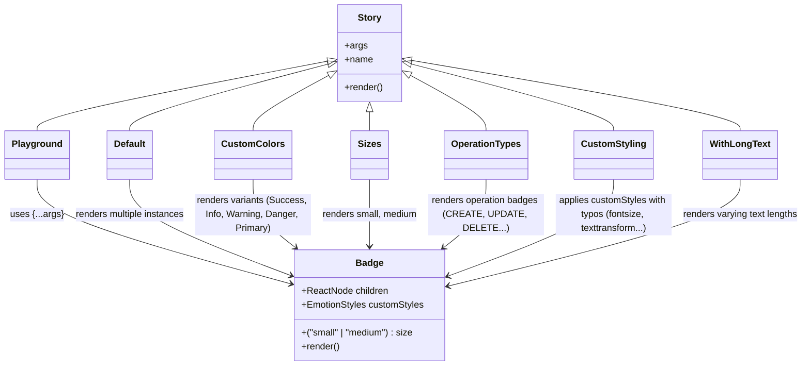
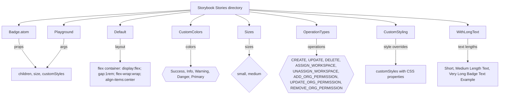

# Diagram: web/portal/src/components/atoms/Badge.atom.stories.tsx

> Auto-generated by Obscura crawlers

## Diagram 1

### SVG

<svg id="container" width="1394.1171875" xmlns="http://www.w3.org/2000/svg" class="classDiagram" height="632" viewBox="0 0 1394.1171875 632" role="graphics-document document" aria-roledescription="class"><g><defs><marker id="container_class-aggregationStart" class="marker aggregation class" refX="18" refY="7" markerWidth="190" markerHeight="240" orient="auto"><path d="M 18,7 L9,13 L1,7 L9,1 Z"></path></marker></defs><defs><marker id="container_class-aggregationEnd" class="marker aggregation class" refX="1" refY="7" markerWidth="20" markerHeight="28" orient="auto"><path d="M 18,7 L9,13 L1,7 L9,1 Z"></path></marker></defs><defs><marker id="container_class-extensionStart" class="marker extension class" refX="18" refY="7" markerWidth="190" markerHeight="240" orient="auto"><path d="M 1,7 L18,13 V 1 Z"></path></marker></defs><defs><marker id="container_class-extensionEnd" class="marker extension class" refX="1" refY="7" markerWidth="20" markerHeight="28" orient="auto"><path d="M 1,1 V 13 L18,7 Z"></path></marker></defs><defs><marker id="container_class-compositionStart" class="marker composition class" refX="18" refY="7" markerWidth="190" markerHeight="240" orient="auto"><path d="M 18,7 L9,13 L1,7 L9,1 Z"></path></marker></defs><defs><marker id="container_class-compositionEnd" class="marker composition class" refX="1" refY="7" markerWidth="20" markerHeight="28" orient="auto"><path d="M 18,7 L9,13 L1,7 L9,1 Z"></path></marker></defs><defs><marker id="container_class-dependencyStart" class="marker dependency class" refX="6" refY="7" markerWidth="190" markerHeight="240" orient="auto"><path d="M 5,7 L9,13 L1,7 L9,1 Z"></path></marker></defs><defs><marker id="container_class-dependencyEnd" class="marker dependency class" refX="13" refY="7" markerWidth="20" markerHeight="28" orient="auto"><path d="M 18,7 L9,13 L14,7 L9,1 Z"></path></marker></defs><defs><marker id="container_class-lollipopStart" class="marker lollipop class" refX="13" refY="7" markerWidth="190" markerHeight="240" orient="auto"><circle stroke="black" fill="transparent" cx="7" cy="7" r="6"></circle></marker></defs><defs><marker id="container_class-lollipopEnd" class="marker lollipop class" refX="1" refY="7" markerWidth="190" markerHeight="240" orient="auto"><circle stroke="black" fill="transparent" cx="7" cy="7" r="6"></circle></marker></defs><g class="root"><g class="clusters"></g><g class="edgePaths"><path d="M570.827,105.505L485.935,121.421C401.043,137.337,231.26,169.168,146.368,189.251C61.477,209.333,61.477,217.667,61.477,221.833L61.477,226" id="id_Story_Playground_1" class="edge-thickness-normal edge-pattern-solid relation" style=";;;" data-edge="true" data-et="edge" data-id="id_Story_Playground_1" data-points="W3sieCI6NTg3Ljc4MTI1LCJ5IjoxMDIuMzI2MjY5NTM1MTg2ODV9LHsieCI6NjEuNDc2NTYyNSwieSI6MjAxfSx7IngiOjYxLjQ3NjU2MjUsInkiOjIyNn1d" marker-start="url(#container_class-extensionStart)"></path><path d="M571.084,110.628L513.051,125.69C455.017,140.752,338.95,170.876,280.916,190.105C222.883,209.333,222.883,217.667,222.883,221.833L222.883,226" id="id_Story_Default_2" class="edge-thickness-normal edge-pattern-solid relation" style=";;;" data-edge="true" data-et="edge" data-id="id_Story_Default_2" data-points="W3sieCI6NTg3Ljc4MTI1LCJ5IjoxMDYuMjk0ODgyNTI2OTI2NzN9LHsieCI6MjIyLjg4MjgxMjUsInkiOjIwMX0seyJ4IjoyMjIuODgyODEyNSwieSI6MjI2fV0=" marker-start="url(#container_class-extensionStart)"></path><path d="M572.579,129.689L550.416,141.574C528.253,153.459,483.927,177.23,461.765,193.281C439.602,209.333,439.602,217.667,439.602,221.833L439.602,226" id="id_Story_CustomColors_3" class="edge-thickness-normal edge-pattern-solid relation" style=";;;" data-edge="true" data-et="edge" data-id="id_Story_CustomColors_3" data-points="W3sieCI6NTg3Ljc4MTI1LCJ5IjoxMjEuNTM2NDU2OTMyMDA1OTl9LHsieCI6NDM5LjYwMTU2MjUsInkiOjIwMX0seyJ4Ijo0MzkuNjAxNTYyNSwieSI6MjI2fV0=" marker-start="url(#container_class-extensionStart)"></path><path d="M642.859,193.25L642.859,194.542C642.859,195.833,642.859,198.417,642.859,203.875C642.859,209.333,642.859,217.667,642.859,221.833L642.859,226" id="id_Story_Sizes_4" class="edge-thickness-normal edge-pattern-solid relation" style=";;;" data-edge="true" data-et="edge" data-id="id_Story_Sizes_4" data-points="W3sieCI6NjQyLjg1OTM3NSwieSI6MTc2fSx7IngiOjY0Mi44NTkzNzUsInkiOjIwMX0seyJ4Ijo2NDIuODU5Mzc1LCJ5IjoyMjZ9XQ==" marker-start="url(#container_class-extensionStart)"></path><path d="M713.14,129.689L735.302,141.574C757.465,153.459,801.791,177.23,823.954,193.281C846.117,209.333,846.117,217.667,846.117,221.833L846.117,226" id="id_Story_OperationTypes_5" class="edge-thickness-normal edge-pattern-solid relation" style=";;;" data-edge="true" data-et="edge" data-id="id_Story_OperationTypes_5" data-points="W3sieCI6Njk3LjkzNzUsInkiOjEyMS41MzY0NTY5MzIwMDU5OX0seyJ4Ijo4NDYuMTE3MTg3NSwieSI6MjAxfSx7IngiOjg0Ni4xMTcxODc1LCJ5IjoyMjZ9XQ==" marker-start="url(#container_class-extensionStart)"></path><path d="M714.642,110.486L773.222,125.572C831.801,140.657,948.959,170.829,1007.538,190.081C1066.117,209.333,1066.117,217.667,1066.117,221.833L1066.117,226" id="id_Story_CustomStyling_6" class="edge-thickness-normal edge-pattern-solid relation" style=";;;" data-edge="true" data-et="edge" data-id="id_Story_CustomStyling_6" data-points="W3sieCI6Njk3LjkzNzUsInkiOjEwNi4xODQwNjMzNDc5MTUxN30seyJ4IjoxMDY2LjExNzE4NzUsInkiOjIwMX0seyJ4IjoxMDY2LjExNzE4NzUsInkiOjIyNn1d" marker-start="url(#container_class-extensionStart)"></path><path d="M714.945,104.215L810.14,120.346C905.336,136.477,1095.726,168.738,1190.922,189.036C1286.117,209.333,1286.117,217.667,1286.117,221.833L1286.117,226" id="id_Story_WithLongText_7" class="edge-thickness-normal edge-pattern-solid relation" style=";;;" data-edge="true" data-et="edge" data-id="id_Story_WithLongText_7" data-points="W3sieCI6Njk3LjkzNzUsInkiOjEwMS4zMzI5ODUxNzA3MDA5fSx7IngiOjEyODYuMTE3MTg3NSwieSI6MjAxfSx7IngiOjEyODYuMTE3MTg3NSwieSI6MjI2fV0=" marker-start="url(#container_class-extensionStart)"></path><path d="M61.477,310L61.477,320.167C61.477,330.333,61.477,350.667,135.866,380.922C210.255,411.177,359.034,451.354,433.424,471.443L507.813,491.531" id="id_Playground_Badge_8" class="edge-thickness-normal edge-pattern-solid relation" style=";;;" data-edge="true" data-et="edge" data-id="id_Playground_Badge_8" data-points="W3sieCI6NjEuNDc2NTYyNSwieSI6MzEwfSx7IngiOjYxLjQ3NjU2MjUsInkiOjM3MX0seyJ4Ijo1MTMuNjA1NDY4NzUsInkiOjQ5My4wOTU1MjI1Mjg0NTQ1fV0=" marker-end="url(#container_class-dependencyEnd)"></path><path d="M222.883,310L222.883,320.167C222.883,330.333,222.883,350.667,270.4,378.597C317.917,406.527,412.951,442.053,460.468,459.817L507.985,477.58" id="id_Default_Badge_9" class="edge-thickness-normal edge-pattern-solid relation" style=";;;" data-edge="true" data-et="edge" data-id="id_Default_Badge_9" data-points="W3sieCI6MjIyLjg4MjgxMjUsInkiOjMxMH0seyJ4IjoyMjIuODgyODEyNSwieSI6MzcxfSx7IngiOjUxMy42MDU0Njg3NSwieSI6NDc5LjY4MDk2MjQ3OTMwNTA0fV0=" marker-end="url(#container_class-dependencyEnd)"></path><path d="M439.602,310L439.602,320.167C439.602,330.333,439.602,350.667,451.972,370.389C464.343,390.111,489.084,409.221,501.455,418.777L513.826,428.332" id="id_CustomColors_Badge_10" class="edge-thickness-normal edge-pattern-solid relation" style=";;;" data-edge="true" data-et="edge" data-id="id_CustomColors_Badge_10" data-points="W3sieCI6NDM5LjYwMTU2MjUsInkiOjMxMH0seyJ4Ijo0MzkuNjAxNTYyNSwieSI6MzcxfSx7IngiOjUxOC41NzQzNDMxNTI4NjYzLCJ5Ijo0MzJ9XQ==" marker-end="url(#container_class-dependencyEnd)"></path><path d="M642.859,310L642.859,320.167C642.859,330.333,642.859,350.667,642.859,370C642.859,389.333,642.859,407.667,642.859,416.833L642.859,426" id="id_Sizes_Badge_11" class="edge-thickness-normal edge-pattern-solid relation" style=";;;" data-edge="true" data-et="edge" data-id="id_Sizes_Badge_11" data-points="W3sieCI6NjQyLjg1OTM3NSwieSI6MzEwfSx7IngiOjY0Mi44NTkzNzUsInkiOjM3MX0seyJ4Ijo2NDIuODU5Mzc1LCJ5Ijo0MzJ9XQ==" marker-end="url(#container_class-dependencyEnd)"></path><path d="M846.117,310L846.117,320.167C846.117,330.333,846.117,350.667,833.746,370.389C821.376,390.111,796.634,409.221,784.264,418.777L771.893,428.332" id="id_OperationTypes_Badge_12" class="edge-thickness-normal edge-pattern-solid relation" style=";;;" data-edge="true" data-et="edge" data-id="id_OperationTypes_Badge_12" data-points="W3sieCI6ODQ2LjExNzE4NzUsInkiOjMxMH0seyJ4Ijo4NDYuMTE3MTg3NSwieSI6MzcxfSx7IngiOjc2Ny4xNDQ0MDY4NDcxMzM3LCJ5Ijo0MzJ9XQ==" marker-end="url(#container_class-dependencyEnd)"></path><path d="M1066.117,310L1066.117,320.167C1066.117,330.333,1066.117,350.667,1018.054,378.661C969.991,406.656,873.865,442.313,825.802,460.141L777.739,477.969" id="id_CustomStyling_Badge_13" class="edge-thickness-normal edge-pattern-solid relation" style=";;;" data-edge="true" data-et="edge" data-id="id_CustomStyling_Badge_13" data-points="W3sieCI6MTA2Ni4xMTcxODc1LCJ5IjozMTB9LHsieCI6MTA2Ni4xMTcxODc1LCJ5IjozNzF9LHsieCI6NzcyLjExMzI4MTI1LCJ5Ijo0ODAuMDU1NTQ5NDAyODgzMX1d" marker-end="url(#container_class-dependencyEnd)"></path><path d="M1286.117,310L1286.117,320.167C1286.117,330.333,1286.117,350.667,1201.421,381.505C1116.726,412.343,947.334,453.687,862.638,474.359L777.942,495.03" id="id_WithLongText_Badge_14" class="edge-thickness-normal edge-pattern-solid relation" style=";;;" data-edge="true" data-et="edge" data-id="id_WithLongText_Badge_14" data-points="W3sieCI6MTI4Ni4xMTcxODc1LCJ5IjozMTB9LHsieCI6MTI4Ni4xMTcxODc1LCJ5IjozNzF9LHsieCI6NzcyLjExMzI4MTI1LCJ5Ijo0OTYuNDUyOTg1ODk5NDEzMzZ9XQ==" marker-end="url(#container_class-dependencyEnd)"></path></g><g class="edgeLabels"><g class="edgeLabel"><g class="label" data-id="id_Story_Playground_1" transform="translate(0, 0)"><foreignObject width="0" height="0">

</foreignObject></g></g><g class="edgeLabel"><g class="label" data-id="id_Story_Default_2" transform="translate(0, 0)"><foreignObject width="0" height="0">

</foreignObject></g></g><g class="edgeLabel"><g class="label" data-id="id_Story_CustomColors_3" transform="translate(0, 0)"><foreignObject width="0" height="0">

</foreignObject></g></g><g class="edgeLabel"><g class="label" data-id="id_Story_Sizes_4" transform="translate(0, 0)"><foreignObject width="0" height="0">

</foreignObject></g></g><g class="edgeLabel"><g class="label" data-id="id_Story_OperationTypes_5" transform="translate(0, 0)"><foreignObject width="0" height="0">

</foreignObject></g></g><g class="edgeLabel"><g class="label" data-id="id_Story_CustomStyling_6" transform="translate(0, 0)"><foreignObject width="0" height="0">

</foreignObject></g></g><g class="edgeLabel"><g class="label" data-id="id_Story_WithLongText_7" transform="translate(0, 0)"><foreignObject width="0" height="0">

</foreignObject></g></g><g class="edgeLabel" transform="translate(61.4765625, 371)"><g class="label" data-id="id_Playground_Badge_8" transform="translate(-44.6875, -12)"><foreignObject width="89.375" height="24">

uses {...args}

</foreignObject></g></g><g class="edgeLabel" transform="translate(222.8828125, 371)"><g class="label" data-id="id_Default_Badge_9" transform="translate(-96.71875, -12)"><foreignObject width="193.4375" height="24">

renders multiple instances

</foreignObject></g></g><g class="edgeLabel" transform="translate(439.6015625, 371)"><g class="label" data-id="id_CustomColors_Badge_10" transform="translate(-100, -36)"><foreignObject width="200" height="72">

renders variants (Success, Info, Warning, Danger, Primary)

</foreignObject></g></g><g class="edgeLabel" transform="translate(642.859375, 371)"><g class="label" data-id="id_Sizes_Badge_11" transform="translate(-83.2578125, -12)"><foreignObject width="166.515625" height="24">

renders small, medium

</foreignObject></g></g><g class="edgeLabel" transform="translate(846.1171875, 371)"><g class="label" data-id="id_OperationTypes_Badge_12" transform="translate(-100, -24)"><foreignObject width="200" height="48">

renders operation badges (CREATE, UPDATE, DELETE...)

</foreignObject></g></g><g class="edgeLabel" transform="translate(1066.1171875, 371)"><g class="label" data-id="id_CustomStyling_Badge_13" transform="translate(-100, -36)"><foreignObject width="200" height="72">

applies customStyles with typos (fontsize, texttransform...)

</foreignObject></g></g><g class="edgeLabel" transform="translate(1286.1171875, 371)"><g class="label" data-id="id_WithLongText_Badge_14" transform="translate(-100, -24)"><foreignObject width="200" height="48">

renders varying text lengths

</foreignObject></g></g></g><g class="nodes"><g class="node default" id="classId-Badge-0" transform="translate(642.859375, 528)"><g class="basic label-container"><path d="M-129.25390625 -96 L129.25390625 -96 L129.25390625 96 L-129.25390625 96" stroke="none" stroke-width="0" fill="#ECECFF" style=""></path><path d="M-129.25390625 -96 C-27.169888175686665 -96, 74.91412989862667 -96, 129.25390625 -96 M-129.25390625 -96 C-41.71730960818421 -96, 45.81928703363158 -96, 129.25390625 -96 M129.25390625 -96 C129.25390625 -52.595903922426395, 129.25390625 -9.19180784485279, 129.25390625 96 M129.25390625 -96 C129.25390625 -52.15035339871113, 129.25390625 -8.300706797422265, 129.25390625 96 M129.25390625 96 C69.03783383805995 96, 8.821761426119906 96, -129.25390625 96 M129.25390625 96 C47.420591432694934 96, -34.41272338461013 96, -129.25390625 96 M-129.25390625 96 C-129.25390625 48.305000444790934, -129.25390625 0.6100008895818689, -129.25390625 -96 M-129.25390625 96 C-129.25390625 32.979687832474454, -129.25390625 -30.040624335051092, -129.25390625 -96" stroke="#9370DB" stroke-width="1.3" fill="none" stroke-dasharray="0 0" style=""></path></g><g class="annotation-group text" transform="translate(0, -72)"></g><g class="label-group text" transform="translate(-22.7734375, -72)"><g class="label" style="font-weight: bolder" transform="translate(0,-12)"><foreignObject width="45.546875" height="24">

Badge

</foreignObject></g></g><g class="members-group text" transform="translate(-117.25390625, -24)"><g class="label" style="" transform="translate(0,-12)"><foreignObject width="150.421875" height="24">

+ReactNode children

</foreignObject></g><g class="label" style="" transform="translate(0,12)"><foreignObject width="211.734375" height="24">

+EmotionStyles customStyles

</foreignObject></g></g><g class="methods-group text" transform="translate(-117.25390625, 48)"><g class="label" style="" transform="translate(0,-12)"><foreignObject width="196.8125" height="24">

+("small" | "medium") : size

</foreignObject></g><g class="label" style="" transform="translate(0,12)"><foreignObject width="66.609375" height="24">

+render()

</foreignObject></g></g><g class="divider" style=""><path d="M-129.25390625 -48 C-42.303800061083095 -48, 44.64630612783381 -48, 129.25390625 -48 M-129.25390625 -48 C-37.033832213465985 -48, 55.18624182306803 -48, 129.25390625 -48" stroke="#9370DB" stroke-width="1.3" fill="none" stroke-dasharray="0 0" style=""></path></g><g class="divider" style=""><path d="M-129.25390625 24 C-69.77625277106338 24, -10.29859929212678 24, 129.25390625 24 M-129.25390625 24 C-71.68857092612728 24, -14.123235602254582 24, 129.25390625 24" stroke="#9370DB" stroke-width="1.3" fill="none" stroke-dasharray="0 0" style=""></path></g></g><g class="node default" id="classId-Story-1" transform="translate(642.859375, 92)"><g class="basic label-container"><path d="M-55.078125 -84 L55.078125 -84 L55.078125 84 L-55.078125 84" stroke="none" stroke-width="0" fill="#ECECFF" style=""></path><path d="M-55.078125 -84 C-16.316828909493665 -84, 22.44446718101267 -84, 55.078125 -84 M-55.078125 -84 C-15.049366429061251 -84, 24.979392141877497 -84, 55.078125 -84 M55.078125 -84 C55.078125 -41.243352646579694, 55.078125 1.513294706840611, 55.078125 84 M55.078125 -84 C55.078125 -22.100642053621783, 55.078125 39.798715892756434, 55.078125 84 M55.078125 84 C21.296465632531152 84, -12.485193734937695 84, -55.078125 84 M55.078125 84 C14.488359345124266 84, -26.101406309751468 84, -55.078125 84 M-55.078125 84 C-55.078125 48.56383216433479, -55.078125 13.127664328669582, -55.078125 -84 M-55.078125 84 C-55.078125 34.13384832235427, -55.078125 -15.732303355291464, -55.078125 -84" stroke="#9370DB" stroke-width="1.3" fill="none" stroke-dasharray="0 0" style=""></path></g><g class="annotation-group text" transform="translate(0, -60)"></g><g class="label-group text" transform="translate(-19.546875, -60)"><g class="label" style="font-weight: bolder" transform="translate(0,-12)"><foreignObject width="39.09375" height="24">

Story

</foreignObject></g></g><g class="members-group text" transform="translate(-43.078125, -12)"><g class="label" style="" transform="translate(0,-12)"><foreignObject width="38.078125" height="24">

+args

</foreignObject></g><g class="label" style="" transform="translate(0,12)"><foreignObject width="48.5" height="24">

+name

</foreignObject></g></g><g class="methods-group text" transform="translate(-43.078125, 60)"><g class="label" style="" transform="translate(0,-12)"><foreignObject width="66.609375" height="24">

+render()

</foreignObject></g></g><g class="divider" style=""><path d="M-55.078125 -36 C-16.518840264966087 -36, 22.040444470067825 -36, 55.078125 -36 M-55.078125 -36 C-24.811350384560754 -36, 5.455424230878492 -36, 55.078125 -36" stroke="#9370DB" stroke-width="1.3" fill="none" stroke-dasharray="0 0" style=""></path></g><g class="divider" style=""><path d="M-55.078125 36 C-14.709329112592293 36, 25.659466774815414 36, 55.078125 36 M-55.078125 36 C-22.704940984150042 36, 9.668243031699916 36, 55.078125 36" stroke="#9370DB" stroke-width="1.3" fill="none" stroke-dasharray="0 0" style=""></path></g></g><g class="node default" id="classId-Playground-2" transform="translate(61.4765625, 268)"><g class="basic label-container"><path d="M-53.4765625 -42 L53.4765625 -42 L53.4765625 42 L-53.4765625 42" stroke="none" stroke-width="0" fill="#ECECFF" style=""></path><path d="M-53.4765625 -42 C-22.400263277793233 -42, 8.676035944413535 -42, 53.4765625 -42 M-53.4765625 -42 C-28.975359929481684 -42, -4.474157358963367 -42, 53.4765625 -42 M53.4765625 -42 C53.4765625 -8.61264085239916, 53.4765625 24.77471829520168, 53.4765625 42 M53.4765625 -42 C53.4765625 -11.220082887440206, 53.4765625 19.559834225119587, 53.4765625 42 M53.4765625 42 C22.82189852165201 42, -7.832765456695981 42, -53.4765625 42 M53.4765625 42 C24.585139570316443 42, -4.306283359367114 42, -53.4765625 42 M-53.4765625 42 C-53.4765625 12.923438621148673, -53.4765625 -16.153122757702654, -53.4765625 -42 M-53.4765625 42 C-53.4765625 15.448503256505763, -53.4765625 -11.102993486988474, -53.4765625 -42" stroke="#9370DB" stroke-width="1.3" fill="none" stroke-dasharray="0 0" style=""></path></g><g class="annotation-group text" transform="translate(0, -18)"></g><g class="label-group text" transform="translate(-41.4765625, -18)"><g class="label" style="font-weight: bolder" transform="translate(0,-12)"><foreignObject width="82.953125" height="24">

Playground

</foreignObject></g></g><g class="members-group text" transform="translate(-41.4765625, 30)"></g><g class="methods-group text" transform="translate(-41.4765625, 60)"></g><g class="divider" style=""><path d="M-53.4765625 6 C-15.43871205555142 6, 22.59913838889716 6, 53.4765625 6 M-53.4765625 6 C-31.971900649997295 6, -10.46723879999459 6, 53.4765625 6" stroke="#9370DB" stroke-width="1.3" fill="none" stroke-dasharray="0 0" style=""></path></g><g class="divider" style=""><path d="M-53.4765625 24 C-27.30445420074647 24, -1.1323459014929398 24, 53.4765625 24 M-53.4765625 24 C-19.89901779667464 24, 13.678526906650717 24, 53.4765625 24" stroke="#9370DB" stroke-width="1.3" fill="none" stroke-dasharray="0 0" style=""></path></g></g><g class="node default" id="classId-Default-3" transform="translate(222.8828125, 268)"><g class="basic label-container"><path d="M-38.7109375 -42 L38.7109375 -42 L38.7109375 42 L-38.7109375 42" stroke="none" stroke-width="0" fill="#ECECFF" style=""></path><path d="M-38.7109375 -42 C-15.365605513761523 -42, 7.979726472476955 -42, 38.7109375 -42 M-38.7109375 -42 C-22.750709006854805 -42, -6.790480513709607 -42, 38.7109375 -42 M38.7109375 -42 C38.7109375 -16.053207148938288, 38.7109375 9.893585702123424, 38.7109375 42 M38.7109375 -42 C38.7109375 -21.056828947326068, 38.7109375 -0.11365789465213538, 38.7109375 42 M38.7109375 42 C14.636615486630586 42, -9.437706526738829 42, -38.7109375 42 M38.7109375 42 C15.989602959477846 42, -6.731731581044308 42, -38.7109375 42 M-38.7109375 42 C-38.7109375 10.691969598074074, -38.7109375 -20.616060803851852, -38.7109375 -42 M-38.7109375 42 C-38.7109375 9.29279435112339, -38.7109375 -23.41441129775322, -38.7109375 -42" stroke="#9370DB" stroke-width="1.3" fill="none" stroke-dasharray="0 0" style=""></path></g><g class="annotation-group text" transform="translate(0, -18)"></g><g class="label-group text" transform="translate(-26.7109375, -18)"><g class="label" style="font-weight: bolder" transform="translate(0,-12)"><foreignObject width="53.421875" height="24">

Default

</foreignObject></g></g><g class="members-group text" transform="translate(-26.7109375, 30)"></g><g class="methods-group text" transform="translate(-26.7109375, 60)"></g><g class="divider" style=""><path d="M-38.7109375 6 C-21.45948577731082 6, -4.208034054621642 6, 38.7109375 6 M-38.7109375 6 C-11.224537370298034 6, 16.261862759403932 6, 38.7109375 6" stroke="#9370DB" stroke-width="1.3" fill="none" stroke-dasharray="0 0" style=""></path></g><g class="divider" style=""><path d="M-38.7109375 24 C-21.989545321553425 24, -5.268153143106851 24, 38.7109375 24 M-38.7109375 24 C-12.063815243429215 24, 14.583307013141571 24, 38.7109375 24" stroke="#9370DB" stroke-width="1.3" fill="none" stroke-dasharray="0 0" style=""></path></g></g><g class="node default" id="classId-CustomColors-4" transform="translate(439.6015625, 268)"><g class="basic label-container"><path d="M-62.390625 -42 L62.390625 -42 L62.390625 42 L-62.390625 42" stroke="none" stroke-width="0" fill="#ECECFF" style=""></path><path d="M-62.390625 -42 C-36.60376679315134 -42, -10.816908586302674 -42, 62.390625 -42 M-62.390625 -42 C-23.388359418891255 -42, 15.61390616221749 -42, 62.390625 -42 M62.390625 -42 C62.390625 -14.359554800399195, 62.390625 13.28089039920161, 62.390625 42 M62.390625 -42 C62.390625 -16.21521852780487, 62.390625 9.569562944390263, 62.390625 42 M62.390625 42 C19.8880825774773 42, -22.614459845045403 42, -62.390625 42 M62.390625 42 C18.833287372301662 42, -24.724050255396676 42, -62.390625 42 M-62.390625 42 C-62.390625 12.539931737659263, -62.390625 -16.920136524681475, -62.390625 -42 M-62.390625 42 C-62.390625 10.107703450318098, -62.390625 -21.784593099363804, -62.390625 -42" stroke="#9370DB" stroke-width="1.3" fill="none" stroke-dasharray="0 0" style=""></path></g><g class="annotation-group text" transform="translate(0, -18)"></g><g class="label-group text" transform="translate(-50.390625, -18)"><g class="label" style="font-weight: bolder" transform="translate(0,-12)"><foreignObject width="100.78125" height="24">

CustomColors

</foreignObject></g></g><g class="members-group text" transform="translate(-50.390625, 30)"></g><g class="methods-group text" transform="translate(-50.390625, 60)"></g><g class="divider" style=""><path d="M-62.390625 6 C-19.89734889595158 6, 22.59592720809684 6, 62.390625 6 M-62.390625 6 C-27.491271082009305 6, 7.408082835981389 6, 62.390625 6" stroke="#9370DB" stroke-width="1.3" fill="none" stroke-dasharray="0 0" style=""></path></g><g class="divider" style=""><path d="M-62.390625 24 C-27.69767382465409 24, 6.995277350691822 24, 62.390625 24 M-62.390625 24 C-36.53945623430863 24, -10.688287468617268 24, 62.390625 24" stroke="#9370DB" stroke-width="1.3" fill="none" stroke-dasharray="0 0" style=""></path></g></g><g class="node default" id="classId-Sizes-5" transform="translate(642.859375, 268)"><g class="basic label-container"><path d="M-30.71875 -42 L30.71875 -42 L30.71875 42 L-30.71875 42" stroke="none" stroke-width="0" fill="#ECECFF" style=""></path><path d="M-30.71875 -42 C-8.698361029330993 -42, 13.322027941338014 -42, 30.71875 -42 M-30.71875 -42 C-11.789568187899395 -42, 7.1396136242012105 -42, 30.71875 -42 M30.71875 -42 C30.71875 -21.952349206483255, 30.71875 -1.9046984129665105, 30.71875 42 M30.71875 -42 C30.71875 -22.41620836982936, 30.71875 -2.8324167396587185, 30.71875 42 M30.71875 42 C9.959987541784763 42, -10.798774916430474 42, -30.71875 42 M30.71875 42 C12.841902281730611 42, -5.034945436538777 42, -30.71875 42 M-30.71875 42 C-30.71875 10.254089151236805, -30.71875 -21.49182169752639, -30.71875 -42 M-30.71875 42 C-30.71875 16.828411653934456, -30.71875 -8.343176692131088, -30.71875 -42" stroke="#9370DB" stroke-width="1.3" fill="none" stroke-dasharray="0 0" style=""></path></g><g class="annotation-group text" transform="translate(0, -18)"></g><g class="label-group text" transform="translate(-18.71875, -18)"><g class="label" style="font-weight: bolder" transform="translate(0,-12)"><foreignObject width="37.4375" height="24">

Sizes

</foreignObject></g></g><g class="members-group text" transform="translate(-18.71875, 30)"></g><g class="methods-group text" transform="translate(-18.71875, 60)"></g><g class="divider" style=""><path d="M-30.71875 6 C-16.062461436888462 6, -1.4061728737769208 6, 30.71875 6 M-30.71875 6 C-10.35914512209029 6, 10.00045975581942 6, 30.71875 6" stroke="#9370DB" stroke-width="1.3" fill="none" stroke-dasharray="0 0" style=""></path></g><g class="divider" style=""><path d="M-30.71875 24 C-18.250342268809547 24, -5.78193453761909 24, 30.71875 24 M-30.71875 24 C-17.112355463191307 24, -3.5059609263826133 24, 30.71875 24" stroke="#9370DB" stroke-width="1.3" fill="none" stroke-dasharray="0 0" style=""></path></g></g><g class="node default" id="classId-OperationTypes-6" transform="translate(846.1171875, 268)"><g class="basic label-container"><path d="M-69.8671875 -42 L69.8671875 -42 L69.8671875 42 L-69.8671875 42" stroke="none" stroke-width="0" fill="#ECECFF" style=""></path><path d="M-69.8671875 -42 C-14.318905997463624 -42, 41.22937550507275 -42, 69.8671875 -42 M-69.8671875 -42 C-18.540282034789854 -42, 32.78662343042029 -42, 69.8671875 -42 M69.8671875 -42 C69.8671875 -19.774268654472724, 69.8671875 2.4514626910545516, 69.8671875 42 M69.8671875 -42 C69.8671875 -21.26792879605721, 69.8671875 -0.535857592114418, 69.8671875 42 M69.8671875 42 C33.79693441212664 42, -2.2733186757467223 42, -69.8671875 42 M69.8671875 42 C39.57578822981824 42, 9.284388959636473 42, -69.8671875 42 M-69.8671875 42 C-69.8671875 18.227130352282433, -69.8671875 -5.545739295435133, -69.8671875 -42 M-69.8671875 42 C-69.8671875 16.035639998402353, -69.8671875 -9.928720003195295, -69.8671875 -42" stroke="#9370DB" stroke-width="1.3" fill="none" stroke-dasharray="0 0" style=""></path></g><g class="annotation-group text" transform="translate(0, -18)"></g><g class="label-group text" transform="translate(-57.8671875, -18)"><g class="label" style="font-weight: bolder" transform="translate(0,-12)"><foreignObject width="115.734375" height="24">

OperationTypes

</foreignObject></g></g><g class="members-group text" transform="translate(-57.8671875, 30)"></g><g class="methods-group text" transform="translate(-57.8671875, 60)"></g><g class="divider" style=""><path d="M-69.8671875 6 C-20.57305401958505 6, 28.7210794608299 6, 69.8671875 6 M-69.8671875 6 C-16.040199890978563 6, 37.78678771804287 6, 69.8671875 6" stroke="#9370DB" stroke-width="1.3" fill="none" stroke-dasharray="0 0" style=""></path></g><g class="divider" style=""><path d="M-69.8671875 24 C-14.412443161194652 24, 41.042301177610696 24, 69.8671875 24 M-69.8671875 24 C-28.536020575557316 24, 12.795146348885368 24, 69.8671875 24" stroke="#9370DB" stroke-width="1.3" fill="none" stroke-dasharray="0 0" style=""></path></g></g><g class="node default" id="classId-CustomStyling-7" transform="translate(1066.1171875, 268)"><g class="basic label-container"><path d="M-64.71875 -42 L64.71875 -42 L64.71875 42 L-64.71875 42" stroke="none" stroke-width="0" fill="#ECECFF" style=""></path><path d="M-64.71875 -42 C-17.457704990583856 -42, 29.803340018832287 -42, 64.71875 -42 M-64.71875 -42 C-37.825039424131305 -42, -10.931328848262616 -42, 64.71875 -42 M64.71875 -42 C64.71875 -25.05559349532085, 64.71875 -8.111186990641698, 64.71875 42 M64.71875 -42 C64.71875 -20.46853110905357, 64.71875 1.0629377818928631, 64.71875 42 M64.71875 42 C14.98823459177489 42, -34.74228081645022 42, -64.71875 42 M64.71875 42 C32.904875977865956 42, 1.0910019557319188 42, -64.71875 42 M-64.71875 42 C-64.71875 13.48056806694354, -64.71875 -15.03886386611292, -64.71875 -42 M-64.71875 42 C-64.71875 13.194715460213331, -64.71875 -15.610569079573338, -64.71875 -42" stroke="#9370DB" stroke-width="1.3" fill="none" stroke-dasharray="0 0" style=""></path></g><g class="annotation-group text" transform="translate(0, -18)"></g><g class="label-group text" transform="translate(-52.71875, -18)"><g class="label" style="font-weight: bolder" transform="translate(0,-12)"><foreignObject width="105.4375" height="24">

CustomStyling

</foreignObject></g></g><g class="members-group text" transform="translate(-52.71875, 30)"></g><g class="methods-group text" transform="translate(-52.71875, 60)"></g><g class="divider" style=""><path d="M-64.71875 6 C-23.558066163916337 6, 17.602617672167327 6, 64.71875 6 M-64.71875 6 C-31.606850097838674 6, 1.5050498043226526 6, 64.71875 6" stroke="#9370DB" stroke-width="1.3" fill="none" stroke-dasharray="0 0" style=""></path></g><g class="divider" style=""><path d="M-64.71875 24 C-32.51432710762973 24, -0.3099042152594649 24, 64.71875 24 M-64.71875 24 C-21.105312975328644 24, 22.50812404934271 24, 64.71875 24" stroke="#9370DB" stroke-width="1.3" fill="none" stroke-dasharray="0 0" style=""></path></g></g><g class="node default" id="classId-WithLongText-8" transform="translate(1286.1171875, 268)"><g class="basic label-container"><path d="M-61.71875 -42 L61.71875 -42 L61.71875 42 L-61.71875 42" stroke="none" stroke-width="0" fill="#ECECFF" style=""></path><path d="M-61.71875 -42 C-23.98122959987535 -42, 13.756290800249303 -42, 61.71875 -42 M-61.71875 -42 C-19.045507975114347 -42, 23.627734049771306 -42, 61.71875 -42 M61.71875 -42 C61.71875 -20.351159078237636, 61.71875 1.2976818435247282, 61.71875 42 M61.71875 -42 C61.71875 -17.128812310049078, 61.71875 7.742375379901844, 61.71875 42 M61.71875 42 C13.40216712670906 42, -34.91441574658188 42, -61.71875 42 M61.71875 42 C23.2624796964977 42, -15.193790607004601 42, -61.71875 42 M-61.71875 42 C-61.71875 25.063702100008857, -61.71875 8.127404200017715, -61.71875 -42 M-61.71875 42 C-61.71875 10.82075097954247, -61.71875 -20.35849804091506, -61.71875 -42" stroke="#9370DB" stroke-width="1.3" fill="none" stroke-dasharray="0 0" style=""></path></g><g class="annotation-group text" transform="translate(0, -18)"></g><g class="label-group text" transform="translate(-49.71875, -18)"><g class="label" style="font-weight: bolder" transform="translate(0,-12)"><foreignObject width="99.4375" height="24">

WithLongText

</foreignObject></g></g><g class="members-group text" transform="translate(-49.71875, 30)"></g><g class="methods-group text" transform="translate(-49.71875, 60)"></g><g class="divider" style=""><path d="M-61.71875 6 C-31.582068386753374 6, -1.4453867735067476 6, 61.71875 6 M-61.71875 6 C-32.90802234218691 6, -4.097294684373821 6, 61.71875 6" stroke="#9370DB" stroke-width="1.3" fill="none" stroke-dasharray="0 0" style=""></path></g><g class="divider" style=""><path d="M-61.71875 24 C-24.455938950333177 24, 12.806872099333646 24, 61.71875 24 M-61.71875 24 C-22.877416042555204 24, 15.963917914889592 24, 61.71875 24" stroke="#9370DB" stroke-width="1.3" fill="none" stroke-dasharray="0 0" style=""></path></g></g></g></g></g></svg>

## Diagram 2

### SVG

<svg id="container" width="2140.873779296875" xmlns="http://www.w3.org/2000/svg" class="flowchart" height="408.796875" viewBox="0 0 2140.873779296875 408.796875" role="graphics-document document" aria-roledescription="flowchart-v2"><g><marker id="container_flowchart-v2-pointEnd" class="marker flowchart-v2" viewBox="0 0 10 10" refX="5" refY="5" markerUnits="userSpaceOnUse" markerWidth="8" markerHeight="8" orient="auto"><path d="M 0 0 L 10 5 L 0 10 z" class="arrowMarkerPath" style="stroke-width: 1; stroke-dasharray: 1, 0;"></path></marker><marker id="container_flowchart-v2-pointStart" class="marker flowchart-v2" viewBox="0 0 10 10" refX="4.5" refY="5" markerUnits="userSpaceOnUse" markerWidth="8" markerHeight="8" orient="auto"><path d="M 0 5 L 10 10 L 10 0 z" class="arrowMarkerPath" style="stroke-width: 1; stroke-dasharray: 1, 0;"></path></marker><marker id="container_flowchart-v2-circleEnd" class="marker flowchart-v2" viewBox="0 0 10 10" refX="11" refY="5" markerUnits="userSpaceOnUse" markerWidth="11" markerHeight="11" orient="auto"><circle cx="5" cy="5" r="5" class="arrowMarkerPath" style="stroke-width: 1; stroke-dasharray: 1, 0;"></circle></marker><marker id="container_flowchart-v2-circleStart" class="marker flowchart-v2" viewBox="0 0 10 10" refX="-1" refY="5" markerUnits="userSpaceOnUse" markerWidth="11" markerHeight="11" orient="auto"><circle cx="5" cy="5" r="5" class="arrowMarkerPath" style="stroke-width: 1; stroke-dasharray: 1, 0;"></circle></marker><marker id="container_flowchart-v2-crossEnd" class="marker cross flowchart-v2" viewBox="0 0 11 11" refX="12" refY="5.2" markerUnits="userSpaceOnUse" markerWidth="11" markerHeight="11" orient="auto"><path d="M 1,1 l 9,9 M 10,1 l -9,9" class="arrowMarkerPath" style="stroke-width: 2; stroke-dasharray: 1, 0;"></path></marker><marker id="container_flowchart-v2-crossStart" class="marker cross flowchart-v2" viewBox="0 0 11 11" refX="-1" refY="5.2" markerUnits="userSpaceOnUse" markerWidth="11" markerHeight="11" orient="auto"><path d="M 1,1 l 9,9 M 10,1 l -9,9" class="arrowMarkerPath" style="stroke-width: 2; stroke-dasharray: 1, 0;"></path></marker><g class="root"><g class="clusters"></g><g class="edgePaths"><path d="M841.883,42.539L715.049,49.949C588.216,57.359,334.549,72.18,207.716,83.09C80.883,94,80.883,101,80.883,104.5L80.883,108" id="L_A_B_0" class="edge-thickness-normal edge-pattern-solid edge-thickness-normal edge-pattern-solid flowchart-link" style=";" data-edge="true" data-et="edge" data-id="L_A_B_0" data-points="W3sieCI6ODQxLjg4MjgyMDEyOTM5NDUsInkiOjQyLjUzOTAyOTk5OTAxMzk2fSx7IngiOjgwLjg4MjgxMjUsInkiOjg3fSx7IngiOjgwLjg4MjgxMjUsInkiOjExMn1d" marker-end="url(#container_flowchart-v2-pointEnd)"></path><path d="M841.883,44.636L747.336,51.697C652.789,58.758,463.695,72.879,369.148,83.439C274.602,94,274.602,101,274.602,104.5L274.602,108" id="L_A_C_0" class="edge-thickness-normal edge-pattern-solid edge-thickness-normal edge-pattern-solid flowchart-link" style=";" data-edge="true" data-et="edge" data-id="L_A_C_0" data-points="W3sieCI6ODQxLjg4MjgyMDEyOTM5NDUsInkiOjQ0LjYzNjQxNDUyOTM4MzY5fSx7IngiOjI3NC42MDE1NjI1LCJ5Ijo4N30seyJ4IjoyNzQuNjAxNTYyNSwieSI6MTEyfV0=" marker-end="url(#container_flowchart-v2-pointEnd)"></path><path d="M841.883,49.812L787.887,56.01C733.892,62.208,625.901,74.604,571.906,84.302C517.91,94,517.91,101,517.91,104.5L517.91,108" id="L_A_D_0" class="edge-thickness-normal edge-pattern-solid edge-thickness-normal edge-pattern-solid flowchart-link" style=";" data-edge="true" data-et="edge" data-id="L_A_D_0" data-points="W3sieCI6ODQxLjg4MjgyMDEyOTM5NDUsInkiOjQ5LjgxMjA0NzU5MDA4OTA3fSx7IngiOjUxNy45MTAxNTYyNSwieSI6ODd9LHsieCI6NTE3LjkxMDE1NjI1LCJ5IjoxMTJ9XQ==" marker-end="url(#container_flowchart-v2-pointEnd)"></path><path d="M901.101,62L890.326,66.167C879.551,70.333,858.002,78.667,847.227,86.333C836.452,94,836.452,101,836.452,104.5L836.452,108" id="L_A_E_0" class="edge-thickness-normal edge-pattern-solid edge-thickness-normal edge-pattern-solid flowchart-link" style=";" data-edge="true" data-et="edge" data-id="L_A_E_0" data-points="W3sieCI6OTAxLjEwMDg5MjcyNzE5MTYsInkiOjYyfSx7IngiOjgzNi40NTE4MjgwMDI5Mjk3LCJ5Ijo4N30seyJ4Ijo4MzYuNDUxODI4MDAyOTI5NywieSI6MTEyfV0=" marker-end="url(#container_flowchart-v2-pointEnd)"></path><path d="M1040.743,62L1051.518,66.167C1062.293,70.333,1083.842,78.667,1094.617,86.333C1105.392,94,1105.392,101,1105.392,104.5L1105.392,108" id="L_A_F_0" class="edge-thickness-normal edge-pattern-solid edge-thickness-normal edge-pattern-solid flowchart-link" style=";" data-edge="true" data-et="edge" data-id="L_A_F_0" data-points="W3sieCI6MTA0MC43NDI4NzI1MzE1OTc0LCJ5Ijo2Mn0seyJ4IjoxMTA1LjM5MTkzNzI1NTg1OTQsInkiOjg3fSx7IngiOjExMDUuMzkxOTM3MjU1ODU5NCwieSI6MTEyfV0=" marker-end="url(#container_flowchart-v2-pointEnd)"></path><path d="M1099.961,51.633L1145.689,57.528C1191.418,63.422,1282.875,75.211,1328.604,84.606C1374.332,94,1374.332,101,1374.332,104.5L1374.332,108" id="L_A_G_0" class="edge-thickness-normal edge-pattern-solid edge-thickness-normal edge-pattern-solid flowchart-link" style=";" data-edge="true" data-et="edge" data-id="L_A_G_0" data-points="W3sieCI6MTA5OS45NjA5NDUxMjkzOTQ1LCJ5Ijo1MS42MzMyNzI2NjA5Mzg4NjR9LHsieCI6MTM3NC4zMzIwNDY1MDg3ODksInkiOjg3fSx7IngiOjEzNzQuMzMyMDQ2NTA4Nzg5LCJ5IjoxMTJ9XQ==" marker-end="url(#container_flowchart-v2-pointEnd)"></path><path d="M1099.961,44.294L1198.78,51.412C1297.599,58.53,1495.236,72.765,1594.055,83.382C1692.874,94,1692.874,101,1692.874,104.5L1692.874,108" id="L_A_H_0" class="edge-thickness-normal edge-pattern-solid edge-thickness-normal edge-pattern-solid flowchart-link" style=";" data-edge="true" data-et="edge" data-id="L_A_H_0" data-points="W3sieCI6MTA5OS45NjA5NDUxMjkzOTQ1LCJ5Ijo0NC4yOTQyOTIxMTAzOTEyNn0seyJ4IjoxNjkyLjg3MzcxODI2MTcxODgsInkiOjg3fSx7IngiOjE2OTIuODczNzE4MjYxNzE4OCwieSI6MTEyfV0=" marker-end="url(#container_flowchart-v2-pointEnd)"></path><path d="M1099.961,41.502L1250.446,49.085C1400.932,56.668,1701.903,71.834,1852.388,82.917C2002.874,94,2002.874,101,2002.874,104.5L2002.874,108" id="L_A_I_0" class="edge-thickness-normal edge-pattern-solid edge-thickness-normal edge-pattern-solid flowchart-link" style=";" data-edge="true" data-et="edge" data-id="L_A_I_0" data-points="W3sieCI6MTA5OS45NjA5NDUxMjkzOTQ1LCJ5Ijo0MS41MDIyNzE3MzIzNzA1OX0seyJ4IjoyMDAyLjg3MzcxODI2MTcxODgsInkiOjg3fSx7IngiOjIwMDIuODczNzE4MjYxNzE4OCwieSI6MTEyfV0=" marker-end="url(#container_flowchart-v2-pointEnd)"></path><path d="M80.883,166L80.883,172.167C80.883,178.333,80.883,190.667,92.889,211.386C104.895,232.104,128.908,261.209,140.914,275.761L152.92,290.313" id="L_B_P_0" class="edge-thickness-normal edge-pattern-solid edge-thickness-normal edge-pattern-solid flowchart-link" style=";" data-edge="true" data-et="edge" data-id="L_B_P_0" data-points="W3sieCI6ODAuODgyODEyNSwieSI6MTY2fSx7IngiOjgwLjg4MjgxMjUsInkiOjIwM30seyJ4IjoxNTUuNDY1ODg0ODQ0Nzc5NCwieSI6MjkzLjM5ODQzNzV9XQ==" marker-end="url(#container_flowchart-v2-pointEnd)"></path><path d="M274.602,166L274.602,172.167C274.602,178.333,274.602,190.667,262.595,211.386C250.589,232.104,226.577,261.209,214.57,275.761L202.564,290.313" id="L_C_P_0" class="edge-thickness-normal edge-pattern-solid edge-thickness-normal edge-pattern-solid flowchart-link" style=";" data-edge="true" data-et="edge" data-id="L_C_P_0" data-points="W3sieCI6Mjc0LjYwMTU2MjUsInkiOjE2Nn0seyJ4IjoyNzQuNjAxNTYyNSwieSI6MjAzfSx7IngiOjIwMC4wMTg0OTAxNTUyMjA2LCJ5IjoyOTMuMzk4NDM3NX1d" marker-end="url(#container_flowchart-v2-pointEnd)"></path><path d="M517.91,166L517.91,172.167C517.91,178.333,517.91,190.667,517.91,207.233C517.91,223.799,517.91,244.599,517.91,254.999L517.91,265.398" id="L_D_L_0" class="edge-thickness-normal edge-pattern-solid edge-thickness-normal edge-pattern-solid flowchart-link" style=";" data-edge="true" data-et="edge" data-id="L_D_L_0" data-points="W3sieCI6NTE3LjkxMDE1NjI1LCJ5IjoxNjZ9LHsieCI6NTE3LjkxMDE1NjI1LCJ5IjoyMDN9LHsieCI6NTE3LjkxMDE1NjI1LCJ5IjoyNjkuMzk4NDM3NX1d" marker-end="url(#container_flowchart-v2-pointEnd)"></path><path d="M836.452,166L836.452,172.167C836.452,178.333,836.452,190.667,836.531,210.566C836.611,230.466,836.77,257.932,836.849,271.665L836.929,285.399" id="L_E_Col_0" class="edge-thickness-normal edge-pattern-solid edge-thickness-normal edge-pattern-solid flowchart-link" style=";" data-edge="true" data-et="edge" data-id="L_E_Col_0" data-points="W3sieCI6ODM2LjQ1MTgyODAwMjkyOTcsInkiOjE2Nn0seyJ4Ijo4MzYuNDUxODI4MDAyOTI5NywieSI6MjAzfSx7IngiOjgzNi45NTE4MjgwMDI5Mjk3LCJ5IjoyODkuMzk4NDM3NDk5OTk5OX1d" marker-end="url(#container_flowchart-v2-pointEnd)"></path><path d="M1105.392,166L1105.392,172.167C1105.392,178.333,1105.392,190.667,1105.392,202.333C1105.392,214,1105.392,225,1105.392,230.5L1105.392,236" id="L_F_Sz_0" class="edge-thickness-normal edge-pattern-solid edge-thickness-normal edge-pattern-solid flowchart-link" style=";" data-edge="true" data-et="edge" data-id="L_F_Sz_0" data-points="W3sieCI6MTEwNS4zOTE5MzcyNTU4NTk0LCJ5IjoxNjZ9LHsieCI6MTEwNS4zOTE5MzcyNTU4NTk0LCJ5IjoyMDN9LHsieCI6MTEwNS4zOTE5MzcyNTU4NTk0LCJ5IjoyNDB9XQ==" marker-end="url(#container_flowchart-v2-pointEnd)"></path><path d="M1374.332,166L1374.332,172.167C1374.332,178.333,1374.332,190.667,1374.407,202.566C1374.481,214.466,1374.631,225.933,1374.705,231.666L1374.78,237.399" id="L_G_Ops_0" class="edge-thickness-normal edge-pattern-solid edge-thickness-normal edge-pattern-solid flowchart-link" style=";" data-edge="true" data-et="edge" data-id="L_G_Ops_0" data-points="W3sieCI6MTM3NC4zMzIwNDY1MDg3ODksInkiOjE2Nn0seyJ4IjoxMzc0LjMzMjA0NjUwODc4OSwieSI6MjAzfSx7IngiOjEzNzQuODMyMDQ2NTA4Nzg5LCJ5IjoyNDEuMzk4NDM3NDk5OTk5Nn1d" marker-end="url(#container_flowchart-v2-pointEnd)"></path><path d="M1692.874,166L1692.874,172.167C1692.874,178.333,1692.874,190.667,1692.874,209.233C1692.874,227.799,1692.874,252.599,1692.874,264.999L1692.874,277.398" id="L_H_SOV_0" class="edge-thickness-normal edge-pattern-solid edge-thickness-normal edge-pattern-solid flowchart-link" style=";" data-edge="true" data-et="edge" data-id="L_H_SOV_0" data-points="W3sieCI6MTY5Mi44NzM3MTgyNjE3MTg4LCJ5IjoxNjZ9LHsieCI6MTY5Mi44NzM3MTgyNjE3MTg4LCJ5IjoyMDN9LHsieCI6MTY5Mi44NzM3MTgyNjE3MTg4LCJ5IjoyODEuMzk4NDM3NX1d" marker-end="url(#container_flowchart-v2-pointEnd)"></path><path d="M2002.874,166L2002.874,172.167C2002.874,178.333,2002.874,190.667,2002.874,207.233C2002.874,223.799,2002.874,244.599,2002.874,254.999L2002.874,265.398" id="L_I_TL_0" class="edge-thickness-normal edge-pattern-solid edge-thickness-normal edge-pattern-solid flowchart-link" style=";" data-edge="true" data-et="edge" data-id="L_I_TL_0" data-points="W3sieCI6MjAwMi44NzM3MTgyNjE3MTg4LCJ5IjoxNjZ9LHsieCI6MjAwMi44NzM3MTgyNjE3MTg4LCJ5IjoyMDN9LHsieCI6MjAwMi44NzM3MTgyNjE3MTg4LCJ5IjoyNjkuMzk4NDM3NX1d" marker-end="url(#container_flowchart-v2-pointEnd)"></path></g><g class="edgeLabels"><g class="edgeLabel"><g class="label" data-id="L_A_B_0" transform="translate(0, 0)"><foreignObject width="0" height="0">

</foreignObject></g></g><g class="edgeLabel"><g class="label" data-id="L_A_C_0" transform="translate(0, 0)"><foreignObject width="0" height="0">

</foreignObject></g></g><g class="edgeLabel"><g class="label" data-id="L_A_D_0" transform="translate(0, 0)"><foreignObject width="0" height="0">

</foreignObject></g></g><g class="edgeLabel"><g class="label" data-id="L_A_E_0" transform="translate(0, 0)"><foreignObject width="0" height="0">

</foreignObject></g></g><g class="edgeLabel"><g class="label" data-id="L_A_F_0" transform="translate(0, 0)"><foreignObject width="0" height="0">

</foreignObject></g></g><g class="edgeLabel"><g class="label" data-id="L_A_G_0" transform="translate(0, 0)"><foreignObject width="0" height="0">

</foreignObject></g></g><g class="edgeLabel"><g class="label" data-id="L_A_H_0" transform="translate(0, 0)"><foreignObject width="0" height="0">

</foreignObject></g></g><g class="edgeLabel"><g class="label" data-id="L_A_I_0" transform="translate(0, 0)"><foreignObject width="0" height="0">

</foreignObject></g></g><g class="edgeLabel" transform="translate(80.8828125, 203)"><g class="label" data-id="L_B_P_0" transform="translate(-20.765625, -12)"><foreignObject width="41.53125" height="24">

props

</foreignObject></g></g><g class="edgeLabel" transform="translate(274.6015625, 203)"><g class="label" data-id="L_C_P_0" transform="translate(-15.1640625, -12)"><foreignObject width="30.328125" height="24">

args

</foreignObject></g></g><g class="edgeLabel" transform="translate(517.91015625, 203)"><g class="label" data-id="L_D_L_0" transform="translate(-22.65625, -12)"><foreignObject width="45.3125" height="24">

layout

</foreignObject></g></g><g class="edgeLabel" transform="translate(836.4518280029297, 203)"><g class="label" data-id="L_E_Col_0" transform="translate(-22.0234375, -12)"><foreignObject width="44.046875" height="24">

colors

</foreignObject></g></g><g class="edgeLabel" transform="translate(1105.3919372558594, 203)"><g class="label" data-id="L_F_Sz_0" transform="translate(-17.53125, -12)"><foreignObject width="35.0625" height="24">

sizes

</foreignObject></g></g><g class="edgeLabel" transform="translate(1374.332046508789, 203)"><g class="label" data-id="L_G_Ops_0" transform="translate(-39.1875, -12)"><foreignObject width="78.375" height="24">

operations

</foreignObject></g></g><g class="edgeLabel" transform="translate(1692.8737182617188, 203)"><g class="label" data-id="L_H_SOV_0" transform="translate(-53.5234375, -12)"><foreignObject width="107.046875" height="24">

style overrides

</foreignObject></g></g><g class="edgeLabel" transform="translate(2002.8737182617188, 203)"><g class="label" data-id="L_I_TL_0" transform="translate(-42.7734375, -12)"><foreignObject width="85.546875" height="24">

text lengths

</foreignObject></g></g></g><g class="nodes"><g class="node default" id="flowchart-A-0" transform="translate(970.9218826293945, 35)"><rect class="basic label-container" style="" x="-129.0390625" y="-27" width="258.078125" height="54"></rect><g class="label" style="" transform="translate(-99.0390625, -12)"><rect></rect><foreignObject width="198.078125" height="24">

Storybook Stories directory

</foreignObject></g></g><g class="node default" id="flowchart-B-1" transform="translate(80.8828125, 139)"><rect class="basic label-container" style="" x="-72.8828125" y="-27" width="145.765625" height="54"></rect><g class="label" style="" transform="translate(-42.8828125, -12)"><rect></rect><foreignObject width="85.765625" height="24">

Badge.atom

</foreignObject></g></g><g class="node default" id="flowchart-C-3" transform="translate(274.6015625, 139)"><rect class="basic label-container" style="" x="-70.8359375" y="-27" width="141.671875" height="54"></rect><g class="label" style="" transform="translate(-40.8359375, -12)"><rect></rect><foreignObject width="81.671875" height="24">

Playground

</foreignObject></g></g><g class="node default" id="flowchart-D-5" transform="translate(517.91015625, 139)"><rect class="basic label-container" style="" x="-56.2578125" y="-27" width="112.515625" height="54"></rect><g class="label" style="" transform="translate(-26.2578125, -12)"><rect></rect><foreignObject width="52.515625" height="24">

Default

</foreignObject></g></g><g class="node default" id="flowchart-E-7" transform="translate(836.4518280029297, 139)"><rect class="basic label-container" style="" x="-79.7109375" y="-27" width="159.421875" height="54"></rect><g class="label" style="" transform="translate(-49.7109375, -12)"><rect></rect><foreignObject width="99.421875" height="24">

CustomColors

</foreignObject></g></g><g class="node default" id="flowchart-F-9" transform="translate(1105.3919372558594, 139)"><rect class="basic label-container" style="" x="-48.15625" y="-27" width="96.3125" height="54"></rect><g class="label" style="" transform="translate(-18.15625, -12)"><rect></rect><foreignObject width="36.3125" height="24">

Sizes

</foreignObject></g></g><g class="node default" id="flowchart-G-11" transform="translate(1374.332046508789, 139)"><rect class="basic label-container" style="" x="-86.9140625" y="-27" width="173.828125" height="54"></rect><g class="label" style="" transform="translate(-56.9140625, -12)"><rect></rect><foreignObject width="113.828125" height="24">

OperationTypes

</foreignObject></g></g><g class="node default" id="flowchart-H-13" transform="translate(1692.8737182617188, 139)"><rect class="basic label-container" style="" x="-81.625" y="-27" width="163.25" height="54"></rect><g class="label" style="" transform="translate(-51.625, -12)"><rect></rect><foreignObject width="103.25" height="24">

CustomStyling

</foreignObject></g></g><g class="node default" id="flowchart-I-15" transform="translate(2002.8737182617188, 139)"><rect class="basic label-container" style="" x="-78.5" y="-27" width="157" height="54"></rect><g class="label" style="" transform="translate(-48.5, -12)"><rect></rect><foreignObject width="97" height="24">

WithLongText

</foreignObject></g></g><g class="node default" id="flowchart-P-17" transform="translate(177.7421875, 320.3984375)"><rect class="basic label-container" style="" x="-129.5234375" y="-27" width="259.046875" height="54"></rect><g class="label" style="" transform="translate(-99.5234375, -12)"><rect></rect><foreignObject width="199.046875" height="24">

children, size, customStyles

</foreignObject></g></g><g class="node default" id="flowchart-L-21" transform="translate(517.91015625, 320.3984375)"><rect class="basic label-container" style="" x="-130" y="-51" width="260" height="102"></rect><g class="label" style="" transform="translate(-100, -36)"><rect></rect><foreignObject width="200" height="72">

flex container: display:flex; gap:1rem; flex-wrap:wrap; align-items:center

</foreignObject></g></g><g class="node default" id="flowchart-Col-23" transform="translate(836.4518280029297, 320.3984375)"><g class="basic label-container"><path d="M-122.79166666666666 -31.5 C-86.19291241083278 -31.5, -49.59415815499888 -31.5, 0 -31.5 C35.144893162204795 -31.5, 70.28978632440959 -31.5, 122.79166666666666 -31.5 C126.20853545048843 -24.66626243235647, 129.6254042343102 -17.832524864712937, 138.54166666666666 0 C133.13177288632144 10.819787560690445, 127.72187910597621 21.63957512138089, 122.79166666666666 31.5 C85.8741415368123 31.5, 48.95661640695795 31.5, 0 31.5 C-45.200062898890366 31.5, -90.40012579778073 31.5, -122.79166666666666 31.5 C-128.2999494544534 20.483434424426466, -133.8082322422402 9.466868848852933, -138.54166666666666 0 C-132.4461993786213 -12.190934576090717, -126.35073209057595 -24.381869152181434, -122.79166666666666 -31.5" stroke="none" stroke-width="0" fill="#ECECFF" style=""></path><path d="M-122.79166666666666 -31.5 C-82.19703722315474 -31.5, -41.60240777964282 -31.5, 0 -31.5 M-122.79166666666666 -31.5 C-76.6669409022974 -31.5, -30.542215137928125 -31.5, 0 -31.5 M0 -31.5 C33.243460176491816 -31.5, 66.48692035298363 -31.5, 122.79166666666666 -31.5 M0 -31.5 C24.835134756844322 -31.5, 49.670269513688645 -31.5, 122.79166666666666 -31.5 M122.79166666666666 -31.5 C127.39888597356286 -22.28556138620761, 132.00610528045905 -13.071122772415226, 138.54166666666666 0 M122.79166666666666 -31.5 C127.25647061390049 -22.570392105532328, 131.72127456113432 -13.640784211064656, 138.54166666666666 0 M138.54166666666666 0 C133.34624876131824 10.390835810696833, 128.15083085596982 20.781671621393667, 122.79166666666666 31.5 M138.54166666666666 0 C134.75284134539856 7.577650642536158, 130.9640160241305 15.155301285072316, 122.79166666666666 31.5 M122.79166666666666 31.5 C96.31099978942531 31.5, 69.83033291218396 31.5, 0 31.5 M122.79166666666666 31.5 C96.87450267499068 31.5, 70.95733868331472 31.5, 0 31.5 M0 31.5 C-43.29957527300609 31.5, -86.59915054601218 31.5, -122.79166666666666 31.5 M0 31.5 C-46.852520442923186 31.5, -93.70504088584637 31.5, -122.79166666666666 31.5 M-122.79166666666666 31.5 C-126.61350805470374 23.856317223925842, -130.43534944274083 16.212634447851684, -138.54166666666666 0 M-122.79166666666666 31.5 C-127.6726272659117 21.73807880150992, -132.55358786515674 11.97615760301984, -138.54166666666666 0 M-138.54166666666666 0 C-135.36034895213922 -6.362635429054889, -132.17903123761178 -12.725270858109779, -122.79166666666666 -31.5 M-138.54166666666666 0 C-135.14342076323055 -6.7964918068722096, -131.74517485979445 -13.592983613744419, -122.79166666666666 -31.5" stroke="#9370DB" stroke-width="1.3" fill="none" stroke-dasharray="0 0" style=""></path></g><g class="label" style="" transform="translate(-100, -24)"><rect></rect><foreignObject width="200" height="48">

Success, Info, Warning, Danger, Primary

</foreignObject></g></g><g class="node default" id="flowchart-Sz-25" transform="translate(1105.3919372558594, 320.3984375)"><polygon points="80.3984375,0 160.796875,-80.3984375 80.3984375,-160.796875 0,-80.3984375" class="label-container" transform="translate(-79.8984375, 80.3984375)"></polygon><g class="label" style="" transform="translate(-53.3984375, -12)"><rect></rect><foreignObject width="106.796875" height="24">

small, medium

</foreignObject></g></g><g class="node default" id="flowchart-Ops-27" transform="translate(1374.332046508789, 320.3984375)"><g class="basic label-container"><path d="M-98.79166666666666 -79.5 C-72.93608861813635 -79.5, -47.08051056960606 -79.5, 0 -79.5 C21.27395346249069 -79.5, 42.54790692498138 -79.5, 98.79166666666666 -79.5 C110.25025598808757 -56.58282135715818, 121.70884530950848 -33.665642714316355, 138.54166666666666 0 C129.7174103055626 17.6485127222081, 120.89315394445856 35.2970254444162, 98.79166666666666 79.5 C64.39947175602924 79.5, 30.007276845391843 79.5, 0 79.5 C-22.289704206683336 79.5, -44.57940841336667 79.5, -98.79166666666666 79.5 C-111.49260055285882 54.09813222761567, -124.19353443905098 28.696264455231344, -138.54166666666666 0 C-128.44774566861008 -20.187841996113146, -118.35382467055351 -40.37568399222629, -98.79166666666666 -79.5" stroke="none" stroke-width="0" fill="#ECECFF" style=""></path><path d="M-98.79166666666666 -79.5 C-72.43525118299861 -79.5, -46.07883569933056 -79.5, 0 -79.5 M-98.79166666666666 -79.5 C-68.33346864163998 -79.5, -37.875270616613314 -79.5, 0 -79.5 M0 -79.5 C32.26120391033943 -79.5, 64.52240782067886 -79.5, 98.79166666666666 -79.5 M0 -79.5 C26.26050158881682 -79.5, 52.52100317763364 -79.5, 98.79166666666666 -79.5 M98.79166666666666 -79.5 C110.11287738426199 -56.85757856480933, 121.43408810185733 -34.21515712961867, 138.54166666666666 0 M98.79166666666666 -79.5 C109.53957750651742 -58.00417832029849, 120.28748834636816 -36.50835664059698, 138.54166666666666 0 M138.54166666666666 0 C125.40901453865031 26.265304256032685, 112.27636241063396 52.53060851206537, 98.79166666666666 79.5 M138.54166666666666 0 C129.53796050937615 18.007412314581032, 120.53425435208563 36.014824629162064, 98.79166666666666 79.5 M98.79166666666666 79.5 C61.00995553582584 79.5, 23.22824440498502 79.5, 0 79.5 M98.79166666666666 79.5 C64.92777760117767 79.5, 31.063888535688662 79.5, 0 79.5 M0 79.5 C-32.67130164055607 79.5, -65.34260328111213 79.5, -98.79166666666666 79.5 M0 79.5 C-38.119737075250455 79.5, -76.23947415050091 79.5, -98.79166666666666 79.5 M-98.79166666666666 79.5 C-114.67340004116119 47.736533251010954, -130.5551334156557 15.973066502021908, -138.54166666666666 0 M-98.79166666666666 79.5 C-110.69507583887729 55.69318165557874, -122.59848501108792 31.88636331115748, -138.54166666666666 0 M-138.54166666666666 0 C-130.13313451711798 -16.81706429909738, -121.72460236756928 -33.63412859819476, -98.79166666666666 -79.5 M-138.54166666666666 0 C-127.78838239117815 -21.50656855097702, -117.03509811568964 -43.01313710195404, -98.79166666666666 -79.5" stroke="#9370DB" stroke-width="1.3" fill="none" stroke-dasharray="0 0" style=""></path></g><g class="label" style="" transform="translate(-100, -72)"><rect></rect><foreignObject width="200" height="144">

CREATE, UPDATE, DELETE, ASSIGN_WORKSPACE, UNASSIGN_WORKSPACE, ADD_ORG_PERMISSION, UPDATE_ORG_PERMISSION, REMOVE_ORG_PERMISSION

</foreignObject></g></g><g class="node default" id="flowchart-SOV-29" transform="translate(1692.8737182617188, 320.3984375)"><rect class="basic label-container" style="" x="-130" y="-39" width="260" height="78"></rect><g class="label" style="" transform="translate(-100, -24)"><rect></rect><foreignObject width="200" height="48">

customStyles with CSS properties

</foreignObject></g></g><g class="node default" id="flowchart-TL-31" transform="translate(2002.8737182617188, 320.3984375)"><rect class="basic label-container" style="" x="-130" y="-51" width="260" height="102"></rect><g class="label" style="" transform="translate(-100, -36)"><rect></rect><foreignObject width="200" height="72">

Short, Medium Length Text, Very Long Badge Text Example

</foreignObject></g></g></g></g></g></svg>
