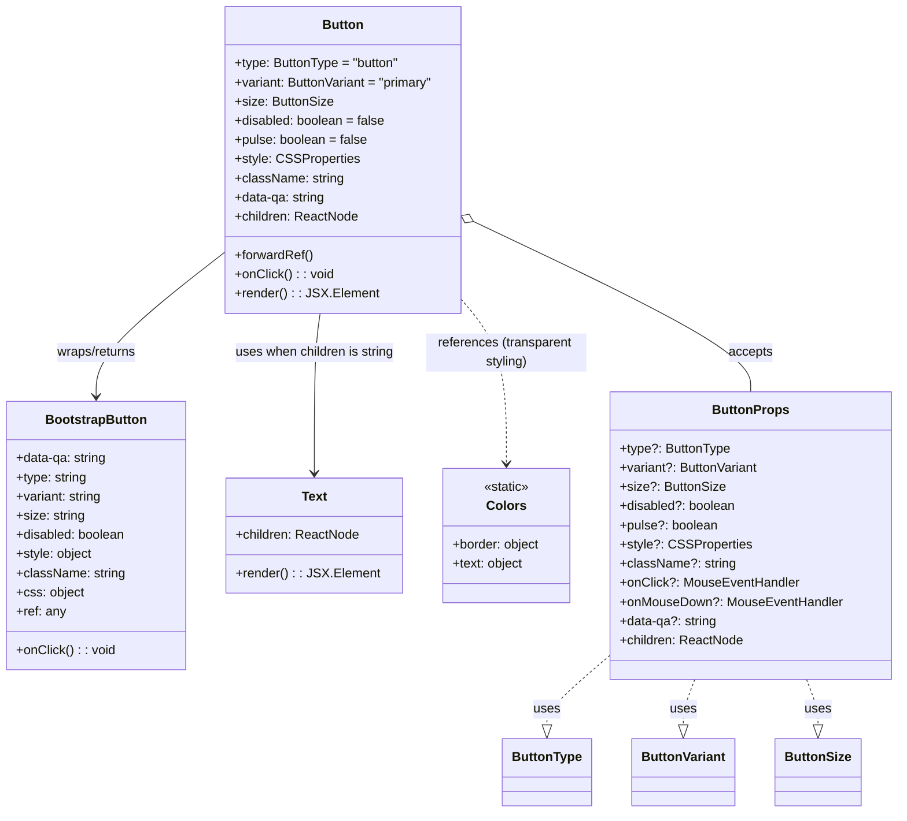

# Diagram: web/portal/src/components/atoms/Button.atom.tsx

> Auto-generated by Obscura crawlers

## Mermaid

### SVG

<svg id="container" width="1109.1875" xmlns="http://www.w3.org/2000/svg" class="classDiagram" height="1016" viewBox="0 0 1109.1875 1016" role="graphics-document document" aria-roledescription="class"><g><defs><marker id="container_class-aggregationStart" class="marker aggregation class" refX="18" refY="7" markerWidth="190" markerHeight="240" orient="auto"><path d="M 18,7 L9,13 L1,7 L9,1 Z"></path></marker></defs><defs><marker id="container_class-aggregationEnd" class="marker aggregation class" refX="1" refY="7" markerWidth="20" markerHeight="28" orient="auto"><path d="M 18,7 L9,13 L1,7 L9,1 Z"></path></marker></defs><defs><marker id="container_class-extensionStart" class="marker extension class" refX="18" refY="7" markerWidth="190" markerHeight="240" orient="auto"><path d="M 1,7 L18,13 V 1 Z"></path></marker></defs><defs><marker id="container_class-extensionEnd" class="marker extension class" refX="1" refY="7" markerWidth="20" markerHeight="28" orient="auto"><path d="M 1,1 V 13 L18,7 Z"></path></marker></defs><defs><marker id="container_class-compositionStart" class="marker composition class" refX="18" refY="7" markerWidth="190" markerHeight="240" orient="auto"><path d="M 18,7 L9,13 L1,7 L9,1 Z"></path></marker></defs><defs><marker id="container_class-compositionEnd" class="marker composition class" refX="1" refY="7" markerWidth="20" markerHeight="28" orient="auto"><path d="M 18,7 L9,13 L1,7 L9,1 Z"></path></marker></defs><defs><marker id="container_class-dependencyStart" class="marker dependency class" refX="6" refY="7" markerWidth="190" markerHeight="240" orient="auto"><path d="M 5,7 L9,13 L1,7 L9,1 Z"></path></marker></defs><defs><marker id="container_class-dependencyEnd" class="marker dependency class" refX="13" refY="7" markerWidth="20" markerHeight="28" orient="auto"><path d="M 18,7 L9,13 L14,7 L9,1 Z"></path></marker></defs><defs><marker id="container_class-lollipopStart" class="marker lollipop class" refX="13" refY="7" markerWidth="190" markerHeight="240" orient="auto"><circle stroke="black" fill="transparent" cx="7" cy="7" r="6"></circle></marker></defs><defs><marker id="container_class-lollipopEnd" class="marker lollipop class" refX="1" refY="7" markerWidth="190" markerHeight="240" orient="auto"><circle stroke="black" fill="transparent" cx="7" cy="7" r="6"></circle></marker></defs><g class="root"><g class="clusters"></g><g class="edgePaths"><path d="M272.555,319.769L247.067,339.974C221.579,360.179,170.604,400.59,145.117,429.962C119.629,459.333,119.629,477.667,119.629,486.833L119.629,496" id="id_Button_BootstrapButton_1" class="edge-thickness-normal edge-pattern-solid relation" style=";;;" data-edge="true" data-et="edge" data-id="id_Button_BootstrapButton_1" data-points="W3sieCI6MjcyLjU1NDY4NzUsInkiOjMxOS43NjkxOTAyNDQ5MDUzfSx7IngiOjExOS42Mjg5MDYyNSwieSI6NDQxfSx7IngiOjExOS42Mjg5MDYyNSwieSI6NTAyfV0=" marker-end="url(#container_class-dependencyEnd)"></path><path d="M394.545,392L393.308,400.167C392.071,408.333,389.596,424.667,388.358,458C387.121,491.333,387.121,541.667,387.121,566.833L387.121,592" id="id_Button_Text_2" class="edge-thickness-normal edge-pattern-solid relation" style=";;;" data-edge="true" data-et="edge" data-id="id_Button_Text_2" data-points="W3sieCI6Mzk0LjU0NTQzMjQ0Mjk0NjA0LCJ5IjozOTJ9LHsieCI6Mzg3LjEyMTA5Mzc1LCJ5Ijo0NDF9LHsieCI6Mzg3LjEyMTA5Mzc1LCJ5Ijo1OTh9XQ==" marker-end="url(#container_class-dependencyEnd)"></path><path d="M574.719,380.951L583.075,390.959C591.431,400.967,608.143,420.984,616.499,454.159C624.855,487.333,624.855,533.667,624.855,556.833L624.855,580" id="id_Button_Colors_3" class="edge-thickness-normal edge-pattern-dashed relation" style=";;;" data-edge="true" data-et="edge" data-id="id_Button_Colors_3" data-points="W3sieCI6NTc0LjcxODc1LCJ5IjozODAuOTUxMTc2NDI0OTEwN30seyJ4Ijo2MjQuODU1NDY4NzUsInkiOjQ0MX0seyJ4Ijo2MjQuODU1NDY4NzUsInkiOjU4Nn1d" marker-end="url(#container_class-dependencyEnd)"></path><path d="M590.289,279.481L646.733,306.4C703.178,333.32,816.068,387.16,872.512,422.247C928.957,457.333,928.957,473.667,928.957,481.833L928.957,490" id="id_Button_ButtonProps_4" class="edge-thickness-normal edge-pattern-solid relation" style=";;;" data-edge="true" data-et="edge" data-id="id_Button_ButtonProps_4" data-points="W3sieCI6NTc0LjcxODc1LCJ5IjoyNzIuMDU0ODMwNjMwMzI0Mn0seyJ4Ijo5MjguOTU3MDMxMjUsInkiOjQ0MX0seyJ4Ijo5MjguOTU3MDMxMjUsInkiOjQ5MH1d" marker-start="url(#container_class-aggregationStart)"></path><path d="M756.727,819.772L743.842,830.977C730.957,842.181,705.188,864.591,692.303,879.087C679.418,893.583,679.418,900.167,679.418,903.458L679.418,906.75" id="id_ButtonProps_ButtonType_5" class="edge-thickness-normal edge-pattern-dashed relation" style=";;;" data-edge="true" data-et="edge" data-id="id_ButtonProps_ButtonType_5" data-points="W3sieCI6NzU2LjcyNjU2MjUsInkiOjgxOS43NzIxODkzNDkxMTI0fSx7IngiOjY3OS40MTc5Njg3NSwieSI6ODg3fSx7IngiOjY3OS40MTc5Njg3NSwieSI6OTI0fV0=" marker-end="url(#container_class-extensionEnd)"></path><path d="M860.647,850L858.307,856.167C855.966,862.333,851.286,874.667,848.946,884.125C846.605,893.583,846.605,900.167,846.605,903.458L846.605,906.75" id="id_ButtonProps_ButtonVariant_6" class="edge-thickness-normal edge-pattern-dashed relation" style=";;;" data-edge="true" data-et="edge" data-id="id_ButtonProps_ButtonVariant_6" data-points="W3sieCI6ODYwLjY0Njk3OTQwNjY4MiwieSI6ODUwfSx7IngiOjg0Ni42MDU0Njg3NSwieSI6ODg3fSx7IngiOjg0Ni42MDU0Njg3NSwieSI6OTI0fV0=" marker-end="url(#container_class-extensionEnd)"></path><path d="M997.267,850L999.607,856.167C1001.948,862.333,1006.628,874.667,1008.968,884.125C1011.309,893.583,1011.309,900.167,1011.309,903.458L1011.309,906.75" id="id_ButtonProps_ButtonSize_7" class="edge-thickness-normal edge-pattern-dashed relation" style=";;;" data-edge="true" data-et="edge" data-id="id_ButtonProps_ButtonSize_7" data-points="W3sieCI6OTk3LjI2NzA4MzA5MzMxOCwieSI6ODUwfSx7IngiOjEwMTEuMzA4NTkzNzUsInkiOjg4N30seyJ4IjoxMDExLjMwODU5Mzc1LCJ5Ijo5MjR9XQ==" marker-end="url(#container_class-extensionEnd)"></path></g><g class="edgeLabels"><g class="edgeLabel" transform="translate(119.62890625, 441)"><g class="label" data-id="id_Button_BootstrapButton_1" transform="translate(-51.5703125, -12)"><foreignObject width="103.140625" height="24">

wraps/returns

</foreignObject></g></g><g class="edgeLabel" transform="translate(387.12109375, 441)"><g class="label" data-id="id_Button_Text_2" transform="translate(-100, -24)"><foreignObject width="200" height="48">

uses when children is string

</foreignObject></g></g><g class="edgeLabel" transform="translate(624.85546875, 441)"><g class="label" data-id="id_Button_Colors_3" transform="translate(-100, -24)"><foreignObject width="200" height="48">

references (transparent styling)

</foreignObject></g></g><g class="edgeLabel" transform="translate(928.95703125, 441)"><g class="label" data-id="id_Button_ButtonProps_4" transform="translate(-27.421875, -12)"><foreignObject width="54.84375" height="24">

accepts

</foreignObject></g></g><g class="edgeLabel" transform="translate(679.41796875, 887)"><g class="label" data-id="id_ButtonProps_ButtonType_5" transform="translate(-16.4921875, -12)"><foreignObject width="32.984375" height="24">

uses

</foreignObject></g></g><g class="edgeLabel" transform="translate(846.60546875, 887)"><g class="label" data-id="id_ButtonProps_ButtonVariant_6" transform="translate(-16.4921875, -12)"><foreignObject width="32.984375" height="24">

uses

</foreignObject></g></g><g class="edgeLabel" transform="translate(1011.30859375, 887)"><g class="label" data-id="id_ButtonProps_ButtonSize_7" transform="translate(-16.4921875, -12)"><foreignObject width="32.984375" height="24">

uses

</foreignObject></g></g></g><g class="nodes"><g class="node default" id="classId-Button-0" transform="translate(423.63671875, 200)"><g class="basic label-container"><path d="M-151.08203125 -192 L151.08203125 -192 L151.08203125 192 L-151.08203125 192" stroke="none" stroke-width="0" fill="#ECECFF" style=""></path><path d="M-151.08203125 -192 C-37.60126651828983 -192, 75.87949821342033 -192, 151.08203125 -192 M-151.08203125 -192 C-65.48885964454792 -192, 20.10431196090417 -192, 151.08203125 -192 M151.08203125 -192 C151.08203125 -66.38056356675264, 151.08203125 59.23887286649472, 151.08203125 192 M151.08203125 -192 C151.08203125 -111.20017118504273, 151.08203125 -30.40034237008547, 151.08203125 192 M151.08203125 192 C56.90277544405926 192, -37.27648036188148 192, -151.08203125 192 M151.08203125 192 C89.43781976802428 192, 27.793608286048567 192, -151.08203125 192 M-151.08203125 192 C-151.08203125 114.13595827635496, -151.08203125 36.27191655270991, -151.08203125 -192 M-151.08203125 192 C-151.08203125 98.30272397370484, -151.08203125 4.6054479474096865, -151.08203125 -192" stroke="#9370DB" stroke-width="1.3" fill="none" stroke-dasharray="0 0" style=""></path></g><g class="annotation-group text" transform="translate(0, -168)"></g><g class="label-group text" transform="translate(-24.8359375, -168)"><g class="label" style="font-weight: bolder" transform="translate(0,-12)"><foreignObject width="49.671875" height="24">

Button

</foreignObject></g></g><g class="members-group text" transform="translate(-139.08203125, -120)"><g class="label" style="" transform="translate(0,-12)"><foreignObject width="208.515625" height="24">

+type: ButtonType = "button"

</foreignObject></g><g class="label" style="" transform="translate(0,12)"><foreignObject width="253.328125" height="24">

+variant: ButtonVariant = "primary"

</foreignObject></g><g class="label" style="" transform="translate(0,36)"><foreignObject width="121.5625" height="24">

+size: ButtonSize

</foreignObject></g><g class="label" style="" transform="translate(0,60)"><foreignObject width="188.921875" height="24">

+disabled: boolean = false

</foreignObject></g><g class="label" style="" transform="translate(0,84)"><foreignObject width="166.125" height="24">

+pulse: boolean = false

</foreignObject></g><g class="label" style="" transform="translate(0,108)"><foreignObject width="151.390625" height="24">

+style: CSSProperties

</foreignObject></g><g class="label" style="" transform="translate(0,132)"><foreignObject width="135.359375" height="24">

+className: string

</foreignObject></g><g class="label" style="" transform="translate(0,156)"><foreignObject width="114.90625" height="24">

+data-qa: string

</foreignObject></g><g class="label" style="" transform="translate(0,180)"><foreignObject width="154.265625" height="24">

+children: ReactNode

</foreignObject></g></g><g class="methods-group text" transform="translate(-139.08203125, 120)"><g class="label" style="" transform="translate(0,-12)"><foreignObject width="97.609375" height="24">

+forwardRef()

</foreignObject></g><g class="label" style="" transform="translate(0,12)"><foreignObject width="122.546875" height="24">

+onClick() : : void

</foreignObject></g><g class="label" style="" transform="translate(0,36)"><foreignObject width="172.34375" height="24">

+render() : : JSX.Element

</foreignObject></g></g><g class="divider" style=""><path d="M-151.08203125 -144 C-78.51483780962502 -144, -5.9476443692500425 -144, 151.08203125 -144 M-151.08203125 -144 C-34.76410697627928 -144, 81.55381729744144 -144, 151.08203125 -144" stroke="#9370DB" stroke-width="1.3" fill="none" stroke-dasharray="0 0" style=""></path></g><g class="divider" style=""><path d="M-151.08203125 96 C-30.646896898453008 96, 89.78823745309398 96, 151.08203125 96 M-151.08203125 96 C-57.37568070986846 96, 36.330669830263076 96, 151.08203125 96" stroke="#9370DB" stroke-width="1.3" fill="none" stroke-dasharray="0 0" style=""></path></g></g><g class="node default" id="classId-BootstrapButton-1" transform="translate(119.62890625, 670)"><g class="basic label-container"><path d="M-111.62890625 -168 L111.62890625 -168 L111.62890625 168 L-111.62890625 168" stroke="none" stroke-width="0" fill="#ECECFF" style=""></path><path d="M-111.62890625 -168 C-62.84064187773927 -168, -14.052377505478546 -168, 111.62890625 -168 M-111.62890625 -168 C-31.729647891382257 -168, 48.169610467235486 -168, 111.62890625 -168 M111.62890625 -168 C111.62890625 -57.5450958295651, 111.62890625 52.9098083408698, 111.62890625 168 M111.62890625 -168 C111.62890625 -66.77678253902226, 111.62890625 34.44643492195547, 111.62890625 168 M111.62890625 168 C24.252174346612733 168, -63.12455755677453 168, -111.62890625 168 M111.62890625 168 C54.7354246270839 168, -2.1580569958321973 168, -111.62890625 168 M-111.62890625 168 C-111.62890625 63.73816243337939, -111.62890625 -40.52367513324123, -111.62890625 -168 M-111.62890625 168 C-111.62890625 82.26074347699172, -111.62890625 -3.478513046016559, -111.62890625 -168" stroke="#9370DB" stroke-width="1.3" fill="none" stroke-dasharray="0 0" style=""></path></g><g class="annotation-group text" transform="translate(0, -144)"></g><g class="label-group text" transform="translate(-61.2421875, -144)"><g class="label" style="font-weight: bolder" transform="translate(0,-12)"><foreignObject width="122.484375" height="24">

BootstrapButton

</foreignObject></g></g><g class="members-group text" transform="translate(-99.62890625, -96)"><g class="label" style="" transform="translate(0,-12)"><foreignObject width="114.90625" height="24">

+data-qa: string

</foreignObject></g><g class="label" style="" transform="translate(0,12)"><foreignObject width="89.421875" height="24">

+type: string

</foreignObject></g><g class="label" style="" transform="translate(0,36)"><foreignObject width="108.46875" height="24">

+variant: string

</foreignObject></g><g class="label" style="" transform="translate(0,60)"><foreignObject width="85.28125" height="24">

+size: string

</foreignObject></g><g class="label" style="" transform="translate(0,84)"><foreignObject width="138.015625" height="24">

+disabled: boolean

</foreignObject></g><g class="label" style="" transform="translate(0,108)"><foreignObject width="95.90625" height="24">

+style: object

</foreignObject></g><g class="label" style="" transform="translate(0,132)"><foreignObject width="135.359375" height="24">

+className: string

</foreignObject></g><g class="label" style="" transform="translate(0,156)"><foreignObject width="83.96875" height="24">

+css: object

</foreignObject></g><g class="label" style="" transform="translate(0,180)"><foreignObject width="61.78125" height="24">

+ref: any

</foreignObject></g></g><g class="methods-group text" transform="translate(-99.62890625, 144)"><g class="label" style="" transform="translate(0,-12)"><foreignObject width="122.546875" height="24">

+onClick() : : void

</foreignObject></g></g><g class="divider" style=""><path d="M-111.62890625 -120 C-37.09500842344079 -120, 37.438889403118424 -120, 111.62890625 -120 M-111.62890625 -120 C-44.79743954529437 -120, 22.034027159411266 -120, 111.62890625 -120" stroke="#9370DB" stroke-width="1.3" fill="none" stroke-dasharray="0 0" style=""></path></g><g class="divider" style=""><path d="M-111.62890625 120 C-24.41761568261954 120, 62.79367488476092 120, 111.62890625 120 M-111.62890625 120 C-48.882873297002945 120, 13.86315965599411 120, 111.62890625 120" stroke="#9370DB" stroke-width="1.3" fill="none" stroke-dasharray="0 0" style=""></path></g></g><g class="node default" id="classId-Text-2" transform="translate(387.12109375, 670)"><g class="basic label-container"><path d="M-105.86328125 -72 L105.86328125 -72 L105.86328125 72 L-105.86328125 72" stroke="none" stroke-width="0" fill="#ECECFF" style=""></path><path d="M-105.86328125 -72 C-57.41506658704546 -72, -8.966851924090918 -72, 105.86328125 -72 M-105.86328125 -72 C-60.99642228695605 -72, -16.129563323912095 -72, 105.86328125 -72 M105.86328125 -72 C105.86328125 -23.30495951834832, 105.86328125 25.39008096330336, 105.86328125 72 M105.86328125 -72 C105.86328125 -32.43519314272465, 105.86328125 7.1296137145507, 105.86328125 72 M105.86328125 72 C61.86609921867427 72, 17.868917187348544 72, -105.86328125 72 M105.86328125 72 C40.503770913782176 72, -24.855739422435647 72, -105.86328125 72 M-105.86328125 72 C-105.86328125 20.840442399648417, -105.86328125 -30.319115200703166, -105.86328125 -72 M-105.86328125 72 C-105.86328125 31.693510558738552, -105.86328125 -8.612978882522896, -105.86328125 -72" stroke="#9370DB" stroke-width="1.3" fill="none" stroke-dasharray="0 0" style=""></path></g><g class="annotation-group text" transform="translate(0, -48)"></g><g class="label-group text" transform="translate(-15.3828125, -48)"><g class="label" style="font-weight: bolder" transform="translate(0,-12)"><foreignObject width="30.765625" height="24">

Text

</foreignObject></g></g><g class="members-group text" transform="translate(-93.86328125, 0)"><g class="label" style="" transform="translate(0,-12)"><foreignObject width="154.265625" height="24">

+children: ReactNode

</foreignObject></g></g><g class="methods-group text" transform="translate(-93.86328125, 48)"><g class="label" style="" transform="translate(0,-12)"><foreignObject width="172.34375" height="24">

+render() : : JSX.Element

</foreignObject></g></g><g class="divider" style=""><path d="M-105.86328125 -24 C-36.50238308273653 -24, 32.85851508452694 -24, 105.86328125 -24 M-105.86328125 -24 C-33.02739405386808 -24, 39.80849314226384 -24, 105.86328125 -24" stroke="#9370DB" stroke-width="1.3" fill="none" stroke-dasharray="0 0" style=""></path></g><g class="divider" style=""><path d="M-105.86328125 24 C-59.0478385018051 24, -12.232395753610206 24, 105.86328125 24 M-105.86328125 24 C-44.63643812413371 24, 16.590405001732577 24, 105.86328125 24" stroke="#9370DB" stroke-width="1.3" fill="none" stroke-dasharray="0 0" style=""></path></g></g><g class="node default" id="classId-Colors-3" transform="translate(624.85546875, 670)"><g class="basic label-container"><path d="M-81.87109375 -84 L81.87109375 -84 L81.87109375 84 L-81.87109375 84" stroke="none" stroke-width="0" fill="#ECECFF" style=""></path><path d="M-81.87109375 -84 C-42.14776532753466 -84, -2.4244369050693138 -84, 81.87109375 -84 M-81.87109375 -84 C-44.506743046635066 -84, -7.1423923432701315 -84, 81.87109375 -84 M81.87109375 -84 C81.87109375 -36.81653460825793, 81.87109375 10.366930783484136, 81.87109375 84 M81.87109375 -84 C81.87109375 -18.449477785278773, 81.87109375 47.10104442944245, 81.87109375 84 M81.87109375 84 C17.42760280232588 84, -47.01588814534824 84, -81.87109375 84 M81.87109375 84 C47.033714781615856 84, 12.196335813231713 84, -81.87109375 84 M-81.87109375 84 C-81.87109375 37.50703975784533, -81.87109375 -8.985920484309347, -81.87109375 -84 M-81.87109375 84 C-81.87109375 24.54947320761321, -81.87109375 -34.90105358477358, -81.87109375 -84" stroke="#9370DB" stroke-width="1.3" fill="none" stroke-dasharray="0 0" style=""></path></g><g class="annotation-group text" transform="translate(-29.0234375, -60)"><g class="label" style="" transform="translate(0,-12)"><foreignObject width="58.046875" height="24">

«static»

</foreignObject></g></g><g class="label-group text" transform="translate(-23.1015625, -36)"><g class="label" style="font-weight: bolder" transform="translate(0,-12)"><foreignObject width="46.203125" height="24">

Colors

</foreignObject></g></g><g class="members-group text" transform="translate(-69.87109375, 12)"><g class="label" style="" transform="translate(0,-12)"><foreignObject width="110.71875" height="24">

+border: object

</foreignObject></g><g class="label" style="" transform="translate(0,12)"><foreignObject width="89.171875" height="24">

+text: object

</foreignObject></g></g><g class="methods-group text" transform="translate(-69.87109375, 84)"></g><g class="divider" style=""><path d="M-81.87109375 -12 C-28.46482145870177 -12, 24.94145083259646 -12, 81.87109375 -12 M-81.87109375 -12 C-20.102069743228064 -12, 41.66695426354387 -12, 81.87109375 -12" stroke="#9370DB" stroke-width="1.3" fill="none" stroke-dasharray="0 0" style=""></path></g><g class="divider" style=""><path d="M-81.87109375 60 C-25.121574071729825 60, 31.62794560654035 60, 81.87109375 60 M-81.87109375 60 C-24.614814442803954 60, 32.64146486439209 60, 81.87109375 60" stroke="#9370DB" stroke-width="1.3" fill="none" stroke-dasharray="0 0" style=""></path></g></g><g class="node default" id="classId-ButtonProps-4" transform="translate(928.95703125, 670)"><g class="basic label-container"><path d="M-172.23046875 -180 L172.23046875 -180 L172.23046875 180 L-172.23046875 180" stroke="none" stroke-width="0" fill="#ECECFF" style=""></path><path d="M-172.23046875 -180 C-44.34923144029753 -180, 83.53200586940494 -180, 172.23046875 -180 M-172.23046875 -180 C-86.78176236520727 -180, -1.3330559804145423 -180, 172.23046875 -180 M172.23046875 -180 C172.23046875 -105.77909264775911, 172.23046875 -31.55818529551823, 172.23046875 180 M172.23046875 -180 C172.23046875 -99.61366135027698, 172.23046875 -19.22732270055397, 172.23046875 180 M172.23046875 180 C56.29142413008333 180, -59.64762048983334 180, -172.23046875 180 M172.23046875 180 C84.67469650544588 180, -2.8810757391082404 180, -172.23046875 180 M-172.23046875 180 C-172.23046875 41.809147322271855, -172.23046875 -96.38170535545629, -172.23046875 -180 M-172.23046875 180 C-172.23046875 98.4908568745922, -172.23046875 16.981713749184394, -172.23046875 -180" stroke="#9370DB" stroke-width="1.3" fill="none" stroke-dasharray="0 0" style=""></path></g><g class="annotation-group text" transform="translate(0, -156)"></g><g class="label-group text" transform="translate(-45.7578125, -156)"><g class="label" style="font-weight: bolder" transform="translate(0,-12)"><foreignObject width="91.515625" height="24">

ButtonProps

</foreignObject></g></g><g class="members-group text" transform="translate(-160.23046875, -108)"><g class="label" style="" transform="translate(0,-12)"><foreignObject width="137.28125" height="24">

+type?: ButtonType

</foreignObject></g><g class="label" style="" transform="translate(0,12)"><foreignObject width="174.21875" height="24">

+variant?: ButtonVariant

</foreignObject></g><g class="label" style="" transform="translate(0,36)"><foreignObject width="128.265625" height="24">

+size?: ButtonSize

</foreignObject></g><g class="label" style="" transform="translate(0,60)"><foreignObject width="145.359375" height="24">

+disabled?: boolean

</foreignObject></g><g class="label" style="" transform="translate(0,84)"><foreignObject width="121.90625" height="24">

+pulse?: boolean

</foreignObject></g><g class="label" style="" transform="translate(0,108)"><foreignObject width="158.09375" height="24">

+style?: CSSProperties

</foreignObject></g><g class="label" style="" transform="translate(0,132)"><foreignObject width="142.0625" height="24">

+className?: string

</foreignObject></g><g class="label" style="" transform="translate(0,156)"><foreignObject width="220.828125" height="24">

+onClick?: MouseEventHandler

</foreignObject></g><g class="label" style="" transform="translate(0,180)"><foreignObject width="274.703125" height="24">

+onMouseDown?: MouseEventHandler

</foreignObject></g><g class="label" style="" transform="translate(0,204)"><foreignObject width="121.765625" height="24">

+data-qa?: string

</foreignObject></g><g class="label" style="" transform="translate(0,228)"><foreignObject width="154.265625" height="24">

+children: ReactNode

</foreignObject></g></g><g class="methods-group text" transform="translate(-160.23046875, 180)"></g><g class="divider" style=""><path d="M-172.23046875 -132 C-94.83869527829664 -132, -17.44692180659328 -132, 172.23046875 -132 M-172.23046875 -132 C-101.04355563590094 -132, -29.856642521801888 -132, 172.23046875 -132" stroke="#9370DB" stroke-width="1.3" fill="none" stroke-dasharray="0 0" style=""></path></g><g class="divider" style=""><path d="M-172.23046875 156 C-65.33267181073556 156, 41.56512512852888 156, 172.23046875 156 M-172.23046875 156 C-65.02741394131822 156, 42.17564086736357 156, 172.23046875 156" stroke="#9370DB" stroke-width="1.3" fill="none" stroke-dasharray="0 0" style=""></path></g></g><g class="node default" id="classId-ButtonType-5" transform="translate(679.41796875, 966)"><g class="basic label-container"><path d="M-54.171875 -42 L54.171875 -42 L54.171875 42 L-54.171875 42" stroke="none" stroke-width="0" fill="#ECECFF" style=""></path><path d="M-54.171875 -42 C-13.184203851572917 -42, 27.803467296854166 -42, 54.171875 -42 M-54.171875 -42 C-32.36350328045246 -42, -10.555131560904933 -42, 54.171875 -42 M54.171875 -42 C54.171875 -24.52185304767674, 54.171875 -7.043706095353478, 54.171875 42 M54.171875 -42 C54.171875 -16.608520771508033, 54.171875 8.782958456983934, 54.171875 42 M54.171875 42 C14.783481493127056 42, -24.60491201374589 42, -54.171875 42 M54.171875 42 C13.896521252502119 42, -26.378832494995763 42, -54.171875 42 M-54.171875 42 C-54.171875 13.341812866593841, -54.171875 -15.316374266812318, -54.171875 -42 M-54.171875 42 C-54.171875 14.809536579303444, -54.171875 -12.380926841393112, -54.171875 -42" stroke="#9370DB" stroke-width="1.3" fill="none" stroke-dasharray="0 0" style=""></path></g><g class="annotation-group text" transform="translate(0, -18)"></g><g class="label-group text" transform="translate(-42.171875, -18)"><g class="label" style="font-weight: bolder" transform="translate(0,-12)"><foreignObject width="84.34375" height="24">

ButtonType

</foreignObject></g></g><g class="members-group text" transform="translate(-42.171875, 30)"></g><g class="methods-group text" transform="translate(-42.171875, 60)"></g><g class="divider" style=""><path d="M-54.171875 6 C-11.7281249611231 6, 30.7156250777538 6, 54.171875 6 M-54.171875 6 C-22.337946516748485 6, 9.495981966503031 6, 54.171875 6" stroke="#9370DB" stroke-width="1.3" fill="none" stroke-dasharray="0 0" style=""></path></g><g class="divider" style=""><path d="M-54.171875 24 C-18.803892826098462 24, 16.564089347803076 24, 54.171875 24 M-54.171875 24 C-24.079206890159192 24, 6.013461219681616 24, 54.171875 24" stroke="#9370DB" stroke-width="1.3" fill="none" stroke-dasharray="0 0" style=""></path></g></g><g class="node default" id="classId-ButtonVariant-6" transform="translate(846.60546875, 966)"><g class="basic label-container"><path d="M-63.015625 -42 L63.015625 -42 L63.015625 42 L-63.015625 42" stroke="none" stroke-width="0" fill="#ECECFF" style=""></path><path d="M-63.015625 -42 C-24.231433313742727 -42, 14.552758372514546 -42, 63.015625 -42 M-63.015625 -42 C-27.017816810044195 -42, 8.97999137991161 -42, 63.015625 -42 M63.015625 -42 C63.015625 -18.59670716165709, 63.015625 4.80658567668582, 63.015625 42 M63.015625 -42 C63.015625 -20.685046347356202, 63.015625 0.6299073052875954, 63.015625 42 M63.015625 42 C35.256772873555725 42, 7.497920747111451 42, -63.015625 42 M63.015625 42 C22.43457326153537 42, -18.14647847692926 42, -63.015625 42 M-63.015625 42 C-63.015625 15.286864385049682, -63.015625 -11.426271229900635, -63.015625 -42 M-63.015625 42 C-63.015625 23.277860097659342, -63.015625 4.555720195318685, -63.015625 -42" stroke="#9370DB" stroke-width="1.3" fill="none" stroke-dasharray="0 0" style=""></path></g><g class="annotation-group text" transform="translate(0, -18)"></g><g class="label-group text" transform="translate(-51.015625, -18)"><g class="label" style="font-weight: bolder" transform="translate(0,-12)"><foreignObject width="102.03125" height="24">

ButtonVariant

</foreignObject></g></g><g class="members-group text" transform="translate(-51.015625, 30)"></g><g class="methods-group text" transform="translate(-51.015625, 60)"></g><g class="divider" style=""><path d="M-63.015625 6 C-33.131094986671584 6, -3.246564973343169 6, 63.015625 6 M-63.015625 6 C-37.18194608469278 6, -11.348267169385572 6, 63.015625 6" stroke="#9370DB" stroke-width="1.3" fill="none" stroke-dasharray="0 0" style=""></path></g><g class="divider" style=""><path d="M-63.015625 24 C-17.2747527407638 24, 28.466119518472397 24, 63.015625 24 M-63.015625 24 C-31.002293017271526 24, 1.0110389654569474 24, 63.015625 24" stroke="#9370DB" stroke-width="1.3" fill="none" stroke-dasharray="0 0" style=""></path></g></g><g class="node default" id="classId-ButtonSize-7" transform="translate(1011.30859375, 966)"><g class="basic label-container"><path d="M-51.6875 -42 L51.6875 -42 L51.6875 42 L-51.6875 42" stroke="none" stroke-width="0" fill="#ECECFF" style=""></path><path d="M-51.6875 -42 C-21.75008866817514 -42, 8.187322663649717 -42, 51.6875 -42 M-51.6875 -42 C-17.0194086902261 -42, 17.6486826195478 -42, 51.6875 -42 M51.6875 -42 C51.6875 -18.993785303067757, 51.6875 4.012429393864487, 51.6875 42 M51.6875 -42 C51.6875 -23.980261597983457, 51.6875 -5.960523195966914, 51.6875 42 M51.6875 42 C29.57636912876448 42, 7.465238257528959 42, -51.6875 42 M51.6875 42 C17.93914081339298 42, -15.809218373214037 42, -51.6875 42 M-51.6875 42 C-51.6875 11.987720078674574, -51.6875 -18.024559842650852, -51.6875 -42 M-51.6875 42 C-51.6875 16.242311680992554, -51.6875 -9.515376638014892, -51.6875 -42" stroke="#9370DB" stroke-width="1.3" fill="none" stroke-dasharray="0 0" style=""></path></g><g class="annotation-group text" transform="translate(0, -18)"></g><g class="label-group text" transform="translate(-39.6875, -18)"><g class="label" style="font-weight: bolder" transform="translate(0,-12)"><foreignObject width="79.375" height="24">

ButtonSize

</foreignObject></g></g><g class="members-group text" transform="translate(-39.6875, 30)"></g><g class="methods-group text" transform="translate(-39.6875, 60)"></g><g class="divider" style=""><path d="M-51.6875 6 C-30.32582169526399 6, -8.96414339052798 6, 51.6875 6 M-51.6875 6 C-20.299819604763105 6, 11.08786079047379 6, 51.6875 6" stroke="#9370DB" stroke-width="1.3" fill="none" stroke-dasharray="0 0" style=""></path></g><g class="divider" style=""><path d="M-51.6875 24 C-22.193009121234255 24, 7.301481757531491 24, 51.6875 24 M-51.6875 24 C-12.30602640173069 24, 27.07544719653862 24, 51.6875 24" stroke="#9370DB" stroke-width="1.3" fill="none" stroke-dasharray="0 0" style=""></path></g></g></g></g></g></svg>
