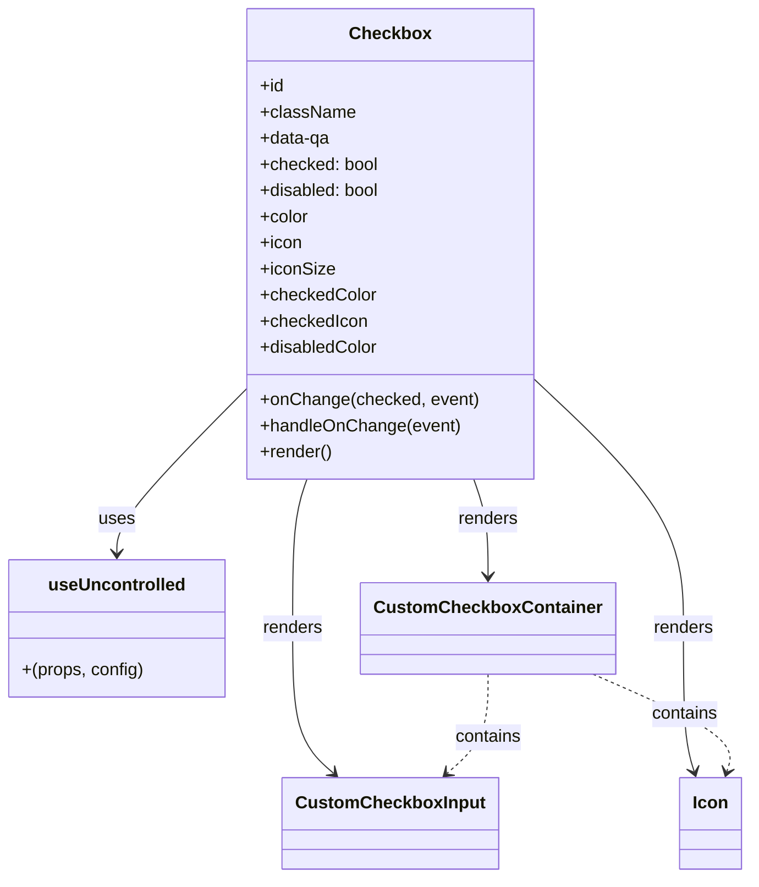

# Diagram: web/portal/src/components/atoms/Checkbox.atom.js


> Auto-generated by Obscura crawlers

## Diagram 1



### SVG

<svg id="container" width="673.09375" xmlns="http://www.w3.org/2000/svg" class="classDiagram" height="806" viewBox="0 0 673.09375 806" role="graphics-document document" aria-roledescription="class"><style>#container{font-family:"trebuchet ms",verdana,arial,sans-serif;font-size:16px;fill:#333;}@keyframes edge-animation-frame{from{stroke-dashoffset:0;}}@keyframes dash{to{stroke-dashoffset:0;}}#container .edge-animation-slow{stroke-dasharray:9,5!important;stroke-dashoffset:900;animation:dash 50s linear infinite;stroke-linecap:round;}#container .edge-animation-fast{stroke-dasharray:9,5!important;stroke-dashoffset:900;animation:dash 20s linear infinite;stroke-linecap:round;}#container .error-icon{fill:#552222;}#container .error-text{fill:#552222;stroke:#552222;}#container .edge-thickness-normal{stroke-width:1px;}#container .edge-thickness-thick{stroke-width:3.5px;}#container .edge-pattern-solid{stroke-dasharray:0;}#container .edge-thickness-invisible{stroke-width:0;fill:none;}#container .edge-pattern-dashed{stroke-dasharray:3;}#container .edge-pattern-dotted{stroke-dasharray:2;}#container .marker{fill:#333333;stroke:#333333;}#container .marker.cross{stroke:#333333;}#container svg{font-family:"trebuchet ms",verdana,arial,sans-serif;font-size:16px;}#container p{margin:0;}#container g.classGroup text{fill:#9370DB;stroke:none;font-family:"trebuchet ms",verdana,arial,sans-serif;font-size:10px;}#container g.classGroup text .title{font-weight:bolder;}#container .nodeLabel,#container .edgeLabel{color:#131300;}#container .edgeLabel .label rect{fill:#ECECFF;}#container .label text{fill:#131300;}#container .labelBkg{background:#ECECFF;}#container .edgeLabel .label span{background:#ECECFF;}#container .classTitle{font-weight:bolder;}#container .node rect,#container .node circle,#container .node ellipse,#container .node polygon,#container .node path{fill:#ECECFF;stroke:#9370DB;stroke-width:1px;}#container .divider{stroke:#9370DB;stroke-width:1;}#container g.clickable{cursor:pointer;}#container g.classGroup rect{fill:#ECECFF;stroke:#9370DB;}#container g.classGroup line{stroke:#9370DB;stroke-width:1;}#container .classLabel .box{stroke:none;stroke-width:0;fill:#ECECFF;opacity:0.5;}#container .classLabel .label{fill:#9370DB;font-size:10px;}#container .relation{stroke:#333333;stroke-width:1;fill:none;}#container .dashed-line{stroke-dasharray:3;}#container .dotted-line{stroke-dasharray:1 2;}#container #compositionStart,#container .composition{fill:#333333!important;stroke:#333333!important;stroke-width:1;}#container #compositionEnd,#container .composition{fill:#333333!important;stroke:#333333!important;stroke-width:1;}#container #dependencyStart,#container .dependency{fill:#333333!important;stroke:#333333!important;stroke-width:1;}#container #dependencyStart,#container .dependency{fill:#333333!important;stroke:#333333!important;stroke-width:1;}#container #extensionStart,#container .extension{fill:transparent!important;stroke:#333333!important;stroke-width:1;}#container #extensionEnd,#container .extension{fill:transparent!important;stroke:#333333!important;stroke-width:1;}#container #aggregationStart,#container .aggregation{fill:transparent!important;stroke:#333333!important;stroke-width:1;}#container #aggregationEnd,#container .aggregation{fill:transparent!important;stroke:#333333!important;stroke-width:1;}#container #lollipopStart,#container .lollipop{fill:#ECECFF!important;stroke:#333333!important;stroke-width:1;}#container #lollipopEnd,#container .lollipop{fill:#ECECFF!important;stroke:#333333!important;stroke-width:1;}#container .edgeTerminals{font-size:11px;line-height:initial;}#container .classTitleText{text-anchor:middle;font-size:18px;fill:#333;}#container .label-icon{display:inline-block;height:1em;overflow:visible;vertical-align:-0.125em;}#container .node .label-icon path{fill:currentColor;stroke:revert;stroke-width:revert;}#container :root{--mermaid-font-family:"trebuchet ms",verdana,arial,sans-serif;}</style><g><defs><marker id="container_class-aggregationStart" class="marker aggregation class" refX="18" refY="7" markerWidth="190" markerHeight="240" orient="auto"><path d="M 18,7 L9,13 L1,7 L9,1 Z"></path></marker></defs><defs><marker id="container_class-aggregationEnd" class="marker aggregation class" refX="1" refY="7" markerWidth="20" markerHeight="28" orient="auto"><path d="M 18,7 L9,13 L1,7 L9,1 Z"></path></marker></defs><defs><marker id="container_class-extensionStart" class="marker extension class" refX="18" refY="7" markerWidth="190" markerHeight="240" orient="auto"><path d="M 1,7 L18,13 V 1 Z"></path></marker></defs><defs><marker id="container_class-extensionEnd" class="marker extension class" refX="1" refY="7" markerWidth="20" markerHeight="28" orient="auto"><path d="M 1,1 V 13 L18,7 Z"></path></marker></defs><defs><marker id="container_class-compositionStart" class="marker composition class" refX="18" refY="7" markerWidth="190" markerHeight="240" orient="auto"><path d="M 18,7 L9,13 L1,7 L9,1 Z"></path></marker></defs><defs><marker id="container_class-compositionEnd" class="marker composition class" refX="1" refY="7" markerWidth="20" markerHeight="28" orient="auto"><path d="M 18,7 L9,13 L1,7 L9,1 Z"></path></marker></defs><defs><marker id="container_class-dependencyStart" class="marker dependency class" refX="6" refY="7" markerWidth="190" markerHeight="240" orient="auto"><path d="M 5,7 L9,13 L1,7 L9,1 Z"></path></marker></defs><defs><marker id="container_class-dependencyEnd" class="marker dependency class" refX="13" refY="7" markerWidth="20" markerHeight="28" orient="auto"><path d="M 18,7 L9,13 L14,7 L9,1 Z"></path></marker></defs><defs><marker id="container_class-lollipopStart" class="marker lollipop class" refX="13" refY="7" markerWidth="190" markerHeight="240" orient="auto"><circle stroke="black" fill="transparent" cx="7" cy="7" r="6"></circle></marker></defs><defs><marker id="container_class-lollipopEnd" class="marker lollipop class" refX="1" refY="7" markerWidth="190" markerHeight="240" orient="auto"><circle stroke="black" fill="transparent" cx="7" cy="7" r="6"></circle></marker></defs><g class="root"><g class="clusters"></g><g class="edgePaths"><path d="M224.266,355.825L204.54,376.021C184.815,396.217,145.365,436.608,125.639,461.971C105.914,487.333,105.914,497.667,105.914,502.833L105.914,508" id="id_Checkbox_useUncontrolled_1" class="edge-thickness-normal edge-pattern-solid relation" style=";;;" data-edge="true" data-et="edge" data-id="id_Checkbox_useUncontrolled_1" data-points="W3sieCI6MjI0LjI2NTYyNSwieSI6MzU1LjgyNTI0MjI1ODAxODY1fSx7IngiOjEwNS45MTQwNjI1LCJ5Ijo0Nzd9LHsieCI6MTA1LjkxNDA2MjUsInkiOjUxNH1d" marker-end="url(#container_class-dependencyEnd)"></path><path d="M426.819,440L428.926,446.167C431.033,452.333,435.247,464.667,437.354,479.5C439.461,494.333,439.461,511.667,439.461,520.333L439.461,529" id="id_Checkbox_CustomCheckboxContainer_2" class="edge-thickness-normal edge-pattern-solid relation" style=";;;" data-edge="true" data-et="edge" data-id="id_Checkbox_CustomCheckboxContainer_2" data-points="W3sieCI6NDI2LjgxOTMwODkxNzk4NDIsInkiOjQ0MH0seyJ4Ijo0MzkuNDYwOTM3NSwieSI6NDc3fSx7IngiOjQzOS40NjA5Mzc1LCJ5Ijo1MzV9XQ==" marker-end="url(#container_class-dependencyEnd)"></path><path d="M279.22,440L277.113,446.167C275.006,452.333,270.792,464.667,268.685,487.5C266.578,510.333,266.578,543.667,266.578,577C266.578,610.333,266.578,643.667,272.587,665.825C278.597,687.984,290.616,698.968,296.625,704.46L302.634,709.952" id="id_Checkbox_CustomCheckboxInput_3" class="edge-thickness-normal edge-pattern-solid relation" style=";;;" data-edge="true" data-et="edge" data-id="id_Checkbox_CustomCheckboxInput_3" data-points="W3sieCI6Mjc5LjIxOTc1MzU4MjAxNTgsInkiOjQ0MH0seyJ4IjoyNjYuNTc4MTI1LCJ5Ijo0Nzd9LHsieCI6MjY2LjU3ODEyNSwieSI6NTc3fSx7IngiOjI2Ni41NzgxMjUsInkiOjY3N30seyJ4IjozMDcuMDYzMzQwNTg1NDQzMDMsInkiOjcxNH1d" marker-end="url(#container_class-dependencyEnd)"></path><path d="M481.773,349.614L503.535,370.845C525.297,392.076,568.82,434.538,590.582,472.436C612.344,510.333,612.344,543.667,612.344,577C612.344,610.333,612.344,643.667,614.023,665.548C615.703,687.43,619.062,697.859,620.742,703.074L622.422,708.289" id="id_Checkbox_Icon_4" class="edge-thickness-normal edge-pattern-solid relation" style=";;;" data-edge="true" data-et="edge" data-id="id_Checkbox_Icon_4" data-points="W3sieCI6NDgxLjc3MzQzNzUsInkiOjM0OS42MTM5NDU1MDEzNzgzfSx7IngiOjYxMi4zNDM3NSwieSI6NDc3fSx7IngiOjYxMi4zNDM3NSwieSI6NTc3fSx7IngiOjYxMi4zNDM3NSwieSI6Njc3fSx7IngiOjYyNC4yNjExNzQ4NDE3NzIxLCJ5Ijo3MTR9XQ==" marker-end="url(#container_class-dependencyEnd)"></path><path d="M439.461,619L439.461,628.667C439.461,638.333,439.461,657.667,433.452,672.825C427.442,687.984,415.423,698.968,409.414,704.46L403.405,709.952" id="id_CustomCheckboxContainer_CustomCheckboxInput_5" class="edge-thickness-normal edge-pattern-dashed relation" style=";;;" data-edge="true" data-et="edge" data-id="id_CustomCheckboxContainer_CustomCheckboxInput_5" data-points="W3sieCI6NDM5LjQ2MDkzNzUsInkiOjYxOX0seyJ4Ijo0MzkuNDYwOTM3NSwieSI6Njc3fSx7IngiOjM5OC45NzU3MjE5MTQ1NTY5NywieSI6NzE0fV0=" marker-end="url(#container_class-dependencyEnd)"></path><path d="M533.446,619L555.077,628.667C576.709,638.333,619.972,657.667,639.923,672.548C659.875,687.43,656.516,697.859,654.836,703.074L653.156,708.289" id="id_CustomCheckboxContainer_Icon_6" class="edge-thickness-normal edge-pattern-dashed relation" style=";;;" data-edge="true" data-et="edge" data-id="id_CustomCheckboxContainer_Icon_6" data-points="W3sieCI6NTMzLjQ0NTc4MTI1LCJ5Ijo2MTl9LHsieCI6NjYzLjIzNDM3NSwieSI6Njc3fSx7IngiOjY1MS4zMTY5NTAxNTgyMjc5LCJ5Ijo3MTR9XQ==" marker-end="url(#container_class-dependencyEnd)"></path></g><g class="edgeLabels"><g class="edgeLabel" transform="translate(105.9140625, 477)"><g class="label" data-id="id_Checkbox_useUncontrolled_1" transform="translate(-16.4921875, -12)"><foreignObject width="32.984375" height="24"><div xmlns="http://www.w3.org/1999/xhtml" class="labelBkg" style="display: table-cell; white-space: nowrap; line-height: 1.5; max-width: 200px; text-align: center;"><span class="edgeLabel"><p>uses</p></span></div></foreignObject></g></g><g class="edgeLabel" transform="translate(439.4609375, 477)"><g class="label" data-id="id_Checkbox_CustomCheckboxContainer_2" transform="translate(-27.75, -12)"><foreignObject width="55.5" height="24"><div xmlns="http://www.w3.org/1999/xhtml" class="labelBkg" style="display: table-cell; white-space: nowrap; line-height: 1.5; max-width: 200px; text-align: center;"><span class="edgeLabel"><p>renders</p></span></div></foreignObject></g></g><g class="edgeLabel" transform="translate(266.578125, 577)"><g class="label" data-id="id_Checkbox_CustomCheckboxInput_3" transform="translate(-27.75, -12)"><foreignObject width="55.5" height="24"><div xmlns="http://www.w3.org/1999/xhtml" class="labelBkg" style="display: table-cell; white-space: nowrap; line-height: 1.5; max-width: 200px; text-align: center;"><span class="edgeLabel"><p>renders</p></span></div></foreignObject></g></g><g class="edgeLabel" transform="translate(612.34375, 577)"><g class="label" data-id="id_Checkbox_Icon_4" transform="translate(-27.75, -12)"><foreignObject width="55.5" height="24"><div xmlns="http://www.w3.org/1999/xhtml" class="labelBkg" style="display: table-cell; white-space: nowrap; line-height: 1.5; max-width: 200px; text-align: center;"><span class="edgeLabel"><p>renders</p></span></div></foreignObject></g></g><g class="edgeLabel" transform="translate(439.4609375, 677)"><g class="label" data-id="id_CustomCheckboxContainer_CustomCheckboxInput_5" transform="translate(-30.890625, -12)"><foreignObject width="61.78125" height="24"><div xmlns="http://www.w3.org/1999/xhtml" class="labelBkg" style="display: table-cell; white-space: nowrap; line-height: 1.5; max-width: 200px; text-align: center;"><span class="edgeLabel"><p>contains</p></span></div></foreignObject></g></g><g class="edgeLabel" transform="translate(616.0848, 655.92977)"><g class="label" data-id="id_CustomCheckboxContainer_Icon_6" transform="translate(-30.890625, -12)"><foreignObject width="61.78125" height="24"><div xmlns="http://www.w3.org/1999/xhtml" class="labelBkg" style="display: table-cell; white-space: nowrap; line-height: 1.5; max-width: 200px; text-align: center;"><span class="edgeLabel"><p>contains</p></span></div></foreignObject></g></g></g><g class="nodes"><g class="node default" id="classId-Checkbox-0" transform="translate(353.01953125, 224)"><g class="basic label-container"><path d="M-128.75390625 -216 L128.75390625 -216 L128.75390625 216 L-128.75390625 216" stroke="none" stroke-width="0" fill="#ECECFF" style=""></path><path d="M-128.75390625 -216 C-66.27286957803557 -216, -3.7918329060711216 -216, 128.75390625 -216 M-128.75390625 -216 C-33.221313840185104 -216, 62.31127856962979 -216, 128.75390625 -216 M128.75390625 -216 C128.75390625 -49.15819218404843, 128.75390625 117.68361563190314, 128.75390625 216 M128.75390625 -216 C128.75390625 -104.51625099192228, 128.75390625 6.967498016155446, 128.75390625 216 M128.75390625 216 C30.661569211078074 216, -67.43076782784385 216, -128.75390625 216 M128.75390625 216 C37.21973076016343 216, -54.31444472967314 216, -128.75390625 216 M-128.75390625 216 C-128.75390625 115.2594043065328, -128.75390625 14.518808613065602, -128.75390625 -216 M-128.75390625 216 C-128.75390625 125.89005839962726, -128.75390625 35.78011679925453, -128.75390625 -216" stroke="#9370DB" stroke-width="1.3" fill="none" stroke-dasharray="0 0" style=""></path></g><g class="annotation-group text" transform="translate(0, -192)"></g><g class="label-group text" transform="translate(-35.2421875, -192)"><g class="label" style="font-weight: bolder" transform="translate(0,-12)"><foreignObject width="70.484375" height="24"><div xmlns="http://www.w3.org/1999/xhtml" style="display: table-cell; white-space: nowrap; line-height: 1.5; max-width: 119px; text-align: center;"><span class="nodeLabel markdown-node-label" style=""><p>Checkbox</p></span></div></foreignObject></g></g><g class="members-group text" transform="translate(-116.75390625, -144)"><g class="label" style="" transform="translate(0,-12)"><foreignObject width="22.078125" height="24"><div xmlns="http://www.w3.org/1999/xhtml" style="display: table-cell; white-space: nowrap; line-height: 1.5; max-width: 79px; text-align: center;"><span class="nodeLabel markdown-node-label" style=""><p>+id</p></span></div></foreignObject></g><g class="label" style="" transform="translate(0,12)"><foreignObject width="85.640625" height="24"><div xmlns="http://www.w3.org/1999/xhtml" style="display: table-cell; white-space: nowrap; line-height: 1.5; max-width: 143px; text-align: center;"><span class="nodeLabel markdown-node-label" style=""><p>+className</p></span></div></foreignObject></g><g class="label" style="" transform="translate(0,36)"><foreignObject width="65.1875" height="24"><div xmlns="http://www.w3.org/1999/xhtml" style="display: table-cell; white-space: nowrap; line-height: 1.5; max-width: 123px; text-align: center;"><span class="nodeLabel markdown-node-label" style=""><p>+data-qa</p></span></div></foreignObject></g><g class="label" style="" transform="translate(0,60)"><foreignObject width="108.6875" height="24"><div xmlns="http://www.w3.org/1999/xhtml" style="display: table-cell; white-space: nowrap; line-height: 1.5; max-width: 166px; text-align: center;"><span class="nodeLabel markdown-node-label" style=""><p>+checked: bool</p></span></div></foreignObject></g><g class="label" style="" transform="translate(0,84)"><foreignObject width="111.453125" height="24"><div xmlns="http://www.w3.org/1999/xhtml" style="display: table-cell; white-space: nowrap; line-height: 1.5; max-width: 169px; text-align: center;"><span class="nodeLabel markdown-node-label" style=""><p>+disabled: bool</p></span></div></foreignObject></g><g class="label" style="" transform="translate(0,108)"><foreignObject width="44.796875" height="24"><div xmlns="http://www.w3.org/1999/xhtml" style="display: table-cell; white-space: nowrap; line-height: 1.5; max-width: 103px; text-align: center;"><span class="nodeLabel markdown-node-label" style=""><p>+color</p></span></div></foreignObject></g><g class="label" style="" transform="translate(0,132)"><foreignObject width="38.546875" height="24"><div xmlns="http://www.w3.org/1999/xhtml" style="display: table-cell; white-space: nowrap; line-height: 1.5; max-width: 96px; text-align: center;"><span class="nodeLabel markdown-node-label" style=""><p>+icon</p></span></div></foreignObject></g><g class="label" style="" transform="translate(0,156)"><foreignObject width="67.390625" height="24"><div xmlns="http://www.w3.org/1999/xhtml" style="display: table-cell; white-space: nowrap; line-height: 1.5; max-width: 125px; text-align: center;"><span class="nodeLabel markdown-node-label" style=""><p>+iconSize</p></span></div></foreignObject></g><g class="label" style="" transform="translate(0,180)"><foreignObject width="105.828125" height="24"><div xmlns="http://www.w3.org/1999/xhtml" style="display: table-cell; white-space: nowrap; line-height: 1.5; max-width: 164px; text-align: center;"><span class="nodeLabel markdown-node-label" style=""><p>+checkedColor</p></span></div></foreignObject></g><g class="label" style="" transform="translate(0,204)"><foreignObject width="98.484375" height="24"><div xmlns="http://www.w3.org/1999/xhtml" style="display: table-cell; white-space: nowrap; line-height: 1.5; max-width: 156px; text-align: center;"><span class="nodeLabel markdown-node-label" style=""><p>+checkedIcon</p></span></div></foreignObject></g><g class="label" style="" transform="translate(0,228)"><foreignObject width="108.59375" height="24"><div xmlns="http://www.w3.org/1999/xhtml" style="display: table-cell; white-space: nowrap; line-height: 1.5; max-width: 167px; text-align: center;"><span class="nodeLabel markdown-node-label" style=""><p>+disabledColor</p></span></div></foreignObject></g></g><g class="methods-group text" transform="translate(-116.75390625, 144)"><g class="label" style="" transform="translate(0,-12)"><foreignObject width="198.265625" height="24"><div xmlns="http://www.w3.org/1999/xhtml" style="display: table-cell; white-space: nowrap; line-height: 1.5; max-width: 256px; text-align: center;"><span class="nodeLabel markdown-node-label" style=""><p>+onChange(checked, event)</p></span></div></foreignObject></g><g class="label" style="" transform="translate(0,12)"><foreignObject width="182.53125" height="24"><div xmlns="http://www.w3.org/1999/xhtml" style="display: table-cell; white-space: nowrap; line-height: 1.5; max-width: 240px; text-align: center;"><span class="nodeLabel markdown-node-label" style=""><p>+handleOnChange(event)</p></span></div></foreignObject></g><g class="label" style="" transform="translate(0,36)"><foreignObject width="66.609375" height="24"><div xmlns="http://www.w3.org/1999/xhtml" style="display: table-cell; white-space: nowrap; line-height: 1.5; max-width: 124px; text-align: center;"><span class="nodeLabel markdown-node-label" style=""><p>+render()</p></span></div></foreignObject></g></g><g class="divider" style=""><path d="M-128.75390625 -168 C-50.109869044246494 -168, 28.53416816150701 -168, 128.75390625 -168 M-128.75390625 -168 C-40.06949048222283 -168, 48.614925285554335 -168, 128.75390625 -168" stroke="#9370DB" stroke-width="1.3" fill="none" stroke-dasharray="0 0" style=""></path></g><g class="divider" style=""><path d="M-128.75390625 120 C-51.106723172926024 120, 26.54045990414795 120, 128.75390625 120 M-128.75390625 120 C-37.720198563107076 120, 53.31350912378585 120, 128.75390625 120" stroke="#9370DB" stroke-width="1.3" fill="none" stroke-dasharray="0 0" style=""></path></g></g><g class="node default" id="classId-useUncontrolled-1" transform="translate(105.9140625, 577)"><g class="basic label-container"><path d="M-97.9140625 -63 L97.9140625 -63 L97.9140625 63 L-97.9140625 63" stroke="none" stroke-width="0" fill="#ECECFF" style=""></path><path d="M-97.9140625 -63 C-34.23868916827305 -63, 29.436684163453904 -63, 97.9140625 -63 M-97.9140625 -63 C-21.123398720955237 -63, 55.66726505808953 -63, 97.9140625 -63 M97.9140625 -63 C97.9140625 -13.359044802878856, 97.9140625 36.28191039424229, 97.9140625 63 M97.9140625 -63 C97.9140625 -22.134595098979304, 97.9140625 18.730809802041392, 97.9140625 63 M97.9140625 63 C43.10651780494794 63, -11.701026890104117 63, -97.9140625 63 M97.9140625 63 C39.43707344891348 63, -19.03991560217304 63, -97.9140625 63 M-97.9140625 63 C-97.9140625 26.840734238083705, -97.9140625 -9.31853152383259, -97.9140625 -63 M-97.9140625 63 C-97.9140625 33.16733435850852, -97.9140625 3.3346687170170384, -97.9140625 -63" stroke="#9370DB" stroke-width="1.3" fill="none" stroke-dasharray="0 0" style=""></path></g><g class="annotation-group text" transform="translate(0, -39)"></g><g class="label-group text" transform="translate(-60.296875, -39)"><g class="label" style="font-weight: bolder" transform="translate(0,-12)"><foreignObject width="120.59375" height="24"><div xmlns="http://www.w3.org/1999/xhtml" style="display: table-cell; white-space: nowrap; line-height: 1.5; max-width: 170px; text-align: center;"><span class="nodeLabel markdown-node-label" style=""><p>useUncontrolled</p></span></div></foreignObject></g></g><g class="members-group text" transform="translate(-85.9140625, 9)"></g><g class="methods-group text" transform="translate(-85.9140625, 39)"><g class="label" style="" transform="translate(0,-12)"><foreignObject width="111.53125" height="24"><div xmlns="http://www.w3.org/1999/xhtml" style="display: table-cell; white-space: nowrap; line-height: 1.5; max-width: 162px; text-align: center;"><span class="nodeLabel markdown-node-label" style=""><p>+(props, config)</p></span></div></foreignObject></g></g><g class="divider" style=""><path d="M-97.9140625 -15 C-38.16992097461564 -15, 21.574220550768715 -15, 97.9140625 -15 M-97.9140625 -15 C-35.14044499501981 -15, 27.633172509960374 -15, 97.9140625 -15" stroke="#9370DB" stroke-width="1.3" fill="none" stroke-dasharray="0 0" style=""></path></g><g class="divider" style=""><path d="M-97.9140625 9 C-23.885327838052646 9, 50.14340682389471 9, 97.9140625 9 M-97.9140625 9 C-20.970014691646554 9, 55.97403311670689 9, 97.9140625 9" stroke="#9370DB" stroke-width="1.3" fill="none" stroke-dasharray="0 0" style=""></path></g></g><g class="node default" id="classId-CustomCheckboxContainer-2" transform="translate(439.4609375, 577)"><g class="basic label-container"><path d="M-110.1328125 -42 L110.1328125 -42 L110.1328125 42 L-110.1328125 42" stroke="none" stroke-width="0" fill="#ECECFF" style=""></path><path d="M-110.1328125 -42 C-62.284743778046796 -42, -14.436675056093591 -42, 110.1328125 -42 M-110.1328125 -42 C-24.894132623910693 -42, 60.344547252178614 -42, 110.1328125 -42 M110.1328125 -42 C110.1328125 -8.794883332384764, 110.1328125 24.410233335230473, 110.1328125 42 M110.1328125 -42 C110.1328125 -20.283324335082646, 110.1328125 1.4333513298347071, 110.1328125 42 M110.1328125 42 C60.00480367373781 42, 9.876794847475622 42, -110.1328125 42 M110.1328125 42 C24.036039818861823 42, -62.06073286227635 42, -110.1328125 42 M-110.1328125 42 C-110.1328125 17.73783945816472, -110.1328125 -6.524321083670557, -110.1328125 -42 M-110.1328125 42 C-110.1328125 20.409349815449946, -110.1328125 -1.1813003691001072, -110.1328125 -42" stroke="#9370DB" stroke-width="1.3" fill="none" stroke-dasharray="0 0" style=""></path></g><g class="annotation-group text" transform="translate(0, -18)"></g><g class="label-group text" transform="translate(-98.1328125, -18)"><g class="label" style="font-weight: bolder" transform="translate(0,-12)"><foreignObject width="196.265625" height="24"><div xmlns="http://www.w3.org/1999/xhtml" style="display: table-cell; white-space: nowrap; line-height: 1.5; max-width: 245px; text-align: center;"><span class="nodeLabel markdown-node-label" style=""><p>CustomCheckboxContainer</p></span></div></foreignObject></g></g><g class="members-group text" transform="translate(-98.1328125, 30)"></g><g class="methods-group text" transform="translate(-98.1328125, 60)"></g><g class="divider" style=""><path d="M-110.1328125 6 C-49.70357124461603 6, 10.725670010767942 6, 110.1328125 6 M-110.1328125 6 C-36.204173733965604 6, 37.72446503206879 6, 110.1328125 6" stroke="#9370DB" stroke-width="1.3" fill="none" stroke-dasharray="0 0" style=""></path></g><g class="divider" style=""><path d="M-110.1328125 24 C-48.17710954360483 24, 13.778593412790343 24, 110.1328125 24 M-110.1328125 24 C-61.181167249364805 24, -12.22952199872961 24, 110.1328125 24" stroke="#9370DB" stroke-width="1.3" fill="none" stroke-dasharray="0 0" style=""></path></g></g><g class="node default" id="classId-CustomCheckboxInput-3" transform="translate(353.01953125, 756)"><g class="basic label-container"><path d="M-93.9296875 -42 L93.9296875 -42 L93.9296875 42 L-93.9296875 42" stroke="none" stroke-width="0" fill="#ECECFF" style=""></path><path d="M-93.9296875 -42 C-44.57592143095831 -42, 4.77784463808338 -42, 93.9296875 -42 M-93.9296875 -42 C-41.39436388853489 -42, 11.14095972293022 -42, 93.9296875 -42 M93.9296875 -42 C93.9296875 -11.655103180829034, 93.9296875 18.689793638341932, 93.9296875 42 M93.9296875 -42 C93.9296875 -20.02954052508104, 93.9296875 1.940918949837922, 93.9296875 42 M93.9296875 42 C21.64338285266288 42, -50.64292179467424 42, -93.9296875 42 M93.9296875 42 C54.23069306408584 42, 14.531698628171682 42, -93.9296875 42 M-93.9296875 42 C-93.9296875 20.874226736551073, -93.9296875 -0.2515465268978545, -93.9296875 -42 M-93.9296875 42 C-93.9296875 15.444071303822565, -93.9296875 -11.111857392354871, -93.9296875 -42" stroke="#9370DB" stroke-width="1.3" fill="none" stroke-dasharray="0 0" style=""></path></g><g class="annotation-group text" transform="translate(0, -18)"></g><g class="label-group text" transform="translate(-81.9296875, -18)"><g class="label" style="font-weight: bolder" transform="translate(0,-12)"><foreignObject width="163.859375" height="24"><div xmlns="http://www.w3.org/1999/xhtml" style="display: table-cell; white-space: nowrap; line-height: 1.5; max-width: 212px; text-align: center;"><span class="nodeLabel markdown-node-label" style=""><p>CustomCheckboxInput</p></span></div></foreignObject></g></g><g class="members-group text" transform="translate(-81.9296875, 30)"></g><g class="methods-group text" transform="translate(-81.9296875, 60)"></g><g class="divider" style=""><path d="M-93.9296875 6 C-24.74071179694542 6, 44.44826390610916 6, 93.9296875 6 M-93.9296875 6 C-35.53288221418885 6, 22.863923071622295 6, 93.9296875 6" stroke="#9370DB" stroke-width="1.3" fill="none" stroke-dasharray="0 0" style=""></path></g><g class="divider" style=""><path d="M-93.9296875 24 C-36.05428216943394 24, 21.82112316113212 24, 93.9296875 24 M-93.9296875 24 C-19.60327089574173 24, 54.72314570851654 24, 93.9296875 24" stroke="#9370DB" stroke-width="1.3" fill="none" stroke-dasharray="0 0" style=""></path></g></g><g class="node default" id="classId-Icon-4" transform="translate(637.7890625, 756)"><g class="basic label-container"><path d="M-27.3046875 -42 L27.3046875 -42 L27.3046875 42 L-27.3046875 42" stroke="none" stroke-width="0" fill="#ECECFF" style=""></path><path d="M-27.3046875 -42 C-14.11167029988753 -42, -0.9186530997750602 -42, 27.3046875 -42 M-27.3046875 -42 C-5.804824839771044 -42, 15.695037820457912 -42, 27.3046875 -42 M27.3046875 -42 C27.3046875 -11.569053052678118, 27.3046875 18.861893894643764, 27.3046875 42 M27.3046875 -42 C27.3046875 -16.89990627335021, 27.3046875 8.200187453299577, 27.3046875 42 M27.3046875 42 C7.121187687413364 42, -13.062312125173271 42, -27.3046875 42 M27.3046875 42 C12.061671576064713 42, -3.1813443478705743 42, -27.3046875 42 M-27.3046875 42 C-27.3046875 9.932554474261835, -27.3046875 -22.13489105147633, -27.3046875 -42 M-27.3046875 42 C-27.3046875 15.94693477851824, -27.3046875 -10.106130442963519, -27.3046875 -42" stroke="#9370DB" stroke-width="1.3" fill="none" stroke-dasharray="0 0" style=""></path></g><g class="annotation-group text" transform="translate(0, -18)"></g><g class="label-group text" transform="translate(-15.3046875, -18)"><g class="label" style="font-weight: bolder" transform="translate(0,-12)"><foreignObject width="30.609375" height="24"><div xmlns="http://www.w3.org/1999/xhtml" style="display: table-cell; white-space: nowrap; line-height: 1.5; max-width: 81px; text-align: center;"><span class="nodeLabel markdown-node-label" style=""><p>Icon</p></span></div></foreignObject></g></g><g class="members-group text" transform="translate(-15.3046875, 30)"></g><g class="methods-group text" transform="translate(-15.3046875, 60)"></g><g class="divider" style=""><path d="M-27.3046875 6 C-10.428891551683183 6, 6.446904396633634 6, 27.3046875 6 M-27.3046875 6 C-9.164752253681478 6, 8.975182992637045 6, 27.3046875 6" stroke="#9370DB" stroke-width="1.3" fill="none" stroke-dasharray="0 0" style=""></path></g><g class="divider" style=""><path d="M-27.3046875 24 C-14.851037084942917 24, -2.397386669885833 24, 27.3046875 24 M-27.3046875 24 C-8.095675716116734 24, 11.113336067766532 24, 27.3046875 24" stroke="#9370DB" stroke-width="1.3" fill="none" stroke-dasharray="0 0" style=""></path></g></g></g></g></g></svg>

## Diagram 2

```mermaid
flowchart LR
    A[Props passed to Checkbox] --> B{useUncontrolled}
    B --> C[merged props with defaults]
    C --> D[CustomCheckboxContainer (checked, disabled, onChange)]
    D --> E[CustomCheckboxInput id / data-qa]
    D --> F[Icon src & color & size]
    F --> G[Displays checkedIcon or icon]
    D -.onChange.-> H[handleOnChange(event)]
    H --> I[onChange(checked, event)]
```

> SVG rendering failed for this diagram.
