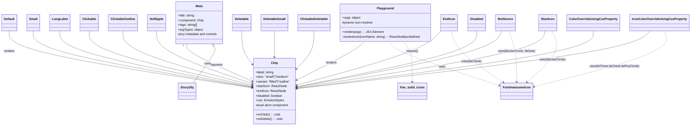

# Diagram: web/portal/src/components/atoms/Chip.atom.stories.tsx

> Auto-generated by Obscura crawlers

## Mermaid

### SVG

<svg id="container" width="3456.5234375" xmlns="http://www.w3.org/2000/svg" class="classDiagram" height="642" viewBox="0 0 3456.5234375 642" role="graphics-document document" aria-roledescription="class"><g><defs><marker id="container_class-aggregationStart" class="marker aggregation class" refX="18" refY="7" markerWidth="190" markerHeight="240" orient="auto"><path d="M 18,7 L9,13 L1,7 L9,1 Z"></path></marker></defs><defs><marker id="container_class-aggregationEnd" class="marker aggregation class" refX="1" refY="7" markerWidth="20" markerHeight="28" orient="auto"><path d="M 18,7 L9,13 L1,7 L9,1 Z"></path></marker></defs><defs><marker id="container_class-extensionStart" class="marker extension class" refX="18" refY="7" markerWidth="190" markerHeight="240" orient="auto"><path d="M 1,7 L18,13 V 1 Z"></path></marker></defs><defs><marker id="container_class-extensionEnd" class="marker extension class" refX="1" refY="7" markerWidth="20" markerHeight="28" orient="auto"><path d="M 1,1 V 13 L18,7 Z"></path></marker></defs><defs><marker id="container_class-compositionStart" class="marker composition class" refX="18" refY="7" markerWidth="190" markerHeight="240" orient="auto"><path d="M 18,7 L9,13 L1,7 L9,1 Z"></path></marker></defs><defs><marker id="container_class-compositionEnd" class="marker composition class" refX="1" refY="7" markerWidth="20" markerHeight="28" orient="auto"><path d="M 18,7 L9,13 L1,7 L9,1 Z"></path></marker></defs><defs><marker id="container_class-dependencyStart" class="marker dependency class" refX="6" refY="7" markerWidth="190" markerHeight="240" orient="auto"><path d="M 5,7 L9,13 L1,7 L9,1 Z"></path></marker></defs><defs><marker id="container_class-dependencyEnd" class="marker dependency class" refX="13" refY="7" markerWidth="20" markerHeight="28" orient="auto"><path d="M 18,7 L9,13 L14,7 L9,1 Z"></path></marker></defs><defs><marker id="container_class-lollipopStart" class="marker lollipop class" refX="13" refY="7" markerWidth="190" markerHeight="240" orient="auto"><circle stroke="black" fill="transparent" cx="7" cy="7" r="6"></circle></marker></defs><defs><marker id="container_class-lollipopEnd" class="marker lollipop class" refX="1" refY="7" markerWidth="190" markerHeight="240" orient="auto"><circle stroke="black" fill="transparent" cx="7" cy="7" r="6"></circle></marker></defs><g class="root"><g class="clusters"></g><g class="edgePaths"><path d="M939.514,224L936.157,230.167C932.799,236.333,926.084,248.667,980.367,280.253C1034.651,311.839,1149.932,362.679,1207.573,388.099L1265.213,413.518" id="id_Meta_Chip_1" class="edge-thickness-normal edge-pattern-solid relation" style=";;;" data-edge="true" data-et="edge" data-id="id_Meta_Chip_1" data-points="W3sieCI6OTM5LjUxNDMwNDk1Njg5NjYsInkiOjIyNH0seyJ4Ijo5MTkuMzY5MTQwNjI1LCJ5IjoyNjF9LHsieCI6MTI3MC43MDMxMjUsInkiOjQxNS45MzkyODY0Nzk1ODIxN31d" marker-end="url(#container_class-dependencyEnd)"></path><path d="M1073.746,238.695L1076.032,242.413C1078.317,246.13,1082.888,253.565,1064.423,284.449C1045.958,315.333,1004.457,369.667,983.706,396.833L962.956,424" id="id_Meta_StoryObj_2" class="edge-thickness-normal edge-pattern-solid relation" style=";;;" data-edge="true" data-et="edge" data-id="id_Meta_StoryObj_2" data-points="W3sieCI6MTA2NC43MTIyNTc1NDMxMDM1LCJ5IjoyMjR9LHsieCI6MTA4Ny40NTg5ODQzNzUsInkiOjI2MX0seyJ4Ijo5NjIuOTU1NjIxMTg5MDI0NCwieSI6NDI0fV0=" marker-start="url(#container_class-aggregationStart)"></path><path d="M1841.693,212L1832.787,220.167C1823.881,228.333,1806.068,244.667,1749.634,276.948C1693.199,309.23,1598.142,357.46,1550.614,381.575L1503.085,405.69" id="id_Playground_Chip_3" class="edge-thickness-normal edge-pattern-solid relation" style=";;;" data-edge="true" data-et="edge" data-id="id_Playground_Chip_3" data-points="W3sieCI6MTg0MS42OTMxODQyNjcyNDEzLCJ5IjoyMTJ9LHsieCI6MTc4OC4yNTU4NTkzNzUsInkiOjI2MX0seyJ4IjoxNDk3LjczNDM3NSwieSI6NDA4LjQwNDU0MDExNTE0NjQ2fV0=" marker-end="url(#container_class-dependencyEnd)"></path><path d="M46.711,158L46.711,175.167C46.711,192.333,46.711,226.667,249.721,274.949C452.731,323.231,858.752,385.462,1061.762,416.577L1264.772,447.692" id="id_Default_Chip_4" class="edge-thickness-normal edge-pattern-solid relation" style=";;;" data-edge="true" data-et="edge" data-id="id_Default_Chip_4" data-points="W3sieCI6NDYuNzEwOTM3NSwieSI6MTU4fSx7IngiOjQ2LjcxMDkzNzUsInkiOjI2MX0seyJ4IjoxMjcwLjcwMzEyNSwieSI6NDQ4LjYwMTQ0NTA4NTAxN31d" marker-end="url(#container_class-dependencyEnd)"></path><path d="M167.82,158L167.82,175.167C167.82,192.333,167.82,226.667,350.648,274.645C533.476,322.624,899.131,384.248,1081.959,415.06L1264.787,445.872" id="id_Small_Chip_5" class="edge-thickness-normal edge-pattern-solid relation" style=";;;" data-edge="true" data-et="edge" data-id="id_Small_Chip_5" data-points="W3sieCI6MTY3LjgyMDMxMjUsInkiOjE1OH0seyJ4IjoxNjcuODIwMzEyNSwieSI6MjYxfSx7IngiOjEyNzAuNzAzMTI1LCJ5Ijo0NDYuODY5MTc3MDY2MDA1Nn1d" marker-end="url(#container_class-dependencyEnd)"></path><path d="M299.797,158L299.797,175.167C299.797,192.333,299.797,226.667,460.632,274.238C621.467,321.809,943.137,382.618,1103.972,413.022L1264.808,443.426" id="id_LongLabel_Chip_6" class="edge-thickness-normal edge-pattern-solid relation" style=";;;" data-edge="true" data-et="edge" data-id="id_LongLabel_Chip_6" data-points="W3sieCI6Mjk5Ljc5Njg3NSwieSI6MTU4fSx7IngiOjI5OS43OTY4NzUsInkiOjI2MX0seyJ4IjoxMjcwLjcwMzEyNSwieSI6NDQ0LjU0MDkxMzIxNzAwNzl9XQ==" marker-end="url(#container_class-dependencyEnd)"></path><path d="M444.57,158L444.57,175.167C444.57,192.333,444.57,226.667,581.282,273.659C717.994,320.652,991.417,380.304,1128.129,410.13L1264.841,439.956" id="id_Clickable_Chip_7" class="edge-thickness-normal edge-pattern-solid relation" style=";;;" data-edge="true" data-et="edge" data-id="id_Clickable_Chip_7" data-points="W3sieCI6NDQ0LjU3MDMxMjUsInkiOjE1OH0seyJ4Ijo0NDQuNTcwMzEyNSwieSI6MjYxfSx7IngiOjEyNzAuNzAzMTI1LCJ5Ijo0NDEuMjM0NjcwNTQ2NjYzOX1d" marker-end="url(#container_class-dependencyEnd)"></path><path d="M611.734,158L611.734,175.167C611.734,192.333,611.734,226.667,720.596,272.723C829.458,318.779,1047.181,376.558,1156.042,405.447L1264.904,434.337" id="id_ClickableOutline_Chip_8" class="edge-thickness-normal edge-pattern-solid relation" style=";;;" data-edge="true" data-et="edge" data-id="id_ClickableOutline_Chip_8" data-points="W3sieCI6NjExLjczNDM3NSwieSI6MTU4fSx7IngiOjYxMS43MzQzNzUsInkiOjI2MX0seyJ4IjoxMjcwLjcwMzEyNSwieSI6NDM1Ljg3NTUwMzE0NTI5MDE3fV0=" marker-end="url(#container_class-dependencyEnd)"></path><path d="M779.18,158L779.18,175.167C779.18,192.333,779.18,226.667,860.153,271.269C941.127,315.871,1103.074,370.742,1184.047,398.178L1265.02,425.613" id="id_NoRipple_Chip_9" class="edge-thickness-normal edge-pattern-solid relation" style=";;;" data-edge="true" data-et="edge" data-id="id_NoRipple_Chip_9" data-points="W3sieCI6Nzc5LjE3OTY4NzUsInkiOjE1OH0seyJ4Ijo3NzkuMTc5Njg3NSwieSI6MjYxfSx7IngiOjEyNzAuNzAzMTI1LCJ5Ijo0MjcuNTM4NTExMjAxNDk3ODR9XQ==" marker-end="url(#container_class-dependencyEnd)"></path><path d="M2231.222,158L2215.057,175.167C2198.891,192.333,2166.56,226.667,2045.276,272.565C1923.993,318.464,1713.758,375.927,1608.64,404.659L1503.522,433.391" id="id_EndIcon_Chip_10" class="edge-thickness-normal edge-pattern-solid relation" style=";;;" data-edge="true" data-et="edge" data-id="id_EndIcon_Chip_10" data-points="W3sieCI6MjIzMS4yMjI0OTQ2MTIwNjksInkiOjE1OH0seyJ4IjoyMTM0LjIyODUxNTYyNSwieSI6MjYxfSx7IngiOjE0OTcuNzM0Mzc1LCJ5Ijo0MzQuOTcyNzk5ODMzMzM1NX1d" marker-end="url(#container_class-dependencyEnd)"></path><path d="M2749.667,158L2744.633,175.167C2739.598,192.333,2729.53,226.667,2521.863,274.944C2314.196,323.22,1908.93,385.441,1706.298,416.551L1503.665,447.661" id="id_StartIcon_Chip_11" class="edge-thickness-normal edge-pattern-solid relation" style=";;;" data-edge="true" data-et="edge" data-id="id_StartIcon_Chip_11" data-points="W3sieCI6Mjc0OS42NjcyNDEzNzkzMTAzLCJ5IjoxNTh9LHsieCI6MjcxOS40NjA5Mzc1LCJ5IjoyNjF9LHsieCI6MTQ5Ny43MzQzNzUsInkiOjQ0OC41NzE5MjMzOTg3Mjh9XQ==" marker-end="url(#container_class-dependencyEnd)"></path><path d="M2532.79,158L2525.542,175.167C2518.294,192.333,2503.797,226.667,2332.271,274.308C2160.745,321.949,1832.189,382.898,1667.912,413.373L1503.634,443.848" id="id_BothIcons_Chip_12" class="edge-thickness-normal edge-pattern-solid relation" style=";;;" data-edge="true" data-et="edge" data-id="id_BothIcons_Chip_12" data-points="W3sieCI6MjUzMi43ODk5Nzg0NDgyNzYsInkiOjE1OH0seyJ4IjoyNDg5LjMwMDc4MTI1LCJ5IjoyNjF9LHsieCI6MTQ5Ny43MzQzNzUsInkiOjQ0NC45NDIxMDM0MjEzMzgyM31d" marker-end="url(#container_class-dependencyEnd)"></path><path d="M1219.258,158L1219.258,175.167C1219.258,192.333,1219.258,226.667,1227.205,253.71C1235.152,280.753,1251.047,300.505,1258.994,310.381L1266.942,320.258" id="id_Deletable_Chip_13" class="edge-thickness-normal edge-pattern-solid relation" style=";;;" data-edge="true" data-et="edge" data-id="id_Deletable_Chip_13" data-points="W3sieCI6MTIxOS4yNTc4MTI1LCJ5IjoxNTh9LHsieCI6MTIxOS4yNTc4MTI1LCJ5IjoyNjF9LHsieCI6MTI3MC43MDMxMjUsInkiOjMyNC45MzIwMzg4MzQ5NTE0N31d" marker-end="url(#container_class-dependencyEnd)"></path><path d="M1384.219,158L1384.219,175.167C1384.219,192.333,1384.219,226.667,1384.219,249C1384.219,271.333,1384.219,281.667,1384.219,286.833L1384.219,292" id="id_DeletableSmall_Chip_14" class="edge-thickness-normal edge-pattern-solid relation" style=";;;" data-edge="true" data-et="edge" data-id="id_DeletableSmall_Chip_14" data-points="W3sieCI6MTM4NC4yMTg3NSwieSI6MTU4fSx7IngiOjEzODQuMjE4NzUsInkiOjI2MX0seyJ4IjoxMzg0LjIxODc1LCJ5IjoyOTh9XQ==" marker-end="url(#container_class-dependencyEnd)"></path><path d="M1582.375,158L1582.375,175.167C1582.375,192.333,1582.375,226.667,1568.963,257.708C1555.551,288.75,1528.728,316.5,1515.316,330.375L1501.904,344.25" id="id_ClickableDeletable_Chip_15" class="edge-thickness-normal edge-pattern-solid relation" style=";;;" data-edge="true" data-et="edge" data-id="id_ClickableDeletable_Chip_15" data-points="W3sieCI6MTU4Mi4zNzUsInkiOjE1OH0seyJ4IjoxNTgyLjM3NSwieSI6MjYxfSx7IngiOjE0OTcuNzM0Mzc1LCJ5IjozNDguNTYzODcwMDUyMDQyMjZ9XQ==" marker-end="url(#container_class-dependencyEnd)"></path><path d="M2408.078,158L2408.078,175.167C2408.078,192.333,2408.078,226.667,2257.335,274.016C2106.591,321.365,1805.104,381.729,1654.361,411.911L1503.618,442.094" id="id_Disabled_Chip_16" class="edge-thickness-normal edge-pattern-solid relation" style=";;;" data-edge="true" data-et="edge" data-id="id_Disabled_Chip_16" data-points="W3sieCI6MjQwOC4wNzgxMjUsInkiOjE1OH0seyJ4IjoyNDA4LjA3ODEyNSwieSI6MjYxfSx7IngiOjE0OTcuNzM0Mzc1LCJ5Ijo0NDMuMjcxNTgyNzA2MzY1MzR9XQ==" marker-end="url(#container_class-dependencyEnd)"></path><path d="M2985.133,158L2985.133,175.167C2985.133,192.333,2985.133,226.667,2738.225,275.45C2491.317,324.234,1997.501,387.468,1750.594,419.085L1503.686,450.702" id="id_ColorOverrideUsingCssProperty_Chip_17" class="edge-thickness-normal edge-pattern-solid relation" style=";;;" data-edge="true" data-et="edge" data-id="id_ColorOverrideUsingCssProperty_Chip_17" data-points="W3sieCI6Mjk4NS4xMzI4MTI1LCJ5IjoxNTh9LHsieCI6Mjk4NS4xMzI4MTI1LCJ5IjoyNjF9LHsieCI6MTQ5Ny43MzQzNzUsInkiOjQ1MS40NjQxMTQ3MzkxMzgyN31d" marker-end="url(#container_class-dependencyEnd)"></path><path d="M3262.105,158L3244.318,175.167C3226.53,192.333,3190.954,226.667,2897.886,275.695C2604.817,324.724,2054.256,388.448,1778.975,420.31L1503.695,452.171" id="id_IconColorOverrideUsingCssProperty_Chip_18" class="edge-thickness-normal edge-pattern-solid relation" style=";;;" data-edge="true" data-et="edge" data-id="id_IconColorOverrideUsingCssProperty_Chip_18" data-points="W3sieCI6MzI2Mi4xMDU0NDE4MTAzNDUsInkiOjE1OH0seyJ4IjozMTU1LjM3ODkwNjI1LCJ5IjoyNjF9LHsieCI6MTQ5Ny43MzQzNzUsInkiOjQ1Mi44NjEzMjE5MTc3OTMxM31d" marker-end="url(#container_class-dependencyEnd)"></path><path d="M1969.697,212L1971.681,220.167C1973.664,228.333,1977.63,244.667,2069.846,282.418C2162.062,320.17,2342.528,379.34,2432.761,408.925L2522.994,438.51" id="id_Playground_FontAwesomeIcon_19" class="edge-thickness-normal edge-pattern-dashed relation" style=";;;" data-edge="true" data-et="edge" data-id="id_Playground_FontAwesomeIcon_19" data-points="W3sieCI6MTk2OS42OTc0OTQ2MTIwNjksInkiOjIxMn0seyJ4IjoxOTgxLjU5NTcwMzEyNSwieSI6MjYxfSx7IngiOjI1MjguNjk1MzEyNSwieSI6NDQwLjM3OTcyMjc5NDA1MX1d" marker-end="url(#container_class-dependencyEnd)"></path><path d="M2036.789,212L2044.479,220.167C2052.17,228.333,2067.551,244.667,2075.727,279C2083.904,313.334,2084.876,365.667,2085.362,391.834L2085.848,418.001" id="id_Playground_free_solid_icons_20" class="edge-thickness-normal edge-pattern-dashed relation" style=";;;" data-edge="true" data-et="edge" data-id="id_Playground_free_solid_icons_20" data-points="W3sieCI6MjAzNi43ODg4NzM5MjI0MTM4LCJ5IjoyMTJ9LHsieCI6MjA4Mi45MzE2NDA2MjUsInkiOjI2MX0seyJ4IjoyMDg1Ljk1OTkzNzExODkwMjQsInkiOjQyNH1d" marker-end="url(#container_class-dependencyEnd)"></path><path d="M2566.835,158L2573.502,175.167C2580.168,192.333,2593.502,226.667,2600.169,270C2606.836,313.333,2606.836,365.667,2606.836,391.833L2606.836,418" id="id_BothIcons_FontAwesomeIcon_21" class="edge-thickness-normal edge-pattern-dashed relation" style=";;;" data-edge="true" data-et="edge" data-id="id_BothIcons_FontAwesomeIcon_21" data-points="W3sieCI6MjU2Ni44MzQ2NDQzOTY1NTE1LCJ5IjoxNTh9LHsieCI6MjYwNi44MzU5Mzc1LCJ5IjoyNjF9LHsieCI6MjYwNi44MzU5Mzc1LCJ5Ijo0MjR9XQ==" marker-end="url(#container_class-dependencyEnd)"></path><path d="M2280.897,158L2285.034,175.167C2289.172,192.333,2297.447,226.667,2340.662,270.437C2383.877,314.208,2462.031,367.416,2501.108,394.02L2540.185,420.623" id="id_EndIcon_FontAwesomeIcon_22" class="edge-thickness-normal edge-pattern-dashed relation" style=";;;" data-edge="true" data-et="edge" data-id="id_EndIcon_FontAwesomeIcon_22" data-points="W3sieCI6MjI4MC44OTY2NTk0ODI3NTg0LCJ5IjoxNTh9LHsieCI6MjMwNS43MjI2NTYyNSwieSI6MjYxfSx7IngiOjI1NDUuMTQ0NDM1OTc1NjA5NywieSI6NDI0fV0=" marker-end="url(#container_class-dependencyEnd)"></path><path d="M2781.985,158L2790.16,175.167C2798.335,192.333,2814.685,226.667,2793.887,270.325C2773.089,313.984,2715.143,366.967,2686.17,393.459L2657.197,419.951" id="id_StartIcon_FontAwesomeIcon_23" class="edge-thickness-normal edge-pattern-dashed relation" style=";;;" data-edge="true" data-et="edge" data-id="id_StartIcon_FontAwesomeIcon_23" data-points="W3sieCI6Mjc4MS45ODUyOTA5NDgyNzYsInkiOjE1OH0seyJ4IjoyODMxLjAzNTE1NjI1LCJ5IjoyNjF9LHsieCI6MjY1Mi43Njk0MzU5NzU2MDk3LCJ5Ijo0MjR9XQ==" marker-end="url(#container_class-dependencyEnd)"></path><path d="M3326.477,158L3335,175.167C3343.522,192.333,3360.568,226.667,3254.617,274.279C3148.667,321.892,2919.721,382.783,2805.248,413.229L2690.775,443.675" id="id_IconColorOverrideUsingCssProperty_FontAwesomeIcon_24" class="edge-thickness-normal edge-pattern-dashed relation" style=";;;" data-edge="true" data-et="edge" data-id="id_IconColorOverrideUsingCssProperty_FontAwesomeIcon_24" data-points="W3sieCI6MzMyNi40NzY3NzgwMTcyNDE1LCJ5IjoxNTh9LHsieCI6MzM3Ny42MTMyODEyNSwieSI6MjYxfSx7IngiOjI2ODQuOTc2NTYyNSwieSI6NDQ1LjIxNzMwODAxMzkyNjd9XQ==" marker-end="url(#container_class-dependencyEnd)"></path></g><g class="edgeLabels"><g class="edgeLabel" transform="translate(1075.76275, 329.97003)"><g class="label" data-id="id_Meta_Chip_1" transform="translate(-41.2421875, -12)"><foreignObject width="82.484375" height="24">

component

</foreignObject></g></g><g class="edgeLabel" transform="translate(1038.38935, 325.24204)"><g class="label" data-id="id_Meta_StoryObj_2" transform="translate(-16.4921875, -12)"><foreignObject width="32.984375" height="24">

uses

</foreignObject></g></g><g class="edgeLabel" transform="translate(1675.32304, 318.29976)"><g class="label" data-id="id_Playground_Chip_3" transform="translate(-27.75, -12)"><foreignObject width="55.5" height="24">

renders

</foreignObject></g></g><g class="edgeLabel" transform="translate(46.7109375, 261)"><g class="label" data-id="id_Default_Chip_4" transform="translate(-27.75, -12)"><foreignObject width="55.5" height="24">

renders

</foreignObject></g></g><g class="edgeLabel"><g class="label" data-id="id_Small_Chip_5" transform="translate(0, 0)"><foreignObject width="0" height="0">

</foreignObject></g></g><g class="edgeLabel"><g class="label" data-id="id_LongLabel_Chip_6" transform="translate(0, 0)"><foreignObject width="0" height="0">

</foreignObject></g></g><g class="edgeLabel"><g class="label" data-id="id_Clickable_Chip_7" transform="translate(0, 0)"><foreignObject width="0" height="0">

</foreignObject></g></g><g class="edgeLabel"><g class="label" data-id="id_ClickableOutline_Chip_8" transform="translate(0, 0)"><foreignObject width="0" height="0">

</foreignObject></g></g><g class="edgeLabel"><g class="label" data-id="id_NoRipple_Chip_9" transform="translate(0, 0)"><foreignObject width="0" height="0">

</foreignObject></g></g><g class="edgeLabel"><g class="label" data-id="id_EndIcon_Chip_10" transform="translate(0, 0)"><foreignObject width="0" height="0">

</foreignObject></g></g><g class="edgeLabel"><g class="label" data-id="id_StartIcon_Chip_11" transform="translate(0, 0)"><foreignObject width="0" height="0">

</foreignObject></g></g><g class="edgeLabel"><g class="label" data-id="id_BothIcons_Chip_12" transform="translate(0, 0)"><foreignObject width="0" height="0">

</foreignObject></g></g><g class="edgeLabel"><g class="label" data-id="id_Deletable_Chip_13" transform="translate(0, 0)"><foreignObject width="0" height="0">

</foreignObject></g></g><g class="edgeLabel"><g class="label" data-id="id_DeletableSmall_Chip_14" transform="translate(0, 0)"><foreignObject width="0" height="0">

</foreignObject></g></g><g class="edgeLabel"><g class="label" data-id="id_ClickableDeletable_Chip_15" transform="translate(0, 0)"><foreignObject width="0" height="0">

</foreignObject></g></g><g class="edgeLabel"><g class="label" data-id="id_Disabled_Chip_16" transform="translate(0, 0)"><foreignObject width="0" height="0">

</foreignObject></g></g><g class="edgeLabel"><g class="label" data-id="id_ColorOverrideUsingCssProperty_Chip_17" transform="translate(0, 0)"><foreignObject width="0" height="0">

</foreignObject></g></g><g class="edgeLabel"><g class="label" data-id="id_IconColorOverrideUsingCssProperty_Chip_18" transform="translate(0, 0)"><foreignObject width="0" height="0">

</foreignObject></g></g><g class="edgeLabel" transform="translate(2231.18842, 342.83495)"><g class="label" data-id="id_Playground_FontAwesomeIcon_19" transform="translate(-16.4921875, -12)"><foreignObject width="32.984375" height="24">

uses

</foreignObject></g></g><g class="edgeLabel" transform="translate(2083.82067, 308.85259)"><g class="label" data-id="id_Playground_free_solid_icons_20" transform="translate(-31.296875, -12)"><foreignObject width="62.59375" height="24">

require()

</foreignObject></g></g><g class="edgeLabel" transform="translate(2606.8359375, 261)"><g class="label" data-id="id_BothIcons_FontAwesomeIcon_21" transform="translate(-92.625, -12)"><foreignObject width="185.25" height="24">

uses(faUserCircle, faGear)

</foreignObject></g></g><g class="edgeLabel" transform="translate(2381.64369, 312.68757)"><g class="label" data-id="id_EndIcon_FontAwesomeIcon_22" transform="translate(-49.8984375, -12)"><foreignObject width="99.796875" height="24">

uses(faCheck)

</foreignObject></g></g><g class="edgeLabel" transform="translate(2783.99883, 304.00839)"><g class="label" data-id="id_StartIcon_FontAwesomeIcon_23" transform="translate(-65.046875, -12)"><foreignObject width="130.09375" height="24">

uses(faUserCircle)

</foreignObject></g></g><g class="edgeLabel" transform="translate(3086.8609, 338.33003)"><g class="label" data-id="id_IconColorOverrideUsingCssProperty_FontAwesomeIcon_24" transform="translate(-123.9765625, -12)"><foreignObject width="247.953125" height="24">

uses(faTimes,faCheck,faPlusCircle)

</foreignObject></g></g><g class="edgeTerminals" transform="translate(917.9722119765922, 232.19684734051035)"><g class="inner" transform="translate(0, 0)"><foreignObject style="width: 9px; height: 12px;">
1
</foreignObject></g></g><g class="edgeTerminals" transform="translate(1255.7436473333248, 390.1532620073544)"><g class="inner" transform="translate(0, 0)"></g><foreignObject style="width: 9px; height: 12px;">
1
</foreignObject></g></g><g class="nodes"><g class="node default" id="classId-Chip-0" transform="translate(1384.21875, 466)"><g class="basic label-container"><path d="M-113.515625 -168 L113.515625 -168 L113.515625 168 L-113.515625 168" stroke="none" stroke-width="0" fill="#ECECFF" style=""></path><path d="M-113.515625 -168 C-56.723874604465465 -168, 0.0678757910690706 -168, 113.515625 -168 M-113.515625 -168 C-64.59857086059823 -168, -15.68151672119646 -168, 113.515625 -168 M113.515625 -168 C113.515625 -75.03073281334784, 113.515625 17.93853437330432, 113.515625 168 M113.515625 -168 C113.515625 -62.2515493162325, 113.515625 43.496901367535, 113.515625 168 M113.515625 168 C33.41803558245192 168, -46.67955383509616 168, -113.515625 168 M113.515625 168 C54.13301196143327 168, -5.2496010771334625 168, -113.515625 168 M-113.515625 168 C-113.515625 99.09603092233652, -113.515625 30.19206184467305, -113.515625 -168 M-113.515625 168 C-113.515625 90.34362466789618, -113.515625 12.687249335792359, -113.515625 -168" stroke="#9370DB" stroke-width="1.3" fill="none" stroke-dasharray="0 0" style=""></path></g><g class="annotation-group text" transform="translate(0, -144)"></g><g class="label-group text" transform="translate(-16.171875, -144)"><g class="label" style="font-weight: bolder" transform="translate(0,-12)"><foreignObject width="32.34375" height="24">

Chip

</foreignObject></g></g><g class="members-group text" transform="translate(-101.515625, -96)"><g class="label" style="" transform="translate(0,-12)"><foreignObject width="94.09375" height="24">

+label: string

</foreignObject></g><g class="label" style="" transform="translate(0,12)"><foreignObject width="173.71875" height="24">

+size: "small"|"medium"

</foreignObject></g><g class="label" style="" transform="translate(0,36)"><foreignObject width="186.859375" height="24">

+variant: "filled"|"outline"

</foreignObject></g><g class="label" style="" transform="translate(0,60)"><foreignObject width="159.3125" height="24">

+startIcon: ReactNode

</foreignObject></g><g class="label" style="" transform="translate(0,84)"><foreignObject width="153.1875" height="24">

+endIcon: ReactNode

</foreignObject></g><g class="label" style="" transform="translate(0,108)"><foreignObject width="138.015625" height="24">

+disabled: boolean

</foreignObject></g><g class="label" style="" transform="translate(0,132)"><foreignObject width="142.0625" height="24">

+css: EmotionStyles

</foreignObject></g><g class="label" style="" transform="translate(0,156)"><foreignObject width="170.671875" height="24">

visual atom component

</foreignObject></g></g><g class="methods-group text" transform="translate(-101.515625, 120)"><g class="label" style="" transform="translate(0,-12)"><foreignObject width="122.546875" height="24">

+onClick() : : void

</foreignObject></g><g class="label" style="" transform="translate(0,12)"><foreignObject width="135.3125" height="24">

+onDelete() : : void

</foreignObject></g></g><g class="divider" style=""><path d="M-113.515625 -120 C-42.856438419328285 -120, 27.80274816134343 -120, 113.515625 -120 M-113.515625 -120 C-46.40615097715015 -120, 20.703323045699705 -120, 113.515625 -120" stroke="#9370DB" stroke-width="1.3" fill="none" stroke-dasharray="0 0" style=""></path></g><g class="divider" style=""><path d="M-113.515625 96 C-48.309801087674956 96, 16.89602282465009 96, 113.515625 96 M-113.515625 96 C-25.708340314268725 96, 62.09894437146255 96, 113.515625 96" stroke="#9370DB" stroke-width="1.3" fill="none" stroke-dasharray="0 0" style=""></path></g></g><g class="node default" id="classId-Meta-1" transform="translate(998.31640625, 116)"><g class="basic label-container"><path d="M-123.66015625 -108 L123.66015625 -108 L123.66015625 108 L-123.66015625 108" stroke="none" stroke-width="0" fill="#ECECFF" style=""></path><path d="M-123.66015625 -108 C-50.91099698154851 -108, 21.838162286902985 -108, 123.66015625 -108 M-123.66015625 -108 C-61.546016667582265 -108, 0.5681229148354703 -108, 123.66015625 -108 M123.66015625 -108 C123.66015625 -49.6931752124378, 123.66015625 8.613649575124398, 123.66015625 108 M123.66015625 -108 C123.66015625 -28.064310595204432, 123.66015625 51.871378809591135, 123.66015625 108 M123.66015625 108 C56.676238043580454 108, -10.307680162839091 108, -123.66015625 108 M123.66015625 108 C63.71187432836916 108, 3.7635924067383257 108, -123.66015625 108 M-123.66015625 108 C-123.66015625 48.73500203471327, -123.66015625 -10.529995930573463, -123.66015625 -108 M-123.66015625 108 C-123.66015625 49.86989549916004, -123.66015625 -8.260209001679925, -123.66015625 -108" stroke="#9370DB" stroke-width="1.3" fill="none" stroke-dasharray="0 0" style=""></path></g><g class="annotation-group text" transform="translate(0, -84)"></g><g class="label-group text" transform="translate(-18.0859375, -84)"><g class="label" style="font-weight: bolder" transform="translate(0,-12)"><foreignObject width="36.171875" height="24">

Meta

</foreignObject></g></g><g class="members-group text" transform="translate(-111.66015625, -36)"><g class="label" style="" transform="translate(0,-12)"><foreignObject width="86.859375" height="24">

+title: string

</foreignObject></g><g class="label" style="" transform="translate(0,12)"><foreignObject width="130.8125" height="24">

+component: Chip

</foreignObject></g><g class="label" style="" transform="translate(0,36)"><foreignObject width="97.8125" height="24">

+tags: string[]

</foreignObject></g><g class="label" style="" transform="translate(0,60)"><foreignObject width="125.46875" height="24">

+argTypes: object

</foreignObject></g><g class="label" style="" transform="translate(0,84)"><foreignObject width="205.234375" height="24">

story metadata and controls

</foreignObject></g></g><g class="methods-group text" transform="translate(-111.66015625, 108)"></g><g class="divider" style=""><path d="M-123.66015625 -60 C-58.81937803504931 -60, 6.021400179901377 -60, 123.66015625 -60 M-123.66015625 -60 C-41.49699594810443 -60, 40.666164353791146 -60, 123.66015625 -60" stroke="#9370DB" stroke-width="1.3" fill="none" stroke-dasharray="0 0" style=""></path></g><g class="divider" style=""><path d="M-123.66015625 84 C-40.358765848170194 84, 42.94262455365961 84, 123.66015625 84 M-123.66015625 84 C-44.976937552654434 84, 33.70628114469113 84, 123.66015625 84" stroke="#9370DB" stroke-width="1.3" fill="none" stroke-dasharray="0 0" style=""></path></g></g><g class="node default" id="classId-StoryObj-2" transform="translate(930.875, 466)"><g class="basic label-container"><path d="M-44.1015625 -42 L44.1015625 -42 L44.1015625 42 L-44.1015625 42" stroke="none" stroke-width="0" fill="#ECECFF" style=""></path><path d="M-44.1015625 -42 C-24.33504233915815 -42, -4.5685221783163 -42, 44.1015625 -42 M-44.1015625 -42 C-19.702215723683775 -42, 4.69713105263245 -42, 44.1015625 -42 M44.1015625 -42 C44.1015625 -10.016651109783538, 44.1015625 21.966697780432924, 44.1015625 42 M44.1015625 -42 C44.1015625 -18.744080550949622, 44.1015625 4.511838898100756, 44.1015625 42 M44.1015625 42 C14.776835321817885 42, -14.547891856364231 42, -44.1015625 42 M44.1015625 42 C19.618218860258303 42, -4.865124779483395 42, -44.1015625 42 M-44.1015625 42 C-44.1015625 12.047784222238523, -44.1015625 -17.904431555522955, -44.1015625 -42 M-44.1015625 42 C-44.1015625 24.008692657785097, -44.1015625 6.017385315570195, -44.1015625 -42" stroke="#9370DB" stroke-width="1.3" fill="none" stroke-dasharray="0 0" style=""></path></g><g class="annotation-group text" transform="translate(0, -18)"></g><g class="label-group text" transform="translate(-32.1015625, -18)"><g class="label" style="font-weight: bolder" transform="translate(0,-12)"><foreignObject width="64.203125" height="24">

StoryObj

</foreignObject></g></g><g class="members-group text" transform="translate(-32.1015625, 30)"></g><g class="methods-group text" transform="translate(-32.1015625, 60)"></g><g class="divider" style=""><path d="M-44.1015625 6 C-15.358739152296152 6, 13.384084195407695 6, 44.1015625 6 M-44.1015625 6 C-9.533769376027365 6, 25.03402374794527 6, 44.1015625 6" stroke="#9370DB" stroke-width="1.3" fill="none" stroke-dasharray="0 0" style=""></path></g><g class="divider" style=""><path d="M-44.1015625 24 C-21.421075932914036 24, 1.2594106341719282 24, 44.1015625 24 M-44.1015625 24 C-26.34878218948783 24, -8.596001878975663 24, 44.1015625 24" stroke="#9370DB" stroke-width="1.3" fill="none" stroke-dasharray="0 0" style=""></path></g></g><g class="node default" id="classId-Playground-3" transform="translate(1946.38671875, 116)"><g class="basic label-container"><path d="M-233.53515625 -96 L233.53515625 -96 L233.53515625 96 L-233.53515625 96" stroke="none" stroke-width="0" fill="#ECECFF" style=""></path><path d="M-233.53515625 -96 C-73.26788267206948 -96, 86.99939090586105 -96, 233.53515625 -96 M-233.53515625 -96 C-108.49653222584095 -96, 16.542091798318097 -96, 233.53515625 -96 M233.53515625 -96 C233.53515625 -51.85269171060296, 233.53515625 -7.705383421205923, 233.53515625 96 M233.53515625 -96 C233.53515625 -41.78131390207353, 233.53515625 12.437372195852944, 233.53515625 96 M233.53515625 96 C139.05940559955496 96, 44.5836549491099 96, -233.53515625 96 M233.53515625 96 C71.20587360285614 96, -91.12340904428771 96, -233.53515625 96 M-233.53515625 96 C-233.53515625 56.66503690969742, -233.53515625 17.33007381939484, -233.53515625 -96 M-233.53515625 96 C-233.53515625 25.94340933197857, -233.53515625 -44.11318133604286, -233.53515625 -96" stroke="#9370DB" stroke-width="1.3" fill="none" stroke-dasharray="0 0" style=""></path></g><g class="annotation-group text" transform="translate(0, -72)"></g><g class="label-group text" transform="translate(-41.4765625, -72)"><g class="label" style="font-weight: bolder" transform="translate(0,-12)"><foreignObject width="82.953125" height="24">

Playground

</foreignObject></g></g><g class="members-group text" transform="translate(-221.53515625, -24)"><g class="label" style="" transform="translate(0,-12)"><foreignObject width="91.625" height="24">

+args: object

</foreignObject></g><g class="label" style="" transform="translate(0,12)"><foreignObject width="158.90625" height="24">

dynamic icon resolver

</foreignObject></g></g><g class="methods-group text" transform="translate(-221.53515625, 48)"><g class="label" style="" transform="translate(0,-12)"><foreignObject width="202.671875" height="24">

+render(args) : : JSX.Element

</foreignObject></g><g class="label" style="" transform="translate(0,12)"><foreignObject width="401.59375" height="24">

-resolveIcon(iconName: string) : : ReactNode|undefined

</foreignObject></g></g><g class="divider" style=""><path d="M-233.53515625 -48 C-133.69035420473296 -48, -33.84555215946588 -48, 233.53515625 -48 M-233.53515625 -48 C-84.67561528512942 -48, 64.18392567974115 -48, 233.53515625 -48" stroke="#9370DB" stroke-width="1.3" fill="none" stroke-dasharray="0 0" style=""></path></g><g class="divider" style=""><path d="M-233.53515625 24 C-114.3876679171113 24, 4.759820415777398 24, 233.53515625 24 M-233.53515625 24 C-115.05893682065773 24, 3.4172826086845305 24, 233.53515625 24" stroke="#9370DB" stroke-width="1.3" fill="none" stroke-dasharray="0 0" style=""></path></g></g><g class="node default" id="classId-Default-4" transform="translate(46.7109375, 116)"><g class="basic label-container"><path d="M-38.7109375 -42 L38.7109375 -42 L38.7109375 42 L-38.7109375 42" stroke="none" stroke-width="0" fill="#ECECFF" style=""></path><path d="M-38.7109375 -42 C-11.309884073799626 -42, 16.091169352400748 -42, 38.7109375 -42 M-38.7109375 -42 C-8.587749718832999 -42, 21.535438062334002 -42, 38.7109375 -42 M38.7109375 -42 C38.7109375 -22.9759779076347, 38.7109375 -3.9519558152694003, 38.7109375 42 M38.7109375 -42 C38.7109375 -16.780431775859704, 38.7109375 8.439136448280593, 38.7109375 42 M38.7109375 42 C22.080077434319413 42, 5.449217368638827 42, -38.7109375 42 M38.7109375 42 C7.928341854073 42, -22.854253791854 42, -38.7109375 42 M-38.7109375 42 C-38.7109375 10.006358742967723, -38.7109375 -21.987282514064553, -38.7109375 -42 M-38.7109375 42 C-38.7109375 13.512801041521726, -38.7109375 -14.974397916956548, -38.7109375 -42" stroke="#9370DB" stroke-width="1.3" fill="none" stroke-dasharray="0 0" style=""></path></g><g class="annotation-group text" transform="translate(0, -18)"></g><g class="label-group text" transform="translate(-26.7109375, -18)"><g class="label" style="font-weight: bolder" transform="translate(0,-12)"><foreignObject width="53.421875" height="24">

Default

</foreignObject></g></g><g class="members-group text" transform="translate(-26.7109375, 30)"></g><g class="methods-group text" transform="translate(-26.7109375, 60)"></g><g class="divider" style=""><path d="M-38.7109375 6 C-8.676861245132049 6, 21.357215009735903 6, 38.7109375 6 M-38.7109375 6 C-17.254320092825445 6, 4.20229731434911 6, 38.7109375 6" stroke="#9370DB" stroke-width="1.3" fill="none" stroke-dasharray="0 0" style=""></path></g><g class="divider" style=""><path d="M-38.7109375 24 C-8.263923417956871 24, 22.183090664086258 24, 38.7109375 24 M-38.7109375 24 C-21.223114889947478 24, -3.7352922798949564 24, 38.7109375 24" stroke="#9370DB" stroke-width="1.3" fill="none" stroke-dasharray="0 0" style=""></path></g></g><g class="node default" id="classId-Small-5" transform="translate(167.8203125, 116)"><g class="basic label-container"><path d="M-32.3984375 -42 L32.3984375 -42 L32.3984375 42 L-32.3984375 42" stroke="none" stroke-width="0" fill="#ECECFF" style=""></path><path d="M-32.3984375 -42 C-8.679392182457132 -42, 15.039653135085736 -42, 32.3984375 -42 M-32.3984375 -42 C-18.449564835003365 -42, -4.500692170006733 -42, 32.3984375 -42 M32.3984375 -42 C32.3984375 -16.84053112206932, 32.3984375 8.318937755861363, 32.3984375 42 M32.3984375 -42 C32.3984375 -16.07533411247874, 32.3984375 9.849331775042522, 32.3984375 42 M32.3984375 42 C18.61753308970559 42, 4.836628679411177 42, -32.3984375 42 M32.3984375 42 C14.406294504837405 42, -3.5858484903251906 42, -32.3984375 42 M-32.3984375 42 C-32.3984375 15.755038276573252, -32.3984375 -10.489923446853496, -32.3984375 -42 M-32.3984375 42 C-32.3984375 24.583847176387337, -32.3984375 7.167694352774674, -32.3984375 -42" stroke="#9370DB" stroke-width="1.3" fill="none" stroke-dasharray="0 0" style=""></path></g><g class="annotation-group text" transform="translate(0, -18)"></g><g class="label-group text" transform="translate(-20.3984375, -18)"><g class="label" style="font-weight: bolder" transform="translate(0,-12)"><foreignObject width="40.796875" height="24">

Small

</foreignObject></g></g><g class="members-group text" transform="translate(-20.3984375, 30)"></g><g class="methods-group text" transform="translate(-20.3984375, 60)"></g><g class="divider" style=""><path d="M-32.3984375 6 C-15.383001392528566 6, 1.6324347149428675 6, 32.3984375 6 M-32.3984375 6 C-10.084256410770802 6, 12.229924678458396 6, 32.3984375 6" stroke="#9370DB" stroke-width="1.3" fill="none" stroke-dasharray="0 0" style=""></path></g><g class="divider" style=""><path d="M-32.3984375 24 C-15.739743992051533 24, 0.9189495158969336 24, 32.3984375 24 M-32.3984375 24 C-18.135931668876534 24, -3.873425837753068 24, 32.3984375 24" stroke="#9370DB" stroke-width="1.3" fill="none" stroke-dasharray="0 0" style=""></path></g></g><g class="node default" id="classId-LongLabel-6" transform="translate(299.796875, 116)"><g class="basic label-container"><path d="M-49.578125 -42 L49.578125 -42 L49.578125 42 L-49.578125 42" stroke="none" stroke-width="0" fill="#ECECFF" style=""></path><path d="M-49.578125 -42 C-10.366315838850916 -42, 28.845493322298168 -42, 49.578125 -42 M-49.578125 -42 C-12.41590755995636 -42, 24.74630988008728 -42, 49.578125 -42 M49.578125 -42 C49.578125 -8.485331719500458, 49.578125 25.029336560999084, 49.578125 42 M49.578125 -42 C49.578125 -20.09026125366369, 49.578125 1.8194774926726183, 49.578125 42 M49.578125 42 C22.379254433585306 42, -4.819616132829388 42, -49.578125 42 M49.578125 42 C12.663660300167983 42, -24.250804399664034 42, -49.578125 42 M-49.578125 42 C-49.578125 9.831567834062383, -49.578125 -22.336864331875233, -49.578125 -42 M-49.578125 42 C-49.578125 19.57659861404136, -49.578125 -2.8468027719172824, -49.578125 -42" stroke="#9370DB" stroke-width="1.3" fill="none" stroke-dasharray="0 0" style=""></path></g><g class="annotation-group text" transform="translate(0, -18)"></g><g class="label-group text" transform="translate(-37.578125, -18)"><g class="label" style="font-weight: bolder" transform="translate(0,-12)"><foreignObject width="75.15625" height="24">

LongLabel

</foreignObject></g></g><g class="members-group text" transform="translate(-37.578125, 30)"></g><g class="methods-group text" transform="translate(-37.578125, 60)"></g><g class="divider" style=""><path d="M-49.578125 6 C-22.59419536838754 6, 4.389734263224923 6, 49.578125 6 M-49.578125 6 C-11.193661607851922 6, 27.190801784296156 6, 49.578125 6" stroke="#9370DB" stroke-width="1.3" fill="none" stroke-dasharray="0 0" style=""></path></g><g class="divider" style=""><path d="M-49.578125 24 C-16.20322657652651 24, 17.17167184694698 24, 49.578125 24 M-49.578125 24 C-23.700788477074262 24, 2.176548045851476 24, 49.578125 24" stroke="#9370DB" stroke-width="1.3" fill="none" stroke-dasharray="0 0" style=""></path></g></g><g class="node default" id="classId-Clickable-7" transform="translate(444.5703125, 116)"><g class="basic label-container"><path d="M-45.1953125 -42 L45.1953125 -42 L45.1953125 42 L-45.1953125 42" stroke="none" stroke-width="0" fill="#ECECFF" style=""></path><path d="M-45.1953125 -42 C-22.653267870455586 -42, -0.11122324091117264 -42, 45.1953125 -42 M-45.1953125 -42 C-19.120963066888393 -42, 6.953386366223214 -42, 45.1953125 -42 M45.1953125 -42 C45.1953125 -9.700797847712842, 45.1953125 22.598404304574316, 45.1953125 42 M45.1953125 -42 C45.1953125 -14.053209743055547, 45.1953125 13.893580513888907, 45.1953125 42 M45.1953125 42 C26.798706770573233 42, 8.402101041146466 42, -45.1953125 42 M45.1953125 42 C26.31293222728242 42, 7.430551954564841 42, -45.1953125 42 M-45.1953125 42 C-45.1953125 11.119090966968887, -45.1953125 -19.761818066062226, -45.1953125 -42 M-45.1953125 42 C-45.1953125 25.116595712827888, -45.1953125 8.233191425655775, -45.1953125 -42" stroke="#9370DB" stroke-width="1.3" fill="none" stroke-dasharray="0 0" style=""></path></g><g class="annotation-group text" transform="translate(0, -18)"></g><g class="label-group text" transform="translate(-33.1953125, -18)"><g class="label" style="font-weight: bolder" transform="translate(0,-12)"><foreignObject width="66.390625" height="24">

Clickable

</foreignObject></g></g><g class="members-group text" transform="translate(-33.1953125, 30)"></g><g class="methods-group text" transform="translate(-33.1953125, 60)"></g><g class="divider" style=""><path d="M-45.1953125 6 C-10.128719352552764 6, 24.93787379489447 6, 45.1953125 6 M-45.1953125 6 C-17.575040623784933 6, 10.045231252430135 6, 45.1953125 6" stroke="#9370DB" stroke-width="1.3" fill="none" stroke-dasharray="0 0" style=""></path></g><g class="divider" style=""><path d="M-45.1953125 24 C-15.830873126445912 24, 13.533566247108176 24, 45.1953125 24 M-45.1953125 24 C-19.475074208680912 24, 6.245164082638176 24, 45.1953125 24" stroke="#9370DB" stroke-width="1.3" fill="none" stroke-dasharray="0 0" style=""></path></g></g><g class="node default" id="classId-ClickableOutline-8" transform="translate(611.734375, 116)"><g class="basic label-container"><path d="M-71.96875 -42 L71.96875 -42 L71.96875 42 L-71.96875 42" stroke="none" stroke-width="0" fill="#ECECFF" style=""></path><path d="M-71.96875 -42 C-38.52670293361591 -42, -5.084655867231817 -42, 71.96875 -42 M-71.96875 -42 C-34.87268975630142 -42, 2.223370487397162 -42, 71.96875 -42 M71.96875 -42 C71.96875 -22.439073806756877, 71.96875 -2.878147613513754, 71.96875 42 M71.96875 -42 C71.96875 -11.421486545268323, 71.96875 19.157026909463355, 71.96875 42 M71.96875 42 C35.80864483523527 42, -0.35146032952945916 42, -71.96875 42 M71.96875 42 C36.97830222909926 42, 1.9878544581985267 42, -71.96875 42 M-71.96875 42 C-71.96875 9.00202519029267, -71.96875 -23.99594961941466, -71.96875 -42 M-71.96875 42 C-71.96875 23.151722641059806, -71.96875 4.303445282119611, -71.96875 -42" stroke="#9370DB" stroke-width="1.3" fill="none" stroke-dasharray="0 0" style=""></path></g><g class="annotation-group text" transform="translate(0, -18)"></g><g class="label-group text" transform="translate(-59.96875, -18)"><g class="label" style="font-weight: bolder" transform="translate(0,-12)"><foreignObject width="119.9375" height="24">

ClickableOutline

</foreignObject></g></g><g class="members-group text" transform="translate(-59.96875, 30)"></g><g class="methods-group text" transform="translate(-59.96875, 60)"></g><g class="divider" style=""><path d="M-71.96875 6 C-22.20773058732484 6, 27.55328882535032 6, 71.96875 6 M-71.96875 6 C-30.162523811110255 6, 11.64370237777949 6, 71.96875 6" stroke="#9370DB" stroke-width="1.3" fill="none" stroke-dasharray="0 0" style=""></path></g><g class="divider" style=""><path d="M-71.96875 24 C-16.718205661256178 24, 38.532338677487644 24, 71.96875 24 M-71.96875 24 C-23.262627137992972 24, 25.443495724014056 24, 71.96875 24" stroke="#9370DB" stroke-width="1.3" fill="none" stroke-dasharray="0 0" style=""></path></g></g><g class="node default" id="classId-NoRipple-9" transform="translate(779.1796875, 116)"><g class="basic label-container"><path d="M-45.4765625 -42 L45.4765625 -42 L45.4765625 42 L-45.4765625 42" stroke="none" stroke-width="0" fill="#ECECFF" style=""></path><path d="M-45.4765625 -42 C-19.624741925267898 -42, 6.227078649464204 -42, 45.4765625 -42 M-45.4765625 -42 C-17.43573161553513 -42, 10.605099268929742 -42, 45.4765625 -42 M45.4765625 -42 C45.4765625 -23.88355983230159, 45.4765625 -5.767119664603179, 45.4765625 42 M45.4765625 -42 C45.4765625 -14.763290305356037, 45.4765625 12.473419389287926, 45.4765625 42 M45.4765625 42 C12.741503636730165 42, -19.99355522653967 42, -45.4765625 42 M45.4765625 42 C12.887419816690766 42, -19.701722866618468 42, -45.4765625 42 M-45.4765625 42 C-45.4765625 11.919134256238035, -45.4765625 -18.16173148752393, -45.4765625 -42 M-45.4765625 42 C-45.4765625 14.568136302633036, -45.4765625 -12.863727394733928, -45.4765625 -42" stroke="#9370DB" stroke-width="1.3" fill="none" stroke-dasharray="0 0" style=""></path></g><g class="annotation-group text" transform="translate(0, -18)"></g><g class="label-group text" transform="translate(-33.4765625, -18)"><g class="label" style="font-weight: bolder" transform="translate(0,-12)"><foreignObject width="66.953125" height="24">

NoRipple

</foreignObject></g></g><g class="members-group text" transform="translate(-33.4765625, 30)"></g><g class="methods-group text" transform="translate(-33.4765625, 60)"></g><g class="divider" style=""><path d="M-45.4765625 6 C-21.370107334597343 6, 2.7363478308053146 6, 45.4765625 6 M-45.4765625 6 C-10.255803999260394 6, 24.964954501479212 6, 45.4765625 6" stroke="#9370DB" stroke-width="1.3" fill="none" stroke-dasharray="0 0" style=""></path></g><g class="divider" style=""><path d="M-45.4765625 24 C-16.169950370157636 24, 13.136661759684728 24, 45.4765625 24 M-45.4765625 24 C-22.109179289827942 24, 1.2582039203441155 24, 45.4765625 24" stroke="#9370DB" stroke-width="1.3" fill="none" stroke-dasharray="0 0" style=""></path></g></g><g class="node default" id="classId-EndIcon-10" transform="translate(2270.7734375, 116)"><g class="basic label-container"><path d="M-40.8515625 -42 L40.8515625 -42 L40.8515625 42 L-40.8515625 42" stroke="none" stroke-width="0" fill="#ECECFF" style=""></path><path d="M-40.8515625 -42 C-19.602654856553844 -42, 1.6462527868923118 -42, 40.8515625 -42 M-40.8515625 -42 C-20.66154557502618 -42, -0.4715286500523632 -42, 40.8515625 -42 M40.8515625 -42 C40.8515625 -22.27132561739027, 40.8515625 -2.542651234780543, 40.8515625 42 M40.8515625 -42 C40.8515625 -21.861403151612716, 40.8515625 -1.7228063032254326, 40.8515625 42 M40.8515625 42 C16.778724705395074 42, -7.294113089209851 42, -40.8515625 42 M40.8515625 42 C14.467868557229838 42, -11.915825385540323 42, -40.8515625 42 M-40.8515625 42 C-40.8515625 13.079296586353308, -40.8515625 -15.841406827293383, -40.8515625 -42 M-40.8515625 42 C-40.8515625 11.70767179598014, -40.8515625 -18.58465640803972, -40.8515625 -42" stroke="#9370DB" stroke-width="1.3" fill="none" stroke-dasharray="0 0" style=""></path></g><g class="annotation-group text" transform="translate(0, -18)"></g><g class="label-group text" transform="translate(-28.8515625, -18)"><g class="label" style="font-weight: bolder" transform="translate(0,-12)"><foreignObject width="57.703125" height="24">

EndIcon

</foreignObject></g></g><g class="members-group text" transform="translate(-28.8515625, 30)"></g><g class="methods-group text" transform="translate(-28.8515625, 60)"></g><g class="divider" style=""><path d="M-40.8515625 6 C-23.084298692263157 6, -5.317034884526315 6, 40.8515625 6 M-40.8515625 6 C-16.950427685130446 6, 6.950707129739108 6, 40.8515625 6" stroke="#9370DB" stroke-width="1.3" fill="none" stroke-dasharray="0 0" style=""></path></g><g class="divider" style=""><path d="M-40.8515625 24 C-18.22976043197426 24, 4.392041636051481 24, 40.8515625 24 M-40.8515625 24 C-14.14559180810198 24, 12.56037888379604 24, 40.8515625 24" stroke="#9370DB" stroke-width="1.3" fill="none" stroke-dasharray="0 0" style=""></path></g></g><g class="node default" id="classId-StartIcon-11" transform="translate(2761.984375, 116)"><g class="basic label-container"><path d="M-45.5546875 -42 L45.5546875 -42 L45.5546875 42 L-45.5546875 42" stroke="none" stroke-width="0" fill="#ECECFF" style=""></path><path d="M-45.5546875 -42 C-19.724603799080924 -42, 6.105479901838152 -42, 45.5546875 -42 M-45.5546875 -42 C-22.028131218161032 -42, 1.498425063677935 -42, 45.5546875 -42 M45.5546875 -42 C45.5546875 -16.81575620186728, 45.5546875 8.368487596265439, 45.5546875 42 M45.5546875 -42 C45.5546875 -8.458372334703178, 45.5546875 25.083255330593644, 45.5546875 42 M45.5546875 42 C22.274008350606255 42, -1.0066707987874892 42, -45.5546875 42 M45.5546875 42 C17.29990125929687 42, -10.95488498140626 42, -45.5546875 42 M-45.5546875 42 C-45.5546875 23.535530209412514, -45.5546875 5.071060418825027, -45.5546875 -42 M-45.5546875 42 C-45.5546875 12.112003122876729, -45.5546875 -17.775993754246542, -45.5546875 -42" stroke="#9370DB" stroke-width="1.3" fill="none" stroke-dasharray="0 0" style=""></path></g><g class="annotation-group text" transform="translate(0, -18)"></g><g class="label-group text" transform="translate(-33.5546875, -18)"><g class="label" style="font-weight: bolder" transform="translate(0,-12)"><foreignObject width="67.109375" height="24">

StartIcon

</foreignObject></g></g><g class="members-group text" transform="translate(-33.5546875, 30)"></g><g class="methods-group text" transform="translate(-33.5546875, 60)"></g><g class="divider" style=""><path d="M-45.5546875 6 C-24.998171387422243 6, -4.441655274844486 6, 45.5546875 6 M-45.5546875 6 C-11.505057631967752 6, 22.544572236064496 6, 45.5546875 6" stroke="#9370DB" stroke-width="1.3" fill="none" stroke-dasharray="0 0" style=""></path></g><g class="divider" style=""><path d="M-45.5546875 24 C-24.800728575633386 24, -4.0467696512667715 24, 45.5546875 24 M-45.5546875 24 C-9.669155844336458 24, 26.216375811327083 24, 45.5546875 24" stroke="#9370DB" stroke-width="1.3" fill="none" stroke-dasharray="0 0" style=""></path></g></g><g class="node default" id="classId-BothIcons-12" transform="translate(2550.5234375, 116)"><g class="basic label-container"><path d="M-48.484375 -42 L48.484375 -42 L48.484375 42 L-48.484375 42" stroke="none" stroke-width="0" fill="#ECECFF" style=""></path><path d="M-48.484375 -42 C-20.743710256609617 -42, 6.996954486780766 -42, 48.484375 -42 M-48.484375 -42 C-12.307256933387897 -42, 23.869861133224205 -42, 48.484375 -42 M48.484375 -42 C48.484375 -19.33527473372764, 48.484375 3.329450532544719, 48.484375 42 M48.484375 -42 C48.484375 -19.080449344426157, 48.484375 3.8391013111476866, 48.484375 42 M48.484375 42 C25.145026975200913 42, 1.805678950401827 42, -48.484375 42 M48.484375 42 C28.405262394666405 42, 8.32614978933281 42, -48.484375 42 M-48.484375 42 C-48.484375 24.747972439454017, -48.484375 7.495944878908034, -48.484375 -42 M-48.484375 42 C-48.484375 19.310669043445355, -48.484375 -3.3786619131092905, -48.484375 -42" stroke="#9370DB" stroke-width="1.3" fill="none" stroke-dasharray="0 0" style=""></path></g><g class="annotation-group text" transform="translate(0, -18)"></g><g class="label-group text" transform="translate(-36.484375, -18)"><g class="label" style="font-weight: bolder" transform="translate(0,-12)"><foreignObject width="72.96875" height="24">

BothIcons

</foreignObject></g></g><g class="members-group text" transform="translate(-36.484375, 30)"></g><g class="methods-group text" transform="translate(-36.484375, 60)"></g><g class="divider" style=""><path d="M-48.484375 6 C-10.809725314732368 6, 26.864924370535263 6, 48.484375 6 M-48.484375 6 C-27.073780192259473 6, -5.663185384518947 6, 48.484375 6" stroke="#9370DB" stroke-width="1.3" fill="none" stroke-dasharray="0 0" style=""></path></g><g class="divider" style=""><path d="M-48.484375 24 C-15.309538615703453 24, 17.865297768593095 24, 48.484375 24 M-48.484375 24 C-10.711575220323965 24, 27.06122455935207 24, 48.484375 24" stroke="#9370DB" stroke-width="1.3" fill="none" stroke-dasharray="0 0" style=""></path></g></g><g class="node default" id="classId-Deletable-13" transform="translate(1219.2578125, 116)"><g class="basic label-container"><path d="M-47.28125 -42 L47.28125 -42 L47.28125 42 L-47.28125 42" stroke="none" stroke-width="0" fill="#ECECFF" style=""></path><path d="M-47.28125 -42 C-24.566200471927296 -42, -1.8511509438545914 -42, 47.28125 -42 M-47.28125 -42 C-12.527137834921234 -42, 22.22697433015753 -42, 47.28125 -42 M47.28125 -42 C47.28125 -8.768491187411634, 47.28125 24.463017625176732, 47.28125 42 M47.28125 -42 C47.28125 -22.760630036097528, 47.28125 -3.521260072195055, 47.28125 42 M47.28125 42 C26.007965409012357 42, 4.734680818024714 42, -47.28125 42 M47.28125 42 C25.69753826599451 42, 4.1138265319890195 42, -47.28125 42 M-47.28125 42 C-47.28125 17.33084444827835, -47.28125 -7.338311103443303, -47.28125 -42 M-47.28125 42 C-47.28125 10.960160323795847, -47.28125 -20.079679352408306, -47.28125 -42" stroke="#9370DB" stroke-width="1.3" fill="none" stroke-dasharray="0 0" style=""></path></g><g class="annotation-group text" transform="translate(0, -18)"></g><g class="label-group text" transform="translate(-35.28125, -18)"><g class="label" style="font-weight: bolder" transform="translate(0,-12)"><foreignObject width="70.5625" height="24">

Deletable

</foreignObject></g></g><g class="members-group text" transform="translate(-35.28125, 30)"></g><g class="methods-group text" transform="translate(-35.28125, 60)"></g><g class="divider" style=""><path d="M-47.28125 6 C-25.235108805969265 6, -3.18896761193853 6, 47.28125 6 M-47.28125 6 C-26.224685926350997 6, -5.168121852701994 6, 47.28125 6" stroke="#9370DB" stroke-width="1.3" fill="none" stroke-dasharray="0 0" style=""></path></g><g class="divider" style=""><path d="M-47.28125 24 C-18.989968481711205 24, 9.30131303657759 24, 47.28125 24 M-47.28125 24 C-22.692293882851548 24, 1.8966622342969046 24, 47.28125 24" stroke="#9370DB" stroke-width="1.3" fill="none" stroke-dasharray="0 0" style=""></path></g></g><g class="node default" id="classId-DeletableSmall-14" transform="translate(1384.21875, 116)"><g class="basic label-container"><path d="M-67.6796875 -42 L67.6796875 -42 L67.6796875 42 L-67.6796875 42" stroke="none" stroke-width="0" fill="#ECECFF" style=""></path><path d="M-67.6796875 -42 C-38.69786563725122 -42, -9.716043774502438 -42, 67.6796875 -42 M-67.6796875 -42 C-22.522316895302758 -42, 22.635053709394484 -42, 67.6796875 -42 M67.6796875 -42 C67.6796875 -23.093825762892305, 67.6796875 -4.187651525784609, 67.6796875 42 M67.6796875 -42 C67.6796875 -21.56610678705745, 67.6796875 -1.1322135741148998, 67.6796875 42 M67.6796875 42 C27.54310886884206 42, -12.593469762315877 42, -67.6796875 42 M67.6796875 42 C37.161453431948296 42, 6.643219363896591 42, -67.6796875 42 M-67.6796875 42 C-67.6796875 12.773609246841119, -67.6796875 -16.452781506317763, -67.6796875 -42 M-67.6796875 42 C-67.6796875 15.486502400798692, -67.6796875 -11.026995198402616, -67.6796875 -42" stroke="#9370DB" stroke-width="1.3" fill="none" stroke-dasharray="0 0" style=""></path></g><g class="annotation-group text" transform="translate(0, -18)"></g><g class="label-group text" transform="translate(-55.6796875, -18)"><g class="label" style="font-weight: bolder" transform="translate(0,-12)"><foreignObject width="111.359375" height="24">

DeletableSmall

</foreignObject></g></g><g class="members-group text" transform="translate(-55.6796875, 30)"></g><g class="methods-group text" transform="translate(-55.6796875, 60)"></g><g class="divider" style=""><path d="M-67.6796875 6 C-39.72412119458754 6, -11.768554889175071 6, 67.6796875 6 M-67.6796875 6 C-31.36405567011093 6, 4.951576159778142 6, 67.6796875 6" stroke="#9370DB" stroke-width="1.3" fill="none" stroke-dasharray="0 0" style=""></path></g><g class="divider" style=""><path d="M-67.6796875 24 C-34.85237933424067 24, -2.0250711684813467 24, 67.6796875 24 M-67.6796875 24 C-26.301304487095813 24, 15.077078525808375 24, 67.6796875 24" stroke="#9370DB" stroke-width="1.3" fill="none" stroke-dasharray="0 0" style=""></path></g></g><g class="node default" id="classId-ClickableDeletable-15" transform="translate(1582.375, 116)"><g class="basic label-container"><path d="M-80.4765625 -42 L80.4765625 -42 L80.4765625 42 L-80.4765625 42" stroke="none" stroke-width="0" fill="#ECECFF" style=""></path><path d="M-80.4765625 -42 C-18.04492269015296 -42, 44.38671711969408 -42, 80.4765625 -42 M-80.4765625 -42 C-36.5970690044564 -42, 7.282424491087198 -42, 80.4765625 -42 M80.4765625 -42 C80.4765625 -15.631856448850954, 80.4765625 10.736287102298093, 80.4765625 42 M80.4765625 -42 C80.4765625 -9.833866449217325, 80.4765625 22.33226710156535, 80.4765625 42 M80.4765625 42 C31.206520187042983 42, -18.063522125914034 42, -80.4765625 42 M80.4765625 42 C19.53715413855243 42, -41.40225422289514 42, -80.4765625 42 M-80.4765625 42 C-80.4765625 18.211399959733658, -80.4765625 -5.577200080532684, -80.4765625 -42 M-80.4765625 42 C-80.4765625 22.537559182254327, -80.4765625 3.075118364508654, -80.4765625 -42" stroke="#9370DB" stroke-width="1.3" fill="none" stroke-dasharray="0 0" style=""></path></g><g class="annotation-group text" transform="translate(0, -18)"></g><g class="label-group text" transform="translate(-68.4765625, -18)"><g class="label" style="font-weight: bolder" transform="translate(0,-12)"><foreignObject width="136.953125" height="24">

ClickableDeletable

</foreignObject></g></g><g class="members-group text" transform="translate(-68.4765625, 30)"></g><g class="methods-group text" transform="translate(-68.4765625, 60)"></g><g class="divider" style=""><path d="M-80.4765625 6 C-31.442723797976264 6, 17.591114904047473 6, 80.4765625 6 M-80.4765625 6 C-31.707400239910328 6, 17.061762020179344 6, 80.4765625 6" stroke="#9370DB" stroke-width="1.3" fill="none" stroke-dasharray="0 0" style=""></path></g><g class="divider" style=""><path d="M-80.4765625 24 C-44.38822311907623 24, -8.29988373815246 24, 80.4765625 24 M-80.4765625 24 C-27.12051105362314 24, 26.23554039275372 24, 80.4765625 24" stroke="#9370DB" stroke-width="1.3" fill="none" stroke-dasharray="0 0" style=""></path></g></g><g class="node default" id="classId-Disabled-16" transform="translate(2408.078125, 116)"><g class="basic label-container"><path d="M-43.9609375 -42 L43.9609375 -42 L43.9609375 42 L-43.9609375 42" stroke="none" stroke-width="0" fill="#ECECFF" style=""></path><path d="M-43.9609375 -42 C-24.21830267805719 -42, -4.475667856114377 -42, 43.9609375 -42 M-43.9609375 -42 C-24.44108991263066 -42, -4.921242325261318 -42, 43.9609375 -42 M43.9609375 -42 C43.9609375 -15.46411300912203, 43.9609375 11.071773981755939, 43.9609375 42 M43.9609375 -42 C43.9609375 -11.97986276202483, 43.9609375 18.04027447595034, 43.9609375 42 M43.9609375 42 C9.985510307015467 42, -23.989916885969066 42, -43.9609375 42 M43.9609375 42 C16.92259192581465 42, -10.1157536483707 42, -43.9609375 42 M-43.9609375 42 C-43.9609375 23.008225858667043, -43.9609375 4.0164517173340855, -43.9609375 -42 M-43.9609375 42 C-43.9609375 19.30955175462412, -43.9609375 -3.380896490751759, -43.9609375 -42" stroke="#9370DB" stroke-width="1.3" fill="none" stroke-dasharray="0 0" style=""></path></g><g class="annotation-group text" transform="translate(0, -18)"></g><g class="label-group text" transform="translate(-31.9609375, -18)"><g class="label" style="font-weight: bolder" transform="translate(0,-12)"><foreignObject width="63.921875" height="24">

Disabled

</foreignObject></g></g><g class="members-group text" transform="translate(-31.9609375, 30)"></g><g class="methods-group text" transform="translate(-31.9609375, 60)"></g><g class="divider" style=""><path d="M-43.9609375 6 C-17.212433386188945 6, 9.53607072762211 6, 43.9609375 6 M-43.9609375 6 C-15.926977952510875 6, 12.10698159497825 6, 43.9609375 6" stroke="#9370DB" stroke-width="1.3" fill="none" stroke-dasharray="0 0" style=""></path></g><g class="divider" style=""><path d="M-43.9609375 24 C-10.026108736930645 24, 23.90872002613871 24, 43.9609375 24 M-43.9609375 24 C-22.58524829635955 24, -1.209559092719097 24, 43.9609375 24" stroke="#9370DB" stroke-width="1.3" fill="none" stroke-dasharray="0 0" style=""></path></g></g><g class="node default" id="classId-ColorOverrideUsingCssProperty-17" transform="translate(2985.1328125, 116)"><g class="basic label-container"><path d="M-127.59375 -42 L127.59375 -42 L127.59375 42 L-127.59375 42" stroke="none" stroke-width="0" fill="#ECECFF" style=""></path><path d="M-127.59375 -42 C-60.38517258098045 -42, 6.823404838039096 -42, 127.59375 -42 M-127.59375 -42 C-45.39907247401703 -42, 36.795605051965936 -42, 127.59375 -42 M127.59375 -42 C127.59375 -21.326766508231835, 127.59375 -0.653533016463669, 127.59375 42 M127.59375 -42 C127.59375 -17.90028239045471, 127.59375 6.1994352190905815, 127.59375 42 M127.59375 42 C41.6500476256676 42, -44.29365474866481 42, -127.59375 42 M127.59375 42 C75.7645160270839 42, 23.9352820541678 42, -127.59375 42 M-127.59375 42 C-127.59375 20.563192487599572, -127.59375 -0.8736150248008556, -127.59375 -42 M-127.59375 42 C-127.59375 8.969302887084964, -127.59375 -24.06139422583007, -127.59375 -42" stroke="#9370DB" stroke-width="1.3" fill="none" stroke-dasharray="0 0" style=""></path></g><g class="annotation-group text" transform="translate(0, -18)"></g><g class="label-group text" transform="translate(-115.59375, -18)"><g class="label" style="font-weight: bolder" transform="translate(0,-12)"><foreignObject width="231.1875" height="24">

ColorOverrideUsingCssProperty

</foreignObject></g></g><g class="members-group text" transform="translate(-115.59375, 30)"></g><g class="methods-group text" transform="translate(-115.59375, 60)"></g><g class="divider" style=""><path d="M-127.59375 6 C-65.44817052745917 6, -3.302591054918338 6, 127.59375 6 M-127.59375 6 C-70.1245757569727 6, -12.655401513945407 6, 127.59375 6" stroke="#9370DB" stroke-width="1.3" fill="none" stroke-dasharray="0 0" style=""></path></g><g class="divider" style=""><path d="M-127.59375 24 C-67.85914992608053 24, -8.124549852161053 24, 127.59375 24 M-127.59375 24 C-56.167058326290004 24, 15.259633347419992 24, 127.59375 24" stroke="#9370DB" stroke-width="1.3" fill="none" stroke-dasharray="0 0" style=""></path></g></g><g class="node default" id="classId-IconColorOverrideUsingCssProperty-18" transform="translate(3305.625, 116)"><g class="basic label-container"><path d="M-142.8984375 -42 L142.8984375 -42 L142.8984375 42 L-142.8984375 42" stroke="none" stroke-width="0" fill="#ECECFF" style=""></path><path d="M-142.8984375 -42 C-50.39406147860471 -42, 42.110314542790576 -42, 142.8984375 -42 M-142.8984375 -42 C-44.956741235811734 -42, 52.98495502837653 -42, 142.8984375 -42 M142.8984375 -42 C142.8984375 -23.875872152523367, 142.8984375 -5.751744305046735, 142.8984375 42 M142.8984375 -42 C142.8984375 -25.067970186390248, 142.8984375 -8.135940372780496, 142.8984375 42 M142.8984375 42 C29.039605020658882 42, -84.81922745868224 42, -142.8984375 42 M142.8984375 42 C81.12430456928838 42, 19.350171638576768 42, -142.8984375 42 M-142.8984375 42 C-142.8984375 25.106743246707293, -142.8984375 8.213486493414585, -142.8984375 -42 M-142.8984375 42 C-142.8984375 20.793043455002362, -142.8984375 -0.4139130899952761, -142.8984375 -42" stroke="#9370DB" stroke-width="1.3" fill="none" stroke-dasharray="0 0" style=""></path></g><g class="annotation-group text" transform="translate(0, -18)"></g><g class="label-group text" transform="translate(-130.8984375, -18)"><g class="label" style="font-weight: bolder" transform="translate(0,-12)"><foreignObject width="261.796875" height="24">

IconColorOverrideUsingCssProperty

</foreignObject></g></g><g class="members-group text" transform="translate(-130.8984375, 30)"></g><g class="methods-group text" transform="translate(-130.8984375, 60)"></g><g class="divider" style=""><path d="M-142.8984375 6 C-42.465661025386126 6, 57.96711544922775 6, 142.8984375 6 M-142.8984375 6 C-47.85688782219512 6, 47.18466185560976 6, 142.8984375 6" stroke="#9370DB" stroke-width="1.3" fill="none" stroke-dasharray="0 0" style=""></path></g><g class="divider" style=""><path d="M-142.8984375 24 C-35.47373982912518 24, 71.95095784174964 24, 142.8984375 24 M-142.8984375 24 C-37.71128822396922 24, 67.47586105206156 24, 142.8984375 24" stroke="#9370DB" stroke-width="1.3" fill="none" stroke-dasharray="0 0" style=""></path></g></g><g class="node default" id="classId-FontAwesomeIcon-19" transform="translate(2606.8359375, 466)"><g class="basic label-container"><path d="M-78.140625 -42 L78.140625 -42 L78.140625 42 L-78.140625 42" stroke="none" stroke-width="0" fill="#ECECFF" style=""></path><path d="M-78.140625 -42 C-20.685011467757334 -42, 36.77060206448533 -42, 78.140625 -42 M-78.140625 -42 C-33.01083091621891 -42, 12.118963167562185 -42, 78.140625 -42 M78.140625 -42 C78.140625 -19.772529229160142, 78.140625 2.454941541679716, 78.140625 42 M78.140625 -42 C78.140625 -17.128365029084378, 78.140625 7.743269941831244, 78.140625 42 M78.140625 42 C37.72832460879951 42, -2.683975782400978 42, -78.140625 42 M78.140625 42 C25.706401338035235 42, -26.72782232392953 42, -78.140625 42 M-78.140625 42 C-78.140625 19.63988278928173, -78.140625 -2.720234421436537, -78.140625 -42 M-78.140625 42 C-78.140625 17.890386618385698, -78.140625 -6.219226763228605, -78.140625 -42" stroke="#9370DB" stroke-width="1.3" fill="none" stroke-dasharray="0 0" style=""></path></g><g class="annotation-group text" transform="translate(0, -18)"></g><g class="label-group text" transform="translate(-66.140625, -18)"><g class="label" style="font-weight: bolder" transform="translate(0,-12)"><foreignObject width="132.28125" height="24">

FontAwesomeIcon

</foreignObject></g></g><g class="members-group text" transform="translate(-66.140625, 30)"></g><g class="methods-group text" transform="translate(-66.140625, 60)"></g><g class="divider" style=""><path d="M-78.140625 6 C-26.87381412316379 6, 24.39299675367242 6, 78.140625 6 M-78.140625 6 C-28.94625094108723 6, 20.248123117825543 6, 78.140625 6" stroke="#9370DB" stroke-width="1.3" fill="none" stroke-dasharray="0 0" style=""></path></g><g class="divider" style=""><path d="M-78.140625 24 C-30.4964445630837 24, 17.147735873832602 24, 78.140625 24 M-78.140625 24 C-31.339833590969036 24, 15.460957818061928 24, 78.140625 24" stroke="#9370DB" stroke-width="1.3" fill="none" stroke-dasharray="0 0" style=""></path></g></g><g class="node default" id="classId-free_solid_icons-20" transform="translate(2086.740234375, 466)"><g class="basic label-container"><path d="M-71.859375 -42 L71.859375 -42 L71.859375 42 L-71.859375 42" stroke="none" stroke-width="0" fill="#ECECFF" style=""></path><path d="M-71.859375 -42 C-32.5764078901866 -42, 6.706559219626797 -42, 71.859375 -42 M-71.859375 -42 C-29.288937858968453 -42, 13.281499282063095 -42, 71.859375 -42 M71.859375 -42 C71.859375 -10.581301110042851, 71.859375 20.837397779914298, 71.859375 42 M71.859375 -42 C71.859375 -13.688204153850105, 71.859375 14.62359169229979, 71.859375 42 M71.859375 42 C37.03380058785296 42, 2.208226175705917 42, -71.859375 42 M71.859375 42 C25.92007141200841 42, -20.019232175983177 42, -71.859375 42 M-71.859375 42 C-71.859375 16.45621779652822, -71.859375 -9.087564406943557, -71.859375 -42 M-71.859375 42 C-71.859375 9.78191571204691, -71.859375 -22.43616857590618, -71.859375 -42" stroke="#9370DB" stroke-width="1.3" fill="none" stroke-dasharray="0 0" style=""></path></g><g class="annotation-group text" transform="translate(0, -18)"></g><g class="label-group text" transform="translate(-59.859375, -18)"><g class="label" style="font-weight: bolder" transform="translate(0,-12)"><foreignObject width="119.71875" height="24">

free_solid_icons

</foreignObject></g></g><g class="members-group text" transform="translate(-59.859375, 30)"></g><g class="methods-group text" transform="translate(-59.859375, 60)"></g><g class="divider" style=""><path d="M-71.859375 6 C-35.01546345051757 6, 1.8284480989648557 6, 71.859375 6 M-71.859375 6 C-41.70543725722468 6, -11.551499514449361 6, 71.859375 6" stroke="#9370DB" stroke-width="1.3" fill="none" stroke-dasharray="0 0" style=""></path></g><g class="divider" style=""><path d="M-71.859375 24 C-26.21090339543307 24, 19.437568209133858 24, 71.859375 24 M-71.859375 24 C-16.332493083464847 24, 39.194388833070306 24, 71.859375 24" stroke="#9370DB" stroke-width="1.3" fill="none" stroke-dasharray="0 0" style=""></path></g></g></g></g></g></svg>
