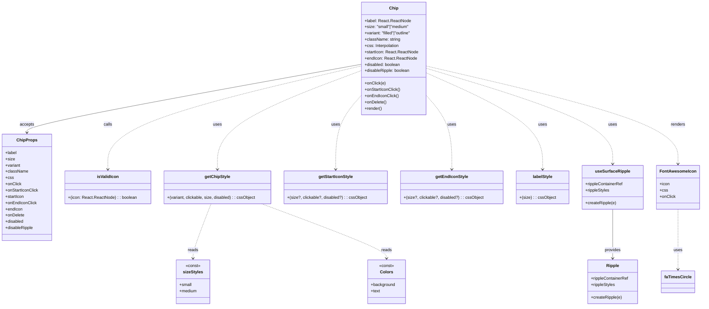

# Diagram: web/portal/src/components/atoms/Chip.atom.tsx

> Auto-generated by Obscura crawlers

## Mermaid

### SVG

<svg id="container" width="2633.3671875" xmlns="http://www.w3.org/2000/svg" class="classDiagram" height="1172" viewBox="0 0 2633.3671875 1172" role="graphics-document document" aria-roledescription="class"><g><defs><marker id="container_class-aggregationStart" class="marker aggregation class" refX="18" refY="7" markerWidth="190" markerHeight="240" orient="auto"><path d="M 18,7 L9,13 L1,7 L9,1 Z"></path></marker></defs><defs><marker id="container_class-aggregationEnd" class="marker aggregation class" refX="1" refY="7" markerWidth="20" markerHeight="28" orient="auto"><path d="M 18,7 L9,13 L1,7 L9,1 Z"></path></marker></defs><defs><marker id="container_class-extensionStart" class="marker extension class" refX="18" refY="7" markerWidth="190" markerHeight="240" orient="auto"><path d="M 1,7 L18,13 V 1 Z"></path></marker></defs><defs><marker id="container_class-extensionEnd" class="marker extension class" refX="1" refY="7" markerWidth="20" markerHeight="28" orient="auto"><path d="M 1,1 V 13 L18,7 Z"></path></marker></defs><defs><marker id="container_class-compositionStart" class="marker composition class" refX="18" refY="7" markerWidth="190" markerHeight="240" orient="auto"><path d="M 18,7 L9,13 L1,7 L9,1 Z"></path></marker></defs><defs><marker id="container_class-compositionEnd" class="marker composition class" refX="1" refY="7" markerWidth="20" markerHeight="28" orient="auto"><path d="M 18,7 L9,13 L1,7 L9,1 Z"></path></marker></defs><defs><marker id="container_class-dependencyStart" class="marker dependency class" refX="6" refY="7" markerWidth="190" markerHeight="240" orient="auto"><path d="M 5,7 L9,13 L1,7 L9,1 Z"></path></marker></defs><defs><marker id="container_class-dependencyEnd" class="marker dependency class" refX="13" refY="7" markerWidth="20" markerHeight="28" orient="auto"><path d="M 18,7 L9,13 L14,7 L9,1 Z"></path></marker></defs><defs><marker id="container_class-lollipopStart" class="marker lollipop class" refX="13" refY="7" markerWidth="190" markerHeight="240" orient="auto"><circle stroke="black" fill="transparent" cx="7" cy="7" r="6"></circle></marker></defs><defs><marker id="container_class-lollipopEnd" class="marker lollipop class" refX="1" refY="7" markerWidth="190" markerHeight="240" orient="auto"><circle stroke="black" fill="transparent" cx="7" cy="7" r="6"></circle></marker></defs><g class="root"><g class="clusters"></g><g class="edgePaths"><path d="M1362.191,246.288L1152.114,284.74C942.036,323.192,521.882,400.096,311.804,443.715C101.727,487.333,101.727,497.667,101.727,502.833L101.727,508" id="id_Chip_ChipProps_1" class="edge-thickness-normal edge-pattern-solid relation" style=";;;" data-edge="true" data-et="edge" data-id="id_Chip_ChipProps_1" data-points="W3sieCI6MTM2Mi4xOTE0MDYyNSwieSI6MjQ2LjI4NzY3NDc1NTc1ODh9LHsieCI6MTAxLjcyNjU2MjUsInkiOjQ3N30seyJ4IjoxMDEuNzI2NTYyNSwieSI6NTE0fV0=" marker-end="url(#container_class-dependencyEnd)"></path><path d="M1362.191,252.604L1202.982,290.003C1043.773,327.402,725.355,402.201,566.146,468.267C406.938,534.333,406.938,591.667,406.938,620.333L406.938,649" id="id_Chip_isValidIcon_2" class="edge-thickness-normal edge-pattern-dashed relation" style=";;;" data-edge="true" data-et="edge" data-id="id_Chip_isValidIcon_2" data-points="W3sieCI6MTM2Mi4xOTE0MDYyNSwieSI6MjUyLjYwMzY2MjQ1MDk5MTR9LHsieCI6NDA2LjkzNzUsInkiOjQ3N30seyJ4Ijo0MDYuOTM3NSwieSI6NjU1fV0=" marker-end="url(#container_class-dependencyEnd)"></path><path d="M1362.191,270.559L1272.207,304.966C1182.223,339.373,1002.254,408.186,912.27,471.26C822.285,534.333,822.285,591.667,822.285,620.333L822.285,649" id="id_Chip_getChipStyle_3" class="edge-thickness-normal edge-pattern-dashed relation" style=";;;" data-edge="true" data-et="edge" data-id="id_Chip_getChipStyle_3" data-points="W3sieCI6MTM2Mi4xOTE0MDYyNSwieSI6MjcwLjU1ODg4MjU2NTQ3MX0seyJ4Ijo4MjIuMjg1MTU2MjUsInkiOjQ3N30seyJ4Ijo4MjIuMjg1MTU2MjUsInkiOjY1NX1d" marker-end="url(#container_class-dependencyEnd)"></path><path d="M1362.191,366.745L1346.516,385.121C1330.841,403.497,1299.491,440.248,1283.816,487.291C1268.141,534.333,1268.141,591.667,1268.141,620.333L1268.141,649" id="id_Chip_getStartIconStyle_4" class="edge-thickness-normal edge-pattern-dashed relation" style=";;;" data-edge="true" data-et="edge" data-id="id_Chip_getStartIconStyle_4" data-points="W3sieCI6MTM2Mi4xOTE0MDYyNSwieSI6MzY2Ljc0NDk1NDY1OTgxMjgzfSx7IngiOjEyNjguMTQwNjI1LCJ5Ijo0Nzd9LHsieCI6MTI2OC4xNDA2MjUsInkiOjY1NX1d" marker-end="url(#container_class-dependencyEnd)"></path><path d="M1605.723,366.745L1621.398,385.121C1637.073,403.497,1668.423,440.248,1684.098,487.291C1699.773,534.333,1699.773,591.667,1699.773,620.333L1699.773,649" id="id_Chip_getEndIconStyle_5" class="edge-thickness-normal edge-pattern-dashed relation" style=";;;" data-edge="true" data-et="edge" data-id="id_Chip_getEndIconStyle_5" data-points="W3sieCI6MTYwNS43MjI2NTYyNSwieSI6MzY2Ljc0NDk1NDY1OTgxMjgzfSx7IngiOjE2OTkuNzczNDM3NSwieSI6NDc3fSx7IngiOjE2OTkuNzczNDM3NSwieSI6NjU1fV0=" marker-end="url(#container_class-dependencyEnd)"></path><path d="M1605.723,279.623L1677.736,312.519C1749.75,345.415,1893.777,411.208,1965.791,472.771C2037.805,534.333,2037.805,591.667,2037.805,620.333L2037.805,649" id="id_Chip_labelStyle_6" class="edge-thickness-normal edge-pattern-dashed relation" style=";;;" data-edge="true" data-et="edge" data-id="id_Chip_labelStyle_6" data-points="W3sieCI6MTYwNS43MjI2NTYyNSwieSI6Mjc5LjYyMzA2MzA4ODQ3OTA2fSx7IngiOjIwMzcuODA0Njg3NSwieSI6NDc3fSx7IngiOjIwMzcuODA0Njg3NSwieSI6NjU1fV0=" marker-end="url(#container_class-dependencyEnd)"></path><path d="M1605.723,261.63L1721.876,297.525C1838.029,333.42,2070.335,405.21,2186.488,466.272C2302.641,527.333,2302.641,577.667,2302.641,602.833L2302.641,628" id="id_Chip_useSurfaceRipple_7" class="edge-thickness-normal edge-pattern-dashed relation" style=";;;" data-edge="true" data-et="edge" data-id="id_Chip_useSurfaceRipple_7" data-points="W3sieCI6MTYwNS43MjI2NTYyNSwieSI6MjYxLjYyOTU1OTY0OTM5OX0seyJ4IjoyMzAyLjY0MDYyNSwieSI6NDc3fSx7IngiOjIzMDIuNjQwNjI1LCJ5Ijo2MzR9XQ==" marker-end="url(#container_class-dependencyEnd)"></path><path d="M1605.723,252.974L1762.64,290.311C1919.557,327.649,2233.392,402.325,2390.309,464.829C2547.227,527.333,2547.227,577.667,2547.227,602.833L2547.227,628" id="id_Chip_FontAwesomeIcon_8" class="edge-thickness-normal edge-pattern-dashed relation" style=";;;" data-edge="true" data-et="edge" data-id="id_Chip_FontAwesomeIcon_8" data-points="W3sieCI6MTYwNS43MjI2NTYyNSwieSI6MjUyLjk3MzU1OTU5MTAzMTV9LHsieCI6MjU0Ny4yMjY1NjI1LCJ5Ijo0Nzd9LHsieCI6MjU0Ny4yMjY1NjI1LCJ5Ijo2MzR9XQ==" marker-end="url(#container_class-dependencyEnd)"></path><path d="M797.839,781L786.328,810.667C774.816,840.333,751.793,899.667,740.281,934.5C728.77,969.333,728.77,979.667,728.77,984.833L728.77,990" id="id_getChipStyle_sizeStyles_9" class="edge-thickness-normal edge-pattern-dashed relation" style=";;;" data-edge="true" data-et="edge" data-id="id_getChipStyle_sizeStyles_9" data-points="W3sieCI6Nzk3LjgzOTE2Mjk5MjczODYsInkiOjc4MX0seyJ4Ijo3MjguNzY5NTMxMjUsInkiOjk1OX0seyJ4Ijo3MjguNzY5NTMxMjUsInkiOjk5Nn1d" marker-end="url(#container_class-dependencyEnd)"></path><path d="M987.115,781L1064.733,810.667C1142.351,840.333,1297.588,899.667,1375.206,934.5C1452.824,969.333,1452.824,979.667,1452.824,984.833L1452.824,990" id="id_getChipStyle_Colors_10" class="edge-thickness-normal edge-pattern-dashed relation" style=";;;" data-edge="true" data-et="edge" data-id="id_getChipStyle_Colors_10" data-points="W3sieCI6OTg3LjExNDg2OTY4MzYxLCJ5Ijo3ODF9LHsieCI6MTQ1Mi44MjQyMTg3NSwieSI6OTU5fSx7IngiOjE0NTIuODI0MjE4NzUsInkiOjk5Nn1d" marker-end="url(#container_class-dependencyEnd)"></path><path d="M2547.227,802L2547.227,828.167C2547.227,854.333,2547.227,906.667,2547.227,945C2547.227,983.333,2547.227,1007.667,2547.227,1019.833L2547.227,1032" id="id_FontAwesomeIcon_faTimesCircle_11" class="edge-thickness-normal edge-pattern-dashed relation" style=";;;" data-edge="true" data-et="edge" data-id="id_FontAwesomeIcon_faTimesCircle_11" data-points="W3sieCI6MjU0Ny4yMjY1NjI1LCJ5Ijo4MDJ9LHsieCI6MjU0Ny4yMjY1NjI1LCJ5Ijo5NTl9LHsieCI6MjU0Ny4yMjY1NjI1LCJ5IjoxMDM4fV0=" marker-end="url(#container_class-dependencyEnd)"></path><path d="M2302.641,802L2302.641,828.167C2302.641,854.333,2302.641,906.667,2302.641,938C2302.641,969.333,2302.641,979.667,2302.641,984.833L2302.641,990" id="id_useSurfaceRipple_Ripple_12" class="edge-thickness-normal edge-pattern-solid relation" style=";;;" data-edge="true" data-et="edge" data-id="id_useSurfaceRipple_Ripple_12" data-points="W3sieCI6MjMwMi42NDA2MjUsInkiOjgwMn0seyJ4IjoyMzAyLjY0MDYyNSwieSI6OTU5fSx7IngiOjIzMDIuNjQwNjI1LCJ5Ijo5OTZ9XQ==" marker-end="url(#container_class-dependencyEnd)"></path></g><g class="edgeLabels"><g class="edgeLabel" transform="translate(101.7265625, 477)"><g class="label" data-id="id_Chip_ChipProps_1" transform="translate(-27.421875, -12)"><foreignObject width="54.84375" height="24">

accepts

</foreignObject></g></g><g class="edgeLabel" transform="translate(406.9375, 477)"><g class="label" data-id="id_Chip_isValidIcon_2" transform="translate(-16.4453125, -12)"><foreignObject width="32.890625" height="24">

calls

</foreignObject></g></g><g class="edgeLabel" transform="translate(822.28515625, 477)"><g class="label" data-id="id_Chip_getChipStyle_3" transform="translate(-16.4921875, -12)"><foreignObject width="32.984375" height="24">

uses

</foreignObject></g></g><g class="edgeLabel" transform="translate(1268.140625, 477)"><g class="label" data-id="id_Chip_getStartIconStyle_4" transform="translate(-16.4921875, -12)"><foreignObject width="32.984375" height="24">

uses

</foreignObject></g></g><g class="edgeLabel" transform="translate(1699.7734375, 477)"><g class="label" data-id="id_Chip_getEndIconStyle_5" transform="translate(-16.4921875, -12)"><foreignObject width="32.984375" height="24">

uses

</foreignObject></g></g><g class="edgeLabel" transform="translate(2037.8046875, 477)"><g class="label" data-id="id_Chip_labelStyle_6" transform="translate(-16.4921875, -12)"><foreignObject width="32.984375" height="24">

uses

</foreignObject></g></g><g class="edgeLabel" transform="translate(2302.640625, 477)"><g class="label" data-id="id_Chip_useSurfaceRipple_7" transform="translate(-16.4921875, -12)"><foreignObject width="32.984375" height="24">

uses

</foreignObject></g></g><g class="edgeLabel" transform="translate(2547.2265625, 477)"><g class="label" data-id="id_Chip_FontAwesomeIcon_8" transform="translate(-27.75, -12)"><foreignObject width="55.5" height="24">

renders

</foreignObject></g></g><g class="edgeLabel" transform="translate(728.76953125, 959)"><g class="label" data-id="id_getChipStyle_sizeStyles_9" transform="translate(-20.0078125, -12)"><foreignObject width="40.015625" height="24">

reads

</foreignObject></g></g><g class="edgeLabel" transform="translate(1452.82421875, 959)"><g class="label" data-id="id_getChipStyle_Colors_10" transform="translate(-20.0078125, -12)"><foreignObject width="40.015625" height="24">

reads

</foreignObject></g></g><g class="edgeLabel" transform="translate(2547.2265625, 959)"><g class="label" data-id="id_FontAwesomeIcon_faTimesCircle_11" transform="translate(-16.4921875, -12)"><foreignObject width="32.984375" height="24">

uses

</foreignObject></g></g><g class="edgeLabel" transform="translate(2302.640625, 959)"><g class="label" data-id="id_useSurfaceRipple_Ripple_12" transform="translate(-31.3125, -12)"><foreignObject width="62.625" height="24">

provides

</foreignObject></g></g></g><g class="nodes"><g class="node default" id="classId-Chip-0" transform="translate(1483.95703125, 224)"><g class="basic label-container"><path d="M-121.765625 -216 L121.765625 -216 L121.765625 216 L-121.765625 216" stroke="none" stroke-width="0" fill="#ECECFF" style=""></path><path d="M-121.765625 -216 C-59.64436014725618 -216, 2.476904705487641 -216, 121.765625 -216 M-121.765625 -216 C-33.520464315884766 -216, 54.72469636823047 -216, 121.765625 -216 M121.765625 -216 C121.765625 -74.87495335656504, 121.765625 66.25009328686991, 121.765625 216 M121.765625 -216 C121.765625 -120.27996638896408, 121.765625 -24.559932777928168, 121.765625 216 M121.765625 216 C32.27776721195586 216, -57.21009057608828 216, -121.765625 216 M121.765625 216 C25.91237464423763 216, -69.94087571152474 216, -121.765625 216 M-121.765625 216 C-121.765625 115.90900687188861, -121.765625 15.818013743777215, -121.765625 -216 M-121.765625 216 C-121.765625 93.3710805445694, -121.765625 -29.25783891086121, -121.765625 -216" stroke="#9370DB" stroke-width="1.3" fill="none" stroke-dasharray="0 0" style=""></path></g><g class="annotation-group text" transform="translate(0, -192)"></g><g class="label-group text" transform="translate(-16.171875, -192)"><g class="label" style="font-weight: bolder" transform="translate(0,-12)"><foreignObject width="32.34375" height="24">

Chip

</foreignObject></g></g><g class="members-group text" transform="translate(-109.765625, -144)"><g class="label" style="" transform="translate(0,-12)"><foreignObject width="175.171875" height="24">

+label: React.ReactNode

</foreignObject></g><g class="label" style="" transform="translate(0,12)"><foreignObject width="173.71875" height="24">

+size: "small"|"medium"

</foreignObject></g><g class="label" style="" transform="translate(0,36)"><foreignObject width="186.859375" height="24">

+variant: "filled"|"outline"

</foreignObject></g><g class="label" style="" transform="translate(0,60)"><foreignObject width="135.359375" height="24">

+className: string

</foreignObject></g><g class="label" style="" transform="translate(0,84)"><foreignObject width="134.203125" height="24">

+css: Interpolation

</foreignObject></g><g class="label" style="" transform="translate(0,108)"><foreignObject width="203.359375" height="24">

+startIcon: React.ReactNode

</foreignObject></g><g class="label" style="" transform="translate(0,132)"><foreignObject width="197.21875" height="24">

+endIcon: React.ReactNode

</foreignObject></g><g class="label" style="" transform="translate(0,156)"><foreignObject width="138.015625" height="24">

+disabled: boolean

</foreignObject></g><g class="label" style="" transform="translate(0,180)"><foreignObject width="174.96875" height="24">

+disableRipple: boolean

</foreignObject></g></g><g class="methods-group text" transform="translate(-109.765625, 96)"><g class="label" style="" transform="translate(0,-12)"><foreignObject width="79.640625" height="24">

+onClick(e)

</foreignObject></g><g class="label" style="" transform="translate(0,12)"><foreignObject width="136.734375" height="24">

+onStartIconClick()

</foreignObject></g><g class="label" style="" transform="translate(0,36)"><foreignObject width="129.03125" height="24">

+onEndIconClick()

</foreignObject></g><g class="label" style="" transform="translate(0,60)"><foreignObject width="83.6875" height="24">

+onDelete()

</foreignObject></g><g class="label" style="" transform="translate(0,84)"><foreignObject width="66.609375" height="24">

+render()

</foreignObject></g></g><g class="divider" style=""><path d="M-121.765625 -168 C-65.9087787243857 -168, -10.051932448771396 -168, 121.765625 -168 M-121.765625 -168 C-68.09361201056797 -168, -14.421599021135933 -168, 121.765625 -168" stroke="#9370DB" stroke-width="1.3" fill="none" stroke-dasharray="0 0" style=""></path></g><g class="divider" style=""><path d="M-121.765625 72 C-40.47781616238616 72, 40.809992675227676 72, 121.765625 72 M-121.765625 72 C-66.36499613855824 72, -10.964367277116494 72, 121.765625 72" stroke="#9370DB" stroke-width="1.3" fill="none" stroke-dasharray="0 0" style=""></path></g></g><g class="node default" id="classId-ChipProps-1" transform="translate(101.7265625, 718)"><g class="basic label-container"><path d="M-93.7265625 -204 L93.7265625 -204 L93.7265625 204 L-93.7265625 204" stroke="none" stroke-width="0" fill="#ECECFF" style=""></path><path d="M-93.7265625 -204 C-38.74146422638995 -204, 16.243634047220098 -204, 93.7265625 -204 M-93.7265625 -204 C-32.22631038348103 -204, 29.273941733037944 -204, 93.7265625 -204 M93.7265625 -204 C93.7265625 -72.25543648129505, 93.7265625 59.4891270374099, 93.7265625 204 M93.7265625 -204 C93.7265625 -93.83886466397564, 93.7265625 16.322270672048717, 93.7265625 204 M93.7265625 204 C43.96550604430864 204, -5.79555041138272 204, -93.7265625 204 M93.7265625 204 C54.581481785094994 204, 15.436401070189987 204, -93.7265625 204 M-93.7265625 204 C-93.7265625 84.86040421025643, -93.7265625 -34.27919157948713, -93.7265625 -204 M-93.7265625 204 C-93.7265625 65.8105289294744, -93.7265625 -72.3789421410512, -93.7265625 -204" stroke="#9370DB" stroke-width="1.3" fill="none" stroke-dasharray="0 0" style=""></path></g><g class="annotation-group text" transform="translate(0, -180)"></g><g class="label-group text" transform="translate(-37.09375, -180)"><g class="label" style="font-weight: bolder" transform="translate(0,-12)"><foreignObject width="74.1875" height="24">

ChipProps

</foreignObject></g></g><g class="members-group text" transform="translate(-81.7265625, -132)"><g class="label" style="" transform="translate(0,-12)"><foreignObject width="44.21875" height="24">

+label

</foreignObject></g><g class="label" style="" transform="translate(0,12)"><foreignObject width="35.578125" height="24">

+size

</foreignObject></g><g class="label" style="" transform="translate(0,36)"><foreignObject width="58.703125" height="24">

+variant

</foreignObject></g><g class="label" style="" transform="translate(0,60)"><foreignObject width="85.640625" height="24">

+className

</foreignObject></g><g class="label" style="" transform="translate(0,84)"><foreignObject width="30.421875" height="24">

+css

</foreignObject></g><g class="label" style="" transform="translate(0,108)"><foreignObject width="60.546875" height="24">

+onClick

</foreignObject></g><g class="label" style="" transform="translate(0,132)"><foreignObject width="126.359375" height="24">

+onStartIconClick

</foreignObject></g><g class="label" style="" transform="translate(0,156)"><foreignObject width="72.546875" height="24">

+startIcon

</foreignObject></g><g class="label" style="" transform="translate(0,180)"><foreignObject width="118.65625" height="24">

+onEndIconClick

</foreignObject></g><g class="label" style="" transform="translate(0,204)"><foreignObject width="66.421875" height="24">

+endIcon

</foreignObject></g><g class="label" style="" transform="translate(0,228)"><foreignObject width="73.3125" height="24">

+onDelete

</foreignObject></g><g class="label" style="" transform="translate(0,252)"><foreignObject width="70.484375" height="24">

+disabled

</foreignObject></g><g class="label" style="" transform="translate(0,276)"><foreignObject width="107.453125" height="24">

+disableRipple

</foreignObject></g></g><g class="methods-group text" transform="translate(-81.7265625, 204)"></g><g class="divider" style=""><path d="M-93.7265625 -156 C-53.98062780208731 -156, -14.234693104174625 -156, 93.7265625 -156 M-93.7265625 -156 C-39.52065748121292 -156, 14.685247537574156 -156, 93.7265625 -156" stroke="#9370DB" stroke-width="1.3" fill="none" stroke-dasharray="0 0" style=""></path></g><g class="divider" style=""><path d="M-93.7265625 180 C-21.99170951692531 180, 49.74314346614938 180, 93.7265625 180 M-93.7265625 180 C-23.038861753196542 180, 47.648838993606915 180, 93.7265625 180" stroke="#9370DB" stroke-width="1.3" fill="none" stroke-dasharray="0 0" style=""></path></g></g><g class="node default" id="classId-isValidIcon-2" transform="translate(406.9375, 718)"><g class="basic label-container"><path d="M-161.484375 -63 L161.484375 -63 L161.484375 63 L-161.484375 63" stroke="none" stroke-width="0" fill="#ECECFF" style=""></path><path d="M-161.484375 -63 C-40.18176846846799 -63, 81.12083806306401 -63, 161.484375 -63 M-161.484375 -63 C-95.62664196741301 -63, -29.768908934826015 -63, 161.484375 -63 M161.484375 -63 C161.484375 -35.72426561287411, 161.484375 -8.448531225748226, 161.484375 63 M161.484375 -63 C161.484375 -29.451666370585272, 161.484375 4.096667258829456, 161.484375 63 M161.484375 63 C66.54846966958839 63, -28.38743566082323 63, -161.484375 63 M161.484375 63 C78.34599803096042 63, -4.7923789380791675 63, -161.484375 63 M-161.484375 63 C-161.484375 15.70168783609526, -161.484375 -31.59662432780948, -161.484375 -63 M-161.484375 63 C-161.484375 29.431504136921603, -161.484375 -4.1369917261567934, -161.484375 -63" stroke="#9370DB" stroke-width="1.3" fill="none" stroke-dasharray="0 0" style=""></path></g><g class="annotation-group text" transform="translate(0, -39)"></g><g class="label-group text" transform="translate(-39.40625, -39)"><g class="label" style="font-weight: bolder" transform="translate(0,-12)"><foreignObject width="78.8125" height="24">

isValidIcon

</foreignObject></g></g><g class="members-group text" transform="translate(-149.484375, 9)"></g><g class="methods-group text" transform="translate(-149.484375, 39)"><g class="label" style="" transform="translate(0,-12)"><foreignObject width="259.5625" height="24">

+(icon: React.ReactNode) : : boolean

</foreignObject></g></g><g class="divider" style=""><path d="M-161.484375 -15 C-45.505004922759014 -15, 70.47436515448197 -15, 161.484375 -15 M-161.484375 -15 C-38.99404772822288 -15, 83.49627954355424 -15, 161.484375 -15" stroke="#9370DB" stroke-width="1.3" fill="none" stroke-dasharray="0 0" style=""></path></g><g class="divider" style=""><path d="M-161.484375 9 C-81.6587615730762 9, -1.8331481461524106 9, 161.484375 9 M-161.484375 9 C-59.619689132543755 9, 42.24499673491249 9, 161.484375 9" stroke="#9370DB" stroke-width="1.3" fill="none" stroke-dasharray="0 0" style=""></path></g></g><g class="node default" id="classId-sizeStyles-3" transform="translate(728.76953125, 1080)"><g class="basic label-container"><path d="M-64.02734375 -84 L64.02734375 -84 L64.02734375 84 L-64.02734375 84" stroke="none" stroke-width="0" fill="#ECECFF" style=""></path><path d="M-64.02734375 -84 C-18.73953444923321 -84, 26.548274851533577 -84, 64.02734375 -84 M-64.02734375 -84 C-35.00229913429757 -84, -5.977254518595139 -84, 64.02734375 -84 M64.02734375 -84 C64.02734375 -48.19275942693194, 64.02734375 -12.385518853863886, 64.02734375 84 M64.02734375 -84 C64.02734375 -42.00841608188203, 64.02734375 -0.01683216376406449, 64.02734375 84 M64.02734375 84 C36.00013293485253 84, 7.972922119705061 84, -64.02734375 84 M64.02734375 84 C24.953675192601878 84, -14.119993364796244 84, -64.02734375 84 M-64.02734375 84 C-64.02734375 40.57052617080344, -64.02734375 -2.85894765839312, -64.02734375 -84 M-64.02734375 84 C-64.02734375 41.582659629516044, -64.02734375 -0.8346807409679116, -64.02734375 -84" stroke="#9370DB" stroke-width="1.3" fill="none" stroke-dasharray="0 0" style=""></path></g><g class="annotation-group text" transform="translate(-28.6171875, -60)"><g class="label" style="" transform="translate(0,-12)"><foreignObject width="57.234375" height="24">

«const»

</foreignObject></g></g><g class="label-group text" transform="translate(-36.5234375, -36)"><g class="label" style="font-weight: bolder" transform="translate(0,-12)"><foreignObject width="73.046875" height="24">

sizeStyles

</foreignObject></g></g><g class="members-group text" transform="translate(-52.02734375, 12)"><g class="label" style="" transform="translate(0,-12)"><foreignObject width="47.09375" height="24">

+small

</foreignObject></g><g class="label" style="" transform="translate(0,12)"><foreignObject width="67.53125" height="24">

+medium

</foreignObject></g></g><g class="methods-group text" transform="translate(-52.02734375, 84)"></g><g class="divider" style=""><path d="M-64.02734375 -12 C-35.56672351776036 -12, -7.106103285520717 -12, 64.02734375 -12 M-64.02734375 -12 C-32.25696587479162 -12, -0.48658799958322874 -12, 64.02734375 -12" stroke="#9370DB" stroke-width="1.3" fill="none" stroke-dasharray="0 0" style=""></path></g><g class="divider" style=""><path d="M-64.02734375 60 C-37.62419930392423 60, -11.221054857848465 60, 64.02734375 60 M-64.02734375 60 C-17.118813073444358 60, 29.789717603111285 60, 64.02734375 60" stroke="#9370DB" stroke-width="1.3" fill="none" stroke-dasharray="0 0" style=""></path></g></g><g class="node default" id="classId-getChipStyle-4" transform="translate(822.28515625, 718)"><g class="basic label-container"><path d="M-203.86328125 -63 L203.86328125 -63 L203.86328125 63 L-203.86328125 63" stroke="none" stroke-width="0" fill="#ECECFF" style=""></path><path d="M-203.86328125 -63 C-95.79411584770386 -63, 12.275049554592272 -63, 203.86328125 -63 M-203.86328125 -63 C-120.9391206111294 -63, -38.014959972258794 -63, 203.86328125 -63 M203.86328125 -63 C203.86328125 -14.57518351042372, 203.86328125 33.84963297915256, 203.86328125 63 M203.86328125 -63 C203.86328125 -24.16271234168144, 203.86328125 14.674575316637117, 203.86328125 63 M203.86328125 63 C49.34723699742955 63, -105.1688072551409 63, -203.86328125 63 M203.86328125 63 C112.30343735718441 63, 20.743593464368814 63, -203.86328125 63 M-203.86328125 63 C-203.86328125 25.763160931258405, -203.86328125 -11.47367813748319, -203.86328125 -63 M-203.86328125 63 C-203.86328125 14.540673527607069, -203.86328125 -33.91865294478586, -203.86328125 -63" stroke="#9370DB" stroke-width="1.3" fill="none" stroke-dasharray="0 0" style=""></path></g><g class="annotation-group text" transform="translate(0, -39)"></g><g class="label-group text" transform="translate(-46.4296875, -39)"><g class="label" style="font-weight: bolder" transform="translate(0,-12)"><foreignObject width="92.859375" height="24">

getChipStyle

</foreignObject></g></g><g class="members-group text" transform="translate(-191.86328125, 9)"></g><g class="methods-group text" transform="translate(-191.86328125, 39)"><g class="label" style="" transform="translate(0,-12)"><foreignObject width="337.296875" height="24">

+(variant, clickable, size, disabled) : : cssObject

</foreignObject></g></g><g class="divider" style=""><path d="M-203.86328125 -15 C-60.807595553853474 -15, 82.24809014229305 -15, 203.86328125 -15 M-203.86328125 -15 C-53.11381472070937 -15, 97.63565180858126 -15, 203.86328125 -15" stroke="#9370DB" stroke-width="1.3" fill="none" stroke-dasharray="0 0" style=""></path></g><g class="divider" style=""><path d="M-203.86328125 9 C-60.7387652365513 9, 82.3857507768974 9, 203.86328125 9 M-203.86328125 9 C-45.54738171815316 9, 112.76851781369368 9, 203.86328125 9" stroke="#9370DB" stroke-width="1.3" fill="none" stroke-dasharray="0 0" style=""></path></g></g><g class="node default" id="classId-getStartIconStyle-5" transform="translate(1268.140625, 718)"><g class="basic label-container"><path d="M-191.9921875 -63 L191.9921875 -63 L191.9921875 63 L-191.9921875 63" stroke="none" stroke-width="0" fill="#ECECFF" style=""></path><path d="M-191.9921875 -63 C-107.16535212120185 -63, -22.338516742403698 -63, 191.9921875 -63 M-191.9921875 -63 C-86.75841996122482 -63, 18.475347577550366 -63, 191.9921875 -63 M191.9921875 -63 C191.9921875 -14.805832236145257, 191.9921875 33.388335527709486, 191.9921875 63 M191.9921875 -63 C191.9921875 -13.39672981322429, 191.9921875 36.20654037355142, 191.9921875 63 M191.9921875 63 C46.76531659307966 63, -98.46155431384068 63, -191.9921875 63 M191.9921875 63 C63.8949776412293 63, -64.2022322175414 63, -191.9921875 63 M-191.9921875 63 C-191.9921875 16.916996931149264, -191.9921875 -29.166006137701473, -191.9921875 -63 M-191.9921875 63 C-191.9921875 31.759341637441075, -191.9921875 0.5186832748821502, -191.9921875 -63" stroke="#9370DB" stroke-width="1.3" fill="none" stroke-dasharray="0 0" style=""></path></g><g class="annotation-group text" transform="translate(0, -39)"></g><g class="label-group text" transform="translate(-63.8125, -39)"><g class="label" style="font-weight: bolder" transform="translate(0,-12)"><foreignObject width="127.625" height="24">

getStartIconStyle

</foreignObject></g></g><g class="members-group text" transform="translate(-179.9921875, 9)"></g><g class="methods-group text" transform="translate(-179.9921875, 39)"><g class="label" style="" transform="translate(0,-12)"><foreignObject width="296.171875" height="24">

+(size?, clickable?, disabled?) : : cssObject

</foreignObject></g></g><g class="divider" style=""><path d="M-191.9921875 -15 C-79.51632655618026 -15, 32.95953438763948 -15, 191.9921875 -15 M-191.9921875 -15 C-93.24996438670891 -15, 5.492258726582179 -15, 191.9921875 -15" stroke="#9370DB" stroke-width="1.3" fill="none" stroke-dasharray="0 0" style=""></path></g><g class="divider" style=""><path d="M-191.9921875 9 C-42.34227324664218 9, 107.30764100671564 9, 191.9921875 9 M-191.9921875 9 C-41.522398264996696 9, 108.94739097000661 9, 191.9921875 9" stroke="#9370DB" stroke-width="1.3" fill="none" stroke-dasharray="0 0" style=""></path></g></g><g class="node default" id="classId-getEndIconStyle-6" transform="translate(1699.7734375, 718)"><g class="basic label-container"><path d="M-189.640625 -63 L189.640625 -63 L189.640625 63 L-189.640625 63" stroke="none" stroke-width="0" fill="#ECECFF" style=""></path><path d="M-189.640625 -63 C-79.48548679289257 -63, 30.669651414214854 -63, 189.640625 -63 M-189.640625 -63 C-96.588023623369 -63, -3.535422246737994 -63, 189.640625 -63 M189.640625 -63 C189.640625 -36.45802454059064, 189.640625 -9.916049081181278, 189.640625 63 M189.640625 -63 C189.640625 -21.1724447083798, 189.640625 20.6551105832404, 189.640625 63 M189.640625 63 C38.59645969564639 63, -112.44770560870722 63, -189.640625 63 M189.640625 63 C82.72081876078074 63, -24.19898747843851 63, -189.640625 63 M-189.640625 63 C-189.640625 34.886210334879735, -189.640625 6.772420669759477, -189.640625 -63 M-189.640625 63 C-189.640625 32.710550232450785, -189.640625 2.4211004649015706, -189.640625 -63" stroke="#9370DB" stroke-width="1.3" fill="none" stroke-dasharray="0 0" style=""></path></g><g class="annotation-group text" transform="translate(0, -39)"></g><g class="label-group text" transform="translate(-59.109375, -39)"><g class="label" style="font-weight: bolder" transform="translate(0,-12)"><foreignObject width="118.21875" height="24">

getEndIconStyle

</foreignObject></g></g><g class="members-group text" transform="translate(-177.640625, 9)"></g><g class="methods-group text" transform="translate(-177.640625, 39)"><g class="label" style="" transform="translate(0,-12)"><foreignObject width="296.171875" height="24">

+(size?, clickable?, disabled?) : : cssObject

</foreignObject></g></g><g class="divider" style=""><path d="M-189.640625 -15 C-56.508366779490956 -15, 76.62389144101809 -15, 189.640625 -15 M-189.640625 -15 C-105.83394225530715 -15, -22.0272595106143 -15, 189.640625 -15" stroke="#9370DB" stroke-width="1.3" fill="none" stroke-dasharray="0 0" style=""></path></g><g class="divider" style=""><path d="M-189.640625 9 C-41.329890469295975 9, 106.98084406140805 9, 189.640625 9 M-189.640625 9 C-57.04752782858429 9, 75.54556934283141 9, 189.640625 9" stroke="#9370DB" stroke-width="1.3" fill="none" stroke-dasharray="0 0" style=""></path></g></g><g class="node default" id="classId-labelStyle-7" transform="translate(2037.8046875, 718)"><g class="basic label-container"><path d="M-98.390625 -63 L98.390625 -63 L98.390625 63 L-98.390625 63" stroke="none" stroke-width="0" fill="#ECECFF" style=""></path><path d="M-98.390625 -63 C-48.49640932154975 -63, 1.397806356900503 -63, 98.390625 -63 M-98.390625 -63 C-46.03636509496263 -63, 6.317894810074733 -63, 98.390625 -63 M98.390625 -63 C98.390625 -36.882399002952354, 98.390625 -10.764798005904701, 98.390625 63 M98.390625 -63 C98.390625 -23.856219240934877, 98.390625 15.287561518130246, 98.390625 63 M98.390625 63 C44.65939571912542 63, -9.071833561749159 63, -98.390625 63 M98.390625 63 C38.94968386038235 63, -20.4912572792353 63, -98.390625 63 M-98.390625 63 C-98.390625 22.35239003077156, -98.390625 -18.29521993845688, -98.390625 -63 M-98.390625 63 C-98.390625 17.553240476003253, -98.390625 -27.893519047993493, -98.390625 -63" stroke="#9370DB" stroke-width="1.3" fill="none" stroke-dasharray="0 0" style=""></path></g><g class="annotation-group text" transform="translate(0, -39)"></g><g class="label-group text" transform="translate(-36.8125, -39)"><g class="label" style="font-weight: bolder" transform="translate(0,-12)"><foreignObject width="73.625" height="24">

labelStyle

</foreignObject></g></g><g class="members-group text" transform="translate(-86.390625, 9)"></g><g class="methods-group text" transform="translate(-86.390625, 39)"><g class="label" style="" transform="translate(0,-12)"><foreignObject width="135.96875" height="24">

+(size) : : cssObject

</foreignObject></g></g><g class="divider" style=""><path d="M-98.390625 -15 C-43.5668430590633 -15, 11.256938881873396 -15, 98.390625 -15 M-98.390625 -15 C-49.030895355349436 -15, 0.32883428930112757 -15, 98.390625 -15" stroke="#9370DB" stroke-width="1.3" fill="none" stroke-dasharray="0 0" style=""></path></g><g class="divider" style=""><path d="M-98.390625 9 C-51.82070712154802 9, -5.250789243096037 9, 98.390625 9 M-98.390625 9 C-20.69267413711779 9, 57.00527672576442 9, 98.390625 9" stroke="#9370DB" stroke-width="1.3" fill="none" stroke-dasharray="0 0" style=""></path></g></g><g class="node default" id="classId-useSurfaceRipple-8" transform="translate(2302.640625, 718)"><g class="basic label-container"><path d="M-116.4453125 -84 L116.4453125 -84 L116.4453125 84 L-116.4453125 84" stroke="none" stroke-width="0" fill="#ECECFF" style=""></path><path d="M-116.4453125 -84 C-49.589565688853284 -84, 17.266181122293432 -84, 116.4453125 -84 M-116.4453125 -84 C-48.65680992238744 -84, 19.131692655225123 -84, 116.4453125 -84 M116.4453125 -84 C116.4453125 -35.105578043978774, 116.4453125 13.788843912042452, 116.4453125 84 M116.4453125 -84 C116.4453125 -37.02028619932025, 116.4453125 9.959427601359494, 116.4453125 84 M116.4453125 84 C47.69646534363571 84, -21.052381812728584 84, -116.4453125 84 M116.4453125 84 C52.524068124170505 84, -11.39717625165899 84, -116.4453125 84 M-116.4453125 84 C-116.4453125 18.735638898784146, -116.4453125 -46.52872220243171, -116.4453125 -84 M-116.4453125 84 C-116.4453125 20.777394186323114, -116.4453125 -42.44521162735377, -116.4453125 -84" stroke="#9370DB" stroke-width="1.3" fill="none" stroke-dasharray="0 0" style=""></path></g><g class="annotation-group text" transform="translate(0, -60)"></g><g class="label-group text" transform="translate(-63.84375, -60)"><g class="label" style="font-weight: bolder" transform="translate(0,-12)"><foreignObject width="127.6875" height="24">

useSurfaceRipple

</foreignObject></g></g><g class="members-group text" transform="translate(-104.4453125, -12)"><g class="label" style="" transform="translate(0,-12)"><foreignObject width="145.046875" height="24">

+rippleContainerRef

</foreignObject></g><g class="label" style="" transform="translate(0,12)"><foreignObject width="94.109375" height="24">

+rippleStyles

</foreignObject></g></g><g class="methods-group text" transform="translate(-104.4453125, 60)"><g class="label" style="" transform="translate(0,-12)"><foreignObject width="118.46875" height="24">

+createRipple(e)

</foreignObject></g></g><g class="divider" style=""><path d="M-116.4453125 -36 C-33.456074443622015 -36, 49.53316361275597 -36, 116.4453125 -36 M-116.4453125 -36 C-56.3294424864774 -36, 3.7864275270452055 -36, 116.4453125 -36" stroke="#9370DB" stroke-width="1.3" fill="none" stroke-dasharray="0 0" style=""></path></g><g class="divider" style=""><path d="M-116.4453125 36 C-68.34129264089253 36, -20.237272781785066 36, 116.4453125 36 M-116.4453125 36 C-23.782925511869635 36, 68.87946147626073 36, 116.4453125 36" stroke="#9370DB" stroke-width="1.3" fill="none" stroke-dasharray="0 0" style=""></path></g></g><g class="node default" id="classId-FontAwesomeIcon-9" transform="translate(2547.2265625, 718)"><g class="basic label-container"><path d="M-78.140625 -84 L78.140625 -84 L78.140625 84 L-78.140625 84" stroke="none" stroke-width="0" fill="#ECECFF" style=""></path><path d="M-78.140625 -84 C-31.34523656875949 -84, 15.450151862481022 -84, 78.140625 -84 M-78.140625 -84 C-36.496680465366815 -84, 5.14726406926637 -84, 78.140625 -84 M78.140625 -84 C78.140625 -41.08108826005016, 78.140625 1.8378234798996829, 78.140625 84 M78.140625 -84 C78.140625 -46.794121060091356, 78.140625 -9.588242120182713, 78.140625 84 M78.140625 84 C17.263161737134986 84, -43.61430152573003 84, -78.140625 84 M78.140625 84 C36.24932542689569 84, -5.641974146208625 84, -78.140625 84 M-78.140625 84 C-78.140625 35.67707271168978, -78.140625 -12.645854576620437, -78.140625 -84 M-78.140625 84 C-78.140625 32.91879170447565, -78.140625 -18.162416591048697, -78.140625 -84" stroke="#9370DB" stroke-width="1.3" fill="none" stroke-dasharray="0 0" style=""></path></g><g class="annotation-group text" transform="translate(0, -60)"></g><g class="label-group text" transform="translate(-66.140625, -60)"><g class="label" style="font-weight: bolder" transform="translate(0,-12)"><foreignObject width="132.28125" height="24">

FontAwesomeIcon

</foreignObject></g></g><g class="members-group text" transform="translate(-66.140625, -12)"><g class="label" style="" transform="translate(0,-12)"><foreignObject width="38.546875" height="24">

+icon

</foreignObject></g><g class="label" style="" transform="translate(0,12)"><foreignObject width="30.421875" height="24">

+css

</foreignObject></g><g class="label" style="" transform="translate(0,36)"><foreignObject width="60.546875" height="24">

+onClick

</foreignObject></g></g><g class="methods-group text" transform="translate(-66.140625, 84)"></g><g class="divider" style=""><path d="M-78.140625 -36 C-43.84288218282137 -36, -9.54513936564274 -36, 78.140625 -36 M-78.140625 -36 C-22.466206895142342 -36, 33.208211209715316 -36, 78.140625 -36" stroke="#9370DB" stroke-width="1.3" fill="none" stroke-dasharray="0 0" style=""></path></g><g class="divider" style=""><path d="M-78.140625 60 C-32.14297488941769 60, 13.854675221164626 60, 78.140625 60 M-78.140625 60 C-35.814827881590354 60, 6.510969236819292 60, 78.140625 60" stroke="#9370DB" stroke-width="1.3" fill="none" stroke-dasharray="0 0" style=""></path></g></g><g class="node default" id="classId-Colors-10" transform="translate(1452.82421875, 1080)"><g class="basic label-container"><path d="M-73.00390625 -84 L73.00390625 -84 L73.00390625 84 L-73.00390625 84" stroke="none" stroke-width="0" fill="#ECECFF" style=""></path><path d="M-73.00390625 -84 C-18.964749047855406 -84, 35.07440815428919 -84, 73.00390625 -84 M-73.00390625 -84 C-31.597025371080832 -84, 9.809855507838336 -84, 73.00390625 -84 M73.00390625 -84 C73.00390625 -28.90819588780637, 73.00390625 26.183608224387257, 73.00390625 84 M73.00390625 -84 C73.00390625 -24.847785143201364, 73.00390625 34.30442971359727, 73.00390625 84 M73.00390625 84 C17.845383519020494 84, -37.31313921195901 84, -73.00390625 84 M73.00390625 84 C32.943197306334596 84, -7.117511637330807 84, -73.00390625 84 M-73.00390625 84 C-73.00390625 45.36103147204092, -73.00390625 6.722062944081841, -73.00390625 -84 M-73.00390625 84 C-73.00390625 43.30274873726492, -73.00390625 2.605497474529841, -73.00390625 -84" stroke="#9370DB" stroke-width="1.3" fill="none" stroke-dasharray="0 0" style=""></path></g><g class="annotation-group text" transform="translate(-28.6171875, -60)"><g class="label" style="" transform="translate(0,-12)"><foreignObject width="57.234375" height="24">

«const»

</foreignObject></g></g><g class="label-group text" transform="translate(-23.1015625, -36)"><g class="label" style="font-weight: bolder" transform="translate(0,-12)"><foreignObject width="46.203125" height="24">

Colors

</foreignObject></g></g><g class="members-group text" transform="translate(-61.00390625, 12)"><g class="label" style="" transform="translate(0,-12)"><foreignObject width="93.390625" height="24">

+background

</foreignObject></g><g class="label" style="" transform="translate(0,12)"><foreignObject width="35.5625" height="24">

+text

</foreignObject></g></g><g class="methods-group text" transform="translate(-61.00390625, 84)"></g><g class="divider" style=""><path d="M-73.00390625 -12 C-30.202390055427323 -12, 12.599126139145355 -12, 73.00390625 -12 M-73.00390625 -12 C-30.412985953202394 -12, 12.177934343595211 -12, 73.00390625 -12" stroke="#9370DB" stroke-width="1.3" fill="none" stroke-dasharray="0 0" style=""></path></g><g class="divider" style=""><path d="M-73.00390625 60 C-22.30479053267304 60, 28.394325184653923 60, 73.00390625 60 M-73.00390625 60 C-40.6987127199198 60, -8.393519189839594 60, 73.00390625 60" stroke="#9370DB" stroke-width="1.3" fill="none" stroke-dasharray="0 0" style=""></path></g></g><g class="node default" id="classId-faTimesCircle-11" transform="translate(2547.2265625, 1080)"><g class="basic label-container"><path d="M-61.0703125 -42 L61.0703125 -42 L61.0703125 42 L-61.0703125 42" stroke="none" stroke-width="0" fill="#ECECFF" style=""></path><path d="M-61.0703125 -42 C-34.75185985193535 -42, -8.433407203870694 -42, 61.0703125 -42 M-61.0703125 -42 C-30.11543489381013 -42, 0.8394427123797428 -42, 61.0703125 -42 M61.0703125 -42 C61.0703125 -16.343939460379527, 61.0703125 9.312121079240946, 61.0703125 42 M61.0703125 -42 C61.0703125 -10.984040700452901, 61.0703125 20.031918599094197, 61.0703125 42 M61.0703125 42 C30.887185516431934 42, 0.7040585328638684 42, -61.0703125 42 M61.0703125 42 C14.638576817207579 42, -31.793158865584843 42, -61.0703125 42 M-61.0703125 42 C-61.0703125 24.09810818408786, -61.0703125 6.196216368175719, -61.0703125 -42 M-61.0703125 42 C-61.0703125 11.473898336088538, -61.0703125 -19.052203327822923, -61.0703125 -42" stroke="#9370DB" stroke-width="1.3" fill="none" stroke-dasharray="0 0" style=""></path></g><g class="annotation-group text" transform="translate(0, -18)"></g><g class="label-group text" transform="translate(-49.0703125, -18)"><g class="label" style="font-weight: bolder" transform="translate(0,-12)"><foreignObject width="98.140625" height="24">

faTimesCircle

</foreignObject></g></g><g class="members-group text" transform="translate(-49.0703125, 30)"></g><g class="methods-group text" transform="translate(-49.0703125, 60)"></g><g class="divider" style=""><path d="M-61.0703125 6 C-22.917819618946254 6, 15.234673262107492 6, 61.0703125 6 M-61.0703125 6 C-21.39851362268994 6, 18.27328525462012 6, 61.0703125 6" stroke="#9370DB" stroke-width="1.3" fill="none" stroke-dasharray="0 0" style=""></path></g><g class="divider" style=""><path d="M-61.0703125 24 C-25.836036159319264 24, 9.398240181361473 24, 61.0703125 24 M-61.0703125 24 C-18.86583964714263 24, 23.338633205714743 24, 61.0703125 24" stroke="#9370DB" stroke-width="1.3" fill="none" stroke-dasharray="0 0" style=""></path></g></g><g class="node default" id="classId-Ripple-12" transform="translate(2302.640625, 1080)"><g class="basic label-container"><path d="M-96.2734375 -84 L96.2734375 -84 L96.2734375 84 L-96.2734375 84" stroke="none" stroke-width="0" fill="#ECECFF" style=""></path><path d="M-96.2734375 -84 C-23.90819625780445 -84, 48.4570449843911 -84, 96.2734375 -84 M-96.2734375 -84 C-37.70492125156186 -84, 20.863594996876273 -84, 96.2734375 -84 M96.2734375 -84 C96.2734375 -33.642103630497246, 96.2734375 16.715792739005508, 96.2734375 84 M96.2734375 -84 C96.2734375 -29.289351658685774, 96.2734375 25.42129668262845, 96.2734375 84 M96.2734375 84 C35.76156104467377 84, -24.750315410652462 84, -96.2734375 84 M96.2734375 84 C30.31929644993727 84, -35.63484460012546 84, -96.2734375 84 M-96.2734375 84 C-96.2734375 24.61854281884832, -96.2734375 -34.76291436230336, -96.2734375 -84 M-96.2734375 84 C-96.2734375 25.342426459296746, -96.2734375 -33.31514708140651, -96.2734375 -84" stroke="#9370DB" stroke-width="1.3" fill="none" stroke-dasharray="0 0" style=""></path></g><g class="annotation-group text" transform="translate(0, -60)"></g><g class="label-group text" transform="translate(-23.5, -60)"><g class="label" style="font-weight: bolder" transform="translate(0,-12)"><foreignObject width="47" height="24">

Ripple

</foreignObject></g></g><g class="members-group text" transform="translate(-84.2734375, -12)"><g class="label" style="" transform="translate(0,-12)"><foreignObject width="145.046875" height="24">

+rippleContainerRef

</foreignObject></g><g class="label" style="" transform="translate(0,12)"><foreignObject width="94.109375" height="24">

+rippleStyles

</foreignObject></g></g><g class="methods-group text" transform="translate(-84.2734375, 60)"><g class="label" style="" transform="translate(0,-12)"><foreignObject width="118.46875" height="24">

+createRipple(e)

</foreignObject></g></g><g class="divider" style=""><path d="M-96.2734375 -36 C-29.219497158030407 -36, 37.834443183939186 -36, 96.2734375 -36 M-96.2734375 -36 C-40.90233225994562 -36, 14.468772980108767 -36, 96.2734375 -36" stroke="#9370DB" stroke-width="1.3" fill="none" stroke-dasharray="0 0" style=""></path></g><g class="divider" style=""><path d="M-96.2734375 36 C-21.505072574905853 36, 53.263292350188294 36, 96.2734375 36 M-96.2734375 36 C-32.84201537910126 36, 30.589406741797475 36, 96.2734375 36" stroke="#9370DB" stroke-width="1.3" fill="none" stroke-dasharray="0 0" style=""></path></g></g></g></g></g></svg>
