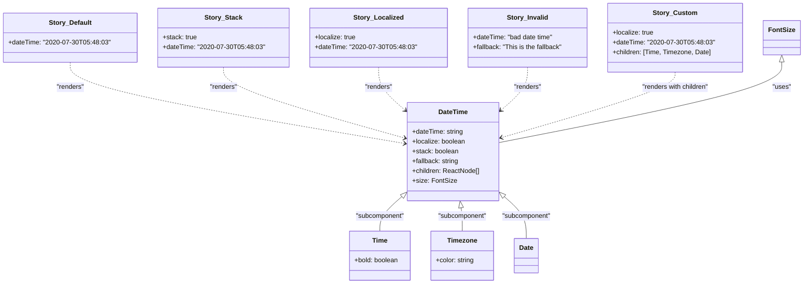

# Diagram: web/portal/src/components/atoms/DateTime.atom.stories.js

> Auto-generated by Obscura crawlers

## Mermaid

### SVG

<svg id="container" width="1901.9453125" xmlns="http://www.w3.org/2000/svg" class="classDiagram" height="692" viewBox="0 0 1901.9453125 692" role="graphics-document document" aria-roledescription="class"><g><defs><marker id="container_class-aggregationStart" class="marker aggregation class" refX="18" refY="7" markerWidth="190" markerHeight="240" orient="auto"><path d="M 18,7 L9,13 L1,7 L9,1 Z"></path></marker></defs><defs><marker id="container_class-aggregationEnd" class="marker aggregation class" refX="1" refY="7" markerWidth="20" markerHeight="28" orient="auto"><path d="M 18,7 L9,13 L1,7 L9,1 Z"></path></marker></defs><defs><marker id="container_class-extensionStart" class="marker extension class" refX="18" refY="7" markerWidth="190" markerHeight="240" orient="auto"><path d="M 1,7 L18,13 V 1 Z"></path></marker></defs><defs><marker id="container_class-extensionEnd" class="marker extension class" refX="1" refY="7" markerWidth="20" markerHeight="28" orient="auto"><path d="M 1,1 V 13 L18,7 Z"></path></marker></defs><defs><marker id="container_class-compositionStart" class="marker composition class" refX="18" refY="7" markerWidth="190" markerHeight="240" orient="auto"><path d="M 18,7 L9,13 L1,7 L9,1 Z"></path></marker></defs><defs><marker id="container_class-compositionEnd" class="marker composition class" refX="1" refY="7" markerWidth="20" markerHeight="28" orient="auto"><path d="M 18,7 L9,13 L1,7 L9,1 Z"></path></marker></defs><defs><marker id="container_class-dependencyStart" class="marker dependency class" refX="6" refY="7" markerWidth="190" markerHeight="240" orient="auto"><path d="M 5,7 L9,13 L1,7 L9,1 Z"></path></marker></defs><defs><marker id="container_class-dependencyEnd" class="marker dependency class" refX="13" refY="7" markerWidth="20" markerHeight="28" orient="auto"><path d="M 18,7 L9,13 L14,7 L9,1 Z"></path></marker></defs><defs><marker id="container_class-lollipopStart" class="marker lollipop class" refX="13" refY="7" markerWidth="190" markerHeight="240" orient="auto"><circle stroke="black" fill="transparent" cx="7" cy="7" r="6"></circle></marker></defs><defs><marker id="container_class-lollipopEnd" class="marker lollipop class" refX="1" refY="7" markerWidth="190" markerHeight="240" orient="auto"><circle stroke="black" fill="transparent" cx="7" cy="7" r="6"></circle></marker></defs><g class="root"><g class="clusters"></g><g class="edgePaths"><path d="M944.377,479.352L935.331,487.293C926.286,495.235,908.195,511.117,899.149,525.225C890.104,539.333,890.104,551.667,890.104,557.833L890.104,564" id="id_DateTime_Time_1" class="edge-thickness-normal edge-pattern-solid relation" style=";;;" data-edge="true" data-et="edge" data-id="id_DateTime_Time_1" data-points="W3sieCI6OTU3LjMzOTg0Mzc1LCJ5Ijo0NjcuOTcxMzE5NjY2NjcwM30seyJ4Ijo4OTAuMTAzNTE1NjI1LCJ5Ijo1Mjd9LHsieCI6ODkwLjEwMzUxNTYyNSwieSI6NTY0fV0=" marker-start="url(#container_class-extensionStart)"></path><path d="M1089.131,507.066L1089.621,510.388C1090.11,513.71,1091.089,520.355,1091.579,529.844C1092.068,539.333,1092.068,551.667,1092.068,557.833L1092.068,564" id="id_DateTime_Timezone_2" class="edge-thickness-normal edge-pattern-solid relation" style=";;;" data-edge="true" data-et="edge" data-id="id_DateTime_Timezone_2" data-points="W3sieCI6MTA4Ni42MTYyMTcxNTc2NDM0LCJ5Ijo0OTB9LHsieCI6MTA5Mi4wNjgzNTkzNzUsInkiOjUyN30seyJ4IjoxMDkyLjA2ODM1OTM3NSwieSI6NTY0fV0=" marker-start="url(#container_class-extensionStart)"></path><path d="M1193.49,479.352L1202.536,487.293C1211.582,495.235,1229.673,511.117,1238.718,528.225C1247.764,545.333,1247.764,563.667,1247.764,572.833L1247.764,582" id="id_DateTime_Date_3" class="edge-thickness-normal edge-pattern-solid relation" style=";;;" data-edge="true" data-et="edge" data-id="id_DateTime_Date_3" data-points="W3sieCI6MTE4MC41MjczNDM3NSwieSI6NDY3Ljk3MTMxOTY2NjY3MDN9LHsieCI6MTI0Ny43NjM2NzE4NzUsInkiOjUyN30seyJ4IjoxMjQ3Ljc2MzY3MTg3NSwieSI6NTgyfV0=" marker-start="url(#container_class-extensionStart)"></path><path d="M165.07,152L165.07,162.167C165.07,172.333,165.07,192.667,296.13,225.598C427.19,258.53,689.309,304.06,820.369,326.825L951.428,349.589" id="id_Story_Default_DateTime_4" class="edge-thickness-normal edge-pattern-dashed relation" style=";;;" data-edge="true" data-et="edge" data-id="id_Story_Default_DateTime_4" data-points="W3sieCI6MTY1LjA3MDMxMjUsInkiOjE1Mn0seyJ4IjoxNjUuMDcwMzEyNSwieSI6MjEzfSx7IngiOjk1Ny4zMzk4NDM3NSwieSI6MzUwLjYxNjI5NTUwMjM3OTF9XQ==" marker-end="url(#container_class-dependencyEnd)"></path><path d="M525.879,164L525.879,172.167C525.879,180.333,525.879,196.667,596.828,225.345C667.778,254.024,809.677,295.048,880.626,315.559L951.576,336.071" id="id_Story_Stack_DateTime_5" class="edge-thickness-normal edge-pattern-dashed relation" style=";;;" data-edge="true" data-et="edge" data-id="id_Story_Stack_DateTime_5" data-points="W3sieCI6NTI1Ljg3ODkwNjI1LCJ5IjoxNjR9LHsieCI6NTI1Ljg3ODkwNjI1LCJ5IjoyMTN9LHsieCI6OTU3LjMzOTg0Mzc1LCJ5IjozMzcuNzM3NjUzMDMzMzMyODN9XQ==" marker-end="url(#container_class-dependencyEnd)"></path><path d="M890.375,164L890.375,172.167C890.375,180.333,890.375,196.667,900.785,213.986C911.195,231.306,932.014,249.612,942.424,258.765L952.834,267.918" id="id_Story_Localized_DateTime_6" class="edge-thickness-normal edge-pattern-dashed relation" style=";;;" data-edge="true" data-et="edge" data-id="id_Story_Localized_DateTime_6" data-points="W3sieCI6ODkwLjM3NSwieSI6MTY0fSx7IngiOjg5MC4zNzUsInkiOjIxM30seyJ4Ijo5NTcuMzM5ODQzNzUsInkiOjI3MS44Nzk3MjI2MDUwNjIyfV0=" marker-end="url(#container_class-dependencyEnd)"></path><path d="M1247.492,164L1247.492,172.167C1247.492,180.333,1247.492,196.667,1237.082,213.986C1226.673,231.306,1205.853,249.612,1195.443,258.765L1185.033,267.918" id="id_Story_Invalid_DateTime_7" class="edge-thickness-normal edge-pattern-dashed relation" style=";;;" data-edge="true" data-et="edge" data-id="id_Story_Invalid_DateTime_7" data-points="W3sieCI6MTI0Ny40OTIxODc1LCJ5IjoxNjR9LHsieCI6MTI0Ny40OTIxODc1LCJ5IjoyMTN9LHsieCI6MTE4MC41MjczNDM3NSwieSI6MjcxLjg3OTcyMjYwNTA2MjJ9XQ==" marker-end="url(#container_class-dependencyEnd)"></path><path d="M1601.055,176L1601.055,182.167C1601.055,188.333,1601.055,200.667,1531.926,227.229C1462.797,253.792,1324.54,294.585,1255.411,314.981L1186.282,335.377" id="id_Story_Custom_DateTime_8" class="edge-thickness-normal edge-pattern-dashed relation" style=";;;" data-edge="true" data-et="edge" data-id="id_Story_Custom_DateTime_8" data-points="W3sieCI6MTYwMS4wNTQ2ODc1LCJ5IjoxNzZ9LHsieCI6MTYwMS4wNTQ2ODc1LCJ5IjoyMTN9LHsieCI6MTE4MC41MjczNDM3NSwieSI6MzM3LjA3NDc1MjQyODAwNDF9XQ==" marker-end="url(#container_class-dependencyEnd)"></path><path d="M1851.102,151.25L1851.102,161.542C1851.102,171.833,1851.102,192.417,1739.339,225.142C1627.577,257.867,1404.052,302.734,1292.29,325.167L1180.527,347.6" id="id_FontSize_DateTime_9" class="edge-thickness-normal edge-pattern-solid relation" style=";;;" data-edge="true" data-et="edge" data-id="id_FontSize_DateTime_9" data-points="W3sieCI6MTg1MS4xMDE1NjI1LCJ5IjoxMzR9LHsieCI6MTg1MS4xMDE1NjI1LCJ5IjoyMTN9LHsieCI6MTE4MC41MjczNDM3NSwieSI6MzQ3LjYwMDQzOTQ4MzYwNjc1fV0=" marker-start="url(#container_class-extensionStart)"></path></g><g class="edgeLabels"><g class="edgeLabel" transform="translate(890.103515625, 527)"><g class="label" data-id="id_DateTime_Time_1" transform="translate(-60.5703125, -12)"><foreignObject width="121.140625" height="24">

"subcomponent"

</foreignObject></g></g><g class="edgeLabel" transform="translate(1092.068359375, 527)"><g class="label" data-id="id_DateTime_Timezone_2" transform="translate(-60.5703125, -12)"><foreignObject width="121.140625" height="24">

"subcomponent"

</foreignObject></g></g><g class="edgeLabel" transform="translate(1247.763671875, 527)"><g class="label" data-id="id_DateTime_Date_3" transform="translate(-60.5703125, -12)"><foreignObject width="121.140625" height="24">

"subcomponent"

</foreignObject></g></g><g class="edgeLabel" transform="translate(165.0703125, 213)"><g class="label" data-id="id_Story_Default_DateTime_4" transform="translate(-34.015625, -12)"><foreignObject width="68.03125" height="24">

"renders"

</foreignObject></g></g><g class="edgeLabel" transform="translate(525.87890625, 213)"><g class="label" data-id="id_Story_Stack_DateTime_5" transform="translate(-34.015625, -12)"><foreignObject width="68.03125" height="24">

"renders"

</foreignObject></g></g><g class="edgeLabel" transform="translate(890.375, 213)"><g class="label" data-id="id_Story_Localized_DateTime_6" transform="translate(-34.015625, -12)"><foreignObject width="68.03125" height="24">

"renders"

</foreignObject></g></g><g class="edgeLabel" transform="translate(1247.4921875, 213)"><g class="label" data-id="id_Story_Invalid_DateTime_7" transform="translate(-34.015625, -12)"><foreignObject width="68.03125" height="24">

"renders"

</foreignObject></g></g><g class="edgeLabel" transform="translate(1601.0546875, 213)"><g class="label" data-id="id_Story_Custom_DateTime_8" transform="translate(-83.609375, -12)"><foreignObject width="167.21875" height="24">

"renders with children"

</foreignObject></g></g><g class="edgeLabel" transform="translate(1851.1015625, 213)"><g class="label" data-id="id_FontSize_DateTime_9" transform="translate(-22.7578125, -12)"><foreignObject width="45.515625" height="24">

"uses"

</foreignObject></g></g></g><g class="nodes"><g class="node default" id="classId-DateTime-0" transform="translate(1068.93359375, 370)"><g class="basic label-container"><path d="M-111.59375 -120 L111.59375 -120 L111.59375 120 L-111.59375 120" stroke="none" stroke-width="0" fill="#ECECFF" style=""></path><path d="M-111.59375 -120 C-25.31052007664286 -120, 60.97270984671428 -120, 111.59375 -120 M-111.59375 -120 C-27.58571073896644 -120, 56.42232852206712 -120, 111.59375 -120 M111.59375 -120 C111.59375 -66.7974337041732, 111.59375 -13.594867408346403, 111.59375 120 M111.59375 -120 C111.59375 -55.08551155940903, 111.59375 9.828976881181944, 111.59375 120 M111.59375 120 C48.80209619301551 120, -13.989557613968984 120, -111.59375 120 M111.59375 120 C24.87571290182582 120, -61.84232419634836 120, -111.59375 120 M-111.59375 120 C-111.59375 55.49615427253801, -111.59375 -9.007691454923986, -111.59375 -120 M-111.59375 120 C-111.59375 56.577950162298784, -111.59375 -6.844099675402433, -111.59375 -120" stroke="#9370DB" stroke-width="1.3" fill="none" stroke-dasharray="0 0" style=""></path></g><g class="annotation-group text" transform="translate(0, -96)"></g><g class="label-group text" transform="translate(-34.625, -96)"><g class="label" style="font-weight: bolder" transform="translate(0,-12)"><foreignObject width="69.25" height="24">

DateTime

</foreignObject></g></g><g class="members-group text" transform="translate(-99.59375, -48)"><g class="label" style="" transform="translate(0,-12)"><foreignObject width="125.453125" height="24">

+dateTime: string

</foreignObject></g><g class="label" style="" transform="translate(0,12)"><foreignObject width="130.296875" height="24">

+localize: boolean

</foreignObject></g><g class="label" style="" transform="translate(0,36)"><foreignObject width="113.25" height="24">

+stack: boolean

</foreignObject></g><g class="label" style="" transform="translate(0,60)"><foreignObject width="114.34375" height="24">

+fallback: string

</foreignObject></g><g class="label" style="" transform="translate(0,84)"><foreignObject width="164.5625" height="24">

+children: ReactNode[]

</foreignObject></g><g class="label" style="" transform="translate(0,108)"><foreignObject width="104.28125" height="24">

+size: FontSize

</foreignObject></g></g><g class="methods-group text" transform="translate(-99.59375, 120)"></g><g class="divider" style=""><path d="M-111.59375 -72 C-34.27453152241138 -72, 43.04468695517724 -72, 111.59375 -72 M-111.59375 -72 C-36.85780236712324 -72, 37.87814526575352 -72, 111.59375 -72" stroke="#9370DB" stroke-width="1.3" fill="none" stroke-dasharray="0 0" style=""></path></g><g class="divider" style=""><path d="M-111.59375 96 C-66.2677140588082 96, -20.941678117616377 96, 111.59375 96 M-111.59375 96 C-44.26755162119001 96, 23.058646757619982 96, 111.59375 96" stroke="#9370DB" stroke-width="1.3" fill="none" stroke-dasharray="0 0" style=""></path></g></g><g class="node default" id="classId-Time-1" transform="translate(890.103515625, 624)"><g class="basic label-container"><path d="M-75.14453125 -60 L75.14453125 -60 L75.14453125 60 L-75.14453125 60" stroke="none" stroke-width="0" fill="#ECECFF" style=""></path><path d="M-75.14453125 -60 C-31.51338960511447 -60, 12.117752039771062 -60, 75.14453125 -60 M-75.14453125 -60 C-32.450540884483615 -60, 10.24344948103277 -60, 75.14453125 -60 M75.14453125 -60 C75.14453125 -21.898921164621775, 75.14453125 16.20215767075645, 75.14453125 60 M75.14453125 -60 C75.14453125 -28.8077287010729, 75.14453125 2.3845425978541996, 75.14453125 60 M75.14453125 60 C19.315061318926894 60, -36.51440861214621 60, -75.14453125 60 M75.14453125 60 C16.747116985189706 60, -41.65029727962059 60, -75.14453125 60 M-75.14453125 60 C-75.14453125 21.82139068649648, -75.14453125 -16.357218627007043, -75.14453125 -60 M-75.14453125 60 C-75.14453125 26.54874484094735, -75.14453125 -6.9025103181053, -75.14453125 -60" stroke="#9370DB" stroke-width="1.3" fill="none" stroke-dasharray="0 0" style=""></path></g><g class="annotation-group text" transform="translate(0, -36)"></g><g class="label-group text" transform="translate(-17.7578125, -36)"><g class="label" style="font-weight: bolder" transform="translate(0,-12)"><foreignObject width="35.515625" height="24">

Time

</foreignObject></g></g><g class="members-group text" transform="translate(-63.14453125, 12)"><g class="label" style="" transform="translate(0,-12)"><foreignObject width="108.53125" height="24">

+bold: boolean

</foreignObject></g></g><g class="methods-group text" transform="translate(-63.14453125, 60)"></g><g class="divider" style=""><path d="M-75.14453125 -12 C-21.013872943931915 -12, 33.11678536213617 -12, 75.14453125 -12 M-75.14453125 -12 C-17.670819448763844 -12, 39.80289235247231 -12, 75.14453125 -12" stroke="#9370DB" stroke-width="1.3" fill="none" stroke-dasharray="0 0" style=""></path></g><g class="divider" style=""><path d="M-75.14453125 36 C-25.282124771780296 36, 24.580281706439408 36, 75.14453125 36 M-75.14453125 36 C-30.140977756551983 36, 14.862575736896034 36, 75.14453125 36" stroke="#9370DB" stroke-width="1.3" fill="none" stroke-dasharray="0 0" style=""></path></g></g><g class="node default" id="classId-Timezone-2" transform="translate(1092.068359375, 624)"><g class="basic label-container"><path d="M-76.8203125 -60 L76.8203125 -60 L76.8203125 60 L-76.8203125 60" stroke="none" stroke-width="0" fill="#ECECFF" style=""></path><path d="M-76.8203125 -60 C-41.197724008962496 -60, -5.575135517924991 -60, 76.8203125 -60 M-76.8203125 -60 C-35.320575609728884 -60, 6.179161280542232 -60, 76.8203125 -60 M76.8203125 -60 C76.8203125 -31.94123444414388, 76.8203125 -3.882468888287761, 76.8203125 60 M76.8203125 -60 C76.8203125 -30.313665589738296, 76.8203125 -0.6273311794765917, 76.8203125 60 M76.8203125 60 C32.12975978187425 60, -12.560792936251502 60, -76.8203125 60 M76.8203125 60 C43.39739884809954 60, 9.974485196199083 60, -76.8203125 60 M-76.8203125 60 C-76.8203125 29.681348761243168, -76.8203125 -0.6373024775136642, -76.8203125 -60 M-76.8203125 60 C-76.8203125 15.814640531865471, -76.8203125 -28.370718936269057, -76.8203125 -60" stroke="#9370DB" stroke-width="1.3" fill="none" stroke-dasharray="0 0" style=""></path></g><g class="annotation-group text" transform="translate(0, -36)"></g><g class="label-group text" transform="translate(-34.984375, -36)"><g class="label" style="font-weight: bolder" transform="translate(0,-12)"><foreignObject width="69.96875" height="24">

Timezone

</foreignObject></g></g><g class="members-group text" transform="translate(-64.8203125, 12)"><g class="label" style="" transform="translate(0,-12)"><foreignObject width="94.65625" height="24">

+color: string

</foreignObject></g></g><g class="methods-group text" transform="translate(-64.8203125, 60)"></g><g class="divider" style=""><path d="M-76.8203125 -12 C-17.851700687821392 -12, 41.116911124357216 -12, 76.8203125 -12 M-76.8203125 -12 C-26.74442892562712 -12, 23.331454648745762 -12, 76.8203125 -12" stroke="#9370DB" stroke-width="1.3" fill="none" stroke-dasharray="0 0" style=""></path></g><g class="divider" style=""><path d="M-76.8203125 36 C-17.002995569775024 36, 42.81432136044995 36, 76.8203125 36 M-76.8203125 36 C-33.662428539749854 36, 9.495455420500292 36, 76.8203125 36" stroke="#9370DB" stroke-width="1.3" fill="none" stroke-dasharray="0 0" style=""></path></g></g><g class="node default" id="classId-Date-3" transform="translate(1247.763671875, 624)"><g class="basic label-container"><path d="M-28.875 -42 L28.875 -42 L28.875 42 L-28.875 42" stroke="none" stroke-width="0" fill="#ECECFF" style=""></path><path d="M-28.875 -42 C-15.10997954270034 -42, -1.3449590854006814 -42, 28.875 -42 M-28.875 -42 C-13.563777441472116 -42, 1.7474451170557685 -42, 28.875 -42 M28.875 -42 C28.875 -10.07511203871244, 28.875 21.84977592257512, 28.875 42 M28.875 -42 C28.875 -18.5174079597786, 28.875 4.965184080442803, 28.875 42 M28.875 42 C10.180785107253808 42, -8.513429785492384 42, -28.875 42 M28.875 42 C11.066691388181944 42, -6.741617223636112 42, -28.875 42 M-28.875 42 C-28.875 13.787902107080384, -28.875 -14.424195785839231, -28.875 -42 M-28.875 42 C-28.875 10.481565426386585, -28.875 -21.03686914722683, -28.875 -42" stroke="#9370DB" stroke-width="1.3" fill="none" stroke-dasharray="0 0" style=""></path></g><g class="annotation-group text" transform="translate(0, -18)"></g><g class="label-group text" transform="translate(-16.875, -18)"><g class="label" style="font-weight: bolder" transform="translate(0,-12)"><foreignObject width="33.75" height="24">

Date

</foreignObject></g></g><g class="members-group text" transform="translate(-16.875, 30)"></g><g class="methods-group text" transform="translate(-16.875, 60)"></g><g class="divider" style=""><path d="M-28.875 6 C-11.658159205414442 6, 5.558681589171115 6, 28.875 6 M-28.875 6 C-11.736950574573441 6, 5.401098850853117 6, 28.875 6" stroke="#9370DB" stroke-width="1.3" fill="none" stroke-dasharray="0 0" style=""></path></g><g class="divider" style=""><path d="M-28.875 24 C-10.546155895641196 24, 7.782688208717609 24, 28.875 24 M-28.875 24 C-11.894181379924127 24, 5.086637240151745 24, 28.875 24" stroke="#9370DB" stroke-width="1.3" fill="none" stroke-dasharray="0 0" style=""></path></g></g><g class="node default" id="classId-Story_Default-4" transform="translate(165.0703125, 92)"><g class="basic label-container"><path d="M-157.0703125 -60 L157.0703125 -60 L157.0703125 60 L-157.0703125 60" stroke="none" stroke-width="0" fill="#ECECFF" style=""></path><path d="M-157.0703125 -60 C-87.64834254788389 -60, -18.22637259576777 -60, 157.0703125 -60 M-157.0703125 -60 C-60.03828280528057 -60, 36.99374688943885 -60, 157.0703125 -60 M157.0703125 -60 C157.0703125 -30.472135350912374, 157.0703125 -0.9442707018247489, 157.0703125 60 M157.0703125 -60 C157.0703125 -14.305406075744195, 157.0703125 31.38918784851161, 157.0703125 60 M157.0703125 60 C34.0895720123754 60, -88.8911684752492 60, -157.0703125 60 M157.0703125 60 C56.235020334158435 60, -44.60027183168313 60, -157.0703125 60 M-157.0703125 60 C-157.0703125 31.500156686561056, -157.0703125 3.000313373122111, -157.0703125 -60 M-157.0703125 60 C-157.0703125 26.624163130938825, -157.0703125 -6.751673738122349, -157.0703125 -60" stroke="#9370DB" stroke-width="1.3" fill="none" stroke-dasharray="0 0" style=""></path></g><g class="annotation-group text" transform="translate(0, -36)"></g><g class="label-group text" transform="translate(-50.171875, -36)"><g class="label" style="font-weight: bolder" transform="translate(0,-12)"><foreignObject width="100.34375" height="24">

Story_Default

</foreignObject></g></g><g class="members-group text" transform="translate(-145.0703125, 12)"><g class="label" style="" transform="translate(0,-12)"><foreignObject width="239.96875" height="24">

+dateTime: "2020-07-30T05:48:03"

</foreignObject></g></g><g class="methods-group text" transform="translate(-145.0703125, 60)"></g><g class="divider" style=""><path d="M-157.0703125 -12 C-79.37379558677101 -12, -1.6772786735420198 -12, 157.0703125 -12 M-157.0703125 -12 C-32.377853811544455 -12, 92.31460487691109 -12, 157.0703125 -12" stroke="#9370DB" stroke-width="1.3" fill="none" stroke-dasharray="0 0" style=""></path></g><g class="divider" style=""><path d="M-157.0703125 36 C-60.784520794022654 36, 35.50127091195469 36, 157.0703125 36 M-157.0703125 36 C-83.59904029938829 36, -10.127768098776585 36, 157.0703125 36" stroke="#9370DB" stroke-width="1.3" fill="none" stroke-dasharray="0 0" style=""></path></g></g><g class="node default" id="classId-Story_Stack-5" transform="translate(525.87890625, 92)"><g class="basic label-container"><path d="M-153.73828125 -72 L153.73828125 -72 L153.73828125 72 L-153.73828125 72" stroke="none" stroke-width="0" fill="#ECECFF" style=""></path><path d="M-153.73828125 -72 C-47.87829546784481 -72, 57.981690314310384 -72, 153.73828125 -72 M-153.73828125 -72 C-75.07524101313095 -72, 3.5877992237381022 -72, 153.73828125 -72 M153.73828125 -72 C153.73828125 -38.006956572964555, 153.73828125 -4.013913145929109, 153.73828125 72 M153.73828125 -72 C153.73828125 -26.835596086385287, 153.73828125 18.328807827229426, 153.73828125 72 M153.73828125 72 C54.49912314781275 72, -44.740034954374494 72, -153.73828125 72 M153.73828125 72 C69.22674903094803 72, -15.284783188103944 72, -153.73828125 72 M-153.73828125 72 C-153.73828125 41.41093416320917, -153.73828125 10.82186832641834, -153.73828125 -72 M-153.73828125 72 C-153.73828125 18.780243652811407, -153.73828125 -34.439512694377186, -153.73828125 -72" stroke="#9370DB" stroke-width="1.3" fill="none" stroke-dasharray="0 0" style=""></path></g><g class="annotation-group text" transform="translate(0, -48)"></g><g class="label-group text" transform="translate(-43.5078125, -48)"><g class="label" style="font-weight: bolder" transform="translate(0,-12)"><foreignObject width="87.015625" height="24">

Story_Stack

</foreignObject></g></g><g class="members-group text" transform="translate(-141.73828125, 0)"><g class="label" style="" transform="translate(0,-12)"><foreignObject width="83.796875" height="24">

+stack: true

</foreignObject></g><g class="label" style="" transform="translate(0,12)"><foreignObject width="239.96875" height="24">

+dateTime: "2020-07-30T05:48:03"

</foreignObject></g></g><g class="methods-group text" transform="translate(-141.73828125, 72)"></g><g class="divider" style=""><path d="M-153.73828125 -24 C-74.99854012927133 -24, 3.741200991457333 -24, 153.73828125 -24 M-153.73828125 -24 C-42.31870232933858 -24, 69.10087659132284 -24, 153.73828125 -24" stroke="#9370DB" stroke-width="1.3" fill="none" stroke-dasharray="0 0" style=""></path></g><g class="divider" style=""><path d="M-153.73828125 48 C-79.64869195422006 48, -5.559102658440111 48, 153.73828125 48 M-153.73828125 48 C-54.67684280202553 48, 44.384595645948934 48, 153.73828125 48" stroke="#9370DB" stroke-width="1.3" fill="none" stroke-dasharray="0 0" style=""></path></g></g><g class="node default" id="classId-Story_Localized-6" transform="translate(890.375, 92)"><g class="basic label-container"><path d="M-160.7578125 -72 L160.7578125 -72 L160.7578125 72 L-160.7578125 72" stroke="none" stroke-width="0" fill="#ECECFF" style=""></path><path d="M-160.7578125 -72 C-53.35490341139682 -72, 54.04800567720636 -72, 160.7578125 -72 M-160.7578125 -72 C-34.71450667466662 -72, 91.32879915066675 -72, 160.7578125 -72 M160.7578125 -72 C160.7578125 -33.51914453660541, 160.7578125 4.961710926789181, 160.7578125 72 M160.7578125 -72 C160.7578125 -29.694657376328372, 160.7578125 12.610685247343255, 160.7578125 72 M160.7578125 72 C75.17288519640769 72, -10.412042107184618 72, -160.7578125 72 M160.7578125 72 C92.70246942220895 72, 24.6471263444179 72, -160.7578125 72 M-160.7578125 72 C-160.7578125 25.937672813245634, -160.7578125 -20.124654373508733, -160.7578125 -72 M-160.7578125 72 C-160.7578125 41.874868613873694, -160.7578125 11.749737227747389, -160.7578125 -72" stroke="#9370DB" stroke-width="1.3" fill="none" stroke-dasharray="0 0" style=""></path></g><g class="annotation-group text" transform="translate(0, -48)"></g><g class="label-group text" transform="translate(-57.546875, -48)"><g class="label" style="font-weight: bolder" transform="translate(0,-12)"><foreignObject width="115.09375" height="24">

Story_Localized

</foreignObject></g></g><g class="members-group text" transform="translate(-148.7578125, 0)"><g class="label" style="" transform="translate(0,-12)"><foreignObject width="100.84375" height="24">

+localize: true

</foreignObject></g><g class="label" style="" transform="translate(0,12)"><foreignObject width="239.96875" height="24">

+dateTime: "2020-07-30T05:48:03"

</foreignObject></g></g><g class="methods-group text" transform="translate(-148.7578125, 72)"></g><g class="divider" style=""><path d="M-160.7578125 -24 C-46.28613596170807 -24, 68.18554057658386 -24, 160.7578125 -24 M-160.7578125 -24 C-93.69566211608796 -24, -26.63351173217592 -24, 160.7578125 -24" stroke="#9370DB" stroke-width="1.3" fill="none" stroke-dasharray="0 0" style=""></path></g><g class="divider" style=""><path d="M-160.7578125 48 C-80.90257075808518 48, -1.0473290161703517 48, 160.7578125 48 M-160.7578125 48 C-39.05427387027598 48, 82.64926475944804 48, 160.7578125 48" stroke="#9370DB" stroke-width="1.3" fill="none" stroke-dasharray="0 0" style=""></path></g></g><g class="node default" id="classId-Story_Invalid-7" transform="translate(1247.4921875, 92)"><g class="basic label-container"><path d="M-146.359375 -72 L146.359375 -72 L146.359375 72 L-146.359375 72" stroke="none" stroke-width="0" fill="#ECECFF" style=""></path><path d="M-146.359375 -72 C-42.21094679487048 -72, 61.93748141025904 -72, 146.359375 -72 M-146.359375 -72 C-45.208791836785 -72, 55.94179132643001 -72, 146.359375 -72 M146.359375 -72 C146.359375 -27.288593499089707, 146.359375 17.422813001820586, 146.359375 72 M146.359375 -72 C146.359375 -19.25997834591068, 146.359375 33.48004330817864, 146.359375 72 M146.359375 72 C36.22789495313346 72, -73.90358509373308 72, -146.359375 72 M146.359375 72 C38.830288177251205 72, -68.69879864549759 72, -146.359375 72 M-146.359375 72 C-146.359375 38.837113256942224, -146.359375 5.674226513884449, -146.359375 -72 M-146.359375 72 C-146.359375 18.456082936577225, -146.359375 -35.08783412684555, -146.359375 -72" stroke="#9370DB" stroke-width="1.3" fill="none" stroke-dasharray="0 0" style=""></path></g><g class="annotation-group text" transform="translate(0, -48)"></g><g class="label-group text" transform="translate(-48.046875, -48)"><g class="label" style="font-weight: bolder" transform="translate(0,-12)"><foreignObject width="96.09375" height="24">

Story_Invalid

</foreignObject></g></g><g class="members-group text" transform="translate(-134.359375, 0)"><g class="label" style="" transform="translate(0,-12)"><foreignObject width="197.765625" height="24">

+dateTime: "bad date time"

</foreignObject></g><g class="label" style="" transform="translate(0,12)"><foreignObject width="220.671875" height="24">

+fallback: "This is the fallback"

</foreignObject></g></g><g class="methods-group text" transform="translate(-134.359375, 72)"></g><g class="divider" style=""><path d="M-146.359375 -24 C-79.14457803075149 -24, -11.929781061502979 -24, 146.359375 -24 M-146.359375 -24 C-36.301798048809374 -24, 73.75577890238125 -24, 146.359375 -24" stroke="#9370DB" stroke-width="1.3" fill="none" stroke-dasharray="0 0" style=""></path></g><g class="divider" style=""><path d="M-146.359375 48 C-53.04311378908028 48, 40.27314742183944 48, 146.359375 48 M-146.359375 48 C-38.28341376931783 48, 69.79254746136434 48, 146.359375 48" stroke="#9370DB" stroke-width="1.3" fill="none" stroke-dasharray="0 0" style=""></path></g></g><g class="node default" id="classId-Story_Custom-8" transform="translate(1601.0546875, 92)"><g class="basic label-container"><path d="M-157.203125 -84 L157.203125 -84 L157.203125 84 L-157.203125 84" stroke="none" stroke-width="0" fill="#ECECFF" style=""></path><path d="M-157.203125 -84 C-44.384471270481356 -84, 68.43418245903729 -84, 157.203125 -84 M-157.203125 -84 C-72.2485625766035 -84, 12.705999846792992 -84, 157.203125 -84 M157.203125 -84 C157.203125 -42.446898161972236, 157.203125 -0.8937963239444713, 157.203125 84 M157.203125 -84 C157.203125 -29.788076998867773, 157.203125 24.423846002264455, 157.203125 84 M157.203125 84 C42.694977647871795 84, -71.81316970425641 84, -157.203125 84 M157.203125 84 C34.26832871004095 84, -88.6664675799181 84, -157.203125 84 M-157.203125 84 C-157.203125 22.460759826618045, -157.203125 -39.07848034676391, -157.203125 -84 M-157.203125 84 C-157.203125 28.353475380790755, -157.203125 -27.29304923841849, -157.203125 -84" stroke="#9370DB" stroke-width="1.3" fill="none" stroke-dasharray="0 0" style=""></path></g><g class="annotation-group text" transform="translate(0, -60)"></g><g class="label-group text" transform="translate(-50.4375, -60)"><g class="label" style="font-weight: bolder" transform="translate(0,-12)"><foreignObject width="100.875" height="24">

Story_Custom

</foreignObject></g></g><g class="members-group text" transform="translate(-145.203125, -12)"><g class="label" style="" transform="translate(0,-12)"><foreignObject width="100.84375" height="24">

+localize: true

</foreignObject></g><g class="label" style="" transform="translate(0,12)"><foreignObject width="239.96875" height="24">

+dateTime: "2020-07-30T05:48:03"

</foreignObject></g><g class="label" style="" transform="translate(0,36)"><foreignObject width="239.53125" height="24">

+children: [Time, Timezone, Date]

</foreignObject></g></g><g class="methods-group text" transform="translate(-145.203125, 84)"></g><g class="divider" style=""><path d="M-157.203125 -36 C-39.70618367293014 -36, 77.79075765413972 -36, 157.203125 -36 M-157.203125 -36 C-89.83955221755696 -36, -22.475979435113913 -36, 157.203125 -36" stroke="#9370DB" stroke-width="1.3" fill="none" stroke-dasharray="0 0" style=""></path></g><g class="divider" style=""><path d="M-157.203125 60 C-70.23560320192253 60, 16.73191859615494 60, 157.203125 60 M-157.203125 60 C-80.25709170955741 60, -3.311058419114829 60, 157.203125 60" stroke="#9370DB" stroke-width="1.3" fill="none" stroke-dasharray="0 0" style=""></path></g></g><g class="node default" id="classId-FontSize-9" transform="translate(1851.1015625, 92)"><g class="basic label-container"><path d="M-42.84375 -42 L42.84375 -42 L42.84375 42 L-42.84375 42" stroke="none" stroke-width="0" fill="#ECECFF" style=""></path><path d="M-42.84375 -42 C-17.196514258866184 -42, 8.450721482267632 -42, 42.84375 -42 M-42.84375 -42 C-18.49023591512514 -42, 5.863278169749719 -42, 42.84375 -42 M42.84375 -42 C42.84375 -21.172034468111057, 42.84375 -0.344068936222115, 42.84375 42 M42.84375 -42 C42.84375 -24.219202141409163, 42.84375 -6.438404282818325, 42.84375 42 M42.84375 42 C22.436025171704262 42, 2.0283003434085245 42, -42.84375 42 M42.84375 42 C8.701348871566701 42, -25.441052256866598 42, -42.84375 42 M-42.84375 42 C-42.84375 19.210403314760562, -42.84375 -3.579193370478876, -42.84375 -42 M-42.84375 42 C-42.84375 17.285602199734978, -42.84375 -7.428795600530044, -42.84375 -42" stroke="#9370DB" stroke-width="1.3" fill="none" stroke-dasharray="0 0" style=""></path></g><g class="annotation-group text" transform="translate(0, -18)"></g><g class="label-group text" transform="translate(-30.84375, -18)"><g class="label" style="font-weight: bolder" transform="translate(0,-12)"><foreignObject width="61.6875" height="24">

FontSize

</foreignObject></g></g><g class="members-group text" transform="translate(-30.84375, 30)"></g><g class="methods-group text" transform="translate(-30.84375, 60)"></g><g class="divider" style=""><path d="M-42.84375 6 C-25.448000733817 6, -8.052251467634001 6, 42.84375 6 M-42.84375 6 C-24.73032001657372 6, -6.616890033147442 6, 42.84375 6" stroke="#9370DB" stroke-width="1.3" fill="none" stroke-dasharray="0 0" style=""></path></g><g class="divider" style=""><path d="M-42.84375 24 C-20.644579698747144 24, 1.5545906025057121 24, 42.84375 24 M-42.84375 24 C-17.710159176898486 24, 7.423431646203028 24, 42.84375 24" stroke="#9370DB" stroke-width="1.3" fill="none" stroke-dasharray="0 0" style=""></path></g></g></g></g></g></svg>
