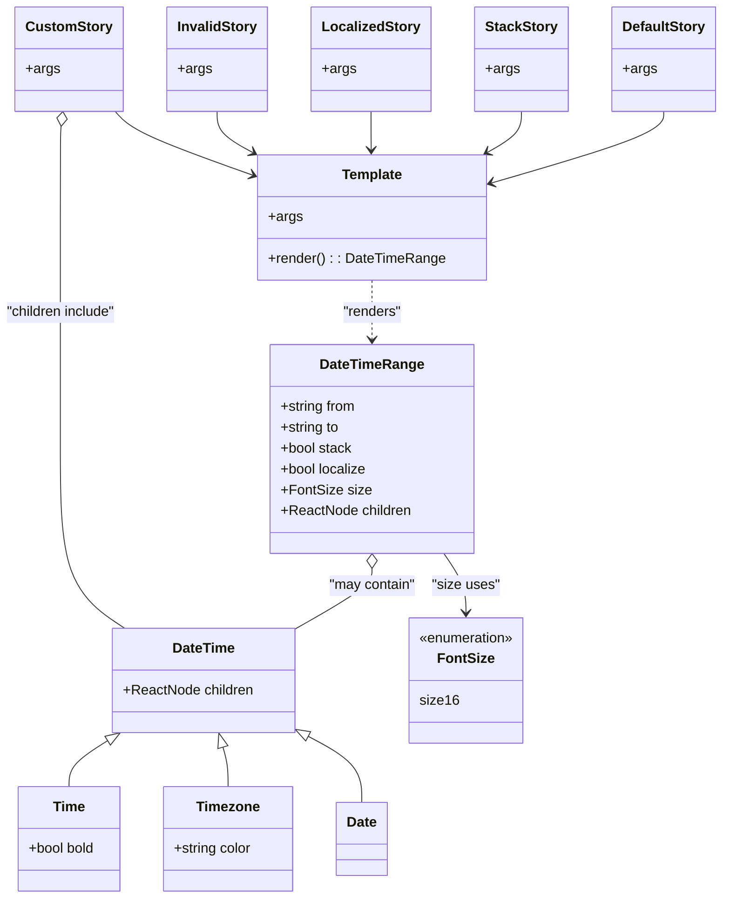

# Diagram: web/portal/src/components/atoms/DateTimeRange.atom.stories.js

> Auto-generated by Obscura crawlers

## Mermaid

### SVG

<svg id="container" width="813.3515625" xmlns="http://www.w3.org/2000/svg" class="classDiagram" height="1032" viewBox="0 0 813.3515625 1032" role="graphics-document document" aria-roledescription="class"><g><defs><marker id="container_class-aggregationStart" class="marker aggregation class" refX="18" refY="7" markerWidth="190" markerHeight="240" orient="auto"><path d="M 18,7 L9,13 L1,7 L9,1 Z"></path></marker></defs><defs><marker id="container_class-aggregationEnd" class="marker aggregation class" refX="1" refY="7" markerWidth="20" markerHeight="28" orient="auto"><path d="M 18,7 L9,13 L1,7 L9,1 Z"></path></marker></defs><defs><marker id="container_class-extensionStart" class="marker extension class" refX="18" refY="7" markerWidth="190" markerHeight="240" orient="auto"><path d="M 1,7 L18,13 V 1 Z"></path></marker></defs><defs><marker id="container_class-extensionEnd" class="marker extension class" refX="1" refY="7" markerWidth="20" markerHeight="28" orient="auto"><path d="M 1,1 V 13 L18,7 Z"></path></marker></defs><defs><marker id="container_class-compositionStart" class="marker composition class" refX="18" refY="7" markerWidth="190" markerHeight="240" orient="auto"><path d="M 18,7 L9,13 L1,7 L9,1 Z"></path></marker></defs><defs><marker id="container_class-compositionEnd" class="marker composition class" refX="1" refY="7" markerWidth="20" markerHeight="28" orient="auto"><path d="M 18,7 L9,13 L1,7 L9,1 Z"></path></marker></defs><defs><marker id="container_class-dependencyStart" class="marker dependency class" refX="6" refY="7" markerWidth="190" markerHeight="240" orient="auto"><path d="M 5,7 L9,13 L1,7 L9,1 Z"></path></marker></defs><defs><marker id="container_class-dependencyEnd" class="marker dependency class" refX="13" refY="7" markerWidth="20" markerHeight="28" orient="auto"><path d="M 18,7 L9,13 L14,7 L9,1 Z"></path></marker></defs><defs><marker id="container_class-lollipopStart" class="marker lollipop class" refX="13" refY="7" markerWidth="190" markerHeight="240" orient="auto"><circle stroke="black" fill="transparent" cx="7" cy="7" r="6"></circle></marker></defs><defs><marker id="container_class-lollipopEnd" class="marker lollipop class" refX="1" refY="7" markerWidth="190" markerHeight="240" orient="auto"><circle stroke="black" fill="transparent" cx="7" cy="7" r="6"></circle></marker></defs><g class="root"><g class="clusters"></g><g class="edgePaths"><path d="M425.664,653.25L425.664,656.542C425.664,659.833,425.664,666.417,410.927,678.034C396.189,689.651,366.715,706.302,351.978,714.627L337.24,722.952" id="id_DateTimeRange_DateTime_1" class="edge-thickness-normal edge-pattern-solid relation" style=";;;" data-edge="true" data-et="edge" data-id="id_DateTimeRange_DateTime_1" data-points="W3sieCI6NDI1LjY2NDA2MjUsInkiOjYzNn0seyJ4Ijo0MjUuNjY0MDYyNSwieSI6NjczfSx7IngiOjMzNy4yNDAyMzQzNzUsInkiOjcyMi45NTI0OTQ3MTA5NDk2fV0=" marker-start="url(#container_class-aggregationStart)"></path><path d="M125.641,851.38L118.537,855.984C111.433,860.587,97.224,869.793,90.12,878.563C83.016,887.333,83.016,895.667,83.016,899.833L83.016,904" id="id_DateTime_Time_2" class="edge-thickness-normal edge-pattern-solid relation" style=";;;" data-edge="true" data-et="edge" data-id="id_DateTime_Time_2" data-points="W3sieCI6MTQwLjExODEzMzg1OTUzNjEsInkiOjg0Mn0seyJ4Ijo4My4wMTU2MjUsInkiOjg3OX0seyJ4Ijo4My4wMTU2MjUsInkiOjkwNH1d" marker-start="url(#container_class-extensionStart)"></path><path d="M260.273,858.222L261.525,861.685C262.777,865.148,265.281,872.074,266.533,879.704C267.785,887.333,267.785,895.667,267.785,899.833L267.785,904" id="id_DateTime_Timezone_3" class="edge-thickness-normal edge-pattern-solid relation" style=";;;" data-edge="true" data-et="edge" data-id="id_DateTime_Timezone_3" data-points="W3sieCI6MjU0LjQwODU2NTU2MDU2NywieSI6ODQyfSx7IngiOjI2Ny43ODUxNTYyNSwieSI6ODc5fSx7IngiOjI2Ny43ODUxNTYyNSwieSI6OTA0fV0=" marker-start="url(#container_class-extensionStart)"></path><path d="M352.583,843.596L364.066,849.496C375.549,855.397,398.515,867.199,409.998,880.266C421.48,893.333,421.48,907.667,421.48,914.833L421.48,922" id="id_DateTime_Date_4" class="edge-thickness-normal edge-pattern-solid relation" style=";;;" data-edge="true" data-et="edge" data-id="id_DateTime_Date_4" data-points="W3sieCI6MzM3LjI0MDIzNDM3NSwieSI6ODM1LjcxMTQ2NTQzNjA3MTR9LHsieCI6NDIxLjQ4MDQ2ODc1LCJ5Ijo4Nzl9LHsieCI6NDIxLjQ4MDQ2ODc1LCJ5Ijo5MjJ9XQ==" marker-start="url(#container_class-extensionStart)"></path><path d="M509.119,636L513.408,642.167C517.697,648.333,526.274,660.667,530.563,672C534.852,683.333,534.852,693.667,534.852,698.833L534.852,704" id="id_DateTimeRange_FontSize_5" class="edge-thickness-normal edge-pattern-solid relation" style=";;;" data-edge="true" data-et="edge" data-id="id_DateTimeRange_FontSize_5" data-points="W3sieCI6NTA5LjExOTQ3NjUxMjczODg2LCJ5Ijo2MzZ9LHsieCI6NTM0Ljg1MTU2MjUsInkiOjY3M30seyJ4Ijo1MzQuODUxNTYyNSwieSI6NzEwfV0=" marker-end="url(#container_class-dependencyEnd)"></path><path d="M425.664,322L425.664,328.167C425.664,334.333,425.664,346.667,425.664,358C425.664,369.333,425.664,379.667,425.664,384.833L425.664,390" id="id_Template_DateTimeRange_6" class="edge-thickness-normal edge-pattern-dashed relation" style=";;;" data-edge="true" data-et="edge" data-id="id_Template_DateTimeRange_6" data-points="W3sieCI6NDI1LjY2NDA2MjUsInkiOjMyMn0seyJ4Ijo0MjUuNjY0MDYyNSwieSI6MzU5fSx7IngiOjQyNS42NjQwNjI1LCJ5IjozOTZ9XQ==" marker-end="url(#container_class-dependencyEnd)"></path><path d="M747.102,128L747.102,132.167C747.102,136.333,747.102,144.667,715.955,158.232C684.809,171.798,622.517,190.596,591.371,199.995L560.225,209.394" id="id_DefaultStory_Template_7" class="edge-thickness-normal edge-pattern-solid relation" style=";;;" data-edge="true" data-et="edge" data-id="id_DefaultStory_Template_7" data-points="W3sieCI6NzQ3LjEwMTU2MjUsInkiOjEyOH0seyJ4Ijo3NDcuMTAxNTYyNSwieSI6MTUzfSx7IngiOjU1NC40ODA0Njg3NSwieSI6MjExLjEyNzE1MDk4MTkxNzE3fV0=" marker-end="url(#container_class-dependencyEnd)"></path><path d="M587.102,128L587.102,132.167C587.102,136.333,587.102,144.667,581.024,152.485C574.947,160.303,562.792,167.607,556.714,171.258L550.637,174.91" id="id_StackStory_Template_8" class="edge-thickness-normal edge-pattern-solid relation" style=";;;" data-edge="true" data-et="edge" data-id="id_StackStory_Template_8" data-points="W3sieCI6NTg3LjEwMTU2MjUsInkiOjEyOH0seyJ4Ijo1ODcuMTAxNTYyNSwieSI6MTUzfSx7IngiOjU0NS40OTM5NTk0MDcyMTY1LCJ5IjoxNzh9XQ==" marker-end="url(#container_class-dependencyEnd)"></path><path d="M419.727,128L419.727,132.167C419.727,136.333,419.727,144.667,419.921,152.002C420.114,159.337,420.502,165.674,420.696,168.843L420.89,172.011" id="id_LocalizedStory_Template_9" class="edge-thickness-normal edge-pattern-solid relation" style=";;;" data-edge="true" data-et="edge" data-id="id_LocalizedStory_Template_9" data-points="W3sieCI6NDE5LjcyNjU2MjUsInkiOjEyOH0seyJ4Ijo0MTkuNzI2NTYyNSwieSI6MTUzfSx7IngiOjQyMS4yNTY4NDYwMDUxNTQ2LCJ5IjoxNzh9XQ==" marker-end="url(#container_class-dependencyEnd)"></path><path d="M247.977,128L247.977,132.167C247.977,136.333,247.977,144.667,255.244,152.801C262.511,160.935,277.046,168.869,284.314,172.837L291.581,176.804" id="id_InvalidStory_Template_10" class="edge-thickness-normal edge-pattern-solid relation" style=";;;" data-edge="true" data-et="edge" data-id="id_InvalidStory_Template_10" data-points="W3sieCI6MjQ3Ljk3NjU2MjUsInkiOjEyOH0seyJ4IjoyNDcuOTc2NTYyNSwieSI6MTUzfSx7IngiOjI5Ni44NDc2NTYyNSwieSI6MTc5LjY3ODgzODM3NDk1NjAzfV0=" marker-end="url(#container_class-dependencyEnd)"></path><path d="M134.178,128L137.731,132.167C141.284,136.333,148.39,144.667,174.561,156.954C200.731,169.241,245.966,185.482,268.583,193.602L291.201,201.723" id="id_CustomStory_Template_11" class="edge-thickness-normal edge-pattern-solid relation" style=";;;" data-edge="true" data-et="edge" data-id="id_CustomStory_Template_11" data-points="W3sieCI6MTM0LjE3ODMwODgyMzUyOTQyLCJ5IjoxMjh9LHsieCI6MTU1LjQ5NjA5Mzc1LCJ5IjoxNTN9LHsieCI6Mjk2Ljg0NzY1NjI1LCJ5IjoyMDMuNzUwMjg1NTU3MzA2NjV9XQ==" marker-end="url(#container_class-dependencyEnd)"></path><path d="M73.941,145.132L73.787,146.443C73.633,147.755,73.324,150.377,73.17,167.855C73.016,185.333,73.016,217.667,73.016,252C73.016,286.333,73.016,322.667,73.016,367C73.016,411.333,73.016,463.667,73.016,516C73.016,568.333,73.016,620.667,84.981,655C96.946,689.333,120.877,705.667,132.843,713.833L144.808,722" id="id_CustomStory_DateTime_12" class="edge-thickness-normal edge-pattern-solid relation" style=";;;" data-edge="true" data-et="edge" data-id="id_CustomStory_DateTime_12" data-points="W3sieCI6NzUuOTU2ODAxNDcwNTg4MjMsInkiOjEyOH0seyJ4Ijo3My4wMTU2MjUsInkiOjE1M30seyJ4Ijo3My4wMTU2MjUsInkiOjI1MH0seyJ4Ijo3My4wMTU2MjUsInkiOjM1OX0seyJ4Ijo3My4wMTU2MjUsInkiOjUxNn0seyJ4Ijo3My4wMTU2MjUsInkiOjY3M30seyJ4IjoxNDQuODA3ODk0OTI1NDU4NywieSI6NzIyfV0=" marker-start="url(#container_class-aggregationStart)"></path></g><g class="edgeLabels"><g class="edgeLabel" transform="translate(425.6640625, 673)"><g class="label" data-id="id_DateTimeRange_DateTime_1" transform="translate(-50.6015625, -12)"><foreignObject width="101.203125" height="24">

"may contain"

</foreignObject></g></g><g class="edgeLabel"><g class="label" data-id="id_DateTime_Time_2" transform="translate(0, 0)"><foreignObject width="0" height="0">

</foreignObject></g></g><g class="edgeLabel"><g class="label" data-id="id_DateTime_Timezone_3" transform="translate(0, 0)"><foreignObject width="0" height="0">

</foreignObject></g></g><g class="edgeLabel"><g class="label" data-id="id_DateTime_Date_4" transform="translate(0, 0)"><foreignObject width="0" height="0">

</foreignObject></g></g><g class="edgeLabel" transform="translate(534.8515625, 673)"><g class="label" data-id="id_DateTimeRange_FontSize_5" transform="translate(-38.5859375, -12)"><foreignObject width="77.171875" height="24">

"size uses"

</foreignObject></g></g><g class="edgeLabel" transform="translate(425.6640625, 359)"><g class="label" data-id="id_Template_DateTimeRange_6" transform="translate(-34.015625, -12)"><foreignObject width="68.03125" height="24">

"renders"

</foreignObject></g></g><g class="edgeLabel"><g class="label" data-id="id_DefaultStory_Template_7" transform="translate(0, 0)"><foreignObject width="0" height="0">

</foreignObject></g></g><g class="edgeLabel"><g class="label" data-id="id_StackStory_Template_8" transform="translate(0, 0)"><foreignObject width="0" height="0">

</foreignObject></g></g><g class="edgeLabel"><g class="label" data-id="id_LocalizedStory_Template_9" transform="translate(0, 0)"><foreignObject width="0" height="0">

</foreignObject></g></g><g class="edgeLabel"><g class="label" data-id="id_InvalidStory_Template_10" transform="translate(0, 0)"><foreignObject width="0" height="0">

</foreignObject></g></g><g class="edgeLabel"><g class="label" data-id="id_CustomStory_Template_11" transform="translate(0, 0)"><foreignObject width="0" height="0">

</foreignObject></g></g><g class="edgeLabel" transform="translate(73.015625, 359)"><g class="label" data-id="id_CustomStory_DateTime_12" transform="translate(-65.015625, -12)"><foreignObject width="130.03125" height="24">

"children include"

</foreignObject></g></g></g><g class="nodes"><g class="node default" id="classId-DateTimeRange-0" transform="translate(425.6640625, 516)"><g class="basic label-container"><path d="M-115.77734375 -120 L115.77734375 -120 L115.77734375 120 L-115.77734375 120" stroke="none" stroke-width="0" fill="#ECECFF" style=""></path><path d="M-115.77734375 -120 C-54.011148960697696 -120, 7.755045828604608 -120, 115.77734375 -120 M-115.77734375 -120 C-65.17335639169112 -120, -14.56936903338223 -120, 115.77734375 -120 M115.77734375 -120 C115.77734375 -39.7624967743219, 115.77734375 40.475006451356194, 115.77734375 120 M115.77734375 -120 C115.77734375 -42.280506656305775, 115.77734375 35.43898668738845, 115.77734375 120 M115.77734375 120 C66.59302375160166 120, 17.408703753203312 120, -115.77734375 120 M115.77734375 120 C40.144038820245 120, -35.48926610951 120, -115.77734375 120 M-115.77734375 120 C-115.77734375 45.202820322020415, -115.77734375 -29.59435935595917, -115.77734375 -120 M-115.77734375 120 C-115.77734375 57.352727903656216, -115.77734375 -5.294544192687567, -115.77734375 -120" stroke="#9370DB" stroke-width="1.3" fill="none" stroke-dasharray="0 0" style=""></path></g><g class="annotation-group text" transform="translate(0, -96)"></g><g class="label-group text" transform="translate(-57.1328125, -96)"><g class="label" style="font-weight: bolder" transform="translate(0,-12)"><foreignObject width="114.265625" height="24">

DateTimeRange

</foreignObject></g></g><g class="members-group text" transform="translate(-103.77734375, -48)"><g class="label" style="" transform="translate(0,-12)"><foreignObject width="87.96875" height="24">

+string from

</foreignObject></g><g class="label" style="" transform="translate(0,12)"><foreignObject width="68.75" height="24">

+string to

</foreignObject></g><g class="label" style="" transform="translate(0,36)"><foreignObject width="82.796875" height="24">

+bool stack

</foreignObject></g><g class="label" style="" transform="translate(0,60)"><foreignObject width="99.890625" height="24">

+bool localize

</foreignObject></g><g class="label" style="" transform="translate(0,84)"><foreignObject width="100.4375" height="24">

+FontSize size

</foreignObject></g><g class="label" style="" transform="translate(0,108)"><foreignObject width="150.421875" height="24">

+ReactNode children

</foreignObject></g></g><g class="methods-group text" transform="translate(-103.77734375, 120)"></g><g class="divider" style=""><path d="M-115.77734375 -72 C-29.483811579500795 -72, 56.80972059099841 -72, 115.77734375 -72 M-115.77734375 -72 C-68.81498522756884 -72, -21.85262670513768 -72, 115.77734375 -72" stroke="#9370DB" stroke-width="1.3" fill="none" stroke-dasharray="0 0" style=""></path></g><g class="divider" style=""><path d="M-115.77734375 96 C-37.013637528826635 96, 41.75006869234673 96, 115.77734375 96 M-115.77734375 96 C-35.27350996668447 96, 45.230323816631056 96, 115.77734375 96" stroke="#9370DB" stroke-width="1.3" fill="none" stroke-dasharray="0 0" style=""></path></g></g><g class="node default" id="classId-DateTime-1" transform="translate(232.716796875, 782)"><g class="basic label-container"><path d="M-104.5234375 -60 L104.5234375 -60 L104.5234375 60 L-104.5234375 60" stroke="none" stroke-width="0" fill="#ECECFF" style=""></path><path d="M-104.5234375 -60 C-28.3641355814203 -60, 47.7951663371594 -60, 104.5234375 -60 M-104.5234375 -60 C-31.093472967381828 -60, 42.336491565236344 -60, 104.5234375 -60 M104.5234375 -60 C104.5234375 -15.92823714457041, 104.5234375 28.14352571085918, 104.5234375 60 M104.5234375 -60 C104.5234375 -29.313909638871827, 104.5234375 1.3721807222563456, 104.5234375 60 M104.5234375 60 C48.88357966482222 60, -6.756278170355557 60, -104.5234375 60 M104.5234375 60 C57.08106271076033 60, 9.638687921520656 60, -104.5234375 60 M-104.5234375 60 C-104.5234375 35.31897974185297, -104.5234375 10.637959483705934, -104.5234375 -60 M-104.5234375 60 C-104.5234375 34.11725249033771, -104.5234375 8.234504980675425, -104.5234375 -60" stroke="#9370DB" stroke-width="1.3" fill="none" stroke-dasharray="0 0" style=""></path></g><g class="annotation-group text" transform="translate(0, -36)"></g><g class="label-group text" transform="translate(-34.625, -36)"><g class="label" style="font-weight: bolder" transform="translate(0,-12)"><foreignObject width="69.25" height="24">

DateTime

</foreignObject></g></g><g class="members-group text" transform="translate(-92.5234375, 12)"><g class="label" style="" transform="translate(0,-12)"><foreignObject width="150.421875" height="24">

+ReactNode children

</foreignObject></g></g><g class="methods-group text" transform="translate(-92.5234375, 60)"></g><g class="divider" style=""><path d="M-104.5234375 -12 C-35.061177107177755 -12, 34.40108328564449 -12, 104.5234375 -12 M-104.5234375 -12 C-57.765036606848795 -12, -11.006635713697591 -12, 104.5234375 -12" stroke="#9370DB" stroke-width="1.3" fill="none" stroke-dasharray="0 0" style=""></path></g><g class="divider" style=""><path d="M-104.5234375 36 C-46.836769772578954 36, 10.849897954842092 36, 104.5234375 36 M-104.5234375 36 C-57.91788290503391 36, -11.312328310067826 36, 104.5234375 36" stroke="#9370DB" stroke-width="1.3" fill="none" stroke-dasharray="0 0" style=""></path></g></g><g class="node default" id="classId-Time-2" transform="translate(83.015625, 964)"><g class="basic label-container"><path d="M-59.94921875 -60 L59.94921875 -60 L59.94921875 60 L-59.94921875 60" stroke="none" stroke-width="0" fill="#ECECFF" style=""></path><path d="M-59.94921875 -60 C-25.488385160538513 -60, 8.972448428922974 -60, 59.94921875 -60 M-59.94921875 -60 C-22.17223876214573 -60, 15.604741225708537 -60, 59.94921875 -60 M59.94921875 -60 C59.94921875 -15.99027837403061, 59.94921875 28.01944325193878, 59.94921875 60 M59.94921875 -60 C59.94921875 -32.18638889907695, 59.94921875 -4.372777798153905, 59.94921875 60 M59.94921875 60 C15.80268894893996 60, -28.34384085212008 60, -59.94921875 60 M59.94921875 60 C25.388472382388926 60, -9.172273985222148 60, -59.94921875 60 M-59.94921875 60 C-59.94921875 16.756422839285754, -59.94921875 -26.48715432142849, -59.94921875 -60 M-59.94921875 60 C-59.94921875 13.031407008126799, -59.94921875 -33.9371859837464, -59.94921875 -60" stroke="#9370DB" stroke-width="1.3" fill="none" stroke-dasharray="0 0" style=""></path></g><g class="annotation-group text" transform="translate(0, -36)"></g><g class="label-group text" transform="translate(-17.7578125, -36)"><g class="label" style="font-weight: bolder" transform="translate(0,-12)"><foreignObject width="35.515625" height="24">

Time

</foreignObject></g></g><g class="members-group text" transform="translate(-47.94921875, 12)"><g class="label" style="" transform="translate(0,-12)"><foreignObject width="78.140625" height="24">

+bool bold

</foreignObject></g></g><g class="methods-group text" transform="translate(-47.94921875, 60)"></g><g class="divider" style=""><path d="M-59.94921875 -12 C-13.382445795817546 -12, 33.18432715836491 -12, 59.94921875 -12 M-59.94921875 -12 C-20.813840330552075 -12, 18.32153808889585 -12, 59.94921875 -12" stroke="#9370DB" stroke-width="1.3" fill="none" stroke-dasharray="0 0" style=""></path></g><g class="divider" style=""><path d="M-59.94921875 36 C-29.79927230781155 36, 0.3506741343769022 36, 59.94921875 36 M-59.94921875 36 C-18.040358856866014 36, 23.868501036267972 36, 59.94921875 36" stroke="#9370DB" stroke-width="1.3" fill="none" stroke-dasharray="0 0" style=""></path></g></g><g class="node default" id="classId-Timezone-3" transform="translate(267.78515625, 964)"><g class="basic label-container"><path d="M-74.8203125 -60 L74.8203125 -60 L74.8203125 60 L-74.8203125 60" stroke="none" stroke-width="0" fill="#ECECFF" style=""></path><path d="M-74.8203125 -60 C-34.01169038428209 -60, 6.796931731435819 -60, 74.8203125 -60 M-74.8203125 -60 C-43.66226282939712 -60, -12.504213158794236 -60, 74.8203125 -60 M74.8203125 -60 C74.8203125 -21.896230225177845, 74.8203125 16.20753954964431, 74.8203125 60 M74.8203125 -60 C74.8203125 -23.024680928089644, 74.8203125 13.950638143820711, 74.8203125 60 M74.8203125 60 C29.521757597866305 60, -15.77679730426739 60, -74.8203125 60 M74.8203125 60 C21.342489584754702 60, -32.135333330490596 60, -74.8203125 60 M-74.8203125 60 C-74.8203125 30.623581735593824, -74.8203125 1.2471634711876476, -74.8203125 -60 M-74.8203125 60 C-74.8203125 25.044788319981826, -74.8203125 -9.910423360036347, -74.8203125 -60" stroke="#9370DB" stroke-width="1.3" fill="none" stroke-dasharray="0 0" style=""></path></g><g class="annotation-group text" transform="translate(0, -36)"></g><g class="label-group text" transform="translate(-34.984375, -36)"><g class="label" style="font-weight: bolder" transform="translate(0,-12)"><foreignObject width="69.96875" height="24">

Timezone

</foreignObject></g></g><g class="members-group text" transform="translate(-62.8203125, 12)"><g class="label" style="" transform="translate(0,-12)"><foreignObject width="90.65625" height="24">

+string color

</foreignObject></g></g><g class="methods-group text" transform="translate(-62.8203125, 60)"></g><g class="divider" style=""><path d="M-74.8203125 -12 C-19.341761399164753 -12, 36.136789701670494 -12, 74.8203125 -12 M-74.8203125 -12 C-34.563955185058234 -12, 5.692402129883533 -12, 74.8203125 -12" stroke="#9370DB" stroke-width="1.3" fill="none" stroke-dasharray="0 0" style=""></path></g><g class="divider" style=""><path d="M-74.8203125 36 C-28.604505249325065 36, 17.61130200134987 36, 74.8203125 36 M-74.8203125 36 C-27.956161962673285 36, 18.90798857465343 36, 74.8203125 36" stroke="#9370DB" stroke-width="1.3" fill="none" stroke-dasharray="0 0" style=""></path></g></g><g class="node default" id="classId-Date-4" transform="translate(421.48046875, 964)"><g class="basic label-container"><path d="M-28.875 -42 L28.875 -42 L28.875 42 L-28.875 42" stroke="none" stroke-width="0" fill="#ECECFF" style=""></path><path d="M-28.875 -42 C-7.765750864029233 -42, 13.343498271941534 -42, 28.875 -42 M-28.875 -42 C-14.587689458981492 -42, -0.3003789179629841 -42, 28.875 -42 M28.875 -42 C28.875 -18.463577311443803, 28.875 5.072845377112394, 28.875 42 M28.875 -42 C28.875 -17.229862424800817, 28.875 7.540275150398365, 28.875 42 M28.875 42 C11.873498196315012 42, -5.128003607369976 42, -28.875 42 M28.875 42 C11.304604562209104 42, -6.265790875581793 42, -28.875 42 M-28.875 42 C-28.875 16.802811201725458, -28.875 -8.394377596549084, -28.875 -42 M-28.875 42 C-28.875 14.502258209241017, -28.875 -12.995483581517966, -28.875 -42" stroke="#9370DB" stroke-width="1.3" fill="none" stroke-dasharray="0 0" style=""></path></g><g class="annotation-group text" transform="translate(0, -18)"></g><g class="label-group text" transform="translate(-16.875, -18)"><g class="label" style="font-weight: bolder" transform="translate(0,-12)"><foreignObject width="33.75" height="24">

Date

</foreignObject></g></g><g class="members-group text" transform="translate(-16.875, 30)"></g><g class="methods-group text" transform="translate(-16.875, 60)"></g><g class="divider" style=""><path d="M-28.875 6 C-8.589593726484892 6, 11.695812547030215 6, 28.875 6 M-28.875 6 C-8.8241268774083 6, 11.2267462451834 6, 28.875 6" stroke="#9370DB" stroke-width="1.3" fill="none" stroke-dasharray="0 0" style=""></path></g><g class="divider" style=""><path d="M-28.875 24 C-15.410083711633122 24, -1.9451674232662448 24, 28.875 24 M-28.875 24 C-10.781012280791941 24, 7.312975438416117 24, 28.875 24" stroke="#9370DB" stroke-width="1.3" fill="none" stroke-dasharray="0 0" style=""></path></g></g><g class="node default" id="classId-FontSize-5" transform="translate(534.8515625, 782)"><g class="basic label-container"><path d="M-67.5546875 -72 L67.5546875 -72 L67.5546875 72 L-67.5546875 72" stroke="none" stroke-width="0" fill="#ECECFF" style=""></path><path d="M-67.5546875 -72 C-24.274935840486826 -72, 19.004815819026348 -72, 67.5546875 -72 M-67.5546875 -72 C-18.7181001976723 -72, 30.1184871046554 -72, 67.5546875 -72 M67.5546875 -72 C67.5546875 -15.982677257946122, 67.5546875 40.034645484107756, 67.5546875 72 M67.5546875 -72 C67.5546875 -30.22170095934394, 67.5546875 11.556598081312117, 67.5546875 72 M67.5546875 72 C38.717339933217715 72, 9.879992366435431 72, -67.5546875 72 M67.5546875 72 C30.041753497559995 72, -7.47118050488001 72, -67.5546875 72 M-67.5546875 72 C-67.5546875 23.817062297896946, -67.5546875 -24.365875404206108, -67.5546875 -72 M-67.5546875 72 C-67.5546875 33.11093552771942, -67.5546875 -5.7781289445611606, -67.5546875 -72" stroke="#9370DB" stroke-width="1.3" fill="none" stroke-dasharray="0 0" style=""></path></g><g class="annotation-group text" transform="translate(-55.5546875, -48)"><g class="label" style="" transform="translate(0,-12)"><foreignObject width="111.109375" height="24">

«enumeration»

</foreignObject></g></g><g class="label-group text" transform="translate(-30.84375, -24)"><g class="label" style="font-weight: bolder" transform="translate(0,-12)"><foreignObject width="61.6875" height="24">

FontSize

</foreignObject></g></g><g class="members-group text" transform="translate(-55.5546875, 24)"><g class="label" style="" transform="translate(0,-12)"><foreignObject width="42.25" height="24">

size16

</foreignObject></g></g><g class="methods-group text" transform="translate(-55.5546875, 72)"></g><g class="divider" style=""><path d="M-67.5546875 0 C-24.255779233196193 0, 19.043129033607613 0, 67.5546875 0 M-67.5546875 0 C-37.77211541142424 0, -7.989543322848476 0, 67.5546875 0" stroke="#9370DB" stroke-width="1.3" fill="none" stroke-dasharray="0 0" style=""></path></g><g class="divider" style=""><path d="M-67.5546875 48 C-34.1697485393467 48, -0.7848095786933982 48, 67.5546875 48 M-67.5546875 48 C-29.521366440071375 48, 8.51195461985725 48, 67.5546875 48" stroke="#9370DB" stroke-width="1.3" fill="none" stroke-dasharray="0 0" style=""></path></g></g><g class="node default" id="classId-Template-6" transform="translate(425.6640625, 250)"><g class="basic label-container"><path d="M-128.81640625 -72 L128.81640625 -72 L128.81640625 72 L-128.81640625 72" stroke="none" stroke-width="0" fill="#ECECFF" style=""></path><path d="M-128.81640625 -72 C-53.776049670874414 -72, 21.26430690825117 -72, 128.81640625 -72 M-128.81640625 -72 C-41.11731222101005 -72, 46.581781807979894 -72, 128.81640625 -72 M128.81640625 -72 C128.81640625 -36.371781789903345, 128.81640625 -0.7435635798066897, 128.81640625 72 M128.81640625 -72 C128.81640625 -31.448809077601048, 128.81640625 9.102381844797904, 128.81640625 72 M128.81640625 72 C28.727093448374404 72, -71.36221935325119 72, -128.81640625 72 M128.81640625 72 C43.646412451050836 72, -41.52358134789833 72, -128.81640625 72 M-128.81640625 72 C-128.81640625 32.811643741521685, -128.81640625 -6.37671251695663, -128.81640625 -72 M-128.81640625 72 C-128.81640625 41.88960061894565, -128.81640625 11.7792012378913, -128.81640625 -72" stroke="#9370DB" stroke-width="1.3" fill="none" stroke-dasharray="0 0" style=""></path></g><g class="annotation-group text" transform="translate(0, -48)"></g><g class="label-group text" transform="translate(-33.9140625, -48)"><g class="label" style="font-weight: bolder" transform="translate(0,-12)"><foreignObject width="67.828125" height="24">

Template

</foreignObject></g></g><g class="members-group text" transform="translate(-116.81640625, 0)"><g class="label" style="" transform="translate(0,-12)"><foreignObject width="38.078125" height="24">

+args

</foreignObject></g></g><g class="methods-group text" transform="translate(-116.81640625, 48)"><g class="label" style="" transform="translate(0,-12)"><foreignObject width="199.71875" height="24">

+render() : : DateTimeRange

</foreignObject></g></g><g class="divider" style=""><path d="M-128.81640625 -24 C-55.83385889360255 -24, 17.148688462794894 -24, 128.81640625 -24 M-128.81640625 -24 C-46.52085520507367 -24, 35.774695839852654 -24, 128.81640625 -24" stroke="#9370DB" stroke-width="1.3" fill="none" stroke-dasharray="0 0" style=""></path></g><g class="divider" style=""><path d="M-128.81640625 24 C-25.8653884226771 24, 77.0856294046458 24, 128.81640625 24 M-128.81640625 24 C-43.11034244296174 24, 42.595721364076525 24, 128.81640625 24" stroke="#9370DB" stroke-width="1.3" fill="none" stroke-dasharray="0 0" style=""></path></g></g><g class="node default" id="classId-DefaultStory-7" transform="translate(747.1015625, 68)"><g class="basic label-container"><path d="M-58.25 -60 L58.25 -60 L58.25 60 L-58.25 60" stroke="none" stroke-width="0" fill="#ECECFF" style=""></path><path d="M-58.25 -60 C-30.386031641334498 -60, -2.522063282668995 -60, 58.25 -60 M-58.25 -60 C-24.372619217458904 -60, 9.504761565082191 -60, 58.25 -60 M58.25 -60 C58.25 -20.611141529449732, 58.25 18.777716941100536, 58.25 60 M58.25 -60 C58.25 -18.32577580701586, 58.25 23.348448385968283, 58.25 60 M58.25 60 C23.178805795746648 60, -11.892388408506704 60, -58.25 60 M58.25 60 C34.76118214849764 60, 11.27236429699527 60, -58.25 60 M-58.25 60 C-58.25 35.91756957385287, -58.25 11.835139147705753, -58.25 -60 M-58.25 60 C-58.25 35.719483418983685, -58.25 11.438966837967364, -58.25 -60" stroke="#9370DB" stroke-width="1.3" fill="none" stroke-dasharray="0 0" style=""></path></g><g class="annotation-group text" transform="translate(0, -36)"></g><g class="label-group text" transform="translate(-46.25, -36)"><g class="label" style="font-weight: bolder" transform="translate(0,-12)"><foreignObject width="92.5" height="24">

DefaultStory

</foreignObject></g></g><g class="members-group text" transform="translate(-46.25, 12)"><g class="label" style="" transform="translate(0,-12)"><foreignObject width="38.078125" height="24">

+args

</foreignObject></g></g><g class="methods-group text" transform="translate(-46.25, 60)"></g><g class="divider" style=""><path d="M-58.25 -12 C-15.177699394227531 -12, 27.894601211544938 -12, 58.25 -12 M-58.25 -12 C-27.877819544608048 -12, 2.4943609107839038 -12, 58.25 -12" stroke="#9370DB" stroke-width="1.3" fill="none" stroke-dasharray="0 0" style=""></path></g><g class="divider" style=""><path d="M-58.25 36 C-27.453864950547135 36, 3.342270098905729 36, 58.25 36 M-58.25 36 C-32.01145314307293 36, -5.772906286145854 36, 58.25 36" stroke="#9370DB" stroke-width="1.3" fill="none" stroke-dasharray="0 0" style=""></path></g></g><g class="node default" id="classId-StackStory-8" transform="translate(587.1015625, 68)"><g class="basic label-container"><path d="M-51.75 -60 L51.75 -60 L51.75 60 L-51.75 60" stroke="none" stroke-width="0" fill="#ECECFF" style=""></path><path d="M-51.75 -60 C-30.261279675316846 -60, -8.772559350633692 -60, 51.75 -60 M-51.75 -60 C-25.355159228741783 -60, 1.0396815425164334 -60, 51.75 -60 M51.75 -60 C51.75 -19.69365535998795, 51.75 20.6126892800241, 51.75 60 M51.75 -60 C51.75 -34.49864089735058, 51.75 -8.997281794701166, 51.75 60 M51.75 60 C24.7820205578554 60, -2.1859588842891995 60, -51.75 60 M51.75 60 C28.487127280555026 60, 5.224254561110051 60, -51.75 60 M-51.75 60 C-51.75 26.609463215234385, -51.75 -6.78107356953123, -51.75 -60 M-51.75 60 C-51.75 26.23840294182348, -51.75 -7.523194116353039, -51.75 -60" stroke="#9370DB" stroke-width="1.3" fill="none" stroke-dasharray="0 0" style=""></path></g><g class="annotation-group text" transform="translate(0, -36)"></g><g class="label-group text" transform="translate(-39.75, -36)"><g class="label" style="font-weight: bolder" transform="translate(0,-12)"><foreignObject width="79.5" height="24">

StackStory

</foreignObject></g></g><g class="members-group text" transform="translate(-39.75, 12)"><g class="label" style="" transform="translate(0,-12)"><foreignObject width="38.078125" height="24">

+args

</foreignObject></g></g><g class="methods-group text" transform="translate(-39.75, 60)"></g><g class="divider" style=""><path d="M-51.75 -12 C-20.768501775944923 -12, 10.212996448110154 -12, 51.75 -12 M-51.75 -12 C-20.922449338611948 -12, 9.905101322776105 -12, 51.75 -12" stroke="#9370DB" stroke-width="1.3" fill="none" stroke-dasharray="0 0" style=""></path></g><g class="divider" style=""><path d="M-51.75 36 C-13.460425002418297 36, 24.829149995163405 36, 51.75 36 M-51.75 36 C-15.318568824194728 36, 21.112862351610545 36, 51.75 36" stroke="#9370DB" stroke-width="1.3" fill="none" stroke-dasharray="0 0" style=""></path></g></g><g class="node default" id="classId-LocalizedStory-9" transform="translate(419.7265625, 68)"><g class="basic label-container"><path d="M-65.625 -60 L65.625 -60 L65.625 60 L-65.625 60" stroke="none" stroke-width="0" fill="#ECECFF" style=""></path><path d="M-65.625 -60 C-37.385773473421125 -60, -9.146546946842257 -60, 65.625 -60 M-65.625 -60 C-18.101405722776754 -60, 29.422188554446493 -60, 65.625 -60 M65.625 -60 C65.625 -24.581769833032453, 65.625 10.836460333935094, 65.625 60 M65.625 -60 C65.625 -33.78444335862805, 65.625 -7.568886717256099, 65.625 60 M65.625 60 C38.51105052621999 60, 11.397101052439986 60, -65.625 60 M65.625 60 C36.32695706913837 60, 7.028914138276754 60, -65.625 60 M-65.625 60 C-65.625 25.72855863375021, -65.625 -8.542882732499578, -65.625 -60 M-65.625 60 C-65.625 16.513705116027808, -65.625 -26.972589767944385, -65.625 -60" stroke="#9370DB" stroke-width="1.3" fill="none" stroke-dasharray="0 0" style=""></path></g><g class="annotation-group text" transform="translate(0, -36)"></g><g class="label-group text" transform="translate(-53.625, -36)"><g class="label" style="font-weight: bolder" transform="translate(0,-12)"><foreignObject width="107.25" height="24">

LocalizedStory

</foreignObject></g></g><g class="members-group text" transform="translate(-53.625, 12)"><g class="label" style="" transform="translate(0,-12)"><foreignObject width="38.078125" height="24">

+args

</foreignObject></g></g><g class="methods-group text" transform="translate(-53.625, 60)"></g><g class="divider" style=""><path d="M-65.625 -12 C-28.859013698383478 -12, 7.906972603233044 -12, 65.625 -12 M-65.625 -12 C-18.047399988911977 -12, 29.530200022176047 -12, 65.625 -12" stroke="#9370DB" stroke-width="1.3" fill="none" stroke-dasharray="0 0" style=""></path></g><g class="divider" style=""><path d="M-65.625 36 C-22.164704963181613 36, 21.295590073636774 36, 65.625 36 M-65.625 36 C-17.50572620854792 36, 30.61354758290416 36, 65.625 36" stroke="#9370DB" stroke-width="1.3" fill="none" stroke-dasharray="0 0" style=""></path></g></g><g class="node default" id="classId-InvalidStory-10" transform="translate(247.9765625, 68)"><g class="basic label-container"><path d="M-56.125 -60 L56.125 -60 L56.125 60 L-56.125 60" stroke="none" stroke-width="0" fill="#ECECFF" style=""></path><path d="M-56.125 -60 C-31.366383380059464 -60, -6.607766760118928 -60, 56.125 -60 M-56.125 -60 C-27.07579961667282 -60, 1.9734007666543576 -60, 56.125 -60 M56.125 -60 C56.125 -19.694628133228143, 56.125 20.610743733543714, 56.125 60 M56.125 -60 C56.125 -18.570746667708015, 56.125 22.85850666458397, 56.125 60 M56.125 60 C20.22456580975667 60, -15.675868380486662 60, -56.125 60 M56.125 60 C19.358410826443468 60, -17.408178347113065 60, -56.125 60 M-56.125 60 C-56.125 21.870222032836203, -56.125 -16.259555934327594, -56.125 -60 M-56.125 60 C-56.125 16.57439372801054, -56.125 -26.851212543978917, -56.125 -60" stroke="#9370DB" stroke-width="1.3" fill="none" stroke-dasharray="0 0" style=""></path></g><g class="annotation-group text" transform="translate(0, -36)"></g><g class="label-group text" transform="translate(-44.125, -36)"><g class="label" style="font-weight: bolder" transform="translate(0,-12)"><foreignObject width="88.25" height="24">

InvalidStory

</foreignObject></g></g><g class="members-group text" transform="translate(-44.125, 12)"><g class="label" style="" transform="translate(0,-12)"><foreignObject width="38.078125" height="24">

+args

</foreignObject></g></g><g class="methods-group text" transform="translate(-44.125, 60)"></g><g class="divider" style=""><path d="M-56.125 -12 C-22.324630773068726 -12, 11.475738453862547 -12, 56.125 -12 M-56.125 -12 C-12.054792160133516 -12, 32.01541567973297 -12, 56.125 -12" stroke="#9370DB" stroke-width="1.3" fill="none" stroke-dasharray="0 0" style=""></path></g><g class="divider" style=""><path d="M-56.125 36 C-16.913087422958903 36, 22.298825154082195 36, 56.125 36 M-56.125 36 C-25.566586617770486 36, 4.991826764459027 36, 56.125 36" stroke="#9370DB" stroke-width="1.3" fill="none" stroke-dasharray="0 0" style=""></path></g></g><g class="node default" id="classId-CustomStory-11" transform="translate(83.015625, 68)"><g class="basic label-container"><path d="M-58.8359375 -60 L58.8359375 -60 L58.8359375 60 L-58.8359375 60" stroke="none" stroke-width="0" fill="#ECECFF" style=""></path><path d="M-58.8359375 -60 C-11.918805449972304 -60, 34.99832660005539 -60, 58.8359375 -60 M-58.8359375 -60 C-27.157398834669284 -60, 4.521139830661433 -60, 58.8359375 -60 M58.8359375 -60 C58.8359375 -26.318570382621516, 58.8359375 7.362859234756968, 58.8359375 60 M58.8359375 -60 C58.8359375 -27.941808402413855, 58.8359375 4.11638319517229, 58.8359375 60 M58.8359375 60 C31.40550655497835 60, 3.975075609956697 60, -58.8359375 60 M58.8359375 60 C32.831420195333216 60, 6.826902890666432 60, -58.8359375 60 M-58.8359375 60 C-58.8359375 23.546715370468746, -58.8359375 -12.906569259062508, -58.8359375 -60 M-58.8359375 60 C-58.8359375 26.748888148207648, -58.8359375 -6.502223703584704, -58.8359375 -60" stroke="#9370DB" stroke-width="1.3" fill="none" stroke-dasharray="0 0" style=""></path></g><g class="annotation-group text" transform="translate(0, -36)"></g><g class="label-group text" transform="translate(-46.8359375, -36)"><g class="label" style="font-weight: bolder" transform="translate(0,-12)"><foreignObject width="93.671875" height="24">

CustomStory

</foreignObject></g></g><g class="members-group text" transform="translate(-46.8359375, 12)"><g class="label" style="" transform="translate(0,-12)"><foreignObject width="38.078125" height="24">

+args

</foreignObject></g></g><g class="methods-group text" transform="translate(-46.8359375, 60)"></g><g class="divider" style=""><path d="M-58.8359375 -12 C-19.352475838810022 -12, 20.130985822379955 -12, 58.8359375 -12 M-58.8359375 -12 C-30.631950325070306 -12, -2.427963150140613 -12, 58.8359375 -12" stroke="#9370DB" stroke-width="1.3" fill="none" stroke-dasharray="0 0" style=""></path></g><g class="divider" style=""><path d="M-58.8359375 36 C-19.470438729416657 36, 19.895060041166687 36, 58.8359375 36 M-58.8359375 36 C-27.635034885259774 36, 3.565867729480452 36, 58.8359375 36" stroke="#9370DB" stroke-width="1.3" fill="none" stroke-dasharray="0 0" style=""></path></g></g></g></g></g></svg>
