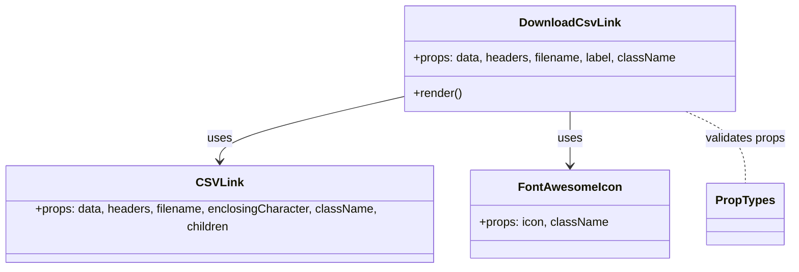

# Diagram: web/portal/src/components/atoms/DownloadCsvLink.atom.js


> Auto-generated by Obscura crawlers

## Diagram 1



### SVG

<svg id="container" width="1064.9453125" xmlns="http://www.w3.org/2000/svg" class="classDiagram" height="354" viewBox="0 0 1064.9453125 354" role="graphics-document document" aria-roledescription="class"><style>#container{font-family:"trebuchet ms",verdana,arial,sans-serif;font-size:16px;fill:#333;}@keyframes edge-animation-frame{from{stroke-dashoffset:0;}}@keyframes dash{to{stroke-dashoffset:0;}}#container .edge-animation-slow{stroke-dasharray:9,5!important;stroke-dashoffset:900;animation:dash 50s linear infinite;stroke-linecap:round;}#container .edge-animation-fast{stroke-dasharray:9,5!important;stroke-dashoffset:900;animation:dash 20s linear infinite;stroke-linecap:round;}#container .error-icon{fill:#552222;}#container .error-text{fill:#552222;stroke:#552222;}#container .edge-thickness-normal{stroke-width:1px;}#container .edge-thickness-thick{stroke-width:3.5px;}#container .edge-pattern-solid{stroke-dasharray:0;}#container .edge-thickness-invisible{stroke-width:0;fill:none;}#container .edge-pattern-dashed{stroke-dasharray:3;}#container .edge-pattern-dotted{stroke-dasharray:2;}#container .marker{fill:#333333;stroke:#333333;}#container .marker.cross{stroke:#333333;}#container svg{font-family:"trebuchet ms",verdana,arial,sans-serif;font-size:16px;}#container p{margin:0;}#container g.classGroup text{fill:#9370DB;stroke:none;font-family:"trebuchet ms",verdana,arial,sans-serif;font-size:10px;}#container g.classGroup text .title{font-weight:bolder;}#container .nodeLabel,#container .edgeLabel{color:#131300;}#container .edgeLabel .label rect{fill:#ECECFF;}#container .label text{fill:#131300;}#container .labelBkg{background:#ECECFF;}#container .edgeLabel .label span{background:#ECECFF;}#container .classTitle{font-weight:bolder;}#container .node rect,#container .node circle,#container .node ellipse,#container .node polygon,#container .node path{fill:#ECECFF;stroke:#9370DB;stroke-width:1px;}#container .divider{stroke:#9370DB;stroke-width:1;}#container g.clickable{cursor:pointer;}#container g.classGroup rect{fill:#ECECFF;stroke:#9370DB;}#container g.classGroup line{stroke:#9370DB;stroke-width:1;}#container .classLabel .box{stroke:none;stroke-width:0;fill:#ECECFF;opacity:0.5;}#container .classLabel .label{fill:#9370DB;font-size:10px;}#container .relation{stroke:#333333;stroke-width:1;fill:none;}#container .dashed-line{stroke-dasharray:3;}#container .dotted-line{stroke-dasharray:1 2;}#container #compositionStart,#container .composition{fill:#333333!important;stroke:#333333!important;stroke-width:1;}#container #compositionEnd,#container .composition{fill:#333333!important;stroke:#333333!important;stroke-width:1;}#container #dependencyStart,#container .dependency{fill:#333333!important;stroke:#333333!important;stroke-width:1;}#container #dependencyStart,#container .dependency{fill:#333333!important;stroke:#333333!important;stroke-width:1;}#container #extensionStart,#container .extension{fill:transparent!important;stroke:#333333!important;stroke-width:1;}#container #extensionEnd,#container .extension{fill:transparent!important;stroke:#333333!important;stroke-width:1;}#container #aggregationStart,#container .aggregation{fill:transparent!important;stroke:#333333!important;stroke-width:1;}#container #aggregationEnd,#container .aggregation{fill:transparent!important;stroke:#333333!important;stroke-width:1;}#container #lollipopStart,#container .lollipop{fill:#ECECFF!important;stroke:#333333!important;stroke-width:1;}#container #lollipopEnd,#container .lollipop{fill:#ECECFF!important;stroke:#333333!important;stroke-width:1;}#container .edgeTerminals{font-size:11px;line-height:initial;}#container .classTitleText{text-anchor:middle;font-size:18px;fill:#333;}#container .label-icon{display:inline-block;height:1em;overflow:visible;vertical-align:-0.125em;}#container .node .label-icon path{fill:currentColor;stroke:revert;stroke-width:revert;}#container :root{--mermaid-font-family:"trebuchet ms",verdana,arial,sans-serif;}</style><g><defs><marker id="container_class-aggregationStart" class="marker aggregation class" refX="18" refY="7" markerWidth="190" markerHeight="240" orient="auto"><path d="M 18,7 L9,13 L1,7 L9,1 Z"></path></marker></defs><defs><marker id="container_class-aggregationEnd" class="marker aggregation class" refX="1" refY="7" markerWidth="20" markerHeight="28" orient="auto"><path d="M 18,7 L9,13 L1,7 L9,1 Z"></path></marker></defs><defs><marker id="container_class-extensionStart" class="marker extension class" refX="18" refY="7" markerWidth="190" markerHeight="240" orient="auto"><path d="M 1,7 L18,13 V 1 Z"></path></marker></defs><defs><marker id="container_class-extensionEnd" class="marker extension class" refX="1" refY="7" markerWidth="20" markerHeight="28" orient="auto"><path d="M 1,1 V 13 L18,7 Z"></path></marker></defs><defs><marker id="container_class-compositionStart" class="marker composition class" refX="18" refY="7" markerWidth="190" markerHeight="240" orient="auto"><path d="M 18,7 L9,13 L1,7 L9,1 Z"></path></marker></defs><defs><marker id="container_class-compositionEnd" class="marker composition class" refX="1" refY="7" markerWidth="20" markerHeight="28" orient="auto"><path d="M 18,7 L9,13 L1,7 L9,1 Z"></path></marker></defs><defs><marker id="container_class-dependencyStart" class="marker dependency class" refX="6" refY="7" markerWidth="190" markerHeight="240" orient="auto"><path d="M 5,7 L9,13 L1,7 L9,1 Z"></path></marker></defs><defs><marker id="container_class-dependencyEnd" class="marker dependency class" refX="13" refY="7" markerWidth="20" markerHeight="28" orient="auto"><path d="M 18,7 L9,13 L14,7 L9,1 Z"></path></marker></defs><defs><marker id="container_class-lollipopStart" class="marker lollipop class" refX="13" refY="7" markerWidth="190" markerHeight="240" orient="auto"><circle stroke="black" fill="transparent" cx="7" cy="7" r="6"></circle></marker></defs><defs><marker id="container_class-lollipopEnd" class="marker lollipop class" refX="1" refY="7" markerWidth="190" markerHeight="240" orient="auto"><circle stroke="black" fill="transparent" cx="7" cy="7" r="6"></circle></marker></defs><g class="root"><g class="clusters"></g><g class="edgePaths"><path d="M546.09,131.552L504.667,141.127C463.245,150.701,380.4,169.851,338.977,184.592C297.555,199.333,297.555,209.667,297.555,214.833L297.555,220" id="id_DownloadCsvLink_CSVLink_1" class="edge-thickness-normal edge-pattern-solid relation" style=";;;" data-edge="true" data-et="edge" data-id="id_DownloadCsvLink_CSVLink_1" data-points="W3sieCI6NTQ2LjA4OTg0Mzc1LCJ5IjoxMzEuNTUxOTc5Nzg3OTM5MDV9LHsieCI6Mjk3LjU1NDY4NzUsInkiOjE4OX0seyJ4IjoyOTcuNTU0Njg3NSwieSI6MjI2fV0=" marker-end="url(#container_class-dependencyEnd)"></path><path d="M769.117,152L769.117,158.167C769.117,164.333,769.117,176.667,769.117,188C769.117,199.333,769.117,209.667,769.117,214.833L769.117,220" id="id_DownloadCsvLink_FontAwesomeIcon_2" class="edge-thickness-normal edge-pattern-solid relation" style=";;;" data-edge="true" data-et="edge" data-id="id_DownloadCsvLink_FontAwesomeIcon_2" data-points="W3sieCI6NzY5LjExNzE4NzUsInkiOjE1Mn0seyJ4Ijo3NjkuMTE3MTg3NSwieSI6MTg5fSx7IngiOjc2OS4xMTcxODc1LCJ5IjoyMjZ9XQ==" marker-end="url(#container_class-dependencyEnd)"></path><path d="M922.54,152L935.681,158.167C948.821,164.333,975.102,176.667,988.242,192C1001.383,207.333,1001.383,225.667,1001.383,234.833L1001.383,244" id="id_DownloadCsvLink_PropTypes_3" class="edge-thickness-normal edge-pattern-dashed relation" style=";;;" data-edge="true" data-et="edge" data-id="id_DownloadCsvLink_PropTypes_3" data-points="W3sieCI6OTIyLjU0MDM1MjYzNzYxNDcsInkiOjE1Mn0seyJ4IjoxMDAxLjM4MjgxMjUsInkiOjE4OX0seyJ4IjoxMDAxLjM4MjgxMjUsInkiOjI0NH1d"></path></g><g class="edgeLabels"><g class="edgeLabel" transform="translate(297.5546875, 189)"><g class="label" data-id="id_DownloadCsvLink_CSVLink_1" transform="translate(-16.4921875, -12)"><foreignObject width="32.984375" height="24"><div xmlns="http://www.w3.org/1999/xhtml" class="labelBkg" style="display: table-cell; white-space: nowrap; line-height: 1.5; max-width: 200px; text-align: center;"><span class="edgeLabel"><p>uses</p></span></div></foreignObject></g></g><g class="edgeLabel" transform="translate(769.1171875, 189)"><g class="label" data-id="id_DownloadCsvLink_FontAwesomeIcon_2" transform="translate(-16.4921875, -12)"><foreignObject width="32.984375" height="24"><div xmlns="http://www.w3.org/1999/xhtml" class="labelBkg" style="display: table-cell; white-space: nowrap; line-height: 1.5; max-width: 200px; text-align: center;"><span class="edgeLabel"><p>uses</p></span></div></foreignObject></g></g><g class="edgeLabel" transform="translate(1001.3828125, 189)"><g class="label" data-id="id_DownloadCsvLink_PropTypes_3" transform="translate(-55.5625, -12)"><foreignObject width="111.125" height="24"><div xmlns="http://www.w3.org/1999/xhtml" class="labelBkg" style="display: table-cell; white-space: nowrap; line-height: 1.5; max-width: 200px; text-align: center;"><span class="edgeLabel"><p>validates props</p></span></div></foreignObject></g></g></g><g class="nodes"><g class="node default" id="classId-DownloadCsvLink-0" transform="translate(769.1171875, 80)"><g class="basic label-container"><path d="M-223.02734375 -72 L223.02734375 -72 L223.02734375 72 L-223.02734375 72" stroke="none" stroke-width="0" fill="#ECECFF" style=""></path><path d="M-223.02734375 -72 C-44.91750677688438 -72, 133.19233019623124 -72, 223.02734375 -72 M-223.02734375 -72 C-58.548046888767914 -72, 105.93124997246417 -72, 223.02734375 -72 M223.02734375 -72 C223.02734375 -27.94886464203197, 223.02734375 16.102270715936058, 223.02734375 72 M223.02734375 -72 C223.02734375 -33.707403542504906, 223.02734375 4.585192914990188, 223.02734375 72 M223.02734375 72 C111.66781920446903 72, 0.30829465893805263 72, -223.02734375 72 M223.02734375 72 C130.00431400066532 72, 36.981284251330635 72, -223.02734375 72 M-223.02734375 72 C-223.02734375 30.752759249290996, -223.02734375 -10.494481501418008, -223.02734375 -72 M-223.02734375 72 C-223.02734375 39.10749792104486, -223.02734375 6.214995842089721, -223.02734375 -72" stroke="#9370DB" stroke-width="1.3" fill="none" stroke-dasharray="0 0" style=""></path></g><g class="annotation-group text" transform="translate(0, -48)"></g><g class="label-group text" transform="translate(-64.3515625, -48)"><g class="label" style="font-weight: bolder" transform="translate(0,-12)"><foreignObject width="128.703125" height="24"><div xmlns="http://www.w3.org/1999/xhtml" style="display: table-cell; white-space: nowrap; line-height: 1.5; max-width: 177px; text-align: center;"><span class="nodeLabel markdown-node-label" style=""><p>DownloadCsvLink</p></span></div></foreignObject></g></g><g class="members-group text" transform="translate(-211.02734375, 0)"><g class="label" style="" transform="translate(0,-12)"><foreignObject width="357.703125" height="24"><div xmlns="http://www.w3.org/1999/xhtml" style="display: table-cell; white-space: nowrap; line-height: 1.5; max-width: 415px; text-align: center;"><span class="nodeLabel markdown-node-label" style=""><p>+props: data, headers, filename, label, className</p></span></div></foreignObject></g></g><g class="methods-group text" transform="translate(-211.02734375, 48)"><g class="label" style="" transform="translate(0,-12)"><foreignObject width="66.609375" height="24"><div xmlns="http://www.w3.org/1999/xhtml" style="display: table-cell; white-space: nowrap; line-height: 1.5; max-width: 124px; text-align: center;"><span class="nodeLabel markdown-node-label" style=""><p>+render()</p></span></div></foreignObject></g></g><g class="divider" style=""><path d="M-223.02734375 -24 C-80.91928156426135 -24, 61.18878062147729 -24, 223.02734375 -24 M-223.02734375 -24 C-49.245467193873765 -24, 124.53640936225247 -24, 223.02734375 -24" stroke="#9370DB" stroke-width="1.3" fill="none" stroke-dasharray="0 0" style=""></path></g><g class="divider" style=""><path d="M-223.02734375 24 C-85.34974027963759 24, 52.32786319072483 24, 223.02734375 24 M-223.02734375 24 C-54.20610910183433 24, 114.61512554633134 24, 223.02734375 24" stroke="#9370DB" stroke-width="1.3" fill="none" stroke-dasharray="0 0" style=""></path></g></g><g class="node default" id="classId-CSVLink-1" transform="translate(297.5546875, 286)"><g class="basic label-container"><path d="M-289.5546875 -60 L289.5546875 -60 L289.5546875 60 L-289.5546875 60" stroke="none" stroke-width="0" fill="#ECECFF" style=""></path><path d="M-289.5546875 -60 C-71.31775920685814 -60, 146.91916908628372 -60, 289.5546875 -60 M-289.5546875 -60 C-155.74506398343908 -60, -21.935440466878163 -60, 289.5546875 -60 M289.5546875 -60 C289.5546875 -26.649906816246713, 289.5546875 6.700186367506575, 289.5546875 60 M289.5546875 -60 C289.5546875 -21.57827817496227, 289.5546875 16.843443650075457, 289.5546875 60 M289.5546875 60 C88.09469098371011 60, -113.36530553257978 60, -289.5546875 60 M289.5546875 60 C72.08259493503701 60, -145.38949762992598 60, -289.5546875 60 M-289.5546875 60 C-289.5546875 32.75279014179144, -289.5546875 5.505580283582887, -289.5546875 -60 M-289.5546875 60 C-289.5546875 13.553535292731425, -289.5546875 -32.89292941453715, -289.5546875 -60" stroke="#9370DB" stroke-width="1.3" fill="none" stroke-dasharray="0 0" style=""></path></g><g class="annotation-group text" transform="translate(0, -36)"></g><g class="label-group text" transform="translate(-28.890625, -36)"><g class="label" style="font-weight: bolder" transform="translate(0,-12)"><foreignObject width="57.78125" height="24"><div xmlns="http://www.w3.org/1999/xhtml" style="display: table-cell; white-space: nowrap; line-height: 1.5; max-width: 107px; text-align: center;"><span class="nodeLabel markdown-node-label" style=""><p>CSVLink</p></span></div></foreignObject></g></g><g class="members-group text" transform="translate(-277.5546875, 12)"><g class="label" style="" transform="translate(0,-12)"><foreignObject width="526.21875" height="24"><div xmlns="http://www.w3.org/1999/xhtml" style="display: table-cell; white-space: nowrap; line-height: 1.5; max-width: 584px; text-align: center;"><span class="nodeLabel markdown-node-label" style=""><p>+props: data, headers, filename, enclosingCharacter, className, children</p></span></div></foreignObject></g></g><g class="methods-group text" transform="translate(-277.5546875, 60)"></g><g class="divider" style=""><path d="M-289.5546875 -12 C-154.46862043681838 -12, -19.382553373636767 -12, 289.5546875 -12 M-289.5546875 -12 C-142.970553494888 -12, 3.613580510223983 -12, 289.5546875 -12" stroke="#9370DB" stroke-width="1.3" fill="none" stroke-dasharray="0 0" style=""></path></g><g class="divider" style=""><path d="M-289.5546875 36 C-173.37067584323717 36, -57.18666418647436 36, 289.5546875 36 M-289.5546875 36 C-159.3117890833519 36, -29.068890666703794 36, 289.5546875 36" stroke="#9370DB" stroke-width="1.3" fill="none" stroke-dasharray="0 0" style=""></path></g></g><g class="node default" id="classId-FontAwesomeIcon-2" transform="translate(769.1171875, 286)"><g class="basic label-container"><path d="M-132.0078125 -60 L132.0078125 -60 L132.0078125 60 L-132.0078125 60" stroke="none" stroke-width="0" fill="#ECECFF" style=""></path><path d="M-132.0078125 -60 C-70.14402304868392 -60, -8.280233597367854 -60, 132.0078125 -60 M-132.0078125 -60 C-39.21617176114012 -60, 53.575468977719765 -60, 132.0078125 -60 M132.0078125 -60 C132.0078125 -21.425576332192875, 132.0078125 17.14884733561425, 132.0078125 60 M132.0078125 -60 C132.0078125 -29.3158175278756, 132.0078125 1.3683649442488033, 132.0078125 60 M132.0078125 60 C77.3786900332215 60, 22.749567566443005 60, -132.0078125 60 M132.0078125 60 C58.39604484224827 60, -15.215722815503455 60, -132.0078125 60 M-132.0078125 60 C-132.0078125 28.316276763663947, -132.0078125 -3.367446472672107, -132.0078125 -60 M-132.0078125 60 C-132.0078125 30.244929145544276, -132.0078125 0.4898582910885523, -132.0078125 -60" stroke="#9370DB" stroke-width="1.3" fill="none" stroke-dasharray="0 0" style=""></path></g><g class="annotation-group text" transform="translate(0, -36)"></g><g class="label-group text" transform="translate(-66.140625, -36)"><g class="label" style="font-weight: bolder" transform="translate(0,-12)"><foreignObject width="132.28125" height="24"><div xmlns="http://www.w3.org/1999/xhtml" style="display: table-cell; white-space: nowrap; line-height: 1.5; max-width: 181px; text-align: center;"><span class="nodeLabel markdown-node-label" style=""><p>FontAwesomeIcon</p></span></div></foreignObject></g></g><g class="members-group text" transform="translate(-120.0078125, 12)"><g class="label" style="" transform="translate(0,-12)"><foreignObject width="173.875" height="24"><div xmlns="http://www.w3.org/1999/xhtml" style="display: table-cell; white-space: nowrap; line-height: 1.5; max-width: 231px; text-align: center;"><span class="nodeLabel markdown-node-label" style=""><p>+props: icon, className</p></span></div></foreignObject></g></g><g class="methods-group text" transform="translate(-120.0078125, 60)"></g><g class="divider" style=""><path d="M-132.0078125 -12 C-31.878615290394706 -12, 68.25058191921059 -12, 132.0078125 -12 M-132.0078125 -12 C-46.72850988721724 -12, 38.550792725565515 -12, 132.0078125 -12" stroke="#9370DB" stroke-width="1.3" fill="none" stroke-dasharray="0 0" style=""></path></g><g class="divider" style=""><path d="M-132.0078125 36 C-41.96017718548923 36, 48.08745812902154 36, 132.0078125 36 M-132.0078125 36 C-50.87032624403888 36, 30.267160011922243 36, 132.0078125 36" stroke="#9370DB" stroke-width="1.3" fill="none" stroke-dasharray="0 0" style=""></path></g></g><g class="node default" id="classId-PropTypes-3" transform="translate(1001.3828125, 286)"><g class="basic label-container"><path d="M-50.2578125 -42 L50.2578125 -42 L50.2578125 42 L-50.2578125 42" stroke="none" stroke-width="0" fill="#ECECFF" style=""></path><path d="M-50.2578125 -42 C-22.318008603059294 -42, 5.621795293881412 -42, 50.2578125 -42 M-50.2578125 -42 C-13.145990087686286 -42, 23.965832324627428 -42, 50.2578125 -42 M50.2578125 -42 C50.2578125 -12.575250006230455, 50.2578125 16.84949998753909, 50.2578125 42 M50.2578125 -42 C50.2578125 -20.971960819976157, 50.2578125 0.056078360047685294, 50.2578125 42 M50.2578125 42 C10.835293064553987 42, -28.587226370892026 42, -50.2578125 42 M50.2578125 42 C29.246343115341162 42, 8.234873730682324 42, -50.2578125 42 M-50.2578125 42 C-50.2578125 23.031744666107933, -50.2578125 4.063489332215866, -50.2578125 -42 M-50.2578125 42 C-50.2578125 9.243199964342331, -50.2578125 -23.513600071315338, -50.2578125 -42" stroke="#9370DB" stroke-width="1.3" fill="none" stroke-dasharray="0 0" style=""></path></g><g class="annotation-group text" transform="translate(0, -18)"></g><g class="label-group text" transform="translate(-38.2578125, -18)"><g class="label" style="font-weight: bolder" transform="translate(0,-12)"><foreignObject width="76.515625" height="24"><div xmlns="http://www.w3.org/1999/xhtml" style="display: table-cell; white-space: nowrap; line-height: 1.5; max-width: 125px; text-align: center;"><span class="nodeLabel markdown-node-label" style=""><p>PropTypes</p></span></div></foreignObject></g></g><g class="members-group text" transform="translate(-38.2578125, 30)"></g><g class="methods-group text" transform="translate(-38.2578125, 60)"></g><g class="divider" style=""><path d="M-50.2578125 6 C-21.644408034517223 6, 6.968996430965554 6, 50.2578125 6 M-50.2578125 6 C-24.557850720320737 6, 1.1421110593585269 6, 50.2578125 6" stroke="#9370DB" stroke-width="1.3" fill="none" stroke-dasharray="0 0" style=""></path></g><g class="divider" style=""><path d="M-50.2578125 24 C-27.889132966004123 24, -5.520453432008246 24, 50.2578125 24 M-50.2578125 24 C-13.763480261040655 24, 22.73085197791869 24, 50.2578125 24" stroke="#9370DB" stroke-width="1.3" fill="none" stroke-dasharray="0 0" style=""></path></g></g></g></g></g></svg>

## Diagram 2

```mermaid
flowchart TD
    A[DownloadCsvLink component] --> B{Receive props}
    B -->|data, headers| C[Pass to CSVLink]
    B -->|filename| C
    B -->|label| D[Render label text]
    C --> E[CSVLink element]
    E --> F[Children: label + FontAwesomeIcon]
    F --> G[FontAwesomeIcon (faDownload)]
    E --> H[Generates downloadable CSV file]
```

> SVG rendering failed for this diagram.
