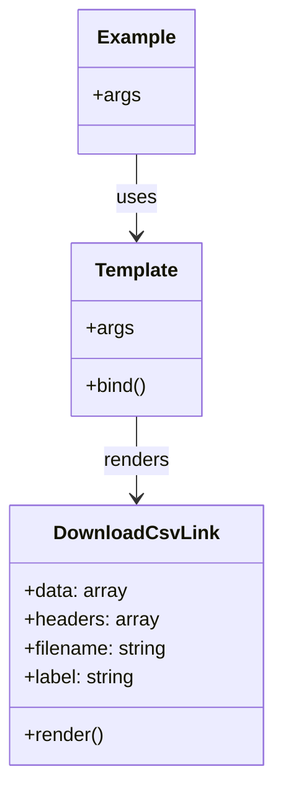

# Diagram: web/portal/src/components/atoms/DownloadCsvLink.atom.stories.js


> Auto-generated by Obscura crawlers

## Diagram 1



### SVG

<svg id="container" width="224.8515625" xmlns="http://www.w3.org/2000/svg" class="classDiagram" height="644" viewBox="0 0 224.8515625 644" role="graphics-document document" aria-roledescription="class"><style>#container{font-family:"trebuchet ms",verdana,arial,sans-serif;font-size:16px;fill:#333;}@keyframes edge-animation-frame{from{stroke-dashoffset:0;}}@keyframes dash{to{stroke-dashoffset:0;}}#container .edge-animation-slow{stroke-dasharray:9,5!important;stroke-dashoffset:900;animation:dash 50s linear infinite;stroke-linecap:round;}#container .edge-animation-fast{stroke-dasharray:9,5!important;stroke-dashoffset:900;animation:dash 20s linear infinite;stroke-linecap:round;}#container .error-icon{fill:#552222;}#container .error-text{fill:#552222;stroke:#552222;}#container .edge-thickness-normal{stroke-width:1px;}#container .edge-thickness-thick{stroke-width:3.5px;}#container .edge-pattern-solid{stroke-dasharray:0;}#container .edge-thickness-invisible{stroke-width:0;fill:none;}#container .edge-pattern-dashed{stroke-dasharray:3;}#container .edge-pattern-dotted{stroke-dasharray:2;}#container .marker{fill:#333333;stroke:#333333;}#container .marker.cross{stroke:#333333;}#container svg{font-family:"trebuchet ms",verdana,arial,sans-serif;font-size:16px;}#container p{margin:0;}#container g.classGroup text{fill:#9370DB;stroke:none;font-family:"trebuchet ms",verdana,arial,sans-serif;font-size:10px;}#container g.classGroup text .title{font-weight:bolder;}#container .nodeLabel,#container .edgeLabel{color:#131300;}#container .edgeLabel .label rect{fill:#ECECFF;}#container .label text{fill:#131300;}#container .labelBkg{background:#ECECFF;}#container .edgeLabel .label span{background:#ECECFF;}#container .classTitle{font-weight:bolder;}#container .node rect,#container .node circle,#container .node ellipse,#container .node polygon,#container .node path{fill:#ECECFF;stroke:#9370DB;stroke-width:1px;}#container .divider{stroke:#9370DB;stroke-width:1;}#container g.clickable{cursor:pointer;}#container g.classGroup rect{fill:#ECECFF;stroke:#9370DB;}#container g.classGroup line{stroke:#9370DB;stroke-width:1;}#container .classLabel .box{stroke:none;stroke-width:0;fill:#ECECFF;opacity:0.5;}#container .classLabel .label{fill:#9370DB;font-size:10px;}#container .relation{stroke:#333333;stroke-width:1;fill:none;}#container .dashed-line{stroke-dasharray:3;}#container .dotted-line{stroke-dasharray:1 2;}#container #compositionStart,#container .composition{fill:#333333!important;stroke:#333333!important;stroke-width:1;}#container #compositionEnd,#container .composition{fill:#333333!important;stroke:#333333!important;stroke-width:1;}#container #dependencyStart,#container .dependency{fill:#333333!important;stroke:#333333!important;stroke-width:1;}#container #dependencyStart,#container .dependency{fill:#333333!important;stroke:#333333!important;stroke-width:1;}#container #extensionStart,#container .extension{fill:transparent!important;stroke:#333333!important;stroke-width:1;}#container #extensionEnd,#container .extension{fill:transparent!important;stroke:#333333!important;stroke-width:1;}#container #aggregationStart,#container .aggregation{fill:transparent!important;stroke:#333333!important;stroke-width:1;}#container #aggregationEnd,#container .aggregation{fill:transparent!important;stroke:#333333!important;stroke-width:1;}#container #lollipopStart,#container .lollipop{fill:#ECECFF!important;stroke:#333333!important;stroke-width:1;}#container #lollipopEnd,#container .lollipop{fill:#ECECFF!important;stroke:#333333!important;stroke-width:1;}#container .edgeTerminals{font-size:11px;line-height:initial;}#container .classTitleText{text-anchor:middle;font-size:18px;fill:#333;}#container .label-icon{display:inline-block;height:1em;overflow:visible;vertical-align:-0.125em;}#container .node .label-icon path{fill:currentColor;stroke:revert;stroke-width:revert;}#container :root{--mermaid-font-family:"trebuchet ms",verdana,arial,sans-serif;}</style><g><defs><marker id="container_class-aggregationStart" class="marker aggregation class" refX="18" refY="7" markerWidth="190" markerHeight="240" orient="auto"><path d="M 18,7 L9,13 L1,7 L9,1 Z"></path></marker></defs><defs><marker id="container_class-aggregationEnd" class="marker aggregation class" refX="1" refY="7" markerWidth="20" markerHeight="28" orient="auto"><path d="M 18,7 L9,13 L1,7 L9,1 Z"></path></marker></defs><defs><marker id="container_class-extensionStart" class="marker extension class" refX="18" refY="7" markerWidth="190" markerHeight="240" orient="auto"><path d="M 1,7 L18,13 V 1 Z"></path></marker></defs><defs><marker id="container_class-extensionEnd" class="marker extension class" refX="1" refY="7" markerWidth="20" markerHeight="28" orient="auto"><path d="M 1,1 V 13 L18,7 Z"></path></marker></defs><defs><marker id="container_class-compositionStart" class="marker composition class" refX="18" refY="7" markerWidth="190" markerHeight="240" orient="auto"><path d="M 18,7 L9,13 L1,7 L9,1 Z"></path></marker></defs><defs><marker id="container_class-compositionEnd" class="marker composition class" refX="1" refY="7" markerWidth="20" markerHeight="28" orient="auto"><path d="M 18,7 L9,13 L1,7 L9,1 Z"></path></marker></defs><defs><marker id="container_class-dependencyStart" class="marker dependency class" refX="6" refY="7" markerWidth="190" markerHeight="240" orient="auto"><path d="M 5,7 L9,13 L1,7 L9,1 Z"></path></marker></defs><defs><marker id="container_class-dependencyEnd" class="marker dependency class" refX="13" refY="7" markerWidth="20" markerHeight="28" orient="auto"><path d="M 18,7 L9,13 L14,7 L9,1 Z"></path></marker></defs><defs><marker id="container_class-lollipopStart" class="marker lollipop class" refX="13" refY="7" markerWidth="190" markerHeight="240" orient="auto"><circle stroke="black" fill="transparent" cx="7" cy="7" r="6"></circle></marker></defs><defs><marker id="container_class-lollipopEnd" class="marker lollipop class" refX="1" refY="7" markerWidth="190" markerHeight="240" orient="auto"><circle stroke="black" fill="transparent" cx="7" cy="7" r="6"></circle></marker></defs><g class="root"><g class="clusters"></g><g class="edgePaths"><path d="M112.426,128L112.426,134.167C112.426,140.333,112.426,152.667,112.426,164C112.426,175.333,112.426,185.667,112.426,190.833L112.426,196" id="id_Example_Template_1" class="edge-thickness-normal edge-pattern-solid relation" style=";;;" data-edge="true" data-et="edge" data-id="id_Example_Template_1" data-points="W3sieCI6MTEyLjQyNTc4MTI1LCJ5IjoxMjh9LHsieCI6MTEyLjQyNTc4MTI1LCJ5IjoxNjV9LHsieCI6MTEyLjQyNTc4MTI1LCJ5IjoyMDJ9XQ==" marker-end="url(#container_class-dependencyEnd)"></path><path d="M112.426,346L112.426,352.167C112.426,358.333,112.426,370.667,112.426,382C112.426,393.333,112.426,403.667,112.426,408.833L112.426,414" id="id_Template_DownloadCsvLink_2" class="edge-thickness-normal edge-pattern-solid relation" style=";;;" data-edge="true" data-et="edge" data-id="id_Template_DownloadCsvLink_2" data-points="W3sieCI6MTEyLjQyNTc4MTI1LCJ5IjozNDZ9LHsieCI6MTEyLjQyNTc4MTI1LCJ5IjozODN9LHsieCI6MTEyLjQyNTc4MTI1LCJ5Ijo0MjB9XQ==" marker-end="url(#container_class-dependencyEnd)"></path></g><g class="edgeLabels"><g class="edgeLabel" transform="translate(112.42578125, 165)"><g class="label" data-id="id_Example_Template_1" transform="translate(-16.4921875, -12)"><foreignObject width="32.984375" height="24"><div xmlns="http://www.w3.org/1999/xhtml" class="labelBkg" style="display: table-cell; white-space: nowrap; line-height: 1.5; max-width: 200px; text-align: center;"><span class="edgeLabel"><p>uses</p></span></div></foreignObject></g></g><g class="edgeLabel" transform="translate(112.42578125, 383)"><g class="label" data-id="id_Template_DownloadCsvLink_2" transform="translate(-27.75, -12)"><foreignObject width="55.5" height="24"><div xmlns="http://www.w3.org/1999/xhtml" class="labelBkg" style="display: table-cell; white-space: nowrap; line-height: 1.5; max-width: 200px; text-align: center;"><span class="edgeLabel"><p>renders</p></span></div></foreignObject></g></g></g><g class="nodes"><g class="node default" id="classId-DownloadCsvLink-0" transform="translate(112.42578125, 528)"><g class="basic label-container"><path d="M-104.42578125 -108 L104.42578125 -108 L104.42578125 108 L-104.42578125 108" stroke="none" stroke-width="0" fill="#ECECFF" style=""></path><path d="M-104.42578125 -108 C-21.356613865714394 -108, 61.71255351857121 -108, 104.42578125 -108 M-104.42578125 -108 C-52.21111750101636 -108, 0.0035462479672787595 -108, 104.42578125 -108 M104.42578125 -108 C104.42578125 -48.73676381527268, 104.42578125 10.526472369454638, 104.42578125 108 M104.42578125 -108 C104.42578125 -64.19612183428, 104.42578125 -20.392243668560013, 104.42578125 108 M104.42578125 108 C25.0751108947413 108, -54.2755594605174 108, -104.42578125 108 M104.42578125 108 C57.85991868039975 108, 11.294056110799502 108, -104.42578125 108 M-104.42578125 108 C-104.42578125 42.87827847734914, -104.42578125 -22.243443045301717, -104.42578125 -108 M-104.42578125 108 C-104.42578125 25.09649115693142, -104.42578125 -57.80701768613716, -104.42578125 -108" stroke="#9370DB" stroke-width="1.3" fill="none" stroke-dasharray="0 0" style=""></path></g><g class="annotation-group text" transform="translate(0, -84)"></g><g class="label-group text" transform="translate(-64.3515625, -84)"><g class="label" style="font-weight: bolder" transform="translate(0,-12)"><foreignObject width="128.703125" height="24"><div xmlns="http://www.w3.org/1999/xhtml" style="display: table-cell; white-space: nowrap; line-height: 1.5; max-width: 177px; text-align: center;"><span class="nodeLabel markdown-node-label" style=""><p>DownloadCsvLink</p></span></div></foreignObject></g></g><g class="members-group text" transform="translate(-92.42578125, -36)"><g class="label" style="" transform="translate(0,-12)"><foreignObject width="85.546875" height="24"><div xmlns="http://www.w3.org/1999/xhtml" style="display: table-cell; white-space: nowrap; line-height: 1.5; max-width: 143px; text-align: center;"><span class="nodeLabel markdown-node-label" style=""><p>+data: array</p></span></div></foreignObject></g><g class="label" style="" transform="translate(0,12)"><foreignObject width="111.234375" height="24"><div xmlns="http://www.w3.org/1999/xhtml" style="display: table-cell; white-space: nowrap; line-height: 1.5; max-width: 169px; text-align: center;"><span class="nodeLabel markdown-node-label" style=""><p>+headers: array</p></span></div></foreignObject></g><g class="label" style="" transform="translate(0,36)"><foreignObject width="120.5" height="24"><div xmlns="http://www.w3.org/1999/xhtml" style="display: table-cell; white-space: nowrap; line-height: 1.5; max-width: 179px; text-align: center;"><span class="nodeLabel markdown-node-label" style=""><p>+filename: string</p></span></div></foreignObject></g><g class="label" style="" transform="translate(0,60)"><foreignObject width="94.09375" height="24"><div xmlns="http://www.w3.org/1999/xhtml" style="display: table-cell; white-space: nowrap; line-height: 1.5; max-width: 152px; text-align: center;"><span class="nodeLabel markdown-node-label" style=""><p>+label: string</p></span></div></foreignObject></g></g><g class="methods-group text" transform="translate(-92.42578125, 84)"><g class="label" style="" transform="translate(0,-12)"><foreignObject width="66.609375" height="24"><div xmlns="http://www.w3.org/1999/xhtml" style="display: table-cell; white-space: nowrap; line-height: 1.5; max-width: 124px; text-align: center;"><span class="nodeLabel markdown-node-label" style=""><p>+render()</p></span></div></foreignObject></g></g><g class="divider" style=""><path d="M-104.42578125 -60 C-44.232481596623025 -60, 15.96081805675395 -60, 104.42578125 -60 M-104.42578125 -60 C-48.24301548499327 -60, 7.939750280013456 -60, 104.42578125 -60" stroke="#9370DB" stroke-width="1.3" fill="none" stroke-dasharray="0 0" style=""></path></g><g class="divider" style=""><path d="M-104.42578125 60 C-27.70743239587489 60, 49.01091645825022 60, 104.42578125 60 M-104.42578125 60 C-37.55224707114222 60, 29.321287107715563 60, 104.42578125 60" stroke="#9370DB" stroke-width="1.3" fill="none" stroke-dasharray="0 0" style=""></path></g></g><g class="node default" id="classId-Template-1" transform="translate(112.42578125, 274)"><g class="basic label-container"><path d="M-54.61328125 -72 L54.61328125 -72 L54.61328125 72 L-54.61328125 72" stroke="none" stroke-width="0" fill="#ECECFF" style=""></path><path d="M-54.61328125 -72 C-30.547157881485987 -72, -6.4810345129719735 -72, 54.61328125 -72 M-54.61328125 -72 C-19.6778239332915 -72, 15.257633383417001 -72, 54.61328125 -72 M54.61328125 -72 C54.61328125 -20.72427692142095, 54.61328125 30.551446157158097, 54.61328125 72 M54.61328125 -72 C54.61328125 -35.514657736425306, 54.61328125 0.9706845271493876, 54.61328125 72 M54.61328125 72 C13.31346958814651 72, -27.98634207370698 72, -54.61328125 72 M54.61328125 72 C23.07961377750658 72, -8.45405369498684 72, -54.61328125 72 M-54.61328125 72 C-54.61328125 42.86432835012785, -54.61328125 13.728656700255698, -54.61328125 -72 M-54.61328125 72 C-54.61328125 41.46201431248578, -54.61328125 10.924028624971555, -54.61328125 -72" stroke="#9370DB" stroke-width="1.3" fill="none" stroke-dasharray="0 0" style=""></path></g><g class="annotation-group text" transform="translate(0, -48)"></g><g class="label-group text" transform="translate(-33.9140625, -48)"><g class="label" style="font-weight: bolder" transform="translate(0,-12)"><foreignObject width="67.828125" height="24"><div xmlns="http://www.w3.org/1999/xhtml" style="display: table-cell; white-space: nowrap; line-height: 1.5; max-width: 117px; text-align: center;"><span class="nodeLabel markdown-node-label" style=""><p>Template</p></span></div></foreignObject></g></g><g class="members-group text" transform="translate(-42.61328125, 0)"><g class="label" style="" transform="translate(0,-12)"><foreignObject width="38.078125" height="24"><div xmlns="http://www.w3.org/1999/xhtml" style="display: table-cell; white-space: nowrap; line-height: 1.5; max-width: 95px; text-align: center;"><span class="nodeLabel markdown-node-label" style=""><p>+args</p></span></div></foreignObject></g></g><g class="methods-group text" transform="translate(-42.61328125, 48)"><g class="label" style="" transform="translate(0,-12)"><foreignObject width="51.3125" height="24"><div xmlns="http://www.w3.org/1999/xhtml" style="display: table-cell; white-space: nowrap; line-height: 1.5; max-width: 109px; text-align: center;"><span class="nodeLabel markdown-node-label" style=""><p>+bind()</p></span></div></foreignObject></g></g><g class="divider" style=""><path d="M-54.61328125 -24 C-19.013651301331528 -24, 16.585978647336944 -24, 54.61328125 -24 M-54.61328125 -24 C-29.860790203443706 -24, -5.108299156887412 -24, 54.61328125 -24" stroke="#9370DB" stroke-width="1.3" fill="none" stroke-dasharray="0 0" style=""></path></g><g class="divider" style=""><path d="M-54.61328125 24 C-28.47925325105277 24, -2.345225252105543 24, 54.61328125 24 M-54.61328125 24 C-11.446846859195425 24, 31.71958753160915 24, 54.61328125 24" stroke="#9370DB" stroke-width="1.3" fill="none" stroke-dasharray="0 0" style=""></path></g></g><g class="node default" id="classId-Example-2" transform="translate(112.42578125, 68)"><g class="basic label-container"><path d="M-46.46875 -60 L46.46875 -60 L46.46875 60 L-46.46875 60" stroke="none" stroke-width="0" fill="#ECECFF" style=""></path><path d="M-46.46875 -60 C-25.572709178826585 -60, -4.6766683576531705 -60, 46.46875 -60 M-46.46875 -60 C-12.913245120903838 -60, 20.642259758192324 -60, 46.46875 -60 M46.46875 -60 C46.46875 -35.01804565936655, 46.46875 -10.036091318733106, 46.46875 60 M46.46875 -60 C46.46875 -26.60953961266479, 46.46875 6.78092077467042, 46.46875 60 M46.46875 60 C18.445848913033423 60, -9.577052173933154 60, -46.46875 60 M46.46875 60 C18.756643326941905 60, -8.95546334611619 60, -46.46875 60 M-46.46875 60 C-46.46875 16.274341869640494, -46.46875 -27.45131626071901, -46.46875 -60 M-46.46875 60 C-46.46875 32.21706317756445, -46.46875 4.434126355128896, -46.46875 -60" stroke="#9370DB" stroke-width="1.3" fill="none" stroke-dasharray="0 0" style=""></path></g><g class="annotation-group text" transform="translate(0, -36)"></g><g class="label-group text" transform="translate(-30.859375, -36)"><g class="label" style="font-weight: bolder" transform="translate(0,-12)"><foreignObject width="61.71875" height="24"><div xmlns="http://www.w3.org/1999/xhtml" style="display: table-cell; white-space: nowrap; line-height: 1.5; max-width: 111px; text-align: center;"><span class="nodeLabel markdown-node-label" style=""><p>Example</p></span></div></foreignObject></g></g><g class="members-group text" transform="translate(-34.46875, 12)"><g class="label" style="" transform="translate(0,-12)"><foreignObject width="38.078125" height="24"><div xmlns="http://www.w3.org/1999/xhtml" style="display: table-cell; white-space: nowrap; line-height: 1.5; max-width: 95px; text-align: center;"><span class="nodeLabel markdown-node-label" style=""><p>+args</p></span></div></foreignObject></g></g><g class="methods-group text" transform="translate(-34.46875, 60)"></g><g class="divider" style=""><path d="M-46.46875 -12 C-26.940131466386433 -12, -7.411512932772865 -12, 46.46875 -12 M-46.46875 -12 C-13.49761270730022 -12, 19.47352458539956 -12, 46.46875 -12" stroke="#9370DB" stroke-width="1.3" fill="none" stroke-dasharray="0 0" style=""></path></g><g class="divider" style=""><path d="M-46.46875 36 C-15.13847239875469 36, 16.19180520249062 36, 46.46875 36 M-46.46875 36 C-19.201471253054546 36, 8.065807493890908 36, 46.46875 36" stroke="#9370DB" stroke-width="1.3" fill="none" stroke-dasharray="0 0" style=""></path></g></g></g></g></g></svg>

## Diagram 2

```mermaid
flowchart TD
    Example[Story: Example] -->|passes args| Template[Template(args)]
    Template -->|spreads props| DownloadCsvLink[DownloadCsvLink component]
    DownloadCsvLink -->|generates| CSVFile((name-of-the-file.csv))
    CSVFile -.->|contains rows| Row1["{ name: John Doe, age: 42 }"]
    CSVFile -.-> Row2["{ name: Jane Doe, age: 40 }"]
    DownloadCsvLink -->|uses headers| Headers["Name Label*, Age (in years)"]
```

> SVG rendering failed for this diagram.
