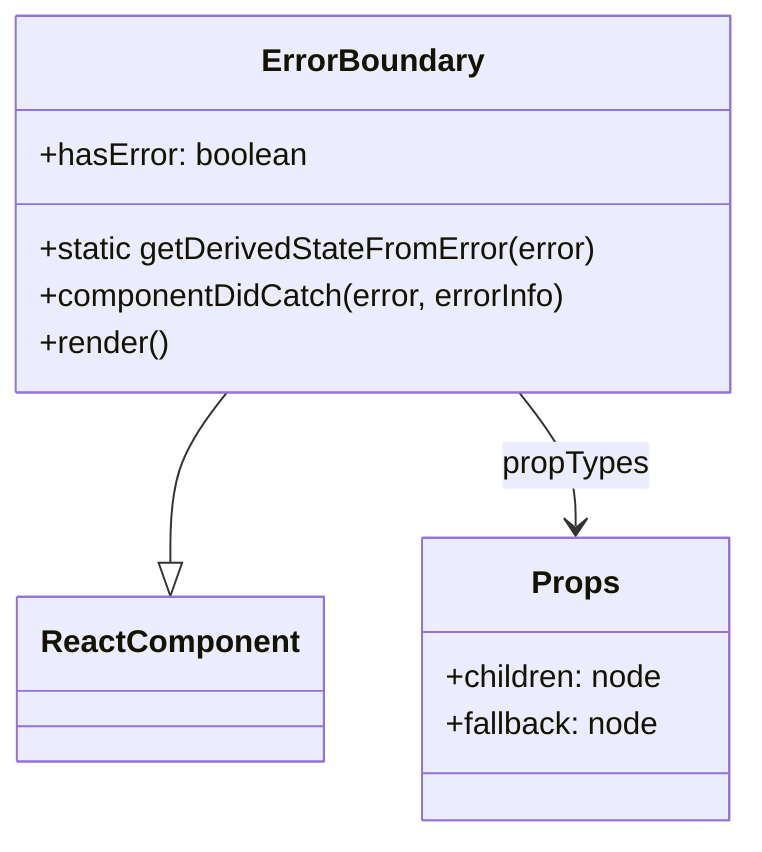
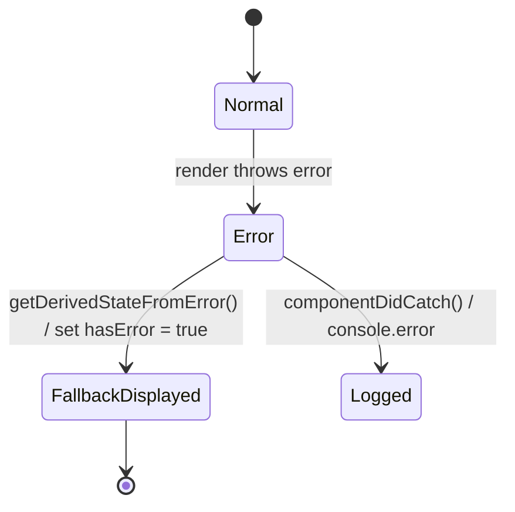

# Diagram: web/portal/src/components/atoms/ErrorBoundary.js

> Auto-generated by Obscura crawlers

## Diagram 1

### SVG

<svg id="container" width="379.5703125" xmlns="http://www.w3.org/2000/svg" class="classDiagram" height="426" viewBox="0 0 379.5703125 426" role="graphics-document document" aria-roledescription="class"><g><defs><marker id="container_class-aggregationStart" class="marker aggregation class" refX="18" refY="7" markerWidth="190" markerHeight="240" orient="auto"><path d="M 18,7 L9,13 L1,7 L9,1 Z"></path></marker></defs><defs><marker id="container_class-aggregationEnd" class="marker aggregation class" refX="1" refY="7" markerWidth="20" markerHeight="28" orient="auto"><path d="M 18,7 L9,13 L1,7 L9,1 Z"></path></marker></defs><defs><marker id="container_class-extensionStart" class="marker extension class" refX="18" refY="7" markerWidth="190" markerHeight="240" orient="auto"><path d="M 1,7 L18,13 V 1 Z"></path></marker></defs><defs><marker id="container_class-extensionEnd" class="marker extension class" refX="1" refY="7" markerWidth="20" markerHeight="28" orient="auto"><path d="M 1,1 V 13 L18,7 Z"></path></marker></defs><defs><marker id="container_class-compositionStart" class="marker composition class" refX="18" refY="7" markerWidth="190" markerHeight="240" orient="auto"><path d="M 18,7 L9,13 L1,7 L9,1 Z"></path></marker></defs><defs><marker id="container_class-compositionEnd" class="marker composition class" refX="1" refY="7" markerWidth="20" markerHeight="28" orient="auto"><path d="M 18,7 L9,13 L1,7 L9,1 Z"></path></marker></defs><defs><marker id="container_class-dependencyStart" class="marker dependency class" refX="6" refY="7" markerWidth="190" markerHeight="240" orient="auto"><path d="M 5,7 L9,13 L1,7 L9,1 Z"></path></marker></defs><defs><marker id="container_class-dependencyEnd" class="marker dependency class" refX="13" refY="7" markerWidth="20" markerHeight="28" orient="auto"><path d="M 18,7 L9,13 L14,7 L9,1 Z"></path></marker></defs><defs><marker id="container_class-lollipopStart" class="marker lollipop class" refX="13" refY="7" markerWidth="190" markerHeight="240" orient="auto"><circle stroke="black" fill="transparent" cx="7" cy="7" r="6"></circle></marker></defs><defs><marker id="container_class-lollipopEnd" class="marker lollipop class" refX="1" refY="7" markerWidth="190" markerHeight="240" orient="auto"><circle stroke="black" fill="transparent" cx="7" cy="7" r="6"></circle></marker></defs><g class="root"><g class="clusters"></g><g class="edgePaths"><path d="M116.426,200L111.714,206.167C107.002,212.333,97.577,224.667,92.865,239.125C88.152,253.583,88.152,270.167,88.152,278.458L88.152,286.75" id="id_ErrorBoundary_ReactComponent_1" class="edge-thickness-normal edge-pattern-solid relation" style=";;;" data-edge="true" data-et="edge" data-id="id_ErrorBoundary_ReactComponent_1" data-points="W3sieCI6MTE2LjQyNjEzMzY5MzYwOTAyLCJ5IjoyMDB9LHsieCI6ODguMTUyMzQzNzUsInkiOjIzN30seyJ4Ijo4OC4xNTIzNDM3NSwieSI6MzA0fV0=" marker-end="url(#container_class-extensionEnd)"></path><path d="M263.144,200L267.856,206.167C272.569,212.333,281.993,224.667,286.706,236C291.418,247.333,291.418,257.667,291.418,262.833L291.418,268" id="id_ErrorBoundary_Props_2" class="edge-thickness-normal edge-pattern-solid relation" style=";;;" data-edge="true" data-et="edge" data-id="id_ErrorBoundary_Props_2" data-points="W3sieCI6MjYzLjE0NDE3ODgwNjM5MSwieSI6MjAwfSx7IngiOjI5MS40MTc5Njg3NSwieSI6MjM3fSx7IngiOjI5MS40MTc5Njg3NSwieSI6Mjc0fV0=" marker-end="url(#container_class-dependencyEnd)"></path></g><g class="edgeLabels"><g class="edgeLabel"><g class="label" data-id="id_ErrorBoundary_ReactComponent_1" transform="translate(0, 0)"><foreignObject width="0" height="0">

</foreignObject></g></g><g class="edgeLabel" transform="translate(291.41796875, 237)"><g class="label" data-id="id_ErrorBoundary_Props_2" transform="translate(-37.625, -12)"><foreignObject width="75.25" height="24">

propTypes

</foreignObject></g></g></g><g class="nodes"><g class="node default" id="classId-ErrorBoundary-0" transform="translate(189.78515625, 104)"><g class="basic label-container"><path d="M-181.78515625 -96 L181.78515625 -96 L181.78515625 96 L-181.78515625 96" stroke="none" stroke-width="0" fill="#ECECFF" style=""></path><path d="M-181.78515625 -96 C-57.98063636403754 -96, 65.82388352192493 -96, 181.78515625 -96 M-181.78515625 -96 C-72.92444998179732 -96, 35.93625628640535 -96, 181.78515625 -96 M181.78515625 -96 C181.78515625 -32.233566108351845, 181.78515625 31.53286778329631, 181.78515625 96 M181.78515625 -96 C181.78515625 -28.338745719672175, 181.78515625 39.32250856065565, 181.78515625 96 M181.78515625 96 C98.52313426506697 96, 15.261112280133943 96, -181.78515625 96 M181.78515625 96 C78.53747184636569 96, -24.71021255726862 96, -181.78515625 96 M-181.78515625 96 C-181.78515625 29.226318306672056, -181.78515625 -37.54736338665589, -181.78515625 -96 M-181.78515625 96 C-181.78515625 35.396709507141814, -181.78515625 -25.20658098571637, -181.78515625 -96" stroke="#9370DB" stroke-width="1.3" fill="none" stroke-dasharray="0 0" style=""></path></g><g class="annotation-group text" transform="translate(0, -72)"></g><g class="label-group text" transform="translate(-53.5234375, -72)"><g class="label" style="font-weight: bolder" transform="translate(0,-12)"><foreignObject width="107.046875" height="24">

ErrorBoundary

</foreignObject></g></g><g class="members-group text" transform="translate(-169.78515625, -24)"><g class="label" style="" transform="translate(0,-12)"><foreignObject width="136.859375" height="24">

+hasError: boolean

</foreignObject></g></g><g class="methods-group text" transform="translate(-169.78515625, 24)"><g class="label" style="" transform="translate(0,-12)"><foreignObject width="286.046875" height="24">

+static getDerivedStateFromError(error)

</foreignObject></g><g class="label" style="" transform="translate(0,12)"><foreignObject width="272.953125" height="24">

+componentDidCatch(error, errorInfo)

</foreignObject></g><g class="label" style="" transform="translate(0,36)"><foreignObject width="66.609375" height="24">

+render()

</foreignObject></g></g><g class="divider" style=""><path d="M-181.78515625 -48 C-38.33110895319126 -48, 105.12293834361748 -48, 181.78515625 -48 M-181.78515625 -48 C-102.20269589769798 -48, -22.620235545395957 -48, 181.78515625 -48" stroke="#9370DB" stroke-width="1.3" fill="none" stroke-dasharray="0 0" style=""></path></g><g class="divider" style=""><path d="M-181.78515625 0 C-53.39601946739742 0, 74.99311731520515 0, 181.78515625 0 M-181.78515625 0 C-79.17346599121178 0, 23.43822426757643 0, 181.78515625 0" stroke="#9370DB" stroke-width="1.3" fill="none" stroke-dasharray="0 0" style=""></path></g></g><g class="node default" id="classId-ReactComponent-1" transform="translate(88.15234375, 346)"><g class="basic label-container"><path d="M-74.515625 -42 L74.515625 -42 L74.515625 42 L-74.515625 42" stroke="none" stroke-width="0" fill="#ECECFF" style=""></path><path d="M-74.515625 -42 C-30.331618490853792 -42, 13.852388018292416 -42, 74.515625 -42 M-74.515625 -42 C-28.125117676283594 -42, 18.265389647432812 -42, 74.515625 -42 M74.515625 -42 C74.515625 -13.662118669488425, 74.515625 14.67576266102315, 74.515625 42 M74.515625 -42 C74.515625 -14.466281550270075, 74.515625 13.06743689945985, 74.515625 42 M74.515625 42 C19.077483939934467 42, -36.360657120131066 42, -74.515625 42 M74.515625 42 C19.308513413958842 42, -35.898598172082316 42, -74.515625 42 M-74.515625 42 C-74.515625 21.710169500810338, -74.515625 1.4203390016206754, -74.515625 -42 M-74.515625 42 C-74.515625 13.956231536509986, -74.515625 -14.087536926980029, -74.515625 -42" stroke="#9370DB" stroke-width="1.3" fill="none" stroke-dasharray="0 0" style=""></path></g><g class="annotation-group text" transform="translate(0, -18)"></g><g class="label-group text" transform="translate(-62.515625, -18)"><g class="label" style="font-weight: bolder" transform="translate(0,-12)"><foreignObject width="125.03125" height="24">

ReactComponent

</foreignObject></g></g><g class="members-group text" transform="translate(-62.515625, 30)"></g><g class="methods-group text" transform="translate(-62.515625, 60)"></g><g class="divider" style=""><path d="M-74.515625 6 C-30.632668203594655 6, 13.25028859281069 6, 74.515625 6 M-74.515625 6 C-41.811452458952694 6, -9.107279917905387 6, 74.515625 6" stroke="#9370DB" stroke-width="1.3" fill="none" stroke-dasharray="0 0" style=""></path></g><g class="divider" style=""><path d="M-74.515625 24 C-16.06855993611582 24, 42.37850512776836 24, 74.515625 24 M-74.515625 24 C-32.87328068406556 24, 8.769063631868875 24, 74.515625 24" stroke="#9370DB" stroke-width="1.3" fill="none" stroke-dasharray="0 0" style=""></path></g></g><g class="node default" id="classId-Props-2" transform="translate(291.41796875, 346)"><g class="basic label-container"><path d="M-78.75 -72 L78.75 -72 L78.75 72 L-78.75 72" stroke="none" stroke-width="0" fill="#ECECFF" style=""></path><path d="M-78.75 -72 C-40.944083286204005 -72, -3.138166572408011 -72, 78.75 -72 M-78.75 -72 C-26.483695747322443 -72, 25.782608505355114 -72, 78.75 -72 M78.75 -72 C78.75 -36.52068412280881, 78.75 -1.041368245617619, 78.75 72 M78.75 -72 C78.75 -22.843769560626043, 78.75 26.312460878747913, 78.75 72 M78.75 72 C18.76540022334548 72, -41.21919955330904 72, -78.75 72 M78.75 72 C30.72243015076927 72, -17.30513969846146 72, -78.75 72 M-78.75 72 C-78.75 34.75528608129611, -78.75 -2.4894278374077743, -78.75 -72 M-78.75 72 C-78.75 22.06300158054622, -78.75 -27.87399683890756, -78.75 -72" stroke="#9370DB" stroke-width="1.3" fill="none" stroke-dasharray="0 0" style=""></path></g><g class="annotation-group text" transform="translate(0, -48)"></g><g class="label-group text" transform="translate(-20.921875, -48)"><g class="label" style="font-weight: bolder" transform="translate(0,-12)"><foreignObject width="41.84375" height="24">

Props

</foreignObject></g></g><g class="members-group text" transform="translate(-66.75, 0)"><g class="label" style="" transform="translate(0,-12)"><foreignObject width="112.578125" height="24">

+children: node

</foreignObject></g><g class="label" style="" transform="translate(0,12)"><foreignObject width="109.71875" height="24">

+fallback: node

</foreignObject></g></g><g class="methods-group text" transform="translate(-66.75, 72)"></g><g class="divider" style=""><path d="M-78.75 -24 C-37.36446561552667 -24, 4.021068768946662 -24, 78.75 -24 M-78.75 -24 C-28.88706300465762 -24, 20.97587399068476 -24, 78.75 -24" stroke="#9370DB" stroke-width="1.3" fill="none" stroke-dasharray="0 0" style=""></path></g><g class="divider" style=""><path d="M-78.75 48 C-46.383125654972304 48, -14.016251309944607 48, 78.75 48 M-78.75 48 C-32.04651031509427 48, 14.656979369811467 48, 78.75 48" stroke="#9370DB" stroke-width="1.3" fill="none" stroke-dasharray="0 0" style=""></path></g></g></g></g></g></svg>

## Diagram 2

### SVG

<svg id="container" width="438.171875" xmlns="http://www.w3.org/2000/svg" class="statediagram" height="436" viewBox="0 0 438.171875 436" role="graphics-document document" aria-roledescription="stateDiagram"><g><defs><marker id="container_stateDiagram-barbEnd" refX="19" refY="7" markerWidth="20" markerHeight="14" markerUnits="userSpaceOnUse" orient="auto"><path d="M 19,7 L9,13 L14,7 L9,1 Z"></path></marker></defs><g class="root"><g class="clusters"></g><g class="edgePaths"><path d="M219.629,22L219.629,26.167C219.629,30.333,219.629,38.667,219.712,47.083C219.796,55.5,219.962,64,220.046,68.25L220.129,72.5" id="edge0" class="edge-thickness-normal edge-pattern-solid transition" style="fill:none;;;fill:none" data-edge="true" data-et="edge" data-id="edge0" data-points="W3sieCI6MjE5LjYyODkwNjI1LCJ5IjoyMn0seyJ4IjoyMTkuNjI4OTA2MjUsInkiOjQ3fSx7IngiOjIyMC4xMjg5MDYyNSwieSI6NzIuNX1d" marker-end="url(#container_stateDiagram-barbEnd)"></path><path d="M220.129,112.5L220.046,118.583C219.962,124.667,219.796,136.833,219.796,149.167C219.796,161.5,219.962,174,220.046,180.25L220.129,186.5" id="edge1" class="edge-thickness-normal edge-pattern-solid transition" style="fill:none;;;fill:none" data-edge="true" data-et="edge" data-id="edge1" data-points="W3sieCI6MjIwLjEyODkwNjI1LCJ5IjoxMTIuNX0seyJ4IjoyMTkuNjI4OTA2MjUsInkiOjE0OX0seyJ4IjoyMjAuMTI4OTA2MjUsInkiOjE4Ni41fV0=" marker-end="url(#container_stateDiagram-barbEnd)"></path><path d="M194.354,222.588L180.143,231.324C165.932,240.059,137.509,257.529,123.381,274.515C109.253,291.5,109.419,308,109.503,316.25L109.586,324.5" id="edge2" class="edge-thickness-normal edge-pattern-solid transition" style="fill:none;;;fill:none" data-edge="true" data-et="edge" data-id="edge2" data-points="W3sieCI6MTk0LjM1NDI5NDk2MTYxNzY4LCJ5IjoyMjIuNTg4Mjk3NjAwNTUwN30seyJ4IjoxMDkuMDg1OTM3NSwieSI6Mjc1fSx7IngiOjEwOS41ODU5Mzc1LCJ5IjozMjQuNX1d" marker-end="url(#container_stateDiagram-barbEnd)"></path><path d="M245.904,222.588L259.948,231.324C273.993,240.059,302.082,257.529,316.21,274.515C330.339,291.5,330.505,308,330.589,316.25L330.672,324.5" id="edge3" class="edge-thickness-normal edge-pattern-solid transition" style="fill:none;;;fill:none" data-edge="true" data-et="edge" data-id="edge3" data-points="W3sieCI6MjQ1LjkwMzUxNzUzODM4ODEyLCJ5IjoyMjIuNTg4Mjk3NjAwNTU0Mzd9LHsieCI6MzMwLjE3MTg3NSwieSI6Mjc1fSx7IngiOjMzMC42NzE4NzUsInkiOjMyNC41fV0=" marker-end="url(#container_stateDiagram-barbEnd)"></path><path d="M109.586,364.5L109.503,368.583C109.419,372.667,109.253,380.833,109.169,389.083C109.086,397.333,109.086,405.667,109.086,409.833L109.086,414" id="edge4" class="edge-thickness-normal edge-pattern-solid transition" style="fill:none;;;fill:none" data-edge="true" data-et="edge" data-id="edge4" data-points="W3sieCI6MTA5LjU4NTkzNzUsInkiOjM2NC41fSx7IngiOjEwOS4wODU5Mzc1LCJ5IjozODl9LHsieCI6MTA5LjA4NTkzNzUsInkiOjQxNH1d" marker-end="url(#container_stateDiagram-barbEnd)"></path></g><g class="edgeLabels"><g class="edgeLabel"><g class="label" data-id="edge0" transform="translate(0, 0)"><foreignObject width="0" height="0">

</foreignObject></g></g><g class="edgeLabel" transform="translate(219.62890625, 149)"><g class="label" data-id="edge1" transform="translate(-70.9921875, -12)"><foreignObject width="141.984375" height="24">

render throws error

</foreignObject></g></g><g class="edgeLabel" transform="translate(109.0859375, 275)"><g class="label" data-id="edge2" transform="translate(-101.0859375, -24)"><foreignObject width="202.171875" height="48">

getDerivedStateFromError() / set hasError = true

</foreignObject></g></g><g class="edgeLabel" transform="translate(330.171875, 275)"><g class="label" data-id="edge3" transform="translate(-100, -24)"><foreignObject width="200" height="48">

componentDidCatch() / console.error

</foreignObject></g></g><g class="edgeLabel"><g class="label" data-id="edge4" transform="translate(0, 0)"><foreignObject width="0" height="0">

</foreignObject></g></g></g><g class="nodes"><g class="node default" id="state-root_start-0" transform="translate(219.62890625, 15)"><circle class="state-start" r="7" width="14" height="14"></circle></g><g class="node  statediagram-state" id="state-Normal-1" transform="translate(219.62890625, 92)"><g class="basic label-container outer-path"><path d="M-29.703125 -20 C-7.481233775366974 -20, 14.740657449266052 -20, 29.703125 -20 C29.703125 -20, 29.703125 -20, 29.703125 -20 C29.79140031416456 -19.996348905998914, 29.879675628329117 -19.992697811997832, 30.116021727361662 -19.982922465033347 C30.226111787140407 -19.969199753392882, 30.33620184691915 -19.955477041752413, 30.52609795140367 -19.931806517013612 C30.629734524434046 -19.910076212789313, 30.73337109746442 -19.88834590856501, 30.930552435703998 -19.847001329696653 C31.05121369957762 -19.811078915036216, 31.17187496345124 -19.775156500375775, 31.326622346023417 -19.729086208503173 C31.47440490614584 -19.67142127460261, 31.62218746626826 -19.61375634070205, 31.711602123264846 -19.578866633275286 C31.816893542714325 -19.527392794836125, 31.922184962163804 -19.47591895639696, 32.082861965185366 -19.397368756032446 C32.21862806886587 -19.31646971785949, 32.35439417254637 -19.235570679686536, 32.437865790612136 -19.185832391312644 C32.57006425379296 -19.091444502807022, 32.702262716973785 -18.9970566143014, 32.77418856344834 -18.94570254698197 C32.860409797263465 -18.872676886999834, 32.94663103107859 -18.799651227017694, 33.089532858128706 -18.678619553365657 C33.189361400929485 -18.578791010564878, 33.289189943730264 -18.478962467764102, 33.38174455336566 -18.386407858128706 C33.43656094995549 -18.32168626097463, 33.49137734654532 -18.256964663820554, 33.64882754698197 -18.07106356344834 C33.69918262763745 -18.000536884852245, 33.74953770829292 -17.93001020625615, 33.888957391312644 -17.734740790612136 C33.968824072415565 -17.60070720563855, 34.04869075351848 -17.466673620664963, 34.10049375603245 -17.37973696518537 C34.16401685666252 -17.249798385977265, 34.22753995729259 -17.11985980676916, 34.28199163327529 -17.008477123264846 C34.338454982244755 -16.86377396140598, 34.39491833121423 -16.71907079954711, 34.432211208503176 -16.623497346023417 C34.47654138647034 -16.47459490302725, 34.5208715644375 -16.32569246003108, 34.55012632969665 -16.227427435703994 C34.56973987286483 -16.133886159063223, 34.58935341603301 -16.04034488242245, 34.63493151701361 -15.82297295140367 C34.64924615363721 -15.708134190458244, 34.6635607902608 -15.593295429512816, 34.68604746503335 -15.412896727361662 C34.68995433907003 -15.318437222104595, 34.693861213106715 -15.223977716847529, 34.703125 -15 C34.703125 -15, 34.703125 -15, 34.703125 -15 C34.703125 -6.745148906351208, 34.703125 1.5097021872975844, 34.703125 15 C34.703125 15, 34.703125 15, 34.703125 15 C34.696520180402594 15.159689814830353, 34.68991536080519 15.319379629660707, 34.68604746503335 15.412896727361662 C34.671663376352285 15.528292665442253, 34.65727928767122 15.643688603522843, 34.63493151701361 15.822972951403669 C34.61037628287415 15.94008223298136, 34.58582104873469 16.05719151455905, 34.55012632969665 16.227427435703994 C34.52048194241958 16.3270011773197, 34.49083755514251 16.426574918935405, 34.432211208503176 16.623497346023417 C34.38469193216429 16.7452788141967, 34.337172655825405 16.867060282369977, 34.28199163327529 17.008477123264846 C34.2327000601707 17.10930464762392, 34.18340848706612 17.210132171982995, 34.10049375603245 17.379736965185366 C34.04110480624406 17.479404482828883, 33.981715856455665 17.579072000472404, 33.888957391312644 17.734740790612133 C33.82079676711486 17.830205684583746, 33.75263614291706 17.925670578555355, 33.64882754698197 18.07106356344834 C33.58975949770179 18.140805077448146, 33.53069144842162 18.21054659144795, 33.38174455336566 18.386407858128706 C33.28653142523151 18.48162098626285, 33.19131829709737 18.576834114397, 33.089532858128706 18.678619553365657 C33.017320289151975 18.73978047945306, 32.94510772017524 18.800941405540463, 32.77418856344834 18.94570254698197 C32.70477867259066 18.995260256518282, 32.635368781732986 19.044817966054595, 32.437865790612136 19.185832391312644 C32.35162956877805 19.237218025966083, 32.26539334694396 19.288603660619522, 32.082861965185366 19.397368756032446 C32.00013699934048 19.43781052753718, 31.917412033495584 19.478252299041916, 31.711602123264846 19.578866633275286 C31.574686360003643 19.632291329882666, 31.43777059674244 19.685716026490045, 31.326622346023417 19.729086208503173 C31.183494463153377 19.771697225434945, 31.04036658028334 19.81430824236672, 30.930552435703998 19.847001329696653 C30.83074670607635 19.867928390527787, 30.730940976448704 19.888855451358925, 30.52609795140367 19.931806517013612 C30.44117763259709 19.94239182371379, 30.356257313790508 19.952977130413974, 30.116021727361662 19.982922465033347 C30.005894268866253 19.987477370409472, 29.895766810370848 19.992032275785597, 29.703125 20 C29.703125 20, 29.703125 20, 29.703125 20 C7.207253396395231 20, -15.288618207209538 20, -29.703125 20 C-29.703125 20, -29.703125 20, -29.703125 20 C-29.850735339836064 19.99389479118399, -29.99834567967213 19.98778958236798, -30.116021727361662 19.982922465033347 C-30.225043611938784 19.96933290129291, -30.334065496515908 19.955743337552466, -30.52609795140367 19.931806517013612 C-30.641790742053296 19.90754828978877, -30.757483532702924 19.88329006256393, -30.930552435703994 19.847001329696653 C-31.08047009968487 19.80236890734704, -31.230387763665746 19.757736484997434, -31.326622346023417 19.729086208503173 C-31.457966291357913 19.677835641997365, -31.589310236692413 19.62658507549156, -31.711602123264846 19.578866633275286 C-31.7987064314637 19.536283931750077, -31.885810739662553 19.493701230224865, -32.082861965185366 19.397368756032446 C-32.161773310990576 19.350347800112566, -32.240684656795786 19.303326844192682, -32.437865790612136 19.185832391312644 C-32.53671907867568 19.115252500233325, -32.63557236673922 19.04467260915401, -32.77418856344834 18.94570254698197 C-32.89985415299002 18.839269221833757, -33.02551974253169 18.732835896685547, -33.089532858128706 18.67861955336566 C-33.197653284088645 18.570499127405725, -33.30577371004858 18.462378701445786, -33.38174455336566 18.386407858128706 C-33.476969834373726 18.273975581297307, -33.57219511538179 18.16154330446591, -33.64882754698197 18.07106356344834 C-33.702520773306325 17.99586152094395, -33.756213999630674 17.920659478439557, -33.888957391312644 17.734740790612133 C-33.96631610875778 17.60491611172295, -34.043674826202924 17.475091432833768, -34.10049375603244 17.37973696518537 C-34.14592922643506 17.286797224977327, -34.19136469683768 17.19385748476929, -34.28199163327528 17.00847712326485 C-34.33311642635481 16.87745550759716, -34.38424121943435 16.746433891929463, -34.432211208503176 16.623497346023417 C-34.46300506962286 16.52006258983086, -34.49379893074255 16.41662783363831, -34.55012632969665 16.227427435703994 C-34.58402836241351 16.065741227666006, -34.61793039513037 15.90405501962802, -34.63493151701361 15.82297295140367 C-34.64567601925732 15.73677549092402, -34.65642052150103 15.650578030444368, -34.68604746503335 15.412896727361664 C-34.690884746573715 15.295942042669482, -34.69572202811408 15.1789873579773, -34.703125 15 C-34.703125 15, -34.703125 15, -34.703125 15 C-34.703125 4.644736169017282, -34.703125 -5.710527661965436, -34.703125 -15 C-34.703125 -15, -34.703125 -15, -34.703125 -15 C-34.698798502269 -15.104605070787857, -34.69447200453799 -15.209210141575715, -34.68604746503335 -15.41289672736166 C-34.67239776303337 -15.522401069397647, -34.65874806103341 -15.631905411433635, -34.63493151701361 -15.822972951403669 C-34.60491411999071 -15.966132482288979, -34.57489672296781 -16.109292013174286, -34.55012632969665 -16.227427435703994 C-34.5166624178042 -16.33983073434822, -34.48319850591175 -16.452234032992443, -34.432211208503176 -16.623497346023417 C-34.39889419424047 -16.708881535865185, -34.365577179977755 -16.79426572570695, -34.28199163327529 -17.008477123264846 C-34.225642279868985 -17.123741567983156, -34.16929292646268 -17.239006012701466, -34.10049375603245 -17.379736965185366 C-34.05192227955817 -17.461250420225756, -34.00335080308389 -17.542763875266147, -33.888957391312644 -17.734740790612133 C-33.80682796613762 -17.849770207648152, -33.7246985409626 -17.964799624684176, -33.64882754698197 -18.07106356344834 C-33.555661805499156 -18.18106414655726, -33.46249606401634 -18.291064729666182, -33.38174455336566 -18.386407858128706 C-33.31479330290038 -18.453359108593983, -33.247842052435104 -18.52031035905926, -33.089532858128706 -18.678619553365657 C-33.01566193533926 -18.741185033485735, -32.941791012549814 -18.80375051360581, -32.77418856344834 -18.945702546981966 C-32.64092146655467 -19.040853425293328, -32.507654369661005 -19.136004303604693, -32.437865790612136 -19.185832391312644 C-32.35763206162398 -19.233641316576097, -32.27739833263582 -19.28145024183955, -32.082861965185366 -19.397368756032446 C-31.997749853512254 -19.43897753202183, -31.91263774183914 -19.480586308011215, -31.71160212326485 -19.578866633275286 C-31.58199132206766 -19.62944092484016, -31.452380520870467 -19.68001521640503, -31.32662234602342 -19.729086208503173 C-31.21275469446355 -19.762986077147247, -31.09888704290368 -19.796885945791324, -30.930552435703994 -19.847001329696653 C-30.84419026245021 -19.865109573180607, -30.757828089196423 -19.88321781666456, -30.526097951403674 -19.931806517013612 C-30.382565831364456 -19.949697777118306, -30.239033711325238 -19.967589037223004, -30.116021727361662 -19.982922465033347 C-30.008119496125342 -19.987385334329243, -29.900217264889022 -19.99184820362514, -29.703125 -20 C-29.703125 -20, -29.703125 -20, -29.703125 -20" stroke="none" stroke-width="0" fill="#ECECFF" style=""></path><path d="M-29.703125 -20 C-12.30165001180271 -20, 5.099824976394579 -20, 29.703125 -20 M-29.703125 -20 C-10.530288556555131 -20, 8.642547886889737 -20, 29.703125 -20 M29.703125 -20 C29.703125 -20, 29.703125 -20, 29.703125 -20 M29.703125 -20 C29.703125 -20, 29.703125 -20, 29.703125 -20 M29.703125 -20 C29.84537907168566 -19.994116328073407, 29.987633143371315 -19.98823265614681, 30.116021727361662 -19.982922465033347 M29.703125 -20 C29.83178807920414 -19.994678455680514, 29.96045115840828 -19.98935691136103, 30.116021727361662 -19.982922465033347 M30.116021727361662 -19.982922465033347 C30.25462013288538 -19.96564619180166, 30.393218538409094 -19.948369918569973, 30.52609795140367 -19.931806517013612 M30.116021727361662 -19.982922465033347 C30.27399180199237 -19.963231515765656, 30.431961876623078 -19.94354056649797, 30.52609795140367 -19.931806517013612 M30.52609795140367 -19.931806517013612 C30.64396302312919 -19.907092810344984, 30.761828094854703 -19.882379103676357, 30.930552435703998 -19.847001329696653 M30.52609795140367 -19.931806517013612 C30.650316086670877 -19.905760713002508, 30.774534221938083 -19.879714908991403, 30.930552435703998 -19.847001329696653 M30.930552435703998 -19.847001329696653 C31.057193552607362 -19.809298635655352, 31.183834669510723 -19.771595941614056, 31.326622346023417 -19.729086208503173 M30.930552435703998 -19.847001329696653 C31.02085535004205 -19.8201169872842, 31.111158264380105 -19.79323264487175, 31.326622346023417 -19.729086208503173 M31.326622346023417 -19.729086208503173 C31.409628478209413 -19.696697115217187, 31.492634610395413 -19.664308021931202, 31.711602123264846 -19.578866633275286 M31.326622346023417 -19.729086208503173 C31.43913441198232 -19.685183864132085, 31.551646477941222 -19.641281519760994, 31.711602123264846 -19.578866633275286 M31.711602123264846 -19.578866633275286 C31.811248267752465 -19.53015260159769, 31.910894412240083 -19.48143856992009, 32.082861965185366 -19.397368756032446 M31.711602123264846 -19.578866633275286 C31.806774501162618 -19.53233969281428, 31.90194687906039 -19.485812752353272, 32.082861965185366 -19.397368756032446 M32.082861965185366 -19.397368756032446 C32.19619777804044 -19.3298352701183, 32.30953359089552 -19.262301784204155, 32.437865790612136 -19.185832391312644 M32.082861965185366 -19.397368756032446 C32.213516901797874 -19.319515312367493, 32.34417183841038 -19.241661868702536, 32.437865790612136 -19.185832391312644 M32.437865790612136 -19.185832391312644 C32.544024833262775 -19.11003629171755, 32.65018387591341 -19.034240192122457, 32.77418856344834 -18.94570254698197 M32.437865790612136 -19.185832391312644 C32.543803500021646 -19.110194320614283, 32.649741209431156 -19.034556249915923, 32.77418856344834 -18.94570254698197 M32.77418856344834 -18.94570254698197 C32.858152916489374 -18.874588367510334, 32.94211726953041 -18.8034741880387, 33.089532858128706 -18.678619553365657 M32.77418856344834 -18.94570254698197 C32.86760815337001 -18.866580190371785, 32.96102774329167 -18.7874578337616, 33.089532858128706 -18.678619553365657 M33.089532858128706 -18.678619553365657 C33.20364899287722 -18.564503418617143, 33.317765127625734 -18.450387283868626, 33.38174455336566 -18.386407858128706 M33.089532858128706 -18.678619553365657 C33.1772912915895 -18.590861119904865, 33.26504972505029 -18.503102686444073, 33.38174455336566 -18.386407858128706 M33.38174455336566 -18.386407858128706 C33.46673566356529 -18.286059043937613, 33.55172677376492 -18.18571022974652, 33.64882754698197 -18.07106356344834 M33.38174455336566 -18.386407858128706 C33.436407472235594 -18.321867471776088, 33.49107039110553 -18.25732708542347, 33.64882754698197 -18.07106356344834 M33.64882754698197 -18.07106356344834 C33.717546157355876 -17.974817161211984, 33.78626476772979 -17.878570758975627, 33.888957391312644 -17.734740790612136 M33.64882754698197 -18.07106356344834 C33.7206326334669 -17.970494282450932, 33.792437719951835 -17.86992500145352, 33.888957391312644 -17.734740790612136 M33.888957391312644 -17.734740790612136 C33.96925641309791 -17.599981644355868, 34.04955543488317 -17.4652224980996, 34.10049375603245 -17.37973696518537 M33.888957391312644 -17.734740790612136 C33.935057980201194 -17.657374019978914, 33.98115856908975 -17.58000724934569, 34.10049375603245 -17.37973696518537 M34.10049375603245 -17.37973696518537 C34.15799299287479 -17.26212039630354, 34.21549222971713 -17.144503827421712, 34.28199163327529 -17.008477123264846 M34.10049375603245 -17.37973696518537 C34.15290492869217 -17.27252819794186, 34.2053161013519 -17.16531943069835, 34.28199163327529 -17.008477123264846 M34.28199163327529 -17.008477123264846 C34.31904261750967 -16.913523588510866, 34.35609360174406 -16.818570053756886, 34.432211208503176 -16.623497346023417 M34.28199163327529 -17.008477123264846 C34.33324809987533 -16.87711805728473, 34.384504566475364 -16.74575899130461, 34.432211208503176 -16.623497346023417 M34.432211208503176 -16.623497346023417 C34.465800221893694 -16.510673838854455, 34.49938923528422 -16.39785033168549, 34.55012632969665 -16.227427435703994 M34.432211208503176 -16.623497346023417 C34.47583524098556 -16.47696680389965, 34.519459273467945 -16.33043626177588, 34.55012632969665 -16.227427435703994 M34.55012632969665 -16.227427435703994 C34.57879671989181 -16.090692074956145, 34.60746711008698 -15.9539567142083, 34.63493151701361 -15.82297295140367 M34.55012632969665 -16.227427435703994 C34.57284620904064 -16.119071362518355, 34.59556608838463 -16.010715289332712, 34.63493151701361 -15.82297295140367 M34.63493151701361 -15.82297295140367 C34.65472692512337 -15.664164858714361, 34.67452233323313 -15.505356766025052, 34.68604746503335 -15.412896727361662 M34.63493151701361 -15.82297295140367 C34.65119318032784 -15.692514224785395, 34.66745484364207 -15.562055498167119, 34.68604746503335 -15.412896727361662 M34.68604746503335 -15.412896727361662 C34.69048267001544 -15.305663357565502, 34.69491787499754 -15.198429987769341, 34.703125 -15 M34.68604746503335 -15.412896727361662 C34.692250207952966 -15.262928230317062, 34.69845295087258 -15.112959733272461, 34.703125 -15 M34.703125 -15 C34.703125 -15, 34.703125 -15, 34.703125 -15 M34.703125 -15 C34.703125 -15, 34.703125 -15, 34.703125 -15 M34.703125 -15 C34.703125 -7.576262393576652, 34.703125 -0.15252478715330398, 34.703125 15 M34.703125 -15 C34.703125 -5.649710963303246, 34.703125 3.7005780733935083, 34.703125 15 M34.703125 15 C34.703125 15, 34.703125 15, 34.703125 15 M34.703125 15 C34.703125 15, 34.703125 15, 34.703125 15 M34.703125 15 C34.69965380854155 15.083925671710757, 34.696182617083096 15.167851343421516, 34.68604746503335 15.412896727361662 M34.703125 15 C34.698468621166526 15.112580860496006, 34.69381224233306 15.225161720992013, 34.68604746503335 15.412896727361662 M34.68604746503335 15.412896727361662 C34.67203571806365 15.525305564763014, 34.65802397109395 15.637714402164365, 34.63493151701361 15.822972951403669 M34.68604746503335 15.412896727361662 C34.67115334650549 15.532384365231119, 34.65625922797764 15.651872003100575, 34.63493151701361 15.822972951403669 M34.63493151701361 15.822972951403669 C34.6034210957146 15.973253041570155, 34.571910674415584 16.12353313173664, 34.55012632969665 16.227427435703994 M34.63493151701361 15.822972951403669 C34.608062081739746 15.951119164282302, 34.58119264646589 16.079265377160933, 34.55012632969665 16.227427435703994 M34.55012632969665 16.227427435703994 C34.52096597665303 16.32537533498928, 34.4918056236094 16.423323234274562, 34.432211208503176 16.623497346023417 M34.55012632969665 16.227427435703994 C34.505120463834345 16.378599474332397, 34.46011459797203 16.5297715129608, 34.432211208503176 16.623497346023417 M34.432211208503176 16.623497346023417 C34.3808555816057 16.7551105380664, 34.329499954708226 16.886723730109388, 34.28199163327529 17.008477123264846 M34.432211208503176 16.623497346023417 C34.39542400883073 16.717774858882514, 34.35863680915828 16.81205237174161, 34.28199163327529 17.008477123264846 M34.28199163327529 17.008477123264846 C34.233566156300654 17.10753301967334, 34.185140679326025 17.20658891608183, 34.10049375603245 17.379736965185366 M34.28199163327529 17.008477123264846 C34.222434064434935 17.13030407754518, 34.162876495594574 17.252131031825513, 34.10049375603245 17.379736965185366 M34.10049375603245 17.379736965185366 C34.018067301516574 17.51806640423127, 33.935640847000705 17.656395843277174, 33.888957391312644 17.734740790612133 M34.10049375603245 17.379736965185366 C34.0535344424658 17.458544861774005, 34.00657512889916 17.53735275836264, 33.888957391312644 17.734740790612133 M33.888957391312644 17.734740790612133 C33.83690573418576 17.807643672402723, 33.78485407705888 17.880546554193316, 33.64882754698197 18.07106356344834 M33.888957391312644 17.734740790612133 C33.81670198819642 17.835940779294017, 33.74444658508019 17.9371407679759, 33.64882754698197 18.07106356344834 M33.64882754698197 18.07106356344834 C33.57718380188011 18.15565317344748, 33.505540056778244 18.24024278344662, 33.38174455336566 18.386407858128706 M33.64882754698197 18.07106356344834 C33.58803405725786 18.142842301130717, 33.52724056753374 18.214621038813092, 33.38174455336566 18.386407858128706 M33.38174455336566 18.386407858128706 C33.301403253427885 18.466749158066477, 33.221061953490114 18.547090458004252, 33.089532858128706 18.678619553365657 M33.38174455336566 18.386407858128706 C33.269783230676815 18.498369180817548, 33.15782190798797 18.610330503506393, 33.089532858128706 18.678619553365657 M33.089532858128706 18.678619553365657 C33.01271143640017 18.74368397861526, 32.93589001467163 18.80874840386486, 32.77418856344834 18.94570254698197 M33.089532858128706 18.678619553365657 C32.98017929337722 18.77123729825318, 32.87082572862573 18.863855043140706, 32.77418856344834 18.94570254698197 M32.77418856344834 18.94570254698197 C32.67680385576915 19.0152338918207, 32.57941914808996 19.08476523665943, 32.437865790612136 19.185832391312644 M32.77418856344834 18.94570254698197 C32.66125652143981 19.026334475170373, 32.54832447943128 19.10696640335878, 32.437865790612136 19.185832391312644 M32.437865790612136 19.185832391312644 C32.31980998949992 19.25617837975753, 32.2017541883877 19.326524368202417, 32.082861965185366 19.397368756032446 M32.437865790612136 19.185832391312644 C32.30687299038813 19.263887157991686, 32.17588019016412 19.341941924670724, 32.082861965185366 19.397368756032446 M32.082861965185366 19.397368756032446 C31.982261106410224 19.446549519085195, 31.881660247635086 19.49573028213795, 31.711602123264846 19.578866633275286 M32.082861965185366 19.397368756032446 C31.938540845735012 19.46792305214497, 31.79421972628466 19.538477348257498, 31.711602123264846 19.578866633275286 M31.711602123264846 19.578866633275286 C31.57951161844304 19.630408508197004, 31.447421113621232 19.681950383118725, 31.326622346023417 19.729086208503173 M31.711602123264846 19.578866633275286 C31.62015542666356 19.614549245016278, 31.52870873006227 19.650231856757266, 31.326622346023417 19.729086208503173 M31.326622346023417 19.729086208503173 C31.226809401311172 19.758801809627556, 31.12699645659893 19.78851741075194, 30.930552435703998 19.847001329696653 M31.326622346023417 19.729086208503173 C31.17560964398861 19.774044637806295, 31.024596941953806 19.819003067109414, 30.930552435703998 19.847001329696653 M30.930552435703998 19.847001329696653 C30.832982793172317 19.867459532368485, 30.735413150640635 19.88791773504032, 30.52609795140367 19.931806517013612 M30.930552435703998 19.847001329696653 C30.78238037367434 19.878069743976454, 30.63420831164468 19.90913815825625, 30.52609795140367 19.931806517013612 M30.52609795140367 19.931806517013612 C30.421442351516898 19.944851823934986, 30.316786751630122 19.957897130856363, 30.116021727361662 19.982922465033347 M30.52609795140367 19.931806517013612 C30.368789490014183 19.95141499627679, 30.211481028624693 19.971023475539965, 30.116021727361662 19.982922465033347 M30.116021727361662 19.982922465033347 C29.965081287979043 19.989165407785425, 29.814140848596423 19.9954083505375, 29.703125 20 M30.116021727361662 19.982922465033347 C30.026259955881375 19.986635039363783, 29.936498184401085 19.990347613694215, 29.703125 20 M29.703125 20 C29.703125 20, 29.703125 20, 29.703125 20 M29.703125 20 C29.703125 20, 29.703125 20, 29.703125 20 M29.703125 20 C13.776840206573095 20, -2.149444586853811 20, -29.703125 20 M29.703125 20 C6.71685542356515 20, -16.2694141528697 20, -29.703125 20 M-29.703125 20 C-29.703125 20, -29.703125 20, -29.703125 20 M-29.703125 20 C-29.703125 20, -29.703125 20, -29.703125 20 M-29.703125 20 C-29.795364484249404 19.996184946711395, -29.887603968498805 19.99236989342279, -30.116021727361662 19.982922465033347 M-29.703125 20 C-29.8400901857185 19.994335078015105, -29.977055371436997 19.988670156030214, -30.116021727361662 19.982922465033347 M-30.116021727361662 19.982922465033347 C-30.251665239957855 19.96601451882096, -30.38730875255405 19.94910657260857, -30.52609795140367 19.931806517013612 M-30.116021727361662 19.982922465033347 C-30.249896294901767 19.96623501759225, -30.383770862441875 19.949547570151154, -30.52609795140367 19.931806517013612 M-30.52609795140367 19.931806517013612 C-30.64159766603099 19.90758877357341, -30.75709738065831 19.883371030133205, -30.930552435703994 19.847001329696653 M-30.52609795140367 19.931806517013612 C-30.681059852953386 19.899314423099387, -30.8360217545031 19.866822329185162, -30.930552435703994 19.847001329696653 M-30.930552435703994 19.847001329696653 C-31.077224595195723 19.803335135897107, -31.223896754687452 19.759668942097562, -31.326622346023417 19.729086208503173 M-30.930552435703994 19.847001329696653 C-31.074748765096544 19.804072222453275, -31.21894509448909 19.761143115209897, -31.326622346023417 19.729086208503173 M-31.326622346023417 19.729086208503173 C-31.471208764485944 19.672668412948312, -31.615795182948474 19.616250617393455, -31.711602123264846 19.578866633275286 M-31.326622346023417 19.729086208503173 C-31.41962439075949 19.692796698036712, -31.512626435495562 19.656507187570256, -31.711602123264846 19.578866633275286 M-31.711602123264846 19.578866633275286 C-31.851474502029358 19.51048719396038, -31.991346880793873 19.442107754645473, -32.082861965185366 19.397368756032446 M-31.711602123264846 19.578866633275286 C-31.791517259764394 19.539798503635385, -31.87143239626394 19.500730373995484, -32.082861965185366 19.397368756032446 M-32.082861965185366 19.397368756032446 C-32.216563214667374 19.31770010389914, -32.350264464149376 19.23803145176583, -32.437865790612136 19.185832391312644 M-32.082861965185366 19.397368756032446 C-32.21410538210749 19.319164654215413, -32.345348799029615 19.240960552398377, -32.437865790612136 19.185832391312644 M-32.437865790612136 19.185832391312644 C-32.515392071460845 19.13047969070678, -32.59291835230956 19.075126990100912, -32.77418856344834 18.94570254698197 M-32.437865790612136 19.185832391312644 C-32.508803327831636 19.135183963238415, -32.579740865051136 19.084535535164186, -32.77418856344834 18.94570254698197 M-32.77418856344834 18.94570254698197 C-32.86090405232852 18.872258274313282, -32.9476195412087 18.798814001644594, -33.089532858128706 18.67861955336566 M-32.77418856344834 18.94570254698197 C-32.8688480869753 18.86553002017758, -32.96350761050225 18.785357493373194, -33.089532858128706 18.67861955336566 M-33.089532858128706 18.67861955336566 C-33.16576937598773 18.602383035506637, -33.24200589384675 18.526146517647614, -33.38174455336566 18.386407858128706 M-33.089532858128706 18.67861955336566 C-33.15645172823475 18.611700683259617, -33.22337059834079 18.54478181315357, -33.38174455336566 18.386407858128706 M-33.38174455336566 18.386407858128706 C-33.474559964074146 18.276820909783417, -33.56737537478263 18.16723396143813, -33.64882754698197 18.07106356344834 M-33.38174455336566 18.386407858128706 C-33.4762818928127 18.274787832363558, -33.570819232259744 18.16316780659841, -33.64882754698197 18.07106356344834 M-33.64882754698197 18.07106356344834 C-33.72598561223933 17.962996969200706, -33.80314367749668 17.85493037495307, -33.888957391312644 17.734740790612133 M-33.64882754698197 18.07106356344834 C-33.722989196999166 17.96719370986386, -33.797150847016354 17.863323856279383, -33.888957391312644 17.734740790612133 M-33.888957391312644 17.734740790612133 C-33.972826509527756 17.593990249488986, -34.056695627742876 17.45323970836584, -34.10049375603244 17.37973696518537 M-33.888957391312644 17.734740790612133 C-33.95625980420351 17.621792768325946, -34.02356221709439 17.50884474603976, -34.10049375603244 17.37973696518537 M-34.10049375603244 17.37973696518537 C-34.1559443476427 17.266310967105625, -34.21139493925296 17.15288496902588, -34.28199163327528 17.00847712326485 M-34.10049375603244 17.37973696518537 C-34.13895936700014 17.301054300328985, -34.17742497796784 17.2223716354726, -34.28199163327528 17.00847712326485 M-34.28199163327528 17.00847712326485 C-34.334889451234766 16.87291163425514, -34.387787269194256 16.73734614524543, -34.432211208503176 16.623497346023417 M-34.28199163327528 17.00847712326485 C-34.319992896076755 16.911088233261594, -34.357994158878235 16.81369934325834, -34.432211208503176 16.623497346023417 M-34.432211208503176 16.623497346023417 C-34.45866810313687 16.534630203464953, -34.48512499777057 16.445763060906494, -34.55012632969665 16.227427435703994 M-34.432211208503176 16.623497346023417 C-34.4637530069596 16.517550312602225, -34.49529480541602 16.411603279181033, -34.55012632969665 16.227427435703994 M-34.55012632969665 16.227427435703994 C-34.57253263412877 16.120566869848545, -34.59493893856089 16.013706303993096, -34.63493151701361 15.82297295140367 M-34.55012632969665 16.227427435703994 C-34.57791549735051 16.094894817969564, -34.60570466500437 15.962362200235132, -34.63493151701361 15.82297295140367 M-34.63493151701361 15.82297295140367 C-34.64587906328624 15.735146576037025, -34.65682660955886 15.647320200670379, -34.68604746503335 15.412896727361664 M-34.63493151701361 15.82297295140367 C-34.65230438384751 15.683599626482104, -34.6696772506814 15.54422630156054, -34.68604746503335 15.412896727361664 M-34.68604746503335 15.412896727361664 C-34.689546302441585 15.32830263821164, -34.69304513984982 15.243708549061617, -34.703125 15 M-34.68604746503335 15.412896727361664 C-34.69249319928672 15.25705324152721, -34.698938933540106 15.101209755692755, -34.703125 15 M-34.703125 15 C-34.703125 15, -34.703125 15, -34.703125 15 M-34.703125 15 C-34.703125 15, -34.703125 15, -34.703125 15 M-34.703125 15 C-34.703125 6.64705524418485, -34.703125 -1.7058895116303, -34.703125 -15 M-34.703125 15 C-34.703125 4.497768799836722, -34.703125 -6.004462400326556, -34.703125 -15 M-34.703125 -15 C-34.703125 -15, -34.703125 -15, -34.703125 -15 M-34.703125 -15 C-34.703125 -15, -34.703125 -15, -34.703125 -15 M-34.703125 -15 C-34.69872006805988 -15.106501435123842, -34.69431513611976 -15.213002870247683, -34.68604746503335 -15.41289672736166 M-34.703125 -15 C-34.69907419123768 -15.09793952607307, -34.695023382475355 -15.19587905214614, -34.68604746503335 -15.41289672736166 M-34.68604746503335 -15.41289672736166 C-34.67059860011621 -15.536834802197143, -34.65514973519906 -15.660772877032624, -34.63493151701361 -15.822972951403669 M-34.68604746503335 -15.41289672736166 C-34.67261445621858 -15.520662654546578, -34.65918144740381 -15.628428581731496, -34.63493151701361 -15.822972951403669 M-34.63493151701361 -15.822972951403669 C-34.617421290709316 -15.906483049947719, -34.59991106440502 -15.98999314849177, -34.55012632969665 -16.227427435703994 M-34.63493151701361 -15.822972951403669 C-34.602768140039885 -15.976367129977284, -34.57060476306616 -16.1297613085509, -34.55012632969665 -16.227427435703994 M-34.55012632969665 -16.227427435703994 C-34.523437548558576 -16.317073471300642, -34.49674876742049 -16.406719506897293, -34.432211208503176 -16.623497346023417 M-34.55012632969665 -16.227427435703994 C-34.51932176300113 -16.330898151291898, -34.488517196305615 -16.4343688668798, -34.432211208503176 -16.623497346023417 M-34.432211208503176 -16.623497346023417 C-34.38279009173367 -16.750152813502176, -34.33336897496415 -16.87680828098094, -34.28199163327529 -17.008477123264846 M-34.432211208503176 -16.623497346023417 C-34.37493116797051 -16.77029350898149, -34.31765112743785 -16.91708967193956, -34.28199163327529 -17.008477123264846 M-34.28199163327529 -17.008477123264846 C-34.22563710053489 -17.123752162480383, -34.1692825677945 -17.23902720169592, -34.10049375603245 -17.379736965185366 M-34.28199163327529 -17.008477123264846 C-34.242897182600956 -17.08844610030088, -34.20380273192663 -17.168415077336913, -34.10049375603245 -17.379736965185366 M-34.10049375603245 -17.379736965185366 C-34.019272150798 -17.51604440624272, -33.93805054556355 -17.65235184730008, -33.888957391312644 -17.734740790612133 M-34.10049375603245 -17.379736965185366 C-34.02961007296367 -17.498695134307194, -33.95872638989489 -17.61765330342902, -33.888957391312644 -17.734740790612133 M-33.888957391312644 -17.734740790612133 C-33.802044302788005 -17.85647014503637, -33.715131214263366 -17.9781994994606, -33.64882754698197 -18.07106356344834 M-33.888957391312644 -17.734740790612133 C-33.81116225536193 -17.843699657882645, -33.733367119411206 -17.95265852515316, -33.64882754698197 -18.07106356344834 M-33.64882754698197 -18.07106356344834 C-33.56148485825749 -18.174188881157175, -33.474142169533 -18.277314198866012, -33.38174455336566 -18.386407858128706 M-33.64882754698197 -18.07106356344834 C-33.588609813383115 -18.142162507158172, -33.52839207978427 -18.213261450868007, -33.38174455336566 -18.386407858128706 M-33.38174455336566 -18.386407858128706 C-33.28368348372833 -18.484468927766034, -33.185622414091 -18.58252999740336, -33.089532858128706 -18.678619553365657 M-33.38174455336566 -18.386407858128706 C-33.269165740617666 -18.498986670876697, -33.156586927869675 -18.611565483624688, -33.089532858128706 -18.678619553365657 M-33.089532858128706 -18.678619553365657 C-33.019986219123545 -18.73752255194465, -32.950439580118385 -18.79642555052364, -32.77418856344834 -18.945702546981966 M-33.089532858128706 -18.678619553365657 C-32.969479039024264 -18.78029995140167, -32.84942521991982 -18.881980349437683, -32.77418856344834 -18.945702546981966 M-32.77418856344834 -18.945702546981966 C-32.66734978336628 -19.02198396977483, -32.560511003284205 -19.09826539256769, -32.437865790612136 -19.185832391312644 M-32.77418856344834 -18.945702546981966 C-32.671166963914345 -19.019258555248, -32.56814536438035 -19.092814563514036, -32.437865790612136 -19.185832391312644 M-32.437865790612136 -19.185832391312644 C-32.333392920749965 -19.248084709512092, -32.22892005088779 -19.310337027711544, -32.082861965185366 -19.397368756032446 M-32.437865790612136 -19.185832391312644 C-32.349040513074435 -19.238760768303976, -32.260215235536734 -19.291689145295308, -32.082861965185366 -19.397368756032446 M-32.082861965185366 -19.397368756032446 C-31.96015083038009 -19.457358574392565, -31.837439695574812 -19.51734839275268, -31.71160212326485 -19.578866633275286 M-32.082861965185366 -19.397368756032446 C-32.00845186702915 -19.433745636416063, -31.93404176887294 -19.470122516799684, -31.71160212326485 -19.578866633275286 M-31.71160212326485 -19.578866633275286 C-31.569598425488316 -19.634276648091213, -31.42759472771178 -19.689686662907143, -31.32662234602342 -19.729086208503173 M-31.71160212326485 -19.578866633275286 C-31.6182064618088 -19.615309733462485, -31.52481080035275 -19.651752833649685, -31.32662234602342 -19.729086208503173 M-31.32662234602342 -19.729086208503173 C-31.176387319756838 -19.773813113698882, -31.02615229349026 -19.818540018894588, -30.930552435703994 -19.847001329696653 M-31.32662234602342 -19.729086208503173 C-31.181401961733318 -19.7723201900988, -31.03618157744322 -19.815554171694423, -30.930552435703994 -19.847001329696653 M-30.930552435703994 -19.847001329696653 C-30.778637141954306 -19.878854617131555, -30.626721848204614 -19.910707904566458, -30.526097951403674 -19.931806517013612 M-30.930552435703994 -19.847001329696653 C-30.78828655244273 -19.876831348517324, -30.646020669181468 -19.906661367338, -30.526097951403674 -19.931806517013612 M-30.526097951403674 -19.931806517013612 C-30.440494559899847 -19.942476968636708, -30.354891168396023 -19.953147420259807, -30.116021727361662 -19.982922465033347 M-30.526097951403674 -19.931806517013612 C-30.404710986720513 -19.946937386381894, -30.283324022037355 -19.962068255750175, -30.116021727361662 -19.982922465033347 M-30.116021727361662 -19.982922465033347 C-30.027615306780408 -19.986578981635937, -29.939208886199157 -19.990235498238526, -29.703125 -20 M-30.116021727361662 -19.982922465033347 C-30.02258001031962 -19.98678724303807, -29.92913829327758 -19.990652021042795, -29.703125 -20 M-29.703125 -20 C-29.703125 -20, -29.703125 -20, -29.703125 -20 M-29.703125 -20 C-29.703125 -20, -29.703125 -20, -29.703125 -20" stroke="#9370DB" stroke-width="1.3" fill="none" stroke-dasharray="0 0" style=""></path></g><g class="label" style="" transform="translate(-26.703125, -12)"><rect></rect><foreignObject width="53.40625" height="24">

Normal

</foreignObject></g></g><g class="node  statediagram-state" id="state-Error-3" transform="translate(219.62890625, 206)"><g class="basic label-container outer-path"><path d="M-20.8984375 -20 C-8.407348373501902 -20, 4.083740752996196 -20, 20.8984375 -20 C20.8984375 -20, 20.8984375 -20, 20.8984375 -20 C21.045022323857037 -19.993937206838634, 21.19160714771407 -19.987874413677265, 21.311334227361662 -19.982922465033347 C21.41959815722253 -19.96942738024976, 21.5278620870834 -19.955932295466173, 21.72141045140367 -19.931806517013612 C21.80233482809655 -19.914838459567495, 21.883259204789432 -19.897870402121377, 22.125864935703998 -19.847001329696653 C22.2339788745669 -19.814814415539395, 22.342092813429808 -19.782627501382137, 22.521934846023417 -19.729086208503173 C22.643155026672854 -19.681785947235717, 22.76437520732229 -19.634485685968265, 22.906914623264846 -19.578866633275286 C22.990888199441894 -19.537814453374054, 23.074861775618945 -19.49676227347282, 23.27817446518537 -19.397368756032446 C23.39687048603851 -19.32664127942626, 23.51556650689165 -19.25591380282007, 23.633178290612136 -19.185832391312644 C23.766726469126134 -19.09048082458175, 23.900274647640128 -18.995129257850856, 23.96950106344834 -18.94570254698197 C24.0760634225899 -18.855448832656197, 24.182625781731456 -18.765195118330425, 24.284845358128706 -18.678619553365657 C24.346381738145137 -18.617083173349226, 24.40791811816157 -18.55554679333279, 24.577057053365657 -18.386407858128706 C24.648089315888285 -18.302540224246602, 24.719121578410913 -18.218672590364502, 24.84414004698197 -18.07106356344834 C24.92352362005508 -17.959879951565316, 25.002907193128188 -17.848696339682288, 25.084269891312644 -17.734740790612136 C25.134249617715714 -17.65086398725317, 25.184229344118783 -17.56698718389421, 25.295806256032446 -17.37973696518537 C25.336387285498503 -17.296727142627596, 25.376968314964564 -17.21371732006982, 25.477304133275286 -17.008477123264846 C25.53472424858427 -16.861321979420946, 25.59214436389325 -16.714166835577046, 25.627523708503173 -16.623497346023417 C25.658335553143974 -16.52000218424825, 25.689147397784772 -16.416507022473084, 25.745438829696653 -16.227427435703994 C25.77366396818298 -16.09281557772736, 25.801889106669304 -15.95820371975073, 25.830244017013612 -15.82297295140367 C25.84809041931772 -15.679800701780561, 25.86593682162183 -15.536628452157451, 25.881359965033347 -15.412896727361662 C25.888113496339393 -15.249611394914925, 25.89486702764544 -15.086326062468189, 25.8984375 -15 C25.8984375 -15, 25.8984375 -15, 25.8984375 -15 C25.8984375 -3.552047652489078, 25.8984375 7.895904695021844, 25.8984375 15 C25.8984375 15, 25.8984375 15, 25.8984375 15 C25.89191953047715 15.15758997362807, 25.885401560954303 15.31517994725614, 25.881359965033347 15.412896727361662 C25.86386566269101 15.553244265159966, 25.84637136034867 15.693591802958268, 25.830244017013612 15.822972951403669 C25.802399901260536 15.955767628639848, 25.77455578550746 16.088562305876028, 25.745438829696653 16.227427435703994 C25.713892393748516 16.333390046185254, 25.682345957800383 16.439352656666518, 25.627523708503173 16.623497346023417 C25.578461719045567 16.749232449080107, 25.52939972958796 16.8749675521368, 25.477304133275286 17.008477123264846 C25.42149399171172 17.122638592529462, 25.36568385014815 17.23680006179408, 25.295806256032446 17.379736965185366 C25.21986481153398 17.50718315317815, 25.143923367035516 17.634629341170932, 25.084269891312644 17.734740790612133 C24.99522367918203 17.859457770535247, 24.906177467051414 17.984174750458365, 24.84414004698197 18.07106356344834 C24.78897019697497 18.136202482263485, 24.73380034696797 18.20134140107863, 24.577057053365657 18.386407858128706 C24.484473352526905 18.478991558967458, 24.391889651688153 18.57157525980621, 24.284845358128706 18.678619553365657 C24.205669800456416 18.7456778300527, 24.126494242784126 18.81273610673974, 23.96950106344834 18.94570254698197 C23.863696763187736 19.02124536537883, 23.757892462927135 19.096788183775693, 23.633178290612136 19.185832391312644 C23.532143492729023 19.246036063283505, 23.431108694845907 19.306239735254366, 23.27817446518537 19.397368756032446 C23.14242462497834 19.463732809053038, 23.006674784771306 19.530096862073634, 22.906914623264846 19.578866633275286 C22.78156422176327 19.627778511720276, 22.656213820261687 19.676690390165266, 22.521934846023417 19.729086208503173 C22.384929866639645 19.769874358087975, 22.247924887255873 19.810662507672777, 22.125864935703998 19.847001329696653 C21.989324023600982 19.8756309482985, 21.852783111497967 19.904260566900344, 21.72141045140367 19.931806517013612 C21.622603671273264 19.944122769312663, 21.523796891142858 19.956439021611715, 21.311334227361662 19.982922465033347 C21.15431199307969 19.989416952683147, 20.997289758797717 19.995911440332943, 20.8984375 20 C20.8984375 20, 20.8984375 20, 20.8984375 20 C5.498173484787358 20, -9.902090530425284 20, -20.8984375 20 C-20.8984375 20, -20.8984375 20, -20.8984375 20 C-21.037455559689487 19.994250170519603, -21.176473619378974 19.988500341039206, -21.311334227361662 19.982922465033347 C-21.39599006868975 19.972370125416482, -21.48064591001783 19.961817785799614, -21.72141045140367 19.931806517013612 C-21.805503188891148 19.914174124169808, -21.889595926378625 19.896541731326003, -22.125864935703994 19.847001329696653 C-22.24299707075207 19.812129582209685, -22.36012920580015 19.777257834722715, -22.521934846023417 19.729086208503173 C-22.659266022709144 19.675499417074544, -22.79659719939487 19.62191262564592, -22.906914623264846 19.578866633275286 C-23.023942163763106 19.521655354863086, -23.140969704261366 19.464444076450885, -23.27817446518537 19.397368756032446 C-23.353564060959794 19.352446307637287, -23.42895365673422 19.30752385924213, -23.633178290612133 19.185832391312644 C-23.702247192447157 19.136518143258996, -23.771316094282184 19.08720389520535, -23.96950106344834 18.94570254698197 C-24.089012401520648 18.844481606943095, -24.208523739592955 18.74326066690422, -24.284845358128706 18.67861955336566 C-24.39169111660664 18.571773794887722, -24.49853687508458 18.464928036409788, -24.577057053365657 18.386407858128706 C-24.63509454457282 18.317883121746455, -24.693132035779982 18.2493583853642, -24.844140046981966 18.07106356344834 C-24.90500502996069 17.985816850774658, -24.965870012939416 17.900570138100974, -25.084269891312644 17.734740790612133 C-25.14410881191908 17.634318124500652, -25.203947732525517 17.53389545838917, -25.295806256032446 17.37973696518537 C-25.338140647502623 17.293140583322508, -25.380475038972804 17.206544201459643, -25.477304133275286 17.00847712326485 C-25.52726886558982 16.880428488543327, -25.57723359790436 16.7523798538218, -25.627523708503173 16.623497346023417 C-25.652405150088732 16.53992205697088, -25.67728659167429 16.456346767918344, -25.745438829696653 16.227427435703994 C-25.774068347626745 16.090887003726596, -25.802697865556834 15.954346571749197, -25.830244017013612 15.82297295140367 C-25.843391472367482 15.71749786865269, -25.856538927721356 15.61202278590171, -25.881359965033347 15.412896727361664 C-25.88486970415732 15.328039059026567, -25.88837944328129 15.243181390691468, -25.8984375 15 C-25.8984375 15, -25.8984375 15, -25.8984375 15 C-25.8984375 7.414472916732264, -25.8984375 -0.17105416653547145, -25.8984375 -15 C-25.8984375 -15, -25.8984375 -15, -25.8984375 -15 C-25.892241729549212 -15.149799918290924, -25.88604595909842 -15.299599836581846, -25.881359965033347 -15.41289672736166 C-25.860985436958025 -15.576350793332228, -25.840610908882702 -15.739804859302797, -25.830244017013612 -15.822972951403669 C-25.807920527044992 -15.929438556972075, -25.785597037076368 -16.035904162540483, -25.745438829696653 -16.227427435703994 C-25.705865463834197 -16.360352028491903, -25.66629209797174 -16.49327662127981, -25.627523708503173 -16.623497346023417 C-25.58460350379115 -16.733492403752244, -25.54168329907913 -16.843487461481075, -25.47730413327529 -17.008477123264846 C-25.41773849710714 -17.13032057952794, -25.35817286093899 -17.25216403579103, -25.295806256032446 -17.379736965185366 C-25.21519847808032 -17.515014271146732, -25.134590700128193 -17.650291577108103, -25.084269891312644 -17.734740790612133 C-25.017700602559117 -17.82797688061888, -24.951131313805586 -17.92121297062563, -24.84414004698197 -18.07106356344834 C-24.75468370412388 -18.176684467877003, -24.665227361265792 -18.282305372305665, -24.57705705336566 -18.386407858128706 C-24.4993914533966 -18.464073458097765, -24.421725853427542 -18.54173905806682, -24.284845358128706 -18.678619553365657 C-24.166070731966798 -18.77921653024496, -24.047296105804886 -18.87981350712426, -23.96950106344834 -18.945702546981966 C-23.88479628287217 -19.006180597880192, -23.800091502296002 -19.066658648778414, -23.633178290612136 -19.185832391312644 C-23.51234858301935 -19.25783126925039, -23.391518875426566 -19.329830147188133, -23.278174465185366 -19.397368756032446 C-23.133129742480037 -19.468276800220888, -22.988085019774704 -19.53918484440933, -22.90691462326485 -19.578866633275286 C-22.777866245032445 -19.6292214667183, -22.648817866800037 -19.679576300161308, -22.52193484602342 -19.729086208503173 C-22.394267972018255 -19.767094283664882, -22.266601098013094 -19.805102358826588, -22.125864935703994 -19.847001329696653 C-22.038403874720206 -19.865339985707603, -21.950942813736415 -19.883678641718554, -21.721410451403674 -19.931806517013612 C-21.55833486129957 -19.95213386812138, -21.395259271195467 -19.972461219229146, -21.311334227361662 -19.982922465033347 C-21.15514521827649 -19.989382490234085, -20.99895620919132 -19.995842515434823, -20.8984375 -20 C-20.8984375 -20, -20.8984375 -20, -20.8984375 -20" stroke="none" stroke-width="0" fill="#ECECFF" style=""></path><path d="M-20.8984375 -20 C-11.064563513618069 -20, -1.2306895272361373 -20, 20.8984375 -20 M-20.8984375 -20 C-12.419510836147584 -20, -3.9405841722951678 -20, 20.8984375 -20 M20.8984375 -20 C20.8984375 -20, 20.8984375 -20, 20.8984375 -20 M20.8984375 -20 C20.8984375 -20, 20.8984375 -20, 20.8984375 -20 M20.8984375 -20 C21.045611930109036 -19.993912820543663, 21.192786360218072 -19.98782564108733, 21.311334227361662 -19.982922465033347 M20.8984375 -20 C21.024385863051382 -19.99479073717114, 21.15033422610276 -19.98958147434228, 21.311334227361662 -19.982922465033347 M21.311334227361662 -19.982922465033347 C21.41816900046875 -19.96960552445334, 21.525003773575843 -19.956288583873327, 21.72141045140367 -19.931806517013612 M21.311334227361662 -19.982922465033347 C21.427168857910715 -19.968483693393118, 21.54300348845977 -19.954044921752885, 21.72141045140367 -19.931806517013612 M21.72141045140367 -19.931806517013612 C21.826909377747814 -19.909685718363473, 21.932408304091954 -19.887564919713334, 22.125864935703998 -19.847001329696653 M21.72141045140367 -19.931806517013612 C21.84300947609323 -19.90630988274042, 21.964608500782788 -19.88081324846723, 22.125864935703998 -19.847001329696653 M22.125864935703998 -19.847001329696653 C22.20955727504491 -19.822085040730418, 22.29324961438582 -19.797168751764183, 22.521934846023417 -19.729086208503173 M22.125864935703998 -19.847001329696653 C22.23254578617867 -19.815241064437927, 22.33922663665334 -19.783480799179202, 22.521934846023417 -19.729086208503173 M22.521934846023417 -19.729086208503173 C22.66854099232521 -19.67188031269987, 22.815147138627005 -19.614674416896563, 22.906914623264846 -19.578866633275286 M22.521934846023417 -19.729086208503173 C22.659478918345417 -19.67541634493949, 22.79702299066742 -19.621746481375805, 22.906914623264846 -19.578866633275286 M22.906914623264846 -19.578866633275286 C22.999054322602767 -19.533822279021624, 23.091194021940687 -19.488777924767966, 23.27817446518537 -19.397368756032446 M22.906914623264846 -19.578866633275286 C23.037241620944464 -19.5151536464251, 23.16756861862408 -19.45144065957492, 23.27817446518537 -19.397368756032446 M23.27817446518537 -19.397368756032446 C23.350293562591542 -19.354395101667354, 23.42241265999771 -19.311421447302266, 23.633178290612136 -19.185832391312644 M23.27817446518537 -19.397368756032446 C23.387425629860726 -19.332269192136067, 23.49667679453608 -19.267169628239685, 23.633178290612136 -19.185832391312644 M23.633178290612136 -19.185832391312644 C23.742484215330517 -19.10778946110694, 23.851790140048898 -19.029746530901235, 23.96950106344834 -18.94570254698197 M23.633178290612136 -19.185832391312644 C23.711590466064006 -19.12984717411756, 23.79000264151588 -19.073861956922478, 23.96950106344834 -18.94570254698197 M23.96950106344834 -18.94570254698197 C24.064606198832475 -18.86515260618654, 24.15971133421661 -18.784602665391112, 24.284845358128706 -18.678619553365657 M23.96950106344834 -18.94570254698197 C24.07748900828187 -18.854241423165394, 24.185476953115398 -18.762780299348815, 24.284845358128706 -18.678619553365657 M24.284845358128706 -18.678619553365657 C24.398023265466342 -18.56544164602802, 24.51120117280398 -18.452263738690384, 24.577057053365657 -18.386407858128706 M24.284845358128706 -18.678619553365657 C24.352219613134928 -18.611245298359435, 24.41959386814115 -18.543871043353214, 24.577057053365657 -18.386407858128706 M24.577057053365657 -18.386407858128706 C24.67750558482148 -18.26780850114711, 24.7779541162773 -18.149209144165514, 24.84414004698197 -18.07106356344834 M24.577057053365657 -18.386407858128706 C24.652034275733882 -18.297882418958412, 24.727011498102105 -18.209356979788122, 24.84414004698197 -18.07106356344834 M24.84414004698197 -18.07106356344834 C24.938000756476004 -17.93960346041368, 25.031861465970042 -17.808143357379016, 25.084269891312644 -17.734740790612136 M24.84414004698197 -18.07106356344834 C24.920208131390574 -17.964523582364563, 24.996276215799178 -17.857983601280786, 25.084269891312644 -17.734740790612136 M25.084269891312644 -17.734740790612136 C25.16859553398484 -17.593224102595624, 25.25292117665703 -17.451707414579115, 25.295806256032446 -17.37973696518537 M25.084269891312644 -17.734740790612136 C25.149568600265777 -17.6251554174093, 25.214867309218906 -17.515570044206463, 25.295806256032446 -17.37973696518537 M25.295806256032446 -17.37973696518537 C25.332720739607375 -17.304227182124553, 25.3696352231823 -17.228717399063736, 25.477304133275286 -17.008477123264846 M25.295806256032446 -17.37973696518537 C25.342272974955396 -17.28468777241262, 25.388739693878346 -17.18963857963987, 25.477304133275286 -17.008477123264846 M25.477304133275286 -17.008477123264846 C25.51390256061642 -16.91468339242916, 25.550500987957548 -16.820889661593476, 25.627523708503173 -16.623497346023417 M25.477304133275286 -17.008477123264846 C25.528724826646652 -16.876697180140408, 25.580145520018018 -16.74491723701597, 25.627523708503173 -16.623497346023417 M25.627523708503173 -16.623497346023417 C25.67257773330567 -16.47216354436643, 25.717631758108165 -16.320829742709446, 25.745438829696653 -16.227427435703994 M25.627523708503173 -16.623497346023417 C25.652628257025974 -16.539172653978866, 25.67773280554878 -16.454847961934313, 25.745438829696653 -16.227427435703994 M25.745438829696653 -16.227427435703994 C25.762452099659527 -16.14628743063122, 25.779465369622397 -16.06514742555844, 25.830244017013612 -15.82297295140367 M25.745438829696653 -16.227427435703994 C25.772136420394595 -16.100100787188506, 25.798834011092534 -15.972774138673016, 25.830244017013612 -15.82297295140367 M25.830244017013612 -15.82297295140367 C25.84697116198213 -15.688779911590649, 25.863698306950646 -15.554586871777627, 25.881359965033347 -15.412896727361662 M25.830244017013612 -15.82297295140367 C25.850118118140802 -15.663533546243455, 25.869992219267992 -15.50409414108324, 25.881359965033347 -15.412896727361662 M25.881359965033347 -15.412896727361662 C25.887663410169587 -15.260493475197972, 25.893966855305827 -15.108090223034282, 25.8984375 -15 M25.881359965033347 -15.412896727361662 C25.887607385012792 -15.261848038601615, 25.893854804992237 -15.11079934984157, 25.8984375 -15 M25.8984375 -15 C25.8984375 -15, 25.8984375 -15, 25.8984375 -15 M25.8984375 -15 C25.8984375 -15, 25.8984375 -15, 25.8984375 -15 M25.8984375 -15 C25.8984375 -5.146901152739094, 25.8984375 4.706197694521812, 25.8984375 15 M25.8984375 -15 C25.8984375 -5.314150658768046, 25.8984375 4.371698682463908, 25.8984375 15 M25.8984375 15 C25.8984375 15, 25.8984375 15, 25.8984375 15 M25.8984375 15 C25.8984375 15, 25.8984375 15, 25.8984375 15 M25.8984375 15 C25.893865063629665 15.110551318856476, 25.88929262725933 15.221102637712951, 25.881359965033347 15.412896727361662 M25.8984375 15 C25.893817413888478 15.11170338338064, 25.88919732777696 15.22340676676128, 25.881359965033347 15.412896727361662 M25.881359965033347 15.412896727361662 C25.867551237271485 15.523676849002426, 25.85374250950962 15.634456970643187, 25.830244017013612 15.822972951403669 M25.881359965033347 15.412896727361662 C25.862141918549728 15.56707295299722, 25.84292387206611 15.721249178632776, 25.830244017013612 15.822972951403669 M25.830244017013612 15.822972951403669 C25.80939070665256 15.922426948911053, 25.788537396291506 16.021880946418438, 25.745438829696653 16.227427435703994 M25.830244017013612 15.822972951403669 C25.804190898546466 15.947225970911335, 25.778137780079316 16.071478990419003, 25.745438829696653 16.227427435703994 M25.745438829696653 16.227427435703994 C25.71916557966461 16.315677726919105, 25.69289232963257 16.40392801813422, 25.627523708503173 16.623497346023417 M25.745438829696653 16.227427435703994 C25.718408731910145 16.318219933713316, 25.691378634123634 16.409012431722633, 25.627523708503173 16.623497346023417 M25.627523708503173 16.623497346023417 C25.571557197913368 16.76692722024026, 25.515590687323563 16.9103570944571, 25.477304133275286 17.008477123264846 M25.627523708503173 16.623497346023417 C25.57913317417314 16.747511657065825, 25.53074263984311 16.871525968108234, 25.477304133275286 17.008477123264846 M25.477304133275286 17.008477123264846 C25.4334261119748 17.09823105041413, 25.38954809067431 17.18798497756342, 25.295806256032446 17.379736965185366 M25.477304133275286 17.008477123264846 C25.4125811697708 17.140870061211732, 25.347858206266316 17.273262999158618, 25.295806256032446 17.379736965185366 M25.295806256032446 17.379736965185366 C25.227985994227225 17.493554050083226, 25.160165732422005 17.607371134981083, 25.084269891312644 17.734740790612133 M25.295806256032446 17.379736965185366 C25.240212552539337 17.473035237734567, 25.184618849046227 17.56633351028377, 25.084269891312644 17.734740790612133 M25.084269891312644 17.734740790612133 C24.989139009294206 17.86797988095501, 24.894008127275768 18.001218971297885, 24.84414004698197 18.07106356344834 M25.084269891312644 17.734740790612133 C24.99219345543779 17.86370186295457, 24.900117019562934 17.992662935297012, 24.84414004698197 18.07106356344834 M24.84414004698197 18.07106356344834 C24.7626568402047 18.16727060389505, 24.681173633427427 18.263477644341762, 24.577057053365657 18.386407858128706 M24.84414004698197 18.07106356344834 C24.77994653180544 18.14685670359667, 24.71575301662891 18.222649843744996, 24.577057053365657 18.386407858128706 M24.577057053365657 18.386407858128706 C24.51139317351196 18.452071737982404, 24.44572929365826 18.517735617836102, 24.284845358128706 18.678619553365657 M24.577057053365657 18.386407858128706 C24.496564539510608 18.466900371983755, 24.41607202565556 18.547392885838804, 24.284845358128706 18.678619553365657 M24.284845358128706 18.678619553365657 C24.177105126650776 18.769870874672126, 24.06936489517285 18.861122195978595, 23.96950106344834 18.94570254698197 M24.284845358128706 18.678619553365657 C24.158953920914975 18.785244161734692, 24.033062483701244 18.891868770103724, 23.96950106344834 18.94570254698197 M23.96950106344834 18.94570254698197 C23.89591149135483 18.998244491561444, 23.822321919261324 19.05078643614092, 23.633178290612136 19.185832391312644 M23.96950106344834 18.94570254698197 C23.89392671550804 18.999661594278283, 23.818352367567744 19.053620641574597, 23.633178290612136 19.185832391312644 M23.633178290612136 19.185832391312644 C23.551173101718653 19.23469687756384, 23.469167912825167 19.283561363815036, 23.27817446518537 19.397368756032446 M23.633178290612136 19.185832391312644 C23.539371589654454 19.241729052378453, 23.445564888696772 19.297625713444262, 23.27817446518537 19.397368756032446 M23.27817446518537 19.397368756032446 C23.158571507625286 19.455839079126985, 23.038968550065206 19.514309402221524, 22.906914623264846 19.578866633275286 M23.27817446518537 19.397368756032446 C23.14530163716585 19.46232632349798, 23.012428809146332 19.527283890963513, 22.906914623264846 19.578866633275286 M22.906914623264846 19.578866633275286 C22.754550847132165 19.638319163210163, 22.602187070999484 19.69777169314504, 22.521934846023417 19.729086208503173 M22.906914623264846 19.578866633275286 C22.790296056351607 19.624371339291066, 22.67367748943837 19.669876045306847, 22.521934846023417 19.729086208503173 M22.521934846023417 19.729086208503173 C22.414837816287196 19.760970375696342, 22.307740786550976 19.79285454288951, 22.125864935703998 19.847001329696653 M22.521934846023417 19.729086208503173 C22.409720153490237 19.762493969923543, 22.297505460957062 19.795901731343914, 22.125864935703998 19.847001329696653 M22.125864935703998 19.847001329696653 C21.98945802860014 19.875602850404928, 21.853051121496282 19.9042043711132, 21.72141045140367 19.931806517013612 M22.125864935703998 19.847001329696653 C21.974260845432713 19.87878936462403, 21.82265675516143 19.91057739955141, 21.72141045140367 19.931806517013612 M21.72141045140367 19.931806517013612 C21.616124097335558 19.9449304473617, 21.51083774326744 19.958054377709782, 21.311334227361662 19.982922465033347 M21.72141045140367 19.931806517013612 C21.608525296268784 19.945877636926877, 21.495640141133897 19.959948756840145, 21.311334227361662 19.982922465033347 M21.311334227361662 19.982922465033347 C21.213515202215778 19.986968289840455, 21.11569617706989 19.99101411464756, 20.8984375 20 M21.311334227361662 19.982922465033347 C21.179338022483254 19.988381868450467, 21.047341817604845 19.99384127186759, 20.8984375 20 M20.8984375 20 C20.8984375 20, 20.8984375 20, 20.8984375 20 M20.8984375 20 C20.8984375 20, 20.8984375 20, 20.8984375 20 M20.8984375 20 C7.575997089822366 20, -5.746443320355269 20, -20.8984375 20 M20.8984375 20 C9.490830102561034 20, -1.9167772948779316 20, -20.8984375 20 M-20.8984375 20 C-20.8984375 20, -20.8984375 20, -20.8984375 20 M-20.8984375 20 C-20.8984375 20, -20.8984375 20, -20.8984375 20 M-20.8984375 20 C-21.01115240754096 19.99533807693974, -21.12386731508192 19.990676153879477, -21.311334227361662 19.982922465033347 M-20.8984375 20 C-20.983891773983096 19.9964655850839, -21.06934604796619 19.9929311701678, -21.311334227361662 19.982922465033347 M-21.311334227361662 19.982922465033347 C-21.408314789742636 19.970833850539368, -21.50529535212361 19.958745236045388, -21.72141045140367 19.931806517013612 M-21.311334227361662 19.982922465033347 C-21.41479043480023 19.97002666222473, -21.518246642238797 19.95713085941611, -21.72141045140367 19.931806517013612 M-21.72141045140367 19.931806517013612 C-21.806136516858018 19.914041329259753, -21.890862582312366 19.896276141505897, -22.125864935703994 19.847001329696653 M-21.72141045140367 19.931806517013612 C-21.879818963510747 19.898591744861733, -22.038227475617823 19.865376972709853, -22.125864935703994 19.847001329696653 M-22.125864935703994 19.847001329696653 C-22.246063351918146 19.811216710754696, -22.3662617681323 19.775432091812736, -22.521934846023417 19.729086208503173 M-22.125864935703994 19.847001329696653 C-22.225040992785434 19.81747533823515, -22.324217049866874 19.787949346773647, -22.521934846023417 19.729086208503173 M-22.521934846023417 19.729086208503173 C-22.651108498818594 19.678682492774083, -22.78028215161377 19.62827877704499, -22.906914623264846 19.578866633275286 M-22.521934846023417 19.729086208503173 C-22.646844177326088 19.68034643618386, -22.771753508628755 19.63160666386455, -22.906914623264846 19.578866633275286 M-22.906914623264846 19.578866633275286 C-23.018909810367465 19.524115522529268, -23.130904997470086 19.469364411783246, -23.27817446518537 19.397368756032446 M-22.906914623264846 19.578866633275286 C-23.00440285804322 19.53120753937249, -23.1018910928216 19.483548445469697, -23.27817446518537 19.397368756032446 M-23.27817446518537 19.397368756032446 C-23.419952437582698 19.3128874216631, -23.561730409980026 19.228406087293756, -23.633178290612133 19.185832391312644 M-23.27817446518537 19.397368756032446 C-23.41087186181096 19.318298270365947, -23.54356925843655 19.239227784699448, -23.633178290612133 19.185832391312644 M-23.633178290612133 19.185832391312644 C-23.742885737506523 19.1075027797835, -23.85259318440091 19.029173168254353, -23.96950106344834 18.94570254698197 M-23.633178290612133 19.185832391312644 C-23.75506584760054 19.098806348328257, -23.876953404588946 19.01178030534387, -23.96950106344834 18.94570254698197 M-23.96950106344834 18.94570254698197 C-24.034165617467508 18.890934463462944, -24.09883017148667 18.83616637994392, -24.284845358128706 18.67861955336566 M-23.96950106344834 18.94570254698197 C-24.055471702324503 18.872889130086556, -24.141442341200666 18.800075713191138, -24.284845358128706 18.67861955336566 M-24.284845358128706 18.67861955336566 C-24.362957471646745 18.600507439847622, -24.441069585164783 18.522395326329583, -24.577057053365657 18.386407858128706 M-24.284845358128706 18.67861955336566 C-24.36017995878554 18.603284952708822, -24.435514559442378 18.527950352051988, -24.577057053365657 18.386407858128706 M-24.577057053365657 18.386407858128706 C-24.654124539378913 18.29541444933626, -24.73119202539217 18.204421040543814, -24.844140046981966 18.07106356344834 M-24.577057053365657 18.386407858128706 C-24.6611632248628 18.287103889089277, -24.74526939635994 18.187799920049844, -24.844140046981966 18.07106356344834 M-24.844140046981966 18.07106356344834 C-24.892607201992696 18.003181089238915, -24.941074357003423 17.935298615029488, -25.084269891312644 17.734740790612133 M-24.844140046981966 18.07106356344834 C-24.902725870904362 17.989009011647855, -24.961311694826758 17.90695445984737, -25.084269891312644 17.734740790612133 M-25.084269891312644 17.734740790612133 C-25.13664424541998 17.646845283440168, -25.189018599527316 17.558949776268207, -25.295806256032446 17.37973696518537 M-25.084269891312644 17.734740790612133 C-25.156037312369573 17.61429951778431, -25.227804733426503 17.49385824495649, -25.295806256032446 17.37973696518537 M-25.295806256032446 17.37973696518537 C-25.339148585772353 17.291078812637533, -25.382490915512257 17.202420660089693, -25.477304133275286 17.00847712326485 M-25.295806256032446 17.37973696518537 C-25.346499751992035 17.27604176179093, -25.397193247951623 17.17234655839649, -25.477304133275286 17.00847712326485 M-25.477304133275286 17.00847712326485 C-25.530873452098557 16.87119072502898, -25.58444277092183 16.733904326793116, -25.627523708503173 16.623497346023417 M-25.477304133275286 17.00847712326485 C-25.51210790802395 16.91928269284807, -25.546911682772613 16.830088262431293, -25.627523708503173 16.623497346023417 M-25.627523708503173 16.623497346023417 C-25.669676773761566 16.481907695708887, -25.711829839019956 16.34031804539436, -25.745438829696653 16.227427435703994 M-25.627523708503173 16.623497346023417 C-25.67128168736246 16.47651688595062, -25.71503966622175 16.329536425877826, -25.745438829696653 16.227427435703994 M-25.745438829696653 16.227427435703994 C-25.766331276280457 16.12778678899164, -25.78722372286426 16.028146142279283, -25.830244017013612 15.82297295140367 M-25.745438829696653 16.227427435703994 C-25.770657467241595 16.107154238206363, -25.795876104786537 15.986881040708731, -25.830244017013612 15.82297295140367 M-25.830244017013612 15.82297295140367 C-25.844977587506747 15.704773305528983, -25.859711157999882 15.586573659654295, -25.881359965033347 15.412896727361664 M-25.830244017013612 15.82297295140367 C-25.848610247230177 15.675630397291462, -25.86697647744674 15.528287843179253, -25.881359965033347 15.412896727361664 M-25.881359965033347 15.412896727361664 C-25.8850385512668 15.32395671230238, -25.888717137500247 15.235016697243095, -25.8984375 15 M-25.881359965033347 15.412896727361664 C-25.886453148005426 15.289754916489569, -25.891546330977505 15.166613105617474, -25.8984375 15 M-25.8984375 15 C-25.8984375 15, -25.8984375 15, -25.8984375 15 M-25.8984375 15 C-25.8984375 15, -25.8984375 15, -25.8984375 15 M-25.8984375 15 C-25.8984375 6.584012447643806, -25.8984375 -1.831975104712388, -25.8984375 -15 M-25.8984375 15 C-25.8984375 8.703640075293475, -25.8984375 2.4072801505869474, -25.8984375 -15 M-25.8984375 -15 C-25.8984375 -15, -25.8984375 -15, -25.8984375 -15 M-25.8984375 -15 C-25.8984375 -15, -25.8984375 -15, -25.8984375 -15 M-25.8984375 -15 C-25.892403714806793 -15.145883475849585, -25.886369929613586 -15.291766951699168, -25.881359965033347 -15.41289672736166 M-25.8984375 -15 C-25.894807888186282 -15.087755922760744, -25.891178276372564 -15.17551184552149, -25.881359965033347 -15.41289672736166 M-25.881359965033347 -15.41289672736166 C-25.861481441902747 -15.57237160791716, -25.841602918772146 -15.73184648847266, -25.830244017013612 -15.822972951403669 M-25.881359965033347 -15.41289672736166 C-25.8662525906122 -15.534095204506642, -25.851145216191046 -15.655293681651624, -25.830244017013612 -15.822972951403669 M-25.830244017013612 -15.822972951403669 C-25.79676951260938 -15.982620183422878, -25.763295008205144 -16.142267415442085, -25.745438829696653 -16.227427435703994 M-25.830244017013612 -15.822972951403669 C-25.80359721633075 -15.950057371230011, -25.77695041564789 -16.077141791056352, -25.745438829696653 -16.227427435703994 M-25.745438829696653 -16.227427435703994 C-25.70983534083181 -16.34701744671385, -25.67423185196697 -16.466607457723704, -25.627523708503173 -16.623497346023417 M-25.745438829696653 -16.227427435703994 C-25.715127896060597 -16.329240067073226, -25.684816962424545 -16.431052698442457, -25.627523708503173 -16.623497346023417 M-25.627523708503173 -16.623497346023417 C-25.570161140444412 -16.770505008904614, -25.512798572385655 -16.91751267178581, -25.47730413327529 -17.008477123264846 M-25.627523708503173 -16.623497346023417 C-25.570722604612264 -16.769066099561808, -25.513921500721356 -16.9146348531002, -25.47730413327529 -17.008477123264846 M-25.47730413327529 -17.008477123264846 C-25.427337029826912 -17.11068646702841, -25.377369926378535 -17.21289581079197, -25.295806256032446 -17.379736965185366 M-25.47730413327529 -17.008477123264846 C-25.420417746134234 -17.12484008804575, -25.363531358993175 -17.24120305282666, -25.295806256032446 -17.379736965185366 M-25.295806256032446 -17.379736965185366 C-25.211459062982378 -17.5212898194024, -25.127111869932314 -17.662842673619433, -25.084269891312644 -17.734740790612133 M-25.295806256032446 -17.379736965185366 C-25.243485088126892 -17.467543214393963, -25.191163920221342 -17.555349463602557, -25.084269891312644 -17.734740790612133 M-25.084269891312644 -17.734740790612133 C-25.010217750240717 -17.83845726737573, -24.93616560916879 -17.942173744139325, -24.84414004698197 -18.07106356344834 M-25.084269891312644 -17.734740790612133 C-25.002092467535757 -17.84983743387285, -24.91991504375887 -17.964934077133563, -24.84414004698197 -18.07106356344834 M-24.84414004698197 -18.07106356344834 C-24.770038842996986 -18.15855468966801, -24.695937639012 -18.246045815887673, -24.57705705336566 -18.386407858128706 M-24.84414004698197 -18.07106356344834 C-24.787638613216068 -18.137774680236756, -24.73113717945017 -18.204485797025175, -24.57705705336566 -18.386407858128706 M-24.57705705336566 -18.386407858128706 C-24.517793605156843 -18.44567130633752, -24.45853015694803 -18.504934754546337, -24.284845358128706 -18.678619553365657 M-24.57705705336566 -18.386407858128706 C-24.505018818054648 -18.458446093439715, -24.43298058274364 -18.530484328750727, -24.284845358128706 -18.678619553365657 M-24.284845358128706 -18.678619553365657 C-24.18557258735177 -18.76269930128234, -24.086299816574837 -18.846779049199025, -23.96950106344834 -18.945702546981966 M-24.284845358128706 -18.678619553365657 C-24.20212211208951 -18.748682568826908, -24.11939886605031 -18.81874558428816, -23.96950106344834 -18.945702546981966 M-23.96950106344834 -18.945702546981966 C-23.864120271565273 -19.02094298620922, -23.75873947968221 -19.096183425436475, -23.633178290612136 -19.185832391312644 M-23.96950106344834 -18.945702546981966 C-23.852539374291663 -19.0292115879339, -23.73557768513498 -19.112720628885835, -23.633178290612136 -19.185832391312644 M-23.633178290612136 -19.185832391312644 C-23.494137234930122 -19.268682877305064, -23.35509617924811 -19.351533363297488, -23.278174465185366 -19.397368756032446 M-23.633178290612136 -19.185832391312644 C-23.50061324869449 -19.26482401069161, -23.36804820677684 -19.34381563007057, -23.278174465185366 -19.397368756032446 M-23.278174465185366 -19.397368756032446 C-23.131953252675125 -19.468851951040012, -22.985732040164883 -19.540335146047582, -22.90691462326485 -19.578866633275286 M-23.278174465185366 -19.397368756032446 C-23.185732614319335 -19.442560823167398, -23.0932907634533 -19.487752890302353, -22.90691462326485 -19.578866633275286 M-22.90691462326485 -19.578866633275286 C-22.790443319003206 -19.6243138772261, -22.67397201474156 -19.66976112117692, -22.52193484602342 -19.729086208503173 M-22.90691462326485 -19.578866633275286 C-22.799193940948605 -19.62089937394742, -22.69147325863236 -19.66293211461955, -22.52193484602342 -19.729086208503173 M-22.52193484602342 -19.729086208503173 C-22.399619212210208 -19.765501150434282, -22.277303578397 -19.801916092365396, -22.125864935703994 -19.847001329696653 M-22.52193484602342 -19.729086208503173 C-22.391410093965565 -19.767945110824833, -22.260885341907713 -19.80680401314649, -22.125864935703994 -19.847001329696653 M-22.125864935703994 -19.847001329696653 C-21.98895678195438 -19.875707950774277, -21.852048628204763 -19.904414571851902, -21.721410451403674 -19.931806517013612 M-22.125864935703994 -19.847001329696653 C-22.040654058680687 -19.864868171746643, -21.95544318165738 -19.882735013796633, -21.721410451403674 -19.931806517013612 M-21.721410451403674 -19.931806517013612 C-21.61453769836477 -19.945128191787184, -21.507664945325864 -19.95844986656076, -21.311334227361662 -19.982922465033347 M-21.721410451403674 -19.931806517013612 C-21.58980911398594 -19.94821060661546, -21.45820777656821 -19.964614696217307, -21.311334227361662 -19.982922465033347 M-21.311334227361662 -19.982922465033347 C-21.1691623593557 -19.9888027369906, -21.026990491349736 -19.994683008947852, -20.8984375 -20 M-21.311334227361662 -19.982922465033347 C-21.16896387420189 -19.988810946397287, -21.026593521042116 -19.994699427761226, -20.8984375 -20 M-20.8984375 -20 C-20.8984375 -20, -20.8984375 -20, -20.8984375 -20 M-20.8984375 -20 C-20.8984375 -20, -20.8984375 -20, -20.8984375 -20" stroke="#9370DB" stroke-width="1.3" fill="none" stroke-dasharray="0 0" style=""></path></g><g class="label" style="" transform="translate(-17.8984375, -12)"><rect></rect><foreignObject width="35.796875" height="24">

Error

</foreignObject></g></g><g class="node  statediagram-state" id="state-FallbackDisplayed-4" transform="translate(109.0859375, 344)"><g class="basic label-container outer-path"><path d="M-67.8359375 -20 C-37.341503933845324 -20, -6.847070367690648 -20, 67.8359375 -20 C67.8359375 -20, 67.8359375 -20, 67.8359375 -20 C67.94221992078772 -19.99560412655983, 68.04850234157546 -19.991208253119655, 68.24883422736166 -19.982922465033347 C68.41015199481662 -19.96281422629029, 68.57146976227158 -19.942705987547235, 68.65891045140367 -19.931806517013612 C68.75117968802573 -19.912459692589444, 68.84344892464779 -19.893112868165275, 69.063364935704 -19.847001329696653 C69.18176152369716 -19.8117531382578, 69.30015811169032 -19.776504946818946, 69.45943484602341 -19.729086208503173 C69.54748552771622 -19.694728725891498, 69.63553620940903 -19.66037124327982, 69.84441462326485 -19.578866633275286 C69.9390052648841 -19.532624086351486, 70.03359590650335 -19.48638153942769, 70.21567446518537 -19.397368756032446 C70.34749708870828 -19.31881952199436, 70.47931971223119 -19.24027028795627, 70.57067829061214 -19.185832391312644 C70.70195265852662 -19.0921042941455, 70.83322702644112 -18.998376196978356, 70.90700106344833 -18.94570254698197 C70.98488333579613 -18.87973962709032, 71.06276560814393 -18.813776707198667, 71.2223453581287 -18.678619553365657 C71.31457822947168 -18.58638668202269, 71.40681110081464 -18.494153810679727, 71.51455705336566 -18.386407858128706 C71.58502985007543 -18.303200784283643, 71.65550264678518 -18.21999371043858, 71.78164004698196 -18.07106356344834 C71.85339584889056 -17.97056330979494, 71.92515165079915 -17.870063056141543, 72.02176989131264 -17.734740790612136 C72.06797956544916 -17.657190951311843, 72.11418923958568 -17.579641112011554, 72.23330625603245 -17.37973696518537 C72.27822456618209 -17.287855093183204, 72.32314287633172 -17.195973221181035, 72.41480413327528 -17.008477123264846 C72.44813283720427 -16.92306297537593, 72.48146154113324 -16.83764882748702, 72.56502370850318 -16.623497346023417 C72.60992096810023 -16.472690109409445, 72.65481822769726 -16.321882872795474, 72.68293882969665 -16.227427435703994 C72.70182870838956 -16.13733747320349, 72.72071858708246 -16.047247510702984, 72.76774401701361 -15.82297295140367 C72.78522603936693 -15.68272392946439, 72.80270806172025 -15.54247490752511, 72.81885996503335 -15.412896727361662 C72.82386554738434 -15.291872904233951, 72.82887112973532 -15.170849081106242, 72.8359375 -15 C72.8359375 -15, 72.8359375 -15, 72.8359375 -15 C72.8359375 -6.024758793405487, 72.8359375 2.9504824131890253, 72.8359375 15 C72.8359375 15, 72.8359375 15, 72.8359375 15 C72.82915844752085 15.163902377522174, 72.82237939504171 15.327804755044347, 72.81885996503335 15.412896727361662 C72.80212398225561 15.547160668245173, 72.78538799947788 15.681424609128683, 72.76774401701361 15.822972951403669 C72.74935682594301 15.910665486700998, 72.73096963487242 15.998358021998328, 72.68293882969665 16.227427435703994 C72.65153313053733 16.332917319644675, 72.62012743137801 16.438407203585356, 72.56502370850318 16.623497346023417 C72.51807261572134 16.743822684535207, 72.4711215229395 16.864148023046994, 72.41480413327528 17.008477123264846 C72.35117204905596 17.13863863196795, 72.28753996483664 17.268800140671054, 72.23330625603245 17.379736965185366 C72.18798658753428 17.45579318230544, 72.14266691903612 17.531849399425514, 72.02176989131264 17.734740790612133 C71.93579328391857 17.855158521604398, 71.84981667652448 17.975576252596664, 71.78164004698196 18.07106356344834 C71.71746425630877 18.146835776315125, 71.65328846563558 18.222607989181906, 71.51455705336566 18.386407858128706 C71.40610714276731 18.49485776872705, 71.29765723216897 18.603307679325397, 71.2223453581287 18.678619553365657 C71.11742092040362 18.76748601901562, 71.01249648267853 18.856352484665585, 70.90700106344833 18.94570254698197 C70.82816713821612 19.001988887732402, 70.7493332129839 19.05827522848283, 70.57067829061214 19.185832391312644 C70.46922504289562 19.24628540526305, 70.3677717951791 19.30673841921345, 70.21567446518537 19.397368756032446 C70.13120158378179 19.438665031385113, 70.0467287023782 19.479961306737778, 69.84441462326485 19.578866633275286 C69.70303162084875 19.63403445201001, 69.56164861843264 19.689202270744733, 69.45943484602341 19.729086208503173 C69.35358328368001 19.760599583988263, 69.2477317213366 19.79211295947335, 69.063364935704 19.847001329696653 C68.96817180482066 19.86696123027685, 68.87297867393733 19.886921130857047, 68.65891045140367 19.931806517013612 C68.50360598605734 19.951165198430516, 68.34830152071099 19.97052387984742, 68.24883422736166 19.982922465033347 C68.09425646425733 19.98931584860737, 67.939678701153 19.99570923218139, 67.8359375 20 C67.8359375 20, 67.8359375 20, 67.8359375 20 C25.03167856547482 20, -17.77258036905036 20, -67.8359375 20 C-67.8359375 20, -67.8359375 20, -67.8359375 20 C-67.96644945823797 19.994601985478024, -68.09696141647595 19.989203970956044, -68.24883422736166 19.982922465033347 C-68.37044675810091 19.967763478885495, -68.49205928884017 19.952604492737645, -68.65891045140367 19.931806517013612 C-68.78823784337803 19.904689414527848, -68.91756523535238 19.877572312042084, -69.063364935704 19.847001329696653 C-69.15071143703817 19.820997149570122, -69.23805793837234 19.79499296944359, -69.45943484602341 19.729086208503173 C-69.55539632223086 19.69164192429319, -69.65135779843831 19.65419764008321, -69.84441462326485 19.578866633275286 C-69.98524287344107 19.510019896901685, -70.12607112361728 19.441173160528088, -70.21567446518537 19.397368756032446 C-70.34245108138084 19.321826289724573, -70.46922769757631 19.2462838234167, -70.57067829061214 19.185832391312644 C-70.65739838201235 19.12391543614287, -70.74411847341254 19.061998480973095, -70.90700106344833 18.94570254698197 C-71.02830145705221 18.84296635420132, -71.1496018506561 18.74023016142067, -71.2223453581287 18.67861955336566 C-71.31822352739044 18.582741384103922, -71.41410169665218 18.486863214842185, -71.51455705336566 18.386407858128706 C-71.58332269450024 18.305216419062475, -71.6520883356348 18.224024979996244, -71.78164004698196 18.07106356344834 C-71.87252759001699 17.94376763913285, -71.96341513305201 17.816471714817364, -72.02176989131264 17.734740790612133 C-72.07296307970779 17.64882753527117, -72.12415626810295 17.562914279930204, -72.23330625603245 17.37973696518537 C-72.29831666714998 17.246756043747983, -72.3633270782675 17.113775122310592, -72.41480413327528 17.00847712326485 C-72.45820932189964 16.897239158290045, -72.501614510524 16.786001193315244, -72.56502370850318 16.623497346023417 C-72.5904273292184 16.53816808819263, -72.61583094993362 16.452838830361845, -72.68293882969665 16.227427435703994 C-72.7009275201555 16.141635436971892, -72.71891621061435 16.05584343823979, -72.76774401701361 15.82297295140367 C-72.78768350259642 15.663009001327195, -72.80762298817925 15.50304505125072, -72.81885996503335 15.412896727361664 C-72.82556526644386 15.250777486278015, -72.83227056785437 15.088658245194367, -72.8359375 15 C-72.8359375 15, -72.8359375 15, -72.8359375 15 C-72.8359375 3.852960987765689, -72.8359375 -7.294078024468622, -72.8359375 -15 C-72.8359375 -15, -72.8359375 -15, -72.8359375 -15 C-72.83243545117479 -15.08467173405372, -72.82893340234959 -15.169343468107437, -72.81885996503335 -15.41289672736166 C-72.8074430353533 -15.504488717625435, -72.79602610567325 -15.59608070788921, -72.76774401701361 -15.822972951403669 C-72.74979300840229 -15.908585237164292, -72.73184199979097 -15.994197522924917, -72.68293882969665 -16.227427435703994 C-72.65267271675587 -16.32908951701163, -72.6224066038151 -16.43075159831927, -72.56502370850318 -16.623497346023417 C-72.51335206827162 -16.75592041083284, -72.46168042804004 -16.88834347564226, -72.41480413327528 -17.008477123264846 C-72.3714342452993 -17.097191647085594, -72.32806435732331 -17.185906170906343, -72.23330625603245 -17.379736965185366 C-72.16161718547458 -17.50004674890999, -72.08992811491672 -17.620356532634613, -72.02176989131264 -17.734740790612133 C-71.93439078535576 -17.8571228430608, -71.84701167939888 -17.979504895509468, -71.78164004698196 -18.07106356344834 C-71.67556514677166 -18.1963059614655, -71.56949024656136 -18.32154835948266, -71.51455705336566 -18.386407858128706 C-71.42679659499635 -18.474168316498023, -71.33903613662702 -18.561928774867344, -71.2223453581287 -18.678619553365657 C-71.13882264863423 -18.74935967983391, -71.05529993913974 -18.82009980630216, -70.90700106344833 -18.945702546981966 C-70.82746165433836 -19.002492593539515, -70.7479222452284 -19.059282640097063, -70.57067829061214 -19.185832391312644 C-70.43441883038513 -19.267025406177915, -70.29815937015813 -19.348218421043185, -70.21567446518537 -19.397368756032446 C-70.10602594915429 -19.450972649196657, -69.9963774331232 -19.504576542360873, -69.84441462326485 -19.578866633275286 C-69.69365160884689 -19.637694544050817, -69.54288859442892 -19.696522454826344, -69.45943484602341 -19.729086208503173 C-69.33648345901976 -19.765690422359636, -69.21353207201611 -19.8022946362161, -69.063364935704 -19.847001329696653 C-68.90349894000911 -19.880521704020033, -68.74363294431424 -19.91404207834341, -68.65891045140367 -19.931806517013612 C-68.53866427313348 -19.946795187503813, -68.41841809486327 -19.961783857994014, -68.24883422736167 -19.982922465033347 C-68.11854951307579 -19.988311080675942, -67.9882647987899 -19.993699696318536, -67.8359375 -20 C-67.8359375 -20, -67.8359375 -20, -67.8359375 -20" stroke="none" stroke-width="0" fill="#ECECFF" style=""></path><path d="M-67.8359375 -20 C-25.438465820105804 -20, 16.95900585978839 -20, 67.8359375 -20 M-67.8359375 -20 C-34.884797879966975 -20, -1.9336582599339494 -20, 67.8359375 -20 M67.8359375 -20 C67.8359375 -20, 67.8359375 -20, 67.8359375 -20 M67.8359375 -20 C67.8359375 -20, 67.8359375 -20, 67.8359375 -20 M67.8359375 -20 C67.98613774799732 -19.993787671790077, 68.13633799599462 -19.98757534358015, 68.24883422736166 -19.982922465033347 M67.8359375 -20 C67.94949890811462 -19.99530306541703, 68.06306031622924 -19.990606130834063, 68.24883422736166 -19.982922465033347 M68.24883422736166 -19.982922465033347 C68.33407716639624 -19.972296943763684, 68.41932010543083 -19.96167142249402, 68.65891045140367 -19.931806517013612 M68.24883422736166 -19.982922465033347 C68.40668464235804 -19.963246431323523, 68.56453505735442 -19.943570397613694, 68.65891045140367 -19.931806517013612 M68.65891045140367 -19.931806517013612 C68.7471153493553 -19.91331189479178, 68.83532024730691 -19.89481727256995, 69.063364935704 -19.847001329696653 M68.65891045140367 -19.931806517013612 C68.79918842874095 -19.90239331823276, 68.93946640607822 -19.872980119451913, 69.063364935704 -19.847001329696653 M69.063364935704 -19.847001329696653 C69.21787816945067 -19.80100074694968, 69.37239140319734 -19.755000164202702, 69.45943484602341 -19.729086208503173 M69.063364935704 -19.847001329696653 C69.20269449163543 -19.805521123688983, 69.34202404756685 -19.764040917681317, 69.45943484602341 -19.729086208503173 M69.45943484602341 -19.729086208503173 C69.61276226084824 -19.66925766558381, 69.76608967567307 -19.609429122664448, 69.84441462326485 -19.578866633275286 M69.45943484602341 -19.729086208503173 C69.56650583325997 -19.687306979637814, 69.6735768204965 -19.64552775077246, 69.84441462326485 -19.578866633275286 M69.84441462326485 -19.578866633275286 C69.93850681999442 -19.53286776120986, 70.03259901672398 -19.48686888914444, 70.21567446518537 -19.397368756032446 M69.84441462326485 -19.578866633275286 C69.93392301077871 -19.535108648988174, 70.02343139829256 -19.49135066470106, 70.21567446518537 -19.397368756032446 M70.21567446518537 -19.397368756032446 C70.32940481084219 -19.329600179596266, 70.44313515649901 -19.261831603160086, 70.57067829061214 -19.185832391312644 M70.21567446518537 -19.397368756032446 C70.2915799711353 -19.352138891899113, 70.36748547708522 -19.306909027765784, 70.57067829061214 -19.185832391312644 M70.57067829061214 -19.185832391312644 C70.6980775283241 -19.094871083930343, 70.82547676603608 -19.00390977654804, 70.90700106344833 -18.94570254698197 M70.57067829061214 -19.185832391312644 C70.69180502360064 -19.099349566223136, 70.81293175658914 -19.012866741133628, 70.90700106344833 -18.94570254698197 M70.90700106344833 -18.94570254698197 C71.0107467643103 -18.857834420529514, 71.11449246517226 -18.769966294077058, 71.2223453581287 -18.678619553365657 M70.90700106344833 -18.94570254698197 C70.99429236328936 -18.87177058730649, 71.08158366313039 -18.797838627631013, 71.2223453581287 -18.678619553365657 M71.2223453581287 -18.678619553365657 C71.2983843154146 -18.602580596079775, 71.37442327270047 -18.526541638793894, 71.51455705336566 -18.386407858128706 M71.2223453581287 -18.678619553365657 C71.31636970837991 -18.584595203114457, 71.41039405863111 -18.49057085286326, 71.51455705336566 -18.386407858128706 M71.51455705336566 -18.386407858128706 C71.57437626002908 -18.315779454282396, 71.63419546669249 -18.245151050436085, 71.78164004698196 -18.07106356344834 M71.51455705336566 -18.386407858128706 C71.59211650869108 -18.294833582267007, 71.6696759640165 -18.203259306405307, 71.78164004698196 -18.07106356344834 M71.78164004698196 -18.07106356344834 C71.85313261779619 -17.970931987881592, 71.92462518861042 -17.87080041231484, 72.02176989131264 -17.734740790612136 M71.78164004698196 -18.07106356344834 C71.83761706925377 -17.992662865700666, 71.89359409152557 -17.91426216795299, 72.02176989131264 -17.734740790612136 M72.02176989131264 -17.734740790612136 C72.10180809861416 -17.600419347535567, 72.18184630591566 -17.466097904458998, 72.23330625603245 -17.37973696518537 M72.02176989131264 -17.734740790612136 C72.10368085081713 -17.597276463819032, 72.18559181032161 -17.45981213702593, 72.23330625603245 -17.37973696518537 M72.23330625603245 -17.37973696518537 C72.2991504844099 -17.24505044328138, 72.36499471278736 -17.110363921377388, 72.41480413327528 -17.008477123264846 M72.23330625603245 -17.37973696518537 C72.29987467615864 -17.24356908538211, 72.36644309628483 -17.10740120557885, 72.41480413327528 -17.008477123264846 M72.41480413327528 -17.008477123264846 C72.47311626779593 -16.859035930103595, 72.53142840231659 -16.709594736942343, 72.56502370850318 -16.623497346023417 M72.41480413327528 -17.008477123264846 C72.46617810742963 -16.876816911232268, 72.51755208158399 -16.745156699199693, 72.56502370850318 -16.623497346023417 M72.56502370850318 -16.623497346023417 C72.59804151197099 -16.512592499163393, 72.63105931543882 -16.401687652303366, 72.68293882969665 -16.227427435703994 M72.56502370850318 -16.623497346023417 C72.5916192395969 -16.534164531804432, 72.61821477069061 -16.444831717585444, 72.68293882969665 -16.227427435703994 M72.68293882969665 -16.227427435703994 C72.7148151566865 -16.075402261278306, 72.74669148367633 -15.92337708685262, 72.76774401701361 -15.82297295140367 M72.68293882969665 -16.227427435703994 C72.70601129651011 -16.117389795769324, 72.72908376332359 -16.007352155834653, 72.76774401701361 -15.82297295140367 M72.76774401701361 -15.82297295140367 C72.77978418240437 -15.726381070561052, 72.79182434779511 -15.629789189718434, 72.81885996503335 -15.412896727361662 M72.76774401701361 -15.82297295140367 C72.78811187752262 -15.659572375792274, 72.80847973803162 -15.496171800180877, 72.81885996503335 -15.412896727361662 M72.81885996503335 -15.412896727361662 C72.8229104547203 -15.314964915819717, 72.82696094440726 -15.217033104277773, 72.8359375 -15 M72.81885996503335 -15.412896727361662 C72.82381167555926 -15.293175404876907, 72.82876338608516 -15.173454082392151, 72.8359375 -15 M72.8359375 -15 C72.8359375 -15, 72.8359375 -15, 72.8359375 -15 M72.8359375 -15 C72.8359375 -15, 72.8359375 -15, 72.8359375 -15 M72.8359375 -15 C72.8359375 -3.2447586424441113, 72.8359375 8.510482715111777, 72.8359375 15 M72.8359375 -15 C72.8359375 -4.354670175030318, 72.8359375 6.290659649939364, 72.8359375 15 M72.8359375 15 C72.8359375 15, 72.8359375 15, 72.8359375 15 M72.8359375 15 C72.8359375 15, 72.8359375 15, 72.8359375 15 M72.8359375 15 C72.83080674553199 15.124050205891809, 72.82567599106399 15.248100411783618, 72.81885996503335 15.412896727361662 M72.8359375 15 C72.83148727936836 15.107596414730148, 72.82703705873672 15.215192829460298, 72.81885996503335 15.412896727361662 M72.81885996503335 15.412896727361662 C72.80017596406378 15.562788588207928, 72.78149196309421 15.712680449054195, 72.76774401701361 15.822972951403669 M72.81885996503335 15.412896727361662 C72.80486955184237 15.525134415136264, 72.7908791386514 15.637372102910867, 72.76774401701361 15.822972951403669 M72.76774401701361 15.822972951403669 C72.73943794550141 15.957970796679882, 72.71113187398922 16.092968641956094, 72.68293882969665 16.227427435703994 M72.76774401701361 15.822972951403669 C72.74463602254511 15.93318003049471, 72.72152802807662 16.043387109585755, 72.68293882969665 16.227427435703994 M72.68293882969665 16.227427435703994 C72.63602429142367 16.385010591947132, 72.58910975315068 16.542593748190267, 72.56502370850318 16.623497346023417 M72.68293882969665 16.227427435703994 C72.64584442156098 16.35202535626703, 72.60875001342532 16.476623276830065, 72.56502370850318 16.623497346023417 M72.56502370850318 16.623497346023417 C72.51379527150148 16.754784578299386, 72.46256683449977 16.886071810575356, 72.41480413327528 17.008477123264846 M72.56502370850318 16.623497346023417 C72.53051898145593 16.711925382863985, 72.49601425440868 16.80035341970455, 72.41480413327528 17.008477123264846 M72.41480413327528 17.008477123264846 C72.3576837337504 17.125318768027817, 72.30056333422554 17.242160412790792, 72.23330625603245 17.379736965185366 M72.41480413327528 17.008477123264846 C72.3719938570177 17.096046943019253, 72.32918358076013 17.18361676277366, 72.23330625603245 17.379736965185366 M72.23330625603245 17.379736965185366 C72.15882938600517 17.504725280081107, 72.08435251597787 17.62971359497685, 72.02176989131264 17.734740790612133 M72.23330625603245 17.379736965185366 C72.16813454253447 17.489109212515253, 72.10296282903649 17.59848145984514, 72.02176989131264 17.734740790612133 M72.02176989131264 17.734740790612133 C71.9557080738346 17.827266122874526, 71.88964625635657 17.919791455136924, 71.78164004698196 18.07106356344834 M72.02176989131264 17.734740790612133 C71.9628814011207 17.817219252898653, 71.90399291092874 17.89969771518517, 71.78164004698196 18.07106356344834 M71.78164004698196 18.07106356344834 C71.67669253357548 18.194974858381528, 71.57174502016898 18.318886153314715, 71.51455705336566 18.386407858128706 M71.78164004698196 18.07106356344834 C71.72250290021901 18.140886660691905, 71.66336575345605 18.21070975793547, 71.51455705336566 18.386407858128706 M71.51455705336566 18.386407858128706 C71.40246157488426 18.49850333661011, 71.29036609640285 18.610598815091514, 71.2223453581287 18.678619553365657 M71.51455705336566 18.386407858128706 C71.44678925349604 18.454175657998338, 71.3790214536264 18.521943457867973, 71.2223453581287 18.678619553365657 M71.2223453581287 18.678619553365657 C71.1326276615378 18.754606566259444, 71.04290996494689 18.83059357915323, 70.90700106344833 18.94570254698197 M71.2223453581287 18.678619553365657 C71.11417641031916 18.77023397888296, 71.0060074625096 18.861848404400263, 70.90700106344833 18.94570254698197 M70.90700106344833 18.94570254698197 C70.82447334023934 19.004626208796548, 70.74194561703034 19.063549870611126, 70.57067829061214 19.185832391312644 M70.90700106344833 18.94570254698197 C70.81594670288031 19.01071411085689, 70.72489234231227 19.075725674731803, 70.57067829061214 19.185832391312644 M70.57067829061214 19.185832391312644 C70.43010217263891 19.269597575889822, 70.2895260546657 19.353362760467, 70.21567446518537 19.397368756032446 M70.57067829061214 19.185832391312644 C70.49296927112924 19.232136916250063, 70.41526025164634 19.27844144118748, 70.21567446518537 19.397368756032446 M70.21567446518537 19.397368756032446 C70.08568379444505 19.460917322660862, 69.95569312370473 19.524465889289278, 69.84441462326485 19.578866633275286 M70.21567446518537 19.397368756032446 C70.06969318679467 19.46873465439638, 69.92371190840396 19.540100552760308, 69.84441462326485 19.578866633275286 M69.84441462326485 19.578866633275286 C69.76076671769718 19.611506147311882, 69.6771188121295 19.64414566134848, 69.45943484602341 19.729086208503173 M69.84441462326485 19.578866633275286 C69.74748722563966 19.616687821192045, 69.65055982801447 19.654509009108803, 69.45943484602341 19.729086208503173 M69.45943484602341 19.729086208503173 C69.36408140853219 19.757474156804836, 69.26872797104096 19.785862105106503, 69.063364935704 19.847001329696653 M69.45943484602341 19.729086208503173 C69.33421112832798 19.766366924517293, 69.20898741063253 19.803647640531413, 69.063364935704 19.847001329696653 M69.063364935704 19.847001329696653 C68.97880582497629 19.864731510725612, 68.89424671424858 19.88246169175457, 68.65891045140367 19.931806517013612 M69.063364935704 19.847001329696653 C68.93159452844016 19.874630678621227, 68.7998241211763 19.9022600275458, 68.65891045140367 19.931806517013612 M68.65891045140367 19.931806517013612 C68.55009140072369 19.94537079753514, 68.44127235004369 19.95893507805667, 68.24883422736166 19.982922465033347 M68.65891045140367 19.931806517013612 C68.54884527617581 19.945526126798047, 68.43878010094794 19.95924573658248, 68.24883422736166 19.982922465033347 M68.24883422736166 19.982922465033347 C68.15703868784374 19.986719156632034, 68.06524314832582 19.990515848230725, 67.8359375 20 M68.24883422736166 19.982922465033347 C68.13616303357597 19.987582580079316, 68.02349183979028 19.992242695125285, 67.8359375 20 M67.8359375 20 C67.8359375 20, 67.8359375 20, 67.8359375 20 M67.8359375 20 C67.8359375 20, 67.8359375 20, 67.8359375 20 M67.8359375 20 C17.058319819428796 20, -33.71929786114241 20, -67.8359375 20 M67.8359375 20 C36.683539752495435 20, 5.531142004990869 20, -67.8359375 20 M-67.8359375 20 C-67.8359375 20, -67.8359375 20, -67.8359375 20 M-67.8359375 20 C-67.8359375 20, -67.8359375 20, -67.8359375 20 M-67.8359375 20 C-67.92648026013633 19.996255123739815, -68.01702302027266 19.992510247479625, -68.24883422736166 19.982922465033347 M-67.8359375 20 C-67.98780343834322 19.993718778327764, -68.13966937668644 19.987437556655525, -68.24883422736166 19.982922465033347 M-68.24883422736166 19.982922465033347 C-68.39525530385153 19.964671096882622, -68.54167638034141 19.946419728731897, -68.65891045140367 19.931806517013612 M-68.24883422736166 19.982922465033347 C-68.38462228185004 19.96599650169289, -68.52041033633843 19.94907053835243, -68.65891045140367 19.931806517013612 M-68.65891045140367 19.931806517013612 C-68.78034297285352 19.906344794798468, -68.90177549430337 19.880883072583323, -69.063364935704 19.847001329696653 M-68.65891045140367 19.931806517013612 C-68.7557334525312 19.91150486858112, -68.85255645365874 19.891203220148626, -69.063364935704 19.847001329696653 M-69.063364935704 19.847001329696653 C-69.15255679605134 19.82044776238868, -69.24174865639867 19.793894195080714, -69.45943484602341 19.729086208503173 M-69.063364935704 19.847001329696653 C-69.15533733050154 19.819619961416848, -69.24730972529908 19.79223859313704, -69.45943484602341 19.729086208503173 M-69.45943484602341 19.729086208503173 C-69.61032656722881 19.670208076183343, -69.76121828843421 19.611329943863517, -69.84441462326485 19.578866633275286 M-69.45943484602341 19.729086208503173 C-69.5868259028423 19.679378063882464, -69.7142169596612 19.629669919261755, -69.84441462326485 19.578866633275286 M-69.84441462326485 19.578866633275286 C-69.98474735185819 19.510262142642446, -70.12508008045151 19.44165765200961, -70.21567446518537 19.397368756032446 M-69.84441462326485 19.578866633275286 C-69.95742129935802 19.523621035693065, -70.0704279754512 19.468375438110847, -70.21567446518537 19.397368756032446 M-70.21567446518537 19.397368756032446 C-70.33656948654277 19.325330959538494, -70.45746450790018 19.25329316304454, -70.57067829061214 19.185832391312644 M-70.21567446518537 19.397368756032446 C-70.30755331047867 19.342620847598976, -70.39943215577196 19.287872939165506, -70.57067829061214 19.185832391312644 M-70.57067829061214 19.185832391312644 C-70.67369572284362 19.112279358443413, -70.7767131550751 19.03872632557418, -70.90700106344833 18.94570254698197 M-70.57067829061214 19.185832391312644 C-70.66581212453971 19.117908139443042, -70.76094595846729 19.04998388757344, -70.90700106344833 18.94570254698197 M-70.90700106344833 18.94570254698197 C-71.0148538614275 18.85435588671223, -71.12270665940665 18.76300922644249, -71.2223453581287 18.67861955336566 M-70.90700106344833 18.94570254698197 C-71.03060227505617 18.841017660755366, -71.154203486664 18.736332774528762, -71.2223453581287 18.67861955336566 M-71.2223453581287 18.67861955336566 C-71.32955875449133 18.571406157003036, -71.43677215085395 18.464192760640408, -71.51455705336566 18.386407858128706 M-71.2223453581287 18.67861955336566 C-71.2837250441068 18.617239867387568, -71.3451047300849 18.555860181409475, -71.51455705336566 18.386407858128706 M-71.51455705336566 18.386407858128706 C-71.61997080067952 18.26194608186129, -71.72538454799339 18.13748430559387, -71.78164004698196 18.07106356344834 M-71.51455705336566 18.386407858128706 C-71.56961054248872 18.321406326349624, -71.62466403161177 18.256404794570546, -71.78164004698196 18.07106356344834 M-71.78164004698196 18.07106356344834 C-71.83926754058035 17.990351236779276, -71.89689503417873 17.90963891011021, -72.02176989131264 17.734740790612133 M-71.78164004698196 18.07106356344834 C-71.85415878721595 17.969494748184808, -71.92667752744994 17.86792593292127, -72.02176989131264 17.734740790612133 M-72.02176989131264 17.734740790612133 C-72.08699651600018 17.625276390415866, -72.15222314068772 17.5158119902196, -72.23330625603245 17.37973696518537 M-72.02176989131264 17.734740790612133 C-72.10070209779154 17.602275456405888, -72.17963430427044 17.469810122199647, -72.23330625603245 17.37973696518537 M-72.23330625603245 17.37973696518537 C-72.3036298284615 17.23588779857302, -72.37395340089053 17.092038631960676, -72.41480413327528 17.00847712326485 M-72.23330625603245 17.37973696518537 C-72.29704464626069 17.249358004065375, -72.36078303648893 17.118979042945377, -72.41480413327528 17.00847712326485 M-72.41480413327528 17.00847712326485 C-72.46902577044366 16.869518976384963, -72.52324740761206 16.73056082950508, -72.56502370850318 16.623497346023417 M-72.41480413327528 17.00847712326485 C-72.44935549811186 16.919929564013724, -72.48390686294843 16.8313820047626, -72.56502370850318 16.623497346023417 M-72.56502370850318 16.623497346023417 C-72.5933045311407 16.52850373729509, -72.62158535377824 16.43351012856676, -72.68293882969665 16.227427435703994 M-72.56502370850318 16.623497346023417 C-72.60897184991137 16.475878141208405, -72.65291999131955 16.328258936393393, -72.68293882969665 16.227427435703994 M-72.68293882969665 16.227427435703994 C-72.70244373198281 16.13440429118817, -72.72194863426897 16.041381146672343, -72.76774401701361 15.82297295140367 M-72.68293882969665 16.227427435703994 C-72.71138625384067 16.091755448814357, -72.73983367798468 15.956083461924717, -72.76774401701361 15.82297295140367 M-72.76774401701361 15.82297295140367 C-72.78436376261591 15.689641519919707, -72.80098350821822 15.556310088435744, -72.81885996503335 15.412896727361664 M-72.76774401701361 15.82297295140367 C-72.77873845661124 15.734770375684883, -72.78973289620885 15.646567799966098, -72.81885996503335 15.412896727361664 M-72.81885996503335 15.412896727361664 C-72.82522303015952 15.259051996742443, -72.83158609528569 15.105207266123221, -72.8359375 15 M-72.81885996503335 15.412896727361664 C-72.82343643609384 15.302247858691109, -72.82801290715433 15.191598990020553, -72.8359375 15 M-72.8359375 15 C-72.8359375 15, -72.8359375 15, -72.8359375 15 M-72.8359375 15 C-72.8359375 15, -72.8359375 15, -72.8359375 15 M-72.8359375 15 C-72.8359375 3.739730052564301, -72.8359375 -7.520539894871398, -72.8359375 -15 M-72.8359375 15 C-72.8359375 4.689965683191771, -72.8359375 -5.620068633616459, -72.8359375 -15 M-72.8359375 -15 C-72.8359375 -15, -72.8359375 -15, -72.8359375 -15 M-72.8359375 -15 C-72.8359375 -15, -72.8359375 -15, -72.8359375 -15 M-72.8359375 -15 C-72.83079199408489 -15.124406862999805, -72.82564648816978 -15.24881372599961, -72.81885996503335 -15.41289672736166 M-72.8359375 -15 C-72.83152095584315 -15.106782192639265, -72.82710441168629 -15.213564385278529, -72.81885996503335 -15.41289672736166 M-72.81885996503335 -15.41289672736166 C-72.8058097746919 -15.517591504345708, -72.79275958435043 -15.622286281329755, -72.76774401701361 -15.822972951403669 M-72.81885996503335 -15.41289672736166 C-72.80854217772725 -15.495670879517178, -72.79822439042113 -15.578445031672695, -72.76774401701361 -15.822972951403669 M-72.76774401701361 -15.822972951403669 C-72.73594071797092 -15.974649839578964, -72.70413741892824 -16.12632672775426, -72.68293882969665 -16.227427435703994 M-72.76774401701361 -15.822972951403669 C-72.7370447315476 -15.969384557395875, -72.70634544608158 -16.115796163388083, -72.68293882969665 -16.227427435703994 M-72.68293882969665 -16.227427435703994 C-72.63864158366599 -16.376219262275388, -72.59434433763532 -16.52501108884678, -72.56502370850318 -16.623497346023417 M-72.68293882969665 -16.227427435703994 C-72.63654452327137 -16.383263163973698, -72.59015021684607 -16.539098892243402, -72.56502370850318 -16.623497346023417 M-72.56502370850318 -16.623497346023417 C-72.53091342952288 -16.71091449910451, -72.4968031505426 -16.798331652185603, -72.41480413327528 -17.008477123264846 M-72.56502370850318 -16.623497346023417 C-72.5252434265179 -16.725445471452865, -72.48546314453263 -16.827393596882313, -72.41480413327528 -17.008477123264846 M-72.41480413327528 -17.008477123264846 C-72.37836906435507 -17.083006247975135, -72.34193399543484 -17.157535372685423, -72.23330625603245 -17.379736965185366 M-72.41480413327528 -17.008477123264846 C-72.3602476104708 -17.12007427437109, -72.30569108766629 -17.231671425477327, -72.23330625603245 -17.379736965185366 M-72.23330625603245 -17.379736965185366 C-72.17067614690018 -17.48484385003849, -72.10804603776789 -17.58995073489162, -72.02176989131264 -17.734740790612133 M-72.23330625603245 -17.379736965185366 C-72.15160372377218 -17.51685150593049, -72.06990119151192 -17.653966046675613, -72.02176989131264 -17.734740790612133 M-72.02176989131264 -17.734740790612133 C-71.97195462605852 -17.804511410697017, -71.9221393608044 -17.874282030781906, -71.78164004698196 -18.07106356344834 M-72.02176989131264 -17.734740790612133 C-71.95935845889257 -17.822153440492066, -71.89694702647249 -17.909566090372, -71.78164004698196 -18.07106356344834 M-71.78164004698196 -18.07106356344834 C-71.70613397985022 -18.16021340845102, -71.6306279127185 -18.249363253453705, -71.51455705336566 -18.386407858128706 M-71.78164004698196 -18.07106356344834 C-71.69140223231351 -18.17760714989998, -71.60116441764507 -18.284150736351616, -71.51455705336566 -18.386407858128706 M-71.51455705336566 -18.386407858128706 C-71.45276279414377 -18.4482021173506, -71.39096853492187 -18.509996376572495, -71.2223453581287 -18.678619553365657 M-71.51455705336566 -18.386407858128706 C-71.42961484323547 -18.471350068258904, -71.34467263310526 -18.556292278389098, -71.2223453581287 -18.678619553365657 M-71.2223453581287 -18.678619553365657 C-71.11182441872374 -18.772226014149997, -71.00130347931878 -18.86583247493434, -70.90700106344833 -18.945702546981966 M-71.2223453581287 -18.678619553365657 C-71.13214383523167 -18.755016346237745, -71.04194231233463 -18.831413139109834, -70.90700106344833 -18.945702546981966 M-70.90700106344833 -18.945702546981966 C-70.79402657841844 -19.026364778905165, -70.68105209338856 -19.10702701082836, -70.57067829061214 -19.185832391312644 M-70.90700106344833 -18.945702546981966 C-70.80967063308994 -19.01519513855852, -70.71234020273154 -19.084687730135077, -70.57067829061214 -19.185832391312644 M-70.57067829061214 -19.185832391312644 C-70.46990168236782 -19.24588221565233, -70.36912507412352 -19.305932039992015, -70.21567446518537 -19.397368756032446 M-70.57067829061214 -19.185832391312644 C-70.48536388069274 -19.236668745289588, -70.40004947077334 -19.287505099266532, -70.21567446518537 -19.397368756032446 M-70.21567446518537 -19.397368756032446 C-70.12732801290059 -19.440558704798995, -70.03898156061581 -19.483748653565545, -69.84441462326485 -19.578866633275286 M-70.21567446518537 -19.397368756032446 C-70.0681321011948 -19.469497822642918, -69.92058973720422 -19.541626889253394, -69.84441462326485 -19.578866633275286 M-69.84441462326485 -19.578866633275286 C-69.72768241445056 -19.624415682498462, -69.61095020563624 -19.669964731721638, -69.45943484602341 -19.729086208503173 M-69.84441462326485 -19.578866633275286 C-69.74928918150877 -19.615984695830043, -69.65416373975269 -19.653102758384797, -69.45943484602341 -19.729086208503173 M-69.45943484602341 -19.729086208503173 C-69.34625835629248 -19.762780309355502, -69.23308186656156 -19.79647441020783, -69.063364935704 -19.847001329696653 M-69.45943484602341 -19.729086208503173 C-69.30927018194264 -19.77379216596857, -69.15910551786185 -19.81849812343397, -69.063364935704 -19.847001329696653 M-69.063364935704 -19.847001329696653 C-68.97391381129547 -19.86575725812776, -68.88446268688695 -19.884513186558866, -68.65891045140367 -19.931806517013612 M-69.063364935704 -19.847001329696653 C-68.95544701488521 -19.86962933815038, -68.8475290940664 -19.892257346604104, -68.65891045140367 -19.931806517013612 M-68.65891045140367 -19.931806517013612 C-68.57648025029441 -19.94208143086652, -68.49405004918515 -19.95235634471943, -68.24883422736167 -19.982922465033347 M-68.65891045140367 -19.931806517013612 C-68.54627353160919 -19.945846694423967, -68.43363661181472 -19.959886871834318, -68.24883422736167 -19.982922465033347 M-68.24883422736167 -19.982922465033347 C-68.09276548607893 -19.98937751592098, -67.9366967447962 -19.995832566808616, -67.8359375 -20 M-68.24883422736167 -19.982922465033347 C-68.13499850457511 -19.987630745355073, -68.02116278178855 -19.9923390256768, -67.8359375 -20 M-67.8359375 -20 C-67.8359375 -20, -67.8359375 -20, -67.8359375 -20 M-67.8359375 -20 C-67.8359375 -20, -67.8359375 -20, -67.8359375 -20" stroke="#9370DB" stroke-width="1.3" fill="none" stroke-dasharray="0 0" style=""></path></g><g class="label" style="" transform="translate(-64.8359375, -12)"><rect></rect><foreignObject width="129.671875" height="24">

FallbackDisplayed

</foreignObject></g></g><g class="node  statediagram-state" id="state-Logged-3" transform="translate(330.171875, 344)"><g class="basic label-container outer-path"><path d="M-28.796875 -20 C-9.087159270301576 -20, 10.622556459396847 -20, 28.796875 -20 C28.796875 -20, 28.796875 -20, 28.796875 -20 C28.90060572330943 -19.995709665548205, 29.004336446618858 -19.99141933109641, 29.209771727361662 -19.982922465033347 C29.34914582544109 -19.965549501825425, 29.488519923520517 -19.948176538617503, 29.61984795140367 -19.931806517013612 C29.73083235674385 -19.90853553437037, 29.84181676208403 -19.885264551727122, 30.024302435703998 -19.847001329696653 C30.107396307686155 -19.822263212182726, 30.190490179668313 -19.797525094668803, 30.420372346023417 -19.729086208503173 C30.561554029730985 -19.67399694457228, 30.70273571343855 -19.618907680641392, 30.805352123264846 -19.578866633275286 C30.93423718699128 -19.515858564980995, 31.06312225071771 -19.452850496686704, 31.17661196518537 -19.397368756032446 C31.3004268993646 -19.32359106915031, 31.424241833543828 -19.24981338226818, 31.531615790612136 -19.185832391312644 C31.605268925230547 -19.13324506396268, 31.678922059848954 -19.080657736612718, 31.86793856344834 -18.94570254698197 C31.954417667711642 -18.872458481871135, 32.04089677197494 -18.799214416760297, 32.183282858128706 -18.678619553365657 C32.252192712830194 -18.609709698664165, 32.32110256753169 -18.540799843962677, 32.47549455336566 -18.386407858128706 C32.54920460205181 -18.299378568097673, 32.62291465073796 -18.21234927806664, 32.74257754698197 -18.07106356344834 C32.81825882749325 -17.965065334930358, 32.89394010800454 -17.859067106412375, 32.982707391312644 -17.734740790612136 C33.04365397062392 -17.632459233344957, 33.1046005499352 -17.53017767607778, 33.19424375603245 -17.37973696518537 C33.24657349897493 -17.2726947650908, 33.298903241917415 -17.16565256499623, 33.37574163327529 -17.008477123264846 C33.42776424824642 -16.875154587285643, 33.47978686321754 -16.74183205130644, 33.525961208503176 -16.623497346023417 C33.55338475434868 -16.531383279280046, 33.58080830019418 -16.43926921253668, 33.64387632969665 -16.227427435703994 C33.67356029659226 -16.08585810601336, 33.70324426348787 -15.944288776322729, 33.72868151701361 -15.82297295140367 C33.744401220513 -15.696862081825376, 33.760120924012384 -15.570751212247082, 33.77979746503335 -15.412896727361662 C33.78471109747185 -15.294096048148994, 33.78962472991036 -15.175295368936327, 33.796875 -15 C33.796875 -15, 33.796875 -15, 33.796875 -15 C33.796875 -3.4401252190530993, 33.796875 8.119749561893801, 33.796875 15 C33.796875 15, 33.796875 15, 33.796875 15 C33.7913730965496 15.133023760944745, 33.785871193099204 15.26604752188949, 33.77979746503335 15.412896727361662 C33.76054526355166 15.567346960487676, 33.74129306206998 15.721797193613689, 33.72868151701361 15.822972951403669 C33.69848624375119 15.966980812974851, 33.668290970488776 16.110988674546036, 33.64387632969665 16.227427435703994 C33.600791363136196 16.372147287314167, 33.55770639657574 16.516867138924344, 33.525961208503176 16.623497346023417 C33.4868802333108 16.72365330173767, 33.44779925811843 16.82380925745192, 33.37574163327529 17.008477123264846 C33.3199279847977 17.12264576603675, 33.26411433632011 17.236814408808655, 33.19424375603245 17.379736965185366 C33.11801947899995 17.507657807413942, 33.04179520196744 17.635578649642515, 32.982707391312644 17.734740790612133 C32.92948642601083 17.809281390399793, 32.876265460709014 17.883821990187453, 32.74257754698197 18.07106356344834 C32.66628389462197 18.161143308572868, 32.58999024226197 18.251223053697395, 32.47549455336566 18.386407858128706 C32.37162158771548 18.49028082377888, 32.26774862206531 18.59415378942905, 32.183282858128706 18.678619553365657 C32.077909620048686 18.7678661335265, 31.972536381968666 18.857112713687346, 31.86793856344834 18.94570254698197 C31.770072946731023 19.01557725427424, 31.67220733001371 19.085451961566513, 31.531615790612136 19.185832391312644 C31.451041621417662 19.233844174907446, 31.37046745222319 19.28185595850225, 31.17661196518537 19.397368756032446 C31.068475245702096 19.45023357689939, 30.96033852621882 19.503098397766337, 30.805352123264846 19.578866633275286 C30.695871967359384 19.62158592267237, 30.586391811453925 19.66430521206945, 30.420372346023417 19.729086208503173 C30.32342851708668 19.757947636852567, 30.22648468814994 19.786809065201965, 30.024302435703998 19.847001329696653 C29.910396026000065 19.870884992226085, 29.796489616296128 19.894768654755516, 29.61984795140367 19.931806517013612 C29.498511736008272 19.94693106048977, 29.377175520612873 19.96205560396593, 29.209771727361662 19.982922465033347 C29.102167961309267 19.987372989717922, 28.99456419525687 19.991823514402498, 28.796875 20 C28.796875 20, 28.796875 20, 28.796875 20 C7.773092389893861 20, -13.250690220212277 20, -28.796875 20 C-28.796875 20, -28.796875 20, -28.796875 20 C-28.905052235351814 19.99552575644975, -29.013229470703628 19.991051512899503, -29.209771727361662 19.982922465033347 C-29.35776700082241 19.96447487343484, -29.505762274283157 19.94602728183633, -29.61984795140367 19.931806517013612 C-29.763249546057793 19.901738364555786, -29.90665114071191 19.87167021209796, -30.024302435703994 19.847001329696653 C-30.111861562734735 19.8209338481576, -30.19942068976547 19.794866366618553, -30.420372346023417 19.729086208503173 C-30.50798219010896 19.694900741259634, -30.595592034194507 19.660715274016095, -30.805352123264846 19.578866633275286 C-30.909541760780094 19.52793142320275, -31.01373139829534 19.476996213130214, -31.17661196518537 19.397368756032446 C-31.297180179054184 19.325525694533294, -31.417748392923 19.253682633034146, -31.531615790612133 19.185832391312644 C-31.66501215946174 19.09058921459879, -31.79840852831134 18.995346037884932, -31.86793856344834 18.94570254698197 C-31.988044173363157 18.843978284367115, -32.10814978327797 18.74225402175226, -32.183282858128706 18.67861955336566 C-32.247053555294016 18.614848856200354, -32.31082425245932 18.551078159035043, -32.47549455336566 18.386407858128706 C-32.5346888057826 18.31651733636689, -32.59388305819954 18.246626814605072, -32.74257754698197 18.07106356344834 C-32.798029472515125 17.99339830944211, -32.85348139804828 17.915733055435883, -32.982707391312644 17.734740790612133 C-33.02747335012777 17.659613818238764, -33.0722393089429 17.584486845865396, -33.19424375603244 17.37973696518537 C-33.2647167512205 17.235582149434133, -33.33518974640855 17.091427333682894, -33.37574163327528 17.00847712326485 C-33.41976653071291 16.895650980713835, -33.46379142815054 16.78282483816282, -33.525961208503176 16.623497346023417 C-33.57294623100787 16.46567743741937, -33.61993125351256 16.307857528815326, -33.64387632969665 16.227427435703994 C-33.668922777161015 16.107975450356772, -33.69396922462538 15.988523465009552, -33.72868151701361 15.82297295140367 C-33.73912304675105 15.739206079148907, -33.74956457648849 15.655439206894146, -33.77979746503335 15.412896727361664 C-33.785973860881136 15.263565243782665, -33.792150256728924 15.114233760203666, -33.796875 15 C-33.796875 15, -33.796875 15, -33.796875 15 C-33.796875 7.048241322303845, -33.796875 -0.9035173553923102, -33.796875 -15 C-33.796875 -15, -33.796875 -15, -33.796875 -15 C-33.79174918770044 -15.12393071527544, -33.78662337540088 -15.247861430550879, -33.77979746503335 -15.41289672736166 C-33.759940545003964 -15.572198297658485, -33.740083624974574 -15.731499867955309, -33.72868151701361 -15.822972951403669 C-33.697695069230186 -15.970754097286912, -33.666708621446766 -16.118535243170157, -33.64387632969665 -16.227427435703994 C-33.61280243319895 -16.33180281415037, -33.58172853670125 -16.43617819259675, -33.525961208503176 -16.623497346023417 C-33.49346790895044 -16.706770535983335, -33.46097460939771 -16.790043725943256, -33.37574163327529 -17.008477123264846 C-33.309839194618014 -17.143282716199362, -33.24393675596074 -17.278088309133878, -33.19424375603245 -17.379736965185366 C-33.13672533580493 -17.47626532918708, -33.079206915577416 -17.572793693188792, -32.982707391312644 -17.734740790612133 C-32.93086495155013 -17.807350645251915, -32.87902251178761 -17.879960499891702, -32.74257754698197 -18.07106356344834 C-32.67771704595804 -18.147644212298598, -32.61285654493411 -18.224224861148855, -32.47549455336566 -18.386407858128706 C-32.40651495658435 -18.455387454910007, -32.337535359803056 -18.524367051691307, -32.183282858128706 -18.678619553365657 C-32.10592578130626 -18.74413765533762, -32.02856870448382 -18.80965575730959, -31.86793856344834 -18.945702546981966 C-31.78356978648433 -19.005940695912205, -31.699201009520316 -19.066178844842444, -31.531615790612136 -19.185832391312644 C-31.414691845396415 -19.2555039400344, -31.29776790018069 -19.325175488756155, -31.176611965185366 -19.397368756032446 C-31.075483656044238 -19.446807373856892, -30.97435534690311 -19.496245991681338, -30.80535212326485 -19.578866633275286 C-30.668246039930246 -19.63236559300575, -30.531139956595645 -19.68586455273622, -30.42037234602342 -19.729086208503173 C-30.29361355154783 -19.766823936675642, -30.166854757072233 -19.804561664848112, -30.024302435703994 -19.847001329696653 C-29.926802502794285 -19.867444915797826, -29.82930256988458 -19.887888501898995, -29.619847951403674 -19.931806517013612 C-29.485955382675087 -19.948496208300515, -29.3520628139465 -19.965185899587414, -29.209771727361662 -19.982922465033347 C-29.045408018742588 -19.9897205983078, -28.881044310123514 -19.996518731582256, -28.796875 -20 C-28.796875 -20, -28.796875 -20, -28.796875 -20" stroke="none" stroke-width="0" fill="#ECECFF" style=""></path><path d="M-28.796875 -20 C-16.55308716366801 -20, -4.309299327336024 -20, 28.796875 -20 M-28.796875 -20 C-12.964866090059918 -20, 2.867142819880165 -20, 28.796875 -20 M28.796875 -20 C28.796875 -20, 28.796875 -20, 28.796875 -20 M28.796875 -20 C28.796875 -20, 28.796875 -20, 28.796875 -20 M28.796875 -20 C28.902634744726022 -19.99562574460165, 29.008394489452044 -19.9912514892033, 29.209771727361662 -19.982922465033347 M28.796875 -20 C28.891393404702693 -19.99609068986423, 28.985911809405387 -19.992181379728454, 29.209771727361662 -19.982922465033347 M29.209771727361662 -19.982922465033347 C29.34253340645826 -19.966373738992065, 29.47529508555486 -19.949825012950782, 29.61984795140367 -19.931806517013612 M29.209771727361662 -19.982922465033347 C29.303367439718684 -19.971255771654846, 29.396963152075703 -19.959589078276345, 29.61984795140367 -19.931806517013612 M29.61984795140367 -19.931806517013612 C29.712025646636377 -19.912478886800344, 29.80420334186908 -19.893151256587075, 30.024302435703998 -19.847001329696653 M29.61984795140367 -19.931806517013612 C29.77624587675031 -19.899013320572855, 29.932643802096944 -19.8662201241321, 30.024302435703998 -19.847001329696653 M30.024302435703998 -19.847001329696653 C30.10405382561316 -19.823258312210413, 30.183805215522323 -19.799515294724173, 30.420372346023417 -19.729086208503173 M30.024302435703998 -19.847001329696653 C30.127392585211474 -19.816310062432184, 30.230482734718947 -19.785618795167714, 30.420372346023417 -19.729086208503173 M30.420372346023417 -19.729086208503173 C30.55340513217149 -19.677176654266994, 30.68643791831957 -19.625267100030815, 30.805352123264846 -19.578866633275286 M30.420372346023417 -19.729086208503173 C30.526307693386723 -19.68775010769143, 30.632243040750033 -19.646414006879684, 30.805352123264846 -19.578866633275286 M30.805352123264846 -19.578866633275286 C30.931125000191305 -19.517380020398466, 31.05689787711776 -19.455893407521643, 31.17661196518537 -19.397368756032446 M30.805352123264846 -19.578866633275286 C30.89377253176188 -19.535640529519654, 30.98219294025891 -19.49241442576402, 31.17661196518537 -19.397368756032446 M31.17661196518537 -19.397368756032446 C31.26031442577225 -19.347492915372513, 31.344016886359135 -19.297617074712583, 31.531615790612136 -19.185832391312644 M31.17661196518537 -19.397368756032446 C31.278644568737366 -19.336570520936416, 31.38067717228936 -19.27577228584039, 31.531615790612136 -19.185832391312644 M31.531615790612136 -19.185832391312644 C31.663673880568453 -19.091544727362926, 31.795731970524773 -18.997257063413212, 31.86793856344834 -18.94570254698197 M31.531615790612136 -19.185832391312644 C31.66469009146689 -19.09081916672726, 31.797764392321643 -18.995805942141875, 31.86793856344834 -18.94570254698197 M31.86793856344834 -18.94570254698197 C31.957200963640627 -18.870101150467416, 32.04646336383291 -18.79449975395286, 32.183282858128706 -18.678619553365657 M31.86793856344834 -18.94570254698197 C31.95765669102998 -18.86971516905765, 32.04737481861162 -18.793727791133332, 32.183282858128706 -18.678619553365657 M32.183282858128706 -18.678619553365657 C32.24807535216006 -18.613827059334305, 32.31286784619141 -18.549034565302954, 32.47549455336566 -18.386407858128706 M32.183282858128706 -18.678619553365657 C32.27897269378878 -18.582929717705582, 32.374662529448855 -18.48723988204551, 32.47549455336566 -18.386407858128706 M32.47549455336566 -18.386407858128706 C32.52903571584097 -18.3231919270485, 32.582576878316274 -18.259975995968297, 32.74257754698197 -18.07106356344834 M32.47549455336566 -18.386407858128706 C32.549554115204685 -18.298965898697865, 32.623613677043714 -18.211523939267025, 32.74257754698197 -18.07106356344834 M32.74257754698197 -18.07106356344834 C32.8098028104677 -17.976908723664945, 32.87702807395344 -17.88275388388155, 32.982707391312644 -17.734740790612136 M32.74257754698197 -18.07106356344834 C32.81812844303035 -17.965247949732863, 32.89367933907874 -17.859432336017388, 32.982707391312644 -17.734740790612136 M32.982707391312644 -17.734740790612136 C33.04013780082297 -17.638360127651442, 33.097568210333286 -17.541979464690748, 33.19424375603245 -17.37973696518537 M32.982707391312644 -17.734740790612136 C33.0610040385338 -17.603342062462403, 33.139300685754954 -17.47194333431267, 33.19424375603245 -17.37973696518537 M33.19424375603245 -17.37973696518537 C33.244611458995664 -17.276708182016712, 33.294979161958885 -17.173679398848055, 33.37574163327529 -17.008477123264846 M33.19424375603245 -17.37973696518537 C33.24523558640106 -17.275431509003315, 33.296227416769675 -17.17112605282126, 33.37574163327529 -17.008477123264846 M33.37574163327529 -17.008477123264846 C33.43035432767602 -16.86851678258985, 33.48496702207675 -16.728556441914858, 33.525961208503176 -16.623497346023417 M33.37574163327529 -17.008477123264846 C33.40677135821445 -16.928954753581543, 33.43780108315361 -16.849432383898243, 33.525961208503176 -16.623497346023417 M33.525961208503176 -16.623497346023417 C33.57198546454397 -16.468904595084485, 33.61800972058477 -16.314311844145557, 33.64387632969665 -16.227427435703994 M33.525961208503176 -16.623497346023417 C33.561528868516824 -16.5040276820033, 33.597096528530464 -16.384558017983185, 33.64387632969665 -16.227427435703994 M33.64387632969665 -16.227427435703994 C33.6764892387959 -16.07188934011591, 33.70910214789515 -15.916351244527826, 33.72868151701361 -15.82297295140367 M33.64387632969665 -16.227427435703994 C33.67690290373435 -16.069916481560377, 33.70992947777204 -15.912405527416759, 33.72868151701361 -15.82297295140367 M33.72868151701361 -15.82297295140367 C33.74167365611772 -15.718743888803022, 33.754665795221825 -15.614514826202376, 33.77979746503335 -15.412896727361662 M33.72868151701361 -15.82297295140367 C33.74258096392001 -15.711465038032925, 33.756480410826406 -15.599957124662177, 33.77979746503335 -15.412896727361662 M33.77979746503335 -15.412896727361662 C33.78641107748855 -15.25299432083018, 33.79302468994376 -15.093091914298698, 33.796875 -15 M33.77979746503335 -15.412896727361662 C33.78467678472835 -15.294925653799117, 33.789556104423355 -15.176954580236572, 33.796875 -15 M33.796875 -15 C33.796875 -15, 33.796875 -15, 33.796875 -15 M33.796875 -15 C33.796875 -15, 33.796875 -15, 33.796875 -15 M33.796875 -15 C33.796875 -8.085372512187305, 33.796875 -1.1707450243746127, 33.796875 15 M33.796875 -15 C33.796875 -5.843691080710494, 33.796875 3.312617838579012, 33.796875 15 M33.796875 15 C33.796875 15, 33.796875 15, 33.796875 15 M33.796875 15 C33.796875 15, 33.796875 15, 33.796875 15 M33.796875 15 C33.79270549970237 15.100809222817379, 33.78853599940474 15.20161844563476, 33.77979746503335 15.412896727361662 M33.796875 15 C33.79017399744371 15.162015304371339, 33.78347299488742 15.324030608742678, 33.77979746503335 15.412896727361662 M33.77979746503335 15.412896727361662 C33.76364147441734 15.542507697795214, 33.74748548380134 15.672118668228766, 33.72868151701361 15.822972951403669 M33.77979746503335 15.412896727361662 C33.76909352914074 15.498768745455369, 33.75838959324813 15.584640763549077, 33.72868151701361 15.822972951403669 M33.72868151701361 15.822972951403669 C33.70708006958311 15.925994978204828, 33.6854786221526 16.02901700500599, 33.64387632969665 16.227427435703994 M33.72868151701361 15.822972951403669 C33.703616831646244 15.942511917298752, 33.67855214627888 16.062050883193837, 33.64387632969665 16.227427435703994 M33.64387632969665 16.227427435703994 C33.59686806957459 16.385325398088884, 33.54985980945253 16.543223360473775, 33.525961208503176 16.623497346023417 M33.64387632969665 16.227427435703994 C33.60588637267774 16.3550334519403, 33.56789641565882 16.482639468176608, 33.525961208503176 16.623497346023417 M33.525961208503176 16.623497346023417 C33.481485689009894 16.737478333928923, 33.43701016951661 16.851459321834433, 33.37574163327529 17.008477123264846 M33.525961208503176 16.623497346023417 C33.47242488706439 16.760699179210345, 33.418888565625615 16.897901012397273, 33.37574163327529 17.008477123264846 M33.37574163327529 17.008477123264846 C33.339093725035816 17.083441617761387, 33.30244581679634 17.15840611225793, 33.19424375603245 17.379736965185366 M33.37574163327529 17.008477123264846 C33.32203427705321 17.118337276363498, 33.26832692083113 17.22819742946215, 33.19424375603245 17.379736965185366 M33.19424375603245 17.379736965185366 C33.114789479876094 17.513078445357728, 33.03533520371975 17.64641992553009, 32.982707391312644 17.734740790612133 M33.19424375603245 17.379736965185366 C33.150625707267245 17.452937495930083, 33.10700765850205 17.5261380266748, 32.982707391312644 17.734740790612133 M32.982707391312644 17.734740790612133 C32.93074999233671 17.807511655648305, 32.878792593360764 17.88028252068448, 32.74257754698197 18.07106356344834 M32.982707391312644 17.734740790612133 C32.892508453881284 17.86107226277192, 32.802309516449924 17.987403734931707, 32.74257754698197 18.07106356344834 M32.74257754698197 18.07106356344834 C32.660403347730536 18.168086457167636, 32.5782291484791 18.26510935088693, 32.47549455336566 18.386407858128706 M32.74257754698197 18.07106356344834 C32.647524423116224 18.1832925747259, 32.55247129925048 18.29552158600346, 32.47549455336566 18.386407858128706 M32.47549455336566 18.386407858128706 C32.3641316323423 18.497770779152063, 32.25276871131894 18.60913370017542, 32.183282858128706 18.678619553365657 M32.47549455336566 18.386407858128706 C32.399399255175645 18.462503156318718, 32.32330395698563 18.538598454508733, 32.183282858128706 18.678619553365657 M32.183282858128706 18.678619553365657 C32.099499648442524 18.749580312241765, 32.015716438756336 18.82054107111787, 31.86793856344834 18.94570254698197 M32.183282858128706 18.678619553365657 C32.05964281438392 18.78333732873458, 31.93600277063913 18.8880551041035, 31.86793856344834 18.94570254698197 M31.86793856344834 18.94570254698197 C31.753269658570822 19.02757457142326, 31.638600753693304 19.109446595864544, 31.531615790612136 19.185832391312644 M31.86793856344834 18.94570254698197 C31.772306385449802 19.013982609679292, 31.67667420745126 19.08226267237661, 31.531615790612136 19.185832391312644 M31.531615790612136 19.185832391312644 C31.448731694573247 19.23522059254703, 31.36584759853436 19.284608793781413, 31.17661196518537 19.397368756032446 M31.531615790612136 19.185832391312644 C31.4489336338138 19.235100262877932, 31.36625147701547 19.28436813444322, 31.17661196518537 19.397368756032446 M31.17661196518537 19.397368756032446 C31.033576993662695 19.46729429273623, 30.89054202214002 19.53721982944002, 30.805352123264846 19.578866633275286 M31.17661196518537 19.397368756032446 C31.028467012817 19.469792410150298, 30.88032206044863 19.542216064268153, 30.805352123264846 19.578866633275286 M30.805352123264846 19.578866633275286 C30.718878811919673 19.612608624067374, 30.632405500574503 19.64635061485946, 30.420372346023417 19.729086208503173 M30.805352123264846 19.578866633275286 C30.676018858818967 19.629332629663747, 30.54668559437309 19.679798626052204, 30.420372346023417 19.729086208503173 M30.420372346023417 19.729086208503173 C30.281906727871736 19.77030920908991, 30.143441109720055 19.811532209676642, 30.024302435703998 19.847001329696653 M30.420372346023417 19.729086208503173 C30.308673146857366 19.76234050089882, 30.19697394769132 19.795594793294466, 30.024302435703998 19.847001329696653 M30.024302435703998 19.847001329696653 C29.89593481444561 19.873917189425793, 29.767567193187226 19.900833049154937, 29.61984795140367 19.931806517013612 M30.024302435703998 19.847001329696653 C29.868497432711408 19.879670203393438, 29.712692429718818 19.912339077090223, 29.61984795140367 19.931806517013612 M29.61984795140367 19.931806517013612 C29.47936122739514 19.949318168898962, 29.338874503386613 19.966829820784312, 29.209771727361662 19.982922465033347 M29.61984795140367 19.931806517013612 C29.506159814084555 19.94597772855176, 29.392471676765442 19.96014894008991, 29.209771727361662 19.982922465033347 M29.209771727361662 19.982922465033347 C29.122282367465548 19.986541051725432, 29.03479300756943 19.990159638417516, 28.796875 20 M29.209771727361662 19.982922465033347 C29.10230321292411 19.987367395669754, 28.99483469848656 19.99181232630616, 28.796875 20 M28.796875 20 C28.796875 20, 28.796875 20, 28.796875 20 M28.796875 20 C28.796875 20, 28.796875 20, 28.796875 20 M28.796875 20 C10.560936012540282 20, -7.675002974919437 20, -28.796875 20 M28.796875 20 C6.892537352760563 20, -15.011800294478874 20, -28.796875 20 M-28.796875 20 C-28.796875 20, -28.796875 20, -28.796875 20 M-28.796875 20 C-28.796875 20, -28.796875 20, -28.796875 20 M-28.796875 20 C-28.925606262178402 19.994675635611838, -29.0543375243568 19.989351271223676, -29.209771727361662 19.982922465033347 M-28.796875 20 C-28.883865766913363 19.996402035266225, -28.970856533826723 19.992804070532447, -29.209771727361662 19.982922465033347 M-29.209771727361662 19.982922465033347 C-29.337534769795774 19.966996818402254, -29.465297812229885 19.951071171771165, -29.61984795140367 19.931806517013612 M-29.209771727361662 19.982922465033347 C-29.296487604444017 19.9721133422275, -29.383203481526373 19.961304219421656, -29.61984795140367 19.931806517013612 M-29.61984795140367 19.931806517013612 C-29.730572827463106 19.908589951938033, -29.84129770352254 19.885373386862458, -30.024302435703994 19.847001329696653 M-29.61984795140367 19.931806517013612 C-29.740888576303565 19.906426966863847, -29.86192920120346 19.881047416714082, -30.024302435703994 19.847001329696653 M-30.024302435703994 19.847001329696653 C-30.12617219849257 19.816673387300124, -30.228041961281143 19.786345444903596, -30.420372346023417 19.729086208503173 M-30.024302435703994 19.847001329696653 C-30.126771113566463 19.816495082557243, -30.229239791428927 19.785988835417832, -30.420372346023417 19.729086208503173 M-30.420372346023417 19.729086208503173 C-30.536014752625817 19.683962401422654, -30.651657159228222 19.638838594342136, -30.805352123264846 19.578866633275286 M-30.420372346023417 19.729086208503173 C-30.515145207951 19.69210572302441, -30.609918069878585 19.655125237545654, -30.805352123264846 19.578866633275286 M-30.805352123264846 19.578866633275286 C-30.912321658526217 19.526572414005138, -31.019291193787588 19.474278194734993, -31.17661196518537 19.397368756032446 M-30.805352123264846 19.578866633275286 C-30.94672292177832 19.509754661181592, -31.088093720291795 19.440642689087895, -31.17661196518537 19.397368756032446 M-31.17661196518537 19.397368756032446 C-31.278956390898166 19.336384715258813, -31.381300816610967 19.27540067448518, -31.531615790612133 19.185832391312644 M-31.17661196518537 19.397368756032446 C-31.261576391217044 19.346740947186614, -31.346540817248723 19.296113138340782, -31.531615790612133 19.185832391312644 M-31.531615790612133 19.185832391312644 C-31.637297694898958 19.110376961961375, -31.742979599185787 19.03492153261011, -31.86793856344834 18.94570254698197 M-31.531615790612133 19.185832391312644 C-31.64817692670878 19.102609339748646, -31.764738062805428 19.01938628818465, -31.86793856344834 18.94570254698197 M-31.86793856344834 18.94570254698197 C-31.95292073126494 18.873726322368594, -32.03790289908154 18.801750097755217, -32.183282858128706 18.67861955336566 M-31.86793856344834 18.94570254698197 C-31.983155758437636 18.848118560612384, -32.09837295342693 18.750534574242803, -32.183282858128706 18.67861955336566 M-32.183282858128706 18.67861955336566 C-32.278851725925385 18.58305068556898, -32.374420593722064 18.4874818177723, -32.47549455336566 18.386407858128706 M-32.183282858128706 18.67861955336566 C-32.27499046239602 18.586911949098344, -32.36669806666334 18.495204344831027, -32.47549455336566 18.386407858128706 M-32.47549455336566 18.386407858128706 C-32.58204001358 18.260609870964633, -32.68858547379435 18.13481188380056, -32.74257754698197 18.07106356344834 M-32.47549455336566 18.386407858128706 C-32.54843369602532 18.300288775123203, -32.621372838684984 18.214169692117697, -32.74257754698197 18.07106356344834 M-32.74257754698197 18.07106356344834 C-32.83843595155669 17.93680551436624, -32.93429435613141 17.802547465284142, -32.982707391312644 17.734740790612133 M-32.74257754698197 18.07106356344834 C-32.82418800221961 17.956761009034693, -32.905798457457244 17.842458454621045, -32.982707391312644 17.734740790612133 M-32.982707391312644 17.734740790612133 C-33.03034639064148 17.654792234137492, -33.07798538997032 17.57484367766285, -33.19424375603244 17.37973696518537 M-32.982707391312644 17.734740790612133 C-33.039848466943475 17.638845692552685, -33.0969895425743 17.542950594493238, -33.19424375603244 17.37973696518537 M-33.19424375603244 17.37973696518537 C-33.26291728638943 17.239263013579055, -33.33159081674642 17.098789061972745, -33.37574163327528 17.00847712326485 M-33.19424375603244 17.37973696518537 C-33.251063401106414 17.263510523484793, -33.307883046180386 17.147284081784214, -33.37574163327528 17.00847712326485 M-33.37574163327528 17.00847712326485 C-33.434747845043496 16.85725716256449, -33.4937540568117 16.706037201864135, -33.525961208503176 16.623497346023417 M-33.37574163327528 17.00847712326485 C-33.425211571875934 16.881696536156063, -33.47468151047658 16.754915949047277, -33.525961208503176 16.623497346023417 M-33.525961208503176 16.623497346023417 C-33.56464721684615 16.493553334602904, -33.60333322518911 16.363609323182395, -33.64387632969665 16.227427435703994 M-33.525961208503176 16.623497346023417 C-33.569371159155295 16.477685892091692, -33.61278110980742 16.331874438159968, -33.64387632969665 16.227427435703994 M-33.64387632969665 16.227427435703994 C-33.67760549123094 16.066565688140766, -33.71133465276523 15.90570394057754, -33.72868151701361 15.82297295140367 M-33.64387632969665 16.227427435703994 C-33.66305691686499 16.135951020909328, -33.68223750403332 16.044474606114658, -33.72868151701361 15.82297295140367 M-33.72868151701361 15.82297295140367 C-33.7393073850543 15.737727230408469, -33.749933253094994 15.652481509413267, -33.77979746503335 15.412896727361664 M-33.72868151701361 15.82297295140367 C-33.74517542309906 15.690651063827318, -33.76166932918452 15.558329176250966, -33.77979746503335 15.412896727361664 M-33.77979746503335 15.412896727361664 C-33.78636331000648 15.254149232066606, -33.79292915497961 15.095401736771548, -33.796875 15 M-33.77979746503335 15.412896727361664 C-33.78594154783694 15.264346501161159, -33.792085630640535 15.115796274960653, -33.796875 15 M-33.796875 15 C-33.796875 15, -33.796875 15, -33.796875 15 M-33.796875 15 C-33.796875 15, -33.796875 15, -33.796875 15 M-33.796875 15 C-33.796875 4.286480852229571, -33.796875 -6.427038295540857, -33.796875 -15 M-33.796875 15 C-33.796875 6.135128447796999, -33.796875 -2.729743104406001, -33.796875 -15 M-33.796875 -15 C-33.796875 -15, -33.796875 -15, -33.796875 -15 M-33.796875 -15 C-33.796875 -15, -33.796875 -15, -33.796875 -15 M-33.796875 -15 C-33.7923763882674 -15.108766403681063, -33.787877776534806 -15.217532807362126, -33.77979746503335 -15.41289672736166 M-33.796875 -15 C-33.79087022965365 -15.145181961530717, -33.78486545930729 -15.290363923061436, -33.77979746503335 -15.41289672736166 M-33.77979746503335 -15.41289672736166 C-33.76729978101887 -15.513159038215178, -33.754802097004394 -15.613421349068698, -33.72868151701361 -15.822972951403669 M-33.77979746503335 -15.41289672736166 C-33.76531029904715 -15.529119600160463, -33.75082313306096 -15.645342472959266, -33.72868151701361 -15.822972951403669 M-33.72868151701361 -15.822972951403669 C-33.7082802185981 -15.920271205092607, -33.687878920182584 -16.017569458781548, -33.64387632969665 -16.227427435703994 M-33.72868151701361 -15.822972951403669 C-33.70046997127388 -15.9575199825992, -33.67225842553415 -16.092067013794733, -33.64387632969665 -16.227427435703994 M-33.64387632969665 -16.227427435703994 C-33.616844652555415 -16.318225238672337, -33.589812975414176 -16.409023041640683, -33.525961208503176 -16.623497346023417 M-33.64387632969665 -16.227427435703994 C-33.60521405923791 -16.35729171297692, -33.566551788779165 -16.487155990249843, -33.525961208503176 -16.623497346023417 M-33.525961208503176 -16.623497346023417 C-33.46701920589805 -16.77455275274163, -33.40807720329292 -16.925608159459845, -33.37574163327529 -17.008477123264846 M-33.525961208503176 -16.623497346023417 C-33.46710683179438 -16.774328186815396, -33.40825245508558 -16.925159027607375, -33.37574163327529 -17.008477123264846 M-33.37574163327529 -17.008477123264846 C-33.334350351685345 -17.093144343032993, -33.29295907009539 -17.177811562801143, -33.19424375603245 -17.379736965185366 M-33.37574163327529 -17.008477123264846 C-33.32131601575863 -17.119806503324902, -33.26689039824197 -17.231135883384958, -33.19424375603245 -17.379736965185366 M-33.19424375603245 -17.379736965185366 C-33.135663870436595 -17.478046697921563, -33.07708398484074 -17.576356430657764, -32.982707391312644 -17.734740790612133 M-33.19424375603245 -17.379736965185366 C-33.13339564686722 -17.481853268225052, -33.07254753770199 -17.583969571264735, -32.982707391312644 -17.734740790612133 M-32.982707391312644 -17.734740790612133 C-32.92312038244622 -17.818197589173884, -32.863533373579806 -17.901654387735636, -32.74257754698197 -18.07106356344834 M-32.982707391312644 -17.734740790612133 C-32.916928340379094 -17.82687008368759, -32.85114928944555 -17.918999376763047, -32.74257754698197 -18.07106356344834 M-32.74257754698197 -18.07106356344834 C-32.64717255116848 -18.183708029149543, -32.551767555355 -18.296352494850744, -32.47549455336566 -18.386407858128706 M-32.74257754698197 -18.07106356344834 C-32.67178932793927 -18.15464305573817, -32.60100110889657 -18.238222548028, -32.47549455336566 -18.386407858128706 M-32.47549455336566 -18.386407858128706 C-32.39600543588723 -18.46589697560713, -32.31651631840881 -18.54538609308555, -32.183282858128706 -18.678619553365657 M-32.47549455336566 -18.386407858128706 C-32.39031607547068 -18.471586336023684, -32.3051375975757 -18.55676481391866, -32.183282858128706 -18.678619553365657 M-32.183282858128706 -18.678619553365657 C-32.079544876465576 -18.766481141990198, -31.975806894802442 -18.854342730614743, -31.86793856344834 -18.945702546981966 M-32.183282858128706 -18.678619553365657 C-32.115562695099904 -18.735975605702833, -32.047842532071094 -18.793331658040014, -31.86793856344834 -18.945702546981966 M-31.86793856344834 -18.945702546981966 C-31.757840695029454 -19.024310914121717, -31.647742826610568 -19.102919281261464, -31.531615790612136 -19.185832391312644 M-31.86793856344834 -18.945702546981966 C-31.79221449600236 -18.999768491950686, -31.716490428556376 -19.053834436919406, -31.531615790612136 -19.185832391312644 M-31.531615790612136 -19.185832391312644 C-31.39854276955149 -19.265126700560185, -31.265469748490844 -19.34442100980773, -31.176611965185366 -19.397368756032446 M-31.531615790612136 -19.185832391312644 C-31.404384440065936 -19.26164582047944, -31.277153089519736 -19.337459249646237, -31.176611965185366 -19.397368756032446 M-31.176611965185366 -19.397368756032446 C-31.038748264556894 -19.464766212443223, -30.90088456392842 -19.532163668854, -30.80535212326485 -19.578866633275286 M-31.176611965185366 -19.397368756032446 C-31.0852877742375 -19.442014432527415, -30.993963583289634 -19.486660109022388, -30.80535212326485 -19.578866633275286 M-30.80535212326485 -19.578866633275286 C-30.69474439387524 -19.622025903211192, -30.584136664485627 -19.6651851731471, -30.42037234602342 -19.729086208503173 M-30.80535212326485 -19.578866633275286 C-30.69031571929243 -19.623753977395815, -30.575279315320007 -19.668641321516343, -30.42037234602342 -19.729086208503173 M-30.42037234602342 -19.729086208503173 C-30.269572450161434 -19.773981282663666, -30.118772554299447 -19.81887635682416, -30.024302435703994 -19.847001329696653 M-30.42037234602342 -19.729086208503173 C-30.325079213183354 -19.75745620333232, -30.22978608034329 -19.785826198161466, -30.024302435703994 -19.847001329696653 M-30.024302435703994 -19.847001329696653 C-29.873578126993834 -19.878604893829454, -29.722853818283674 -19.910208457962256, -29.619847951403674 -19.931806517013612 M-30.024302435703994 -19.847001329696653 C-29.910433385380795 -19.870877158787703, -29.796564335057592 -19.894752987878753, -29.619847951403674 -19.931806517013612 M-29.619847951403674 -19.931806517013612 C-29.507450172384825 -19.94581688555737, -29.395052393365976 -19.95982725410113, -29.209771727361662 -19.982922465033347 M-29.619847951403674 -19.931806517013612 C-29.50458260433316 -19.946174327542245, -29.389317257262647 -19.96054213807088, -29.209771727361662 -19.982922465033347 M-29.209771727361662 -19.982922465033347 C-29.058881548769026 -19.98916332898377, -28.90799137017639 -19.9954041929342, -28.796875 -20 M-29.209771727361662 -19.982922465033347 C-29.126275013695814 -19.986375914655824, -29.042778300029966 -19.9898293642783, -28.796875 -20 M-28.796875 -20 C-28.796875 -20, -28.796875 -20, -28.796875 -20 M-28.796875 -20 C-28.796875 -20, -28.796875 -20, -28.796875 -20" stroke="#9370DB" stroke-width="1.3" fill="none" stroke-dasharray="0 0" style=""></path></g><g class="label" style="" transform="translate(-25.796875, -12)"><rect></rect><foreignObject width="51.59375" height="24">

Logged

</foreignObject></g></g><g class="node default" id="state-root_end-4" transform="translate(109.0859375, 421)"><g><path d="M7 0 C7 0.40517908122283747, 6.964012880168563 0.816513743121899, 6.893654271085456 1.2155372436685123 C6.823295662002349 1.6145607442151257, 6.716427752933756 2.013397210557766, 6.5778483455013586 2.394141003279681 C6.439268938068961 2.7748847960015954, 6.26476736710249 3.149104622578984, 6.062177826491071 3.4999999999999996 C5.859588285879653 3.8508953774210153, 5.622755194947063 4.189128084166967, 5.362311101832846 4.499513267805774 C5.10186700871863 4.809898451444582, 4.809898451444583 5.10186700871863, 4.499513267805775 5.362311101832846 C4.189128084166968 5.622755194947063, 3.8508953774210166 5.859588285879652, 3.500000000000001 6.06217782649107 C3.149104622578985 6.264767367102489, 2.7748847960015963 6.439268938068961, 2.3941410032796817 6.5778483455013586 C2.013397210557767 6.716427752933756, 1.6145607442151264 6.823295662002349, 1.2155372436685128 6.893654271085456 C0.8165137431218992 6.964012880168563, 0.4051790812228379 7, 4.286263797015736e-16 7 C-0.405179081222837 7, -0.8165137431218985 6.964012880168563, -1.2155372436685121 6.893654271085456 C-1.6145607442151257 6.823295662002349, -2.0133972105577667 6.716427752933756, -2.394141003279681 6.5778483455013586 C-2.774884796001595 6.439268938068961, -3.149104622578983 6.26476736710249, -3.4999999999999982 6.062177826491071 C-3.8508953774210135 5.859588285879653, -4.189128084166966 5.6227551949470636, -4.499513267805773 5.362311101832848 C-4.809898451444581 5.101867008718632, -5.101867008718628 4.809898451444586, -5.3623111018328435 4.499513267805779 C-5.622755194947059 4.189128084166971, -5.859588285879649 3.8508953774210206, -6.062177826491068 3.5000000000000053 C-6.264767367102486 3.14910462257899, -6.439268938068958 2.774884796001602, -6.577848345501356 2.394141003279688 C-6.716427752933754 2.0133972105577738, -6.823295662002347 1.614560744215134, -6.893654271085454 1.215537243668521 C-6.9640128801685615 0.816513743121908, -6.999999999999999 0.4051790812228472, -7 1.0183126166254463e-14 C-7.000000000000001 -0.40517908122282686, -6.964012880168565 -0.8165137431218878, -6.893654271085459 -1.215537243668501 C-6.823295662002352 -1.6145607442151142, -6.716427752933759 -2.0133972105577542, -6.577848345501363 -2.394141003279669 C-6.439268938068967 -2.7748847960015834, -6.264767367102496 -3.149104622578972, -6.062177826491078 -3.4999999999999876 C-5.859588285879661 -3.8508953774210033, -5.6227551949470715 -4.1891280841669545, -5.362311101832856 -4.499513267805763 C-5.10186700871864 -4.809898451444571, -4.809898451444594 -5.10186700871862, -4.499513267805787 -5.362311101832836 C-4.189128084166979 -5.622755194947053, -3.850895377421028 -5.859588285879643, -3.5000000000000133 -6.062177826491062 C-3.1491046225789985 -6.264767367102482, -2.774884796001611 -6.439268938068954, -2.3941410032796973 -6.577848345501353 C-2.0133972105577835 -6.716427752933752, -1.6145607442151435 -6.823295662002345, -1.2155372436685306 -6.893654271085453 C-0.8165137431219176 -6.9640128801685615, -0.40517908122285695 -6.999999999999999, -1.9937625952807352e-14 -7 C0.4051790812228171 -7.000000000000001, 0.8165137431218781 -6.964012880168565, 1.2155372436684913 -6.89365427108546 C1.6145607442151044 -6.823295662002354, 2.013397210557745 -6.716427752933763, 2.3941410032796595 -6.5778483455013665 C2.774884796001574 -6.43926893806897, 3.149104622578963 -6.2647673671025, 3.499999999999979 -6.062177826491083 C3.8508953774209953 -5.859588285879665, 4.189128084166947 -5.622755194947077, 4.499513267805756 -5.362311101832862 C4.809898451444564 -5.1018670087186475, 5.101867008718613 -4.809898451444602, 5.362311101832829 -4.499513267805796 C5.622755194947046 -4.189128084166989, 5.859588285879637 -3.8508953774210393, 6.062177826491056 -3.500000000000025 C6.2647673671024755 -3.1491046225790105, 6.439268938068949 -2.774884796001623, 6.577848345501348 -2.3941410032797092 C6.716427752933747 -2.0133972105577955, 6.823295662002342 -1.6145607442151562, 6.893654271085451 -1.2155372436685434 C6.96401288016856 -0.8165137431219307, 6.982275711847575 -0.2025895406114567, 7 -3.2800750208310675e-14 C7.017724288152425 0.2025895406113911, 7.017724288152424 -0.2025895406114242, 7 0" stroke="none" stroke-width="0" fill="#ECECFF" style=""></path><path d="M7 0 C7 0.40517908122283747, 6.964012880168563 0.816513743121899, 6.893654271085456 1.2155372436685123 C6.823295662002349 1.6145607442151257, 6.716427752933756 2.013397210557766, 6.5778483455013586 2.394141003279681 C6.439268938068961 2.7748847960015954, 6.26476736710249 3.149104622578984, 6.062177826491071 3.4999999999999996 C5.859588285879653 3.8508953774210153, 5.622755194947063 4.189128084166967, 5.362311101832846 4.499513267805774 C5.10186700871863 4.809898451444582, 4.809898451444583 5.10186700871863, 4.499513267805775 5.362311101832846 C4.189128084166968 5.622755194947063, 3.8508953774210166 5.859588285879652, 3.500000000000001 6.06217782649107 C3.149104622578985 6.264767367102489, 2.7748847960015963 6.439268938068961, 2.3941410032796817 6.5778483455013586 C2.013397210557767 6.716427752933756, 1.6145607442151264 6.823295662002349, 1.2155372436685128 6.893654271085456 C0.8165137431218992 6.964012880168563, 0.4051790812228379 7, 4.286263797015736e-16 7 C-0.405179081222837 7, -0.8165137431218985 6.964012880168563, -1.2155372436685121 6.893654271085456 C-1.6145607442151257 6.823295662002349, -2.0133972105577667 6.716427752933756, -2.394141003279681 6.5778483455013586 C-2.774884796001595 6.439268938068961, -3.149104622578983 6.26476736710249, -3.4999999999999982 6.062177826491071 C-3.8508953774210135 5.859588285879653, -4.189128084166966 5.6227551949470636, -4.499513267805773 5.362311101832848 C-4.809898451444581 5.101867008718632, -5.101867008718628 4.809898451444586, -5.3623111018328435 4.499513267805779 C-5.622755194947059 4.189128084166971, -5.859588285879649 3.8508953774210206, -6.062177826491068 3.5000000000000053 C-6.264767367102486 3.14910462257899, -6.439268938068958 2.774884796001602, -6.577848345501356 2.394141003279688 C-6.716427752933754 2.0133972105577738, -6.823295662002347 1.614560744215134, -6.893654271085454 1.215537243668521 C-6.9640128801685615 0.816513743121908, -6.999999999999999 0.4051790812228472, -7 1.0183126166254463e-14 C-7.000000000000001 -0.40517908122282686, -6.964012880168565 -0.8165137431218878, -6.893654271085459 -1.215537243668501 C-6.823295662002352 -1.6145607442151142, -6.716427752933759 -2.0133972105577542, -6.577848345501363 -2.394141003279669 C-6.439268938068967 -2.7748847960015834, -6.264767367102496 -3.149104622578972, -6.062177826491078 -3.4999999999999876 C-5.859588285879661 -3.8508953774210033, -5.6227551949470715 -4.1891280841669545, -5.362311101832856 -4.499513267805763 C-5.10186700871864 -4.809898451444571, -4.809898451444594 -5.10186700871862, -4.499513267805787 -5.362311101832836 C-4.189128084166979 -5.622755194947053, -3.850895377421028 -5.859588285879643, -3.5000000000000133 -6.062177826491062 C-3.1491046225789985 -6.264767367102482, -2.774884796001611 -6.439268938068954, -2.3941410032796973 -6.577848345501353 C-2.0133972105577835 -6.716427752933752, -1.6145607442151435 -6.823295662002345, -1.2155372436685306 -6.893654271085453 C-0.8165137431219176 -6.9640128801685615, -0.40517908122285695 -6.999999999999999, -1.9937625952807352e-14 -7 C0.4051790812228171 -7.000000000000001, 0.8165137431218781 -6.964012880168565, 1.2155372436684913 -6.89365427108546 C1.6145607442151044 -6.823295662002354, 2.013397210557745 -6.716427752933763, 2.3941410032796595 -6.5778483455013665 C2.774884796001574 -6.43926893806897, 3.149104622578963 -6.2647673671025, 3.499999999999979 -6.062177826491083 C3.8508953774209953 -5.859588285879665, 4.189128084166947 -5.622755194947077, 4.499513267805756 -5.362311101832862 C4.809898451444564 -5.1018670087186475, 5.101867008718613 -4.809898451444602, 5.362311101832829 -4.499513267805796 C5.622755194947046 -4.189128084166989, 5.859588285879637 -3.8508953774210393, 6.062177826491056 -3.500000000000025 C6.2647673671024755 -3.1491046225790105, 6.439268938068949 -2.774884796001623, 6.577848345501348 -2.3941410032797092 C6.716427752933747 -2.0133972105577955, 6.823295662002342 -1.6145607442151562, 6.893654271085451 -1.2155372436685434 C6.96401288016856 -0.8165137431219307, 6.982275711847575 -0.2025895406114567, 7 -3.2800750208310675e-14 C7.017724288152425 0.2025895406113911, 7.017724288152424 -0.2025895406114242, 7 0" stroke="#333333" stroke-width="2" fill="none" stroke-dasharray="0 0" style=""></path><g><path d="M2.5 0 C2.5 0.14470681472244193, 2.487147457203058 0.29161205111496386, 2.46201938253052 0.4341204441673258 C2.436891307857982 0.5766288372196877, 2.3987241974763416 0.7190704323420595, 2.3492315519647713 0.8550503583141718 C2.299738906453201 0.991030284286284, 2.2374169168223177 1.124680222349637, 2.165063509461097 1.2499999999999998 C2.092710102099876 1.3753197776503625, 2.0081268553382365 1.496117172916774, 1.915111107797445 1.6069690242163481 C1.8220953602566536 1.7178208755159223, 1.7178208755159226 1.8220953602566536, 1.6069690242163484 1.915111107797445 C1.4961171729167742 2.0081268553382365, 1.375319777650363 2.0927101020998755, 1.2500000000000002 2.1650635094610964 C1.1246802223496375 2.2374169168223172, 0.9910302842862845 2.2997389064532, 0.8550503583141721 2.349231551964771 C0.7190704323420597 2.3987241974763416, 0.576628837219688 2.436891307857982, 0.43412044416732604 2.46201938253052 C0.291612051114964 2.487147457203058, 0.14470681472244212 2.5, 1.5308084989341916e-16 2.5 C-0.1447068147224418 2.5, -0.2916120511149638 2.487147457203058, -0.43412044416732576 2.46201938253052 C-0.5766288372196877 2.436891307857982, -0.7190704323420595 2.3987241974763416, -0.8550503583141718 2.3492315519647713 C-0.991030284286284 2.299738906453201, -1.124680222349637 2.2374169168223177, -1.2499999999999996 2.165063509461097 C-1.375319777650362 2.092710102099876, -1.4961171729167733 2.008126855338237, -1.6069690242163475 1.9151111077974459 C-1.7178208755159217 1.8220953602566548, -1.822095360256653 1.7178208755159234, -1.9151111077974443 1.6069690242163495 C-2.0081268553382357 1.4961171729167755, -2.0927101020998746 1.3753197776503645, -2.1650635094610955 1.250000000000002 C-2.2374169168223164 1.1246802223496395, -2.2997389064531992 0.9910302842862865, -2.34923155196477 0.8550503583141743 C-2.3987241974763407 0.7190704323420621, -2.436891307857981 0.5766288372196907, -2.4620193825305194 0.434120444167329 C-2.487147457203058 0.29161205111496724, -2.5 0.14470681472244545, -2.5 3.636830773662308e-15 C-2.5 -0.14470681472243818, -2.4871474572030587 -0.2916120511149599, -2.4620193825305208 -0.4341204441673218 C-2.436891307857983 -0.5766288372196837, -2.398724197476343 -0.7190704323420553, -2.3492315519647726 -0.8550503583141675 C-2.2997389064532023 -0.9910302842862798, -2.23741691682232 -1.1246802223496328, -2.165063509461099 -1.2499999999999956 C-2.092710102099878 -1.3753197776503583, -2.00812685533824 -1.4961171729167695, -1.9151111077974488 -1.606969024216344 C-1.8220953602566576 -1.7178208755159183, -1.7178208755159263 -1.82209536025665, -1.6069690242163523 -1.9151111077974416 C-1.4961171729167784 -2.0081268553382334, -1.3753197776503672 -2.0927101020998724, -1.2500000000000047 -2.1650635094610937 C-1.1246802223496422 -2.237416916822315, -0.9910302842862897 -2.299738906453198, -0.8550503583141776 -2.3492315519647686 C-0.7190704323420656 -2.3987241974763394, -0.5766288372196942 -2.4368913078579806, -0.43412044416733236 -2.462019382530519 C-0.29161205111497057 -2.4871474572030574, -0.1447068147224489 -2.4999999999999996, -7.120580697431198e-15 -2.5 C0.14470681472243463 -2.5000000000000004, 0.29161205111495647 -2.487147457203059, 0.4341204441673183 -2.4620193825305217 C0.5766288372196802 -2.436891307857984, 0.7190704323420518 -2.3987241974763442, 0.8550503583141642 -2.349231551964774 C0.9910302842862766 -2.2997389064532037, 1.1246802223496295 -2.2374169168223212, 1.2499999999999925 -2.165063509461101 C1.3753197776503554 -2.0927101020998804, 1.4961171729167668 -2.008126855338242, 1.6069690242163412 -1.915111107797451 C1.7178208755159157 -1.82209536025666, 1.8220953602566472 -1.7178208755159294, 1.915111107797439 -1.6069690242163557 C2.0081268553382308 -1.496117172916782, 2.09271010209987 -1.3753197776503712, 2.1650635094610915 -1.2500000000000089 C2.237416916822313 -1.1246802223496466, 2.299738906453196 -0.9910302842862939, 2.3492315519647673 -0.855050358314182 C2.3987241974763385 -0.71907043234207, 2.4368913078579792 -0.5766288372196986, 2.462019382530518 -0.4341204441673369 C2.487147457203057 -0.29161205111497523, 2.4936698970884197 -0.07235340736123454, 2.5 -1.1714553645825241e-14 C2.5063301029115803 0.07235340736121111, 2.50633010291158 -0.07235340736122292, 2.5 0" stroke="none" stroke-width="0" fill="#9370DB" style=""></path><path d="M2.5 0 C2.5 0.14470681472244193, 2.487147457203058 0.29161205111496386, 2.46201938253052 0.4341204441673258 C2.436891307857982 0.5766288372196877, 2.3987241974763416 0.7190704323420595, 2.3492315519647713 0.8550503583141718 C2.299738906453201 0.991030284286284, 2.2374169168223177 1.124680222349637, 2.165063509461097 1.2499999999999998 C2.092710102099876 1.3753197776503625, 2.0081268553382365 1.496117172916774, 1.915111107797445 1.6069690242163481 C1.8220953602566536 1.7178208755159223, 1.7178208755159226 1.8220953602566536, 1.6069690242163484 1.915111107797445 C1.4961171729167742 2.0081268553382365, 1.375319777650363 2.0927101020998755, 1.2500000000000002 2.1650635094610964 C1.1246802223496375 2.2374169168223172, 0.9910302842862845 2.2997389064532, 0.8550503583141721 2.349231551964771 C0.7190704323420597 2.3987241974763416, 0.576628837219688 2.436891307857982, 0.43412044416732604 2.46201938253052 C0.291612051114964 2.487147457203058, 0.14470681472244212 2.5, 1.5308084989341916e-16 2.5 C-0.1447068147224418 2.5, -0.2916120511149638 2.487147457203058, -0.43412044416732576 2.46201938253052 C-0.5766288372196877 2.436891307857982, -0.7190704323420595 2.3987241974763416, -0.8550503583141718 2.3492315519647713 C-0.991030284286284 2.299738906453201, -1.124680222349637 2.2374169168223177, -1.2499999999999996 2.165063509461097 C-1.375319777650362 2.092710102099876, -1.4961171729167733 2.008126855338237, -1.6069690242163475 1.9151111077974459 C-1.7178208755159217 1.8220953602566548, -1.822095360256653 1.7178208755159234, -1.9151111077974443 1.6069690242163495 C-2.0081268553382357 1.4961171729167755, -2.0927101020998746 1.3753197776503645, -2.1650635094610955 1.250000000000002 C-2.2374169168223164 1.1246802223496395, -2.2997389064531992 0.9910302842862865, -2.34923155196477 0.8550503583141743 C-2.3987241974763407 0.7190704323420621, -2.436891307857981 0.5766288372196907, -2.4620193825305194 0.434120444167329 C-2.487147457203058 0.29161205111496724, -2.5 0.14470681472244545, -2.5 3.636830773662308e-15 C-2.5 -0.14470681472243818, -2.4871474572030587 -0.2916120511149599, -2.4620193825305208 -0.4341204441673218 C-2.436891307857983 -0.5766288372196837, -2.398724197476343 -0.7190704323420553, -2.3492315519647726 -0.8550503583141675 C-2.2997389064532023 -0.9910302842862798, -2.23741691682232 -1.1246802223496328, -2.165063509461099 -1.2499999999999956 C-2.092710102099878 -1.3753197776503583, -2.00812685533824 -1.4961171729167695, -1.9151111077974488 -1.606969024216344 C-1.8220953602566576 -1.7178208755159183, -1.7178208755159263 -1.82209536025665, -1.6069690242163523 -1.9151111077974416 C-1.4961171729167784 -2.0081268553382334, -1.3753197776503672 -2.0927101020998724, -1.2500000000000047 -2.1650635094610937 C-1.1246802223496422 -2.237416916822315, -0.9910302842862897 -2.299738906453198, -0.8550503583141776 -2.3492315519647686 C-0.7190704323420656 -2.3987241974763394, -0.5766288372196942 -2.4368913078579806, -0.43412044416733236 -2.462019382530519 C-0.29161205111497057 -2.4871474572030574, -0.1447068147224489 -2.4999999999999996, -7.120580697431198e-15 -2.5 C0.14470681472243463 -2.5000000000000004, 0.29161205111495647 -2.487147457203059, 0.4341204441673183 -2.4620193825305217 C0.5766288372196802 -2.436891307857984, 0.7190704323420518 -2.3987241974763442, 0.8550503583141642 -2.349231551964774 C0.9910302842862766 -2.2997389064532037, 1.1246802223496295 -2.2374169168223212, 1.2499999999999925 -2.165063509461101 C1.3753197776503554 -2.0927101020998804, 1.4961171729167668 -2.008126855338242, 1.6069690242163412 -1.915111107797451 C1.7178208755159157 -1.82209536025666, 1.8220953602566472 -1.7178208755159294, 1.915111107797439 -1.6069690242163557 C2.0081268553382308 -1.496117172916782, 2.09271010209987 -1.3753197776503712, 2.1650635094610915 -1.2500000000000089 C2.237416916822313 -1.1246802223496466, 2.299738906453196 -0.9910302842862939, 2.3492315519647673 -0.855050358314182 C2.3987241974763385 -0.71907043234207, 2.4368913078579792 -0.5766288372196986, 2.462019382530518 -0.4341204441673369 C2.487147457203057 -0.29161205111497523, 2.4936698970884197 -0.07235340736123454, 2.5 -1.1714553645825241e-14 C2.5063301029115803 0.07235340736121111, 2.50633010291158 -0.07235340736122292, 2.5 0" stroke="#9370DB" stroke-width="2" fill="none" stroke-dasharray="0 0" style=""></path></g></g></g></g></g></g></svg>
