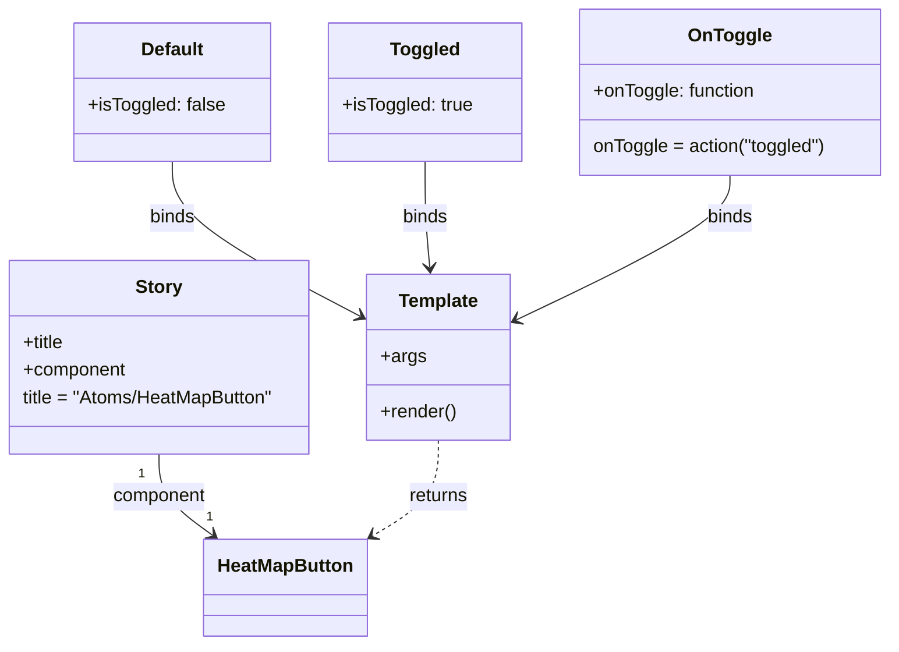

# Diagram: web/portal/src/components/atoms/HeatMapButton.atom.stories.js

> Auto-generated by Obscura crawlers

## Mermaid

### SVG

<svg id="container" width="779.62109375" xmlns="http://www.w3.org/2000/svg" class="classDiagram" height="560" viewBox="0 0 779.62109375 560" role="graphics-document document" aria-roledescription="class"><g><defs><marker id="container_class-aggregationStart" class="marker aggregation class" refX="18" refY="7" markerWidth="190" markerHeight="240" orient="auto"><path d="M 18,7 L9,13 L1,7 L9,1 Z"></path></marker></defs><defs><marker id="container_class-aggregationEnd" class="marker aggregation class" refX="1" refY="7" markerWidth="20" markerHeight="28" orient="auto"><path d="M 18,7 L9,13 L1,7 L9,1 Z"></path></marker></defs><defs><marker id="container_class-extensionStart" class="marker extension class" refX="18" refY="7" markerWidth="190" markerHeight="240" orient="auto"><path d="M 1,7 L18,13 V 1 Z"></path></marker></defs><defs><marker id="container_class-extensionEnd" class="marker extension class" refX="1" refY="7" markerWidth="20" markerHeight="28" orient="auto"><path d="M 1,1 V 13 L18,7 Z"></path></marker></defs><defs><marker id="container_class-compositionStart" class="marker composition class" refX="18" refY="7" markerWidth="190" markerHeight="240" orient="auto"><path d="M 18,7 L9,13 L1,7 L9,1 Z"></path></marker></defs><defs><marker id="container_class-compositionEnd" class="marker composition class" refX="1" refY="7" markerWidth="20" markerHeight="28" orient="auto"><path d="M 18,7 L9,13 L1,7 L9,1 Z"></path></marker></defs><defs><marker id="container_class-dependencyStart" class="marker dependency class" refX="6" refY="7" markerWidth="190" markerHeight="240" orient="auto"><path d="M 5,7 L9,13 L1,7 L9,1 Z"></path></marker></defs><defs><marker id="container_class-dependencyEnd" class="marker dependency class" refX="13" refY="7" markerWidth="20" markerHeight="28" orient="auto"><path d="M 18,7 L9,13 L14,7 L9,1 Z"></path></marker></defs><defs><marker id="container_class-lollipopStart" class="marker lollipop class" refX="13" refY="7" markerWidth="190" markerHeight="240" orient="auto"><circle stroke="black" fill="transparent" cx="7" cy="7" r="6"></circle></marker></defs><defs><marker id="container_class-lollipopEnd" class="marker lollipop class" refX="1" refY="7" markerWidth="190" markerHeight="240" orient="auto"><circle stroke="black" fill="transparent" cx="7" cy="7" r="6"></circle></marker></defs><g class="root"><g class="clusters"></g><g class="edgePaths"><path d="M142.297,394L142.297,400.167C142.297,406.333,142.297,418.667,150.009,430.414C157.721,442.161,173.146,453.322,180.858,458.902L188.57,464.483" id="id_Story_HeatMapButton_1" class="edge-thickness-normal edge-pattern-solid relation" style=";;;" data-edge="true" data-et="edge" data-id="id_Story_HeatMapButton_1" data-points="W3sieCI6MTQyLjI5Njg3NSwieSI6Mzk0fSx7IngiOjE0Mi4yOTY4NzUsInkiOjQzMX0seyJ4IjoxOTMuNDMwNzUwNTkzMzU0NDUsInkiOjQ2OH1d" marker-end="url(#container_class-dependencyEnd)"></path><path d="M388.855,382L388.855,390.167C388.855,398.333,388.855,414.667,378.396,428.848C367.936,443.029,347.017,455.059,336.557,461.074L326.098,467.088" id="id_Template_HeatMapButton_2" class="edge-thickness-normal edge-pattern-dashed relation" style=";;;" data-edge="true" data-et="edge" data-id="id_Template_HeatMapButton_2" data-points="W3sieCI6Mzg4Ljg1NTQ2ODc1LCJ5IjozODJ9LHsieCI6Mzg4Ljg1NTQ2ODc1LCJ5Ijo0MzF9LHsieCI6MzIwLjg5NjQ4NDM3NSwieSI6NDcwLjA3OTM4Njk2ODgyMjR9XQ==" marker-end="url(#container_class-dependencyEnd)"></path><path d="M156.398,140L156.398,148.167C156.398,156.333,156.398,172.667,183.877,195.137C211.356,217.607,266.314,246.214,293.793,260.517L321.272,274.821" id="id_Default_Template_3" class="edge-thickness-normal edge-pattern-solid relation" style=";;;" data-edge="true" data-et="edge" data-id="id_Default_Template_3" data-points="W3sieCI6MTU2LjM5ODQzNzUsInkiOjE0MH0seyJ4IjoxNTYuMzk4NDM3NSwieSI6MTg5fSx7IngiOjMyNi41OTM3NSwieSI6Mjc3LjU5MTEzNzQ3NTAwMzh9XQ==" marker-end="url(#container_class-dependencyEnd)"></path><path d="M374.754,140L374.754,148.167C374.754,156.333,374.754,172.667,375.59,188.007C376.426,203.347,378.098,217.694,378.934,224.867L379.77,232.04" id="id_Toggled_Template_4" class="edge-thickness-normal edge-pattern-solid relation" style=";;;" data-edge="true" data-et="edge" data-id="id_Toggled_Template_4" data-points="W3sieCI6Mzc0Ljc1MzkwNjI1LCJ5IjoxNDB9LHsieCI6Mzc0Ljc1MzkwNjI1LCJ5IjoxODl9LHsieCI6MzgwLjQ2NDQ1NjM1MzMwNTc2LCJ5IjoyMzh9XQ==" marker-end="url(#container_class-dependencyEnd)"></path><path d="M639.996,152L639.996,158.167C639.996,164.333,639.996,176.667,609.417,197.566C578.838,218.466,517.68,247.932,487.101,262.665L456.523,277.398" id="id_OnToggle_Template_5" class="edge-thickness-normal edge-pattern-solid relation" style=";;;" data-edge="true" data-et="edge" data-id="id_OnToggle_Template_5" data-points="W3sieCI6NjM5Ljk5NjA5Mzc1LCJ5IjoxNTJ9LHsieCI6NjM5Ljk5NjA5Mzc1LCJ5IjoxODl9LHsieCI6NDUxLjExNzE4NzUsInkiOjI4MC4wMDIxOTMxMTg4OTUwNH1d" marker-end="url(#container_class-dependencyEnd)"></path></g><g class="edgeLabels"><g class="edgeLabel" transform="translate(142.296875, 431)"><g class="label" data-id="id_Story_HeatMapButton_1" transform="translate(-41.2421875, -12)"><foreignObject width="82.484375" height="24">

component

</foreignObject></g></g><g class="edgeLabel" transform="translate(388.85546875, 431)"><g class="label" data-id="id_Template_HeatMapButton_2" transform="translate(-26.265625, -12)"><foreignObject width="52.53125" height="24">

returns

</foreignObject></g></g><g class="edgeLabel" transform="translate(156.3984375, 189)"><g class="label" data-id="id_Default_Template_3" transform="translate(-20.21875, -12)"><foreignObject width="40.4375" height="24">

binds

</foreignObject></g></g><g class="edgeLabel" transform="translate(374.75390625, 189)"><g class="label" data-id="id_Toggled_Template_4" transform="translate(-20.21875, -12)"><foreignObject width="40.4375" height="24">

binds

</foreignObject></g></g><g class="edgeLabel" transform="translate(639.99609375, 189)"><g class="label" data-id="id_OnToggle_Template_5" transform="translate(-20.21875, -12)"><foreignObject width="40.4375" height="24">

binds

</foreignObject></g></g><g class="edgeTerminals" transform="translate(127.29687750000015, 411.5000021428571)"><g class="inner" transform="translate(0, 0)"><foreignObject style="width: 9px; height: 12px;">
1
</foreignObject></g></g><g class="edgeTerminals" transform="translate(183.04636418733344, 440.5888797459645)"><g class="inner" transform="translate(0, 0)"></g><foreignObject style="width: 9px; height: 12px;">
1
</foreignObject></g></g><g class="nodes"><g class="node default" id="classId-Story-0" transform="translate(142.296875, 310)"><g class="basic label-container"><path d="M-134.296875 -84 L134.296875 -84 L134.296875 84 L-134.296875 84" stroke="none" stroke-width="0" fill="#ECECFF" style=""></path><path d="M-134.296875 -84 C-67.70288559481374 -84, -1.1088961896274725 -84, 134.296875 -84 M-134.296875 -84 C-34.86511457461093 -84, 64.56664585077814 -84, 134.296875 -84 M134.296875 -84 C134.296875 -26.36243559112325, 134.296875 31.275128817753497, 134.296875 84 M134.296875 -84 C134.296875 -29.083774330743083, 134.296875 25.832451338513835, 134.296875 84 M134.296875 84 C34.44967615327383 84, -65.39752269345234 84, -134.296875 84 M134.296875 84 C79.31974996696064 84, 24.34262493392127 84, -134.296875 84 M-134.296875 84 C-134.296875 43.33315380053312, -134.296875 2.6663076010662365, -134.296875 -84 M-134.296875 84 C-134.296875 46.26912672081108, -134.296875 8.53825344162216, -134.296875 -84" stroke="#9370DB" stroke-width="1.3" fill="none" stroke-dasharray="0 0" style=""></path></g><g class="annotation-group text" transform="translate(0, -60)"></g><g class="label-group text" transform="translate(-19.546875, -60)"><g class="label" style="font-weight: bolder" transform="translate(0,-12)"><foreignObject width="39.09375" height="24">

Story

</foreignObject></g></g><g class="members-group text" transform="translate(-122.296875, -12)"><g class="label" style="" transform="translate(0,-12)"><foreignObject width="37.140625" height="24">

+title

</foreignObject></g><g class="label" style="" transform="translate(0,12)"><foreignObject width="90.46875" height="24">

+component

</foreignObject></g><g class="label" style="" transform="translate(0,36)"><foreignObject width="225.046875" height="24">

title = "Atoms/HeatMapButton"

</foreignObject></g></g><g class="methods-group text" transform="translate(-122.296875, 84)"></g><g class="divider" style=""><path d="M-134.296875 -36 C-72.67019361765307 -36, -11.043512235306125 -36, 134.296875 -36 M-134.296875 -36 C-72.95840986030173 -36, -11.619944720603456 -36, 134.296875 -36" stroke="#9370DB" stroke-width="1.3" fill="none" stroke-dasharray="0 0" style=""></path></g><g class="divider" style=""><path d="M-134.296875 60 C-40.56316434587484 60, 53.17054630825032 60, 134.296875 60 M-134.296875 60 C-35.024653721354994 60, 64.24756755729001 60, 134.296875 60" stroke="#9370DB" stroke-width="1.3" fill="none" stroke-dasharray="0 0" style=""></path></g></g><g class="node default" id="classId-HeatMapButton-1" transform="translate(251.474609375, 510)"><g class="basic label-container"><path d="M-69.421875 -42 L69.421875 -42 L69.421875 42 L-69.421875 42" stroke="none" stroke-width="0" fill="#ECECFF" style=""></path><path d="M-69.421875 -42 C-23.38859202995331 -42, 22.644690940093383 -42, 69.421875 -42 M-69.421875 -42 C-30.333803946573205 -42, 8.75426710685359 -42, 69.421875 -42 M69.421875 -42 C69.421875 -14.177333782580483, 69.421875 13.645332434839034, 69.421875 42 M69.421875 -42 C69.421875 -20.896822411792996, 69.421875 0.20635517641400725, 69.421875 42 M69.421875 42 C33.79434742731925 42, -1.8331801453614958 42, -69.421875 42 M69.421875 42 C27.428936522643184 42, -14.564001954713632 42, -69.421875 42 M-69.421875 42 C-69.421875 16.054677714095376, -69.421875 -9.890644571809247, -69.421875 -42 M-69.421875 42 C-69.421875 19.868321117970115, -69.421875 -2.2633577640597693, -69.421875 -42" stroke="#9370DB" stroke-width="1.3" fill="none" stroke-dasharray="0 0" style=""></path></g><g class="annotation-group text" transform="translate(0, -18)"></g><g class="label-group text" transform="translate(-57.421875, -18)"><g class="label" style="font-weight: bolder" transform="translate(0,-12)"><foreignObject width="114.84375" height="24">

HeatMapButton

</foreignObject></g></g><g class="members-group text" transform="translate(-57.421875, 30)"></g><g class="methods-group text" transform="translate(-57.421875, 60)"></g><g class="divider" style=""><path d="M-69.421875 6 C-22.56876049456445 6, 24.2843540108711 6, 69.421875 6 M-69.421875 6 C-26.159990135483994 6, 17.10189472903201 6, 69.421875 6" stroke="#9370DB" stroke-width="1.3" fill="none" stroke-dasharray="0 0" style=""></path></g><g class="divider" style=""><path d="M-69.421875 24 C-38.58990506076387 24, -7.757935121527744 24, 69.421875 24 M-69.421875 24 C-17.778824196384797 24, 33.86422660723041 24, 69.421875 24" stroke="#9370DB" stroke-width="1.3" fill="none" stroke-dasharray="0 0" style=""></path></g></g><g class="node default" id="classId-Template-2" transform="translate(388.85546875, 310)"><g class="basic label-container"><path d="M-62.26171875 -72 L62.26171875 -72 L62.26171875 72 L-62.26171875 72" stroke="none" stroke-width="0" fill="#ECECFF" style=""></path><path d="M-62.26171875 -72 C-28.622609527911578 -72, 5.016499694176844 -72, 62.26171875 -72 M-62.26171875 -72 C-19.988129027725833 -72, 22.285460694548334 -72, 62.26171875 -72 M62.26171875 -72 C62.26171875 -25.383820510530548, 62.26171875 21.232358978938905, 62.26171875 72 M62.26171875 -72 C62.26171875 -32.33613571059863, 62.26171875 7.327728578802734, 62.26171875 72 M62.26171875 72 C34.75610079349332 72, 7.250482836986642 72, -62.26171875 72 M62.26171875 72 C35.573281558742934 72, 8.884844367485861 72, -62.26171875 72 M-62.26171875 72 C-62.26171875 30.099966885670085, -62.26171875 -11.80006622865983, -62.26171875 -72 M-62.26171875 72 C-62.26171875 14.601231018735817, -62.26171875 -42.79753796252837, -62.26171875 -72" stroke="#9370DB" stroke-width="1.3" fill="none" stroke-dasharray="0 0" style=""></path></g><g class="annotation-group text" transform="translate(0, -48)"></g><g class="label-group text" transform="translate(-33.9140625, -48)"><g class="label" style="font-weight: bolder" transform="translate(0,-12)"><foreignObject width="67.828125" height="24">

Template

</foreignObject></g></g><g class="members-group text" transform="translate(-50.26171875, 0)"><g class="label" style="" transform="translate(0,-12)"><foreignObject width="38.078125" height="24">

+args

</foreignObject></g></g><g class="methods-group text" transform="translate(-50.26171875, 48)"><g class="label" style="" transform="translate(0,-12)"><foreignObject width="66.609375" height="24">

+render()

</foreignObject></g></g><g class="divider" style=""><path d="M-62.26171875 -24 C-20.101734531664846 -24, 22.058249686670308 -24, 62.26171875 -24 M-62.26171875 -24 C-16.303226872484686 -24, 29.65526500503063 -24, 62.26171875 -24" stroke="#9370DB" stroke-width="1.3" fill="none" stroke-dasharray="0 0" style=""></path></g><g class="divider" style=""><path d="M-62.26171875 24 C-14.936541221079729 24, 32.38863630784054 24, 62.26171875 24 M-62.26171875 24 C-16.41912408081305 24, 29.423470588373903 24, 62.26171875 24" stroke="#9370DB" stroke-width="1.3" fill="none" stroke-dasharray="0 0" style=""></path></g></g><g class="node default" id="classId-Default-3" transform="translate(156.3984375, 80)"><g class="basic label-container"><path d="M-84.73828125 -60 L84.73828125 -60 L84.73828125 60 L-84.73828125 60" stroke="none" stroke-width="0" fill="#ECECFF" style=""></path><path d="M-84.73828125 -60 C-38.74227687029296 -60, 7.253727509414077 -60, 84.73828125 -60 M-84.73828125 -60 C-42.78817366843471 -60, -0.8380660868694179 -60, 84.73828125 -60 M84.73828125 -60 C84.73828125 -17.98286155337376, 84.73828125 24.034276893252482, 84.73828125 60 M84.73828125 -60 C84.73828125 -16.11145023958948, 84.73828125 27.77709952082104, 84.73828125 60 M84.73828125 60 C26.38138082805653 60, -31.975519593886943 60, -84.73828125 60 M84.73828125 60 C36.04981102321246 60, -12.638659203575074 60, -84.73828125 60 M-84.73828125 60 C-84.73828125 15.244491370451676, -84.73828125 -29.511017259096647, -84.73828125 -60 M-84.73828125 60 C-84.73828125 13.174021956596576, -84.73828125 -33.65195608680685, -84.73828125 -60" stroke="#9370DB" stroke-width="1.3" fill="none" stroke-dasharray="0 0" style=""></path></g><g class="annotation-group text" transform="translate(0, -36)"></g><g class="label-group text" transform="translate(-26.7109375, -36)"><g class="label" style="font-weight: bolder" transform="translate(0,-12)"><foreignObject width="53.421875" height="24">

Default

</foreignObject></g></g><g class="members-group text" transform="translate(-72.73828125, 12)"><g class="label" style="" transform="translate(0,-12)"><foreignObject width="118.765625" height="24">

+isToggled: false

</foreignObject></g></g><g class="methods-group text" transform="translate(-72.73828125, 60)"></g><g class="divider" style=""><path d="M-84.73828125 -12 C-46.51629182829891 -12, -8.294302406597822 -12, 84.73828125 -12 M-84.73828125 -12 C-25.86423387549811 -12, 33.00981349900378 -12, 84.73828125 -12" stroke="#9370DB" stroke-width="1.3" fill="none" stroke-dasharray="0 0" style=""></path></g><g class="divider" style=""><path d="M-84.73828125 36 C-29.20235686292905 36, 26.3335675241419 36, 84.73828125 36 M-84.73828125 36 C-31.432584938709162 36, 21.873111372581675 36, 84.73828125 36" stroke="#9370DB" stroke-width="1.3" fill="none" stroke-dasharray="0 0" style=""></path></g></g><g class="node default" id="classId-Toggled-4" transform="translate(374.75390625, 80)"><g class="basic label-container"><path d="M-83.6171875 -60 L83.6171875 -60 L83.6171875 60 L-83.6171875 60" stroke="none" stroke-width="0" fill="#ECECFF" style=""></path><path d="M-83.6171875 -60 C-26.762737861902224 -60, 30.091711776195552 -60, 83.6171875 -60 M-83.6171875 -60 C-32.11630359539945 -60, 19.384580309201098 -60, 83.6171875 -60 M83.6171875 -60 C83.6171875 -30.642277654681834, 83.6171875 -1.2845553093636681, 83.6171875 60 M83.6171875 -60 C83.6171875 -27.26606683373251, 83.6171875 5.467866332534982, 83.6171875 60 M83.6171875 60 C40.430198959485175 60, -2.7567895810296505 60, -83.6171875 60 M83.6171875 60 C43.888112929188566 60, 4.159038358377131 60, -83.6171875 60 M-83.6171875 60 C-83.6171875 34.21823866674975, -83.6171875 8.436477333499496, -83.6171875 -60 M-83.6171875 60 C-83.6171875 32.85924380796092, -83.6171875 5.718487615921852, -83.6171875 -60" stroke="#9370DB" stroke-width="1.3" fill="none" stroke-dasharray="0 0" style=""></path></g><g class="annotation-group text" transform="translate(0, -36)"></g><g class="label-group text" transform="translate(-28.921875, -36)"><g class="label" style="font-weight: bolder" transform="translate(0,-12)"><foreignObject width="57.84375" height="24">

Toggled

</foreignObject></g></g><g class="members-group text" transform="translate(-71.6171875, 12)"><g class="label" style="" transform="translate(0,-12)"><foreignObject width="114.3125" height="24">

+isToggled: true

</foreignObject></g></g><g class="methods-group text" transform="translate(-71.6171875, 60)"></g><g class="divider" style=""><path d="M-83.6171875 -12 C-46.02370192010507 -12, -8.430216340210137 -12, 83.6171875 -12 M-83.6171875 -12 C-28.814594003470205 -12, 25.98799949305959 -12, 83.6171875 -12" stroke="#9370DB" stroke-width="1.3" fill="none" stroke-dasharray="0 0" style=""></path></g><g class="divider" style=""><path d="M-83.6171875 36 C-29.9115548103439 36, 23.794077879312198 36, 83.6171875 36 M-83.6171875 36 C-20.771923580837075 36, 42.07334033832585 36, 83.6171875 36" stroke="#9370DB" stroke-width="1.3" fill="none" stroke-dasharray="0 0" style=""></path></g></g><g class="node default" id="classId-OnToggle-5" transform="translate(639.99609375, 80)"><g class="basic label-container"><path d="M-131.625 -72 L131.625 -72 L131.625 72 L-131.625 72" stroke="none" stroke-width="0" fill="#ECECFF" style=""></path><path d="M-131.625 -72 C-40.235894374330414 -72, 51.15321125133917 -72, 131.625 -72 M-131.625 -72 C-34.690331634825384 -72, 62.24433673034923 -72, 131.625 -72 M131.625 -72 C131.625 -15.092833653738936, 131.625 41.81433269252213, 131.625 72 M131.625 -72 C131.625 -32.41455241323721, 131.625 7.1708951735255795, 131.625 72 M131.625 72 C61.1025061449008 72, -9.419987710198399 72, -131.625 72 M131.625 72 C30.506580621432235 72, -70.61183875713553 72, -131.625 72 M-131.625 72 C-131.625 19.964342664693433, -131.625 -32.071314670613134, -131.625 -72 M-131.625 72 C-131.625 40.42970845728097, -131.625 8.859416914561933, -131.625 -72" stroke="#9370DB" stroke-width="1.3" fill="none" stroke-dasharray="0 0" style=""></path></g><g class="annotation-group text" transform="translate(0, -48)"></g><g class="label-group text" transform="translate(-34.265625, -48)"><g class="label" style="font-weight: bolder" transform="translate(0,-12)"><foreignObject width="68.53125" height="24">

OnToggle

</foreignObject></g></g><g class="members-group text" transform="translate(-119.625, 0)"><g class="label" style="" transform="translate(0,-12)"><foreignObject width="142.203125" height="24">

+onToggle: function

</foreignObject></g></g><g class="methods-group text" transform="translate(-119.625, 48)"><g class="label" style="" transform="translate(0,-12)"><foreignObject width="204.984375" height="24">

onToggle = action("toggled")

</foreignObject></g></g><g class="divider" style=""><path d="M-131.625 -24 C-76.66294853591212 -24, -21.700897071824244 -24, 131.625 -24 M-131.625 -24 C-34.8707117548918 -24, 61.8835764902164 -24, 131.625 -24" stroke="#9370DB" stroke-width="1.3" fill="none" stroke-dasharray="0 0" style=""></path></g><g class="divider" style=""><path d="M-131.625 24 C-41.95341965879143 24, 47.718160682417135 24, 131.625 24 M-131.625 24 C-75.03125233809016 24, -18.437504676180296 24, 131.625 24" stroke="#9370DB" stroke-width="1.3" fill="none" stroke-dasharray="0 0" style=""></path></g></g></g></g></g></svg>
