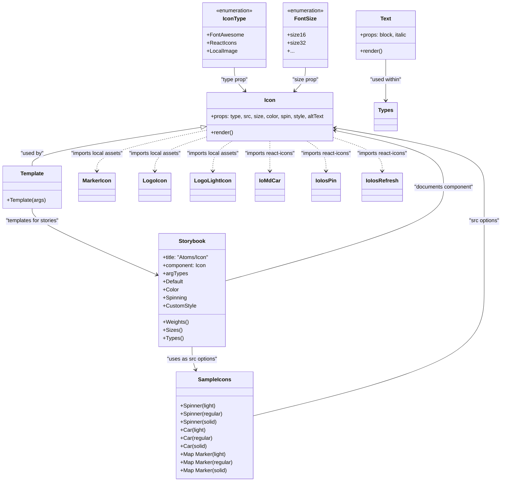

# Diagram: web/portal/src/components/atoms/Icon.atom.stories.js

> Auto-generated by Obscura crawlers

## Mermaid

### SVG

<svg id="container" width="1521.841796875" xmlns="http://www.w3.org/2000/svg" class="classDiagram" height="1428" viewBox="0 0 1521.841796875 1428" role="graphics-document document" aria-roledescription="class"><g><defs><marker id="container_class-aggregationStart" class="marker aggregation class" refX="18" refY="7" markerWidth="190" markerHeight="240" orient="auto"><path d="M 18,7 L9,13 L1,7 L9,1 Z"></path></marker></defs><defs><marker id="container_class-aggregationEnd" class="marker aggregation class" refX="1" refY="7" markerWidth="20" markerHeight="28" orient="auto"><path d="M 18,7 L9,13 L1,7 L9,1 Z"></path></marker></defs><defs><marker id="container_class-extensionStart" class="marker extension class" refX="18" refY="7" markerWidth="190" markerHeight="240" orient="auto"><path d="M 1,7 L18,13 V 1 Z"></path></marker></defs><defs><marker id="container_class-extensionEnd" class="marker extension class" refX="1" refY="7" markerWidth="20" markerHeight="28" orient="auto"><path d="M 1,1 V 13 L18,7 Z"></path></marker></defs><defs><marker id="container_class-compositionStart" class="marker composition class" refX="18" refY="7" markerWidth="190" markerHeight="240" orient="auto"><path d="M 18,7 L9,13 L1,7 L9,1 Z"></path></marker></defs><defs><marker id="container_class-compositionEnd" class="marker composition class" refX="1" refY="7" markerWidth="20" markerHeight="28" orient="auto"><path d="M 18,7 L9,13 L1,7 L9,1 Z"></path></marker></defs><defs><marker id="container_class-dependencyStart" class="marker dependency class" refX="6" refY="7" markerWidth="190" markerHeight="240" orient="auto"><path d="M 5,7 L9,13 L1,7 L9,1 Z"></path></marker></defs><defs><marker id="container_class-dependencyEnd" class="marker dependency class" refX="13" refY="7" markerWidth="20" markerHeight="28" orient="auto"><path d="M 18,7 L9,13 L14,7 L9,1 Z"></path></marker></defs><defs><marker id="container_class-lollipopStart" class="marker lollipop class" refX="13" refY="7" markerWidth="190" markerHeight="240" orient="auto"><circle stroke="black" fill="transparent" cx="7" cy="7" r="6"></circle></marker></defs><defs><marker id="container_class-lollipopEnd" class="marker lollipop class" refX="1" refY="7" markerWidth="190" markerHeight="240" orient="auto"><circle stroke="black" fill="transparent" cx="7" cy="7" r="6"></circle></marker></defs><g class="root"><g class="clusters"></g><g class="edgePaths"><path d="M708.518,200L708.518,206.167C708.518,212.333,708.518,224.667,713.805,236.282C719.092,247.898,729.666,258.796,734.954,264.245L740.241,269.694" id="id_IconType_Icon_1" class="edge-thickness-normal edge-pattern-solid relation" style=";;;" data-edge="true" data-et="edge" data-id="id_IconType_Icon_1" data-points="W3sieCI6NzA4LjUxNzU3ODEyNSwieSI6MjAwfSx7IngiOjcwOC41MTc1NzgxMjUsInkiOjIzN30seyJ4Ijo3NDQuNDE5MDA4MDI3NTIzLCJ5IjoyNzR9XQ==" marker-end="url(#container_class-dependencyEnd)"></path><path d="M920.045,200L920.045,206.167C920.045,212.333,920.045,224.667,914.758,236.282C909.471,247.898,898.896,258.796,893.609,264.245L888.322,269.694" id="id_FontSize_Icon_2" class="edge-thickness-normal edge-pattern-solid relation" style=";;;" data-edge="true" data-et="edge" data-id="id_FontSize_Icon_2" data-points="W3sieCI6OTIwLjA0NDkyMTg3NSwieSI6MjAwfSx7IngiOjkyMC4wNDQ5MjE4NzUsInkiOjIzN30seyJ4Ijo4ODQuMTQzNDkxOTcyNDc3LCJ5IjoyNzR9XQ==" marker-end="url(#container_class-dependencyEnd)"></path><path d="M765.076,1233.907L882.14,1205.756C999.204,1177.605,1233.331,1121.302,1350.395,1058.984C1467.459,996.667,1467.459,928.333,1467.459,860C1467.459,791.667,1467.459,723.333,1467.459,672.5C1467.459,621.667,1467.459,588.333,1467.459,555C1467.459,521.667,1467.459,488.333,1390.791,458.873C1314.124,429.412,1160.789,403.824,1084.121,391.03L1007.453,378.236" id="id_SampleIcons_Icon_3" class="edge-thickness-normal edge-pattern-solid relation" style=";;;" data-edge="true" data-et="edge" data-id="id_SampleIcons_Icon_3" data-points="W3sieCI6NzY1LjA3NjE3MTg3NSwieSI6MTIzMy45MDY4ODgwMjQwNzg0fSx7IngiOjE0NjcuNDU4OTg0Mzc1LCJ5IjoxMDY1fSx7IngiOjE0NjcuNDU4OTg0Mzc1LCJ5Ijo4NjB9LHsieCI6MTQ2Ny40NTg5ODQzNzUsInkiOjY1NX0seyJ4IjoxNDY3LjQ1ODk4NDM3NSwieSI6NTU1fSx7IngiOjE0NjcuNDU4OTg0Mzc1LCJ5Ijo0NTV9LHsieCI6MTAwMS41MzUxNTYyNSwieSI6Mzc3LjI0ODI3MjQxODE5NTl9XQ==" marker-end="url(#container_class-dependencyEnd)"></path><path d="M609.972,376.933L524.034,389.944C438.097,402.955,266.222,428.978,180.285,448.156C94.348,467.333,94.348,479.667,94.348,485.833L94.348,492" id="id_Icon_Template_4" class="edge-thickness-normal edge-pattern-solid relation" style=";;;" data-edge="true" data-et="edge" data-id="id_Icon_Template_4" data-points="W3sieCI6NjI3LjAyNzM0Mzc1LCJ5IjozNzQuMzUwNzc1NjI0OTIyfSx7IngiOjk0LjM0NzY1NjI1LCJ5Ijo0NTV9LHsieCI6OTQuMzQ3NjU2MjUsInkiOjQ5Mn1d" marker-start="url(#container_class-extensionStart)"></path><path d="M94.348,618L94.348,624.167C94.348,630.333,94.348,642.667,158.05,675.505C221.752,708.342,349.155,761.685,412.857,788.356L476.559,815.027" id="id_Template_Storybook_5" class="edge-thickness-normal edge-pattern-solid relation" style=";;;" data-edge="true" data-et="edge" data-id="id_Template_Storybook_5" data-points="W3sieCI6OTQuMzQ3NjU2MjUsInkiOjYxOH0seyJ4Ijo5NC4zNDc2NTYyNSwieSI6NjU1fSx7IngiOjQ4Mi4wOTM3NSwieSI6ODE3LjM0NDU0NzgwNDQ0MjJ9XQ==" marker-end="url(#container_class-dependencyEnd)"></path><path d="M1159.045,176L1159.045,186.167C1159.045,196.333,1159.045,216.667,1159.045,237C1159.045,257.333,1159.045,277.667,1159.045,287.833L1159.045,298" id="id_Text_Types_6" class="edge-thickness-normal edge-pattern-solid relation" style=";;;" data-edge="true" data-et="edge" data-id="id_Text_Types_6" data-points="W3sieCI6MTE1OS4wNDQ5MjE4NzUsInkiOjE3Nn0seyJ4IjoxMTU5LjA0NDkyMTg3NSwieSI6MjM3fSx7IngiOjExNTkuMDQ0OTIxODc1LCJ5IjozMDR9XQ==" marker-end="url(#container_class-dependencyEnd)"></path><path d="M627.027,384.477L569.826,396.231C512.625,407.985,398.223,431.492,341.021,451.913C283.82,472.333,283.82,489.667,283.82,498.333L283.82,507" id="id_Icon_MarkerIcon_7" class="edge-thickness-normal edge-pattern-dashed relation" style=";;;" data-edge="true" data-et="edge" data-id="id_Icon_MarkerIcon_7" data-points="W3sieCI6NjI3LjAyNzM0Mzc1LCJ5IjozODQuNDc3MjQ1NjE0ODEwMn0seyJ4IjoyODMuODIwMzEyNSwieSI6NDU1fSx7IngiOjI4My44MjAzMTI1LCJ5Ijo1MTN9XQ==" marker-end="url(#container_class-dependencyEnd)"></path><path d="M627.027,403.824L599.407,412.354C571.786,420.883,516.546,437.941,488.925,455.137C461.305,472.333,461.305,489.667,461.305,498.333L461.305,507" id="id_Icon_LogoIcon_8" class="edge-thickness-normal edge-pattern-dashed relation" style=";;;" data-edge="true" data-et="edge" data-id="id_Icon_LogoIcon_8" data-points="W3sieCI6NjI3LjAyNzM0Mzc1LCJ5Ijo0MDMuODI0NDUwNTQzMzd9LHsieCI6NDYxLjMwNDY4NzUsInkiOjQ1NX0seyJ4Ijo0NjEuMzA0Njg3NSwieSI6NTEzfV0=" marker-end="url(#container_class-dependencyEnd)"></path><path d="M698.36,418L688.431,424.167C678.503,430.333,658.646,442.667,648.718,457.5C638.789,472.333,638.789,489.667,638.789,498.333L638.789,507" id="id_Icon_LogoLightIcon_9" class="edge-thickness-normal edge-pattern-dashed relation" style=";;;" data-edge="true" data-et="edge" data-id="id_Icon_LogoLightIcon_9" data-points="W3sieCI6Njk4LjM1OTgwNTA0NTg3MTYsInkiOjQxOH0seyJ4Ijo2MzguNzg5MDYyNSwieSI6NDU1fSx7IngiOjYzOC43ODkwNjI1LCJ5Ijo1MTN9XQ==" marker-end="url(#container_class-dependencyEnd)"></path><path d="M814.281,418L814.281,424.167C814.281,430.333,814.281,442.667,814.281,457.5C814.281,472.333,814.281,489.667,814.281,498.333L814.281,507" id="id_Icon_IoMdCar_10" class="edge-thickness-normal edge-pattern-dashed relation" style=";;;" data-edge="true" data-et="edge" data-id="id_Icon_IoMdCar_10" data-points="W3sieCI6ODE0LjI4MTI1LCJ5Ijo0MTh9LHsieCI6ODE0LjI4MTI1LCJ5Ijo0NTV9LHsieCI6ODE0LjI4MTI1LCJ5Ijo1MTN9XQ==" marker-end="url(#container_class-dependencyEnd)"></path><path d="M928.887,418L938.703,424.167C948.518,430.333,968.15,442.667,977.966,457.5C987.781,472.333,987.781,489.667,987.781,498.333L987.781,507" id="id_Icon_IoIosPin_11" class="edge-thickness-normal edge-pattern-dashed relation" style=";;;" data-edge="true" data-et="edge" data-id="id_Icon_IoIosPin_11" data-points="W3sieCI6OTI4Ljg4Njc1NDU4NzE1NiwieSI6NDE4fSx7IngiOjk4Ny43ODEyNSwieSI6NDU1fSx7IngiOjk4Ny43ODEyNSwieSI6NTEzfV0=" marker-end="url(#container_class-dependencyEnd)"></path><path d="M1001.535,404.82L1028.16,413.184C1054.784,421.547,1108.033,438.273,1134.657,455.303C1161.281,472.333,1161.281,489.667,1161.281,498.333L1161.281,507" id="id_Icon_IoIosRefresh_12" class="edge-thickness-normal edge-pattern-dashed relation" style=";;;" data-edge="true" data-et="edge" data-id="id_Icon_IoIosRefresh_12" data-points="W3sieCI6MTAwMS41MzUxNTYyNSwieSI6NDA0LjgyMDM5MTMwMDQzMjN9LHsieCI6MTE2MS4yODEyNSwieSI6NDU1fSx7IngiOjExNjEuMjgxMjUsInkiOjUxM31d" marker-end="url(#container_class-dependencyEnd)"></path><path d="M685.852,832.522L795.552,802.935C905.253,773.348,1124.654,714.174,1234.354,667.92C1344.055,621.667,1344.055,588.333,1344.055,555C1344.055,521.667,1344.055,488.333,1287.948,460.123C1231.84,431.912,1119.626,408.824,1063.519,397.28L1007.412,385.736" id="id_Storybook_Icon_13" class="edge-thickness-normal edge-pattern-solid relation" style=";;;" data-edge="true" data-et="edge" data-id="id_Storybook_Icon_13" data-points="W3sieCI6Njg1Ljg1MTU2MjUsInkiOjgzMi41MjI0NzEzNjE1NDF9LHsieCI6MTM0NC4wNTQ2ODc1LCJ5Ijo2NTV9LHsieCI6MTM0NC4wNTQ2ODc1LCJ5Ijo1NTV9LHsieCI6MTM0NC4wNTQ2ODc1LCJ5Ijo0NTV9LHsieCI6MTAwMS41MzUxNTYyNSwieSI6Mzg0LjUyNzE3ODQ4MTM2NzM0fV0=" marker-end="url(#container_class-dependencyEnd)"></path><path d="M583.973,1028L583.973,1034.167C583.973,1040.333,583.973,1052.667,585.796,1064.056C587.62,1075.445,591.267,1085.89,593.091,1091.113L594.914,1096.335" id="id_Storybook_SampleIcons_14" class="edge-thickness-normal edge-pattern-solid relation" style=";;;" data-edge="true" data-et="edge" data-id="id_Storybook_SampleIcons_14" data-points="W3sieCI6NTgzLjk3MjY1NjI1LCJ5IjoxMDI4fSx7IngiOjU4My45NzI2NTYyNSwieSI6MTA2NX0seyJ4Ijo1OTYuODkyMzQ4OTMxNzYwMiwieSI6MTEwMn1d" marker-end="url(#container_class-dependencyEnd)"></path></g><g class="edgeLabels"><g class="edgeLabel" transform="translate(708.517578125, 237)"><g class="label" data-id="id_IconType_Icon_1" transform="translate(-41.4296875, -12)"><foreignObject width="82.859375" height="24">

"type prop"

</foreignObject></g></g><g class="edgeLabel" transform="translate(920.044921875, 237)"><g class="label" data-id="id_FontSize_Icon_2" transform="translate(-39.1640625, -12)"><foreignObject width="78.328125" height="24">

"size prop"

</foreignObject></g></g><g class="edgeLabel" transform="translate(1467.458984375, 655)"><g class="label" data-id="id_SampleIcons_Icon_3" transform="translate(-46.3828125, -12)"><foreignObject width="92.765625" height="24">

"src options"

</foreignObject></g></g><g class="edgeLabel" transform="translate(94.34765625, 455)"><g class="label" data-id="id_Icon_Template_4" transform="translate(-34.703125, -12)"><foreignObject width="69.40625" height="24">

"used by"

</foreignObject></g></g><g class="edgeLabel" transform="translate(94.34765625, 655)"><g class="label" data-id="id_Template_Storybook_5" transform="translate(-81.8203125, -12)"><foreignObject width="163.640625" height="24">

"templates for stories"

</foreignObject></g></g><g class="edgeLabel" transform="translate(1159.044921875, 237)"><g class="label" data-id="id_Text_Types_6" transform="translate(-48.4765625, -12)"><foreignObject width="96.953125" height="24">

"used within"

</foreignObject></g></g><g class="edgeLabel" transform="translate(283.8203125, 455)"><g class="label" data-id="id_Icon_MarkerIcon_7" transform="translate(-78.7421875, -12)"><foreignObject width="157.484375" height="24">

"imports local assets"

</foreignObject></g></g><g class="edgeLabel" transform="translate(461.3046875, 455)"><g class="label" data-id="id_Icon_LogoIcon_8" transform="translate(-78.7421875, -12)"><foreignObject width="157.484375" height="24">

"imports local assets"

</foreignObject></g></g><g class="edgeLabel" transform="translate(638.7890625, 455)"><g class="label" data-id="id_Icon_LogoLightIcon_9" transform="translate(-78.7421875, -12)"><foreignObject width="157.484375" height="24">

"imports local assets"

</foreignObject></g></g><g class="edgeLabel" transform="translate(814.28125, 455)"><g class="label" data-id="id_Icon_IoMdCar_10" transform="translate(-76.75, -12)"><foreignObject width="153.5" height="24">

"imports react-icons"

</foreignObject></g></g><g class="edgeLabel" transform="translate(987.78125, 455)"><g class="label" data-id="id_Icon_IoIosPin_11" transform="translate(-76.75, -12)"><foreignObject width="153.5" height="24">

"imports react-icons"

</foreignObject></g></g><g class="edgeLabel" transform="translate(1161.28125, 455)"><g class="label" data-id="id_Icon_IoIosRefresh_12" transform="translate(-76.75, -12)"><foreignObject width="153.5" height="24">

"imports react-icons"

</foreignObject></g></g><g class="edgeLabel" transform="translate(1344.0546875, 555)"><g class="label" data-id="id_Storybook_Icon_13" transform="translate(-89.9296875, -12)"><foreignObject width="179.859375" height="24">

"documents component"

</foreignObject></g></g><g class="edgeLabel" transform="translate(583.97265625, 1065)"><g class="label" data-id="id_Storybook_SampleIcons_14" transform="translate(-75.1953125, -12)"><foreignObject width="150.390625" height="24">

"uses as src options"

</foreignObject></g></g></g><g class="nodes"><g class="node default" id="classId-Icon-0" transform="translate(814.28125, 346)"><g class="basic label-container"><path d="M-187.25390625 -72 L187.25390625 -72 L187.25390625 72 L-187.25390625 72" stroke="none" stroke-width="0" fill="#ECECFF" style=""></path><path d="M-187.25390625 -72 C-100.92890511591106 -72, -14.603903981822128 -72, 187.25390625 -72 M-187.25390625 -72 C-90.7342394381576 -72, 5.785427373684797 -72, 187.25390625 -72 M187.25390625 -72 C187.25390625 -16.28370277819419, 187.25390625 39.43259444361162, 187.25390625 72 M187.25390625 -72 C187.25390625 -39.75071213002976, 187.25390625 -7.5014242600595225, 187.25390625 72 M187.25390625 72 C91.84796484216854 72, -3.5579765656629263 72, -187.25390625 72 M187.25390625 72 C107.2027327006988 72, 27.151559151397606 72, -187.25390625 72 M-187.25390625 72 C-187.25390625 38.14642017600707, -187.25390625 4.292840352014139, -187.25390625 -72 M-187.25390625 72 C-187.25390625 41.30751640613767, -187.25390625 10.615032812275345, -187.25390625 -72" stroke="#9370DB" stroke-width="1.3" fill="none" stroke-dasharray="0 0" style=""></path></g><g class="annotation-group text" transform="translate(0, -48)"></g><g class="label-group text" transform="translate(-15.3046875, -48)"><g class="label" style="font-weight: bolder" transform="translate(0,-12)"><foreignObject width="30.609375" height="24">

Icon

</foreignObject></g></g><g class="members-group text" transform="translate(-175.25390625, 0)"><g class="label" style="" transform="translate(0,-12)"><foreignObject width="335.203125" height="24">

+props: type, src, size, color, spin, style, altText

</foreignObject></g></g><g class="methods-group text" transform="translate(-175.25390625, 48)"><g class="label" style="" transform="translate(0,-12)"><foreignObject width="66.609375" height="24">

+render()

</foreignObject></g></g><g class="divider" style=""><path d="M-187.25390625 -24 C-45.76779548932359 -24, 95.71831527135282 -24, 187.25390625 -24 M-187.25390625 -24 C-108.63845654338341 -24, -30.023006836766825 -24, 187.25390625 -24" stroke="#9370DB" stroke-width="1.3" fill="none" stroke-dasharray="0 0" style=""></path></g><g class="divider" style=""><path d="M-187.25390625 24 C-110.62244084102997 24, -33.99097543205994 24, 187.25390625 24 M-187.25390625 24 C-54.91380287297352 24, 77.42630050405296 24, 187.25390625 24" stroke="#9370DB" stroke-width="1.3" fill="none" stroke-dasharray="0 0" style=""></path></g></g><g class="node default" id="classId-Text-1" transform="translate(1159.044921875, 104)"><g class="basic label-container"><path d="M-89.98828125 -72 L89.98828125 -72 L89.98828125 72 L-89.98828125 72" stroke="none" stroke-width="0" fill="#ECECFF" style=""></path><path d="M-89.98828125 -72 C-39.941474907324434 -72, 10.105331435351133 -72, 89.98828125 -72 M-89.98828125 -72 C-26.11558660381091 -72, 37.75710804237818 -72, 89.98828125 -72 M89.98828125 -72 C89.98828125 -30.865076327045827, 89.98828125 10.269847345908346, 89.98828125 72 M89.98828125 -72 C89.98828125 -29.16684396078481, 89.98828125 13.66631207843038, 89.98828125 72 M89.98828125 72 C52.8976324220018 72, 15.806983594003597 72, -89.98828125 72 M89.98828125 72 C24.434647288229016 72, -41.11898667354197 72, -89.98828125 72 M-89.98828125 72 C-89.98828125 39.85043922128908, -89.98828125 7.7008784425781585, -89.98828125 -72 M-89.98828125 72 C-89.98828125 31.273235593690046, -89.98828125 -9.453528812619908, -89.98828125 -72" stroke="#9370DB" stroke-width="1.3" fill="none" stroke-dasharray="0 0" style=""></path></g><g class="annotation-group text" transform="translate(0, -48)"></g><g class="label-group text" transform="translate(-15.3828125, -48)"><g class="label" style="font-weight: bolder" transform="translate(0,-12)"><foreignObject width="30.765625" height="24">

Text

</foreignObject></g></g><g class="members-group text" transform="translate(-77.98828125, 0)"><g class="label" style="" transform="translate(0,-12)"><foreignObject width="140.59375" height="24">

+props: block, italic

</foreignObject></g></g><g class="methods-group text" transform="translate(-77.98828125, 48)"><g class="label" style="" transform="translate(0,-12)"><foreignObject width="66.609375" height="24">

+render()

</foreignObject></g></g><g class="divider" style=""><path d="M-89.98828125 -24 C-51.94835481125674 -24, -13.908428372513484 -24, 89.98828125 -24 M-89.98828125 -24 C-44.9029284359611 -24, 0.18242437807779766 -24, 89.98828125 -24" stroke="#9370DB" stroke-width="1.3" fill="none" stroke-dasharray="0 0" style=""></path></g><g class="divider" style=""><path d="M-89.98828125 24 C-27.231826827840727 24, 35.524627594318545 24, 89.98828125 24 M-89.98828125 24 C-50.39779522531995 24, -10.807309200639907 24, 89.98828125 24" stroke="#9370DB" stroke-width="1.3" fill="none" stroke-dasharray="0 0" style=""></path></g></g><g class="node default" id="classId-FontSize-2" transform="translate(920.044921875, 104)"><g class="basic label-container"><path d="M-67.5546875 -96 L67.5546875 -96 L67.5546875 96 L-67.5546875 96" stroke="none" stroke-width="0" fill="#ECECFF" style=""></path><path d="M-67.5546875 -96 C-18.83570528579731 -96, 29.88327692840538 -96, 67.5546875 -96 M-67.5546875 -96 C-38.70407155474423 -96, -9.853455609488456 -96, 67.5546875 -96 M67.5546875 -96 C67.5546875 -28.643768264741382, 67.5546875 38.712463470517235, 67.5546875 96 M67.5546875 -96 C67.5546875 -31.485052308557528, 67.5546875 33.029895382884945, 67.5546875 96 M67.5546875 96 C23.11882929774351 96, -21.31702890451298 96, -67.5546875 96 M67.5546875 96 C38.36003969641291 96, 9.165391892825824 96, -67.5546875 96 M-67.5546875 96 C-67.5546875 52.408789514958386, -67.5546875 8.817579029916772, -67.5546875 -96 M-67.5546875 96 C-67.5546875 29.073044497474996, -67.5546875 -37.85391100505001, -67.5546875 -96" stroke="#9370DB" stroke-width="1.3" fill="none" stroke-dasharray="0 0" style=""></path></g><g class="annotation-group text" transform="translate(-55.5546875, -72)"><g class="label" style="" transform="translate(0,-12)"><foreignObject width="111.109375" height="24">

«enumeration»

</foreignObject></g></g><g class="label-group text" transform="translate(-30.84375, -48)"><g class="label" style="font-weight: bolder" transform="translate(0,-12)"><foreignObject width="61.6875" height="24">

FontSize

</foreignObject></g></g><g class="members-group text" transform="translate(-55.5546875, 0)"><g class="label" style="" transform="translate(0,-12)"><foreignObject width="50.234375" height="24">

+size16

</foreignObject></g><g class="label" style="" transform="translate(0,12)"><foreignObject width="51" height="24">

+size32

</foreignObject></g><g class="label" style="" transform="translate(0,36)"><foreignObject width="18.71875" height="24">

+...

</foreignObject></g></g><g class="methods-group text" transform="translate(-55.5546875, 96)"></g><g class="divider" style=""><path d="M-67.5546875 -24 C-33.68051739161521 -24, 0.19365271676957718 -24, 67.5546875 -24 M-67.5546875 -24 C-17.411371694359552 -24, 32.731944111280896 -24, 67.5546875 -24" stroke="#9370DB" stroke-width="1.3" fill="none" stroke-dasharray="0 0" style=""></path></g><g class="divider" style=""><path d="M-67.5546875 72 C-33.97182850134693 72, -0.388969502693854 72, 67.5546875 72 M-67.5546875 72 C-36.03252418929192 72, -4.510360878583846 72, 67.5546875 72" stroke="#9370DB" stroke-width="1.3" fill="none" stroke-dasharray="0 0" style=""></path></g></g><g class="node default" id="classId-IconType-3" transform="translate(708.517578125, 104)"><g class="basic label-container"><path d="M-93.97265625 -96 L93.97265625 -96 L93.97265625 96 L-93.97265625 96" stroke="none" stroke-width="0" fill="#ECECFF" style=""></path><path d="M-93.97265625 -96 C-20.1338990318619 -96, 53.7048581862762 -96, 93.97265625 -96 M-93.97265625 -96 C-22.48599794239709 -96, 49.00066036520582 -96, 93.97265625 -96 M93.97265625 -96 C93.97265625 -48.292100952369836, 93.97265625 -0.5842019047396718, 93.97265625 96 M93.97265625 -96 C93.97265625 -31.044152871989795, 93.97265625 33.91169425602041, 93.97265625 96 M93.97265625 96 C24.17193807380623 96, -45.62878010238754 96, -93.97265625 96 M93.97265625 96 C55.39041057879395 96, 16.808164907587894 96, -93.97265625 96 M-93.97265625 96 C-93.97265625 41.50381259953096, -93.97265625 -12.99237480093808, -93.97265625 -96 M-93.97265625 96 C-93.97265625 26.756421272171906, -93.97265625 -42.48715745565619, -93.97265625 -96" stroke="#9370DB" stroke-width="1.3" fill="none" stroke-dasharray="0 0" style=""></path></g><g class="annotation-group text" transform="translate(-55.5546875, -72)"><g class="label" style="" transform="translate(0,-12)"><foreignObject width="111.109375" height="24">

«enumeration»

</foreignObject></g></g><g class="label-group text" transform="translate(-32.640625, -48)"><g class="label" style="font-weight: bolder" transform="translate(0,-12)"><foreignObject width="65.28125" height="24">

IconType

</foreignObject></g></g><g class="members-group text" transform="translate(-81.97265625, 0)"><g class="label" style="" transform="translate(0,-12)"><foreignObject width="108.390625" height="24">

+FontAwesome

</foreignObject></g><g class="label" style="" transform="translate(0,12)"><foreignObject width="86.359375" height="24">

+ReactIcons

</foreignObject></g><g class="label" style="" transform="translate(0,36)"><foreignObject width="89.390625" height="24">

+LocalImage

</foreignObject></g></g><g class="methods-group text" transform="translate(-81.97265625, 96)"></g><g class="divider" style=""><path d="M-93.97265625 -24 C-35.3544249751178 -24, 23.263806299764397 -24, 93.97265625 -24 M-93.97265625 -24 C-34.23807668013995 -24, 25.496502889720105 -24, 93.97265625 -24" stroke="#9370DB" stroke-width="1.3" fill="none" stroke-dasharray="0 0" style=""></path></g><g class="divider" style=""><path d="M-93.97265625 72 C-35.576726520662945 72, 22.81920320867411 72, 93.97265625 72 M-93.97265625 72 C-29.394659905069588 72, 35.183336439860824 72, 93.97265625 72" stroke="#9370DB" stroke-width="1.3" fill="none" stroke-dasharray="0 0" style=""></path></g></g><g class="node default" id="classId-SampleIcons-4" transform="translate(652.412109375, 1261)"><g class="basic label-container"><path d="M-112.6640625 -159 L112.6640625 -159 L112.6640625 159 L-112.6640625 159" stroke="none" stroke-width="0" fill="#ECECFF" style=""></path><path d="M-112.6640625 -159 C-38.02700757727675 -159, 36.6100473454465 -159, 112.6640625 -159 M-112.6640625 -159 C-55.99214117155517 -159, 0.6797801568896631 -159, 112.6640625 -159 M112.6640625 -159 C112.6640625 -50.801640645217844, 112.6640625 57.39671870956431, 112.6640625 159 M112.6640625 -159 C112.6640625 -85.33284950802643, 112.6640625 -11.665699016052855, 112.6640625 159 M112.6640625 159 C26.968272987567076 159, -58.72751652486585 159, -112.6640625 159 M112.6640625 159 C29.592702125597597 159, -53.478658248804805 159, -112.6640625 159 M-112.6640625 159 C-112.6640625 50.740582206486195, -112.6640625 -57.51883558702761, -112.6640625 -159 M-112.6640625 159 C-112.6640625 58.76179782697699, -112.6640625 -41.476404346046024, -112.6640625 -159" stroke="#9370DB" stroke-width="1.3" fill="none" stroke-dasharray="0 0" style=""></path></g><g class="annotation-group text" transform="translate(0, -135)"></g><g class="label-group text" transform="translate(-46.421875, -135)"><g class="label" style="font-weight: bolder" transform="translate(0,-12)"><foreignObject width="92.84375" height="24">

SampleIcons

</foreignObject></g></g><g class="members-group text" transform="translate(-100.6640625, -87)"></g><g class="methods-group text" transform="translate(-100.6640625, -57)"><g class="label" style="" transform="translate(0,-12)"><foreignObject width="106.78125" height="24">

+Spinner(light)

</foreignObject></g><g class="label" style="" transform="translate(0,12)"><foreignObject width="125.484375" height="24">

+Spinner(regular)

</foreignObject></g><g class="label" style="" transform="translate(0,36)"><foreignObject width="109.6875" height="24">

+Spinner(solid)

</foreignObject></g><g class="label" style="" transform="translate(0,60)"><foreignObject width="74.71875" height="24">

+Car(light)

</foreignObject></g><g class="label" style="" transform="translate(0,84)"><foreignObject width="93.421875" height="24">

+Car(regular)

</foreignObject></g><g class="label" style="" transform="translate(0,108)"><foreignObject width="77.625" height="24">

+Car(solid)

</foreignObject></g><g class="label" style="" transform="translate(0,132)"><foreignObject width="136.203125" height="24">

+Map Marker(light)

</foreignObject></g><g class="label" style="" transform="translate(0,156)"><foreignObject width="154.90625" height="24">

+Map Marker(regular)

</foreignObject></g><g class="label" style="" transform="translate(0,180)"><foreignObject width="139.109375" height="24">

+Map Marker(solid)

</foreignObject></g></g><g class="divider" style=""><path d="M-112.6640625 -111 C-34.479629668912025 -111, 43.70480316217595 -111, 112.6640625 -111 M-112.6640625 -111 C-62.99181928103434 -111, -13.319576062068677 -111, 112.6640625 -111" stroke="#9370DB" stroke-width="1.3" fill="none" stroke-dasharray="0 0" style=""></path></g><g class="divider" style=""><path d="M-112.6640625 -87 C-28.589278382916618 -87, 55.485505734166765 -87, 112.6640625 -87 M-112.6640625 -87 C-44.08810952185766 -87, 24.48784345628468 -87, 112.6640625 -87" stroke="#9370DB" stroke-width="1.3" fill="none" stroke-dasharray="0 0" style=""></path></g></g><g class="node default" id="classId-Template-5" transform="translate(94.34765625, 555)"><g class="basic label-container"><path d="M-86.34765625 -63 L86.34765625 -63 L86.34765625 63 L-86.34765625 63" stroke="none" stroke-width="0" fill="#ECECFF" style=""></path><path d="M-86.34765625 -63 C-32.87307071354427 -63, 20.601514822911454 -63, 86.34765625 -63 M-86.34765625 -63 C-18.85490121329383 -63, 48.63785382341234 -63, 86.34765625 -63 M86.34765625 -63 C86.34765625 -29.70942964724602, 86.34765625 3.5811407055079627, 86.34765625 63 M86.34765625 -63 C86.34765625 -15.611385323935465, 86.34765625 31.77722935212907, 86.34765625 63 M86.34765625 63 C27.25797801161312 63, -31.831700226773762 63, -86.34765625 63 M86.34765625 63 C40.03055463689329 63, -6.286546976213415 63, -86.34765625 63 M-86.34765625 63 C-86.34765625 17.588571401538616, -86.34765625 -27.82285719692277, -86.34765625 -63 M-86.34765625 63 C-86.34765625 19.690623189291784, -86.34765625 -23.61875362141643, -86.34765625 -63" stroke="#9370DB" stroke-width="1.3" fill="none" stroke-dasharray="0 0" style=""></path></g><g class="annotation-group text" transform="translate(0, -39)"></g><g class="label-group text" transform="translate(-33.9140625, -39)"><g class="label" style="font-weight: bolder" transform="translate(0,-12)"><foreignObject width="67.828125" height="24">

Template

</foreignObject></g></g><g class="members-group text" transform="translate(-74.34765625, 9)"></g><g class="methods-group text" transform="translate(-74.34765625, 39)"><g class="label" style="" transform="translate(0,-12)"><foreignObject width="114.78125" height="24">

+Template(args)

</foreignObject></g></g><g class="divider" style=""><path d="M-86.34765625 -15 C-40.402206605331635 -15, 5.54324303933673 -15, 86.34765625 -15 M-86.34765625 -15 C-41.58595740245157 -15, 3.175741445096861 -15, 86.34765625 -15" stroke="#9370DB" stroke-width="1.3" fill="none" stroke-dasharray="0 0" style=""></path></g><g class="divider" style=""><path d="M-86.34765625 9 C-44.94988714180734 9, -3.5521180336146756 9, 86.34765625 9 M-86.34765625 9 C-29.09972913822952 9, 28.14819797354096 9, 86.34765625 9" stroke="#9370DB" stroke-width="1.3" fill="none" stroke-dasharray="0 0" style=""></path></g></g><g class="node default" id="classId-Storybook-6" transform="translate(583.97265625, 860)"><g class="basic label-container"><path d="M-101.87890625 -168 L101.87890625 -168 L101.87890625 168 L-101.87890625 168" stroke="none" stroke-width="0" fill="#ECECFF" style=""></path><path d="M-101.87890625 -168 C-21.097615842295994 -168, 59.68367456540801 -168, 101.87890625 -168 M-101.87890625 -168 C-21.49538049801741 -168, 58.88814525396518 -168, 101.87890625 -168 M101.87890625 -168 C101.87890625 -48.207950509601986, 101.87890625 71.58409898079603, 101.87890625 168 M101.87890625 -168 C101.87890625 -77.38624620637628, 101.87890625 13.22750758724743, 101.87890625 168 M101.87890625 168 C29.825754582905972 168, -42.227397084188055 168, -101.87890625 168 M101.87890625 168 C59.994923243823045 168, 18.11094023764609 168, -101.87890625 168 M-101.87890625 168 C-101.87890625 64.81410348581296, -101.87890625 -38.37179302837407, -101.87890625 -168 M-101.87890625 168 C-101.87890625 85.62924522155026, -101.87890625 3.258490443100527, -101.87890625 -168" stroke="#9370DB" stroke-width="1.3" fill="none" stroke-dasharray="0 0" style=""></path></g><g class="annotation-group text" transform="translate(0, -144)"></g><g class="label-group text" transform="translate(-38.0859375, -144)"><g class="label" style="font-weight: bolder" transform="translate(0,-12)"><foreignObject width="76.171875" height="24">

Storybook

</foreignObject></g></g><g class="members-group text" transform="translate(-89.87890625, -96)"><g class="label" style="" transform="translate(0,-12)"><foreignObject width="141.671875" height="24">

+title: "Atoms/Icon"

</foreignObject></g><g class="label" style="" transform="translate(0,12)"><foreignObject width="129.390625" height="24">

+component: Icon

</foreignObject></g><g class="label" style="" transform="translate(0,36)"><foreignObject width="71.90625" height="24">

+argTypes

</foreignObject></g><g class="label" style="" transform="translate(0,60)"><foreignObject width="60.5" height="24">

+Default

</foreignObject></g><g class="label" style="" transform="translate(0,84)"><foreignObject width="46.109375" height="24">

+Color

</foreignObject></g><g class="label" style="" transform="translate(0,108)"><foreignObject width="71.046875" height="24">

+Spinning

</foreignObject></g><g class="label" style="" transform="translate(0,132)"><foreignObject width="97.671875" height="24">

+CustomStyle

</foreignObject></g></g><g class="methods-group text" transform="translate(-89.87890625, 96)"><g class="label" style="" transform="translate(0,-12)"><foreignObject width="75.59375" height="24">

+Weights()

</foreignObject></g><g class="label" style="" transform="translate(0,12)"><foreignObject width="54.03125" height="24">

+Sizes()

</foreignObject></g><g class="label" style="" transform="translate(0,36)"><foreignObject width="58.765625" height="24">

+Types()

</foreignObject></g></g><g class="divider" style=""><path d="M-101.87890625 -120 C-41.48834716703641 -120, 18.902211915927182 -120, 101.87890625 -120 M-101.87890625 -120 C-31.360936310385043 -120, 39.157033629229915 -120, 101.87890625 -120" stroke="#9370DB" stroke-width="1.3" fill="none" stroke-dasharray="0 0" style=""></path></g><g class="divider" style=""><path d="M-101.87890625 72 C-56.92744249060104 72, -11.975978731202076 72, 101.87890625 72 M-101.87890625 72 C-41.206562491208935 72, 19.46578126758213 72, 101.87890625 72" stroke="#9370DB" stroke-width="1.3" fill="none" stroke-dasharray="0 0" style=""></path></g></g><g class="node default" id="classId-Types-7" transform="translate(1159.044921875, 346)"><g class="basic label-container"><path d="M-33.203125 -42 L33.203125 -42 L33.203125 42 L-33.203125 42" stroke="none" stroke-width="0" fill="#ECECFF" style=""></path><path d="M-33.203125 -42 C-11.728247904264727 -42, 9.746629191470547 -42, 33.203125 -42 M-33.203125 -42 C-18.126668814260235 -42, -3.050212628520473 -42, 33.203125 -42 M33.203125 -42 C33.203125 -19.208276700302633, 33.203125 3.5834465993947333, 33.203125 42 M33.203125 -42 C33.203125 -13.951145471769706, 33.203125 14.097709056460587, 33.203125 42 M33.203125 42 C11.175226796061324 42, -10.852671407877352 42, -33.203125 42 M33.203125 42 C13.942924699104505 42, -5.317275601790989 42, -33.203125 42 M-33.203125 42 C-33.203125 12.186555091679246, -33.203125 -17.62688981664151, -33.203125 -42 M-33.203125 42 C-33.203125 18.940507412871636, -33.203125 -4.1189851742567285, -33.203125 -42" stroke="#9370DB" stroke-width="1.3" fill="none" stroke-dasharray="0 0" style=""></path></g><g class="annotation-group text" transform="translate(0, -18)"></g><g class="label-group text" transform="translate(-21.203125, -18)"><g class="label" style="font-weight: bolder" transform="translate(0,-12)"><foreignObject width="42.40625" height="24">

Types

</foreignObject></g></g><g class="members-group text" transform="translate(-21.203125, 30)"></g><g class="methods-group text" transform="translate(-21.203125, 60)"></g><g class="divider" style=""><path d="M-33.203125 6 C-18.92992536180418 6, -4.656725723608357 6, 33.203125 6 M-33.203125 6 C-11.633323349554221 6, 9.936478300891558 6, 33.203125 6" stroke="#9370DB" stroke-width="1.3" fill="none" stroke-dasharray="0 0" style=""></path></g><g class="divider" style=""><path d="M-33.203125 24 C-11.459844404199448 24, 10.283436191601105 24, 33.203125 24 M-33.203125 24 C-11.931069119349079 24, 9.340986761301842 24, 33.203125 24" stroke="#9370DB" stroke-width="1.3" fill="none" stroke-dasharray="0 0" style=""></path></g></g><g class="node default" id="classId-MarkerIcon-8" transform="translate(283.8203125, 555)"><g class="basic label-container"><path d="M-53.125 -42 L53.125 -42 L53.125 42 L-53.125 42" stroke="none" stroke-width="0" fill="#ECECFF" style=""></path><path d="M-53.125 -42 C-29.542422652833768 -42, -5.959845305667535 -42, 53.125 -42 M-53.125 -42 C-12.602148296697237 -42, 27.920703406605526 -42, 53.125 -42 M53.125 -42 C53.125 -12.06878736830129, 53.125 17.86242526339742, 53.125 42 M53.125 -42 C53.125 -16.822779640618702, 53.125 8.354440718762596, 53.125 42 M53.125 42 C20.285879973498943 42, -12.553240053002114 42, -53.125 42 M53.125 42 C19.264413109656005 42, -14.596173780687991 42, -53.125 42 M-53.125 42 C-53.125 15.538233868959455, -53.125 -10.923532262081089, -53.125 -42 M-53.125 42 C-53.125 12.43753742060785, -53.125 -17.1249251587843, -53.125 -42" stroke="#9370DB" stroke-width="1.3" fill="none" stroke-dasharray="0 0" style=""></path></g><g class="annotation-group text" transform="translate(0, -18)"></g><g class="label-group text" transform="translate(-41.125, -18)"><g class="label" style="font-weight: bolder" transform="translate(0,-12)"><foreignObject width="82.25" height="24">

MarkerIcon

</foreignObject></g></g><g class="members-group text" transform="translate(-41.125, 30)"></g><g class="methods-group text" transform="translate(-41.125, 60)"></g><g class="divider" style=""><path d="M-53.125 6 C-15.077326540031912 6, 22.970346919936176 6, 53.125 6 M-53.125 6 C-14.395565624757737 6, 24.333868750484527 6, 53.125 6" stroke="#9370DB" stroke-width="1.3" fill="none" stroke-dasharray="0 0" style=""></path></g><g class="divider" style=""><path d="M-53.125 24 C-18.70163795706616 24, 15.721724085867677 24, 53.125 24 M-53.125 24 C-26.689475774950328 24, -0.2539515499006555 24, 53.125 24" stroke="#9370DB" stroke-width="1.3" fill="none" stroke-dasharray="0 0" style=""></path></g></g><g class="node default" id="classId-LogoIcon-9" transform="translate(461.3046875, 555)"><g class="basic label-container"><path d="M-44.7890625 -42 L44.7890625 -42 L44.7890625 42 L-44.7890625 42" stroke="none" stroke-width="0" fill="#ECECFF" style=""></path><path d="M-44.7890625 -42 C-18.665779862360672 -42, 7.457502775278655 -42, 44.7890625 -42 M-44.7890625 -42 C-12.55996335871319 -42, 19.66913578257362 -42, 44.7890625 -42 M44.7890625 -42 C44.7890625 -9.259914171941176, 44.7890625 23.480171656117648, 44.7890625 42 M44.7890625 -42 C44.7890625 -17.17326974631512, 44.7890625 7.653460507369758, 44.7890625 42 M44.7890625 42 C26.373664846677872 42, 7.958267193355745 42, -44.7890625 42 M44.7890625 42 C24.680208003418947 42, 4.5713535068378945 42, -44.7890625 42 M-44.7890625 42 C-44.7890625 17.20514170508733, -44.7890625 -7.589716589825343, -44.7890625 -42 M-44.7890625 42 C-44.7890625 15.781510172636732, -44.7890625 -10.436979654726535, -44.7890625 -42" stroke="#9370DB" stroke-width="1.3" fill="none" stroke-dasharray="0 0" style=""></path></g><g class="annotation-group text" transform="translate(0, -18)"></g><g class="label-group text" transform="translate(-32.7890625, -18)"><g class="label" style="font-weight: bolder" transform="translate(0,-12)"><foreignObject width="65.578125" height="24">

LogoIcon

</foreignObject></g></g><g class="members-group text" transform="translate(-32.7890625, 30)"></g><g class="methods-group text" transform="translate(-32.7890625, 60)"></g><g class="divider" style=""><path d="M-44.7890625 6 C-12.006434422559977 6, 20.776193654880046 6, 44.7890625 6 M-44.7890625 6 C-21.917011641089967 6, 0.9550392178200653 6, 44.7890625 6" stroke="#9370DB" stroke-width="1.3" fill="none" stroke-dasharray="0 0" style=""></path></g><g class="divider" style=""><path d="M-44.7890625 24 C-13.630768745487533 24, 17.527525009024934 24, 44.7890625 24 M-44.7890625 24 C-13.821411672186617 24, 17.146239155626766 24, 44.7890625 24" stroke="#9370DB" stroke-width="1.3" fill="none" stroke-dasharray="0 0" style=""></path></g></g><g class="node default" id="classId-LogoLightIcon-10" transform="translate(638.7890625, 555)"><g class="basic label-container"><path d="M-63.2578125 -42 L63.2578125 -42 L63.2578125 42 L-63.2578125 42" stroke="none" stroke-width="0" fill="#ECECFF" style=""></path><path d="M-63.2578125 -42 C-21.49770874676348 -42, 20.262395006473042 -42, 63.2578125 -42 M-63.2578125 -42 C-29.307735835950417 -42, 4.642340828099165 -42, 63.2578125 -42 M63.2578125 -42 C63.2578125 -22.1624587857553, 63.2578125 -2.3249175715106034, 63.2578125 42 M63.2578125 -42 C63.2578125 -18.259218648587314, 63.2578125 5.4815627028253715, 63.2578125 42 M63.2578125 42 C35.44108383226384 42, 7.624355164527692 42, -63.2578125 42 M63.2578125 42 C21.861031133603937 42, -19.535750232792125 42, -63.2578125 42 M-63.2578125 42 C-63.2578125 9.46706498204243, -63.2578125 -23.06587003591514, -63.2578125 -42 M-63.2578125 42 C-63.2578125 19.760320244247612, -63.2578125 -2.479359511504775, -63.2578125 -42" stroke="#9370DB" stroke-width="1.3" fill="none" stroke-dasharray="0 0" style=""></path></g><g class="annotation-group text" transform="translate(0, -18)"></g><g class="label-group text" transform="translate(-51.2578125, -18)"><g class="label" style="font-weight: bolder" transform="translate(0,-12)"><foreignObject width="102.515625" height="24">

LogoLightIcon

</foreignObject></g></g><g class="members-group text" transform="translate(-51.2578125, 30)"></g><g class="methods-group text" transform="translate(-51.2578125, 60)"></g><g class="divider" style=""><path d="M-63.2578125 6 C-26.800930901549023 6, 9.655950696901954 6, 63.2578125 6 M-63.2578125 6 C-33.43298813563172 6, -3.6081637712634276 6, 63.2578125 6" stroke="#9370DB" stroke-width="1.3" fill="none" stroke-dasharray="0 0" style=""></path></g><g class="divider" style=""><path d="M-63.2578125 24 C-25.527974758535507 24, 12.201862982928986 24, 63.2578125 24 M-63.2578125 24 C-27.379033281806535 24, 8.49974593638693 24, 63.2578125 24" stroke="#9370DB" stroke-width="1.3" fill="none" stroke-dasharray="0 0" style=""></path></g></g><g class="node default" id="classId-IoMdCar-11" transform="translate(814.28125, 555)"><g class="basic label-container"><path d="M-42.21875 -42 L42.21875 -42 L42.21875 42 L-42.21875 42" stroke="none" stroke-width="0" fill="#ECECFF" style=""></path><path d="M-42.21875 -42 C-22.498773490815754 -42, -2.7787969816315083 -42, 42.21875 -42 M-42.21875 -42 C-21.296123673490712 -42, -0.37349734698142356 -42, 42.21875 -42 M42.21875 -42 C42.21875 -24.548319546038947, 42.21875 -7.0966390920778935, 42.21875 42 M42.21875 -42 C42.21875 -16.91111805845771, 42.21875 8.17776388308458, 42.21875 42 M42.21875 42 C8.468999033115352 42, -25.280751933769295 42, -42.21875 42 M42.21875 42 C18.152515173507012 42, -5.913719652985975 42, -42.21875 42 M-42.21875 42 C-42.21875 20.264384378107046, -42.21875 -1.4712312437859083, -42.21875 -42 M-42.21875 42 C-42.21875 15.899220867878078, -42.21875 -10.201558264243843, -42.21875 -42" stroke="#9370DB" stroke-width="1.3" fill="none" stroke-dasharray="0 0" style=""></path></g><g class="annotation-group text" transform="translate(0, -18)"></g><g class="label-group text" transform="translate(-30.21875, -18)"><g class="label" style="font-weight: bolder" transform="translate(0,-12)"><foreignObject width="60.4375" height="24">

IoMdCar

</foreignObject></g></g><g class="members-group text" transform="translate(-30.21875, 30)"></g><g class="methods-group text" transform="translate(-30.21875, 60)"></g><g class="divider" style=""><path d="M-42.21875 6 C-13.052651031256755 6, 16.11344793748649 6, 42.21875 6 M-42.21875 6 C-19.23865706355088 6, 3.7414358728982435 6, 42.21875 6" stroke="#9370DB" stroke-width="1.3" fill="none" stroke-dasharray="0 0" style=""></path></g><g class="divider" style=""><path d="M-42.21875 24 C-19.23209032531351 24, 3.7545693493729786 24, 42.21875 24 M-42.21875 24 C-19.83878947221806 24, 2.541171055563879 24, 42.21875 24" stroke="#9370DB" stroke-width="1.3" fill="none" stroke-dasharray="0 0" style=""></path></g></g><g class="node default" id="classId-IoIosPin-12" transform="translate(987.78125, 555)"><g class="basic label-container"><path d="M-41.5703125 -42 L41.5703125 -42 L41.5703125 42 L-41.5703125 42" stroke="none" stroke-width="0" fill="#ECECFF" style=""></path><path d="M-41.5703125 -42 C-22.853484344682283 -42, -4.136656189364565 -42, 41.5703125 -42 M-41.5703125 -42 C-17.435486518194736 -42, 6.699339463610528 -42, 41.5703125 -42 M41.5703125 -42 C41.5703125 -23.79426148557506, 41.5703125 -5.58852297115012, 41.5703125 42 M41.5703125 -42 C41.5703125 -10.970685790175612, 41.5703125 20.058628419648777, 41.5703125 42 M41.5703125 42 C13.822752134366425 42, -13.92480823126715 42, -41.5703125 42 M41.5703125 42 C16.70592046612751 42, -8.158471567744982 42, -41.5703125 42 M-41.5703125 42 C-41.5703125 14.463034531914417, -41.5703125 -13.073930936171166, -41.5703125 -42 M-41.5703125 42 C-41.5703125 24.09862138966387, -41.5703125 6.197242779327738, -41.5703125 -42" stroke="#9370DB" stroke-width="1.3" fill="none" stroke-dasharray="0 0" style=""></path></g><g class="annotation-group text" transform="translate(0, -18)"></g><g class="label-group text" transform="translate(-29.5703125, -18)"><g class="label" style="font-weight: bolder" transform="translate(0,-12)"><foreignObject width="59.140625" height="24">

IoIosPin

</foreignObject></g></g><g class="members-group text" transform="translate(-29.5703125, 30)"></g><g class="methods-group text" transform="translate(-29.5703125, 60)"></g><g class="divider" style=""><path d="M-41.5703125 6 C-12.465312727734805 6, 16.63968704453039 6, 41.5703125 6 M-41.5703125 6 C-21.722757728703048 6, -1.8752029574060955 6, 41.5703125 6" stroke="#9370DB" stroke-width="1.3" fill="none" stroke-dasharray="0 0" style=""></path></g><g class="divider" style=""><path d="M-41.5703125 24 C-16.00222579391959 24, 9.565860912160822 24, 41.5703125 24 M-41.5703125 24 C-17.822273989954425 24, 5.92576452009115 24, 41.5703125 24" stroke="#9370DB" stroke-width="1.3" fill="none" stroke-dasharray="0 0" style=""></path></g></g><g class="node default" id="classId-IoIosRefresh-13" transform="translate(1161.28125, 555)"><g class="basic label-container"><path d="M-57.84375 -42 L57.84375 -42 L57.84375 42 L-57.84375 42" stroke="none" stroke-width="0" fill="#ECECFF" style=""></path><path d="M-57.84375 -42 C-25.453832554993703 -42, 6.936084890012594 -42, 57.84375 -42 M-57.84375 -42 C-29.441495802800862 -42, -1.039241605601724 -42, 57.84375 -42 M57.84375 -42 C57.84375 -17.026753436112276, 57.84375 7.946493127775447, 57.84375 42 M57.84375 -42 C57.84375 -9.919536488272954, 57.84375 22.160927023454093, 57.84375 42 M57.84375 42 C24.18854807990725 42, -9.4666538401855 42, -57.84375 42 M57.84375 42 C14.315848934157827 42, -29.212052131684345 42, -57.84375 42 M-57.84375 42 C-57.84375 13.373910500546284, -57.84375 -15.252178998907432, -57.84375 -42 M-57.84375 42 C-57.84375 22.595415540830178, -57.84375 3.190831081660356, -57.84375 -42" stroke="#9370DB" stroke-width="1.3" fill="none" stroke-dasharray="0 0" style=""></path></g><g class="annotation-group text" transform="translate(0, -18)"></g><g class="label-group text" transform="translate(-45.84375, -18)"><g class="label" style="font-weight: bolder" transform="translate(0,-12)"><foreignObject width="91.6875" height="24">

IoIosRefresh

</foreignObject></g></g><g class="members-group text" transform="translate(-45.84375, 30)"></g><g class="methods-group text" transform="translate(-45.84375, 60)"></g><g class="divider" style=""><path d="M-57.84375 6 C-16.76760656968065 6, 24.308536860638696 6, 57.84375 6 M-57.84375 6 C-18.31685660516301 6, 21.21003678967398 6, 57.84375 6" stroke="#9370DB" stroke-width="1.3" fill="none" stroke-dasharray="0 0" style=""></path></g><g class="divider" style=""><path d="M-57.84375 24 C-13.858219869589618 24, 30.127310260820764 24, 57.84375 24 M-57.84375 24 C-29.474788508911196 24, -1.1058270178223921 24, 57.84375 24" stroke="#9370DB" stroke-width="1.3" fill="none" stroke-dasharray="0 0" style=""></path></g></g></g></g></g></svg>
