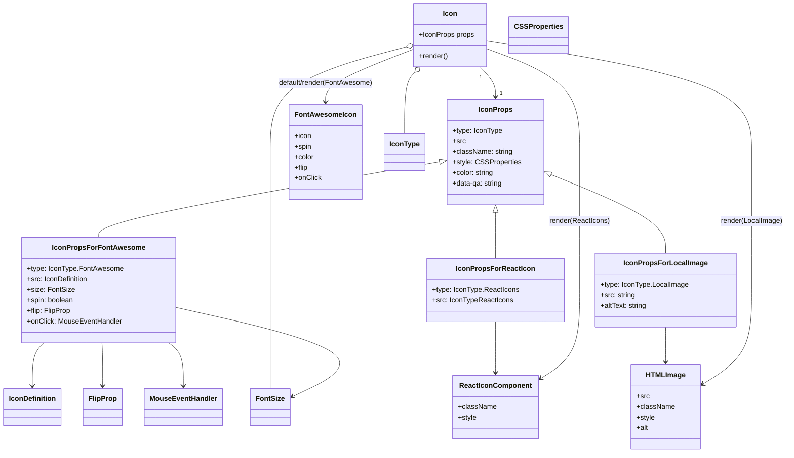

# Diagram: web/portal/src/components/atoms/Icon.atom.tsx

> Auto-generated by Obscura crawlers

## Mermaid

### SVG

<svg id="container" width="1741.962890625" xmlns="http://www.w3.org/2000/svg" class="classDiagram" height="1030" viewBox="0 0 1741.962890625 1030" role="graphics-document document" aria-roledescription="class"><g><defs><marker id="container_class-aggregationStart" class="marker aggregation class" refX="18" refY="7" markerWidth="190" markerHeight="240" orient="auto"><path d="M 18,7 L9,13 L1,7 L9,1 Z"></path></marker></defs><defs><marker id="container_class-aggregationEnd" class="marker aggregation class" refX="1" refY="7" markerWidth="20" markerHeight="28" orient="auto"><path d="M 18,7 L9,13 L1,7 L9,1 Z"></path></marker></defs><defs><marker id="container_class-extensionStart" class="marker extension class" refX="18" refY="7" markerWidth="190" markerHeight="240" orient="auto"><path d="M 1,7 L18,13 V 1 Z"></path></marker></defs><defs><marker id="container_class-extensionEnd" class="marker extension class" refX="1" refY="7" markerWidth="20" markerHeight="28" orient="auto"><path d="M 1,1 V 13 L18,7 Z"></path></marker></defs><defs><marker id="container_class-compositionStart" class="marker composition class" refX="18" refY="7" markerWidth="190" markerHeight="240" orient="auto"><path d="M 18,7 L9,13 L1,7 L9,1 Z"></path></marker></defs><defs><marker id="container_class-compositionEnd" class="marker composition class" refX="1" refY="7" markerWidth="20" markerHeight="28" orient="auto"><path d="M 18,7 L9,13 L1,7 L9,1 Z"></path></marker></defs><defs><marker id="container_class-dependencyStart" class="marker dependency class" refX="6" refY="7" markerWidth="190" markerHeight="240" orient="auto"><path d="M 5,7 L9,13 L1,7 L9,1 Z"></path></marker></defs><defs><marker id="container_class-dependencyEnd" class="marker dependency class" refX="13" refY="7" markerWidth="20" markerHeight="28" orient="auto"><path d="M 18,7 L9,13 L14,7 L9,1 Z"></path></marker></defs><defs><marker id="container_class-lollipopStart" class="marker lollipop class" refX="13" refY="7" markerWidth="190" markerHeight="240" orient="auto"><circle stroke="black" fill="transparent" cx="7" cy="7" r="6"></circle></marker></defs><defs><marker id="container_class-lollipopEnd" class="marker lollipop class" refX="1" refY="7" markerWidth="190" markerHeight="240" orient="auto"><circle stroke="black" fill="transparent" cx="7" cy="7" r="6"></circle></marker></defs><g class="root"><g class="clusters"></g><g class="edgePaths"><path d="M1063.871,152L1069.542,158.167C1075.212,164.333,1086.552,176.667,1092.222,188C1097.893,199.333,1097.893,209.667,1097.893,214.833L1097.893,220" id="id_Icon_IconProps_1" class="edge-thickness-normal edge-pattern-solid relation" style=";;;" data-edge="true" data-et="edge" data-id="id_Icon_IconProps_1" data-points="W3sieCI6MTA2My44NzEzODA0NDcyNDc3LCJ5IjoxNTJ9LHsieCI6MTA5Ny44OTI1NzgxMjUsInkiOjE4OX0seyJ4IjoxMDk3Ljg5MjU3ODEyNSwieSI6MjI2fV0=" marker-end="url(#container_class-dependencyEnd)"></path><path d="M975.102,367.892L848.799,390.41C722.496,412.928,469.889,457.964,343.586,486.649C217.283,515.333,217.283,527.667,217.283,533.833L217.283,540" id="id_IconProps_IconPropsForFontAwesome_2" class="edge-thickness-normal edge-pattern-solid relation" style=";;;" data-edge="true" data-et="edge" data-id="id_IconProps_IconPropsForFontAwesome_2" data-points="W3sieCI6OTkyLjA4Mzk4NDM3NSwieSI6MzY0Ljg2NDE1MjEzMTg2ODkzfSx7IngiOjIxNy4yODMyMDMxMjUsInkiOjUwM30seyJ4IjoyMTcuMjgzMjAzMTI1LCJ5Ijo1NDB9XQ==" marker-start="url(#container_class-extensionStart)"></path><path d="M1097.893,483.25L1097.893,486.542C1097.893,489.833,1097.893,496.417,1097.893,513.875C1097.893,531.333,1097.893,559.667,1097.893,573.833L1097.893,588" id="id_IconProps_IconPropsForReactIcon_3" class="edge-thickness-normal edge-pattern-solid relation" style=";;;" data-edge="true" data-et="edge" data-id="id_IconProps_IconPropsForReactIcon_3" data-points="W3sieCI6MTA5Ny44OTI1NzgxMjUsInkiOjQ2Nn0seyJ4IjoxMDk3Ljg5MjU3ODEyNSwieSI6NTAzfSx7IngiOjEwOTcuODkyNTc4MTI1LCJ5Ijo1ODh9XQ==" marker-start="url(#container_class-extensionStart)"></path><path d="M1219.619,396.83L1261.995,414.525C1304.37,432.22,1389.122,467.61,1431.497,497.472C1473.873,527.333,1473.873,551.667,1473.873,563.833L1473.873,576" id="id_IconProps_IconPropsForLocalImage_4" class="edge-thickness-normal edge-pattern-solid relation" style=";;;" data-edge="true" data-et="edge" data-id="id_IconProps_IconPropsForLocalImage_4" data-points="W3sieCI6MTIwMy43MDExNzE4NzUsInkiOjM5MC4xODMwMTEwODU1OTkxfSx7IngiOjE0NzMuODczMDQ2ODc1LCJ5Ijo1MDN9LHsieCI6MTQ3My44NzMwNDY4NzUsInkiOjU3Nn1d" marker-start="url(#container_class-extensionStart)"></path><path d="M898.608,106.838L848.064,120.531C797.519,134.225,696.431,161.613,645.886,201.473C595.342,241.333,595.342,293.667,595.342,346C595.342,398.333,595.342,450.667,595.342,503C595.342,555.333,595.342,607.667,595.342,658C595.342,708.333,595.342,756.667,595.342,794C595.342,831.333,595.342,857.667,595.342,870.833L595.342,884" id="id_Icon_FontSize_5" class="edge-thickness-normal edge-pattern-solid relation" style=";;;" data-edge="true" data-et="edge" data-id="id_Icon_FontSize_5" data-points="W3sieCI6OTE1LjI1NzgxMjUsInkiOjEwMi4zMjY5MjY5MDQ1NzM1fSx7IngiOjU5NS4zNDE3OTY4NzUsInkiOjE4OX0seyJ4Ijo1OTUuMzQxNzk2ODc1LCJ5IjozNDZ9LHsieCI6NTk1LjM0MTc5Njg3NSwieSI6NTAzfSx7IngiOjU5NS4zNDE3OTY4NzUsInkiOjY2MH0seyJ4Ijo1OTUuMzQxNzk2ODc1LCJ5Ijo4MDV9LHsieCI6NTk1LjM0MTc5Njg3NSwieSI6ODg0fV0=" marker-start="url(#container_class-aggregationStart)"></path><path d="M919.789,164.698L916.065,168.748C912.34,172.799,904.892,180.899,901.168,204.116C897.443,227.333,897.443,265.667,897.443,284.833L897.443,304" id="id_Icon_IconType_6" class="edge-thickness-normal edge-pattern-solid relation" style=";;;" data-edge="true" data-et="edge" data-id="id_Icon_IconType_6" data-points="W3sieCI6OTMxLjQ2NDU1NzA1Mjc1MjMsInkiOjE1Mn0seyJ4Ijo4OTcuNDQzMzU5Mzc1LCJ5IjoxODl9LHsieCI6ODk3LjQ0MzM1OTM3NSwieSI6MzA0fV0=" marker-start="url(#container_class-aggregationStart)"></path><path d="M96.409,780L92.212,784.167C88.015,788.333,79.621,796.667,75.424,813C71.227,829.333,71.227,853.667,71.227,865.833L71.227,878" id="id_IconPropsForFontAwesome_IconDefinition_7" class="edge-thickness-normal edge-pattern-solid relation" style=";;;" data-edge="true" data-et="edge" data-id="id_IconPropsForFontAwesome_IconDefinition_7" data-points="W3sieCI6OTYuNDA4NzQxOTE4MTAzNDQsInkiOjc4MH0seyJ4Ijo3MS4yMjY1NjI1LCJ5Ijo4MDV9LHsieCI6NzEuMjI2NTYyNSwieSI6ODg0fV0=" marker-end="url(#container_class-dependencyEnd)"></path><path d="M225.105,780L225.376,784.167C225.648,788.333,226.191,796.667,226.463,813C226.734,829.333,226.734,853.667,226.734,865.833L226.734,878" id="id_IconPropsForFontAwesome_FlipProp_8" class="edge-thickness-normal edge-pattern-solid relation" style=";;;" data-edge="true" data-et="edge" data-id="id_IconPropsForFontAwesome_FlipProp_8" data-points="W3sieCI6MjI1LjEwNDg2MjYwNzc1ODYzLCJ5Ijo3ODB9LHsieCI6MjI2LjczNDM3NSwieSI6ODA1fSx7IngiOjIyNi43MzQzNzUsInkiOjg4NH1d" marker-end="url(#container_class-dependencyEnd)"></path><path d="M371.917,780L377.287,784.167C382.656,788.333,393.394,796.667,398.764,813C404.133,829.333,404.133,853.667,404.133,865.833L404.133,878" id="id_IconPropsForFontAwesome_MouseEventHandler_9" class="edge-thickness-normal edge-pattern-solid relation" style=";;;" data-edge="true" data-et="edge" data-id="id_IconPropsForFontAwesome_MouseEventHandler_9" data-points="W3sieCI6MzcxLjkxNzM2MjYwNzc1ODYsInkiOjc4MH0seyJ4Ijo0MDQuMTMyODEyNSwieSI6ODA1fSx7IngiOjQwNC4xMzI4MTI1LCJ5Ijo4ODR9XQ==" marker-end="url(#container_class-dependencyEnd)"></path><path d="M386.74,699.043L463.386,716.703C540.033,734.362,693.325,769.681,736.133,803.635C778.942,837.589,711.267,870.177,677.429,886.471L643.591,902.766" id="id_IconPropsForFontAwesome_FontSize_10" class="edge-thickness-normal edge-pattern-solid relation" style=";;;" data-edge="true" data-et="edge" data-id="id_IconPropsForFontAwesome_FontSize_10" data-points="W3sieCI6Mzg2Ljc0MDIzNDM3NSwieSI6Njk5LjA0MzI5MDQzMjkwNDN9LHsieCI6ODQ2LjYxNzE4NzUsInkiOjgwNX0seyJ4Ijo2MzguMTg1NTQ2ODc1LCJ5Ijo5MDUuMzY4ODc1OTY4NjkxfV0=" marker-end="url(#container_class-dependencyEnd)"></path><path d="M1097.893,732L1097.893,744.167C1097.893,756.333,1097.893,780.667,1097.893,800C1097.893,819.333,1097.893,833.667,1097.893,840.833L1097.893,848" id="id_IconPropsForReactIcon_ReactIconComponent_11" class="edge-thickness-normal edge-pattern-solid relation" style=";;;" data-edge="true" data-et="edge" data-id="id_IconPropsForReactIcon_ReactIconComponent_11" data-points="W3sieCI6MTA5Ny44OTI1NzgxMjUsInkiOjczMn0seyJ4IjoxMDk3Ljg5MjU3ODEyNSwieSI6ODA1fSx7IngiOjEwOTcuODkyNTc4MTI1LCJ5Ijo4NTR9XQ==" marker-end="url(#container_class-dependencyEnd)"></path><path d="M1473.873,744L1473.873,754.167C1473.873,764.333,1473.873,784.667,1473.873,798C1473.873,811.333,1473.873,817.667,1473.873,820.833L1473.873,824" id="id_IconPropsForLocalImage_HTMLImage_12" class="edge-thickness-normal edge-pattern-solid relation" style=";;;" data-edge="true" data-et="edge" data-id="id_IconPropsForLocalImage_HTMLImage_12" data-points="W3sieCI6MTQ3My44NzMwNDY4NzUsInkiOjc0NH0seyJ4IjoxNDczLjg3MzA0Njg3NSwieSI6ODA1fSx7IngiOjE0NzMuODczMDQ2ODc1LCJ5Ijo4MzB9XQ==" marker-end="url(#container_class-dependencyEnd)"></path><path d="M915.258,112.903L883.492,125.586C851.726,138.269,788.194,163.634,756.428,183.484C724.662,203.333,724.662,217.667,724.662,224.833L724.662,232" id="id_Icon_FontAwesomeIcon_13" class="edge-thickness-normal edge-pattern-solid relation" style=";;;" data-edge="true" data-et="edge" data-id="id_Icon_FontAwesomeIcon_13" data-points="W3sieCI6OTE1LjI1NzgxMjUsInkiOjExMi45MDI5ODI1NjUzMzUyOH0seyJ4Ijo3MjQuNjYyMTA5Mzc1LCJ5IjoxODl9LHsieCI6NzI0LjY2MjEwOTM3NSwieSI6MjM4fV0=" marker-end="url(#container_class-dependencyEnd)"></path><path d="M1080.078,111.394L1114.032,124.328C1147.985,137.262,1215.892,163.131,1249.845,202.232C1283.799,241.333,1283.799,293.667,1283.799,346C1283.799,398.333,1283.799,450.667,1283.799,503C1283.799,555.333,1283.799,607.667,1283.799,658C1283.799,708.333,1283.799,756.667,1269.274,790.287C1254.75,823.907,1225.701,842.814,1211.176,852.268L1196.652,861.721" id="id_Icon_ReactIconComponent_14" class="edge-thickness-normal edge-pattern-solid relation" style=";;;" data-edge="true" data-et="edge" data-id="id_Icon_ReactIconComponent_14" data-points="W3sieCI6MTA4MC4wNzgxMjUsInkiOjExMS4zOTM3MDIzNDYwOTExfSx7IngiOjEyODMuNzk4ODI4MTI1LCJ5IjoxODl9LHsieCI6MTI4My43OTg4MjgxMjUsInkiOjM0Nn0seyJ4IjoxMjgzLjc5ODgyODEyNSwieSI6NTAzfSx7IngiOjEyODMuNzk4ODI4MTI1LCJ5Ijo2NjB9LHsieCI6MTI4My43OTg4MjgxMjUsInkiOjgwNX0seyJ4IjoxMTkxLjYyMzA0Njg3NSwieSI6ODY0Ljk5NDA1MzYyMjQ1NzZ9XQ==" marker-end="url(#container_class-dependencyEnd)"></path><path d="M1080.078,93.482L1177.39,109.402C1274.701,125.321,1469.324,157.161,1566.636,199.247C1663.947,241.333,1663.947,293.667,1663.947,346C1663.947,398.333,1663.947,450.667,1663.947,503C1663.947,555.333,1663.947,607.667,1663.947,658C1663.947,708.333,1663.947,756.667,1645.743,792.422C1627.539,828.177,1591.131,851.354,1572.928,862.943L1554.724,874.531" id="id_Icon_HTMLImage_15" class="edge-thickness-normal edge-pattern-solid relation" style=";;;" data-edge="true" data-et="edge" data-id="id_Icon_HTMLImage_15" data-points="W3sieCI6MTA4MC4wNzgxMjUsInkiOjkzLjQ4MTg5NDI2NDczMzkxfSx7IngiOjE2NjMuOTQ3MjY1NjI1LCJ5IjoxODl9LHsieCI6MTY2My45NDcyNjU2MjUsInkiOjM0Nn0seyJ4IjoxNjYzLjk0NzI2NTYyNSwieSI6NTAzfSx7IngiOjE2NjMuOTQ3MjY1NjI1LCJ5Ijo2NjB9LHsieCI6MTY2My45NDcyNjU2MjUsInkiOjgwNX0seyJ4IjoxNTQ5LjY2MjEwOTM3NSwieSI6ODc3Ljc1MzE4MDI5NTUyNn1d" marker-end="url(#container_class-dependencyEnd)"></path></g><g class="edgeLabels"><g class="edgeLabel"><g class="label" data-id="id_Icon_IconProps_1" transform="translate(0, 0)"><foreignObject width="0" height="0">

</foreignObject></g></g><g class="edgeLabel"><g class="label" data-id="id_IconProps_IconPropsForFontAwesome_2" transform="translate(0, 0)"><foreignObject width="0" height="0">

</foreignObject></g></g><g class="edgeLabel"><g class="label" data-id="id_IconProps_IconPropsForReactIcon_3" transform="translate(0, 0)"><foreignObject width="0" height="0">

</foreignObject></g></g><g class="edgeLabel"><g class="label" data-id="id_IconProps_IconPropsForLocalImage_4" transform="translate(0, 0)"><foreignObject width="0" height="0">

</foreignObject></g></g><g class="edgeLabel"><g class="label" data-id="id_Icon_FontSize_5" transform="translate(0, 0)"><foreignObject width="0" height="0">

</foreignObject></g></g><g class="edgeLabel"><g class="label" data-id="id_Icon_IconType_6" transform="translate(0, 0)"><foreignObject width="0" height="0">

</foreignObject></g></g><g class="edgeLabel"><g class="label" data-id="id_IconPropsForFontAwesome_IconDefinition_7" transform="translate(0, 0)"><foreignObject width="0" height="0">

</foreignObject></g></g><g class="edgeLabel"><g class="label" data-id="id_IconPropsForFontAwesome_FlipProp_8" transform="translate(0, 0)"><foreignObject width="0" height="0">

</foreignObject></g></g><g class="edgeLabel"><g class="label" data-id="id_IconPropsForFontAwesome_MouseEventHandler_9" transform="translate(0, 0)"><foreignObject width="0" height="0">

</foreignObject></g></g><g class="edgeLabel"><g class="label" data-id="id_IconPropsForFontAwesome_FontSize_10" transform="translate(0, 0)"><foreignObject width="0" height="0">

</foreignObject></g></g><g class="edgeLabel"><g class="label" data-id="id_IconPropsForReactIcon_ReactIconComponent_11" transform="translate(0, 0)"><foreignObject width="0" height="0">

</foreignObject></g></g><g class="edgeLabel"><g class="label" data-id="id_IconPropsForLocalImage_HTMLImage_12" transform="translate(0, 0)"><foreignObject width="0" height="0">

</foreignObject></g></g><g class="edgeLabel" transform="translate(724.662109375, 189)"><g class="label" data-id="id_Icon_FontAwesomeIcon_13" transform="translate(-109.3203125, -12)"><foreignObject width="218.640625" height="24">

default/render(FontAwesome)

</foreignObject></g></g><g class="edgeLabel" transform="translate(1283.798828125, 503)"><g class="label" data-id="id_Icon_ReactIconComponent_14" transform="translate(-68.5, -12)"><foreignObject width="137" height="24">

render(ReactIcons)

</foreignObject></g></g><g class="edgeLabel" transform="translate(1663.947265625, 503)"><g class="label" data-id="id_Icon_HTMLImage_15" transform="translate(-70.015625, -12)"><foreignObject width="140.03125" height="24">

render(LocalImage)

</foreignObject></g></g><g class="edgeTerminals" transform="translate(1064.674564836645, 175.03486385058642)"><g class="inner" transform="translate(0, 0)"><foreignObject style="width: 9px; height: 12px;">
1
</foreignObject></g></g><g class="edgeTerminals" transform="translate(1107.8925790624999, 203.5000008035714)"><g class="inner" transform="translate(0, 0)"></g><foreignObject style="width: 9px; height: 12px;">
1
</foreignObject></g></g><g class="nodes"><g class="node default" id="classId-Icon-0" transform="translate(997.66796875, 80)"><g class="basic label-container"><path d="M-82.41015625 -72 L82.41015625 -72 L82.41015625 72 L-82.41015625 72" stroke="none" stroke-width="0" fill="#ECECFF" style=""></path><path d="M-82.41015625 -72 C-24.555437424096617 -72, 33.299281401806766 -72, 82.41015625 -72 M-82.41015625 -72 C-47.20402865914907 -72, -11.997901068298134 -72, 82.41015625 -72 M82.41015625 -72 C82.41015625 -20.202972082087086, 82.41015625 31.594055835825827, 82.41015625 72 M82.41015625 -72 C82.41015625 -22.65554192274115, 82.41015625 26.6889161545177, 82.41015625 72 M82.41015625 72 C42.058452620603916 72, 1.7067489912078315 72, -82.41015625 72 M82.41015625 72 C21.572360102137807 72, -39.265436045724385 72, -82.41015625 72 M-82.41015625 72 C-82.41015625 27.682356461438005, -82.41015625 -16.63528707712399, -82.41015625 -72 M-82.41015625 72 C-82.41015625 28.455667282200878, -82.41015625 -15.088665435598244, -82.41015625 -72" stroke="#9370DB" stroke-width="1.3" fill="none" stroke-dasharray="0 0" style=""></path></g><g class="annotation-group text" transform="translate(0, -48)"></g><g class="label-group text" transform="translate(-15.3046875, -48)"><g class="label" style="font-weight: bolder" transform="translate(0,-12)"><foreignObject width="30.609375" height="24">

Icon

</foreignObject></g></g><g class="members-group text" transform="translate(-70.41015625, 0)"><g class="label" style="" transform="translate(0,-12)"><foreignObject width="125.515625" height="24">

+IconProps props

</foreignObject></g></g><g class="methods-group text" transform="translate(-70.41015625, 48)"><g class="label" style="" transform="translate(0,-12)"><foreignObject width="66.609375" height="24">

+render()

</foreignObject></g></g><g class="divider" style=""><path d="M-82.41015625 -24 C-47.81927419445409 -24, -13.228392138908177 -24, 82.41015625 -24 M-82.41015625 -24 C-48.31020864020544 -24, -14.210261030410877 -24, 82.41015625 -24" stroke="#9370DB" stroke-width="1.3" fill="none" stroke-dasharray="0 0" style=""></path></g><g class="divider" style=""><path d="M-82.41015625 24 C-29.813114470106207 24, 22.783927309787586 24, 82.41015625 24 M-82.41015625 24 C-20.430106803434462 24, 41.549942643131075 24, 82.41015625 24" stroke="#9370DB" stroke-width="1.3" fill="none" stroke-dasharray="0 0" style=""></path></g></g><g class="node default" id="classId-IconProps-1" transform="translate(1097.892578125, 346)"><g class="basic label-container"><path d="M-105.80859375 -120 L105.80859375 -120 L105.80859375 120 L-105.80859375 120" stroke="none" stroke-width="0" fill="#ECECFF" style=""></path><path d="M-105.80859375 -120 C-36.74242207109454 -120, 32.323749607810925 -120, 105.80859375 -120 M-105.80859375 -120 C-38.458540762928564 -120, 28.891512224142872 -120, 105.80859375 -120 M105.80859375 -120 C105.80859375 -36.11785843274701, 105.80859375 47.76428313450597, 105.80859375 120 M105.80859375 -120 C105.80859375 -64.57260156200357, 105.80859375 -9.14520312400714, 105.80859375 120 M105.80859375 120 C49.4597806299704 120, -6.8890324900591935 120, -105.80859375 120 M105.80859375 120 C24.78805757701474 120, -56.23247859597052 120, -105.80859375 120 M-105.80859375 120 C-105.80859375 58.50315497833098, -105.80859375 -2.9936900433380345, -105.80859375 -120 M-105.80859375 120 C-105.80859375 52.435082426367245, -105.80859375 -15.12983514726551, -105.80859375 -120" stroke="#9370DB" stroke-width="1.3" fill="none" stroke-dasharray="0 0" style=""></path></g><g class="annotation-group text" transform="translate(0, -96)"></g><g class="label-group text" transform="translate(-36.2265625, -96)"><g class="label" style="font-weight: bolder" transform="translate(0,-12)"><foreignObject width="72.453125" height="24">

IconProps

</foreignObject></g></g><g class="members-group text" transform="translate(-93.80859375, -48)"><g class="label" style="" transform="translate(0,-12)"><foreignObject width="112.28125" height="24">

+type: IconType

</foreignObject></g><g class="label" style="" transform="translate(0,12)"><foreignObject width="28.8125" height="24">

+src

</foreignObject></g><g class="label" style="" transform="translate(0,36)"><foreignObject width="135.359375" height="24">

+className: string

</foreignObject></g><g class="label" style="" transform="translate(0,60)"><foreignObject width="151.390625" height="24">

+style: CSSProperties

</foreignObject></g><g class="label" style="" transform="translate(0,84)"><foreignObject width="94.65625" height="24">

+color: string

</foreignObject></g><g class="label" style="" transform="translate(0,108)"><foreignObject width="114.90625" height="24">

+data-qa: string

</foreignObject></g></g><g class="methods-group text" transform="translate(-93.80859375, 120)"></g><g class="divider" style=""><path d="M-105.80859375 -72 C-25.305855666818246 -72, 55.19688241636351 -72, 105.80859375 -72 M-105.80859375 -72 C-56.71999199419453 -72, -7.631390238389059 -72, 105.80859375 -72" stroke="#9370DB" stroke-width="1.3" fill="none" stroke-dasharray="0 0" style=""></path></g><g class="divider" style=""><path d="M-105.80859375 96 C-40.156838033390585 96, 25.49491768321883 96, 105.80859375 96 M-105.80859375 96 C-47.42925828121981 96, 10.950077187560382 96, 105.80859375 96" stroke="#9370DB" stroke-width="1.3" fill="none" stroke-dasharray="0 0" style=""></path></g></g><g class="node default" id="classId-IconPropsForFontAwesome-2" transform="translate(217.283203125, 660)"><g class="basic label-container"><path d="M-169.45703125 -120 L169.45703125 -120 L169.45703125 120 L-169.45703125 120" stroke="none" stroke-width="0" fill="#ECECFF" style=""></path><path d="M-169.45703125 -120 C-92.46396661711633 -120, -15.470901984232654 -120, 169.45703125 -120 M-169.45703125 -120 C-47.81232314404619 -120, 73.83238496190762 -120, 169.45703125 -120 M169.45703125 -120 C169.45703125 -51.16865357593704, 169.45703125 17.662692848125914, 169.45703125 120 M169.45703125 -120 C169.45703125 -67.54614829401035, 169.45703125 -15.092296588020716, 169.45703125 120 M169.45703125 120 C56.02701786048391 120, -57.40299552903218 120, -169.45703125 120 M169.45703125 120 C71.40121978626522 120, -26.65459167746957 120, -169.45703125 120 M-169.45703125 120 C-169.45703125 28.402502417077443, -169.45703125 -63.194995165845114, -169.45703125 -120 M-169.45703125 120 C-169.45703125 29.805740975428705, -169.45703125 -60.38851804914259, -169.45703125 -120" stroke="#9370DB" stroke-width="1.3" fill="none" stroke-dasharray="0 0" style=""></path></g><g class="annotation-group text" transform="translate(0, -96)"></g><g class="label-group text" transform="translate(-98.5546875, -96)"><g class="label" style="font-weight: bolder" transform="translate(0,-12)"><foreignObject width="197.109375" height="24">

IconPropsForFontAwesome

</foreignObject></g></g><g class="members-group text" transform="translate(-157.45703125, -48)"><g class="label" style="" transform="translate(0,-12)"><foreignObject width="216.359375" height="24">

+type: IconType.FontAwesome

</foreignObject></g><g class="label" style="" transform="translate(0,12)"><foreignObject width="138.84375" height="24">

+src: IconDefinition

</foreignObject></g><g class="label" style="" transform="translate(0,36)"><foreignObject width="104.28125" height="24">

+size: FontSize

</foreignObject></g><g class="label" style="" transform="translate(0,60)"><foreignObject width="106.375" height="24">

+spin: boolean

</foreignObject></g><g class="label" style="" transform="translate(0,84)"><foreignObject width="99.234375" height="24">

+flip: FlipProp

</foreignObject></g><g class="label" style="" transform="translate(0,108)"><foreignObject width="213.9375" height="24">

+onClick: MouseEventHandler

</foreignObject></g></g><g class="methods-group text" transform="translate(-157.45703125, 120)"></g><g class="divider" style=""><path d="M-169.45703125 -72 C-58.86564306948192 -72, 51.72574511103616 -72, 169.45703125 -72 M-169.45703125 -72 C-100.00714405593824 -72, -30.557256861876482 -72, 169.45703125 -72" stroke="#9370DB" stroke-width="1.3" fill="none" stroke-dasharray="0 0" style=""></path></g><g class="divider" style=""><path d="M-169.45703125 96 C-47.63531556743399 96, 74.18640011513202 96, 169.45703125 96 M-169.45703125 96 C-51.59046338722837 96, 66.27610447554326 96, 169.45703125 96" stroke="#9370DB" stroke-width="1.3" fill="none" stroke-dasharray="0 0" style=""></path></g></g><g class="node default" id="classId-IconPropsForReactIcon-3" transform="translate(1097.892578125, 660)"><g class="basic label-container"><path d="M-150.90625 -72 L150.90625 -72 L150.90625 72 L-150.90625 72" stroke="none" stroke-width="0" fill="#ECECFF" style=""></path><path d="M-150.90625 -72 C-78.63517122541798 -72, -6.364092450835955 -72, 150.90625 -72 M-150.90625 -72 C-50.108766119657844 -72, 50.68871776068431 -72, 150.90625 -72 M150.90625 -72 C150.90625 -27.365336792587563, 150.90625 17.269326414824874, 150.90625 72 M150.90625 -72 C150.90625 -38.21733597987606, 150.90625 -4.434671959752123, 150.90625 72 M150.90625 72 C61.693443167776095 72, -27.51936366444781 72, -150.90625 72 M150.90625 72 C61.214698401053155 72, -28.47685319789369 72, -150.90625 72 M-150.90625 72 C-150.90625 37.47594733450671, -150.90625 2.951894669013413, -150.90625 -72 M-150.90625 72 C-150.90625 21.56347204508738, -150.90625 -28.87305590982524, -150.90625 -72" stroke="#9370DB" stroke-width="1.3" fill="none" stroke-dasharray="0 0" style=""></path></g><g class="annotation-group text" transform="translate(0, -48)"></g><g class="label-group text" transform="translate(-83.484375, -48)"><g class="label" style="font-weight: bolder" transform="translate(0,-12)"><foreignObject width="166.96875" height="24">

IconPropsForReactIcon

</foreignObject></g></g><g class="members-group text" transform="translate(-138.90625, 0)"><g class="label" style="" transform="translate(0,-12)"><foreignObject width="194.328125" height="24">

+type: IconType.ReactIcons

</foreignObject></g><g class="label" style="" transform="translate(0,12)"><foreignObject width="179.8125" height="24">

+src: IconTypeReactIcons

</foreignObject></g></g><g class="methods-group text" transform="translate(-138.90625, 72)"></g><g class="divider" style=""><path d="M-150.90625 -24 C-56.11843465658579 -24, 38.66938068682842 -24, 150.90625 -24 M-150.90625 -24 C-35.87532469974393 -24, 79.15560060051214 -24, 150.90625 -24" stroke="#9370DB" stroke-width="1.3" fill="none" stroke-dasharray="0 0" style=""></path></g><g class="divider" style=""><path d="M-150.90625 48 C-52.31173477308732 48, 46.28278045382535 48, 150.90625 48 M-150.90625 48 C-79.56810719357081 48, -8.22996438714162 48, 150.90625 48" stroke="#9370DB" stroke-width="1.3" fill="none" stroke-dasharray="0 0" style=""></path></g></g><g class="node default" id="classId-IconPropsForLocalImage-4" transform="translate(1473.873046875, 660)"><g class="basic label-container"><path d="M-155.07421875 -84 L155.07421875 -84 L155.07421875 84 L-155.07421875 84" stroke="none" stroke-width="0" fill="#ECECFF" style=""></path><path d="M-155.07421875 -84 C-31.610017298552947 -84, 91.8541841528941 -84, 155.07421875 -84 M-155.07421875 -84 C-48.59210426271494 -84, 57.89001022457012 -84, 155.07421875 -84 M155.07421875 -84 C155.07421875 -40.80056619500219, 155.07421875 2.3988676099956194, 155.07421875 84 M155.07421875 -84 C155.07421875 -31.060524131968123, 155.07421875 21.878951736063755, 155.07421875 84 M155.07421875 84 C56.15711393467477 84, -42.75999088065046 84, -155.07421875 84 M155.07421875 84 C65.50265027568207 84, -24.068918198635856 84, -155.07421875 84 M-155.07421875 84 C-155.07421875 44.096604819728356, -155.07421875 4.193209639456711, -155.07421875 -84 M-155.07421875 84 C-155.07421875 45.39366066336622, -155.07421875 6.787321326732439, -155.07421875 -84" stroke="#9370DB" stroke-width="1.3" fill="none" stroke-dasharray="0 0" style=""></path></g><g class="annotation-group text" transform="translate(0, -60)"></g><g class="label-group text" transform="translate(-88.7890625, -60)"><g class="label" style="font-weight: bolder" transform="translate(0,-12)"><foreignObject width="177.578125" height="24">

IconPropsForLocalImage

</foreignObject></g></g><g class="members-group text" transform="translate(-143.07421875, -12)"><g class="label" style="" transform="translate(0,-12)"><foreignObject width="197.359375" height="24">

+type: IconType.LocalImage

</foreignObject></g><g class="label" style="" transform="translate(0,12)"><foreignObject width="78.578125" height="24">

+src: string

</foreignObject></g><g class="label" style="" transform="translate(0,36)"><foreignObject width="106.046875" height="24">

+altText: string

</foreignObject></g></g><g class="methods-group text" transform="translate(-143.07421875, 84)"></g><g class="divider" style=""><path d="M-155.07421875 -36 C-86.81601050632507 -36, -18.557802262650142 -36, 155.07421875 -36 M-155.07421875 -36 C-85.61909200863683 -36, -16.163965267273653 -36, 155.07421875 -36" stroke="#9370DB" stroke-width="1.3" fill="none" stroke-dasharray="0 0" style=""></path></g><g class="divider" style=""><path d="M-155.07421875 60 C-50.01654637299649 60, 55.041126004007026 60, 155.07421875 60 M-155.07421875 60 C-81.54809063357442 60, -8.021962517148836 60, 155.07421875 60" stroke="#9370DB" stroke-width="1.3" fill="none" stroke-dasharray="0 0" style=""></path></g></g><g class="node default" id="classId-FontAwesomeIcon-5" transform="translate(724.662109375, 346)"><g class="basic label-container"><path d="M-78.140625 -108 L78.140625 -108 L78.140625 108 L-78.140625 108" stroke="none" stroke-width="0" fill="#ECECFF" style=""></path><path d="M-78.140625 -108 C-28.24127499490224 -108, 21.658075010195518 -108, 78.140625 -108 M-78.140625 -108 C-22.642320147688125 -108, 32.85598470462375 -108, 78.140625 -108 M78.140625 -108 C78.140625 -36.31256485864375, 78.140625 35.37487028271249, 78.140625 108 M78.140625 -108 C78.140625 -33.57510984001681, 78.140625 40.849780319966385, 78.140625 108 M78.140625 108 C25.958915400662555 108, -26.22279419867489 108, -78.140625 108 M78.140625 108 C30.662082548666653 108, -16.816459902666693 108, -78.140625 108 M-78.140625 108 C-78.140625 54.753430659252956, -78.140625 1.506861318505912, -78.140625 -108 M-78.140625 108 C-78.140625 46.94161432674704, -78.140625 -14.116771346505914, -78.140625 -108" stroke="#9370DB" stroke-width="1.3" fill="none" stroke-dasharray="0 0" style=""></path></g><g class="annotation-group text" transform="translate(0, -84)"></g><g class="label-group text" transform="translate(-66.140625, -84)"><g class="label" style="font-weight: bolder" transform="translate(0,-12)"><foreignObject width="132.28125" height="24">

FontAwesomeIcon

</foreignObject></g></g><g class="members-group text" transform="translate(-66.140625, -36)"><g class="label" style="" transform="translate(0,-12)"><foreignObject width="38.546875" height="24">

+icon

</foreignObject></g><g class="label" style="" transform="translate(0,12)"><foreignObject width="38.859375" height="24">

+spin

</foreignObject></g><g class="label" style="" transform="translate(0,36)"><foreignObject width="44.796875" height="24">

+color

</foreignObject></g><g class="label" style="" transform="translate(0,60)"><foreignObject width="31.234375" height="24">

+flip

</foreignObject></g><g class="label" style="" transform="translate(0,84)"><foreignObject width="60.546875" height="24">

+onClick

</foreignObject></g></g><g class="methods-group text" transform="translate(-66.140625, 108)"></g><g class="divider" style=""><path d="M-78.140625 -60 C-38.275014200019896 -60, 1.5905965999602074 -60, 78.140625 -60 M-78.140625 -60 C-42.01828611783495 -60, -5.895947235669894 -60, 78.140625 -60" stroke="#9370DB" stroke-width="1.3" fill="none" stroke-dasharray="0 0" style=""></path></g><g class="divider" style=""><path d="M-78.140625 84 C-41.290921058940214 84, -4.441217117880427 84, 78.140625 84 M-78.140625 84 C-42.035611659927 84, -5.930598319853999 84, 78.140625 84" stroke="#9370DB" stroke-width="1.3" fill="none" stroke-dasharray="0 0" style=""></path></g></g><g class="node default" id="classId-ReactIconComponent-6" transform="translate(1097.892578125, 926)"><g class="basic label-container"><path d="M-93.73046875 -72 L93.73046875 -72 L93.73046875 72 L-93.73046875 72" stroke="none" stroke-width="0" fill="#ECECFF" style=""></path><path d="M-93.73046875 -72 C-47.52104573521895 -72, -1.3116227204378959 -72, 93.73046875 -72 M-93.73046875 -72 C-38.382338271078524 -72, 16.965792207842952 -72, 93.73046875 -72 M93.73046875 -72 C93.73046875 -17.111352000202288, 93.73046875 37.777295999595424, 93.73046875 72 M93.73046875 -72 C93.73046875 -19.997104928872346, 93.73046875 32.00579014225531, 93.73046875 72 M93.73046875 72 C37.997340253972645 72, -17.73578824205471 72, -93.73046875 72 M93.73046875 72 C29.65612969684372 72, -34.41820935631256 72, -93.73046875 72 M-93.73046875 72 C-93.73046875 26.846099817552023, -93.73046875 -18.307800364895954, -93.73046875 -72 M-93.73046875 72 C-93.73046875 36.16504368467068, -93.73046875 0.3300873693413564, -93.73046875 -72" stroke="#9370DB" stroke-width="1.3" fill="none" stroke-dasharray="0 0" style=""></path></g><g class="annotation-group text" transform="translate(0, -48)"></g><g class="label-group text" transform="translate(-77.8203125, -48)"><g class="label" style="font-weight: bolder" transform="translate(0,-12)"><foreignObject width="155.640625" height="24">

ReactIconComponent

</foreignObject></g></g><g class="members-group text" transform="translate(-81.73046875, 0)"><g class="label" style="" transform="translate(0,-12)"><foreignObject width="85.640625" height="24">

+className

</foreignObject></g><g class="label" style="" transform="translate(0,12)"><foreignObject width="42.359375" height="24">

+style

</foreignObject></g></g><g class="methods-group text" transform="translate(-81.73046875, 72)"></g><g class="divider" style=""><path d="M-93.73046875 -24 C-23.528835025007368 -24, 46.672798699985265 -24, 93.73046875 -24 M-93.73046875 -24 C-24.365031837154106 -24, 45.00040507569179 -24, 93.73046875 -24" stroke="#9370DB" stroke-width="1.3" fill="none" stroke-dasharray="0 0" style=""></path></g><g class="divider" style=""><path d="M-93.73046875 48 C-32.64902778868352 48, 28.432413172632963 48, 93.73046875 48 M-93.73046875 48 C-45.45352057419387 48, 2.8234276016122664 48, 93.73046875 48" stroke="#9370DB" stroke-width="1.3" fill="none" stroke-dasharray="0 0" style=""></path></g></g><g class="node default" id="classId-HTMLImage-7" transform="translate(1473.873046875, 926)"><g class="basic label-container"><path d="M-75.7890625 -96 L75.7890625 -96 L75.7890625 96 L-75.7890625 96" stroke="none" stroke-width="0" fill="#ECECFF" style=""></path><path d="M-75.7890625 -96 C-41.60091734669319 -96, -7.412772193386374 -96, 75.7890625 -96 M-75.7890625 -96 C-28.750323530369194 -96, 18.288415439261613 -96, 75.7890625 -96 M75.7890625 -96 C75.7890625 -48.81824858415784, 75.7890625 -1.6364971683156853, 75.7890625 96 M75.7890625 -96 C75.7890625 -29.429558883207633, 75.7890625 37.14088223358473, 75.7890625 96 M75.7890625 96 C17.829452952198068 96, -40.130156595603864 96, -75.7890625 96 M75.7890625 96 C25.389809168397655 96, -25.00944416320469 96, -75.7890625 96 M-75.7890625 96 C-75.7890625 25.491582695042354, -75.7890625 -45.01683460991529, -75.7890625 -96 M-75.7890625 96 C-75.7890625 24.853006327943447, -75.7890625 -46.293987344113106, -75.7890625 -96" stroke="#9370DB" stroke-width="1.3" fill="none" stroke-dasharray="0 0" style=""></path></g><g class="annotation-group text" transform="translate(0, -72)"></g><g class="label-group text" transform="translate(-41.9375, -72)"><g class="label" style="font-weight: bolder" transform="translate(0,-12)"><foreignObject width="83.875" height="24">

HTMLImage

</foreignObject></g></g><g class="members-group text" transform="translate(-63.7890625, -24)"><g class="label" style="" transform="translate(0,-12)"><foreignObject width="28.8125" height="24">

+src

</foreignObject></g><g class="label" style="" transform="translate(0,12)"><foreignObject width="85.640625" height="24">

+className

</foreignObject></g><g class="label" style="" transform="translate(0,36)"><foreignObject width="42.359375" height="24">

+style

</foreignObject></g><g class="label" style="" transform="translate(0,60)"><foreignObject width="26.765625" height="24">

+alt

</foreignObject></g></g><g class="methods-group text" transform="translate(-63.7890625, 96)"></g><g class="divider" style=""><path d="M-75.7890625 -48 C-28.997410249787286 -48, 17.794242000425427 -48, 75.7890625 -48 M-75.7890625 -48 C-23.803615341632955 -48, 28.18183181673409 -48, 75.7890625 -48" stroke="#9370DB" stroke-width="1.3" fill="none" stroke-dasharray="0 0" style=""></path></g><g class="divider" style=""><path d="M-75.7890625 72 C-40.834994542793446 72, -5.8809265855868915 72, 75.7890625 72 M-75.7890625 72 C-41.811914532874475 72, -7.83476656574895 72, 75.7890625 72" stroke="#9370DB" stroke-width="1.3" fill="none" stroke-dasharray="0 0" style=""></path></g></g><g class="node default" id="classId-FontSize-8" transform="translate(595.341796875, 926)"><g class="basic label-container"><path d="M-42.84375 -42 L42.84375 -42 L42.84375 42 L-42.84375 42" stroke="none" stroke-width="0" fill="#ECECFF" style=""></path><path d="M-42.84375 -42 C-12.652289380933222 -42, 17.539171238133555 -42, 42.84375 -42 M-42.84375 -42 C-25.639436358007558 -42, -8.435122716015115 -42, 42.84375 -42 M42.84375 -42 C42.84375 -22.461360920962324, 42.84375 -2.9227218419246483, 42.84375 42 M42.84375 -42 C42.84375 -25.060976089184518, 42.84375 -8.121952178369035, 42.84375 42 M42.84375 42 C18.575414876025718 42, -5.692920247948564 42, -42.84375 42 M42.84375 42 C12.45127775984992 42, -17.94119448030016 42, -42.84375 42 M-42.84375 42 C-42.84375 9.0020162400386, -42.84375 -23.9959675199228, -42.84375 -42 M-42.84375 42 C-42.84375 13.689438325932393, -42.84375 -14.621123348135214, -42.84375 -42" stroke="#9370DB" stroke-width="1.3" fill="none" stroke-dasharray="0 0" style=""></path></g><g class="annotation-group text" transform="translate(0, -18)"></g><g class="label-group text" transform="translate(-30.84375, -18)"><g class="label" style="font-weight: bolder" transform="translate(0,-12)"><foreignObject width="61.6875" height="24">

FontSize

</foreignObject></g></g><g class="members-group text" transform="translate(-30.84375, 30)"></g><g class="methods-group text" transform="translate(-30.84375, 60)"></g><g class="divider" style=""><path d="M-42.84375 6 C-10.13082978359764 6, 22.58209043280472 6, 42.84375 6 M-42.84375 6 C-23.064029949414635 6, -3.284309898829271 6, 42.84375 6" stroke="#9370DB" stroke-width="1.3" fill="none" stroke-dasharray="0 0" style=""></path></g><g class="divider" style=""><path d="M-42.84375 24 C-21.50933674764966 24, -0.17492349529931772 24, 42.84375 24 M-42.84375 24 C-18.712090479463377 24, 5.419569041073245 24, 42.84375 24" stroke="#9370DB" stroke-width="1.3" fill="none" stroke-dasharray="0 0" style=""></path></g></g><g class="node default" id="classId-IconType-9" transform="translate(897.443359375, 346)"><g class="basic label-container"><path d="M-44.640625 -42 L44.640625 -42 L44.640625 42 L-44.640625 42" stroke="none" stroke-width="0" fill="#ECECFF" style=""></path><path d="M-44.640625 -42 C-23.720545297308654 -42, -2.8004655946173074 -42, 44.640625 -42 M-44.640625 -42 C-23.333899382381635 -42, -2.027173764763269 -42, 44.640625 -42 M44.640625 -42 C44.640625 -24.33474969321329, 44.640625 -6.66949938642658, 44.640625 42 M44.640625 -42 C44.640625 -18.67038667262078, 44.640625 4.6592266547584416, 44.640625 42 M44.640625 42 C20.43170750008633 42, -3.777209999827342 42, -44.640625 42 M44.640625 42 C20.79589938742613 42, -3.0488262251477423 42, -44.640625 42 M-44.640625 42 C-44.640625 15.0426104886557, -44.640625 -11.914779022688599, -44.640625 -42 M-44.640625 42 C-44.640625 24.99374935954015, -44.640625 7.9874987190803, -44.640625 -42" stroke="#9370DB" stroke-width="1.3" fill="none" stroke-dasharray="0 0" style=""></path></g><g class="annotation-group text" transform="translate(0, -18)"></g><g class="label-group text" transform="translate(-32.640625, -18)"><g class="label" style="font-weight: bolder" transform="translate(0,-12)"><foreignObject width="65.28125" height="24">

IconType

</foreignObject></g></g><g class="members-group text" transform="translate(-32.640625, 30)"></g><g class="methods-group text" transform="translate(-32.640625, 60)"></g><g class="divider" style=""><path d="M-44.640625 6 C-20.72006368752606 6, 3.2004976249478787 6, 44.640625 6 M-44.640625 6 C-9.40774278736761 6, 25.82513942526478 6, 44.640625 6" stroke="#9370DB" stroke-width="1.3" fill="none" stroke-dasharray="0 0" style=""></path></g><g class="divider" style=""><path d="M-44.640625 24 C-11.624752114837754 24, 21.39112077032449 24, 44.640625 24 M-44.640625 24 C-10.511659281990596 24, 23.617306436018808 24, 44.640625 24" stroke="#9370DB" stroke-width="1.3" fill="none" stroke-dasharray="0 0" style=""></path></g></g><g class="node default" id="classId-FlipProp-10" transform="translate(226.734375, 926)"><g class="basic label-container"><path d="M-42.28125 -42 L42.28125 -42 L42.28125 42 L-42.28125 42" stroke="none" stroke-width="0" fill="#ECECFF" style=""></path><path d="M-42.28125 -42 C-17.66640869480358 -42, 6.948432610392842 -42, 42.28125 -42 M-42.28125 -42 C-18.42303561591795 -42, 5.4351787681641 -42, 42.28125 -42 M42.28125 -42 C42.28125 -10.240406892056768, 42.28125 21.519186215886464, 42.28125 42 M42.28125 -42 C42.28125 -21.8803431078502, 42.28125 -1.760686215700403, 42.28125 42 M42.28125 42 C16.904355852106075 42, -8.47253829578785 42, -42.28125 42 M42.28125 42 C12.161041828265525 42, -17.95916634346895 42, -42.28125 42 M-42.28125 42 C-42.28125 17.06487236571006, -42.28125 -7.870255268579882, -42.28125 -42 M-42.28125 42 C-42.28125 19.7864275453522, -42.28125 -2.427144909295599, -42.28125 -42" stroke="#9370DB" stroke-width="1.3" fill="none" stroke-dasharray="0 0" style=""></path></g><g class="annotation-group text" transform="translate(0, -18)"></g><g class="label-group text" transform="translate(-30.28125, -18)"><g class="label" style="font-weight: bolder" transform="translate(0,-12)"><foreignObject width="60.5625" height="24">

FlipProp

</foreignObject></g></g><g class="members-group text" transform="translate(-30.28125, 30)"></g><g class="methods-group text" transform="translate(-30.28125, 60)"></g><g class="divider" style=""><path d="M-42.28125 6 C-11.796886377217799 6, 18.687477245564402 6, 42.28125 6 M-42.28125 6 C-8.652063717302049 6, 24.977122565395902 6, 42.28125 6" stroke="#9370DB" stroke-width="1.3" fill="none" stroke-dasharray="0 0" style=""></path></g><g class="divider" style=""><path d="M-42.28125 24 C-18.008639981107653 24, 6.263970037784695 24, 42.28125 24 M-42.28125 24 C-17.44978274226194 24, 7.381684515476117 24, 42.28125 24" stroke="#9370DB" stroke-width="1.3" fill="none" stroke-dasharray="0 0" style=""></path></g></g><g class="node default" id="classId-IconDefinition-11" transform="translate(71.2265625, 926)"><g class="basic label-container"><path d="M-63.2265625 -42 L63.2265625 -42 L63.2265625 42 L-63.2265625 42" stroke="none" stroke-width="0" fill="#ECECFF" style=""></path><path d="M-63.2265625 -42 C-22.31924250975171 -42, 18.58807748049658 -42, 63.2265625 -42 M-63.2265625 -42 C-18.77716584982248 -42, 25.672230800355038 -42, 63.2265625 -42 M63.2265625 -42 C63.2265625 -15.94501635460675, 63.2265625 10.1099672907865, 63.2265625 42 M63.2265625 -42 C63.2265625 -23.752747968705698, 63.2265625 -5.505495937411396, 63.2265625 42 M63.2265625 42 C14.645518539762719 42, -33.93552542047456 42, -63.2265625 42 M63.2265625 42 C27.59653028274552 42, -8.033501934508962 42, -63.2265625 42 M-63.2265625 42 C-63.2265625 14.150820867228294, -63.2265625 -13.698358265543412, -63.2265625 -42 M-63.2265625 42 C-63.2265625 9.152411322088732, -63.2265625 -23.695177355822537, -63.2265625 -42" stroke="#9370DB" stroke-width="1.3" fill="none" stroke-dasharray="0 0" style=""></path></g><g class="annotation-group text" transform="translate(0, -18)"></g><g class="label-group text" transform="translate(-51.2265625, -18)"><g class="label" style="font-weight: bolder" transform="translate(0,-12)"><foreignObject width="102.453125" height="24">

IconDefinition

</foreignObject></g></g><g class="members-group text" transform="translate(-51.2265625, 30)"></g><g class="methods-group text" transform="translate(-51.2265625, 60)"></g><g class="divider" style=""><path d="M-63.2265625 6 C-17.12802193865646 6, 28.97051862268708 6, 63.2265625 6 M-63.2265625 6 C-32.699723959254015 6, -2.172885418508031 6, 63.2265625 6" stroke="#9370DB" stroke-width="1.3" fill="none" stroke-dasharray="0 0" style=""></path></g><g class="divider" style=""><path d="M-63.2265625 24 C-13.761495134534464 24, 35.70357223093107 24, 63.2265625 24 M-63.2265625 24 C-19.440412537392717 24, 24.345737425214566 24, 63.2265625 24" stroke="#9370DB" stroke-width="1.3" fill="none" stroke-dasharray="0 0" style=""></path></g></g><g class="node default" id="classId-CSSProperties-12" transform="translate(1193.96875, 80)"><g class="basic label-container"><path d="M-63.890625 -42 L63.890625 -42 L63.890625 42 L-63.890625 42" stroke="none" stroke-width="0" fill="#ECECFF" style=""></path><path d="M-63.890625 -42 C-21.039670067919964 -42, 21.811284864160072 -42, 63.890625 -42 M-63.890625 -42 C-28.329536097534984 -42, 7.231552804930033 -42, 63.890625 -42 M63.890625 -42 C63.890625 -16.82998671276597, 63.890625 8.340026574468062, 63.890625 42 M63.890625 -42 C63.890625 -20.8779704216251, 63.890625 0.24405915674979894, 63.890625 42 M63.890625 42 C25.499642670481208 42, -12.891339659037584 42, -63.890625 42 M63.890625 42 C31.20468345943936 42, -1.4812580811212825 42, -63.890625 42 M-63.890625 42 C-63.890625 18.656952039115584, -63.890625 -4.686095921768832, -63.890625 -42 M-63.890625 42 C-63.890625 9.422214394996914, -63.890625 -23.155571210006173, -63.890625 -42" stroke="#9370DB" stroke-width="1.3" fill="none" stroke-dasharray="0 0" style=""></path></g><g class="annotation-group text" transform="translate(0, -18)"></g><g class="label-group text" transform="translate(-51.890625, -18)"><g class="label" style="font-weight: bolder" transform="translate(0,-12)"><foreignObject width="103.78125" height="24">

CSSProperties

</foreignObject></g></g><g class="members-group text" transform="translate(-51.890625, 30)"></g><g class="methods-group text" transform="translate(-51.890625, 60)"></g><g class="divider" style=""><path d="M-63.890625 6 C-35.72387064708949 6, -7.557116294178982 6, 63.890625 6 M-63.890625 6 C-25.910103520776396 6, 12.070417958447209 6, 63.890625 6" stroke="#9370DB" stroke-width="1.3" fill="none" stroke-dasharray="0 0" style=""></path></g><g class="divider" style=""><path d="M-63.890625 24 C-28.635419615597414 24, 6.619785768805173 24, 63.890625 24 M-63.890625 24 C-29.153701034916054 24, 5.583222930167892 24, 63.890625 24" stroke="#9370DB" stroke-width="1.3" fill="none" stroke-dasharray="0 0" style=""></path></g></g><g class="node default" id="classId-MouseEventHandler-13" transform="translate(404.1328125, 926)"><g class="basic label-container"><path d="M-85.1171875 -42 L85.1171875 -42 L85.1171875 42 L-85.1171875 42" stroke="none" stroke-width="0" fill="#ECECFF" style=""></path><path d="M-85.1171875 -42 C-35.63481471362783 -42, 13.847558072744334 -42, 85.1171875 -42 M-85.1171875 -42 C-43.494477704442986 -42, -1.871767908885971 -42, 85.1171875 -42 M85.1171875 -42 C85.1171875 -8.524669523906802, 85.1171875 24.950660952186396, 85.1171875 42 M85.1171875 -42 C85.1171875 -14.25474736847034, 85.1171875 13.490505263059319, 85.1171875 42 M85.1171875 42 C23.87602060605726 42, -37.36514628788548 42, -85.1171875 42 M85.1171875 42 C33.20676105599155 42, -18.7036653880169 42, -85.1171875 42 M-85.1171875 42 C-85.1171875 15.384614019504191, -85.1171875 -11.230771960991618, -85.1171875 -42 M-85.1171875 42 C-85.1171875 8.92050588267378, -85.1171875 -24.15898823465244, -85.1171875 -42" stroke="#9370DB" stroke-width="1.3" fill="none" stroke-dasharray="0 0" style=""></path></g><g class="annotation-group text" transform="translate(0, -18)"></g><g class="label-group text" transform="translate(-73.1171875, -18)"><g class="label" style="font-weight: bolder" transform="translate(0,-12)"><foreignObject width="146.234375" height="24">

MouseEventHandler

</foreignObject></g></g><g class="members-group text" transform="translate(-73.1171875, 30)"></g><g class="methods-group text" transform="translate(-73.1171875, 60)"></g><g class="divider" style=""><path d="M-85.1171875 6 C-30.652402175907717 6, 23.812383148184566 6, 85.1171875 6 M-85.1171875 6 C-37.056917601262434 6, 11.003352297475132 6, 85.1171875 6" stroke="#9370DB" stroke-width="1.3" fill="none" stroke-dasharray="0 0" style=""></path></g><g class="divider" style=""><path d="M-85.1171875 24 C-18.255150503768206 24, 48.60688649246359 24, 85.1171875 24 M-85.1171875 24 C-25.14173341612019 24, 34.83372066775962 24, 85.1171875 24" stroke="#9370DB" stroke-width="1.3" fill="none" stroke-dasharray="0 0" style=""></path></g></g></g></g></g></svg>
