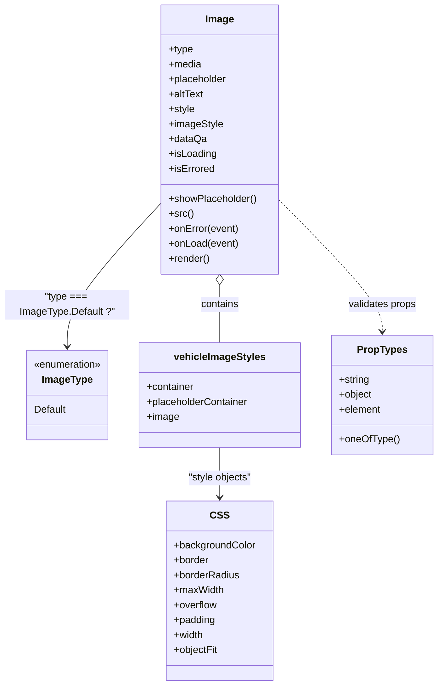

# Diagram: web/portal/src/components/atoms/Image.atom.js

> Auto-generated by Obscura crawlers

## Mermaid

### SVG

<svg id="container" width="701.28125" xmlns="http://www.w3.org/2000/svg" class="classDiagram" height="1100" viewBox="0 0 701.28125 1100" role="graphics-document document" aria-roledescription="class"><g><defs><marker id="container_class-aggregationStart" class="marker aggregation class" refX="18" refY="7" markerWidth="190" markerHeight="240" orient="auto"><path d="M 18,7 L9,13 L1,7 L9,1 Z"></path></marker></defs><defs><marker id="container_class-aggregationEnd" class="marker aggregation class" refX="1" refY="7" markerWidth="20" markerHeight="28" orient="auto"><path d="M 18,7 L9,13 L1,7 L9,1 Z"></path></marker></defs><defs><marker id="container_class-extensionStart" class="marker extension class" refX="18" refY="7" markerWidth="190" markerHeight="240" orient="auto"><path d="M 1,7 L18,13 V 1 Z"></path></marker></defs><defs><marker id="container_class-extensionEnd" class="marker extension class" refX="1" refY="7" markerWidth="20" markerHeight="28" orient="auto"><path d="M 1,1 V 13 L18,7 Z"></path></marker></defs><defs><marker id="container_class-compositionStart" class="marker composition class" refX="18" refY="7" markerWidth="190" markerHeight="240" orient="auto"><path d="M 18,7 L9,13 L1,7 L9,1 Z"></path></marker></defs><defs><marker id="container_class-compositionEnd" class="marker composition class" refX="1" refY="7" markerWidth="20" markerHeight="28" orient="auto"><path d="M 18,7 L9,13 L1,7 L9,1 Z"></path></marker></defs><defs><marker id="container_class-dependencyStart" class="marker dependency class" refX="6" refY="7" markerWidth="190" markerHeight="240" orient="auto"><path d="M 5,7 L9,13 L1,7 L9,1 Z"></path></marker></defs><defs><marker id="container_class-dependencyEnd" class="marker dependency class" refX="13" refY="7" markerWidth="20" markerHeight="28" orient="auto"><path d="M 18,7 L9,13 L14,7 L9,1 Z"></path></marker></defs><defs><marker id="container_class-lollipopStart" class="marker lollipop class" refX="13" refY="7" markerWidth="190" markerHeight="240" orient="auto"><circle stroke="black" fill="transparent" cx="7" cy="7" r="6"></circle></marker></defs><defs><marker id="container_class-lollipopEnd" class="marker lollipop class" refX="1" refY="7" markerWidth="190" markerHeight="240" orient="auto"><circle stroke="black" fill="transparent" cx="7" cy="7" r="6"></circle></marker></defs><g class="root"><g class="clusters"></g><g class="edgePaths"><path d="M261.125,324.924L235.604,352.27C210.083,379.616,159.042,434.308,133.521,472.821C108,511.333,108,533.667,108,544.833L108,556" id="id_Image_ImageType_1" class="edge-thickness-normal edge-pattern-solid relation" style=";;;" data-edge="true" data-et="edge" data-id="id_Image_ImageType_1" data-points="W3sieCI6MjYxLjEyNSwieSI6MzI0LjkyMzY3OTU1NTIxODZ9LHsieCI6MTA4LCJ5Ijo0ODl9LHsieCI6MTA4LCJ5Ijo1NjJ9XQ==" marker-end="url(#container_class-dependencyEnd)"></path><path d="M355.313,457.25L355.313,462.542C355.313,467.833,355.313,478.417,355.313,493.875C355.313,509.333,355.313,529.667,355.313,539.833L355.313,550" id="id_Image_vehicleImageStyles_2" class="edge-thickness-normal edge-pattern-solid relation" style=";;;" data-edge="true" data-et="edge" data-id="id_Image_vehicleImageStyles_2" data-points="W3sieCI6MzU1LjMxMjUsInkiOjQ0MH0seyJ4IjozNTUuMzEyNSwieSI6NDg5fSx7IngiOjM1NS4zMTI1LCJ5Ijo1NTB9XQ==" marker-start="url(#container_class-aggregationStart)"></path><path d="M449.5,320.42L476.946,348.517C504.392,376.614,559.284,432.807,586.73,468.07C614.176,503.333,614.176,517.667,614.176,524.833L614.176,532" id="id_Image_PropTypes_3" class="edge-thickness-normal edge-pattern-dashed relation" style=";;;" data-edge="true" data-et="edge" data-id="id_Image_PropTypes_3" data-points="W3sieCI6NDQ5LjUsInkiOjMyMC40MjAzNDczNzIwNzQ0fSx7IngiOjYxNC4xNzU3ODEyNSwieSI6NDg5fSx7IngiOjYxNC4xNzU3ODEyNSwieSI6NTM4fV0=" marker-end="url(#container_class-dependencyEnd)"></path><path d="M355.313,718L355.313,726.167C355.313,734.333,355.313,750.667,355.313,764C355.313,777.333,355.313,787.667,355.313,792.833L355.313,798" id="id_vehicleImageStyles_CSS_4" class="edge-thickness-normal edge-pattern-solid relation" style=";;;" data-edge="true" data-et="edge" data-id="id_vehicleImageStyles_CSS_4" data-points="W3sieCI6MzU1LjMxMjUsInkiOjcxOH0seyJ4IjozNTUuMzEyNSwieSI6NzY3fSx7IngiOjM1NS4zMTI1LCJ5Ijo4MDR9XQ==" marker-end="url(#container_class-dependencyEnd)"></path></g><g class="edgeLabels"><g class="edgeLabel" transform="translate(108, 489)"><g class="label" data-id="id_Image_ImageType_1" transform="translate(-100, -24)"><foreignObject width="200" height="48">

"type === ImageType.Default ?"

</foreignObject></g></g><g class="edgeLabel" transform="translate(355.3125, 489)"><g class="label" data-id="id_Image_vehicleImageStyles_2" transform="translate(-30.890625, -12)"><foreignObject width="61.78125" height="24">

contains

</foreignObject></g></g><g class="edgeLabel" transform="translate(614.17578125, 489)"><g class="label" data-id="id_Image_PropTypes_3" transform="translate(-55.5625, -12)"><foreignObject width="111.125" height="24">

validates props

</foreignObject></g></g><g class="edgeLabel" transform="translate(355.3125, 767)"><g class="label" data-id="id_vehicleImageStyles_CSS_4" transform="translate(-51.9609375, -12)"><foreignObject width="103.921875" height="24">

"style objects"

</foreignObject></g></g></g><g class="nodes"><g class="node default" id="classId-Image-0" transform="translate(355.3125, 224)"><g class="basic label-container"><path d="M-94.1875 -216 L94.1875 -216 L94.1875 216 L-94.1875 216" stroke="none" stroke-width="0" fill="#ECECFF" style=""></path><path d="M-94.1875 -216 C-29.529624253264686 -216, 35.12825149347063 -216, 94.1875 -216 M-94.1875 -216 C-26.266570415844015 -216, 41.65435916831197 -216, 94.1875 -216 M94.1875 -216 C94.1875 -127.2620707430259, 94.1875 -38.5241414860518, 94.1875 216 M94.1875 -216 C94.1875 -73.41756838169908, 94.1875 69.16486323660183, 94.1875 216 M94.1875 216 C32.12949895829198 216, -29.928502083416035 216, -94.1875 216 M94.1875 216 C30.67363503256466 216, -32.84022993487068 216, -94.1875 216 M-94.1875 216 C-94.1875 102.04123300256448, -94.1875 -11.917533994871036, -94.1875 -216 M-94.1875 216 C-94.1875 51.25257227611169, -94.1875 -113.49485544777662, -94.1875 -216" stroke="#9370DB" stroke-width="1.3" fill="none" stroke-dasharray="0 0" style=""></path></g><g class="annotation-group text" transform="translate(0, -192)"></g><g class="label-group text" transform="translate(-22.0625, -192)"><g class="label" style="font-weight: bolder" transform="translate(0,-12)"><foreignObject width="44.125" height="24">

Image

</foreignObject></g></g><g class="members-group text" transform="translate(-82.1875, -144)"><g class="label" style="" transform="translate(0,-12)"><foreignObject width="39.703125" height="24">

+type

</foreignObject></g><g class="label" style="" transform="translate(0,12)"><foreignObject width="53.203125" height="24">

+media

</foreignObject></g><g class="label" style="" transform="translate(0,36)"><foreignObject width="94.640625" height="24">

+placeholder

</foreignObject></g><g class="label" style="" transform="translate(0,60)"><foreignObject width="56.265625" height="24">

+altText

</foreignObject></g><g class="label" style="" transform="translate(0,84)"><foreignObject width="42.359375" height="24">

+style

</foreignObject></g><g class="label" style="" transform="translate(0,108)"><foreignObject width="87.15625" height="24">

+imageStyle

</foreignObject></g><g class="label" style="" transform="translate(0,132)"><foreignObject width="60.234375" height="24">

+dataQa

</foreignObject></g><g class="label" style="" transform="translate(0,156)"><foreignObject width="77.203125" height="24">

+isLoading

</foreignObject></g><g class="label" style="" transform="translate(0,180)"><foreignObject width="73.578125" height="24">

+isErrored

</foreignObject></g></g><g class="methods-group text" transform="translate(-82.1875, 96)"><g class="label" style="" transform="translate(0,-12)"><foreignObject width="142.3125" height="24">

+showPlaceholder()

</foreignObject></g><g class="label" style="" transform="translate(0,12)"><foreignObject width="39.171875" height="24">

+src()

</foreignObject></g><g class="label" style="" transform="translate(0,36)"><foreignObject width="113.203125" height="24">

+onError(event)

</foreignObject></g><g class="label" style="" transform="translate(0,60)"><foreignObject width="112.4375" height="24">

+onLoad(event)

</foreignObject></g><g class="label" style="" transform="translate(0,84)"><foreignObject width="66.609375" height="24">

+render()

</foreignObject></g></g><g class="divider" style=""><path d="M-94.1875 -168 C-19.873214899719088 -168, 54.441070200561825 -168, 94.1875 -168 M-94.1875 -168 C-55.85335178953445 -168, -17.5192035790689 -168, 94.1875 -168" stroke="#9370DB" stroke-width="1.3" fill="none" stroke-dasharray="0 0" style=""></path></g><g class="divider" style=""><path d="M-94.1875 72 C-46.76332390867831 72, 0.6608521826433815 72, 94.1875 72 M-94.1875 72 C-39.407677974990634 72, 15.372144050018733 72, 94.1875 72" stroke="#9370DB" stroke-width="1.3" fill="none" stroke-dasharray="0 0" style=""></path></g></g><g class="node default" id="classId-ImageType-1" transform="translate(108, 634)"><g class="basic label-container"><path d="M-67.5546875 -72 L67.5546875 -72 L67.5546875 72 L-67.5546875 72" stroke="none" stroke-width="0" fill="#ECECFF" style=""></path><path d="M-67.5546875 -72 C-20.08273859098643 -72, 27.38921031802714 -72, 67.5546875 -72 M-67.5546875 -72 C-39.70560198661229 -72, -11.856516473224573 -72, 67.5546875 -72 M67.5546875 -72 C67.5546875 -26.385184402021274, 67.5546875 19.229631195957452, 67.5546875 72 M67.5546875 -72 C67.5546875 -14.439126757188696, 67.5546875 43.12174648562261, 67.5546875 72 M67.5546875 72 C19.034706913047565 72, -29.48527367390487 72, -67.5546875 72 M67.5546875 72 C34.31908799479643 72, 1.0834884895928667 72, -67.5546875 72 M-67.5546875 72 C-67.5546875 25.997049022480866, -67.5546875 -20.00590195503827, -67.5546875 -72 M-67.5546875 72 C-67.5546875 15.116588601640188, -67.5546875 -41.76682279671962, -67.5546875 -72" stroke="#9370DB" stroke-width="1.3" fill="none" stroke-dasharray="0 0" style=""></path></g><g class="annotation-group text" transform="translate(-55.5546875, -48)"><g class="label" style="" transform="translate(0,-12)"><foreignObject width="111.109375" height="24">

«enumeration»

</foreignObject></g></g><g class="label-group text" transform="translate(-39.3984375, -24)"><g class="label" style="font-weight: bolder" transform="translate(0,-12)"><foreignObject width="78.796875" height="24">

ImageType

</foreignObject></g></g><g class="members-group text" transform="translate(-55.5546875, 24)"><g class="label" style="" transform="translate(0,-12)"><foreignObject width="52.515625" height="24">

Default

</foreignObject></g></g><g class="methods-group text" transform="translate(-55.5546875, 72)"></g><g class="divider" style=""><path d="M-67.5546875 0 C-38.74796684940556 0, -9.941246198811108 0, 67.5546875 0 M-67.5546875 0 C-22.741284303361248 0, 22.072118893277505 0, 67.5546875 0" stroke="#9370DB" stroke-width="1.3" fill="none" stroke-dasharray="0 0" style=""></path></g><g class="divider" style=""><path d="M-67.5546875 48 C-21.674115531766077 48, 24.206456436467846 48, 67.5546875 48 M-67.5546875 48 C-15.47845918159495 48, 36.5977691368101 48, 67.5546875 48" stroke="#9370DB" stroke-width="1.3" fill="none" stroke-dasharray="0 0" style=""></path></g></g><g class="node default" id="classId-vehicleImageStyles-2" transform="translate(355.3125, 634)"><g class="basic label-container"><path d="M-129.7578125 -84 L129.7578125 -84 L129.7578125 84 L-129.7578125 84" stroke="none" stroke-width="0" fill="#ECECFF" style=""></path><path d="M-129.7578125 -84 C-63.788735657586955 -84, 2.1803411848260907 -84, 129.7578125 -84 M-129.7578125 -84 C-53.32378384882483 -84, 23.110244802350337 -84, 129.7578125 -84 M129.7578125 -84 C129.7578125 -44.8023927894128, 129.7578125 -5.604785578825599, 129.7578125 84 M129.7578125 -84 C129.7578125 -41.940761163178, 129.7578125 0.11847767364399431, 129.7578125 84 M129.7578125 84 C46.1806867397443 84, -37.396439020511394 84, -129.7578125 84 M129.7578125 84 C39.59418799608959 84, -50.569436507820825 84, -129.7578125 84 M-129.7578125 84 C-129.7578125 40.01902751608696, -129.7578125 -3.961944967826085, -129.7578125 -84 M-129.7578125 84 C-129.7578125 28.861454127565537, -129.7578125 -26.277091744868926, -129.7578125 -84" stroke="#9370DB" stroke-width="1.3" fill="none" stroke-dasharray="0 0" style=""></path></g><g class="annotation-group text" transform="translate(0, -60)"></g><g class="label-group text" transform="translate(-70.359375, -60)"><g class="label" style="font-weight: bolder" transform="translate(0,-12)"><foreignObject width="140.71875" height="24">

vehicleImageStyles

</foreignObject></g></g><g class="members-group text" transform="translate(-117.7578125, -12)"><g class="label" style="" transform="translate(0,-12)"><foreignObject width="77.1875" height="24">

+container

</foreignObject></g><g class="label" style="" transform="translate(0,12)"><foreignObject width="165.15625" height="24">

+placeholderContainer

</foreignObject></g><g class="label" style="" transform="translate(0,36)"><foreignObject width="51.546875" height="24">

+image

</foreignObject></g></g><g class="methods-group text" transform="translate(-117.7578125, 84)"></g><g class="divider" style=""><path d="M-129.7578125 -36 C-52.86190281062271 -36, 24.03400687875458 -36, 129.7578125 -36 M-129.7578125 -36 C-41.9042163648723 -36, 45.949379770255405 -36, 129.7578125 -36" stroke="#9370DB" stroke-width="1.3" fill="none" stroke-dasharray="0 0" style=""></path></g><g class="divider" style=""><path d="M-129.7578125 60 C-33.859734318148696 60, 62.03834386370261 60, 129.7578125 60 M-129.7578125 60 C-70.67041100505352 60, -11.583009510107033 60, 129.7578125 60" stroke="#9370DB" stroke-width="1.3" fill="none" stroke-dasharray="0 0" style=""></path></g></g><g class="node default" id="classId-PropTypes-3" transform="translate(614.17578125, 634)"><g class="basic label-container"><path d="M-79.10546875 -96 L79.10546875 -96 L79.10546875 96 L-79.10546875 96" stroke="none" stroke-width="0" fill="#ECECFF" style=""></path><path d="M-79.10546875 -96 C-35.7764119453173 -96, 7.552644859365401 -96, 79.10546875 -96 M-79.10546875 -96 C-37.40640517531814 -96, 4.292658399363717 -96, 79.10546875 -96 M79.10546875 -96 C79.10546875 -45.65105460292045, 79.10546875 4.697890794159093, 79.10546875 96 M79.10546875 -96 C79.10546875 -34.017987997199185, 79.10546875 27.96402400560163, 79.10546875 96 M79.10546875 96 C20.10701543897934 96, -38.89143787204132 96, -79.10546875 96 M79.10546875 96 C44.4990671266489 96, 9.892665503297806 96, -79.10546875 96 M-79.10546875 96 C-79.10546875 55.562164207041604, -79.10546875 15.124328414083209, -79.10546875 -96 M-79.10546875 96 C-79.10546875 49.2855955195625, -79.10546875 2.5711910391249972, -79.10546875 -96" stroke="#9370DB" stroke-width="1.3" fill="none" stroke-dasharray="0 0" style=""></path></g><g class="annotation-group text" transform="translate(0, -72)"></g><g class="label-group text" transform="translate(-38.2578125, -72)"><g class="label" style="font-weight: bolder" transform="translate(0,-12)"><foreignObject width="76.515625" height="24">

PropTypes

</foreignObject></g></g><g class="members-group text" transform="translate(-67.10546875, -24)"><g class="label" style="" transform="translate(0,-12)"><foreignObject width="49.625" height="24">

+string

</foreignObject></g><g class="label" style="" transform="translate(0,12)"><foreignObject width="53.46875" height="24">

+object

</foreignObject></g><g class="label" style="" transform="translate(0,36)"><foreignObject width="67.625" height="24">

+element

</foreignObject></g></g><g class="methods-group text" transform="translate(-67.10546875, 72)"><g class="label" style="" transform="translate(0,-12)"><foreignObject width="95.953125" height="24">

+oneOfType()

</foreignObject></g></g><g class="divider" style=""><path d="M-79.10546875 -48 C-27.249553187103857 -48, 24.606362375792287 -48, 79.10546875 -48 M-79.10546875 -48 C-37.863759685368954 -48, 3.377949379262091 -48, 79.10546875 -48" stroke="#9370DB" stroke-width="1.3" fill="none" stroke-dasharray="0 0" style=""></path></g><g class="divider" style=""><path d="M-79.10546875 48 C-43.69257225716427 48, -8.279675764328545 48, 79.10546875 48 M-79.10546875 48 C-16.782131552907927 48, 45.541205644184146 48, 79.10546875 48" stroke="#9370DB" stroke-width="1.3" fill="none" stroke-dasharray="0 0" style=""></path></g></g><g class="node default" id="classId-CSS-4" transform="translate(355.3125, 948)"><g class="basic label-container"><path d="M-84.54296875 -144 L84.54296875 -144 L84.54296875 144 L-84.54296875 144" stroke="none" stroke-width="0" fill="#ECECFF" style=""></path><path d="M-84.54296875 -144 C-33.4019934712133 -144, 17.738981807573396 -144, 84.54296875 -144 M-84.54296875 -144 C-45.776457346327106 -144, -7.009945942654213 -144, 84.54296875 -144 M84.54296875 -144 C84.54296875 -76.12946670453961, 84.54296875 -8.25893340907922, 84.54296875 144 M84.54296875 -144 C84.54296875 -48.18060221135343, 84.54296875 47.63879557729314, 84.54296875 144 M84.54296875 144 C36.88333570606448 144, -10.776297337871043 144, -84.54296875 144 M84.54296875 144 C49.06984605014633 144, 13.596723350292663 144, -84.54296875 144 M-84.54296875 144 C-84.54296875 57.579791966977155, -84.54296875 -28.84041606604569, -84.54296875 -144 M-84.54296875 144 C-84.54296875 47.587085023327276, -84.54296875 -48.82582995334545, -84.54296875 -144" stroke="#9370DB" stroke-width="1.3" fill="none" stroke-dasharray="0 0" style=""></path></g><g class="annotation-group text" transform="translate(0, -120)"></g><g class="label-group text" transform="translate(-13.5859375, -120)"><g class="label" style="font-weight: bolder" transform="translate(0,-12)"><foreignObject width="27.171875" height="24">

CSS

</foreignObject></g></g><g class="members-group text" transform="translate(-72.54296875, -72)"><g class="label" style="" transform="translate(0,-12)"><foreignObject width="131.5" height="24">

+backgroundColor

</foreignObject></g><g class="label" style="" transform="translate(0,12)"><foreignObject width="57" height="24">

+border

</foreignObject></g><g class="label" style="" transform="translate(0,36)"><foreignObject width="106.09375" height="24">

+borderRadius

</foreignObject></g><g class="label" style="" transform="translate(0,60)"><foreignObject width="80.609375" height="24">

+maxWidth

</foreignObject></g><g class="label" style="" transform="translate(0,84)"><foreignObject width="70.1875" height="24">

+overflow

</foreignObject></g><g class="label" style="" transform="translate(0,108)"><foreignObject width="67.390625" height="24">

+padding

</foreignObject></g><g class="label" style="" transform="translate(0,132)"><foreignObject width="48.703125" height="24">

+width

</foreignObject></g><g class="label" style="" transform="translate(0,156)"><foreignObject width="71.046875" height="24">

+objectFit

</foreignObject></g></g><g class="methods-group text" transform="translate(-72.54296875, 144)"></g><g class="divider" style=""><path d="M-84.54296875 -96 C-28.030058968861447 -96, 28.482850812277107 -96, 84.54296875 -96 M-84.54296875 -96 C-38.58594273186651 -96, 7.37108328626698 -96, 84.54296875 -96" stroke="#9370DB" stroke-width="1.3" fill="none" stroke-dasharray="0 0" style=""></path></g><g class="divider" style=""><path d="M-84.54296875 120 C-42.54020248679348 120, -0.5374362235869654 120, 84.54296875 120 M-84.54296875 120 C-35.706203145672546 120, 13.130562458654907 120, 84.54296875 120" stroke="#9370DB" stroke-width="1.3" fill="none" stroke-dasharray="0 0" style=""></path></g></g></g></g></g></svg>
