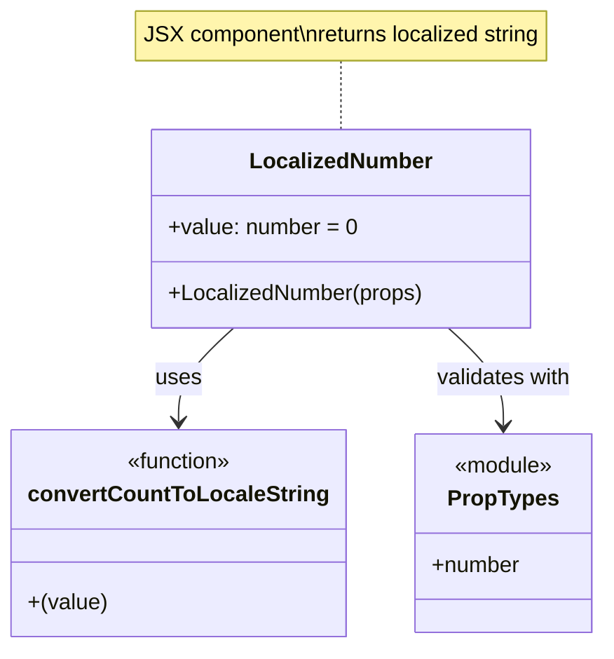

# Diagram: web/portal/src/components/atoms/LocalizedNumber.js

> Auto-generated by Obscura crawlers

## Mermaid

### SVG

<svg id="container" width="423.3515625" xmlns="http://www.w3.org/2000/svg" class="classDiagram" height="470" viewBox="0 0 423.3515625 470" role="graphics-document document" aria-roledescription="class"><g><defs><marker id="container_class-aggregationStart" class="marker aggregation class" refX="18" refY="7" markerWidth="190" markerHeight="240" orient="auto"><path d="M 18,7 L9,13 L1,7 L9,1 Z"></path></marker></defs><defs><marker id="container_class-aggregationEnd" class="marker aggregation class" refX="1" refY="7" markerWidth="20" markerHeight="28" orient="auto"><path d="M 18,7 L9,13 L1,7 L9,1 Z"></path></marker></defs><defs><marker id="container_class-extensionStart" class="marker extension class" refX="18" refY="7" markerWidth="190" markerHeight="240" orient="auto"><path d="M 1,7 L18,13 V 1 Z"></path></marker></defs><defs><marker id="container_class-extensionEnd" class="marker extension class" refX="1" refY="7" markerWidth="20" markerHeight="28" orient="auto"><path d="M 1,1 V 13 L18,7 Z"></path></marker></defs><defs><marker id="container_class-compositionStart" class="marker composition class" refX="18" refY="7" markerWidth="190" markerHeight="240" orient="auto"><path d="M 18,7 L9,13 L1,7 L9,1 Z"></path></marker></defs><defs><marker id="container_class-compositionEnd" class="marker composition class" refX="1" refY="7" markerWidth="20" markerHeight="28" orient="auto"><path d="M 18,7 L9,13 L1,7 L9,1 Z"></path></marker></defs><defs><marker id="container_class-dependencyStart" class="marker dependency class" refX="6" refY="7" markerWidth="190" markerHeight="240" orient="auto"><path d="M 5,7 L9,13 L1,7 L9,1 Z"></path></marker></defs><defs><marker id="container_class-dependencyEnd" class="marker dependency class" refX="13" refY="7" markerWidth="20" markerHeight="28" orient="auto"><path d="M 18,7 L9,13 L14,7 L9,1 Z"></path></marker></defs><defs><marker id="container_class-lollipopStart" class="marker lollipop class" refX="13" refY="7" markerWidth="190" markerHeight="240" orient="auto"><circle stroke="black" fill="transparent" cx="7" cy="7" r="6"></circle></marker></defs><defs><marker id="container_class-lollipopEnd" class="marker lollipop class" refX="1" refY="7" markerWidth="190" markerHeight="240" orient="auto"><circle stroke="black" fill="transparent" cx="7" cy="7" r="6"></circle></marker></defs><g class="root"><g class="clusters"></g><g class="edgePaths"><path d="M237.486,44L237.486,48.167C237.486,52.333,237.486,60.667,237.486,69C237.486,77.333,237.486,85.667,237.486,89.833L237.486,94" id="edgeNote1" class="edge-thickness-normal edge-pattern-dotted relation" style="fill: none;;;fill: none" data-edge="true" data-et="edge" data-id="edgeNote1" data-points="W3sieCI6MjM3LjQ4NjMyODEyNSwieSI6NDR9LHsieCI6MjM3LjQ4NjMyODEyNSwieSI6Njl9LHsieCI6MjM3LjQ4NjMyODEyNSwieSI6OTR9XQ=="></path><path d="M161.96,238L155.492,244.167C149.023,250.333,136.086,262.667,129.617,274C123.148,285.333,123.148,295.667,123.148,300.833L123.148,306" id="id_LocalizedNumber_convertCountToLocaleString_1" class="edge-thickness-normal edge-pattern-solid relation" style=";;;" data-edge="true" data-et="edge" data-id="id_LocalizedNumber_convertCountToLocaleString_1" data-points="W3sieCI6MTYxLjk2MDM4MjAyNDA4MjU1LCJ5IjoyMzh9LHsieCI6MTIzLjE0ODQzNzUsInkiOjI3NX0seyJ4IjoxMjMuMTQ4NDM3NSwieSI6MzEyfV0=" marker-end="url(#container_class-dependencyEnd)"></path><path d="M313.012,238L319.481,244.167C325.95,250.333,338.887,262.667,345.356,274.5C351.824,286.333,351.824,297.667,351.824,303.333L351.824,309" id="id_LocalizedNumber_PropTypes_2" class="edge-thickness-normal edge-pattern-solid relation" style=";;;" data-edge="true" data-et="edge" data-id="id_LocalizedNumber_PropTypes_2" data-points="W3sieCI6MzEzLjAxMjI3NDIyNTkxNzQ1LCJ5IjoyMzh9LHsieCI6MzUxLjgyNDIxODc1LCJ5IjoyNzV9LHsieCI6MzUxLjgyNDIxODc1LCJ5IjozMTV9XQ==" marker-end="url(#container_class-dependencyEnd)"></path></g><g class="edgeLabels"><g class="edgeLabel"><g class="label" data-id="edgeNote1" transform="translate(0, 0)"><foreignObject width="0" height="0">

</foreignObject></g></g><g class="edgeLabel" transform="translate(123.1484375, 275)"><g class="label" data-id="id_LocalizedNumber_convertCountToLocaleString_1" transform="translate(-16.4921875, -12)"><foreignObject width="32.984375" height="24">

uses

</foreignObject></g></g><g class="edgeLabel" transform="translate(351.82421875, 275)"><g class="label" data-id="id_LocalizedNumber_PropTypes_2" transform="translate(-50.375, -12)"><foreignObject width="100.75" height="24">

validates with

</foreignObject></g></g></g><g class="nodes"><g class="node default" id="classId-LocalizedNumber-0" transform="translate(237.486328125, 166)"><g class="basic label-container"><path d="M-136.3359375 -72 L136.3359375 -72 L136.3359375 72 L-136.3359375 72" stroke="none" stroke-width="0" fill="#ECECFF" style=""></path><path d="M-136.3359375 -72 C-67.90593199298505 -72, 0.524073514029908 -72, 136.3359375 -72 M-136.3359375 -72 C-59.42308620764338 -72, 17.48976508471324 -72, 136.3359375 -72 M136.3359375 -72 C136.3359375 -32.402063354230926, 136.3359375 7.195873291538149, 136.3359375 72 M136.3359375 -72 C136.3359375 -23.179681388295386, 136.3359375 25.64063722340923, 136.3359375 72 M136.3359375 72 C43.450158416645124 72, -49.43562066670975 72, -136.3359375 72 M136.3359375 72 C67.22598405756271 72, -1.8839693848745753 72, -136.3359375 72 M-136.3359375 72 C-136.3359375 17.020266006939465, -136.3359375 -37.95946798612107, -136.3359375 -72 M-136.3359375 72 C-136.3359375 41.922028012878656, -136.3359375 11.844056025757304, -136.3359375 -72" stroke="#9370DB" stroke-width="1.3" fill="none" stroke-dasharray="0 0" style=""></path></g><g class="annotation-group text" transform="translate(0, -48)"></g><g class="label-group text" transform="translate(-63.125, -48)"><g class="label" style="font-weight: bolder" transform="translate(0,-12)"><foreignObject width="126.25" height="24">

LocalizedNumber

</foreignObject></g></g><g class="members-group text" transform="translate(-124.3359375, 0)"><g class="label" style="" transform="translate(0,-12)"><foreignObject width="137" height="24">

+value: number = 0

</foreignObject></g></g><g class="methods-group text" transform="translate(-124.3359375, 48)"><g class="label" style="" transform="translate(0,-12)"><foreignObject width="185.546875" height="24">

+LocalizedNumber(props)

</foreignObject></g></g><g class="divider" style=""><path d="M-136.3359375 -24 C-32.703193733537844 -24, 70.92955003292431 -24, 136.3359375 -24 M-136.3359375 -24 C-34.550431651421846 -24, 67.23507419715631 -24, 136.3359375 -24" stroke="#9370DB" stroke-width="1.3" fill="none" stroke-dasharray="0 0" style=""></path></g><g class="divider" style=""><path d="M-136.3359375 24 C-67.62501969451273 24, 1.08589811097454 24, 136.3359375 24 M-136.3359375 24 C-56.717272750761666 24, 22.90139199847667 24, 136.3359375 24" stroke="#9370DB" stroke-width="1.3" fill="none" stroke-dasharray="0 0" style=""></path></g></g><g class="node default" id="classId-convertCountToLocaleString-1" transform="translate(123.1484375, 387)"><g class="basic label-container"><path d="M-115.1484375 -75 L115.1484375 -75 L115.1484375 75 L-115.1484375 75" stroke="none" stroke-width="0" fill="#ECECFF" style=""></path><path d="M-115.1484375 -75 C-24.515796617199612 -75, 66.11684426560078 -75, 115.1484375 -75 M-115.1484375 -75 C-41.25336230140364 -75, 32.64171289719272 -75, 115.1484375 -75 M115.1484375 -75 C115.1484375 -19.22856224231743, 115.1484375 36.54287551536514, 115.1484375 75 M115.1484375 -75 C115.1484375 -40.81309795009324, 115.1484375 -6.626195900186474, 115.1484375 75 M115.1484375 75 C60.1030992873374 75, 5.057761074674801 75, -115.1484375 75 M115.1484375 75 C25.251286630577198 75, -64.6458642388456 75, -115.1484375 75 M-115.1484375 75 C-115.1484375 25.49090271323106, -115.1484375 -24.018194573537883, -115.1484375 -75 M-115.1484375 75 C-115.1484375 28.326844892590024, -115.1484375 -18.34631021481995, -115.1484375 -75" stroke="#9370DB" stroke-width="1.3" fill="none" stroke-dasharray="0 0" style=""></path></g><g class="annotation-group text" transform="translate(-39.484375, -51)"><g class="label" style="" transform="translate(0,-12)"><foreignObject width="78.96875" height="24">

«function»

</foreignObject></g></g><g class="label-group text" transform="translate(-103.1484375, -27)"><g class="label" style="font-weight: bolder" transform="translate(0,-12)"><foreignObject width="206.296875" height="24">

convertCountToLocaleString

</foreignObject></g></g><g class="members-group text" transform="translate(-103.1484375, 21)"></g><g class="methods-group text" transform="translate(-103.1484375, 51)"><g class="label" style="" transform="translate(0,-12)"><foreignObject width="57.234375" height="24">

+(value)

</foreignObject></g></g><g class="divider" style=""><path d="M-115.1484375 -3 C-30.647268102780146 -3, 53.85390129443971 -3, 115.1484375 -3 M-115.1484375 -3 C-61.358580480930755 -3, -7.568723461861509 -3, 115.1484375 -3" stroke="#9370DB" stroke-width="1.3" fill="none" stroke-dasharray="0 0" style=""></path></g><g class="divider" style=""><path d="M-115.1484375 21 C-59.43869258709805 21, -3.7289476741961067 21, 115.1484375 21 M-115.1484375 21 C-68.24612463441231 21, -21.343811768824622 21, 115.1484375 21" stroke="#9370DB" stroke-width="1.3" fill="none" stroke-dasharray="0 0" style=""></path></g></g><g class="node default" id="classId-PropTypes-2" transform="translate(351.82421875, 387)"><g class="basic label-container"><path d="M-63.52734375 -72 L63.52734375 -72 L63.52734375 72 L-63.52734375 72" stroke="none" stroke-width="0" fill="#ECECFF" style=""></path><path d="M-63.52734375 -72 C-25.22530929007568 -72, 13.076725169848643 -72, 63.52734375 -72 M-63.52734375 -72 C-15.0597692252895 -72, 33.407805299421 -72, 63.52734375 -72 M63.52734375 -72 C63.52734375 -24.830783946256894, 63.52734375 22.338432107486213, 63.52734375 72 M63.52734375 -72 C63.52734375 -42.6033200402564, 63.52734375 -13.206640080512798, 63.52734375 72 M63.52734375 72 C36.85827389026282 72, 10.189204030525637 72, -63.52734375 72 M63.52734375 72 C19.462020214591426 72, -24.603303320817147 72, -63.52734375 72 M-63.52734375 72 C-63.52734375 31.57356503441283, -63.52734375 -8.85286993117434, -63.52734375 -72 M-63.52734375 72 C-63.52734375 37.75075932562946, -63.52734375 3.5015186512589196, -63.52734375 -72" stroke="#9370DB" stroke-width="1.3" fill="none" stroke-dasharray="0 0" style=""></path></g><g class="annotation-group text" transform="translate(-36.6015625, -48)"><g class="label" style="" transform="translate(0,-12)"><foreignObject width="73.203125" height="24">

«module»

</foreignObject></g></g><g class="label-group text" transform="translate(-38.2578125, -24)"><g class="label" style="font-weight: bolder" transform="translate(0,-12)"><foreignObject width="76.515625" height="24">

PropTypes

</foreignObject></g></g><g class="members-group text" transform="translate(-51.52734375, 24)"><g class="label" style="" transform="translate(0,-12)"><foreignObject width="64.796875" height="24">

+number

</foreignObject></g></g><g class="methods-group text" transform="translate(-51.52734375, 72)"></g><g class="divider" style=""><path d="M-63.52734375 0 C-19.444434933795748 0, 24.638473882408505 0, 63.52734375 0 M-63.52734375 0 C-19.902908160619475 0, 23.72152742876105 0, 63.52734375 0" stroke="#9370DB" stroke-width="1.3" fill="none" stroke-dasharray="0 0" style=""></path></g><g class="divider" style=""><path d="M-63.52734375 48 C-19.784576094574824 48, 23.958191560850352 48, 63.52734375 48 M-63.52734375 48 C-16.1539778670141 48, 31.219388015971802 48, 63.52734375 48" stroke="#9370DB" stroke-width="1.3" fill="none" stroke-dasharray="0 0" style=""></path></g></g><g class="node undefined" id="note0" transform="translate(237.486328125, 26)"><g class="basic label-container"><path d="M-152.453125 -18 L152.453125 -18 L152.453125 18 L-152.453125 18" stroke="none" stroke-width="0" fill="#fff5ad" style="fill:#fff5ad !important;stroke:#aaaa33 !important"></path><path d="M-152.453125 -18 C-42.89144251482118 -18, 66.67023997035764 -18, 152.453125 -18 M-152.453125 -18 C-84.10289537945664 -18, -15.752665758913281 -18, 152.453125 -18 M152.453125 -18 C152.453125 -7.857089908187342, 152.453125 2.285820183625315, 152.453125 18 M152.453125 -18 C152.453125 -7.224788774528353, 152.453125 3.5504224509432945, 152.453125 18 M152.453125 18 C40.72631316582169 18, -71.00049866835661 18, -152.453125 18 M152.453125 18 C39.16196983765147 18, -74.12918532469706 18, -152.453125 18 M-152.453125 18 C-152.453125 4.932537777086036, -152.453125 -8.134924445827927, -152.453125 -18 M-152.453125 18 C-152.453125 8.662197804102444, -152.453125 -0.6756043917951118, -152.453125 -18" stroke="#aaaa33" stroke-width="1.3" fill="none" stroke-dasharray="0 0" style="fill:#fff5ad !important;stroke:#aaaa33 !important"></path></g><g class="label" style="text-align:left !important;white-space:nowrap !important" transform="translate(-146.453125, -12)"><rect></rect><foreignObject width="292.90625" height="24">

JSX component\nreturns localized string

</foreignObject></g></g></g></g></g></svg>
