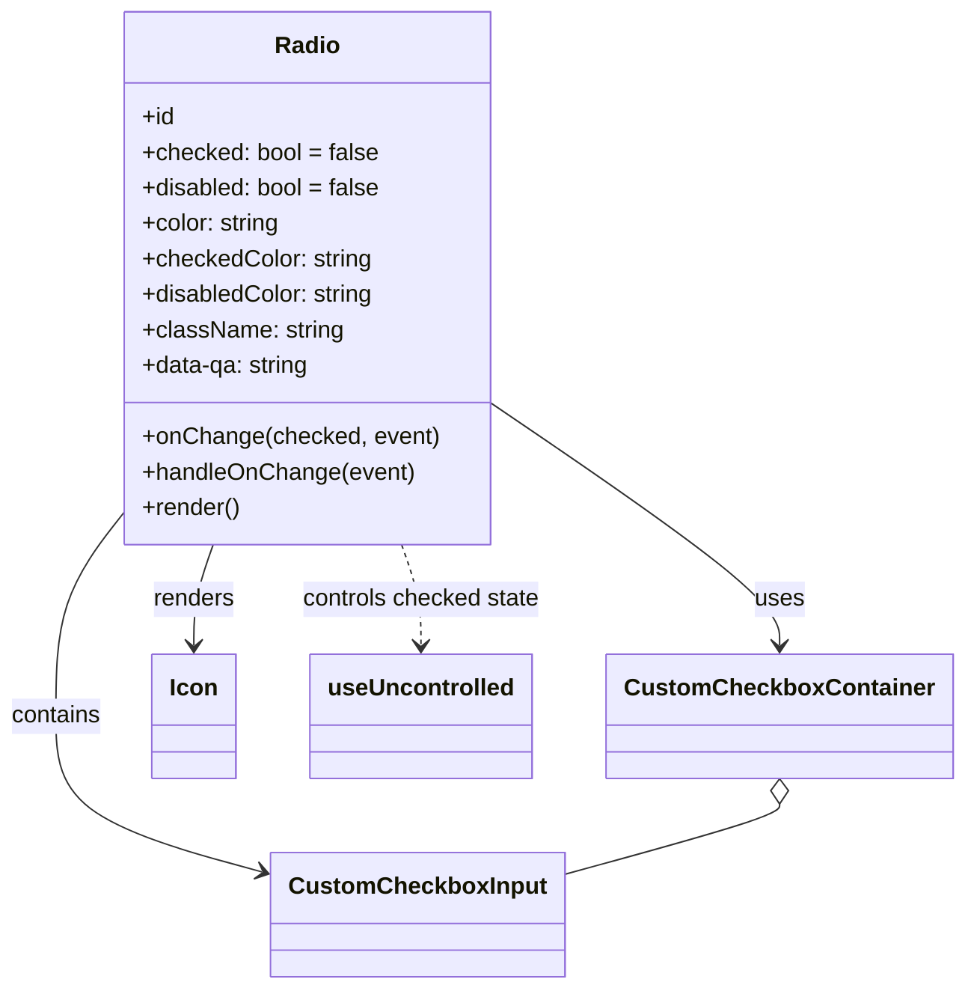
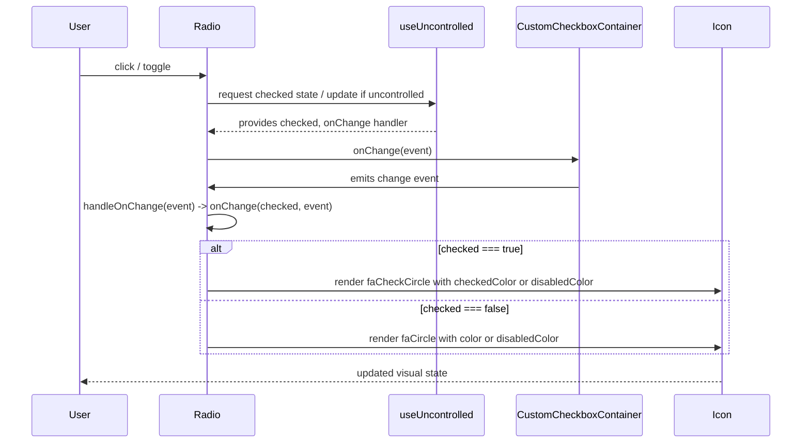

# Diagram: web/portal/src/components/atoms/Radio.atom.js

> Auto-generated by Obscura crawlers

## Diagram 1

### SVG

<svg id="container" width="632.25" xmlns="http://www.w3.org/2000/svg" class="classDiagram" height="668" viewBox="0 0 632.25 668" role="graphics-document document" aria-roledescription="class"><g><defs><marker id="container_class-aggregationStart" class="marker aggregation class" refX="18" refY="7" markerWidth="190" markerHeight="240" orient="auto"><path d="M 18,7 L9,13 L1,7 L9,1 Z"></path></marker></defs><defs><marker id="container_class-aggregationEnd" class="marker aggregation class" refX="1" refY="7" markerWidth="20" markerHeight="28" orient="auto"><path d="M 18,7 L9,13 L1,7 L9,1 Z"></path></marker></defs><defs><marker id="container_class-extensionStart" class="marker extension class" refX="18" refY="7" markerWidth="190" markerHeight="240" orient="auto"><path d="M 1,7 L18,13 V 1 Z"></path></marker></defs><defs><marker id="container_class-extensionEnd" class="marker extension class" refX="1" refY="7" markerWidth="20" markerHeight="28" orient="auto"><path d="M 1,1 V 13 L18,7 Z"></path></marker></defs><defs><marker id="container_class-compositionStart" class="marker composition class" refX="18" refY="7" markerWidth="190" markerHeight="240" orient="auto"><path d="M 18,7 L9,13 L1,7 L9,1 Z"></path></marker></defs><defs><marker id="container_class-compositionEnd" class="marker composition class" refX="1" refY="7" markerWidth="20" markerHeight="28" orient="auto"><path d="M 18,7 L9,13 L1,7 L9,1 Z"></path></marker></defs><defs><marker id="container_class-dependencyStart" class="marker dependency class" refX="6" refY="7" markerWidth="190" markerHeight="240" orient="auto"><path d="M 5,7 L9,13 L1,7 L9,1 Z"></path></marker></defs><defs><marker id="container_class-dependencyEnd" class="marker dependency class" refX="13" refY="7" markerWidth="20" markerHeight="28" orient="auto"><path d="M 18,7 L9,13 L14,7 L9,1 Z"></path></marker></defs><defs><marker id="container_class-lollipopStart" class="marker lollipop class" refX="13" refY="7" markerWidth="190" markerHeight="240" orient="auto"><circle stroke="black" fill="transparent" cx="7" cy="7" r="6"></circle></marker></defs><defs><marker id="container_class-lollipopEnd" class="marker lollipop class" refX="1" refY="7" markerWidth="190" markerHeight="240" orient="auto"><circle stroke="black" fill="transparent" cx="7" cy="7" r="6"></circle></marker></defs><g class="root"><g class="clusters"></g><g class="edgePaths"><path d="M328.504,273.899L359.439,295.75C390.375,317.6,452.246,361.3,483.182,388.317C514.117,415.333,514.117,425.667,514.117,430.833L514.117,436" id="id_Radio_CustomCheckboxContainer_1" class="edge-thickness-normal edge-pattern-solid relation" style=";;;" data-edge="true" data-et="edge" data-id="id_Radio_CustomCheckboxContainer_1" data-points="W3sieCI6MzI4LjUwMzkwNjI1LCJ5IjoyNzMuODk5NDU0NTUyMzg5Njd9LHsieCI6NTE0LjExNzE4NzUsInkiOjQwNX0seyJ4Ijo1MTQuMTE3MTg3NSwieSI6NDQyfV0=" marker-end="url(#container_class-dependencyEnd)"></path><path d="M85.27,345.093L77.54,355.077C69.81,365.062,54.35,385.031,46.62,408.182C38.891,431.333,38.891,457.667,38.891,482C38.891,506.333,38.891,528.667,61.875,546.314C84.86,563.962,130.83,576.924,153.815,583.405L176.799,589.886" id="id_Radio_CustomCheckboxInput_2" class="edge-thickness-normal edge-pattern-solid relation" style=";;;" data-edge="true" data-et="edge" data-id="id_Radio_CustomCheckboxInput_2" data-points="W3sieCI6ODUuMjY5NTMxMjUsInkiOjM0NS4wOTI1MTk4MjIzNTQ0Nn0seyJ4IjozOC44OTA2MjUsInkiOjQwNX0seyJ4IjozOC44OTA2MjUsInkiOjQ4NH0seyJ4IjozOC44OTA2MjUsInkiOjU1MX0seyJ4IjoxODIuNTc0MjE4NzUsInkiOjU5MS41MTQ1NzM2NDA4NjIxfV0=" marker-end="url(#container_class-dependencyEnd)"></path><path d="M144.84,368L142.714,374.167C140.589,380.333,136.337,392.667,134.212,404C132.086,415.333,132.086,425.667,132.086,430.833L132.086,436" id="id_Radio_Icon_3" class="edge-thickness-normal edge-pattern-solid relation" style=";;;" data-edge="true" data-et="edge" data-id="id_Radio_Icon_3" data-points="W3sieCI6MTQ0LjgzOTk4Nzc1OTIxNjYsInkiOjM2OH0seyJ4IjoxMzIuMDg1OTM3NSwieSI6NDA1fSx7IngiOjEzMi4wODU5Mzc1LCJ5Ijo0NDJ9XQ==" marker-end="url(#container_class-dependencyEnd)"></path><path d="M268.933,368L271.059,374.167C273.185,380.333,277.436,392.667,279.562,404C281.688,415.333,281.688,425.667,281.688,430.833L281.688,436" id="id_Radio_useUncontrolled_4" class="edge-thickness-normal edge-pattern-dashed relation" style=";;;" data-edge="true" data-et="edge" data-id="id_Radio_useUncontrolled_4" data-points="W3sieCI6MjY4LjkzMzQ0OTc0MDc4MzQzLCJ5IjozNjh9LHsieCI6MjgxLjY4NzUsInkiOjQwNX0seyJ4IjoyODEuNjg3NSwieSI6NDQyfV0=" marker-end="url(#container_class-dependencyEnd)"></path><path d="M514.117,543.25L514.117,544.542C514.117,545.833,514.117,548.417,490.17,556.461C466.223,564.505,418.328,578.01,394.381,584.762L370.434,591.515" id="id_CustomCheckboxContainer_CustomCheckboxInput_5" class="edge-thickness-normal edge-pattern-solid relation" style=";;;" data-edge="true" data-et="edge" data-id="id_CustomCheckboxContainer_CustomCheckboxInput_5" data-points="W3sieCI6NTE0LjExNzE4NzUsInkiOjUyNn0seyJ4Ijo1MTQuMTE3MTg3NSwieSI6NTUxfSx7IngiOjM3MC40MzM1OTM3NSwieSI6NTkxLjUxNDU3MzY0MDg2MjF9XQ==" marker-start="url(#container_class-aggregationStart)"></path></g><g class="edgeLabels"><g class="edgeLabel" transform="translate(514.1171875, 405)"><g class="label" data-id="id_Radio_CustomCheckboxContainer_1" transform="translate(-16.4921875, -12)"><foreignObject width="32.984375" height="24">

uses

</foreignObject></g></g><g class="edgeLabel" transform="translate(38.890625, 484)"><g class="label" data-id="id_Radio_CustomCheckboxInput_2" transform="translate(-30.890625, -12)"><foreignObject width="61.78125" height="24">

contains

</foreignObject></g></g><g class="edgeLabel" transform="translate(132.0859375, 405)"><g class="label" data-id="id_Radio_Icon_3" transform="translate(-27.75, -12)"><foreignObject width="55.5" height="24">

renders

</foreignObject></g></g><g class="edgeLabel" transform="translate(281.6875, 405)"><g class="label" data-id="id_Radio_useUncontrolled_4" transform="translate(-81.671875, -12)"><foreignObject width="163.34375" height="24">

controls checked state

</foreignObject></g></g><g class="edgeLabel"><g class="label" data-id="id_CustomCheckboxContainer_CustomCheckboxInput_5" transform="translate(0, 0)"><foreignObject width="0" height="0">

</foreignObject></g></g></g><g class="nodes"><g class="node default" id="classId-Radio-0" transform="translate(206.88671875, 188)"><g class="basic label-container"><path d="M-121.6171875 -180 L121.6171875 -180 L121.6171875 180 L-121.6171875 180" stroke="none" stroke-width="0" fill="#ECECFF" style=""></path><path d="M-121.6171875 -180 C-43.54702850010331 -180, 34.52313049979338 -180, 121.6171875 -180 M-121.6171875 -180 C-60.46208351487049 -180, 0.6930204702590146 -180, 121.6171875 -180 M121.6171875 -180 C121.6171875 -86.47859393177251, 121.6171875 7.042812136454984, 121.6171875 180 M121.6171875 -180 C121.6171875 -93.20954324915749, 121.6171875 -6.419086498314982, 121.6171875 180 M121.6171875 180 C42.2680071262927 180, -37.0811732474146 180, -121.6171875 180 M121.6171875 180 C56.11269208460898 180, -9.39180333078204 180, -121.6171875 180 M-121.6171875 180 C-121.6171875 65.61567400347224, -121.6171875 -48.76865199305553, -121.6171875 -180 M-121.6171875 180 C-121.6171875 44.51472905315396, -121.6171875 -90.97054189369209, -121.6171875 -180" stroke="#9370DB" stroke-width="1.3" fill="none" stroke-dasharray="0 0" style=""></path></g><g class="annotation-group text" transform="translate(0, -156)"></g><g class="label-group text" transform="translate(-20.96875, -156)"><g class="label" style="font-weight: bolder" transform="translate(0,-12)"><foreignObject width="41.9375" height="24">

Radio

</foreignObject></g></g><g class="members-group text" transform="translate(-109.6171875, -108)"><g class="label" style="" transform="translate(0,-12)"><foreignObject width="22.078125" height="24">

+id

</foreignObject></g><g class="label" style="" transform="translate(0,12)"><foreignObject width="159.59375" height="24">

+checked: bool = false

</foreignObject></g><g class="label" style="" transform="translate(0,36)"><foreignObject width="162.359375" height="24">

+disabled: bool = false

</foreignObject></g><g class="label" style="" transform="translate(0,60)"><foreignObject width="94.65625" height="24">

+color: string

</foreignObject></g><g class="label" style="" transform="translate(0,84)"><foreignObject width="155.703125" height="24">

+checkedColor: string

</foreignObject></g><g class="label" style="" transform="translate(0,108)"><foreignObject width="158.46875" height="24">

+disabledColor: string

</foreignObject></g><g class="label" style="" transform="translate(0,132)"><foreignObject width="135.359375" height="24">

+className: string

</foreignObject></g><g class="label" style="" transform="translate(0,156)"><foreignObject width="114.90625" height="24">

+data-qa: string

</foreignObject></g></g><g class="methods-group text" transform="translate(-109.6171875, 108)"><g class="label" style="" transform="translate(0,-12)"><foreignObject width="198.265625" height="24">

+onChange(checked, event)

</foreignObject></g><g class="label" style="" transform="translate(0,12)"><foreignObject width="182.53125" height="24">

+handleOnChange(event)

</foreignObject></g><g class="label" style="" transform="translate(0,36)"><foreignObject width="66.609375" height="24">

+render()

</foreignObject></g></g><g class="divider" style=""><path d="M-121.6171875 -132 C-35.647644305598035 -132, 50.32189888880393 -132, 121.6171875 -132 M-121.6171875 -132 C-54.81754123583754 -132, 11.982105028324924 -132, 121.6171875 -132" stroke="#9370DB" stroke-width="1.3" fill="none" stroke-dasharray="0 0" style=""></path></g><g class="divider" style=""><path d="M-121.6171875 84 C-71.94522064296122 84, -22.273253785922435 84, 121.6171875 84 M-121.6171875 84 C-24.706670504815094 84, 72.20384649036981 84, 121.6171875 84" stroke="#9370DB" stroke-width="1.3" fill="none" stroke-dasharray="0 0" style=""></path></g></g><g class="node default" id="classId-CustomCheckboxContainer-1" transform="translate(514.1171875, 484)"><g class="basic label-container"><path d="M-110.1328125 -42 L110.1328125 -42 L110.1328125 42 L-110.1328125 42" stroke="none" stroke-width="0" fill="#ECECFF" style=""></path><path d="M-110.1328125 -42 C-42.05881638486008 -42, 26.01517973027984 -42, 110.1328125 -42 M-110.1328125 -42 C-63.24167718482709 -42, -16.35054186965418 -42, 110.1328125 -42 M110.1328125 -42 C110.1328125 -14.245161407530354, 110.1328125 13.509677184939292, 110.1328125 42 M110.1328125 -42 C110.1328125 -10.032632031763047, 110.1328125 21.934735936473906, 110.1328125 42 M110.1328125 42 C60.07189021278522 42, 10.01096792557044 42, -110.1328125 42 M110.1328125 42 C32.1257382368908 42, -45.881336026218406 42, -110.1328125 42 M-110.1328125 42 C-110.1328125 16.004534250097684, -110.1328125 -9.990931499804631, -110.1328125 -42 M-110.1328125 42 C-110.1328125 22.732777614883993, -110.1328125 3.465555229767986, -110.1328125 -42" stroke="#9370DB" stroke-width="1.3" fill="none" stroke-dasharray="0 0" style=""></path></g><g class="annotation-group text" transform="translate(0, -18)"></g><g class="label-group text" transform="translate(-98.1328125, -18)"><g class="label" style="font-weight: bolder" transform="translate(0,-12)"><foreignObject width="196.265625" height="24">

CustomCheckboxContainer

</foreignObject></g></g><g class="members-group text" transform="translate(-98.1328125, 30)"></g><g class="methods-group text" transform="translate(-98.1328125, 60)"></g><g class="divider" style=""><path d="M-110.1328125 6 C-39.638155029856776 6, 30.856502440286448 6, 110.1328125 6 M-110.1328125 6 C-33.56651595827712 6, 42.999780583445755 6, 110.1328125 6" stroke="#9370DB" stroke-width="1.3" fill="none" stroke-dasharray="0 0" style=""></path></g><g class="divider" style=""><path d="M-110.1328125 24 C-35.24428475859074 24, 39.644242982818525 24, 110.1328125 24 M-110.1328125 24 C-44.82255876270992 24, 20.487694974580165 24, 110.1328125 24" stroke="#9370DB" stroke-width="1.3" fill="none" stroke-dasharray="0 0" style=""></path></g></g><g class="node default" id="classId-CustomCheckboxInput-2" transform="translate(276.50390625, 618)"><g class="basic label-container"><path d="M-93.9296875 -42 L93.9296875 -42 L93.9296875 42 L-93.9296875 42" stroke="none" stroke-width="0" fill="#ECECFF" style=""></path><path d="M-93.9296875 -42 C-52.43622038506217 -42, -10.942753270124342 -42, 93.9296875 -42 M-93.9296875 -42 C-25.795245563041803 -42, 42.339196373916394 -42, 93.9296875 -42 M93.9296875 -42 C93.9296875 -10.951033543793528, 93.9296875 20.097932912412944, 93.9296875 42 M93.9296875 -42 C93.9296875 -8.961379662380239, 93.9296875 24.077240675239523, 93.9296875 42 M93.9296875 42 C32.57322974563581 42, -28.783228008728386 42, -93.9296875 42 M93.9296875 42 C20.311229847339007 42, -53.307227805321986 42, -93.9296875 42 M-93.9296875 42 C-93.9296875 22.905172638051283, -93.9296875 3.8103452761025665, -93.9296875 -42 M-93.9296875 42 C-93.9296875 16.40524603310712, -93.9296875 -9.189507933785762, -93.9296875 -42" stroke="#9370DB" stroke-width="1.3" fill="none" stroke-dasharray="0 0" style=""></path></g><g class="annotation-group text" transform="translate(0, -18)"></g><g class="label-group text" transform="translate(-81.9296875, -18)"><g class="label" style="font-weight: bolder" transform="translate(0,-12)"><foreignObject width="163.859375" height="24">

CustomCheckboxInput

</foreignObject></g></g><g class="members-group text" transform="translate(-81.9296875, 30)"></g><g class="methods-group text" transform="translate(-81.9296875, 60)"></g><g class="divider" style=""><path d="M-93.9296875 6 C-45.825863542507626 6, 2.277960414984747 6, 93.9296875 6 M-93.9296875 6 C-26.6308707544152 6, 40.6679459911696 6, 93.9296875 6" stroke="#9370DB" stroke-width="1.3" fill="none" stroke-dasharray="0 0" style=""></path></g><g class="divider" style=""><path d="M-93.9296875 24 C-27.589374393195 24, 38.75093871361 24, 93.9296875 24 M-93.9296875 24 C-42.22946643205371 24, 9.470754635892575 24, 93.9296875 24" stroke="#9370DB" stroke-width="1.3" fill="none" stroke-dasharray="0 0" style=""></path></g></g><g class="node default" id="classId-Icon-3" transform="translate(132.0859375, 484)"><g class="basic label-container"><path d="M-27.3046875 -42 L27.3046875 -42 L27.3046875 42 L-27.3046875 42" stroke="none" stroke-width="0" fill="#ECECFF" style=""></path><path d="M-27.3046875 -42 C-14.763129588530647 -42, -2.221571677061295 -42, 27.3046875 -42 M-27.3046875 -42 C-14.042356248331965 -42, -0.7800249966639292 -42, 27.3046875 -42 M27.3046875 -42 C27.3046875 -11.301124105403431, 27.3046875 19.397751789193137, 27.3046875 42 M27.3046875 -42 C27.3046875 -17.588623948348104, 27.3046875 6.822752103303792, 27.3046875 42 M27.3046875 42 C7.595982927768677 42, -12.112721644462646 42, -27.3046875 42 M27.3046875 42 C12.601449165382004 42, -2.1017891692359925 42, -27.3046875 42 M-27.3046875 42 C-27.3046875 23.456320651817748, -27.3046875 4.912641303635496, -27.3046875 -42 M-27.3046875 42 C-27.3046875 22.95054651374567, -27.3046875 3.901093027491342, -27.3046875 -42" stroke="#9370DB" stroke-width="1.3" fill="none" stroke-dasharray="0 0" style=""></path></g><g class="annotation-group text" transform="translate(0, -18)"></g><g class="label-group text" transform="translate(-15.3046875, -18)"><g class="label" style="font-weight: bolder" transform="translate(0,-12)"><foreignObject width="30.609375" height="24">

Icon

</foreignObject></g></g><g class="members-group text" transform="translate(-15.3046875, 30)"></g><g class="methods-group text" transform="translate(-15.3046875, 60)"></g><g class="divider" style=""><path d="M-27.3046875 6 C-11.84688293396785 6, 3.6109216320643007 6, 27.3046875 6 M-27.3046875 6 C-8.788781665468374 6, 9.727124169063252 6, 27.3046875 6" stroke="#9370DB" stroke-width="1.3" fill="none" stroke-dasharray="0 0" style=""></path></g><g class="divider" style=""><path d="M-27.3046875 24 C-9.7061946981493 24, 7.8922981037014 24, 27.3046875 24 M-27.3046875 24 C-12.270355977266544 24, 2.763975545466913 24, 27.3046875 24" stroke="#9370DB" stroke-width="1.3" fill="none" stroke-dasharray="0 0" style=""></path></g></g><g class="node default" id="classId-useUncontrolled-4" transform="translate(281.6875, 484)"><g class="basic label-container"><path d="M-72.296875 -42 L72.296875 -42 L72.296875 42 L-72.296875 42" stroke="none" stroke-width="0" fill="#ECECFF" style=""></path><path d="M-72.296875 -42 C-37.096354850697615 -42, -1.8958347013952306 -42, 72.296875 -42 M-72.296875 -42 C-16.402700824876575 -42, 39.49147335024685 -42, 72.296875 -42 M72.296875 -42 C72.296875 -20.627635376980116, 72.296875 0.7447292460397676, 72.296875 42 M72.296875 -42 C72.296875 -22.3942324854779, 72.296875 -2.7884649709558005, 72.296875 42 M72.296875 42 C19.976006613185824 42, -32.34486177362835 42, -72.296875 42 M72.296875 42 C21.396973821894278 42, -29.502927356211444 42, -72.296875 42 M-72.296875 42 C-72.296875 24.986580447508537, -72.296875 7.973160895017074, -72.296875 -42 M-72.296875 42 C-72.296875 21.353634406757468, -72.296875 0.7072688135149363, -72.296875 -42" stroke="#9370DB" stroke-width="1.3" fill="none" stroke-dasharray="0 0" style=""></path></g><g class="annotation-group text" transform="translate(0, -18)"></g><g class="label-group text" transform="translate(-60.296875, -18)"><g class="label" style="font-weight: bolder" transform="translate(0,-12)"><foreignObject width="120.59375" height="24">

useUncontrolled

</foreignObject></g></g><g class="members-group text" transform="translate(-60.296875, 30)"></g><g class="methods-group text" transform="translate(-60.296875, 60)"></g><g class="divider" style=""><path d="M-72.296875 6 C-43.321498618283556 6, -14.346122236567105 6, 72.296875 6 M-72.296875 6 C-41.64788830730585 6, -10.998901614611704 6, 72.296875 6" stroke="#9370DB" stroke-width="1.3" fill="none" stroke-dasharray="0 0" style=""></path></g><g class="divider" style=""><path d="M-72.296875 24 C-25.317771701430985 24, 21.66133159713803 24, 72.296875 24 M-72.296875 24 C-14.954724398885503 24, 42.387426202228994 24, 72.296875 24" stroke="#9370DB" stroke-width="1.3" fill="none" stroke-dasharray="0 0" style=""></path></g></g></g></g></g></svg>

## Diagram 2

### SVG

<svg id="container" width="1324" xmlns="http://www.w3.org/2000/svg" height="733" viewBox="-50 -10 1324 733" role="graphics-document document" aria-roledescription="sequence"><g><rect x="1074" y="647" fill="#eaeaea" stroke="#666" width="150" height="65" name="Icon" rx="3" ry="3" class="actor actor-bottom"></rect><text x="1149" y="679.5" dominant-baseline="central" alignment-baseline="central" class="actor actor-box" style="text-anchor: middle; font-size: 16px; font-weight: 400;"><tspan x="1149" dy="0">Icon</tspan></text></g><g><rect x="809" y="647" fill="#eaeaea" stroke="#666" width="215" height="65" name="CustomCheckboxContainer" rx="3" ry="3" class="actor actor-bottom"></rect><text x="916.5" y="679.5" dominant-baseline="central" alignment-baseline="central" class="actor actor-box" style="text-anchor: middle; font-size: 16px; font-weight: 400;"><tspan x="916.5" dy="0">CustomCheckboxContainer</tspan></text></g><g><rect x="609" y="647" fill="#eaeaea" stroke="#666" width="150" height="65" name="useUncontrolled" rx="3" ry="3" class="actor actor-bottom"></rect><text x="684" y="679.5" dominant-baseline="central" alignment-baseline="central" class="actor actor-box" style="text-anchor: middle; font-size: 16px; font-weight: 400;"><tspan x="684" dy="0">useUncontrolled</tspan></text></g><g><rect x="200" y="647" fill="#eaeaea" stroke="#666" width="150" height="65" name="Radio" rx="3" ry="3" class="actor actor-bottom"></rect><text x="275" y="679.5" dominant-baseline="central" alignment-baseline="central" class="actor actor-box" style="text-anchor: middle; font-size: 16px; font-weight: 400;"><tspan x="275" dy="0">Radio</tspan></text></g><g><rect x="0" y="647" fill="#eaeaea" stroke="#666" width="150" height="65" name="User" rx="3" ry="3" class="actor actor-bottom"></rect><text x="75" y="679.5" dominant-baseline="central" alignment-baseline="central" class="actor actor-box" style="text-anchor: middle; font-size: 16px; font-weight: 400;"><tspan x="75" dy="0">User</tspan></text></g><g><line id="actor4" x1="1149" y1="65" x2="1149" y2="647" class="actor-line 200" stroke-width="0.5px" stroke="#999" name="Icon"></line><g id="root-4"><rect x="1074" y="0" fill="#eaeaea" stroke="#666" width="150" height="65" name="Icon" rx="3" ry="3" class="actor actor-top"></rect><text x="1149" y="32.5" dominant-baseline="central" alignment-baseline="central" class="actor actor-box" style="text-anchor: middle; font-size: 16px; font-weight: 400;"><tspan x="1149" dy="0">Icon</tspan></text></g></g><g><line id="actor3" x1="916.5" y1="65" x2="916.5" y2="647" class="actor-line 200" stroke-width="0.5px" stroke="#999" name="CustomCheckboxContainer"></line><g id="root-3"><rect x="809" y="0" fill="#eaeaea" stroke="#666" width="215" height="65" name="CustomCheckboxContainer" rx="3" ry="3" class="actor actor-top"></rect><text x="916.5" y="32.5" dominant-baseline="central" alignment-baseline="central" class="actor actor-box" style="text-anchor: middle; font-size: 16px; font-weight: 400;"><tspan x="916.5" dy="0">CustomCheckboxContainer</tspan></text></g></g><g><line id="actor2" x1="684" y1="65" x2="684" y2="647" class="actor-line 200" stroke-width="0.5px" stroke="#999" name="useUncontrolled"></line><g id="root-2"><rect x="609" y="0" fill="#eaeaea" stroke="#666" width="150" height="65" name="useUncontrolled" rx="3" ry="3" class="actor actor-top"></rect><text x="684" y="32.5" dominant-baseline="central" alignment-baseline="central" class="actor actor-box" style="text-anchor: middle; font-size: 16px; font-weight: 400;"><tspan x="684" dy="0">useUncontrolled</tspan></text></g></g><g><line id="actor1" x1="275" y1="65" x2="275" y2="647" class="actor-line 200" stroke-width="0.5px" stroke="#999" name="Radio"></line><g id="root-1"><rect x="200" y="0" fill="#eaeaea" stroke="#666" width="150" height="65" name="Radio" rx="3" ry="3" class="actor actor-top"></rect><text x="275" y="32.5" dominant-baseline="central" alignment-baseline="central" class="actor actor-box" style="text-anchor: middle; font-size: 16px; font-weight: 400;"><tspan x="275" dy="0">Radio</tspan></text></g></g><g><line id="actor0" x1="75" y1="65" x2="75" y2="647" class="actor-line 200" stroke-width="0.5px" stroke="#999" name="User"></line><g id="root-0"><rect x="0" y="0" fill="#eaeaea" stroke="#666" width="150" height="65" name="User" rx="3" ry="3" class="actor actor-top"></rect><text x="75" y="32.5" dominant-baseline="central" alignment-baseline="central" class="actor actor-box" style="text-anchor: middle; font-size: 16px; font-weight: 400;"><tspan x="75" dy="0">User</tspan></text></g></g><g></g><defs><symbol id="computer" width="24" height="24"><path transform="scale(.5)" d="M2 2v13h20v-13h-20zm18 11h-16v-9h16v9zm-10.228 6l.466-1h3.524l.467 1h-4.457zm14.228 3h-24l2-6h2.104l-1.33 4h18.45l-1.297-4h2.073l2 6zm-5-10h-14v-7h14v7z"></path></symbol></defs><defs><symbol id="database" fill-rule="evenodd" clip-rule="evenodd"><path transform="scale(.5)" d="M12.258.001l.256.004.255.005.253.008.251.01.249.012.247.015.246.016.242.019.241.02.239.023.236.024.233.027.231.028.229.031.225.032.223.034.22.036.217.038.214.04.211.041.208.043.205.045.201.046.198.048.194.05.191.051.187.053.183.054.18.056.175.057.172.059.168.06.163.061.16.063.155.064.15.066.074.033.073.033.071.034.07.034.069.035.068.035.067.035.066.035.064.036.064.036.062.036.06.036.06.037.058.037.058.037.055.038.055.038.053.038.052.038.051.039.05.039.048.039.047.039.045.04.044.04.043.04.041.04.04.041.039.041.037.041.036.041.034.041.033.042.032.042.03.042.029.042.027.042.026.043.024.043.023.043.021.043.02.043.018.044.017.043.015.044.013.044.012.044.011.045.009.044.007.045.006.045.004.045.002.045.001.045v17l-.001.045-.002.045-.004.045-.006.045-.007.045-.009.044-.011.045-.012.044-.013.044-.015.044-.017.043-.018.044-.02.043-.021.043-.023.043-.024.043-.026.043-.027.042-.029.042-.03.042-.032.042-.033.042-.034.041-.036.041-.037.041-.039.041-.04.041-.041.04-.043.04-.044.04-.045.04-.047.039-.048.039-.05.039-.051.039-.052.038-.053.038-.055.038-.055.038-.058.037-.058.037-.06.037-.06.036-.062.036-.064.036-.064.036-.066.035-.067.035-.068.035-.069.035-.07.034-.071.034-.073.033-.074.033-.15.066-.155.064-.16.063-.163.061-.168.06-.172.059-.175.057-.18.056-.183.054-.187.053-.191.051-.194.05-.198.048-.201.046-.205.045-.208.043-.211.041-.214.04-.217.038-.22.036-.223.034-.225.032-.229.031-.231.028-.233.027-.236.024-.239.023-.241.02-.242.019-.246.016-.247.015-.249.012-.251.01-.253.008-.255.005-.256.004-.258.001-.258-.001-.256-.004-.255-.005-.253-.008-.251-.01-.249-.012-.247-.015-.245-.016-.243-.019-.241-.02-.238-.023-.236-.024-.234-.027-.231-.028-.228-.031-.226-.032-.223-.034-.22-.036-.217-.038-.214-.04-.211-.041-.208-.043-.204-.045-.201-.046-.198-.048-.195-.05-.19-.051-.187-.053-.184-.054-.179-.056-.176-.057-.172-.059-.167-.06-.164-.061-.159-.063-.155-.064-.151-.066-.074-.033-.072-.033-.072-.034-.07-.034-.069-.035-.068-.035-.067-.035-.066-.035-.064-.036-.063-.036-.062-.036-.061-.036-.06-.037-.058-.037-.057-.037-.056-.038-.055-.038-.053-.038-.052-.038-.051-.039-.049-.039-.049-.039-.046-.039-.046-.04-.044-.04-.043-.04-.041-.04-.04-.041-.039-.041-.037-.041-.036-.041-.034-.041-.033-.042-.032-.042-.03-.042-.029-.042-.027-.042-.026-.043-.024-.043-.023-.043-.021-.043-.02-.043-.018-.044-.017-.043-.015-.044-.013-.044-.012-.044-.011-.045-.009-.044-.007-.045-.006-.045-.004-.045-.002-.045-.001-.045v-17l.001-.045.002-.045.004-.045.006-.045.007-.045.009-.044.011-.045.012-.044.013-.044.015-.044.017-.043.018-.044.02-.043.021-.043.023-.043.024-.043.026-.043.027-.042.029-.042.03-.042.032-.042.033-.042.034-.041.036-.041.037-.041.039-.041.04-.041.041-.04.043-.04.044-.04.046-.04.046-.039.049-.039.049-.039.051-.039.052-.038.053-.038.055-.038.056-.038.057-.037.058-.037.06-.037.061-.036.062-.036.063-.036.064-.036.066-.035.067-.035.068-.035.069-.035.07-.034.072-.034.072-.033.074-.033.151-.066.155-.064.159-.063.164-.061.167-.06.172-.059.176-.057.179-.056.184-.054.187-.053.19-.051.195-.05.198-.048.201-.046.204-.045.208-.043.211-.041.214-.04.217-.038.22-.036.223-.034.226-.032.228-.031.231-.028.234-.027.236-.024.238-.023.241-.02.243-.019.245-.016.247-.015.249-.012.251-.01.253-.008.255-.005.256-.004.258-.001.258.001zm-9.258 20.499v.01l.001.021.003.021.004.022.005.021.006.022.007.022.009.023.01.022.011.023.012.023.013.023.015.023.016.024.017.023.018.024.019.024.021.024.022.025.023.024.024.025.052.049.056.05.061.051.066.051.07.051.075.051.079.052.084.052.088.052.092.052.097.052.102.051.105.052.11.052.114.051.119.051.123.051.127.05.131.05.135.05.139.048.144.049.147.047.152.047.155.047.16.045.163.045.167.043.171.043.176.041.178.041.183.039.187.039.19.037.194.035.197.035.202.033.204.031.209.03.212.029.216.027.219.025.222.024.226.021.23.02.233.018.236.016.24.015.243.012.246.01.249.008.253.005.256.004.259.001.26-.001.257-.004.254-.005.25-.008.247-.011.244-.012.241-.014.237-.016.233-.018.231-.021.226-.021.224-.024.22-.026.216-.027.212-.028.21-.031.205-.031.202-.034.198-.034.194-.036.191-.037.187-.039.183-.04.179-.04.175-.042.172-.043.168-.044.163-.045.16-.046.155-.046.152-.047.148-.048.143-.049.139-.049.136-.05.131-.05.126-.05.123-.051.118-.052.114-.051.11-.052.106-.052.101-.052.096-.052.092-.052.088-.053.083-.051.079-.052.074-.052.07-.051.065-.051.06-.051.056-.05.051-.05.023-.024.023-.025.021-.024.02-.024.019-.024.018-.024.017-.024.015-.023.014-.024.013-.023.012-.023.01-.023.01-.022.008-.022.006-.022.006-.022.004-.022.004-.021.001-.021.001-.021v-4.127l-.077.055-.08.053-.083.054-.085.053-.087.052-.09.052-.093.051-.095.05-.097.05-.1.049-.102.049-.105.048-.106.047-.109.047-.111.046-.114.045-.115.045-.118.044-.12.043-.122.042-.124.042-.126.041-.128.04-.13.04-.132.038-.134.038-.135.037-.138.037-.139.035-.142.035-.143.034-.144.033-.147.032-.148.031-.15.03-.151.03-.153.029-.154.027-.156.027-.158.026-.159.025-.161.024-.162.023-.163.022-.165.021-.166.02-.167.019-.169.018-.169.017-.171.016-.173.015-.173.014-.175.013-.175.012-.177.011-.178.01-.179.008-.179.008-.181.006-.182.005-.182.004-.184.003-.184.002h-.37l-.184-.002-.184-.003-.182-.004-.182-.005-.181-.006-.179-.008-.179-.008-.178-.01-.176-.011-.176-.012-.175-.013-.173-.014-.172-.015-.171-.016-.17-.017-.169-.018-.167-.019-.166-.02-.165-.021-.163-.022-.162-.023-.161-.024-.159-.025-.157-.026-.156-.027-.155-.027-.153-.029-.151-.03-.15-.03-.148-.031-.146-.032-.145-.033-.143-.034-.141-.035-.14-.035-.137-.037-.136-.037-.134-.038-.132-.038-.13-.04-.128-.04-.126-.041-.124-.042-.122-.042-.12-.044-.117-.043-.116-.045-.113-.045-.112-.046-.109-.047-.106-.047-.105-.048-.102-.049-.1-.049-.097-.05-.095-.05-.093-.052-.09-.051-.087-.052-.085-.053-.083-.054-.08-.054-.077-.054v4.127zm0-5.654v.011l.001.021.003.021.004.021.005.022.006.022.007.022.009.022.01.022.011.023.012.023.013.023.015.024.016.023.017.024.018.024.019.024.021.024.022.024.023.025.024.024.052.05.056.05.061.05.066.051.07.051.075.052.079.051.084.052.088.052.092.052.097.052.102.052.105.052.11.051.114.051.119.052.123.05.127.051.131.05.135.049.139.049.144.048.147.048.152.047.155.046.16.045.163.045.167.044.171.042.176.042.178.04.183.04.187.038.19.037.194.036.197.034.202.033.204.032.209.03.212.028.216.027.219.025.222.024.226.022.23.02.233.018.236.016.24.014.243.012.246.01.249.008.253.006.256.003.259.001.26-.001.257-.003.254-.006.25-.008.247-.01.244-.012.241-.015.237-.016.233-.018.231-.02.226-.022.224-.024.22-.025.216-.027.212-.029.21-.03.205-.032.202-.033.198-.035.194-.036.191-.037.187-.039.183-.039.179-.041.175-.042.172-.043.168-.044.163-.045.16-.045.155-.047.152-.047.148-.048.143-.048.139-.05.136-.049.131-.05.126-.051.123-.051.118-.051.114-.052.11-.052.106-.052.101-.052.096-.052.092-.052.088-.052.083-.052.079-.052.074-.051.07-.052.065-.051.06-.05.056-.051.051-.049.023-.025.023-.024.021-.025.02-.024.019-.024.018-.024.017-.024.015-.023.014-.023.013-.024.012-.022.01-.023.01-.023.008-.022.006-.022.006-.022.004-.021.004-.022.001-.021.001-.021v-4.139l-.077.054-.08.054-.083.054-.085.052-.087.053-.09.051-.093.051-.095.051-.097.05-.1.049-.102.049-.105.048-.106.047-.109.047-.111.046-.114.045-.115.044-.118.044-.12.044-.122.042-.124.042-.126.041-.128.04-.13.039-.132.039-.134.038-.135.037-.138.036-.139.036-.142.035-.143.033-.144.033-.147.033-.148.031-.15.03-.151.03-.153.028-.154.028-.156.027-.158.026-.159.025-.161.024-.162.023-.163.022-.165.021-.166.02-.167.019-.169.018-.169.017-.171.016-.173.015-.173.014-.175.013-.175.012-.177.011-.178.009-.179.009-.179.007-.181.007-.182.005-.182.004-.184.003-.184.002h-.37l-.184-.002-.184-.003-.182-.004-.182-.005-.181-.007-.179-.007-.179-.009-.178-.009-.176-.011-.176-.012-.175-.013-.173-.014-.172-.015-.171-.016-.17-.017-.169-.018-.167-.019-.166-.02-.165-.021-.163-.022-.162-.023-.161-.024-.159-.025-.157-.026-.156-.027-.155-.028-.153-.028-.151-.03-.15-.03-.148-.031-.146-.033-.145-.033-.143-.033-.141-.035-.14-.036-.137-.036-.136-.037-.134-.038-.132-.039-.13-.039-.128-.04-.126-.041-.124-.042-.122-.043-.12-.043-.117-.044-.116-.044-.113-.046-.112-.046-.109-.046-.106-.047-.105-.048-.102-.049-.1-.049-.097-.05-.095-.051-.093-.051-.09-.051-.087-.053-.085-.052-.083-.054-.08-.054-.077-.054v4.139zm0-5.666v.011l.001.02.003.022.004.021.005.022.006.021.007.022.009.023.01.022.011.023.012.023.013.023.015.023.016.024.017.024.018.023.019.024.021.025.022.024.023.024.024.025.052.05.056.05.061.05.066.051.07.051.075.052.079.051.084.052.088.052.092.052.097.052.102.052.105.051.11.052.114.051.119.051.123.051.127.05.131.05.135.05.139.049.144.048.147.048.152.047.155.046.16.045.163.045.167.043.171.043.176.042.178.04.183.04.187.038.19.037.194.036.197.034.202.033.204.032.209.03.212.028.216.027.219.025.222.024.226.021.23.02.233.018.236.017.24.014.243.012.246.01.249.008.253.006.256.003.259.001.26-.001.257-.003.254-.006.25-.008.247-.01.244-.013.241-.014.237-.016.233-.018.231-.02.226-.022.224-.024.22-.025.216-.027.212-.029.21-.03.205-.032.202-.033.198-.035.194-.036.191-.037.187-.039.183-.039.179-.041.175-.042.172-.043.168-.044.163-.045.16-.045.155-.047.152-.047.148-.048.143-.049.139-.049.136-.049.131-.051.126-.05.123-.051.118-.052.114-.051.11-.052.106-.052.101-.052.096-.052.092-.052.088-.052.083-.052.079-.052.074-.052.07-.051.065-.051.06-.051.056-.05.051-.049.023-.025.023-.025.021-.024.02-.024.019-.024.018-.024.017-.024.015-.023.014-.024.013-.023.012-.023.01-.022.01-.023.008-.022.006-.022.006-.022.004-.022.004-.021.001-.021.001-.021v-4.153l-.077.054-.08.054-.083.053-.085.053-.087.053-.09.051-.093.051-.095.051-.097.05-.1.049-.102.048-.105.048-.106.048-.109.046-.111.046-.114.046-.115.044-.118.044-.12.043-.122.043-.124.042-.126.041-.128.04-.13.039-.132.039-.134.038-.135.037-.138.036-.139.036-.142.034-.143.034-.144.033-.147.032-.148.032-.15.03-.151.03-.153.028-.154.028-.156.027-.158.026-.159.024-.161.024-.162.023-.163.023-.165.021-.166.02-.167.019-.169.018-.169.017-.171.016-.173.015-.173.014-.175.013-.175.012-.177.01-.178.01-.179.009-.179.007-.181.006-.182.006-.182.004-.184.003-.184.001-.185.001-.185-.001-.184-.001-.184-.003-.182-.004-.182-.006-.181-.006-.179-.007-.179-.009-.178-.01-.176-.01-.176-.012-.175-.013-.173-.014-.172-.015-.171-.016-.17-.017-.169-.018-.167-.019-.166-.02-.165-.021-.163-.023-.162-.023-.161-.024-.159-.024-.157-.026-.156-.027-.155-.028-.153-.028-.151-.03-.15-.03-.148-.032-.146-.032-.145-.033-.143-.034-.141-.034-.14-.036-.137-.036-.136-.037-.134-.038-.132-.039-.13-.039-.128-.041-.126-.041-.124-.041-.122-.043-.12-.043-.117-.044-.116-.044-.113-.046-.112-.046-.109-.046-.106-.048-.105-.048-.102-.048-.1-.05-.097-.049-.095-.051-.093-.051-.09-.052-.087-.052-.085-.053-.083-.053-.08-.054-.077-.054v4.153zm8.74-8.179l-.257.004-.254.005-.25.008-.247.011-.244.012-.241.014-.237.016-.233.018-.231.021-.226.022-.224.023-.22.026-.216.027-.212.028-.21.031-.205.032-.202.033-.198.034-.194.036-.191.038-.187.038-.183.04-.179.041-.175.042-.172.043-.168.043-.163.045-.16.046-.155.046-.152.048-.148.048-.143.048-.139.049-.136.05-.131.05-.126.051-.123.051-.118.051-.114.052-.11.052-.106.052-.101.052-.096.052-.092.052-.088.052-.083.052-.079.052-.074.051-.07.052-.065.051-.06.05-.056.05-.051.05-.023.025-.023.024-.021.024-.02.025-.019.024-.018.024-.017.023-.015.024-.014.023-.013.023-.012.023-.01.023-.01.022-.008.022-.006.023-.006.021-.004.022-.004.021-.001.021-.001.021.001.021.001.021.004.021.004.022.006.021.006.023.008.022.01.022.01.023.012.023.013.023.014.023.015.024.017.023.018.024.019.024.02.025.021.024.023.024.023.025.051.05.056.05.06.05.065.051.07.052.074.051.079.052.083.052.088.052.092.052.096.052.101.052.106.052.11.052.114.052.118.051.123.051.126.051.131.05.136.05.139.049.143.048.148.048.152.048.155.046.16.046.163.045.168.043.172.043.175.042.179.041.183.04.187.038.191.038.194.036.198.034.202.033.205.032.21.031.212.028.216.027.22.026.224.023.226.022.231.021.233.018.237.016.241.014.244.012.247.011.25.008.254.005.257.004.26.001.26-.001.257-.004.254-.005.25-.008.247-.011.244-.012.241-.014.237-.016.233-.018.231-.021.226-.022.224-.023.22-.026.216-.027.212-.028.21-.031.205-.032.202-.033.198-.034.194-.036.191-.038.187-.038.183-.04.179-.041.175-.042.172-.043.168-.043.163-.045.16-.046.155-.046.152-.048.148-.048.143-.048.139-.049.136-.05.131-.05.126-.051.123-.051.118-.051.114-.052.11-.052.106-.052.101-.052.096-.052.092-.052.088-.052.083-.052.079-.052.074-.051.07-.052.065-.051.06-.05.056-.05.051-.05.023-.025.023-.024.021-.024.02-.025.019-.024.018-.024.017-.023.015-.024.014-.023.013-.023.012-.023.01-.023.01-.022.008-.022.006-.023.006-.021.004-.022.004-.021.001-.021.001-.021-.001-.021-.001-.021-.004-.021-.004-.022-.006-.021-.006-.023-.008-.022-.01-.022-.01-.023-.012-.023-.013-.023-.014-.023-.015-.024-.017-.023-.018-.024-.019-.024-.02-.025-.021-.024-.023-.024-.023-.025-.051-.05-.056-.05-.06-.05-.065-.051-.07-.052-.074-.051-.079-.052-.083-.052-.088-.052-.092-.052-.096-.052-.101-.052-.106-.052-.11-.052-.114-.052-.118-.051-.123-.051-.126-.051-.131-.05-.136-.05-.139-.049-.143-.048-.148-.048-.152-.048-.155-.046-.16-.046-.163-.045-.168-.043-.172-.043-.175-.042-.179-.041-.183-.04-.187-.038-.191-.038-.194-.036-.198-.034-.202-.033-.205-.032-.21-.031-.212-.028-.216-.027-.22-.026-.224-.023-.226-.022-.231-.021-.233-.018-.237-.016-.241-.014-.244-.012-.247-.011-.25-.008-.254-.005-.257-.004-.26-.001-.26.001z"></path></symbol></defs><defs><symbol id="clock" width="24" height="24"><path transform="scale(.5)" d="M12 2c5.514 0 10 4.486 10 10s-4.486 10-10 10-10-4.486-10-10 4.486-10 10-10zm0-2c-6.627 0-12 5.373-12 12s5.373 12 12 12 12-5.373 12-12-5.373-12-12-12zm5.848 12.459c.202.038.202.333.001.372-1.907.361-6.045 1.111-6.547 1.111-.719 0-1.301-.582-1.301-1.301 0-.512.77-5.447 1.125-7.445.034-.192.312-.181.343.014l.985 6.238 5.394 1.011z"></path></symbol></defs><defs><marker id="arrowhead" refX="7.9" refY="5" markerUnits="userSpaceOnUse" markerWidth="12" markerHeight="12" orient="auto-start-reverse"><path d="M -1 0 L 10 5 L 0 10 z"></path></marker></defs><defs><marker id="crosshead" markerWidth="15" markerHeight="8" orient="auto" refX="4" refY="4.5"><path fill="none" stroke="#000000" stroke-width="1pt" d="M 1,2 L 6,7 M 6,2 L 1,7" style="stroke-dasharray: 0, 0;"></path></marker></defs><defs><marker id="filled-head" refX="15.5" refY="7" markerWidth="20" markerHeight="28" orient="auto"><path d="M 18,7 L9,13 L14,7 L9,1 Z"></path></marker></defs><defs><marker id="sequencenumber" refX="15" refY="15" markerWidth="60" markerHeight="40" orient="auto"><circle cx="15" cy="15" r="6"></circle></marker></defs><g><line x1="264" y1="393" x2="1160" y2="393" class="loopLine"></line><line x1="1160" y1="393" x2="1160" y2="579" class="loopLine"></line><line x1="264" y1="579" x2="1160" y2="579" class="loopLine"></line><line x1="264" y1="393" x2="264" y2="579" class="loopLine"></line><line x1="264" y1="491" x2="1160" y2="491" class="loopLine" style="stroke-dasharray: 3, 3;"></line><polygon points="264,393 314,393 314,406 305.6,413 264,413" class="labelBox"></polygon><text x="289" y="406" text-anchor="middle" dominant-baseline="middle" alignment-baseline="middle" class="labelText" style="font-size: 16px; font-weight: 400;">alt</text><text x="737" y="411" text-anchor="middle" class="loopText" style="font-size: 16px; font-weight: 400;"><tspan x="737">[checked === true]</tspan></text><text x="712" y="509" text-anchor="middle" class="loopText" style="font-size: 16px; font-weight: 400;">[checked === false]</text></g><text x="174" y="80" text-anchor="middle" dominant-baseline="middle" alignment-baseline="middle" class="messageText" dy="1em" style="font-size: 16px; font-weight: 400;">click / toggle</text><line x1="76" y1="113" x2="271" y2="113" class="messageLine0" stroke-width="2" stroke="none" marker-end="url(#arrowhead)" style="fill: none;"></line><text x="478" y="128" text-anchor="middle" dominant-baseline="middle" alignment-baseline="middle" class="messageText" dy="1em" style="font-size: 16px; font-weight: 400;">request checked state / update if uncontrolled</text><line x1="276" y1="161" x2="680" y2="161" class="messageLine0" stroke-width="2" stroke="none" marker-end="url(#arrowhead)" style="fill: none;"></line><text x="481" y="176" text-anchor="middle" dominant-baseline="middle" alignment-baseline="middle" class="messageText" dy="1em" style="font-size: 16px; font-weight: 400;">provides checked, onChange handler</text><line x1="683" y1="209" x2="279" y2="209" class="messageLine1" stroke-width="2" stroke="none" marker-end="url(#arrowhead)" style="stroke-dasharray: 3, 3; fill: none;"></line><text x="594" y="224" text-anchor="middle" dominant-baseline="middle" alignment-baseline="middle" class="messageText" dy="1em" style="font-size: 16px; font-weight: 400;">onChange(event)</text><line x1="276" y1="257" x2="912.5" y2="257" class="messageLine0" stroke-width="2" stroke="none" marker-end="url(#arrowhead)" style="fill: none;"></line><text x="597" y="272" text-anchor="middle" dominant-baseline="middle" alignment-baseline="middle" class="messageText" dy="1em" style="font-size: 16px; font-weight: 400;">emits change event</text><line x1="915.5" y1="305" x2="279" y2="305" class="messageLine0" stroke-width="2" stroke="none" marker-end="url(#arrowhead)" style="fill: none;"></line><text x="276" y="320" text-anchor="middle" dominant-baseline="middle" alignment-baseline="middle" class="messageText" dy="1em" style="font-size: 16px; font-weight: 400;">handleOnChange(event) -&gt; onChange(checked, event)</text><path d="M 276,353 C 336,343 336,383 276,373" class="messageLine0" stroke-width="2" stroke="none" marker-end="url(#arrowhead)" style="fill: none;"></path><text x="711" y="443" text-anchor="middle" dominant-baseline="middle" alignment-baseline="middle" class="messageText" dy="1em" style="font-size: 16px; font-weight: 400;">render faCheckCircle with checkedColor or disabledColor</text><line x1="276" y1="476" x2="1145" y2="476" class="messageLine0" stroke-width="2" stroke="none" marker-end="url(#arrowhead)" style="fill: none;"></line><text x="711" y="536" text-anchor="middle" dominant-baseline="middle" alignment-baseline="middle" class="messageText" dy="1em" style="font-size: 16px; font-weight: 400;">render faCircle with color or disabledColor</text><line x1="276" y1="569" x2="1145" y2="569" class="messageLine0" stroke-width="2" stroke="none" marker-end="url(#arrowhead)" style="fill: none;"></line><text x="614" y="594" text-anchor="middle" dominant-baseline="middle" alignment-baseline="middle" class="messageText" dy="1em" style="font-size: 16px; font-weight: 400;">updated visual state</text><line x1="1148" y1="627" x2="79" y2="627" class="messageLine1" stroke-width="2" stroke="none" marker-end="url(#arrowhead)" style="stroke-dasharray: 3, 3; fill: none;"></line></svg>
