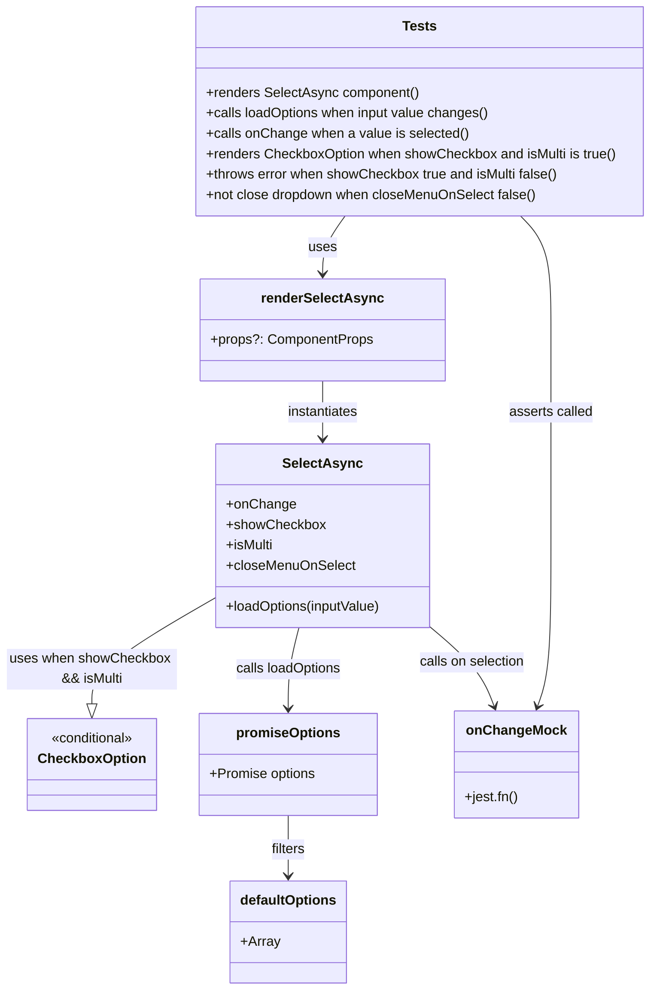
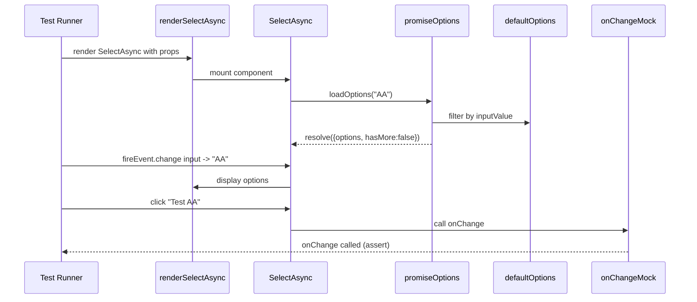

# Diagram: web/portal/src/components/atoms/SelectAsync.atom.test.tsx

> Auto-generated by Obscura crawlers

## Diagram 1

### SVG

<svg id="container" width="761.4921875" xmlns="http://www.w3.org/2000/svg" class="classDiagram" height="1164" viewBox="0 0 761.4921875 1164" role="graphics-document document" aria-roledescription="class"><g><defs><marker id="container_class-aggregationStart" class="marker aggregation class" refX="18" refY="7" markerWidth="190" markerHeight="240" orient="auto"><path d="M 18,7 L9,13 L1,7 L9,1 Z"></path></marker></defs><defs><marker id="container_class-aggregationEnd" class="marker aggregation class" refX="1" refY="7" markerWidth="20" markerHeight="28" orient="auto"><path d="M 18,7 L9,13 L1,7 L9,1 Z"></path></marker></defs><defs><marker id="container_class-extensionStart" class="marker extension class" refX="18" refY="7" markerWidth="190" markerHeight="240" orient="auto"><path d="M 1,7 L18,13 V 1 Z"></path></marker></defs><defs><marker id="container_class-extensionEnd" class="marker extension class" refX="1" refY="7" markerWidth="20" markerHeight="28" orient="auto"><path d="M 1,1 V 13 L18,7 Z"></path></marker></defs><defs><marker id="container_class-compositionStart" class="marker composition class" refX="18" refY="7" markerWidth="190" markerHeight="240" orient="auto"><path d="M 18,7 L9,13 L1,7 L9,1 Z"></path></marker></defs><defs><marker id="container_class-compositionEnd" class="marker composition class" refX="1" refY="7" markerWidth="20" markerHeight="28" orient="auto"><path d="M 18,7 L9,13 L1,7 L9,1 Z"></path></marker></defs><defs><marker id="container_class-dependencyStart" class="marker dependency class" refX="6" refY="7" markerWidth="190" markerHeight="240" orient="auto"><path d="M 5,7 L9,13 L1,7 L9,1 Z"></path></marker></defs><defs><marker id="container_class-dependencyEnd" class="marker dependency class" refX="13" refY="7" markerWidth="20" markerHeight="28" orient="auto"><path d="M 18,7 L9,13 L14,7 L9,1 Z"></path></marker></defs><defs><marker id="container_class-lollipopStart" class="marker lollipop class" refX="13" refY="7" markerWidth="190" markerHeight="240" orient="auto"><circle stroke="black" fill="transparent" cx="7" cy="7" r="6"></circle></marker></defs><defs><marker id="container_class-lollipopEnd" class="marker lollipop class" refX="1" refY="7" markerWidth="190" markerHeight="240" orient="auto"><circle stroke="black" fill="transparent" cx="7" cy="7" r="6"></circle></marker></defs><g class="root"><g class="clusters"></g><g class="edgePaths"><path d="M400.535,254L396.114,260.167C391.694,266.333,382.853,278.667,378.432,290C374.012,301.333,374.012,311.667,374.012,316.833L374.012,322" id="id_Tests_renderSelectAsync_1" class="edge-thickness-normal edge-pattern-solid relation" style=";;;" data-edge="true" data-et="edge" data-id="id_Tests_renderSelectAsync_1" data-points="W3sieCI6NDAwLjUzNTAwOTc2NTYyNSwieSI6MjU0fSx7IngiOjM3NC4wMTE3MTg3NSwieSI6MjkxfSx7IngiOjM3NC4wMTE3MTg3NSwieSI6MzI4fV0=" marker-end="url(#container_class-dependencyEnd)"></path><path d="M374.012,448L374.012,454.167C374.012,460.333,374.012,472.667,374.012,484C374.012,495.333,374.012,505.667,374.012,510.833L374.012,516" id="id_renderSelectAsync_SelectAsync_2" class="edge-thickness-normal edge-pattern-solid relation" style=";;;" data-edge="true" data-et="edge" data-id="id_renderSelectAsync_SelectAsync_2" data-points="W3sieCI6Mzc0LjAxMTcxODc1LCJ5Ijo0NDh9LHsieCI6Mzc0LjAxMTcxODc1LCJ5Ijo0ODV9LHsieCI6Mzc0LjAxMTcxODc1LCJ5Ijo1MjJ9XQ==" marker-end="url(#container_class-dependencyEnd)"></path><path d="M346.783,738L344.724,746.167C342.665,754.333,338.548,770.667,336.489,786.5C334.43,802.333,334.43,817.667,334.43,825.333L334.43,833" id="id_SelectAsync_promiseOptions_3" class="edge-thickness-normal edge-pattern-solid relation" style=";;;" data-edge="true" data-et="edge" data-id="id_SelectAsync_promiseOptions_3" data-points="W3sieCI6MzQ2Ljc4MzMxNTA4NzU3OTY0LCJ5Ijo3Mzh9LHsieCI6MzM0LjQyOTY4NzUsInkiOjc4N30seyJ4IjozMzQuNDI5Njg3NSwieSI6ODM5fV0=" marker-end="url(#container_class-dependencyEnd)"></path><path d="M334.43,959L334.43,965.667C334.43,972.333,334.43,985.667,334.43,997.5C334.43,1009.333,334.43,1019.667,334.43,1024.833L334.43,1030" id="id_promiseOptions_defaultOptions_4" class="edge-thickness-normal edge-pattern-solid relation" style=";;;" data-edge="true" data-et="edge" data-id="id_promiseOptions_defaultOptions_4" data-points="W3sieCI6MzM0LjQyOTY4NzUsInkiOjk1OX0seyJ4IjozMzQuNDI5Njg3NSwieSI6OTk5fSx7IngiOjMzNC40Mjk2ODc1LCJ5IjoxMDM2fV0=" marker-end="url(#container_class-dependencyEnd)"></path><path d="M500.602,736.945L510.477,745.287C520.352,753.63,540.102,770.315,552.66,785.887C565.217,801.458,570.583,815.917,573.266,823.146L575.949,830.375" id="id_SelectAsync_onChangeMock_5" class="edge-thickness-normal edge-pattern-solid relation" style=";;;" data-edge="true" data-et="edge" data-id="id_SelectAsync_onChangeMock_5" data-points="W3sieCI6NTAwLjYwMTU2MjUsInkiOjczNi45NDQ4MDI5NDI3MjJ9LHsieCI6NTU5Ljg1MTU2MjUsInkiOjc4N30seyJ4Ijo1NzguMDM2ODY1MjM0Mzc1LCJ5Ijo4MzZ9XQ==" marker-end="url(#container_class-dependencyEnd)"></path><path d="M247.422,704.713L224.185,718.428C200.948,732.142,154.474,759.571,131.237,780.077C108,800.583,108,814.167,108,820.958L108,827.75" id="id_SelectAsync_CheckboxOption_6" class="edge-thickness-normal edge-pattern-solid relation" style=";;;" data-edge="true" data-et="edge" data-id="id_SelectAsync_CheckboxOption_6" data-points="W3sieCI6MjQ3LjQyMTg3NSwieSI6NzA0LjcxMzI3MDM4NTc2MTl9LHsieCI6MTA4LCJ5Ijo3ODd9LHsieCI6MTA4LCJ5Ijo4NDV9XQ==" marker-end="url(#container_class-extensionEnd)"></path><path d="M607.308,254L613.254,260.167C619.2,266.333,631.092,278.667,637.038,301C642.984,323.333,642.984,355.667,642.984,388C642.984,420.333,642.984,452.667,642.984,493C642.984,533.333,642.984,581.667,642.984,632C642.984,682.333,642.984,734.667,640.301,768.062C637.618,801.458,632.253,815.917,629.57,823.146L626.887,830.375" id="id_Tests_onChangeMock_7" class="edge-thickness-normal edge-pattern-solid relation" style=";;;" data-edge="true" data-et="edge" data-id="id_Tests_onChangeMock_7" data-points="W3sieCI6NjA3LjMwNzczOTI1NzgxMjUsInkiOjI1NH0seyJ4Ijo2NDIuOTg0Mzc1LCJ5IjoyOTF9LHsieCI6NjQyLjk4NDM3NSwieSI6Mzg4fSx7IngiOjY0Mi45ODQzNzUsInkiOjQ4NX0seyJ4Ijo2NDIuOTg0Mzc1LCJ5Ijo2MzB9LHsieCI6NjQyLjk4NDM3NSwieSI6Nzg3fSx7IngiOjYyNC43OTkwNzIyNjU2MjUsInkiOjgzNn1d" marker-end="url(#container_class-dependencyEnd)"></path></g><g class="edgeLabels"><g class="edgeLabel" transform="translate(374.01171875, 291)"><g class="label" data-id="id_Tests_renderSelectAsync_1" transform="translate(-16.4921875, -12)"><foreignObject width="32.984375" height="24">

uses

</foreignObject></g></g><g class="edgeLabel" transform="translate(374.01171875, 485)"><g class="label" data-id="id_renderSelectAsync_SelectAsync_2" transform="translate(-42.9140625, -12)"><foreignObject width="85.828125" height="24">

instantiates

</foreignObject></g></g><g class="edgeLabel" transform="translate(334.4296875, 787)"><g class="label" data-id="id_SelectAsync_promiseOptions_3" transform="translate(-63.125, -12)"><foreignObject width="126.25" height="24">

calls loadOptions

</foreignObject></g></g><g class="edgeLabel" transform="translate(334.4296875, 999)"><g class="label" data-id="id_promiseOptions_defaultOptions_4" transform="translate(-20.78125, -12)"><foreignObject width="41.5625" height="24">

filters

</foreignObject></g></g><g class="edgeLabel" transform="translate(550.18922, 778.83712)"><g class="label" data-id="id_SelectAsync_onChangeMock_5" transform="translate(-63.1328125, -12)"><foreignObject width="126.265625" height="24">

calls on selection

</foreignObject></g></g><g class="edgeLabel" transform="translate(108, 787)"><g class="label" data-id="id_SelectAsync_CheckboxOption_6" transform="translate(-100, -24)"><foreignObject width="200" height="48">

uses when showCheckbox &amp;&amp; isMulti

</foreignObject></g></g><g class="edgeLabel" transform="translate(642.984375, 485)"><g class="label" data-id="id_Tests_onChangeMock_7" transform="translate(-49.671875, -12)"><foreignObject width="99.34375" height="24">

asserts called

</foreignObject></g></g></g><g class="nodes"><g class="node default" id="classId-SelectAsync-0" transform="translate(374.01171875, 630)"><g class="basic label-container"><path d="M-126.58984375 -108 L126.58984375 -108 L126.58984375 108 L-126.58984375 108" stroke="none" stroke-width="0" fill="#ECECFF" style=""></path><path d="M-126.58984375 -108 C-39.650267605728004 -108, 47.28930853854399 -108, 126.58984375 -108 M-126.58984375 -108 C-75.86657218923222 -108, -25.143300628464416 -108, 126.58984375 -108 M126.58984375 -108 C126.58984375 -29.23915633513107, 126.58984375 49.52168732973786, 126.58984375 108 M126.58984375 -108 C126.58984375 -55.94217040034073, 126.58984375 -3.884340800681457, 126.58984375 108 M126.58984375 108 C60.88296662120685 108, -4.823910507586305 108, -126.58984375 108 M126.58984375 108 C50.92815271237835 108, -24.733538325243302 108, -126.58984375 108 M-126.58984375 108 C-126.58984375 27.408319984566987, -126.58984375 -53.18336003086603, -126.58984375 -108 M-126.58984375 108 C-126.58984375 42.752730985809364, -126.58984375 -22.49453802838127, -126.58984375 -108" stroke="#9370DB" stroke-width="1.3" fill="none" stroke-dasharray="0 0" style=""></path></g><g class="annotation-group text" transform="translate(0, -84)"></g><g class="label-group text" transform="translate(-43.6953125, -84)"><g class="label" style="font-weight: bolder" transform="translate(0,-12)"><foreignObject width="87.390625" height="24">

SelectAsync

</foreignObject></g></g><g class="members-group text" transform="translate(-114.58984375, -36)"><g class="label" style="" transform="translate(0,-12)"><foreignObject width="79.75" height="24">

+onChange

</foreignObject></g><g class="label" style="" transform="translate(0,12)"><foreignObject width="114.859375" height="24">

+showCheckbox

</foreignObject></g><g class="label" style="" transform="translate(0,36)"><foreignObject width="56.71875" height="24">

+isMulti

</foreignObject></g><g class="label" style="" transform="translate(0,60)"><foreignObject width="150.28125" height="24">

+closeMenuOnSelect

</foreignObject></g></g><g class="methods-group text" transform="translate(-114.58984375, 84)"><g class="label" style="" transform="translate(0,-12)"><foreignObject width="185.484375" height="24">

+loadOptions(inputValue)

</foreignObject></g></g><g class="divider" style=""><path d="M-126.58984375 -60 C-42.878352610238295 -60, 40.83313852952341 -60, 126.58984375 -60 M-126.58984375 -60 C-73.41626958620182 -60, -20.242695422403642 -60, 126.58984375 -60" stroke="#9370DB" stroke-width="1.3" fill="none" stroke-dasharray="0 0" style=""></path></g><g class="divider" style=""><path d="M-126.58984375 60 C-43.050886682935726 60, 40.48807038412855 60, 126.58984375 60 M-126.58984375 60 C-44.44741519801926 60, 37.695013353961485 60, 126.58984375 60" stroke="#9370DB" stroke-width="1.3" fill="none" stroke-dasharray="0 0" style=""></path></g></g><g class="node default" id="classId-CheckboxOption-1" transform="translate(108, 899)"><g class="basic label-container"><path d="M-72.1796875 -54 L72.1796875 -54 L72.1796875 54 L-72.1796875 54" stroke="none" stroke-width="0" fill="#ECECFF" style=""></path><path d="M-72.1796875 -54 C-37.68946604543411 -54, -3.1992445908682186 -54, 72.1796875 -54 M-72.1796875 -54 C-29.19889709528841 -54, 13.781893309423182 -54, 72.1796875 -54 M72.1796875 -54 C72.1796875 -12.544880258790386, 72.1796875 28.91023948241923, 72.1796875 54 M72.1796875 -54 C72.1796875 -31.88546763753416, 72.1796875 -9.770935275068318, 72.1796875 54 M72.1796875 54 C39.3061974749039 54, 6.432707449807793 54, -72.1796875 54 M72.1796875 54 C27.12262302794617 54, -17.934441444107662 54, -72.1796875 54 M-72.1796875 54 C-72.1796875 25.955322465869518, -72.1796875 -2.0893550682609643, -72.1796875 -54 M-72.1796875 54 C-72.1796875 18.293833307827555, -72.1796875 -17.41233338434489, -72.1796875 -54" stroke="#9370DB" stroke-width="1.3" fill="none" stroke-dasharray="0 0" style=""></path></g><g class="annotation-group text" transform="translate(-50.15625, -30)"><g class="label" style="" transform="translate(0,-12)"><foreignObject width="100.3125" height="24">

«conditional»

</foreignObject></g></g><g class="label-group text" transform="translate(-60.1796875, -6)"><g class="label" style="font-weight: bolder" transform="translate(0,-12)"><foreignObject width="120.359375" height="24">

CheckboxOption

</foreignObject></g></g><g class="members-group text" transform="translate(-60.1796875, 42)"></g><g class="methods-group text" transform="translate(-60.1796875, 72)"></g><g class="divider" style=""><path d="M-72.1796875 18 C-20.024194441916528 18, 32.131298616166944 18, 72.1796875 18 M-72.1796875 18 C-15.464056987690967 18, 41.25157352461807 18, 72.1796875 18" stroke="#9370DB" stroke-width="1.3" fill="none" stroke-dasharray="0 0" style=""></path></g><g class="divider" style=""><path d="M-72.1796875 36 C-29.685114256736362 36, 12.809458986527275 36, 72.1796875 36 M-72.1796875 36 C-31.455341606151556 36, 9.269004287696887 36, 72.1796875 36" stroke="#9370DB" stroke-width="1.3" fill="none" stroke-dasharray="0 0" style=""></path></g></g><g class="node default" id="classId-promiseOptions-2" transform="translate(334.4296875, 899)"><g class="basic label-container"><path d="M-104.25 -60 L104.25 -60 L104.25 60 L-104.25 60" stroke="none" stroke-width="0" fill="#ECECFF" style=""></path><path d="M-104.25 -60 C-45.86232278267482 -60, 12.525354434650353 -60, 104.25 -60 M-104.25 -60 C-36.07332637408085 -60, 32.1033472518383 -60, 104.25 -60 M104.25 -60 C104.25 -35.80542764865156, 104.25 -11.610855297303118, 104.25 60 M104.25 -60 C104.25 -21.871359599642382, 104.25 16.257280800715236, 104.25 60 M104.25 60 C59.716892315090405 60, 15.18378463018081 60, -104.25 60 M104.25 60 C34.22630797860805 60, -35.797384042783904 60, -104.25 60 M-104.25 60 C-104.25 25.99535862040988, -104.25 -8.009282759180238, -104.25 -60 M-104.25 60 C-104.25 13.861511848794876, -104.25 -32.27697630241025, -104.25 -60" stroke="#9370DB" stroke-width="1.3" fill="none" stroke-dasharray="0 0" style=""></path></g><g class="annotation-group text" transform="translate(0, -36)"></g><g class="label-group text" transform="translate(-58.515625, -36)"><g class="label" style="font-weight: bolder" transform="translate(0,-12)"><foreignObject width="117.03125" height="24">

promiseOptions

</foreignObject></g></g><g class="members-group text" transform="translate(-92.25, 12)"><g class="label" style="" transform="translate(0,-12)"><foreignObject width="125.984375" height="24">

+Promise options

</foreignObject></g></g><g class="methods-group text" transform="translate(-92.25, 60)"></g><g class="divider" style=""><path d="M-104.25 -12 C-43.28092224796163 -12, 17.688155504076747 -12, 104.25 -12 M-104.25 -12 C-43.421372364002885 -12, 17.40725527199423 -12, 104.25 -12" stroke="#9370DB" stroke-width="1.3" fill="none" stroke-dasharray="0 0" style=""></path></g><g class="divider" style=""><path d="M-104.25 36 C-55.90235637089841 36, -7.55471274179682 36, 104.25 36 M-104.25 36 C-41.77172559507869 36, 20.706548809842616 36, 104.25 36" stroke="#9370DB" stroke-width="1.3" fill="none" stroke-dasharray="0 0" style=""></path></g></g><g class="node default" id="classId-defaultOptions-3" transform="translate(334.4296875, 1096)"><g class="basic label-container"><path d="M-67.1015625 -60 L67.1015625 -60 L67.1015625 60 L-67.1015625 60" stroke="none" stroke-width="0" fill="#ECECFF" style=""></path><path d="M-67.1015625 -60 C-32.0515372119313 -60, 2.9984880761374058 -60, 67.1015625 -60 M-67.1015625 -60 C-39.716588069760775 -60, -12.331613639521557 -60, 67.1015625 -60 M67.1015625 -60 C67.1015625 -32.7826843612995, 67.1015625 -5.565368722598997, 67.1015625 60 M67.1015625 -60 C67.1015625 -35.36021693924832, 67.1015625 -10.720433878496642, 67.1015625 60 M67.1015625 60 C29.817336658562866 60, -7.466889182874269 60, -67.1015625 60 M67.1015625 60 C17.53438420858579 60, -32.03279408282842 60, -67.1015625 60 M-67.1015625 60 C-67.1015625 33.03999038693942, -67.1015625 6.0799807738788445, -67.1015625 -60 M-67.1015625 60 C-67.1015625 31.333295079600816, -67.1015625 2.6665901592016326, -67.1015625 -60" stroke="#9370DB" stroke-width="1.3" fill="none" stroke-dasharray="0 0" style=""></path></g><g class="annotation-group text" transform="translate(0, -36)"></g><g class="label-group text" transform="translate(-55.1015625, -36)"><g class="label" style="font-weight: bolder" transform="translate(0,-12)"><foreignObject width="110.203125" height="24">

defaultOptions

</foreignObject></g></g><g class="members-group text" transform="translate(-55.1015625, 12)"><g class="label" style="" transform="translate(0,-12)"><foreignObject width="45.125" height="24">

+Array

</foreignObject></g></g><g class="methods-group text" transform="translate(-55.1015625, 60)"></g><g class="divider" style=""><path d="M-67.1015625 -12 C-36.61092340660328 -12, -6.120284313206561 -12, 67.1015625 -12 M-67.1015625 -12 C-27.63286809196201 -12, 11.83582631607598 -12, 67.1015625 -12" stroke="#9370DB" stroke-width="1.3" fill="none" stroke-dasharray="0 0" style=""></path></g><g class="divider" style=""><path d="M-67.1015625 36 C-32.08107110574789 36, 2.9394202885042233 36, 67.1015625 36 M-67.1015625 36 C-14.362269316125222 36, 38.37702386774956 36, 67.1015625 36" stroke="#9370DB" stroke-width="1.3" fill="none" stroke-dasharray="0 0" style=""></path></g></g><g class="node default" id="classId-renderSelectAsync-4" transform="translate(374.01171875, 388)"><g class="basic label-container"><path d="M-140.67578125 -60 L140.67578125 -60 L140.67578125 60 L-140.67578125 60" stroke="none" stroke-width="0" fill="#ECECFF" style=""></path><path d="M-140.67578125 -60 C-80.90399504991481 -60, -21.132208849829638 -60, 140.67578125 -60 M-140.67578125 -60 C-68.3624245810298 -60, 3.9509320879404015 -60, 140.67578125 -60 M140.67578125 -60 C140.67578125 -25.829043205935335, 140.67578125 8.34191358812933, 140.67578125 60 M140.67578125 -60 C140.67578125 -20.175245854949743, 140.67578125 19.649508290100513, 140.67578125 60 M140.67578125 60 C32.8838222198129 60, -74.9081368103742 60, -140.67578125 60 M140.67578125 60 C61.37406281938179 60, -17.927655611236418 60, -140.67578125 60 M-140.67578125 60 C-140.67578125 29.980141150677202, -140.67578125 -0.039717698645596045, -140.67578125 -60 M-140.67578125 60 C-140.67578125 33.75394486265396, -140.67578125 7.507889725307919, -140.67578125 -60" stroke="#9370DB" stroke-width="1.3" fill="none" stroke-dasharray="0 0" style=""></path></g><g class="annotation-group text" transform="translate(0, -36)"></g><g class="label-group text" transform="translate(-68.1171875, -36)"><g class="label" style="font-weight: bolder" transform="translate(0,-12)"><foreignObject width="136.234375" height="24">

renderSelectAsync

</foreignObject></g></g><g class="members-group text" transform="translate(-128.67578125, 12)"><g class="label" style="" transform="translate(0,-12)"><foreignObject width="189.234375" height="24">

+props?: ComponentProps

</foreignObject></g></g><g class="methods-group text" transform="translate(-128.67578125, 60)"></g><g class="divider" style=""><path d="M-140.67578125 -12 C-62.23806094521497 -12, 16.199659359570063 -12, 140.67578125 -12 M-140.67578125 -12 C-72.49472601597262 -12, -4.313670781945234 -12, 140.67578125 -12" stroke="#9370DB" stroke-width="1.3" fill="none" stroke-dasharray="0 0" style=""></path></g><g class="divider" style=""><path d="M-140.67578125 36 C-78.5989124627864 36, -16.522043675572803 36, 140.67578125 36 M-140.67578125 36 C-56.03198406791074 36, 28.611813114178517 36, 140.67578125 36" stroke="#9370DB" stroke-width="1.3" fill="none" stroke-dasharray="0 0" style=""></path></g></g><g class="node default" id="classId-onChangeMock-5" transform="translate(601.41796875, 899)"><g class="basic label-container"><path d="M-71.171875 -63 L71.171875 -63 L71.171875 63 L-71.171875 63" stroke="none" stroke-width="0" fill="#ECECFF" style=""></path><path d="M-71.171875 -63 C-20.144836939906547 -63, 30.882201120186906 -63, 71.171875 -63 M-71.171875 -63 C-28.768318022197334 -63, 13.635238955605331 -63, 71.171875 -63 M71.171875 -63 C71.171875 -16.814542241797767, 71.171875 29.370915516404466, 71.171875 63 M71.171875 -63 C71.171875 -25.514040797329542, 71.171875 11.971918405340915, 71.171875 63 M71.171875 63 C37.69674997451449 63, 4.221624949028978 63, -71.171875 63 M71.171875 63 C19.406101403476157 63, -32.359672193047686 63, -71.171875 63 M-71.171875 63 C-71.171875 27.894030454346584, -71.171875 -7.2119390913068315, -71.171875 -63 M-71.171875 63 C-71.171875 24.940309470780832, -71.171875 -13.119381058438336, -71.171875 -63" stroke="#9370DB" stroke-width="1.3" fill="none" stroke-dasharray="0 0" style=""></path></g><g class="annotation-group text" transform="translate(0, -39)"></g><g class="label-group text" transform="translate(-55.28125, -39)"><g class="label" style="font-weight: bolder" transform="translate(0,-12)"><foreignObject width="110.5625" height="24">

onChangeMock

</foreignObject></g></g><g class="members-group text" transform="translate(-59.171875, 9)"></g><g class="methods-group text" transform="translate(-59.171875, 39)"><g class="label" style="" transform="translate(0,-12)"><foreignObject width="63.0625" height="24">

+jest.fn()

</foreignObject></g></g><g class="divider" style=""><path d="M-71.171875 -15 C-36.06334397876003 -15, -0.9548129575200619 -15, 71.171875 -15 M-71.171875 -15 C-32.1120104075374 -15, 6.947854184925205 -15, 71.171875 -15" stroke="#9370DB" stroke-width="1.3" fill="none" stroke-dasharray="0 0" style=""></path></g><g class="divider" style=""><path d="M-71.171875 9 C-19.60169313919301 9, 31.96848872161398 9, 71.171875 9 M-71.171875 9 C-33.35459733155316 9, 4.462680336893683 9, 71.171875 9" stroke="#9370DB" stroke-width="1.3" fill="none" stroke-dasharray="0 0" style=""></path></g></g><g class="node default" id="classId-Tests-6" transform="translate(488.70703125, 131)"><g class="basic label-container"><path d="M-264.78515625 -123 L264.78515625 -123 L264.78515625 123 L-264.78515625 123" stroke="none" stroke-width="0" fill="#ECECFF" style=""></path><path d="M-264.78515625 -123 C-129.7014846962533 -123, 5.382186857493423 -123, 264.78515625 -123 M-264.78515625 -123 C-114.20373842215565 -123, 36.377679405688696 -123, 264.78515625 -123 M264.78515625 -123 C264.78515625 -29.35844097715004, 264.78515625 64.28311804569992, 264.78515625 123 M264.78515625 -123 C264.78515625 -30.947517406209997, 264.78515625 61.10496518758001, 264.78515625 123 M264.78515625 123 C158.30033325892703 123, 51.81551026785405 123, -264.78515625 123 M264.78515625 123 C106.78514080698898 123, -51.214874636022046 123, -264.78515625 123 M-264.78515625 123 C-264.78515625 59.13446039066759, -264.78515625 -4.731079218664817, -264.78515625 -123 M-264.78515625 123 C-264.78515625 52.06399112184687, -264.78515625 -18.872017756306263, -264.78515625 -123" stroke="#9370DB" stroke-width="1.3" fill="none" stroke-dasharray="0 0" style=""></path></g><g class="annotation-group text" transform="translate(0, -99)"></g><g class="label-group text" transform="translate(-19.1171875, -99)"><g class="label" style="font-weight: bolder" transform="translate(0,-12)"><foreignObject width="38.234375" height="24">

Tests

</foreignObject></g></g><g class="members-group text" transform="translate(-252.78515625, -51)"></g><g class="methods-group text" transform="translate(-252.78515625, -21)"><g class="label" style="" transform="translate(0,-12)"><foreignObject width="250.265625" height="24">

+renders SelectAsync component()

</foreignObject></g><g class="label" style="" transform="translate(0,12)"><foreignObject width="337.21875" height="24">

+calls loadOptions when input value changes()

</foreignObject></g><g class="label" style="" transform="translate(0,36)"><foreignObject width="307.9375" height="24">

+calls onChange when a value is selected()

</foreignObject></g><g class="label" style="" transform="translate(0,60)"><foreignObject width="486.453125" height="24">

+renders CheckboxOption when showCheckbox and isMulti is true()

</foreignObject></g><g class="label" style="" transform="translate(0,84)"><foreignObject width="419.796875" height="24">

+throws error when showCheckbox true and isMulti false()

</foreignObject></g><g class="label" style="" transform="translate(0,108)"><foreignObject width="391.390625" height="24">

+not close dropdown when closeMenuOnSelect false()

</foreignObject></g></g><g class="divider" style=""><path d="M-264.78515625 -75 C-96.28171806388349 -75, 72.22172012223302 -75, 264.78515625 -75 M-264.78515625 -75 C-55.11931247899855 -75, 154.5465312920029 -75, 264.78515625 -75" stroke="#9370DB" stroke-width="1.3" fill="none" stroke-dasharray="0 0" style=""></path></g><g class="divider" style=""><path d="M-264.78515625 -51 C-69.27835624465848 -51, 126.22844376068304 -51, 264.78515625 -51 M-264.78515625 -51 C-141.72976175958507 -51, -18.674367269170176 -51, 264.78515625 -51" stroke="#9370DB" stroke-width="1.3" fill="none" stroke-dasharray="0 0" style=""></path></g></g></g></g></g></svg>

## Diagram 2

### SVG

<svg id="container" width="1457" xmlns="http://www.w3.org/2000/svg" height="651" viewBox="-50 -10 1457 651" role="graphics-document document" aria-roledescription="sequence"><g><rect x="1207" y="565" fill="#eaeaea" stroke="#666" width="150" height="65" name="Mock" rx="3" ry="3" class="actor actor-bottom"></rect><text x="1282" y="597.5" dominant-baseline="central" alignment-baseline="central" class="actor actor-box" style="text-anchor: middle; font-size: 16px; font-weight: 400;"><tspan x="1282" dy="0">onChangeMock</tspan></text></g><g><rect x="1007" y="565" fill="#eaeaea" stroke="#666" width="150" height="65" name="Options" rx="3" ry="3" class="actor actor-bottom"></rect><text x="1082" y="597.5" dominant-baseline="central" alignment-baseline="central" class="actor actor-box" style="text-anchor: middle; font-size: 16px; font-weight: 400;"><tspan x="1082" dy="0">defaultOptions</tspan></text></g><g><rect x="799" y="565" fill="#eaeaea" stroke="#666" width="150" height="65" name="Loader" rx="3" ry="3" class="actor actor-bottom"></rect><text x="874" y="597.5" dominant-baseline="central" alignment-baseline="central" class="actor actor-box" style="text-anchor: middle; font-size: 16px; font-weight: 400;"><tspan x="874" dy="0">promiseOptions</tspan></text></g><g><rect x="493" y="565" fill="#eaeaea" stroke="#666" width="150" height="65" name="Select" rx="3" ry="3" class="actor actor-bottom"></rect><text x="568" y="597.5" dominant-baseline="central" alignment-baseline="central" class="actor actor-box" style="text-anchor: middle; font-size: 16px; font-weight: 400;"><tspan x="568" dy="0">SelectAsync</tspan></text></g><g><rect x="287" y="565" fill="#eaeaea" stroke="#666" width="154" height="65" name="Renderer" rx="3" ry="3" class="actor actor-bottom"></rect><text x="364" y="597.5" dominant-baseline="central" alignment-baseline="central" class="actor actor-box" style="text-anchor: middle; font-size: 16px; font-weight: 400;"><tspan x="364" dy="0">renderSelectAsync</tspan></text></g><g><rect x="0" y="565" fill="#eaeaea" stroke="#666" width="150" height="65" name="Tester" rx="3" ry="3" class="actor actor-bottom"></rect><text x="75" y="597.5" dominant-baseline="central" alignment-baseline="central" class="actor actor-box" style="text-anchor: middle; font-size: 16px; font-weight: 400;"><tspan x="75" dy="0">Test Runner</tspan></text></g><g><line id="actor5" x1="1282" y1="65" x2="1282" y2="565" class="actor-line 200" stroke-width="0.5px" stroke="#999" name="Mock"></line><g id="root-5"><rect x="1207" y="0" fill="#eaeaea" stroke="#666" width="150" height="65" name="Mock" rx="3" ry="3" class="actor actor-top"></rect><text x="1282" y="32.5" dominant-baseline="central" alignment-baseline="central" class="actor actor-box" style="text-anchor: middle; font-size: 16px; font-weight: 400;"><tspan x="1282" dy="0">onChangeMock</tspan></text></g></g><g><line id="actor4" x1="1082" y1="65" x2="1082" y2="565" class="actor-line 200" stroke-width="0.5px" stroke="#999" name="Options"></line><g id="root-4"><rect x="1007" y="0" fill="#eaeaea" stroke="#666" width="150" height="65" name="Options" rx="3" ry="3" class="actor actor-top"></rect><text x="1082" y="32.5" dominant-baseline="central" alignment-baseline="central" class="actor actor-box" style="text-anchor: middle; font-size: 16px; font-weight: 400;"><tspan x="1082" dy="0">defaultOptions</tspan></text></g></g><g><line id="actor3" x1="874" y1="65" x2="874" y2="565" class="actor-line 200" stroke-width="0.5px" stroke="#999" name="Loader"></line><g id="root-3"><rect x="799" y="0" fill="#eaeaea" stroke="#666" width="150" height="65" name="Loader" rx="3" ry="3" class="actor actor-top"></rect><text x="874" y="32.5" dominant-baseline="central" alignment-baseline="central" class="actor actor-box" style="text-anchor: middle; font-size: 16px; font-weight: 400;"><tspan x="874" dy="0">promiseOptions</tspan></text></g></g><g><line id="actor2" x1="568" y1="65" x2="568" y2="565" class="actor-line 200" stroke-width="0.5px" stroke="#999" name="Select"></line><g id="root-2"><rect x="493" y="0" fill="#eaeaea" stroke="#666" width="150" height="65" name="Select" rx="3" ry="3" class="actor actor-top"></rect><text x="568" y="32.5" dominant-baseline="central" alignment-baseline="central" class="actor actor-box" style="text-anchor: middle; font-size: 16px; font-weight: 400;"><tspan x="568" dy="0">SelectAsync</tspan></text></g></g><g><line id="actor1" x1="364" y1="65" x2="364" y2="565" class="actor-line 200" stroke-width="0.5px" stroke="#999" name="Renderer"></line><g id="root-1"><rect x="287" y="0" fill="#eaeaea" stroke="#666" width="154" height="65" name="Renderer" rx="3" ry="3" class="actor actor-top"></rect><text x="364" y="32.5" dominant-baseline="central" alignment-baseline="central" class="actor actor-box" style="text-anchor: middle; font-size: 16px; font-weight: 400;"><tspan x="364" dy="0">renderSelectAsync</tspan></text></g></g><g><line id="actor0" x1="75" y1="65" x2="75" y2="565" class="actor-line 200" stroke-width="0.5px" stroke="#999" name="Tester"></line><g id="root-0"><rect x="0" y="0" fill="#eaeaea" stroke="#666" width="150" height="65" name="Tester" rx="3" ry="3" class="actor actor-top"></rect><text x="75" y="32.5" dominant-baseline="central" alignment-baseline="central" class="actor actor-box" style="text-anchor: middle; font-size: 16px; font-weight: 400;"><tspan x="75" dy="0">Test Runner</tspan></text></g></g><g></g><defs><symbol id="computer" width="24" height="24"><path transform="scale(.5)" d="M2 2v13h20v-13h-20zm18 11h-16v-9h16v9zm-10.228 6l.466-1h3.524l.467 1h-4.457zm14.228 3h-24l2-6h2.104l-1.33 4h18.45l-1.297-4h2.073l2 6zm-5-10h-14v-7h14v7z"></path></symbol></defs><defs><symbol id="database" fill-rule="evenodd" clip-rule="evenodd"><path transform="scale(.5)" d="M12.258.001l.256.004.255.005.253.008.251.01.249.012.247.015.246.016.242.019.241.02.239.023.236.024.233.027.231.028.229.031.225.032.223.034.22.036.217.038.214.04.211.041.208.043.205.045.201.046.198.048.194.05.191.051.187.053.183.054.18.056.175.057.172.059.168.06.163.061.16.063.155.064.15.066.074.033.073.033.071.034.07.034.069.035.068.035.067.035.066.035.064.036.064.036.062.036.06.036.06.037.058.037.058.037.055.038.055.038.053.038.052.038.051.039.05.039.048.039.047.039.045.04.044.04.043.04.041.04.04.041.039.041.037.041.036.041.034.041.033.042.032.042.03.042.029.042.027.042.026.043.024.043.023.043.021.043.02.043.018.044.017.043.015.044.013.044.012.044.011.045.009.044.007.045.006.045.004.045.002.045.001.045v17l-.001.045-.002.045-.004.045-.006.045-.007.045-.009.044-.011.045-.012.044-.013.044-.015.044-.017.043-.018.044-.02.043-.021.043-.023.043-.024.043-.026.043-.027.042-.029.042-.03.042-.032.042-.033.042-.034.041-.036.041-.037.041-.039.041-.04.041-.041.04-.043.04-.044.04-.045.04-.047.039-.048.039-.05.039-.051.039-.052.038-.053.038-.055.038-.055.038-.058.037-.058.037-.06.037-.06.036-.062.036-.064.036-.064.036-.066.035-.067.035-.068.035-.069.035-.07.034-.071.034-.073.033-.074.033-.15.066-.155.064-.16.063-.163.061-.168.06-.172.059-.175.057-.18.056-.183.054-.187.053-.191.051-.194.05-.198.048-.201.046-.205.045-.208.043-.211.041-.214.04-.217.038-.22.036-.223.034-.225.032-.229.031-.231.028-.233.027-.236.024-.239.023-.241.02-.242.019-.246.016-.247.015-.249.012-.251.01-.253.008-.255.005-.256.004-.258.001-.258-.001-.256-.004-.255-.005-.253-.008-.251-.01-.249-.012-.247-.015-.245-.016-.243-.019-.241-.02-.238-.023-.236-.024-.234-.027-.231-.028-.228-.031-.226-.032-.223-.034-.22-.036-.217-.038-.214-.04-.211-.041-.208-.043-.204-.045-.201-.046-.198-.048-.195-.05-.19-.051-.187-.053-.184-.054-.179-.056-.176-.057-.172-.059-.167-.06-.164-.061-.159-.063-.155-.064-.151-.066-.074-.033-.072-.033-.072-.034-.07-.034-.069-.035-.068-.035-.067-.035-.066-.035-.064-.036-.063-.036-.062-.036-.061-.036-.06-.037-.058-.037-.057-.037-.056-.038-.055-.038-.053-.038-.052-.038-.051-.039-.049-.039-.049-.039-.046-.039-.046-.04-.044-.04-.043-.04-.041-.04-.04-.041-.039-.041-.037-.041-.036-.041-.034-.041-.033-.042-.032-.042-.03-.042-.029-.042-.027-.042-.026-.043-.024-.043-.023-.043-.021-.043-.02-.043-.018-.044-.017-.043-.015-.044-.013-.044-.012-.044-.011-.045-.009-.044-.007-.045-.006-.045-.004-.045-.002-.045-.001-.045v-17l.001-.045.002-.045.004-.045.006-.045.007-.045.009-.044.011-.045.012-.044.013-.044.015-.044.017-.043.018-.044.02-.043.021-.043.023-.043.024-.043.026-.043.027-.042.029-.042.03-.042.032-.042.033-.042.034-.041.036-.041.037-.041.039-.041.04-.041.041-.04.043-.04.044-.04.046-.04.046-.039.049-.039.049-.039.051-.039.052-.038.053-.038.055-.038.056-.038.057-.037.058-.037.06-.037.061-.036.062-.036.063-.036.064-.036.066-.035.067-.035.068-.035.069-.035.07-.034.072-.034.072-.033.074-.033.151-.066.155-.064.159-.063.164-.061.167-.06.172-.059.176-.057.179-.056.184-.054.187-.053.19-.051.195-.05.198-.048.201-.046.204-.045.208-.043.211-.041.214-.04.217-.038.22-.036.223-.034.226-.032.228-.031.231-.028.234-.027.236-.024.238-.023.241-.02.243-.019.245-.016.247-.015.249-.012.251-.01.253-.008.255-.005.256-.004.258-.001.258.001zm-9.258 20.499v.01l.001.021.003.021.004.022.005.021.006.022.007.022.009.023.01.022.011.023.012.023.013.023.015.023.016.024.017.023.018.024.019.024.021.024.022.025.023.024.024.025.052.049.056.05.061.051.066.051.07.051.075.051.079.052.084.052.088.052.092.052.097.052.102.051.105.052.11.052.114.051.119.051.123.051.127.05.131.05.135.05.139.048.144.049.147.047.152.047.155.047.16.045.163.045.167.043.171.043.176.041.178.041.183.039.187.039.19.037.194.035.197.035.202.033.204.031.209.03.212.029.216.027.219.025.222.024.226.021.23.02.233.018.236.016.24.015.243.012.246.01.249.008.253.005.256.004.259.001.26-.001.257-.004.254-.005.25-.008.247-.011.244-.012.241-.014.237-.016.233-.018.231-.021.226-.021.224-.024.22-.026.216-.027.212-.028.21-.031.205-.031.202-.034.198-.034.194-.036.191-.037.187-.039.183-.04.179-.04.175-.042.172-.043.168-.044.163-.045.16-.046.155-.046.152-.047.148-.048.143-.049.139-.049.136-.05.131-.05.126-.05.123-.051.118-.052.114-.051.11-.052.106-.052.101-.052.096-.052.092-.052.088-.053.083-.051.079-.052.074-.052.07-.051.065-.051.06-.051.056-.05.051-.05.023-.024.023-.025.021-.024.02-.024.019-.024.018-.024.017-.024.015-.023.014-.024.013-.023.012-.023.01-.023.01-.022.008-.022.006-.022.006-.022.004-.022.004-.021.001-.021.001-.021v-4.127l-.077.055-.08.053-.083.054-.085.053-.087.052-.09.052-.093.051-.095.05-.097.05-.1.049-.102.049-.105.048-.106.047-.109.047-.111.046-.114.045-.115.045-.118.044-.12.043-.122.042-.124.042-.126.041-.128.04-.13.04-.132.038-.134.038-.135.037-.138.037-.139.035-.142.035-.143.034-.144.033-.147.032-.148.031-.15.03-.151.03-.153.029-.154.027-.156.027-.158.026-.159.025-.161.024-.162.023-.163.022-.165.021-.166.02-.167.019-.169.018-.169.017-.171.016-.173.015-.173.014-.175.013-.175.012-.177.011-.178.01-.179.008-.179.008-.181.006-.182.005-.182.004-.184.003-.184.002h-.37l-.184-.002-.184-.003-.182-.004-.182-.005-.181-.006-.179-.008-.179-.008-.178-.01-.176-.011-.176-.012-.175-.013-.173-.014-.172-.015-.171-.016-.17-.017-.169-.018-.167-.019-.166-.02-.165-.021-.163-.022-.162-.023-.161-.024-.159-.025-.157-.026-.156-.027-.155-.027-.153-.029-.151-.03-.15-.03-.148-.031-.146-.032-.145-.033-.143-.034-.141-.035-.14-.035-.137-.037-.136-.037-.134-.038-.132-.038-.13-.04-.128-.04-.126-.041-.124-.042-.122-.042-.12-.044-.117-.043-.116-.045-.113-.045-.112-.046-.109-.047-.106-.047-.105-.048-.102-.049-.1-.049-.097-.05-.095-.05-.093-.052-.09-.051-.087-.052-.085-.053-.083-.054-.08-.054-.077-.054v4.127zm0-5.654v.011l.001.021.003.021.004.021.005.022.006.022.007.022.009.022.01.022.011.023.012.023.013.023.015.024.016.023.017.024.018.024.019.024.021.024.022.024.023.025.024.024.052.05.056.05.061.05.066.051.07.051.075.052.079.051.084.052.088.052.092.052.097.052.102.052.105.052.11.051.114.051.119.052.123.05.127.051.131.05.135.049.139.049.144.048.147.048.152.047.155.046.16.045.163.045.167.044.171.042.176.042.178.04.183.04.187.038.19.037.194.036.197.034.202.033.204.032.209.03.212.028.216.027.219.025.222.024.226.022.23.02.233.018.236.016.24.014.243.012.246.01.249.008.253.006.256.003.259.001.26-.001.257-.003.254-.006.25-.008.247-.01.244-.012.241-.015.237-.016.233-.018.231-.02.226-.022.224-.024.22-.025.216-.027.212-.029.21-.03.205-.032.202-.033.198-.035.194-.036.191-.037.187-.039.183-.039.179-.041.175-.042.172-.043.168-.044.163-.045.16-.045.155-.047.152-.047.148-.048.143-.048.139-.05.136-.049.131-.05.126-.051.123-.051.118-.051.114-.052.11-.052.106-.052.101-.052.096-.052.092-.052.088-.052.083-.052.079-.052.074-.051.07-.052.065-.051.06-.05.056-.051.051-.049.023-.025.023-.024.021-.025.02-.024.019-.024.018-.024.017-.024.015-.023.014-.023.013-.024.012-.022.01-.023.01-.023.008-.022.006-.022.006-.022.004-.021.004-.022.001-.021.001-.021v-4.139l-.077.054-.08.054-.083.054-.085.052-.087.053-.09.051-.093.051-.095.051-.097.05-.1.049-.102.049-.105.048-.106.047-.109.047-.111.046-.114.045-.115.044-.118.044-.12.044-.122.042-.124.042-.126.041-.128.04-.13.039-.132.039-.134.038-.135.037-.138.036-.139.036-.142.035-.143.033-.144.033-.147.033-.148.031-.15.03-.151.03-.153.028-.154.028-.156.027-.158.026-.159.025-.161.024-.162.023-.163.022-.165.021-.166.02-.167.019-.169.018-.169.017-.171.016-.173.015-.173.014-.175.013-.175.012-.177.011-.178.009-.179.009-.179.007-.181.007-.182.005-.182.004-.184.003-.184.002h-.37l-.184-.002-.184-.003-.182-.004-.182-.005-.181-.007-.179-.007-.179-.009-.178-.009-.176-.011-.176-.012-.175-.013-.173-.014-.172-.015-.171-.016-.17-.017-.169-.018-.167-.019-.166-.02-.165-.021-.163-.022-.162-.023-.161-.024-.159-.025-.157-.026-.156-.027-.155-.028-.153-.028-.151-.03-.15-.03-.148-.031-.146-.033-.145-.033-.143-.033-.141-.035-.14-.036-.137-.036-.136-.037-.134-.038-.132-.039-.13-.039-.128-.04-.126-.041-.124-.042-.122-.043-.12-.043-.117-.044-.116-.044-.113-.046-.112-.046-.109-.046-.106-.047-.105-.048-.102-.049-.1-.049-.097-.05-.095-.051-.093-.051-.09-.051-.087-.053-.085-.052-.083-.054-.08-.054-.077-.054v4.139zm0-5.666v.011l.001.02.003.022.004.021.005.022.006.021.007.022.009.023.01.022.011.023.012.023.013.023.015.023.016.024.017.024.018.023.019.024.021.025.022.024.023.024.024.025.052.05.056.05.061.05.066.051.07.051.075.052.079.051.084.052.088.052.092.052.097.052.102.052.105.051.11.052.114.051.119.051.123.051.127.05.131.05.135.05.139.049.144.048.147.048.152.047.155.046.16.045.163.045.167.043.171.043.176.042.178.04.183.04.187.038.19.037.194.036.197.034.202.033.204.032.209.03.212.028.216.027.219.025.222.024.226.021.23.02.233.018.236.017.24.014.243.012.246.01.249.008.253.006.256.003.259.001.26-.001.257-.003.254-.006.25-.008.247-.01.244-.013.241-.014.237-.016.233-.018.231-.02.226-.022.224-.024.22-.025.216-.027.212-.029.21-.03.205-.032.202-.033.198-.035.194-.036.191-.037.187-.039.183-.039.179-.041.175-.042.172-.043.168-.044.163-.045.16-.045.155-.047.152-.047.148-.048.143-.049.139-.049.136-.049.131-.051.126-.05.123-.051.118-.052.114-.051.11-.052.106-.052.101-.052.096-.052.092-.052.088-.052.083-.052.079-.052.074-.052.07-.051.065-.051.06-.051.056-.05.051-.049.023-.025.023-.025.021-.024.02-.024.019-.024.018-.024.017-.024.015-.023.014-.024.013-.023.012-.023.01-.022.01-.023.008-.022.006-.022.006-.022.004-.022.004-.021.001-.021.001-.021v-4.153l-.077.054-.08.054-.083.053-.085.053-.087.053-.09.051-.093.051-.095.051-.097.05-.1.049-.102.048-.105.048-.106.048-.109.046-.111.046-.114.046-.115.044-.118.044-.12.043-.122.043-.124.042-.126.041-.128.04-.13.039-.132.039-.134.038-.135.037-.138.036-.139.036-.142.034-.143.034-.144.033-.147.032-.148.032-.15.03-.151.03-.153.028-.154.028-.156.027-.158.026-.159.024-.161.024-.162.023-.163.023-.165.021-.166.02-.167.019-.169.018-.169.017-.171.016-.173.015-.173.014-.175.013-.175.012-.177.01-.178.01-.179.009-.179.007-.181.006-.182.006-.182.004-.184.003-.184.001-.185.001-.185-.001-.184-.001-.184-.003-.182-.004-.182-.006-.181-.006-.179-.007-.179-.009-.178-.01-.176-.01-.176-.012-.175-.013-.173-.014-.172-.015-.171-.016-.17-.017-.169-.018-.167-.019-.166-.02-.165-.021-.163-.023-.162-.023-.161-.024-.159-.024-.157-.026-.156-.027-.155-.028-.153-.028-.151-.03-.15-.03-.148-.032-.146-.032-.145-.033-.143-.034-.141-.034-.14-.036-.137-.036-.136-.037-.134-.038-.132-.039-.13-.039-.128-.041-.126-.041-.124-.041-.122-.043-.12-.043-.117-.044-.116-.044-.113-.046-.112-.046-.109-.046-.106-.048-.105-.048-.102-.048-.1-.05-.097-.049-.095-.051-.093-.051-.09-.052-.087-.052-.085-.053-.083-.053-.08-.054-.077-.054v4.153zm8.74-8.179l-.257.004-.254.005-.25.008-.247.011-.244.012-.241.014-.237.016-.233.018-.231.021-.226.022-.224.023-.22.026-.216.027-.212.028-.21.031-.205.032-.202.033-.198.034-.194.036-.191.038-.187.038-.183.04-.179.041-.175.042-.172.043-.168.043-.163.045-.16.046-.155.046-.152.048-.148.048-.143.048-.139.049-.136.05-.131.05-.126.051-.123.051-.118.051-.114.052-.11.052-.106.052-.101.052-.096.052-.092.052-.088.052-.083.052-.079.052-.074.051-.07.052-.065.051-.06.05-.056.05-.051.05-.023.025-.023.024-.021.024-.02.025-.019.024-.018.024-.017.023-.015.024-.014.023-.013.023-.012.023-.01.023-.01.022-.008.022-.006.023-.006.021-.004.022-.004.021-.001.021-.001.021.001.021.001.021.004.021.004.022.006.021.006.023.008.022.01.022.01.023.012.023.013.023.014.023.015.024.017.023.018.024.019.024.02.025.021.024.023.024.023.025.051.05.056.05.06.05.065.051.07.052.074.051.079.052.083.052.088.052.092.052.096.052.101.052.106.052.11.052.114.052.118.051.123.051.126.051.131.05.136.05.139.049.143.048.148.048.152.048.155.046.16.046.163.045.168.043.172.043.175.042.179.041.183.04.187.038.191.038.194.036.198.034.202.033.205.032.21.031.212.028.216.027.22.026.224.023.226.022.231.021.233.018.237.016.241.014.244.012.247.011.25.008.254.005.257.004.26.001.26-.001.257-.004.254-.005.25-.008.247-.011.244-.012.241-.014.237-.016.233-.018.231-.021.226-.022.224-.023.22-.026.216-.027.212-.028.21-.031.205-.032.202-.033.198-.034.194-.036.191-.038.187-.038.183-.04.179-.041.175-.042.172-.043.168-.043.163-.045.16-.046.155-.046.152-.048.148-.048.143-.048.139-.049.136-.05.131-.05.126-.051.123-.051.118-.051.114-.052.11-.052.106-.052.101-.052.096-.052.092-.052.088-.052.083-.052.079-.052.074-.051.07-.052.065-.051.06-.05.056-.05.051-.05.023-.025.023-.024.021-.024.02-.025.019-.024.018-.024.017-.023.015-.024.014-.023.013-.023.012-.023.01-.023.01-.022.008-.022.006-.023.006-.021.004-.022.004-.021.001-.021.001-.021-.001-.021-.001-.021-.004-.021-.004-.022-.006-.021-.006-.023-.008-.022-.01-.022-.01-.023-.012-.023-.013-.023-.014-.023-.015-.024-.017-.023-.018-.024-.019-.024-.02-.025-.021-.024-.023-.024-.023-.025-.051-.05-.056-.05-.06-.05-.065-.051-.07-.052-.074-.051-.079-.052-.083-.052-.088-.052-.092-.052-.096-.052-.101-.052-.106-.052-.11-.052-.114-.052-.118-.051-.123-.051-.126-.051-.131-.05-.136-.05-.139-.049-.143-.048-.148-.048-.152-.048-.155-.046-.16-.046-.163-.045-.168-.043-.172-.043-.175-.042-.179-.041-.183-.04-.187-.038-.191-.038-.194-.036-.198-.034-.202-.033-.205-.032-.21-.031-.212-.028-.216-.027-.22-.026-.224-.023-.226-.022-.231-.021-.233-.018-.237-.016-.241-.014-.244-.012-.247-.011-.25-.008-.254-.005-.257-.004-.26-.001-.26.001z"></path></symbol></defs><defs><symbol id="clock" width="24" height="24"><path transform="scale(.5)" d="M12 2c5.514 0 10 4.486 10 10s-4.486 10-10 10-10-4.486-10-10 4.486-10 10-10zm0-2c-6.627 0-12 5.373-12 12s5.373 12 12 12 12-5.373 12-12-5.373-12-12-12zm5.848 12.459c.202.038.202.333.001.372-1.907.361-6.045 1.111-6.547 1.111-.719 0-1.301-.582-1.301-1.301 0-.512.77-5.447 1.125-7.445.034-.192.312-.181.343.014l.985 6.238 5.394 1.011z"></path></symbol></defs><defs><marker id="arrowhead" refX="7.9" refY="5" markerUnits="userSpaceOnUse" markerWidth="12" markerHeight="12" orient="auto-start-reverse"><path d="M -1 0 L 10 5 L 0 10 z"></path></marker></defs><defs><marker id="crosshead" markerWidth="15" markerHeight="8" orient="auto" refX="4" refY="4.5"><path fill="none" stroke="#000000" stroke-width="1pt" d="M 1,2 L 6,7 M 6,2 L 1,7" style="stroke-dasharray: 0, 0;"></path></marker></defs><defs><marker id="filled-head" refX="15.5" refY="7" markerWidth="20" markerHeight="28" orient="auto"><path d="M 18,7 L9,13 L14,7 L9,1 Z"></path></marker></defs><defs><marker id="sequencenumber" refX="15" refY="15" markerWidth="60" markerHeight="40" orient="auto"><circle cx="15" cy="15" r="6"></circle></marker></defs><text x="218" y="80" text-anchor="middle" dominant-baseline="middle" alignment-baseline="middle" class="messageText" dy="1em" style="font-size: 16px; font-weight: 400;">render SelectAsync with props</text><line x1="76" y1="113" x2="360" y2="113" class="messageLine0" stroke-width="2" stroke="none" marker-end="url(#arrowhead)" style="fill: none;"></line><text x="465" y="128" text-anchor="middle" dominant-baseline="middle" alignment-baseline="middle" class="messageText" dy="1em" style="font-size: 16px; font-weight: 400;">mount component</text><line x1="365" y1="161" x2="564" y2="161" class="messageLine0" stroke-width="2" stroke="none" marker-end="url(#arrowhead)" style="fill: none;"></line><text x="720" y="176" text-anchor="middle" dominant-baseline="middle" alignment-baseline="middle" class="messageText" dy="1em" style="font-size: 16px; font-weight: 400;">loadOptions("AA")</text><line x1="569" y1="209" x2="870" y2="209" class="messageLine0" stroke-width="2" stroke="none" marker-end="url(#arrowhead)" style="fill: none;"></line><text x="977" y="224" text-anchor="middle" dominant-baseline="middle" alignment-baseline="middle" class="messageText" dy="1em" style="font-size: 16px; font-weight: 400;">filter by inputValue</text><line x1="875" y1="257" x2="1078" y2="257" class="messageLine0" stroke-width="2" stroke="none" marker-end="url(#arrowhead)" style="fill: none;"></line><text x="723" y="272" text-anchor="middle" dominant-baseline="middle" alignment-baseline="middle" class="messageText" dy="1em" style="font-size: 16px; font-weight: 400;">resolve({options, hasMore:false})</text><line x1="873" y1="305" x2="572" y2="305" class="messageLine1" stroke-width="2" stroke="none" marker-end="url(#arrowhead)" style="stroke-dasharray: 3, 3; fill: none;"></line><text x="320" y="320" text-anchor="middle" dominant-baseline="middle" alignment-baseline="middle" class="messageText" dy="1em" style="font-size: 16px; font-weight: 400;">fireEvent.change input -&gt; "AA"</text><line x1="76" y1="353" x2="564" y2="353" class="messageLine0" stroke-width="2" stroke="none" marker-end="url(#arrowhead)" style="fill: none;"></line><text x="468" y="368" text-anchor="middle" dominant-baseline="middle" alignment-baseline="middle" class="messageText" dy="1em" style="font-size: 16px; font-weight: 400;">display options</text><line x1="567" y1="401" x2="368" y2="401" class="messageLine0" stroke-width="2" stroke="none" marker-end="url(#arrowhead)" style="fill: none;"></line><text x="320" y="416" text-anchor="middle" dominant-baseline="middle" alignment-baseline="middle" class="messageText" dy="1em" style="font-size: 16px; font-weight: 400;">click "Test AA"</text><line x1="76" y1="449" x2="564" y2="449" class="messageLine0" stroke-width="2" stroke="none" marker-end="url(#arrowhead)" style="fill: none;"></line><text x="924" y="464" text-anchor="middle" dominant-baseline="middle" alignment-baseline="middle" class="messageText" dy="1em" style="font-size: 16px; font-weight: 400;">call onChange</text><line x1="569" y1="497" x2="1278" y2="497" class="messageLine0" stroke-width="2" stroke="none" marker-end="url(#arrowhead)" style="fill: none;"></line><text x="680" y="512" text-anchor="middle" dominant-baseline="middle" alignment-baseline="middle" class="messageText" dy="1em" style="font-size: 16px; font-weight: 400;">onChange called (assert)</text><line x1="1281" y1="545" x2="79" y2="545" class="messageLine1" stroke-width="2" stroke="none" marker-end="url(#arrowhead)" style="stroke-dasharray: 3, 3; fill: none;"></line></svg>
