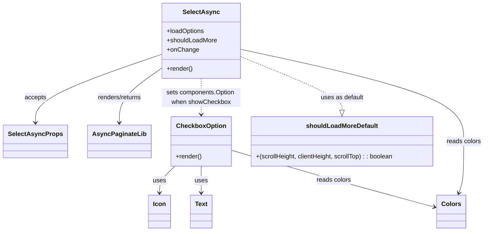

# Diagram: web/portal/src/components/atoms/SelectAsync.atom.tsx

> Auto-generated by Obscura crawlers

## Mermaid

### SVG

<svg id="container" width="1212.3203125" xmlns="http://www.w3.org/2000/svg" class="classDiagram" height="590" viewBox="0 0 1212.3203125 590" role="graphics-document document" aria-roledescription="class"><g><defs><marker id="container_class-aggregationStart" class="marker aggregation class" refX="18" refY="7" markerWidth="190" markerHeight="240" orient="auto"><path d="M 18,7 L9,13 L1,7 L9,1 Z"></path></marker></defs><defs><marker id="container_class-aggregationEnd" class="marker aggregation class" refX="1" refY="7" markerWidth="20" markerHeight="28" orient="auto"><path d="M 18,7 L9,13 L1,7 L9,1 Z"></path></marker></defs><defs><marker id="container_class-extensionStart" class="marker extension class" refX="18" refY="7" markerWidth="190" markerHeight="240" orient="auto"><path d="M 1,7 L18,13 V 1 Z"></path></marker></defs><defs><marker id="container_class-extensionEnd" class="marker extension class" refX="1" refY="7" markerWidth="20" markerHeight="28" orient="auto"><path d="M 1,1 V 13 L18,7 Z"></path></marker></defs><defs><marker id="container_class-compositionStart" class="marker composition class" refX="18" refY="7" markerWidth="190" markerHeight="240" orient="auto"><path d="M 18,7 L9,13 L1,7 L9,1 Z"></path></marker></defs><defs><marker id="container_class-compositionEnd" class="marker composition class" refX="1" refY="7" markerWidth="20" markerHeight="28" orient="auto"><path d="M 18,7 L9,13 L1,7 L9,1 Z"></path></marker></defs><defs><marker id="container_class-dependencyStart" class="marker dependency class" refX="6" refY="7" markerWidth="190" markerHeight="240" orient="auto"><path d="M 5,7 L9,13 L1,7 L9,1 Z"></path></marker></defs><defs><marker id="container_class-dependencyEnd" class="marker dependency class" refX="13" refY="7" markerWidth="20" markerHeight="28" orient="auto"><path d="M 18,7 L9,13 L14,7 L9,1 Z"></path></marker></defs><defs><marker id="container_class-lollipopStart" class="marker lollipop class" refX="13" refY="7" markerWidth="190" markerHeight="240" orient="auto"><circle stroke="black" fill="transparent" cx="7" cy="7" r="6"></circle></marker></defs><defs><marker id="container_class-lollipopEnd" class="marker lollipop class" refX="1" refY="7" markerWidth="190" markerHeight="240" orient="auto"><circle stroke="black" fill="transparent" cx="7" cy="7" r="6"></circle></marker></defs><g class="root"><g class="clusters"></g><g class="edgePaths"><path d="M390.063,139.303L339.154,157.586C288.245,175.868,186.427,212.434,135.518,241.384C84.609,270.333,84.609,291.667,84.609,302.333L84.609,313" id="id_SelectAsync_SelectAsyncProps_1" class="edge-thickness-normal edge-pattern-solid relation" style=";;;" data-edge="true" data-et="edge" data-id="id_SelectAsync_SelectAsyncProps_1" data-points="W3sieCI6MzkwLjA2MjUsInkiOjEzOS4zMDI3MjUzOTkzMjg1NX0seyJ4Ijo4NC42MDkzNzUsInkiOjI0OX0seyJ4Ijo4NC42MDkzNzUsInkiOjMxOX1d" marker-end="url(#container_class-dependencyEnd)"></path><path d="M390.063,174.819L372.901,187.182C355.74,199.546,321.417,224.273,304.255,247.303C287.094,270.333,287.094,291.667,287.094,302.333L287.094,313" id="id_SelectAsync_AsyncPaginateLib_2" class="edge-thickness-normal edge-pattern-solid relation" style=";;;" data-edge="true" data-et="edge" data-id="id_SelectAsync_AsyncPaginateLib_2" data-points="W3sieCI6MzkwLjA2MjUsInkiOjE3NC44MTg1MzQ2OTE4OTcxM30seyJ4IjoyODcuMDkzNzUsInkiOjI0OX0seyJ4IjoyODcuMDkzNzUsInkiOjMxOX1d" marker-end="url(#container_class-dependencyEnd)"></path><path d="M488.363,200L488.363,208.167C488.363,216.333,488.363,232.667,488.363,248C488.363,263.333,488.363,277.667,488.363,284.833L488.363,292" id="id_SelectAsync_CheckboxOption_3" class="edge-thickness-normal edge-pattern-dashed relation" style=";;;" data-edge="true" data-et="edge" data-id="id_SelectAsync_CheckboxOption_3" data-points="W3sieCI6NDg4LjM2MzI4MTI1LCJ5IjoyMDB9LHsieCI6NDg4LjM2MzI4MTI1LCJ5IjoyNDl9LHsieCI6NDg4LjM2MzI4MTI1LCJ5IjoyOTh9XQ==" marker-end="url(#container_class-dependencyEnd)"></path><path d="M422.41,424L415.954,430.167C409.499,436.333,396.587,448.667,390.132,460C383.676,471.333,383.676,481.667,383.676,486.833L383.676,492" id="id_CheckboxOption_Icon_4" class="edge-thickness-normal edge-pattern-solid relation" style=";;;" data-edge="true" data-et="edge" data-id="id_CheckboxOption_Icon_4" data-points="W3sieCI6NDIyLjQxMDE1NjI1LCJ5Ijo0MjR9LHsieCI6MzgzLjY3NTc4MTI1LCJ5Ijo0NjF9LHsieCI6MzgzLjY3NTc4MTI1LCJ5Ijo0OTh9XQ==" marker-end="url(#container_class-dependencyEnd)"></path><path d="M488.363,424L488.363,430.167C488.363,436.333,488.363,448.667,488.363,460C488.363,471.333,488.363,481.667,488.363,486.833L488.363,492" id="id_CheckboxOption_Text_5" class="edge-thickness-normal edge-pattern-solid relation" style=";;;" data-edge="true" data-et="edge" data-id="id_CheckboxOption_Text_5" data-points="W3sieCI6NDg4LjM2MzI4MTI1LCJ5Ijo0MjR9LHsieCI6NDg4LjM2MzI4MTI1LCJ5Ijo0NjF9LHsieCI6NDg4LjM2MzI4MTI1LCJ5Ijo0OTh9XQ==" marker-end="url(#container_class-dependencyEnd)"></path><path d="M586.664,143.7L630.12,161.25C673.576,178.8,760.487,213.9,803.943,236.742C847.398,259.583,847.398,270.167,847.398,275.458L847.398,280.75" id="id_SelectAsync_shouldLoadMoreDefault_6" class="edge-thickness-normal edge-pattern-dashed relation" style=";;;" data-edge="true" data-et="edge" data-id="id_SelectAsync_shouldLoadMoreDefault_6" data-points="W3sieCI6NTg2LjY2NDA2MjUsInkiOjE0My42OTk3NzA0MzUwODUzNn0seyJ4Ijo4NDcuMzk4NDM3NSwieSI6MjQ5fSx7IngiOjg0Ny4zOTg0Mzc1LCJ5IjoyOTh9XQ==" marker-end="url(#container_class-extensionEnd)"></path><path d="M586.664,125.217L682.25,145.847C777.836,166.478,969.008,207.739,1064.594,247.036C1160.18,286.333,1160.18,323.667,1160.18,359C1160.18,394.333,1160.18,427.667,1158.052,449.573C1155.925,471.48,1151.671,481.96,1149.543,487.201L1147.416,492.441" id="id_SelectAsync_Colors_7" class="edge-thickness-normal edge-pattern-solid relation" style=";;;" data-edge="true" data-et="edge" data-id="id_SelectAsync_Colors_7" data-points="W3sieCI6NTg2LjY2NDA2MjUsInkiOjEyNS4yMTY1MzA1MTEzODE4fSx7IngiOjExNjAuMTc5Njg3NSwieSI6MjQ5fSx7IngiOjExNjAuMTc5Njg3NSwieSI6MzYxfSx7IngiOjExNjAuMTc5Njg3NSwieSI6NDYxfSx7IngiOjExNDUuMTU5NDE0NTU2OTYyLCJ5Ijo0OTh9XQ==" marker-end="url(#container_class-dependencyEnd)"></path><path d="M563.758,382.907L608.551,395.923C653.344,408.938,742.931,434.969,830.173,459.329C917.415,483.69,1002.313,506.38,1044.762,517.725L1087.211,529.07" id="id_CheckboxOption_Colors_8" class="edge-thickness-normal edge-pattern-solid relation" style=";;;" data-edge="true" data-et="edge" data-id="id_CheckboxOption_Colors_8" data-points="W3sieCI6NTYzLjc1NzgxMjUsInkiOjM4Mi45MDcxODg3MDQxOTQ1fSx7IngiOjgzMi41MTc1NzgxMjUsInkiOjQ2MX0seyJ4IjoxMDkzLjAwNzgxMjUsInkiOjUzMC42MTg3NDAyMTI2Mjk2fV0=" marker-end="url(#container_class-dependencyEnd)"></path></g><g class="edgeLabels"><g class="edgeLabel" transform="translate(84.609375, 249)"><g class="label" data-id="id_SelectAsync_SelectAsyncProps_1" transform="translate(-27.421875, -12)"><foreignObject width="54.84375" height="24">

accepts

</foreignObject></g></g><g class="edgeLabel" transform="translate(287.09375, 249)"><g class="label" data-id="id_SelectAsync_AsyncPaginateLib_2" transform="translate(-57.9296875, -12)"><foreignObject width="115.859375" height="24">

renders/returns

</foreignObject></g></g><g class="edgeLabel" transform="translate(488.36328125, 249)"><g class="label" data-id="id_SelectAsync_CheckboxOption_3" transform="translate(-100, -24)"><foreignObject width="200" height="48">

sets components.Option when showCheckbox

</foreignObject></g></g><g class="edgeLabel" transform="translate(383.67578125, 461)"><g class="label" data-id="id_CheckboxOption_Icon_4" transform="translate(-16.4921875, -12)"><foreignObject width="32.984375" height="24">

uses

</foreignObject></g></g><g class="edgeLabel" transform="translate(488.36328125, 461)"><g class="label" data-id="id_CheckboxOption_Text_5" transform="translate(-16.4921875, -12)"><foreignObject width="32.984375" height="24">

uses

</foreignObject></g></g><g class="edgeLabel" transform="translate(847.3984375, 249)"><g class="label" data-id="id_SelectAsync_shouldLoadMoreDefault_6" transform="translate(-54.625, -12)"><foreignObject width="109.25" height="24">

uses as default

</foreignObject></g></g><g class="edgeLabel" transform="translate(1160.1796875, 361)"><g class="label" data-id="id_SelectAsync_Colors_7" transform="translate(-44.140625, -12)"><foreignObject width="88.28125" height="24">

reads colors

</foreignObject></g></g><g class="edgeLabel" transform="translate(827.5997, 459.57103)"><g class="label" data-id="id_CheckboxOption_Colors_8" transform="translate(-44.140625, -12)"><foreignObject width="88.28125" height="24">

reads colors

</foreignObject></g></g></g><g class="nodes"><g class="node default" id="classId-SelectAsync-0" transform="translate(488.36328125, 104)"><g class="basic label-container"><path d="M-98.30078125 -96 L98.30078125 -96 L98.30078125 96 L-98.30078125 96" stroke="none" stroke-width="0" fill="#ECECFF" style=""></path><path d="M-98.30078125 -96 C-40.688703516164004 -96, 16.92337421767199 -96, 98.30078125 -96 M-98.30078125 -96 C-56.406745743152925 -96, -14.51271023630585 -96, 98.30078125 -96 M98.30078125 -96 C98.30078125 -29.59633332288564, 98.30078125 36.80733335422872, 98.30078125 96 M98.30078125 -96 C98.30078125 -50.91763341029296, 98.30078125 -5.835266820585915, 98.30078125 96 M98.30078125 96 C46.5008498432435 96, -5.299081563512999 96, -98.30078125 96 M98.30078125 96 C51.48358093191403 96, 4.6663806138280535 96, -98.30078125 96 M-98.30078125 96 C-98.30078125 56.71539692147692, -98.30078125 17.430793842953847, -98.30078125 -96 M-98.30078125 96 C-98.30078125 41.94822529549907, -98.30078125 -12.103549409001857, -98.30078125 -96" stroke="#9370DB" stroke-width="1.3" fill="none" stroke-dasharray="0 0" style=""></path></g><g class="annotation-group text" transform="translate(0, -72)"></g><g class="label-group text" transform="translate(-43.6953125, -72)"><g class="label" style="font-weight: bolder" transform="translate(0,-12)"><foreignObject width="87.390625" height="24">

SelectAsync

</foreignObject></g></g><g class="members-group text" transform="translate(-86.30078125, -24)"><g class="label" style="" transform="translate(0,-12)"><foreignObject width="97.109375" height="24">

+loadOptions

</foreignObject></g><g class="label" style="" transform="translate(0,12)"><foreignObject width="128.90625" height="24">

+shouldLoadMore

</foreignObject></g><g class="label" style="" transform="translate(0,36)"><foreignObject width="79.75" height="24">

+onChange

</foreignObject></g></g><g class="methods-group text" transform="translate(-86.30078125, 72)"><g class="label" style="" transform="translate(0,-12)"><foreignObject width="66.609375" height="24">

+render()

</foreignObject></g></g><g class="divider" style=""><path d="M-98.30078125 -48 C-30.743927683195395 -48, 36.81292588360921 -48, 98.30078125 -48 M-98.30078125 -48 C-23.354681208678997 -48, 51.591418832642006 -48, 98.30078125 -48" stroke="#9370DB" stroke-width="1.3" fill="none" stroke-dasharray="0 0" style=""></path></g><g class="divider" style=""><path d="M-98.30078125 48 C-22.418058158881692 48, 53.464664932236616 48, 98.30078125 48 M-98.30078125 48 C-20.639683500664418 48, 57.021414248671164 48, 98.30078125 48" stroke="#9370DB" stroke-width="1.3" fill="none" stroke-dasharray="0 0" style=""></path></g></g><g class="node default" id="classId-CheckboxOption-1" transform="translate(488.36328125, 361)"><g class="basic label-container"><path d="M-75.39453125 -63 L75.39453125 -63 L75.39453125 63 L-75.39453125 63" stroke="none" stroke-width="0" fill="#ECECFF" style=""></path><path d="M-75.39453125 -63 C-39.75329886452344 -63, -4.112066479046874 -63, 75.39453125 -63 M-75.39453125 -63 C-34.42048760172232 -63, 6.553556046555357 -63, 75.39453125 -63 M75.39453125 -63 C75.39453125 -12.628539172555321, 75.39453125 37.74292165488936, 75.39453125 63 M75.39453125 -63 C75.39453125 -17.67408234766595, 75.39453125 27.651835304668097, 75.39453125 63 M75.39453125 63 C16.563888405124352 63, -42.266754439751296 63, -75.39453125 63 M75.39453125 63 C15.568595911883229 63, -44.25733942623354 63, -75.39453125 63 M-75.39453125 63 C-75.39453125 27.05624086785307, -75.39453125 -8.88751826429386, -75.39453125 -63 M-75.39453125 63 C-75.39453125 21.112773915744363, -75.39453125 -20.774452168511274, -75.39453125 -63" stroke="#9370DB" stroke-width="1.3" fill="none" stroke-dasharray="0 0" style=""></path></g><g class="annotation-group text" transform="translate(0, -39)"></g><g class="label-group text" transform="translate(-60.1796875, -39)"><g class="label" style="font-weight: bolder" transform="translate(0,-12)"><foreignObject width="120.359375" height="24">

CheckboxOption

</foreignObject></g></g><g class="members-group text" transform="translate(-63.39453125, 9)"></g><g class="methods-group text" transform="translate(-63.39453125, 39)"><g class="label" style="" transform="translate(0,-12)"><foreignObject width="66.609375" height="24">

+render()

</foreignObject></g></g><g class="divider" style=""><path d="M-75.39453125 -15 C-29.583419866567034 -15, 16.22769151686593 -15, 75.39453125 -15 M-75.39453125 -15 C-40.792408798747104 -15, -6.190286347494208 -15, 75.39453125 -15" stroke="#9370DB" stroke-width="1.3" fill="none" stroke-dasharray="0 0" style=""></path></g><g class="divider" style=""><path d="M-75.39453125 9 C-39.65819974007841 9, -3.921868230156818 9, 75.39453125 9 M-75.39453125 9 C-21.11099620522407 9, 33.17253883955186 9, 75.39453125 9" stroke="#9370DB" stroke-width="1.3" fill="none" stroke-dasharray="0 0" style=""></path></g></g><g class="node default" id="classId-shouldLoadMoreDefault-2" transform="translate(847.3984375, 361)"><g class="basic label-container"><path d="M-233.640625 -63 L233.640625 -63 L233.640625 63 L-233.640625 63" stroke="none" stroke-width="0" fill="#ECECFF" style=""></path><path d="M-233.640625 -63 C-60.36417430875363 -63, 112.91227638249273 -63, 233.640625 -63 M-233.640625 -63 C-66.6648257776582 -63, 100.31097344468361 -63, 233.640625 -63 M233.640625 -63 C233.640625 -37.56016770098549, 233.640625 -12.120335401970983, 233.640625 63 M233.640625 -63 C233.640625 -29.078362000205992, 233.640625 4.843275999588016, 233.640625 63 M233.640625 63 C118.15864054035507 63, 2.6766560807101314 63, -233.640625 63 M233.640625 63 C85.5888421293358 63, -62.462940741328396 63, -233.640625 63 M-233.640625 63 C-233.640625 14.991134323206936, -233.640625 -33.01773135358613, -233.640625 -63 M-233.640625 63 C-233.640625 13.262482948629554, -233.640625 -36.47503410274089, -233.640625 -63" stroke="#9370DB" stroke-width="1.3" fill="none" stroke-dasharray="0 0" style=""></path></g><g class="annotation-group text" transform="translate(0, -39)"></g><g class="label-group text" transform="translate(-87.59375, -39)"><g class="label" style="font-weight: bolder" transform="translate(0,-12)"><foreignObject width="175.1875" height="24">

shouldLoadMoreDefault

</foreignObject></g></g><g class="members-group text" transform="translate(-221.640625, 9)"></g><g class="methods-group text" transform="translate(-221.640625, 39)"><g class="label" style="" transform="translate(0,-12)"><foreignObject width="355.6875" height="24">

+(scrollHeight, clientHeight, scrollTop) : : boolean

</foreignObject></g></g><g class="divider" style=""><path d="M-233.640625 -15 C-96.27677905500724 -15, 41.08706688998552 -15, 233.640625 -15 M-233.640625 -15 C-124.69124335639249 -15, -15.741861712784981 -15, 233.640625 -15" stroke="#9370DB" stroke-width="1.3" fill="none" stroke-dasharray="0 0" style=""></path></g><g class="divider" style=""><path d="M-233.640625 9 C-52.32270449799688 9, 128.99521600400624 9, 233.640625 9 M-233.640625 9 C-63.04455135307626 9, 107.55152229384748 9, 233.640625 9" stroke="#9370DB" stroke-width="1.3" fill="none" stroke-dasharray="0 0" style=""></path></g></g><g class="node default" id="classId-SelectAsyncProps-3" transform="translate(84.609375, 361)"><g class="basic label-container"><path d="M-76.609375 -42 L76.609375 -42 L76.609375 42 L-76.609375 42" stroke="none" stroke-width="0" fill="#ECECFF" style=""></path><path d="M-76.609375 -42 C-25.278584640317916 -42, 26.052205719364167 -42, 76.609375 -42 M-76.609375 -42 C-27.040692480711193 -42, 22.527990038577613 -42, 76.609375 -42 M76.609375 -42 C76.609375 -20.587756508930543, 76.609375 0.8244869821389145, 76.609375 42 M76.609375 -42 C76.609375 -14.377088126447156, 76.609375 13.245823747105689, 76.609375 42 M76.609375 42 C38.975031692016806 42, 1.3406883840336121 42, -76.609375 42 M76.609375 42 C43.35858885751319 42, 10.10780271502638 42, -76.609375 42 M-76.609375 42 C-76.609375 18.828113640351265, -76.609375 -4.343772719297469, -76.609375 -42 M-76.609375 42 C-76.609375 18.687587804262538, -76.609375 -4.624824391474924, -76.609375 -42" stroke="#9370DB" stroke-width="1.3" fill="none" stroke-dasharray="0 0" style=""></path></g><g class="annotation-group text" transform="translate(0, -18)"></g><g class="label-group text" transform="translate(-64.609375, -18)"><g class="label" style="font-weight: bolder" transform="translate(0,-12)"><foreignObject width="129.21875" height="24">

SelectAsyncProps

</foreignObject></g></g><g class="members-group text" transform="translate(-64.609375, 30)"></g><g class="methods-group text" transform="translate(-64.609375, 60)"></g><g class="divider" style=""><path d="M-76.609375 6 C-26.412827903626408 6, 23.783719192747185 6, 76.609375 6 M-76.609375 6 C-17.619171991716286 6, 41.37103101656743 6, 76.609375 6" stroke="#9370DB" stroke-width="1.3" fill="none" stroke-dasharray="0 0" style=""></path></g><g class="divider" style=""><path d="M-76.609375 24 C-29.322226034479066 24, 17.96492293104187 24, 76.609375 24 M-76.609375 24 C-33.00436948697274 24, 10.600636026054516 24, 76.609375 24" stroke="#9370DB" stroke-width="1.3" fill="none" stroke-dasharray="0 0" style=""></path></g></g><g class="node default" id="classId-AsyncPaginateLib-4" transform="translate(287.09375, 361)"><g class="basic label-container"><path d="M-75.875 -42 L75.875 -42 L75.875 42 L-75.875 42" stroke="none" stroke-width="0" fill="#ECECFF" style=""></path><path d="M-75.875 -42 C-23.5069383487671 -42, 28.8611233024658 -42, 75.875 -42 M-75.875 -42 C-24.567898871864024 -42, 26.739202256271952 -42, 75.875 -42 M75.875 -42 C75.875 -11.095677111114362, 75.875 19.808645777771275, 75.875 42 M75.875 -42 C75.875 -9.352443608848716, 75.875 23.295112782302567, 75.875 42 M75.875 42 C25.61043358717346 42, -24.65413282565308 42, -75.875 42 M75.875 42 C18.584775544819315 42, -38.70544891036137 42, -75.875 42 M-75.875 42 C-75.875 16.54408709072107, -75.875 -8.911825818557858, -75.875 -42 M-75.875 42 C-75.875 10.112482556679446, -75.875 -21.77503488664111, -75.875 -42" stroke="#9370DB" stroke-width="1.3" fill="none" stroke-dasharray="0 0" style=""></path></g><g class="annotation-group text" transform="translate(0, -18)"></g><g class="label-group text" transform="translate(-63.875, -18)"><g class="label" style="font-weight: bolder" transform="translate(0,-12)"><foreignObject width="127.75" height="24">

AsyncPaginateLib

</foreignObject></g></g><g class="members-group text" transform="translate(-63.875, 30)"></g><g class="methods-group text" transform="translate(-63.875, 60)"></g><g class="divider" style=""><path d="M-75.875 6 C-19.80332727952579 6, 36.26834544094842 6, 75.875 6 M-75.875 6 C-20.531793018900217 6, 34.811413962199566 6, 75.875 6" stroke="#9370DB" stroke-width="1.3" fill="none" stroke-dasharray="0 0" style=""></path></g><g class="divider" style=""><path d="M-75.875 24 C-26.21182023652821 24, 23.451359526943577 24, 75.875 24 M-75.875 24 C-21.362570979457416 24, 33.14985804108517 24, 75.875 24" stroke="#9370DB" stroke-width="1.3" fill="none" stroke-dasharray="0 0" style=""></path></g></g><g class="node default" id="classId-Icon-5" transform="translate(383.67578125, 540)"><g class="basic label-container"><path d="M-27.3046875 -42 L27.3046875 -42 L27.3046875 42 L-27.3046875 42" stroke="none" stroke-width="0" fill="#ECECFF" style=""></path><path d="M-27.3046875 -42 C-16.287805202156726 -42, -5.270922904313451 -42, 27.3046875 -42 M-27.3046875 -42 C-7.287765444601948 -42, 12.729156610796103 -42, 27.3046875 -42 M27.3046875 -42 C27.3046875 -24.968864192289598, 27.3046875 -7.937728384579195, 27.3046875 42 M27.3046875 -42 C27.3046875 -9.912846020334761, 27.3046875 22.174307959330477, 27.3046875 42 M27.3046875 42 C13.1559894226997 42, -0.9927086546006016 42, -27.3046875 42 M27.3046875 42 C11.805139804520673 42, -3.6944078909586544 42, -27.3046875 42 M-27.3046875 42 C-27.3046875 19.056942478367898, -27.3046875 -3.886115043264205, -27.3046875 -42 M-27.3046875 42 C-27.3046875 8.414042656966444, -27.3046875 -25.17191468606711, -27.3046875 -42" stroke="#9370DB" stroke-width="1.3" fill="none" stroke-dasharray="0 0" style=""></path></g><g class="annotation-group text" transform="translate(0, -18)"></g><g class="label-group text" transform="translate(-15.3046875, -18)"><g class="label" style="font-weight: bolder" transform="translate(0,-12)"><foreignObject width="30.609375" height="24">

Icon

</foreignObject></g></g><g class="members-group text" transform="translate(-15.3046875, 30)"></g><g class="methods-group text" transform="translate(-15.3046875, 60)"></g><g class="divider" style=""><path d="M-27.3046875 6 C-5.932419729126451 6, 15.439848041747098 6, 27.3046875 6 M-27.3046875 6 C-13.773439100227996 6, -0.24219070045599267 6, 27.3046875 6" stroke="#9370DB" stroke-width="1.3" fill="none" stroke-dasharray="0 0" style=""></path></g><g class="divider" style=""><path d="M-27.3046875 24 C-13.355955291547252 24, 0.5927769169054962 24, 27.3046875 24 M-27.3046875 24 C-5.6455817533745325 24, 16.013523993250935 24, 27.3046875 24" stroke="#9370DB" stroke-width="1.3" fill="none" stroke-dasharray="0 0" style=""></path></g></g><g class="node default" id="classId-Text-6" transform="translate(488.36328125, 540)"><g class="basic label-container"><path d="M-27.3828125 -42 L27.3828125 -42 L27.3828125 42 L-27.3828125 42" stroke="none" stroke-width="0" fill="#ECECFF" style=""></path><path d="M-27.3828125 -42 C-6.728744188505097 -42, 13.925324122989807 -42, 27.3828125 -42 M-27.3828125 -42 C-10.497703644819513 -42, 6.387405210360974 -42, 27.3828125 -42 M27.3828125 -42 C27.3828125 -19.20932114677691, 27.3828125 3.581357706446177, 27.3828125 42 M27.3828125 -42 C27.3828125 -12.147390012614075, 27.3828125 17.70521997477185, 27.3828125 42 M27.3828125 42 C9.352149739455019 42, -8.678513021089962 42, -27.3828125 42 M27.3828125 42 C13.229693623704474 42, -0.923425252591052 42, -27.3828125 42 M-27.3828125 42 C-27.3828125 18.325065154583438, -27.3828125 -5.349869690833124, -27.3828125 -42 M-27.3828125 42 C-27.3828125 11.954084665720245, -27.3828125 -18.09183066855951, -27.3828125 -42" stroke="#9370DB" stroke-width="1.3" fill="none" stroke-dasharray="0 0" style=""></path></g><g class="annotation-group text" transform="translate(0, -18)"></g><g class="label-group text" transform="translate(-15.3828125, -18)"><g class="label" style="font-weight: bolder" transform="translate(0,-12)"><foreignObject width="30.765625" height="24">

Text

</foreignObject></g></g><g class="members-group text" transform="translate(-15.3828125, 30)"></g><g class="methods-group text" transform="translate(-15.3828125, 60)"></g><g class="divider" style=""><path d="M-27.3828125 6 C-11.75620984071369 6, 3.8703928185726184 6, 27.3828125 6 M-27.3828125 6 C-14.04472785946502 6, -0.70664321893004 6, 27.3828125 6" stroke="#9370DB" stroke-width="1.3" fill="none" stroke-dasharray="0 0" style=""></path></g><g class="divider" style=""><path d="M-27.3828125 24 C-6.808539139935789 24, 13.765734220128422 24, 27.3828125 24 M-27.3828125 24 C-14.926424285179557 24, -2.4700360703591144 24, 27.3828125 24" stroke="#9370DB" stroke-width="1.3" fill="none" stroke-dasharray="0 0" style=""></path></g></g><g class="node default" id="classId-Colors-7" transform="translate(1128.109375, 540)"><g class="basic label-container"><path d="M-35.1015625 -42 L35.1015625 -42 L35.1015625 42 L-35.1015625 42" stroke="none" stroke-width="0" fill="#ECECFF" style=""></path><path d="M-35.1015625 -42 C-9.520873163019509 -42, 16.059816173960982 -42, 35.1015625 -42 M-35.1015625 -42 C-10.040329787555503 -42, 15.020902924888993 -42, 35.1015625 -42 M35.1015625 -42 C35.1015625 -11.558131669886542, 35.1015625 18.883736660226916, 35.1015625 42 M35.1015625 -42 C35.1015625 -23.22149786148687, 35.1015625 -4.442995722973741, 35.1015625 42 M35.1015625 42 C17.322193472376487 42, -0.45717555524702647 42, -35.1015625 42 M35.1015625 42 C20.088131446220245 42, 5.074700392440494 42, -35.1015625 42 M-35.1015625 42 C-35.1015625 11.178257953118678, -35.1015625 -19.643484093762645, -35.1015625 -42 M-35.1015625 42 C-35.1015625 24.536651646244668, -35.1015625 7.073303292489335, -35.1015625 -42" stroke="#9370DB" stroke-width="1.3" fill="none" stroke-dasharray="0 0" style=""></path></g><g class="annotation-group text" transform="translate(0, -18)"></g><g class="label-group text" transform="translate(-23.1015625, -18)"><g class="label" style="font-weight: bolder" transform="translate(0,-12)"><foreignObject width="46.203125" height="24">

Colors

</foreignObject></g></g><g class="members-group text" transform="translate(-23.1015625, 30)"></g><g class="methods-group text" transform="translate(-23.1015625, 60)"></g><g class="divider" style=""><path d="M-35.1015625 6 C-12.025517009581133 6, 11.050528480837734 6, 35.1015625 6 M-35.1015625 6 C-9.136382511838367 6, 16.828797476323267 6, 35.1015625 6" stroke="#9370DB" stroke-width="1.3" fill="none" stroke-dasharray="0 0" style=""></path></g><g class="divider" style=""><path d="M-35.1015625 24 C-13.275213834595597 24, 8.551134830808806 24, 35.1015625 24 M-35.1015625 24 C-8.024438214659376 24, 19.052686070681247 24, 35.1015625 24" stroke="#9370DB" stroke-width="1.3" fill="none" stroke-dasharray="0 0" style=""></path></g></g></g></g></g></svg>
