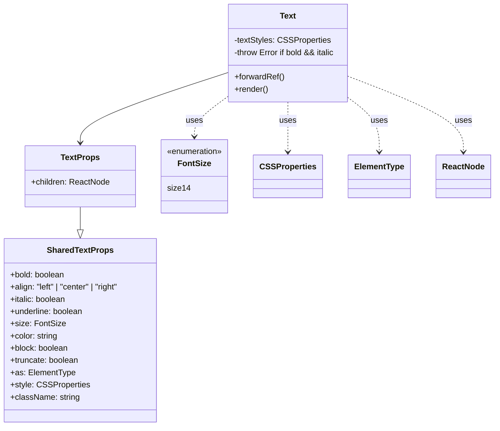

# Diagram: web/portal/src/components/atoms/Text.atom.tsx

> Auto-generated by Obscura crawlers

## Mermaid

### SVG

<svg id="container" width="962.390625" xmlns="http://www.w3.org/2000/svg" class="classDiagram" height="836" viewBox="0 0 962.390625 836" role="graphics-document document" aria-roledescription="class"><g><defs><marker id="container_class-aggregationStart" class="marker aggregation class" refX="18" refY="7" markerWidth="190" markerHeight="240" orient="auto"><path d="M 18,7 L9,13 L1,7 L9,1 Z"></path></marker></defs><defs><marker id="container_class-aggregationEnd" class="marker aggregation class" refX="1" refY="7" markerWidth="20" markerHeight="28" orient="auto"><path d="M 18,7 L9,13 L1,7 L9,1 Z"></path></marker></defs><defs><marker id="container_class-extensionStart" class="marker extension class" refX="18" refY="7" markerWidth="190" markerHeight="240" orient="auto"><path d="M 1,7 L18,13 V 1 Z"></path></marker></defs><defs><marker id="container_class-extensionEnd" class="marker extension class" refX="1" refY="7" markerWidth="20" markerHeight="28" orient="auto"><path d="M 1,1 V 13 L18,7 Z"></path></marker></defs><defs><marker id="container_class-compositionStart" class="marker composition class" refX="18" refY="7" markerWidth="190" markerHeight="240" orient="auto"><path d="M 18,7 L9,13 L1,7 L9,1 Z"></path></marker></defs><defs><marker id="container_class-compositionEnd" class="marker composition class" refX="1" refY="7" markerWidth="20" markerHeight="28" orient="auto"><path d="M 18,7 L9,13 L1,7 L9,1 Z"></path></marker></defs><defs><marker id="container_class-dependencyStart" class="marker dependency class" refX="6" refY="7" markerWidth="190" markerHeight="240" orient="auto"><path d="M 5,7 L9,13 L1,7 L9,1 Z"></path></marker></defs><defs><marker id="container_class-dependencyEnd" class="marker dependency class" refX="13" refY="7" markerWidth="20" markerHeight="28" orient="auto"><path d="M 18,7 L9,13 L14,7 L9,1 Z"></path></marker></defs><defs><marker id="container_class-lollipopStart" class="marker lollipop class" refX="13" refY="7" markerWidth="190" markerHeight="240" orient="auto"><circle stroke="black" fill="transparent" cx="7" cy="7" r="6"></circle></marker></defs><defs><marker id="container_class-lollipopEnd" class="marker lollipop class" refX="1" refY="7" markerWidth="190" markerHeight="240" orient="auto"><circle stroke="black" fill="transparent" cx="7" cy="7" r="6"></circle></marker></defs><g class="root"><g class="clusters"></g><g class="edgePaths"><path d="M162.703,406L162.703,412.167C162.703,418.333,162.703,430.667,162.703,438.125C162.703,445.583,162.703,448.167,162.703,449.458L162.703,450.75" id="id_TextProps_SharedTextProps_1" class="edge-thickness-normal edge-pattern-solid relation" style=";;;" data-edge="true" data-et="edge" data-id="id_TextProps_SharedTextProps_1" data-points="W3sieCI6MTYyLjcwMzEyNSwieSI6NDA2fSx7IngiOjE2Mi43MDMxMjUsInkiOjQ0M30seyJ4IjoxNjIuNzAzMTI1LCJ5Ijo0Njh9XQ==" marker-end="url(#container_class-extensionEnd)"></path><path d="M445.879,144.3L398.683,159.75C351.487,175.2,257.095,206.1,209.899,228.717C162.703,251.333,162.703,265.667,162.703,272.833L162.703,280" id="id_Text_TextProps_2" class="edge-thickness-normal edge-pattern-solid relation" style=";;;" data-edge="true" data-et="edge" data-id="id_Text_TextProps_2" data-points="W3sieCI6NDQ1Ljg3ODkwNjI1LCJ5IjoxNDQuMjk5NzM2NTU4NzI2MjR9LHsieCI6MTYyLjcwMzEyNSwieSI6MjM3fSx7IngiOjE2Mi43MDMxMjUsInkiOjI4Nn1d" marker-end="url(#container_class-dependencyEnd)"></path><path d="M568.984,200L568.984,206.167C568.984,212.333,568.984,224.667,568.984,241C568.984,257.333,568.984,277.667,568.984,287.833L568.984,298" id="id_Text_CSSProperties_3" class="edge-thickness-normal edge-pattern-dashed relation" style=";;;" data-edge="true" data-et="edge" data-id="id_Text_CSSProperties_3" data-points="W3sieCI6NTY4Ljk4NDM3NSwieSI6MjAwfSx7IngiOjU2OC45ODQzNzUsInkiOjIzN30seyJ4Ijo1NjguOTg0Mzc1LCJ5IjozMDR9XQ==" marker-end="url(#container_class-dependencyEnd)"></path><path d="M692.09,198.642L700.406,205.035C708.721,211.428,725.353,224.214,733.669,240.774C741.984,257.333,741.984,277.667,741.984,287.833L741.984,298" id="id_Text_ElementType_4" class="edge-thickness-normal edge-pattern-dashed relation" style=";;;" data-edge="true" data-et="edge" data-id="id_Text_ElementType_4" data-points="W3sieCI6NjkyLjA4OTg0Mzc1LCJ5IjoxOTguNjQxNzc2NTUzNDY4MjJ9LHsieCI6NzQxLjk4NDM3NSwieSI6MjM3fSx7IngiOjc0MS45ODQzNzUsInkiOjMwNH1d" marker-end="url(#container_class-dependencyEnd)"></path><path d="M692.09,153.057L727.199,167.047C762.307,181.038,832.525,209.019,867.633,233.176C902.742,257.333,902.742,277.667,902.742,287.833L902.742,298" id="id_Text_ReactNode_5" class="edge-thickness-normal edge-pattern-dashed relation" style=";;;" data-edge="true" data-et="edge" data-id="id_Text_ReactNode_5" data-points="W3sieCI6NjkyLjA4OTg0Mzc1LCJ5IjoxNTMuMDU2NjExNTAyNTM5NzR9LHsieCI6OTAyLjc0MjE4NzUsInkiOjIzN30seyJ4Ijo5MDIuNzQyMTg3NSwieSI6MzA0fV0=" marker-end="url(#container_class-dependencyEnd)"></path><path d="M445.879,194.237L436.156,201.364C426.432,208.491,406.986,222.746,397.262,235.039C387.539,247.333,387.539,257.667,387.539,262.833L387.539,268" id="id_Text_FontSize_6" class="edge-thickness-normal edge-pattern-dashed relation" style=";;;" data-edge="true" data-et="edge" data-id="id_Text_FontSize_6" data-points="W3sieCI6NDQ1Ljg3ODkwNjI1LCJ5IjoxOTQuMjM2NzA2MTM1NjI5N30seyJ4IjozODcuNTM5MDYyNSwieSI6MjM3fSx7IngiOjM4Ny41MzkwNjI1LCJ5IjoyNzR9XQ==" marker-end="url(#container_class-dependencyEnd)"></path></g><g class="edgeLabels"><g class="edgeLabel"><g class="label" data-id="id_TextProps_SharedTextProps_1" transform="translate(0, 0)"><foreignObject width="0" height="0">

</foreignObject></g></g><g class="edgeLabel"><g class="label" data-id="id_Text_TextProps_2" transform="translate(0, 0)"><foreignObject width="0" height="0">

</foreignObject></g></g><g class="edgeLabel" transform="translate(568.984375, 237)"><g class="label" data-id="id_Text_CSSProperties_3" transform="translate(-16.4921875, -12)"><foreignObject width="32.984375" height="24">

uses

</foreignObject></g></g><g class="edgeLabel" transform="translate(741.984375, 237)"><g class="label" data-id="id_Text_ElementType_4" transform="translate(-16.4921875, -12)"><foreignObject width="32.984375" height="24">

uses

</foreignObject></g></g><g class="edgeLabel" transform="translate(902.7421875, 237)"><g class="label" data-id="id_Text_ReactNode_5" transform="translate(-16.4921875, -12)"><foreignObject width="32.984375" height="24">

uses

</foreignObject></g></g><g class="edgeLabel" transform="translate(387.5390625, 237)"><g class="label" data-id="id_Text_FontSize_6" transform="translate(-16.4921875, -12)"><foreignObject width="32.984375" height="24">

uses

</foreignObject></g></g></g><g class="nodes"><g class="node default" id="classId-Text-0" transform="translate(568.984375, 104)"><g class="basic label-container"><path d="M-123.10546875 -96 L123.10546875 -96 L123.10546875 96 L-123.10546875 96" stroke="none" stroke-width="0" fill="#ECECFF" style=""></path><path d="M-123.10546875 -96 C-51.116914748913246 -96, 20.87163925217351 -96, 123.10546875 -96 M-123.10546875 -96 C-33.004925016134464 -96, 57.09561871773107 -96, 123.10546875 -96 M123.10546875 -96 C123.10546875 -47.60280541142466, 123.10546875 0.794389177150677, 123.10546875 96 M123.10546875 -96 C123.10546875 -43.501030491056305, 123.10546875 8.99793901788739, 123.10546875 96 M123.10546875 96 C60.991177296389786 96, -1.123114157220428 96, -123.10546875 96 M123.10546875 96 C37.915397947730824 96, -47.27467285453835 96, -123.10546875 96 M-123.10546875 96 C-123.10546875 46.886436574445376, -123.10546875 -2.2271268511092472, -123.10546875 -96 M-123.10546875 96 C-123.10546875 36.30008868924831, -123.10546875 -23.399822621503375, -123.10546875 -96" stroke="#9370DB" stroke-width="1.3" fill="none" stroke-dasharray="0 0" style=""></path></g><g class="annotation-group text" transform="translate(0, -72)"></g><g class="label-group text" transform="translate(-15.3828125, -72)"><g class="label" style="font-weight: bolder" transform="translate(0,-12)"><foreignObject width="30.765625" height="24">

Text

</foreignObject></g></g><g class="members-group text" transform="translate(-111.10546875, -24)"><g class="label" style="" transform="translate(0,-12)"><foreignObject width="186.140625" height="24">

-textStyles: CSSProperties

</foreignObject></g><g class="label" style="" transform="translate(0,12)"><foreignObject width="206.828125" height="24">

-throw Error if bold &amp;&amp; italic

</foreignObject></g></g><g class="methods-group text" transform="translate(-111.10546875, 48)"><g class="label" style="" transform="translate(0,-12)"><foreignObject width="97.609375" height="24">

+forwardRef()

</foreignObject></g><g class="label" style="" transform="translate(0,12)"><foreignObject width="66.609375" height="24">

+render()

</foreignObject></g></g><g class="divider" style=""><path d="M-123.10546875 -48 C-57.40848807837408 -48, 8.288492593251846 -48, 123.10546875 -48 M-123.10546875 -48 C-51.48753719547055 -48, 20.130394359058897 -48, 123.10546875 -48" stroke="#9370DB" stroke-width="1.3" fill="none" stroke-dasharray="0 0" style=""></path></g><g class="divider" style=""><path d="M-123.10546875 24 C-68.5662079177793 24, -14.02694708555859 24, 123.10546875 24 M-123.10546875 24 C-38.882721774504816 24, 45.34002520099037 24, 123.10546875 24" stroke="#9370DB" stroke-width="1.3" fill="none" stroke-dasharray="0 0" style=""></path></g></g><g class="node default" id="classId-SharedTextProps-1" transform="translate(162.703125, 648)"><g class="basic label-container"><path d="M-154.703125 -180 L154.703125 -180 L154.703125 180 L-154.703125 180" stroke="none" stroke-width="0" fill="#ECECFF" style=""></path><path d="M-154.703125 -180 C-58.6544397806133 -180, 37.394245438773396 -180, 154.703125 -180 M-154.703125 -180 C-55.40173834993162 -180, 43.89964830013676 -180, 154.703125 -180 M154.703125 -180 C154.703125 -81.58574525155957, 154.703125 16.828509496880855, 154.703125 180 M154.703125 -180 C154.703125 -53.81673419269772, 154.703125 72.36653161460455, 154.703125 180 M154.703125 180 C34.579387787722496 180, -85.54434942455501 180, -154.703125 180 M154.703125 180 C70.07928951127442 180, -14.54454597745115 180, -154.703125 180 M-154.703125 180 C-154.703125 62.074820193848225, -154.703125 -55.85035961230355, -154.703125 -180 M-154.703125 180 C-154.703125 49.8228952691247, -154.703125 -80.3542094617506, -154.703125 -180" stroke="#9370DB" stroke-width="1.3" fill="none" stroke-dasharray="0 0" style=""></path></g><g class="annotation-group text" transform="translate(0, -156)"></g><g class="label-group text" transform="translate(-62.0625, -156)"><g class="label" style="font-weight: bolder" transform="translate(0,-12)"><foreignObject width="124.125" height="24">

SharedTextProps

</foreignObject></g></g><g class="members-group text" transform="translate(-142.703125, -108)"><g class="label" style="" transform="translate(0,-12)"><foreignObject width="108.53125" height="24">

+bold: boolean

</foreignObject></g><g class="label" style="" transform="translate(0,12)"><foreignObject width="223.34375" height="24">

+align: "left" | "center" | "right"

</foreignObject></g><g class="label" style="" transform="translate(0,36)"><foreignObject width="111.140625" height="24">

+italic: boolean

</foreignObject></g><g class="label" style="" transform="translate(0,60)"><foreignObject width="145.953125" height="24">

+underline: boolean

</foreignObject></g><g class="label" style="" transform="translate(0,84)"><foreignObject width="104.28125" height="24">

+size: FontSize

</foreignObject></g><g class="label" style="" transform="translate(0,108)"><foreignObject width="94.65625" height="24">

+color: string

</foreignObject></g><g class="label" style="" transform="translate(0,132)"><foreignObject width="114.875" height="24">

+block: boolean

</foreignObject></g><g class="label" style="" transform="translate(0,156)"><foreignObject width="136.515625" height="24">

+truncate: boolean

</foreignObject></g><g class="label" style="" transform="translate(0,180)"><foreignObject width="124.9375" height="24">

+as: ElementType

</foreignObject></g><g class="label" style="" transform="translate(0,204)"><foreignObject width="151.390625" height="24">

+style: CSSProperties

</foreignObject></g><g class="label" style="" transform="translate(0,228)"><foreignObject width="135.359375" height="24">

+className: string

</foreignObject></g></g><g class="methods-group text" transform="translate(-142.703125, 180)"></g><g class="divider" style=""><path d="M-154.703125 -132 C-68.26772206180918 -132, 18.167680876381638 -132, 154.703125 -132 M-154.703125 -132 C-85.75014702643587 -132, -16.797169052871737 -132, 154.703125 -132" stroke="#9370DB" stroke-width="1.3" fill="none" stroke-dasharray="0 0" style=""></path></g><g class="divider" style=""><path d="M-154.703125 156 C-37.42843869219679 156, 79.84624761560642 156, 154.703125 156 M-154.703125 156 C-89.26685340477925 156, -23.83058180955851 156, 154.703125 156" stroke="#9370DB" stroke-width="1.3" fill="none" stroke-dasharray="0 0" style=""></path></g></g><g class="node default" id="classId-TextProps-2" transform="translate(162.703125, 346)"><g class="basic label-container"><path d="M-107.28125 -60 L107.28125 -60 L107.28125 60 L-107.28125 60" stroke="none" stroke-width="0" fill="#ECECFF" style=""></path><path d="M-107.28125 -60 C-49.47721930397803 -60, 8.326811392043936 -60, 107.28125 -60 M-107.28125 -60 C-29.672463018497893 -60, 47.93632396300421 -60, 107.28125 -60 M107.28125 -60 C107.28125 -17.125102025996654, 107.28125 25.749795948006692, 107.28125 60 M107.28125 -60 C107.28125 -35.770523603518015, 107.28125 -11.54104720703603, 107.28125 60 M107.28125 60 C21.472869626474406 60, -64.33551074705119 60, -107.28125 60 M107.28125 60 C42.58193151333214 60, -22.117386973335726 60, -107.28125 60 M-107.28125 60 C-107.28125 23.96418165657451, -107.28125 -12.07163668685098, -107.28125 -60 M-107.28125 60 C-107.28125 19.42898758369467, -107.28125 -21.14202483261066, -107.28125 -60" stroke="#9370DB" stroke-width="1.3" fill="none" stroke-dasharray="0 0" style=""></path></g><g class="annotation-group text" transform="translate(0, -36)"></g><g class="label-group text" transform="translate(-36.296875, -36)"><g class="label" style="font-weight: bolder" transform="translate(0,-12)"><foreignObject width="72.59375" height="24">

TextProps

</foreignObject></g></g><g class="members-group text" transform="translate(-95.28125, 12)"><g class="label" style="" transform="translate(0,-12)"><foreignObject width="154.265625" height="24">

+children: ReactNode

</foreignObject></g></g><g class="methods-group text" transform="translate(-95.28125, 60)"></g><g class="divider" style=""><path d="M-107.28125 -12 C-28.897067357741236 -12, 49.48711528451753 -12, 107.28125 -12 M-107.28125 -12 C-44.91000119097701 -12, 17.461247618045974 -12, 107.28125 -12" stroke="#9370DB" stroke-width="1.3" fill="none" stroke-dasharray="0 0" style=""></path></g><g class="divider" style=""><path d="M-107.28125 36 C-55.13419548497901 36, -2.98714096995802 36, 107.28125 36 M-107.28125 36 C-46.270700448023426 36, 14.739849103953148 36, 107.28125 36" stroke="#9370DB" stroke-width="1.3" fill="none" stroke-dasharray="0 0" style=""></path></g></g><g class="node default" id="classId-FontSize-3" transform="translate(387.5390625, 346)"><g class="basic label-container"><path d="M-67.5546875 -72 L67.5546875 -72 L67.5546875 72 L-67.5546875 72" stroke="none" stroke-width="0" fill="#ECECFF" style=""></path><path d="M-67.5546875 -72 C-23.983125232204927 -72, 19.588437035590147 -72, 67.5546875 -72 M-67.5546875 -72 C-30.06714939084847 -72, 7.420388718303059 -72, 67.5546875 -72 M67.5546875 -72 C67.5546875 -35.29678695086059, 67.5546875 1.4064260982788142, 67.5546875 72 M67.5546875 -72 C67.5546875 -27.01962578253351, 67.5546875 17.96074843493298, 67.5546875 72 M67.5546875 72 C13.579014645243625 72, -40.39665820951275 72, -67.5546875 72 M67.5546875 72 C36.56287657659286 72, 5.571065653185727 72, -67.5546875 72 M-67.5546875 72 C-67.5546875 15.92908028932382, -67.5546875 -40.14183942135236, -67.5546875 -72 M-67.5546875 72 C-67.5546875 17.001469739109353, -67.5546875 -37.99706052178129, -67.5546875 -72" stroke="#9370DB" stroke-width="1.3" fill="none" stroke-dasharray="0 0" style=""></path></g><g class="annotation-group text" transform="translate(-55.5546875, -48)"><g class="label" style="" transform="translate(0,-12)"><foreignObject width="111.109375" height="24">

«enumeration»

</foreignObject></g></g><g class="label-group text" transform="translate(-30.84375, -24)"><g class="label" style="font-weight: bolder" transform="translate(0,-12)"><foreignObject width="61.6875" height="24">

FontSize

</foreignObject></g></g><g class="members-group text" transform="translate(-55.5546875, 24)"><g class="label" style="" transform="translate(0,-12)"><foreignObject width="42.234375" height="24">

size14

</foreignObject></g></g><g class="methods-group text" transform="translate(-55.5546875, 72)"></g><g class="divider" style=""><path d="M-67.5546875 0 C-33.233821965529614 0, 1.0870435689407714 0, 67.5546875 0 M-67.5546875 0 C-29.180938123168296 0, 9.192811253663407 0, 67.5546875 0" stroke="#9370DB" stroke-width="1.3" fill="none" stroke-dasharray="0 0" style=""></path></g><g class="divider" style=""><path d="M-67.5546875 48 C-17.93412111953922 48, 31.68644526092156 48, 67.5546875 48 M-67.5546875 48 C-39.65154043976281 48, -11.748393379525623 48, 67.5546875 48" stroke="#9370DB" stroke-width="1.3" fill="none" stroke-dasharray="0 0" style=""></path></g></g><g class="node default" id="classId-CSSProperties-4" transform="translate(568.984375, 346)"><g class="basic label-container"><path d="M-63.890625 -42 L63.890625 -42 L63.890625 42 L-63.890625 42" stroke="none" stroke-width="0" fill="#ECECFF" style=""></path><path d="M-63.890625 -42 C-30.783464324668444 -42, 2.3236963506631128 -42, 63.890625 -42 M-63.890625 -42 C-35.255376863482084 -42, -6.620128726964161 -42, 63.890625 -42 M63.890625 -42 C63.890625 -20.943651601776143, 63.890625 0.11269679644771458, 63.890625 42 M63.890625 -42 C63.890625 -10.754957340954583, 63.890625 20.490085318090834, 63.890625 42 M63.890625 42 C18.96540784908798 42, -25.959809301824038 42, -63.890625 42 M63.890625 42 C19.631742915216208 42, -24.627139169567585 42, -63.890625 42 M-63.890625 42 C-63.890625 18.922004962573865, -63.890625 -4.155990074852269, -63.890625 -42 M-63.890625 42 C-63.890625 21.178227188934116, -63.890625 0.3564543778682321, -63.890625 -42" stroke="#9370DB" stroke-width="1.3" fill="none" stroke-dasharray="0 0" style=""></path></g><g class="annotation-group text" transform="translate(0, -18)"></g><g class="label-group text" transform="translate(-51.890625, -18)"><g class="label" style="font-weight: bolder" transform="translate(0,-12)"><foreignObject width="103.78125" height="24">

CSSProperties

</foreignObject></g></g><g class="members-group text" transform="translate(-51.890625, 30)"></g><g class="methods-group text" transform="translate(-51.890625, 60)"></g><g class="divider" style=""><path d="M-63.890625 6 C-17.137907081661652 6, 29.614810836676696 6, 63.890625 6 M-63.890625 6 C-28.43898242665567 6, 7.01266014668866 6, 63.890625 6" stroke="#9370DB" stroke-width="1.3" fill="none" stroke-dasharray="0 0" style=""></path></g><g class="divider" style=""><path d="M-63.890625 24 C-35.21312919286868 24, -6.5356333857373485 24, 63.890625 24 M-63.890625 24 C-38.194297410915 24, -12.49796982182999 24, 63.890625 24" stroke="#9370DB" stroke-width="1.3" fill="none" stroke-dasharray="0 0" style=""></path></g></g><g class="node default" id="classId-ElementType-5" transform="translate(741.984375, 346)"><g class="basic label-container"><path d="M-59.109375 -42 L59.109375 -42 L59.109375 42 L-59.109375 42" stroke="none" stroke-width="0" fill="#ECECFF" style=""></path><path d="M-59.109375 -42 C-32.227586087643914 -42, -5.345797175287835 -42, 59.109375 -42 M-59.109375 -42 C-31.972401522541563 -42, -4.835428045083127 -42, 59.109375 -42 M59.109375 -42 C59.109375 -13.485079477232329, 59.109375 15.029841045535342, 59.109375 42 M59.109375 -42 C59.109375 -21.42709620345273, 59.109375 -0.8541924069054616, 59.109375 42 M59.109375 42 C25.87996768505962 42, -7.349439629880763 42, -59.109375 42 M59.109375 42 C27.357520176329317 42, -4.394334647341367 42, -59.109375 42 M-59.109375 42 C-59.109375 13.282709187042453, -59.109375 -15.434581625915094, -59.109375 -42 M-59.109375 42 C-59.109375 22.214637148429127, -59.109375 2.429274296858253, -59.109375 -42" stroke="#9370DB" stroke-width="1.3" fill="none" stroke-dasharray="0 0" style=""></path></g><g class="annotation-group text" transform="translate(0, -18)"></g><g class="label-group text" transform="translate(-47.109375, -18)"><g class="label" style="font-weight: bolder" transform="translate(0,-12)"><foreignObject width="94.21875" height="24">

ElementType

</foreignObject></g></g><g class="members-group text" transform="translate(-47.109375, 30)"></g><g class="methods-group text" transform="translate(-47.109375, 60)"></g><g class="divider" style=""><path d="M-59.109375 6 C-34.61541885265029 6, -10.121462705300587 6, 59.109375 6 M-59.109375 6 C-15.164151016477852 6, 28.781072967044295 6, 59.109375 6" stroke="#9370DB" stroke-width="1.3" fill="none" stroke-dasharray="0 0" style=""></path></g><g class="divider" style=""><path d="M-59.109375 24 C-29.60317014288836 24, -0.0969652857767187 24, 59.109375 24 M-59.109375 24 C-31.569722036970248 24, -4.030069073940496 24, 59.109375 24" stroke="#9370DB" stroke-width="1.3" fill="none" stroke-dasharray="0 0" style=""></path></g></g><g class="node default" id="classId-ReactNode-6" transform="translate(902.7421875, 346)"><g class="basic label-container"><path d="M-51.6484375 -42 L51.6484375 -42 L51.6484375 42 L-51.6484375 42" stroke="none" stroke-width="0" fill="#ECECFF" style=""></path><path d="M-51.6484375 -42 C-17.76778382010965 -42, 16.1128698597807 -42, 51.6484375 -42 M-51.6484375 -42 C-20.181251619237297 -42, 11.285934261525405 -42, 51.6484375 -42 M51.6484375 -42 C51.6484375 -22.311733764714266, 51.6484375 -2.623467529428531, 51.6484375 42 M51.6484375 -42 C51.6484375 -15.885573797657994, 51.6484375 10.228852404684012, 51.6484375 42 M51.6484375 42 C14.16447079486678 42, -23.31949591026644 42, -51.6484375 42 M51.6484375 42 C21.204775011107785 42, -9.23888747778443 42, -51.6484375 42 M-51.6484375 42 C-51.6484375 9.131992876410997, -51.6484375 -23.736014247178005, -51.6484375 -42 M-51.6484375 42 C-51.6484375 16.328454954228622, -51.6484375 -9.343090091542756, -51.6484375 -42" stroke="#9370DB" stroke-width="1.3" fill="none" stroke-dasharray="0 0" style=""></path></g><g class="annotation-group text" transform="translate(0, -18)"></g><g class="label-group text" transform="translate(-39.6484375, -18)"><g class="label" style="font-weight: bolder" transform="translate(0,-12)"><foreignObject width="79.296875" height="24">

ReactNode

</foreignObject></g></g><g class="members-group text" transform="translate(-39.6484375, 30)"></g><g class="methods-group text" transform="translate(-39.6484375, 60)"></g><g class="divider" style=""><path d="M-51.6484375 6 C-26.253949041315064 6, -0.8594605826301276 6, 51.6484375 6 M-51.6484375 6 C-11.940677229721054 6, 27.767083040557893 6, 51.6484375 6" stroke="#9370DB" stroke-width="1.3" fill="none" stroke-dasharray="0 0" style=""></path></g><g class="divider" style=""><path d="M-51.6484375 24 C-15.710622635941561 24, 20.227192228116877 24, 51.6484375 24 M-51.6484375 24 C-19.700995974669077 24, 12.246445550661846 24, 51.6484375 24" stroke="#9370DB" stroke-width="1.3" fill="none" stroke-dasharray="0 0" style=""></path></g></g></g></g></g></svg>
