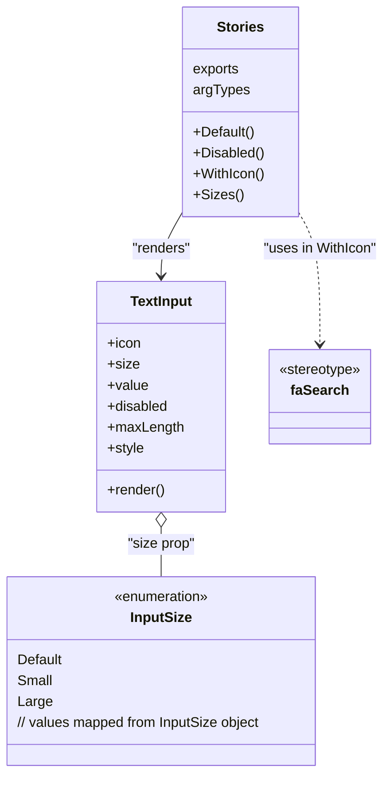

# Diagram: web/portal/src/components/atoms/TextInput.atom.stories.js

> Auto-generated by Obscura crawlers

## Mermaid

```mermaid
classDiagram
class TextInput {
  +icon
  +size
  +value
  +disabled
  +maxLength
  +style
  +render()
}
class InputSize <<enumeration>> {
  Default
  Small
  Large
  // values mapped from InputSize object
}
class faSearch <<stereotype>>
class Stories {
  +Default()
  +Disabled()
  +WithIcon()
  +Sizes()
}
Stories --> TextInput : "renders"
Stories : exports
Stories : argTypes
Stories ..> faSearch : "uses in WithIcon"
TextInput o-- InputSize : "size prop"
```

> SVG rendering failed for this diagram.
