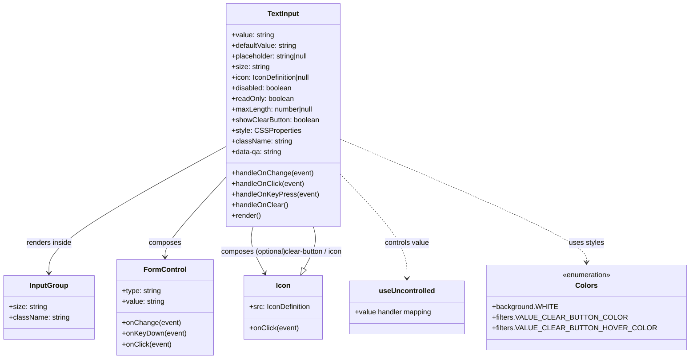

# Diagram: web/portal/src/components/atoms/TextInput.atom.tsx


> Auto-generated by Obscura crawlers

## Diagram 1



### SVG

<svg id="container" width="1516.68359375" xmlns="http://www.w3.org/2000/svg" class="classDiagram" height="810" viewBox="0 0 1516.68359375 810" role="graphics-document document" aria-roledescription="class"><style>#container{font-family:"trebuchet ms",verdana,arial,sans-serif;font-size:16px;fill:#333;}@keyframes edge-animation-frame{from{stroke-dashoffset:0;}}@keyframes dash{to{stroke-dashoffset:0;}}#container .edge-animation-slow{stroke-dasharray:9,5!important;stroke-dashoffset:900;animation:dash 50s linear infinite;stroke-linecap:round;}#container .edge-animation-fast{stroke-dasharray:9,5!important;stroke-dashoffset:900;animation:dash 20s linear infinite;stroke-linecap:round;}#container .error-icon{fill:#552222;}#container .error-text{fill:#552222;stroke:#552222;}#container .edge-thickness-normal{stroke-width:1px;}#container .edge-thickness-thick{stroke-width:3.5px;}#container .edge-pattern-solid{stroke-dasharray:0;}#container .edge-thickness-invisible{stroke-width:0;fill:none;}#container .edge-pattern-dashed{stroke-dasharray:3;}#container .edge-pattern-dotted{stroke-dasharray:2;}#container .marker{fill:#333333;stroke:#333333;}#container .marker.cross{stroke:#333333;}#container svg{font-family:"trebuchet ms",verdana,arial,sans-serif;font-size:16px;}#container p{margin:0;}#container g.classGroup text{fill:#9370DB;stroke:none;font-family:"trebuchet ms",verdana,arial,sans-serif;font-size:10px;}#container g.classGroup text .title{font-weight:bolder;}#container .nodeLabel,#container .edgeLabel{color:#131300;}#container .edgeLabel .label rect{fill:#ECECFF;}#container .label text{fill:#131300;}#container .labelBkg{background:#ECECFF;}#container .edgeLabel .label span{background:#ECECFF;}#container .classTitle{font-weight:bolder;}#container .node rect,#container .node circle,#container .node ellipse,#container .node polygon,#container .node path{fill:#ECECFF;stroke:#9370DB;stroke-width:1px;}#container .divider{stroke:#9370DB;stroke-width:1;}#container g.clickable{cursor:pointer;}#container g.classGroup rect{fill:#ECECFF;stroke:#9370DB;}#container g.classGroup line{stroke:#9370DB;stroke-width:1;}#container .classLabel .box{stroke:none;stroke-width:0;fill:#ECECFF;opacity:0.5;}#container .classLabel .label{fill:#9370DB;font-size:10px;}#container .relation{stroke:#333333;stroke-width:1;fill:none;}#container .dashed-line{stroke-dasharray:3;}#container .dotted-line{stroke-dasharray:1 2;}#container #compositionStart,#container .composition{fill:#333333!important;stroke:#333333!important;stroke-width:1;}#container #compositionEnd,#container .composition{fill:#333333!important;stroke:#333333!important;stroke-width:1;}#container #dependencyStart,#container .dependency{fill:#333333!important;stroke:#333333!important;stroke-width:1;}#container #dependencyStart,#container .dependency{fill:#333333!important;stroke:#333333!important;stroke-width:1;}#container #extensionStart,#container .extension{fill:transparent!important;stroke:#333333!important;stroke-width:1;}#container #extensionEnd,#container .extension{fill:transparent!important;stroke:#333333!important;stroke-width:1;}#container #aggregationStart,#container .aggregation{fill:transparent!important;stroke:#333333!important;stroke-width:1;}#container #aggregationEnd,#container .aggregation{fill:transparent!important;stroke:#333333!important;stroke-width:1;}#container #lollipopStart,#container .lollipop{fill:#ECECFF!important;stroke:#333333!important;stroke-width:1;}#container #lollipopEnd,#container .lollipop{fill:#ECECFF!important;stroke:#333333!important;stroke-width:1;}#container .edgeTerminals{font-size:11px;line-height:initial;}#container .classTitleText{text-anchor:middle;font-size:18px;fill:#333;}#container .label-icon{display:inline-block;height:1em;overflow:visible;vertical-align:-0.125em;}#container .node .label-icon path{fill:currentColor;stroke:revert;stroke-width:revert;}#container :root{--mermaid-font-family:"trebuchet ms",verdana,arial,sans-serif;}</style><g><defs><marker id="container_class-aggregationStart" class="marker aggregation class" refX="18" refY="7" markerWidth="190" markerHeight="240" orient="auto"><path d="M 18,7 L9,13 L1,7 L9,1 Z"></path></marker></defs><defs><marker id="container_class-aggregationEnd" class="marker aggregation class" refX="1" refY="7" markerWidth="20" markerHeight="28" orient="auto"><path d="M 18,7 L9,13 L1,7 L9,1 Z"></path></marker></defs><defs><marker id="container_class-extensionStart" class="marker extension class" refX="18" refY="7" markerWidth="190" markerHeight="240" orient="auto"><path d="M 1,7 L18,13 V 1 Z"></path></marker></defs><defs><marker id="container_class-extensionEnd" class="marker extension class" refX="1" refY="7" markerWidth="20" markerHeight="28" orient="auto"><path d="M 1,1 V 13 L18,7 Z"></path></marker></defs><defs><marker id="container_class-compositionStart" class="marker composition class" refX="18" refY="7" markerWidth="190" markerHeight="240" orient="auto"><path d="M 18,7 L9,13 L1,7 L9,1 Z"></path></marker></defs><defs><marker id="container_class-compositionEnd" class="marker composition class" refX="1" refY="7" markerWidth="20" markerHeight="28" orient="auto"><path d="M 18,7 L9,13 L1,7 L9,1 Z"></path></marker></defs><defs><marker id="container_class-dependencyStart" class="marker dependency class" refX="6" refY="7" markerWidth="190" markerHeight="240" orient="auto"><path d="M 5,7 L9,13 L1,7 L9,1 Z"></path></marker></defs><defs><marker id="container_class-dependencyEnd" class="marker dependency class" refX="13" refY="7" markerWidth="20" markerHeight="28" orient="auto"><path d="M 18,7 L9,13 L14,7 L9,1 Z"></path></marker></defs><defs><marker id="container_class-lollipopStart" class="marker lollipop class" refX="13" refY="7" markerWidth="190" markerHeight="240" orient="auto"><circle stroke="black" fill="transparent" cx="7" cy="7" r="6"></circle></marker></defs><defs><marker id="container_class-lollipopEnd" class="marker lollipop class" refX="1" refY="7" markerWidth="190" markerHeight="240" orient="auto"><circle stroke="black" fill="transparent" cx="7" cy="7" r="6"></circle></marker></defs><g class="root"><g class="clusters"></g><g class="edgePaths"><path d="M506.045,330.771L439.78,367.143C373.516,403.514,240.986,476.257,174.722,523.795C108.457,571.333,108.457,593.667,108.457,604.833L108.457,616" id="id_TextInput_InputGroup_1" class="edge-thickness-normal edge-pattern-solid relation" style=";;;" data-edge="true" data-et="edge" data-id="id_TextInput_InputGroup_1" data-points="W3sieCI6NTA2LjA0NDkyMTg3NSwieSI6MzMwLjc3MTM5NzA5NDAwODl9LHsieCI6MTA4LjQ1NzAzMTI1LCJ5Ijo1NDl9LHsieCI6MTA4LjQ1NzAzMTI1LCJ5Ijo2MjJ9XQ==" marker-end="url(#container_class-dependencyEnd)"></path><path d="M506.045,398.164L482.584,423.303C459.124,448.443,412.202,498.721,388.742,529.027C365.281,559.333,365.281,569.667,365.281,574.833L365.281,580" id="id_TextInput_FormControl_2" class="edge-thickness-normal edge-pattern-solid relation" style=";;;" data-edge="true" data-et="edge" data-id="id_TextInput_FormControl_2" data-points="W3sieCI6NTA2LjA0NDkyMTg3NSwieSI6Mzk4LjE2Mzc5NTI4ODQ3NzU2fSx7IngiOjM2NS4yODEyNSwieSI6NTQ5fSx7IngiOjM2NS4yODEyNSwieSI6NTg2fV0=" marker-end="url(#container_class-dependencyEnd)"></path><path d="M563.825,512L562.083,518.167C560.342,524.333,556.86,536.667,561.475,554.129C566.091,571.59,578.805,594.181,585.161,605.476L591.518,616.771" id="id_TextInput_Icon_3" class="edge-thickness-normal edge-pattern-solid relation" style=";;;" data-edge="true" data-et="edge" data-id="id_TextInput_Icon_3" data-points="W3sieCI6NTYzLjgyNDcxMjA5OTkxMzUsInkiOjUxMn0seyJ4Ijo1NTMuMzc2OTUzMTI1LCJ5Ijo1NDl9LHsieCI6NTk0LjQ2MTA4NTY2ODEwMzUsInkiOjYyMn1d" marker-end="url(#container_class-dependencyEnd)"></path><path d="M763.92,390.266L790.106,416.722C816.292,443.177,868.663,496.089,894.849,535.711C921.035,575.333,921.035,601.667,921.035,614.833L921.035,628" id="id_TextInput_useUncontrolled_4" class="edge-thickness-normal edge-pattern-dashed relation" style=";;;" data-edge="true" data-et="edge" data-id="id_TextInput_useUncontrolled_4" data-points="W3sieCI6NzYzLjkxOTkyMTg3NSwieSI6MzkwLjI2NTk3MjA0Njc4NDQ0fSx7IngiOjkyMS4wMzUxNTYyNSwieSI6NTQ5fSx7IngiOjkyMS4wMzUxNTYyNSwieSI6NjM0fV0=" marker-end="url(#container_class-dependencyEnd)"></path><path d="M763.92,315.634L854.062,354.528C944.204,393.422,1124.489,471.211,1214.631,517.272C1304.773,563.333,1304.773,577.667,1304.773,584.833L1304.773,592" id="id_TextInput_Colors_5" class="edge-thickness-normal edge-pattern-dashed relation" style=";;;" data-edge="true" data-et="edge" data-id="id_TextInput_Colors_5" data-points="W3sieCI6NzYzLjkxOTkyMTg3NSwieSI6MzE1LjYzMzY3NzcxNTQ3MjF9LHsieCI6MTMwNC43NzM0Mzc1LCJ5Ijo1NDl9LHsieCI6MTMwNC43NzM0Mzc1LCJ5Ijo1OTh9XQ==" marker-end="url(#container_class-dependencyEnd)"></path><path d="M683.964,606.967L689.401,597.306C694.839,587.645,705.713,568.322,709.409,552.495C713.105,536.667,709.623,524.333,707.881,518.167L706.14,512" id="id_Icon_TextInput_6" class="edge-thickness-normal edge-pattern-solid relation" style=";;;" data-edge="true" data-et="edge" data-id="id_Icon_TextInput_6" data-points="W3sieCI6Njc1LjUwMzc1ODA4MTg5NjUsInkiOjYyMn0seyJ4Ijo3MTYuNTg3ODkwNjI1LCJ5Ijo1NDl9LHsieCI6NzA2LjE0MDEzMTY1MDA4NjUsInkiOjUxMn1d" marker-start="url(#container_class-extensionStart)"></path></g><g class="edgeLabels"><g class="edgeLabel" transform="translate(108.45703125, 549)"><g class="label" data-id="id_TextInput_InputGroup_1" transform="translate(-51.9453125, -12)"><foreignObject width="103.890625" height="24"><div xmlns="http://www.w3.org/1999/xhtml" class="labelBkg" style="display: table-cell; white-space: nowrap; line-height: 1.5; max-width: 200px; text-align: center;"><span class="edgeLabel"><p>renders inside</p></span></div></foreignObject></g></g><g class="edgeLabel" transform="translate(365.28125, 549)"><g class="label" data-id="id_TextInput_FormControl_2" transform="translate(-36.453125, -12)"><foreignObject width="72.90625" height="24"><div xmlns="http://www.w3.org/1999/xhtml" class="labelBkg" style="display: table-cell; white-space: nowrap; line-height: 1.5; max-width: 200px; text-align: center;"><span class="edgeLabel"><p>composes</p></span></div></foreignObject></g></g><g class="edgeLabel" transform="translate(564.49076, 568.74748)"><g class="label" data-id="id_TextInput_Icon_3" transform="translate(-74.296875, -12)"><foreignObject width="148.59375" height="24"><div xmlns="http://www.w3.org/1999/xhtml" class="labelBkg" style="display: table-cell; white-space: nowrap; line-height: 1.5; max-width: 200px; text-align: center;"><span class="edgeLabel"><p>composes (optional)</p></span></div></foreignObject></g></g><g class="edgeLabel" transform="translate(921.03515625, 549)"><g class="label" data-id="id_TextInput_useUncontrolled_4" transform="translate(-51.078125, -12)"><foreignObject width="102.15625" height="24"><div xmlns="http://www.w3.org/1999/xhtml" class="labelBkg" style="display: table-cell; white-space: nowrap; line-height: 1.5; max-width: 200px; text-align: center;"><span class="edgeLabel"><p>controls value</p></span></div></foreignObject></g></g><g class="edgeLabel" transform="translate(1304.7734375, 549)"><g class="label" data-id="id_TextInput_Colors_5" transform="translate(-39.53125, -12)"><foreignObject width="79.0625" height="24"><div xmlns="http://www.w3.org/1999/xhtml" class="labelBkg" style="display: table-cell; white-space: nowrap; line-height: 1.5; max-width: 200px; text-align: center;"><span class="edgeLabel"><p>uses styles</p></span></div></foreignObject></g></g><g class="edgeLabel" transform="translate(705.47408, 568.74748)"><g class="label" data-id="id_Icon_TextInput_6" transform="translate(-68.9140625, -12)"><foreignObject width="137.828125" height="24"><div xmlns="http://www.w3.org/1999/xhtml" class="labelBkg" style="display: table-cell; white-space: nowrap; line-height: 1.5; max-width: 200px; text-align: center;"><span class="edgeLabel"><p>clear-button / icon</p></span></div></foreignObject></g></g></g><g class="nodes"><g class="node default" id="classId-TextInput-0" transform="translate(634.982421875, 260)"><g class="basic label-container"><path d="M-128.9375 -252 L128.9375 -252 L128.9375 252 L-128.9375 252" stroke="none" stroke-width="0" fill="#ECECFF" style=""></path><path d="M-128.9375 -252 C-35.659415697808996 -252, 57.61866860438201 -252, 128.9375 -252 M-128.9375 -252 C-62.63680655441604 -252, 3.6638868911679197 -252, 128.9375 -252 M128.9375 -252 C128.9375 -111.176286340535, 128.9375 29.64742731893, 128.9375 252 M128.9375 -252 C128.9375 -81.02743480990446, 128.9375 89.94513038019107, 128.9375 252 M128.9375 252 C55.54833611924127 252, -17.84082776151746 252, -128.9375 252 M128.9375 252 C44.02875498270352 252, -40.879990034592964 252, -128.9375 252 M-128.9375 252 C-128.9375 136.90701831218271, -128.9375 21.81403662436543, -128.9375 -252 M-128.9375 252 C-128.9375 64.74128199838228, -128.9375 -122.51743600323545, -128.9375 -252" stroke="#9370DB" stroke-width="1.3" fill="none" stroke-dasharray="0 0" style=""></path></g><g class="annotation-group text" transform="translate(0, -228)"></g><g class="label-group text" transform="translate(-34.78125, -228)"><g class="label" style="font-weight: bolder" transform="translate(0,-12)"><foreignObject width="69.5625" height="24"><div xmlns="http://www.w3.org/1999/xhtml" style="display: table-cell; white-space: nowrap; line-height: 1.5; max-width: 118px; text-align: center;"><span class="nodeLabel markdown-node-label" style=""><p>TextInput</p></span></div></foreignObject></g></g><g class="members-group text" transform="translate(-116.9375, -180)"><g class="label" style="" transform="translate(0,-12)"><foreignObject width="96.421875" height="24"><div xmlns="http://www.w3.org/1999/xhtml" style="display: table-cell; white-space: nowrap; line-height: 1.5; max-width: 154px; text-align: center;"><span class="nodeLabel markdown-node-label" style=""><p>+value: string</p></span></div></foreignObject></g><g class="label" style="" transform="translate(0,12)"><foreignObject width="149" height="24"><div xmlns="http://www.w3.org/1999/xhtml" style="display: table-cell; white-space: nowrap; line-height: 1.5; max-width: 207px; text-align: center;"><span class="nodeLabel markdown-node-label" style=""><p>+defaultValue: string</p></span></div></foreignObject></g><g class="label" style="" transform="translate(0,36)"><foreignObject width="179.03125" height="24"><div xmlns="http://www.w3.org/1999/xhtml" style="display: table-cell; white-space: nowrap; line-height: 1.5; max-width: 237px; text-align: center;"><span class="nodeLabel markdown-node-label" style=""><p>+placeholder: string|null</p></span></div></foreignObject></g><g class="label" style="" transform="translate(0,60)"><foreignObject width="85.28125" height="24"><div xmlns="http://www.w3.org/1999/xhtml" style="display: table-cell; white-space: nowrap; line-height: 1.5; max-width: 143px; text-align: center;"><span class="nodeLabel markdown-node-label" style=""><p>+size: string</p></span></div></foreignObject></g><g class="label" style="" transform="translate(0,84)"><foreignObject width="183.03125" height="24"><div xmlns="http://www.w3.org/1999/xhtml" style="display: table-cell; white-space: nowrap; line-height: 1.5; max-width: 241px; text-align: center;"><span class="nodeLabel markdown-node-label" style=""><p>+icon: IconDefinition|null</p></span></div></foreignObject></g><g class="label" style="" transform="translate(0,108)"><foreignObject width="138.015625" height="24"><div xmlns="http://www.w3.org/1999/xhtml" style="display: table-cell; white-space: nowrap; line-height: 1.5; max-width: 195px; text-align: center;"><span class="nodeLabel markdown-node-label" style=""><p>+disabled: boolean</p></span></div></foreignObject></g><g class="label" style="" transform="translate(0,132)"><foreignObject width="140.953125" height="24"><div xmlns="http://www.w3.org/1999/xhtml" style="display: table-cell; white-space: nowrap; line-height: 1.5; max-width: 198px; text-align: center;"><span class="nodeLabel markdown-node-label" style=""><p>+readOnly: boolean</p></span></div></foreignObject></g><g class="label" style="" transform="translate(0,156)"><foreignObject width="186.703125" height="24"><div xmlns="http://www.w3.org/1999/xhtml" style="display: table-cell; white-space: nowrap; line-height: 1.5; max-width: 244px; text-align: center;"><span class="nodeLabel markdown-node-label" style=""><p>+maxLength: number|null</p></span></div></foreignObject></g><g class="label" style="" transform="translate(0,180)"><foreignObject width="199.09375" height="24"><div xmlns="http://www.w3.org/1999/xhtml" style="display: table-cell; white-space: nowrap; line-height: 1.5; max-width: 256px; text-align: center;"><span class="nodeLabel markdown-node-label" style=""><p>+showClearButton: boolean</p></span></div></foreignObject></g><g class="label" style="" transform="translate(0,204)"><foreignObject width="151.390625" height="24"><div xmlns="http://www.w3.org/1999/xhtml" style="display: table-cell; white-space: nowrap; line-height: 1.5; max-width: 209px; text-align: center;"><span class="nodeLabel markdown-node-label" style=""><p>+style: CSSProperties</p></span></div></foreignObject></g><g class="label" style="" transform="translate(0,228)"><foreignObject width="135.359375" height="24"><div xmlns="http://www.w3.org/1999/xhtml" style="display: table-cell; white-space: nowrap; line-height: 1.5; max-width: 193px; text-align: center;"><span class="nodeLabel markdown-node-label" style=""><p>+className: string</p></span></div></foreignObject></g><g class="label" style="" transform="translate(0,252)"><foreignObject width="114.90625" height="24"><div xmlns="http://www.w3.org/1999/xhtml" style="display: table-cell; white-space: nowrap; line-height: 1.5; max-width: 173px; text-align: center;"><span class="nodeLabel markdown-node-label" style=""><p>+data-qa: string</p></span></div></foreignObject></g></g><g class="methods-group text" transform="translate(-116.9375, 132)"><g class="label" style="" transform="translate(0,-12)"><foreignObject width="182.53125" height="24"><div xmlns="http://www.w3.org/1999/xhtml" style="display: table-cell; white-space: nowrap; line-height: 1.5; max-width: 240px; text-align: center;"><span class="nodeLabel markdown-node-label" style=""><p>+handleOnChange(event)</p></span></div></foreignObject></g><g class="label" style="" transform="translate(0,12)"><foreignObject width="163.34375" height="24"><div xmlns="http://www.w3.org/1999/xhtml" style="display: table-cell; white-space: nowrap; line-height: 1.5; max-width: 221px; text-align: center;"><span class="nodeLabel markdown-node-label" style=""><p>+handleOnClick(event)</p></span></div></foreignObject></g><g class="label" style="" transform="translate(0,36)"><foreignObject width="193.40625" height="24"><div xmlns="http://www.w3.org/1999/xhtml" style="display: table-cell; white-space: nowrap; line-height: 1.5; max-width: 251px; text-align: center;"><span class="nodeLabel markdown-node-label" style=""><p>+handleOnKeyPress(event)</p></span></div></foreignObject></g><g class="label" style="" transform="translate(0,60)"><foreignObject width="126.015625" height="24"><div xmlns="http://www.w3.org/1999/xhtml" style="display: table-cell; white-space: nowrap; line-height: 1.5; max-width: 183px; text-align: center;"><span class="nodeLabel markdown-node-label" style=""><p>+handleOnClear()</p></span></div></foreignObject></g><g class="label" style="" transform="translate(0,84)"><foreignObject width="66.609375" height="24"><div xmlns="http://www.w3.org/1999/xhtml" style="display: table-cell; white-space: nowrap; line-height: 1.5; max-width: 124px; text-align: center;"><span class="nodeLabel markdown-node-label" style=""><p>+render()</p></span></div></foreignObject></g></g><g class="divider" style=""><path d="M-128.9375 -204 C-43.420526164411925 -204, 42.09644767117615 -204, 128.9375 -204 M-128.9375 -204 C-74.48775347456316 -204, -20.038006949126313 -204, 128.9375 -204" stroke="#9370DB" stroke-width="1.3" fill="none" stroke-dasharray="0 0" style=""></path></g><g class="divider" style=""><path d="M-128.9375 108 C-46.667874112938435 108, 35.60175177412313 108, 128.9375 108 M-128.9375 108 C-60.55211118133549 108, 7.833277637329019 108, 128.9375 108" stroke="#9370DB" stroke-width="1.3" fill="none" stroke-dasharray="0 0" style=""></path></g></g><g class="node default" id="classId-Icon-1" transform="translate(634.982421875, 694)"><g class="basic label-container"><path d="M-89.07421875 -72 L89.07421875 -72 L89.07421875 72 L-89.07421875 72" stroke="none" stroke-width="0" fill="#ECECFF" style=""></path><path d="M-89.07421875 -72 C-43.32357338523674 -72, 2.4270719795265165 -72, 89.07421875 -72 M-89.07421875 -72 C-52.982166178723915 -72, -16.89011360744783 -72, 89.07421875 -72 M89.07421875 -72 C89.07421875 -38.910473305829186, 89.07421875 -5.820946611658371, 89.07421875 72 M89.07421875 -72 C89.07421875 -20.13437572160568, 89.07421875 31.731248556788643, 89.07421875 72 M89.07421875 72 C48.26103233810375 72, 7.447845926207506 72, -89.07421875 72 M89.07421875 72 C29.069663313102076 72, -30.934892123795848 72, -89.07421875 72 M-89.07421875 72 C-89.07421875 19.127485075728963, -89.07421875 -33.745029848542075, -89.07421875 -72 M-89.07421875 72 C-89.07421875 23.782064464407178, -89.07421875 -24.435871071185645, -89.07421875 -72" stroke="#9370DB" stroke-width="1.3" fill="none" stroke-dasharray="0 0" style=""></path></g><g class="annotation-group text" transform="translate(0, -48)"></g><g class="label-group text" transform="translate(-15.3046875, -48)"><g class="label" style="font-weight: bolder" transform="translate(0,-12)"><foreignObject width="30.609375" height="24"><div xmlns="http://www.w3.org/1999/xhtml" style="display: table-cell; white-space: nowrap; line-height: 1.5; max-width: 81px; text-align: center;"><span class="nodeLabel markdown-node-label" style=""><p>Icon</p></span></div></foreignObject></g></g><g class="members-group text" transform="translate(-77.07421875, 0)"><g class="label" style="" transform="translate(0,-12)"><foreignObject width="138.84375" height="24"><div xmlns="http://www.w3.org/1999/xhtml" style="display: table-cell; white-space: nowrap; line-height: 1.5; max-width: 196px; text-align: center;"><span class="nodeLabel markdown-node-label" style=""><p>+src: IconDefinition</p></span></div></foreignObject></g></g><g class="methods-group text" transform="translate(-77.07421875, 48)"><g class="label" style="" transform="translate(0,-12)"><foreignObject width="111.25" height="24"><div xmlns="http://www.w3.org/1999/xhtml" style="display: table-cell; white-space: nowrap; line-height: 1.5; max-width: 169px; text-align: center;"><span class="nodeLabel markdown-node-label" style=""><p>+onClick(event)</p></span></div></foreignObject></g></g><g class="divider" style=""><path d="M-89.07421875 -24 C-50.28781235381097 -24, -11.501405957621941 -24, 89.07421875 -24 M-89.07421875 -24 C-24.152930995042 -24, 40.768356759916 -24, 89.07421875 -24" stroke="#9370DB" stroke-width="1.3" fill="none" stroke-dasharray="0 0" style=""></path></g><g class="divider" style=""><path d="M-89.07421875 24 C-19.442787123387987 24, 50.188644503224026 24, 89.07421875 24 M-89.07421875 24 C-21.01373990563056 24, 47.04673893873888 24, 89.07421875 24" stroke="#9370DB" stroke-width="1.3" fill="none" stroke-dasharray="0 0" style=""></path></g></g><g class="node default" id="classId-FormControl-2" transform="translate(365.28125, 694)"><g class="basic label-container"><path d="M-106.3671875 -108 L106.3671875 -108 L106.3671875 108 L-106.3671875 108" stroke="none" stroke-width="0" fill="#ECECFF" style=""></path><path d="M-106.3671875 -108 C-25.811744843217696 -108, 54.74369781356461 -108, 106.3671875 -108 M-106.3671875 -108 C-33.85867532047912 -108, 38.649836859041756 -108, 106.3671875 -108 M106.3671875 -108 C106.3671875 -32.617510300057575, 106.3671875 42.76497939988485, 106.3671875 108 M106.3671875 -108 C106.3671875 -34.05189948626172, 106.3671875 39.896201027476565, 106.3671875 108 M106.3671875 108 C52.40658217760991 108, -1.5540231447801744 108, -106.3671875 108 M106.3671875 108 C23.239048249356074 108, -59.88909100128785 108, -106.3671875 108 M-106.3671875 108 C-106.3671875 27.078807002207157, -106.3671875 -53.84238599558569, -106.3671875 -108 M-106.3671875 108 C-106.3671875 49.95323945140865, -106.3671875 -8.093521097182702, -106.3671875 -108" stroke="#9370DB" stroke-width="1.3" fill="none" stroke-dasharray="0 0" style=""></path></g><g class="annotation-group text" transform="translate(0, -84)"></g><g class="label-group text" transform="translate(-45.09375, -84)"><g class="label" style="font-weight: bolder" transform="translate(0,-12)"><foreignObject width="90.1875" height="24"><div xmlns="http://www.w3.org/1999/xhtml" style="display: table-cell; white-space: nowrap; line-height: 1.5; max-width: 140px; text-align: center;"><span class="nodeLabel markdown-node-label" style=""><p>FormControl</p></span></div></foreignObject></g></g><g class="members-group text" transform="translate(-94.3671875, -36)"><g class="label" style="" transform="translate(0,-12)"><foreignObject width="89.421875" height="24"><div xmlns="http://www.w3.org/1999/xhtml" style="display: table-cell; white-space: nowrap; line-height: 1.5; max-width: 147px; text-align: center;"><span class="nodeLabel markdown-node-label" style=""><p>+type: string</p></span></div></foreignObject></g><g class="label" style="" transform="translate(0,12)"><foreignObject width="96.421875" height="24"><div xmlns="http://www.w3.org/1999/xhtml" style="display: table-cell; white-space: nowrap; line-height: 1.5; max-width: 154px; text-align: center;"><span class="nodeLabel markdown-node-label" style=""><p>+value: string</p></span></div></foreignObject></g></g><g class="methods-group text" transform="translate(-94.3671875, 36)"><g class="label" style="" transform="translate(0,-12)"><foreignObject width="130.453125" height="24"><div xmlns="http://www.w3.org/1999/xhtml" style="display: table-cell; white-space: nowrap; line-height: 1.5; max-width: 188px; text-align: center;"><span class="nodeLabel markdown-node-label" style=""><p>+onChange(event)</p></span></div></foreignObject></g><g class="label" style="" transform="translate(0,12)"><foreignObject width="143.640625" height="24"><div xmlns="http://www.w3.org/1999/xhtml" style="display: table-cell; white-space: nowrap; line-height: 1.5; max-width: 201px; text-align: center;"><span class="nodeLabel markdown-node-label" style=""><p>+onKeyDown(event)</p></span></div></foreignObject></g><g class="label" style="" transform="translate(0,36)"><foreignObject width="111.25" height="24"><div xmlns="http://www.w3.org/1999/xhtml" style="display: table-cell; white-space: nowrap; line-height: 1.5; max-width: 169px; text-align: center;"><span class="nodeLabel markdown-node-label" style=""><p>+onClick(event)</p></span></div></foreignObject></g></g><g class="divider" style=""><path d="M-106.3671875 -60 C-37.2851251480233 -60, 31.796937203953405 -60, 106.3671875 -60 M-106.3671875 -60 C-44.023880150441514 -60, 18.319427199116973 -60, 106.3671875 -60" stroke="#9370DB" stroke-width="1.3" fill="none" stroke-dasharray="0 0" style=""></path></g><g class="divider" style=""><path d="M-106.3671875 12 C-25.404032913832793 12, 55.55912167233441 12, 106.3671875 12 M-106.3671875 12 C-57.607596000242665 12, -8.848004500485331 12, 106.3671875 12" stroke="#9370DB" stroke-width="1.3" fill="none" stroke-dasharray="0 0" style=""></path></g></g><g class="node default" id="classId-InputGroup-3" transform="translate(108.45703125, 694)"><g class="basic label-container"><path d="M-100.45703125 -72 L100.45703125 -72 L100.45703125 72 L-100.45703125 72" stroke="none" stroke-width="0" fill="#ECECFF" style=""></path><path d="M-100.45703125 -72 C-40.25173545963174 -72, 19.953560330736522 -72, 100.45703125 -72 M-100.45703125 -72 C-46.84794741037634 -72, 6.7611364292473155 -72, 100.45703125 -72 M100.45703125 -72 C100.45703125 -35.25397843577909, 100.45703125 1.4920431284418214, 100.45703125 72 M100.45703125 -72 C100.45703125 -22.314489884731486, 100.45703125 27.371020230537027, 100.45703125 72 M100.45703125 72 C51.493432433988524 72, 2.5298336179770473 72, -100.45703125 72 M100.45703125 72 C55.61474963090749 72, 10.77246801181498 72, -100.45703125 72 M-100.45703125 72 C-100.45703125 41.59801157799514, -100.45703125 11.196023155990282, -100.45703125 -72 M-100.45703125 72 C-100.45703125 30.016624688500805, -100.45703125 -11.96675062299839, -100.45703125 -72" stroke="#9370DB" stroke-width="1.3" fill="none" stroke-dasharray="0 0" style=""></path></g><g class="annotation-group text" transform="translate(0, -48)"></g><g class="label-group text" transform="translate(-41.5546875, -48)"><g class="label" style="font-weight: bolder" transform="translate(0,-12)"><foreignObject width="83.109375" height="24"><div xmlns="http://www.w3.org/1999/xhtml" style="display: table-cell; white-space: nowrap; line-height: 1.5; max-width: 133px; text-align: center;"><span class="nodeLabel markdown-node-label" style=""><p>InputGroup</p></span></div></foreignObject></g></g><g class="members-group text" transform="translate(-88.45703125, 0)"><g class="label" style="" transform="translate(0,-12)"><foreignObject width="85.28125" height="24"><div xmlns="http://www.w3.org/1999/xhtml" style="display: table-cell; white-space: nowrap; line-height: 1.5; max-width: 143px; text-align: center;"><span class="nodeLabel markdown-node-label" style=""><p>+size: string</p></span></div></foreignObject></g><g class="label" style="" transform="translate(0,12)"><foreignObject width="135.359375" height="24"><div xmlns="http://www.w3.org/1999/xhtml" style="display: table-cell; white-space: nowrap; line-height: 1.5; max-width: 193px; text-align: center;"><span class="nodeLabel markdown-node-label" style=""><p>+className: string</p></span></div></foreignObject></g></g><g class="methods-group text" transform="translate(-88.45703125, 72)"></g><g class="divider" style=""><path d="M-100.45703125 -24 C-52.306881327226165 -24, -4.15673140445233 -24, 100.45703125 -24 M-100.45703125 -24 C-48.50652856168249 -24, 3.4439741266350268 -24, 100.45703125 -24" stroke="#9370DB" stroke-width="1.3" fill="none" stroke-dasharray="0 0" style=""></path></g><g class="divider" style=""><path d="M-100.45703125 48 C-56.011013525825504 48, -11.564995801651008 48, 100.45703125 48 M-100.45703125 48 C-32.56995561236525 48, 35.3171200252695 48, 100.45703125 48" stroke="#9370DB" stroke-width="1.3" fill="none" stroke-dasharray="0 0" style=""></path></g></g><g class="node default" id="classId-useUncontrolled-4" transform="translate(921.03515625, 694)"><g class="basic label-container"><path d="M-129.828125 -60 L129.828125 -60 L129.828125 60 L-129.828125 60" stroke="none" stroke-width="0" fill="#ECECFF" style=""></path><path d="M-129.828125 -60 C-63.278462138430456 -60, 3.2712007231390885 -60, 129.828125 -60 M-129.828125 -60 C-55.874869704617964 -60, 18.07838559076407 -60, 129.828125 -60 M129.828125 -60 C129.828125 -26.757266045715866, 129.828125 6.485467908568268, 129.828125 60 M129.828125 -60 C129.828125 -20.88445460170626, 129.828125 18.23109079658748, 129.828125 60 M129.828125 60 C59.66048046609734 60, -10.50716406780532 60, -129.828125 60 M129.828125 60 C32.56485941082981 60, -64.69840617834038 60, -129.828125 60 M-129.828125 60 C-129.828125 30.50952029169008, -129.828125 1.0190405833801606, -129.828125 -60 M-129.828125 60 C-129.828125 28.299672562151727, -129.828125 -3.400654875696546, -129.828125 -60" stroke="#9370DB" stroke-width="1.3" fill="none" stroke-dasharray="0 0" style=""></path></g><g class="annotation-group text" transform="translate(0, -36)"></g><g class="label-group text" transform="translate(-60.296875, -36)"><g class="label" style="font-weight: bolder" transform="translate(0,-12)"><foreignObject width="120.59375" height="24"><div xmlns="http://www.w3.org/1999/xhtml" style="display: table-cell; white-space: nowrap; line-height: 1.5; max-width: 170px; text-align: center;"><span class="nodeLabel markdown-node-label" style=""><p>useUncontrolled</p></span></div></foreignObject></g></g><g class="members-group text" transform="translate(-117.828125, 12)"><g class="label" style="" transform="translate(0,-12)"><foreignObject width="175.359375" height="24"><div xmlns="http://www.w3.org/1999/xhtml" style="display: table-cell; white-space: nowrap; line-height: 1.5; max-width: 233px; text-align: center;"><span class="nodeLabel markdown-node-label" style=""><p>+value handler mapping</p></span></div></foreignObject></g></g><g class="methods-group text" transform="translate(-117.828125, 60)"></g><g class="divider" style=""><path d="M-129.828125 -12 C-76.71419676795342 -12, -23.60026853590685 -12, 129.828125 -12 M-129.828125 -12 C-40.938712362493916 -12, 47.95070027501217 -12, 129.828125 -12" stroke="#9370DB" stroke-width="1.3" fill="none" stroke-dasharray="0 0" style=""></path></g><g class="divider" style=""><path d="M-129.828125 36 C-49.67867193386263 36, 30.470781132274738 36, 129.828125 36 M-129.828125 36 C-76.62301219638391 36, -23.417899392767836 36, 129.828125 36" stroke="#9370DB" stroke-width="1.3" fill="none" stroke-dasharray="0 0" style=""></path></g></g><g class="node default" id="classId-Colors-5" transform="translate(1304.7734375, 694)"><g class="basic label-container"><path d="M-203.91015625 -96 L203.91015625 -96 L203.91015625 96 L-203.91015625 96" stroke="none" stroke-width="0" fill="#ECECFF" style=""></path><path d="M-203.91015625 -96 C-76.3386946099143 -96, 51.2327670301714 -96, 203.91015625 -96 M-203.91015625 -96 C-65.40423969726754 -96, 73.10167685546492 -96, 203.91015625 -96 M203.91015625 -96 C203.91015625 -45.65233181164703, 203.91015625 4.695336376705939, 203.91015625 96 M203.91015625 -96 C203.91015625 -49.60658943020145, 203.91015625 -3.2131788604029055, 203.91015625 96 M203.91015625 96 C85.21665713544432 96, -33.476841979111356 96, -203.91015625 96 M203.91015625 96 C100.7483365150359 96, -2.413483219928196 96, -203.91015625 96 M-203.91015625 96 C-203.91015625 31.510946888378328, -203.91015625 -32.978106223243344, -203.91015625 -96 M-203.91015625 96 C-203.91015625 43.04690050907258, -203.91015625 -9.906198981854843, -203.91015625 -96" stroke="#9370DB" stroke-width="1.3" fill="none" stroke-dasharray="0 0" style=""></path></g><g class="annotation-group text" transform="translate(-55.5546875, -72)"><g class="label" style="" transform="translate(0,-12)"><foreignObject width="111.109375" height="24"><div xmlns="http://www.w3.org/1999/xhtml" style="display: table-cell; white-space: nowrap; line-height: 1.5; max-width: 161px; text-align: center;"><span class="nodeLabel markdown-node-label" style=""><p>«enumeration»</p></span></div></foreignObject></g></g><g class="label-group text" transform="translate(-23.1015625, -48)"><g class="label" style="font-weight: bolder" transform="translate(0,-12)"><foreignObject width="46.203125" height="24"><div xmlns="http://www.w3.org/1999/xhtml" style="display: table-cell; white-space: nowrap; line-height: 1.5; max-width: 95px; text-align: center;"><span class="nodeLabel markdown-node-label" style=""><p>Colors</p></span></div></foreignObject></g></g><g class="members-group text" transform="translate(-191.91015625, 0)"><g class="label" style="" transform="translate(0,-12)"><foreignObject width="142.390625" height="24"><div xmlns="http://www.w3.org/1999/xhtml" style="display: table-cell; white-space: nowrap; line-height: 1.5; max-width: 200px; text-align: center;"><span class="nodeLabel markdown-node-label" style=""><p>+background.WHITE</p></span></div></foreignObject></g><g class="label" style="" transform="translate(0,12)"><foreignObject width="270.9375" height="24"><div xmlns="http://www.w3.org/1999/xhtml" style="display: table-cell; white-space: nowrap; line-height: 1.5; max-width: 329px; text-align: center;"><span class="nodeLabel markdown-node-label" style=""><p>+filters.VALUE_CLEAR_BUTTON_COLOR</p></span></div></foreignObject></g><g class="label" style="" transform="translate(0,36)"><foreignObject width="328.265625" height="24"><div xmlns="http://www.w3.org/1999/xhtml" style="display: table-cell; white-space: nowrap; line-height: 1.5; max-width: 386px; text-align: center;"><span class="nodeLabel markdown-node-label" style=""><p>+filters.VALUE_CLEAR_BUTTON_HOVER_COLOR</p></span></div></foreignObject></g></g><g class="methods-group text" transform="translate(-191.91015625, 96)"></g><g class="divider" style=""><path d="M-203.91015625 -24 C-105.27012578302158 -24, -6.6300953160431675 -24, 203.91015625 -24 M-203.91015625 -24 C-43.33104133015493 -24, 117.24807358969014 -24, 203.91015625 -24" stroke="#9370DB" stroke-width="1.3" fill="none" stroke-dasharray="0 0" style=""></path></g><g class="divider" style=""><path d="M-203.91015625 72 C-55.865683462419355 72, 92.17878932516129 72, 203.91015625 72 M-203.91015625 72 C-41.51689455251997 72, 120.87636714496006 72, 203.91015625 72" stroke="#9370DB" stroke-width="1.3" fill="none" stroke-dasharray="0 0" style=""></path></g></g></g></g></g></svg>

## Diagram 2

```mermaid
flowchart TD
    User[User] -->|types/clicks| TextInputComponent[TextInput Component]
    TextInputComponent -->|calls useUncontrolled| Uncontrolled[useUncontrolled]
    Uncontrolled -->|provides value & onChange| TextInputComponent
    TextInputComponent -->|renders| InputGroupNode[InputGroup]
    InputGroupNode --> FormControlNode[FormControl (input)]
    FormControlNode -- onChange --> TextInputComponent.handleOnChange
    FormControlNode -- onKeyDown (Enter) --> TextInputComponent.handleOnKeyPress
    TextInputComponent -- shows icon? --> IconNode[Icon / faTimes]
    IconNode -- click --> TextInputComponent.handleOnClear
    TextInputComponent.handleOnChange -->|calls if provided| ExternalOnChange[(onChange handler)]
    TextInputComponent.handleOnKeyPress -->|calls if Enter| ExternalOnPressEnter[(onPressEnter handler)]
    TextInputComponent.handleOnClear --> ExternalOnChange
    TextInputComponent -->|applies styles from| ColorsNode[Colors]
```

> SVG rendering failed for this diagram.
