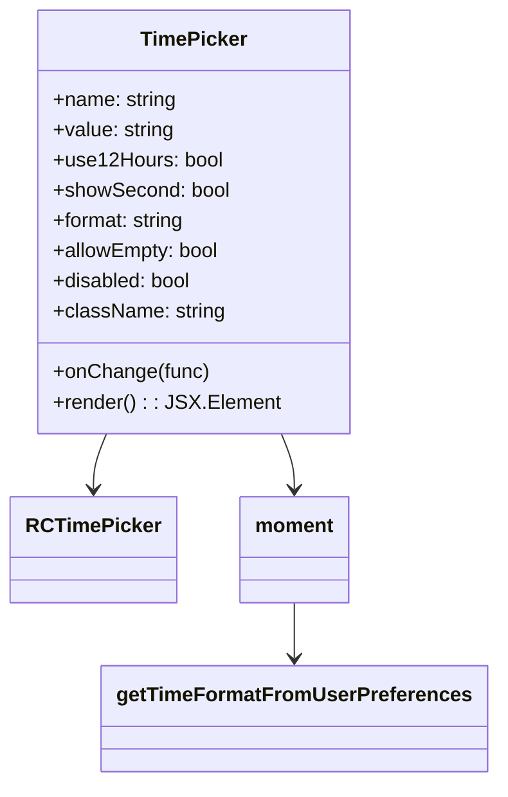

# Diagram: web/portal/src/components/atoms/TimePicker.atom.js


> Auto-generated by Obscura crawlers

## Diagram 1



### SVG

<svg id="container" width="377.2265625" xmlns="http://www.w3.org/2000/svg" class="classDiagram" height="620" viewBox="0 0 377.2265625 620" role="graphics-document document" aria-roledescription="class"><style>#container{font-family:"trebuchet ms",verdana,arial,sans-serif;font-size:16px;fill:#333;}@keyframes edge-animation-frame{from{stroke-dashoffset:0;}}@keyframes dash{to{stroke-dashoffset:0;}}#container .edge-animation-slow{stroke-dasharray:9,5!important;stroke-dashoffset:900;animation:dash 50s linear infinite;stroke-linecap:round;}#container .edge-animation-fast{stroke-dasharray:9,5!important;stroke-dashoffset:900;animation:dash 20s linear infinite;stroke-linecap:round;}#container .error-icon{fill:#552222;}#container .error-text{fill:#552222;stroke:#552222;}#container .edge-thickness-normal{stroke-width:1px;}#container .edge-thickness-thick{stroke-width:3.5px;}#container .edge-pattern-solid{stroke-dasharray:0;}#container .edge-thickness-invisible{stroke-width:0;fill:none;}#container .edge-pattern-dashed{stroke-dasharray:3;}#container .edge-pattern-dotted{stroke-dasharray:2;}#container .marker{fill:#333333;stroke:#333333;}#container .marker.cross{stroke:#333333;}#container svg{font-family:"trebuchet ms",verdana,arial,sans-serif;font-size:16px;}#container p{margin:0;}#container g.classGroup text{fill:#9370DB;stroke:none;font-family:"trebuchet ms",verdana,arial,sans-serif;font-size:10px;}#container g.classGroup text .title{font-weight:bolder;}#container .nodeLabel,#container .edgeLabel{color:#131300;}#container .edgeLabel .label rect{fill:#ECECFF;}#container .label text{fill:#131300;}#container .labelBkg{background:#ECECFF;}#container .edgeLabel .label span{background:#ECECFF;}#container .classTitle{font-weight:bolder;}#container .node rect,#container .node circle,#container .node ellipse,#container .node polygon,#container .node path{fill:#ECECFF;stroke:#9370DB;stroke-width:1px;}#container .divider{stroke:#9370DB;stroke-width:1;}#container g.clickable{cursor:pointer;}#container g.classGroup rect{fill:#ECECFF;stroke:#9370DB;}#container g.classGroup line{stroke:#9370DB;stroke-width:1;}#container .classLabel .box{stroke:none;stroke-width:0;fill:#ECECFF;opacity:0.5;}#container .classLabel .label{fill:#9370DB;font-size:10px;}#container .relation{stroke:#333333;stroke-width:1;fill:none;}#container .dashed-line{stroke-dasharray:3;}#container .dotted-line{stroke-dasharray:1 2;}#container #compositionStart,#container .composition{fill:#333333!important;stroke:#333333!important;stroke-width:1;}#container #compositionEnd,#container .composition{fill:#333333!important;stroke:#333333!important;stroke-width:1;}#container #dependencyStart,#container .dependency{fill:#333333!important;stroke:#333333!important;stroke-width:1;}#container #dependencyStart,#container .dependency{fill:#333333!important;stroke:#333333!important;stroke-width:1;}#container #extensionStart,#container .extension{fill:transparent!important;stroke:#333333!important;stroke-width:1;}#container #extensionEnd,#container .extension{fill:transparent!important;stroke:#333333!important;stroke-width:1;}#container #aggregationStart,#container .aggregation{fill:transparent!important;stroke:#333333!important;stroke-width:1;}#container #aggregationEnd,#container .aggregation{fill:transparent!important;stroke:#333333!important;stroke-width:1;}#container #lollipopStart,#container .lollipop{fill:#ECECFF!important;stroke:#333333!important;stroke-width:1;}#container #lollipopEnd,#container .lollipop{fill:#ECECFF!important;stroke:#333333!important;stroke-width:1;}#container .edgeTerminals{font-size:11px;line-height:initial;}#container .classTitleText{text-anchor:middle;font-size:18px;fill:#333;}#container .label-icon{display:inline-block;height:1em;overflow:visible;vertical-align:-0.125em;}#container .node .label-icon path{fill:currentColor;stroke:revert;stroke-width:revert;}#container :root{--mermaid-font-family:"trebuchet ms",verdana,arial,sans-serif;}</style><g><defs><marker id="container_class-aggregationStart" class="marker aggregation class" refX="18" refY="7" markerWidth="190" markerHeight="240" orient="auto"><path d="M 18,7 L9,13 L1,7 L9,1 Z"></path></marker></defs><defs><marker id="container_class-aggregationEnd" class="marker aggregation class" refX="1" refY="7" markerWidth="20" markerHeight="28" orient="auto"><path d="M 18,7 L9,13 L1,7 L9,1 Z"></path></marker></defs><defs><marker id="container_class-extensionStart" class="marker extension class" refX="18" refY="7" markerWidth="190" markerHeight="240" orient="auto"><path d="M 1,7 L18,13 V 1 Z"></path></marker></defs><defs><marker id="container_class-extensionEnd" class="marker extension class" refX="1" refY="7" markerWidth="20" markerHeight="28" orient="auto"><path d="M 1,1 V 13 L18,7 Z"></path></marker></defs><defs><marker id="container_class-compositionStart" class="marker composition class" refX="18" refY="7" markerWidth="190" markerHeight="240" orient="auto"><path d="M 18,7 L9,13 L1,7 L9,1 Z"></path></marker></defs><defs><marker id="container_class-compositionEnd" class="marker composition class" refX="1" refY="7" markerWidth="20" markerHeight="28" orient="auto"><path d="M 18,7 L9,13 L1,7 L9,1 Z"></path></marker></defs><defs><marker id="container_class-dependencyStart" class="marker dependency class" refX="6" refY="7" markerWidth="190" markerHeight="240" orient="auto"><path d="M 5,7 L9,13 L1,7 L9,1 Z"></path></marker></defs><defs><marker id="container_class-dependencyEnd" class="marker dependency class" refX="13" refY="7" markerWidth="20" markerHeight="28" orient="auto"><path d="M 18,7 L9,13 L14,7 L9,1 Z"></path></marker></defs><defs><marker id="container_class-lollipopStart" class="marker lollipop class" refX="13" refY="7" markerWidth="190" markerHeight="240" orient="auto"><circle stroke="black" fill="transparent" cx="7" cy="7" r="6"></circle></marker></defs><defs><marker id="container_class-lollipopEnd" class="marker lollipop class" refX="1" refY="7" markerWidth="190" markerHeight="240" orient="auto"><circle stroke="black" fill="transparent" cx="7" cy="7" r="6"></circle></marker></defs><g class="root"><g class="clusters"></g><g class="edgePaths"><path d="M79.919,344L78.255,348.167C76.59,352.333,73.26,360.667,71.595,368C69.93,375.333,69.93,381.667,69.93,384.833L69.93,388" id="id_TimePicker_RCTimePicker_1" class="edge-thickness-normal edge-pattern-solid relation" style=";;;" data-edge="true" data-et="edge" data-id="id_TimePicker_RCTimePicker_1" data-points="W3sieCI6NzkuOTE5NDY2NDgzMTYwNjIsInkiOjM0NH0seyJ4Ijo2OS45Mjk2ODc1LCJ5IjozNjl9LHsieCI6NjkuOTI5Njg3NSwieSI6Mzk0fV0=" marker-end="url(#container_class-dependencyEnd)"></path><path d="M214.182,344L215.847,348.167C217.512,352.333,220.842,360.667,222.507,368C224.172,375.333,224.172,381.667,224.172,384.833L224.172,388" id="id_TimePicker_moment_2" class="edge-thickness-normal edge-pattern-solid relation" style=";;;" data-edge="true" data-et="edge" data-id="id_TimePicker_moment_2" data-points="W3sieCI6MjE0LjE4MjA5NjAxNjgzOTM4LCJ5IjozNDR9LHsieCI6MjI0LjE3MTg3NSwieSI6MzY5fSx7IngiOjIyNC4xNzE4NzUsInkiOjM5NH1d" marker-end="url(#container_class-dependencyEnd)"></path><path d="M224.172,478L224.172,482.167C224.172,486.333,224.172,494.667,224.172,502C224.172,509.333,224.172,515.667,224.172,518.833L224.172,522" id="id_moment_getTimeFormatFromUserPreferences_3" class="edge-thickness-normal edge-pattern-solid relation" style=";;;" data-edge="true" data-et="edge" data-id="id_moment_getTimeFormatFromUserPreferences_3" data-points="W3sieCI6MjI0LjE3MTg3NSwieSI6NDc4fSx7IngiOjIyNC4xNzE4NzUsInkiOjUwM30seyJ4IjoyMjQuMTcxODc1LCJ5Ijo1Mjh9XQ==" marker-end="url(#container_class-dependencyEnd)"></path></g><g class="edgeLabels"><g class="edgeLabel"><g class="label" data-id="id_TimePicker_RCTimePicker_1" transform="translate(0, 0)"><foreignObject width="0" height="0"><div xmlns="http://www.w3.org/1999/xhtml" class="labelBkg" style="display: table-cell; white-space: nowrap; line-height: 1.5; max-width: 200px; text-align: center;"><span class="edgeLabel"></span></div></foreignObject></g></g><g class="edgeLabel"><g class="label" data-id="id_TimePicker_moment_2" transform="translate(0, 0)"><foreignObject width="0" height="0"><div xmlns="http://www.w3.org/1999/xhtml" class="labelBkg" style="display: table-cell; white-space: nowrap; line-height: 1.5; max-width: 200px; text-align: center;"><span class="edgeLabel"></span></div></foreignObject></g></g><g class="edgeLabel"><g class="label" data-id="id_moment_getTimeFormatFromUserPreferences_3" transform="translate(0, 0)"><foreignObject width="0" height="0"><div xmlns="http://www.w3.org/1999/xhtml" class="labelBkg" style="display: table-cell; white-space: nowrap; line-height: 1.5; max-width: 200px; text-align: center;"><span class="edgeLabel"></span></div></foreignObject></g></g></g><g class="nodes"><g class="node default" id="classId-TimePicker-0" transform="translate(147.05078125, 176)"><g class="basic label-container"><path d="M-118.4609375 -168 L118.4609375 -168 L118.4609375 168 L-118.4609375 168" stroke="none" stroke-width="0" fill="#ECECFF" style=""></path><path d="M-118.4609375 -168 C-66.5262154537163 -168, -14.591493407432623 -168, 118.4609375 -168 M-118.4609375 -168 C-47.20103230343432 -168, 24.058872893131365 -168, 118.4609375 -168 M118.4609375 -168 C118.4609375 -87.42354695789332, 118.4609375 -6.847093915786644, 118.4609375 168 M118.4609375 -168 C118.4609375 -47.514288201307124, 118.4609375 72.97142359738575, 118.4609375 168 M118.4609375 168 C41.46909943891184 168, -35.52273862217632 168, -118.4609375 168 M118.4609375 168 C26.29587418828089 168, -65.86918912343822 168, -118.4609375 168 M-118.4609375 168 C-118.4609375 83.6108350673133, -118.4609375 -0.7783298653733937, -118.4609375 -168 M-118.4609375 168 C-118.4609375 80.71419403478434, -118.4609375 -6.571611930431317, -118.4609375 -168" stroke="#9370DB" stroke-width="1.3" fill="none" stroke-dasharray="0 0" style=""></path></g><g class="annotation-group text" transform="translate(0, -144)"></g><g class="label-group text" transform="translate(-40.578125, -144)"><g class="label" style="font-weight: bolder" transform="translate(0,-12)"><foreignObject width="81.15625" height="24"><div xmlns="http://www.w3.org/1999/xhtml" style="display: table-cell; white-space: nowrap; line-height: 1.5; max-width: 130px; text-align: center;"><span class="nodeLabel markdown-node-label" style=""><p>TimePicker</p></span></div></foreignObject></g></g><g class="members-group text" transform="translate(-106.4609375, -96)"><g class="label" style="" transform="translate(0,-12)"><foreignObject width="98.21875" height="24"><div xmlns="http://www.w3.org/1999/xhtml" style="display: table-cell; white-space: nowrap; line-height: 1.5; max-width: 156px; text-align: center;"><span class="nodeLabel markdown-node-label" style=""><p>+name: string</p></span></div></foreignObject></g><g class="label" style="" transform="translate(0,12)"><foreignObject width="96.421875" height="24"><div xmlns="http://www.w3.org/1999/xhtml" style="display: table-cell; white-space: nowrap; line-height: 1.5; max-width: 154px; text-align: center;"><span class="nodeLabel markdown-node-label" style=""><p>+value: string</p></span></div></foreignObject></g><g class="label" style="" transform="translate(0,36)"><foreignObject width="131.453125" height="24"><div xmlns="http://www.w3.org/1999/xhtml" style="display: table-cell; white-space: nowrap; line-height: 1.5; max-width: 189px; text-align: center;"><span class="nodeLabel markdown-node-label" style=""><p>+use12Hours: bool</p></span></div></foreignObject></g><g class="label" style="" transform="translate(0,60)"><foreignObject width="139.671875" height="24"><div xmlns="http://www.w3.org/1999/xhtml" style="display: table-cell; white-space: nowrap; line-height: 1.5; max-width: 197px; text-align: center;"><span class="nodeLabel markdown-node-label" style=""><p>+showSecond: bool</p></span></div></foreignObject></g><g class="label" style="" transform="translate(0,84)"><foreignObject width="106.4375" height="24"><div xmlns="http://www.w3.org/1999/xhtml" style="display: table-cell; white-space: nowrap; line-height: 1.5; max-width: 164px; text-align: center;"><span class="nodeLabel markdown-node-label" style=""><p>+format: string</p></span></div></foreignObject></g><g class="label" style="" transform="translate(0,108)"><foreignObject width="132.609375" height="24"><div xmlns="http://www.w3.org/1999/xhtml" style="display: table-cell; white-space: nowrap; line-height: 1.5; max-width: 190px; text-align: center;"><span class="nodeLabel markdown-node-label" style=""><p>+allowEmpty: bool</p></span></div></foreignObject></g><g class="label" style="" transform="translate(0,132)"><foreignObject width="111.453125" height="24"><div xmlns="http://www.w3.org/1999/xhtml" style="display: table-cell; white-space: nowrap; line-height: 1.5; max-width: 169px; text-align: center;"><span class="nodeLabel markdown-node-label" style=""><p>+disabled: bool</p></span></div></foreignObject></g><g class="label" style="" transform="translate(0,156)"><foreignObject width="135.359375" height="24"><div xmlns="http://www.w3.org/1999/xhtml" style="display: table-cell; white-space: nowrap; line-height: 1.5; max-width: 193px; text-align: center;"><span class="nodeLabel markdown-node-label" style=""><p>+className: string</p></span></div></foreignObject></g></g><g class="methods-group text" transform="translate(-106.4609375, 120)"><g class="label" style="" transform="translate(0,-12)"><foreignObject width="121.8125" height="24"><div xmlns="http://www.w3.org/1999/xhtml" style="display: table-cell; white-space: nowrap; line-height: 1.5; max-width: 179px; text-align: center;"><span class="nodeLabel markdown-node-label" style=""><p>+onChange(func)</p></span></div></foreignObject></g><g class="label" style="" transform="translate(0,12)"><foreignObject width="172.34375" height="24"><div xmlns="http://www.w3.org/1999/xhtml" style="display: table-cell; white-space: nowrap; line-height: 1.5; max-width: 230px; text-align: center;"><span class="nodeLabel markdown-node-label" style=""><p>+render() : : JSX.Element</p></span></div></foreignObject></g></g><g class="divider" style=""><path d="M-118.4609375 -120 C-55.72573302463154 -120, 7.009471450736925 -120, 118.4609375 -120 M-118.4609375 -120 C-41.895483540797414 -120, 34.66997041840517 -120, 118.4609375 -120" stroke="#9370DB" stroke-width="1.3" fill="none" stroke-dasharray="0 0" style=""></path></g><g class="divider" style=""><path d="M-118.4609375 96 C-57.4300200359453 96, 3.6008974281094055 96, 118.4609375 96 M-118.4609375 96 C-29.440594827663475 96, 59.57974784467305 96, 118.4609375 96" stroke="#9370DB" stroke-width="1.3" fill="none" stroke-dasharray="0 0" style=""></path></g></g><g class="node default" id="classId-RCTimePicker-1" transform="translate(69.9296875, 436)"><g class="basic label-container"><path d="M-61.9296875 -42 L61.9296875 -42 L61.9296875 42 L-61.9296875 42" stroke="none" stroke-width="0" fill="#ECECFF" style=""></path><path d="M-61.9296875 -42 C-16.09057779988177 -42, 29.748531900236458 -42, 61.9296875 -42 M-61.9296875 -42 C-12.491173761203228 -42, 36.94733997759354 -42, 61.9296875 -42 M61.9296875 -42 C61.9296875 -21.73894117360373, 61.9296875 -1.477882347207462, 61.9296875 42 M61.9296875 -42 C61.9296875 -18.955011980367342, 61.9296875 4.089976039265316, 61.9296875 42 M61.9296875 42 C28.707564755002224 42, -4.514557989995552 42, -61.9296875 42 M61.9296875 42 C14.664650818058746 42, -32.60038586388251 42, -61.9296875 42 M-61.9296875 42 C-61.9296875 13.199847512622355, -61.9296875 -15.60030497475529, -61.9296875 -42 M-61.9296875 42 C-61.9296875 21.093262006575156, -61.9296875 0.18652401315031142, -61.9296875 -42" stroke="#9370DB" stroke-width="1.3" fill="none" stroke-dasharray="0 0" style=""></path></g><g class="annotation-group text" transform="translate(0, -18)"></g><g class="label-group text" transform="translate(-49.9296875, -18)"><g class="label" style="font-weight: bolder" transform="translate(0,-12)"><foreignObject width="99.859375" height="24"><div xmlns="http://www.w3.org/1999/xhtml" style="display: table-cell; white-space: nowrap; line-height: 1.5; max-width: 149px; text-align: center;"><span class="nodeLabel markdown-node-label" style=""><p>RCTimePicker</p></span></div></foreignObject></g></g><g class="members-group text" transform="translate(-49.9296875, 30)"></g><g class="methods-group text" transform="translate(-49.9296875, 60)"></g><g class="divider" style=""><path d="M-61.9296875 6 C-34.95070191836227 6, -7.971716336724533 6, 61.9296875 6 M-61.9296875 6 C-32.296101003457025 6, -2.662514506914057 6, 61.9296875 6" stroke="#9370DB" stroke-width="1.3" fill="none" stroke-dasharray="0 0" style=""></path></g><g class="divider" style=""><path d="M-61.9296875 24 C-31.52358216560827 24, -1.1174768312165426 24, 61.9296875 24 M-61.9296875 24 C-14.399235552141768 24, 33.131216395716464 24, 61.9296875 24" stroke="#9370DB" stroke-width="1.3" fill="none" stroke-dasharray="0 0" style=""></path></g></g><g class="node default" id="classId-moment-2" transform="translate(224.171875, 436)"><g class="basic label-container"><path d="M-42.3125 -42 L42.3125 -42 L42.3125 42 L-42.3125 42" stroke="none" stroke-width="0" fill="#ECECFF" style=""></path><path d="M-42.3125 -42 C-12.657099956928985 -42, 16.99830008614203 -42, 42.3125 -42 M-42.3125 -42 C-15.993073703604907 -42, 10.326352592790187 -42, 42.3125 -42 M42.3125 -42 C42.3125 -11.965547403742061, 42.3125 18.068905192515878, 42.3125 42 M42.3125 -42 C42.3125 -14.11804112649845, 42.3125 13.763917747003099, 42.3125 42 M42.3125 42 C11.774235835975396 42, -18.764028328049207 42, -42.3125 42 M42.3125 42 C16.50919269432656 42, -9.294114611346878 42, -42.3125 42 M-42.3125 42 C-42.3125 11.002993732657373, -42.3125 -19.994012534685254, -42.3125 -42 M-42.3125 42 C-42.3125 19.170231969697358, -42.3125 -3.6595360606052836, -42.3125 -42" stroke="#9370DB" stroke-width="1.3" fill="none" stroke-dasharray="0 0" style=""></path></g><g class="annotation-group text" transform="translate(0, -18)"></g><g class="label-group text" transform="translate(-30.3125, -18)"><g class="label" style="font-weight: bolder" transform="translate(0,-12)"><foreignObject width="60.625" height="24"><div xmlns="http://www.w3.org/1999/xhtml" style="display: table-cell; white-space: nowrap; line-height: 1.5; max-width: 111px; text-align: center;"><span class="nodeLabel markdown-node-label" style=""><p>moment</p></span></div></foreignObject></g></g><g class="members-group text" transform="translate(-30.3125, 30)"></g><g class="methods-group text" transform="translate(-30.3125, 60)"></g><g class="divider" style=""><path d="M-42.3125 6 C-22.53426787036692 6, -2.756035740733843 6, 42.3125 6 M-42.3125 6 C-15.363486425308718 6, 11.585527149382564 6, 42.3125 6" stroke="#9370DB" stroke-width="1.3" fill="none" stroke-dasharray="0 0" style=""></path></g><g class="divider" style=""><path d="M-42.3125 24 C-17.052547165735362 24, 8.207405668529276 24, 42.3125 24 M-42.3125 24 C-11.092349831143423 24, 20.127800337713154 24, 42.3125 24" stroke="#9370DB" stroke-width="1.3" fill="none" stroke-dasharray="0 0" style=""></path></g></g><g class="node default" id="classId-getTimeFormatFromUserPreferences-3" transform="translate(224.171875, 570)"><g class="basic label-container"><path d="M-145.0546875 -42 L145.0546875 -42 L145.0546875 42 L-145.0546875 42" stroke="none" stroke-width="0" fill="#ECECFF" style=""></path><path d="M-145.0546875 -42 C-86.94405877865248 -42, -28.833430057304938 -42, 145.0546875 -42 M-145.0546875 -42 C-77.08679965041728 -42, -9.118911800834553 -42, 145.0546875 -42 M145.0546875 -42 C145.0546875 -23.966447714259253, 145.0546875 -5.932895428518506, 145.0546875 42 M145.0546875 -42 C145.0546875 -15.857910522543492, 145.0546875 10.284178954913017, 145.0546875 42 M145.0546875 42 C31.010911379500612 42, -83.03286474099878 42, -145.0546875 42 M145.0546875 42 C48.49447651018228 42, -48.06573447963544 42, -145.0546875 42 M-145.0546875 42 C-145.0546875 13.72942942458937, -145.0546875 -14.541141150821261, -145.0546875 -42 M-145.0546875 42 C-145.0546875 16.483685080555766, -145.0546875 -9.032629838888468, -145.0546875 -42" stroke="#9370DB" stroke-width="1.3" fill="none" stroke-dasharray="0 0" style=""></path></g><g class="annotation-group text" transform="translate(0, -18)"></g><g class="label-group text" transform="translate(-133.0546875, -18)"><g class="label" style="font-weight: bolder" transform="translate(0,-12)"><foreignObject width="266.109375" height="24"><div xmlns="http://www.w3.org/1999/xhtml" style="display: table-cell; white-space: nowrap; line-height: 1.5; max-width: 312px; text-align: center;"><span class="nodeLabel markdown-node-label" style=""><p>getTimeFormatFromUserPreferences</p></span></div></foreignObject></g></g><g class="members-group text" transform="translate(-133.0546875, 30)"></g><g class="methods-group text" transform="translate(-133.0546875, 60)"></g><g class="divider" style=""><path d="M-145.0546875 6 C-51.35775691870191 6, 42.33917366259618 6, 145.0546875 6 M-145.0546875 6 C-79.7569543242243 6, -14.459221148448592 6, 145.0546875 6" stroke="#9370DB" stroke-width="1.3" fill="none" stroke-dasharray="0 0" style=""></path></g><g class="divider" style=""><path d="M-145.0546875 24 C-50.447749242491994 24, 44.15918901501601 24, 145.0546875 24 M-145.0546875 24 C-46.21255827352876 24, 52.62957095294249 24, 145.0546875 24" stroke="#9370DB" stroke-width="1.3" fill="none" stroke-dasharray="0 0" style=""></path></g></g></g></g></g></svg>

## Diagram 2

```mermaid
flowchart LR
Props[Component props\n(onChange, name, value, use12Hours, showSecond, format, allowEmpty, disabled, className)]
TP[TimePicker]
RCTP[RCTimePicker]
UserFmt[getTimeFormatFromUserPreferences()]
MomentVal[moment(value, userFormat)]
ChangeEvt[onChange event from RCTimePicker]
FormatStep[if value -> moment(value).format(userFormat)]
CallProp[call onChange(formattedValue) or onChange(null)]
Props --> TP
TP --> RCTP
TP --> MomentVal
MomentVal --> UserFmt
RCTP --> ChangeEvt
ChangeEvt --> FormatStep
FormatStep --> CallProp
CallProp --> Props
```

> SVG rendering failed for this diagram.
