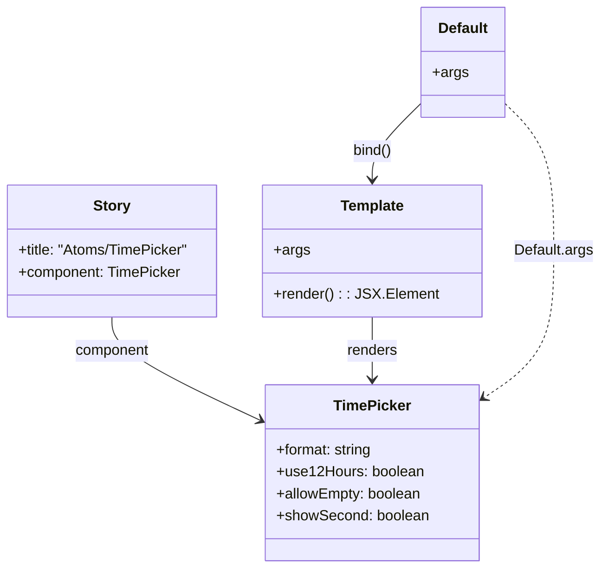

# Diagram: web/portal/src/components/atoms/TimePicker.atom.stories.js

> Auto-generated by Obscura crawlers

## Mermaid

### SVG

<svg id="container" width="652.3046875" xmlns="http://www.w3.org/2000/svg" class="classDiagram" height="620" viewBox="0 0 652.3046875 620" role="graphics-document document" aria-roledescription="class"><g><defs><marker id="container_class-aggregationStart" class="marker aggregation class" refX="18" refY="7" markerWidth="190" markerHeight="240" orient="auto"><path d="M 18,7 L9,13 L1,7 L9,1 Z"></path></marker></defs><defs><marker id="container_class-aggregationEnd" class="marker aggregation class" refX="1" refY="7" markerWidth="20" markerHeight="28" orient="auto"><path d="M 18,7 L9,13 L1,7 L9,1 Z"></path></marker></defs><defs><marker id="container_class-extensionStart" class="marker extension class" refX="18" refY="7" markerWidth="190" markerHeight="240" orient="auto"><path d="M 1,7 L18,13 V 1 Z"></path></marker></defs><defs><marker id="container_class-extensionEnd" class="marker extension class" refX="1" refY="7" markerWidth="20" markerHeight="28" orient="auto"><path d="M 1,1 V 13 L18,7 Z"></path></marker></defs><defs><marker id="container_class-compositionStart" class="marker composition class" refX="18" refY="7" markerWidth="190" markerHeight="240" orient="auto"><path d="M 18,7 L9,13 L1,7 L9,1 Z"></path></marker></defs><defs><marker id="container_class-compositionEnd" class="marker composition class" refX="1" refY="7" markerWidth="20" markerHeight="28" orient="auto"><path d="M 18,7 L9,13 L1,7 L9,1 Z"></path></marker></defs><defs><marker id="container_class-dependencyStart" class="marker dependency class" refX="6" refY="7" markerWidth="190" markerHeight="240" orient="auto"><path d="M 5,7 L9,13 L1,7 L9,1 Z"></path></marker></defs><defs><marker id="container_class-dependencyEnd" class="marker dependency class" refX="13" refY="7" markerWidth="20" markerHeight="28" orient="auto"><path d="M 18,7 L9,13 L14,7 L9,1 Z"></path></marker></defs><defs><marker id="container_class-lollipopStart" class="marker lollipop class" refX="13" refY="7" markerWidth="190" markerHeight="240" orient="auto"><circle stroke="black" fill="transparent" cx="7" cy="7" r="6"></circle></marker></defs><defs><marker id="container_class-lollipopEnd" class="marker lollipop class" refX="1" refY="7" markerWidth="190" markerHeight="240" orient="auto"><circle stroke="black" fill="transparent" cx="7" cy="7" r="6"></circle></marker></defs><g class="root"><g class="clusters"></g><g class="edgePaths"><path d="M125.148,346L125.148,352.167C125.148,358.333,125.148,370.667,152.056,389.511C178.963,408.356,232.777,433.711,259.685,446.389L286.592,459.067" id="id_Story_TimePicker_1" class="edge-thickness-normal edge-pattern-solid relation" style=";;;" data-edge="true" data-et="edge" data-id="id_Story_TimePicker_1" data-points="W3sieCI6MTI1LjE0ODQzNzUsInkiOjM0Nn0seyJ4IjoxMjUuMTQ4NDM3NSwieSI6MzgzfSx7IngiOjI5Mi4wMTk1MzEyNSwieSI6NDYxLjYyNDI4OTA1NTI1NjV9XQ==" marker-end="url(#container_class-dependencyEnd)"></path><path d="M407.426,346L407.426,352.167C407.426,358.333,407.426,370.667,407.426,382C407.426,393.333,407.426,403.667,407.426,408.833L407.426,414" id="id_Template_TimePicker_2" class="edge-thickness-normal edge-pattern-solid relation" style=";;;" data-edge="true" data-et="edge" data-id="id_Template_TimePicker_2" data-points="W3sieCI6NDA3LjQyNTc4MTI1LCJ5IjozNDZ9LHsieCI6NDA3LjQyNTc4MTI1LCJ5IjozODN9LHsieCI6NDA3LjQyNTc4MTI1LCJ5Ijo0MjB9XQ==" marker-end="url(#container_class-dependencyEnd)"></path><path d="M459.783,112.508L451.057,121.257C442.331,130.006,424.878,147.503,416.152,161.418C407.426,175.333,407.426,185.667,407.426,190.833L407.426,196" id="id_Default_Template_3" class="edge-thickness-normal edge-pattern-solid relation" style=";;;" data-edge="true" data-et="edge" data-id="id_Default_Template_3" data-points="W3sieCI6NDU5Ljc4MzIwMzEyNSwieSI6MTEyLjUwODM0NzI5NTk2MDU5fSx7IngiOjQwNy40MjU3ODEyNSwieSI6MTY1fSx7IngiOjQwNy40MjU3ODEyNSwieSI6MjAyfV0=" marker-end="url(#container_class-dependencyEnd)"></path><path d="M548.572,112.508L557.299,121.257C566.025,130.006,583.477,147.503,592.203,174.418C600.93,201.333,600.93,237.667,600.93,274C600.93,310.333,600.93,346.667,588.738,373.213C576.545,399.76,552.161,416.52,539.969,424.9L527.777,433.28" id="id_Default_TimePicker_4" class="edge-thickness-normal edge-pattern-dashed relation" style=";;;" data-edge="true" data-et="edge" data-id="id_Default_TimePicker_4" data-points="W3sieCI6NTQ4LjU3MjI2NTYyNSwieSI6MTEyLjUwODM0NzI5NTk2MDU5fSx7IngiOjYwMC45Mjk2ODc1LCJ5IjoxNjV9LHsieCI6NjAwLjkyOTY4NzUsInkiOjI3NH0seyJ4Ijo2MDAuOTI5Njg3NSwieSI6MzgzfSx7IngiOjUyMi44MzIwMzEyNSwieSI6NDM2LjY3ODQ0MjM3NjQwNTU0fV0=" marker-end="url(#container_class-dependencyEnd)"></path></g><g class="edgeLabels"><g class="edgeLabel" transform="translate(125.1484375, 383)"><g class="label" data-id="id_Story_TimePicker_1" transform="translate(-41.2421875, -12)"><foreignObject width="82.484375" height="24">

component

</foreignObject></g></g><g class="edgeLabel" transform="translate(407.42578125, 383)"><g class="label" data-id="id_Template_TimePicker_2" transform="translate(-27.75, -12)"><foreignObject width="55.5" height="24">

renders

</foreignObject></g></g><g class="edgeLabel" transform="translate(407.42578125, 165)"><g class="label" data-id="id_Default_Template_3" transform="translate(-21.6640625, -12)"><foreignObject width="43.328125" height="24">

bind()

</foreignObject></g></g><g class="edgeLabel" transform="translate(600.9296875, 274)"><g class="label" data-id="id_Default_TimePicker_4" transform="translate(-43.375, -12)"><foreignObject width="86.75" height="24">

Default.args

</foreignObject></g></g></g><g class="nodes"><g class="node default" id="classId-TimePicker-0" transform="translate(407.42578125, 516)"><g class="basic label-container"><path d="M-115.40625 -96 L115.40625 -96 L115.40625 96 L-115.40625 96" stroke="none" stroke-width="0" fill="#ECECFF" style=""></path><path d="M-115.40625 -96 C-37.753372224317005 -96, 39.89950555136599 -96, 115.40625 -96 M-115.40625 -96 C-39.29250168390979 -96, 36.82124663218042 -96, 115.40625 -96 M115.40625 -96 C115.40625 -42.163510205112644, 115.40625 11.672979589774712, 115.40625 96 M115.40625 -96 C115.40625 -26.655372226011096, 115.40625 42.68925554797781, 115.40625 96 M115.40625 96 C40.405940579734704 96, -34.59436884053059 96, -115.40625 96 M115.40625 96 C38.04332301506079 96, -39.319603969878415 96, -115.40625 96 M-115.40625 96 C-115.40625 43.831525898957075, -115.40625 -8.33694820208585, -115.40625 -96 M-115.40625 96 C-115.40625 57.0579463180681, -115.40625 18.115892636136195, -115.40625 -96" stroke="#9370DB" stroke-width="1.3" fill="none" stroke-dasharray="0 0" style=""></path></g><g class="annotation-group text" transform="translate(0, -72)"></g><g class="label-group text" transform="translate(-40.578125, -72)"><g class="label" style="font-weight: bolder" transform="translate(0,-12)"><foreignObject width="81.15625" height="24">

TimePicker

</foreignObject></g></g><g class="members-group text" transform="translate(-103.40625, -24)"><g class="label" style="" transform="translate(0,-12)"><foreignObject width="106.4375" height="24">

+format: string

</foreignObject></g><g class="label" style="" transform="translate(0,12)"><foreignObject width="158.015625" height="24">

+use12Hours: boolean

</foreignObject></g><g class="label" style="" transform="translate(0,36)"><foreignObject width="159.171875" height="24">

+allowEmpty: boolean

</foreignObject></g><g class="label" style="" transform="translate(0,60)"><foreignObject width="166.234375" height="24">

+showSecond: boolean

</foreignObject></g></g><g class="methods-group text" transform="translate(-103.40625, 96)"></g><g class="divider" style=""><path d="M-115.40625 -48 C-62.547301839628545 -48, -9.68835367925709 -48, 115.40625 -48 M-115.40625 -48 C-24.35292821852744 -48, 66.70039356294512 -48, 115.40625 -48" stroke="#9370DB" stroke-width="1.3" fill="none" stroke-dasharray="0 0" style=""></path></g><g class="divider" style=""><path d="M-115.40625 72 C-44.47188970182302 72, 26.462470596353967 72, 115.40625 72 M-115.40625 72 C-62.18928206704174 72, -8.972314134083476 72, 115.40625 72" stroke="#9370DB" stroke-width="1.3" fill="none" stroke-dasharray="0 0" style=""></path></g></g><g class="node default" id="classId-Story-1" transform="translate(125.1484375, 274)"><g class="basic label-container"><path d="M-117.1484375 -72 L117.1484375 -72 L117.1484375 72 L-117.1484375 72" stroke="none" stroke-width="0" fill="#ECECFF" style=""></path><path d="M-117.1484375 -72 C-38.684372313935924 -72, 39.77969287212815 -72, 117.1484375 -72 M-117.1484375 -72 C-52.96282463177043 -72, 11.222788236459138 -72, 117.1484375 -72 M117.1484375 -72 C117.1484375 -32.12656654846362, 117.1484375 7.746866903072757, 117.1484375 72 M117.1484375 -72 C117.1484375 -35.70084723648004, 117.1484375 0.5983055270399262, 117.1484375 72 M117.1484375 72 C44.280905140608695 72, -28.58662721878261 72, -117.1484375 72 M117.1484375 72 C57.4619997813071 72, -2.224437937385801 72, -117.1484375 72 M-117.1484375 72 C-117.1484375 42.51216068934457, -117.1484375 13.024321378689137, -117.1484375 -72 M-117.1484375 72 C-117.1484375 35.548478058965976, -117.1484375 -0.9030438820680473, -117.1484375 -72" stroke="#9370DB" stroke-width="1.3" fill="none" stroke-dasharray="0 0" style=""></path></g><g class="annotation-group text" transform="translate(0, -48)"></g><g class="label-group text" transform="translate(-19.546875, -48)"><g class="label" style="font-weight: bolder" transform="translate(0,-12)"><foreignObject width="39.09375" height="24">

Story

</foreignObject></g></g><g class="members-group text" transform="translate(-105.1484375, 0)"><g class="label" style="" transform="translate(0,-12)"><foreignObject width="190.75" height="24">

+title: "Atoms/TimePicker"

</foreignObject></g><g class="label" style="" transform="translate(0,12)"><foreignObject width="178.234375" height="24">

+component: TimePicker

</foreignObject></g></g><g class="methods-group text" transform="translate(-105.1484375, 72)"></g><g class="divider" style=""><path d="M-117.1484375 -24 C-24.952645550879737 -24, 67.24314639824053 -24, 117.1484375 -24 M-117.1484375 -24 C-54.54617230738424 -24, 8.056092885231521 -24, 117.1484375 -24" stroke="#9370DB" stroke-width="1.3" fill="none" stroke-dasharray="0 0" style=""></path></g><g class="divider" style=""><path d="M-117.1484375 48 C-31.99050605651105 48, 53.1674253869779 48, 117.1484375 48 M-117.1484375 48 C-52.995163153041176 48, 11.158111193917648 48, 117.1484375 48" stroke="#9370DB" stroke-width="1.3" fill="none" stroke-dasharray="0 0" style=""></path></g></g><g class="node default" id="classId-Template-2" transform="translate(407.42578125, 274)"><g class="basic label-container"><path d="M-115.12890625 -72 L115.12890625 -72 L115.12890625 72 L-115.12890625 72" stroke="none" stroke-width="0" fill="#ECECFF" style=""></path><path d="M-115.12890625 -72 C-28.691580964694495 -72, 57.74574432061101 -72, 115.12890625 -72 M-115.12890625 -72 C-34.77775090828037 -72, 45.573404433439265 -72, 115.12890625 -72 M115.12890625 -72 C115.12890625 -29.386584678801192, 115.12890625 13.226830642397616, 115.12890625 72 M115.12890625 -72 C115.12890625 -38.38500991760732, 115.12890625 -4.77001983521464, 115.12890625 72 M115.12890625 72 C51.625805188347215 72, -11.87729587330557 72, -115.12890625 72 M115.12890625 72 C53.224833539293165 72, -8.67923917141367 72, -115.12890625 72 M-115.12890625 72 C-115.12890625 32.12366150065161, -115.12890625 -7.752676998696785, -115.12890625 -72 M-115.12890625 72 C-115.12890625 37.45109542142346, -115.12890625 2.9021908428469203, -115.12890625 -72" stroke="#9370DB" stroke-width="1.3" fill="none" stroke-dasharray="0 0" style=""></path></g><g class="annotation-group text" transform="translate(0, -48)"></g><g class="label-group text" transform="translate(-33.9140625, -48)"><g class="label" style="font-weight: bolder" transform="translate(0,-12)"><foreignObject width="67.828125" height="24">

Template

</foreignObject></g></g><g class="members-group text" transform="translate(-103.12890625, 0)"><g class="label" style="" transform="translate(0,-12)"><foreignObject width="38.078125" height="24">

+args

</foreignObject></g></g><g class="methods-group text" transform="translate(-103.12890625, 48)"><g class="label" style="" transform="translate(0,-12)"><foreignObject width="172.34375" height="24">

+render() : : JSX.Element

</foreignObject></g></g><g class="divider" style=""><path d="M-115.12890625 -24 C-34.59492194445717 -24, 45.93906236108566 -24, 115.12890625 -24 M-115.12890625 -24 C-37.577231746350805 -24, 39.97444275729839 -24, 115.12890625 -24" stroke="#9370DB" stroke-width="1.3" fill="none" stroke-dasharray="0 0" style=""></path></g><g class="divider" style=""><path d="M-115.12890625 24 C-34.744274271867056 24, 45.64035770626589 24, 115.12890625 24 M-115.12890625 24 C-56.01335846931593 24, 3.102189311368136 24, 115.12890625 24" stroke="#9370DB" stroke-width="1.3" fill="none" stroke-dasharray="0 0" style=""></path></g></g><g class="node default" id="classId-Default-3" transform="translate(504.177734375, 68)"><g class="basic label-container"><path d="M-44.39453125 -60 L44.39453125 -60 L44.39453125 60 L-44.39453125 60" stroke="none" stroke-width="0" fill="#ECECFF" style=""></path><path d="M-44.39453125 -60 C-16.728587474195535 -60, 10.93735630160893 -60, 44.39453125 -60 M-44.39453125 -60 C-13.713576748108643 -60, 16.967377753782714 -60, 44.39453125 -60 M44.39453125 -60 C44.39453125 -21.021598701398887, 44.39453125 17.956802597202227, 44.39453125 60 M44.39453125 -60 C44.39453125 -27.632750857063577, 44.39453125 4.734498285872846, 44.39453125 60 M44.39453125 60 C11.819802620233354 60, -20.754926009533293 60, -44.39453125 60 M44.39453125 60 C15.678265223198935 60, -13.03800080360213 60, -44.39453125 60 M-44.39453125 60 C-44.39453125 28.27039103141486, -44.39453125 -3.45921793717028, -44.39453125 -60 M-44.39453125 60 C-44.39453125 22.50152128803925, -44.39453125 -14.9969574239215, -44.39453125 -60" stroke="#9370DB" stroke-width="1.3" fill="none" stroke-dasharray="0 0" style=""></path></g><g class="annotation-group text" transform="translate(0, -36)"></g><g class="label-group text" transform="translate(-26.7109375, -36)"><g class="label" style="font-weight: bolder" transform="translate(0,-12)"><foreignObject width="53.421875" height="24">

Default

</foreignObject></g></g><g class="members-group text" transform="translate(-32.39453125, 12)"><g class="label" style="" transform="translate(0,-12)"><foreignObject width="38.078125" height="24">

+args

</foreignObject></g></g><g class="methods-group text" transform="translate(-32.39453125, 60)"></g><g class="divider" style=""><path d="M-44.39453125 -12 C-9.16505651953252 -12, 26.06441821093496 -12, 44.39453125 -12 M-44.39453125 -12 C-19.694805107938333 -12, 5.004921034123335 -12, 44.39453125 -12" stroke="#9370DB" stroke-width="1.3" fill="none" stroke-dasharray="0 0" style=""></path></g><g class="divider" style=""><path d="M-44.39453125 36 C-17.267696414156028 36, 9.859138421687945 36, 44.39453125 36 M-44.39453125 36 C-16.60603524669517 36, 11.182460756609657 36, 44.39453125 36" stroke="#9370DB" stroke-width="1.3" fill="none" stroke-dasharray="0 0" style=""></path></g></g></g></g></g></svg>
