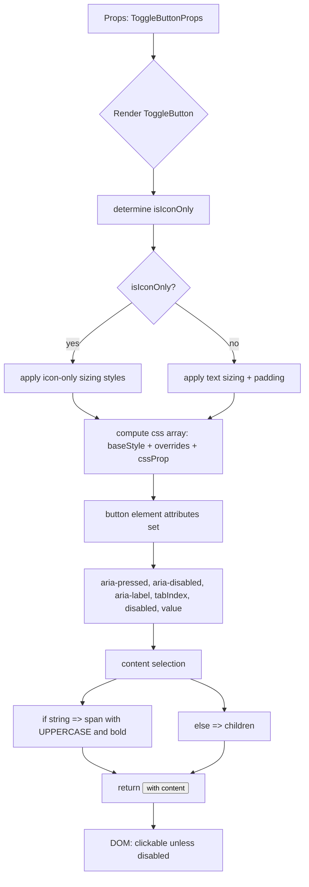

# Diagram: web/portal/src/components/atoms/ToggleButton.atom.tsx


> Auto-generated by Obscura crawlers

## Diagram 1

```mermaid
classDiagram
    class ToggleButton {
        +selected: boolean
        +disabled: boolean
        +size: "small"|"medium"|"large"
        +value: string
        +onClick(event): void
        +className: string
        +css: Interpolation<Theme>
        +children: ReactNode
        +aria-label: string
        +render(): JSX.Element
    }
    class ToggleButtonProps {
        +selected?: boolean
        +disabled?: boolean
        +size?: "small" | "medium" | "large"
        +onClick?: function
        +className?: string
        +css?: Interpolation<Theme>
        +children: ReactNode
        +"aria-label"?: string
        +value: string
    }
    class SizeMap {
        +small
        +medium
        +large
    }
    class BaseStyle {
        +baseStyle({selected,disabled,size}): SerializedStyles
    }
    class Colors {
        <<enumeration>>
        background
    }

    ToggleButton "1" --> "1" ToggleButtonProps : implements
    ToggleButton ..> SizeMap : reads
    ToggleButton ..> BaseStyle : calls
    BaseStyle ..> Colors : uses
    ToggleButton ..> Colors : uses
    SizeMap <|-- SizeMap : containsValues
```

> SVG rendering failed for this diagram.

## Diagram 2



### SVG

<svg id="container" width="579.28125" xmlns="http://www.w3.org/2000/svg" class="flowchart" height="1664.5" viewBox="0 0 579.28125 1664.5" role="graphics-document document" aria-roledescription="flowchart-v2"><style>#container{font-family:"trebuchet ms",verdana,arial,sans-serif;font-size:16px;fill:#333;}@keyframes edge-animation-frame{from{stroke-dashoffset:0;}}@keyframes dash{to{stroke-dashoffset:0;}}#container .edge-animation-slow{stroke-dasharray:9,5!important;stroke-dashoffset:900;animation:dash 50s linear infinite;stroke-linecap:round;}#container .edge-animation-fast{stroke-dasharray:9,5!important;stroke-dashoffset:900;animation:dash 20s linear infinite;stroke-linecap:round;}#container .error-icon{fill:#552222;}#container .error-text{fill:#552222;stroke:#552222;}#container .edge-thickness-normal{stroke-width:1px;}#container .edge-thickness-thick{stroke-width:3.5px;}#container .edge-pattern-solid{stroke-dasharray:0;}#container .edge-thickness-invisible{stroke-width:0;fill:none;}#container .edge-pattern-dashed{stroke-dasharray:3;}#container .edge-pattern-dotted{stroke-dasharray:2;}#container .marker{fill:#333333;stroke:#333333;}#container .marker.cross{stroke:#333333;}#container svg{font-family:"trebuchet ms",verdana,arial,sans-serif;font-size:16px;}#container p{margin:0;}#container .label{font-family:"trebuchet ms",verdana,arial,sans-serif;color:#333;}#container .cluster-label text{fill:#333;}#container .cluster-label span{color:#333;}#container .cluster-label span p{background-color:transparent;}#container .label text,#container span{fill:#333;color:#333;}#container .node rect,#container .node circle,#container .node ellipse,#container .node polygon,#container .node path{fill:#ECECFF;stroke:#9370DB;stroke-width:1px;}#container .rough-node .label text,#container .node .label text,#container .image-shape .label,#container .icon-shape .label{text-anchor:middle;}#container .node .katex path{fill:#000;stroke:#000;stroke-width:1px;}#container .rough-node .label,#container .node .label,#container .image-shape .label,#container .icon-shape .label{text-align:center;}#container .node.clickable{cursor:pointer;}#container .root .anchor path{fill:#333333!important;stroke-width:0;stroke:#333333;}#container .arrowheadPath{fill:#333333;}#container .edgePath .path{stroke:#333333;stroke-width:2.0px;}#container .flowchart-link{stroke:#333333;fill:none;}#container .edgeLabel{background-color:rgba(232,232,232, 0.8);text-align:center;}#container .edgeLabel p{background-color:rgba(232,232,232, 0.8);}#container .edgeLabel rect{opacity:0.5;background-color:rgba(232,232,232, 0.8);fill:rgba(232,232,232, 0.8);}#container .labelBkg{background-color:rgba(232, 232, 232, 0.5);}#container .cluster rect{fill:#ffffde;stroke:#aaaa33;stroke-width:1px;}#container .cluster text{fill:#333;}#container .cluster span{color:#333;}#container div.mermaidTooltip{position:absolute;text-align:center;max-width:200px;padding:2px;font-family:"trebuchet ms",verdana,arial,sans-serif;font-size:12px;background:hsl(80, 100%, 96.2745098039%);border:1px solid #aaaa33;border-radius:2px;pointer-events:none;z-index:100;}#container .flowchartTitleText{text-anchor:middle;font-size:18px;fill:#333;}#container rect.text{fill:none;stroke-width:0;}#container .icon-shape,#container .image-shape{background-color:rgba(232,232,232, 0.8);text-align:center;}#container .icon-shape p,#container .image-shape p{background-color:rgba(232,232,232, 0.8);padding:2px;}#container .icon-shape rect,#container .image-shape rect{opacity:0.5;background-color:rgba(232,232,232, 0.8);fill:rgba(232,232,232, 0.8);}#container .label-icon{display:inline-block;height:1em;overflow:visible;vertical-align:-0.125em;}#container .node .label-icon path{fill:currentColor;stroke:revert;stroke-width:revert;}#container :root{--mermaid-font-family:"trebuchet ms",verdana,arial,sans-serif;}</style><g><marker id="container_flowchart-v2-pointEnd" class="marker flowchart-v2" viewBox="0 0 10 10" refX="5" refY="5" markerUnits="userSpaceOnUse" markerWidth="8" markerHeight="8" orient="auto"><path d="M 0 0 L 10 5 L 0 10 z" class="arrowMarkerPath" style="stroke-width: 1; stroke-dasharray: 1, 0;"></path></marker><marker id="container_flowchart-v2-pointStart" class="marker flowchart-v2" viewBox="0 0 10 10" refX="4.5" refY="5" markerUnits="userSpaceOnUse" markerWidth="8" markerHeight="8" orient="auto"><path d="M 0 5 L 10 10 L 10 0 z" class="arrowMarkerPath" style="stroke-width: 1; stroke-dasharray: 1, 0;"></path></marker><marker id="container_flowchart-v2-circleEnd" class="marker flowchart-v2" viewBox="0 0 10 10" refX="11" refY="5" markerUnits="userSpaceOnUse" markerWidth="11" markerHeight="11" orient="auto"><circle cx="5" cy="5" r="5" class="arrowMarkerPath" style="stroke-width: 1; stroke-dasharray: 1, 0;"></circle></marker><marker id="container_flowchart-v2-circleStart" class="marker flowchart-v2" viewBox="0 0 10 10" refX="-1" refY="5" markerUnits="userSpaceOnUse" markerWidth="11" markerHeight="11" orient="auto"><circle cx="5" cy="5" r="5" class="arrowMarkerPath" style="stroke-width: 1; stroke-dasharray: 1, 0;"></circle></marker><marker id="container_flowchart-v2-crossEnd" class="marker cross flowchart-v2" viewBox="0 0 11 11" refX="12" refY="5.2" markerUnits="userSpaceOnUse" markerWidth="11" markerHeight="11" orient="auto"><path d="M 1,1 l 9,9 M 10,1 l -9,9" class="arrowMarkerPath" style="stroke-width: 2; stroke-dasharray: 1, 0;"></path></marker><marker id="container_flowchart-v2-crossStart" class="marker cross flowchart-v2" viewBox="0 0 11 11" refX="-1" refY="5.2" markerUnits="userSpaceOnUse" markerWidth="11" markerHeight="11" orient="auto"><path d="M 1,1 l 9,9 M 10,1 l -9,9" class="arrowMarkerPath" style="stroke-width: 2; stroke-dasharray: 1, 0;"></path></marker><g class="root"><g class="clusters"></g><g class="edgePaths"><path d="M291.32,62L291.32,66.167C291.32,70.333,291.32,78.667,291.32,86.333C291.32,94,291.32,101,291.32,104.5L291.32,108" id="L_A_B_0" class="edge-thickness-normal edge-pattern-solid edge-thickness-normal edge-pattern-solid flowchart-link" style=";" data-edge="true" data-et="edge" data-id="L_A_B_0" data-points="W3sieCI6MjkxLjMyMDMxMjUsInkiOjYyfSx7IngiOjI5MS4zMjAzMTI1LCJ5Ijo4N30seyJ4IjoyOTEuMzIwMzEyNSwieSI6MTEyfV0=" marker-end="url(#container_flowchart-v2-pointEnd)"></path><path d="M291.32,318.031L291.32,322.198C291.32,326.365,291.32,334.698,291.32,342.365C291.32,350.031,291.32,357.031,291.32,360.531L291.32,364.031" id="L_B_C_0" class="edge-thickness-normal edge-pattern-solid edge-thickness-normal edge-pattern-solid flowchart-link" style=";" data-edge="true" data-et="edge" data-id="L_B_C_0" data-points="W3sieCI6MjkxLjMyMDMxMjUsInkiOjMxOC4wMzEyNX0seyJ4IjoyOTEuMzIwMzEyNSwieSI6MzQzLjAzMTI1fSx7IngiOjI5MS4zMjAzMTI1LCJ5IjozNjguMDMxMjV9XQ==" marker-end="url(#container_flowchart-v2-pointEnd)"></path><path d="M291.32,422.031L291.32,426.198C291.32,430.365,291.32,438.698,291.32,446.365C291.32,454.031,291.32,461.031,291.32,464.531L291.32,468.031" id="L_C_D_0" class="edge-thickness-normal edge-pattern-solid edge-thickness-normal edge-pattern-solid flowchart-link" style=";" data-edge="true" data-et="edge" data-id="L_C_D_0" data-points="W3sieCI6MjkxLjMyMDMxMjUsInkiOjQyMi4wMzEyNX0seyJ4IjoyOTEuMzIwMzEyNSwieSI6NDQ3LjAzMTI1fSx7IngiOjI5MS4zMjAzMTI1LCJ5Ijo0NzIuMDMxMjV9XQ==" marker-end="url(#container_flowchart-v2-pointEnd)"></path><path d="M250.858,568.038L232.048,580.948C213.239,593.858,175.619,619.679,156.81,638.09C138,656.5,138,667.5,138,673L138,678.5" id="L_D_E_0" class="edge-thickness-normal edge-pattern-solid edge-thickness-normal edge-pattern-solid flowchart-link" style=";" data-edge="true" data-et="edge" data-id="L_D_E_0" data-points="W3sieCI6MjUwLjg1ODAxODgxODkzMDM2LCJ5Ijo1NjguMDM3NzA2MzE4OTMwM30seyJ4IjoxMzgsInkiOjY0NS41fSx7IngiOjEzOCwieSI6NjgyLjV9XQ==" marker-end="url(#container_flowchart-v2-pointEnd)"></path><path d="M331.783,568.038L350.592,580.948C369.402,593.858,407.021,619.679,425.831,640.09C444.641,660.5,444.641,675.5,444.641,683L444.641,690.5" id="L_D_F_0" class="edge-thickness-normal edge-pattern-solid edge-thickness-normal edge-pattern-solid flowchart-link" style=";" data-edge="true" data-et="edge" data-id="L_D_F_0" data-points="W3sieCI6MzMxLjc4MjYwNjE4MTA2OTY0LCJ5Ijo1NjguMDM3NzA2MzE4OTMwM30seyJ4Ijo0NDQuNjQwNjI1LCJ5Ijo2NDUuNX0seyJ4Ijo0NDQuNjQwNjI1LCJ5Ijo2OTQuNX1d" marker-end="url(#container_flowchart-v2-pointEnd)"></path><path d="M138,760.5L138,764.667C138,768.833,138,777.167,145.808,785.204C153.617,793.241,169.234,800.982,177.042,804.853L184.85,808.724" id="L_E_G_0" class="edge-thickness-normal edge-pattern-solid edge-thickness-normal edge-pattern-solid flowchart-link" style=";" data-edge="true" data-et="edge" data-id="L_E_G_0" data-points="W3sieCI6MTM4LCJ5Ijo3NjAuNX0seyJ4IjoxMzgsInkiOjc4NS41fSx7IngiOjE4OC40MzQzMTMzMjIzNjg0NCwieSI6ODEwLjV9XQ==" marker-end="url(#container_flowchart-v2-pointEnd)"></path><path d="M444.641,748.5L444.641,754.667C444.641,760.833,444.641,773.167,436.832,783.204C429.024,793.241,413.407,800.982,405.599,804.853L397.79,808.724" id="L_F_G_0" class="edge-thickness-normal edge-pattern-solid edge-thickness-normal edge-pattern-solid flowchart-link" style=";" data-edge="true" data-et="edge" data-id="L_F_G_0" data-points="W3sieCI6NDQ0LjY0MDYyNSwieSI6NzQ4LjV9LHsieCI6NDQ0LjY0MDYyNSwieSI6Nzg1LjV9LHsieCI6Mzk0LjIwNjMxMTY3NzYzMTU2LCJ5Ijo4MTAuNX1d" marker-end="url(#container_flowchart-v2-pointEnd)"></path><path d="M291.32,912.5L291.32,916.667C291.32,920.833,291.32,929.167,291.32,936.833C291.32,944.5,291.32,951.5,291.32,955L291.32,958.5" id="L_G_H_0" class="edge-thickness-normal edge-pattern-solid edge-thickness-normal edge-pattern-solid flowchart-link" style=";" data-edge="true" data-et="edge" data-id="L_G_H_0" data-points="W3sieCI6MjkxLjMyMDMxMjUsInkiOjkxMi41fSx7IngiOjI5MS4zMjAzMTI1LCJ5Ijo5MzcuNX0seyJ4IjoyOTEuMzIwMzEyNSwieSI6OTYyLjV9XQ==" marker-end="url(#container_flowchart-v2-pointEnd)"></path><path d="M291.32,1040.5L291.32,1044.667C291.32,1048.833,291.32,1057.167,291.32,1064.833C291.32,1072.5,291.32,1079.5,291.32,1083L291.32,1086.5" id="L_H_I_0" class="edge-thickness-normal edge-pattern-solid edge-thickness-normal edge-pattern-solid flowchart-link" style=";" data-edge="true" data-et="edge" data-id="L_H_I_0" data-points="W3sieCI6MjkxLjMyMDMxMjUsInkiOjEwNDAuNX0seyJ4IjoyOTEuMzIwMzEyNSwieSI6MTA2NS41fSx7IngiOjI5MS4zMjAzMTI1LCJ5IjoxMDkwLjV9XQ==" marker-end="url(#container_flowchart-v2-pointEnd)"></path><path d="M291.32,1192.5L291.32,1196.667C291.32,1200.833,291.32,1209.167,291.32,1216.833C291.32,1224.5,291.32,1231.5,291.32,1235L291.32,1238.5" id="L_I_J_0" class="edge-thickness-normal edge-pattern-solid edge-thickness-normal edge-pattern-solid flowchart-link" style=";" data-edge="true" data-et="edge" data-id="L_I_J_0" data-points="W3sieCI6MjkxLjMyMDMxMjUsInkiOjExOTIuNX0seyJ4IjoyOTEuMzIwMzEyNSwieSI6MTIxNy41fSx7IngiOjI5MS4zMjAzMTI1LCJ5IjoxMjQyLjV9XQ==" marker-end="url(#container_flowchart-v2-pointEnd)"></path><path d="M222.056,1296.5L211.367,1300.667C200.678,1304.833,179.3,1313.167,168.611,1320.833C157.922,1328.5,157.922,1335.5,157.922,1339L157.922,1342.5" id="L_J_K_0" class="edge-thickness-normal edge-pattern-solid edge-thickness-normal edge-pattern-solid flowchart-link" style=";" data-edge="true" data-et="edge" data-id="L_J_K_0" data-points="W3sieCI6MjIyLjA1NTczOTE4MjY5MjMyLCJ5IjoxMjk2LjV9LHsieCI6MTU3LjkyMTg3NSwieSI6MTMyMS41fSx7IngiOjE1Ny45MjE4NzUsInkiOjEzNDYuNX1d" marker-end="url(#container_flowchart-v2-pointEnd)"></path><path d="M360.585,1296.5L371.274,1300.667C381.963,1304.833,403.341,1313.167,414.03,1322.833C424.719,1332.5,424.719,1343.5,424.719,1349L424.719,1354.5" id="L_J_L_0" class="edge-thickness-normal edge-pattern-solid edge-thickness-normal edge-pattern-solid flowchart-link" style=";" data-edge="true" data-et="edge" data-id="L_J_L_0" data-points="W3sieCI6MzYwLjU4NDg4NTgxNzMwNzcsInkiOjEyOTYuNX0seyJ4Ijo0MjQuNzE4NzUsInkiOjEzMjEuNX0seyJ4Ijo0MjQuNzE4NzUsInkiOjEzNTguNX1d" marker-end="url(#container_flowchart-v2-pointEnd)"></path><path d="M157.922,1424.5L157.922,1428.667C157.922,1432.833,157.922,1441.167,167.99,1449.258C178.058,1457.349,198.193,1465.198,208.261,1469.123L218.329,1473.047" id="L_K_M_0" class="edge-thickness-normal edge-pattern-solid edge-thickness-normal edge-pattern-solid flowchart-link" style=";" data-edge="true" data-et="edge" data-id="L_K_M_0" data-points="W3sieCI6MTU3LjkyMTg3NSwieSI6MTQyNC41fSx7IngiOjE1Ny45MjE4NzUsInkiOjE0NDkuNX0seyJ4IjoyMjIuMDU1NzM5MTgyNjkyMzIsInkiOjE0NzQuNX1d" marker-end="url(#container_flowchart-v2-pointEnd)"></path><path d="M424.719,1412.5L424.719,1418.667C424.719,1424.833,424.719,1437.167,414.651,1447.258C404.583,1457.349,384.447,1465.198,374.38,1469.123L364.312,1473.047" id="L_L_M_0" class="edge-thickness-normal edge-pattern-solid edge-thickness-normal edge-pattern-solid flowchart-link" style=";" data-edge="true" data-et="edge" data-id="L_L_M_0" data-points="W3sieCI6NDI0LjcxODc1LCJ5IjoxNDEyLjV9LHsieCI6NDI0LjcxODc1LCJ5IjoxNDQ5LjV9LHsieCI6MzYwLjU4NDg4NTgxNzMwNzcsInkiOjE0NzQuNX1d" marker-end="url(#container_flowchart-v2-pointEnd)"></path><path d="M291.32,1528.5L291.32,1532.667C291.32,1536.833,291.32,1545.167,291.32,1552.833C291.32,1560.5,291.32,1567.5,291.32,1571L291.32,1574.5" id="L_M_N_0" class="edge-thickness-normal edge-pattern-solid edge-thickness-normal edge-pattern-solid flowchart-link" style=";" data-edge="true" data-et="edge" data-id="L_M_N_0" data-points="W3sieCI6MjkxLjMyMDMxMjUsInkiOjE1MjguNX0seyJ4IjoyOTEuMzIwMzEyNSwieSI6MTU1My41fSx7IngiOjI5MS4zMjAzMTI1LCJ5IjoxNTc4LjV9XQ==" marker-end="url(#container_flowchart-v2-pointEnd)"></path></g><g class="edgeLabels"><g class="edgeLabel"><g class="label" data-id="L_A_B_0" transform="translate(0, 0)"><foreignObject width="0" height="0"><div xmlns="http://www.w3.org/1999/xhtml" class="labelBkg" style="display: table-cell; white-space: nowrap; line-height: 1.5; max-width: 200px; text-align: center;"><span class="edgeLabel"></span></div></foreignObject></g></g><g class="edgeLabel"><g class="label" data-id="L_B_C_0" transform="translate(0, 0)"><foreignObject width="0" height="0"><div xmlns="http://www.w3.org/1999/xhtml" class="labelBkg" style="display: table-cell; white-space: nowrap; line-height: 1.5; max-width: 200px; text-align: center;"><span class="edgeLabel"></span></div></foreignObject></g></g><g class="edgeLabel"><g class="label" data-id="L_C_D_0" transform="translate(0, 0)"><foreignObject width="0" height="0"><div xmlns="http://www.w3.org/1999/xhtml" class="labelBkg" style="display: table-cell; white-space: nowrap; line-height: 1.5; max-width: 200px; text-align: center;"><span class="edgeLabel"></span></div></foreignObject></g></g><g class="edgeLabel" transform="translate(138, 645.5)"><g class="label" data-id="L_D_E_0" transform="translate(-12.0078125, -12)"><foreignObject width="24.015625" height="24"><div xmlns="http://www.w3.org/1999/xhtml" class="labelBkg" style="display: table-cell; white-space: nowrap; line-height: 1.5; max-width: 200px; text-align: center;"><span class="edgeLabel"><p>yes</p></span></div></foreignObject></g></g><g class="edgeLabel" transform="translate(444.640625, 645.5)"><g class="label" data-id="L_D_F_0" transform="translate(-9.3671875, -12)"><foreignObject width="18.734375" height="24"><div xmlns="http://www.w3.org/1999/xhtml" class="labelBkg" style="display: table-cell; white-space: nowrap; line-height: 1.5; max-width: 200px; text-align: center;"><span class="edgeLabel"><p>no</p></span></div></foreignObject></g></g><g class="edgeLabel"><g class="label" data-id="L_E_G_0" transform="translate(0, 0)"><foreignObject width="0" height="0"><div xmlns="http://www.w3.org/1999/xhtml" class="labelBkg" style="display: table-cell; white-space: nowrap; line-height: 1.5; max-width: 200px; text-align: center;"><span class="edgeLabel"></span></div></foreignObject></g></g><g class="edgeLabel"><g class="label" data-id="L_F_G_0" transform="translate(0, 0)"><foreignObject width="0" height="0"><div xmlns="http://www.w3.org/1999/xhtml" class="labelBkg" style="display: table-cell; white-space: nowrap; line-height: 1.5; max-width: 200px; text-align: center;"><span class="edgeLabel"></span></div></foreignObject></g></g><g class="edgeLabel"><g class="label" data-id="L_G_H_0" transform="translate(0, 0)"><foreignObject width="0" height="0"><div xmlns="http://www.w3.org/1999/xhtml" class="labelBkg" style="display: table-cell; white-space: nowrap; line-height: 1.5; max-width: 200px; text-align: center;"><span class="edgeLabel"></span></div></foreignObject></g></g><g class="edgeLabel"><g class="label" data-id="L_H_I_0" transform="translate(0, 0)"><foreignObject width="0" height="0"><div xmlns="http://www.w3.org/1999/xhtml" class="labelBkg" style="display: table-cell; white-space: nowrap; line-height: 1.5; max-width: 200px; text-align: center;"><span class="edgeLabel"></span></div></foreignObject></g></g><g class="edgeLabel"><g class="label" data-id="L_I_J_0" transform="translate(0, 0)"><foreignObject width="0" height="0"><div xmlns="http://www.w3.org/1999/xhtml" class="labelBkg" style="display: table-cell; white-space: nowrap; line-height: 1.5; max-width: 200px; text-align: center;"><span class="edgeLabel"></span></div></foreignObject></g></g><g class="edgeLabel"><g class="label" data-id="L_J_K_0" transform="translate(0, 0)"><foreignObject width="0" height="0"><div xmlns="http://www.w3.org/1999/xhtml" class="labelBkg" style="display: table-cell; white-space: nowrap; line-height: 1.5; max-width: 200px; text-align: center;"><span class="edgeLabel"></span></div></foreignObject></g></g><g class="edgeLabel"><g class="label" data-id="L_J_L_0" transform="translate(0, 0)"><foreignObject width="0" height="0"><div xmlns="http://www.w3.org/1999/xhtml" class="labelBkg" style="display: table-cell; white-space: nowrap; line-height: 1.5; max-width: 200px; text-align: center;"><span class="edgeLabel"></span></div></foreignObject></g></g><g class="edgeLabel"><g class="label" data-id="L_K_M_0" transform="translate(0, 0)"><foreignObject width="0" height="0"><div xmlns="http://www.w3.org/1999/xhtml" class="labelBkg" style="display: table-cell; white-space: nowrap; line-height: 1.5; max-width: 200px; text-align: center;"><span class="edgeLabel"></span></div></foreignObject></g></g><g class="edgeLabel"><g class="label" data-id="L_L_M_0" transform="translate(0, 0)"><foreignObject width="0" height="0"><div xmlns="http://www.w3.org/1999/xhtml" class="labelBkg" style="display: table-cell; white-space: nowrap; line-height: 1.5; max-width: 200px; text-align: center;"><span class="edgeLabel"></span></div></foreignObject></g></g><g class="edgeLabel"><g class="label" data-id="L_M_N_0" transform="translate(0, 0)"><foreignObject width="0" height="0"><div xmlns="http://www.w3.org/1999/xhtml" class="labelBkg" style="display: table-cell; white-space: nowrap; line-height: 1.5; max-width: 200px; text-align: center;"><span class="edgeLabel"></span></div></foreignObject></g></g></g><g class="nodes"><g class="node default" id="flowchart-A-0" transform="translate(291.3203125, 35)"><rect class="basic label-container" style="" x="-122.921875" y="-27" width="245.84375" height="54"></rect><g class="label" style="" transform="translate(-92.921875, -12)"><rect></rect><foreignObject width="185.84375" height="24"><div xmlns="http://www.w3.org/1999/xhtml" style="display: table-cell; white-space: nowrap; line-height: 1.5; max-width: 200px; text-align: center;"><span class="nodeLabel"><p>Props: ToggleButtonProps</p></span></div></foreignObject></g></g><g class="node default" id="flowchart-B-1" transform="translate(291.3203125, 215.015625)"><polygon points="103.015625,0 206.03125,-103.015625 103.015625,-206.03125 0,-103.015625" class="label-container" transform="translate(-102.515625, 103.015625)"></polygon><g class="label" style="" transform="translate(-76.015625, -12)"><rect></rect><foreignObject width="152.03125" height="24"><div xmlns="http://www.w3.org/1999/xhtml" style="display: table-cell; white-space: nowrap; line-height: 1.5; max-width: 200px; text-align: center;"><span class="nodeLabel"><p>Render ToggleButton</p></span></div></foreignObject></g></g><g class="node default" id="flowchart-C-3" transform="translate(291.3203125, 395.03125)"><rect class="basic label-container" style="" x="-107.4453125" y="-27" width="214.890625" height="54"></rect><g class="label" style="" transform="translate(-77.4453125, -12)"><rect></rect><foreignObject width="154.890625" height="24"><div xmlns="http://www.w3.org/1999/xhtml" style="display: table-cell; white-space: nowrap; line-height: 1.5; max-width: 200px; text-align: center;"><span class="nodeLabel"><p>determine isIconOnly</p></span></div></foreignObject></g></g><g class="node default" id="flowchart-D-5" transform="translate(291.3203125, 540.265625)"><polygon points="68.234375,0 136.46875,-68.234375 68.234375,-136.46875 0,-68.234375" class="label-container" transform="translate(-67.734375, 68.234375)"></polygon><g class="label" style="" transform="translate(-41.234375, -12)"><rect></rect><foreignObject width="82.46875" height="24"><div xmlns="http://www.w3.org/1999/xhtml" style="display: table-cell; white-space: nowrap; line-height: 1.5; max-width: 200px; text-align: center;"><span class="nodeLabel"><p>isIconOnly?</p></span></div></foreignObject></g></g><g class="node default" id="flowchart-E-7" transform="translate(138, 721.5)"><rect class="basic label-container" style="" x="-130" y="-39" width="260" height="78"></rect><g class="label" style="" transform="translate(-100, -24)"><rect></rect><foreignObject width="200" height="48"><div xmlns="http://www.w3.org/1999/xhtml" style="display: table; white-space: break-spaces; line-height: 1.5; max-width: 200px; text-align: center; width: 200px;"><span class="nodeLabel"><p>apply icon-only sizing styles</p></span></div></foreignObject></g></g><g class="node default" id="flowchart-F-9" transform="translate(444.640625, 721.5)"><rect class="basic label-container" style="" x="-126.640625" y="-27" width="253.28125" height="54"></rect><g class="label" style="" transform="translate(-96.640625, -12)"><rect></rect><foreignObject width="193.28125" height="24"><div xmlns="http://www.w3.org/1999/xhtml" style="display: table-cell; white-space: nowrap; line-height: 1.5; max-width: 200px; text-align: center;"><span class="nodeLabel"><p>apply text sizing + padding</p></span></div></foreignObject></g></g><g class="node default" id="flowchart-G-11" transform="translate(291.3203125, 861.5)"><rect class="basic label-container" style="" x="-130" y="-51" width="260" height="102"></rect><g class="label" style="" transform="translate(-100, -36)"><rect></rect><foreignObject width="200" height="72"><div xmlns="http://www.w3.org/1999/xhtml" style="display: table; white-space: break-spaces; line-height: 1.5; max-width: 200px; text-align: center; width: 200px;"><span class="nodeLabel"><p>compute css array: baseStyle + overrides + cssProp</p></span></div></foreignObject></g></g><g class="node default" id="flowchart-H-15" transform="translate(291.3203125, 1001.5)"><rect class="basic label-container" style="" x="-130" y="-39" width="260" height="78"></rect><g class="label" style="" transform="translate(-100, -24)"><rect></rect><foreignObject width="200" height="48"><div xmlns="http://www.w3.org/1999/xhtml" style="display: table; white-space: break-spaces; line-height: 1.5; max-width: 200px; text-align: center; width: 200px;"><span class="nodeLabel"><p>button element attributes set</p></span></div></foreignObject></g></g><g class="node default" id="flowchart-I-17" transform="translate(291.3203125, 1141.5)"><rect class="basic label-container" style="" x="-130" y="-51" width="260" height="102"></rect><g class="label" style="" transform="translate(-100, -36)"><rect></rect><foreignObject width="200" height="72"><div xmlns="http://www.w3.org/1999/xhtml" style="display: table; white-space: break-spaces; line-height: 1.5; max-width: 200px; text-align: center; width: 200px;"><span class="nodeLabel"><p>aria-pressed, aria-disabled, aria-label, tabIndex, disabled, value</p></span></div></foreignObject></g></g><g class="node default" id="flowchart-J-19" transform="translate(291.3203125, 1269.5)"><rect class="basic label-container" style="" x="-92.9375" y="-27" width="185.875" height="54"></rect><g class="label" style="" transform="translate(-62.9375, -12)"><rect></rect><foreignObject width="125.875" height="24"><div xmlns="http://www.w3.org/1999/xhtml" style="display: table-cell; white-space: nowrap; line-height: 1.5; max-width: 200px; text-align: center;"><span class="nodeLabel"><p>content selection</p></span></div></foreignObject></g></g><g class="node default" id="flowchart-K-21" transform="translate(157.921875, 1385.5)"><rect class="basic label-container" style="" x="-130" y="-39" width="260" height="78"></rect><g class="label" style="" transform="translate(-100, -24)"><rect></rect><foreignObject width="200" height="48"><div xmlns="http://www.w3.org/1999/xhtml" style="display: table; white-space: break-spaces; line-height: 1.5; max-width: 200px; text-align: center; width: 200px;"><span class="nodeLabel"><p>if string =&gt; span with UPPERCASE and bold</p></span></div></foreignObject></g></g><g class="node default" id="flowchart-L-23" transform="translate(424.71875, 1385.5)"><rect class="basic label-container" style="" x="-86.796875" y="-27" width="173.59375" height="54"></rect><g class="label" style="" transform="translate(-56.796875, -12)"><rect></rect><foreignObject width="113.59375" height="24"><div xmlns="http://www.w3.org/1999/xhtml" style="display: table-cell; white-space: nowrap; line-height: 1.5; max-width: 200px; text-align: center;"><span class="nodeLabel"><p>else =&gt; children</p></span></div></foreignObject></g></g><g class="node default" id="flowchart-M-25" transform="translate(291.3203125, 1501.5)"><rect class="basic label-container" style="" x="-100.484375" y="-27" width="200.96875" height="54"></rect><g class="label" style="" transform="translate(-70.484375, -12)"><rect></rect><foreignObject width="140.96875" height="24"><div xmlns="http://www.w3.org/1999/xhtml" style="display: table-cell; white-space: nowrap; line-height: 1.5; max-width: 200px; text-align: center;"><span class="nodeLabel"><p>return <button> with content</button></p></span></div></foreignObject></g></g><g class="node default" id="flowchart-N-29" transform="translate(291.3203125, 1617.5)"><rect class="basic label-container" style="" x="-130" y="-39" width="260" height="78"></rect><g class="label" style="" transform="translate(-100, -24)"><rect></rect><foreignObject width="200" height="48"><div xmlns="http://www.w3.org/1999/xhtml" style="display: table; white-space: break-spaces; line-height: 1.5; max-width: 200px; text-align: center; width: 200px;"><span class="nodeLabel"><p>DOM: clickable unless disabled</p></span></div></foreignObject></g></g></g></g></g></svg>
