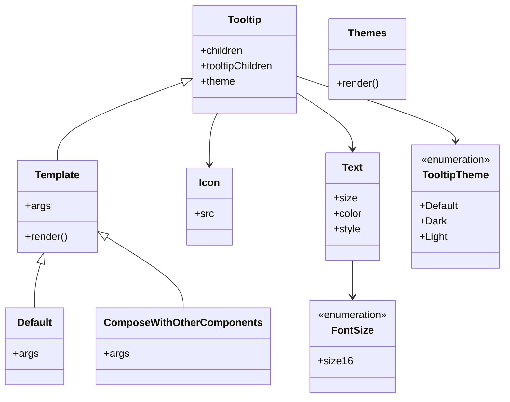

# Diagram: web/portal/src/components/atoms/Tooltip.atom.stories.js


> Auto-generated by Obscura crawlers

## Diagram 1



### SVG

<svg id="container" width="775.62109375" xmlns="http://www.w3.org/2000/svg" class="classDiagram" height="620" viewBox="0 0 775.62109375 620" role="graphics-document document" aria-roledescription="class"><style>#container{font-family:"trebuchet ms",verdana,arial,sans-serif;font-size:16px;fill:#333;}@keyframes edge-animation-frame{from{stroke-dashoffset:0;}}@keyframes dash{to{stroke-dashoffset:0;}}#container .edge-animation-slow{stroke-dasharray:9,5!important;stroke-dashoffset:900;animation:dash 50s linear infinite;stroke-linecap:round;}#container .edge-animation-fast{stroke-dasharray:9,5!important;stroke-dashoffset:900;animation:dash 20s linear infinite;stroke-linecap:round;}#container .error-icon{fill:#552222;}#container .error-text{fill:#552222;stroke:#552222;}#container .edge-thickness-normal{stroke-width:1px;}#container .edge-thickness-thick{stroke-width:3.5px;}#container .edge-pattern-solid{stroke-dasharray:0;}#container .edge-thickness-invisible{stroke-width:0;fill:none;}#container .edge-pattern-dashed{stroke-dasharray:3;}#container .edge-pattern-dotted{stroke-dasharray:2;}#container .marker{fill:#333333;stroke:#333333;}#container .marker.cross{stroke:#333333;}#container svg{font-family:"trebuchet ms",verdana,arial,sans-serif;font-size:16px;}#container p{margin:0;}#container g.classGroup text{fill:#9370DB;stroke:none;font-family:"trebuchet ms",verdana,arial,sans-serif;font-size:10px;}#container g.classGroup text .title{font-weight:bolder;}#container .nodeLabel,#container .edgeLabel{color:#131300;}#container .edgeLabel .label rect{fill:#ECECFF;}#container .label text{fill:#131300;}#container .labelBkg{background:#ECECFF;}#container .edgeLabel .label span{background:#ECECFF;}#container .classTitle{font-weight:bolder;}#container .node rect,#container .node circle,#container .node ellipse,#container .node polygon,#container .node path{fill:#ECECFF;stroke:#9370DB;stroke-width:1px;}#container .divider{stroke:#9370DB;stroke-width:1;}#container g.clickable{cursor:pointer;}#container g.classGroup rect{fill:#ECECFF;stroke:#9370DB;}#container g.classGroup line{stroke:#9370DB;stroke-width:1;}#container .classLabel .box{stroke:none;stroke-width:0;fill:#ECECFF;opacity:0.5;}#container .classLabel .label{fill:#9370DB;font-size:10px;}#container .relation{stroke:#333333;stroke-width:1;fill:none;}#container .dashed-line{stroke-dasharray:3;}#container .dotted-line{stroke-dasharray:1 2;}#container #compositionStart,#container .composition{fill:#333333!important;stroke:#333333!important;stroke-width:1;}#container #compositionEnd,#container .composition{fill:#333333!important;stroke:#333333!important;stroke-width:1;}#container #dependencyStart,#container .dependency{fill:#333333!important;stroke:#333333!important;stroke-width:1;}#container #dependencyStart,#container .dependency{fill:#333333!important;stroke:#333333!important;stroke-width:1;}#container #extensionStart,#container .extension{fill:transparent!important;stroke:#333333!important;stroke-width:1;}#container #extensionEnd,#container .extension{fill:transparent!important;stroke:#333333!important;stroke-width:1;}#container #aggregationStart,#container .aggregation{fill:transparent!important;stroke:#333333!important;stroke-width:1;}#container #aggregationEnd,#container .aggregation{fill:transparent!important;stroke:#333333!important;stroke-width:1;}#container #lollipopStart,#container .lollipop{fill:#ECECFF!important;stroke:#333333!important;stroke-width:1;}#container #lollipopEnd,#container .lollipop{fill:#ECECFF!important;stroke:#333333!important;stroke-width:1;}#container .edgeTerminals{font-size:11px;line-height:initial;}#container .classTitleText{text-anchor:middle;font-size:18px;fill:#333;}#container .label-icon{display:inline-block;height:1em;overflow:visible;vertical-align:-0.125em;}#container .node .label-icon path{fill:currentColor;stroke:revert;stroke-width:revert;}#container :root{--mermaid-font-family:"trebuchet ms",verdana,arial,sans-serif;}</style><g><defs><marker id="container_class-aggregationStart" class="marker aggregation class" refX="18" refY="7" markerWidth="190" markerHeight="240" orient="auto"><path d="M 18,7 L9,13 L1,7 L9,1 Z"></path></marker></defs><defs><marker id="container_class-aggregationEnd" class="marker aggregation class" refX="1" refY="7" markerWidth="20" markerHeight="28" orient="auto"><path d="M 18,7 L9,13 L1,7 L9,1 Z"></path></marker></defs><defs><marker id="container_class-extensionStart" class="marker extension class" refX="18" refY="7" markerWidth="190" markerHeight="240" orient="auto"><path d="M 1,7 L18,13 V 1 Z"></path></marker></defs><defs><marker id="container_class-extensionEnd" class="marker extension class" refX="1" refY="7" markerWidth="20" markerHeight="28" orient="auto"><path d="M 1,1 V 13 L18,7 Z"></path></marker></defs><defs><marker id="container_class-compositionStart" class="marker composition class" refX="18" refY="7" markerWidth="190" markerHeight="240" orient="auto"><path d="M 18,7 L9,13 L1,7 L9,1 Z"></path></marker></defs><defs><marker id="container_class-compositionEnd" class="marker composition class" refX="1" refY="7" markerWidth="20" markerHeight="28" orient="auto"><path d="M 18,7 L9,13 L1,7 L9,1 Z"></path></marker></defs><defs><marker id="container_class-dependencyStart" class="marker dependency class" refX="6" refY="7" markerWidth="190" markerHeight="240" orient="auto"><path d="M 5,7 L9,13 L1,7 L9,1 Z"></path></marker></defs><defs><marker id="container_class-dependencyEnd" class="marker dependency class" refX="13" refY="7" markerWidth="20" markerHeight="28" orient="auto"><path d="M 18,7 L9,13 L14,7 L9,1 Z"></path></marker></defs><defs><marker id="container_class-lollipopStart" class="marker lollipop class" refX="13" refY="7" markerWidth="190" markerHeight="240" orient="auto"><circle stroke="black" fill="transparent" cx="7" cy="7" r="6"></circle></marker></defs><defs><marker id="container_class-lollipopEnd" class="marker lollipop class" refX="1" refY="7" markerWidth="190" markerHeight="240" orient="auto"><circle stroke="black" fill="transparent" cx="7" cy="7" r="6"></circle></marker></defs><g class="root"><g class="clusters"></g><g class="edgePaths"><path d="M273.899,129.395L242.097,141.329C210.296,153.263,146.694,177.132,114.893,197.232C83.092,217.333,83.092,233.667,83.092,241.833L83.092,250" id="id_Tooltip_Template_1" class="edge-thickness-normal edge-pattern-solid relation" style=";;;" data-edge="true" data-et="edge" data-id="id_Tooltip_Template_1" data-points="W3sieCI6MjkwLjA0ODgyODEyNSwieSI6MTIzLjMzNDA1NTA4NjM0MTM4fSx7IngiOjgzLjA5MTc5Njg3NSwieSI6MjAxfSx7IngiOjgzLjA5MTc5Njg3NSwieSI6MjUwfV0=" marker-start="url(#container_class-extensionStart)"></path><path d="M60.584,410.72L59.219,416.1C57.854,421.48,55.124,432.24,53.759,443.787C52.395,455.333,52.395,467.667,52.395,473.833L52.395,480" id="id_Template_Default_2" class="edge-thickness-normal edge-pattern-solid relation" style=";;;" data-edge="true" data-et="edge" data-id="id_Template_Default_2" data-points="W3sieCI6NjQuODI1NjU1MzQ2MDc0MzgsInkiOjM5NH0seyJ4Ijo1Mi4zOTQ1MzEyNSwieSI6NDQzfSx7IngiOjUyLjM5NDUzMTI1LCJ5Ijo0ODB9XQ==" marker-start="url(#container_class-extensionStart)"></path><path d="M159.965,370.241L179.288,382.368C198.612,394.494,237.259,418.747,256.583,437.04C275.906,455.333,275.906,467.667,275.906,473.833L275.906,480" id="id_Template_ComposeWithOtherComponents_3" class="edge-thickness-normal edge-pattern-solid relation" style=";;;" data-edge="true" data-et="edge" data-id="id_Template_ComposeWithOtherComponents_3" data-points="W3sieCI6MTQ1LjM1MzUxNTYyNSwieSI6MzYxLjA3MjExMjMxNjUyODR9LHsieCI6Mjc1LjkwNjI1LCJ5Ijo0NDN9LHsieCI6Mjc1LjkwNjI1LCJ5Ijo0ODB9XQ==" marker-start="url(#container_class-extensionStart)"></path><path d="M457.041,120.086L497.133,133.571C537.225,147.057,617.41,174.029,657.502,190.681C697.594,207.333,697.594,213.667,697.594,216.833L697.594,220" id="id_Tooltip_TooltipTheme_4" class="edge-thickness-normal edge-pattern-solid relation" style=";;;" data-edge="true" data-et="edge" data-id="id_Tooltip_TooltipTheme_4" data-points="W3sieCI6NDU3LjA0MTAxNTYyNSwieSI6MTIwLjA4NTUwMjY0Mjk1MTQzfSx7IngiOjY5Ny41OTM3NSwieSI6MjAxfSx7IngiOjY5Ny41OTM3NSwieSI6MjI2fV0=" marker-end="url(#container_class-dependencyEnd)"></path><path d="M457.041,148.203L470.114,157.003C483.186,165.802,509.331,183.401,522.404,197.367C535.477,211.333,535.477,221.667,535.477,226.833L535.477,232" id="id_Tooltip_Text_5" class="edge-thickness-normal edge-pattern-solid relation" style=";;;" data-edge="true" data-et="edge" data-id="id_Tooltip_Text_5" data-points="W3sieCI6NDU3LjA0MTAxNTYyNSwieSI6MTQ4LjIwMzE4NjYyNjMwMTEyfSx7IngiOjUzNS40NzY1NjI1LCJ5IjoyMDF9LHsieCI6NTM1LjQ3NjU2MjUsInkiOjIzOH1d" marker-end="url(#container_class-dependencyEnd)"></path><path d="M326.754,176L324.433,180.167C322.112,184.333,317.47,192.667,315.149,206C312.828,219.333,312.828,237.667,312.828,246.833L312.828,256" id="id_Tooltip_Icon_6" class="edge-thickness-normal edge-pattern-solid relation" style=";;;" data-edge="true" data-et="edge" data-id="id_Tooltip_Icon_6" data-points="W3sieCI6MzI2Ljc1Mzk5NTg0Mjg4OTk0LCJ5IjoxNzZ9LHsieCI6MzEyLjgyODEyNSwieSI6MjAxfSx7IngiOjMxMi44MjgxMjUsInkiOjI2Mn1d" marker-end="url(#container_class-dependencyEnd)"></path><path d="M535.477,406L535.477,412.167C535.477,418.333,535.477,430.667,535.477,440C535.477,449.333,535.477,455.667,535.477,458.833L535.477,462" id="id_Text_FontSize_7" class="edge-thickness-normal edge-pattern-solid relation" style=";;;" data-edge="true" data-et="edge" data-id="id_Text_FontSize_7" data-points="W3sieCI6NTM1LjQ3NjU2MjUsInkiOjQwNn0seyJ4Ijo1MzUuNDc2NTYyNSwieSI6NDQzfSx7IngiOjUzNS40NzY1NjI1LCJ5Ijo0Njh9XQ==" marker-end="url(#container_class-dependencyEnd)"></path></g><g class="edgeLabels"><g class="edgeLabel"><g class="label" data-id="id_Tooltip_Template_1" transform="translate(0, 0)"><foreignObject width="0" height="0"><div xmlns="http://www.w3.org/1999/xhtml" class="labelBkg" style="display: table-cell; white-space: nowrap; line-height: 1.5; max-width: 200px; text-align: center;"><span class="edgeLabel"></span></div></foreignObject></g></g><g class="edgeLabel"><g class="label" data-id="id_Template_Default_2" transform="translate(0, 0)"><foreignObject width="0" height="0"><div xmlns="http://www.w3.org/1999/xhtml" class="labelBkg" style="display: table-cell; white-space: nowrap; line-height: 1.5; max-width: 200px; text-align: center;"><span class="edgeLabel"></span></div></foreignObject></g></g><g class="edgeLabel"><g class="label" data-id="id_Template_ComposeWithOtherComponents_3" transform="translate(0, 0)"><foreignObject width="0" height="0"><div xmlns="http://www.w3.org/1999/xhtml" class="labelBkg" style="display: table-cell; white-space: nowrap; line-height: 1.5; max-width: 200px; text-align: center;"><span class="edgeLabel"></span></div></foreignObject></g></g><g class="edgeLabel"><g class="label" data-id="id_Tooltip_TooltipTheme_4" transform="translate(0, 0)"><foreignObject width="0" height="0"><div xmlns="http://www.w3.org/1999/xhtml" class="labelBkg" style="display: table-cell; white-space: nowrap; line-height: 1.5; max-width: 200px; text-align: center;"><span class="edgeLabel"></span></div></foreignObject></g></g><g class="edgeLabel"><g class="label" data-id="id_Tooltip_Text_5" transform="translate(0, 0)"><foreignObject width="0" height="0"><div xmlns="http://www.w3.org/1999/xhtml" class="labelBkg" style="display: table-cell; white-space: nowrap; line-height: 1.5; max-width: 200px; text-align: center;"><span class="edgeLabel"></span></div></foreignObject></g></g><g class="edgeLabel"><g class="label" data-id="id_Tooltip_Icon_6" transform="translate(0, 0)"><foreignObject width="0" height="0"><div xmlns="http://www.w3.org/1999/xhtml" class="labelBkg" style="display: table-cell; white-space: nowrap; line-height: 1.5; max-width: 200px; text-align: center;"><span class="edgeLabel"></span></div></foreignObject></g></g><g class="edgeLabel"><g class="label" data-id="id_Text_FontSize_7" transform="translate(0, 0)"><foreignObject width="0" height="0"><div xmlns="http://www.w3.org/1999/xhtml" class="labelBkg" style="display: table-cell; white-space: nowrap; line-height: 1.5; max-width: 200px; text-align: center;"><span class="edgeLabel"></span></div></foreignObject></g></g></g><g class="nodes"><g class="node default" id="classId-Tooltip-0" transform="translate(373.544921875, 92)"><g class="basic label-container"><path d="M-83.49609375 -84 L83.49609375 -84 L83.49609375 84 L-83.49609375 84" stroke="none" stroke-width="0" fill="#ECECFF" style=""></path><path d="M-83.49609375 -84 C-20.21030432147225 -84, 43.0754851070555 -84, 83.49609375 -84 M-83.49609375 -84 C-31.789111327469207 -84, 19.917871095061585 -84, 83.49609375 -84 M83.49609375 -84 C83.49609375 -48.7644096631777, 83.49609375 -13.528819326355404, 83.49609375 84 M83.49609375 -84 C83.49609375 -30.677965023513032, 83.49609375 22.644069952973936, 83.49609375 84 M83.49609375 84 C30.129340500309382 84, -23.237412749381235 84, -83.49609375 84 M83.49609375 84 C49.53408215196218 84, 15.572070553924362 84, -83.49609375 84 M-83.49609375 84 C-83.49609375 25.26017170750874, -83.49609375 -33.47965658498252, -83.49609375 -84 M-83.49609375 84 C-83.49609375 27.377201651064013, -83.49609375 -29.245596697871974, -83.49609375 -84" stroke="#9370DB" stroke-width="1.3" fill="none" stroke-dasharray="0 0" style=""></path></g><g class="annotation-group text" transform="translate(0, -60)"></g><g class="label-group text" transform="translate(-25.7265625, -60)"><g class="label" style="font-weight: bolder" transform="translate(0,-12)"><foreignObject width="51.453125" height="24"><div xmlns="http://www.w3.org/1999/xhtml" style="display: table-cell; white-space: nowrap; line-height: 1.5; max-width: 101px; text-align: center;"><span class="nodeLabel markdown-node-label" style=""><p>Tooltip</p></span></div></foreignObject></g></g><g class="members-group text" transform="translate(-71.49609375, -12)"><g class="label" style="" transform="translate(0,-12)"><foreignObject width="67.5" height="24"><div xmlns="http://www.w3.org/1999/xhtml" style="display: table-cell; white-space: nowrap; line-height: 1.5; max-width: 125px; text-align: center;"><span class="nodeLabel markdown-node-label" style=""><p>+children</p></span></div></foreignObject></g><g class="label" style="" transform="translate(0,12)"><foreignObject width="117.265625" height="24"><div xmlns="http://www.w3.org/1999/xhtml" style="display: table-cell; white-space: nowrap; line-height: 1.5; max-width: 175px; text-align: center;"><span class="nodeLabel markdown-node-label" style=""><p>+tooltipChildren</p></span></div></foreignObject></g><g class="label" style="" transform="translate(0,36)"><foreignObject width="54.21875" height="24"><div xmlns="http://www.w3.org/1999/xhtml" style="display: table-cell; white-space: nowrap; line-height: 1.5; max-width: 112px; text-align: center;"><span class="nodeLabel markdown-node-label" style=""><p>+theme</p></span></div></foreignObject></g></g><g class="methods-group text" transform="translate(-71.49609375, 84)"></g><g class="divider" style=""><path d="M-83.49609375 -36 C-42.96445275403203 -36, -2.4328117580640622 -36, 83.49609375 -36 M-83.49609375 -36 C-29.817601688954753 -36, 23.860890372090495 -36, 83.49609375 -36" stroke="#9370DB" stroke-width="1.3" fill="none" stroke-dasharray="0 0" style=""></path></g><g class="divider" style=""><path d="M-83.49609375 60 C-21.794390308220926 60, 39.90731313355815 60, 83.49609375 60 M-83.49609375 60 C-35.67143358509337 60, 12.153226579813264 60, 83.49609375 60" stroke="#9370DB" stroke-width="1.3" fill="none" stroke-dasharray="0 0" style=""></path></g></g><g class="node default" id="classId-Text-1" transform="translate(535.4765625, 322)"><g class="basic label-container"><path d="M-42.08984375 -84 L42.08984375 -84 L42.08984375 84 L-42.08984375 84" stroke="none" stroke-width="0" fill="#ECECFF" style=""></path><path d="M-42.08984375 -84 C-24.716478501547666 -84, -7.343113253095332 -84, 42.08984375 -84 M-42.08984375 -84 C-14.116614270344918 -84, 13.856615209310164 -84, 42.08984375 -84 M42.08984375 -84 C42.08984375 -30.747922217128448, 42.08984375 22.504155565743105, 42.08984375 84 M42.08984375 -84 C42.08984375 -33.561133891032014, 42.08984375 16.87773221793597, 42.08984375 84 M42.08984375 84 C24.571656939706934 84, 7.053470129413867 84, -42.08984375 84 M42.08984375 84 C20.428737194550486 84, -1.2323693608990283 84, -42.08984375 84 M-42.08984375 84 C-42.08984375 24.832057320364164, -42.08984375 -34.33588535927167, -42.08984375 -84 M-42.08984375 84 C-42.08984375 35.51945741875152, -42.08984375 -12.961085162496957, -42.08984375 -84" stroke="#9370DB" stroke-width="1.3" fill="none" stroke-dasharray="0 0" style=""></path></g><g class="annotation-group text" transform="translate(0, -60)"></g><g class="label-group text" transform="translate(-15.3828125, -60)"><g class="label" style="font-weight: bolder" transform="translate(0,-12)"><foreignObject width="30.765625" height="24"><div xmlns="http://www.w3.org/1999/xhtml" style="display: table-cell; white-space: nowrap; line-height: 1.5; max-width: 80px; text-align: center;"><span class="nodeLabel markdown-node-label" style=""><p>Text</p></span></div></foreignObject></g></g><g class="members-group text" transform="translate(-30.08984375, -12)"><g class="label" style="" transform="translate(0,-12)"><foreignObject width="35.578125" height="24"><div xmlns="http://www.w3.org/1999/xhtml" style="display: table-cell; white-space: nowrap; line-height: 1.5; max-width: 93px; text-align: center;"><span class="nodeLabel markdown-node-label" style=""><p>+size</p></span></div></foreignObject></g><g class="label" style="" transform="translate(0,12)"><foreignObject width="44.796875" height="24"><div xmlns="http://www.w3.org/1999/xhtml" style="display: table-cell; white-space: nowrap; line-height: 1.5; max-width: 103px; text-align: center;"><span class="nodeLabel markdown-node-label" style=""><p>+color</p></span></div></foreignObject></g><g class="label" style="" transform="translate(0,36)"><foreignObject width="42.359375" height="24"><div xmlns="http://www.w3.org/1999/xhtml" style="display: table-cell; white-space: nowrap; line-height: 1.5; max-width: 100px; text-align: center;"><span class="nodeLabel markdown-node-label" style=""><p>+style</p></span></div></foreignObject></g></g><g class="methods-group text" transform="translate(-30.08984375, 84)"></g><g class="divider" style=""><path d="M-42.08984375 -36 C-9.977785643594842 -36, 22.134272462810316 -36, 42.08984375 -36 M-42.08984375 -36 C-22.74067640038397 -36, -3.3915090507679366 -36, 42.08984375 -36" stroke="#9370DB" stroke-width="1.3" fill="none" stroke-dasharray="0 0" style=""></path></g><g class="divider" style=""><path d="M-42.08984375 60 C-11.363171859076612 60, 19.363500031846776 60, 42.08984375 60 M-42.08984375 60 C-12.922389936245597 60, 16.245063877508805 60, 42.08984375 60" stroke="#9370DB" stroke-width="1.3" fill="none" stroke-dasharray="0 0" style=""></path></g></g><g class="node default" id="classId-Icon-2" transform="translate(312.828125, 322)"><g class="basic label-container"><path d="M-34.05859375 -60 L34.05859375 -60 L34.05859375 60 L-34.05859375 60" stroke="none" stroke-width="0" fill="#ECECFF" style=""></path><path d="M-34.05859375 -60 C-7.528669834770746 -60, 19.00125408045851 -60, 34.05859375 -60 M-34.05859375 -60 C-10.617523624793279 -60, 12.823546500413443 -60, 34.05859375 -60 M34.05859375 -60 C34.05859375 -24.642426994226355, 34.05859375 10.71514601154729, 34.05859375 60 M34.05859375 -60 C34.05859375 -35.742581304180675, 34.05859375 -11.485162608361343, 34.05859375 60 M34.05859375 60 C14.42335874684904 60, -5.21187625630192 60, -34.05859375 60 M34.05859375 60 C17.25889419657385 60, 0.459194643147697 60, -34.05859375 60 M-34.05859375 60 C-34.05859375 34.99954834212774, -34.05859375 9.999096684255477, -34.05859375 -60 M-34.05859375 60 C-34.05859375 22.312874292611042, -34.05859375 -15.374251414777916, -34.05859375 -60" stroke="#9370DB" stroke-width="1.3" fill="none" stroke-dasharray="0 0" style=""></path></g><g class="annotation-group text" transform="translate(0, -36)"></g><g class="label-group text" transform="translate(-15.3046875, -36)"><g class="label" style="font-weight: bolder" transform="translate(0,-12)"><foreignObject width="30.609375" height="24"><div xmlns="http://www.w3.org/1999/xhtml" style="display: table-cell; white-space: nowrap; line-height: 1.5; max-width: 81px; text-align: center;"><span class="nodeLabel markdown-node-label" style=""><p>Icon</p></span></div></foreignObject></g></g><g class="members-group text" transform="translate(-22.05859375, 12)"><g class="label" style="" transform="translate(0,-12)"><foreignObject width="28.8125" height="24"><div xmlns="http://www.w3.org/1999/xhtml" style="display: table-cell; white-space: nowrap; line-height: 1.5; max-width: 87px; text-align: center;"><span class="nodeLabel markdown-node-label" style=""><p>+src</p></span></div></foreignObject></g></g><g class="methods-group text" transform="translate(-22.05859375, 60)"></g><g class="divider" style=""><path d="M-34.05859375 -12 C-6.956403198372534 -12, 20.14578735325493 -12, 34.05859375 -12 M-34.05859375 -12 C-15.86504097927434 -12, 2.3285117914513194 -12, 34.05859375 -12" stroke="#9370DB" stroke-width="1.3" fill="none" stroke-dasharray="0 0" style=""></path></g><g class="divider" style=""><path d="M-34.05859375 36 C-7.677534563978174 36, 18.703524622043652 36, 34.05859375 36 M-34.05859375 36 C-10.2486319591642 36, 13.5613298316716 36, 34.05859375 36" stroke="#9370DB" stroke-width="1.3" fill="none" stroke-dasharray="0 0" style=""></path></g></g><g class="node default" id="classId-Template-3" transform="translate(83.091796875, 322)"><g class="basic label-container"><path d="M-62.26171875 -72 L62.26171875 -72 L62.26171875 72 L-62.26171875 72" stroke="none" stroke-width="0" fill="#ECECFF" style=""></path><path d="M-62.26171875 -72 C-30.580398354197936 -72, 1.1009220416041288 -72, 62.26171875 -72 M-62.26171875 -72 C-20.049095158659703 -72, 22.163528432680593 -72, 62.26171875 -72 M62.26171875 -72 C62.26171875 -40.99966191737791, 62.26171875 -9.999323834755813, 62.26171875 72 M62.26171875 -72 C62.26171875 -28.11760190120998, 62.26171875 15.76479619758004, 62.26171875 72 M62.26171875 72 C26.610660144293874 72, -9.040398461412252 72, -62.26171875 72 M62.26171875 72 C30.653915068442732 72, -0.9538886131145361 72, -62.26171875 72 M-62.26171875 72 C-62.26171875 30.44050293087905, -62.26171875 -11.118994138241902, -62.26171875 -72 M-62.26171875 72 C-62.26171875 26.423962016062745, -62.26171875 -19.15207596787451, -62.26171875 -72" stroke="#9370DB" stroke-width="1.3" fill="none" stroke-dasharray="0 0" style=""></path></g><g class="annotation-group text" transform="translate(0, -48)"></g><g class="label-group text" transform="translate(-33.9140625, -48)"><g class="label" style="font-weight: bolder" transform="translate(0,-12)"><foreignObject width="67.828125" height="24"><div xmlns="http://www.w3.org/1999/xhtml" style="display: table-cell; white-space: nowrap; line-height: 1.5; max-width: 117px; text-align: center;"><span class="nodeLabel markdown-node-label" style=""><p>Template</p></span></div></foreignObject></g></g><g class="members-group text" transform="translate(-50.26171875, 0)"><g class="label" style="" transform="translate(0,-12)"><foreignObject width="38.078125" height="24"><div xmlns="http://www.w3.org/1999/xhtml" style="display: table-cell; white-space: nowrap; line-height: 1.5; max-width: 95px; text-align: center;"><span class="nodeLabel markdown-node-label" style=""><p>+args</p></span></div></foreignObject></g></g><g class="methods-group text" transform="translate(-50.26171875, 48)"><g class="label" style="" transform="translate(0,-12)"><foreignObject width="66.609375" height="24"><div xmlns="http://www.w3.org/1999/xhtml" style="display: table-cell; white-space: nowrap; line-height: 1.5; max-width: 124px; text-align: center;"><span class="nodeLabel markdown-node-label" style=""><p>+render()</p></span></div></foreignObject></g></g><g class="divider" style=""><path d="M-62.26171875 -24 C-12.670103675287677 -24, 36.921511399424645 -24, 62.26171875 -24 M-62.26171875 -24 C-22.8212190386733 -24, 16.619280672653403 -24, 62.26171875 -24" stroke="#9370DB" stroke-width="1.3" fill="none" stroke-dasharray="0 0" style=""></path></g><g class="divider" style=""><path d="M-62.26171875 24 C-20.288999980757637 24, 21.683718788484725 24, 62.26171875 24 M-62.26171875 24 C-20.79937194585292 24, 20.662974858294163 24, 62.26171875 24" stroke="#9370DB" stroke-width="1.3" fill="none" stroke-dasharray="0 0" style=""></path></g></g><g class="node default" id="classId-Default-4" transform="translate(52.39453125, 540)"><g class="basic label-container"><path d="M-44.39453125 -60 L44.39453125 -60 L44.39453125 60 L-44.39453125 60" stroke="none" stroke-width="0" fill="#ECECFF" style=""></path><path d="M-44.39453125 -60 C-19.687883780077346 -60, 5.018763689845308 -60, 44.39453125 -60 M-44.39453125 -60 C-10.810379255452403 -60, 22.773772739095193 -60, 44.39453125 -60 M44.39453125 -60 C44.39453125 -35.95723057469468, 44.39453125 -11.914461149389346, 44.39453125 60 M44.39453125 -60 C44.39453125 -24.990987166111978, 44.39453125 10.018025667776044, 44.39453125 60 M44.39453125 60 C15.171225657973231 60, -14.052079934053538 60, -44.39453125 60 M44.39453125 60 C18.273232062634587 60, -7.848067124730825 60, -44.39453125 60 M-44.39453125 60 C-44.39453125 19.14055250380448, -44.39453125 -21.718894992391043, -44.39453125 -60 M-44.39453125 60 C-44.39453125 15.270420588433012, -44.39453125 -29.459158823133976, -44.39453125 -60" stroke="#9370DB" stroke-width="1.3" fill="none" stroke-dasharray="0 0" style=""></path></g><g class="annotation-group text" transform="translate(0, -36)"></g><g class="label-group text" transform="translate(-26.7109375, -36)"><g class="label" style="font-weight: bolder" transform="translate(0,-12)"><foreignObject width="53.421875" height="24"><div xmlns="http://www.w3.org/1999/xhtml" style="display: table-cell; white-space: nowrap; line-height: 1.5; max-width: 103px; text-align: center;"><span class="nodeLabel markdown-node-label" style=""><p>Default</p></span></div></foreignObject></g></g><g class="members-group text" transform="translate(-32.39453125, 12)"><g class="label" style="" transform="translate(0,-12)"><foreignObject width="38.078125" height="24"><div xmlns="http://www.w3.org/1999/xhtml" style="display: table-cell; white-space: nowrap; line-height: 1.5; max-width: 95px; text-align: center;"><span class="nodeLabel markdown-node-label" style=""><p>+args</p></span></div></foreignObject></g></g><g class="methods-group text" transform="translate(-32.39453125, 60)"></g><g class="divider" style=""><path d="M-44.39453125 -12 C-18.297220055730993 -12, 7.800091138538015 -12, 44.39453125 -12 M-44.39453125 -12 C-22.33957133867637 -12, -0.28461142735274336 -12, 44.39453125 -12" stroke="#9370DB" stroke-width="1.3" fill="none" stroke-dasharray="0 0" style=""></path></g><g class="divider" style=""><path d="M-44.39453125 36 C-19.60080928375775 36, 5.192912682484497 36, 44.39453125 36 M-44.39453125 36 C-10.87802251639679 36, 22.63848621720642 36, 44.39453125 36" stroke="#9370DB" stroke-width="1.3" fill="none" stroke-dasharray="0 0" style=""></path></g></g><g class="node default" id="classId-Themes-5" transform="translate(566.544921875, 92)"><g class="basic label-container"><path d="M-59.50390625 -63 L59.50390625 -63 L59.50390625 63 L-59.50390625 63" stroke="none" stroke-width="0" fill="#ECECFF" style=""></path><path d="M-59.50390625 -63 C-31.079033145112582 -63, -2.6541600402251646 -63, 59.50390625 -63 M-59.50390625 -63 C-22.294200538550072 -63, 14.915505172899856 -63, 59.50390625 -63 M59.50390625 -63 C59.50390625 -23.86453388002647, 59.50390625 15.270932239947058, 59.50390625 63 M59.50390625 -63 C59.50390625 -34.30011130953248, 59.50390625 -5.600222619064972, 59.50390625 63 M59.50390625 63 C17.618138333414976 63, -24.26762958317005 63, -59.50390625 63 M59.50390625 63 C28.14444731867952 63, -3.215011612640957 63, -59.50390625 63 M-59.50390625 63 C-59.50390625 29.71254041996079, -59.50390625 -3.574919160078423, -59.50390625 -63 M-59.50390625 63 C-59.50390625 35.47843725354925, -59.50390625 7.9568745070985045, -59.50390625 -63" stroke="#9370DB" stroke-width="1.3" fill="none" stroke-dasharray="0 0" style=""></path></g><g class="annotation-group text" transform="translate(0, -39)"></g><g class="label-group text" transform="translate(-28.3984375, -39)"><g class="label" style="font-weight: bolder" transform="translate(0,-12)"><foreignObject width="56.796875" height="24"><div xmlns="http://www.w3.org/1999/xhtml" style="display: table-cell; white-space: nowrap; line-height: 1.5; max-width: 106px; text-align: center;"><span class="nodeLabel markdown-node-label" style=""><p>Themes</p></span></div></foreignObject></g></g><g class="members-group text" transform="translate(-47.50390625, 9)"></g><g class="methods-group text" transform="translate(-47.50390625, 39)"><g class="label" style="" transform="translate(0,-12)"><foreignObject width="66.609375" height="24"><div xmlns="http://www.w3.org/1999/xhtml" style="display: table-cell; white-space: nowrap; line-height: 1.5; max-width: 124px; text-align: center;"><span class="nodeLabel markdown-node-label" style=""><p>+render()</p></span></div></foreignObject></g></g><g class="divider" style=""><path d="M-59.50390625 -15 C-34.51102634524465 -15, -9.518146440489303 -15, 59.50390625 -15 M-59.50390625 -15 C-26.695187650850876 -15, 6.113530948298248 -15, 59.50390625 -15" stroke="#9370DB" stroke-width="1.3" fill="none" stroke-dasharray="0 0" style=""></path></g><g class="divider" style=""><path d="M-59.50390625 9 C-18.216190749896846 9, 23.071524750206308 9, 59.50390625 9 M-59.50390625 9 C-25.221446692161543 9, 9.061012865676915 9, 59.50390625 9" stroke="#9370DB" stroke-width="1.3" fill="none" stroke-dasharray="0 0" style=""></path></g></g><g class="node default" id="classId-ComposeWithOtherComponents-6" transform="translate(275.90625, 540)"><g class="basic label-container"><path d="M-129.1171875 -60 L129.1171875 -60 L129.1171875 60 L-129.1171875 60" stroke="none" stroke-width="0" fill="#ECECFF" style=""></path><path d="M-129.1171875 -60 C-60.862374803650184 -60, 7.392437892699633 -60, 129.1171875 -60 M-129.1171875 -60 C-56.20067174660882 -60, 16.715844006782362 -60, 129.1171875 -60 M129.1171875 -60 C129.1171875 -35.868345102306264, 129.1171875 -11.736690204612536, 129.1171875 60 M129.1171875 -60 C129.1171875 -17.404221403438875, 129.1171875 25.19155719312225, 129.1171875 60 M129.1171875 60 C26.20401786423804 60, -76.70915177152392 60, -129.1171875 60 M129.1171875 60 C33.35985376150259 60, -62.397479976994816 60, -129.1171875 60 M-129.1171875 60 C-129.1171875 31.32445570264374, -129.1171875 2.6489114052874783, -129.1171875 -60 M-129.1171875 60 C-129.1171875 18.902867341171344, -129.1171875 -22.19426531765731, -129.1171875 -60" stroke="#9370DB" stroke-width="1.3" fill="none" stroke-dasharray="0 0" style=""></path></g><g class="annotation-group text" transform="translate(0, -36)"></g><g class="label-group text" transform="translate(-117.1171875, -36)"><g class="label" style="font-weight: bolder" transform="translate(0,-12)"><foreignObject width="234.234375" height="24"><div xmlns="http://www.w3.org/1999/xhtml" style="display: table-cell; white-space: nowrap; line-height: 1.5; max-width: 282px; text-align: center;"><span class="nodeLabel markdown-node-label" style=""><p>ComposeWithOtherComponents</p></span></div></foreignObject></g></g><g class="members-group text" transform="translate(-117.1171875, 12)"><g class="label" style="" transform="translate(0,-12)"><foreignObject width="38.078125" height="24"><div xmlns="http://www.w3.org/1999/xhtml" style="display: table-cell; white-space: nowrap; line-height: 1.5; max-width: 95px; text-align: center;"><span class="nodeLabel markdown-node-label" style=""><p>+args</p></span></div></foreignObject></g></g><g class="methods-group text" transform="translate(-117.1171875, 60)"></g><g class="divider" style=""><path d="M-129.1171875 -12 C-58.6960710766496 -12, 11.725045346700796 -12, 129.1171875 -12 M-129.1171875 -12 C-33.04557018340013 -12, 63.02604713319974 -12, 129.1171875 -12" stroke="#9370DB" stroke-width="1.3" fill="none" stroke-dasharray="0 0" style=""></path></g><g class="divider" style=""><path d="M-129.1171875 36 C-55.22875919944778 36, 18.65966910110444 36, 129.1171875 36 M-129.1171875 36 C-74.49899348060646 36, -19.880799461212916 36, 129.1171875 36" stroke="#9370DB" stroke-width="1.3" fill="none" stroke-dasharray="0 0" style=""></path></g></g><g class="node default" id="classId-TooltipTheme-7" transform="translate(697.59375, 322)"><g class="basic label-container"><path d="M-70.02734375 -96 L70.02734375 -96 L70.02734375 96 L-70.02734375 96" stroke="none" stroke-width="0" fill="#ECECFF" style=""></path><path d="M-70.02734375 -96 C-15.84509007301314 -96, 38.33716360397372 -96, 70.02734375 -96 M-70.02734375 -96 C-16.064302758340304 -96, 37.89873823331939 -96, 70.02734375 -96 M70.02734375 -96 C70.02734375 -47.981380561401004, 70.02734375 0.03723887719799279, 70.02734375 96 M70.02734375 -96 C70.02734375 -51.41455313339487, 70.02734375 -6.829106266789736, 70.02734375 96 M70.02734375 96 C23.164813158998165 96, -23.69771743200367 96, -70.02734375 96 M70.02734375 96 C17.81677212599346 96, -34.39379949801308 96, -70.02734375 96 M-70.02734375 96 C-70.02734375 42.51912173457127, -70.02734375 -10.961756530857457, -70.02734375 -96 M-70.02734375 96 C-70.02734375 39.878592575657194, -70.02734375 -16.24281484868561, -70.02734375 -96" stroke="#9370DB" stroke-width="1.3" fill="none" stroke-dasharray="0 0" style=""></path></g><g class="annotation-group text" transform="translate(-55.5546875, -72)"><g class="label" style="" transform="translate(0,-12)"><foreignObject width="111.109375" height="24"><div xmlns="http://www.w3.org/1999/xhtml" style="display: table-cell; white-space: nowrap; line-height: 1.5; max-width: 161px; text-align: center;"><span class="nodeLabel markdown-node-label" style=""><p>«enumeration»</p></span></div></foreignObject></g></g><g class="label-group text" transform="translate(-50.25, -48)"><g class="label" style="font-weight: bolder" transform="translate(0,-12)"><foreignObject width="100.5" height="24"><div xmlns="http://www.w3.org/1999/xhtml" style="display: table-cell; white-space: nowrap; line-height: 1.5; max-width: 149px; text-align: center;"><span class="nodeLabel markdown-node-label" style=""><p>TooltipTheme</p></span></div></foreignObject></g></g><g class="members-group text" transform="translate(-58.02734375, 0)"><g class="label" style="" transform="translate(0,-12)"><foreignObject width="60.5" height="24"><div xmlns="http://www.w3.org/1999/xhtml" style="display: table-cell; white-space: nowrap; line-height: 1.5; max-width: 118px; text-align: center;"><span class="nodeLabel markdown-node-label" style=""><p>+Default</p></span></div></foreignObject></g><g class="label" style="" transform="translate(0,12)"><foreignObject width="41.203125" height="24"><div xmlns="http://www.w3.org/1999/xhtml" style="display: table-cell; white-space: nowrap; line-height: 1.5; max-width: 99px; text-align: center;"><span class="nodeLabel markdown-node-label" style=""><p>+Dark</p></span></div></foreignObject></g><g class="label" style="" transform="translate(0,36)"><foreignObject width="43.9375" height="24"><div xmlns="http://www.w3.org/1999/xhtml" style="display: table-cell; white-space: nowrap; line-height: 1.5; max-width: 102px; text-align: center;"><span class="nodeLabel markdown-node-label" style=""><p>+Light</p></span></div></foreignObject></g></g><g class="methods-group text" transform="translate(-58.02734375, 96)"></g><g class="divider" style=""><path d="M-70.02734375 -24 C-40.901257291331234 -24, -11.775170832662468 -24, 70.02734375 -24 M-70.02734375 -24 C-27.25923030108285 -24, 15.508883147834297 -24, 70.02734375 -24" stroke="#9370DB" stroke-width="1.3" fill="none" stroke-dasharray="0 0" style=""></path></g><g class="divider" style=""><path d="M-70.02734375 72 C-29.134702093772162 72, 11.757939562455675 72, 70.02734375 72 M-70.02734375 72 C-28.69466432143924 72, 12.638015107121518 72, 70.02734375 72" stroke="#9370DB" stroke-width="1.3" fill="none" stroke-dasharray="0 0" style=""></path></g></g><g class="node default" id="classId-FontSize-8" transform="translate(535.4765625, 540)"><g class="basic label-container"><path d="M-67.5546875 -72 L67.5546875 -72 L67.5546875 72 L-67.5546875 72" stroke="none" stroke-width="0" fill="#ECECFF" style=""></path><path d="M-67.5546875 -72 C-34.53571163002708 -72, -1.5167357600541607 -72, 67.5546875 -72 M-67.5546875 -72 C-20.19547572752426 -72, 27.163736044951477 -72, 67.5546875 -72 M67.5546875 -72 C67.5546875 -23.149863131317666, 67.5546875 25.700273737364668, 67.5546875 72 M67.5546875 -72 C67.5546875 -16.067200683198628, 67.5546875 39.865598633602744, 67.5546875 72 M67.5546875 72 C34.466218634041525 72, 1.3777497680830493 72, -67.5546875 72 M67.5546875 72 C18.82642992357514 72, -29.901827652849718 72, -67.5546875 72 M-67.5546875 72 C-67.5546875 17.7486833620587, -67.5546875 -36.5026332758826, -67.5546875 -72 M-67.5546875 72 C-67.5546875 29.146080084075393, -67.5546875 -13.707839831849213, -67.5546875 -72" stroke="#9370DB" stroke-width="1.3" fill="none" stroke-dasharray="0 0" style=""></path></g><g class="annotation-group text" transform="translate(-55.5546875, -48)"><g class="label" style="" transform="translate(0,-12)"><foreignObject width="111.109375" height="24"><div xmlns="http://www.w3.org/1999/xhtml" style="display: table-cell; white-space: nowrap; line-height: 1.5; max-width: 161px; text-align: center;"><span class="nodeLabel markdown-node-label" style=""><p>«enumeration»</p></span></div></foreignObject></g></g><g class="label-group text" transform="translate(-30.84375, -24)"><g class="label" style="font-weight: bolder" transform="translate(0,-12)"><foreignObject width="61.6875" height="24"><div xmlns="http://www.w3.org/1999/xhtml" style="display: table-cell; white-space: nowrap; line-height: 1.5; max-width: 111px; text-align: center;"><span class="nodeLabel markdown-node-label" style=""><p>FontSize</p></span></div></foreignObject></g></g><g class="members-group text" transform="translate(-55.5546875, 24)"><g class="label" style="" transform="translate(0,-12)"><foreignObject width="50.234375" height="24"><div xmlns="http://www.w3.org/1999/xhtml" style="display: table-cell; white-space: nowrap; line-height: 1.5; max-width: 108px; text-align: center;"><span class="nodeLabel markdown-node-label" style=""><p>+size16</p></span></div></foreignObject></g></g><g class="methods-group text" transform="translate(-55.5546875, 72)"></g><g class="divider" style=""><path d="M-67.5546875 0 C-27.8911446354226 0, 11.772398229154803 0, 67.5546875 0 M-67.5546875 0 C-15.695294876012426 0, 36.16409774797515 0, 67.5546875 0" stroke="#9370DB" stroke-width="1.3" fill="none" stroke-dasharray="0 0" style=""></path></g><g class="divider" style=""><path d="M-67.5546875 48 C-36.65992714148108 48, -5.765166782962162 48, 67.5546875 48 M-67.5546875 48 C-24.497842162980326 48, 18.559003174039347 48, 67.5546875 48" stroke="#9370DB" stroke-width="1.3" fill="none" stroke-dasharray="0 0" style=""></path></g></g></g></g></g></svg>

## Diagram 2

```mermaid
flowchart TD
    Storybook["Story: Atoms/Tooltip"] --> TemplateNode[Template (args) ]
    TemplateNode --> TooltipComp[Tooltip Component]
    TooltipComp -->|uses| TextComp[Text]
    TooltipComp -->|uses| IconComp[Icon]
    TooltipComp -->|prop: theme ->| TooltipThemeEnum[TooltipTheme (enum)]
    DefaultStory[Default Story] -->|binds| TemplateNode
    DefaultStory -->|args: children, tooltipChildren| TooltipComp
    ThemesStory[Themes Story] --> TooltipComp
    ThemesStory -->|iterates over| TooltipThemeEnum
    ComposeStory[ComposeWithOtherComponents] --> TemplateNode
    ComposeStory -->|args include Icon & Text| TooltipComp
```

> SVG rendering failed for this diagram.
