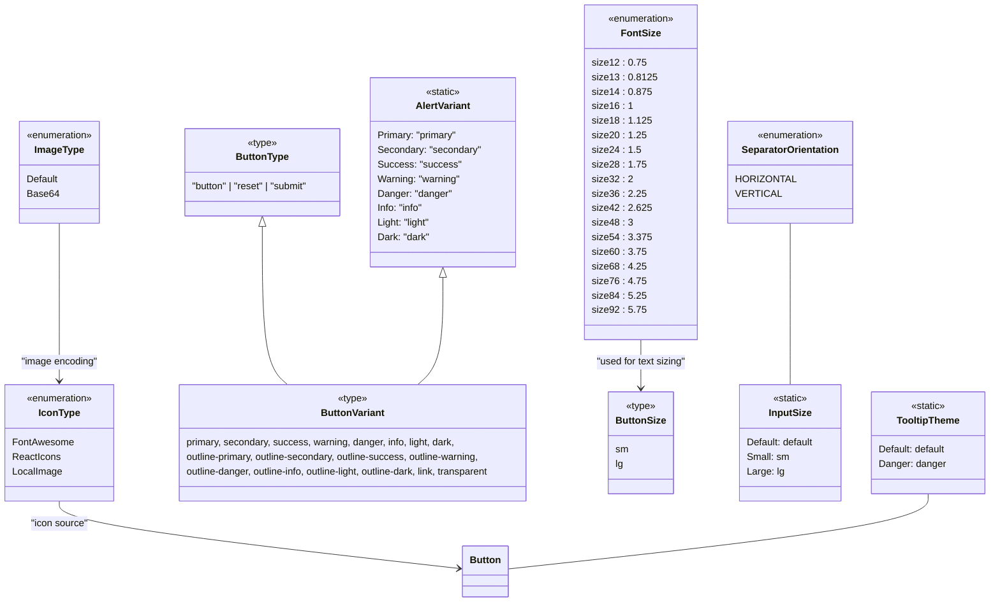

# Diagram: web/portal/src/components/atoms/enums.ts


> Auto-generated by Obscura crawlers

## Diagram 1



> SVG rendering failed for this diagram.

## Diagram 2

```mermaid
flowchart TD
    Button[Button Component]
    BtnType[ButtonType: "button"|"reset"|"submit"]
    BtnVariant[ButtonVariant]
    BtnSize[ButtonSize: sm|lg]
    FontSizeEnum[FontSize enum]
    IconSource[IconType]
    ImageEnc[ImageType]
    AlertConst[AlertVariant constants]
    Separator[SeparatorOrientation]
    InputSz[InputSize constants]
    Tooltip[TooltipTheme constants]

    Button -->|has type| BtnType
    Button -->|has variant| BtnVariant
    Button -->|has size| BtnSize
    Button -->|uses font sizes| FontSizeEnum
    Button -->|may include icon from| IconSource
    IconSource -->|image encoding| ImageEnc
    BtnVariant --> AlertConst
    Button -->|may show tooltip with theme| Tooltip
    Separator --> InputSz
    style Button fill:#f9f,stroke:#333,stroke-width:1px
    style FontSizeEnum fill:#efe,stroke:#333
    style IconSource fill:#eef,stroke:#333
```

> SVG rendering failed for this diagram.
