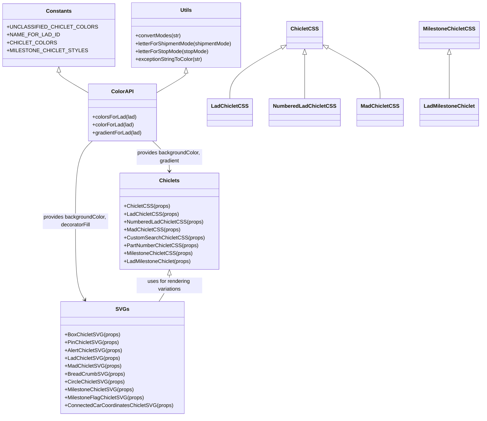

# Diagram: web/portal/src/components/chiclets.js


> Auto-generated by Obscura crawlers

## Diagram 1



### SVG

<svg id="container" width="1392.251953125" xmlns="http://www.w3.org/2000/svg" class="classDiagram" height="1270" viewBox="0 0 1392.251953125 1270" role="graphics-document document" aria-roledescription="class"><style>#container{font-family:"trebuchet ms",verdana,arial,sans-serif;font-size:16px;fill:#333;}@keyframes edge-animation-frame{from{stroke-dashoffset:0;}}@keyframes dash{to{stroke-dashoffset:0;}}#container .edge-animation-slow{stroke-dasharray:9,5!important;stroke-dashoffset:900;animation:dash 50s linear infinite;stroke-linecap:round;}#container .edge-animation-fast{stroke-dasharray:9,5!important;stroke-dashoffset:900;animation:dash 20s linear infinite;stroke-linecap:round;}#container .error-icon{fill:#552222;}#container .error-text{fill:#552222;stroke:#552222;}#container .edge-thickness-normal{stroke-width:1px;}#container .edge-thickness-thick{stroke-width:3.5px;}#container .edge-pattern-solid{stroke-dasharray:0;}#container .edge-thickness-invisible{stroke-width:0;fill:none;}#container .edge-pattern-dashed{stroke-dasharray:3;}#container .edge-pattern-dotted{stroke-dasharray:2;}#container .marker{fill:#333333;stroke:#333333;}#container .marker.cross{stroke:#333333;}#container svg{font-family:"trebuchet ms",verdana,arial,sans-serif;font-size:16px;}#container p{margin:0;}#container g.classGroup text{fill:#9370DB;stroke:none;font-family:"trebuchet ms",verdana,arial,sans-serif;font-size:10px;}#container g.classGroup text .title{font-weight:bolder;}#container .nodeLabel,#container .edgeLabel{color:#131300;}#container .edgeLabel .label rect{fill:#ECECFF;}#container .label text{fill:#131300;}#container .labelBkg{background:#ECECFF;}#container .edgeLabel .label span{background:#ECECFF;}#container .classTitle{font-weight:bolder;}#container .node rect,#container .node circle,#container .node ellipse,#container .node polygon,#container .node path{fill:#ECECFF;stroke:#9370DB;stroke-width:1px;}#container .divider{stroke:#9370DB;stroke-width:1;}#container g.clickable{cursor:pointer;}#container g.classGroup rect{fill:#ECECFF;stroke:#9370DB;}#container g.classGroup line{stroke:#9370DB;stroke-width:1;}#container .classLabel .box{stroke:none;stroke-width:0;fill:#ECECFF;opacity:0.5;}#container .classLabel .label{fill:#9370DB;font-size:10px;}#container .relation{stroke:#333333;stroke-width:1;fill:none;}#container .dashed-line{stroke-dasharray:3;}#container .dotted-line{stroke-dasharray:1 2;}#container #compositionStart,#container .composition{fill:#333333!important;stroke:#333333!important;stroke-width:1;}#container #compositionEnd,#container .composition{fill:#333333!important;stroke:#333333!important;stroke-width:1;}#container #dependencyStart,#container .dependency{fill:#333333!important;stroke:#333333!important;stroke-width:1;}#container #dependencyStart,#container .dependency{fill:#333333!important;stroke:#333333!important;stroke-width:1;}#container #extensionStart,#container .extension{fill:transparent!important;stroke:#333333!important;stroke-width:1;}#container #extensionEnd,#container .extension{fill:transparent!important;stroke:#333333!important;stroke-width:1;}#container #aggregationStart,#container .aggregation{fill:transparent!important;stroke:#333333!important;stroke-width:1;}#container #aggregationEnd,#container .aggregation{fill:transparent!important;stroke:#333333!important;stroke-width:1;}#container #lollipopStart,#container .lollipop{fill:#ECECFF!important;stroke:#333333!important;stroke-width:1;}#container #lollipopEnd,#container .lollipop{fill:#ECECFF!important;stroke:#333333!important;stroke-width:1;}#container .edgeTerminals{font-size:11px;line-height:initial;}#container .classTitleText{text-anchor:middle;font-size:18px;fill:#333;}#container .label-icon{display:inline-block;height:1em;overflow:visible;vertical-align:-0.125em;}#container .node .label-icon path{fill:currentColor;stroke:revert;stroke-width:revert;}#container :root{--mermaid-font-family:"trebuchet ms",verdana,arial,sans-serif;}</style><g><defs><marker id="container_class-aggregationStart" class="marker aggregation class" refX="18" refY="7" markerWidth="190" markerHeight="240" orient="auto"><path d="M 18,7 L9,13 L1,7 L9,1 Z"></path></marker></defs><defs><marker id="container_class-aggregationEnd" class="marker aggregation class" refX="1" refY="7" markerWidth="20" markerHeight="28" orient="auto"><path d="M 18,7 L9,13 L1,7 L9,1 Z"></path></marker></defs><defs><marker id="container_class-extensionStart" class="marker extension class" refX="18" refY="7" markerWidth="190" markerHeight="240" orient="auto"><path d="M 1,7 L18,13 V 1 Z"></path></marker></defs><defs><marker id="container_class-extensionEnd" class="marker extension class" refX="1" refY="7" markerWidth="20" markerHeight="28" orient="auto"><path d="M 1,1 V 13 L18,7 Z"></path></marker></defs><defs><marker id="container_class-compositionStart" class="marker composition class" refX="18" refY="7" markerWidth="190" markerHeight="240" orient="auto"><path d="M 18,7 L9,13 L1,7 L9,1 Z"></path></marker></defs><defs><marker id="container_class-compositionEnd" class="marker composition class" refX="1" refY="7" markerWidth="20" markerHeight="28" orient="auto"><path d="M 18,7 L9,13 L1,7 L9,1 Z"></path></marker></defs><defs><marker id="container_class-dependencyStart" class="marker dependency class" refX="6" refY="7" markerWidth="190" markerHeight="240" orient="auto"><path d="M 5,7 L9,13 L1,7 L9,1 Z"></path></marker></defs><defs><marker id="container_class-dependencyEnd" class="marker dependency class" refX="13" refY="7" markerWidth="20" markerHeight="28" orient="auto"><path d="M 18,7 L9,13 L14,7 L9,1 Z"></path></marker></defs><defs><marker id="container_class-lollipopStart" class="marker lollipop class" refX="13" refY="7" markerWidth="190" markerHeight="240" orient="auto"><circle stroke="black" fill="transparent" cx="7" cy="7" r="6"></circle></marker></defs><defs><marker id="container_class-lollipopEnd" class="marker lollipop class" refX="1" refY="7" markerWidth="190" markerHeight="240" orient="auto"><circle stroke="black" fill="transparent" cx="7" cy="7" r="6"></circle></marker></defs><g class="root"><g class="clusters"></g><g class="edgePaths"><path d="M157.059,220.25L157.059,222.042C157.059,223.833,157.059,227.417,170.645,237.457C184.231,247.497,211.404,263.993,224.99,272.241L238.576,280.49" id="id_Constants_ColorAPI_1" class="edge-thickness-normal edge-pattern-solid relation" style=";;;" data-edge="true" data-et="edge" data-id="id_Constants_ColorAPI_1" data-points="W3sieCI6MTU3LjA1ODU5Mzc1LCJ5IjoyMDN9LHsieCI6MTU3LjA1ODU5Mzc1LCJ5IjoyMzF9LHsieCI6MjM4LjU3NjE3MTg3NSwieSI6MjgwLjQ4OTY0MDU2OTU4MzR9XQ==" marker-start="url(#container_class-extensionStart)"></path><path d="M526.023,223.25L526.023,224.542C526.023,225.833,526.023,228.417,512.437,237.957C498.851,247.497,471.678,263.993,458.092,272.241L444.506,280.49" id="id_Utils_ColorAPI_2" class="edge-thickness-normal edge-pattern-solid relation" style=";;;" data-edge="true" data-et="edge" data-id="id_Utils_ColorAPI_2" data-points="W3sieCI6NTI2LjAyMzQzNzUsInkiOjIwNn0seyJ4Ijo1MjYuMDIzNDM3NSwieSI6MjMxfSx7IngiOjQ0NC41MDU4NTkzNzUsInkiOjI4MC40ODk2NDA1Njk1ODM0fV0=" marker-start="url(#container_class-extensionStart)"></path><path d="M431.271,430L439.694,438.167C448.117,446.333,464.963,462.667,473.386,478C481.809,493.333,481.809,507.667,481.809,514.833L481.809,522" id="id_ColorAPI_Chiclets_3" class="edge-thickness-normal edge-pattern-solid relation" style=";;;" data-edge="true" data-et="edge" data-id="id_ColorAPI_Chiclets_3" data-points="W3sieCI6NDMxLjI3MTAxMDQ1NDk2MzIzLCJ5Ijo0MzB9LHsieCI6NDgxLjgwODU5Mzc1LCJ5Ijo0Nzl9LHsieCI6NDgxLjgwODU5Mzc1LCJ5Ijo1Mjh9XQ==" marker-end="url(#container_class-dependencyEnd)"></path><path d="M251.811,430L243.388,438.167C234.965,446.333,218.119,462.667,209.696,503.5C201.273,544.333,201.273,609.667,201.273,675C201.273,740.333,201.273,805.667,205.943,845.657C210.612,885.647,219.951,900.294,224.62,907.617L229.289,914.941" id="id_ColorAPI_SVGs_4" class="edge-thickness-normal edge-pattern-solid relation" style=";;;" data-edge="true" data-et="edge" data-id="id_ColorAPI_SVGs_4" data-points="W3sieCI6MjUxLjgxMTAyMDc5NTAzNjc3LCJ5Ijo0MzB9LHsieCI6MjAxLjI3MzQzNzUsInkiOjQ3OX0seyJ4IjoyMDEuMjczNDM3NSwieSI6Njc1fSx7IngiOjIwMS4yNzM0Mzc1LCJ5Ijo4NzF9LHsieCI6MjMyLjUxNDg1MjYyNzg0MDkyLCJ5Ijo5MjB9XQ==" marker-end="url(#container_class-dependencyEnd)"></path><path d="M481.809,839.25L481.809,844.542C481.809,849.833,481.809,860.417,476.602,873.875C471.395,887.333,460.981,903.667,455.774,911.833L450.567,920" id="id_Chiclets_SVGs_5" class="edge-thickness-normal edge-pattern-solid relation" style=";;;" data-edge="true" data-et="edge" data-id="id_Chiclets_SVGs_5" data-points="W3sieCI6NDgxLjgwODU5Mzc1LCJ5Ijo4MjJ9LHsieCI6NDgxLjgwODU5Mzc1LCJ5Ijo4NzF9LHsieCI6NDUwLjU2NzE3ODYyMjE1OTEsInkiOjkyMH1d" marker-start="url(#container_class-extensionStart)"></path><path d="M811.976,144.708L786.954,159.09C761.933,173.472,711.889,202.236,686.867,228.285C661.846,254.333,661.846,277.667,661.846,289.333L661.846,301" id="id_ChicletCSS_LadChicletCSS_6" class="edge-thickness-normal edge-pattern-solid relation" style=";;;" data-edge="true" data-et="edge" data-id="id_ChicletCSS_LadChicletCSS_6" data-points="W3sieCI6ODI2LjkzMTY0MDYyNSwieSI6MTM2LjExMTc1NDkwNjkzMTI1fSx7IngiOjY2MS44NDU3MDMxMjUsInkiOjIzMX0seyJ4Ijo2NjEuODQ1NzAzMTI1LCJ5IjozMDF9XQ==" marker-start="url(#container_class-extensionStart)"></path><path d="M877.58,166.25L877.58,177.042C877.58,187.833,877.58,209.417,877.58,231.875C877.58,254.333,877.58,277.667,877.58,289.333L877.58,301" id="id_ChicletCSS_NumberedLadChicletCSS_7" class="edge-thickness-normal edge-pattern-solid relation" style=";;;" data-edge="true" data-et="edge" data-id="id_ChicletCSS_NumberedLadChicletCSS_7" data-points="W3sieCI6ODc3LjU4MDA3ODEyNSwieSI6MTQ5fSx7IngiOjg3Ny41ODAwNzgxMjUsInkiOjIzMX0seyJ4Ijo4NzcuNTgwMDc4MTI1LCJ5IjozMDF9XQ==" marker-start="url(#container_class-extensionStart)"></path><path d="M943.223,144.338L968.616,158.782C994.008,173.225,1044.794,202.113,1070.187,228.223C1095.58,254.333,1095.58,277.667,1095.58,289.333L1095.58,301" id="id_ChicletCSS_MadChicletCSS_8" class="edge-thickness-normal edge-pattern-solid relation" style=";;;" data-edge="true" data-et="edge" data-id="id_ChicletCSS_MadChicletCSS_8" data-points="W3sieCI6OTI4LjIyODUxNTYyNSwieSI6MTM1LjgwOTIwMjk4MTY1MTM3fSx7IngiOjEwOTUuNTgwMDc4MTI1LCJ5IjoyMzF9LHsieCI6MTA5NS41ODAwNzgxMjUsInkiOjMwMX1d" marker-start="url(#container_class-extensionStart)"></path><path d="M1297.791,166.25L1297.791,177.042C1297.791,187.833,1297.791,209.417,1297.791,231.875C1297.791,254.333,1297.791,277.667,1297.791,289.333L1297.791,301" id="id_MilestoneChicletCSS_LadMilestoneChiclet_9" class="edge-thickness-normal edge-pattern-solid relation" style=";;;" data-edge="true" data-et="edge" data-id="id_MilestoneChicletCSS_LadMilestoneChiclet_9" data-points="W3sieCI6MTI5Ny43OTEwMTU2MjUsInkiOjE0OX0seyJ4IjoxMjk3Ljc5MTAxNTYyNSwieSI6MjMxfSx7IngiOjEyOTcuNzkxMDE1NjI1LCJ5IjozMDF9XQ==" marker-start="url(#container_class-extensionStart)"></path></g><g class="edgeLabels"><g class="edgeLabel"><g class="label" data-id="id_Constants_ColorAPI_1" transform="translate(0, 0)"><foreignObject width="0" height="0"><div xmlns="http://www.w3.org/1999/xhtml" class="labelBkg" style="display: table-cell; white-space: nowrap; line-height: 1.5; max-width: 200px; text-align: center;"><span class="edgeLabel"></span></div></foreignObject></g></g><g class="edgeLabel"><g class="label" data-id="id_Utils_ColorAPI_2" transform="translate(0, 0)"><foreignObject width="0" height="0"><div xmlns="http://www.w3.org/1999/xhtml" class="labelBkg" style="display: table-cell; white-space: nowrap; line-height: 1.5; max-width: 200px; text-align: center;"><span class="edgeLabel"></span></div></foreignObject></g></g><g class="edgeLabel" transform="translate(481.80859375, 479)"><g class="label" data-id="id_ColorAPI_Chiclets_3" transform="translate(-100, -24)"><foreignObject width="200" height="48"><div xmlns="http://www.w3.org/1999/xhtml" class="labelBkg" style="display: table; white-space: break-spaces; line-height: 1.5; max-width: 200px; text-align: center; width: 200px;"><span class="edgeLabel"><p>provides backgroundColor, gradient</p></span></div></foreignObject></g></g><g class="edgeLabel" transform="translate(201.2734375, 675)"><g class="label" data-id="id_ColorAPI_SVGs_4" transform="translate(-100, -24)"><foreignObject width="200" height="48"><div xmlns="http://www.w3.org/1999/xhtml" class="labelBkg" style="display: table; white-space: break-spaces; line-height: 1.5; max-width: 200px; text-align: center; width: 200px;"><span class="edgeLabel"><p>provides backgroundColor, decoratorFill</p></span></div></foreignObject></g></g><g class="edgeLabel" transform="translate(481.80859375, 871)"><g class="label" data-id="id_Chiclets_SVGs_5" transform="translate(-100, -24)"><foreignObject width="200" height="48"><div xmlns="http://www.w3.org/1999/xhtml" class="labelBkg" style="display: table; white-space: break-spaces; line-height: 1.5; max-width: 200px; text-align: center; width: 200px;"><span class="edgeLabel"><p>uses for rendering variations</p></span></div></foreignObject></g></g><g class="edgeLabel"><g class="label" data-id="id_ChicletCSS_LadChicletCSS_6" transform="translate(0, 0)"><foreignObject width="0" height="0"><div xmlns="http://www.w3.org/1999/xhtml" class="labelBkg" style="display: table-cell; white-space: nowrap; line-height: 1.5; max-width: 200px; text-align: center;"><span class="edgeLabel"></span></div></foreignObject></g></g><g class="edgeLabel"><g class="label" data-id="id_ChicletCSS_NumberedLadChicletCSS_7" transform="translate(0, 0)"><foreignObject width="0" height="0"><div xmlns="http://www.w3.org/1999/xhtml" class="labelBkg" style="display: table-cell; white-space: nowrap; line-height: 1.5; max-width: 200px; text-align: center;"><span class="edgeLabel"></span></div></foreignObject></g></g><g class="edgeLabel"><g class="label" data-id="id_ChicletCSS_MadChicletCSS_8" transform="translate(0, 0)"><foreignObject width="0" height="0"><div xmlns="http://www.w3.org/1999/xhtml" class="labelBkg" style="display: table-cell; white-space: nowrap; line-height: 1.5; max-width: 200px; text-align: center;"><span class="edgeLabel"></span></div></foreignObject></g></g><g class="edgeLabel"><g class="label" data-id="id_MilestoneChicletCSS_LadMilestoneChiclet_9" transform="translate(0, 0)"><foreignObject width="0" height="0"><div xmlns="http://www.w3.org/1999/xhtml" class="labelBkg" style="display: table-cell; white-space: nowrap; line-height: 1.5; max-width: 200px; text-align: center;"><span class="edgeLabel"></span></div></foreignObject></g></g></g><g class="nodes"><g class="node default" id="classId-Constants-0" transform="translate(157.05859375, 107)"><g class="basic label-container"><path d="M-149.05859375 -96 L149.05859375 -96 L149.05859375 96 L-149.05859375 96" stroke="none" stroke-width="0" fill="#ECECFF" style=""></path><path d="M-149.05859375 -96 C-49.139290605050405 -96, 50.78001253989919 -96, 149.05859375 -96 M-149.05859375 -96 C-35.418242203609395 -96, 78.22210934278121 -96, 149.05859375 -96 M149.05859375 -96 C149.05859375 -50.31259551558931, 149.05859375 -4.625191031178616, 149.05859375 96 M149.05859375 -96 C149.05859375 -29.010806691033636, 149.05859375 37.97838661793273, 149.05859375 96 M149.05859375 96 C43.40613082964583 96, -62.246332090708336 96, -149.05859375 96 M149.05859375 96 C78.70802653041966 96, 8.357459310839317 96, -149.05859375 96 M-149.05859375 96 C-149.05859375 42.41584105334531, -149.05859375 -11.168317893309379, -149.05859375 -96 M-149.05859375 96 C-149.05859375 21.40152922475447, -149.05859375 -53.19694155049106, -149.05859375 -96" stroke="#9370DB" stroke-width="1.3" fill="none" stroke-dasharray="0 0" style=""></path></g><g class="annotation-group text" transform="translate(0, -72)"></g><g class="label-group text" transform="translate(-36.5390625, -72)"><g class="label" style="font-weight: bolder" transform="translate(0,-12)"><foreignObject width="73.078125" height="24"><div xmlns="http://www.w3.org/1999/xhtml" style="display: table-cell; white-space: nowrap; line-height: 1.5; max-width: 122px; text-align: center;"><span class="nodeLabel markdown-node-label" style=""><p>Constants</p></span></div></foreignObject></g></g><g class="members-group text" transform="translate(-137.05859375, -24)"><g class="label" style="" transform="translate(0,-12)"><foreignObject width="237.578125" height="24"><div xmlns="http://www.w3.org/1999/xhtml" style="display: table-cell; white-space: nowrap; line-height: 1.5; max-width: 295px; text-align: center;"><span class="nodeLabel markdown-node-label" style=""><p>+UNCLASSIFIED_CHICLET_COLORS</p></span></div></foreignObject></g><g class="label" style="" transform="translate(0,12)"><foreignObject width="144.21875" height="24"><div xmlns="http://www.w3.org/1999/xhtml" style="display: table-cell; white-space: nowrap; line-height: 1.5; max-width: 202px; text-align: center;"><span class="nodeLabel markdown-node-label" style=""><p>+NAME_FOR_LAD_ID</p></span></div></foreignObject></g><g class="label" style="" transform="translate(0,36)"><foreignObject width="129.515625" height="24"><div xmlns="http://www.w3.org/1999/xhtml" style="display: table-cell; white-space: nowrap; line-height: 1.5; max-width: 187px; text-align: center;"><span class="nodeLabel markdown-node-label" style=""><p>+CHICLET_COLORS</p></span></div></foreignObject></g><g class="label" style="" transform="translate(0,60)"><foreignObject width="211.890625" height="24"><div xmlns="http://www.w3.org/1999/xhtml" style="display: table-cell; white-space: nowrap; line-height: 1.5; max-width: 270px; text-align: center;"><span class="nodeLabel markdown-node-label" style=""><p>+MILESTONE_CHICLET_STYLES</p></span></div></foreignObject></g></g><g class="methods-group text" transform="translate(-137.05859375, 96)"></g><g class="divider" style=""><path d="M-149.05859375 -48 C-60.85685277815715 -48, 27.344888193685705 -48, 149.05859375 -48 M-149.05859375 -48 C-71.67731700347478 -48, 5.703959743050433 -48, 149.05859375 -48" stroke="#9370DB" stroke-width="1.3" fill="none" stroke-dasharray="0 0" style=""></path></g><g class="divider" style=""><path d="M-149.05859375 72 C-38.77693095683183 72, 71.50473183633633 72, 149.05859375 72 M-149.05859375 72 C-62.817297647355815 72, 23.42399845528837 72, 149.05859375 72" stroke="#9370DB" stroke-width="1.3" fill="none" stroke-dasharray="0 0" style=""></path></g></g><g class="node default" id="classId-Utils-1" transform="translate(526.0234375, 107)"><g class="basic label-container"><path d="M-169.90625 -99 L169.90625 -99 L169.90625 99 L-169.90625 99" stroke="none" stroke-width="0" fill="#ECECFF" style=""></path><path d="M-169.90625 -99 C-78.83778541052983 -99, 12.230679178940335 -99, 169.90625 -99 M-169.90625 -99 C-96.23487998629908 -99, -22.563509972598155 -99, 169.90625 -99 M169.90625 -99 C169.90625 -25.261370219553996, 169.90625 48.47725956089201, 169.90625 99 M169.90625 -99 C169.90625 -29.663786267327154, 169.90625 39.67242746534569, 169.90625 99 M169.90625 99 C49.7201416829832 99, -70.4659666340336 99, -169.90625 99 M169.90625 99 C55.96206643311949 99, -57.98211713376102 99, -169.90625 99 M-169.90625 99 C-169.90625 42.159830256899106, -169.90625 -14.680339486201788, -169.90625 -99 M-169.90625 99 C-169.90625 30.69146724277944, -169.90625 -37.61706551444112, -169.90625 -99" stroke="#9370DB" stroke-width="1.3" fill="none" stroke-dasharray="0 0" style=""></path></g><g class="annotation-group text" transform="translate(0, -75)"></g><g class="label-group text" transform="translate(-16.796875, -75)"><g class="label" style="font-weight: bolder" transform="translate(0,-12)"><foreignObject width="33.59375" height="24"><div xmlns="http://www.w3.org/1999/xhtml" style="display: table-cell; white-space: nowrap; line-height: 1.5; max-width: 83px; text-align: center;"><span class="nodeLabel markdown-node-label" style=""><p>Utils</p></span></div></foreignObject></g></g><g class="members-group text" transform="translate(-157.90625, -27)"></g><g class="methods-group text" transform="translate(-157.90625, 3)"><g class="label" style="" transform="translate(0,-12)"><foreignObject width="139.75" height="24"><div xmlns="http://www.w3.org/1999/xhtml" style="display: table-cell; white-space: nowrap; line-height: 1.5; max-width: 197px; text-align: center;"><span class="nodeLabel markdown-node-label" style=""><p>+convertModes(str)</p></span></div></foreignObject></g><g class="label" style="" transform="translate(0,12)"><foreignObject width="299.015625" height="24"><div xmlns="http://www.w3.org/1999/xhtml" style="display: table-cell; white-space: nowrap; line-height: 1.5; max-width: 356px; text-align: center;"><span class="nodeLabel markdown-node-label" style=""><p>+letterForShipmentMode(shipmentMode)</p></span></div></foreignObject></g><g class="label" style="" transform="translate(0,36)"><foreignObject width="225.828125" height="24"><div xmlns="http://www.w3.org/1999/xhtml" style="display: table-cell; white-space: nowrap; line-height: 1.5; max-width: 283px; text-align: center;"><span class="nodeLabel markdown-node-label" style=""><p>+letterForStopMode(stopMode)</p></span></div></foreignObject></g><g class="label" style="" transform="translate(0,60)"><foreignObject width="206.265625" height="24"><div xmlns="http://www.w3.org/1999/xhtml" style="display: table-cell; white-space: nowrap; line-height: 1.5; max-width: 264px; text-align: center;"><span class="nodeLabel markdown-node-label" style=""><p>+exceptionStringToColor(str)</p></span></div></foreignObject></g></g><g class="divider" style=""><path d="M-169.90625 -51 C-68.61149684806027 -51, 32.68325630387946 -51, 169.90625 -51 M-169.90625 -51 C-65.19653855616095 -51, 39.51317288767811 -51, 169.90625 -51" stroke="#9370DB" stroke-width="1.3" fill="none" stroke-dasharray="0 0" style=""></path></g><g class="divider" style=""><path d="M-169.90625 -27 C-47.35537074237199 -27, 75.19550851525602 -27, 169.90625 -27 M-169.90625 -27 C-72.09181399487498 -27, 25.722622010250035 -27, 169.90625 -27" stroke="#9370DB" stroke-width="1.3" fill="none" stroke-dasharray="0 0" style=""></path></g></g><g class="node default" id="classId-ColorAPI-2" transform="translate(341.541015625, 343)"><g class="basic label-container"><path d="M-102.96484375 -87 L102.96484375 -87 L102.96484375 87 L-102.96484375 87" stroke="none" stroke-width="0" fill="#ECECFF" style=""></path><path d="M-102.96484375 -87 C-32.04499752581077 -87, 38.87484869837846 -87, 102.96484375 -87 M-102.96484375 -87 C-54.11422342946817 -87, -5.263603108936337 -87, 102.96484375 -87 M102.96484375 -87 C102.96484375 -18.438173937283466, 102.96484375 50.12365212543307, 102.96484375 87 M102.96484375 -87 C102.96484375 -41.065082564284246, 102.96484375 4.869834871431507, 102.96484375 87 M102.96484375 87 C58.284550146097686 87, 13.604256542195373 87, -102.96484375 87 M102.96484375 87 C23.854171030131482 87, -55.256501689737036 87, -102.96484375 87 M-102.96484375 87 C-102.96484375 48.233847972621945, -102.96484375 9.46769594524389, -102.96484375 -87 M-102.96484375 87 C-102.96484375 21.59674984712042, -102.96484375 -43.80650030575916, -102.96484375 -87" stroke="#9370DB" stroke-width="1.3" fill="none" stroke-dasharray="0 0" style=""></path></g><g class="annotation-group text" transform="translate(0, -63)"></g><g class="label-group text" transform="translate(-31.1953125, -63)"><g class="label" style="font-weight: bolder" transform="translate(0,-12)"><foreignObject width="62.390625" height="24"><div xmlns="http://www.w3.org/1999/xhtml" style="display: table-cell; white-space: nowrap; line-height: 1.5; max-width: 111px; text-align: center;"><span class="nodeLabel markdown-node-label" style=""><p>ColorAPI</p></span></div></foreignObject></g></g><g class="members-group text" transform="translate(-90.96484375, -15)"></g><g class="methods-group text" transform="translate(-90.96484375, 15)"><g class="label" style="" transform="translate(0,-12)"><foreignObject width="134.171875" height="24"><div xmlns="http://www.w3.org/1999/xhtml" style="display: table-cell; white-space: nowrap; line-height: 1.5; max-width: 192px; text-align: center;"><span class="nodeLabel markdown-node-label" style=""><p>+colorsForLad(lad)</p></span></div></foreignObject></g><g class="label" style="" transform="translate(0,12)"><foreignObject width="126.9375" height="24"><div xmlns="http://www.w3.org/1999/xhtml" style="display: table-cell; white-space: nowrap; line-height: 1.5; max-width: 184px; text-align: center;"><span class="nodeLabel markdown-node-label" style=""><p>+colorForLad(lad)</p></span></div></foreignObject></g><g class="label" style="" transform="translate(0,36)"><foreignObject width="150.734375" height="24"><div xmlns="http://www.w3.org/1999/xhtml" style="display: table-cell; white-space: nowrap; line-height: 1.5; max-width: 208px; text-align: center;"><span class="nodeLabel markdown-node-label" style=""><p>+gradientForLad(lad)</p></span></div></foreignObject></g></g><g class="divider" style=""><path d="M-102.96484375 -39 C-56.16814685132006 -39, -9.37144995264012 -39, 102.96484375 -39 M-102.96484375 -39 C-46.5611651314832 -39, 9.8425134870336 -39, 102.96484375 -39" stroke="#9370DB" stroke-width="1.3" fill="none" stroke-dasharray="0 0" style=""></path></g><g class="divider" style=""><path d="M-102.96484375 -15 C-36.603401139449375 -15, 29.75804147110125 -15, 102.96484375 -15 M-102.96484375 -15 C-48.17727261171178 -15, 6.610298526576443 -15, 102.96484375 -15" stroke="#9370DB" stroke-width="1.3" fill="none" stroke-dasharray="0 0" style=""></path></g></g><g class="node default" id="classId-Chiclets-3" transform="translate(481.80859375, 675)"><g class="basic label-container"><path d="M-145.53515625 -147 L145.53515625 -147 L145.53515625 147 L-145.53515625 147" stroke="none" stroke-width="0" fill="#ECECFF" style=""></path><path d="M-145.53515625 -147 C-47.110365365139344 -147, 51.31442551972131 -147, 145.53515625 -147 M-145.53515625 -147 C-48.395857854544985 -147, 48.74344054091003 -147, 145.53515625 -147 M145.53515625 -147 C145.53515625 -46.81997762961778, 145.53515625 53.36004474076444, 145.53515625 147 M145.53515625 -147 C145.53515625 -37.23549734237356, 145.53515625 72.52900531525287, 145.53515625 147 M145.53515625 147 C37.31981888635195 147, -70.8955184772961 147, -145.53515625 147 M145.53515625 147 C44.15025176219969 147, -57.234652725600625 147, -145.53515625 147 M-145.53515625 147 C-145.53515625 52.01782372490331, -145.53515625 -42.96435255019338, -145.53515625 -147 M-145.53515625 147 C-145.53515625 43.456828603999256, -145.53515625 -60.08634279200149, -145.53515625 -147" stroke="#9370DB" stroke-width="1.3" fill="none" stroke-dasharray="0 0" style=""></path></g><g class="annotation-group text" transform="translate(0, -123)"></g><g class="label-group text" transform="translate(-28.9296875, -123)"><g class="label" style="font-weight: bolder" transform="translate(0,-12)"><foreignObject width="57.859375" height="24"><div xmlns="http://www.w3.org/1999/xhtml" style="display: table-cell; white-space: nowrap; line-height: 1.5; max-width: 107px; text-align: center;"><span class="nodeLabel markdown-node-label" style=""><p>Chiclets</p></span></div></foreignObject></g></g><g class="members-group text" transform="translate(-133.53515625, -75)"></g><g class="methods-group text" transform="translate(-133.53515625, -45)"><g class="label" style="" transform="translate(0,-12)"><foreignObject width="135.375" height="24"><div xmlns="http://www.w3.org/1999/xhtml" style="display: table-cell; white-space: nowrap; line-height: 1.5; max-width: 193px; text-align: center;"><span class="nodeLabel markdown-node-label" style=""><p>+ChicletCSS(props)</p></span></div></foreignObject></g><g class="label" style="" transform="translate(0,12)"><foreignObject width="161.453125" height="24"><div xmlns="http://www.w3.org/1999/xhtml" style="display: table-cell; white-space: nowrap; line-height: 1.5; max-width: 219px; text-align: center;"><span class="nodeLabel markdown-node-label" style=""><p>+LadChicletCSS(props)</p></span></div></foreignObject></g><g class="label" style="" transform="translate(0,36)"><foreignObject width="237.609375" height="24"><div xmlns="http://www.w3.org/1999/xhtml" style="display: table-cell; white-space: nowrap; line-height: 1.5; max-width: 295px; text-align: center;"><span class="nodeLabel markdown-node-label" style=""><p>+NumberedLadChicletCSS(props)</p></span></div></foreignObject></g><g class="label" style="" transform="translate(0,60)"><foreignObject width="166.09375" height="24"><div xmlns="http://www.w3.org/1999/xhtml" style="display: table-cell; white-space: nowrap; line-height: 1.5; max-width: 223px; text-align: center;"><span class="nodeLabel markdown-node-label" style=""><p>+MadChicletCSS(props)</p></span></div></foreignObject></g><g class="label" style="" transform="translate(0,84)"><foreignObject width="238.140625" height="24"><div xmlns="http://www.w3.org/1999/xhtml" style="display: table-cell; white-space: nowrap; line-height: 1.5; max-width: 296px; text-align: center;"><span class="nodeLabel markdown-node-label" style=""><p>+CustomSearchChicletCSS(props)</p></span></div></foreignObject></g><g class="label" style="" transform="translate(0,108)"><foreignObject width="222.796875" height="24"><div xmlns="http://www.w3.org/1999/xhtml" style="display: table-cell; white-space: nowrap; line-height: 1.5; max-width: 280px; text-align: center;"><span class="nodeLabel markdown-node-label" style=""><p>+PartNumberChicletCSS(props)</p></span></div></foreignObject></g><g class="label" style="" transform="translate(0,132)"><foreignObject width="206.109375" height="24"><div xmlns="http://www.w3.org/1999/xhtml" style="display: table-cell; white-space: nowrap; line-height: 1.5; max-width: 263px; text-align: center;"><span class="nodeLabel markdown-node-label" style=""><p>+MilestoneChicletCSS(props)</p></span></div></foreignObject></g><g class="label" style="" transform="translate(0,156)"><foreignObject width="206.140625" height="24"><div xmlns="http://www.w3.org/1999/xhtml" style="display: table-cell; white-space: nowrap; line-height: 1.5; max-width: 264px; text-align: center;"><span class="nodeLabel markdown-node-label" style=""><p>+LadMilestoneChiclet(props)</p></span></div></foreignObject></g></g><g class="divider" style=""><path d="M-145.53515625 -99 C-32.148982318076236 -99, 81.23719161384753 -99, 145.53515625 -99 M-145.53515625 -99 C-48.945747804566196 -99, 47.64366064086761 -99, 145.53515625 -99" stroke="#9370DB" stroke-width="1.3" fill="none" stroke-dasharray="0 0" style=""></path></g><g class="divider" style=""><path d="M-145.53515625 -75 C-78.32581492314975 -75, -11.1164735962995 -75, 145.53515625 -75 M-145.53515625 -75 C-39.83274000903987 -75, 65.86967623192027 -75, 145.53515625 -75" stroke="#9370DB" stroke-width="1.3" fill="none" stroke-dasharray="0 0" style=""></path></g></g><g class="node default" id="classId-SVGs-4" transform="translate(341.541015625, 1091)"><g class="basic label-container"><path d="M-183.05859375 -171 L183.05859375 -171 L183.05859375 171 L-183.05859375 171" stroke="none" stroke-width="0" fill="#ECECFF" style=""></path><path d="M-183.05859375 -171 C-39.266772543376135 -171, 104.52504866324773 -171, 183.05859375 -171 M-183.05859375 -171 C-102.36843053760614 -171, -21.67826732521229 -171, 183.05859375 -171 M183.05859375 -171 C183.05859375 -37.693728694094034, 183.05859375 95.61254261181193, 183.05859375 171 M183.05859375 -171 C183.05859375 -48.984396415504534, 183.05859375 73.03120716899093, 183.05859375 171 M183.05859375 171 C78.31631350624309 171, -26.425966737513818 171, -183.05859375 171 M183.05859375 171 C56.123328863816866 171, -70.81193602236627 171, -183.05859375 171 M-183.05859375 171 C-183.05859375 44.99596576285009, -183.05859375 -81.00806847429982, -183.05859375 -171 M-183.05859375 171 C-183.05859375 76.09098566244664, -183.05859375 -18.818028675106717, -183.05859375 -171" stroke="#9370DB" stroke-width="1.3" fill="none" stroke-dasharray="0 0" style=""></path></g><g class="annotation-group text" transform="translate(0, -147)"></g><g class="label-group text" transform="translate(-17.9609375, -147)"><g class="label" style="font-weight: bolder" transform="translate(0,-12)"><foreignObject width="35.921875" height="24"><div xmlns="http://www.w3.org/1999/xhtml" style="display: table-cell; white-space: nowrap; line-height: 1.5; max-width: 85px; text-align: center;"><span class="nodeLabel markdown-node-label" style=""><p>SVGs</p></span></div></foreignObject></g></g><g class="members-group text" transform="translate(-171.05859375, -99)"></g><g class="methods-group text" transform="translate(-171.05859375, -69)"><g class="label" style="" transform="translate(0,-12)"><foreignObject width="163.3125" height="24"><div xmlns="http://www.w3.org/1999/xhtml" style="display: table-cell; white-space: nowrap; line-height: 1.5; max-width: 221px; text-align: center;"><span class="nodeLabel markdown-node-label" style=""><p>+BoxChicletSVG(props)</p></span></div></foreignObject></g><g class="label" style="" transform="translate(0,12)"><foreignObject width="159.8125" height="24"><div xmlns="http://www.w3.org/1999/xhtml" style="display: table-cell; white-space: nowrap; line-height: 1.5; max-width: 217px; text-align: center;"><span class="nodeLabel markdown-node-label" style=""><p>+PinChicletSVG(props)</p></span></div></foreignObject></g><g class="label" style="" transform="translate(0,36)"><foreignObject width="170.921875" height="24"><div xmlns="http://www.w3.org/1999/xhtml" style="display: table-cell; white-space: nowrap; line-height: 1.5; max-width: 228px; text-align: center;"><span class="nodeLabel markdown-node-label" style=""><p>+AlertChicletSVG(props)</p></span></div></foreignObject></g><g class="label" style="" transform="translate(0,60)"><foreignObject width="162.71875" height="24"><div xmlns="http://www.w3.org/1999/xhtml" style="display: table-cell; white-space: nowrap; line-height: 1.5; max-width: 220px; text-align: center;"><span class="nodeLabel markdown-node-label" style=""><p>+LadChicletSVG(props)</p></span></div></foreignObject></g><g class="label" style="" transform="translate(0,84)"><foreignObject width="167.359375" height="24"><div xmlns="http://www.w3.org/1999/xhtml" style="display: table-cell; white-space: nowrap; line-height: 1.5; max-width: 225px; text-align: center;"><span class="nodeLabel markdown-node-label" style=""><p>+MadChicletSVG(props)</p></span></div></foreignObject></g><g class="label" style="" transform="translate(0,108)"><foreignObject width="176.875" height="24"><div xmlns="http://www.w3.org/1999/xhtml" style="display: table-cell; white-space: nowrap; line-height: 1.5; max-width: 234px; text-align: center;"><span class="nodeLabel markdown-node-label" style=""><p>+BreadCrumbSVG(props)</p></span></div></foreignObject></g><g class="label" style="" transform="translate(0,132)"><foreignObject width="176.78125" height="24"><div xmlns="http://www.w3.org/1999/xhtml" style="display: table-cell; white-space: nowrap; line-height: 1.5; max-width: 234px; text-align: center;"><span class="nodeLabel markdown-node-label" style=""><p>+CircleChicletSVG(props)</p></span></div></foreignObject></g><g class="label" style="" transform="translate(0,156)"><foreignObject width="207.375" height="24"><div xmlns="http://www.w3.org/1999/xhtml" style="display: table-cell; white-space: nowrap; line-height: 1.5; max-width: 265px; text-align: center;"><span class="nodeLabel markdown-node-label" style=""><p>+MilestoneChicletSVG(props)</p></span></div></foreignObject></g><g class="label" style="" transform="translate(0,180)"><foreignObject width="236.53125" height="24"><div xmlns="http://www.w3.org/1999/xhtml" style="display: table-cell; white-space: nowrap; line-height: 1.5; max-width: 294px; text-align: center;"><span class="nodeLabel markdown-node-label" style=""><p>+MilestoneFlagChicletSVG(props)</p></span></div></foreignObject></g><g class="label" style="" transform="translate(0,204)"><foreignObject width="324.15625" height="24"><div xmlns="http://www.w3.org/1999/xhtml" style="display: table-cell; white-space: nowrap; line-height: 1.5; max-width: 382px; text-align: center;"><span class="nodeLabel markdown-node-label" style=""><p>+ConnectedCarCoordinatesChicletSVG(props)</p></span></div></foreignObject></g></g><g class="divider" style=""><path d="M-183.05859375 -123 C-86.78267328049358 -123, 9.493247189012834 -123, 183.05859375 -123 M-183.05859375 -123 C-93.89828587002538 -123, -4.7379779900507515 -123, 183.05859375 -123" stroke="#9370DB" stroke-width="1.3" fill="none" stroke-dasharray="0 0" style=""></path></g><g class="divider" style=""><path d="M-183.05859375 -99 C-73.29716725599923 -99, 36.464259238001546 -99, 183.05859375 -99 M-183.05859375 -99 C-75.91181903112923 -99, 31.234955687741547 -99, 183.05859375 -99" stroke="#9370DB" stroke-width="1.3" fill="none" stroke-dasharray="0 0" style=""></path></g></g><g class="node default" id="classId-ChicletCSS-5" transform="translate(877.580078125, 107)"><g class="basic label-container"><path d="M-50.6484375 -42 L50.6484375 -42 L50.6484375 42 L-50.6484375 42" stroke="none" stroke-width="0" fill="#ECECFF" style=""></path><path d="M-50.6484375 -42 C-12.82015986910838 -42, 25.00811776178324 -42, 50.6484375 -42 M-50.6484375 -42 C-24.7667345920664 -42, 1.114968315867202 -42, 50.6484375 -42 M50.6484375 -42 C50.6484375 -22.438800460452796, 50.6484375 -2.877600920905593, 50.6484375 42 M50.6484375 -42 C50.6484375 -17.280515683733523, 50.6484375 7.438968632532955, 50.6484375 42 M50.6484375 42 C21.42903883346505 42, -7.7903598330699 42, -50.6484375 42 M50.6484375 42 C11.416612531903077 42, -27.815212436193846 42, -50.6484375 42 M-50.6484375 42 C-50.6484375 14.60271686535313, -50.6484375 -12.794566269293739, -50.6484375 -42 M-50.6484375 42 C-50.6484375 17.783249955731744, -50.6484375 -6.433500088536512, -50.6484375 -42" stroke="#9370DB" stroke-width="1.3" fill="none" stroke-dasharray="0 0" style=""></path></g><g class="annotation-group text" transform="translate(0, -18)"></g><g class="label-group text" transform="translate(-38.6484375, -18)"><g class="label" style="font-weight: bolder" transform="translate(0,-12)"><foreignObject width="77.296875" height="24"><div xmlns="http://www.w3.org/1999/xhtml" style="display: table-cell; white-space: nowrap; line-height: 1.5; max-width: 126px; text-align: center;"><span class="nodeLabel markdown-node-label" style=""><p>ChicletCSS</p></span></div></foreignObject></g></g><g class="members-group text" transform="translate(-38.6484375, 30)"></g><g class="methods-group text" transform="translate(-38.6484375, 60)"></g><g class="divider" style=""><path d="M-50.6484375 6 C-28.356976279012176 6, -6.065515058024353 6, 50.6484375 6 M-50.6484375 6 C-17.867579725852103 6, 14.913278048295794 6, 50.6484375 6" stroke="#9370DB" stroke-width="1.3" fill="none" stroke-dasharray="0 0" style=""></path></g><g class="divider" style=""><path d="M-50.6484375 24 C-15.234261010340937 24, 20.179915479318126 24, 50.6484375 24 M-50.6484375 24 C-29.04005367912904 24, -7.431669858258083 24, 50.6484375 24" stroke="#9370DB" stroke-width="1.3" fill="none" stroke-dasharray="0 0" style=""></path></g></g><g class="node default" id="classId-LadChicletCSS-6" transform="translate(661.845703125, 343)"><g class="basic label-container"><path d="M-63.859375 -42 L63.859375 -42 L63.859375 42 L-63.859375 42" stroke="none" stroke-width="0" fill="#ECECFF" style=""></path><path d="M-63.859375 -42 C-36.27778406299379 -42, -8.696193125987584 -42, 63.859375 -42 M-63.859375 -42 C-36.67327752691337 -42, -9.487180053826727 -42, 63.859375 -42 M63.859375 -42 C63.859375 -9.025983570403746, 63.859375 23.94803285919251, 63.859375 42 M63.859375 -42 C63.859375 -10.5938886953575, 63.859375 20.812222609285, 63.859375 42 M63.859375 42 C36.70513871434857 42, 9.550902428697142 42, -63.859375 42 M63.859375 42 C20.448343138738586 42, -22.962688722522827 42, -63.859375 42 M-63.859375 42 C-63.859375 18.51621146148997, -63.859375 -4.96757707702006, -63.859375 -42 M-63.859375 42 C-63.859375 18.740668544562975, -63.859375 -4.518662910874049, -63.859375 -42" stroke="#9370DB" stroke-width="1.3" fill="none" stroke-dasharray="0 0" style=""></path></g><g class="annotation-group text" transform="translate(0, -18)"></g><g class="label-group text" transform="translate(-51.859375, -18)"><g class="label" style="font-weight: bolder" transform="translate(0,-12)"><foreignObject width="103.71875" height="24"><div xmlns="http://www.w3.org/1999/xhtml" style="display: table-cell; white-space: nowrap; line-height: 1.5; max-width: 152px; text-align: center;"><span class="nodeLabel markdown-node-label" style=""><p>LadChicletCSS</p></span></div></foreignObject></g></g><g class="members-group text" transform="translate(-51.859375, 30)"></g><g class="methods-group text" transform="translate(-51.859375, 60)"></g><g class="divider" style=""><path d="M-63.859375 6 C-29.102132973854076 6, 5.655109052291849 6, 63.859375 6 M-63.859375 6 C-23.618556690244723 6, 16.622261619510553 6, 63.859375 6" stroke="#9370DB" stroke-width="1.3" fill="none" stroke-dasharray="0 0" style=""></path></g><g class="divider" style=""><path d="M-63.859375 24 C-28.1394521665553 24, 7.580470666889397 24, 63.859375 24 M-63.859375 24 C-33.97387144725893 24, -4.088367894517859 24, 63.859375 24" stroke="#9370DB" stroke-width="1.3" fill="none" stroke-dasharray="0 0" style=""></path></g></g><g class="node default" id="classId-NumberedLadChicletCSS-7" transform="translate(877.580078125, 343)"><g class="basic label-container"><path d="M-101.875 -42 L101.875 -42 L101.875 42 L-101.875 42" stroke="none" stroke-width="0" fill="#ECECFF" style=""></path><path d="M-101.875 -42 C-28.437407377421565 -42, 45.00018524515687 -42, 101.875 -42 M-101.875 -42 C-56.426186984341356 -42, -10.977373968682713 -42, 101.875 -42 M101.875 -42 C101.875 -8.58076513406607, 101.875 24.83846973186786, 101.875 42 M101.875 -42 C101.875 -21.234313139901463, 101.875 -0.46862627980292615, 101.875 42 M101.875 42 C31.733060730654373 42, -38.408878538691255 42, -101.875 42 M101.875 42 C47.74267805718119 42, -6.389643885637625 42, -101.875 42 M-101.875 42 C-101.875 17.192309332014574, -101.875 -7.615381335970852, -101.875 -42 M-101.875 42 C-101.875 22.306830639805746, -101.875 2.6136612796114918, -101.875 -42" stroke="#9370DB" stroke-width="1.3" fill="none" stroke-dasharray="0 0" style=""></path></g><g class="annotation-group text" transform="translate(0, -18)"></g><g class="label-group text" transform="translate(-89.875, -18)"><g class="label" style="font-weight: bolder" transform="translate(0,-12)"><foreignObject width="179.75" height="24"><div xmlns="http://www.w3.org/1999/xhtml" style="display: table-cell; white-space: nowrap; line-height: 1.5; max-width: 228px; text-align: center;"><span class="nodeLabel markdown-node-label" style=""><p>NumberedLadChicletCSS</p></span></div></foreignObject></g></g><g class="members-group text" transform="translate(-89.875, 30)"></g><g class="methods-group text" transform="translate(-89.875, 60)"></g><g class="divider" style=""><path d="M-101.875 6 C-52.36732276426729 6, -2.8596455285345854 6, 101.875 6 M-101.875 6 C-41.611451578271385 6, 18.65209684345723 6, 101.875 6" stroke="#9370DB" stroke-width="1.3" fill="none" stroke-dasharray="0 0" style=""></path></g><g class="divider" style=""><path d="M-101.875 24 C-26.119836484439062 24, 49.635327031121875 24, 101.875 24 M-101.875 24 C-32.32737693936434 24, 37.220246121271316 24, 101.875 24" stroke="#9370DB" stroke-width="1.3" fill="none" stroke-dasharray="0 0" style=""></path></g></g><g class="node default" id="classId-MadChicletCSS-8" transform="translate(1095.580078125, 343)"><g class="basic label-container"><path d="M-66.125 -42 L66.125 -42 L66.125 42 L-66.125 42" stroke="none" stroke-width="0" fill="#ECECFF" style=""></path><path d="M-66.125 -42 C-28.64763485833381 -42, 8.829730283332381 -42, 66.125 -42 M-66.125 -42 C-23.588220761089786 -42, 18.948558477820427 -42, 66.125 -42 M66.125 -42 C66.125 -19.516841007724494, 66.125 2.9663179845510115, 66.125 42 M66.125 -42 C66.125 -20.87821129669924, 66.125 0.24357740660151705, 66.125 42 M66.125 42 C34.545182168460165 42, 2.965364336920331 42, -66.125 42 M66.125 42 C37.73367875892241 42, 9.342357517844817 42, -66.125 42 M-66.125 42 C-66.125 19.199473202505544, -66.125 -3.6010535949889118, -66.125 -42 M-66.125 42 C-66.125 20.77279866507822, -66.125 -0.45440266984356015, -66.125 -42" stroke="#9370DB" stroke-width="1.3" fill="none" stroke-dasharray="0 0" style=""></path></g><g class="annotation-group text" transform="translate(0, -18)"></g><g class="label-group text" transform="translate(-54.125, -18)"><g class="label" style="font-weight: bolder" transform="translate(0,-12)"><foreignObject width="108.25" height="24"><div xmlns="http://www.w3.org/1999/xhtml" style="display: table-cell; white-space: nowrap; line-height: 1.5; max-width: 156px; text-align: center;"><span class="nodeLabel markdown-node-label" style=""><p>MadChicletCSS</p></span></div></foreignObject></g></g><g class="members-group text" transform="translate(-54.125, 30)"></g><g class="methods-group text" transform="translate(-54.125, 60)"></g><g class="divider" style=""><path d="M-66.125 6 C-24.624851966911983 6, 16.875296066176034 6, 66.125 6 M-66.125 6 C-26.99034172913761 6, 12.144316541724777 6, 66.125 6" stroke="#9370DB" stroke-width="1.3" fill="none" stroke-dasharray="0 0" style=""></path></g><g class="divider" style=""><path d="M-66.125 24 C-18.768338960293903 24, 28.588322079412194 24, 66.125 24 M-66.125 24 C-28.77833109627442 24, 8.568337807451158 24, 66.125 24" stroke="#9370DB" stroke-width="1.3" fill="none" stroke-dasharray="0 0" style=""></path></g></g><g class="node default" id="classId-MilestoneChicletCSS-9" transform="translate(1297.791015625, 107)"><g class="basic label-container"><path d="M-86.4609375 -42 L86.4609375 -42 L86.4609375 42 L-86.4609375 42" stroke="none" stroke-width="0" fill="#ECECFF" style=""></path><path d="M-86.4609375 -42 C-33.21573476572342 -42, 20.029467968553163 -42, 86.4609375 -42 M-86.4609375 -42 C-29.8599401712573 -42, 26.7410571574854 -42, 86.4609375 -42 M86.4609375 -42 C86.4609375 -17.28361989230569, 86.4609375 7.432760215388619, 86.4609375 42 M86.4609375 -42 C86.4609375 -11.268268922908899, 86.4609375 19.463462154182203, 86.4609375 42 M86.4609375 42 C50.71668746066017 42, 14.972437421320336 42, -86.4609375 42 M86.4609375 42 C17.51078737227529 42, -51.43936275544942 42, -86.4609375 42 M-86.4609375 42 C-86.4609375 18.09811493020933, -86.4609375 -5.803770139581339, -86.4609375 -42 M-86.4609375 42 C-86.4609375 12.2559246287897, -86.4609375 -17.4881507424206, -86.4609375 -42" stroke="#9370DB" stroke-width="1.3" fill="none" stroke-dasharray="0 0" style=""></path></g><g class="annotation-group text" transform="translate(0, -18)"></g><g class="label-group text" transform="translate(-74.4609375, -18)"><g class="label" style="font-weight: bolder" transform="translate(0,-12)"><foreignObject width="148.921875" height="24"><div xmlns="http://www.w3.org/1999/xhtml" style="display: table-cell; white-space: nowrap; line-height: 1.5; max-width: 197px; text-align: center;"><span class="nodeLabel markdown-node-label" style=""><p>MilestoneChicletCSS</p></span></div></foreignObject></g></g><g class="members-group text" transform="translate(-74.4609375, 30)"></g><g class="methods-group text" transform="translate(-74.4609375, 60)"></g><g class="divider" style=""><path d="M-86.4609375 6 C-45.40090888957206 6, -4.340880279144116 6, 86.4609375 6 M-86.4609375 6 C-42.47681206920148 6, 1.507313361597042 6, 86.4609375 6" stroke="#9370DB" stroke-width="1.3" fill="none" stroke-dasharray="0 0" style=""></path></g><g class="divider" style=""><path d="M-86.4609375 24 C-49.56136686662674 24, -12.661796233253483 24, 86.4609375 24 M-86.4609375 24 C-35.283298402339014 24, 15.894340695321972 24, 86.4609375 24" stroke="#9370DB" stroke-width="1.3" fill="none" stroke-dasharray="0 0" style=""></path></g></g><g class="node default" id="classId-LadMilestoneChiclet-10" transform="translate(1297.791015625, 343)"><g class="basic label-container"><path d="M-86.0859375 -42 L86.0859375 -42 L86.0859375 42 L-86.0859375 42" stroke="none" stroke-width="0" fill="#ECECFF" style=""></path><path d="M-86.0859375 -42 C-36.854997274112314 -42, 12.375942951775372 -42, 86.0859375 -42 M-86.0859375 -42 C-25.225031962357697 -42, 35.635873575284606 -42, 86.0859375 -42 M86.0859375 -42 C86.0859375 -21.830383693080023, 86.0859375 -1.660767386160046, 86.0859375 42 M86.0859375 -42 C86.0859375 -14.509448866332157, 86.0859375 12.981102267335686, 86.0859375 42 M86.0859375 42 C29.53041836644946 42, -27.02510076710108 42, -86.0859375 42 M86.0859375 42 C43.835334385208384 42, 1.5847312704167678 42, -86.0859375 42 M-86.0859375 42 C-86.0859375 9.631643695815214, -86.0859375 -22.736712608369572, -86.0859375 -42 M-86.0859375 42 C-86.0859375 20.13939694127768, -86.0859375 -1.7212061174446376, -86.0859375 -42" stroke="#9370DB" stroke-width="1.3" fill="none" stroke-dasharray="0 0" style=""></path></g><g class="annotation-group text" transform="translate(0, -18)"></g><g class="label-group text" transform="translate(-74.0859375, -18)"><g class="label" style="font-weight: bolder" transform="translate(0,-12)"><foreignObject width="148.171875" height="24"><div xmlns="http://www.w3.org/1999/xhtml" style="display: table-cell; white-space: nowrap; line-height: 1.5; max-width: 196px; text-align: center;"><span class="nodeLabel markdown-node-label" style=""><p>LadMilestoneChiclet</p></span></div></foreignObject></g></g><g class="members-group text" transform="translate(-74.0859375, 30)"></g><g class="methods-group text" transform="translate(-74.0859375, 60)"></g><g class="divider" style=""><path d="M-86.0859375 6 C-47.63196921685303 6, -9.178000933706059 6, 86.0859375 6 M-86.0859375 6 C-28.786425516995756 6, 28.513086466008488 6, 86.0859375 6" stroke="#9370DB" stroke-width="1.3" fill="none" stroke-dasharray="0 0" style=""></path></g><g class="divider" style=""><path d="M-86.0859375 24 C-46.35105988304032 24, -6.616182266080642 24, 86.0859375 24 M-86.0859375 24 C-40.81888500350796 24, 4.4481674929840835 24, 86.0859375 24" stroke="#9370DB" stroke-width="1.3" fill="none" stroke-dasharray="0 0" style=""></path></g></g></g></g></g></svg>

## Diagram 2

```mermaid
flowchart TD
    A[Input: lad object] --> B{lad exists?}
    B -- No --> U[UNCLASSIFIED_CHICLET_COLORS]
    B -- Yes --> C[Extract names and id]
    C --> N[name = lad.name]
    C --> CN[canonicalName = lad.canonical_name || lad.canonicalName]
    C --> DN[defaultName = lad.default_name || lad.defaultName]
    C --> ID[NAME_FOR_LAD_ID[lad.id]]
    N --> D{CHICLET_COLORS has name?}
    D -- Yes --> RESULT1[Use CHICLET_COLORS[name]]
    D -- No --> E{has canonicalName?}
    E -- Yes --> F{CHICLET_COLORS has canonicalName?}
    F -- Yes --> RESULT2[Use CHICLET_COLORS[canonicalName]]
    F -- No --> G{has defaultName?}
    E -- No --> G
    G -- Yes --> H{CHICLET_COLORS has defaultName?}
    H -- Yes --> RESULT3[Use CHICLET_COLORS[defaultName]]
    H -- No --> I{ID exists?}
    G -- No --> I
    I -- Yes --> J{CHICLET_COLORS has idName?}
    J -- Yes --> RESULT4[Use CHICLET_COLORS[idName]]
    J -- No --> U
    I -- No --> U
    RESULT1 --> OUT[Return color object]
    RESULT2 --> OUT
    RESULT3 --> OUT
    RESULT4 --> OUT
    U --> OUT
```

> SVG rendering failed for this diagram.
