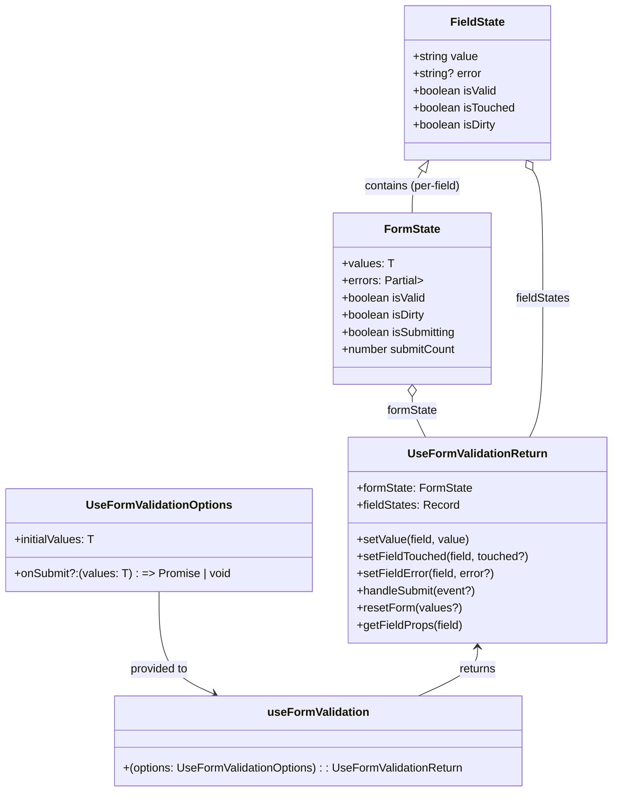

# Diagram: web/portal/src/components/hooks/useFormValidation.ts


> Auto-generated by Obscura crawlers

## Diagram 1



### SVG

<svg id="container" width="847.515625" xmlns="http://www.w3.org/2000/svg" class="classDiagram" height="1108" viewBox="0 0 847.515625 1108" role="graphics-document document" aria-roledescription="class"><style>#container{font-family:"trebuchet ms",verdana,arial,sans-serif;font-size:16px;fill:#333;}@keyframes edge-animation-frame{from{stroke-dashoffset:0;}}@keyframes dash{to{stroke-dashoffset:0;}}#container .edge-animation-slow{stroke-dasharray:9,5!important;stroke-dashoffset:900;animation:dash 50s linear infinite;stroke-linecap:round;}#container .edge-animation-fast{stroke-dasharray:9,5!important;stroke-dashoffset:900;animation:dash 20s linear infinite;stroke-linecap:round;}#container .error-icon{fill:#552222;}#container .error-text{fill:#552222;stroke:#552222;}#container .edge-thickness-normal{stroke-width:1px;}#container .edge-thickness-thick{stroke-width:3.5px;}#container .edge-pattern-solid{stroke-dasharray:0;}#container .edge-thickness-invisible{stroke-width:0;fill:none;}#container .edge-pattern-dashed{stroke-dasharray:3;}#container .edge-pattern-dotted{stroke-dasharray:2;}#container .marker{fill:#333333;stroke:#333333;}#container .marker.cross{stroke:#333333;}#container svg{font-family:"trebuchet ms",verdana,arial,sans-serif;font-size:16px;}#container p{margin:0;}#container g.classGroup text{fill:#9370DB;stroke:none;font-family:"trebuchet ms",verdana,arial,sans-serif;font-size:10px;}#container g.classGroup text .title{font-weight:bolder;}#container .nodeLabel,#container .edgeLabel{color:#131300;}#container .edgeLabel .label rect{fill:#ECECFF;}#container .label text{fill:#131300;}#container .labelBkg{background:#ECECFF;}#container .edgeLabel .label span{background:#ECECFF;}#container .classTitle{font-weight:bolder;}#container .node rect,#container .node circle,#container .node ellipse,#container .node polygon,#container .node path{fill:#ECECFF;stroke:#9370DB;stroke-width:1px;}#container .divider{stroke:#9370DB;stroke-width:1;}#container g.clickable{cursor:pointer;}#container g.classGroup rect{fill:#ECECFF;stroke:#9370DB;}#container g.classGroup line{stroke:#9370DB;stroke-width:1;}#container .classLabel .box{stroke:none;stroke-width:0;fill:#ECECFF;opacity:0.5;}#container .classLabel .label{fill:#9370DB;font-size:10px;}#container .relation{stroke:#333333;stroke-width:1;fill:none;}#container .dashed-line{stroke-dasharray:3;}#container .dotted-line{stroke-dasharray:1 2;}#container #compositionStart,#container .composition{fill:#333333!important;stroke:#333333!important;stroke-width:1;}#container #compositionEnd,#container .composition{fill:#333333!important;stroke:#333333!important;stroke-width:1;}#container #dependencyStart,#container .dependency{fill:#333333!important;stroke:#333333!important;stroke-width:1;}#container #dependencyStart,#container .dependency{fill:#333333!important;stroke:#333333!important;stroke-width:1;}#container #extensionStart,#container .extension{fill:transparent!important;stroke:#333333!important;stroke-width:1;}#container #extensionEnd,#container .extension{fill:transparent!important;stroke:#333333!important;stroke-width:1;}#container #aggregationStart,#container .aggregation{fill:transparent!important;stroke:#333333!important;stroke-width:1;}#container #aggregationEnd,#container .aggregation{fill:transparent!important;stroke:#333333!important;stroke-width:1;}#container #lollipopStart,#container .lollipop{fill:#ECECFF!important;stroke:#333333!important;stroke-width:1;}#container #lollipopEnd,#container .lollipop{fill:#ECECFF!important;stroke:#333333!important;stroke-width:1;}#container .edgeTerminals{font-size:11px;line-height:initial;}#container .classTitleText{text-anchor:middle;font-size:18px;fill:#333;}#container .label-icon{display:inline-block;height:1em;overflow:visible;vertical-align:-0.125em;}#container .node .label-icon path{fill:currentColor;stroke:revert;stroke-width:revert;}#container :root{--mermaid-font-family:"trebuchet ms",verdana,arial,sans-serif;}</style><g><defs><marker id="container_class-aggregationStart" class="marker aggregation class" refX="18" refY="7" markerWidth="190" markerHeight="240" orient="auto"><path d="M 18,7 L9,13 L1,7 L9,1 Z"></path></marker></defs><defs><marker id="container_class-aggregationEnd" class="marker aggregation class" refX="1" refY="7" markerWidth="20" markerHeight="28" orient="auto"><path d="M 18,7 L9,13 L1,7 L9,1 Z"></path></marker></defs><defs><marker id="container_class-extensionStart" class="marker extension class" refX="18" refY="7" markerWidth="190" markerHeight="240" orient="auto"><path d="M 1,7 L18,13 V 1 Z"></path></marker></defs><defs><marker id="container_class-extensionEnd" class="marker extension class" refX="1" refY="7" markerWidth="20" markerHeight="28" orient="auto"><path d="M 1,1 V 13 L18,7 Z"></path></marker></defs><defs><marker id="container_class-compositionStart" class="marker composition class" refX="18" refY="7" markerWidth="190" markerHeight="240" orient="auto"><path d="M 18,7 L9,13 L1,7 L9,1 Z"></path></marker></defs><defs><marker id="container_class-compositionEnd" class="marker composition class" refX="1" refY="7" markerWidth="20" markerHeight="28" orient="auto"><path d="M 18,7 L9,13 L1,7 L9,1 Z"></path></marker></defs><defs><marker id="container_class-dependencyStart" class="marker dependency class" refX="6" refY="7" markerWidth="190" markerHeight="240" orient="auto"><path d="M 5,7 L9,13 L1,7 L9,1 Z"></path></marker></defs><defs><marker id="container_class-dependencyEnd" class="marker dependency class" refX="13" refY="7" markerWidth="20" markerHeight="28" orient="auto"><path d="M 18,7 L9,13 L14,7 L9,1 Z"></path></marker></defs><defs><marker id="container_class-lollipopStart" class="marker lollipop class" refX="13" refY="7" markerWidth="190" markerHeight="240" orient="auto"><circle stroke="black" fill="transparent" cx="7" cy="7" r="6"></circle></marker></defs><defs><marker id="container_class-lollipopEnd" class="marker lollipop class" refX="1" refY="7" markerWidth="190" markerHeight="240" orient="auto"><circle stroke="black" fill="transparent" cx="7" cy="7" r="6"></circle></marker></defs><g class="root"><g class="clusters"></g><g class="edgePaths"><path d="M580.58,238.524L578.18,242.27C575.78,246.016,570.979,253.508,568.578,263.421C566.178,273.333,566.178,285.667,566.178,291.833L566.178,298" id="id_FieldState_FormState_1" class="edge-thickness-normal edge-pattern-solid relation" style=";;;" data-edge="true" data-et="edge" data-id="id_FieldState_FormState_1" data-points="W3sieCI6NTg5Ljg4NzMzODM2MjA2ODksInkiOjIyNH0seyJ4Ijo1NjYuMTc3NzM0Mzc1LCJ5IjoyNjF9LHsieCI6NTY2LjE3NzczNDM3NSwieSI6Mjk4fV0=" marker-start="url(#container_class-extensionStart)"></path><path d="M566.178,555.25L566.178,558.542C566.178,561.833,566.178,568.417,569.343,577.875C572.509,587.333,578.84,599.667,582.006,605.833L585.172,612" id="id_FormState_UseFormValidationReturn_2" class="edge-thickness-normal edge-pattern-solid relation" style=";;;" data-edge="true" data-et="edge" data-id="id_FormState_UseFormValidationReturn_2" data-points="W3sieCI6NTY2LjE3NzczNDM3NSwieSI6NTM4fSx7IngiOjU2Ni4xNzc3MzQzNzUsInkiOjU3NX0seyJ4Ijo1ODUuMTcxNjE2MDIyMDk5NCwieSI6NjEyfV0=" marker-start="url(#container_class-aggregationStart)"></path><path d="M737.607,238.524L740.008,242.27C742.408,246.016,747.209,253.508,749.609,283.421C752.01,313.333,752.01,365.667,752.01,418C752.01,470.333,752.01,522.667,748.844,555C745.678,587.333,739.347,599.667,736.182,605.833L733.016,612" id="id_FieldState_UseFormValidationReturn_3" class="edge-thickness-normal edge-pattern-solid relation" style=";;;" data-edge="true" data-et="edge" data-id="id_FieldState_UseFormValidationReturn_3" data-points="W3sieCI6NzI4LjMwMDE2MTYzNzkzMTEsInkiOjIyNH0seyJ4Ijo3NTIuMDA5NzY1NjI1LCJ5IjoyNjF9LHsieCI6NzUyLjAwOTc2NTYyNSwieSI6NDE4fSx7IngiOjc1Mi4wMDk3NjU2MjUsInkiOjU3NX0seyJ4Ijo3MzMuMDE1ODgzOTc3OTAwNiwieSI6NjEyfV0=" marker-start="url(#container_class-aggregationStart)"></path><path d="M218.336,828L218.336,846.167C218.336,864.333,218.336,900.667,231.015,924.587C243.695,948.507,269.054,960.014,281.733,965.767L294.412,971.521" id="id_UseFormValidationOptions_useFormValidation_4" class="edge-thickness-normal edge-pattern-solid relation" style=";;;" data-edge="true" data-et="edge" data-id="id_UseFormValidationOptions_useFormValidation_4" data-points="W3sieCI6MjE4LjMzNTkzNzUsInkiOjgyOH0seyJ4IjoyMTguMzM1OTM3NSwieSI6OTM3fSx7IngiOjI5OS44NzYxMzI4MTI1MDAwMywieSI6OTc0fV0=" marker-end="url(#container_class-dependencyEnd)"></path><path d="M659.094,906L659.094,911.167C659.094,916.333,659.094,926.667,645.504,938C631.914,949.333,604.734,961.667,591.144,967.833L577.554,974" id="id_UseFormValidationReturn_useFormValidation_5" class="edge-thickness-normal edge-pattern-solid relation" style=";;;" data-edge="true" data-et="edge" data-id="id_UseFormValidationReturn_useFormValidation_5" data-points="W3sieCI6NjU5LjA5Mzc1LCJ5Ijo5MDB9LHsieCI6NjU5LjA5Mzc1LCJ5Ijo5Mzd9LHsieCI6NTc3LjU1MzU1NDY4NzUsInkiOjk3NH1d" marker-start="url(#container_class-dependencyStart)"></path></g><g class="edgeLabels"><g class="edgeLabel" transform="translate(566.177734375, 261)"><g class="label" data-id="id_FieldState_FormState_1" transform="translate(-69.28125, -12)"><foreignObject width="138.5625" height="24"><div xmlns="http://www.w3.org/1999/xhtml" class="labelBkg" style="display: table-cell; white-space: nowrap; line-height: 1.5; max-width: 200px; text-align: center;"><span class="edgeLabel"><p>contains (per-field)</p></span></div></foreignObject></g></g><g class="edgeLabel" transform="translate(566.177734375, 575)"><g class="label" data-id="id_FormState_UseFormValidationReturn_2" transform="translate(-35.890625, -12)"><foreignObject width="71.78125" height="24"><div xmlns="http://www.w3.org/1999/xhtml" class="labelBkg" style="display: table-cell; white-space: nowrap; line-height: 1.5; max-width: 200px; text-align: center;"><span class="edgeLabel"><p>formState</p></span></div></foreignObject></g></g><g class="edgeLabel" transform="translate(752.009765625, 418)"><g class="label" data-id="id_FieldState_UseFormValidationReturn_3" transform="translate(-38.4609375, -12)"><foreignObject width="76.921875" height="24"><div xmlns="http://www.w3.org/1999/xhtml" class="labelBkg" style="display: table-cell; white-space: nowrap; line-height: 1.5; max-width: 200px; text-align: center;"><span class="edgeLabel"><p>fieldStates</p></span></div></foreignObject></g></g><g class="edgeLabel" transform="translate(218.3359375, 937)"><g class="label" data-id="id_UseFormValidationOptions_useFormValidation_4" transform="translate(-41.921875, -12)"><foreignObject width="83.84375" height="24"><div xmlns="http://www.w3.org/1999/xhtml" class="labelBkg" style="display: table-cell; white-space: nowrap; line-height: 1.5; max-width: 200px; text-align: center;"><span class="edgeLabel"><p>provided to</p></span></div></foreignObject></g></g><g class="edgeLabel" transform="translate(659.09375, 937)"><g class="label" data-id="id_UseFormValidationReturn_useFormValidation_5" transform="translate(-26.265625, -12)"><foreignObject width="52.53125" height="24"><div xmlns="http://www.w3.org/1999/xhtml" class="labelBkg" style="display: table-cell; white-space: nowrap; line-height: 1.5; max-width: 200px; text-align: center;"><span class="edgeLabel"><p>returns</p></span></div></foreignObject></g></g></g><g class="nodes"><g class="node default" id="classId-FieldState-0" transform="translate(659.09375, 116)"><g class="basic label-container"><path d="M-102.90234375 -108 L102.90234375 -108 L102.90234375 108 L-102.90234375 108" stroke="none" stroke-width="0" fill="#ECECFF" style=""></path><path d="M-102.90234375 -108 C-44.52501611791726 -108, 13.852311514165478 -108, 102.90234375 -108 M-102.90234375 -108 C-38.781483438597604 -108, 25.33937687280479 -108, 102.90234375 -108 M102.90234375 -108 C102.90234375 -27.322392666946627, 102.90234375 53.35521466610675, 102.90234375 108 M102.90234375 -108 C102.90234375 -23.258031345428776, 102.90234375 61.48393730914245, 102.90234375 108 M102.90234375 108 C22.035593548122606 108, -58.83115665375479 108, -102.90234375 108 M102.90234375 108 C53.91359509801269 108, 4.924846446025384 108, -102.90234375 108 M-102.90234375 108 C-102.90234375 53.86313123995217, -102.90234375 -0.2737375200956649, -102.90234375 -108 M-102.90234375 108 C-102.90234375 31.456210387413392, -102.90234375 -45.087579225173215, -102.90234375 -108" stroke="#9370DB" stroke-width="1.3" fill="none" stroke-dasharray="0 0" style=""></path></g><g class="annotation-group text" transform="translate(0, -84)"></g><g class="label-group text" transform="translate(-36.7890625, -84)"><g class="label" style="font-weight: bolder" transform="translate(0,-12)"><foreignObject width="73.578125" height="24"><div xmlns="http://www.w3.org/1999/xhtml" style="display: table-cell; white-space: nowrap; line-height: 1.5; max-width: 122px; text-align: center;"><span class="nodeLabel markdown-node-label" style=""><p>FieldState</p></span></div></foreignObject></g></g><g class="members-group text" transform="translate(-90.90234375, -36)"><g class="label" style="" transform="translate(0,-12)"><foreignObject width="92.75" height="24"><div xmlns="http://www.w3.org/1999/xhtml" style="display: table-cell; white-space: nowrap; line-height: 1.5; max-width: 150px; text-align: center;"><span class="nodeLabel markdown-node-label" style=""><p>+string value</p></span></div></foreignObject></g><g class="label" style="" transform="translate(0,12)"><foreignObject width="97" height="24"><div xmlns="http://www.w3.org/1999/xhtml" style="display: table-cell; white-space: nowrap; line-height: 1.5; max-width: 155px; text-align: center;"><span class="nodeLabel markdown-node-label" style=""><p>+string? error</p></span></div></foreignObject></g><g class="label" style="" transform="translate(0,36)"><foreignObject width="119.21875" height="24"><div xmlns="http://www.w3.org/1999/xhtml" style="display: table-cell; white-space: nowrap; line-height: 1.5; max-width: 177px; text-align: center;"><span class="nodeLabel markdown-node-label" style=""><p>+boolean isValid</p></span></div></foreignObject></g><g class="label" style="" transform="translate(0,60)"><foreignObject width="145.015625" height="24"><div xmlns="http://www.w3.org/1999/xhtml" style="display: table-cell; white-space: nowrap; line-height: 1.5; max-width: 202px; text-align: center;"><span class="nodeLabel markdown-node-label" style=""><p>+boolean isTouched</p></span></div></foreignObject></g><g class="label" style="" transform="translate(0,84)"><foreignObject width="118.21875" height="24"><div xmlns="http://www.w3.org/1999/xhtml" style="display: table-cell; white-space: nowrap; line-height: 1.5; max-width: 176px; text-align: center;"><span class="nodeLabel markdown-node-label" style=""><p>+boolean isDirty</p></span></div></foreignObject></g></g><g class="methods-group text" transform="translate(-90.90234375, 108)"></g><g class="divider" style=""><path d="M-102.90234375 -60 C-54.3010294691776 -60, -5.699715188355199 -60, 102.90234375 -60 M-102.90234375 -60 C-26.00509966297591 -60, 50.89214442404818 -60, 102.90234375 -60" stroke="#9370DB" stroke-width="1.3" fill="none" stroke-dasharray="0 0" style=""></path></g><g class="divider" style=""><path d="M-102.90234375 84 C-35.529594405104234 84, 31.843154939791532 84, 102.90234375 84 M-102.90234375 84 C-23.71837510104085 84, 55.4655935479183 84, 102.90234375 84" stroke="#9370DB" stroke-width="1.3" fill="none" stroke-dasharray="0 0" style=""></path></g></g><g class="node default" id="classId-FormState-1" transform="translate(566.177734375, 418)"><g class="basic label-container"><path d="M-112.37109375 -120 L112.37109375 -120 L112.37109375 120 L-112.37109375 120" stroke="none" stroke-width="0" fill="#ECECFF" style=""></path><path d="M-112.37109375 -120 C-46.82296827515222 -120, 18.72515719969556 -120, 112.37109375 -120 M-112.37109375 -120 C-46.47747337894438 -120, 19.416146992111237 -120, 112.37109375 -120 M112.37109375 -120 C112.37109375 -69.25520213071268, 112.37109375 -18.51040426142535, 112.37109375 120 M112.37109375 -120 C112.37109375 -45.90209487711503, 112.37109375 28.195810245769934, 112.37109375 120 M112.37109375 120 C43.923269268611676 120, -24.524555212776647 120, -112.37109375 120 M112.37109375 120 C55.468110365349595 120, -1.4348730193008095 120, -112.37109375 120 M-112.37109375 120 C-112.37109375 32.32633540383134, -112.37109375 -55.34732919233733, -112.37109375 -120 M-112.37109375 120 C-112.37109375 51.18227763537095, -112.37109375 -17.635444729258097, -112.37109375 -120" stroke="#9370DB" stroke-width="1.3" fill="none" stroke-dasharray="0 0" style=""></path></g><g class="annotation-group text" transform="translate(0, -96)"></g><g class="label-group text" transform="translate(-37.5703125, -96)"><g class="label" style="font-weight: bolder" transform="translate(0,-12)"><foreignObject width="75.140625" height="24"><div xmlns="http://www.w3.org/1999/xhtml" style="display: table-cell; white-space: nowrap; line-height: 1.5; max-width: 124px; text-align: center;"><span class="nodeLabel markdown-node-label" style=""><p>FormState</p></span></div></foreignObject></g></g><g class="members-group text" transform="translate(-100.37109375, -48)"><g class="label" style="" transform="translate(0,-12)"><foreignObject width="70.53125" height="24"><div xmlns="http://www.w3.org/1999/xhtml" style="display: table-cell; white-space: nowrap; line-height: 1.5; max-width: 129px; text-align: center;"><span class="nodeLabel markdown-node-label" style=""><p>+values: T</p></span></div></foreignObject></g><g class="label" style="" transform="translate(0,12)"><foreignObject width="114.234375" height="24"><div xmlns="http://www.w3.org/1999/xhtml" style="display: table-cell; white-space: nowrap; line-height: 1.5; max-width: 193px; text-align: center;"><span class="nodeLabel markdown-node-label" style=""><p>+errors: Partial&gt;</p></span></div></foreignObject></g><g class="label" style="" transform="translate(0,36)"><foreignObject width="119.21875" height="24"><div xmlns="http://www.w3.org/1999/xhtml" style="display: table-cell; white-space: nowrap; line-height: 1.5; max-width: 177px; text-align: center;"><span class="nodeLabel markdown-node-label" style=""><p>+boolean isValid</p></span></div></foreignObject></g><g class="label" style="" transform="translate(0,60)"><foreignObject width="118.21875" height="24"><div xmlns="http://www.w3.org/1999/xhtml" style="display: table-cell; white-space: nowrap; line-height: 1.5; max-width: 176px; text-align: center;"><span class="nodeLabel markdown-node-label" style=""><p>+boolean isDirty</p></span></div></foreignObject></g><g class="label" style="" transform="translate(0,84)"><foreignObject width="163.171875" height="24"><div xmlns="http://www.w3.org/1999/xhtml" style="display: table-cell; white-space: nowrap; line-height: 1.5; max-width: 221px; text-align: center;"><span class="nodeLabel markdown-node-label" style=""><p>+boolean isSubmitting</p></span></div></foreignObject></g><g class="label" style="" transform="translate(0,108)"><foreignObject width="161.765625" height="24"><div xmlns="http://www.w3.org/1999/xhtml" style="display: table-cell; white-space: nowrap; line-height: 1.5; max-width: 219px; text-align: center;"><span class="nodeLabel markdown-node-label" style=""><p>+number submitCount</p></span></div></foreignObject></g></g><g class="methods-group text" transform="translate(-100.37109375, 120)"></g><g class="divider" style=""><path d="M-112.37109375 -72 C-47.2811128521402 -72, 17.808868045719606 -72, 112.37109375 -72 M-112.37109375 -72 C-29.68181091782617 -72, 53.00747191434766 -72, 112.37109375 -72" stroke="#9370DB" stroke-width="1.3" fill="none" stroke-dasharray="0 0" style=""></path></g><g class="divider" style=""><path d="M-112.37109375 96 C-65.3384653844061 96, -18.305837018812213 96, 112.37109375 96 M-112.37109375 96 C-43.399942333589706 96, 25.571209082820587 96, 112.37109375 96" stroke="#9370DB" stroke-width="1.3" fill="none" stroke-dasharray="0 0" style=""></path></g></g><g class="node default" id="classId-UseFormValidationOptions-2" transform="translate(218.3359375, 756)"><g class="basic label-container"><path d="M-210.3359375 -72 L210.3359375 -72 L210.3359375 72 L-210.3359375 72" stroke="none" stroke-width="0" fill="#ECECFF" style=""></path><path d="M-210.3359375 -72 C-74.4041655657729 -72, 61.5276063684542 -72, 210.3359375 -72 M-210.3359375 -72 C-57.40280211720264 -72, 95.53033326559472 -72, 210.3359375 -72 M210.3359375 -72 C210.3359375 -17.125958497469192, 210.3359375 37.748083005061616, 210.3359375 72 M210.3359375 -72 C210.3359375 -28.842134347618803, 210.3359375 14.315731304762394, 210.3359375 72 M210.3359375 72 C46.55384155236058 72, -117.22825439527884 72, -210.3359375 72 M210.3359375 72 C109.8367664115906 72, 9.337595323181205 72, -210.3359375 72 M-210.3359375 72 C-210.3359375 35.84294673522234, -210.3359375 -0.3141065295553176, -210.3359375 -72 M-210.3359375 72 C-210.3359375 26.428338887774856, -210.3359375 -19.143322224450287, -210.3359375 -72" stroke="#9370DB" stroke-width="1.3" fill="none" stroke-dasharray="0 0" style=""></path></g><g class="annotation-group text" transform="translate(0, -48)"></g><g class="label-group text" transform="translate(-97.5, -48)"><g class="label" style="font-weight: bolder" transform="translate(0,-12)"><foreignObject width="195" height="24"><div xmlns="http://www.w3.org/1999/xhtml" style="display: table-cell; white-space: nowrap; line-height: 1.5; max-width: 244px; text-align: center;"><span class="nodeLabel markdown-node-label" style=""><p>UseFormValidationOptions</p></span></div></foreignObject></g></g><g class="members-group text" transform="translate(-198.3359375, 0)"><g class="label" style="" transform="translate(0,-12)"><foreignObject width="113.25" height="24"><div xmlns="http://www.w3.org/1999/xhtml" style="display: table-cell; white-space: nowrap; line-height: 1.5; max-width: 171px; text-align: center;"><span class="nodeLabel markdown-node-label" style=""><p>+initialValues: T</p></span></div></foreignObject></g></g><g class="methods-group text" transform="translate(-198.3359375, 48)"><g class="label" style="" transform="translate(0,-12)"><foreignObject width="299.171875" height="24"><div xmlns="http://www.w3.org/1999/xhtml" style="display: table-cell; white-space: nowrap; line-height: 1.5; max-width: 378px; text-align: center;"><span class="nodeLabel markdown-node-label" style=""><p>+onSubmit?:(values: T) : =&gt; Promise | void</p></span></div></foreignObject></g></g><g class="divider" style=""><path d="M-210.3359375 -24 C-50.3330884980314 -24, 109.6697605039372 -24, 210.3359375 -24 M-210.3359375 -24 C-47.54414478769428 -24, 115.24764792461144 -24, 210.3359375 -24" stroke="#9370DB" stroke-width="1.3" fill="none" stroke-dasharray="0 0" style=""></path></g><g class="divider" style=""><path d="M-210.3359375 24 C-115.18525084872569 24, -20.034564197451374 24, 210.3359375 24 M-210.3359375 24 C-105.66142448872937 24, -0.9869114774587331 24, 210.3359375 24" stroke="#9370DB" stroke-width="1.3" fill="none" stroke-dasharray="0 0" style=""></path></g></g><g class="node default" id="classId-UseFormValidationReturn-3" transform="translate(659.09375, 756)"><g class="basic label-container"><path d="M-180.421875 -144 L180.421875 -144 L180.421875 144 L-180.421875 144" stroke="none" stroke-width="0" fill="#ECECFF" style=""></path><path d="M-180.421875 -144 C-62.06784567085627 -144, 56.286183658287456 -144, 180.421875 -144 M-180.421875 -144 C-61.5096323275487 -144, 57.4026103449026 -144, 180.421875 -144 M180.421875 -144 C180.421875 -40.72626023718273, 180.421875 62.54747952563454, 180.421875 144 M180.421875 -144 C180.421875 -77.2517473081147, 180.421875 -10.503494616229403, 180.421875 144 M180.421875 144 C95.61890156532712 144, 10.815928130654243 144, -180.421875 144 M180.421875 144 C61.01588420820832 144, -58.39010658358336 144, -180.421875 144 M-180.421875 144 C-180.421875 60.169831156464454, -180.421875 -23.66033768707109, -180.421875 -144 M-180.421875 144 C-180.421875 52.119485921989394, -180.421875 -39.76102815602121, -180.421875 -144" stroke="#9370DB" stroke-width="1.3" fill="none" stroke-dasharray="0 0" style=""></path></g><g class="annotation-group text" transform="translate(0, -120)"></g><g class="label-group text" transform="translate(-93.421875, -120)"><g class="label" style="font-weight: bolder" transform="translate(0,-12)"><foreignObject width="186.84375" height="24"><div xmlns="http://www.w3.org/1999/xhtml" style="display: table-cell; white-space: nowrap; line-height: 1.5; max-width: 235px; text-align: center;"><span class="nodeLabel markdown-node-label" style=""><p>UseFormValidationReturn</p></span></div></foreignObject></g></g><g class="members-group text" transform="translate(-168.421875, -72)"><g class="label" style="" transform="translate(0,-12)"><foreignObject width="161.484375" height="24"><div xmlns="http://www.w3.org/1999/xhtml" style="display: table-cell; white-space: nowrap; line-height: 1.5; max-width: 219px; text-align: center;"><span class="nodeLabel markdown-node-label" style=""><p>+formState: FormState</p></span></div></foreignObject></g><g class="label" style="" transform="translate(0,12)"><foreignObject width="142.84375" height="24"><div xmlns="http://www.w3.org/1999/xhtml" style="display: table-cell; white-space: nowrap; line-height: 1.5; max-width: 200px; text-align: center;"><span class="nodeLabel markdown-node-label" style=""><p>+fieldStates: Record</p></span></div></foreignObject></g></g><g class="methods-group text" transform="translate(-168.421875, 0)"><g class="label" style="" transform="translate(0,-12)"><foreignObject width="158.90625" height="24"><div xmlns="http://www.w3.org/1999/xhtml" style="display: table-cell; white-space: nowrap; line-height: 1.5; max-width: 216px; text-align: center;"><span class="nodeLabel markdown-node-label" style=""><p>+setValue(field, value)</p></span></div></foreignObject></g><g class="label" style="" transform="translate(0,12)"><foreignObject width="243.421875" height="24"><div xmlns="http://www.w3.org/1999/xhtml" style="display: table-cell; white-space: nowrap; line-height: 1.5; max-width: 301px; text-align: center;"><span class="nodeLabel markdown-node-label" style=""><p>+setFieldTouched(field, touched?)</p></span></div></foreignObject></g><g class="label" style="" transform="translate(0,36)"><foreignObject width="193.96875" height="24"><div xmlns="http://www.w3.org/1999/xhtml" style="display: table-cell; white-space: nowrap; line-height: 1.5; max-width: 251px; text-align: center;"><span class="nodeLabel markdown-node-label" style=""><p>+setFieldError(field, error?)</p></span></div></foreignObject></g><g class="label" style="" transform="translate(0,60)"><foreignObject width="167.453125" height="24"><div xmlns="http://www.w3.org/1999/xhtml" style="display: table-cell; white-space: nowrap; line-height: 1.5; max-width: 225px; text-align: center;"><span class="nodeLabel markdown-node-label" style=""><p>+handleSubmit(event?)</p></span></div></foreignObject></g><g class="label" style="" transform="translate(0,84)"><foreignObject width="144.484375" height="24"><div xmlns="http://www.w3.org/1999/xhtml" style="display: table-cell; white-space: nowrap; line-height: 1.5; max-width: 202px; text-align: center;"><span class="nodeLabel markdown-node-label" style=""><p>+resetForm(values?)</p></span></div></foreignObject></g><g class="label" style="" transform="translate(0,108)"><foreignObject width="148.71875" height="24"><div xmlns="http://www.w3.org/1999/xhtml" style="display: table-cell; white-space: nowrap; line-height: 1.5; max-width: 206px; text-align: center;"><span class="nodeLabel markdown-node-label" style=""><p>+getFieldProps(field)</p></span></div></foreignObject></g></g><g class="divider" style=""><path d="M-180.421875 -96 C-77.91150513842085 -96, 24.5988647231583 -96, 180.421875 -96 M-180.421875 -96 C-51.16574231564462 -96, 78.09039036871076 -96, 180.421875 -96" stroke="#9370DB" stroke-width="1.3" fill="none" stroke-dasharray="0 0" style=""></path></g><g class="divider" style=""><path d="M-180.421875 -24 C-107.35464655041726 -24, -34.287418100834515 -24, 180.421875 -24 M-180.421875 -24 C-75.39652132806705 -24, 29.628832343865895 -24, 180.421875 -24" stroke="#9370DB" stroke-width="1.3" fill="none" stroke-dasharray="0 0" style=""></path></g></g><g class="node default" id="classId-useFormValidation-4" transform="translate(438.71484375, 1037)"><g class="basic label-container"><path d="M-286.578125 -63 L286.578125 -63 L286.578125 63 L-286.578125 63" stroke="none" stroke-width="0" fill="#ECECFF" style=""></path><path d="M-286.578125 -63 C-143.78243749046842 -63, -0.9867499809368496 -63, 286.578125 -63 M-286.578125 -63 C-122.27565649786024 -63, 42.02681200427952 -63, 286.578125 -63 M286.578125 -63 C286.578125 -30.674671905673428, 286.578125 1.6506561886531443, 286.578125 63 M286.578125 -63 C286.578125 -27.647551333311938, 286.578125 7.704897333376124, 286.578125 63 M286.578125 63 C73.36796264483124 63, -139.84219971033752 63, -286.578125 63 M286.578125 63 C74.4534915617864 63, -137.6711418764272 63, -286.578125 63 M-286.578125 63 C-286.578125 35.767761514122796, -286.578125 8.535523028245592, -286.578125 -63 M-286.578125 63 C-286.578125 19.803314052856727, -286.578125 -23.393371894286545, -286.578125 -63" stroke="#9370DB" stroke-width="1.3" fill="none" stroke-dasharray="0 0" style=""></path></g><g class="annotation-group text" transform="translate(0, -39)"></g><g class="label-group text" transform="translate(-68.109375, -39)"><g class="label" style="font-weight: bolder" transform="translate(0,-12)"><foreignObject width="136.21875" height="24"><div xmlns="http://www.w3.org/1999/xhtml" style="display: table-cell; white-space: nowrap; line-height: 1.5; max-width: 185px; text-align: center;"><span class="nodeLabel markdown-node-label" style=""><p>useFormValidation</p></span></div></foreignObject></g></g><g class="members-group text" transform="translate(-274.578125, 9)"></g><g class="methods-group text" transform="translate(-274.578125, 39)"><g class="label" style="" transform="translate(0,-12)"><foreignObject width="481.046875" height="24"><div xmlns="http://www.w3.org/1999/xhtml" style="display: table-cell; white-space: nowrap; line-height: 1.5; max-width: 531px; text-align: center;"><span class="nodeLabel markdown-node-label" style=""><p>+(options: UseFormValidationOptions) : : UseFormValidationReturn</p></span></div></foreignObject></g></g><g class="divider" style=""><path d="M-286.578125 -15 C-160.98346996551334 -15, -35.3888149310267 -15, 286.578125 -15 M-286.578125 -15 C-86.19780296597725 -15, 114.18251906804551 -15, 286.578125 -15" stroke="#9370DB" stroke-width="1.3" fill="none" stroke-dasharray="0 0" style=""></path></g><g class="divider" style=""><path d="M-286.578125 9 C-127.62156319544275 9, 31.334998609114507 9, 286.578125 9 M-286.578125 9 C-136.41263583740712 9, 13.752853325185754 9, 286.578125 9" stroke="#9370DB" stroke-width="1.3" fill="none" stroke-dasharray="0 0" style=""></path></g></g></g></g></g></svg>

## Diagram 2

```mermaid
flowchart TD
    subgraph Init
        A[initialValues] --> B[setFormValues(initialValues)]
        A --> C[init fieldStates from initialValues]
    end

    subgraph UserActions
        D[setValue(field, value)] --> E[update formValues & fieldStates.value]
        F[setFieldTouched(field, touched?)] --> C2[mark field.isTouched]
        G[setFieldError(field, error)] --> C3[set field.error & isValid]
        H[getFieldProps(field).onChange] --> D
        H2[getFieldProps(field).onBlur] --> F
    end

    subgraph Computation
        C & C2 & C3 --> I[formState computed via useMemo]
        E --> I
    end

    subgraph Submission
        J[handleSubmit(event?)] --> K[preventDefault?]
        K --> L[setIsSubmitting(true); increment submitCount]
        L --> M[mark all fields isTouched]
        M --> N{formState.isValid}
        N -->|true & onSubmit| O[await onSubmit(formValues)]
        N -->|false| P[skip onSubmit]
        O & P --> Q[setIsSubmitting(false)]
    end

    B & C --> I
    I --> J
```

> SVG rendering failed for this diagram.
