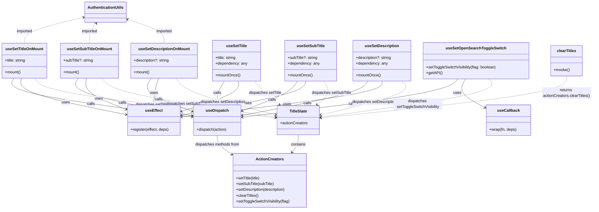

# Diagram: web/portal/src/components/hooks/useSetTitle.ts

> Auto-generated by Obscura crawlers

## Mermaid

### SVG

<svg id="container" width="2439.4765625" xmlns="http://www.w3.org/2000/svg" class="classDiagram" height="862" viewBox="2.4765625 0 2439.4765625 862" role="graphics-document document" aria-roledescription="class"><g><defs><marker id="container_class-aggregationStart" class="marker aggregation class" refX="18" refY="7" markerWidth="190" markerHeight="240" orient="auto"><path d="M 18,7 L9,13 L1,7 L9,1 Z"></path></marker></defs><defs><marker id="container_class-aggregationEnd" class="marker aggregation class" refX="1" refY="7" markerWidth="20" markerHeight="28" orient="auto"><path d="M 18,7 L9,13 L1,7 L9,1 Z"></path></marker></defs><defs><marker id="container_class-extensionStart" class="marker extension class" refX="18" refY="7" markerWidth="190" markerHeight="240" orient="auto"><path d="M 1,7 L18,13 V 1 Z"></path></marker></defs><defs><marker id="container_class-extensionEnd" class="marker extension class" refX="1" refY="7" markerWidth="20" markerHeight="28" orient="auto"><path d="M 1,1 V 13 L18,7 Z"></path></marker></defs><defs><marker id="container_class-compositionStart" class="marker composition class" refX="18" refY="7" markerWidth="190" markerHeight="240" orient="auto"><path d="M 18,7 L9,13 L1,7 L9,1 Z"></path></marker></defs><defs><marker id="container_class-compositionEnd" class="marker composition class" refX="1" refY="7" markerWidth="20" markerHeight="28" orient="auto"><path d="M 18,7 L9,13 L1,7 L9,1 Z"></path></marker></defs><defs><marker id="container_class-dependencyStart" class="marker dependency class" refX="6" refY="7" markerWidth="190" markerHeight="240" orient="auto"><path d="M 5,7 L9,13 L1,7 L9,1 Z"></path></marker></defs><defs><marker id="container_class-dependencyEnd" class="marker dependency class" refX="13" refY="7" markerWidth="20" markerHeight="28" orient="auto"><path d="M 18,7 L9,13 L14,7 L9,1 Z"></path></marker></defs><defs><marker id="container_class-lollipopStart" class="marker lollipop class" refX="13" refY="7" markerWidth="190" markerHeight="240" orient="auto"><circle stroke="black" fill="transparent" cx="7" cy="7" r="6"></circle></marker></defs><defs><marker id="container_class-lollipopEnd" class="marker lollipop class" refX="1" refY="7" markerWidth="190" markerHeight="240" orient="auto"><circle stroke="black" fill="transparent" cx="7" cy="7" r="6"></circle></marker></defs><g class="root"><g class="clusters"></g><g class="edgePaths"><path d="M60.582,322L54.559,332.167C48.536,342.333,36.491,362.667,158.812,389.294C281.133,415.921,537.822,448.841,666.166,465.302L794.51,481.762" id="id_useSetTitleOnMount_useDispatch_1" class="edge-thickness-normal edge-pattern-solid relation" style=";;;" data-edge="true" data-et="edge" data-id="id_useSetTitleOnMount_useDispatch_1" data-points="W3sieCI6NjAuNTgxNjQ5NDM2MDkwMjI0LCJ5IjozMjJ9LHsieCI6MjQuNDQ1MzEyNSwieSI6MzgzfSx7IngiOjgwMC40NjA5Mzc1LCJ5Ijo0ODIuNTI1NDk2NTExMDAzOH1d" marker-end="url(#container_class-dependencyEnd)"></path><path d="M325.91,322L319.361,332.167C312.813,342.333,299.715,362.667,377.823,388.349C455.931,414.031,625.245,445.061,709.902,460.577L794.559,476.092" id="id_useSetSubTitleOnMount_useDispatch_2" class="edge-thickness-normal edge-pattern-solid relation" style=";;;" data-edge="true" data-et="edge" data-id="id_useSetSubTitleOnMount_useDispatch_2" data-points="W3sieCI6MzI1LjkxMDMwMzEwMTUwMzc2LCJ5IjozMjJ9LHsieCI6Mjg2LjYxNzE4NzUsInkiOjM4M30seyJ4Ijo4MDAuNDYwOTM3NSwieSI6NDc3LjE3MzgxMjk5Mzc4Njl9XQ==" marker-end="url(#container_class-dependencyEnd)"></path><path d="M625.565,322L618.494,332.167C611.424,342.333,597.283,362.667,625.491,385.393C653.698,408.12,724.253,433.239,759.531,445.799L794.808,458.359" id="id_useSetDescriptionOnMount_useDispatch_3" class="edge-thickness-normal edge-pattern-solid relation" style=";;;" data-edge="true" data-et="edge" data-id="id_useSetDescriptionOnMount_useDispatch_3" data-points="W3sieCI6NjI1LjU2NDcwMjc3MjU1NjQsInkiOjMyMn0seyJ4Ijo1ODMuMTQyNTc4MTI1LCJ5IjozODN9LHsieCI6ODAwLjQ2MDkzNzUsInkiOjQ2MC4zNzA5MzI1OTMyNjg2Nn1d" marker-end="url(#container_class-dependencyEnd)"></path><path d="M926.754,334L921.916,342.167C917.078,350.333,907.402,366.667,902.564,382C897.727,397.333,897.727,411.667,897.727,418.833L897.727,426" id="id_useSetTitle_useDispatch_4" class="edge-thickness-normal edge-pattern-solid relation" style=";;;" data-edge="true" data-et="edge" data-id="id_useSetTitle_useDispatch_4" data-points="W3sieCI6OTI2Ljc1NDExMTg0MjEwNTIsInkiOjMzNH0seyJ4Ijo4OTcuNzI2NTYyNSwieSI6MzgzfSx7IngiOjg5Ny43MjY1NjI1LCJ5Ijo0MzJ9XQ==" marker-end="url(#container_class-dependencyEnd)"></path><path d="M1229.487,334L1224.227,342.167C1218.966,350.333,1208.445,366.667,1170.299,387.102C1132.154,407.538,1066.384,432.076,1033.499,444.345L1000.614,456.614" id="id_useSetSubTitle_useDispatch_5" class="edge-thickness-normal edge-pattern-solid relation" style=";;;" data-edge="true" data-et="edge" data-id="id_useSetSubTitle_useDispatch_5" data-points="W3sieCI6MTIyOS40ODcxNTA0OTM0MjEsInkiOjMzNH0seyJ4IjoxMTk3LjkyMzgyODEyNSwieSI6MzgzfSx7IngiOjk5NC45OTIxODc1LCJ5Ijo0NTguNzExMzYxNjY5NzM1NH1d" marker-end="url(#container_class-dependencyEnd)"></path><path d="M1521.408,334L1515.778,342.167C1510.148,350.333,1498.887,366.667,1412.134,390.236C1325.38,413.805,1163.134,444.609,1082.01,460.011L1000.887,475.414" id="id_useSetDescription_useDispatch_6" class="edge-thickness-normal edge-pattern-solid relation" style=";;;" data-edge="true" data-et="edge" data-id="id_useSetDescription_useDispatch_6" data-points="W3sieCI6MTUyMS40MDc5OTc1MzI4OTQ4LCJ5IjozMzR9LHsieCI6MTQ4Ny42MjY5NTMxMjUsInkiOjM4M30seyJ4Ijo5OTQuOTkyMTg3NSwieSI6NDc2LjUzMjg5OTE1ODY5MDA0fV0=" marker-end="url(#container_class-dependencyEnd)"></path><path d="M1892.487,325L1883.237,334.667C1873.987,344.333,1855.487,363.667,1706.897,389.949C1558.308,416.23,1279.629,449.461,1140.289,466.076L1000.95,482.691" id="id_useSetOpenSearchToggleSwitch_useDispatch_7" class="edge-thickness-normal edge-pattern-solid relation" style=";;;" data-edge="true" data-et="edge" data-id="id_useSetOpenSearchToggleSwitch_useDispatch_7" data-points="W3sieCI6MTg5Mi40ODczMjY3MTUyMjU3LCJ5IjozMjV9LHsieCI6MTgzNi45ODYzMjgxMjUsInkiOjM4M30seyJ4Ijo5OTQuOTkyMTg3NSwieSI6NDgzLjQwMTc3MDg0MjY0NzQ3fV0=" marker-end="url(#container_class-dependencyEnd)"></path><path d="M89.24,322L87.263,332.167C85.287,342.333,81.335,362.667,153.478,387.692C225.62,412.717,373.858,442.433,447.977,457.292L522.096,472.15" id="id_useSetTitleOnMount_useEffect_8" class="edge-thickness-normal edge-pattern-solid relation" style=";;;" data-edge="true" data-et="edge" data-id="id_useSetTitleOnMount_useEffect_8" data-points="W3sieCI6ODkuMjM5NTQ0MTcyOTMyMzMsInkiOjMyMn0seyJ4Ijo3Ny4zODI4MTI1LCJ5IjozODN9LHsieCI6NTI3Ljk3ODUxNTYyNSwieSI6NDczLjMyOTI3NDY0NDkwODV9XQ==" marker-end="url(#container_class-dependencyEnd)"></path><path d="M358.261,322L356.281,332.167C354.3,342.333,350.338,362.667,377.692,384.174C405.045,405.681,463.714,428.363,493.048,439.703L522.382,451.044" id="id_useSetSubTitleOnMount_useEffect_9" class="edge-thickness-normal edge-pattern-solid relation" style=";;;" data-edge="true" data-et="edge" data-id="id_useSetSubTitleOnMount_useEffect_9" data-points="W3sieCI6MzU4LjI2MTQ1NDQxNzI5MzI0LCJ5IjozMjJ9LHsieCI6MzQ2LjM3Njk1MzEyNSwieSI6MzgzfSx7IngiOjUyNy45Nzg1MTU2MjUsInkiOjQ1My4yMDc2NDc5MTU0MzA3fV0=" marker-end="url(#container_class-dependencyEnd)"></path><path d="M654.223,322L651.199,332.167C648.175,342.333,642.128,362.667,639.104,380C636.08,397.333,636.08,411.667,636.08,418.833L636.08,426" id="id_useSetDescriptionOnMount_useEffect_10" class="edge-thickness-normal edge-pattern-solid relation" style=";;;" data-edge="true" data-et="edge" data-id="id_useSetDescriptionOnMount_useEffect_10" data-points="W3sieCI6NjU0LjIyMjU5NzUwOTM5ODUsInkiOjMyMn0seyJ4Ijo2MzYuMDgwMDc4MTI1LCJ5IjozODN9LHsieCI6NjM2LjA4MDA3ODEyNSwieSI6NDMyfV0=" marker-end="url(#container_class-dependencyEnd)"></path><path d="M984.204,334L984.952,342.167C985.699,350.333,987.194,366.667,948.144,387.475C909.093,408.282,829.497,433.565,789.698,446.206L749.9,458.847" id="id_useSetTitle_useEffect_11" class="edge-thickness-normal edge-pattern-solid relation" style=";;;" data-edge="true" data-et="edge" data-id="id_useSetTitle_useEffect_11" data-points="W3sieCI6OTg0LjIwNDM1ODU1MjYzMTYsInkiOjMzNH0seyJ4Ijo5ODguNjg5NDUzMTI1LCJ5IjozODN9LHsieCI6NzQ0LjE4MTY0MDYyNSwieSI6NDYwLjY2MzQ5MDkzODA5NTQ0fV0=" marker-end="url(#container_class-dependencyEnd)"></path><path d="M1262.921,334L1260.911,342.167C1258.901,350.333,1254.881,366.667,1169.409,390.038C1083.936,413.41,917.01,443.821,833.547,459.026L750.084,474.231" id="id_useSetSubTitle_useEffect_12" class="edge-thickness-normal edge-pattern-solid relation" style=";;;" data-edge="true" data-et="edge" data-id="id_useSetSubTitle_useEffect_12" data-points="W3sieCI6MTI2Mi45MjEzNjEwMTk3MzY5LCJ5IjozMzR9LHsieCI6MTI1MC44NjEzMjgxMjUsInkiOjM4M30seyJ4Ijo3NDQuMTgxNjQwNjI1LCJ5Ijo0NzUuMzA2MjA2NDc1ODgwNjN9XQ==" marker-end="url(#container_class-dependencyEnd)"></path><path d="M1577.313,334L1577.118,342.167C1576.923,350.333,1576.533,366.667,1438.67,391.235C1300.808,415.804,1025.474,448.607,887.807,465.009L750.14,481.411" id="id_useSetDescription_useEffect_13" class="edge-thickness-normal edge-pattern-solid relation" style=";;;" data-edge="true" data-et="edge" data-id="id_useSetDescription_useEffect_13" data-points="W3sieCI6MTU3Ny4zMTI2MDI3OTYwNTI3LCJ5IjozMzR9LHsieCI6MTU3Ni4xNDI1NzgxMjUsInkiOjM4M30seyJ4Ijo3NDQuMTgxNjQwNjI1LCJ5Ijo0ODIuMTIwNjcwMTY4MjA2OX1d" marker-end="url(#container_class-dependencyEnd)"></path><path d="M1922.339,325L1916.937,334.667C1911.534,344.333,1900.729,363.667,1914.039,383.443C1927.35,403.22,1964.776,423.44,1983.489,433.55L2002.202,443.659" id="id_useSetOpenSearchToggleSwitch_useCallback_14" class="edge-thickness-normal edge-pattern-solid relation" style=";;;" data-edge="true" data-et="edge" data-id="id_useSetOpenSearchToggleSwitch_useCallback_14" data-points="W3sieCI6MTkyMi4zMzkzMDAzOTk0MzYsInkiOjMyNX0seyJ4IjoxODg5LjkyMzgyODEyNSwieSI6MzgzfSx7IngiOjIwMDcuNDgwNDY4NzUsInkiOjQ0Ni41MTE0NDIzMjY3MTYzNX1d" marker-end="url(#container_class-dependencyEnd)"></path><path d="M897.727,558L897.727,564.167C897.727,570.333,897.727,582.667,907.968,595.826C918.21,608.986,938.694,622.972,948.936,629.965L959.178,636.958" id="id_useDispatch_ActionCreators_15" class="edge-thickness-normal edge-pattern-solid relation" style=";;;" data-edge="true" data-et="edge" data-id="id_useDispatch_ActionCreators_15" data-points="W3sieCI6ODk3LjcyNjU2MjUsInkiOjU1OH0seyJ4Ijo4OTcuNzI2NTYyNSwieSI6NTk1fSx7IngiOjk2NC4xMzI4MTI1LCJ5Ijo2NDAuMzQxNTAyOTczNTA4OH1d" marker-end="url(#container_class-dependencyEnd)"></path><path d="M1231.299,555L1231.299,561.667C1231.299,568.333,1231.299,581.667,1227.051,593.715C1222.803,605.763,1214.308,616.527,1210.06,621.909L1205.813,627.29" id="id_TitleState_ActionCreators_16" class="edge-thickness-normal edge-pattern-solid relation" style=";;;" data-edge="true" data-et="edge" data-id="id_TitleState_ActionCreators_16" data-points="W3sieCI6MTIzMS4yOTg4MjgxMjUsInkiOjU1NX0seyJ4IjoxMjMxLjI5ODgyODEyNSwieSI6NTk1fSx7IngiOjEyMDIuMDk1MjE0ODQzNzUsInkiOjYzMn1d" marker-end="url(#container_class-dependencyEnd)"></path><path d="M145.887,322L151.91,332.167C157.933,342.333,169.978,362.667,335.492,389.857C501.005,417.048,819.987,451.096,979.478,468.121L1138.969,485.145" id="id_useSetTitleOnMount_TitleState_17" class="edge-thickness-normal edge-pattern-dashed relation" style=";;;" data-edge="true" data-et="edge" data-id="id_useSetTitleOnMount_TitleState_17" data-points="W3sieCI6MTQ1Ljg4NzEwMDU2MzkwOTc3LCJ5IjozMjJ9LHsieCI6MTgyLjAyMzQzNzUsInkiOjM4M30seyJ4IjoxMTQ0LjkzNTU0Njg3NSwieSI6NDg1Ljc4MTU1NDk3OTM0NzczfV0=" marker-end="url(#container_class-dependencyEnd)"></path><path d="M422.361,322L429.431,332.167C436.502,342.333,450.642,362.667,570.082,389.252C689.522,415.838,914.26,448.676,1026.629,465.095L1138.999,481.513" id="id_useSetSubTitleOnMount_TitleState_18" class="edge-thickness-normal edge-pattern-dashed relation" style=";;;" data-edge="true" data-et="edge" data-id="id_useSetSubTitleOnMount_TitleState_18" data-points="W3sieCI6NDIyLjM2MTA3ODQ3NzQ0MzYsInkiOjMyMn0seyJ4Ijo0NjQuNzgzMjAzMTI1LCJ5IjozODN9LHsieCI6MTE0NC45MzU1NDY4NzUsInkiOjQ4Mi4zODA5NjQ5OTk4OTgxfV0=" marker-end="url(#container_class-dependencyEnd)"></path><path d="M725.274,322L732.283,332.167C739.292,342.333,753.31,362.667,822.282,387.791C891.253,412.915,1015.178,442.83,1077.141,457.787L1139.103,472.744" id="id_useSetDescriptionOnMount_TitleState_19" class="edge-thickness-normal edge-pattern-dashed relation" style=";;;" data-edge="true" data-et="edge" data-id="id_useSetDescriptionOnMount_TitleState_19" data-points="W3sieCI6NzI1LjI3NDE3MTc1NzUxODgsInkiOjMyMn0seyJ4Ijo3NjcuMzI4MTI1LCJ5IjozODN9LHsieCI6MTE0NC45MzU1NDY4NzUsInkiOjQ3NC4xNTIzNzQ0MTc0OTg0NH1d" marker-end="url(#container_class-dependencyEnd)"></path><path d="M1050.293,334L1057.466,342.167C1064.639,350.333,1078.984,366.667,1096.057,382.87C1113.13,399.073,1132.929,415.146,1142.829,423.182L1152.729,431.218" id="id_useSetTitle_TitleState_20" class="edge-thickness-normal edge-pattern-dashed relation" style=";;;" data-edge="true" data-et="edge" data-id="id_useSetTitle_TitleState_20" data-points="W3sieCI6MTA1MC4yOTMxNzQzNDIxMDUyLCJ5IjozMzR9LHsieCI6MTA5My4zMzAwNzgxMjUsInkiOjM4M30seyJ4IjoxMTU3LjM4Njk5Nzc2Nzg1NywieSI6NDM1fV0=" marker-end="url(#container_class-dependencyEnd)"></path><path d="M1337.704,334L1342.965,342.167C1348.225,350.333,1358.746,366.667,1354.107,382.87C1349.468,399.073,1329.669,415.146,1319.769,423.182L1309.869,431.218" id="id_useSetSubTitle_TitleState_21" class="edge-thickness-normal edge-pattern-dashed relation" style=";;;" data-edge="true" data-et="edge" data-id="id_useSetSubTitle_TitleState_21" data-points="W3sieCI6MTMzNy43MDQyNTU3NTY1NzksInkiOjMzNH0seyJ4IjoxMzY5LjI2NzU3ODEyNSwieSI6MzgzfSx7IngiOjEzMDUuMjEwNjU4NDgyMTQzLCJ5Ijo0MzV9XQ==" marker-end="url(#container_class-dependencyEnd)"></path><path d="M1659.699,334L1667.514,342.167C1675.329,350.333,1690.958,366.667,1634.925,389.879C1578.893,413.091,1451.197,443.182,1387.35,458.227L1323.502,473.273" id="id_useSetDescription_TitleState_22" class="edge-thickness-normal edge-pattern-dashed relation" style=";;;" data-edge="true" data-et="edge" data-id="id_useSetDescription_TitleState_22" data-points="W3sieCI6MTY1OS42OTkxMTU5NTM5NDczLCJ5IjozMzR9LHsieCI6MTcwNi41ODc4OTA2MjUsInkiOjM4M30seyJ4IjoxMzE3LjY2MjEwOTM3NSwieSI6NDc0LjY0ODgzMjEyNTE4Njk3fV0=" marker-end="url(#container_class-dependencyEnd)"></path><path d="M2017.666,325L2024.551,334.667C2031.435,344.333,2045.203,363.667,1929.526,389.918C1813.85,416.17,1568.729,449.339,1446.168,465.924L1323.608,482.509" id="id_useSetOpenSearchToggleSwitch_TitleState_23" class="edge-thickness-normal edge-pattern-dashed relation" style=";;;" data-edge="true" data-et="edge" data-id="id_useSetOpenSearchToggleSwitch_TitleState_23" data-points="W3sieCI6MjAxNy42NjY0ODU1NDk4MTIsInkiOjMyNX0seyJ4IjoyMDU4Ljk3MDcwMzEyNSwieSI6MzgzfSx7IngiOjEzMTcuNjYyMTA5Mzc1LCJ5Ijo0ODMuMzEzMzc5MDE4NzA4MzZ9XQ==" marker-end="url(#container_class-dependencyEnd)"></path><path d="M2333.953,313L2333.953,324.667C2333.953,336.333,2333.953,359.667,2165.566,388.437C1997.179,417.207,1660.405,451.414,1492.018,468.518L1323.631,485.621" id="id_clearTitles_TitleState_24" class="edge-thickness-normal edge-pattern-dashed relation" style=";;;" data-edge="true" data-et="edge" data-id="id_clearTitles_TitleState_24" data-points="W3sieCI6MjMzMy45NTMxMjUsInkiOjMxM30seyJ4IjoyMzMzLjk1MzEyNSwieSI6MzgzfSx7IngiOjEzMTcuNjYyMTA5Mzc1LCJ5Ijo0ODYuMjI3ODE0OTg0NzkzNDR9XQ==" marker-end="url(#container_class-dependencyEnd)"></path><path d="M349.369,70.941L308.347,80.618C267.324,90.294,185.279,109.647,144.257,127.49C103.234,145.333,103.234,161.667,103.234,169.833L103.234,178" id="id_AuthenticationUtils_useSetTitleOnMount_25" class="edge-thickness-normal edge-pattern-dashed relation" style=";;;" data-edge="true" data-et="edge" data-id="id_AuthenticationUtils_useSetTitleOnMount_25" data-points="W3sieCI6MzU1LjIwODk4NDM3NSwieSI6NjkuNTYzNTI4MjExMTA5NDl9LHsieCI6MTAzLjIzNDM3NSwieSI6MTI5fSx7IngiOjEwMy4yMzQzNzUsInkiOjE3OH1d" marker-start="url(#container_class-dependencyStart)"></path><path d="M399.292,96.609L394.791,102.007C390.291,107.406,381.29,118.203,376.79,131.768C372.289,145.333,372.289,161.667,372.289,169.833L372.289,178" id="id_AuthenticationUtils_useSetSubTitleOnMount_26" class="edge-thickness-normal edge-pattern-dashed relation" style=";;;" data-edge="true" data-et="edge" data-id="id_AuthenticationUtils_useSetSubTitleOnMount_26" data-points="W3sieCI6NDAzLjEzMzY3NzgwODU0NDMsInkiOjkyfSx7IngiOjM3Mi4yODkwNjI1LCJ5IjoxMjl9LHsieCI6MzcyLjI4OTA2MjUsInkiOjE3OH1d" marker-start="url(#container_class-dependencyStart)"></path><path d="M526.777,79.483L551.587,87.736C576.397,95.988,626.017,112.494,650.827,128.914C675.637,145.333,675.637,161.667,675.637,169.833L675.637,178" id="id_AuthenticationUtils_useSetDescriptionOnMount_27" class="edge-thickness-normal edge-pattern-dashed relation" style=";;;" data-edge="true" data-et="edge" data-id="id_AuthenticationUtils_useSetDescriptionOnMount_27" data-points="W3sieCI6NTIxLjA4Mzk4NDM3NSwieSI6NzcuNTg4NzY1OTg1NDQzNDd9LHsieCI6Njc1LjYzNjcxODc1LCJ5IjoxMjl9LHsieCI6Njc1LjYzNjcxODc1LCJ5IjoxNzh9XQ==" marker-start="url(#container_class-dependencyStart)"></path></g><g class="edgeLabels"><g class="edgeLabel" transform="translate(377.29104, 428.25314)"><g class="label" data-id="id_useSetTitleOnMount_useDispatch_1" transform="translate(-16.4453125, -12)"><foreignObject width="32.890625" height="24">

calls

</foreignObject></g></g><g class="edgeLabel" transform="translate(507.85345, 423.54669)"><g class="label" data-id="id_useSetSubTitleOnMount_useDispatch_2" transform="translate(-16.4453125, -12)"><foreignObject width="32.890625" height="24">

calls

</foreignObject></g></g><g class="edgeLabel" transform="translate(656.80321, 409.22508)"><g class="label" data-id="id_useSetDescriptionOnMount_useDispatch_3" transform="translate(-16.4453125, -12)"><foreignObject width="32.890625" height="24">

calls

</foreignObject></g></g><g class="edgeLabel" transform="translate(897.7265625, 383)"><g class="label" data-id="id_useSetTitle_useDispatch_4" transform="translate(-16.4453125, -12)"><foreignObject width="32.890625" height="24">

calls

</foreignObject></g></g><g class="edgeLabel" transform="translate(1123.76252, 410.6687)"><g class="label" data-id="id_useSetSubTitle_useDispatch_5" transform="translate(-16.4453125, -12)"><foreignObject width="32.890625" height="24">

calls

</foreignObject></g></g><g class="edgeLabel" transform="translate(1270.54531, 424.21568)"><g class="label" data-id="id_useSetDescription_useDispatch_6" transform="translate(-16.4453125, -12)"><foreignObject width="32.890625" height="24">

calls

</foreignObject></g></g><g class="edgeLabel" transform="translate(1455.84529, 428.44834)"><g class="label" data-id="id_useSetOpenSearchToggleSwitch_useDispatch_7" transform="translate(-16.4453125, -12)"><foreignObject width="32.890625" height="24">

calls

</foreignObject></g></g><g class="edgeLabel" transform="translate(272.21596, 422.05749)"><g class="label" data-id="id_useSetTitleOnMount_useEffect_8" transform="translate(-16.4921875, -12)"><foreignObject width="32.984375" height="24">

uses

</foreignObject></g></g><g class="edgeLabel" transform="translate(408.19479, 406.89894)"><g class="label" data-id="id_useSetSubTitleOnMount_useEffect_9" transform="translate(-16.4921875, -12)"><foreignObject width="32.984375" height="24">

uses

</foreignObject></g></g><g class="edgeLabel" transform="translate(636.080078125, 383)"><g class="label" data-id="id_useSetDescriptionOnMount_useEffect_10" transform="translate(-16.4921875, -12)"><foreignObject width="32.984375" height="24">

uses

</foreignObject></g></g><g class="edgeLabel" transform="translate(889.88355, 414.38391)"><g class="label" data-id="id_useSetTitle_useEffect_11" transform="translate(-16.4921875, -12)"><foreignObject width="32.984375" height="24">

uses

</foreignObject></g></g><g class="edgeLabel" transform="translate(1022.34408, 424.63096)"><g class="label" data-id="id_useSetSubTitle_useEffect_12" transform="translate(-16.4921875, -12)"><foreignObject width="32.984375" height="24">

uses

</foreignObject></g></g><g class="edgeLabel" transform="translate(1184.49699, 429.66105)"><g class="label" data-id="id_useSetDescription_useEffect_13" transform="translate(-16.4921875, -12)"><foreignObject width="32.984375" height="24">

uses

</foreignObject></g></g><g class="edgeLabel" transform="translate(1889.923828125, 383)"><g class="label" data-id="id_useSetOpenSearchToggleSwitch_useCallback_14" transform="translate(-16.4921875, -12)"><foreignObject width="32.984375" height="24">

uses

</foreignObject></g></g><g class="edgeLabel" transform="translate(897.7265625, 595)"><g class="label" data-id="id_useDispatch_ActionCreators_15" transform="translate(-92.4609375, -12)"><foreignObject width="184.921875" height="24">

dispatches methods from

</foreignObject></g></g><g class="edgeLabel" transform="translate(1231.298828125, 595)"><g class="label" data-id="id_TitleState_ActionCreators_16" transform="translate(-30.890625, -12)"><foreignObject width="61.78125" height="24">

contains

</foreignObject></g></g><g class="edgeLabel" transform="translate(628.22965, 430.6282)"><g class="label" data-id="id_useSetTitleOnMount_TitleState_17" transform="translate(-68.1484375, -12)"><foreignObject width="136.296875" height="24">

dispatches setTitle

</foreignObject></g></g><g class="edgeLabel" transform="translate(464.783203125, 383)"><g class="label" data-id="id_useSetSubTitleOnMount_TitleState_18" transform="translate(-81.9140625, -12)"><foreignObject width="163.828125" height="24">

dispatches setSubTitle

</foreignObject></g></g><g class="edgeLabel" transform="translate(920.1205, 419.88325)"><g class="label" data-id="id_useSetDescriptionOnMount_TitleState_19" transform="translate(-93.953125, -12)"><foreignObject width="187.90625" height="24">

dispatches setDescription

</foreignObject></g></g><g class="edgeLabel" transform="translate(1093.330078125, 383)"><g class="label" data-id="id_useSetTitle_TitleState_20" transform="translate(-68.1484375, -12)"><foreignObject width="136.296875" height="24">

dispatches setTitle

</foreignObject></g></g><g class="edgeLabel" transform="translate(1369.267578125, 383)"><g class="label" data-id="id_useSetSubTitle_TitleState_21" transform="translate(-81.9140625, -12)"><foreignObject width="163.828125" height="24">

dispatches setSubTitle

</foreignObject></g></g><g class="edgeLabel" transform="translate(1545.131, 421.04668)"><g class="label" data-id="id_useSetDescription_TitleState_22" transform="translate(-93.953125, -12)"><foreignObject width="187.90625" height="24">

dispatches setDescription

</foreignObject></g></g><g class="edgeLabel" transform="translate(1723.59696, 428.38255)"><g class="label" data-id="id_useSetOpenSearchToggleSwitch_TitleState_23" transform="translate(-100, -24)"><foreignObject width="200" height="48">

dispatches setToggleSwitchVisibility

</foreignObject></g></g><g class="edgeLabel" transform="translate(2333.953125, 383)"><g class="label" data-id="id_clearTitles_TitleState_24" transform="translate(-100, -24)"><foreignObject width="200" height="48">

returns actionCreators.clearTitles()

</foreignObject></g></g><g class="edgeLabel" transform="translate(103.234375, 129)"><g class="label" data-id="id_AuthenticationUtils_useSetTitleOnMount_25" transform="translate(-33.5390625, -12)"><foreignObject width="67.078125" height="24">

imported

</foreignObject></g></g><g class="edgeLabel" transform="translate(372.2890625, 129)"><g class="label" data-id="id_AuthenticationUtils_useSetSubTitleOnMount_26" transform="translate(-33.5390625, -12)"><foreignObject width="67.078125" height="24">

imported

</foreignObject></g></g><g class="edgeLabel" transform="translate(675.63671875, 129)"><g class="label" data-id="id_AuthenticationUtils_useSetDescriptionOnMount_27" transform="translate(-33.5390625, -12)"><foreignObject width="67.078125" height="24">

imported

</foreignObject></g></g></g><g class="nodes"><g class="node default" id="classId-useSetTitleOnMount-0" transform="translate(103.234375, 250)"><g class="basic label-container"><path d="M-92.7578125 -72 L92.7578125 -72 L92.7578125 72 L-92.7578125 72" stroke="none" stroke-width="0" fill="#ECECFF" style=""></path><path d="M-92.7578125 -72 C-34.205893730525155 -72, 24.34602503894969 -72, 92.7578125 -72 M-92.7578125 -72 C-45.59792721915128 -72, 1.561958061697439 -72, 92.7578125 -72 M92.7578125 -72 C92.7578125 -38.760551834113855, 92.7578125 -5.52110366822771, 92.7578125 72 M92.7578125 -72 C92.7578125 -15.646614809890579, 92.7578125 40.70677038021884, 92.7578125 72 M92.7578125 72 C52.15100093445587 72, 11.544189368911745 72, -92.7578125 72 M92.7578125 72 C48.18389789311976 72, 3.609983286239526 72, -92.7578125 72 M-92.7578125 72 C-92.7578125 33.818840701287776, -92.7578125 -4.362318597424448, -92.7578125 -72 M-92.7578125 72 C-92.7578125 21.045761187634227, -92.7578125 -29.908477624731546, -92.7578125 -72" stroke="#9370DB" stroke-width="1.3" fill="none" stroke-dasharray="0 0" style=""></path></g><g class="annotation-group text" transform="translate(0, -48)"></g><g class="label-group text" transform="translate(-74.65625, -48)"><g class="label" style="font-weight: bolder" transform="translate(0,-12)"><foreignObject width="149.3125" height="24">

useSetTitleOnMount

</foreignObject></g></g><g class="members-group text" transform="translate(-80.7578125, 0)"><g class="label" style="" transform="translate(0,-12)"><foreignObject width="86.859375" height="24">

+title: string

</foreignObject></g></g><g class="methods-group text" transform="translate(-80.7578125, 48)"><g class="label" style="" transform="translate(0,-12)"><foreignObject width="65.875" height="24">

+mount()

</foreignObject></g></g><g class="divider" style=""><path d="M-92.7578125 -24 C-51.150415398257145 -24, -9.54301829651429 -24, 92.7578125 -24 M-92.7578125 -24 C-34.82681225950252 -24, 23.104187980994965 -24, 92.7578125 -24" stroke="#9370DB" stroke-width="1.3" fill="none" stroke-dasharray="0 0" style=""></path></g><g class="divider" style=""><path d="M-92.7578125 24 C-29.692151068251356 24, 33.37351036349729 24, 92.7578125 24 M-92.7578125 24 C-44.03322232536795 24, 4.691367849264097 24, 92.7578125 24" stroke="#9370DB" stroke-width="1.3" fill="none" stroke-dasharray="0 0" style=""></path></g></g><g class="node default" id="classId-useSetSubTitleOnMount-1" transform="translate(372.2890625, 250)"><g class="basic label-container"><path d="M-117.50390625 -72 L117.50390625 -72 L117.50390625 72 L-117.50390625 72" stroke="none" stroke-width="0" fill="#ECECFF" style=""></path><path d="M-117.50390625 -72 C-27.094822471303786 -72, 63.31426130739243 -72, 117.50390625 -72 M-117.50390625 -72 C-32.602697306011265 -72, 52.29851163797747 -72, 117.50390625 -72 M117.50390625 -72 C117.50390625 -15.106918994552863, 117.50390625 41.78616201089427, 117.50390625 72 M117.50390625 -72 C117.50390625 -15.252587045521793, 117.50390625 41.494825908956415, 117.50390625 72 M117.50390625 72 C49.7635882061667 72, -17.976729837666596 72, -117.50390625 72 M117.50390625 72 C67.62975680341955 72, 17.755607356839107 72, -117.50390625 72 M-117.50390625 72 C-117.50390625 42.82564820825142, -117.50390625 13.651296416502845, -117.50390625 -72 M-117.50390625 72 C-117.50390625 25.458878278445866, -117.50390625 -21.08224344310827, -117.50390625 -72" stroke="#9370DB" stroke-width="1.3" fill="none" stroke-dasharray="0 0" style=""></path></g><g class="annotation-group text" transform="translate(0, -48)"></g><g class="label-group text" transform="translate(-88.5859375, -48)"><g class="label" style="font-weight: bolder" transform="translate(0,-12)"><foreignObject width="177.171875" height="24">

useSetSubTitleOnMount

</foreignObject></g></g><g class="members-group text" transform="translate(-105.50390625, 0)"><g class="label" style="" transform="translate(0,-12)"><foreignObject width="122.421875" height="24">

+subTitle?: string

</foreignObject></g></g><g class="methods-group text" transform="translate(-105.50390625, 48)"><g class="label" style="" transform="translate(0,-12)"><foreignObject width="65.875" height="24">

+mount()

</foreignObject></g></g><g class="divider" style=""><path d="M-117.50390625 -24 C-69.1153832570509 -24, -20.726860264101774 -24, 117.50390625 -24 M-117.50390625 -24 C-67.65347954290428 -24, -17.803052835808543 -24, 117.50390625 -24" stroke="#9370DB" stroke-width="1.3" fill="none" stroke-dasharray="0 0" style=""></path></g><g class="divider" style=""><path d="M-117.50390625 24 C-43.57928405439212 24, 30.345338141215763 24, 117.50390625 24 M-117.50390625 24 C-40.629590897176655 24, 36.24472445564669 24, 117.50390625 24" stroke="#9370DB" stroke-width="1.3" fill="none" stroke-dasharray="0 0" style=""></path></g></g><g class="node default" id="classId-useSetDescriptionOnMount-2" transform="translate(675.63671875, 250)"><g class="basic label-container"><path d="M-135.84375 -72 L135.84375 -72 L135.84375 72 L-135.84375 72" stroke="none" stroke-width="0" fill="#ECECFF" style=""></path><path d="M-135.84375 -72 C-50.769558182980404 -72, 34.30463363403919 -72, 135.84375 -72 M-135.84375 -72 C-61.12122505183618 -72, 13.601299896327646 -72, 135.84375 -72 M135.84375 -72 C135.84375 -32.72710316437713, 135.84375 6.545793671245747, 135.84375 72 M135.84375 -72 C135.84375 -16.133911313802628, 135.84375 39.732177372394744, 135.84375 72 M135.84375 72 C57.05571454761011 72, -21.732320904779783 72, -135.84375 72 M135.84375 72 C70.89154545349818 72, 5.939340906996364 72, -135.84375 72 M-135.84375 72 C-135.84375 35.56104615901944, -135.84375 -0.8779076819611191, -135.84375 -72 M-135.84375 72 C-135.84375 15.875144077750463, -135.84375 -40.249711844499075, -135.84375 -72" stroke="#9370DB" stroke-width="1.3" fill="none" stroke-dasharray="0 0" style=""></path></g><g class="annotation-group text" transform="translate(0, -48)"></g><g class="label-group text" transform="translate(-100.515625, -48)"><g class="label" style="font-weight: bolder" transform="translate(0,-12)"><foreignObject width="201.03125" height="24">

useSetDescriptionOnMount

</foreignObject></g></g><g class="members-group text" transform="translate(-123.84375, 0)"><g class="label" style="" transform="translate(0,-12)"><foreignObject width="147.171875" height="24">

+description?: string

</foreignObject></g></g><g class="methods-group text" transform="translate(-123.84375, 48)"><g class="label" style="" transform="translate(0,-12)"><foreignObject width="65.875" height="24">

+mount()

</foreignObject></g></g><g class="divider" style=""><path d="M-135.84375 -24 C-50.95232256606755 -24, 33.9391048678649 -24, 135.84375 -24 M-135.84375 -24 C-37.50706188283746 -24, 60.829626234325076 -24, 135.84375 -24" stroke="#9370DB" stroke-width="1.3" fill="none" stroke-dasharray="0 0" style=""></path></g><g class="divider" style=""><path d="M-135.84375 24 C-58.247749012152624 24, 19.34825197569475 24, 135.84375 24 M-135.84375 24 C-79.9275694227973 24, -24.01138884559461 24, 135.84375 24" stroke="#9370DB" stroke-width="1.3" fill="none" stroke-dasharray="0 0" style=""></path></g></g><g class="node default" id="classId-useSetTitle-3" transform="translate(976.515625, 250)"><g class="basic label-container"><path d="M-98.16015625 -84 L98.16015625 -84 L98.16015625 84 L-98.16015625 84" stroke="none" stroke-width="0" fill="#ECECFF" style=""></path><path d="M-98.16015625 -84 C-42.470857302888575 -84, 13.21844164422285 -84, 98.16015625 -84 M-98.16015625 -84 C-23.264632603574128 -84, 51.630891042851744 -84, 98.16015625 -84 M98.16015625 -84 C98.16015625 -50.311187933519896, 98.16015625 -16.622375867039793, 98.16015625 84 M98.16015625 -84 C98.16015625 -45.19514849856996, 98.16015625 -6.390296997139913, 98.16015625 84 M98.16015625 84 C29.70630889065113 84, -38.74753846869774 84, -98.16015625 84 M98.16015625 84 C50.87059380989516 84, 3.581031369790324 84, -98.16015625 84 M-98.16015625 84 C-98.16015625 40.105363896145384, -98.16015625 -3.7892722077092316, -98.16015625 -84 M-98.16015625 84 C-98.16015625 24.732517603620536, -98.16015625 -34.53496479275893, -98.16015625 -84" stroke="#9370DB" stroke-width="1.3" fill="none" stroke-dasharray="0 0" style=""></path></g><g class="annotation-group text" transform="translate(0, -60)"></g><g class="label-group text" transform="translate(-41.2734375, -60)"><g class="label" style="font-weight: bolder" transform="translate(0,-12)"><foreignObject width="82.546875" height="24">

useSetTitle

</foreignObject></g></g><g class="members-group text" transform="translate(-86.16015625, -12)"><g class="label" style="" transform="translate(0,-12)"><foreignObject width="86.859375" height="24">

+title: string

</foreignObject></g><g class="label" style="" transform="translate(0,12)"><foreignObject width="131.046875" height="24">

+dependency: any

</foreignObject></g></g><g class="methods-group text" transform="translate(-86.16015625, 60)"><g class="label" style="" transform="translate(0,-12)"><foreignObject width="102.375" height="24">

+mountOnce()

</foreignObject></g></g><g class="divider" style=""><path d="M-98.16015625 -36 C-29.285745489308923 -36, 39.588665271382155 -36, 98.16015625 -36 M-98.16015625 -36 C-39.305434622868155 -36, 19.54928700426369 -36, 98.16015625 -36" stroke="#9370DB" stroke-width="1.3" fill="none" stroke-dasharray="0 0" style=""></path></g><g class="divider" style=""><path d="M-98.16015625 36 C-54.23973273234737 36, -10.31930921469474 36, 98.16015625 36 M-98.16015625 36 C-50.93984100435563 36, -3.7195257587112565 36, 98.16015625 36" stroke="#9370DB" stroke-width="1.3" fill="none" stroke-dasharray="0 0" style=""></path></g></g><g class="node default" id="classId-useSetSubTitle-4" transform="translate(1283.595703125, 250)"><g class="basic label-container"><path d="M-105.125 -84 L105.125 -84 L105.125 84 L-105.125 84" stroke="none" stroke-width="0" fill="#ECECFF" style=""></path><path d="M-105.125 -84 C-57.45629936637464 -84, -9.787598732749274 -84, 105.125 -84 M-105.125 -84 C-35.96100353297571 -84, 33.20299293404858 -84, 105.125 -84 M105.125 -84 C105.125 -25.798530908326583, 105.125 32.40293818334683, 105.125 84 M105.125 -84 C105.125 -25.261300621387484, 105.125 33.47739875722503, 105.125 84 M105.125 84 C25.54452905750398 84, -54.03594188499204 84, -105.125 84 M105.125 84 C23.772461148407956 84, -57.58007770318409 84, -105.125 84 M-105.125 84 C-105.125 30.138635299173686, -105.125 -23.72272940165263, -105.125 -84 M-105.125 84 C-105.125 21.82323858957674, -105.125 -40.35352282084652, -105.125 -84" stroke="#9370DB" stroke-width="1.3" fill="none" stroke-dasharray="0 0" style=""></path></g><g class="annotation-group text" transform="translate(0, -60)"></g><g class="label-group text" transform="translate(-55.203125, -60)"><g class="label" style="font-weight: bolder" transform="translate(0,-12)"><foreignObject width="110.40625" height="24">

useSetSubTitle

</foreignObject></g></g><g class="members-group text" transform="translate(-93.125, -12)"><g class="label" style="" transform="translate(0,-12)"><foreignObject width="122.421875" height="24">

+subTitle?: string

</foreignObject></g><g class="label" style="" transform="translate(0,12)"><foreignObject width="131.046875" height="24">

+dependency: any

</foreignObject></g></g><g class="methods-group text" transform="translate(-93.125, 60)"><g class="label" style="" transform="translate(0,-12)"><foreignObject width="102.375" height="24">

+mountOnce()

</foreignObject></g></g><g class="divider" style=""><path d="M-105.125 -36 C-24.386349893178547 -36, 56.352300213642906 -36, 105.125 -36 M-105.125 -36 C-26.43932178268207 -36, 52.24635643463586 -36, 105.125 -36" stroke="#9370DB" stroke-width="1.3" fill="none" stroke-dasharray="0 0" style=""></path></g><g class="divider" style=""><path d="M-105.125 36 C-29.499580080157372 36, 46.125839839685256 36, 105.125 36 M-105.125 36 C-50.72938668399022 36, 3.6662266320195585 36, 105.125 36" stroke="#9370DB" stroke-width="1.3" fill="none" stroke-dasharray="0 0" style=""></path></g></g><g class="node default" id="classId-useSetDescription-5" transform="translate(1579.318359375, 250)"><g class="basic label-container"><path d="M-119.15234375 -84 L119.15234375 -84 L119.15234375 84 L-119.15234375 84" stroke="none" stroke-width="0" fill="#ECECFF" style=""></path><path d="M-119.15234375 -84 C-25.340297710296653 -84, 68.4717483294067 -84, 119.15234375 -84 M-119.15234375 -84 C-25.08346641454044 -84, 68.98541092091912 -84, 119.15234375 -84 M119.15234375 -84 C119.15234375 -28.349811167787763, 119.15234375 27.300377664424474, 119.15234375 84 M119.15234375 -84 C119.15234375 -28.369850986703703, 119.15234375 27.260298026592594, 119.15234375 84 M119.15234375 84 C41.964847001168735 84, -35.22264974766253 84, -119.15234375 84 M119.15234375 84 C53.68123983439216 84, -11.789864081215683 84, -119.15234375 84 M-119.15234375 84 C-119.15234375 19.154506438766248, -119.15234375 -45.690987122467504, -119.15234375 -84 M-119.15234375 84 C-119.15234375 25.220062788540254, -119.15234375 -33.55987442291949, -119.15234375 -84" stroke="#9370DB" stroke-width="1.3" fill="none" stroke-dasharray="0 0" style=""></path></g><g class="annotation-group text" transform="translate(0, -60)"></g><g class="label-group text" transform="translate(-67.1328125, -60)"><g class="label" style="font-weight: bolder" transform="translate(0,-12)"><foreignObject width="134.265625" height="24">

useSetDescription

</foreignObject></g></g><g class="members-group text" transform="translate(-107.15234375, -12)"><g class="label" style="" transform="translate(0,-12)"><foreignObject width="147.171875" height="24">

+description?: string

</foreignObject></g><g class="label" style="" transform="translate(0,12)"><foreignObject width="131.046875" height="24">

+dependency: any

</foreignObject></g></g><g class="methods-group text" transform="translate(-107.15234375, 60)"><g class="label" style="" transform="translate(0,-12)"><foreignObject width="102.375" height="24">

+mountOnce()

</foreignObject></g></g><g class="divider" style=""><path d="M-119.15234375 -36 C-67.62525238537812 -36, -16.098161020756237 -36, 119.15234375 -36 M-119.15234375 -36 C-70.29727602382727 -36, -21.442208297654517 -36, 119.15234375 -36" stroke="#9370DB" stroke-width="1.3" fill="none" stroke-dasharray="0 0" style=""></path></g><g class="divider" style=""><path d="M-119.15234375 36 C-25.80733544570691 36, 67.53767285858618 36, 119.15234375 36 M-119.15234375 36 C-66.15546365916363 36, -13.15858356832726 36, 119.15234375 36" stroke="#9370DB" stroke-width="1.3" fill="none" stroke-dasharray="0 0" style=""></path></g></g><g class="node default" id="classId-useSetOpenSearchToggleSwitch-6" transform="translate(1964.255859375, 250)"><g class="basic label-container"><path d="M-215.78515625 -75 L215.78515625 -75 L215.78515625 75 L-215.78515625 75" stroke="none" stroke-width="0" fill="#ECECFF" style=""></path><path d="M-215.78515625 -75 C-89.15238620633276 -75, 37.48038383733447 -75, 215.78515625 -75 M-215.78515625 -75 C-51.59852717846283 -75, 112.58810189307434 -75, 215.78515625 -75 M215.78515625 -75 C215.78515625 -17.420121317023963, 215.78515625 40.159757365952075, 215.78515625 75 M215.78515625 -75 C215.78515625 -18.43576733731137, 215.78515625 38.12846532537726, 215.78515625 75 M215.78515625 75 C95.55000476917463 75, -24.68514671165073 75, -215.78515625 75 M215.78515625 75 C51.88047660806072 75, -112.02420303387856 75, -215.78515625 75 M-215.78515625 75 C-215.78515625 36.56428072030563, -215.78515625 -1.8714385593887357, -215.78515625 -75 M-215.78515625 75 C-215.78515625 29.155249441806284, -215.78515625 -16.689501116387433, -215.78515625 -75" stroke="#9370DB" stroke-width="1.3" fill="none" stroke-dasharray="0 0" style=""></path></g><g class="annotation-group text" transform="translate(0, -51)"></g><g class="label-group text" transform="translate(-117.3203125, -51)"><g class="label" style="font-weight: bolder" transform="translate(0,-12)"><foreignObject width="234.640625" height="24">

useSetOpenSearchToggleSwitch

</foreignObject></g></g><g class="members-group text" transform="translate(-203.78515625, -3)"></g><g class="methods-group text" transform="translate(-203.78515625, 27)"><g class="label" style="" transform="translate(0,-12)"><foreignObject width="290.25" height="24">

+setToggleSwitchVisibility(flag: boolean)

</foreignObject></g><g class="label" style="" transform="translate(0,12)"><foreignObject width="64.109375" height="24">

+getAPI()

</foreignObject></g></g><g class="divider" style=""><path d="M-215.78515625 -27 C-87.41857469569254 -27, 40.94800685861492 -27, 215.78515625 -27 M-215.78515625 -27 C-98.32343580053968 -27, 19.13828464892063 -27, 215.78515625 -27" stroke="#9370DB" stroke-width="1.3" fill="none" stroke-dasharray="0 0" style=""></path></g><g class="divider" style=""><path d="M-215.78515625 -3 C-128.78900443214775 -3, -41.792852614295526 -3, 215.78515625 -3 M-215.78515625 -3 C-58.13648033729834 -3, 99.51219557540333 -3, 215.78515625 -3" stroke="#9370DB" stroke-width="1.3" fill="none" stroke-dasharray="0 0" style=""></path></g></g><g class="node default" id="classId-clearTitles-7" transform="translate(2333.953125, 250)"><g class="basic label-container"><path d="M-64.1796875 -63 L64.1796875 -63 L64.1796875 63 L-64.1796875 63" stroke="none" stroke-width="0" fill="#ECECFF" style=""></path><path d="M-64.1796875 -63 C-25.721711907110574 -63, 12.736263685778852 -63, 64.1796875 -63 M-64.1796875 -63 C-37.809981095817925 -63, -11.44027469163585 -63, 64.1796875 -63 M64.1796875 -63 C64.1796875 -13.514143796900328, 64.1796875 35.971712406199345, 64.1796875 63 M64.1796875 -63 C64.1796875 -26.806018086280645, 64.1796875 9.38796382743871, 64.1796875 63 M64.1796875 63 C29.713524215318287 63, -4.7526390693634255 63, -64.1796875 63 M64.1796875 63 C26.743769399327 63, -10.692148701346 63, -64.1796875 63 M-64.1796875 63 C-64.1796875 31.31870574664847, -64.1796875 -0.3625885067030623, -64.1796875 -63 M-64.1796875 63 C-64.1796875 34.32279645615796, -64.1796875 5.645592912315919, -64.1796875 -63" stroke="#9370DB" stroke-width="1.3" fill="none" stroke-dasharray="0 0" style=""></path></g><g class="annotation-group text" transform="translate(0, -39)"></g><g class="label-group text" transform="translate(-38.296875, -39)"><g class="label" style="font-weight: bolder" transform="translate(0,-12)"><foreignObject width="76.59375" height="24">

clearTitles

</foreignObject></g></g><g class="members-group text" transform="translate(-52.1796875, 9)"></g><g class="methods-group text" transform="translate(-52.1796875, 39)"><g class="label" style="" transform="translate(0,-12)"><foreignObject width="66.0625" height="24">

+invoke()

</foreignObject></g></g><g class="divider" style=""><path d="M-64.1796875 -15 C-27.698538451360243 -15, 8.782610597279515 -15, 64.1796875 -15 M-64.1796875 -15 C-25.43791138730431 -15, 13.303864725391378 -15, 64.1796875 -15" stroke="#9370DB" stroke-width="1.3" fill="none" stroke-dasharray="0 0" style=""></path></g><g class="divider" style=""><path d="M-64.1796875 9 C-36.32712556912544 9, -8.474563638250885 9, 64.1796875 9 M-64.1796875 9 C-18.655809196771543 9, 26.868069106456915 9, 64.1796875 9" stroke="#9370DB" stroke-width="1.3" fill="none" stroke-dasharray="0 0" style=""></path></g></g><g class="node default" id="classId-TitleState-8" transform="translate(1231.298828125, 495)"><g class="basic label-container"><path d="M-86.36328125 -60 L86.36328125 -60 L86.36328125 60 L-86.36328125 60" stroke="none" stroke-width="0" fill="#ECECFF" style=""></path><path d="M-86.36328125 -60 C-40.91923065033886 -60, 4.5248199493222785 -60, 86.36328125 -60 M-86.36328125 -60 C-18.59007395763804 -60, 49.18313333472392 -60, 86.36328125 -60 M86.36328125 -60 C86.36328125 -35.02760187052196, 86.36328125 -10.055203741043925, 86.36328125 60 M86.36328125 -60 C86.36328125 -12.373227122209805, 86.36328125 35.25354575558039, 86.36328125 60 M86.36328125 60 C27.574791907026665 60, -31.21369743594667 60, -86.36328125 60 M86.36328125 60 C49.23353864524855 60, 12.103796040497102 60, -86.36328125 60 M-86.36328125 60 C-86.36328125 17.859748742171192, -86.36328125 -24.280502515657616, -86.36328125 -60 M-86.36328125 60 C-86.36328125 31.238781408777587, -86.36328125 2.4775628175551745, -86.36328125 -60" stroke="#9370DB" stroke-width="1.3" fill="none" stroke-dasharray="0 0" style=""></path></g><g class="annotation-group text" transform="translate(0, -36)"></g><g class="label-group text" transform="translate(-35.6484375, -36)"><g class="label" style="font-weight: bolder" transform="translate(0,-12)"><foreignObject width="71.296875" height="24">

TitleState

</foreignObject></g></g><g class="members-group text" transform="translate(-74.36328125, 12)"><g class="label" style="" transform="translate(0,-12)"><foreignObject width="113.078125" height="24">

+actionCreators

</foreignObject></g></g><g class="methods-group text" transform="translate(-74.36328125, 60)"></g><g class="divider" style=""><path d="M-86.36328125 -12 C-17.520262682221855 -12, 51.32275588555629 -12, 86.36328125 -12 M-86.36328125 -12 C-17.57966861875188 -12, 51.20394401249624 -12, 86.36328125 -12" stroke="#9370DB" stroke-width="1.3" fill="none" stroke-dasharray="0 0" style=""></path></g><g class="divider" style=""><path d="M-86.36328125 36 C-41.78580895802667 36, 2.7916633339466586 36, 86.36328125 36 M-86.36328125 36 C-29.513083961106233 36, 27.337113327787534 36, 86.36328125 36" stroke="#9370DB" stroke-width="1.3" fill="none" stroke-dasharray="0 0" style=""></path></g></g><g class="node default" id="classId-ActionCreators-9" transform="translate(1114.484375, 743)"><g class="basic label-container"><path d="M-150.3515625 -111 L150.3515625 -111 L150.3515625 111 L-150.3515625 111" stroke="none" stroke-width="0" fill="#ECECFF" style=""></path><path d="M-150.3515625 -111 C-66.06511156804217 -111, 18.22133936391566 -111, 150.3515625 -111 M-150.3515625 -111 C-44.24020203562658 -111, 61.87115842874684 -111, 150.3515625 -111 M150.3515625 -111 C150.3515625 -30.916672912326206, 150.3515625 49.16665417534759, 150.3515625 111 M150.3515625 -111 C150.3515625 -58.12358748817206, 150.3515625 -5.247174976344127, 150.3515625 111 M150.3515625 111 C30.73440713917701 111, -88.88274822164598 111, -150.3515625 111 M150.3515625 111 C60.829415629791555 111, -28.69273124041689 111, -150.3515625 111 M-150.3515625 111 C-150.3515625 33.05233470458121, -150.3515625 -44.895330590837574, -150.3515625 -111 M-150.3515625 111 C-150.3515625 25.830908022674734, -150.3515625 -59.33818395465053, -150.3515625 -111" stroke="#9370DB" stroke-width="1.3" fill="none" stroke-dasharray="0 0" style=""></path></g><g class="annotation-group text" transform="translate(0, -87)"></g><g class="label-group text" transform="translate(-53.96875, -87)"><g class="label" style="font-weight: bolder" transform="translate(0,-12)"><foreignObject width="107.9375" height="24">

ActionCreators

</foreignObject></g></g><g class="members-group text" transform="translate(-138.3515625, -39)"></g><g class="methods-group text" transform="translate(-138.3515625, -9)"><g class="label" style="" transform="translate(0,-12)"><foreignObject width="101.28125" height="24">

+setTitle(title)

</foreignObject></g><g class="label" style="" transform="translate(0,12)"><foreignObject width="157.609375" height="24">

+setSubTitle(subTitle)

</foreignObject></g><g class="label" style="" transform="translate(0,36)"><foreignObject width="206.28125" height="24">

+setDescription(description)

</foreignObject></g><g class="label" style="" transform="translate(0,60)"><foreignObject width="93.25" height="24">

+clearTitles()

</foreignObject></g><g class="label" style="" transform="translate(0,84)"><foreignObject width="222.734375" height="24">

+setToggleSwitchVisibility(flag)

</foreignObject></g></g><g class="divider" style=""><path d="M-150.3515625 -63 C-45.27385606291182 -63, 59.80385037417636 -63, 150.3515625 -63 M-150.3515625 -63 C-88.45453596939097 -63, -26.55750943878195 -63, 150.3515625 -63" stroke="#9370DB" stroke-width="1.3" fill="none" stroke-dasharray="0 0" style=""></path></g><g class="divider" style=""><path d="M-150.3515625 -39 C-72.14530084875406 -39, 6.060960802491877 -39, 150.3515625 -39 M-150.3515625 -39 C-50.378641633240036 -39, 49.59427923351993 -39, 150.3515625 -39" stroke="#9370DB" stroke-width="1.3" fill="none" stroke-dasharray="0 0" style=""></path></g></g><g class="node default" id="classId-useDispatch-10" transform="translate(897.7265625, 495)"><g class="basic label-container"><path d="M-97.265625 -63 L97.265625 -63 L97.265625 63 L-97.265625 63" stroke="none" stroke-width="0" fill="#ECECFF" style=""></path><path d="M-97.265625 -63 C-33.637424204625525 -63, 29.99077659074895 -63, 97.265625 -63 M-97.265625 -63 C-26.730247173492828 -63, 43.805130653014345 -63, 97.265625 -63 M97.265625 -63 C97.265625 -30.238990244757986, 97.265625 2.5220195104840286, 97.265625 63 M97.265625 -63 C97.265625 -25.550177849770968, 97.265625 11.899644300458064, 97.265625 63 M97.265625 63 C41.15434501772012 63, -14.956934964559764 63, -97.265625 63 M97.265625 63 C36.149142117894726 63, -24.967340764210547 63, -97.265625 63 M-97.265625 63 C-97.265625 23.750009217346182, -97.265625 -15.499981565307635, -97.265625 -63 M-97.265625 63 C-97.265625 26.1953146166707, -97.265625 -10.6093707666586, -97.265625 -63" stroke="#9370DB" stroke-width="1.3" fill="none" stroke-dasharray="0 0" style=""></path></g><g class="annotation-group text" transform="translate(0, -39)"></g><g class="label-group text" transform="translate(-44.65625, -39)"><g class="label" style="font-weight: bolder" transform="translate(0,-12)"><foreignObject width="89.3125" height="24">

useDispatch

</foreignObject></g></g><g class="members-group text" transform="translate(-85.265625, 9)"></g><g class="methods-group text" transform="translate(-85.265625, 39)"><g class="label" style="" transform="translate(0,-12)"><foreignObject width="125.875" height="24">

+dispatch(action)

</foreignObject></g></g><g class="divider" style=""><path d="M-97.265625 -15 C-46.46486630901033 -15, 4.335892381979335 -15, 97.265625 -15 M-97.265625 -15 C-30.957808367616536 -15, 35.35000826476693 -15, 97.265625 -15" stroke="#9370DB" stroke-width="1.3" fill="none" stroke-dasharray="0 0" style=""></path></g><g class="divider" style=""><path d="M-97.265625 9 C-29.80369071044632 9, 37.65824357910736 9, 97.265625 9 M-97.265625 9 C-58.22878414459694 9, -19.191943289193887 9, 97.265625 9" stroke="#9370DB" stroke-width="1.3" fill="none" stroke-dasharray="0 0" style=""></path></g></g><g class="node default" id="classId-useEffect-11" transform="translate(636.080078125, 495)"><g class="basic label-container"><path d="M-108.1015625 -63 L108.1015625 -63 L108.1015625 63 L-108.1015625 63" stroke="none" stroke-width="0" fill="#ECECFF" style=""></path><path d="M-108.1015625 -63 C-52.858419616303756 -63, 2.384723267392488 -63, 108.1015625 -63 M-108.1015625 -63 C-39.450134082946974 -63, 29.201294334106052 -63, 108.1015625 -63 M108.1015625 -63 C108.1015625 -33.49374329763119, 108.1015625 -3.987486595262382, 108.1015625 63 M108.1015625 -63 C108.1015625 -17.766903854032854, 108.1015625 27.46619229193429, 108.1015625 63 M108.1015625 63 C63.33613639169388 63, 18.570710283387754 63, -108.1015625 63 M108.1015625 63 C34.185023380583274 63, -39.73151573883345 63, -108.1015625 63 M-108.1015625 63 C-108.1015625 21.522142848432253, -108.1015625 -19.955714303135494, -108.1015625 -63 M-108.1015625 63 C-108.1015625 20.280753070420843, -108.1015625 -22.438493859158314, -108.1015625 -63" stroke="#9370DB" stroke-width="1.3" fill="none" stroke-dasharray="0 0" style=""></path></g><g class="annotation-group text" transform="translate(0, -39)"></g><g class="label-group text" transform="translate(-33.859375, -39)"><g class="label" style="font-weight: bolder" transform="translate(0,-12)"><foreignObject width="67.71875" height="24">

useEffect

</foreignObject></g></g><g class="members-group text" transform="translate(-96.1015625, 9)"></g><g class="methods-group text" transform="translate(-96.1015625, 39)"><g class="label" style="" transform="translate(0,-12)"><foreignObject width="158.34375" height="24">

+register(effect, deps)

</foreignObject></g></g><g class="divider" style=""><path d="M-108.1015625 -15 C-64.58625222296014 -15, -21.070941945920282 -15, 108.1015625 -15 M-108.1015625 -15 C-57.20760279411964 -15, -6.3136430882392744 -15, 108.1015625 -15" stroke="#9370DB" stroke-width="1.3" fill="none" stroke-dasharray="0 0" style=""></path></g><g class="divider" style=""><path d="M-108.1015625 9 C-28.24905540347639 9, 51.60345169304722 9, 108.1015625 9 M-108.1015625 9 C-56.64453965986542 9, -5.187516819730845 9, 108.1015625 9" stroke="#9370DB" stroke-width="1.3" fill="none" stroke-dasharray="0 0" style=""></path></g></g><g class="node default" id="classId-useCallback-12" transform="translate(2097.23046875, 495)"><g class="basic label-container"><path d="M-89.75 -63 L89.75 -63 L89.75 63 L-89.75 63" stroke="none" stroke-width="0" fill="#ECECFF" style=""></path><path d="M-89.75 -63 C-28.93828960020261 -63, 31.873420799594783 -63, 89.75 -63 M-89.75 -63 C-30.32104240454001 -63, 29.107915190919982 -63, 89.75 -63 M89.75 -63 C89.75 -16.65403896164215, 89.75 29.6919220767157, 89.75 63 M89.75 -63 C89.75 -22.342500065874255, 89.75 18.31499986825149, 89.75 63 M89.75 63 C29.973532487677687 63, -29.802935024644626 63, -89.75 63 M89.75 63 C40.09577691586808 63, -9.558446168263842 63, -89.75 63 M-89.75 63 C-89.75 20.990448376203354, -89.75 -21.019103247593293, -89.75 -63 M-89.75 63 C-89.75 20.879991980767414, -89.75 -21.24001603846517, -89.75 -63" stroke="#9370DB" stroke-width="1.3" fill="none" stroke-dasharray="0 0" style=""></path></g><g class="annotation-group text" transform="translate(0, -39)"></g><g class="label-group text" transform="translate(-43.765625, -39)"><g class="label" style="font-weight: bolder" transform="translate(0,-12)"><foreignObject width="87.53125" height="24">

useCallback

</foreignObject></g></g><g class="members-group text" transform="translate(-77.75, 9)"></g><g class="methods-group text" transform="translate(-77.75, 39)"><g class="label" style="" transform="translate(0,-12)"><foreignObject width="111.734375" height="24">

+wrap(fn, deps)

</foreignObject></g></g><g class="divider" style=""><path d="M-89.75 -15 C-27.75527559105474 -15, 34.23944881789052 -15, 89.75 -15 M-89.75 -15 C-23.07250691703092 -15, 43.60498616593816 -15, 89.75 -15" stroke="#9370DB" stroke-width="1.3" fill="none" stroke-dasharray="0 0" style=""></path></g><g class="divider" style=""><path d="M-89.75 9 C-21.50409563923749 9, 46.74180872152502 9, 89.75 9 M-89.75 9 C-52.70490818282036 9, -15.659816365640722 9, 89.75 9" stroke="#9370DB" stroke-width="1.3" fill="none" stroke-dasharray="0 0" style=""></path></g></g><g class="node default" id="classId-AuthenticationUtils-13" transform="translate(438.146484375, 50)"><g class="basic label-container"><path d="M-82.9375 -42 L82.9375 -42 L82.9375 42 L-82.9375 42" stroke="none" stroke-width="0" fill="#ECECFF" style=""></path><path d="M-82.9375 -42 C-18.426963595894648 -42, 46.083572808210704 -42, 82.9375 -42 M-82.9375 -42 C-41.42487872439439 -42, 0.0877425512112211 -42, 82.9375 -42 M82.9375 -42 C82.9375 -13.255696422587338, 82.9375 15.488607154825324, 82.9375 42 M82.9375 -42 C82.9375 -19.6126999094782, 82.9375 2.7746001810436027, 82.9375 42 M82.9375 42 C18.68469241646244 42, -45.56811516707512 42, -82.9375 42 M82.9375 42 C46.573391784805814 42, 10.209283569611628 42, -82.9375 42 M-82.9375 42 C-82.9375 17.82394133610511, -82.9375 -6.352117327789777, -82.9375 -42 M-82.9375 42 C-82.9375 18.667229805755632, -82.9375 -4.665540388488736, -82.9375 -42" stroke="#9370DB" stroke-width="1.3" fill="none" stroke-dasharray="0 0" style=""></path></g><g class="annotation-group text" transform="translate(0, -18)"></g><g class="label-group text" transform="translate(-70.9375, -18)"><g class="label" style="font-weight: bolder" transform="translate(0,-12)"><foreignObject width="141.875" height="24">

AuthenticationUtils

</foreignObject></g></g><g class="members-group text" transform="translate(-70.9375, 30)"></g><g class="methods-group text" transform="translate(-70.9375, 60)"></g><g class="divider" style=""><path d="M-82.9375 6 C-17.336615625040395 6, 48.26426874991921 6, 82.9375 6 M-82.9375 6 C-39.28515227650784 6, 4.367195446984326 6, 82.9375 6" stroke="#9370DB" stroke-width="1.3" fill="none" stroke-dasharray="0 0" style=""></path></g><g class="divider" style=""><path d="M-82.9375 24 C-17.89182121493795 24, 47.1538575701241 24, 82.9375 24 M-82.9375 24 C-42.35500125522277 24, -1.772502510445534 24, 82.9375 24" stroke="#9370DB" stroke-width="1.3" fill="none" stroke-dasharray="0 0" style=""></path></g></g></g></g></g></svg>
