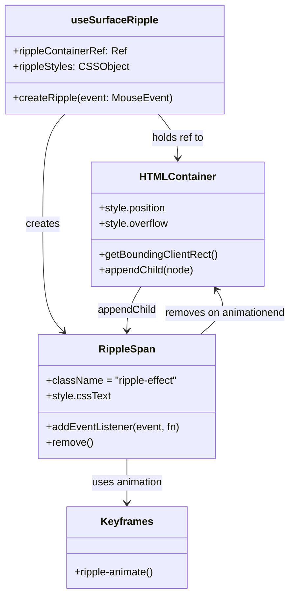

# Diagram: web/portal/src/components/hooks/useSurfaceRipple.tsx


> Auto-generated by Obscura crawlers

## Diagram 1



### SVG

<svg id="container" width="449.0413818359375" xmlns="http://www.w3.org/2000/svg" class="classDiagram" height="916" viewBox="0 0 449.0413818359375 916" role="graphics-document document" aria-roledescription="class"><style>#container{font-family:"trebuchet ms",verdana,arial,sans-serif;font-size:16px;fill:#333;}@keyframes edge-animation-frame{from{stroke-dashoffset:0;}}@keyframes dash{to{stroke-dashoffset:0;}}#container .edge-animation-slow{stroke-dasharray:9,5!important;stroke-dashoffset:900;animation:dash 50s linear infinite;stroke-linecap:round;}#container .edge-animation-fast{stroke-dasharray:9,5!important;stroke-dashoffset:900;animation:dash 20s linear infinite;stroke-linecap:round;}#container .error-icon{fill:#552222;}#container .error-text{fill:#552222;stroke:#552222;}#container .edge-thickness-normal{stroke-width:1px;}#container .edge-thickness-thick{stroke-width:3.5px;}#container .edge-pattern-solid{stroke-dasharray:0;}#container .edge-thickness-invisible{stroke-width:0;fill:none;}#container .edge-pattern-dashed{stroke-dasharray:3;}#container .edge-pattern-dotted{stroke-dasharray:2;}#container .marker{fill:#333333;stroke:#333333;}#container .marker.cross{stroke:#333333;}#container svg{font-family:"trebuchet ms",verdana,arial,sans-serif;font-size:16px;}#container p{margin:0;}#container g.classGroup text{fill:#9370DB;stroke:none;font-family:"trebuchet ms",verdana,arial,sans-serif;font-size:10px;}#container g.classGroup text .title{font-weight:bolder;}#container .nodeLabel,#container .edgeLabel{color:#131300;}#container .edgeLabel .label rect{fill:#ECECFF;}#container .label text{fill:#131300;}#container .labelBkg{background:#ECECFF;}#container .edgeLabel .label span{background:#ECECFF;}#container .classTitle{font-weight:bolder;}#container .node rect,#container .node circle,#container .node ellipse,#container .node polygon,#container .node path{fill:#ECECFF;stroke:#9370DB;stroke-width:1px;}#container .divider{stroke:#9370DB;stroke-width:1;}#container g.clickable{cursor:pointer;}#container g.classGroup rect{fill:#ECECFF;stroke:#9370DB;}#container g.classGroup line{stroke:#9370DB;stroke-width:1;}#container .classLabel .box{stroke:none;stroke-width:0;fill:#ECECFF;opacity:0.5;}#container .classLabel .label{fill:#9370DB;font-size:10px;}#container .relation{stroke:#333333;stroke-width:1;fill:none;}#container .dashed-line{stroke-dasharray:3;}#container .dotted-line{stroke-dasharray:1 2;}#container #compositionStart,#container .composition{fill:#333333!important;stroke:#333333!important;stroke-width:1;}#container #compositionEnd,#container .composition{fill:#333333!important;stroke:#333333!important;stroke-width:1;}#container #dependencyStart,#container .dependency{fill:#333333!important;stroke:#333333!important;stroke-width:1;}#container #dependencyStart,#container .dependency{fill:#333333!important;stroke:#333333!important;stroke-width:1;}#container #extensionStart,#container .extension{fill:transparent!important;stroke:#333333!important;stroke-width:1;}#container #extensionEnd,#container .extension{fill:transparent!important;stroke:#333333!important;stroke-width:1;}#container #aggregationStart,#container .aggregation{fill:transparent!important;stroke:#333333!important;stroke-width:1;}#container #aggregationEnd,#container .aggregation{fill:transparent!important;stroke:#333333!important;stroke-width:1;}#container #lollipopStart,#container .lollipop{fill:#ECECFF!important;stroke:#333333!important;stroke-width:1;}#container #lollipopEnd,#container .lollipop{fill:#ECECFF!important;stroke:#333333!important;stroke-width:1;}#container .edgeTerminals{font-size:11px;line-height:initial;}#container .classTitleText{text-anchor:middle;font-size:18px;fill:#333;}#container .label-icon{display:inline-block;height:1em;overflow:visible;vertical-align:-0.125em;}#container .node .label-icon path{fill:currentColor;stroke:revert;stroke-width:revert;}#container :root{--mermaid-font-family:"trebuchet ms",verdana,arial,sans-serif;}</style><g><defs><marker id="container_class-aggregationStart" class="marker aggregation class" refX="18" refY="7" markerWidth="190" markerHeight="240" orient="auto"><path d="M 18,7 L9,13 L1,7 L9,1 Z"></path></marker></defs><defs><marker id="container_class-aggregationEnd" class="marker aggregation class" refX="1" refY="7" markerWidth="20" markerHeight="28" orient="auto"><path d="M 18,7 L9,13 L1,7 L9,1 Z"></path></marker></defs><defs><marker id="container_class-extensionStart" class="marker extension class" refX="18" refY="7" markerWidth="190" markerHeight="240" orient="auto"><path d="M 1,7 L18,13 V 1 Z"></path></marker></defs><defs><marker id="container_class-extensionEnd" class="marker extension class" refX="1" refY="7" markerWidth="20" markerHeight="28" orient="auto"><path d="M 1,1 V 13 L18,7 Z"></path></marker></defs><defs><marker id="container_class-compositionStart" class="marker composition class" refX="18" refY="7" markerWidth="190" markerHeight="240" orient="auto"><path d="M 18,7 L9,13 L1,7 L9,1 Z"></path></marker></defs><defs><marker id="container_class-compositionEnd" class="marker composition class" refX="1" refY="7" markerWidth="20" markerHeight="28" orient="auto"><path d="M 18,7 L9,13 L1,7 L9,1 Z"></path></marker></defs><defs><marker id="container_class-dependencyStart" class="marker dependency class" refX="6" refY="7" markerWidth="190" markerHeight="240" orient="auto"><path d="M 5,7 L9,13 L1,7 L9,1 Z"></path></marker></defs><defs><marker id="container_class-dependencyEnd" class="marker dependency class" refX="13" refY="7" markerWidth="20" markerHeight="28" orient="auto"><path d="M 18,7 L9,13 L14,7 L9,1 Z"></path></marker></defs><defs><marker id="container_class-lollipopStart" class="marker lollipop class" refX="13" refY="7" markerWidth="190" markerHeight="240" orient="auto"><circle stroke="black" fill="transparent" cx="7" cy="7" r="6"></circle></marker></defs><defs><marker id="container_class-lollipopEnd" class="marker lollipop class" refX="1" refY="7" markerWidth="190" markerHeight="240" orient="auto"><circle stroke="black" fill="transparent" cx="7" cy="7" r="6"></circle></marker></defs><g class="root"><g class="clusters"></g><g class="edgePaths"><path d="M241.536,176L246.446,182.167C251.357,188.333,261.177,200.667,266.088,212C270.998,223.333,270.998,233.667,270.998,238.833L270.998,244" id="id_useSurfaceRipple_HTMLContainer_1" class="edge-thickness-normal edge-pattern-solid relation" style=";;;" data-edge="true" data-et="edge" data-id="id_useSurfaceRipple_HTMLContainer_1" data-points="W3sieCI6MjQxLjUzNTc2OTYyODA5OTE2LCJ5IjoxNzZ9LHsieCI6MjcwLjk5ODA0Njg3NSwieSI6MjEzfSx7IngiOjI3MC45OTgwNDY4NzUsInkiOjI1MH1d" marker-end="url(#container_class-dependencyEnd)"></path><path d="M95.717,176L89.922,182.167C84.128,188.333,72.538,200.667,66.744,229C60.949,257.333,60.949,301.667,60.949,346C60.949,390.333,60.949,434.667,66.252,462.283C71.555,489.9,82.161,500.8,87.464,506.25L92.767,511.7" id="id_useSurfaceRipple_RippleSpan_2" class="edge-thickness-normal edge-pattern-solid relation" style=";;;" data-edge="true" data-et="edge" data-id="id_useSurfaceRipple_RippleSpan_2" data-points="W3sieCI6OTUuNzE2NzQ4NDUwNDEzMjIsInkiOjE3Nn0seyJ4Ijo2MC45NDkyMTg3NSwieSI6MjEzfSx7IngiOjYwLjk0OTIxODc1LCJ5IjozNDZ9LHsieCI6NjAuOTQ5MjE4NzUsInkiOjQ3OX0seyJ4Ijo5Ni45NTEwODM3NjQwOTc3NSwieSI6NTE2fV0=" marker-end="url(#container_class-dependencyEnd)"></path><path d="M190.361,708L190.361,714.167C190.361,720.333,190.361,732.667,190.361,744C190.361,755.333,190.361,765.667,190.361,770.833L190.361,776" id="id_RippleSpan_Keyframes_3" class="edge-thickness-normal edge-pattern-solid relation" style=";;;" data-edge="true" data-et="edge" data-id="id_RippleSpan_Keyframes_3" data-points="W3sieCI6MTkwLjM2MTMyODEyNSwieSI6NzA4fSx7IngiOjE5MC4zNjEzMjgxMjUsInkiOjc0NX0seyJ4IjoxOTAuMzYxMzI4MTI1LCJ5Ijo3ODJ9XQ==" marker-end="url(#container_class-dependencyEnd)"></path><path d="M212.794,442L209.055,448.167C205.317,454.333,197.839,466.667,194.1,478C190.361,489.333,190.361,499.667,190.361,504.833L190.361,510" id="id_HTMLContainer_RippleSpan_4" class="edge-thickness-normal edge-pattern-solid relation" style=";;;" data-edge="true" data-et="edge" data-id="id_HTMLContainer_RippleSpan_4" data-points="W3sieCI6MjEyLjc5NDA5OTUwNjU3ODk2LCJ5Ijo0NDJ9LHsieCI6MTkwLjM2MTMyODEyNSwieSI6NDc5fSx7IngiOjE5MC4zNjEzMjgxMjUsInkiOjUxNn1d" marker-end="url(#container_class-dependencyEnd)"></path><path d="M306.769,516L314.247,509.833C321.724,503.667,336.68,491.333,340.937,479.855C345.194,468.377,338.753,457.754,335.533,452.442L332.313,447.131" id="id_RippleSpan_HTMLContainer_5" class="edge-thickness-normal edge-pattern-solid relation" style=";;;" data-edge="true" data-et="edge" data-id="id_RippleSpan_HTMLContainer_5" data-points="W3sieCI6MzA2Ljc2OTIyMjg2MTg0MjEsInkiOjUxNn0seyJ4IjozNTEuNjM0NzY1NjI1LCJ5Ijo0Nzl9LHsieCI6MzI5LjIwMTk5NDI0MzQyMTA0LCJ5Ijo0NDJ9XQ==" marker-end="url(#container_class-dependencyEnd)"></path></g><g class="edgeLabels"><g class="edgeLabel" transform="translate(270.998046875, 213)"><g class="label" data-id="id_useSurfaceRipple_HTMLContainer_1" transform="translate(-41.7578125, -12)"><foreignObject width="83.515625" height="24"><div xmlns="http://www.w3.org/1999/xhtml" class="labelBkg" style="display: table-cell; white-space: nowrap; line-height: 1.5; max-width: 200px; text-align: center;"><span class="edgeLabel"><p>holds ref to</p></span></div></foreignObject></g></g><g class="edgeLabel" transform="translate(60.94921875, 346)"><g class="label" data-id="id_useSurfaceRipple_RippleSpan_2" transform="translate(-26.171875, -12)"><foreignObject width="52.34375" height="24"><div xmlns="http://www.w3.org/1999/xhtml" class="labelBkg" style="display: table-cell; white-space: nowrap; line-height: 1.5; max-width: 200px; text-align: center;"><span class="edgeLabel"><p>creates</p></span></div></foreignObject></g></g><g class="edgeLabel" transform="translate(190.361328125, 745)"><g class="label" data-id="id_RippleSpan_Keyframes_3" transform="translate(-55.6171875, -12)"><foreignObject width="111.234375" height="24"><div xmlns="http://www.w3.org/1999/xhtml" class="labelBkg" style="display: table-cell; white-space: nowrap; line-height: 1.5; max-width: 200px; text-align: center;"><span class="edgeLabel"><p>uses animation</p></span></div></foreignObject></g></g><g class="edgeLabel" transform="translate(190.361328125, 479)"><g class="label" data-id="id_HTMLContainer_RippleSpan_4" transform="translate(-46.125, -12)"><foreignObject width="92.25" height="24"><div xmlns="http://www.w3.org/1999/xhtml" class="labelBkg" style="display: table-cell; white-space: nowrap; line-height: 1.5; max-width: 200px; text-align: center;"><span class="edgeLabel"><p>appendChild</p></span></div></foreignObject></g></g><g class="edgeLabel" transform="translate(345.89294, 483.7352)"><g class="label" data-id="id_RippleSpan_HTMLContainer_5" transform="translate(-95.1484375, -12)"><foreignObject width="190.296875" height="24"><div xmlns="http://www.w3.org/1999/xhtml" class="labelBkg" style="display: table-cell; white-space: nowrap; line-height: 1.5; max-width: 200px; text-align: center;"><span class="edgeLabel"><p>removes on animationend</p></span></div></foreignObject></g></g></g><g class="nodes"><g class="node default" id="classId-useSurfaceRipple-0" transform="translate(174.6484375, 92)"><g class="basic label-container"><path d="M-166.6484375 -84 L166.6484375 -84 L166.6484375 84 L-166.6484375 84" stroke="none" stroke-width="0" fill="#ECECFF" style=""></path><path d="M-166.6484375 -84 C-69.15727797312636 -84, 28.33388155374729 -84, 166.6484375 -84 M-166.6484375 -84 C-67.96910574296992 -84, 30.71022601406017 -84, 166.6484375 -84 M166.6484375 -84 C166.6484375 -35.99275527092469, 166.6484375 12.01448945815062, 166.6484375 84 M166.6484375 -84 C166.6484375 -29.473591719928955, 166.6484375 25.05281656014209, 166.6484375 84 M166.6484375 84 C71.38252313791524 84, -23.883391224169515 84, -166.6484375 84 M166.6484375 84 C91.23001602548612 84, 15.811594550972245 84, -166.6484375 84 M-166.6484375 84 C-166.6484375 35.382374121105826, -166.6484375 -13.235251757788348, -166.6484375 -84 M-166.6484375 84 C-166.6484375 42.25164254314359, -166.6484375 0.5032850862871783, -166.6484375 -84" stroke="#9370DB" stroke-width="1.3" fill="none" stroke-dasharray="0 0" style=""></path></g><g class="annotation-group text" transform="translate(0, -60)"></g><g class="label-group text" transform="translate(-63.84375, -60)"><g class="label" style="font-weight: bolder" transform="translate(0,-12)"><foreignObject width="127.6875" height="24"><div xmlns="http://www.w3.org/1999/xhtml" style="display: table-cell; white-space: nowrap; line-height: 1.5; max-width: 176px; text-align: center;"><span class="nodeLabel markdown-node-label" style=""><p>useSurfaceRipple</p></span></div></foreignObject></g></g><g class="members-group text" transform="translate(-154.6484375, -12)"><g class="label" style="" transform="translate(0,-12)"><foreignObject width="176.75" height="24"><div xmlns="http://www.w3.org/1999/xhtml" style="display: table-cell; white-space: nowrap; line-height: 1.5; max-width: 236px; text-align: center;"><span class="nodeLabel markdown-node-label" style=""><p>+rippleContainerRef: Ref</p></span></div></foreignObject></g><g class="label" style="" transform="translate(0,12)"><foreignObject width="175.4375" height="24"><div xmlns="http://www.w3.org/1999/xhtml" style="display: table-cell; white-space: nowrap; line-height: 1.5; max-width: 233px; text-align: center;"><span class="nodeLabel markdown-node-label" style=""><p>+rippleStyles: CSSObject</p></span></div></foreignObject></g></g><g class="methods-group text" transform="translate(-154.6484375, 60)"><g class="label" style="" transform="translate(0,-12)"><foreignObject width="245.453125" height="24"><div xmlns="http://www.w3.org/1999/xhtml" style="display: table-cell; white-space: nowrap; line-height: 1.5; max-width: 303px; text-align: center;"><span class="nodeLabel markdown-node-label" style=""><p>+createRipple(event: MouseEvent)</p></span></div></foreignObject></g></g><g class="divider" style=""><path d="M-166.6484375 -36 C-74.80980681180743 -36, 17.028823876385133 -36, 166.6484375 -36 M-166.6484375 -36 C-82.40853250895215 -36, 1.831372482095702 -36, 166.6484375 -36" stroke="#9370DB" stroke-width="1.3" fill="none" stroke-dasharray="0 0" style=""></path></g><g class="divider" style=""><path d="M-166.6484375 36 C-45.05230335267821 36, 76.54383079464358 36, 166.6484375 36 M-166.6484375 36 C-40.83801073919213 36, 84.97241602161574 36, 166.6484375 36" stroke="#9370DB" stroke-width="1.3" fill="none" stroke-dasharray="0 0" style=""></path></g></g><g class="node default" id="classId-HTMLContainer-1" transform="translate(270.998046875, 346)"><g class="basic label-container"><path d="M-131.52734375 -96 L131.52734375 -96 L131.52734375 96 L-131.52734375 96" stroke="none" stroke-width="0" fill="#ECECFF" style=""></path><path d="M-131.52734375 -96 C-66.5243287347108 -96, -1.521313719421613 -96, 131.52734375 -96 M-131.52734375 -96 C-35.33674549524008 -96, 60.85385275951984 -96, 131.52734375 -96 M131.52734375 -96 C131.52734375 -36.02388770395456, 131.52734375 23.952224592090886, 131.52734375 96 M131.52734375 -96 C131.52734375 -44.567198790170806, 131.52734375 6.865602419658387, 131.52734375 96 M131.52734375 96 C67.01118125272484 96, 2.495018755449678 96, -131.52734375 96 M131.52734375 96 C65.51529299850779 96, -0.49675775298442204 96, -131.52734375 96 M-131.52734375 96 C-131.52734375 21.666120460375012, -131.52734375 -52.667759079249976, -131.52734375 -96 M-131.52734375 96 C-131.52734375 38.73580460693675, -131.52734375 -18.528390786126494, -131.52734375 -96" stroke="#9370DB" stroke-width="1.3" fill="none" stroke-dasharray="0 0" style=""></path></g><g class="annotation-group text" transform="translate(0, -72)"></g><g class="label-group text" transform="translate(-55.1484375, -72)"><g class="label" style="font-weight: bolder" transform="translate(0,-12)"><foreignObject width="110.296875" height="24"><div xmlns="http://www.w3.org/1999/xhtml" style="display: table-cell; white-space: nowrap; line-height: 1.5; max-width: 160px; text-align: center;"><span class="nodeLabel markdown-node-label" style=""><p>HTMLContainer</p></span></div></foreignObject></g></g><g class="members-group text" transform="translate(-119.52734375, -24)"><g class="label" style="" transform="translate(0,-12)"><foreignObject width="105.875" height="24"><div xmlns="http://www.w3.org/1999/xhtml" style="display: table-cell; white-space: nowrap; line-height: 1.5; max-width: 163px; text-align: center;"><span class="nodeLabel markdown-node-label" style=""><p>+style.position</p></span></div></foreignObject></g><g class="label" style="" transform="translate(0,12)"><foreignObject width="108.078125" height="24"><div xmlns="http://www.w3.org/1999/xhtml" style="display: table-cell; white-space: nowrap; line-height: 1.5; max-width: 166px; text-align: center;"><span class="nodeLabel markdown-node-label" style=""><p>+style.overflow</p></span></div></foreignObject></g></g><g class="methods-group text" transform="translate(-119.52734375, 48)"><g class="label" style="" transform="translate(0,-12)"><foreignObject width="183.90625" height="24"><div xmlns="http://www.w3.org/1999/xhtml" style="display: table-cell; white-space: nowrap; line-height: 1.5; max-width: 241px; text-align: center;"><span class="nodeLabel markdown-node-label" style=""><p>+getBoundingClientRect()</p></span></div></foreignObject></g><g class="label" style="" transform="translate(0,12)"><foreignObject width="147.375" height="24"><div xmlns="http://www.w3.org/1999/xhtml" style="display: table-cell; white-space: nowrap; line-height: 1.5; max-width: 205px; text-align: center;"><span class="nodeLabel markdown-node-label" style=""><p>+appendChild(node)</p></span></div></foreignObject></g></g><g class="divider" style=""><path d="M-131.52734375 -48 C-42.156885695197886 -48, 47.21357235960423 -48, 131.52734375 -48 M-131.52734375 -48 C-37.80703492039714 -48, 55.913273909205714 -48, 131.52734375 -48" stroke="#9370DB" stroke-width="1.3" fill="none" stroke-dasharray="0 0" style=""></path></g><g class="divider" style=""><path d="M-131.52734375 24 C-61.38980655078571 24, 8.747730648428586 24, 131.52734375 24 M-131.52734375 24 C-27.116164928887656 24, 77.29501389222469 24, 131.52734375 24" stroke="#9370DB" stroke-width="1.3" fill="none" stroke-dasharray="0 0" style=""></path></g></g><g class="node default" id="classId-RippleSpan-2" transform="translate(190.361328125, 612)"><g class="basic label-container"><path d="M-136.67578125 -96 L136.67578125 -96 L136.67578125 96 L-136.67578125 96" stroke="none" stroke-width="0" fill="#ECECFF" style=""></path><path d="M-136.67578125 -96 C-52.88679014415834 -96, 30.90220096168332 -96, 136.67578125 -96 M-136.67578125 -96 C-28.968891650493376 -96, 78.73799794901325 -96, 136.67578125 -96 M136.67578125 -96 C136.67578125 -56.53232455908788, 136.67578125 -17.064649118175765, 136.67578125 96 M136.67578125 -96 C136.67578125 -48.53644823373054, 136.67578125 -1.072896467461078, 136.67578125 96 M136.67578125 96 C69.68730990688822 96, 2.698838563776434 96, -136.67578125 96 M136.67578125 96 C70.39378085196802 96, 4.111780453936035 96, -136.67578125 96 M-136.67578125 96 C-136.67578125 51.43185045458096, -136.67578125 6.8637009091619205, -136.67578125 -96 M-136.67578125 96 C-136.67578125 40.32173646591545, -136.67578125 -15.3565270681691, -136.67578125 -96" stroke="#9370DB" stroke-width="1.3" fill="none" stroke-dasharray="0 0" style=""></path></g><g class="annotation-group text" transform="translate(0, -72)"></g><g class="label-group text" transform="translate(-41.7734375, -72)"><g class="label" style="font-weight: bolder" transform="translate(0,-12)"><foreignObject width="83.546875" height="24"><div xmlns="http://www.w3.org/1999/xhtml" style="display: table-cell; white-space: nowrap; line-height: 1.5; max-width: 133px; text-align: center;"><span class="nodeLabel markdown-node-label" style=""><p>RippleSpan</p></span></div></foreignObject></g></g><g class="members-group text" transform="translate(-124.67578125, -24)"><g class="label" style="" transform="translate(0,-12)"><foreignObject width="205.546875" height="24"><div xmlns="http://www.w3.org/1999/xhtml" style="display: table-cell; white-space: nowrap; line-height: 1.5; max-width: 263px; text-align: center;"><span class="nodeLabel markdown-node-label" style=""><p>+className = "ripple-effect"</p></span></div></foreignObject></g><g class="label" style="" transform="translate(0,12)"><foreignObject width="97.8125" height="24"><div xmlns="http://www.w3.org/1999/xhtml" style="display: table-cell; white-space: nowrap; line-height: 1.5; max-width: 155px; text-align: center;"><span class="nodeLabel markdown-node-label" style=""><p>+style.cssText</p></span></div></foreignObject></g></g><g class="methods-group text" transform="translate(-124.67578125, 48)"><g class="label" style="" transform="translate(0,-12)"><foreignObject width="207.578125" height="24"><div xmlns="http://www.w3.org/1999/xhtml" style="display: table-cell; white-space: nowrap; line-height: 1.5; max-width: 265px; text-align: center;"><span class="nodeLabel markdown-node-label" style=""><p>+addEventListener(event, fn)</p></span></div></foreignObject></g><g class="label" style="" transform="translate(0,12)"><foreignObject width="72.296875" height="24"><div xmlns="http://www.w3.org/1999/xhtml" style="display: table-cell; white-space: nowrap; line-height: 1.5; max-width: 130px; text-align: center;"><span class="nodeLabel markdown-node-label" style=""><p>+remove()</p></span></div></foreignObject></g></g><g class="divider" style=""><path d="M-136.67578125 -48 C-31.254085222406587 -48, 74.16761080518683 -48, 136.67578125 -48 M-136.67578125 -48 C-68.65006225031787 -48, -0.6243432506357465 -48, 136.67578125 -48" stroke="#9370DB" stroke-width="1.3" fill="none" stroke-dasharray="0 0" style=""></path></g><g class="divider" style=""><path d="M-136.67578125 24 C-30.58124879770415 24, 75.5132836545917 24, 136.67578125 24 M-136.67578125 24 C-56.490500544145505 24, 23.69478016170899 24, 136.67578125 24" stroke="#9370DB" stroke-width="1.3" fill="none" stroke-dasharray="0 0" style=""></path></g></g><g class="node default" id="classId-Keyframes-3" transform="translate(190.361328125, 845)"><g class="basic label-container"><path d="M-94.73828125 -63 L94.73828125 -63 L94.73828125 63 L-94.73828125 63" stroke="none" stroke-width="0" fill="#ECECFF" style=""></path><path d="M-94.73828125 -63 C-22.44289579511296 -63, 49.85248965977408 -63, 94.73828125 -63 M-94.73828125 -63 C-28.04057946812499 -63, 38.65712231375002 -63, 94.73828125 -63 M94.73828125 -63 C94.73828125 -16.526028624901933, 94.73828125 29.947942750196134, 94.73828125 63 M94.73828125 -63 C94.73828125 -22.601981791261352, 94.73828125 17.796036417477296, 94.73828125 63 M94.73828125 63 C19.201262074892057 63, -56.335757100215886 63, -94.73828125 63 M94.73828125 63 C26.358567448110392 63, -42.021146353779216 63, -94.73828125 63 M-94.73828125 63 C-94.73828125 20.99996867629492, -94.73828125 -21.00006264741016, -94.73828125 -63 M-94.73828125 63 C-94.73828125 19.680806750256473, -94.73828125 -23.638386499487055, -94.73828125 -63" stroke="#9370DB" stroke-width="1.3" fill="none" stroke-dasharray="0 0" style=""></path></g><g class="annotation-group text" transform="translate(0, -39)"></g><g class="label-group text" transform="translate(-38.6171875, -39)"><g class="label" style="font-weight: bolder" transform="translate(0,-12)"><foreignObject width="77.234375" height="24"><div xmlns="http://www.w3.org/1999/xhtml" style="display: table-cell; white-space: nowrap; line-height: 1.5; max-width: 125px; text-align: center;"><span class="nodeLabel markdown-node-label" style=""><p>Keyframes</p></span></div></foreignObject></g></g><g class="members-group text" transform="translate(-82.73828125, 9)"></g><g class="methods-group text" transform="translate(-82.73828125, 39)"><g class="label" style="" transform="translate(0,-12)"><foreignObject width="126.859375" height="24"><div xmlns="http://www.w3.org/1999/xhtml" style="display: table-cell; white-space: nowrap; line-height: 1.5; max-width: 184px; text-align: center;"><span class="nodeLabel markdown-node-label" style=""><p>+ripple-animate()</p></span></div></foreignObject></g></g><g class="divider" style=""><path d="M-94.73828125 -15 C-37.61620473600475 -15, 19.505871777990507 -15, 94.73828125 -15 M-94.73828125 -15 C-22.494923790297094 -15, 49.74843366940581 -15, 94.73828125 -15" stroke="#9370DB" stroke-width="1.3" fill="none" stroke-dasharray="0 0" style=""></path></g><g class="divider" style=""><path d="M-94.73828125 9 C-43.51910874819922 9, 7.700063753601555 9, 94.73828125 9 M-94.73828125 9 C-28.39838177500242 9, 37.94151769999516 9, 94.73828125 9" stroke="#9370DB" stroke-width="1.3" fill="none" stroke-dasharray="0 0" style=""></path></g></g></g></g></g></svg>

## Diagram 2

```mermaid
flowchart TD
    Click[User Click Event] --> A[createRipple(event)]
    A --> B{container exists?}
    B -- No --> EndNoContainer((exit))
    B -- Yes --> C[getBoundingClientRect()]
    C --> D[compute size, x, y]
    D --> E[create <span> element]
    E --> F[set className and inline styles]
    F --> G[ensure container position relative & overflow:hidden]
    G --> H[container.appendChild(ripple)]
    H --> I[ripple animation starts (ripple-animate, 500ms)]
    I --> J[animationend event]
    J --> K[ripple.remove() -> DOM node removed]
    K --> End((done))
```

> SVG rendering failed for this diagram.
