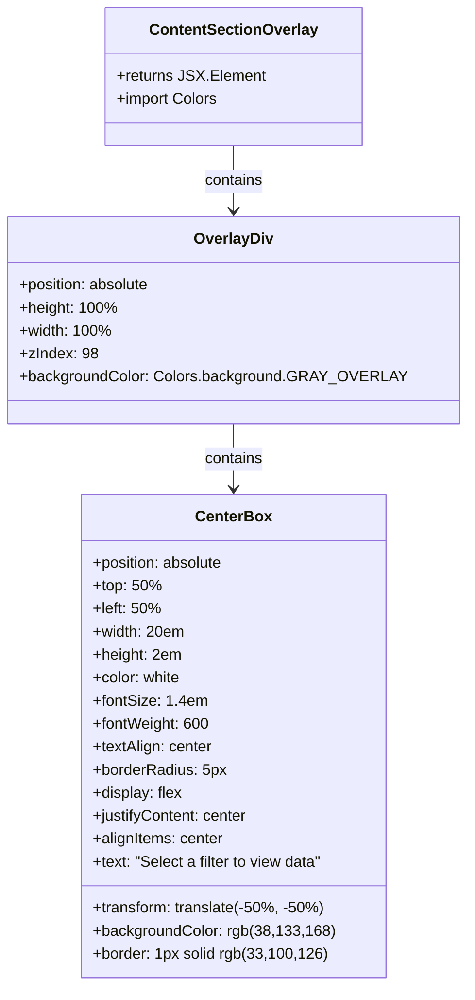

# Diagram: web/portal/src/components/map-search-results/ContentSectionOverlay.js

> Auto-generated by Obscura crawlers

## Mermaid

### SVG

<svg id="container" width="463.9765625" xmlns="http://www.w3.org/2000/svg" class="classDiagram" height="1028" viewBox="0 0 463.9765625 1028" role="graphics-document document" aria-roledescription="class"><g><defs><marker id="container_class-aggregationStart" class="marker aggregation class" refX="18" refY="7" markerWidth="190" markerHeight="240" orient="auto"><path d="M 18,7 L9,13 L1,7 L9,1 Z"></path></marker></defs><defs><marker id="container_class-aggregationEnd" class="marker aggregation class" refX="1" refY="7" markerWidth="20" markerHeight="28" orient="auto"><path d="M 18,7 L9,13 L1,7 L9,1 Z"></path></marker></defs><defs><marker id="container_class-extensionStart" class="marker extension class" refX="18" refY="7" markerWidth="190" markerHeight="240" orient="auto"><path d="M 1,7 L18,13 V 1 Z"></path></marker></defs><defs><marker id="container_class-extensionEnd" class="marker extension class" refX="1" refY="7" markerWidth="20" markerHeight="28" orient="auto"><path d="M 1,1 V 13 L18,7 Z"></path></marker></defs><defs><marker id="container_class-compositionStart" class="marker composition class" refX="18" refY="7" markerWidth="190" markerHeight="240" orient="auto"><path d="M 18,7 L9,13 L1,7 L9,1 Z"></path></marker></defs><defs><marker id="container_class-compositionEnd" class="marker composition class" refX="1" refY="7" markerWidth="20" markerHeight="28" orient="auto"><path d="M 18,7 L9,13 L1,7 L9,1 Z"></path></marker></defs><defs><marker id="container_class-dependencyStart" class="marker dependency class" refX="6" refY="7" markerWidth="190" markerHeight="240" orient="auto"><path d="M 5,7 L9,13 L1,7 L9,1 Z"></path></marker></defs><defs><marker id="container_class-dependencyEnd" class="marker dependency class" refX="13" refY="7" markerWidth="20" markerHeight="28" orient="auto"><path d="M 18,7 L9,13 L14,7 L9,1 Z"></path></marker></defs><defs><marker id="container_class-lollipopStart" class="marker lollipop class" refX="13" refY="7" markerWidth="190" markerHeight="240" orient="auto"><circle stroke="black" fill="transparent" cx="7" cy="7" r="6"></circle></marker></defs><defs><marker id="container_class-lollipopEnd" class="marker lollipop class" refX="1" refY="7" markerWidth="190" markerHeight="240" orient="auto"><circle stroke="black" fill="transparent" cx="7" cy="7" r="6"></circle></marker></defs><g class="root"><g class="clusters"></g><g class="edgePaths"><path d="M231.988,152L231.988,158.167C231.988,164.333,231.988,176.667,231.988,188C231.988,199.333,231.988,209.667,231.988,214.833L231.988,220" id="id_ContentSectionOverlay_OverlayDiv_1" class="edge-thickness-normal edge-pattern-solid relation" style=";;;" data-edge="true" data-et="edge" data-id="id_ContentSectionOverlay_OverlayDiv_1" data-points="W3sieCI6MjMxLjk4ODI4MTI1LCJ5IjoxNTJ9LHsieCI6MjMxLjk4ODI4MTI1LCJ5IjoxODl9LHsieCI6MjMxLjk4ODI4MTI1LCJ5IjoyMjZ9XQ==" marker-end="url(#container_class-dependencyEnd)"></path><path d="M231.988,442L231.988,448.167C231.988,454.333,231.988,466.667,231.988,478C231.988,489.333,231.988,499.667,231.988,504.833L231.988,510" id="id_OverlayDiv_CenterBox_2" class="edge-thickness-normal edge-pattern-solid relation" style=";;;" data-edge="true" data-et="edge" data-id="id_OverlayDiv_CenterBox_2" data-points="W3sieCI6MjMxLjk4ODI4MTI1LCJ5Ijo0NDJ9LHsieCI6MjMxLjk4ODI4MTI1LCJ5Ijo0Nzl9LHsieCI6MjMxLjk4ODI4MTI1LCJ5Ijo1MTZ9XQ==" marker-end="url(#container_class-dependencyEnd)"></path></g><g class="edgeLabels"><g class="edgeLabel" transform="translate(231.98828125, 189)"><g class="label" data-id="id_ContentSectionOverlay_OverlayDiv_1" transform="translate(-30.890625, -12)"><foreignObject width="61.78125" height="24">

contains

</foreignObject></g></g><g class="edgeLabel" transform="translate(231.98828125, 479)"><g class="label" data-id="id_OverlayDiv_CenterBox_2" transform="translate(-30.890625, -12)"><foreignObject width="61.78125" height="24">

contains

</foreignObject></g></g></g><g class="nodes"><g class="node default" id="classId-ContentSectionOverlay-0" transform="translate(231.98828125, 80)"><g class="basic label-container"><path d="M-129.140625 -72 L129.140625 -72 L129.140625 72 L-129.140625 72" stroke="none" stroke-width="0" fill="#ECECFF" style=""></path><path d="M-129.140625 -72 C-62.73843574683838 -72, 3.6637535063232463 -72, 129.140625 -72 M-129.140625 -72 C-76.66325437398332 -72, -24.185883747966642 -72, 129.140625 -72 M129.140625 -72 C129.140625 -18.82117237954875, 129.140625 34.3576552409025, 129.140625 72 M129.140625 -72 C129.140625 -36.82479024580961, 129.140625 -1.6495804916192185, 129.140625 72 M129.140625 72 C45.20482571243218 72, -38.730973575135636 72, -129.140625 72 M129.140625 72 C36.0830825777154 72, -56.974459844569196 72, -129.140625 72 M-129.140625 72 C-129.140625 33.237340591724134, -129.140625 -5.5253188165517315, -129.140625 -72 M-129.140625 72 C-129.140625 14.986605962475679, -129.140625 -42.02678807504864, -129.140625 -72" stroke="#9370DB" stroke-width="1.3" fill="none" stroke-dasharray="0 0" style=""></path></g><g class="annotation-group text" transform="translate(0, -48)"></g><g class="label-group text" transform="translate(-84.1875, -48)"><g class="label" style="font-weight: bolder" transform="translate(0,-12)"><foreignObject width="168.375" height="24">

ContentSectionOverlay

</foreignObject></g></g><g class="members-group text" transform="translate(-117.140625, 0)"><g class="label" style="" transform="translate(0,-12)"><foreignObject width="150.09375" height="24">

+returns JSX.Element

</foreignObject></g><g class="label" style="" transform="translate(0,12)"><foreignObject width="106.59375" height="24">

+import Colors

</foreignObject></g></g><g class="methods-group text" transform="translate(-117.140625, 72)"></g><g class="divider" style=""><path d="M-129.140625 -24 C-67.1117747322873 -24, -5.082924464574617 -24, 129.140625 -24 M-129.140625 -24 C-39.7304482336488 -24, 49.6797285327024 -24, 129.140625 -24" stroke="#9370DB" stroke-width="1.3" fill="none" stroke-dasharray="0 0" style=""></path></g><g class="divider" style=""><path d="M-129.140625 48 C-41.3693498696248 48, 46.4019252607504 48, 129.140625 48 M-129.140625 48 C-72.36198867440783 48, -15.583352348815652 48, 129.140625 48" stroke="#9370DB" stroke-width="1.3" fill="none" stroke-dasharray="0 0" style=""></path></g></g><g class="node default" id="classId-OverlayDiv-1" transform="translate(231.98828125, 334)"><g class="basic label-container"><path d="M-223.98828125 -108 L223.98828125 -108 L223.98828125 108 L-223.98828125 108" stroke="none" stroke-width="0" fill="#ECECFF" style=""></path><path d="M-223.98828125 -108 C-122.14830447214821 -108, -20.308327694296423 -108, 223.98828125 -108 M-223.98828125 -108 C-79.5838763717916 -108, 64.82052850641679 -108, 223.98828125 -108 M223.98828125 -108 C223.98828125 -28.188815177766458, 223.98828125 51.622369644467085, 223.98828125 108 M223.98828125 -108 C223.98828125 -62.126815404724056, 223.98828125 -16.25363080944811, 223.98828125 108 M223.98828125 108 C94.78567640803684 108, -34.41692843392633 108, -223.98828125 108 M223.98828125 108 C120.02719915952522 108, 16.06611706905045 108, -223.98828125 108 M-223.98828125 108 C-223.98828125 40.72007575040233, -223.98828125 -26.55984849919534, -223.98828125 -108 M-223.98828125 108 C-223.98828125 33.24961085468968, -223.98828125 -41.500778290620644, -223.98828125 -108" stroke="#9370DB" stroke-width="1.3" fill="none" stroke-dasharray="0 0" style=""></path></g><g class="annotation-group text" transform="translate(0, -84)"></g><g class="label-group text" transform="translate(-39.5078125, -84)"><g class="label" style="font-weight: bolder" transform="translate(0,-12)"><foreignObject width="79.015625" height="24">

OverlayDiv

</foreignObject></g></g><g class="members-group text" transform="translate(-211.98828125, -36)"><g class="label" style="" transform="translate(0,-12)"><foreignObject width="139.1875" height="24">

+position: absolute

</foreignObject></g><g class="label" style="" transform="translate(0,12)"><foreignObject width="100.21875" height="24">

+height: 100%

</foreignObject></g><g class="label" style="" transform="translate(0,36)"><foreignObject width="94.78125" height="24">

+width: 100%

</foreignObject></g><g class="label" style="" transform="translate(0,60)"><foreignObject width="79.859375" height="24">

+zIndex: 98

</foreignObject></g><g class="label" style="" transform="translate(0,84)"><foreignObject width="384.46875" height="24">

+backgroundColor: Colors.background.GRAY_OVERLAY

</foreignObject></g></g><g class="methods-group text" transform="translate(-211.98828125, 108)"></g><g class="divider" style=""><path d="M-223.98828125 -60 C-62.65189909595412 -60, 98.68448305809176 -60, 223.98828125 -60 M-223.98828125 -60 C-84.23086472970161 -60, 55.526551790596784 -60, 223.98828125 -60" stroke="#9370DB" stroke-width="1.3" fill="none" stroke-dasharray="0 0" style=""></path></g><g class="divider" style=""><path d="M-223.98828125 84 C-84.78730750738478 84, 54.41366623523044 84, 223.98828125 84 M-223.98828125 84 C-131.6261860940996 84, -39.26409093819922 84, 223.98828125 84" stroke="#9370DB" stroke-width="1.3" fill="none" stroke-dasharray="0 0" style=""></path></g></g><g class="node default" id="classId-CenterBox-2" transform="translate(231.98828125, 768)"><g class="basic label-container"><path d="M-153.234375 -252 L153.234375 -252 L153.234375 252 L-153.234375 252" stroke="none" stroke-width="0" fill="#ECECFF" style=""></path><path d="M-153.234375 -252 C-87.43320394896237 -252, -21.632032897924745 -252, 153.234375 -252 M-153.234375 -252 C-88.22792518416755 -252, -23.221475368335092 -252, 153.234375 -252 M153.234375 -252 C153.234375 -70.06138058889991, 153.234375 111.87723882220018, 153.234375 252 M153.234375 -252 C153.234375 -75.34277157188569, 153.234375 101.31445685622862, 153.234375 252 M153.234375 252 C71.90284916958149 252, -9.428676660837027 252, -153.234375 252 M153.234375 252 C43.46783442030768 252, -66.29870615938464 252, -153.234375 252 M-153.234375 252 C-153.234375 101.63235868797241, -153.234375 -48.73528262405517, -153.234375 -252 M-153.234375 252 C-153.234375 126.11748948822627, -153.234375 0.2349789764525383, -153.234375 -252" stroke="#9370DB" stroke-width="1.3" fill="none" stroke-dasharray="0 0" style=""></path></g><g class="annotation-group text" transform="translate(0, -228)"></g><g class="label-group text" transform="translate(-37.640625, -228)"><g class="label" style="font-weight: bolder" transform="translate(0,-12)"><foreignObject width="75.28125" height="24">

CenterBox

</foreignObject></g></g><g class="members-group text" transform="translate(-141.234375, -180)"><g class="label" style="" transform="translate(0,-12)"><foreignObject width="139.1875" height="24">

+position: absolute

</foreignObject></g><g class="label" style="" transform="translate(0,12)"><foreignObject width="70.53125" height="24">

+top: 50%

</foreignObject></g><g class="label" style="" transform="translate(0,36)"><foreignObject width="70.765625" height="24">

+left: 50%

</foreignObject></g><g class="label" style="" transform="translate(0,60)"><foreignObject width="96.0625" height="24">

+width: 20em

</foreignObject></g><g class="label" style="" transform="translate(0,84)"><foreignObject width="92.25" height="24">

+height: 2em

</foreignObject></g><g class="label" style="" transform="translate(0,108)"><foreignObject width="92.640625" height="24">

+color: white

</foreignObject></g><g class="label" style="" transform="translate(0,132)"><foreignObject width="115.546875" height="24">

+fontSize: 1.4em

</foreignObject></g><g class="label" style="" transform="translate(0,156)"><foreignObject width="121.734375" height="24">

+fontWeight: 600

</foreignObject></g><g class="label" style="" transform="translate(0,180)"><foreignObject width="125.5625" height="24">

+textAlign: center

</foreignObject></g><g class="label" style="" transform="translate(0,204)"><foreignObject width="139.296875" height="24">

+borderRadius: 5px

</foreignObject></g><g class="label" style="" transform="translate(0,228)"><foreignObject width="93.859375" height="24">

+display: flex

</foreignObject></g><g class="label" style="" transform="translate(0,252)"><foreignObject width="163.390625" height="24">

+justifyContent: center

</foreignObject></g><g class="label" style="" transform="translate(0,276)"><foreignObject width="137.28125" height="24">

+alignItems: center

</foreignObject></g><g class="label" style="" transform="translate(0,300)"><foreignObject width="244.828125" height="24">

+text: "Select a filter to view data"

</foreignObject></g></g><g class="methods-group text" transform="translate(-141.234375, 180)"><g class="label" style="" transform="translate(0,-12)"><foreignObject width="243.21875" height="24">

+transform: translate(-50%, -50%)

</foreignObject></g><g class="label" style="" transform="translate(0,12)"><foreignObject width="242.3125" height="24">

+backgroundColor: rgb(38,133,168)

</foreignObject></g><g class="label" style="" transform="translate(0,36)"><foreignObject width="235.890625" height="24">

+border: 1px solid rgb(33,100,126)

</foreignObject></g></g><g class="divider" style=""><path d="M-153.234375 -204 C-58.99253679844952 -204, 35.24930140310096 -204, 153.234375 -204 M-153.234375 -204 C-90.6925954656318 -204, -28.150815931263608 -204, 153.234375 -204" stroke="#9370DB" stroke-width="1.3" fill="none" stroke-dasharray="0 0" style=""></path></g><g class="divider" style=""><path d="M-153.234375 156 C-52.681774537793146 156, 47.87082592441371 156, 153.234375 156 M-153.234375 156 C-73.15446455080475 156, 6.925445898390507 156, 153.234375 156" stroke="#9370DB" stroke-width="1.3" fill="none" stroke-dasharray="0 0" style=""></path></g></g></g></g></g></svg>
