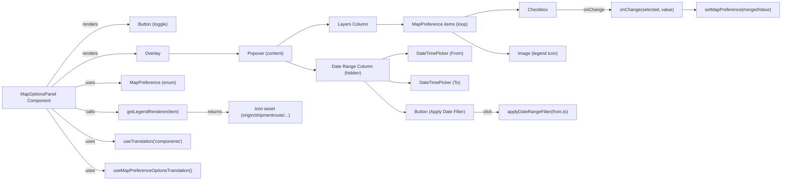
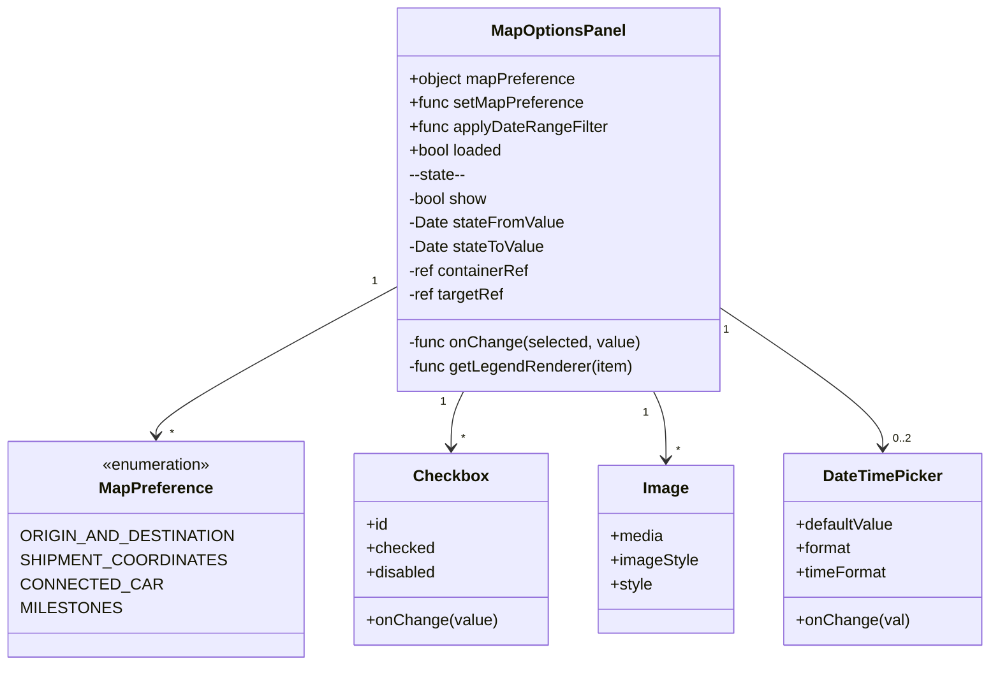

# Diagram: web/portal/src/components/map-search-results/MapOptionsPanel.organism.js

> Auto-generated by Obscura crawlers

## Diagram 1

### SVG

<svg id="container" width="2781.6875" xmlns="http://www.w3.org/2000/svg" class="flowchart" height="642" viewBox="0 0 2781.6875 642" role="graphics-document document" aria-roledescription="flowchart-v2"><g><marker id="container_flowchart-v2-pointEnd" class="marker flowchart-v2" viewBox="0 0 10 10" refX="5" refY="5" markerUnits="userSpaceOnUse" markerWidth="8" markerHeight="8" orient="auto"><path d="M 0 0 L 10 5 L 0 10 z" class="arrowMarkerPath" style="stroke-width: 1; stroke-dasharray: 1, 0;"></path></marker><marker id="container_flowchart-v2-pointStart" class="marker flowchart-v2" viewBox="0 0 10 10" refX="4.5" refY="5" markerUnits="userSpaceOnUse" markerWidth="8" markerHeight="8" orient="auto"><path d="M 0 5 L 10 10 L 10 0 z" class="arrowMarkerPath" style="stroke-width: 1; stroke-dasharray: 1, 0;"></path></marker><marker id="container_flowchart-v2-circleEnd" class="marker flowchart-v2" viewBox="0 0 10 10" refX="11" refY="5" markerUnits="userSpaceOnUse" markerWidth="11" markerHeight="11" orient="auto"><circle cx="5" cy="5" r="5" class="arrowMarkerPath" style="stroke-width: 1; stroke-dasharray: 1, 0;"></circle></marker><marker id="container_flowchart-v2-circleStart" class="marker flowchart-v2" viewBox="0 0 10 10" refX="-1" refY="5" markerUnits="userSpaceOnUse" markerWidth="11" markerHeight="11" orient="auto"><circle cx="5" cy="5" r="5" class="arrowMarkerPath" style="stroke-width: 1; stroke-dasharray: 1, 0;"></circle></marker><marker id="container_flowchart-v2-crossEnd" class="marker cross flowchart-v2" viewBox="0 0 11 11" refX="12" refY="5.2" markerUnits="userSpaceOnUse" markerWidth="11" markerHeight="11" orient="auto"><path d="M 1,1 l 9,9 M 10,1 l -9,9" class="arrowMarkerPath" style="stroke-width: 2; stroke-dasharray: 1, 0;"></path></marker><marker id="container_flowchart-v2-crossStart" class="marker cross flowchart-v2" viewBox="0 0 11 11" refX="-1" refY="5.2" markerUnits="userSpaceOnUse" markerWidth="11" markerHeight="11" orient="auto"><path d="M 1,1 l 9,9 M 10,1 l -9,9" class="arrowMarkerPath" style="stroke-width: 2; stroke-dasharray: 1, 0;"></path></marker><g class="root"><g class="clusters"></g><g class="edgePaths"><path d="M165.413,308L191.302,271.167C217.192,234.333,268.971,160.667,317.444,123.833C365.917,87,411.083,87,433.667,87L456.25,87" id="L_MapOptionsPanel_ButtonBtn_0" class="edge-thickness-normal edge-pattern-solid edge-thickness-normal edge-pattern-solid flowchart-link" style=";" data-edge="true" data-et="edge" data-id="L_MapOptionsPanel_ButtonBtn_0" data-points="W3sieCI6MTY1LjQxMjUsInkiOjMwOH0seyJ4IjozMjAuNzUsInkiOjg3fSx7IngiOjQ2MC4yNSwieSI6ODd9XQ==" marker-end="url(#container_flowchart-v2-pointEnd)"></path><path d="M183.688,308L206.531,288.5C229.375,269,275.063,230,324.973,210.5C374.883,191,429.016,191,456.082,191L483.148,191" id="L_MapOptionsPanel_OverlayComp_0" class="edge-thickness-normal edge-pattern-solid edge-thickness-normal edge-pattern-solid flowchart-link" style=";" data-edge="true" data-et="edge" data-id="L_MapOptionsPanel_OverlayComp_0" data-points="W3sieCI6MTgzLjY4NzUsInkiOjMwOH0seyJ4IjozMjAuNzUsInkiOjE5MX0seyJ4Ijo0ODcuMTQ4NDM3NSwieSI6MTkxfV0=" marker-end="url(#container_flowchart-v2-pointEnd)"></path><path d="M601.883,191L629.368,191C656.854,191,711.826,191,753.046,191C794.266,191,821.734,191,835.469,191L849.203,191" id="L_OverlayComp_PopoverComp_0" class="edge-thickness-normal edge-pattern-solid edge-thickness-normal edge-pattern-solid flowchart-link" style=";" data-edge="true" data-et="edge" data-id="L_OverlayComp_PopoverComp_0" data-points="W3sieCI6NjAxLjg4MjgxMjUsInkiOjE5MX0seyJ4Ijo3NjYuNzk2ODc1LCJ5IjoxOTF9LHsieCI6ODUzLjIwMzEyNSwieSI6MTkxfV0=" marker-end="url(#container_flowchart-v2-pointEnd)"></path><path d="M988.303,164L1007.429,151.167C1026.556,138.333,1064.809,112.667,1095.308,99.833C1125.807,87,1148.552,87,1159.924,87L1171.297,87" id="L_PopoverComp_LayersCol_0" class="edge-thickness-normal edge-pattern-solid edge-thickness-normal edge-pattern-solid flowchart-link" style=";" data-edge="true" data-et="edge" data-id="L_PopoverComp_LayersCol_0" data-points="W3sieCI6OTg4LjMwMjg4NDYxNTM4NDYsInkiOjE2NH0seyJ4IjoxMTAzLjA2MjUsInkiOjg3fSx7IngiOjExNzUuMjk2ODc1LCJ5Ijo4N31d" marker-end="url(#container_flowchart-v2-pointEnd)"></path><path d="M1340.828,87L1352.867,87C1364.906,87,1388.984,87,1404.523,87C1420.063,87,1427.063,87,1430.563,87L1434.063,87" id="L_LayersCol_PreferenceList_0" class="edge-thickness-normal edge-pattern-solid edge-thickness-normal edge-pattern-solid flowchart-link" style=";" data-edge="true" data-et="edge" data-id="L_LayersCol_PreferenceList_0" data-points="W3sieCI6MTM0MC44MjgxMjUsInkiOjg3fSx7IngiOjE0MTMuMDYyNSwieSI6ODd9LHsieCI6MTQzOC4wNjI1LCJ5Ijo4N31d" marker-end="url(#container_flowchart-v2-pointEnd)"></path><path d="M1656.594,60L1670.301,55.833C1684.008,51.667,1711.422,43.333,1743.692,39.167C1775.961,35,1813.086,35,1831.648,35L1850.211,35" id="L_PreferenceList_CheckboxComp_0" class="edge-thickness-normal edge-pattern-solid edge-thickness-normal edge-pattern-solid flowchart-link" style=";" data-edge="true" data-et="edge" data-id="L_PreferenceList_CheckboxComp_0" data-points="W3sieCI6MTY1Ni41OTQzNTA5NjE1Mzg2LCJ5Ijo2MH0seyJ4IjoxNzM4LjgzNTkzNzUsInkiOjM1fSx7IngiOjE4NTQuMjEwOTM3NSwieSI6MzV9XQ==" marker-end="url(#container_flowchart-v2-pointEnd)"></path><path d="M1612.184,114L1633.293,126.833C1654.401,139.667,1696.619,165.333,1730.204,178.167C1763.789,191,1788.742,191,1801.219,191L1813.695,191" id="L_PreferenceList_LegendIcon_0" class="edge-thickness-normal edge-pattern-solid edge-thickness-normal edge-pattern-solid flowchart-link" style=";" data-edge="true" data-et="edge" data-id="L_PreferenceList_LegendIcon_0" data-points="W3sieCI6MTYxMi4xODM4OTQyMzA3NjkzLCJ5IjoxMTR9LHsieCI6MTczOC44MzU5Mzc1LCJ5IjoxOTF9LHsieCI6MTgxNy42OTUzMTI1LCJ5IjoxOTF9XQ==" marker-end="url(#container_flowchart-v2-pointEnd)"></path><path d="M1020.218,218L1034.025,223.167C1047.833,228.333,1075.448,238.667,1092.755,243.833C1110.063,249,1117.063,249,1120.563,249L1124.063,249" id="L_PopoverComp_HiddenColumn_0" class="edge-thickness-normal edge-pattern-solid edge-thickness-normal edge-pattern-solid flowchart-link" style=";" data-edge="true" data-et="edge" data-id="L_PopoverComp_HiddenColumn_0" data-points="W3sieCI6MTAyMC4yMTc2NzI0MTM3OTMxLCJ5IjoyMTh9LHsieCI6MTEwMy4wNjI1LCJ5IjoyNDl9LHsieCI6MTEyOC4wNjI1LCJ5IjoyNDl9XQ==" marker-end="url(#container_flowchart-v2-pointEnd)"></path><path d="M1362.287,210L1370.749,206.833C1379.212,203.667,1396.137,197.333,1411.102,194.167C1426.068,191,1439.073,191,1445.576,191L1452.078,191" id="L_HiddenColumn_DateFrom_0" class="edge-thickness-normal edge-pattern-solid edge-thickness-normal edge-pattern-solid flowchart-link" style=";" data-edge="true" data-et="edge" data-id="L_HiddenColumn_DateFrom_0" data-points="W3sieCI6MTM2Mi4yODY2Mzc5MzEwMzQ0LCJ5IjoyMTB9LHsieCI6MTQxMy4wNjI1LCJ5IjoxOTF9LHsieCI6MTQ1Ni4wNzgxMjUsInkiOjE5MX1d" marker-end="url(#container_flowchart-v2-pointEnd)"></path><path d="M1388.063,287.581L1392.229,288.817C1396.396,290.054,1404.729,292.527,1417.008,293.763C1429.286,295,1445.51,295,1453.622,295L1461.734,295" id="L_HiddenColumn_DateTo_0" class="edge-thickness-normal edge-pattern-solid edge-thickness-normal edge-pattern-solid flowchart-link" style=";" data-edge="true" data-et="edge" data-id="L_HiddenColumn_DateTo_0" data-points="W3sieCI6MTM4OC4wNjI1LCJ5IjoyODcuNTgwNjQ1MTYxMjkwM30seyJ4IjoxNDEzLjA2MjUsInkiOjI5NX0seyJ4IjoxNDY1LjczNDM3NSwieSI6Mjk1fV0=" marker-end="url(#container_flowchart-v2-pointEnd)"></path><path d="M1298.363,288L1317.479,306.5C1336.596,325,1374.829,362,1398.833,380.5C1422.836,399,1432.609,399,1437.496,399L1442.383,399" id="L_HiddenColumn_ApplyBtn_0" class="edge-thickness-normal edge-pattern-solid edge-thickness-normal edge-pattern-solid flowchart-link" style=";" data-edge="true" data-et="edge" data-id="L_HiddenColumn_ApplyBtn_0" data-points="W3sieCI6MTI5OC4zNjI1LCJ5IjoyODh9LHsieCI6MTQxMy4wNjI1LCJ5IjozOTl9LHsieCI6MTQ0Ni4zODI4MTI1LCJ5IjozOTl9XQ==" marker-end="url(#container_flowchart-v2-pointEnd)"></path><path d="M1983.414,35L2005.898,35C2028.383,35,2073.352,35,2105.316,35C2137.281,35,2156.242,35,2165.723,35L2175.203,35" id="L_CheckboxComp_onChangeFunc_0" class="edge-thickness-normal edge-pattern-solid edge-thickness-normal edge-pattern-solid flowchart-link" style=";" data-edge="true" data-et="edge" data-id="L_CheckboxComp_onChangeFunc_0" data-points="W3sieCI6MTk4My40MTQwNjI1LCJ5IjozNX0seyJ4IjoyMTE4LjMyMDMxMjUsInkiOjM1fSx7IngiOjIxNzkuMjAzMTI1LCJ5IjozNX1d" marker-end="url(#container_flowchart-v2-pointEnd)"></path><path d="M2429.297,35L2433.464,35C2437.63,35,2445.964,35,2453.63,35C2461.297,35,2468.297,35,2471.797,35L2475.297,35" id="L_onChangeFunc_setMapPreference_0" class="edge-thickness-normal edge-pattern-solid edge-thickness-normal edge-pattern-solid flowchart-link" style=";" data-edge="true" data-et="edge" data-id="L_onChangeFunc_setMapPreference_0" data-points="W3sieCI6MjQyOS4yOTY4NzUsInkiOjM1fSx7IngiOjI0NTQuMjk2ODc1LCJ5IjozNX0seyJ4IjoyNDc5LjI5Njg3NSwieSI6MzV9XQ==" marker-end="url(#container_flowchart-v2-pointEnd)"></path><path d="M1689.164,399L1697.443,399C1705.721,399,1722.279,399,1736.783,399C1751.286,399,1763.737,399,1769.962,399L1776.188,399" id="L_ApplyBtn_applyDateRangeFilter_0" class="edge-thickness-normal edge-pattern-solid edge-thickness-normal edge-pattern-solid flowchart-link" style=";" data-edge="true" data-et="edge" data-id="L_ApplyBtn_applyDateRangeFilter_0" data-points="W3sieCI6MTY4OS4xNjQwNjI1LCJ5IjozOTl9LHsieCI6MTczOC44MzU5Mzc1LCJ5IjozOTl9LHsieCI6MTc4MC4xODc1LCJ5IjozOTl9XQ==" marker-end="url(#container_flowchart-v2-pointEnd)"></path><path d="M268,310.01L276.792,307.508C285.583,305.006,303.167,300.003,329.957,297.502C356.747,295,392.745,295,410.743,295L428.742,295" id="L_MapOptionsPanel_MapPreferenceConst_0" class="edge-thickness-normal edge-pattern-solid edge-thickness-normal edge-pattern-solid flowchart-link" style=";" data-edge="true" data-et="edge" data-id="L_MapOptionsPanel_MapPreferenceConst_0" data-points="W3sieCI6MjY4LCJ5IjozMTAuMDA5NTc1OTIzMzkyNn0seyJ4IjozMjAuNzUsInkiOjI5NX0seyJ4Ijo0MzIuNzQyMTg3NSwieSI6Mjk1fV0=" marker-end="url(#container_flowchart-v2-pointEnd)"></path><path d="M268,383.99L276.792,386.492C285.583,388.994,303.167,393.997,328.266,396.498C353.365,399,385.979,399,402.286,399L418.594,399" id="L_MapOptionsPanel_getLegendRenderer_0" class="edge-thickness-normal edge-pattern-solid edge-thickness-normal edge-pattern-solid flowchart-link" style=";" data-edge="true" data-et="edge" data-id="L_MapOptionsPanel_getLegendRenderer_0" data-points="W3sieCI6MjY4LCJ5IjozODMuOTkwNDI0MDc2NjA3NH0seyJ4IjozMjAuNzUsInkiOjM5OX0seyJ4Ijo0MjIuNTkzNzUsInkiOjM5OX1d" marker-end="url(#container_flowchart-v2-pointEnd)"></path><path d="M666.438,399L683.164,399C699.891,399,733.344,399,757.948,399C782.552,399,798.307,399,806.185,399L814.063,399" id="L_getLegendRenderer_IconAsset_0" class="edge-thickness-normal edge-pattern-solid edge-thickness-normal edge-pattern-solid flowchart-link" style=";" data-edge="true" data-et="edge" data-id="L_getLegendRenderer_IconAsset_0" data-points="W3sieCI6NjY2LjQzNzUsInkiOjM5OX0seyJ4Ijo3NjYuNzk2ODc1LCJ5IjozOTl9LHsieCI6ODE4LjA2MjUsInkiOjM5OX1d" marker-end="url(#container_flowchart-v2-pointEnd)"></path><path d="M183.688,386L206.531,405.5C229.375,425,275.063,464,311.724,483.5C348.385,503,376.021,503,389.839,503L403.656,503" id="L_MapOptionsPanel_useTranslation_0" class="edge-thickness-normal edge-pattern-solid edge-thickness-normal edge-pattern-solid flowchart-link" style=";" data-edge="true" data-et="edge" data-id="L_MapOptionsPanel_useTranslation_0" data-points="W3sieCI6MTgzLjY4NzUsInkiOjM4Nn0seyJ4IjozMjAuNzUsInkiOjUwM30seyJ4Ijo0MDcuNjU2MjUsInkiOjUwM31d" marker-end="url(#container_flowchart-v2-pointEnd)"></path><path d="M165.413,386L191.302,422.833C217.192,459.667,268.971,533.333,302.985,570.167C337,607,353.25,607,361.375,607L369.5,607" id="L_MapOptionsPanel_useMapPreferenceOptionsTranslation_0" class="edge-thickness-normal edge-pattern-solid edge-thickness-normal edge-pattern-solid flowchart-link" style=";" data-edge="true" data-et="edge" data-id="L_MapOptionsPanel_useMapPreferenceOptionsTranslation_0" data-points="W3sieCI6MTY1LjQxMjUsInkiOjM4Nn0seyJ4IjozMjAuNzUsInkiOjYwN30seyJ4IjozNzMuNSwieSI6NjA3fV0=" marker-end="url(#container_flowchart-v2-pointEnd)"></path></g><g class="edgeLabels"><g class="edgeLabel" transform="translate(320.75, 87)"><g class="label" data-id="L_MapOptionsPanel_ButtonBtn_0" transform="translate(-27.75, -12)"><foreignObject width="55.5" height="24">

renders

</foreignObject></g></g><g class="edgeLabel" transform="translate(320.75, 191)"><g class="label" data-id="L_MapOptionsPanel_OverlayComp_0" transform="translate(-27.75, -12)"><foreignObject width="55.5" height="24">

renders

</foreignObject></g></g><g class="edgeLabel"><g class="label" data-id="L_OverlayComp_PopoverComp_0" transform="translate(0, 0)"><foreignObject width="0" height="0">

</foreignObject></g></g><g class="edgeLabel"><g class="label" data-id="L_PopoverComp_LayersCol_0" transform="translate(0, 0)"><foreignObject width="0" height="0">

</foreignObject></g></g><g class="edgeLabel"><g class="label" data-id="L_LayersCol_PreferenceList_0" transform="translate(0, 0)"><foreignObject width="0" height="0">

</foreignObject></g></g><g class="edgeLabel"><g class="label" data-id="L_PreferenceList_CheckboxComp_0" transform="translate(0, 0)"><foreignObject width="0" height="0">

</foreignObject></g></g><g class="edgeLabel"><g class="label" data-id="L_PreferenceList_LegendIcon_0" transform="translate(0, 0)"><foreignObject width="0" height="0">

</foreignObject></g></g><g class="edgeLabel"><g class="label" data-id="L_PopoverComp_HiddenColumn_0" transform="translate(0, 0)"><foreignObject width="0" height="0">

</foreignObject></g></g><g class="edgeLabel"><g class="label" data-id="L_HiddenColumn_DateFrom_0" transform="translate(0, 0)"><foreignObject width="0" height="0">

</foreignObject></g></g><g class="edgeLabel"><g class="label" data-id="L_HiddenColumn_DateTo_0" transform="translate(0, 0)"><foreignObject width="0" height="0">

</foreignObject></g></g><g class="edgeLabel"><g class="label" data-id="L_HiddenColumn_ApplyBtn_0" transform="translate(0, 0)"><foreignObject width="0" height="0">

</foreignObject></g></g><g class="edgeLabel" transform="translate(2118.3203125, 35)"><g class="label" data-id="L_CheckboxComp_onChangeFunc_0" transform="translate(-35.8828125, -12)"><foreignObject width="71.765625" height="24">

onChange

</foreignObject></g></g><g class="edgeLabel"><g class="label" data-id="L_onChangeFunc_setMapPreference_0" transform="translate(0, 0)"><foreignObject width="0" height="0">

</foreignObject></g></g><g class="edgeLabel" transform="translate(1738.8359375, 399)"><g class="label" data-id="L_ApplyBtn_applyDateRangeFilter_0" transform="translate(-16.3515625, -12)"><foreignObject width="32.703125" height="24">

click

</foreignObject></g></g><g class="edgeLabel" transform="translate(320.75, 295)"><g class="label" data-id="L_MapOptionsPanel_MapPreferenceConst_0" transform="translate(-16.4921875, -12)"><foreignObject width="32.984375" height="24">

uses

</foreignObject></g></g><g class="edgeLabel" transform="translate(320.75, 399)"><g class="label" data-id="L_MapOptionsPanel_getLegendRenderer_0" transform="translate(-16.4453125, -12)"><foreignObject width="32.890625" height="24">

calls

</foreignObject></g></g><g class="edgeLabel" transform="translate(766.796875, 399)"><g class="label" data-id="L_getLegendRenderer_IconAsset_0" transform="translate(-26.265625, -12)"><foreignObject width="52.53125" height="24">

returns

</foreignObject></g></g><g class="edgeLabel" transform="translate(320.75, 503)"><g class="label" data-id="L_MapOptionsPanel_useTranslation_0" transform="translate(-16.4921875, -12)"><foreignObject width="32.984375" height="24">

uses

</foreignObject></g></g><g class="edgeLabel" transform="translate(320.75, 607)"><g class="label" data-id="L_MapOptionsPanel_useMapPreferenceOptionsTranslation_0" transform="translate(-16.4921875, -12)"><foreignObject width="32.984375" height="24">

uses

</foreignObject></g></g></g><g class="nodes"><g class="node default" id="flowchart-MapOptionsPanel-0" transform="translate(138, 347)"><rect class="basic label-container" style="" x="-130" y="-39" width="260" height="78"></rect><g class="label" style="" transform="translate(-100, -24)"><rect></rect><foreignObject width="200" height="48">

MapOptionsPanel Component

</foreignObject></g></g><g class="node default" id="flowchart-ButtonBtn-1" transform="translate(544.515625, 87)"><rect class="basic label-container" style="" x="-84.265625" y="-27" width="168.53125" height="54"></rect><g class="label" style="" transform="translate(-54.265625, -12)"><rect></rect><foreignObject width="108.53125" height="24">

Button (toggle)

</foreignObject></g></g><g class="node default" id="flowchart-OverlayComp-3" transform="translate(544.515625, 191)"><rect class="basic label-container" style="" x="-57.3671875" y="-27" width="114.734375" height="54"></rect><g class="label" style="" transform="translate(-27.3671875, -12)"><rect></rect><foreignObject width="54.734375" height="24">

Overlay

</foreignObject></g></g><g class="node default" id="flowchart-PopoverComp-5" transform="translate(948.0625, 191)"><rect class="basic label-container" style="" x="-94.859375" y="-27" width="189.71875" height="54"></rect><g class="label" style="" transform="translate(-64.859375, -12)"><rect></rect><foreignObject width="129.71875" height="24">

Popover (content)

</foreignObject></g></g><g class="node default" id="flowchart-LayersCol-7" transform="translate(1258.0625, 87)"><rect class="basic label-container" style="" x="-82.765625" y="-27" width="165.53125" height="54"></rect><g class="label" style="" transform="translate(-52.765625, -12)"><rect></rect><foreignObject width="105.53125" height="24">

Layers Column

</foreignObject></g></g><g class="node default" id="flowchart-PreferenceList-9" transform="translate(1567.7734375, 87)"><rect class="basic label-container" style="" x="-129.7109375" y="-27" width="259.421875" height="54"></rect><g class="label" style="" transform="translate(-99.7109375, -12)"><rect></rect><foreignObject width="199.421875" height="24">

MapPreference items (loop)

</foreignObject></g></g><g class="node default" id="flowchart-CheckboxComp-11" transform="translate(1918.8125, 35)"><rect class="basic label-container" style="" x="-64.6015625" y="-27" width="129.203125" height="54"></rect><g class="label" style="" transform="translate(-34.6015625, -12)"><rect></rect><foreignObject width="69.203125" height="24">

Checkbox

</foreignObject></g></g><g class="node default" id="flowchart-LegendIcon-13" transform="translate(1918.8125, 191)"><rect class="basic label-container" style="" x="-101.1171875" y="-27" width="202.234375" height="54"></rect><g class="label" style="" transform="translate(-71.1171875, -12)"><rect></rect><foreignObject width="142.234375" height="24">

Image (legend icon)

</foreignObject></g></g><g class="node default" id="flowchart-HiddenColumn-15" transform="translate(1258.0625, 249)"><rect class="basic label-container" style="" x="-130" y="-39" width="260" height="78"></rect><g class="label" style="" transform="translate(-100, -24)"><rect></rect><foreignObject width="200" height="48">

Date Range Column (hidden)

</foreignObject></g></g><g class="node default" id="flowchart-DateFrom-17" transform="translate(1567.7734375, 191)"><rect class="basic label-container" style="" x="-111.6953125" y="-27" width="223.390625" height="54"></rect><g class="label" style="" transform="translate(-81.6953125, -12)"><rect></rect><foreignObject width="163.390625" height="24">

DateTimePicker (From)

</foreignObject></g></g><g class="node default" id="flowchart-DateTo-19" transform="translate(1567.7734375, 295)"><rect class="basic label-container" style="" x="-102.0390625" y="-27" width="204.078125" height="54"></rect><g class="label" style="" transform="translate(-72.0390625, -12)"><rect></rect><foreignObject width="144.078125" height="24">

DateTimePicker (To)

</foreignObject></g></g><g class="node default" id="flowchart-ApplyBtn-21" transform="translate(1567.7734375, 399)"><rect class="basic label-container" style="" x="-121.390625" y="-27" width="242.78125" height="54"></rect><g class="label" style="" transform="translate(-91.390625, -12)"><rect></rect><foreignObject width="182.78125" height="24">

Button (Apply Date Filter)

</foreignObject></g></g><g class="node default" id="flowchart-onChangeFunc-23" transform="translate(2304.25, 35)"><rect class="basic label-container" style="" x="-125.046875" y="-27" width="250.09375" height="54"></rect><g class="label" style="" transform="translate(-95.046875, -12)"><rect></rect><foreignObject width="190.09375" height="24">

onChange(selected, value)

</foreignObject></g></g><g class="node default" id="flowchart-setMapPreference-25" transform="translate(2626.4921875, 35)"><rect class="basic label-container" style="" x="-147.1953125" y="-27" width="294.390625" height="54"></rect><g class="label" style="" transform="translate(-117.1953125, -12)"><rect></rect><foreignObject width="234.390625" height="24">

setMapPreference(mergedValue)

</foreignObject></g></g><g class="node default" id="flowchart-applyDateRangeFilter-27" transform="translate(1918.8125, 399)"><rect class="basic label-container" style="" x="-138.625" y="-27" width="277.25" height="54"></rect><g class="label" style="" transform="translate(-108.625, -12)"><rect></rect><foreignObject width="217.25" height="24">

applyDateRangeFilter(from,to)

</foreignObject></g></g><g class="node default" id="flowchart-MapPreferenceConst-29" transform="translate(544.515625, 295)"><rect class="basic label-container" style="" x="-111.7734375" y="-27" width="223.546875" height="54"></rect><g class="label" style="" transform="translate(-81.7734375, -12)"><rect></rect><foreignObject width="163.546875" height="24">

MapPreference (enum)

</foreignObject></g></g><g class="node default" id="flowchart-getLegendRenderer-31" transform="translate(544.515625, 399)"><rect class="basic label-container" style="" x="-121.921875" y="-27" width="243.84375" height="54"></rect><g class="label" style="" transform="translate(-91.921875, -12)"><rect></rect><foreignObject width="183.84375" height="24">

getLegendRenderer(item)

</foreignObject></g></g><g class="node default" id="flowchart-IconAsset-33" transform="translate(948.0625, 399)"><rect class="basic label-container" style="" x="-130" y="-39" width="260" height="78"></rect><g class="label" style="" transform="translate(-100, -24)"><rect></rect><foreignObject width="200" height="48">

icon asset (origin/shipmentroute/...)

</foreignObject></g></g><g class="node default" id="flowchart-useTranslation-35" transform="translate(544.515625, 503)"><rect class="basic label-container" style="" x="-136.859375" y="-27" width="273.71875" height="54"></rect><g class="label" style="" transform="translate(-106.859375, -12)"><rect></rect><foreignObject width="213.71875" height="24">

useTranslation('components')

</foreignObject></g></g><g class="node default" id="flowchart-useMapPreferenceOptionsTranslation-37" transform="translate(544.515625, 607)"><rect class="basic label-container" style="" x="-171.015625" y="-27" width="342.03125" height="54"></rect><g class="label" style="" transform="translate(-141.015625, -12)"><rect></rect><foreignObject width="282.03125" height="24">

useMapPreferenceOptionsTranslation()

</foreignObject></g></g></g></g></g></svg>

## Diagram 2

### SVG

<svg id="container" width="951.40625" xmlns="http://www.w3.org/2000/svg" class="classDiagram" height="666" viewBox="0 0 951.40625 666" role="graphics-document document" aria-roledescription="class"><g><defs><marker id="container_class-aggregationStart" class="marker aggregation class" refX="18" refY="7" markerWidth="190" markerHeight="240" orient="auto"><path d="M 18,7 L9,13 L1,7 L9,1 Z"></path></marker></defs><defs><marker id="container_class-aggregationEnd" class="marker aggregation class" refX="1" refY="7" markerWidth="20" markerHeight="28" orient="auto"><path d="M 18,7 L9,13 L1,7 L9,1 Z"></path></marker></defs><defs><marker id="container_class-extensionStart" class="marker extension class" refX="18" refY="7" markerWidth="190" markerHeight="240" orient="auto"><path d="M 1,7 L18,13 V 1 Z"></path></marker></defs><defs><marker id="container_class-extensionEnd" class="marker extension class" refX="1" refY="7" markerWidth="20" markerHeight="28" orient="auto"><path d="M 1,1 V 13 L18,7 Z"></path></marker></defs><defs><marker id="container_class-compositionStart" class="marker composition class" refX="18" refY="7" markerWidth="190" markerHeight="240" orient="auto"><path d="M 18,7 L9,13 L1,7 L9,1 Z"></path></marker></defs><defs><marker id="container_class-compositionEnd" class="marker composition class" refX="1" refY="7" markerWidth="20" markerHeight="28" orient="auto"><path d="M 18,7 L9,13 L1,7 L9,1 Z"></path></marker></defs><defs><marker id="container_class-dependencyStart" class="marker dependency class" refX="6" refY="7" markerWidth="190" markerHeight="240" orient="auto"><path d="M 5,7 L9,13 L1,7 L9,1 Z"></path></marker></defs><defs><marker id="container_class-dependencyEnd" class="marker dependency class" refX="13" refY="7" markerWidth="20" markerHeight="28" orient="auto"><path d="M 18,7 L9,13 L14,7 L9,1 Z"></path></marker></defs><defs><marker id="container_class-lollipopStart" class="marker lollipop class" refX="13" refY="7" markerWidth="190" markerHeight="240" orient="auto"><circle stroke="black" fill="transparent" cx="7" cy="7" r="6"></circle></marker></defs><defs><marker id="container_class-lollipopEnd" class="marker lollipop class" refX="1" refY="7" markerWidth="190" markerHeight="240" orient="auto"><circle stroke="black" fill="transparent" cx="7" cy="7" r="6"></circle></marker></defs><g class="root"><g class="clusters"></g><g class="edgePaths"><path d="M368.678,290.311L331.192,311.426C293.706,332.541,218.734,374.77,181.248,399.052C143.762,423.333,143.762,429.667,143.762,432.833L143.762,436" id="id_MapOptionsPanel_MapPreference_1" class="edge-thickness-normal edge-pattern-solid relation" style=";;;" data-edge="true" data-et="edge" data-id="id_MapOptionsPanel_MapPreference_1" data-points="W3sieCI6MzY4LjY3NzczNDM3NSwieSI6MjkwLjMxMDc3Nzg1NzIwNDR9LHsieCI6MTQzLjc2MTcxODc1LCJ5Ijo0MTd9LHsieCI6MTQzLjc2MTcxODc1LCJ5Ijo0NDJ9XQ==" marker-end="url(#container_class-dependencyEnd)"></path><path d="M435.783,392L433.76,396.167C431.737,400.333,427.691,408.667,425.668,418C423.645,427.333,423.645,437.667,423.645,442.833L423.645,448" id="id_MapOptionsPanel_Checkbox_2" class="edge-thickness-normal edge-pattern-solid relation" style=";;;" data-edge="true" data-et="edge" data-id="id_MapOptionsPanel_Checkbox_2" data-points="W3sieCI6NDM1Ljc4MzM4MzEzNjUyMDc0LCJ5IjozOTJ9LHsieCI6NDIzLjY0NDUzMTI1LCJ5Ijo0MTd9LHsieCI6NDIzLjY0NDUzMTI1LCJ5Ijo0NTR9XQ==" marker-end="url(#container_class-dependencyEnd)"></path><path d="M622.236,392L624.259,396.167C626.282,400.333,630.329,408.667,632.352,420C634.375,431.333,634.375,445.667,634.375,452.833L634.375,460" id="id_MapOptionsPanel_Image_3" class="edge-thickness-normal edge-pattern-solid relation" style=";;;" data-edge="true" data-et="edge" data-id="id_MapOptionsPanel_Image_3" data-points="W3sieCI6NjIyLjIzNjE0ODExMzQ3OTIsInkiOjM5Mn0seyJ4Ijo2MzQuMzc1LCJ5Ijo0MTd9LHsieCI6NjM0LjM3NSwieSI6NDY2fV0=" marker-end="url(#container_class-dependencyEnd)"></path><path d="M689.342,309.345L715.651,327.288C741.96,345.23,794.577,381.115,820.886,404.224C847.195,427.333,847.195,437.667,847.195,442.833L847.195,448" id="id_MapOptionsPanel_DateTimePicker_4" class="edge-thickness-normal edge-pattern-solid relation" style=";;;" data-edge="true" data-et="edge" data-id="id_MapOptionsPanel_DateTimePicker_4" data-points="W3sieCI6Njg5LjM0MTc5Njg3NSwieSI6MzA5LjM0NTE2MzkyMzg2MDI0fSx7IngiOjg0Ny4xOTUzMTI1LCJ5Ijo0MTd9LHsieCI6ODQ3LjE5NTMxMjUsInkiOjQ1NH1d" marker-end="url(#container_class-dependencyEnd)"></path></g><g class="edgeLabels"><g class="edgeLabel"><g class="label" data-id="id_MapOptionsPanel_MapPreference_1" transform="translate(0, 0)"><foreignObject width="0" height="0">

</foreignObject></g></g><g class="edgeLabel"><g class="label" data-id="id_MapOptionsPanel_Checkbox_2" transform="translate(0, 0)"><foreignObject width="0" height="0">

</foreignObject></g></g><g class="edgeLabel"><g class="label" data-id="id_MapOptionsPanel_Image_3" transform="translate(0, 0)"><foreignObject width="0" height="0">

</foreignObject></g></g><g class="edgeLabel"><g class="label" data-id="id_MapOptionsPanel_DateTimePicker_4" transform="translate(0, 0)"><foreignObject width="0" height="0">

</foreignObject></g></g><g class="edgeTerminals" transform="translate(346.0686053735451, 285.82999783930717)"><g class="inner" transform="translate(0, 0)"><foreignObject style="width: 9px; height: 12px;">
1
</foreignObject></g></g><g class="edgeTerminals" transform="translate(415.6777146796426, 402.814407613998)"><g class="inner" transform="translate(0, 0)"><foreignObject style="width: 9px; height: 12px;">
1
</foreignObject></g></g><g class="edgeTerminals" transform="translate(614.2693319883551, 413.39437190901583)"><g class="inner" transform="translate(0, 0)"><foreignObject style="width: 9px; height: 12px;">
1
</foreignObject></g></g><g class="edgeTerminals" transform="translate(695.3480808976402, 331.5976795874983)"><g class="inner" transform="translate(0, 0)"><foreignObject style="width: 9px; height: 12px;">
1
</foreignObject></g></g><g class="edgeTerminals" transform="translate(157.5194760446437, 426.2416009058859)"><g class="inner" transform="translate(0, 0)"></g><foreignObject style="width: 9px; height: 12px;">
*
</foreignObject></g><g class="edgeTerminals" transform="translate(433.644530625, 431.4999994642857)"><g class="inner" transform="translate(0, 0)"></g><foreignObject style="width: 9px; height: 12px;">
*
</foreignObject></g><g class="edgeTerminals" transform="translate(644.375, 443.5)"><g class="inner" transform="translate(0, 0)"></g><foreignObject style="width: 9px; height: 12px;">
*
</foreignObject></g><g class="edgeTerminals" transform="translate(857.19531125, 431.4999989285714)"><g class="inner" transform="translate(0, 0)"></g><foreignObject style="width: 36px; height: 12px;">
0..2
</foreignObject></g></g><g class="nodes"><g class="node default" id="classId-MapOptionsPanel-0" transform="translate(529.009765625, 200)"><g class="basic label-container"><path d="M-160.33203125 -192 L160.33203125 -192 L160.33203125 192 L-160.33203125 192" stroke="none" stroke-width="0" fill="#ECECFF" style=""></path><path d="M-160.33203125 -192 C-65.98758860605514 -192, 28.35685403788972 -192, 160.33203125 -192 M-160.33203125 -192 C-76.05530498282181 -192, 8.221421284356381 -192, 160.33203125 -192 M160.33203125 -192 C160.33203125 -38.49610913926409, 160.33203125 115.00778172147182, 160.33203125 192 M160.33203125 -192 C160.33203125 -75.50263645969406, 160.33203125 40.99472708061188, 160.33203125 192 M160.33203125 192 C94.40871308486409 192, 28.48539491972818 192, -160.33203125 192 M160.33203125 192 C41.5358361018275 192, -77.260359046345 192, -160.33203125 192 M-160.33203125 192 C-160.33203125 51.010843837264076, -160.33203125 -89.97831232547185, -160.33203125 -192 M-160.33203125 192 C-160.33203125 87.18873561927495, -160.33203125 -17.6225287614501, -160.33203125 -192" stroke="#9370DB" stroke-width="1.3" fill="none" stroke-dasharray="0 0" style=""></path></g><g class="annotation-group text" transform="translate(0, -168)"></g><g class="label-group text" transform="translate(-64.4296875, -168)"><g class="label" style="font-weight: bolder" transform="translate(0,-12)"><foreignObject width="128.859375" height="24">

MapOptionsPanel

</foreignObject></g></g><g class="members-group text" transform="translate(-148.33203125, -120)"><g class="label" style="" transform="translate(0,-12)"><foreignObject width="166.78125" height="24">

+object mapPreference

</foreignObject></g><g class="label" style="" transform="translate(0,12)"><foreignObject width="173.46875" height="24">

+func setMapPreference

</foreignObject></g><g class="label" style="" transform="translate(0,36)"><foreignObject width="198.21875" height="24">

+func applyDateRangeFilter

</foreignObject></g><g class="label" style="" transform="translate(0,60)"><foreignObject width="95.46875" height="24">

+bool loaded

</foreignObject></g><g class="label" style="" transform="translate(0,84)"><foreignObject width="61.890625" height="24">

--state--

</foreignObject></g><g class="label" style="" transform="translate(0,108)"><foreignObject width="81.234375" height="24">

-bool show

</foreignObject></g><g class="label" style="" transform="translate(0,132)"><foreignObject width="155.46875" height="24">

-Date stateFromValue

</foreignObject></g><g class="label" style="" transform="translate(0,156)"><foreignObject width="136.15625" height="24">

-Date stateToValue

</foreignObject></g><g class="label" style="" transform="translate(0,180)"><foreignObject width="123.1875" height="24">

-ref containerRef

</foreignObject></g><g class="label" style="" transform="translate(0,204)"><foreignObject width="96.859375" height="24">

-ref targetRef

</foreignObject></g></g><g class="methods-group text" transform="translate(-148.33203125, 144)"><g class="label" style="" transform="translate(0,-12)"><foreignObject width="232.234375" height="24">

-func onChange(selected, value)

</foreignObject></g><g class="label" style="" transform="translate(0,12)"><foreignObject width="226" height="24">

-func getLegendRenderer(item)

</foreignObject></g></g><g class="divider" style=""><path d="M-160.33203125 -144 C-71.1533489196143 -144, 18.025333410771395 -144, 160.33203125 -144 M-160.33203125 -144 C-58.06940813530622 -144, 44.19321497938756 -144, 160.33203125 -144" stroke="#9370DB" stroke-width="1.3" fill="none" stroke-dasharray="0 0" style=""></path></g><g class="divider" style=""><path d="M-160.33203125 120 C-34.471690791195 120, 91.38864966761 120, 160.33203125 120 M-160.33203125 120 C-45.87329025658046 120, 68.58545073683908 120, 160.33203125 120" stroke="#9370DB" stroke-width="1.3" fill="none" stroke-dasharray="0 0" style=""></path></g></g><g class="node default" id="classId-MapPreference-1" transform="translate(143.76171875, 550)"><g class="basic label-container"><path d="M-135.76171875 -108 L135.76171875 -108 L135.76171875 108 L-135.76171875 108" stroke="none" stroke-width="0" fill="#ECECFF" style=""></path><path d="M-135.76171875 -108 C-64.73314580603888 -108, 6.295427137922246 -108, 135.76171875 -108 M-135.76171875 -108 C-41.74276740978337 -108, 52.27618393043326 -108, 135.76171875 -108 M135.76171875 -108 C135.76171875 -24.05173253086484, 135.76171875 59.89653493827032, 135.76171875 108 M135.76171875 -108 C135.76171875 -47.65947542270733, 135.76171875 12.681049154585338, 135.76171875 108 M135.76171875 108 C73.92185888904984 108, 12.081999028099702 108, -135.76171875 108 M135.76171875 108 C59.76383551168847 108, -16.23404772662306 108, -135.76171875 108 M-135.76171875 108 C-135.76171875 38.073813750964234, -135.76171875 -31.85237249807153, -135.76171875 -108 M-135.76171875 108 C-135.76171875 25.994871747763852, -135.76171875 -56.010256504472295, -135.76171875 -108" stroke="#9370DB" stroke-width="1.3" fill="none" stroke-dasharray="0 0" style=""></path></g><g class="annotation-group text" transform="translate(-55.5546875, -84)"><g class="label" style="" transform="translate(0,-12)"><foreignObject width="111.109375" height="24">

«enumeration»

</foreignObject></g></g><g class="label-group text" transform="translate(-54.75, -60)"><g class="label" style="font-weight: bolder" transform="translate(0,-12)"><foreignObject width="109.5" height="24">

MapPreference

</foreignObject></g></g><g class="members-group text" transform="translate(-123.76171875, -12)"><g class="label" style="" transform="translate(0,-12)"><foreignObject width="191.96875" height="24">

ORIGIN_AND_DESTINATION

</foreignObject></g><g class="label" style="" transform="translate(0,12)"><foreignObject width="180.40625" height="24">

SHIPMENT_COORDINATES

</foreignObject></g><g class="label" style="" transform="translate(0,36)"><foreignObject width="120.734375" height="24">

CONNECTED_CAR

</foreignObject></g><g class="label" style="" transform="translate(0,60)"><foreignObject width="88.75" height="24">

MILESTONES

</foreignObject></g></g><g class="methods-group text" transform="translate(-123.76171875, 108)"></g><g class="divider" style=""><path d="M-135.76171875 -36 C-50.62572590654101 -36, 34.510266936917986 -36, 135.76171875 -36 M-135.76171875 -36 C-29.464942125668188 -36, 76.83183449866362 -36, 135.76171875 -36" stroke="#9370DB" stroke-width="1.3" fill="none" stroke-dasharray="0 0" style=""></path></g><g class="divider" style=""><path d="M-135.76171875 84 C-38.96216481603797 84, 57.83738911792406 84, 135.76171875 84 M-135.76171875 84 C-68.87136325648765 84, -1.9810077629753096 84, 135.76171875 84" stroke="#9370DB" stroke-width="1.3" fill="none" stroke-dasharray="0 0" style=""></path></g></g><g class="node default" id="classId-Checkbox-2" transform="translate(423.64453125, 550)"><g class="basic label-container"><path d="M-94.12109375 -96 L94.12109375 -96 L94.12109375 96 L-94.12109375 96" stroke="none" stroke-width="0" fill="#ECECFF" style=""></path><path d="M-94.12109375 -96 C-32.99312928191084 -96, 28.13483518617832 -96, 94.12109375 -96 M-94.12109375 -96 C-39.42619310240036 -96, 15.268707545199277 -96, 94.12109375 -96 M94.12109375 -96 C94.12109375 -51.07866684795106, 94.12109375 -6.157333695902125, 94.12109375 96 M94.12109375 -96 C94.12109375 -57.18160154987243, 94.12109375 -18.363203099744865, 94.12109375 96 M94.12109375 96 C23.875888304124587 96, -46.36931714175083 96, -94.12109375 96 M94.12109375 96 C51.680833373241065 96, 9.240572996482129 96, -94.12109375 96 M-94.12109375 96 C-94.12109375 29.160278652448596, -94.12109375 -37.67944269510281, -94.12109375 -96 M-94.12109375 96 C-94.12109375 26.40006303503411, -94.12109375 -43.19987392993178, -94.12109375 -96" stroke="#9370DB" stroke-width="1.3" fill="none" stroke-dasharray="0 0" style=""></path></g><g class="annotation-group text" transform="translate(0, -72)"></g><g class="label-group text" transform="translate(-35.2421875, -72)"><g class="label" style="font-weight: bolder" transform="translate(0,-12)"><foreignObject width="70.484375" height="24">

Checkbox

</foreignObject></g></g><g class="members-group text" transform="translate(-82.12109375, -24)"><g class="label" style="" transform="translate(0,-12)"><foreignObject width="22.078125" height="24">

+id

</foreignObject></g><g class="label" style="" transform="translate(0,12)"><foreignObject width="67.71875" height="24">

+checked

</foreignObject></g><g class="label" style="" transform="translate(0,36)"><foreignObject width="70.484375" height="24">

+disabled

</foreignObject></g></g><g class="methods-group text" transform="translate(-82.12109375, 72)"><g class="label" style="" transform="translate(0,-12)"><foreignObject width="129" height="24">

+onChange(value)

</foreignObject></g></g><g class="divider" style=""><path d="M-94.12109375 -48 C-51.43946853818517 -48, -8.757843326370335 -48, 94.12109375 -48 M-94.12109375 -48 C-23.370313071161647 -48, 47.38046760767671 -48, 94.12109375 -48" stroke="#9370DB" stroke-width="1.3" fill="none" stroke-dasharray="0 0" style=""></path></g><g class="divider" style=""><path d="M-94.12109375 48 C-44.91317741027614 48, 4.294738929447718 48, 94.12109375 48 M-94.12109375 48 C-32.09740589121049 48, 29.926281967579015 48, 94.12109375 48" stroke="#9370DB" stroke-width="1.3" fill="none" stroke-dasharray="0 0" style=""></path></g></g><g class="node default" id="classId-DateTimePicker-3" transform="translate(847.1953125, 550)"><g class="basic label-container"><path d="M-96.2109375 -96 L96.2109375 -96 L96.2109375 96 L-96.2109375 96" stroke="none" stroke-width="0" fill="#ECECFF" style=""></path><path d="M-96.2109375 -96 C-37.64702599299197 -96, 20.91688551401606 -96, 96.2109375 -96 M-96.2109375 -96 C-53.79614931039573 -96, -11.381361120791453 -96, 96.2109375 -96 M96.2109375 -96 C96.2109375 -39.75899368776432, 96.2109375 16.482012624471366, 96.2109375 96 M96.2109375 -96 C96.2109375 -49.25317861727828, 96.2109375 -2.5063572345565603, 96.2109375 96 M96.2109375 96 C21.356352487604497 96, -53.49823252479101 96, -96.2109375 96 M96.2109375 96 C23.868426320667766 96, -48.47408485866447 96, -96.2109375 96 M-96.2109375 96 C-96.2109375 24.764461517633833, -96.2109375 -46.47107696473233, -96.2109375 -96 M-96.2109375 96 C-96.2109375 47.56491919818497, -96.2109375 -0.8701616036300663, -96.2109375 -96" stroke="#9370DB" stroke-width="1.3" fill="none" stroke-dasharray="0 0" style=""></path></g><g class="annotation-group text" transform="translate(0, -72)"></g><g class="label-group text" transform="translate(-57.453125, -72)"><g class="label" style="font-weight: bolder" transform="translate(0,-12)"><foreignObject width="114.90625" height="24">

DateTimePicker

</foreignObject></g></g><g class="members-group text" transform="translate(-84.2109375, -24)"><g class="label" style="" transform="translate(0,-12)"><foreignObject width="99.28125" height="24">

+defaultValue

</foreignObject></g><g class="label" style="" transform="translate(0,12)"><foreignObject width="56.65625" height="24">

+format

</foreignObject></g><g class="label" style="" transform="translate(0,36)"><foreignObject width="91.640625" height="24">

+timeFormat

</foreignObject></g></g><g class="methods-group text" transform="translate(-84.2109375, 72)"><g class="label" style="" transform="translate(0,-12)"><foreignObject width="110.96875" height="24">

+onChange(val)

</foreignObject></g></g><g class="divider" style=""><path d="M-96.2109375 -48 C-40.19681900245918 -48, 15.817299495081642 -48, 96.2109375 -48 M-96.2109375 -48 C-24.82130146390422 -48, 46.56833457219156 -48, 96.2109375 -48" stroke="#9370DB" stroke-width="1.3" fill="none" stroke-dasharray="0 0" style=""></path></g><g class="divider" style=""><path d="M-96.2109375 48 C-57.19672786338011 48, -18.182518226760223 48, 96.2109375 48 M-96.2109375 48 C-24.259867391123876 48, 47.69120271775225 48, 96.2109375 48" stroke="#9370DB" stroke-width="1.3" fill="none" stroke-dasharray="0 0" style=""></path></g></g><g class="node default" id="classId-Image-4" transform="translate(634.375, 550)"><g class="basic label-container"><path d="M-66.609375 -84 L66.609375 -84 L66.609375 84 L-66.609375 84" stroke="none" stroke-width="0" fill="#ECECFF" style=""></path><path d="M-66.609375 -84 C-36.165013669656076 -84, -5.720652339312146 -84, 66.609375 -84 M-66.609375 -84 C-23.609148810398295 -84, 19.39107737920341 -84, 66.609375 -84 M66.609375 -84 C66.609375 -40.99666912443428, 66.609375 2.006661751131446, 66.609375 84 M66.609375 -84 C66.609375 -22.69573205045802, 66.609375 38.60853589908396, 66.609375 84 M66.609375 84 C24.677922048196628 84, -17.253530903606745 84, -66.609375 84 M66.609375 84 C33.29869794516246 84, -0.011979109675081645 84, -66.609375 84 M-66.609375 84 C-66.609375 41.108945499277525, -66.609375 -1.782109001444951, -66.609375 -84 M-66.609375 84 C-66.609375 24.570367685943957, -66.609375 -34.859264628112086, -66.609375 -84" stroke="#9370DB" stroke-width="1.3" fill="none" stroke-dasharray="0 0" style=""></path></g><g class="annotation-group text" transform="translate(0, -60)"></g><g class="label-group text" transform="translate(-22.0625, -60)"><g class="label" style="font-weight: bolder" transform="translate(0,-12)"><foreignObject width="44.125" height="24">

Image

</foreignObject></g></g><g class="members-group text" transform="translate(-54.609375, -12)"><g class="label" style="" transform="translate(0,-12)"><foreignObject width="53.203125" height="24">

+media

</foreignObject></g><g class="label" style="" transform="translate(0,12)"><foreignObject width="87.15625" height="24">

+imageStyle

</foreignObject></g><g class="label" style="" transform="translate(0,36)"><foreignObject width="42.359375" height="24">

+style

</foreignObject></g></g><g class="methods-group text" transform="translate(-54.609375, 84)"></g><g class="divider" style=""><path d="M-66.609375 -36 C-37.777878882149366 -36, -8.94638276429874 -36, 66.609375 -36 M-66.609375 -36 C-16.277672640012952 -36, 34.054029719974096 -36, 66.609375 -36" stroke="#9370DB" stroke-width="1.3" fill="none" stroke-dasharray="0 0" style=""></path></g><g class="divider" style=""><path d="M-66.609375 60 C-36.024962360011564 60, -5.440549720023128 60, 66.609375 60 M-66.609375 60 C-21.05641725178355 60, 24.4965404964329 60, 66.609375 60" stroke="#9370DB" stroke-width="1.3" fill="none" stroke-dasharray="0 0" style=""></path></g></g></g></g></g></svg>
