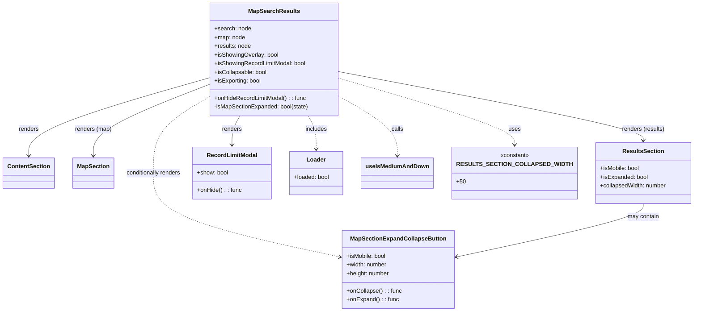

# Diagram: web/portal/src/components/map-search-results/MapSearchResults.js

> Auto-generated by Obscura crawlers

## Mermaid

### SVG

<svg id="container" width="1851.484375" xmlns="http://www.w3.org/2000/svg" class="classDiagram" height="860" viewBox="0 0 1851.484375 860" role="graphics-document document" aria-roledescription="class"><g><defs><marker id="container_class-aggregationStart" class="marker aggregation class" refX="18" refY="7" markerWidth="190" markerHeight="240" orient="auto"><path d="M 18,7 L9,13 L1,7 L9,1 Z"></path></marker></defs><defs><marker id="container_class-aggregationEnd" class="marker aggregation class" refX="1" refY="7" markerWidth="20" markerHeight="28" orient="auto"><path d="M 18,7 L9,13 L1,7 L9,1 Z"></path></marker></defs><defs><marker id="container_class-extensionStart" class="marker extension class" refX="18" refY="7" markerWidth="190" markerHeight="240" orient="auto"><path d="M 1,7 L18,13 V 1 Z"></path></marker></defs><defs><marker id="container_class-extensionEnd" class="marker extension class" refX="1" refY="7" markerWidth="20" markerHeight="28" orient="auto"><path d="M 1,1 V 13 L18,7 Z"></path></marker></defs><defs><marker id="container_class-compositionStart" class="marker composition class" refX="18" refY="7" markerWidth="190" markerHeight="240" orient="auto"><path d="M 18,7 L9,13 L1,7 L9,1 Z"></path></marker></defs><defs><marker id="container_class-compositionEnd" class="marker composition class" refX="1" refY="7" markerWidth="20" markerHeight="28" orient="auto"><path d="M 18,7 L9,13 L1,7 L9,1 Z"></path></marker></defs><defs><marker id="container_class-dependencyStart" class="marker dependency class" refX="6" refY="7" markerWidth="190" markerHeight="240" orient="auto"><path d="M 5,7 L9,13 L1,7 L9,1 Z"></path></marker></defs><defs><marker id="container_class-dependencyEnd" class="marker dependency class" refX="13" refY="7" markerWidth="20" markerHeight="28" orient="auto"><path d="M 18,7 L9,13 L14,7 L9,1 Z"></path></marker></defs><defs><marker id="container_class-lollipopStart" class="marker lollipop class" refX="13" refY="7" markerWidth="190" markerHeight="240" orient="auto"><circle stroke="black" fill="transparent" cx="7" cy="7" r="6"></circle></marker></defs><defs><marker id="container_class-lollipopEnd" class="marker lollipop class" refX="1" refY="7" markerWidth="190" markerHeight="240" orient="auto"><circle stroke="black" fill="transparent" cx="7" cy="7" r="6"></circle></marker></defs><g class="root"><g class="clusters"></g><g class="edgePaths"><path d="M574.104,214.555L491.128,238.296C408.152,262.036,242.201,309.518,159.226,345.426C76.25,381.333,76.25,405.667,76.25,417.833L76.25,430" id="id_MapSearchResults_ContentSection_1" class="edge-thickness-normal edge-pattern-solid relation" style=";;;" data-edge="true" data-et="edge" data-id="id_MapSearchResults_ContentSection_1" data-points="W3sieCI6NTc0LjEwMzUxNTYyNSwieSI6MjE0LjU1NDczNzQyNDI0NzI2fSx7IngiOjc2LjI1LCJ5IjozNTd9LHsieCI6NzYuMjUsInkiOjQzNn1d" marker-end="url(#container_class-dependencyEnd)"></path><path d="M574.104,232.014L519.987,252.845C465.871,273.676,357.639,315.338,303.522,348.336C249.406,381.333,249.406,405.667,249.406,417.833L249.406,430" id="id_MapSearchResults_MapSection_2" class="edge-thickness-normal edge-pattern-solid relation" style=";;;" data-edge="true" data-et="edge" data-id="id_MapSearchResults_MapSection_2" data-points="W3sieCI6NTc0LjEwMzUxNTYyNSwieSI6MjMyLjAxMzk4NDU5NzQ2NTY1fSx7IngiOjI0OS40MDYyNSwieSI6MzU3fSx7IngiOjI0OS40MDYyNSwieSI6NDM2fV0=" marker-end="url(#container_class-dependencyEnd)"></path><path d="M927.486,199.492L1058.177,225.743C1188.867,251.994,1450.248,304.497,1580.938,335.915C1711.629,367.333,1711.629,377.667,1711.629,382.833L1711.629,388" id="id_MapSearchResults_ResultsSection_3" class="edge-thickness-normal edge-pattern-solid relation" style=";;;" data-edge="true" data-et="edge" data-id="id_MapSearchResults_ResultsSection_3" data-points="W3sieCI6OTI3LjQ4NjMyODEyNSwieSI6MTk5LjQ5MTUwMjEzMzM1OTl9LHsieCI6MTcxMS42Mjg5MDYyNSwieSI6MzU3fSx7IngiOjE3MTEuNjI4OTA2MjUsInkiOjM5NH1d" marker-end="url(#container_class-dependencyEnd)"></path><path d="M657.496,320L653.808,326.167C650.12,332.333,642.743,344.667,639.055,358C635.367,371.333,635.367,385.667,635.367,392.833L635.367,400" id="id_MapSearchResults_RecordLimitModal_4" class="edge-thickness-normal edge-pattern-solid relation" style=";;;" data-edge="true" data-et="edge" data-id="id_MapSearchResults_RecordLimitModal_4" data-points="W3sieCI6NjU3LjQ5NTgyMDUxNDg5NjQsInkiOjMyMH0seyJ4Ijo2MzUuMzY3MTg3NSwieSI6MzU3fSx7IngiOjYzNS4zNjcxODc1LCJ5Ijo0MDZ9XQ==" marker-end="url(#container_class-dependencyEnd)"></path><path d="M844.094,320L847.782,326.167C851.47,332.333,858.846,344.667,862.535,360C866.223,375.333,866.223,393.667,866.223,402.833L866.223,412" id="id_MapSearchResults_Loader_5" class="edge-thickness-normal edge-pattern-dashed relation" style=";;;" data-edge="true" data-et="edge" data-id="id_MapSearchResults_Loader_5" data-points="W3sieCI6ODQ0LjA5NDAyMzIzNTEwMzYsInkiOjMyMH0seyJ4Ijo4NjYuMjIyNjU2MjUsInkiOjM1N30seyJ4Ijo4NjYuMjIyNjU2MjUsInkiOjQxOH1d" marker-end="url(#container_class-dependencyEnd)"></path><path d="M574.104,266.029L547.847,281.191C521.59,296.353,469.076,326.676,442.819,362.005C416.563,397.333,416.563,437.667,416.563,478C416.563,518.333,416.563,558.667,498.454,597.171C580.345,635.675,744.127,672.35,826.018,690.688L907.909,709.026" id="id_MapSearchResults_MapSectionExpandCollapseButton_6" class="edge-thickness-normal edge-pattern-dashed relation" style=";;;" data-edge="true" data-et="edge" data-id="id_MapSearchResults_MapSectionExpandCollapseButton_6" data-points="W3sieCI6NTc0LjEwMzUxNTYyNSwieSI6MjY2LjAyOTEyNDU2ODMwMzF9LHsieCI6NDE2LjU2MjUsInkiOjM1N30seyJ4Ijo0MTYuNTYyNSwieSI6NDc4fSx7IngiOjQxNi41NjI1LCJ5Ijo1OTl9LHsieCI6OTEzLjc2MzY3MTg3NSwieSI6NzEwLjMzNjYzODE0Mjk1MjN9XQ==" marker-end="url(#container_class-dependencyEnd)"></path><path d="M927.486,265.942L953.791,281.118C980.095,296.295,1032.704,326.647,1059.008,353.99C1085.313,381.333,1085.313,405.667,1085.313,417.833L1085.313,430" id="id_MapSearchResults_useIsMediumAndDown_7" class="edge-thickness-normal edge-pattern-dashed relation" style=";;;" data-edge="true" data-et="edge" data-id="id_MapSearchResults_useIsMediumAndDown_7" data-points="W3sieCI6OTI3LjQ4NjMyODEyNSwieSI6MjY1Ljk0MjE1MDgzNTIxNjN9LHsieCI6MTA4NS4zMTI1LCJ5IjozNTd9LHsieCI6MTA4NS4zMTI1LCJ5Ijo0MzZ9XQ==" marker-end="url(#container_class-dependencyEnd)"></path><path d="M1711.629,562L1711.629,568.167C1711.629,574.333,1711.629,586.667,1629.738,611.171C1547.847,635.675,1384.065,672.35,1302.174,690.688L1220.283,709.026" id="id_ResultsSection_MapSectionExpandCollapseButton_8" class="edge-thickness-normal edge-pattern-solid relation" style=";;;" data-edge="true" data-et="edge" data-id="id_ResultsSection_MapSectionExpandCollapseButton_8" data-points="W3sieCI6MTcxMS42Mjg5MDYyNSwieSI6NTYyfSx7IngiOjE3MTEuNjI4OTA2MjUsInkiOjU5OX0seyJ4IjoxMjE0LjQyNzczNDM3NSwieSI6NzEwLjMzNjYzODE0Mjk1MjN9XQ==" marker-end="url(#container_class-dependencyEnd)"></path><path d="M927.486,218.203L1002.895,241.336C1078.303,264.469,1229.12,310.734,1304.529,341.034C1379.938,371.333,1379.938,385.667,1379.938,392.833L1379.938,400" id="id_MapSearchResults_RESULTS_SECTION_COLLAPSED_WIDTH_9" class="edge-thickness-normal edge-pattern-dashed relation" style=";;;" data-edge="true" data-et="edge" data-id="id_MapSearchResults_RESULTS_SECTION_COLLAPSED_WIDTH_9" data-points="W3sieCI6OTI3LjQ4NjMyODEyNSwieSI6MjE4LjIwMzA0MTcxNDEzODQ2fSx7IngiOjEzNzkuOTM3NSwieSI6MzU3fSx7IngiOjEzNzkuOTM3NSwieSI6NDA2fV0=" marker-end="url(#container_class-dependencyEnd)"></path></g><g class="edgeLabels"><g class="edgeLabel" transform="translate(76.25, 357)"><g class="label" data-id="id_MapSearchResults_ContentSection_1" transform="translate(-27.75, -12)"><foreignObject width="55.5" height="24">

renders

</foreignObject></g></g><g class="edgeLabel" transform="translate(249.40625, 357)"><g class="label" data-id="id_MapSearchResults_MapSection_2" transform="translate(-51.015625, -12)"><foreignObject width="102.03125" height="24">

renders (map)

</foreignObject></g></g><g class="edgeLabel" transform="translate(1711.62890625, 357)"><g class="label" data-id="id_MapSearchResults_ResultsSection_3" transform="translate(-59.6171875, -12)"><foreignObject width="119.234375" height="24">

renders (results)

</foreignObject></g></g><g class="edgeLabel" transform="translate(635.3671875, 357)"><g class="label" data-id="id_MapSearchResults_RecordLimitModal_4" transform="translate(-27.75, -12)"><foreignObject width="55.5" height="24">

renders

</foreignObject></g></g><g class="edgeLabel" transform="translate(866.22265625, 357)"><g class="label" data-id="id_MapSearchResults_Loader_5" transform="translate(-30.6484375, -12)"><foreignObject width="61.296875" height="24">

includes

</foreignObject></g></g><g class="edgeLabel" transform="translate(416.5625, 478)"><g class="label" data-id="id_MapSearchResults_MapSectionExpandCollapseButton_6" transform="translate(-77.25, -12)"><foreignObject width="154.5" height="24">

conditionally renders

</foreignObject></g></g><g class="edgeLabel" transform="translate(1085.3125, 357)"><g class="label" data-id="id_MapSearchResults_useIsMediumAndDown_7" transform="translate(-16.4453125, -12)"><foreignObject width="32.890625" height="24">

calls

</foreignObject></g></g><g class="edgeLabel" transform="translate(1711.62890625, 599)"><g class="label" data-id="id_ResultsSection_MapSectionExpandCollapseButton_8" transform="translate(-44.296875, -12)"><foreignObject width="88.59375" height="24">

may contain

</foreignObject></g></g><g class="edgeLabel" transform="translate(1379.9375, 357)"><g class="label" data-id="id_MapSearchResults_RESULTS_SECTION_COLLAPSED_WIDTH_9" transform="translate(-16.4921875, -12)"><foreignObject width="32.984375" height="24">

uses

</foreignObject></g></g></g><g class="nodes"><g class="node default" id="classId-MapSearchResults-0" transform="translate(750.794921875, 164)"><g class="basic label-container"><path d="M-176.69140625 -156 L176.69140625 -156 L176.69140625 156 L-176.69140625 156" stroke="none" stroke-width="0" fill="#ECECFF" style=""></path><path d="M-176.69140625 -156 C-94.79804492031496 -156, -12.90468359062993 -156, 176.69140625 -156 M-176.69140625 -156 C-96.8411678612756 -156, -16.990929472551187 -156, 176.69140625 -156 M176.69140625 -156 C176.69140625 -50.950735537810914, 176.69140625 54.09852892437817, 176.69140625 156 M176.69140625 -156 C176.69140625 -83.10211737538462, 176.69140625 -10.204234750769245, 176.69140625 156 M176.69140625 156 C41.30230829968434 156, -94.08678965063132 156, -176.69140625 156 M176.69140625 156 C104.33179707216452 156, 31.97218789432904 156, -176.69140625 156 M-176.69140625 156 C-176.69140625 31.806198253708686, -176.69140625 -92.38760349258263, -176.69140625 -156 M-176.69140625 156 C-176.69140625 81.37479036313319, -176.69140625 6.749580726266373, -176.69140625 -156" stroke="#9370DB" stroke-width="1.3" fill="none" stroke-dasharray="0 0" style=""></path></g><g class="annotation-group text" transform="translate(0, -132)"></g><g class="label-group text" transform="translate(-67.1640625, -132)"><g class="label" style="font-weight: bolder" transform="translate(0,-12)"><foreignObject width="134.328125" height="24">

MapSearchResults

</foreignObject></g></g><g class="members-group text" transform="translate(-164.69140625, -84)"><g class="label" style="" transform="translate(0,-12)"><foreignObject width="100.53125" height="24">

+search: node

</foreignObject></g><g class="label" style="" transform="translate(0,12)"><foreignObject width="85" height="24">

+map: node

</foreignObject></g><g class="label" style="" transform="translate(0,36)"><foreignObject width="102.21875" height="24">

+results: node

</foreignObject></g><g class="label" style="" transform="translate(0,60)"><foreignObject width="176.84375" height="24">

+isShowingOverlay: bool

</foreignObject></g><g class="label" style="" transform="translate(0,84)"><foreignObject width="253.390625" height="24">

+isShowingRecordLimitModal: bool

</foreignObject></g><g class="label" style="" transform="translate(0,108)"><foreignObject width="145.265625" height="24">

+isCollapsable: bool

</foreignObject></g><g class="label" style="" transform="translate(0,132)"><foreignObject width="130.265625" height="24">

+isExporting: bool

</foreignObject></g></g><g class="methods-group text" transform="translate(-164.69140625, 108)"><g class="label" style="" transform="translate(0,-12)"><foreignObject width="254.03125" height="24">

+onHideRecordLimitModal() : : func

</foreignObject></g><g class="label" style="" transform="translate(0,12)"><foreignObject width="262.21875" height="24">

-isMapSectionExpanded: bool(state)

</foreignObject></g></g><g class="divider" style=""><path d="M-176.69140625 -108 C-84.30244543104243 -108, 8.086515387915142 -108, 176.69140625 -108 M-176.69140625 -108 C-83.0291480391316 -108, 10.633110171736803 -108, 176.69140625 -108" stroke="#9370DB" stroke-width="1.3" fill="none" stroke-dasharray="0 0" style=""></path></g><g class="divider" style=""><path d="M-176.69140625 84 C-64.72257376577035 84, 47.2462587184593 84, 176.69140625 84 M-176.69140625 84 C-40.89862099791765 84, 94.8941642541647 84, 176.69140625 84" stroke="#9370DB" stroke-width="1.3" fill="none" stroke-dasharray="0 0" style=""></path></g></g><g class="node default" id="classId-ContentSection-1" transform="translate(76.25, 478)"><g class="basic label-container"><path d="M-68.25 -42 L68.25 -42 L68.25 42 L-68.25 42" stroke="none" stroke-width="0" fill="#ECECFF" style=""></path><path d="M-68.25 -42 C-18.807158115250083 -42, 30.635683769499835 -42, 68.25 -42 M-68.25 -42 C-20.045304427841828 -42, 28.159391144316345 -42, 68.25 -42 M68.25 -42 C68.25 -16.678398034202026, 68.25 8.643203931595949, 68.25 42 M68.25 -42 C68.25 -12.028944577796302, 68.25 17.942110844407395, 68.25 42 M68.25 42 C25.743661254750812 42, -16.762677490498376 42, -68.25 42 M68.25 42 C34.39814275168525 42, 0.5462855033704983 42, -68.25 42 M-68.25 42 C-68.25 13.925928497873969, -68.25 -14.148143004252063, -68.25 -42 M-68.25 42 C-68.25 10.406010601221361, -68.25 -21.187978797557278, -68.25 -42" stroke="#9370DB" stroke-width="1.3" fill="none" stroke-dasharray="0 0" style=""></path></g><g class="annotation-group text" transform="translate(0, -18)"></g><g class="label-group text" transform="translate(-56.25, -18)"><g class="label" style="font-weight: bolder" transform="translate(0,-12)"><foreignObject width="112.5" height="24">

ContentSection

</foreignObject></g></g><g class="members-group text" transform="translate(-56.25, 30)"></g><g class="methods-group text" transform="translate(-56.25, 60)"></g><g class="divider" style=""><path d="M-68.25 6 C-22.29918255675075 6, 23.6516348864985 6, 68.25 6 M-68.25 6 C-27.841888677681737 6, 12.566222644636525 6, 68.25 6" stroke="#9370DB" stroke-width="1.3" fill="none" stroke-dasharray="0 0" style=""></path></g><g class="divider" style=""><path d="M-68.25 24 C-27.012357767777182 24, 14.225284464445636 24, 68.25 24 M-68.25 24 C-23.333257098411096 24, 21.58348580317781 24, 68.25 24" stroke="#9370DB" stroke-width="1.3" fill="none" stroke-dasharray="0 0" style=""></path></g></g><g class="node default" id="classId-MapSection-2" transform="translate(249.40625, 478)"><g class="basic label-container"><path d="M-54.90625 -42 L54.90625 -42 L54.90625 42 L-54.90625 42" stroke="none" stroke-width="0" fill="#ECECFF" style=""></path><path d="M-54.90625 -42 C-26.56916602264585 -42, 1.7679179547083024 -42, 54.90625 -42 M-54.90625 -42 C-29.953593501266468 -42, -5.000937002532936 -42, 54.90625 -42 M54.90625 -42 C54.90625 -24.69982197348814, 54.90625 -7.399643946976283, 54.90625 42 M54.90625 -42 C54.90625 -23.402955481201836, 54.90625 -4.805910962403672, 54.90625 42 M54.90625 42 C22.757499788403344 42, -9.391250423193313 42, -54.90625 42 M54.90625 42 C28.162500945609228 42, 1.4187518912184558 42, -54.90625 42 M-54.90625 42 C-54.90625 23.137490470758507, -54.90625 4.274980941517015, -54.90625 -42 M-54.90625 42 C-54.90625 18.691643078538938, -54.90625 -4.616713842922124, -54.90625 -42" stroke="#9370DB" stroke-width="1.3" fill="none" stroke-dasharray="0 0" style=""></path></g><g class="annotation-group text" transform="translate(0, -18)"></g><g class="label-group text" transform="translate(-42.90625, -18)"><g class="label" style="font-weight: bolder" transform="translate(0,-12)"><foreignObject width="85.8125" height="24">

MapSection

</foreignObject></g></g><g class="members-group text" transform="translate(-42.90625, 30)"></g><g class="methods-group text" transform="translate(-42.90625, 60)"></g><g class="divider" style=""><path d="M-54.90625 6 C-32.66810562006238 6, -10.429961240124754 6, 54.90625 6 M-54.90625 6 C-21.293444498942762 6, 12.319361002114476 6, 54.90625 6" stroke="#9370DB" stroke-width="1.3" fill="none" stroke-dasharray="0 0" style=""></path></g><g class="divider" style=""><path d="M-54.90625 24 C-24.423725881341877 24, 6.058798237316246 24, 54.90625 24 M-54.90625 24 C-22.947302601633773 24, 9.011644796732455 24, 54.90625 24" stroke="#9370DB" stroke-width="1.3" fill="none" stroke-dasharray="0 0" style=""></path></g></g><g class="node default" id="classId-ResultsSection-3" transform="translate(1711.62890625, 478)"><g class="basic label-container"><path d="M-131.85546875 -84 L131.85546875 -84 L131.85546875 84 L-131.85546875 84" stroke="none" stroke-width="0" fill="#ECECFF" style=""></path><path d="M-131.85546875 -84 C-38.92764976760361 -84, 54.00016921479278 -84, 131.85546875 -84 M-131.85546875 -84 C-39.962093820086196 -84, 51.93128110982761 -84, 131.85546875 -84 M131.85546875 -84 C131.85546875 -23.604348222713547, 131.85546875 36.791303554572906, 131.85546875 84 M131.85546875 -84 C131.85546875 -49.16614002919411, 131.85546875 -14.332280058388221, 131.85546875 84 M131.85546875 84 C65.15482034290716 84, -1.5458280641856845 84, -131.85546875 84 M131.85546875 84 C66.56429506583052 84, 1.273121381661042 84, -131.85546875 84 M-131.85546875 84 C-131.85546875 49.12326576525243, -131.85546875 14.246531530504853, -131.85546875 -84 M-131.85546875 84 C-131.85546875 21.487309052793115, -131.85546875 -41.02538189441377, -131.85546875 -84" stroke="#9370DB" stroke-width="1.3" fill="none" stroke-dasharray="0 0" style=""></path></g><g class="annotation-group text" transform="translate(0, -60)"></g><g class="label-group text" transform="translate(-54.4609375, -60)"><g class="label" style="font-weight: bolder" transform="translate(0,-12)"><foreignObject width="108.921875" height="24">

ResultsSection

</foreignObject></g></g><g class="members-group text" transform="translate(-119.85546875, -12)"><g class="label" style="" transform="translate(0,-12)"><foreignObject width="110.078125" height="24">

+isMobile: bool

</foreignObject></g><g class="label" style="" transform="translate(0,12)"><foreignObject width="132.53125" height="24">

+isExpanded: bool

</foreignObject></g><g class="label" style="" transform="translate(0,36)"><foreignObject width="185.25" height="24">

+collapsedWidth: number

</foreignObject></g></g><g class="methods-group text" transform="translate(-119.85546875, 84)"></g><g class="divider" style=""><path d="M-131.85546875 -36 C-39.47747024069115 -36, 52.900528268617705 -36, 131.85546875 -36 M-131.85546875 -36 C-73.13678994545575 -36, -14.418111140911492 -36, 131.85546875 -36" stroke="#9370DB" stroke-width="1.3" fill="none" stroke-dasharray="0 0" style=""></path></g><g class="divider" style=""><path d="M-131.85546875 60 C-42.00297806612906 60, 47.84951261774188 60, 131.85546875 60 M-131.85546875 60 C-34.09841765518884 60, 63.65863343962232 60, 131.85546875 60" stroke="#9370DB" stroke-width="1.3" fill="none" stroke-dasharray="0 0" style=""></path></g></g><g class="node default" id="classId-RecordLimitModal-4" transform="translate(635.3671875, 478)"><g class="basic label-container"><path d="M-106.5546875 -72 L106.5546875 -72 L106.5546875 72 L-106.5546875 72" stroke="none" stroke-width="0" fill="#ECECFF" style=""></path><path d="M-106.5546875 -72 C-55.212316327136804 -72, -3.8699451542736085 -72, 106.5546875 -72 M-106.5546875 -72 C-25.020757214766462 -72, 56.513173070467076 -72, 106.5546875 -72 M106.5546875 -72 C106.5546875 -18.110753872973362, 106.5546875 35.778492254053276, 106.5546875 72 M106.5546875 -72 C106.5546875 -29.083042644373123, 106.5546875 13.833914711253755, 106.5546875 72 M106.5546875 72 C38.97430171746029 72, -28.606084065079415 72, -106.5546875 72 M106.5546875 72 C47.40639413372291 72, -11.741899232554175 72, -106.5546875 72 M-106.5546875 72 C-106.5546875 38.63979613475008, -106.5546875 5.2795922695001565, -106.5546875 -72 M-106.5546875 72 C-106.5546875 18.198146002392384, -106.5546875 -35.60370799521523, -106.5546875 -72" stroke="#9370DB" stroke-width="1.3" fill="none" stroke-dasharray="0 0" style=""></path></g><g class="annotation-group text" transform="translate(0, -48)"></g><g class="label-group text" transform="translate(-66.25, -48)"><g class="label" style="font-weight: bolder" transform="translate(0,-12)"><foreignObject width="132.5" height="24">

RecordLimitModal

</foreignObject></g></g><g class="members-group text" transform="translate(-94.5546875, 0)"><g class="label" style="" transform="translate(0,-12)"><foreignObject width="86.6875" height="24">

+show: bool

</foreignObject></g></g><g class="methods-group text" transform="translate(-94.5546875, 48)"><g class="label" style="" transform="translate(0,-12)"><foreignObject width="122.859375" height="24">

+onHide() : : func

</foreignObject></g></g><g class="divider" style=""><path d="M-106.5546875 -24 C-56.248766584413524 -24, -5.942845668827047 -24, 106.5546875 -24 M-106.5546875 -24 C-61.603926104060626 -24, -16.653164708121253 -24, 106.5546875 -24" stroke="#9370DB" stroke-width="1.3" fill="none" stroke-dasharray="0 0" style=""></path></g><g class="divider" style=""><path d="M-106.5546875 24 C-63.37211338666704 24, -20.189539273334077 24, 106.5546875 24 M-106.5546875 24 C-34.33423683546688 24, 37.886213829066236 24, 106.5546875 24" stroke="#9370DB" stroke-width="1.3" fill="none" stroke-dasharray="0 0" style=""></path></g></g><g class="node default" id="classId-MapSectionExpandCollapseButton-5" transform="translate(1064.095703125, 744)"><g class="basic label-container"><path d="M-150.33203125 -108 L150.33203125 -108 L150.33203125 108 L-150.33203125 108" stroke="none" stroke-width="0" fill="#ECECFF" style=""></path><path d="M-150.33203125 -108 C-45.68295630063419 -108, 58.96611864873162 -108, 150.33203125 -108 M-150.33203125 -108 C-89.87286486621113 -108, -29.413698482422262 -108, 150.33203125 -108 M150.33203125 -108 C150.33203125 -54.52664029112674, 150.33203125 -1.0532805822534783, 150.33203125 108 M150.33203125 -108 C150.33203125 -57.17809684748279, 150.33203125 -6.356193694965583, 150.33203125 108 M150.33203125 108 C39.14742213855092 108, -72.03718697289816 108, -150.33203125 108 M150.33203125 108 C60.3843150636789 108, -29.563401122642205 108, -150.33203125 108 M-150.33203125 108 C-150.33203125 45.29090915715424, -150.33203125 -17.418181685691522, -150.33203125 -108 M-150.33203125 108 C-150.33203125 30.595726567012676, -150.33203125 -46.80854686597465, -150.33203125 -108" stroke="#9370DB" stroke-width="1.3" fill="none" stroke-dasharray="0 0" style=""></path></g><g class="annotation-group text" transform="translate(0, -84)"></g><g class="label-group text" transform="translate(-125.8046875, -84)"><g class="label" style="font-weight: bolder" transform="translate(0,-12)"><foreignObject width="251.609375" height="24">

MapSectionExpandCollapseButton

</foreignObject></g></g><g class="members-group text" transform="translate(-138.33203125, -36)"><g class="label" style="" transform="translate(0,-12)"><foreignObject width="110.078125" height="24">

+isMobile: bool

</foreignObject></g><g class="label" style="" transform="translate(0,12)"><foreignObject width="113.578125" height="24">

+width: number

</foreignObject></g><g class="label" style="" transform="translate(0,36)"><foreignObject width="119.015625" height="24">

+height: number

</foreignObject></g></g><g class="methods-group text" transform="translate(-138.33203125, 60)"><g class="label" style="" transform="translate(0,-12)"><foreignObject width="150.859375" height="24">

+onCollapse() : : func

</foreignObject></g><g class="label" style="" transform="translate(0,12)"><foreignObject width="142.484375" height="24">

+onExpand() : : func

</foreignObject></g></g><g class="divider" style=""><path d="M-150.33203125 -60 C-37.325909673131676 -60, 75.68021190373665 -60, 150.33203125 -60 M-150.33203125 -60 C-71.49509105444932 -60, 7.341849141101363 -60, 150.33203125 -60" stroke="#9370DB" stroke-width="1.3" fill="none" stroke-dasharray="0 0" style=""></path></g><g class="divider" style=""><path d="M-150.33203125 36 C-57.610919425402 36, 35.110192399195995 36, 150.33203125 36 M-150.33203125 36 C-57.16839680088057 36, 35.995237648238856 36, 150.33203125 36" stroke="#9370DB" stroke-width="1.3" fill="none" stroke-dasharray="0 0" style=""></path></g></g><g class="node default" id="classId-Loader-6" transform="translate(866.22265625, 478)"><g class="basic label-container"><path d="M-74.30078125 -60 L74.30078125 -60 L74.30078125 60 L-74.30078125 60" stroke="none" stroke-width="0" fill="#ECECFF" style=""></path><path d="M-74.30078125 -60 C-29.181683094563382 -60, 15.937415060873235 -60, 74.30078125 -60 M-74.30078125 -60 C-24.01474745761844 -60, 26.27128633476312 -60, 74.30078125 -60 M74.30078125 -60 C74.30078125 -15.508878835887238, 74.30078125 28.982242328225524, 74.30078125 60 M74.30078125 -60 C74.30078125 -26.722602772766386, 74.30078125 6.554794454467228, 74.30078125 60 M74.30078125 60 C35.313512320631936 60, -3.6737566087361273 60, -74.30078125 60 M74.30078125 60 C17.21960315213876 60, -39.86157494572248 60, -74.30078125 60 M-74.30078125 60 C-74.30078125 27.711722834669793, -74.30078125 -4.576554330660414, -74.30078125 -60 M-74.30078125 60 C-74.30078125 33.431065267404534, -74.30078125 6.862130534809069, -74.30078125 -60" stroke="#9370DB" stroke-width="1.3" fill="none" stroke-dasharray="0 0" style=""></path></g><g class="annotation-group text" transform="translate(0, -36)"></g><g class="label-group text" transform="translate(-25.3046875, -36)"><g class="label" style="font-weight: bolder" transform="translate(0,-12)"><foreignObject width="50.609375" height="24">

Loader

</foreignObject></g></g><g class="members-group text" transform="translate(-62.30078125, 12)"><g class="label" style="" transform="translate(0,-12)"><foreignObject width="99.296875" height="24">

+loaded: bool

</foreignObject></g></g><g class="methods-group text" transform="translate(-62.30078125, 60)"></g><g class="divider" style=""><path d="M-74.30078125 -12 C-31.077033351647742 -12, 12.146714546704516 -12, 74.30078125 -12 M-74.30078125 -12 C-16.37614769104355 -12, 41.5484858679129 -12, 74.30078125 -12" stroke="#9370DB" stroke-width="1.3" fill="none" stroke-dasharray="0 0" style=""></path></g><g class="divider" style=""><path d="M-74.30078125 36 C-30.844217974617933 36, 12.612345300764133 36, 74.30078125 36 M-74.30078125 36 C-30.762553547055987 36, 12.775674155888026 36, 74.30078125 36" stroke="#9370DB" stroke-width="1.3" fill="none" stroke-dasharray="0 0" style=""></path></g></g><g class="node default" id="classId-useIsMediumAndDown-7" transform="translate(1085.3125, 478)"><g class="basic label-container"><path d="M-94.7890625 -42 L94.7890625 -42 L94.7890625 42 L-94.7890625 42" stroke="none" stroke-width="0" fill="#ECECFF" style=""></path><path d="M-94.7890625 -42 C-51.69821911112821 -42, -8.607375722256421 -42, 94.7890625 -42 M-94.7890625 -42 C-50.50335638363467 -42, -6.217650267269335 -42, 94.7890625 -42 M94.7890625 -42 C94.7890625 -12.344992301379467, 94.7890625 17.310015397241067, 94.7890625 42 M94.7890625 -42 C94.7890625 -10.170765654422954, 94.7890625 21.65846869115409, 94.7890625 42 M94.7890625 42 C35.3798965760701 42, -24.029269347859795 42, -94.7890625 42 M94.7890625 42 C53.97367437828201 42, 13.158286256564026 42, -94.7890625 42 M-94.7890625 42 C-94.7890625 17.782498174317706, -94.7890625 -6.435003651364589, -94.7890625 -42 M-94.7890625 42 C-94.7890625 24.33248998145508, -94.7890625 6.664979962910159, -94.7890625 -42" stroke="#9370DB" stroke-width="1.3" fill="none" stroke-dasharray="0 0" style=""></path></g><g class="annotation-group text" transform="translate(0, -18)"></g><g class="label-group text" transform="translate(-82.7890625, -18)"><g class="label" style="font-weight: bolder" transform="translate(0,-12)"><foreignObject width="165.578125" height="24">

useIsMediumAndDown

</foreignObject></g></g><g class="members-group text" transform="translate(-82.7890625, 30)"></g><g class="methods-group text" transform="translate(-82.7890625, 60)"></g><g class="divider" style=""><path d="M-94.7890625 6 C-50.14624748291864 6, -5.503432465837278 6, 94.7890625 6 M-94.7890625 6 C-28.871071609910786 6, 37.04691928017843 6, 94.7890625 6" stroke="#9370DB" stroke-width="1.3" fill="none" stroke-dasharray="0 0" style=""></path></g><g class="divider" style=""><path d="M-94.7890625 24 C-51.87844682023838 24, -8.967831140476761 24, 94.7890625 24 M-94.7890625 24 C-25.43340964859614 24, 43.92224320280772 24, 94.7890625 24" stroke="#9370DB" stroke-width="1.3" fill="none" stroke-dasharray="0 0" style=""></path></g></g><g class="node default" id="classId-RESULTS_SECTION_COLLAPSED_WIDTH-8" transform="translate(1379.9375, 478)"><g class="basic label-container"><path d="M-149.8359375 -72 L149.8359375 -72 L149.8359375 72 L-149.8359375 72" stroke="none" stroke-width="0" fill="#ECECFF" style=""></path><path d="M-149.8359375 -72 C-42.5727429791705 -72, 64.690451541659 -72, 149.8359375 -72 M-149.8359375 -72 C-57.73366382113916 -72, 34.36860985772168 -72, 149.8359375 -72 M149.8359375 -72 C149.8359375 -30.643487656431873, 149.8359375 10.713024687136254, 149.8359375 72 M149.8359375 -72 C149.8359375 -42.7219719425659, 149.8359375 -13.443943885131809, 149.8359375 72 M149.8359375 72 C71.99663803198754 72, -5.842661436024912 72, -149.8359375 72 M149.8359375 72 C73.02034734578672 72, -3.795242808426565 72, -149.8359375 72 M-149.8359375 72 C-149.8359375 27.822568118281417, -149.8359375 -16.354863763437166, -149.8359375 -72 M-149.8359375 72 C-149.8359375 14.526329917619535, -149.8359375 -42.94734016476093, -149.8359375 -72" stroke="#9370DB" stroke-width="1.3" fill="none" stroke-dasharray="0 0" style=""></path></g><g class="annotation-group text" transform="translate(-40.4921875, -48)"><g class="label" style="" transform="translate(0,-12)"><foreignObject width="80.984375" height="24">

«constant»

</foreignObject></g></g><g class="label-group text" transform="translate(-137.8359375, -24)"><g class="label" style="font-weight: bolder" transform="translate(0,-12)"><foreignObject width="275.671875" height="24">

RESULTS_SECTION_COLLAPSED_WIDTH

</foreignObject></g></g><g class="members-group text" transform="translate(-137.8359375, 24)"><g class="label" style="" transform="translate(0,-12)"><foreignObject width="24.78125" height="24">

+50

</foreignObject></g></g><g class="methods-group text" transform="translate(-137.8359375, 72)"></g><g class="divider" style=""><path d="M-149.8359375 0 C-84.74200968381543 0, -19.64808186763085 0, 149.8359375 0 M-149.8359375 0 C-52.11748964397822 0, 45.600958212043565 0, 149.8359375 0" stroke="#9370DB" stroke-width="1.3" fill="none" stroke-dasharray="0 0" style=""></path></g><g class="divider" style=""><path d="M-149.8359375 48 C-87.93110189321311 48, -26.026266286426207 48, 149.8359375 48 M-149.8359375 48 C-70.50219249741691 48, 8.831552505166172 48, 149.8359375 48" stroke="#9370DB" stroke-width="1.3" fill="none" stroke-dasharray="0 0" style=""></path></g></g></g></g></g></svg>
