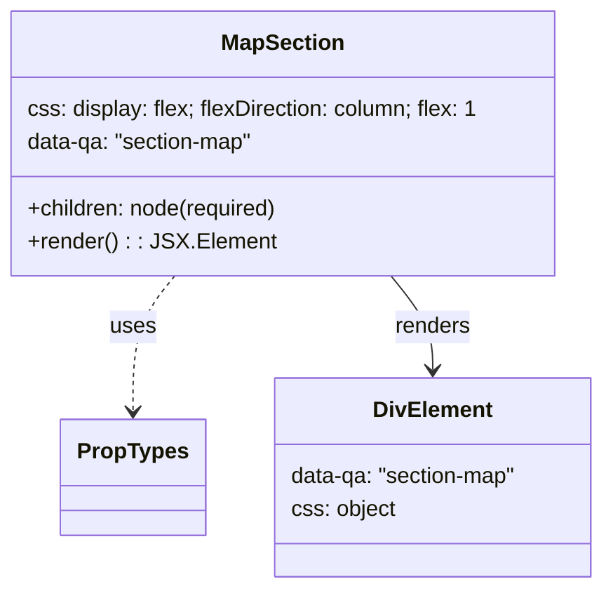

# Diagram: web/portal/src/components/map-search-results/MapSection.js

> Auto-generated by Obscura crawlers

## Mermaid

### SVG

<svg id="container" width="438.7421875" xmlns="http://www.w3.org/2000/svg" class="classDiagram" height="426" viewBox="0 0 438.7421875 426" role="graphics-document document" aria-roledescription="class"><g><defs><marker id="container_class-aggregationStart" class="marker aggregation class" refX="18" refY="7" markerWidth="190" markerHeight="240" orient="auto"><path d="M 18,7 L9,13 L1,7 L9,1 Z"></path></marker></defs><defs><marker id="container_class-aggregationEnd" class="marker aggregation class" refX="1" refY="7" markerWidth="20" markerHeight="28" orient="auto"><path d="M 18,7 L9,13 L1,7 L9,1 Z"></path></marker></defs><defs><marker id="container_class-extensionStart" class="marker extension class" refX="18" refY="7" markerWidth="190" markerHeight="240" orient="auto"><path d="M 1,7 L18,13 V 1 Z"></path></marker></defs><defs><marker id="container_class-extensionEnd" class="marker extension class" refX="1" refY="7" markerWidth="20" markerHeight="28" orient="auto"><path d="M 1,1 V 13 L18,7 Z"></path></marker></defs><defs><marker id="container_class-compositionStart" class="marker composition class" refX="18" refY="7" markerWidth="190" markerHeight="240" orient="auto"><path d="M 18,7 L9,13 L1,7 L9,1 Z"></path></marker></defs><defs><marker id="container_class-compositionEnd" class="marker composition class" refX="1" refY="7" markerWidth="20" markerHeight="28" orient="auto"><path d="M 18,7 L9,13 L1,7 L9,1 Z"></path></marker></defs><defs><marker id="container_class-dependencyStart" class="marker dependency class" refX="6" refY="7" markerWidth="190" markerHeight="240" orient="auto"><path d="M 5,7 L9,13 L1,7 L9,1 Z"></path></marker></defs><defs><marker id="container_class-dependencyEnd" class="marker dependency class" refX="13" refY="7" markerWidth="20" markerHeight="28" orient="auto"><path d="M 18,7 L9,13 L14,7 L9,1 Z"></path></marker></defs><defs><marker id="container_class-lollipopStart" class="marker lollipop class" refX="13" refY="7" markerWidth="190" markerHeight="240" orient="auto"><circle stroke="black" fill="transparent" cx="7" cy="7" r="6"></circle></marker></defs><defs><marker id="container_class-lollipopEnd" class="marker lollipop class" refX="1" refY="7" markerWidth="190" markerHeight="240" orient="auto"><circle stroke="black" fill="transparent" cx="7" cy="7" r="6"></circle></marker></defs><g class="root"><g class="clusters"></g><g class="edgePaths"><path d="M126.428,200L121.388,206.167C116.348,212.333,106.268,224.667,101.228,241C96.188,257.333,96.188,277.667,96.188,287.833L96.188,298" id="id_MapSection_PropTypes_1" class="edge-thickness-normal edge-pattern-dashed relation" style=";;;" data-edge="true" data-et="edge" data-id="id_MapSection_PropTypes_1" data-points="W3sieCI6MTI2LjQyODIxODk4NDk2MjQsInkiOjIwMH0seyJ4Ijo5Ni4xODc1LCJ5IjoyMzd9LHsieCI6OTYuMTg3NSwieSI6MzA0fV0=" marker-end="url(#container_class-dependencyEnd)"></path><path d="M283.353,200L288.393,206.167C293.433,212.333,303.514,224.667,308.554,236C313.594,247.333,313.594,257.667,313.594,262.833L313.594,268" id="id_MapSection_DivElement_2" class="edge-thickness-normal edge-pattern-solid relation" style=";;;" data-edge="true" data-et="edge" data-id="id_MapSection_DivElement_2" data-points="W3sieCI6MjgzLjM1MzAzMTAxNTAzNzYsInkiOjIwMH0seyJ4IjozMTMuNTkzNzUsInkiOjIzN30seyJ4IjozMTMuNTkzNzUsInkiOjI3NH1d" marker-end="url(#container_class-dependencyEnd)"></path></g><g class="edgeLabels"><g class="edgeLabel" transform="translate(96.1875, 237)"><g class="label" data-id="id_MapSection_PropTypes_1" transform="translate(-16.4921875, -12)"><foreignObject width="32.984375" height="24">

uses

</foreignObject></g></g><g class="edgeLabel" transform="translate(313.59375, 237)"><g class="label" data-id="id_MapSection_DivElement_2" transform="translate(-27.75, -12)"><foreignObject width="55.5" height="24">

renders

</foreignObject></g></g></g><g class="nodes"><g class="node default" id="classId-MapSection-0" transform="translate(204.890625, 104)"><g class="basic label-container"><path d="M-196.890625 -96 L196.890625 -96 L196.890625 96 L-196.890625 96" stroke="none" stroke-width="0" fill="#ECECFF" style=""></path><path d="M-196.890625 -96 C-99.16096061820704 -96, -1.4312962364140844 -96, 196.890625 -96 M-196.890625 -96 C-101.22906983645768 -96, -5.567514672915365 -96, 196.890625 -96 M196.890625 -96 C196.890625 -37.423133592943074, 196.890625 21.15373281411385, 196.890625 96 M196.890625 -96 C196.890625 -26.21389413104626, 196.890625 43.57221173790748, 196.890625 96 M196.890625 96 C106.47035777690363 96, 16.05009055380725 96, -196.890625 96 M196.890625 96 C47.2059091886222 96, -102.4788066227556 96, -196.890625 96 M-196.890625 96 C-196.890625 34.38792459607278, -196.890625 -27.224150807854443, -196.890625 -96 M-196.890625 96 C-196.890625 19.65007158960843, -196.890625 -56.69985682078314, -196.890625 -96" stroke="#9370DB" stroke-width="1.3" fill="none" stroke-dasharray="0 0" style=""></path></g><g class="annotation-group text" transform="translate(0, -72)"></g><g class="label-group text" transform="translate(-42.90625, -72)"><g class="label" style="font-weight: bolder" transform="translate(0,-12)"><foreignObject width="85.8125" height="24">

MapSection

</foreignObject></g></g><g class="members-group text" transform="translate(-184.890625, -24)"><g class="label" style="" transform="translate(0,-12)"><foreignObject width="326.875" height="24">

css: display: flex; flexDirection: column; flex: 1

</foreignObject></g><g class="label" style="" transform="translate(0,12)"><foreignObject width="168.953125" height="24">

data-qa: "section-map"

</foreignObject></g></g><g class="methods-group text" transform="translate(-184.890625, 48)"><g class="label" style="" transform="translate(0,-12)"><foreignObject width="184.75" height="24">

+children: node(required)

</foreignObject></g><g class="label" style="" transform="translate(0,12)"><foreignObject width="172.34375" height="24">

+render() : : JSX.Element

</foreignObject></g></g><g class="divider" style=""><path d="M-196.890625 -48 C-66.91474550120671 -48, 63.06113399758658 -48, 196.890625 -48 M-196.890625 -48 C-74.26057178488352 -48, 48.36948143023295 -48, 196.890625 -48" stroke="#9370DB" stroke-width="1.3" fill="none" stroke-dasharray="0 0" style=""></path></g><g class="divider" style=""><path d="M-196.890625 24 C-101.91239671988002 24, -6.934168439760043 24, 196.890625 24 M-196.890625 24 C-44.03479903107316 24, 108.82102693785367 24, 196.890625 24" stroke="#9370DB" stroke-width="1.3" fill="none" stroke-dasharray="0 0" style=""></path></g></g><g class="node default" id="classId-PropTypes-1" transform="translate(96.1875, 346)"><g class="basic label-container"><path d="M-50.2578125 -42 L50.2578125 -42 L50.2578125 42 L-50.2578125 42" stroke="none" stroke-width="0" fill="#ECECFF" style=""></path><path d="M-50.2578125 -42 C-12.707309948468676 -42, 24.843192603062647 -42, 50.2578125 -42 M-50.2578125 -42 C-15.937928238970692 -42, 18.381956022058617 -42, 50.2578125 -42 M50.2578125 -42 C50.2578125 -11.793938768601762, 50.2578125 18.412122462796475, 50.2578125 42 M50.2578125 -42 C50.2578125 -10.706992938936203, 50.2578125 20.586014122127594, 50.2578125 42 M50.2578125 42 C12.37851559051451 42, -25.50078131897098 42, -50.2578125 42 M50.2578125 42 C20.288168216566817 42, -9.681476066866367 42, -50.2578125 42 M-50.2578125 42 C-50.2578125 12.269378011703864, -50.2578125 -17.46124397659227, -50.2578125 -42 M-50.2578125 42 C-50.2578125 21.28722214861344, -50.2578125 0.5744442972268828, -50.2578125 -42" stroke="#9370DB" stroke-width="1.3" fill="none" stroke-dasharray="0 0" style=""></path></g><g class="annotation-group text" transform="translate(0, -18)"></g><g class="label-group text" transform="translate(-38.2578125, -18)"><g class="label" style="font-weight: bolder" transform="translate(0,-12)"><foreignObject width="76.515625" height="24">

PropTypes

</foreignObject></g></g><g class="members-group text" transform="translate(-38.2578125, 30)"></g><g class="methods-group text" transform="translate(-38.2578125, 60)"></g><g class="divider" style=""><path d="M-50.2578125 6 C-12.482384415268406 6, 25.293043669463188 6, 50.2578125 6 M-50.2578125 6 C-12.307697244110336 6, 25.642418011779327 6, 50.2578125 6" stroke="#9370DB" stroke-width="1.3" fill="none" stroke-dasharray="0 0" style=""></path></g><g class="divider" style=""><path d="M-50.2578125 24 C-12.52157594531019 24, 25.21466060937962 24, 50.2578125 24 M-50.2578125 24 C-23.945294748411293 24, 2.367223003177415 24, 50.2578125 24" stroke="#9370DB" stroke-width="1.3" fill="none" stroke-dasharray="0 0" style=""></path></g></g><g class="node default" id="classId-DivElement-2" transform="translate(313.59375, 346)"><g class="basic label-container"><path d="M-117.1484375 -72 L117.1484375 -72 L117.1484375 72 L-117.1484375 72" stroke="none" stroke-width="0" fill="#ECECFF" style=""></path><path d="M-117.1484375 -72 C-43.72177879113717 -72, 29.704879917725663 -72, 117.1484375 -72 M-117.1484375 -72 C-53.22925484106976 -72, 10.689927817860479 -72, 117.1484375 -72 M117.1484375 -72 C117.1484375 -31.496881863873227, 117.1484375 9.006236272253545, 117.1484375 72 M117.1484375 -72 C117.1484375 -36.98102031861463, 117.1484375 -1.962040637229265, 117.1484375 72 M117.1484375 72 C40.39571318905092 72, -36.357011121898154 72, -117.1484375 72 M117.1484375 72 C44.614724537271144 72, -27.918988425457712 72, -117.1484375 72 M-117.1484375 72 C-117.1484375 41.498071114327416, -117.1484375 10.996142228654833, -117.1484375 -72 M-117.1484375 72 C-117.1484375 18.276157999306804, -117.1484375 -35.44768400138639, -117.1484375 -72" stroke="#9370DB" stroke-width="1.3" fill="none" stroke-dasharray="0 0" style=""></path></g><g class="annotation-group text" transform="translate(0, -48)"></g><g class="label-group text" transform="translate(-41.34375, -48)"><g class="label" style="font-weight: bolder" transform="translate(0,-12)"><foreignObject width="82.6875" height="24">

DivElement

</foreignObject></g></g><g class="members-group text" transform="translate(-105.1484375, 0)"><g class="label" style="" transform="translate(0,-12)"><foreignObject width="168.953125" height="24">

data-qa: "section-map"

</foreignObject></g><g class="label" style="" transform="translate(0,12)"><foreignObject width="75.984375" height="24">

css: object

</foreignObject></g></g><g class="methods-group text" transform="translate(-105.1484375, 72)"></g><g class="divider" style=""><path d="M-117.1484375 -24 C-54.36226867145251 -24, 8.423900157094977 -24, 117.1484375 -24 M-117.1484375 -24 C-44.06965705785562 -24, 29.009123384288756 -24, 117.1484375 -24" stroke="#9370DB" stroke-width="1.3" fill="none" stroke-dasharray="0 0" style=""></path></g><g class="divider" style=""><path d="M-117.1484375 48 C-45.82791574732195 48, 25.492606005356095 48, 117.1484375 48 M-117.1484375 48 C-46.059556434937605 48, 25.02932463012479 48, 117.1484375 48" stroke="#9370DB" stroke-width="1.3" fill="none" stroke-dasharray="0 0" style=""></path></g></g></g></g></g></svg>
