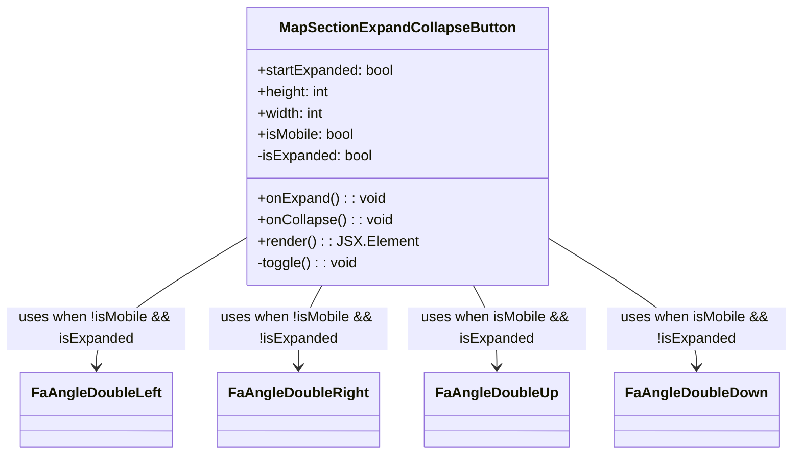

# Diagram: web/portal/src/components/map-search-results/MapSectionExpandCollapseButton.js


> Auto-generated by Obscura crawlers

## Diagram 1



### SVG

<svg id="container" width="876" xmlns="http://www.w3.org/2000/svg" class="classDiagram" height="510" viewBox="0 0 876 510" role="graphics-document document" aria-roledescription="class"><style>#container{font-family:"trebuchet ms",verdana,arial,sans-serif;font-size:16px;fill:#333;}@keyframes edge-animation-frame{from{stroke-dashoffset:0;}}@keyframes dash{to{stroke-dashoffset:0;}}#container .edge-animation-slow{stroke-dasharray:9,5!important;stroke-dashoffset:900;animation:dash 50s linear infinite;stroke-linecap:round;}#container .edge-animation-fast{stroke-dasharray:9,5!important;stroke-dashoffset:900;animation:dash 20s linear infinite;stroke-linecap:round;}#container .error-icon{fill:#552222;}#container .error-text{fill:#552222;stroke:#552222;}#container .edge-thickness-normal{stroke-width:1px;}#container .edge-thickness-thick{stroke-width:3.5px;}#container .edge-pattern-solid{stroke-dasharray:0;}#container .edge-thickness-invisible{stroke-width:0;fill:none;}#container .edge-pattern-dashed{stroke-dasharray:3;}#container .edge-pattern-dotted{stroke-dasharray:2;}#container .marker{fill:#333333;stroke:#333333;}#container .marker.cross{stroke:#333333;}#container svg{font-family:"trebuchet ms",verdana,arial,sans-serif;font-size:16px;}#container p{margin:0;}#container g.classGroup text{fill:#9370DB;stroke:none;font-family:"trebuchet ms",verdana,arial,sans-serif;font-size:10px;}#container g.classGroup text .title{font-weight:bolder;}#container .nodeLabel,#container .edgeLabel{color:#131300;}#container .edgeLabel .label rect{fill:#ECECFF;}#container .label text{fill:#131300;}#container .labelBkg{background:#ECECFF;}#container .edgeLabel .label span{background:#ECECFF;}#container .classTitle{font-weight:bolder;}#container .node rect,#container .node circle,#container .node ellipse,#container .node polygon,#container .node path{fill:#ECECFF;stroke:#9370DB;stroke-width:1px;}#container .divider{stroke:#9370DB;stroke-width:1;}#container g.clickable{cursor:pointer;}#container g.classGroup rect{fill:#ECECFF;stroke:#9370DB;}#container g.classGroup line{stroke:#9370DB;stroke-width:1;}#container .classLabel .box{stroke:none;stroke-width:0;fill:#ECECFF;opacity:0.5;}#container .classLabel .label{fill:#9370DB;font-size:10px;}#container .relation{stroke:#333333;stroke-width:1;fill:none;}#container .dashed-line{stroke-dasharray:3;}#container .dotted-line{stroke-dasharray:1 2;}#container #compositionStart,#container .composition{fill:#333333!important;stroke:#333333!important;stroke-width:1;}#container #compositionEnd,#container .composition{fill:#333333!important;stroke:#333333!important;stroke-width:1;}#container #dependencyStart,#container .dependency{fill:#333333!important;stroke:#333333!important;stroke-width:1;}#container #dependencyStart,#container .dependency{fill:#333333!important;stroke:#333333!important;stroke-width:1;}#container #extensionStart,#container .extension{fill:transparent!important;stroke:#333333!important;stroke-width:1;}#container #extensionEnd,#container .extension{fill:transparent!important;stroke:#333333!important;stroke-width:1;}#container #aggregationStart,#container .aggregation{fill:transparent!important;stroke:#333333!important;stroke-width:1;}#container #aggregationEnd,#container .aggregation{fill:transparent!important;stroke:#333333!important;stroke-width:1;}#container #lollipopStart,#container .lollipop{fill:#ECECFF!important;stroke:#333333!important;stroke-width:1;}#container #lollipopEnd,#container .lollipop{fill:#ECECFF!important;stroke:#333333!important;stroke-width:1;}#container .edgeTerminals{font-size:11px;line-height:initial;}#container .classTitleText{text-anchor:middle;font-size:18px;fill:#333;}#container .label-icon{display:inline-block;height:1em;overflow:visible;vertical-align:-0.125em;}#container .node .label-icon path{fill:currentColor;stroke:revert;stroke-width:revert;}#container :root{--mermaid-font-family:"trebuchet ms",verdana,arial,sans-serif;}</style><g><defs><marker id="container_class-aggregationStart" class="marker aggregation class" refX="18" refY="7" markerWidth="190" markerHeight="240" orient="auto"><path d="M 18,7 L9,13 L1,7 L9,1 Z"></path></marker></defs><defs><marker id="container_class-aggregationEnd" class="marker aggregation class" refX="1" refY="7" markerWidth="20" markerHeight="28" orient="auto"><path d="M 18,7 L9,13 L1,7 L9,1 Z"></path></marker></defs><defs><marker id="container_class-extensionStart" class="marker extension class" refX="18" refY="7" markerWidth="190" markerHeight="240" orient="auto"><path d="M 1,7 L18,13 V 1 Z"></path></marker></defs><defs><marker id="container_class-extensionEnd" class="marker extension class" refX="1" refY="7" markerWidth="20" markerHeight="28" orient="auto"><path d="M 1,1 V 13 L18,7 Z"></path></marker></defs><defs><marker id="container_class-compositionStart" class="marker composition class" refX="18" refY="7" markerWidth="190" markerHeight="240" orient="auto"><path d="M 18,7 L9,13 L1,7 L9,1 Z"></path></marker></defs><defs><marker id="container_class-compositionEnd" class="marker composition class" refX="1" refY="7" markerWidth="20" markerHeight="28" orient="auto"><path d="M 18,7 L9,13 L1,7 L9,1 Z"></path></marker></defs><defs><marker id="container_class-dependencyStart" class="marker dependency class" refX="6" refY="7" markerWidth="190" markerHeight="240" orient="auto"><path d="M 5,7 L9,13 L1,7 L9,1 Z"></path></marker></defs><defs><marker id="container_class-dependencyEnd" class="marker dependency class" refX="13" refY="7" markerWidth="20" markerHeight="28" orient="auto"><path d="M 18,7 L9,13 L14,7 L9,1 Z"></path></marker></defs><defs><marker id="container_class-lollipopStart" class="marker lollipop class" refX="13" refY="7" markerWidth="190" markerHeight="240" orient="auto"><circle stroke="black" fill="transparent" cx="7" cy="7" r="6"></circle></marker></defs><defs><marker id="container_class-lollipopEnd" class="marker lollipop class" refX="1" refY="7" markerWidth="190" markerHeight="240" orient="auto"><circle stroke="black" fill="transparent" cx="7" cy="7" r="6"></circle></marker></defs><g class="root"><g class="clusters"></g><g class="edgePaths"><path d="M276.926,264.061L248.771,281.551C220.617,299.041,164.309,334.02,136.154,358.677C108,383.333,108,397.667,108,404.833L108,412" id="id_MapSectionExpandCollapseButton_FaAngleDoubleLeft_1" class="edge-thickness-normal edge-pattern-solid relation" style=";;;" data-edge="true" data-et="edge" data-id="id_MapSectionExpandCollapseButton_FaAngleDoubleLeft_1" data-points="W3sieCI6Mjc2LjkyNTc4MTI1LCJ5IjoyNjQuMDYxMjU3MTAyMjcyNzV9LHsieCI6MTA4LCJ5IjozNjl9LHsieCI6MTA4LCJ5Ijo0MTh9XQ==" marker-end="url(#container_class-dependencyEnd)"></path><path d="M354.293,320L349.911,328.167C345.528,336.333,336.764,352.667,332.382,368C328,383.333,328,397.667,328,404.833L328,412" id="id_MapSectionExpandCollapseButton_FaAngleDoubleRight_2" class="edge-thickness-normal edge-pattern-solid relation" style=";;;" data-edge="true" data-et="edge" data-id="id_MapSectionExpandCollapseButton_FaAngleDoubleRight_2" data-points="W3sieCI6MzU0LjI5MjY4MjkyNjgyOTMsInkiOjMyMH0seyJ4IjozMjgsInkiOjM2OX0seyJ4IjozMjgsInkiOjQxOH1d" marker-end="url(#container_class-dependencyEnd)"></path><path d="M521.707,320L526.089,328.167C530.472,336.333,539.236,352.667,543.618,368C548,383.333,548,397.667,548,404.833L548,412" id="id_MapSectionExpandCollapseButton_FaAngleDoubleUp_3" class="edge-thickness-normal edge-pattern-solid relation" style=";;;" data-edge="true" data-et="edge" data-id="id_MapSectionExpandCollapseButton_FaAngleDoubleUp_3" data-points="W3sieCI6NTIxLjcwNzMxNzA3MzE3MDgsInkiOjMyMH0seyJ4Ijo1NDgsInkiOjM2OX0seyJ4Ijo1NDgsInkiOjQxOH1d" marker-end="url(#container_class-dependencyEnd)"></path><path d="M599.074,264.061L627.229,281.551C655.383,299.041,711.691,334.02,739.846,358.677C768,383.333,768,397.667,768,404.833L768,412" id="id_MapSectionExpandCollapseButton_FaAngleDoubleDown_4" class="edge-thickness-normal edge-pattern-solid relation" style=";;;" data-edge="true" data-et="edge" data-id="id_MapSectionExpandCollapseButton_FaAngleDoubleDown_4" data-points="W3sieCI6NTk5LjA3NDIxODc1LCJ5IjoyNjQuMDYxMjU3MTAyMjcyNzV9LHsieCI6NzY4LCJ5IjozNjl9LHsieCI6NzY4LCJ5Ijo0MTh9XQ==" marker-end="url(#container_class-dependencyEnd)"></path></g><g class="edgeLabels"><g class="edgeLabel" transform="translate(108, 369)"><g class="label" data-id="id_MapSectionExpandCollapseButton_FaAngleDoubleLeft_1" transform="translate(-100, -24)"><foreignObject width="200" height="48"><div xmlns="http://www.w3.org/1999/xhtml" class="labelBkg" style="display: table; white-space: break-spaces; line-height: 1.5; max-width: 200px; text-align: center; width: 200px;"><span class="edgeLabel"><p>uses when !isMobile &amp;&amp; isExpanded</p></span></div></foreignObject></g></g><g class="edgeLabel" transform="translate(328, 369)"><g class="label" data-id="id_MapSectionExpandCollapseButton_FaAngleDoubleRight_2" transform="translate(-100, -24)"><foreignObject width="200" height="48"><div xmlns="http://www.w3.org/1999/xhtml" class="labelBkg" style="display: table; white-space: break-spaces; line-height: 1.5; max-width: 200px; text-align: center; width: 200px;"><span class="edgeLabel"><p>uses when !isMobile &amp;&amp; !isExpanded</p></span></div></foreignObject></g></g><g class="edgeLabel" transform="translate(548, 369)"><g class="label" data-id="id_MapSectionExpandCollapseButton_FaAngleDoubleUp_3" transform="translate(-100, -24)"><foreignObject width="200" height="48"><div xmlns="http://www.w3.org/1999/xhtml" class="labelBkg" style="display: table; white-space: break-spaces; line-height: 1.5; max-width: 200px; text-align: center; width: 200px;"><span class="edgeLabel"><p>uses when isMobile &amp;&amp; isExpanded</p></span></div></foreignObject></g></g><g class="edgeLabel" transform="translate(768, 369)"><g class="label" data-id="id_MapSectionExpandCollapseButton_FaAngleDoubleDown_4" transform="translate(-100, -24)"><foreignObject width="200" height="48"><div xmlns="http://www.w3.org/1999/xhtml" class="labelBkg" style="display: table; white-space: break-spaces; line-height: 1.5; max-width: 200px; text-align: center; width: 200px;"><span class="edgeLabel"><p>uses when isMobile &amp;&amp; !isExpanded</p></span></div></foreignObject></g></g></g><g class="nodes"><g class="node default" id="classId-MapSectionExpandCollapseButton-0" transform="translate(438, 164)"><g class="basic label-container"><path d="M-161.07421875 -156 L161.07421875 -156 L161.07421875 156 L-161.07421875 156" stroke="none" stroke-width="0" fill="#ECECFF" style=""></path><path d="M-161.07421875 -156 C-32.50655805597654 -156, 96.06110263804692 -156, 161.07421875 -156 M-161.07421875 -156 C-42.00730313167598 -156, 77.05961248664804 -156, 161.07421875 -156 M161.07421875 -156 C161.07421875 -85.52463556189483, 161.07421875 -15.049271123789651, 161.07421875 156 M161.07421875 -156 C161.07421875 -37.32846716137129, 161.07421875 81.34306567725741, 161.07421875 156 M161.07421875 156 C92.95962453247627 156, 24.845030314952538 156, -161.07421875 156 M161.07421875 156 C89.04761876721919 156, 17.021018784438382 156, -161.07421875 156 M-161.07421875 156 C-161.07421875 37.12700222209244, -161.07421875 -81.74599555581511, -161.07421875 -156 M-161.07421875 156 C-161.07421875 44.96270661035247, -161.07421875 -66.07458677929506, -161.07421875 -156" stroke="#9370DB" stroke-width="1.3" fill="none" stroke-dasharray="0 0" style=""></path></g><g class="annotation-group text" transform="translate(0, -132)"></g><g class="label-group text" transform="translate(-125.8046875, -132)"><g class="label" style="font-weight: bolder" transform="translate(0,-12)"><foreignObject width="251.609375" height="24"><div xmlns="http://www.w3.org/1999/xhtml" style="display: table-cell; white-space: nowrap; line-height: 1.5; max-width: 299px; text-align: center;"><span class="nodeLabel markdown-node-label" style=""><p>MapSectionExpandCollapseButton</p></span></div></foreignObject></g></g><g class="members-group text" transform="translate(-149.07421875, -84)"><g class="label" style="" transform="translate(0,-12)"><foreignObject width="154.34375" height="24"><div xmlns="http://www.w3.org/1999/xhtml" style="display: table-cell; white-space: nowrap; line-height: 1.5; max-width: 212px; text-align: center;"><span class="nodeLabel markdown-node-label" style=""><p>+startExpanded: bool</p></span></div></foreignObject></g><g class="label" style="" transform="translate(0,12)"><foreignObject width="81.875" height="24"><div xmlns="http://www.w3.org/1999/xhtml" style="display: table-cell; white-space: nowrap; line-height: 1.5; max-width: 139px; text-align: center;"><span class="nodeLabel markdown-node-label" style=""><p>+height: int</p></span></div></foreignObject></g><g class="label" style="" transform="translate(0,36)"><foreignObject width="76.4375" height="24"><div xmlns="http://www.w3.org/1999/xhtml" style="display: table-cell; white-space: nowrap; line-height: 1.5; max-width: 134px; text-align: center;"><span class="nodeLabel markdown-node-label" style=""><p>+width: int</p></span></div></foreignObject></g><g class="label" style="" transform="translate(0,60)"><foreignObject width="110.078125" height="24"><div xmlns="http://www.w3.org/1999/xhtml" style="display: table-cell; white-space: nowrap; line-height: 1.5; max-width: 168px; text-align: center;"><span class="nodeLabel markdown-node-label" style=""><p>+isMobile: bool</p></span></div></foreignObject></g><g class="label" style="" transform="translate(0,84)"><foreignObject width="131" height="24"><div xmlns="http://www.w3.org/1999/xhtml" style="display: table-cell; white-space: nowrap; line-height: 1.5; max-width: 189px; text-align: center;"><span class="nodeLabel markdown-node-label" style=""><p>-isExpanded: bool</p></span></div></foreignObject></g></g><g class="methods-group text" transform="translate(-149.07421875, 60)"><g class="label" style="" transform="translate(0,-12)"><foreignObject width="142.03125" height="24"><div xmlns="http://www.w3.org/1999/xhtml" style="display: table-cell; white-space: nowrap; line-height: 1.5; max-width: 199px; text-align: center;"><span class="nodeLabel markdown-node-label" style=""><p>+onExpand() : : void</p></span></div></foreignObject></g><g class="label" style="" transform="translate(0,12)"><foreignObject width="150.390625" height="24"><div xmlns="http://www.w3.org/1999/xhtml" style="display: table-cell; white-space: nowrap; line-height: 1.5; max-width: 208px; text-align: center;"><span class="nodeLabel markdown-node-label" style=""><p>+onCollapse() : : void</p></span></div></foreignObject></g><g class="label" style="" transform="translate(0,36)"><foreignObject width="172.34375" height="24"><div xmlns="http://www.w3.org/1999/xhtml" style="display: table-cell; white-space: nowrap; line-height: 1.5; max-width: 230px; text-align: center;"><span class="nodeLabel markdown-node-label" style=""><p>+render() : : JSX.Element</p></span></div></foreignObject></g><g class="label" style="" transform="translate(0,60)"><foreignObject width="113.21875" height="24"><div xmlns="http://www.w3.org/1999/xhtml" style="display: table-cell; white-space: nowrap; line-height: 1.5; max-width: 171px; text-align: center;"><span class="nodeLabel markdown-node-label" style=""><p>-toggle() : : void</p></span></div></foreignObject></g></g><g class="divider" style=""><path d="M-161.07421875 -108 C-85.78385601911654 -108, -10.493493288233083 -108, 161.07421875 -108 M-161.07421875 -108 C-52.23287496792874 -108, 56.608468814142526 -108, 161.07421875 -108" stroke="#9370DB" stroke-width="1.3" fill="none" stroke-dasharray="0 0" style=""></path></g><g class="divider" style=""><path d="M-161.07421875 36 C-41.33377278340461 36, 78.40667318319078 36, 161.07421875 36 M-161.07421875 36 C-32.37581726149776 36, 96.32258422700448 36, 161.07421875 36" stroke="#9370DB" stroke-width="1.3" fill="none" stroke-dasharray="0 0" style=""></path></g></g><g class="node default" id="classId-FaAngleDoubleLeft-1" transform="translate(108, 460)"><g class="basic label-container"><path d="M-80.5390625 -42 L80.5390625 -42 L80.5390625 42 L-80.5390625 42" stroke="none" stroke-width="0" fill="#ECECFF" style=""></path><path d="M-80.5390625 -42 C-28.42814130033488 -42, 23.682779899330242 -42, 80.5390625 -42 M-80.5390625 -42 C-44.953767851022555 -42, -9.36847320204511 -42, 80.5390625 -42 M80.5390625 -42 C80.5390625 -17.099200297291677, 80.5390625 7.8015994054166455, 80.5390625 42 M80.5390625 -42 C80.5390625 -22.483707199396182, 80.5390625 -2.9674143987923642, 80.5390625 42 M80.5390625 42 C36.890272257710585 42, -6.75851798457883 42, -80.5390625 42 M80.5390625 42 C28.31595370362043 42, -23.90715509275914 42, -80.5390625 42 M-80.5390625 42 C-80.5390625 11.814203910241744, -80.5390625 -18.37159217951651, -80.5390625 -42 M-80.5390625 42 C-80.5390625 12.055573178030038, -80.5390625 -17.888853643939925, -80.5390625 -42" stroke="#9370DB" stroke-width="1.3" fill="none" stroke-dasharray="0 0" style=""></path></g><g class="annotation-group text" transform="translate(0, -18)"></g><g class="label-group text" transform="translate(-68.5390625, -18)"><g class="label" style="font-weight: bolder" transform="translate(0,-12)"><foreignObject width="137.078125" height="24"><div xmlns="http://www.w3.org/1999/xhtml" style="display: table-cell; white-space: nowrap; line-height: 1.5; max-width: 185px; text-align: center;"><span class="nodeLabel markdown-node-label" style=""><p>FaAngleDoubleLeft</p></span></div></foreignObject></g></g><g class="members-group text" transform="translate(-68.5390625, 30)"></g><g class="methods-group text" transform="translate(-68.5390625, 60)"></g><g class="divider" style=""><path d="M-80.5390625 6 C-40.65751569347965 6, -0.7759688869593049 6, 80.5390625 6 M-80.5390625 6 C-18.32959945001427 6, 43.87986359997146 6, 80.5390625 6" stroke="#9370DB" stroke-width="1.3" fill="none" stroke-dasharray="0 0" style=""></path></g><g class="divider" style=""><path d="M-80.5390625 24 C-44.26692053835445 24, -7.994778576708896 24, 80.5390625 24 M-80.5390625 24 C-16.197047814081557 24, 48.144966871836886 24, 80.5390625 24" stroke="#9370DB" stroke-width="1.3" fill="none" stroke-dasharray="0 0" style=""></path></g></g><g class="node default" id="classId-FaAngleDoubleRight-2" transform="translate(328, 460)"><g class="basic label-container"><path d="M-85.5859375 -42 L85.5859375 -42 L85.5859375 42 L-85.5859375 42" stroke="none" stroke-width="0" fill="#ECECFF" style=""></path><path d="M-85.5859375 -42 C-35.433574159076365 -42, 14.71878918184727 -42, 85.5859375 -42 M-85.5859375 -42 C-23.31439814205207 -42, 38.95714121589586 -42, 85.5859375 -42 M85.5859375 -42 C85.5859375 -12.562147534729217, 85.5859375 16.875704930541566, 85.5859375 42 M85.5859375 -42 C85.5859375 -12.10584190495699, 85.5859375 17.78831619008602, 85.5859375 42 M85.5859375 42 C45.30828891618754 42, 5.030640332375086 42, -85.5859375 42 M85.5859375 42 C26.941536521349306 42, -31.702864457301388 42, -85.5859375 42 M-85.5859375 42 C-85.5859375 16.848987053868672, -85.5859375 -8.302025892262655, -85.5859375 -42 M-85.5859375 42 C-85.5859375 24.690284368599812, -85.5859375 7.380568737199624, -85.5859375 -42" stroke="#9370DB" stroke-width="1.3" fill="none" stroke-dasharray="0 0" style=""></path></g><g class="annotation-group text" transform="translate(0, -18)"></g><g class="label-group text" transform="translate(-73.5859375, -18)"><g class="label" style="font-weight: bolder" transform="translate(0,-12)"><foreignObject width="147.171875" height="24"><div xmlns="http://www.w3.org/1999/xhtml" style="display: table-cell; white-space: nowrap; line-height: 1.5; max-width: 195px; text-align: center;"><span class="nodeLabel markdown-node-label" style=""><p>FaAngleDoubleRight</p></span></div></foreignObject></g></g><g class="members-group text" transform="translate(-73.5859375, 30)"></g><g class="methods-group text" transform="translate(-73.5859375, 60)"></g><g class="divider" style=""><path d="M-85.5859375 6 C-39.87830470153492 6, 5.829328096930155 6, 85.5859375 6 M-85.5859375 6 C-51.239022224721225 6, -16.89210694944245 6, 85.5859375 6" stroke="#9370DB" stroke-width="1.3" fill="none" stroke-dasharray="0 0" style=""></path></g><g class="divider" style=""><path d="M-85.5859375 24 C-50.235894844955304 24, -14.885852189910608 24, 85.5859375 24 M-85.5859375 24 C-32.644363564044056 24, 20.297210371911888 24, 85.5859375 24" stroke="#9370DB" stroke-width="1.3" fill="none" stroke-dasharray="0 0" style=""></path></g></g><g class="node default" id="classId-FaAngleDoubleUp-3" transform="translate(548, 460)"><g class="basic label-container"><path d="M-76.265625 -42 L76.265625 -42 L76.265625 42 L-76.265625 42" stroke="none" stroke-width="0" fill="#ECECFF" style=""></path><path d="M-76.265625 -42 C-44.12121524726797 -42, -11.976805494535938 -42, 76.265625 -42 M-76.265625 -42 C-40.5417887321176 -42, -4.817952464235205 -42, 76.265625 -42 M76.265625 -42 C76.265625 -24.093803726825552, 76.265625 -6.187607453651104, 76.265625 42 M76.265625 -42 C76.265625 -11.606755436406125, 76.265625 18.78648912718775, 76.265625 42 M76.265625 42 C22.698147067496933 42, -30.869330865006134 42, -76.265625 42 M76.265625 42 C33.80755357294651 42, -8.65051785410698 42, -76.265625 42 M-76.265625 42 C-76.265625 20.010669808696136, -76.265625 -1.9786603826077283, -76.265625 -42 M-76.265625 42 C-76.265625 22.43460527858317, -76.265625 2.8692105571663404, -76.265625 -42" stroke="#9370DB" stroke-width="1.3" fill="none" stroke-dasharray="0 0" style=""></path></g><g class="annotation-group text" transform="translate(0, -18)"></g><g class="label-group text" transform="translate(-64.265625, -18)"><g class="label" style="font-weight: bolder" transform="translate(0,-12)"><foreignObject width="128.53125" height="24"><div xmlns="http://www.w3.org/1999/xhtml" style="display: table-cell; white-space: nowrap; line-height: 1.5; max-width: 178px; text-align: center;"><span class="nodeLabel markdown-node-label" style=""><p>FaAngleDoubleUp</p></span></div></foreignObject></g></g><g class="members-group text" transform="translate(-64.265625, 30)"></g><g class="methods-group text" transform="translate(-64.265625, 60)"></g><g class="divider" style=""><path d="M-76.265625 6 C-33.216367298562155 6, 9.832890402875691 6, 76.265625 6 M-76.265625 6 C-18.777872730357977 6, 38.709879539284046 6, 76.265625 6" stroke="#9370DB" stroke-width="1.3" fill="none" stroke-dasharray="0 0" style=""></path></g><g class="divider" style=""><path d="M-76.265625 24 C-40.45177390680603 24, -4.6379228136120645 24, 76.265625 24 M-76.265625 24 C-41.28419220453484 24, -6.3027594090696795 24, 76.265625 24" stroke="#9370DB" stroke-width="1.3" fill="none" stroke-dasharray="0 0" style=""></path></g></g><g class="node default" id="classId-FaAngleDoubleDown-4" transform="translate(768, 460)"><g class="basic label-container"><path d="M-86.7734375 -42 L86.7734375 -42 L86.7734375 42 L-86.7734375 42" stroke="none" stroke-width="0" fill="#ECECFF" style=""></path><path d="M-86.7734375 -42 C-36.12837051267064 -42, 14.516696474658715 -42, 86.7734375 -42 M-86.7734375 -42 C-18.41245389791115 -42, 49.9485297041777 -42, 86.7734375 -42 M86.7734375 -42 C86.7734375 -24.333378819411994, 86.7734375 -6.666757638823988, 86.7734375 42 M86.7734375 -42 C86.7734375 -17.263944244035798, 86.7734375 7.472111511928404, 86.7734375 42 M86.7734375 42 C21.711917397696368 42, -43.349602704607264 42, -86.7734375 42 M86.7734375 42 C42.793702212198106 42, -1.1860330756037882 42, -86.7734375 42 M-86.7734375 42 C-86.7734375 23.979765504632443, -86.7734375 5.959531009264886, -86.7734375 -42 M-86.7734375 42 C-86.7734375 19.39594747353588, -86.7734375 -3.2081050529282393, -86.7734375 -42" stroke="#9370DB" stroke-width="1.3" fill="none" stroke-dasharray="0 0" style=""></path></g><g class="annotation-group text" transform="translate(0, -18)"></g><g class="label-group text" transform="translate(-74.7734375, -18)"><g class="label" style="font-weight: bolder" transform="translate(0,-12)"><foreignObject width="149.546875" height="24"><div xmlns="http://www.w3.org/1999/xhtml" style="display: table-cell; white-space: nowrap; line-height: 1.5; max-width: 198px; text-align: center;"><span class="nodeLabel markdown-node-label" style=""><p>FaAngleDoubleDown</p></span></div></foreignObject></g></g><g class="members-group text" transform="translate(-74.7734375, 30)"></g><g class="methods-group text" transform="translate(-74.7734375, 60)"></g><g class="divider" style=""><path d="M-86.7734375 6 C-39.901650216160654 6, 6.970137067678692 6, 86.7734375 6 M-86.7734375 6 C-41.80958521585355 6, 3.1542670682928957 6, 86.7734375 6" stroke="#9370DB" stroke-width="1.3" fill="none" stroke-dasharray="0 0" style=""></path></g><g class="divider" style=""><path d="M-86.7734375 24 C-21.049643786786163 24, 44.674149926427674 24, 86.7734375 24 M-86.7734375 24 C-30.40478821605729 24, 25.963861067885418 24, 86.7734375 24" stroke="#9370DB" stroke-width="1.3" fill="none" stroke-dasharray="0 0" style=""></path></g></g></g></g></g></svg>

## Diagram 2

```mermaid
flowchart TD
  A[Start Render] --> B{isMobile?}
  B -- Yes --> C[Use mobile icons]
  B -- No --> D[Use desktop icons]
  C --> E{isExpanded?}
  D --> E
  E -- true --> F[Show Up / Left icon]
  E -- false --> G[Show Down / Right icon]
  F --> H[User clicks button]
  G --> H
  H --> I{isExpanded?}
  I -- true --> J[setIsExpanded(false)]
  I -- true --> K[call onCollapse()]
  I -- false --> L[setIsExpanded(true)]
  I -- false --> M[call onExpand()]
  J --> N[Update icon to collapsed]
  L --> N
  K --> O[External collapse handler invoked]
  M --> P[External expand handler invoked]
  N --> Q[End]
```

> SVG rendering failed for this diagram.
