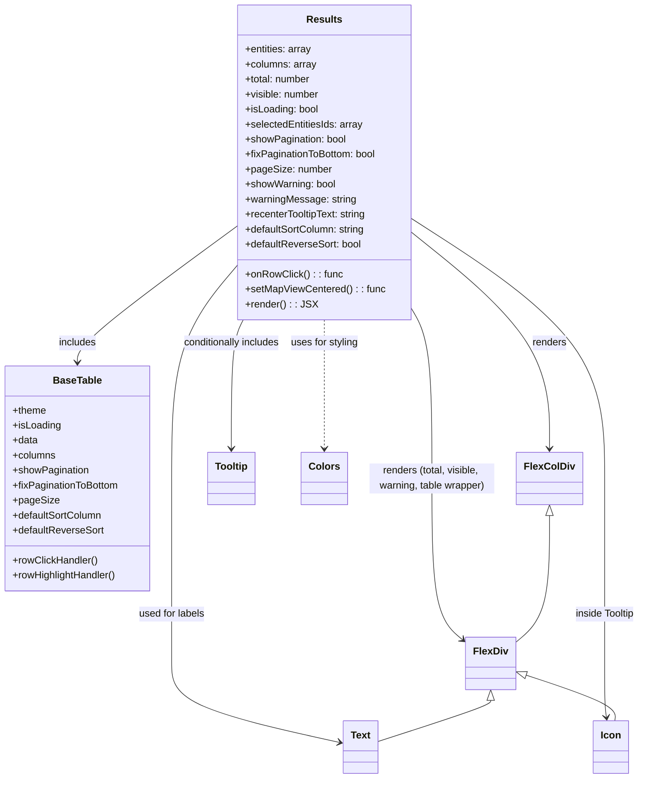

# Diagram: web/portal/src/components/map-search-results/Results.js


> Auto-generated by Obscura crawlers

## Diagram 1



### SVG

<svg id="container" width="1028.3203125" xmlns="http://www.w3.org/2000/svg" class="classDiagram" height="1246" viewBox="0 0 1028.3203125 1246" role="graphics-document document" aria-roledescription="class"><style>#container{font-family:"trebuchet ms",verdana,arial,sans-serif;font-size:16px;fill:#333;}@keyframes edge-animation-frame{from{stroke-dashoffset:0;}}@keyframes dash{to{stroke-dashoffset:0;}}#container .edge-animation-slow{stroke-dasharray:9,5!important;stroke-dashoffset:900;animation:dash 50s linear infinite;stroke-linecap:round;}#container .edge-animation-fast{stroke-dasharray:9,5!important;stroke-dashoffset:900;animation:dash 20s linear infinite;stroke-linecap:round;}#container .error-icon{fill:#552222;}#container .error-text{fill:#552222;stroke:#552222;}#container .edge-thickness-normal{stroke-width:1px;}#container .edge-thickness-thick{stroke-width:3.5px;}#container .edge-pattern-solid{stroke-dasharray:0;}#container .edge-thickness-invisible{stroke-width:0;fill:none;}#container .edge-pattern-dashed{stroke-dasharray:3;}#container .edge-pattern-dotted{stroke-dasharray:2;}#container .marker{fill:#333333;stroke:#333333;}#container .marker.cross{stroke:#333333;}#container svg{font-family:"trebuchet ms",verdana,arial,sans-serif;font-size:16px;}#container p{margin:0;}#container g.classGroup text{fill:#9370DB;stroke:none;font-family:"trebuchet ms",verdana,arial,sans-serif;font-size:10px;}#container g.classGroup text .title{font-weight:bolder;}#container .nodeLabel,#container .edgeLabel{color:#131300;}#container .edgeLabel .label rect{fill:#ECECFF;}#container .label text{fill:#131300;}#container .labelBkg{background:#ECECFF;}#container .edgeLabel .label span{background:#ECECFF;}#container .classTitle{font-weight:bolder;}#container .node rect,#container .node circle,#container .node ellipse,#container .node polygon,#container .node path{fill:#ECECFF;stroke:#9370DB;stroke-width:1px;}#container .divider{stroke:#9370DB;stroke-width:1;}#container g.clickable{cursor:pointer;}#container g.classGroup rect{fill:#ECECFF;stroke:#9370DB;}#container g.classGroup line{stroke:#9370DB;stroke-width:1;}#container .classLabel .box{stroke:none;stroke-width:0;fill:#ECECFF;opacity:0.5;}#container .classLabel .label{fill:#9370DB;font-size:10px;}#container .relation{stroke:#333333;stroke-width:1;fill:none;}#container .dashed-line{stroke-dasharray:3;}#container .dotted-line{stroke-dasharray:1 2;}#container #compositionStart,#container .composition{fill:#333333!important;stroke:#333333!important;stroke-width:1;}#container #compositionEnd,#container .composition{fill:#333333!important;stroke:#333333!important;stroke-width:1;}#container #dependencyStart,#container .dependency{fill:#333333!important;stroke:#333333!important;stroke-width:1;}#container #dependencyStart,#container .dependency{fill:#333333!important;stroke:#333333!important;stroke-width:1;}#container #extensionStart,#container .extension{fill:transparent!important;stroke:#333333!important;stroke-width:1;}#container #extensionEnd,#container .extension{fill:transparent!important;stroke:#333333!important;stroke-width:1;}#container #aggregationStart,#container .aggregation{fill:transparent!important;stroke:#333333!important;stroke-width:1;}#container #aggregationEnd,#container .aggregation{fill:transparent!important;stroke:#333333!important;stroke-width:1;}#container #lollipopStart,#container .lollipop{fill:#ECECFF!important;stroke:#333333!important;stroke-width:1;}#container #lollipopEnd,#container .lollipop{fill:#ECECFF!important;stroke:#333333!important;stroke-width:1;}#container .edgeTerminals{font-size:11px;line-height:initial;}#container .classTitleText{text-anchor:middle;font-size:18px;fill:#333;}#container .label-icon{display:inline-block;height:1em;overflow:visible;vertical-align:-0.125em;}#container .node .label-icon path{fill:currentColor;stroke:revert;stroke-width:revert;}#container :root{--mermaid-font-family:"trebuchet ms",verdana,arial,sans-serif;}</style><g><defs><marker id="container_class-aggregationStart" class="marker aggregation class" refX="18" refY="7" markerWidth="190" markerHeight="240" orient="auto"><path d="M 18,7 L9,13 L1,7 L9,1 Z"></path></marker></defs><defs><marker id="container_class-aggregationEnd" class="marker aggregation class" refX="1" refY="7" markerWidth="20" markerHeight="28" orient="auto"><path d="M 18,7 L9,13 L1,7 L9,1 Z"></path></marker></defs><defs><marker id="container_class-extensionStart" class="marker extension class" refX="18" refY="7" markerWidth="190" markerHeight="240" orient="auto"><path d="M 1,7 L18,13 V 1 Z"></path></marker></defs><defs><marker id="container_class-extensionEnd" class="marker extension class" refX="1" refY="7" markerWidth="20" markerHeight="28" orient="auto"><path d="M 1,1 V 13 L18,7 Z"></path></marker></defs><defs><marker id="container_class-compositionStart" class="marker composition class" refX="18" refY="7" markerWidth="190" markerHeight="240" orient="auto"><path d="M 18,7 L9,13 L1,7 L9,1 Z"></path></marker></defs><defs><marker id="container_class-compositionEnd" class="marker composition class" refX="1" refY="7" markerWidth="20" markerHeight="28" orient="auto"><path d="M 18,7 L9,13 L1,7 L9,1 Z"></path></marker></defs><defs><marker id="container_class-dependencyStart" class="marker dependency class" refX="6" refY="7" markerWidth="190" markerHeight="240" orient="auto"><path d="M 5,7 L9,13 L1,7 L9,1 Z"></path></marker></defs><defs><marker id="container_class-dependencyEnd" class="marker dependency class" refX="13" refY="7" markerWidth="20" markerHeight="28" orient="auto"><path d="M 18,7 L9,13 L14,7 L9,1 Z"></path></marker></defs><defs><marker id="container_class-lollipopStart" class="marker lollipop class" refX="13" refY="7" markerWidth="190" markerHeight="240" orient="auto"><circle stroke="black" fill="transparent" cx="7" cy="7" r="6"></circle></marker></defs><defs><marker id="container_class-lollipopEnd" class="marker lollipop class" refX="1" refY="7" markerWidth="190" markerHeight="240" orient="auto"><circle stroke="black" fill="transparent" cx="7" cy="7" r="6"></circle></marker></defs><g class="root"><g class="clusters"></g><g class="edgePaths"><path d="M667.832,371.074L704.23,400.728C740.628,430.383,813.423,489.691,849.821,547.512C886.219,605.333,886.219,661.667,886.219,689.833L886.219,718" id="id_Results_FlexColDiv_1" class="edge-thickness-normal edge-pattern-solid relation" style=";;;" data-edge="true" data-et="edge" data-id="id_Results_FlexColDiv_1" data-points="W3sieCI6NjY3LjgzMjAzMTI1LCJ5IjozNzEuMDczNzkzMDU3ODgwNH0seyJ4Ijo4ODYuMjE4NzUsInkiOjU0OX0seyJ4Ijo4ODYuMjE4NzUsInkiOjcyNH1d" marker-end="url(#container_class-dependencyEnd)"></path><path d="M667.832,491.626L673.46,501.188C679.089,510.751,690.345,529.875,695.973,575.604C701.602,621.333,701.602,693.667,701.602,766C701.602,838.333,701.602,910.667,709.871,953.911C718.141,997.155,734.68,1011.309,742.949,1018.386L751.219,1025.464" id="id_Results_FlexDiv_2" class="edge-thickness-normal edge-pattern-solid relation" style=";;;" data-edge="true" data-et="edge" data-id="id_Results_FlexDiv_2" data-points="W3sieCI6NjY3LjgzMjAzMTI1LCJ5Ijo0OTEuNjI2MDczNTc3MzY2NDd9LHsieCI6NzAxLjYwMTU2MjUsInkiOjU0OX0seyJ4Ijo3MDEuNjAxNTYyNSwieSI6NzY2fSx7IngiOjcwMS42MDE1NjI1LCJ5Ijo5ODN9LHsieCI6NzU1Ljc3NzM0Mzc1LCJ5IjoxMDI5LjM2NDk4NjY3MDA1Mn1d" marker-end="url(#container_class-dependencyEnd)"></path><path d="M395.168,356.821L350.067,388.851C304.966,420.88,214.764,484.94,169.663,522.137C124.563,559.333,124.563,569.667,124.563,574.833L124.563,580" id="id_Results_BaseTable_3" class="edge-thickness-normal edge-pattern-solid relation" style=";;;" data-edge="true" data-et="edge" data-id="id_Results_BaseTable_3" data-points="W3sieCI6Mzk1LjE2Nzk2ODc1LCJ5IjozNTYuODIwNjU5MjY4OTI5NX0seyJ4IjoxMjQuNTYyNSwieSI6NTQ5fSx7IngiOjEyNC41NjI1LCJ5Ijo1ODZ9XQ==" marker-end="url(#container_class-dependencyEnd)"></path><path d="M396.154,512L392.841,518.167C389.529,524.333,382.905,536.667,379.593,571C376.281,605.333,376.281,661.667,376.281,689.833L376.281,718" id="id_Results_Tooltip_4" class="edge-thickness-normal edge-pattern-solid relation" style=";;;" data-edge="true" data-et="edge" data-id="id_Results_Tooltip_4" data-points="W3sieCI6Mzk2LjE1MzU0NjcxMjgwMjgsInkiOjUxMn0seyJ4IjozNzYuMjgxMjUsInkiOjU0OX0seyJ4IjozNzYuMjgxMjUsInkiOjcyNH1d" marker-end="url(#container_class-dependencyEnd)"></path><path d="M667.832,349.681L718.333,382.901C768.833,416.12,869.835,482.56,920.335,551.947C970.836,621.333,970.836,693.667,970.836,766C970.836,838.333,970.836,910.667,970.836,960C970.836,1009.333,970.836,1035.667,970.836,1060C970.836,1084.333,970.836,1106.667,971.312,1121.011C971.788,1135.355,972.74,1141.711,973.216,1144.888L973.692,1148.066" id="id_Results_Icon_5" class="edge-thickness-normal edge-pattern-solid relation" style=";;;" data-edge="true" data-et="edge" data-id="id_Results_Icon_5" data-points="W3sieCI6NjY3LjgzMjAzMTI1LCJ5IjozNDkuNjgwNzA1OTY2MDM1MzZ9LHsieCI6OTcwLjgzNTkzNzUsInkiOjU0OX0seyJ4Ijo5NzAuODM1OTM3NSwieSI6NzY2fSx7IngiOjk3MC44MzU5Mzc1LCJ5Ijo5ODN9LHsieCI6OTcwLjgzNTkzNzUsInkiOjEwNjJ9LHsieCI6OTcwLjgzNTkzNzUsInkiOjExMjl9LHsieCI6OTc0LjU4MDM5ODc4NzMxMzUsInkiOjExNTR9XQ==" marker-end="url(#container_class-dependencyEnd)"></path><path d="M395.168,414.283L375.327,436.736C355.487,459.188,315.806,504.094,295.965,562.714C276.125,621.333,276.125,693.667,276.125,766C276.125,838.333,276.125,910.667,276.125,960C276.125,1009.333,276.125,1035.667,276.125,1060C276.125,1084.333,276.125,1106.667,321.426,1127.783C366.726,1148.9,457.328,1168.799,502.628,1178.749L547.929,1188.699" id="id_Results_Text_6" class="edge-thickness-normal edge-pattern-solid relation" style=";;;" data-edge="true" data-et="edge" data-id="id_Results_Text_6" data-points="W3sieCI6Mzk1LjE2Nzk2ODc1LCJ5Ijo0MTQuMjgyNzQ5MDIxMDQ3NX0seyJ4IjoyNzYuMTI1LCJ5Ijo1NDl9LHsieCI6Mjc2LjEyNSwieSI6NzY2fSx7IngiOjI3Ni4xMjUsInkiOjk4M30seyJ4IjoyNzYuMTI1LCJ5IjoxMDYyfSx7IngiOjI3Ni4xMjUsInkiOjExMjl9LHsieCI6NTUzLjc4OTA2MjUsInkiOjExODkuOTg1NjgzNTUyNzMyOH1d" marker-end="url(#container_class-dependencyEnd)"></path><path d="M531.5,512L531.5,518.167C531.5,524.333,531.5,536.667,531.5,571C531.5,605.333,531.5,661.667,531.5,689.833L531.5,718" id="id_Results_Colors_7" class="edge-thickness-normal edge-pattern-dashed relation" style=";;;" data-edge="true" data-et="edge" data-id="id_Results_Colors_7" data-points="W3sieCI6NTMxLjUsInkiOjUxMn0seyJ4Ijo1MzEuNSwieSI6NTQ5fSx7IngiOjUzMS41LCJ5Ijo3MjR9XQ==" marker-end="url(#container_class-dependencyEnd)"></path><path d="M886.219,825.25L886.219,851.542C886.219,877.833,886.219,930.417,877.189,964.436C868.16,998.455,850.102,1013.91,841.072,1021.637L832.043,1029.365" id="id_FlexColDiv_FlexDiv_8" class="edge-thickness-normal edge-pattern-solid relation" style=";;;" data-edge="true" data-et="edge" data-id="id_FlexColDiv_FlexDiv_8" data-points="W3sieCI6ODg2LjIxODc1LCJ5Ijo4MDh9LHsieCI6ODg2LjIxODc1LCJ5Ijo5ODN9LHsieCI6ODMyLjA0Mjk2ODc1LCJ5IjoxMDI5LjM2NDk4NjY3MDA1Mn1d" marker-start="url(#container_class-extensionStart)"></path><path d="M793.91,1121.25L793.91,1122.542C793.91,1123.833,793.91,1126.417,763.018,1137.438C732.125,1148.459,670.34,1167.917,639.447,1177.647L608.555,1187.376" id="id_FlexDiv_Text_9" class="edge-thickness-normal edge-pattern-solid relation" style=";;;" data-edge="true" data-et="edge" data-id="id_FlexDiv_Text_9" data-points="W3sieCI6NzkzLjkxMDE1NjI1LCJ5IjoxMTA0fSx7IngiOjc5My45MTAxNTYyNSwieSI6MTEyOX0seyJ4Ijo2MDguNTU0Njg3NSwieSI6MTE4Ny4zNzYwMzA1NTM5NzQ1fV0=" marker-start="url(#container_class-extensionStart)"></path><path d="M848.374,1080.527L872.123,1088.606C895.873,1096.685,943.372,1112.842,966.5,1125.088C989.627,1137.333,988.384,1145.667,987.762,1149.833L987.14,1154" id="id_FlexDiv_Icon_10" class="edge-thickness-normal edge-pattern-solid relation" style=";;;" data-edge="true" data-et="edge" data-id="id_FlexDiv_Icon_10" data-points="W3sieCI6ODMyLjA0Mjk2ODc1LCJ5IjoxMDc0Ljk3MTU5OTY5ODU0NDJ9LHsieCI6OTkwLjg3MTA5Mzc1LCJ5IjoxMTI5fSx7IngiOjk4Ny4xMzk3NTA0NjY0MTc5LCJ5IjoxMTU0fV0=" marker-start="url(#container_class-extensionStart)"></path></g><g class="edgeLabels"><g class="edgeLabel" transform="translate(886.21875, 549)"><g class="label" data-id="id_Results_FlexColDiv_1" transform="translate(-27.75, -12)"><foreignObject width="55.5" height="24"><div xmlns="http://www.w3.org/1999/xhtml" class="labelBkg" style="display: table-cell; white-space: nowrap; line-height: 1.5; max-width: 200px; text-align: center;"><span class="edgeLabel"><p>renders</p></span></div></foreignObject></g></g><g class="edgeLabel" transform="translate(701.6015625, 766)"><g class="label" data-id="id_Results_FlexDiv_2" transform="translate(-100, -24)"><foreignObject width="200" height="48"><div xmlns="http://www.w3.org/1999/xhtml" class="labelBkg" style="display: table; white-space: break-spaces; line-height: 1.5; max-width: 200px; text-align: center; width: 200px;"><span class="edgeLabel"><p>renders (total, visible, warning, table wrapper)</p></span></div></foreignObject></g></g><g class="edgeLabel" transform="translate(124.5625, 549)"><g class="label" data-id="id_Results_BaseTable_3" transform="translate(-30.6484375, -12)"><foreignObject width="61.296875" height="24"><div xmlns="http://www.w3.org/1999/xhtml" class="labelBkg" style="display: table-cell; white-space: nowrap; line-height: 1.5; max-width: 200px; text-align: center;"><span class="edgeLabel"><p>includes</p></span></div></foreignObject></g></g><g class="edgeLabel" transform="translate(376.28125, 549)"><g class="label" data-id="id_Results_Tooltip_4" transform="translate(-80.15625, -12)"><foreignObject width="160.3125" height="24"><div xmlns="http://www.w3.org/1999/xhtml" class="labelBkg" style="display: table-cell; white-space: nowrap; line-height: 1.5; max-width: 200px; text-align: center;"><span class="edgeLabel"><p>conditionally includes</p></span></div></foreignObject></g></g><g class="edgeLabel" transform="translate(970.8359375, 983)"><g class="label" data-id="id_Results_Icon_5" transform="translate(-49.484375, -12)"><foreignObject width="98.96875" height="24"><div xmlns="http://www.w3.org/1999/xhtml" class="labelBkg" style="display: table-cell; white-space: nowrap; line-height: 1.5; max-width: 200px; text-align: center;"><span class="edgeLabel"><p>inside Tooltip</p></span></div></foreignObject></g></g><g class="edgeLabel" transform="translate(276.125, 983)"><g class="label" data-id="id_Results_Text_6" transform="translate(-53.984375, -12)"><foreignObject width="107.96875" height="24"><div xmlns="http://www.w3.org/1999/xhtml" class="labelBkg" style="display: table-cell; white-space: nowrap; line-height: 1.5; max-width: 200px; text-align: center;"><span class="edgeLabel"><p>used for labels</p></span></div></foreignObject></g></g><g class="edgeLabel" transform="translate(531.5, 549)"><g class="label" data-id="id_Results_Colors_7" transform="translate(-55.0625, -12)"><foreignObject width="110.125" height="24"><div xmlns="http://www.w3.org/1999/xhtml" class="labelBkg" style="display: table-cell; white-space: nowrap; line-height: 1.5; max-width: 200px; text-align: center;"><span class="edgeLabel"><p>uses for styling</p></span></div></foreignObject></g></g><g class="edgeLabel"><g class="label" data-id="id_FlexColDiv_FlexDiv_8" transform="translate(0, 0)"><foreignObject width="0" height="0"><div xmlns="http://www.w3.org/1999/xhtml" class="labelBkg" style="display: table-cell; white-space: nowrap; line-height: 1.5; max-width: 200px; text-align: center;"><span class="edgeLabel"></span></div></foreignObject></g></g><g class="edgeLabel"><g class="label" data-id="id_FlexDiv_Text_9" transform="translate(0, 0)"><foreignObject width="0" height="0"><div xmlns="http://www.w3.org/1999/xhtml" class="labelBkg" style="display: table-cell; white-space: nowrap; line-height: 1.5; max-width: 200px; text-align: center;"><span class="edgeLabel"></span></div></foreignObject></g></g><g class="edgeLabel"><g class="label" data-id="id_FlexDiv_Icon_10" transform="translate(0, 0)"><foreignObject width="0" height="0"><div xmlns="http://www.w3.org/1999/xhtml" class="labelBkg" style="display: table-cell; white-space: nowrap; line-height: 1.5; max-width: 200px; text-align: center;"><span class="edgeLabel"></span></div></foreignObject></g></g></g><g class="nodes"><g class="node default" id="classId-Results-0" transform="translate(531.5, 260)"><g class="basic label-container"><path d="M-136.33203125 -252 L136.33203125 -252 L136.33203125 252 L-136.33203125 252" stroke="none" stroke-width="0" fill="#ECECFF" style=""></path><path d="M-136.33203125 -252 C-40.79959095654901 -252, 54.73284933690198 -252, 136.33203125 -252 M-136.33203125 -252 C-38.2896001143383 -252, 59.7528310213234 -252, 136.33203125 -252 M136.33203125 -252 C136.33203125 -150.9295108624657, 136.33203125 -49.85902172493135, 136.33203125 252 M136.33203125 -252 C136.33203125 -129.88194850025548, 136.33203125 -7.763897000510923, 136.33203125 252 M136.33203125 252 C49.9091908196833 252, -36.513649610633394 252, -136.33203125 252 M136.33203125 252 C45.022368306953695 252, -46.28729463609261 252, -136.33203125 252 M-136.33203125 252 C-136.33203125 126.20906354792614, -136.33203125 0.41812709585227026, -136.33203125 -252 M-136.33203125 252 C-136.33203125 134.84137253669093, -136.33203125 17.682745073381824, -136.33203125 -252" stroke="#9370DB" stroke-width="1.3" fill="none" stroke-dasharray="0 0" style=""></path></g><g class="annotation-group text" transform="translate(0, -228)"></g><g class="label-group text" transform="translate(-27.0078125, -228)"><g class="label" style="font-weight: bolder" transform="translate(0,-12)"><foreignObject width="54.015625" height="24"><div xmlns="http://www.w3.org/1999/xhtml" style="display: table-cell; white-space: nowrap; line-height: 1.5; max-width: 103px; text-align: center;"><span class="nodeLabel markdown-node-label" style=""><p>Results</p></span></div></foreignObject></g></g><g class="members-group text" transform="translate(-124.33203125, -180)"><g class="label" style="" transform="translate(0,-12)"><foreignObject width="107.765625" height="24"><div xmlns="http://www.w3.org/1999/xhtml" style="display: table-cell; white-space: nowrap; line-height: 1.5; max-width: 165px; text-align: center;"><span class="nodeLabel markdown-node-label" style=""><p>+entities: array</p></span></div></foreignObject></g><g class="label" style="" transform="translate(0,12)"><foreignObject width="114.140625" height="24"><div xmlns="http://www.w3.org/1999/xhtml" style="display: table-cell; white-space: nowrap; line-height: 1.5; max-width: 172px; text-align: center;"><span class="nodeLabel markdown-node-label" style=""><p>+columns: array</p></span></div></foreignObject></g><g class="label" style="" transform="translate(0,36)"><foreignObject width="106.734375" height="24"><div xmlns="http://www.w3.org/1999/xhtml" style="display: table-cell; white-space: nowrap; line-height: 1.5; max-width: 165px; text-align: center;"><span class="nodeLabel markdown-node-label" style=""><p>+total: number</p></span></div></foreignObject></g><g class="label" style="" transform="translate(0,60)"><foreignObject width="119.90625" height="24"><div xmlns="http://www.w3.org/1999/xhtml" style="display: table-cell; white-space: nowrap; line-height: 1.5; max-width: 178px; text-align: center;"><span class="nodeLabel markdown-node-label" style=""><p>+visible: number</p></span></div></foreignObject></g><g class="label" style="" transform="translate(0,84)"><foreignObject width="118.171875" height="24"><div xmlns="http://www.w3.org/1999/xhtml" style="display: table-cell; white-space: nowrap; line-height: 1.5; max-width: 176px; text-align: center;"><span class="nodeLabel markdown-node-label" style=""><p>+isLoading: bool</p></span></div></foreignObject></g><g class="label" style="" transform="translate(0,108)"><foreignObject width="190.203125" height="24"><div xmlns="http://www.w3.org/1999/xhtml" style="display: table-cell; white-space: nowrap; line-height: 1.5; max-width: 248px; text-align: center;"><span class="nodeLabel markdown-node-label" style=""><p>+selectedEntitiesIds: array</p></span></div></foreignObject></g><g class="label" style="" transform="translate(0,132)"><foreignObject width="163.5" height="24"><div xmlns="http://www.w3.org/1999/xhtml" style="display: table-cell; white-space: nowrap; line-height: 1.5; max-width: 221px; text-align: center;"><span class="nodeLabel markdown-node-label" style=""><p>+showPagination: bool</p></span></div></foreignObject></g><g class="label" style="" transform="translate(0,156)"><foreignObject width="212.734375" height="24"><div xmlns="http://www.w3.org/1999/xhtml" style="display: table-cell; white-space: nowrap; line-height: 1.5; max-width: 270px; text-align: center;"><span class="nodeLabel markdown-node-label" style=""><p>+fixPaginationToBottom: bool</p></span></div></foreignObject></g><g class="label" style="" transform="translate(0,180)"><foreignObject width="136.375" height="24"><div xmlns="http://www.w3.org/1999/xhtml" style="display: table-cell; white-space: nowrap; line-height: 1.5; max-width: 195px; text-align: center;"><span class="nodeLabel markdown-node-label" style=""><p>+pageSize: number</p></span></div></foreignObject></g><g class="label" style="" transform="translate(0,204)"><foreignObject width="145.8125" height="24"><div xmlns="http://www.w3.org/1999/xhtml" style="display: table-cell; white-space: nowrap; line-height: 1.5; max-width: 203px; text-align: center;"><span class="nodeLabel markdown-node-label" style=""><p>+showWarning: bool</p></span></div></foreignObject></g><g class="label" style="" transform="translate(0,228)"><foreignObject width="176.5625" height="24"><div xmlns="http://www.w3.org/1999/xhtml" style="display: table-cell; white-space: nowrap; line-height: 1.5; max-width: 235px; text-align: center;"><span class="nodeLabel markdown-node-label" style=""><p>+warningMessage: string</p></span></div></foreignObject></g><g class="label" style="" transform="translate(0,252)"><foreignObject width="198.109375" height="24"><div xmlns="http://www.w3.org/1999/xhtml" style="display: table-cell; white-space: nowrap; line-height: 1.5; max-width: 256px; text-align: center;"><span class="nodeLabel markdown-node-label" style=""><p>+recenterTooltipText: string</p></span></div></foreignObject></g><g class="label" style="" transform="translate(0,276)"><foreignObject width="194.5625" height="24"><div xmlns="http://www.w3.org/1999/xhtml" style="display: table-cell; white-space: nowrap; line-height: 1.5; max-width: 253px; text-align: center;"><span class="nodeLabel markdown-node-label" style=""><p>+defaultSortColumn: string</p></span></div></foreignObject></g><g class="label" style="" transform="translate(0,300)"><foreignObject width="187.5625" height="24"><div xmlns="http://www.w3.org/1999/xhtml" style="display: table-cell; white-space: nowrap; line-height: 1.5; max-width: 245px; text-align: center;"><span class="nodeLabel markdown-node-label" style=""><p>+defaultReverseSort: bool</p></span></div></foreignObject></g></g><g class="methods-group text" transform="translate(-124.33203125, 180)"><g class="label" style="" transform="translate(0,-12)"><foreignObject width="153.265625" height="24"><div xmlns="http://www.w3.org/1999/xhtml" style="display: table-cell; white-space: nowrap; line-height: 1.5; max-width: 211px; text-align: center;"><span class="nodeLabel markdown-node-label" style=""><p>+onRowClick() : : func</p></span></div></foreignObject></g><g class="label" style="" transform="translate(0,12)"><foreignObject width="221.65625" height="24"><div xmlns="http://www.w3.org/1999/xhtml" style="display: table-cell; white-space: nowrap; line-height: 1.5; max-width: 279px; text-align: center;"><span class="nodeLabel markdown-node-label" style=""><p>+setMapViewCentered() : : func</p></span></div></foreignObject></g><g class="label" style="" transform="translate(0,36)"><foreignObject width="109.140625" height="24"><div xmlns="http://www.w3.org/1999/xhtml" style="display: table-cell; white-space: nowrap; line-height: 1.5; max-width: 167px; text-align: center;"><span class="nodeLabel markdown-node-label" style=""><p>+render() : : JSX</p></span></div></foreignObject></g></g><g class="divider" style=""><path d="M-136.33203125 -204 C-49.780065894492395 -204, 36.77189946101521 -204, 136.33203125 -204 M-136.33203125 -204 C-45.14529162663011 -204, 46.04144799673978 -204, 136.33203125 -204" stroke="#9370DB" stroke-width="1.3" fill="none" stroke-dasharray="0 0" style=""></path></g><g class="divider" style=""><path d="M-136.33203125 156 C-66.51528135768484 156, 3.3014685346303168 156, 136.33203125 156 M-136.33203125 156 C-77.14446145993347 156, -17.95689166986692 156, 136.33203125 156" stroke="#9370DB" stroke-width="1.3" fill="none" stroke-dasharray="0 0" style=""></path></g></g><g class="node default" id="classId-BaseTable-1" transform="translate(124.5625, 766)"><g class="basic label-container"><path d="M-116.5625 -180 L116.5625 -180 L116.5625 180 L-116.5625 180" stroke="none" stroke-width="0" fill="#ECECFF" style=""></path><path d="M-116.5625 -180 C-36.99118390759877 -180, 42.580132184802466 -180, 116.5625 -180 M-116.5625 -180 C-50.28750689377205 -180, 15.987486212455906 -180, 116.5625 -180 M116.5625 -180 C116.5625 -72.6996285616937, 116.5625 34.6007428766126, 116.5625 180 M116.5625 -180 C116.5625 -47.05240642622999, 116.5625 85.89518714754001, 116.5625 180 M116.5625 180 C50.34496771105 180, -15.872564577899993 180, -116.5625 180 M116.5625 180 C61.06585210114353 180, 5.569204202287054 180, -116.5625 180 M-116.5625 180 C-116.5625 85.41208363579105, -116.5625 -9.175832728417902, -116.5625 -180 M-116.5625 180 C-116.5625 95.24914234081811, -116.5625 10.498284681636221, -116.5625 -180" stroke="#9370DB" stroke-width="1.3" fill="none" stroke-dasharray="0 0" style=""></path></g><g class="annotation-group text" transform="translate(0, -156)"></g><g class="label-group text" transform="translate(-37.359375, -156)"><g class="label" style="font-weight: bolder" transform="translate(0,-12)"><foreignObject width="74.71875" height="24"><div xmlns="http://www.w3.org/1999/xhtml" style="display: table-cell; white-space: nowrap; line-height: 1.5; max-width: 123px; text-align: center;"><span class="nodeLabel markdown-node-label" style=""><p>BaseTable</p></span></div></foreignObject></g></g><g class="members-group text" transform="translate(-104.5625, -108)"><g class="label" style="" transform="translate(0,-12)"><foreignObject width="54.21875" height="24"><div xmlns="http://www.w3.org/1999/xhtml" style="display: table-cell; white-space: nowrap; line-height: 1.5; max-width: 112px; text-align: center;"><span class="nodeLabel markdown-node-label" style=""><p>+theme</p></span></div></foreignObject></g><g class="label" style="" transform="translate(0,12)"><foreignObject width="77.203125" height="24"><div xmlns="http://www.w3.org/1999/xhtml" style="display: table-cell; white-space: nowrap; line-height: 1.5; max-width: 135px; text-align: center;"><span class="nodeLabel markdown-node-label" style=""><p>+isLoading</p></span></div></foreignObject></g><g class="label" style="" transform="translate(0,36)"><foreignObject width="40.625" height="24"><div xmlns="http://www.w3.org/1999/xhtml" style="display: table-cell; white-space: nowrap; line-height: 1.5; max-width: 98px; text-align: center;"><span class="nodeLabel markdown-node-label" style=""><p>+data</p></span></div></foreignObject></g><g class="label" style="" transform="translate(0,60)"><foreignObject width="69.21875" height="24"><div xmlns="http://www.w3.org/1999/xhtml" style="display: table-cell; white-space: nowrap; line-height: 1.5; max-width: 127px; text-align: center;"><span class="nodeLabel markdown-node-label" style=""><p>+columns</p></span></div></foreignObject></g><g class="label" style="" transform="translate(0,84)"><foreignObject width="122.53125" height="24"><div xmlns="http://www.w3.org/1999/xhtml" style="display: table-cell; white-space: nowrap; line-height: 1.5; max-width: 180px; text-align: center;"><span class="nodeLabel markdown-node-label" style=""><p>+showPagination</p></span></div></foreignObject></g><g class="label" style="" transform="translate(0,108)"><foreignObject width="171.765625" height="24"><div xmlns="http://www.w3.org/1999/xhtml" style="display: table-cell; white-space: nowrap; line-height: 1.5; max-width: 229px; text-align: center;"><span class="nodeLabel markdown-node-label" style=""><p>+fixPaginationToBottom</p></span></div></foreignObject></g><g class="label" style="" transform="translate(0,132)"><foreignObject width="71.5" height="24"><div xmlns="http://www.w3.org/1999/xhtml" style="display: table-cell; white-space: nowrap; line-height: 1.5; max-width: 129px; text-align: center;"><span class="nodeLabel markdown-node-label" style=""><p>+pageSize</p></span></div></foreignObject></g><g class="label" style="" transform="translate(0,156)"><foreignObject width="144.859375" height="24"><div xmlns="http://www.w3.org/1999/xhtml" style="display: table-cell; white-space: nowrap; line-height: 1.5; max-width: 202px; text-align: center;"><span class="nodeLabel markdown-node-label" style=""><p>+defaultSortColumn</p></span></div></foreignObject></g><g class="label" style="" transform="translate(0,180)"><foreignObject width="146.53125" height="24"><div xmlns="http://www.w3.org/1999/xhtml" style="display: table-cell; white-space: nowrap; line-height: 1.5; max-width: 204px; text-align: center;"><span class="nodeLabel markdown-node-label" style=""><p>+defaultReverseSort</p></span></div></foreignObject></g></g><g class="methods-group text" transform="translate(-104.5625, 132)"><g class="label" style="" transform="translate(0,-12)"><foreignObject width="136.75" height="24"><div xmlns="http://www.w3.org/1999/xhtml" style="display: table-cell; white-space: nowrap; line-height: 1.5; max-width: 194px; text-align: center;"><span class="nodeLabel markdown-node-label" style=""><p>+rowClickHandler()</p></span></div></foreignObject></g><g class="label" style="" transform="translate(0,12)"><foreignObject width="168.671875" height="24"><div xmlns="http://www.w3.org/1999/xhtml" style="display: table-cell; white-space: nowrap; line-height: 1.5; max-width: 226px; text-align: center;"><span class="nodeLabel markdown-node-label" style=""><p>+rowHighlightHandler()</p></span></div></foreignObject></g></g><g class="divider" style=""><path d="M-116.5625 -132 C-52.66708121726373 -132, 11.228337565472543 -132, 116.5625 -132 M-116.5625 -132 C-67.59116339858457 -132, -18.619826797169154 -132, 116.5625 -132" stroke="#9370DB" stroke-width="1.3" fill="none" stroke-dasharray="0 0" style=""></path></g><g class="divider" style=""><path d="M-116.5625 108 C-53.454934576787316 108, 9.652630846425367 108, 116.5625 108 M-116.5625 108 C-55.835022917796444 108, 4.892454164407113 108, 116.5625 108" stroke="#9370DB" stroke-width="1.3" fill="none" stroke-dasharray="0 0" style=""></path></g></g><g class="node default" id="classId-FlexColDiv-2" transform="translate(886.21875, 766)"><g class="basic label-container"><path d="M-49.6171875 -42 L49.6171875 -42 L49.6171875 42 L-49.6171875 42" stroke="none" stroke-width="0" fill="#ECECFF" style=""></path><path d="M-49.6171875 -42 C-15.690082385038608 -42, 18.237022729922785 -42, 49.6171875 -42 M-49.6171875 -42 C-20.267217531135934 -42, 9.082752437728132 -42, 49.6171875 -42 M49.6171875 -42 C49.6171875 -8.513254503535883, 49.6171875 24.973490992928234, 49.6171875 42 M49.6171875 -42 C49.6171875 -20.323635980694544, 49.6171875 1.3527280386109126, 49.6171875 42 M49.6171875 42 C12.485121334477661 42, -24.646944831044678 42, -49.6171875 42 M49.6171875 42 C29.235616364806 42, 8.854045229611998 42, -49.6171875 42 M-49.6171875 42 C-49.6171875 12.05289621615783, -49.6171875 -17.89420756768434, -49.6171875 -42 M-49.6171875 42 C-49.6171875 16.468052172063537, -49.6171875 -9.063895655872926, -49.6171875 -42" stroke="#9370DB" stroke-width="1.3" fill="none" stroke-dasharray="0 0" style=""></path></g><g class="annotation-group text" transform="translate(0, -18)"></g><g class="label-group text" transform="translate(-37.6171875, -18)"><g class="label" style="font-weight: bolder" transform="translate(0,-12)"><foreignObject width="75.234375" height="24"><div xmlns="http://www.w3.org/1999/xhtml" style="display: table-cell; white-space: nowrap; line-height: 1.5; max-width: 124px; text-align: center;"><span class="nodeLabel markdown-node-label" style=""><p>FlexColDiv</p></span></div></foreignObject></g></g><g class="members-group text" transform="translate(-37.6171875, 30)"></g><g class="methods-group text" transform="translate(-37.6171875, 60)"></g><g class="divider" style=""><path d="M-49.6171875 6 C-24.539599910248437 6, 0.5379876795031251 6, 49.6171875 6 M-49.6171875 6 C-29.599560030760028 6, -9.581932561520055 6, 49.6171875 6" stroke="#9370DB" stroke-width="1.3" fill="none" stroke-dasharray="0 0" style=""></path></g><g class="divider" style=""><path d="M-49.6171875 24 C-18.95500586340823 24, 11.707175773183543 24, 49.6171875 24 M-49.6171875 24 C-11.5758282551013 24, 26.4655309897974 24, 49.6171875 24" stroke="#9370DB" stroke-width="1.3" fill="none" stroke-dasharray="0 0" style=""></path></g></g><g class="node default" id="classId-FlexDiv-3" transform="translate(793.91015625, 1062)"><g class="basic label-container"><path d="M-38.1328125 -42 L38.1328125 -42 L38.1328125 42 L-38.1328125 42" stroke="none" stroke-width="0" fill="#ECECFF" style=""></path><path d="M-38.1328125 -42 C-11.899444079601846 -42, 14.333924340796308 -42, 38.1328125 -42 M-38.1328125 -42 C-15.674628062304201 -42, 6.783556375391598 -42, 38.1328125 -42 M38.1328125 -42 C38.1328125 -13.100044793505887, 38.1328125 15.799910412988226, 38.1328125 42 M38.1328125 -42 C38.1328125 -19.356933118416464, 38.1328125 3.286133763167072, 38.1328125 42 M38.1328125 42 C9.998642610173977 42, -18.135527279652045 42, -38.1328125 42 M38.1328125 42 C19.051792364902884 42, -0.029227770194232505 42, -38.1328125 42 M-38.1328125 42 C-38.1328125 24.208006718850797, -38.1328125 6.416013437701594, -38.1328125 -42 M-38.1328125 42 C-38.1328125 13.719947475656465, -38.1328125 -14.56010504868707, -38.1328125 -42" stroke="#9370DB" stroke-width="1.3" fill="none" stroke-dasharray="0 0" style=""></path></g><g class="annotation-group text" transform="translate(0, -18)"></g><g class="label-group text" transform="translate(-26.1328125, -18)"><g class="label" style="font-weight: bolder" transform="translate(0,-12)"><foreignObject width="52.265625" height="24"><div xmlns="http://www.w3.org/1999/xhtml" style="display: table-cell; white-space: nowrap; line-height: 1.5; max-width: 101px; text-align: center;"><span class="nodeLabel markdown-node-label" style=""><p>FlexDiv</p></span></div></foreignObject></g></g><g class="members-group text" transform="translate(-26.1328125, 30)"></g><g class="methods-group text" transform="translate(-26.1328125, 60)"></g><g class="divider" style=""><path d="M-38.1328125 6 C-12.460451702047724 6, 13.211909095904552 6, 38.1328125 6 M-38.1328125 6 C-20.501338815820926 6, -2.869865131641852 6, 38.1328125 6" stroke="#9370DB" stroke-width="1.3" fill="none" stroke-dasharray="0 0" style=""></path></g><g class="divider" style=""><path d="M-38.1328125 24 C-11.254357963981832 24, 15.624096572036336 24, 38.1328125 24 M-38.1328125 24 C-22.097134988841 24, -6.061457477681998 24, 38.1328125 24" stroke="#9370DB" stroke-width="1.3" fill="none" stroke-dasharray="0 0" style=""></path></g></g><g class="node default" id="classId-Text-4" transform="translate(581.171875, 1196)"><g class="basic label-container"><path d="M-27.3828125 -42 L27.3828125 -42 L27.3828125 42 L-27.3828125 42" stroke="none" stroke-width="0" fill="#ECECFF" style=""></path><path d="M-27.3828125 -42 C-15.86731421618056 -42, -4.35181593236112 -42, 27.3828125 -42 M-27.3828125 -42 C-5.941600419385249 -42, 15.499611661229501 -42, 27.3828125 -42 M27.3828125 -42 C27.3828125 -23.470340019550292, 27.3828125 -4.9406800391005845, 27.3828125 42 M27.3828125 -42 C27.3828125 -21.36438889622154, 27.3828125 -0.7287777924430827, 27.3828125 42 M27.3828125 42 C12.316813387953495 42, -2.74918572409301 42, -27.3828125 42 M27.3828125 42 C13.356804726478533 42, -0.6692030470429344 42, -27.3828125 42 M-27.3828125 42 C-27.3828125 21.446888710843044, -27.3828125 0.8937774216860888, -27.3828125 -42 M-27.3828125 42 C-27.3828125 18.775300409703515, -27.3828125 -4.44939918059297, -27.3828125 -42" stroke="#9370DB" stroke-width="1.3" fill="none" stroke-dasharray="0 0" style=""></path></g><g class="annotation-group text" transform="translate(0, -18)"></g><g class="label-group text" transform="translate(-15.3828125, -18)"><g class="label" style="font-weight: bolder" transform="translate(0,-12)"><foreignObject width="30.765625" height="24"><div xmlns="http://www.w3.org/1999/xhtml" style="display: table-cell; white-space: nowrap; line-height: 1.5; max-width: 80px; text-align: center;"><span class="nodeLabel markdown-node-label" style=""><p>Text</p></span></div></foreignObject></g></g><g class="members-group text" transform="translate(-15.3828125, 30)"></g><g class="methods-group text" transform="translate(-15.3828125, 60)"></g><g class="divider" style=""><path d="M-27.3828125 6 C-6.760319224419707 6, 13.862174051160586 6, 27.3828125 6 M-27.3828125 6 C-15.32904636300694 6, -3.27528022601388 6, 27.3828125 6" stroke="#9370DB" stroke-width="1.3" fill="none" stroke-dasharray="0 0" style=""></path></g><g class="divider" style=""><path d="M-27.3828125 24 C-13.755095464913477 24, -0.1273784298269547 24, 27.3828125 24 M-27.3828125 24 C-6.7518187200849376 24, 13.879175059830125 24, 27.3828125 24" stroke="#9370DB" stroke-width="1.3" fill="none" stroke-dasharray="0 0" style=""></path></g></g><g class="node default" id="classId-Icon-5" transform="translate(980.87109375, 1196)"><g class="basic label-container"><path d="M-27.3046875 -42 L27.3046875 -42 L27.3046875 42 L-27.3046875 42" stroke="none" stroke-width="0" fill="#ECECFF" style=""></path><path d="M-27.3046875 -42 C-14.280219380062572 -42, -1.2557512601251446 -42, 27.3046875 -42 M-27.3046875 -42 C-12.942095132355952 -42, 1.4204972352880958 -42, 27.3046875 -42 M27.3046875 -42 C27.3046875 -12.396219057238152, 27.3046875 17.207561885523695, 27.3046875 42 M27.3046875 -42 C27.3046875 -22.382536822636652, 27.3046875 -2.7650736452733042, 27.3046875 42 M27.3046875 42 C14.482781122313966 42, 1.6608747446279324 42, -27.3046875 42 M27.3046875 42 C5.4682779862074575 42, -16.368131527585085 42, -27.3046875 42 M-27.3046875 42 C-27.3046875 14.501979951769684, -27.3046875 -12.996040096460632, -27.3046875 -42 M-27.3046875 42 C-27.3046875 18.471959836787626, -27.3046875 -5.056080326424748, -27.3046875 -42" stroke="#9370DB" stroke-width="1.3" fill="none" stroke-dasharray="0 0" style=""></path></g><g class="annotation-group text" transform="translate(0, -18)"></g><g class="label-group text" transform="translate(-15.3046875, -18)"><g class="label" style="font-weight: bolder" transform="translate(0,-12)"><foreignObject width="30.609375" height="24"><div xmlns="http://www.w3.org/1999/xhtml" style="display: table-cell; white-space: nowrap; line-height: 1.5; max-width: 81px; text-align: center;"><span class="nodeLabel markdown-node-label" style=""><p>Icon</p></span></div></foreignObject></g></g><g class="members-group text" transform="translate(-15.3046875, 30)"></g><g class="methods-group text" transform="translate(-15.3046875, 60)"></g><g class="divider" style=""><path d="M-27.3046875 6 C-10.921788931636726 6, 5.4611096367265475 6, 27.3046875 6 M-27.3046875 6 C-13.477181561409765 6, 0.3503243771804705 6, 27.3046875 6" stroke="#9370DB" stroke-width="1.3" fill="none" stroke-dasharray="0 0" style=""></path></g><g class="divider" style=""><path d="M-27.3046875 24 C-6.992528099378045 24, 13.31963130124391 24, 27.3046875 24 M-27.3046875 24 C-13.090923320178977 24, 1.1228408596420465 24, 27.3046875 24" stroke="#9370DB" stroke-width="1.3" fill="none" stroke-dasharray="0 0" style=""></path></g></g><g class="node default" id="classId-Tooltip-6" transform="translate(376.28125, 766)"><g class="basic label-container"><path d="M-37.7265625 -42 L37.7265625 -42 L37.7265625 42 L-37.7265625 42" stroke="none" stroke-width="0" fill="#ECECFF" style=""></path><path d="M-37.7265625 -42 C-7.606066921807276 -42, 22.514428656385448 -42, 37.7265625 -42 M-37.7265625 -42 C-18.8212785187411 -42, 0.08400546251780128 -42, 37.7265625 -42 M37.7265625 -42 C37.7265625 -20.275746850796597, 37.7265625 1.4485062984068051, 37.7265625 42 M37.7265625 -42 C37.7265625 -16.721044515724753, 37.7265625 8.557910968550495, 37.7265625 42 M37.7265625 42 C21.42310186630601 42, 5.119641232612018 42, -37.7265625 42 M37.7265625 42 C17.881689631818293 42, -1.9631832363634132 42, -37.7265625 42 M-37.7265625 42 C-37.7265625 21.618627660370606, -37.7265625 1.2372553207412125, -37.7265625 -42 M-37.7265625 42 C-37.7265625 22.239666998082875, -37.7265625 2.4793339961657495, -37.7265625 -42" stroke="#9370DB" stroke-width="1.3" fill="none" stroke-dasharray="0 0" style=""></path></g><g class="annotation-group text" transform="translate(0, -18)"></g><g class="label-group text" transform="translate(-25.7265625, -18)"><g class="label" style="font-weight: bolder" transform="translate(0,-12)"><foreignObject width="51.453125" height="24"><div xmlns="http://www.w3.org/1999/xhtml" style="display: table-cell; white-space: nowrap; line-height: 1.5; max-width: 101px; text-align: center;"><span class="nodeLabel markdown-node-label" style=""><p>Tooltip</p></span></div></foreignObject></g></g><g class="members-group text" transform="translate(-25.7265625, 30)"></g><g class="methods-group text" transform="translate(-25.7265625, 60)"></g><g class="divider" style=""><path d="M-37.7265625 6 C-16.211563017691315 6, 5.30343646461737 6, 37.7265625 6 M-37.7265625 6 C-20.626784665648625 6, -3.52700683129725 6, 37.7265625 6" stroke="#9370DB" stroke-width="1.3" fill="none" stroke-dasharray="0 0" style=""></path></g><g class="divider" style=""><path d="M-37.7265625 24 C-19.20980386789705 24, -0.6930452357941022 24, 37.7265625 24 M-37.7265625 24 C-13.56351078019642 24, 10.59954093960716 24, 37.7265625 24" stroke="#9370DB" stroke-width="1.3" fill="none" stroke-dasharray="0 0" style=""></path></g></g><g class="node default" id="classId-Colors-7" transform="translate(531.5, 766)"><g class="basic label-container"><path d="M-35.1015625 -42 L35.1015625 -42 L35.1015625 42 L-35.1015625 42" stroke="none" stroke-width="0" fill="#ECECFF" style=""></path><path d="M-35.1015625 -42 C-11.714439273706684 -42, 11.672683952586631 -42, 35.1015625 -42 M-35.1015625 -42 C-11.400447153088137 -42, 12.300668193823725 -42, 35.1015625 -42 M35.1015625 -42 C35.1015625 -13.023039849666851, 35.1015625 15.953920300666297, 35.1015625 42 M35.1015625 -42 C35.1015625 -11.299153030144033, 35.1015625 19.401693939711933, 35.1015625 42 M35.1015625 42 C11.49278636203546 42, -12.11598977592908 42, -35.1015625 42 M35.1015625 42 C8.281713765063422 42, -18.538134969873155 42, -35.1015625 42 M-35.1015625 42 C-35.1015625 22.398474327600148, -35.1015625 2.7969486552002962, -35.1015625 -42 M-35.1015625 42 C-35.1015625 16.92370423037617, -35.1015625 -8.15259153924766, -35.1015625 -42" stroke="#9370DB" stroke-width="1.3" fill="none" stroke-dasharray="0 0" style=""></path></g><g class="annotation-group text" transform="translate(0, -18)"></g><g class="label-group text" transform="translate(-23.1015625, -18)"><g class="label" style="font-weight: bolder" transform="translate(0,-12)"><foreignObject width="46.203125" height="24"><div xmlns="http://www.w3.org/1999/xhtml" style="display: table-cell; white-space: nowrap; line-height: 1.5; max-width: 95px; text-align: center;"><span class="nodeLabel markdown-node-label" style=""><p>Colors</p></span></div></foreignObject></g></g><g class="members-group text" transform="translate(-23.1015625, 30)"></g><g class="methods-group text" transform="translate(-23.1015625, 60)"></g><g class="divider" style=""><path d="M-35.1015625 6 C-9.342933545896727 6, 16.415695408206545 6, 35.1015625 6 M-35.1015625 6 C-18.735009407288004 6, -2.368456314576008 6, 35.1015625 6" stroke="#9370DB" stroke-width="1.3" fill="none" stroke-dasharray="0 0" style=""></path></g><g class="divider" style=""><path d="M-35.1015625 24 C-14.43240300621412 24, 6.2367564875717605 24, 35.1015625 24 M-35.1015625 24 C-14.570405738791596 24, 5.960751022416808 24, 35.1015625 24" stroke="#9370DB" stroke-width="1.3" fill="none" stroke-dasharray="0 0" style=""></path></g></g></g></g></g></svg>

## Diagram 2

```mermaid
graph LR
  ResultsComp[Results Component] --> HeaderTotal[Total Display]
  ResultsComp --> VisibleBlock{visible !== null}
  VisibleBlock -->|true| VisibleDisplay[Visible Display]
  VisibleDisplay -->|if setMapViewCentered && total !== visible| TooltipNode[Tooltip]
  TooltipNode --> IconNode[Icon (faTimesCircle)]
  ResultsComp -->|if showWarning && warningMessage| WarningDisplay[Warning Message]
  ResultsComp --> TableWrapper[Table Wrapper (scrollable)]
  TableWrapper --> BaseTableNode[BaseTable]
  BaseTableNode --> ThemesNode[Themes.DARK]
  BaseTableNode --> RowClickHandler[onRowClick]
  BaseTableNode --> RowHighlight[selectedEntitiesIds.includes(row.id)]
  ResultsComp --> PropsList[props/configuration]
  PropsList --> pageSize
  PropsList --> showPagination
  PropsList --> defaultSortColumn
  PropsList --> defaultReverseSort
```

> SVG rendering failed for this diagram.
