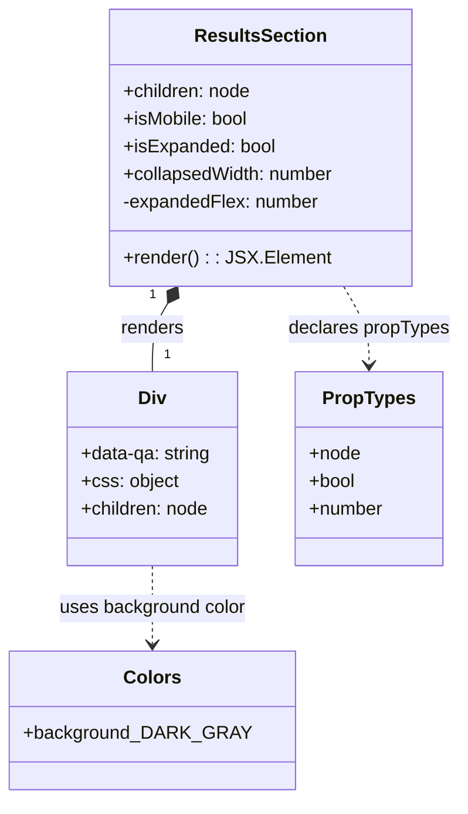

# Diagram: web/portal/src/components/map-search-results/ResultsSection.js

> Auto-generated by Obscura crawlers

## Mermaid

### SVG

<svg id="container" width="391.01171875" xmlns="http://www.w3.org/2000/svg" class="classDiagram" height="692" viewBox="0 0 391.01171875 692" role="graphics-document document" aria-roledescription="class"><g><defs><marker id="container_class-aggregationStart" class="marker aggregation class" refX="18" refY="7" markerWidth="190" markerHeight="240" orient="auto"><path d="M 18,7 L9,13 L1,7 L9,1 Z"></path></marker></defs><defs><marker id="container_class-aggregationEnd" class="marker aggregation class" refX="1" refY="7" markerWidth="20" markerHeight="28" orient="auto"><path d="M 18,7 L9,13 L1,7 L9,1 Z"></path></marker></defs><defs><marker id="container_class-extensionStart" class="marker extension class" refX="18" refY="7" markerWidth="190" markerHeight="240" orient="auto"><path d="M 1,7 L18,13 V 1 Z"></path></marker></defs><defs><marker id="container_class-extensionEnd" class="marker extension class" refX="1" refY="7" markerWidth="20" markerHeight="28" orient="auto"><path d="M 1,1 V 13 L18,7 Z"></path></marker></defs><defs><marker id="container_class-compositionStart" class="marker composition class" refX="18" refY="7" markerWidth="190" markerHeight="240" orient="auto"><path d="M 18,7 L9,13 L1,7 L9,1 Z"></path></marker></defs><defs><marker id="container_class-compositionEnd" class="marker composition class" refX="1" refY="7" markerWidth="20" markerHeight="28" orient="auto"><path d="M 18,7 L9,13 L1,7 L9,1 Z"></path></marker></defs><defs><marker id="container_class-dependencyStart" class="marker dependency class" refX="6" refY="7" markerWidth="190" markerHeight="240" orient="auto"><path d="M 5,7 L9,13 L1,7 L9,1 Z"></path></marker></defs><defs><marker id="container_class-dependencyEnd" class="marker dependency class" refX="13" refY="7" markerWidth="20" markerHeight="28" orient="auto"><path d="M 18,7 L9,13 L14,7 L9,1 Z"></path></marker></defs><defs><marker id="container_class-lollipopStart" class="marker lollipop class" refX="13" refY="7" markerWidth="190" markerHeight="240" orient="auto"><circle stroke="black" fill="transparent" cx="7" cy="7" r="6"></circle></marker></defs><defs><marker id="container_class-lollipopEnd" class="marker lollipop class" refX="1" refY="7" markerWidth="190" markerHeight="240" orient="auto"><circle stroke="black" fill="transparent" cx="7" cy="7" r="6"></circle></marker></defs><g class="root"><g class="clusters"></g><g class="edgePaths"><path d="M137.289,262.784L135.063,266.487C132.837,270.189,128.385,277.595,126.159,287.464C123.934,297.333,123.934,309.667,123.934,315.833L123.934,322" id="id_ResultsSection_Div_1" class="edge-thickness-normal edge-pattern-solid relation" style=";;;" data-edge="true" data-et="edge" data-id="id_ResultsSection_Div_1" data-points="W3sieCI6MTQ2LjE3NjY3Njk1MDYzNjkzLCJ5IjoyNDh9LHsieCI6MTIzLjkzMzU5Mzc1LCJ5IjoyODV9LHsieCI6MTIzLjkzMzU5Mzc1LCJ5IjozMjJ9XQ==" marker-start="url(#container_class-compositionStart)"></path><path d="M290.456,248L294.163,254.167C297.87,260.333,305.285,272.667,308.992,284C312.699,295.333,312.699,305.667,312.699,310.833L312.699,316" id="id_ResultsSection_PropTypes_2" class="edge-thickness-normal edge-pattern-dashed relation" style=";;;" data-edge="true" data-et="edge" data-id="id_ResultsSection_PropTypes_2" data-points="W3sieCI6MjkwLjQ1NjEzNTU0OTM2MzA3LCJ5IjoyNDh9LHsieCI6MzEyLjY5OTIxODc1LCJ5IjoyODV9LHsieCI6MzEyLjY5OTIxODc1LCJ5IjozMjJ9XQ==" marker-end="url(#container_class-dependencyEnd)"></path><path d="M123.934,490L123.934,496.167C123.934,502.333,123.934,514.667,123.934,526C123.934,537.333,123.934,547.667,123.934,552.833L123.934,558" id="id_Div_Colors_3" class="edge-thickness-normal edge-pattern-dashed relation" style=";;;" data-edge="true" data-et="edge" data-id="id_Div_Colors_3" data-points="W3sieCI6MTIzLjkzMzU5Mzc1LCJ5Ijo0OTB9LHsieCI6MTIzLjkzMzU5Mzc1LCJ5Ijo1Mjd9LHsieCI6MTIzLjkzMzU5Mzc1LCJ5Ijo1NjR9XQ==" marker-end="url(#container_class-dependencyEnd)"></path></g><g class="edgeLabels"><g class="edgeLabel" transform="translate(123.93359375, 285)"><g class="label" data-id="id_ResultsSection_Div_1" transform="translate(-27.75, -12)"><foreignObject width="55.5" height="24">

renders

</foreignObject></g></g><g class="edgeLabel" transform="translate(312.69921875, 285)"><g class="label" data-id="id_ResultsSection_PropTypes_2" transform="translate(-70.3125, -12)"><foreignObject width="140.625" height="24">

declares propTypes

</foreignObject></g></g><g class="edgeLabel" transform="translate(123.93359375, 527)"><g class="label" data-id="id_Div_Colors_3" transform="translate(-81.828125, -12)"><foreignObject width="163.65625" height="24">

uses background color

</foreignObject></g></g><g class="edgeTerminals" transform="translate(124.30437851297692, 255.26997447153423)"><g class="inner" transform="translate(0, 0)"><foreignObject style="width: 9px; height: 12px;">
1
</foreignObject></g></g><g class="edgeTerminals" transform="translate(133.9335918749999, 299.49999839285715)"><g class="inner" transform="translate(0, 0)"></g><foreignObject style="width: 9px; height: 12px;">
1
</foreignObject></g></g><g class="nodes"><g class="node default" id="classId-ResultsSection-0" transform="translate(218.31640625, 128)"><g class="basic label-container"><path d="M-131.85546875 -120 L131.85546875 -120 L131.85546875 120 L-131.85546875 120" stroke="none" stroke-width="0" fill="#ECECFF" style=""></path><path d="M-131.85546875 -120 C-51.37206971547876 -120, 29.111329319042483 -120, 131.85546875 -120 M-131.85546875 -120 C-48.016243624925764 -120, 35.82298150014847 -120, 131.85546875 -120 M131.85546875 -120 C131.85546875 -25.968868694499136, 131.85546875 68.06226261100173, 131.85546875 120 M131.85546875 -120 C131.85546875 -58.42387309557611, 131.85546875 3.1522538088477745, 131.85546875 120 M131.85546875 120 C73.4717974913535 120, 15.088126232707012 120, -131.85546875 120 M131.85546875 120 C42.74383904913718 120, -46.36779065172564 120, -131.85546875 120 M-131.85546875 120 C-131.85546875 60.183037529861686, -131.85546875 0.3660750597233715, -131.85546875 -120 M-131.85546875 120 C-131.85546875 60.14603001553872, -131.85546875 0.2920600310774404, -131.85546875 -120" stroke="#9370DB" stroke-width="1.3" fill="none" stroke-dasharray="0 0" style=""></path></g><g class="annotation-group text" transform="translate(0, -96)"></g><g class="label-group text" transform="translate(-54.4609375, -96)"><g class="label" style="font-weight: bolder" transform="translate(0,-12)"><foreignObject width="108.921875" height="24">

ResultsSection

</foreignObject></g></g><g class="members-group text" transform="translate(-119.85546875, -48)"><g class="label" style="" transform="translate(0,-12)"><foreignObject width="112.578125" height="24">

+children: node

</foreignObject></g><g class="label" style="" transform="translate(0,12)"><foreignObject width="110.078125" height="24">

+isMobile: bool

</foreignObject></g><g class="label" style="" transform="translate(0,36)"><foreignObject width="132.53125" height="24">

+isExpanded: bool

</foreignObject></g><g class="label" style="" transform="translate(0,60)"><foreignObject width="185.25" height="24">

+collapsedWidth: number

</foreignObject></g><g class="label" style="" transform="translate(0,84)"><foreignObject width="171.65625" height="24">

-expandedFlex: number

</foreignObject></g></g><g class="methods-group text" transform="translate(-119.85546875, 96)"><g class="label" style="" transform="translate(0,-12)"><foreignObject width="172.34375" height="24">

+render() : : JSX.Element

</foreignObject></g></g><g class="divider" style=""><path d="M-131.85546875 -72 C-79.08039815455751 -72, -26.305327559115028 -72, 131.85546875 -72 M-131.85546875 -72 C-50.682286758049685 -72, 30.49089523390063 -72, 131.85546875 -72" stroke="#9370DB" stroke-width="1.3" fill="none" stroke-dasharray="0 0" style=""></path></g><g class="divider" style=""><path d="M-131.85546875 72 C-57.58112011297429 72, 16.69322852405142 72, 131.85546875 72 M-131.85546875 72 C-29.24514346424344 72, 73.36518182151312 72, 131.85546875 72" stroke="#9370DB" stroke-width="1.3" fill="none" stroke-dasharray="0 0" style=""></path></g></g><g class="node default" id="classId-Div-1" transform="translate(123.93359375, 406)"><g class="basic label-container"><path d="M-75.23828125 -84 L75.23828125 -84 L75.23828125 84 L-75.23828125 84" stroke="none" stroke-width="0" fill="#ECECFF" style=""></path><path d="M-75.23828125 -84 C-32.721665767070284 -84, 9.794949715859431 -84, 75.23828125 -84 M-75.23828125 -84 C-27.454262989658773 -84, 20.329755270682455 -84, 75.23828125 -84 M75.23828125 -84 C75.23828125 -35.61000056213781, 75.23828125 12.779998875724374, 75.23828125 84 M75.23828125 -84 C75.23828125 -41.157938542098634, 75.23828125 1.6841229158027318, 75.23828125 84 M75.23828125 84 C44.6444166026032 84, 14.050551955206409 84, -75.23828125 84 M75.23828125 84 C36.044997640216145 84, -3.1482859695677092 84, -75.23828125 84 M-75.23828125 84 C-75.23828125 18.931544437947537, -75.23828125 -46.13691112410493, -75.23828125 -84 M-75.23828125 84 C-75.23828125 32.863274010429194, -75.23828125 -18.273451979141612, -75.23828125 -84" stroke="#9370DB" stroke-width="1.3" fill="none" stroke-dasharray="0 0" style=""></path></g><g class="annotation-group text" transform="translate(0, -60)"></g><g class="label-group text" transform="translate(-11.5703125, -60)"><g class="label" style="font-weight: bolder" transform="translate(0,-12)"><foreignObject width="23.140625" height="24">

Div

</foreignObject></g></g><g class="members-group text" transform="translate(-63.23828125, -12)"><g class="label" style="" transform="translate(0,-12)"><foreignObject width="114.90625" height="24">

+data-qa: string

</foreignObject></g><g class="label" style="" transform="translate(0,12)"><foreignObject width="83.96875" height="24">

+css: object

</foreignObject></g><g class="label" style="" transform="translate(0,36)"><foreignObject width="112.578125" height="24">

+children: node

</foreignObject></g></g><g class="methods-group text" transform="translate(-63.23828125, 84)"></g><g class="divider" style=""><path d="M-75.23828125 -36 C-26.390251656075513 -36, 22.457777937848974 -36, 75.23828125 -36 M-75.23828125 -36 C-27.97000708821038 -36, 19.29826707357924 -36, 75.23828125 -36" stroke="#9370DB" stroke-width="1.3" fill="none" stroke-dasharray="0 0" style=""></path></g><g class="divider" style=""><path d="M-75.23828125 60 C-30.68090640860759 60, 13.876468432784819 60, 75.23828125 60 M-75.23828125 60 C-18.470125196448492 60, 38.298030857103015 60, 75.23828125 60" stroke="#9370DB" stroke-width="1.3" fill="none" stroke-dasharray="0 0" style=""></path></g></g><g class="node default" id="classId-Colors-2" transform="translate(123.93359375, 624)"><g class="basic label-container"><path d="M-115.93359375 -60 L115.93359375 -60 L115.93359375 60 L-115.93359375 60" stroke="none" stroke-width="0" fill="#ECECFF" style=""></path><path d="M-115.93359375 -60 C-63.61307632368461 -60, -11.292558897369219 -60, 115.93359375 -60 M-115.93359375 -60 C-58.63230594261566 -60, -1.331018135231318 -60, 115.93359375 -60 M115.93359375 -60 C115.93359375 -26.981286303339033, 115.93359375 6.037427393321934, 115.93359375 60 M115.93359375 -60 C115.93359375 -28.79937305782792, 115.93359375 2.4012538843441575, 115.93359375 60 M115.93359375 60 C28.2511022817327 60, -59.4313891865346 60, -115.93359375 60 M115.93359375 60 C24.937070906063227 60, -66.05945193787355 60, -115.93359375 60 M-115.93359375 60 C-115.93359375 24.233937622573848, -115.93359375 -11.532124754852305, -115.93359375 -60 M-115.93359375 60 C-115.93359375 16.73310853098696, -115.93359375 -26.53378293802608, -115.93359375 -60" stroke="#9370DB" stroke-width="1.3" fill="none" stroke-dasharray="0 0" style=""></path></g><g class="annotation-group text" transform="translate(0, -36)"></g><g class="label-group text" transform="translate(-23.1015625, -36)"><g class="label" style="font-weight: bolder" transform="translate(0,-12)"><foreignObject width="46.203125" height="24">

Colors

</foreignObject></g></g><g class="members-group text" transform="translate(-103.93359375, 12)"><g class="label" style="" transform="translate(0,-12)"><foreignObject width="184.765625" height="24">

+background_DARK_GRAY

</foreignObject></g></g><g class="methods-group text" transform="translate(-103.93359375, 60)"></g><g class="divider" style=""><path d="M-115.93359375 -12 C-62.71541767547673 -12, -9.497241600953458 -12, 115.93359375 -12 M-115.93359375 -12 C-57.280741436769354 -12, 1.3721108764612922 -12, 115.93359375 -12" stroke="#9370DB" stroke-width="1.3" fill="none" stroke-dasharray="0 0" style=""></path></g><g class="divider" style=""><path d="M-115.93359375 36 C-32.9973928361414 36, 49.9388080777172 36, 115.93359375 36 M-115.93359375 36 C-66.65449644947833 36, -17.375399148956646 36, 115.93359375 36" stroke="#9370DB" stroke-width="1.3" fill="none" stroke-dasharray="0 0" style=""></path></g></g><g class="node default" id="classId-PropTypes-3" transform="translate(312.69921875, 406)"><g class="basic label-container"><path d="M-63.52734375 -84 L63.52734375 -84 L63.52734375 84 L-63.52734375 84" stroke="none" stroke-width="0" fill="#ECECFF" style=""></path><path d="M-63.52734375 -84 C-28.284517294449124 -84, 6.958309161101752 -84, 63.52734375 -84 M-63.52734375 -84 C-37.660708881855925 -84, -11.794074013711857 -84, 63.52734375 -84 M63.52734375 -84 C63.52734375 -19.128455761648425, 63.52734375 45.74308847670315, 63.52734375 84 M63.52734375 -84 C63.52734375 -40.08877782649258, 63.52734375 3.8224443470148373, 63.52734375 84 M63.52734375 84 C34.6079696313905 84, 5.688595512780999 84, -63.52734375 84 M63.52734375 84 C13.300457428845093 84, -36.926428892309815 84, -63.52734375 84 M-63.52734375 84 C-63.52734375 21.076131633690167, -63.52734375 -41.847736732619666, -63.52734375 -84 M-63.52734375 84 C-63.52734375 48.33475368032255, -63.52734375 12.669507360645099, -63.52734375 -84" stroke="#9370DB" stroke-width="1.3" fill="none" stroke-dasharray="0 0" style=""></path></g><g class="annotation-group text" transform="translate(0, -60)"></g><g class="label-group text" transform="translate(-38.2578125, -60)"><g class="label" style="font-weight: bolder" transform="translate(0,-12)"><foreignObject width="76.515625" height="24">

PropTypes

</foreignObject></g></g><g class="members-group text" transform="translate(-51.52734375, -12)"><g class="label" style="" transform="translate(0,-12)"><foreignObject width="45" height="24">

+node

</foreignObject></g><g class="label" style="" transform="translate(0,12)"><foreignObject width="40.875" height="24">

+bool

</foreignObject></g><g class="label" style="" transform="translate(0,36)"><foreignObject width="64.796875" height="24">

+number

</foreignObject></g></g><g class="methods-group text" transform="translate(-51.52734375, 84)"></g><g class="divider" style=""><path d="M-63.52734375 -36 C-18.706604514899823 -36, 26.114134720200354 -36, 63.52734375 -36 M-63.52734375 -36 C-28.513110607801593 -36, 6.5011225343968135 -36, 63.52734375 -36" stroke="#9370DB" stroke-width="1.3" fill="none" stroke-dasharray="0 0" style=""></path></g><g class="divider" style=""><path d="M-63.52734375 60 C-21.50603326677311 60, 20.515277216453782 60, 63.52734375 60 M-63.52734375 60 C-25.928851879285368 60, 11.669639991429264 60, 63.52734375 60" stroke="#9370DB" stroke-width="1.3" fill="none" stroke-dasharray="0 0" style=""></path></g></g></g></g></g></svg>
