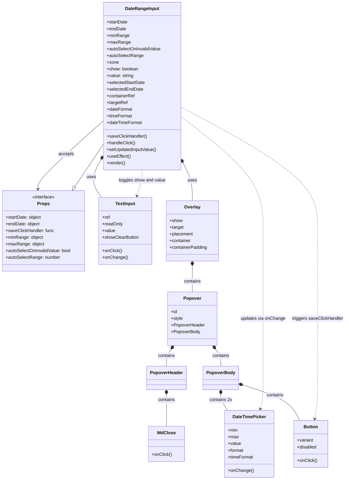

# Diagram: web/portal/src/components/molecules/DateRangeInput.molecule.js

> Auto-generated by Obscura crawlers

## Mermaid

```mermaid
classDiagram
    class DateRangeInput {
        +startDate
        +endDate
        +saveClickHandler()
        +minRange
        +maxRange
        +autoSelectOnInvalidValue
        +autoSelectRange
        +zone
        +show: boolean
        +value: string
        +selectedStartDate
        +selectedEndDate
        +containerRef
        +targetRef
        +dateFormat
        +timeFormat
        +dateTimeFormat
        +handleClick()
        +setUpdatedInputValue()
        +useEffect()
        +render()
    }

    class Props <<interface>> {
        +startDate: object
        +endDate: object
        +saveClickHandler: func
        +minRange: object
        +maxRange: object
        +autoSelectOnInvalidValue: bool
        +autoSelectRange: number
    }

    class TextInput {
        +ref
        +readOnly
        +onClick()
        +value
        +showClearButton
        +onChange()
    }

    class Overlay {
        +show
        +target
        +placement
        +container
        +containerPadding
    }

    class Popover {
        +id
        +style
        +PopoverHeader
        +PopoverBody
    }

    class DateTimePicker {
        +min
        +max
        +value
        +format
        +timeFormat
        +onChange()
    }

    class Button {
        +variant
        +disabled
        +onClick()
    }

    class MdClose {
        +onClick()
    }

    DateRangeInput --> Props : accepts
    DateRangeInput *-- TextInput : uses
    DateRangeInput *-- Overlay : uses
    Overlay *-- Popover : contains
    Popover *-- PopoverHeader : contains
    Popover *-- PopoverBody : contains
    PopoverBody *-- DateTimePicker : contains 2x
    PopoverBody *-- Button : contains
    PopoverHeader *-- MdClose : contains
    DateRangeInput ..> DateTimePicker : updates via onChange
    DateRangeInput ..> Button : triggers saveClickHandler
    DateRangeInput ..> TextInput : toggles show and value
    Props <|-- DateRangeInput
```

> SVG rendering failed for this diagram.
