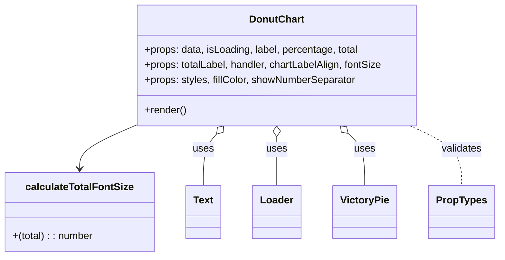

# Diagram: web/portal/src/components/molecules/DonutChart.molecule.js


> Auto-generated by Obscura crawlers

## Diagram 1



### SVG

<svg id="container" width="779.2890625" xmlns="http://www.w3.org/2000/svg" class="classDiagram" height="408" viewBox="0 0 779.2890625 408" role="graphics-document document" aria-roledescription="class"><style>#container{font-family:"trebuchet ms",verdana,arial,sans-serif;font-size:16px;fill:#333;}@keyframes edge-animation-frame{from{stroke-dashoffset:0;}}@keyframes dash{to{stroke-dashoffset:0;}}#container .edge-animation-slow{stroke-dasharray:9,5!important;stroke-dashoffset:900;animation:dash 50s linear infinite;stroke-linecap:round;}#container .edge-animation-fast{stroke-dasharray:9,5!important;stroke-dashoffset:900;animation:dash 20s linear infinite;stroke-linecap:round;}#container .error-icon{fill:#552222;}#container .error-text{fill:#552222;stroke:#552222;}#container .edge-thickness-normal{stroke-width:1px;}#container .edge-thickness-thick{stroke-width:3.5px;}#container .edge-pattern-solid{stroke-dasharray:0;}#container .edge-thickness-invisible{stroke-width:0;fill:none;}#container .edge-pattern-dashed{stroke-dasharray:3;}#container .edge-pattern-dotted{stroke-dasharray:2;}#container .marker{fill:#333333;stroke:#333333;}#container .marker.cross{stroke:#333333;}#container svg{font-family:"trebuchet ms",verdana,arial,sans-serif;font-size:16px;}#container p{margin:0;}#container g.classGroup text{fill:#9370DB;stroke:none;font-family:"trebuchet ms",verdana,arial,sans-serif;font-size:10px;}#container g.classGroup text .title{font-weight:bolder;}#container .nodeLabel,#container .edgeLabel{color:#131300;}#container .edgeLabel .label rect{fill:#ECECFF;}#container .label text{fill:#131300;}#container .labelBkg{background:#ECECFF;}#container .edgeLabel .label span{background:#ECECFF;}#container .classTitle{font-weight:bolder;}#container .node rect,#container .node circle,#container .node ellipse,#container .node polygon,#container .node path{fill:#ECECFF;stroke:#9370DB;stroke-width:1px;}#container .divider{stroke:#9370DB;stroke-width:1;}#container g.clickable{cursor:pointer;}#container g.classGroup rect{fill:#ECECFF;stroke:#9370DB;}#container g.classGroup line{stroke:#9370DB;stroke-width:1;}#container .classLabel .box{stroke:none;stroke-width:0;fill:#ECECFF;opacity:0.5;}#container .classLabel .label{fill:#9370DB;font-size:10px;}#container .relation{stroke:#333333;stroke-width:1;fill:none;}#container .dashed-line{stroke-dasharray:3;}#container .dotted-line{stroke-dasharray:1 2;}#container #compositionStart,#container .composition{fill:#333333!important;stroke:#333333!important;stroke-width:1;}#container #compositionEnd,#container .composition{fill:#333333!important;stroke:#333333!important;stroke-width:1;}#container #dependencyStart,#container .dependency{fill:#333333!important;stroke:#333333!important;stroke-width:1;}#container #dependencyStart,#container .dependency{fill:#333333!important;stroke:#333333!important;stroke-width:1;}#container #extensionStart,#container .extension{fill:transparent!important;stroke:#333333!important;stroke-width:1;}#container #extensionEnd,#container .extension{fill:transparent!important;stroke:#333333!important;stroke-width:1;}#container #aggregationStart,#container .aggregation{fill:transparent!important;stroke:#333333!important;stroke-width:1;}#container #aggregationEnd,#container .aggregation{fill:transparent!important;stroke:#333333!important;stroke-width:1;}#container #lollipopStart,#container .lollipop{fill:#ECECFF!important;stroke:#333333!important;stroke-width:1;}#container #lollipopEnd,#container .lollipop{fill:#ECECFF!important;stroke:#333333!important;stroke-width:1;}#container .edgeTerminals{font-size:11px;line-height:initial;}#container .classTitleText{text-anchor:middle;font-size:18px;fill:#333;}#container .label-icon{display:inline-block;height:1em;overflow:visible;vertical-align:-0.125em;}#container .node .label-icon path{fill:currentColor;stroke:revert;stroke-width:revert;}#container :root{--mermaid-font-family:"trebuchet ms",verdana,arial,sans-serif;}</style><g><defs><marker id="container_class-aggregationStart" class="marker aggregation class" refX="18" refY="7" markerWidth="190" markerHeight="240" orient="auto"><path d="M 18,7 L9,13 L1,7 L9,1 Z"></path></marker></defs><defs><marker id="container_class-aggregationEnd" class="marker aggregation class" refX="1" refY="7" markerWidth="20" markerHeight="28" orient="auto"><path d="M 18,7 L9,13 L1,7 L9,1 Z"></path></marker></defs><defs><marker id="container_class-extensionStart" class="marker extension class" refX="18" refY="7" markerWidth="190" markerHeight="240" orient="auto"><path d="M 1,7 L18,13 V 1 Z"></path></marker></defs><defs><marker id="container_class-extensionEnd" class="marker extension class" refX="1" refY="7" markerWidth="20" markerHeight="28" orient="auto"><path d="M 1,1 V 13 L18,7 Z"></path></marker></defs><defs><marker id="container_class-compositionStart" class="marker composition class" refX="18" refY="7" markerWidth="190" markerHeight="240" orient="auto"><path d="M 18,7 L9,13 L1,7 L9,1 Z"></path></marker></defs><defs><marker id="container_class-compositionEnd" class="marker composition class" refX="1" refY="7" markerWidth="20" markerHeight="28" orient="auto"><path d="M 18,7 L9,13 L1,7 L9,1 Z"></path></marker></defs><defs><marker id="container_class-dependencyStart" class="marker dependency class" refX="6" refY="7" markerWidth="190" markerHeight="240" orient="auto"><path d="M 5,7 L9,13 L1,7 L9,1 Z"></path></marker></defs><defs><marker id="container_class-dependencyEnd" class="marker dependency class" refX="13" refY="7" markerWidth="20" markerHeight="28" orient="auto"><path d="M 18,7 L9,13 L14,7 L9,1 Z"></path></marker></defs><defs><marker id="container_class-lollipopStart" class="marker lollipop class" refX="13" refY="7" markerWidth="190" markerHeight="240" orient="auto"><circle stroke="black" fill="transparent" cx="7" cy="7" r="6"></circle></marker></defs><defs><marker id="container_class-lollipopEnd" class="marker lollipop class" refX="1" refY="7" markerWidth="190" markerHeight="240" orient="auto"><circle stroke="black" fill="transparent" cx="7" cy="7" r="6"></circle></marker></defs><g class="root"><g class="clusters"></g><g class="edgePaths"><path d="M211.756,200L197.397,206.167C183.039,212.333,154.322,224.667,139.964,236C125.605,247.333,125.605,257.667,125.605,262.833L125.605,268" id="id_DonutChart_calculateTotalFontSize_1" class="edge-thickness-normal edge-pattern-solid relation" style=";;;" data-edge="true" data-et="edge" data-id="id_DonutChart_calculateTotalFontSize_1" data-points="W3sieCI6MjExLjc1NTg3NDA2MDE1MDM4LCJ5IjoyMDB9LHsieCI6MTI1LjYwNTQ2ODc1LCJ5IjoyMzd9LHsieCI6MTI1LjYwNTQ2ODc1LCJ5IjoyNzR9XQ==" marker-end="url(#container_class-dependencyEnd)"></path><path d="M341.234,213.064L337.794,217.053C334.354,221.043,327.474,229.021,324.034,242.677C320.594,256.333,320.594,275.667,320.594,285.333L320.594,295" id="id_DonutChart_Text_2" class="edge-thickness-normal edge-pattern-solid relation" style=";;;" data-edge="true" data-et="edge" data-id="id_DonutChart_Text_2" data-points="W3sieCI6MzUyLjQ5OTI5NTExMjc4MTk3LCJ5IjoyMDB9LHsieCI6MzIwLjU5Mzc1LCJ5IjoyMzd9LHsieCI6MzIwLjU5Mzc1LCJ5IjoyOTV9XQ==" marker-start="url(#container_class-aggregationStart)"></path><path d="M435.281,217.25L435.281,220.542C435.281,223.833,435.281,230.417,435.281,243.375C435.281,256.333,435.281,275.667,435.281,285.333L435.281,295" id="id_DonutChart_Loader_3" class="edge-thickness-normal edge-pattern-solid relation" style=";;;" data-edge="true" data-et="edge" data-id="id_DonutChart_Loader_3" data-points="W3sieCI6NDM1LjI4MTI1LCJ5IjoyMDB9LHsieCI6NDM1LjI4MTI1LCJ5IjoyMzd9LHsieCI6NDM1LjI4MTI1LCJ5IjoyOTV9XQ==" marker-start="url(#container_class-aggregationStart)"></path><path d="M546.085,212.043L550.351,216.202C554.616,220.362,563.148,228.681,567.414,242.507C571.68,256.333,571.68,275.667,571.68,285.333L571.68,295" id="id_DonutChart_VictoryPie_4" class="edge-thickness-normal edge-pattern-solid relation" style=";;;" data-edge="true" data-et="edge" data-id="id_DonutChart_VictoryPie_4" data-points="W3sieCI6NTMzLjczNDI1NzUxODc5NywieSI6MjAwfSx7IngiOjU3MS42Nzk2ODc1LCJ5IjoyMzd9LHsieCI6NTcxLjY3OTY4NzUsInkiOjI5NX1d" marker-start="url(#container_class-aggregationStart)"></path><path d="M641.537,200L654.786,206.167C668.035,212.333,694.533,224.667,707.782,240.5C721.031,256.333,721.031,275.667,721.031,285.333L721.031,295" id="id_DonutChart_PropTypes_5" class="edge-thickness-normal edge-pattern-dashed relation" style=";;;" data-edge="true" data-et="edge" data-id="id_DonutChart_PropTypes_5" data-points="W3sieCI6NjQxLjUzNjg4OTA5Nzc0NDQsInkiOjIwMH0seyJ4Ijo3MjEuMDMxMjUsInkiOjIzN30seyJ4Ijo3MjEuMDMxMjUsInkiOjI5NX1d"></path></g><g class="edgeLabels"><g class="edgeLabel"><g class="label" data-id="id_DonutChart_calculateTotalFontSize_1" transform="translate(0, 0)"><foreignObject width="0" height="0"><div xmlns="http://www.w3.org/1999/xhtml" class="labelBkg" style="display: table-cell; white-space: nowrap; line-height: 1.5; max-width: 200px; text-align: center;"><span class="edgeLabel"></span></div></foreignObject></g></g><g class="edgeLabel" transform="translate(320.59375, 237)"><g class="label" data-id="id_DonutChart_Text_2" transform="translate(-16.4921875, -12)"><foreignObject width="32.984375" height="24"><div xmlns="http://www.w3.org/1999/xhtml" class="labelBkg" style="display: table-cell; white-space: nowrap; line-height: 1.5; max-width: 200px; text-align: center;"><span class="edgeLabel"><p>uses</p></span></div></foreignObject></g></g><g class="edgeLabel" transform="translate(435.28125, 237)"><g class="label" data-id="id_DonutChart_Loader_3" transform="translate(-16.4921875, -12)"><foreignObject width="32.984375" height="24"><div xmlns="http://www.w3.org/1999/xhtml" class="labelBkg" style="display: table-cell; white-space: nowrap; line-height: 1.5; max-width: 200px; text-align: center;"><span class="edgeLabel"><p>uses</p></span></div></foreignObject></g></g><g class="edgeLabel" transform="translate(571.6796875, 237)"><g class="label" data-id="id_DonutChart_VictoryPie_4" transform="translate(-16.4921875, -12)"><foreignObject width="32.984375" height="24"><div xmlns="http://www.w3.org/1999/xhtml" class="labelBkg" style="display: table-cell; white-space: nowrap; line-height: 1.5; max-width: 200px; text-align: center;"><span class="edgeLabel"><p>uses</p></span></div></foreignObject></g></g><g class="edgeLabel" transform="translate(721.03125, 237)"><g class="label" data-id="id_DonutChart_PropTypes_5" transform="translate(-32.6875, -12)"><foreignObject width="65.375" height="24"><div xmlns="http://www.w3.org/1999/xhtml" class="labelBkg" style="display: table-cell; white-space: nowrap; line-height: 1.5; max-width: 200px; text-align: center;"><span class="edgeLabel"><p>validates</p></span></div></foreignObject></g></g></g><g class="nodes"><g class="node default" id="classId-DonutChart-0" transform="translate(435.28125, 104)"><g class="basic label-container"><path d="M-224.01171875 -96 L224.01171875 -96 L224.01171875 96 L-224.01171875 96" stroke="none" stroke-width="0" fill="#ECECFF" style=""></path><path d="M-224.01171875 -96 C-46.67358651843884 -96, 130.66454571312232 -96, 224.01171875 -96 M-224.01171875 -96 C-69.093571835375 -96, 85.82457507925 -96, 224.01171875 -96 M224.01171875 -96 C224.01171875 -57.13940224114094, 224.01171875 -18.278804482281885, 224.01171875 96 M224.01171875 -96 C224.01171875 -32.11324767959624, 224.01171875 31.773504640807516, 224.01171875 96 M224.01171875 96 C84.30683924104974 96, -55.39804026790051 96, -224.01171875 96 M224.01171875 96 C88.21651766890062 96, -47.57868341219876 96, -224.01171875 96 M-224.01171875 96 C-224.01171875 31.5804455486886, -224.01171875 -32.8391089026228, -224.01171875 -96 M-224.01171875 96 C-224.01171875 40.50713600268084, -224.01171875 -14.985727994638324, -224.01171875 -96" stroke="#9370DB" stroke-width="1.3" fill="none" stroke-dasharray="0 0" style=""></path></g><g class="annotation-group text" transform="translate(0, -72)"></g><g class="label-group text" transform="translate(-41.9765625, -72)"><g class="label" style="font-weight: bolder" transform="translate(0,-12)"><foreignObject width="83.953125" height="24"><div xmlns="http://www.w3.org/1999/xhtml" style="display: table-cell; white-space: nowrap; line-height: 1.5; max-width: 133px; text-align: center;"><span class="nodeLabel markdown-node-label" style=""><p>DonutChart</p></span></div></foreignObject></g></g><g class="members-group text" transform="translate(-212.01171875, -24)"><g class="label" style="" transform="translate(0,-12)"><foreignObject width="342.015625" height="24"><div xmlns="http://www.w3.org/1999/xhtml" style="display: table-cell; white-space: nowrap; line-height: 1.5; max-width: 400px; text-align: center;"><span class="nodeLabel markdown-node-label" style=""><p>+props: data, isLoading, label, percentage, total</p></span></div></foreignObject></g><g class="label" style="" transform="translate(0,12)"><foreignObject width="382.046875" height="24"><div xmlns="http://www.w3.org/1999/xhtml" style="display: table-cell; white-space: nowrap; line-height: 1.5; max-width: 439px; text-align: center;"><span class="nodeLabel markdown-node-label" style=""><p>+props: totalLabel, handler, chartLabelAlign, fontSize</p></span></div></foreignObject></g><g class="label" style="" transform="translate(0,36)"><foreignObject width="337.875" height="24"><div xmlns="http://www.w3.org/1999/xhtml" style="display: table-cell; white-space: nowrap; line-height: 1.5; max-width: 396px; text-align: center;"><span class="nodeLabel markdown-node-label" style=""><p>+props: styles, fillColor, showNumberSeparator</p></span></div></foreignObject></g></g><g class="methods-group text" transform="translate(-212.01171875, 72)"><g class="label" style="" transform="translate(0,-12)"><foreignObject width="66.609375" height="24"><div xmlns="http://www.w3.org/1999/xhtml" style="display: table-cell; white-space: nowrap; line-height: 1.5; max-width: 124px; text-align: center;"><span class="nodeLabel markdown-node-label" style=""><p>+render()</p></span></div></foreignObject></g></g><g class="divider" style=""><path d="M-224.01171875 -48 C-51.3081941895874 -48, 121.3953303708252 -48, 224.01171875 -48 M-224.01171875 -48 C-47.486728483325635 -48, 129.03826178334873 -48, 224.01171875 -48" stroke="#9370DB" stroke-width="1.3" fill="none" stroke-dasharray="0 0" style=""></path></g><g class="divider" style=""><path d="M-224.01171875 48 C-101.66589027641491 48, 20.679938197170173 48, 224.01171875 48 M-224.01171875 48 C-89.15382284642504 48, 45.70407305714991 48, 224.01171875 48" stroke="#9370DB" stroke-width="1.3" fill="none" stroke-dasharray="0 0" style=""></path></g></g><g class="node default" id="classId-calculateTotalFontSize-1" transform="translate(125.60546875, 337)"><g class="basic label-container"><path d="M-117.60546875 -63 L117.60546875 -63 L117.60546875 63 L-117.60546875 63" stroke="none" stroke-width="0" fill="#ECECFF" style=""></path><path d="M-117.60546875 -63 C-30.7961879746925 -63, 56.013092800615 -63, 117.60546875 -63 M-117.60546875 -63 C-44.78448333373309 -63, 28.036502082533815 -63, 117.60546875 -63 M117.60546875 -63 C117.60546875 -28.647492919869393, 117.60546875 5.705014160261214, 117.60546875 63 M117.60546875 -63 C117.60546875 -25.90297849141634, 117.60546875 11.194043017167317, 117.60546875 63 M117.60546875 63 C50.407818427469095 63, -16.78983189506181 63, -117.60546875 63 M117.60546875 63 C61.423222695640206 63, 5.240976641280412 63, -117.60546875 63 M-117.60546875 63 C-117.60546875 20.379865773941283, -117.60546875 -22.240268452117434, -117.60546875 -63 M-117.60546875 63 C-117.60546875 22.8097499169385, -117.60546875 -17.380500166123, -117.60546875 -63" stroke="#9370DB" stroke-width="1.3" fill="none" stroke-dasharray="0 0" style=""></path></g><g class="annotation-group text" transform="translate(0, -39)"></g><g class="label-group text" transform="translate(-81.8671875, -39)"><g class="label" style="font-weight: bolder" transform="translate(0,-12)"><foreignObject width="163.734375" height="24"><div xmlns="http://www.w3.org/1999/xhtml" style="display: table-cell; white-space: nowrap; line-height: 1.5; max-width: 211px; text-align: center;"><span class="nodeLabel markdown-node-label" style=""><p>calculateTotalFontSize</p></span></div></foreignObject></g></g><g class="members-group text" transform="translate(-105.60546875, 9)"></g><g class="methods-group text" transform="translate(-105.60546875, 39)"><g class="label" style="" transform="translate(0,-12)"><foreignObject width="129.34375" height="24"><div xmlns="http://www.w3.org/1999/xhtml" style="display: table-cell; white-space: nowrap; line-height: 1.5; max-width: 180px; text-align: center;"><span class="nodeLabel markdown-node-label" style=""><p>+(total) : : number</p></span></div></foreignObject></g></g><g class="divider" style=""><path d="M-117.60546875 -15 C-68.66818058019432 -15, -19.730892410388634 -15, 117.60546875 -15 M-117.60546875 -15 C-56.647578755841444 -15, 4.310311238317112 -15, 117.60546875 -15" stroke="#9370DB" stroke-width="1.3" fill="none" stroke-dasharray="0 0" style=""></path></g><g class="divider" style=""><path d="M-117.60546875 9 C-32.16160440258783 9, 53.28225994482435 9, 117.60546875 9 M-117.60546875 9 C-57.23360498394593 9, 3.1382587821081387 9, 117.60546875 9" stroke="#9370DB" stroke-width="1.3" fill="none" stroke-dasharray="0 0" style=""></path></g></g><g class="node default" id="classId-Text-2" transform="translate(320.59375, 337)"><g class="basic label-container"><path d="M-27.3828125 -42 L27.3828125 -42 L27.3828125 42 L-27.3828125 42" stroke="none" stroke-width="0" fill="#ECECFF" style=""></path><path d="M-27.3828125 -42 C-13.85292358083731 -42, -0.3230346616746189 -42, 27.3828125 -42 M-27.3828125 -42 C-11.905273011311825 -42, 3.572266477376349 -42, 27.3828125 -42 M27.3828125 -42 C27.3828125 -18.099555340618984, 27.3828125 5.800889318762032, 27.3828125 42 M27.3828125 -42 C27.3828125 -8.611909331786755, 27.3828125 24.77618133642649, 27.3828125 42 M27.3828125 42 C11.033361153336667 42, -5.316090193326666 42, -27.3828125 42 M27.3828125 42 C12.770763790066649 42, -1.8412849198667018 42, -27.3828125 42 M-27.3828125 42 C-27.3828125 11.403764294458867, -27.3828125 -19.192471411082266, -27.3828125 -42 M-27.3828125 42 C-27.3828125 16.48523693040104, -27.3828125 -9.02952613919792, -27.3828125 -42" stroke="#9370DB" stroke-width="1.3" fill="none" stroke-dasharray="0 0" style=""></path></g><g class="annotation-group text" transform="translate(0, -18)"></g><g class="label-group text" transform="translate(-15.3828125, -18)"><g class="label" style="font-weight: bolder" transform="translate(0,-12)"><foreignObject width="30.765625" height="24"><div xmlns="http://www.w3.org/1999/xhtml" style="display: table-cell; white-space: nowrap; line-height: 1.5; max-width: 80px; text-align: center;"><span class="nodeLabel markdown-node-label" style=""><p>Text</p></span></div></foreignObject></g></g><g class="members-group text" transform="translate(-15.3828125, 30)"></g><g class="methods-group text" transform="translate(-15.3828125, 60)"></g><g class="divider" style=""><path d="M-27.3828125 6 C-9.506885996085497 6, 8.369040507829006 6, 27.3828125 6 M-27.3828125 6 C-11.589220755004293 6, 4.204370989991414 6, 27.3828125 6" stroke="#9370DB" stroke-width="1.3" fill="none" stroke-dasharray="0 0" style=""></path></g><g class="divider" style=""><path d="M-27.3828125 24 C-14.08546503737621 24, -0.7881175747524196 24, 27.3828125 24 M-27.3828125 24 C-14.788730011060403 24, -2.194647522120807 24, 27.3828125 24" stroke="#9370DB" stroke-width="1.3" fill="none" stroke-dasharray="0 0" style=""></path></g></g><g class="node default" id="classId-Loader-3" transform="translate(435.28125, 337)"><g class="basic label-container"><path d="M-37.3046875 -42 L37.3046875 -42 L37.3046875 42 L-37.3046875 42" stroke="none" stroke-width="0" fill="#ECECFF" style=""></path><path d="M-37.3046875 -42 C-9.32363011646629 -42, 18.65742726706742 -42, 37.3046875 -42 M-37.3046875 -42 C-12.732100148178585 -42, 11.84048720364283 -42, 37.3046875 -42 M37.3046875 -42 C37.3046875 -14.560796642506027, 37.3046875 12.878406714987946, 37.3046875 42 M37.3046875 -42 C37.3046875 -13.399284962791778, 37.3046875 15.201430074416443, 37.3046875 42 M37.3046875 42 C9.128206525478461 42, -19.048274449043078 42, -37.3046875 42 M37.3046875 42 C19.963401097634602 42, 2.622114695269204 42, -37.3046875 42 M-37.3046875 42 C-37.3046875 24.843917030429147, -37.3046875 7.687834060858293, -37.3046875 -42 M-37.3046875 42 C-37.3046875 24.96544160814255, -37.3046875 7.930883216285103, -37.3046875 -42" stroke="#9370DB" stroke-width="1.3" fill="none" stroke-dasharray="0 0" style=""></path></g><g class="annotation-group text" transform="translate(0, -18)"></g><g class="label-group text" transform="translate(-25.3046875, -18)"><g class="label" style="font-weight: bolder" transform="translate(0,-12)"><foreignObject width="50.609375" height="24"><div xmlns="http://www.w3.org/1999/xhtml" style="display: table-cell; white-space: nowrap; line-height: 1.5; max-width: 101px; text-align: center;"><span class="nodeLabel markdown-node-label" style=""><p>Loader</p></span></div></foreignObject></g></g><g class="members-group text" transform="translate(-25.3046875, 30)"></g><g class="methods-group text" transform="translate(-25.3046875, 60)"></g><g class="divider" style=""><path d="M-37.3046875 6 C-18.29778580821867 6, 0.7091158835626601 6, 37.3046875 6 M-37.3046875 6 C-19.945283692315687 6, -2.5858798846313746 6, 37.3046875 6" stroke="#9370DB" stroke-width="1.3" fill="none" stroke-dasharray="0 0" style=""></path></g><g class="divider" style=""><path d="M-37.3046875 24 C-20.188138595567022 24, -3.0715896911340437 24, 37.3046875 24 M-37.3046875 24 C-20.601798224450192 24, -3.8989089489003845 24, 37.3046875 24" stroke="#9370DB" stroke-width="1.3" fill="none" stroke-dasharray="0 0" style=""></path></g></g><g class="node default" id="classId-VictoryPie-4" transform="translate(571.6796875, 337)"><g class="basic label-container"><path d="M-49.09375 -42 L49.09375 -42 L49.09375 42 L-49.09375 42" stroke="none" stroke-width="0" fill="#ECECFF" style=""></path><path d="M-49.09375 -42 C-22.690249873294803 -42, 3.7132502534103935 -42, 49.09375 -42 M-49.09375 -42 C-27.08318141261978 -42, -5.07261282523956 -42, 49.09375 -42 M49.09375 -42 C49.09375 -15.063403483912005, 49.09375 11.87319303217599, 49.09375 42 M49.09375 -42 C49.09375 -14.122159238227287, 49.09375 13.755681523545427, 49.09375 42 M49.09375 42 C20.792484600915756 42, -7.5087807981684875 42, -49.09375 42 M49.09375 42 C26.873364054537912 42, 4.652978109075825 42, -49.09375 42 M-49.09375 42 C-49.09375 13.475402612530818, -49.09375 -15.049194774938364, -49.09375 -42 M-49.09375 42 C-49.09375 15.014052952574424, -49.09375 -11.971894094851152, -49.09375 -42" stroke="#9370DB" stroke-width="1.3" fill="none" stroke-dasharray="0 0" style=""></path></g><g class="annotation-group text" transform="translate(0, -18)"></g><g class="label-group text" transform="translate(-37.09375, -18)"><g class="label" style="font-weight: bolder" transform="translate(0,-12)"><foreignObject width="74.1875" height="24"><div xmlns="http://www.w3.org/1999/xhtml" style="display: table-cell; white-space: nowrap; line-height: 1.5; max-width: 123px; text-align: center;"><span class="nodeLabel markdown-node-label" style=""><p>VictoryPie</p></span></div></foreignObject></g></g><g class="members-group text" transform="translate(-37.09375, 30)"></g><g class="methods-group text" transform="translate(-37.09375, 60)"></g><g class="divider" style=""><path d="M-49.09375 6 C-16.152257400639023 6, 16.789235198721954 6, 49.09375 6 M-49.09375 6 C-24.937344063029204 6, -0.780938126058409 6, 49.09375 6" stroke="#9370DB" stroke-width="1.3" fill="none" stroke-dasharray="0 0" style=""></path></g><g class="divider" style=""><path d="M-49.09375 24 C-18.239217412868065 24, 12.61531517426387 24, 49.09375 24 M-49.09375 24 C-14.731461655803585 24, 19.63082668839283 24, 49.09375 24" stroke="#9370DB" stroke-width="1.3" fill="none" stroke-dasharray="0 0" style=""></path></g></g><g class="node default" id="classId-PropTypes-5" transform="translate(721.03125, 337)"><g class="basic label-container"><path d="M-50.2578125 -42 L50.2578125 -42 L50.2578125 42 L-50.2578125 42" stroke="none" stroke-width="0" fill="#ECECFF" style=""></path><path d="M-50.2578125 -42 C-24.20476041828533 -42, 1.8482916634293431 -42, 50.2578125 -42 M-50.2578125 -42 C-22.414283837223152 -42, 5.429244825553695 -42, 50.2578125 -42 M50.2578125 -42 C50.2578125 -11.034170891864466, 50.2578125 19.931658216271067, 50.2578125 42 M50.2578125 -42 C50.2578125 -21.727457536177784, 50.2578125 -1.4549150723555684, 50.2578125 42 M50.2578125 42 C10.180681181618056 42, -29.89645013676389 42, -50.2578125 42 M50.2578125 42 C12.673307638515404 42, -24.911197222969193 42, -50.2578125 42 M-50.2578125 42 C-50.2578125 23.974099744616137, -50.2578125 5.948199489232273, -50.2578125 -42 M-50.2578125 42 C-50.2578125 24.337289390541226, -50.2578125 6.674578781082452, -50.2578125 -42" stroke="#9370DB" stroke-width="1.3" fill="none" stroke-dasharray="0 0" style=""></path></g><g class="annotation-group text" transform="translate(0, -18)"></g><g class="label-group text" transform="translate(-38.2578125, -18)"><g class="label" style="font-weight: bolder" transform="translate(0,-12)"><foreignObject width="76.515625" height="24"><div xmlns="http://www.w3.org/1999/xhtml" style="display: table-cell; white-space: nowrap; line-height: 1.5; max-width: 125px; text-align: center;"><span class="nodeLabel markdown-node-label" style=""><p>PropTypes</p></span></div></foreignObject></g></g><g class="members-group text" transform="translate(-38.2578125, 30)"></g><g class="methods-group text" transform="translate(-38.2578125, 60)"></g><g class="divider" style=""><path d="M-50.2578125 6 C-26.764221707441404 6, -3.2706309148828083 6, 50.2578125 6 M-50.2578125 6 C-25.688700384785164 6, -1.119588269570329 6, 50.2578125 6" stroke="#9370DB" stroke-width="1.3" fill="none" stroke-dasharray="0 0" style=""></path></g><g class="divider" style=""><path d="M-50.2578125 24 C-17.599377461968118 24, 15.059057576063765 24, 50.2578125 24 M-50.2578125 24 C-26.9692291042594 24, -3.680645708518803 24, 50.2578125 24" stroke="#9370DB" stroke-width="1.3" fill="none" stroke-dasharray="0 0" style=""></path></g></g></g></g></g></svg>

## Diagram 2

```mermaid
flowchart TD
    A[DonutChart root div] --> B[Inner wrapper div]
    B --> C[Absolute center div]
    C --> D[Loader loaded?]
    D -->|loaded true| E[Text: total]
    D -->|loaded true| F[Text: totalLabel]
    B --> G[VictoryPie (data, innerRadius, style)]
    A --> H[Optional Text: percentage]
    A --> I[Text: label]
    A -->|onClick| J[handler?]
```

> SVG rendering failed for this diagram.
