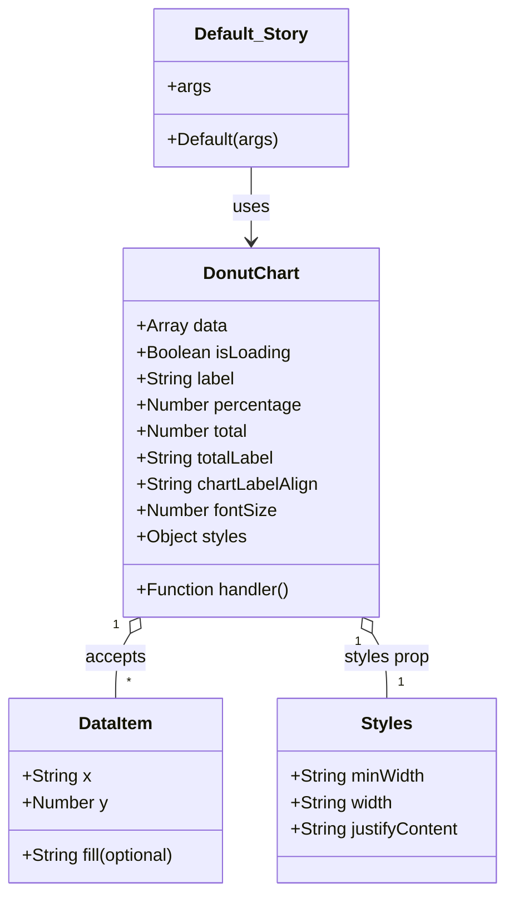

# Diagram: web/portal/src/components/molecules/DonutChart.molecule.stories.js

> Auto-generated by Obscura crawlers

## Mermaid

### SVG

<svg id="container" width="470.28125" xmlns="http://www.w3.org/2000/svg" class="classDiagram" height="812" viewBox="0 0 470.28125 812" role="graphics-document document" aria-roledescription="class"><g><defs><marker id="container_class-aggregationStart" class="marker aggregation class" refX="18" refY="7" markerWidth="190" markerHeight="240" orient="auto"><path d="M 18,7 L9,13 L1,7 L9,1 Z"></path></marker></defs><defs><marker id="container_class-aggregationEnd" class="marker aggregation class" refX="1" refY="7" markerWidth="20" markerHeight="28" orient="auto"><path d="M 18,7 L9,13 L1,7 L9,1 Z"></path></marker></defs><defs><marker id="container_class-extensionStart" class="marker extension class" refX="18" refY="7" markerWidth="190" markerHeight="240" orient="auto"><path d="M 1,7 L18,13 V 1 Z"></path></marker></defs><defs><marker id="container_class-extensionEnd" class="marker extension class" refX="1" refY="7" markerWidth="20" markerHeight="28" orient="auto"><path d="M 1,1 V 13 L18,7 Z"></path></marker></defs><defs><marker id="container_class-compositionStart" class="marker composition class" refX="18" refY="7" markerWidth="190" markerHeight="240" orient="auto"><path d="M 18,7 L9,13 L1,7 L9,1 Z"></path></marker></defs><defs><marker id="container_class-compositionEnd" class="marker composition class" refX="1" refY="7" markerWidth="20" markerHeight="28" orient="auto"><path d="M 18,7 L9,13 L1,7 L9,1 Z"></path></marker></defs><defs><marker id="container_class-dependencyStart" class="marker dependency class" refX="6" refY="7" markerWidth="190" markerHeight="240" orient="auto"><path d="M 5,7 L9,13 L1,7 L9,1 Z"></path></marker></defs><defs><marker id="container_class-dependencyEnd" class="marker dependency class" refX="13" refY="7" markerWidth="20" markerHeight="28" orient="auto"><path d="M 18,7 L9,13 L14,7 L9,1 Z"></path></marker></defs><defs><marker id="container_class-lollipopStart" class="marker lollipop class" refX="13" refY="7" markerWidth="190" markerHeight="240" orient="auto"><circle stroke="black" fill="transparent" cx="7" cy="7" r="6"></circle></marker></defs><defs><marker id="container_class-lollipopEnd" class="marker lollipop class" refX="1" refY="7" markerWidth="190" markerHeight="240" orient="auto"><circle stroke="black" fill="transparent" cx="7" cy="7" r="6"></circle></marker></defs><g class="root"><g class="clusters"></g><g class="edgePaths"><path d="M235,152L235,158.167C235,164.333,235,176.667,235,188C235,199.333,235,209.667,235,214.833L235,220" id="id_Default_Story_DonutChart_1" class="edge-thickness-normal edge-pattern-solid relation" style=";;;" data-edge="true" data-et="edge" data-id="id_Default_Story_DonutChart_1" data-points="W3sieCI6MjM1LCJ5IjoxNTJ9LHsieCI6MjM1LCJ5IjoxODl9LHsieCI6MjM1LCJ5IjoyMjZ9XQ==" marker-end="url(#container_class-dependencyEnd)"></path><path d="M122.648,576.694L120.361,580.411C118.075,584.129,113.502,591.565,111.216,601.449C108.93,611.333,108.93,623.667,108.93,629.833L108.93,636" id="id_DonutChart_DataItem_2" class="edge-thickness-normal edge-pattern-solid relation" style=";;;" data-edge="true" data-et="edge" data-id="id_DonutChart_DataItem_2" data-points="W3sieCI6MTMxLjY4Mzg0MTQ2MzQxNDY0LCJ5Ijo1NjJ9LHsieCI6MTA4LjkyOTY4NzUsInkiOjU5OX0seyJ4IjoxMDguOTI5Njg3NSwieSI6NjM2fV0=" marker-start="url(#container_class-aggregationStart)"></path><path d="M347.352,576.694L349.639,580.411C351.925,584.129,356.498,591.565,358.784,601.449C361.07,611.333,361.07,623.667,361.07,629.833L361.07,636" id="id_DonutChart_Styles_3" class="edge-thickness-normal edge-pattern-solid relation" style=";;;" data-edge="true" data-et="edge" data-id="id_DonutChart_Styles_3" data-points="W3sieCI6MzM4LjMxNjE1ODUzNjU4NTM2LCJ5Ijo1NjJ9LHsieCI6MzYxLjA3MDMxMjUsInkiOjU5OX0seyJ4IjozNjEuMDcwMzEyNSwieSI6NjM2fV0=" marker-start="url(#container_class-aggregationStart)"></path></g><g class="edgeLabels"><g class="edgeLabel" transform="translate(235, 189)"><g class="label" data-id="id_Default_Story_DonutChart_1" transform="translate(-16.4921875, -12)"><foreignObject width="32.984375" height="24">

uses

</foreignObject></g></g><g class="edgeLabel" transform="translate(108.9296875, 599)"><g class="label" data-id="id_DonutChart_DataItem_2" transform="translate(-27.421875, -12)"><foreignObject width="54.84375" height="24">

accepts

</foreignObject></g></g><g class="edgeLabel" transform="translate(361.0703125, 599)"><g class="label" data-id="id_DonutChart_Styles_3" transform="translate(-40.0703125, -12)"><foreignObject width="80.140625" height="24">

styles prop

</foreignObject></g></g><g class="edgeTerminals" transform="translate(109.73934363053955, 569.0490436841745)"><g class="inner" transform="translate(0, 0)"><foreignObject style="width: 9px; height: 12px;">
1
</foreignObject></g></g><g class="edgeTerminals" transform="translate(334.7062621671249, 584.7644163158253)"><g class="inner" transform="translate(0, 0)"><foreignObject style="width: 9px; height: 12px;">
1
</foreignObject></g></g><g class="edgeTerminals" transform="translate(118.92968874999995, 613.5000010714285)"><g class="inner" transform="translate(0, 0)"></g><foreignObject style="width: 9px; height: 12px;">
*
</foreignObject></g><g class="edgeTerminals" transform="translate(371.07031125, 613.4999989285715)"><g class="inner" transform="translate(0, 0)"></g><foreignObject style="width: 9px; height: 12px;">
1
</foreignObject></g></g><g class="nodes"><g class="node default" id="classId-DonutChart-0" transform="translate(235, 394)"><g class="basic label-container"><path d="M-116.80859375 -168 L116.80859375 -168 L116.80859375 168 L-116.80859375 168" stroke="none" stroke-width="0" fill="#ECECFF" style=""></path><path d="M-116.80859375 -168 C-51.783797700287266 -168, 13.240998349425467 -168, 116.80859375 -168 M-116.80859375 -168 C-56.815144948476295 -168, 3.17830385304741 -168, 116.80859375 -168 M116.80859375 -168 C116.80859375 -44.47801886326263, 116.80859375 79.04396227347473, 116.80859375 168 M116.80859375 -168 C116.80859375 -88.79197621003257, 116.80859375 -9.583952420065145, 116.80859375 168 M116.80859375 168 C36.8796904970809 168, -43.0492127558382 168, -116.80859375 168 M116.80859375 168 C29.331787201005255 168, -58.14501934798949 168, -116.80859375 168 M-116.80859375 168 C-116.80859375 68.89974496776699, -116.80859375 -30.200510064466016, -116.80859375 -168 M-116.80859375 168 C-116.80859375 58.61145952113661, -116.80859375 -50.77708095772678, -116.80859375 -168" stroke="#9370DB" stroke-width="1.3" fill="none" stroke-dasharray="0 0" style=""></path></g><g class="annotation-group text" transform="translate(0, -144)"></g><g class="label-group text" transform="translate(-41.9765625, -144)"><g class="label" style="font-weight: bolder" transform="translate(0,-12)"><foreignObject width="83.953125" height="24">

DonutChart

</foreignObject></g></g><g class="members-group text" transform="translate(-104.80859375, -96)"><g class="label" style="" transform="translate(0,-12)"><foreignObject width="82.015625" height="24">

+Array data

</foreignObject></g><g class="label" style="" transform="translate(0,12)"><foreignObject width="141.109375" height="24">

+Boolean isLoading

</foreignObject></g><g class="label" style="" transform="translate(0,36)"><foreignObject width="90.703125" height="24">

+String label

</foreignObject></g><g class="label" style="" transform="translate(0,60)"><foreignObject width="150.921875" height="24">

+Number percentage

</foreignObject></g><g class="label" style="" transform="translate(0,84)"><foreignObject width="104.359375" height="24">

+Number total

</foreignObject></g><g class="label" style="" transform="translate(0,108)"><foreignObject width="127.671875" height="24">

+String totalLabel

</foreignObject></g><g class="label" style="" transform="translate(0,132)"><foreignObject width="167.640625" height="24">

+String chartLabelAlign

</foreignObject></g><g class="label" style="" transform="translate(0,156)"><foreignObject width="129.109375" height="24">

+Number fontSize

</foreignObject></g><g class="label" style="" transform="translate(0,180)"><foreignObject width="101.265625" height="24">

+Object styles

</foreignObject></g></g><g class="methods-group text" transform="translate(-104.80859375, 144)"><g class="label" style="" transform="translate(0,-12)"><foreignObject width="141.734375" height="24">

+Function handler()

</foreignObject></g></g><g class="divider" style=""><path d="M-116.80859375 -120 C-35.13568453951943 -120, 46.53722467096114 -120, 116.80859375 -120 M-116.80859375 -120 C-29.911228870780363 -120, 56.986136008439274 -120, 116.80859375 -120" stroke="#9370DB" stroke-width="1.3" fill="none" stroke-dasharray="0 0" style=""></path></g><g class="divider" style=""><path d="M-116.80859375 120 C-41.89374246266212 120, 33.021108824675764 120, 116.80859375 120 M-116.80859375 120 C-37.330915399438425 120, 42.14676295112315 120, 116.80859375 120" stroke="#9370DB" stroke-width="1.3" fill="none" stroke-dasharray="0 0" style=""></path></g></g><g class="node default" id="classId-Default_Story-1" transform="translate(235, 80)"><g class="basic label-container"><path d="M-87.71875 -72 L87.71875 -72 L87.71875 72 L-87.71875 72" stroke="none" stroke-width="0" fill="#ECECFF" style=""></path><path d="M-87.71875 -72 C-23.88575157342396 -72, 39.94724685315208 -72, 87.71875 -72 M-87.71875 -72 C-50.36633159695566 -72, -13.013913193911321 -72, 87.71875 -72 M87.71875 -72 C87.71875 -18.782241408977043, 87.71875 34.43551718204591, 87.71875 72 M87.71875 -72 C87.71875 -25.944435040159085, 87.71875 20.11112991968183, 87.71875 72 M87.71875 72 C36.71734314858145 72, -14.284063702837102 72, -87.71875 72 M87.71875 72 C18.148524065706084 72, -51.42170186858783 72, -87.71875 72 M-87.71875 72 C-87.71875 28.50623145044277, -87.71875 -14.987537099114462, -87.71875 -72 M-87.71875 72 C-87.71875 20.80304074311144, -87.71875 -30.393918513777123, -87.71875 -72" stroke="#9370DB" stroke-width="1.3" fill="none" stroke-dasharray="0 0" style=""></path></g><g class="annotation-group text" transform="translate(0, -48)"></g><g class="label-group text" transform="translate(-50.25, -48)"><g class="label" style="font-weight: bolder" transform="translate(0,-12)"><foreignObject width="100.5" height="24">

Default_Story

</foreignObject></g></g><g class="members-group text" transform="translate(-75.71875, 0)"><g class="label" style="" transform="translate(0,-12)"><foreignObject width="38.078125" height="24">

+args

</foreignObject></g></g><g class="methods-group text" transform="translate(-75.71875, 48)"><g class="label" style="" transform="translate(0,-12)"><foreignObject width="101.1875" height="24">

+Default(args)

</foreignObject></g></g><g class="divider" style=""><path d="M-87.71875 -24 C-25.72575062361578 -24, 36.26724875276844 -24, 87.71875 -24 M-87.71875 -24 C-51.5476430906077 -24, -15.3765361812154 -24, 87.71875 -24" stroke="#9370DB" stroke-width="1.3" fill="none" stroke-dasharray="0 0" style=""></path></g><g class="divider" style=""><path d="M-87.71875 24 C-43.265074553346196 24, 1.1886008933076084 24, 87.71875 24 M-87.71875 24 C-50.96107918801098 24, -14.203408376021954 24, 87.71875 24" stroke="#9370DB" stroke-width="1.3" fill="none" stroke-dasharray="0 0" style=""></path></g></g><g class="node default" id="classId-DataItem-2" transform="translate(108.9296875, 720)"><g class="basic label-container"><path d="M-100.9296875 -84 L100.9296875 -84 L100.9296875 84 L-100.9296875 84" stroke="none" stroke-width="0" fill="#ECECFF" style=""></path><path d="M-100.9296875 -84 C-20.80757252321972 -84, 59.31454245356056 -84, 100.9296875 -84 M-100.9296875 -84 C-37.32122000533368 -84, 26.287247489332643 -84, 100.9296875 -84 M100.9296875 -84 C100.9296875 -44.67106667282435, 100.9296875 -5.342133345648705, 100.9296875 84 M100.9296875 -84 C100.9296875 -34.39931105411938, 100.9296875 15.20137789176124, 100.9296875 84 M100.9296875 84 C49.54435207132926 84, -1.8409833573414858 84, -100.9296875 84 M100.9296875 84 C25.725045713869648 84, -49.479596072260705 84, -100.9296875 84 M-100.9296875 84 C-100.9296875 34.65100371369481, -100.9296875 -14.697992572610374, -100.9296875 -84 M-100.9296875 84 C-100.9296875 40.746414682300056, -100.9296875 -2.5071706353998877, -100.9296875 -84" stroke="#9370DB" stroke-width="1.3" fill="none" stroke-dasharray="0 0" style=""></path></g><g class="annotation-group text" transform="translate(0, -60)"></g><g class="label-group text" transform="translate(-33.359375, -60)"><g class="label" style="font-weight: bolder" transform="translate(0,-12)"><foreignObject width="66.71875" height="24">

DataItem

</foreignObject></g></g><g class="members-group text" transform="translate(-88.9296875, -12)"><g class="label" style="" transform="translate(0,-12)"><foreignObject width="62.234375" height="24">

+String x

</foreignObject></g><g class="label" style="" transform="translate(0,12)"><foreignObject width="78.453125" height="24">

+Number y

</foreignObject></g></g><g class="methods-group text" transform="translate(-88.9296875, 60)"><g class="label" style="" transform="translate(0,-12)"><foreignObject width="144.5" height="24">

+String fill(optional)

</foreignObject></g></g><g class="divider" style=""><path d="M-100.9296875 -36 C-36.343043579821924 -36, 28.243600340356153 -36, 100.9296875 -36 M-100.9296875 -36 C-34.33690326685243 -36, 32.25588096629514 -36, 100.9296875 -36" stroke="#9370DB" stroke-width="1.3" fill="none" stroke-dasharray="0 0" style=""></path></g><g class="divider" style=""><path d="M-100.9296875 36 C-25.824396510704744 36, 49.28089447859051 36, 100.9296875 36 M-100.9296875 36 C-29.928250159282882 36, 41.073187181434236 36, 100.9296875 36" stroke="#9370DB" stroke-width="1.3" fill="none" stroke-dasharray="0 0" style=""></path></g></g><g class="node default" id="classId-Styles-3" transform="translate(361.0703125, 720)"><g class="basic label-container"><path d="M-101.2109375 -84 L101.2109375 -84 L101.2109375 84 L-101.2109375 84" stroke="none" stroke-width="0" fill="#ECECFF" style=""></path><path d="M-101.2109375 -84 C-59.17226016341712 -84, -17.133582826834242 -84, 101.2109375 -84 M-101.2109375 -84 C-51.8093123240815 -84, -2.4076871481630064 -84, 101.2109375 -84 M101.2109375 -84 C101.2109375 -37.59389976549804, 101.2109375 8.812200469003926, 101.2109375 84 M101.2109375 -84 C101.2109375 -33.15180567580837, 101.2109375 17.696388648383262, 101.2109375 84 M101.2109375 84 C22.04052795053083 84, -57.12988159893834 84, -101.2109375 84 M101.2109375 84 C49.30411647553218 84, -2.602704548935634 84, -101.2109375 84 M-101.2109375 84 C-101.2109375 42.10214118665128, -101.2109375 0.20428237330256138, -101.2109375 -84 M-101.2109375 84 C-101.2109375 32.50561707017093, -101.2109375 -18.988765859658145, -101.2109375 -84" stroke="#9370DB" stroke-width="1.3" fill="none" stroke-dasharray="0 0" style=""></path></g><g class="annotation-group text" transform="translate(0, -60)"></g><g class="label-group text" transform="translate(-22.390625, -60)"><g class="label" style="font-weight: bolder" transform="translate(0,-12)"><foreignObject width="44.78125" height="24">

Styles

</foreignObject></g></g><g class="members-group text" transform="translate(-89.2109375, -12)"><g class="label" style="" transform="translate(0,-12)"><foreignObject width="124.515625" height="24">

+String minWidth

</foreignObject></g><g class="label" style="" transform="translate(0,12)"><foreignObject width="95.171875" height="24">

+String width

</foreignObject></g><g class="label" style="" transform="translate(0,36)"><foreignObject width="156.03125" height="24">

+String justifyContent

</foreignObject></g></g><g class="methods-group text" transform="translate(-89.2109375, 84)"></g><g class="divider" style=""><path d="M-101.2109375 -36 C-42.58617450675796 -36, 16.038588486484073 -36, 101.2109375 -36 M-101.2109375 -36 C-31.272772477906074 -36, 38.66539254418785 -36, 101.2109375 -36" stroke="#9370DB" stroke-width="1.3" fill="none" stroke-dasharray="0 0" style=""></path></g><g class="divider" style=""><path d="M-101.2109375 60 C-59.090977393064314 60, -16.971017286128628 60, 101.2109375 60 M-101.2109375 60 C-52.725473203243624 60, -4.2400089064872475 60, 101.2109375 60" stroke="#9370DB" stroke-width="1.3" fill="none" stroke-dasharray="0 0" style=""></path></g></g></g></g></g></svg>
