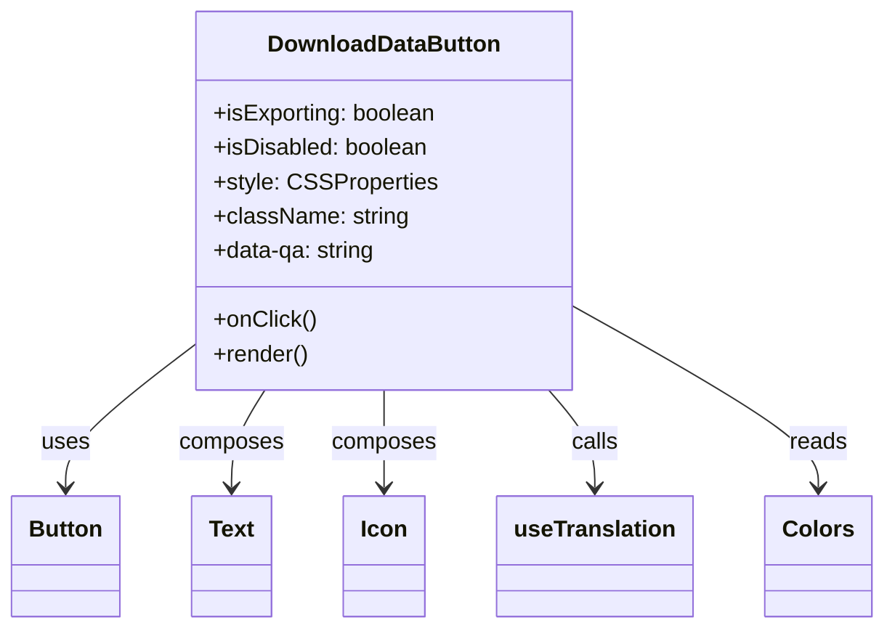

# Diagram: web/portal/src/components/molecules/DownloadDataButton.molecule.tsx


> Auto-generated by Obscura crawlers

## Diagram 1



### SVG

<svg id="container" width="601.421875" xmlns="http://www.w3.org/2000/svg" class="classDiagram" height="438" viewBox="0 0 601.421875 438" role="graphics-document document" aria-roledescription="class"><style>#container{font-family:"trebuchet ms",verdana,arial,sans-serif;font-size:16px;fill:#333;}@keyframes edge-animation-frame{from{stroke-dashoffset:0;}}@keyframes dash{to{stroke-dashoffset:0;}}#container .edge-animation-slow{stroke-dasharray:9,5!important;stroke-dashoffset:900;animation:dash 50s linear infinite;stroke-linecap:round;}#container .edge-animation-fast{stroke-dasharray:9,5!important;stroke-dashoffset:900;animation:dash 20s linear infinite;stroke-linecap:round;}#container .error-icon{fill:#552222;}#container .error-text{fill:#552222;stroke:#552222;}#container .edge-thickness-normal{stroke-width:1px;}#container .edge-thickness-thick{stroke-width:3.5px;}#container .edge-pattern-solid{stroke-dasharray:0;}#container .edge-thickness-invisible{stroke-width:0;fill:none;}#container .edge-pattern-dashed{stroke-dasharray:3;}#container .edge-pattern-dotted{stroke-dasharray:2;}#container .marker{fill:#333333;stroke:#333333;}#container .marker.cross{stroke:#333333;}#container svg{font-family:"trebuchet ms",verdana,arial,sans-serif;font-size:16px;}#container p{margin:0;}#container g.classGroup text{fill:#9370DB;stroke:none;font-family:"trebuchet ms",verdana,arial,sans-serif;font-size:10px;}#container g.classGroup text .title{font-weight:bolder;}#container .nodeLabel,#container .edgeLabel{color:#131300;}#container .edgeLabel .label rect{fill:#ECECFF;}#container .label text{fill:#131300;}#container .labelBkg{background:#ECECFF;}#container .edgeLabel .label span{background:#ECECFF;}#container .classTitle{font-weight:bolder;}#container .node rect,#container .node circle,#container .node ellipse,#container .node polygon,#container .node path{fill:#ECECFF;stroke:#9370DB;stroke-width:1px;}#container .divider{stroke:#9370DB;stroke-width:1;}#container g.clickable{cursor:pointer;}#container g.classGroup rect{fill:#ECECFF;stroke:#9370DB;}#container g.classGroup line{stroke:#9370DB;stroke-width:1;}#container .classLabel .box{stroke:none;stroke-width:0;fill:#ECECFF;opacity:0.5;}#container .classLabel .label{fill:#9370DB;font-size:10px;}#container .relation{stroke:#333333;stroke-width:1;fill:none;}#container .dashed-line{stroke-dasharray:3;}#container .dotted-line{stroke-dasharray:1 2;}#container #compositionStart,#container .composition{fill:#333333!important;stroke:#333333!important;stroke-width:1;}#container #compositionEnd,#container .composition{fill:#333333!important;stroke:#333333!important;stroke-width:1;}#container #dependencyStart,#container .dependency{fill:#333333!important;stroke:#333333!important;stroke-width:1;}#container #dependencyStart,#container .dependency{fill:#333333!important;stroke:#333333!important;stroke-width:1;}#container #extensionStart,#container .extension{fill:transparent!important;stroke:#333333!important;stroke-width:1;}#container #extensionEnd,#container .extension{fill:transparent!important;stroke:#333333!important;stroke-width:1;}#container #aggregationStart,#container .aggregation{fill:transparent!important;stroke:#333333!important;stroke-width:1;}#container #aggregationEnd,#container .aggregation{fill:transparent!important;stroke:#333333!important;stroke-width:1;}#container #lollipopStart,#container .lollipop{fill:#ECECFF!important;stroke:#333333!important;stroke-width:1;}#container #lollipopEnd,#container .lollipop{fill:#ECECFF!important;stroke:#333333!important;stroke-width:1;}#container .edgeTerminals{font-size:11px;line-height:initial;}#container .classTitleText{text-anchor:middle;font-size:18px;fill:#333;}#container .label-icon{display:inline-block;height:1em;overflow:visible;vertical-align:-0.125em;}#container .node .label-icon path{fill:currentColor;stroke:revert;stroke-width:revert;}#container :root{--mermaid-font-family:"trebuchet ms",verdana,arial,sans-serif;}</style><g><defs><marker id="container_class-aggregationStart" class="marker aggregation class" refX="18" refY="7" markerWidth="190" markerHeight="240" orient="auto"><path d="M 18,7 L9,13 L1,7 L9,1 Z"></path></marker></defs><defs><marker id="container_class-aggregationEnd" class="marker aggregation class" refX="1" refY="7" markerWidth="20" markerHeight="28" orient="auto"><path d="M 18,7 L9,13 L1,7 L9,1 Z"></path></marker></defs><defs><marker id="container_class-extensionStart" class="marker extension class" refX="18" refY="7" markerWidth="190" markerHeight="240" orient="auto"><path d="M 1,7 L18,13 V 1 Z"></path></marker></defs><defs><marker id="container_class-extensionEnd" class="marker extension class" refX="1" refY="7" markerWidth="20" markerHeight="28" orient="auto"><path d="M 1,1 V 13 L18,7 Z"></path></marker></defs><defs><marker id="container_class-compositionStart" class="marker composition class" refX="18" refY="7" markerWidth="190" markerHeight="240" orient="auto"><path d="M 18,7 L9,13 L1,7 L9,1 Z"></path></marker></defs><defs><marker id="container_class-compositionEnd" class="marker composition class" refX="1" refY="7" markerWidth="20" markerHeight="28" orient="auto"><path d="M 18,7 L9,13 L1,7 L9,1 Z"></path></marker></defs><defs><marker id="container_class-dependencyStart" class="marker dependency class" refX="6" refY="7" markerWidth="190" markerHeight="240" orient="auto"><path d="M 5,7 L9,13 L1,7 L9,1 Z"></path></marker></defs><defs><marker id="container_class-dependencyEnd" class="marker dependency class" refX="13" refY="7" markerWidth="20" markerHeight="28" orient="auto"><path d="M 18,7 L9,13 L14,7 L9,1 Z"></path></marker></defs><defs><marker id="container_class-lollipopStart" class="marker lollipop class" refX="13" refY="7" markerWidth="190" markerHeight="240" orient="auto"><circle stroke="black" fill="transparent" cx="7" cy="7" r="6"></circle></marker></defs><defs><marker id="container_class-lollipopEnd" class="marker lollipop class" refX="1" refY="7" markerWidth="190" markerHeight="240" orient="auto"><circle stroke="black" fill="transparent" cx="7" cy="7" r="6"></circle></marker></defs><g class="root"><g class="clusters"></g><g class="edgePaths"><path d="M134.168,240.034L119.279,251.528C104.391,263.023,74.613,286.011,59.725,302.672C44.836,319.333,44.836,329.667,44.836,334.833L44.836,340" id="id_DownloadDataButton_Button_1" class="edge-thickness-normal edge-pattern-solid relation" style=";;;" data-edge="true" data-et="edge" data-id="id_DownloadDataButton_Button_1" data-points="W3sieCI6MTM0LjE2Nzk2ODc1LCJ5IjoyNDAuMDMzODg2NTA5NjM1OTh9LHsieCI6NDQuODM1OTM3NSwieSI6MzA5fSx7IngiOjQ0LjgzNTkzNzUsInkiOjM0Nn1d" marker-end="url(#container_class-dependencyEnd)"></path><path d="M181.974,272L178.154,278.167C174.335,284.333,166.695,296.667,162.875,308C159.055,319.333,159.055,329.667,159.055,334.833L159.055,340" id="id_DownloadDataButton_Text_2" class="edge-thickness-normal edge-pattern-solid relation" style=";;;" data-edge="true" data-et="edge" data-id="id_DownloadDataButton_Text_2" data-points="W3sieCI6MTgxLjk3NDQzNjAyMDcxMDA3LCJ5IjoyNzJ9LHsieCI6MTU5LjA1NDY4NzUsInkiOjMwOX0seyJ4IjoxNTkuMDU0Njg3NSwieSI6MzQ2fV0=" marker-end="url(#container_class-dependencyEnd)"></path><path d="M263.742,272L263.742,278.167C263.742,284.333,263.742,296.667,263.742,308C263.742,319.333,263.742,329.667,263.742,334.833L263.742,340" id="id_DownloadDataButton_Icon_3" class="edge-thickness-normal edge-pattern-solid relation" style=";;;" data-edge="true" data-et="edge" data-id="id_DownloadDataButton_Icon_3" data-points="W3sieCI6MjYzLjc0MjE4NzUsInkiOjI3Mn0seyJ4IjoyNjMuNzQyMTg3NSwieSI6MzA5fSx7IngiOjI2My43NDIxODc1LCJ5IjozNDZ9XQ==" marker-end="url(#container_class-dependencyEnd)"></path><path d="M375.74,272L380.972,278.167C386.204,284.333,396.668,296.667,401.901,308C407.133,319.333,407.133,329.667,407.133,334.833L407.133,340" id="id_DownloadDataButton_useTranslation_4" class="edge-thickness-normal edge-pattern-solid relation" style=";;;" data-edge="true" data-et="edge" data-id="id_DownloadDataButton_useTranslation_4" data-points="W3sieCI6Mzc1LjczOTU5ODc0MjYwMzU2LCJ5IjoyNzJ9LHsieCI6NDA3LjEzMjgxMjUsInkiOjMwOX0seyJ4Ijo0MDcuMTMyODEyNSwieSI6MzQ2fV0=" marker-end="url(#container_class-dependencyEnd)"></path><path d="M393.316,214.337L420.817,230.114C448.318,245.891,503.319,277.446,530.82,298.389C558.32,319.333,558.32,329.667,558.32,334.833L558.32,340" id="id_DownloadDataButton_Colors_5" class="edge-thickness-normal edge-pattern-solid relation" style=";;;" data-edge="true" data-et="edge" data-id="id_DownloadDataButton_Colors_5" data-points="W3sieCI6MzkzLjMxNjQwNjI1LCJ5IjoyMTQuMzM2OTYyMjg3MTY5MTd9LHsieCI6NTU4LjMyMDMxMjUsInkiOjMwOX0seyJ4Ijo1NTguMzIwMzEyNSwieSI6MzQ2fV0=" marker-end="url(#container_class-dependencyEnd)"></path></g><g class="edgeLabels"><g class="edgeLabel" transform="translate(44.8359375, 309)"><g class="label" data-id="id_DownloadDataButton_Button_1" transform="translate(-16.4921875, -12)"><foreignObject width="32.984375" height="24"><div xmlns="http://www.w3.org/1999/xhtml" class="labelBkg" style="display: table-cell; white-space: nowrap; line-height: 1.5; max-width: 200px; text-align: center;"><span class="edgeLabel"><p>uses</p></span></div></foreignObject></g></g><g class="edgeLabel" transform="translate(159.0546875, 309)"><g class="label" data-id="id_DownloadDataButton_Text_2" transform="translate(-36.453125, -12)"><foreignObject width="72.90625" height="24"><div xmlns="http://www.w3.org/1999/xhtml" class="labelBkg" style="display: table-cell; white-space: nowrap; line-height: 1.5; max-width: 200px; text-align: center;"><span class="edgeLabel"><p>composes</p></span></div></foreignObject></g></g><g class="edgeLabel" transform="translate(263.7421875, 309)"><g class="label" data-id="id_DownloadDataButton_Icon_3" transform="translate(-36.453125, -12)"><foreignObject width="72.90625" height="24"><div xmlns="http://www.w3.org/1999/xhtml" class="labelBkg" style="display: table-cell; white-space: nowrap; line-height: 1.5; max-width: 200px; text-align: center;"><span class="edgeLabel"><p>composes</p></span></div></foreignObject></g></g><g class="edgeLabel" transform="translate(407.1328125, 309)"><g class="label" data-id="id_DownloadDataButton_useTranslation_4" transform="translate(-16.4453125, -12)"><foreignObject width="32.890625" height="24"><div xmlns="http://www.w3.org/1999/xhtml" class="labelBkg" style="display: table-cell; white-space: nowrap; line-height: 1.5; max-width: 200px; text-align: center;"><span class="edgeLabel"><p>calls</p></span></div></foreignObject></g></g><g class="edgeLabel" transform="translate(558.3203125, 309)"><g class="label" data-id="id_DownloadDataButton_Colors_5" transform="translate(-20.0078125, -12)"><foreignObject width="40.015625" height="24"><div xmlns="http://www.w3.org/1999/xhtml" class="labelBkg" style="display: table-cell; white-space: nowrap; line-height: 1.5; max-width: 200px; text-align: center;"><span class="edgeLabel"><p>reads</p></span></div></foreignObject></g></g></g><g class="nodes"><g class="node default" id="classId-DownloadDataButton-0" transform="translate(263.7421875, 140)"><g class="basic label-container"><path d="M-129.57421875 -132 L129.57421875 -132 L129.57421875 132 L-129.57421875 132" stroke="none" stroke-width="0" fill="#ECECFF" style=""></path><path d="M-129.57421875 -132 C-59.009185017242544 -132, 11.555848715514912 -132, 129.57421875 -132 M-129.57421875 -132 C-63.78087465538226 -132, 2.012469439235474 -132, 129.57421875 -132 M129.57421875 -132 C129.57421875 -52.20853639394983, 129.57421875 27.582927212100344, 129.57421875 132 M129.57421875 -132 C129.57421875 -47.32336776312347, 129.57421875 37.35326447375306, 129.57421875 132 M129.57421875 132 C55.06144836547398 132, -19.451322019052043 132, -129.57421875 132 M129.57421875 132 C53.64944418587166 132, -22.275330378256683 132, -129.57421875 132 M-129.57421875 132 C-129.57421875 56.654547999744835, -129.57421875 -18.69090400051033, -129.57421875 -132 M-129.57421875 132 C-129.57421875 38.38625624181621, -129.57421875 -55.227487516367574, -129.57421875 -132" stroke="#9370DB" stroke-width="1.3" fill="none" stroke-dasharray="0 0" style=""></path></g><g class="annotation-group text" transform="translate(0, -108)"></g><g class="label-group text" transform="translate(-78.3203125, -108)"><g class="label" style="font-weight: bolder" transform="translate(0,-12)"><foreignObject width="156.640625" height="24"><div xmlns="http://www.w3.org/1999/xhtml" style="display: table-cell; white-space: nowrap; line-height: 1.5; max-width: 205px; text-align: center;"><span class="nodeLabel markdown-node-label" style=""><p>DownloadDataButton</p></span></div></foreignObject></g></g><g class="members-group text" transform="translate(-117.57421875, -60)"><g class="label" style="" transform="translate(0,-12)"><foreignObject width="156.828125" height="24"><div xmlns="http://www.w3.org/1999/xhtml" style="display: table-cell; white-space: nowrap; line-height: 1.5; max-width: 214px; text-align: center;"><span class="nodeLabel markdown-node-label" style=""><p>+isExporting: boolean</p></span></div></foreignObject></g><g class="label" style="" transform="translate(0,12)"><foreignObject width="150.734375" height="24"><div xmlns="http://www.w3.org/1999/xhtml" style="display: table-cell; white-space: nowrap; line-height: 1.5; max-width: 208px; text-align: center;"><span class="nodeLabel markdown-node-label" style=""><p>+isDisabled: boolean</p></span></div></foreignObject></g><g class="label" style="" transform="translate(0,36)"><foreignObject width="151.390625" height="24"><div xmlns="http://www.w3.org/1999/xhtml" style="display: table-cell; white-space: nowrap; line-height: 1.5; max-width: 209px; text-align: center;"><span class="nodeLabel markdown-node-label" style=""><p>+style: CSSProperties</p></span></div></foreignObject></g><g class="label" style="" transform="translate(0,60)"><foreignObject width="135.359375" height="24"><div xmlns="http://www.w3.org/1999/xhtml" style="display: table-cell; white-space: nowrap; line-height: 1.5; max-width: 193px; text-align: center;"><span class="nodeLabel markdown-node-label" style=""><p>+className: string</p></span></div></foreignObject></g><g class="label" style="" transform="translate(0,84)"><foreignObject width="114.90625" height="24"><div xmlns="http://www.w3.org/1999/xhtml" style="display: table-cell; white-space: nowrap; line-height: 1.5; max-width: 173px; text-align: center;"><span class="nodeLabel markdown-node-label" style=""><p>+data-qa: string</p></span></div></foreignObject></g></g><g class="methods-group text" transform="translate(-117.57421875, 84)"><g class="label" style="" transform="translate(0,-12)"><foreignObject width="70.921875" height="24"><div xmlns="http://www.w3.org/1999/xhtml" style="display: table-cell; white-space: nowrap; line-height: 1.5; max-width: 128px; text-align: center;"><span class="nodeLabel markdown-node-label" style=""><p>+onClick()</p></span></div></foreignObject></g><g class="label" style="" transform="translate(0,12)"><foreignObject width="66.609375" height="24"><div xmlns="http://www.w3.org/1999/xhtml" style="display: table-cell; white-space: nowrap; line-height: 1.5; max-width: 124px; text-align: center;"><span class="nodeLabel markdown-node-label" style=""><p>+render()</p></span></div></foreignObject></g></g><g class="divider" style=""><path d="M-129.57421875 -84 C-35.65013013220721 -84, 58.27395848558558 -84, 129.57421875 -84 M-129.57421875 -84 C-32.84908796616196 -84, 63.87604281767608 -84, 129.57421875 -84" stroke="#9370DB" stroke-width="1.3" fill="none" stroke-dasharray="0 0" style=""></path></g><g class="divider" style=""><path d="M-129.57421875 60 C-59.926356192366754 60, 9.721506365266492 60, 129.57421875 60 M-129.57421875 60 C-34.22503879544642 60, 61.124141159107154 60, 129.57421875 60" stroke="#9370DB" stroke-width="1.3" fill="none" stroke-dasharray="0 0" style=""></path></g></g><g class="node default" id="classId-Button-1" transform="translate(44.8359375, 388)"><g class="basic label-container"><path d="M-36.8359375 -42 L36.8359375 -42 L36.8359375 42 L-36.8359375 42" stroke="none" stroke-width="0" fill="#ECECFF" style=""></path><path d="M-36.8359375 -42 C-11.095666497682359 -42, 14.644604504635282 -42, 36.8359375 -42 M-36.8359375 -42 C-18.394963688321404 -42, 0.0460101233571919 -42, 36.8359375 -42 M36.8359375 -42 C36.8359375 -19.488239618173832, 36.8359375 3.0235207636523356, 36.8359375 42 M36.8359375 -42 C36.8359375 -23.18392998196425, 36.8359375 -4.3678599639285025, 36.8359375 42 M36.8359375 42 C12.741071332081027 42, -11.353794835837945 42, -36.8359375 42 M36.8359375 42 C13.061768199174097 42, -10.712401101651807 42, -36.8359375 42 M-36.8359375 42 C-36.8359375 16.335198261123267, -36.8359375 -9.329603477753466, -36.8359375 -42 M-36.8359375 42 C-36.8359375 19.7454198633867, -36.8359375 -2.5091602732265983, -36.8359375 -42" stroke="#9370DB" stroke-width="1.3" fill="none" stroke-dasharray="0 0" style=""></path></g><g class="annotation-group text" transform="translate(0, -18)"></g><g class="label-group text" transform="translate(-24.8359375, -18)"><g class="label" style="font-weight: bolder" transform="translate(0,-12)"><foreignObject width="49.671875" height="24"><div xmlns="http://www.w3.org/1999/xhtml" style="display: table-cell; white-space: nowrap; line-height: 1.5; max-width: 99px; text-align: center;"><span class="nodeLabel markdown-node-label" style=""><p>Button</p></span></div></foreignObject></g></g><g class="members-group text" transform="translate(-24.8359375, 30)"></g><g class="methods-group text" transform="translate(-24.8359375, 60)"></g><g class="divider" style=""><path d="M-36.8359375 6 C-20.935010257744356 6, -5.0340830154887115 6, 36.8359375 6 M-36.8359375 6 C-16.95227907986707 6, 2.931379340265863 6, 36.8359375 6" stroke="#9370DB" stroke-width="1.3" fill="none" stroke-dasharray="0 0" style=""></path></g><g class="divider" style=""><path d="M-36.8359375 24 C-14.011078028627058 24, 8.813781442745885 24, 36.8359375 24 M-36.8359375 24 C-14.44108683518279 24, 7.953763829634418 24, 36.8359375 24" stroke="#9370DB" stroke-width="1.3" fill="none" stroke-dasharray="0 0" style=""></path></g></g><g class="node default" id="classId-Text-2" transform="translate(159.0546875, 388)"><g class="basic label-container"><path d="M-27.3828125 -42 L27.3828125 -42 L27.3828125 42 L-27.3828125 42" stroke="none" stroke-width="0" fill="#ECECFF" style=""></path><path d="M-27.3828125 -42 C-10.469040810287552 -42, 6.444730879424895 -42, 27.3828125 -42 M-27.3828125 -42 C-15.092261878048935 -42, -2.801711256097871 -42, 27.3828125 -42 M27.3828125 -42 C27.3828125 -9.810679308395272, 27.3828125 22.378641383209455, 27.3828125 42 M27.3828125 -42 C27.3828125 -15.425174242492552, 27.3828125 11.149651515014895, 27.3828125 42 M27.3828125 42 C8.612866082514937 42, -10.157080334970125 42, -27.3828125 42 M27.3828125 42 C10.367993817947099 42, -6.6468248641058025 42, -27.3828125 42 M-27.3828125 42 C-27.3828125 21.11508147899323, -27.3828125 0.23016295798645814, -27.3828125 -42 M-27.3828125 42 C-27.3828125 10.122646412756332, -27.3828125 -21.754707174487336, -27.3828125 -42" stroke="#9370DB" stroke-width="1.3" fill="none" stroke-dasharray="0 0" style=""></path></g><g class="annotation-group text" transform="translate(0, -18)"></g><g class="label-group text" transform="translate(-15.3828125, -18)"><g class="label" style="font-weight: bolder" transform="translate(0,-12)"><foreignObject width="30.765625" height="24"><div xmlns="http://www.w3.org/1999/xhtml" style="display: table-cell; white-space: nowrap; line-height: 1.5; max-width: 80px; text-align: center;"><span class="nodeLabel markdown-node-label" style=""><p>Text</p></span></div></foreignObject></g></g><g class="members-group text" transform="translate(-15.3828125, 30)"></g><g class="methods-group text" transform="translate(-15.3828125, 60)"></g><g class="divider" style=""><path d="M-27.3828125 6 C-12.68248063964792 6, 2.0178512207041592 6, 27.3828125 6 M-27.3828125 6 C-11.147000489904201 6, 5.088811520191598 6, 27.3828125 6" stroke="#9370DB" stroke-width="1.3" fill="none" stroke-dasharray="0 0" style=""></path></g><g class="divider" style=""><path d="M-27.3828125 24 C-10.982965611227204 24, 5.416881277545592 24, 27.3828125 24 M-27.3828125 24 C-16.02091969159511 24, -4.659026883190222 24, 27.3828125 24" stroke="#9370DB" stroke-width="1.3" fill="none" stroke-dasharray="0 0" style=""></path></g></g><g class="node default" id="classId-Icon-3" transform="translate(263.7421875, 388)"><g class="basic label-container"><path d="M-27.3046875 -42 L27.3046875 -42 L27.3046875 42 L-27.3046875 42" stroke="none" stroke-width="0" fill="#ECECFF" style=""></path><path d="M-27.3046875 -42 C-12.05873687766789 -42, 3.18721374466422 -42, 27.3046875 -42 M-27.3046875 -42 C-6.743287008652395 -42, 13.81811348269521 -42, 27.3046875 -42 M27.3046875 -42 C27.3046875 -19.48327170304528, 27.3046875 3.033456593909442, 27.3046875 42 M27.3046875 -42 C27.3046875 -16.38779310580057, 27.3046875 9.224413788398863, 27.3046875 42 M27.3046875 42 C13.604701435452869 42, -0.09528462909426239 42, -27.3046875 42 M27.3046875 42 C8.735105621510517 42, -9.834476256978967 42, -27.3046875 42 M-27.3046875 42 C-27.3046875 21.205778421161646, -27.3046875 0.4115568423232929, -27.3046875 -42 M-27.3046875 42 C-27.3046875 11.466178734332711, -27.3046875 -19.067642531334577, -27.3046875 -42" stroke="#9370DB" stroke-width="1.3" fill="none" stroke-dasharray="0 0" style=""></path></g><g class="annotation-group text" transform="translate(0, -18)"></g><g class="label-group text" transform="translate(-15.3046875, -18)"><g class="label" style="font-weight: bolder" transform="translate(0,-12)"><foreignObject width="30.609375" height="24"><div xmlns="http://www.w3.org/1999/xhtml" style="display: table-cell; white-space: nowrap; line-height: 1.5; max-width: 81px; text-align: center;"><span class="nodeLabel markdown-node-label" style=""><p>Icon</p></span></div></foreignObject></g></g><g class="members-group text" transform="translate(-15.3046875, 30)"></g><g class="methods-group text" transform="translate(-15.3046875, 60)"></g><g class="divider" style=""><path d="M-27.3046875 6 C-14.112085325155448 6, -0.9194831503108958 6, 27.3046875 6 M-27.3046875 6 C-15.788241527524852 6, -4.271795555049703 6, 27.3046875 6" stroke="#9370DB" stroke-width="1.3" fill="none" stroke-dasharray="0 0" style=""></path></g><g class="divider" style=""><path d="M-27.3046875 24 C-8.699437770803797 24, 9.905811958392405 24, 27.3046875 24 M-27.3046875 24 C-15.548160044984607 24, -3.7916325899692147 24, 27.3046875 24" stroke="#9370DB" stroke-width="1.3" fill="none" stroke-dasharray="0 0" style=""></path></g></g><g class="node default" id="classId-useTranslation-4" transform="translate(407.1328125, 388)"><g class="basic label-container"><path d="M-66.0859375 -42 L66.0859375 -42 L66.0859375 42 L-66.0859375 42" stroke="none" stroke-width="0" fill="#ECECFF" style=""></path><path d="M-66.0859375 -42 C-18.450733981116784 -42, 29.184469537766432 -42, 66.0859375 -42 M-66.0859375 -42 C-22.587995277697686 -42, 20.909946944604627 -42, 66.0859375 -42 M66.0859375 -42 C66.0859375 -13.431440792051514, 66.0859375 15.137118415896971, 66.0859375 42 M66.0859375 -42 C66.0859375 -18.12692063994688, 66.0859375 5.746158720106237, 66.0859375 42 M66.0859375 42 C29.65573672123081 42, -6.774464057538381 42, -66.0859375 42 M66.0859375 42 C19.167225983221826 42, -27.751485533556348 42, -66.0859375 42 M-66.0859375 42 C-66.0859375 9.182957355811887, -66.0859375 -23.634085288376227, -66.0859375 -42 M-66.0859375 42 C-66.0859375 13.907201121304162, -66.0859375 -14.185597757391676, -66.0859375 -42" stroke="#9370DB" stroke-width="1.3" fill="none" stroke-dasharray="0 0" style=""></path></g><g class="annotation-group text" transform="translate(0, -18)"></g><g class="label-group text" transform="translate(-54.0859375, -18)"><g class="label" style="font-weight: bolder" transform="translate(0,-12)"><foreignObject width="108.171875" height="24"><div xmlns="http://www.w3.org/1999/xhtml" style="display: table-cell; white-space: nowrap; line-height: 1.5; max-width: 157px; text-align: center;"><span class="nodeLabel markdown-node-label" style=""><p>useTranslation</p></span></div></foreignObject></g></g><g class="members-group text" transform="translate(-54.0859375, 30)"></g><g class="methods-group text" transform="translate(-54.0859375, 60)"></g><g class="divider" style=""><path d="M-66.0859375 6 C-21.298498201477756 6, 23.48894109704449 6, 66.0859375 6 M-66.0859375 6 C-36.074499249876055 6, -6.0630609997521105 6, 66.0859375 6" stroke="#9370DB" stroke-width="1.3" fill="none" stroke-dasharray="0 0" style=""></path></g><g class="divider" style=""><path d="M-66.0859375 24 C-20.66141542980882 24, 24.76310664038236 24, 66.0859375 24 M-66.0859375 24 C-34.469966939369186 24, -2.8539963787383655 24, 66.0859375 24" stroke="#9370DB" stroke-width="1.3" fill="none" stroke-dasharray="0 0" style=""></path></g></g><g class="node default" id="classId-Colors-5" transform="translate(558.3203125, 388)"><g class="basic label-container"><path d="M-35.1015625 -42 L35.1015625 -42 L35.1015625 42 L-35.1015625 42" stroke="none" stroke-width="0" fill="#ECECFF" style=""></path><path d="M-35.1015625 -42 C-16.362781762011434 -42, 2.375998975977133 -42, 35.1015625 -42 M-35.1015625 -42 C-11.393263803399215 -42, 12.31503489320157 -42, 35.1015625 -42 M35.1015625 -42 C35.1015625 -16.159117539669268, 35.1015625 9.681764920661465, 35.1015625 42 M35.1015625 -42 C35.1015625 -23.628343688088773, 35.1015625 -5.2566873761775454, 35.1015625 42 M35.1015625 42 C17.550552604814207 42, -0.00045729037158537267 42, -35.1015625 42 M35.1015625 42 C19.195275952004366 42, 3.288989404008735 42, -35.1015625 42 M-35.1015625 42 C-35.1015625 17.0571033713704, -35.1015625 -7.885793257259202, -35.1015625 -42 M-35.1015625 42 C-35.1015625 11.752164204077168, -35.1015625 -18.495671591845664, -35.1015625 -42" stroke="#9370DB" stroke-width="1.3" fill="none" stroke-dasharray="0 0" style=""></path></g><g class="annotation-group text" transform="translate(0, -18)"></g><g class="label-group text" transform="translate(-23.1015625, -18)"><g class="label" style="font-weight: bolder" transform="translate(0,-12)"><foreignObject width="46.203125" height="24"><div xmlns="http://www.w3.org/1999/xhtml" style="display: table-cell; white-space: nowrap; line-height: 1.5; max-width: 95px; text-align: center;"><span class="nodeLabel markdown-node-label" style=""><p>Colors</p></span></div></foreignObject></g></g><g class="members-group text" transform="translate(-23.1015625, 30)"></g><g class="methods-group text" transform="translate(-23.1015625, 60)"></g><g class="divider" style=""><path d="M-35.1015625 6 C-12.456772003379808 6, 10.188018493240385 6, 35.1015625 6 M-35.1015625 6 C-16.018427248042183 6, 3.0647080039156336 6, 35.1015625 6" stroke="#9370DB" stroke-width="1.3" fill="none" stroke-dasharray="0 0" style=""></path></g><g class="divider" style=""><path d="M-35.1015625 24 C-7.765297091107335 24, 19.57096831778533 24, 35.1015625 24 M-35.1015625 24 C-14.419339391133754 24, 6.2628837177324925 24, 35.1015625 24" stroke="#9370DB" stroke-width="1.3" fill="none" stroke-dasharray="0 0" style=""></path></g></g></g></g></g></svg>

## Diagram 2

```mermaid
flowchart TD
    A[Props received] --> B{isDisabled?}
    B -- Yes --> C[Render Button (disabled)]
    B -- No --> D{isExporting?}
    D -- Yes --> E[Render Text + Spinner Icon]
    D -- No --> F[Render Text + Download Icon]
    F --> G[onClick -> user handler]
    E -. Clicks ignored .-> H[No onClick bound]
    C -. Clicks ignored .-> H
    H[No action on click]
```

> SVG rendering failed for this diagram.
