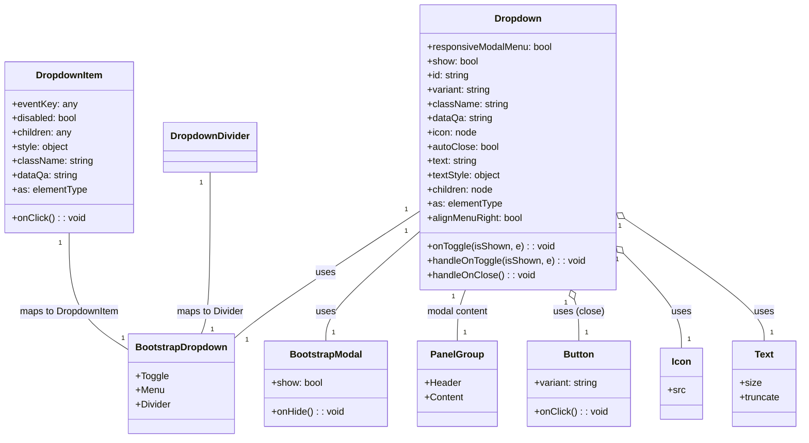

# Diagram: web/portal/src/components/molecules/Dropdown.molecule.js


> Auto-generated by Obscura crawlers

## Diagram 1



### SVG

<svg id="container" width="1329.794921875" xmlns="http://www.w3.org/2000/svg" class="classDiagram" height="738" viewBox="0 0 1329.794921875 738" role="graphics-document document" aria-roledescription="class"><style>#container{font-family:"trebuchet ms",verdana,arial,sans-serif;font-size:16px;fill:#333;}@keyframes edge-animation-frame{from{stroke-dashoffset:0;}}@keyframes dash{to{stroke-dashoffset:0;}}#container .edge-animation-slow{stroke-dasharray:9,5!important;stroke-dashoffset:900;animation:dash 50s linear infinite;stroke-linecap:round;}#container .edge-animation-fast{stroke-dasharray:9,5!important;stroke-dashoffset:900;animation:dash 20s linear infinite;stroke-linecap:round;}#container .error-icon{fill:#552222;}#container .error-text{fill:#552222;stroke:#552222;}#container .edge-thickness-normal{stroke-width:1px;}#container .edge-thickness-thick{stroke-width:3.5px;}#container .edge-pattern-solid{stroke-dasharray:0;}#container .edge-thickness-invisible{stroke-width:0;fill:none;}#container .edge-pattern-dashed{stroke-dasharray:3;}#container .edge-pattern-dotted{stroke-dasharray:2;}#container .marker{fill:#333333;stroke:#333333;}#container .marker.cross{stroke:#333333;}#container svg{font-family:"trebuchet ms",verdana,arial,sans-serif;font-size:16px;}#container p{margin:0;}#container g.classGroup text{fill:#9370DB;stroke:none;font-family:"trebuchet ms",verdana,arial,sans-serif;font-size:10px;}#container g.classGroup text .title{font-weight:bolder;}#container .nodeLabel,#container .edgeLabel{color:#131300;}#container .edgeLabel .label rect{fill:#ECECFF;}#container .label text{fill:#131300;}#container .labelBkg{background:#ECECFF;}#container .edgeLabel .label span{background:#ECECFF;}#container .classTitle{font-weight:bolder;}#container .node rect,#container .node circle,#container .node ellipse,#container .node polygon,#container .node path{fill:#ECECFF;stroke:#9370DB;stroke-width:1px;}#container .divider{stroke:#9370DB;stroke-width:1;}#container g.clickable{cursor:pointer;}#container g.classGroup rect{fill:#ECECFF;stroke:#9370DB;}#container g.classGroup line{stroke:#9370DB;stroke-width:1;}#container .classLabel .box{stroke:none;stroke-width:0;fill:#ECECFF;opacity:0.5;}#container .classLabel .label{fill:#9370DB;font-size:10px;}#container .relation{stroke:#333333;stroke-width:1;fill:none;}#container .dashed-line{stroke-dasharray:3;}#container .dotted-line{stroke-dasharray:1 2;}#container #compositionStart,#container .composition{fill:#333333!important;stroke:#333333!important;stroke-width:1;}#container #compositionEnd,#container .composition{fill:#333333!important;stroke:#333333!important;stroke-width:1;}#container #dependencyStart,#container .dependency{fill:#333333!important;stroke:#333333!important;stroke-width:1;}#container #dependencyStart,#container .dependency{fill:#333333!important;stroke:#333333!important;stroke-width:1;}#container #extensionStart,#container .extension{fill:transparent!important;stroke:#333333!important;stroke-width:1;}#container #extensionEnd,#container .extension{fill:transparent!important;stroke:#333333!important;stroke-width:1;}#container #aggregationStart,#container .aggregation{fill:transparent!important;stroke:#333333!important;stroke-width:1;}#container #aggregationEnd,#container .aggregation{fill:transparent!important;stroke:#333333!important;stroke-width:1;}#container #lollipopStart,#container .lollipop{fill:#ECECFF!important;stroke:#333333!important;stroke-width:1;}#container #lollipopEnd,#container .lollipop{fill:#ECECFF!important;stroke:#333333!important;stroke-width:1;}#container .edgeTerminals{font-size:11px;line-height:initial;}#container .classTitleText{text-anchor:middle;font-size:18px;fill:#333;}#container .label-icon{display:inline-block;height:1em;overflow:visible;vertical-align:-0.125em;}#container .node .label-icon path{fill:currentColor;stroke:revert;stroke-width:revert;}#container :root{--mermaid-font-family:"trebuchet ms",verdana,arial,sans-serif;}</style><g><defs><marker id="container_class-aggregationStart" class="marker aggregation class" refX="18" refY="7" markerWidth="190" markerHeight="240" orient="auto"><path d="M 18,7 L9,13 L1,7 L9,1 Z"></path></marker></defs><defs><marker id="container_class-aggregationEnd" class="marker aggregation class" refX="1" refY="7" markerWidth="20" markerHeight="28" orient="auto"><path d="M 18,7 L9,13 L1,7 L9,1 Z"></path></marker></defs><defs><marker id="container_class-extensionStart" class="marker extension class" refX="18" refY="7" markerWidth="190" markerHeight="240" orient="auto"><path d="M 1,7 L18,13 V 1 Z"></path></marker></defs><defs><marker id="container_class-extensionEnd" class="marker extension class" refX="1" refY="7" markerWidth="20" markerHeight="28" orient="auto"><path d="M 1,1 V 13 L18,7 Z"></path></marker></defs><defs><marker id="container_class-compositionStart" class="marker composition class" refX="18" refY="7" markerWidth="190" markerHeight="240" orient="auto"><path d="M 18,7 L9,13 L1,7 L9,1 Z"></path></marker></defs><defs><marker id="container_class-compositionEnd" class="marker composition class" refX="1" refY="7" markerWidth="20" markerHeight="28" orient="auto"><path d="M 18,7 L9,13 L1,7 L9,1 Z"></path></marker></defs><defs><marker id="container_class-dependencyStart" class="marker dependency class" refX="6" refY="7" markerWidth="190" markerHeight="240" orient="auto"><path d="M 5,7 L9,13 L1,7 L9,1 Z"></path></marker></defs><defs><marker id="container_class-dependencyEnd" class="marker dependency class" refX="13" refY="7" markerWidth="20" markerHeight="28" orient="auto"><path d="M 18,7 L9,13 L14,7 L9,1 Z"></path></marker></defs><defs><marker id="container_class-lollipopStart" class="marker lollipop class" refX="13" refY="7" markerWidth="190" markerHeight="240" orient="auto"><circle stroke="black" fill="transparent" cx="7" cy="7" r="6"></circle></marker></defs><defs><marker id="container_class-lollipopEnd" class="marker lollipop class" refX="1" refY="7" markerWidth="190" markerHeight="240" orient="auto"><circle stroke="black" fill="transparent" cx="7" cy="7" r="6"></circle></marker></defs><g class="root"><g class="clusters"></g><g class="edgePaths"><path d="M695.848,356.16L653.404,384.3C610.961,412.44,526.074,468.72,474.696,504.598C423.317,540.475,405.447,555.95,396.511,563.688L387.576,571.426" id="id_Dropdown_BootstrapDropdown_1" class="edge-thickness-normal edge-pattern-solid relation" style=";;;" data-edge="true" data-et="edge" data-id="id_Dropdown_BootstrapDropdown_1" data-points="W3sieCI6Njk1Ljg0NzY1NjI1LCJ5IjozNTYuMTU5OTA2ODc3NTk0NX0seyJ4Ijo0NDEuMTg3NSwieSI6NTI1fSx7IngiOjM4Ny41NzYxNzE4NzUsInkiOjU3MS40MjU1MzIyMTIyOTc5fV0="></path><path d="M695.848,389.753L669.906,412.294C643.964,434.835,592.081,479.918,566.139,510.625C540.197,541.333,540.197,557.667,540.197,565.833L540.197,574" id="id_Dropdown_BootstrapModal_2" class="edge-thickness-normal edge-pattern-solid relation" style=";;;" data-edge="true" data-et="edge" data-id="id_Dropdown_BootstrapModal_2" data-points="W3sieCI6Njk1Ljg0NzY1NjI1LCJ5IjozODkuNzUyNTA0MzA0MDMzMn0seyJ4Ijo1NDAuMTk3MjY1NjI1LCJ5Ijo1MjV9LHsieCI6NTQwLjE5NzI2NTYyNSwieSI6NTc0fV0="></path><path d="M771.805,488L769.565,494.167C767.325,500.333,762.845,512.667,760.605,527C758.365,541.333,758.365,557.667,758.365,565.833L758.365,574" id="id_Dropdown_PanelGroup_3" class="edge-thickness-normal edge-pattern-solid relation" style=";;;" data-edge="true" data-et="edge" data-id="id_Dropdown_PanelGroup_3" data-points="W3sieCI6NzcxLjgwNTMzNjE5MTMzNTgsInkiOjQ4OH0seyJ4Ijo3NTguMzY1MjM0Mzc1LCJ5Ijo1MjV9LHsieCI6NzU4LjM2NTIzNDM3NSwieSI6NTc0fV0="></path><path d="M952.053,504.213L953.311,507.678C954.57,511.142,957.087,518.071,958.345,529.702C959.604,541.333,959.604,557.667,959.604,565.833L959.604,574" id="id_Dropdown_Button_4" class="edge-thickness-normal edge-pattern-solid relation" style=";;;" data-edge="true" data-et="edge" data-id="id_Dropdown_Button_4" data-points="W3sieCI6OTQ2LjE2MzQxMzgwODY2NDIsInkiOjQ4OH0seyJ4Ijo5NTkuNjAzNTE1NjI1LCJ5Ijo1MjV9LHsieCI6OTU5LjYwMzUxNTYyNSwieSI6NTc0fV0=" marker-start="url(#container_class-aggregationStart)"></path><path d="M1034.17,427.482L1050.034,443.735C1065.898,459.988,1097.626,492.494,1113.49,518.914C1129.354,545.333,1129.354,565.667,1129.354,575.833L1129.354,586" id="id_Dropdown_Icon_5" class="edge-thickness-normal edge-pattern-solid relation" style=";;;" data-edge="true" data-et="edge" data-id="id_Dropdown_Icon_5" data-points="W3sieCI6MTAyMi4xMjEwOTM3NSwieSI6NDE1LjEzNzY4MDY4ODI5NTA2fSx7IngiOjExMjkuMzUzNTE1NjI1LCJ5Ijo1MjV9LHsieCI6MTEyOS4zNTM1MTU2MjUsInkiOjU4Nn1d" marker-start="url(#container_class-aggregationStart)"></path><path d="M1036.4,368.268L1074.934,394.39C1113.468,420.512,1190.536,472.756,1229.07,507.045C1267.604,541.333,1267.604,557.667,1267.604,565.833L1267.604,574" id="id_Dropdown_Text_6" class="edge-thickness-normal edge-pattern-solid relation" style=";;;" data-edge="true" data-et="edge" data-id="id_Dropdown_Text_6" data-points="W3sieCI6MTAyMi4xMjEwOTM3NSwieSI6MzU4LjU4OTIxNzY4NzIzNzR9LHsieCI6MTI2Ny42MDM1MTU2MjUsInkiOjUyNX0seyJ4IjoxMjY3LjYwMzUxNTYyNSwieSI6NTc0fV0=" marker-start="url(#container_class-aggregationStart)"></path><path d="M114.766,392L114.766,414.167C114.766,436.333,114.766,480.667,131.528,513.698C148.291,546.729,181.816,568.457,198.579,579.321L215.342,590.186" id="id_DropdownItem_BootstrapDropdown_7" class="edge-thickness-normal edge-pattern-solid relation" style=";;;" data-edge="true" data-et="edge" data-id="id_DropdownItem_BootstrapDropdown_7" data-points="W3sieCI6MTE0Ljc2NTYyNSwieSI6MzkyfSx7IngiOjExNC43NjU2MjUsInkiOjUyNX0seyJ4IjoyMTUuMzQxNzk2ODc1LCJ5Ijo1OTAuMTg1NTkwMDkwNzAyN31d"></path><path d="M347.484,290L347.484,329.167C347.484,368.333,347.484,446.667,345.139,492C342.793,537.333,338.102,549.667,335.756,555.833L333.41,562" id="id_DropdownDivider_BootstrapDropdown_8" class="edge-thickness-normal edge-pattern-solid relation" style=";;;" data-edge="true" data-et="edge" data-id="id_DropdownDivider_BootstrapDropdown_8" data-points="W3sieCI6MzQ3LjQ4NDM3NSwieSI6MjkwfSx7IngiOjM0Ny40ODQzNzUsInkiOjUyNX0seyJ4IjozMzMuNDEwNDk1MjIyMTA3NDQsInkiOjU2Mn1d"></path></g><g class="edgeLabels"><g class="edgeLabel" transform="translate(538.96359, 460.17429)"><g class="label" data-id="id_Dropdown_BootstrapDropdown_1" transform="translate(-16.4921875, -12)"><foreignObject width="32.984375" height="24"><div xmlns="http://www.w3.org/1999/xhtml" class="labelBkg" style="display: table-cell; white-space: nowrap; line-height: 1.5; max-width: 200px; text-align: center;"><span class="edgeLabel"><p>uses</p></span></div></foreignObject></g></g><g class="edgeLabel" transform="translate(540.197265625, 525)"><g class="label" data-id="id_Dropdown_BootstrapModal_2" transform="translate(-16.4921875, -12)"><foreignObject width="32.984375" height="24"><div xmlns="http://www.w3.org/1999/xhtml" class="labelBkg" style="display: table-cell; white-space: nowrap; line-height: 1.5; max-width: 200px; text-align: center;"><span class="edgeLabel"><p>uses</p></span></div></foreignObject></g></g><g class="edgeLabel" transform="translate(758.365234375, 525)"><g class="label" data-id="id_Dropdown_PanelGroup_3" transform="translate(-52.78125, -12)"><foreignObject width="105.5625" height="24"><div xmlns="http://www.w3.org/1999/xhtml" class="labelBkg" style="display: table-cell; white-space: nowrap; line-height: 1.5; max-width: 200px; text-align: center;"><span class="edgeLabel"><p>modal content</p></span></div></foreignObject></g></g><g class="edgeLabel" transform="translate(959.603515625, 525)"><g class="label" data-id="id_Dropdown_Button_4" transform="translate(-42.6953125, -12)"><foreignObject width="85.390625" height="24"><div xmlns="http://www.w3.org/1999/xhtml" class="labelBkg" style="display: table-cell; white-space: nowrap; line-height: 1.5; max-width: 200px; text-align: center;"><span class="edgeLabel"><p>uses (close)</p></span></div></foreignObject></g></g><g class="edgeLabel" transform="translate(1129.353515625, 525)"><g class="label" data-id="id_Dropdown_Icon_5" transform="translate(-16.4921875, -12)"><foreignObject width="32.984375" height="24"><div xmlns="http://www.w3.org/1999/xhtml" class="labelBkg" style="display: table-cell; white-space: nowrap; line-height: 1.5; max-width: 200px; text-align: center;"><span class="edgeLabel"><p>uses</p></span></div></foreignObject></g></g><g class="edgeLabel" transform="translate(1267.603515625, 525)"><g class="label" data-id="id_Dropdown_Text_6" transform="translate(-16.4921875, -12)"><foreignObject width="32.984375" height="24"><div xmlns="http://www.w3.org/1999/xhtml" class="labelBkg" style="display: table-cell; white-space: nowrap; line-height: 1.5; max-width: 200px; text-align: center;"><span class="edgeLabel"><p>uses</p></span></div></foreignObject></g></g><g class="edgeLabel" transform="translate(114.765625, 525)"><g class="label" data-id="id_DropdownItem_BootstrapDropdown_7" transform="translate(-85.03125, -12)"><foreignObject width="170.0625" height="24"><div xmlns="http://www.w3.org/1999/xhtml" class="labelBkg" style="display: table-cell; white-space: nowrap; line-height: 1.5; max-width: 200px; text-align: center;"><span class="edgeLabel"><p>maps to DropdownItem</p></span></div></foreignObject></g></g><g class="edgeLabel" transform="translate(347.484375, 525)"><g class="label" data-id="id_DropdownDivider_BootstrapDropdown_8" transform="translate(-57.2109375, -12)"><foreignObject width="114.421875" height="24"><div xmlns="http://www.w3.org/1999/xhtml" class="labelBkg" style="display: table-cell; white-space: nowrap; line-height: 1.5; max-width: 200px; text-align: center;"><span class="edgeLabel"><p>maps to Divider</p></span></div></foreignObject></g></g><g class="edgeTerminals" transform="translate(672.9733989109069, 353.3282564343455)"><g class="inner" transform="translate(0, 0)"><foreignObject style="width: 9px; height: 12px;"><div xmlns="http://www.w3.org/1999/xhtml" style="display: inline-block; padding-right: 1px; white-space: nowrap;"><span class="edgeLabel">1</span></div></foreignObject></g></g><g class="edgeTerminals" transform="translate(672.7993183508811, 389.9080587558523)"><g class="inner" transform="translate(0, 0)"><foreignObject style="width: 9px; height: 12px;"><div xmlns="http://www.w3.org/1999/xhtml" style="display: inline-block; padding-right: 1px; white-space: nowrap;"><span class="edgeLabel">1</span></div></foreignObject></g></g><g class="edgeTerminals" transform="translate(751.731835341426, 499.3271592673444)"><g class="inner" transform="translate(0, 0)"><foreignObject style="width: 9px; height: 12px;"><div xmlns="http://www.w3.org/1999/xhtml" style="display: inline-block; padding-right: 1px; white-space: nowrap;"><span class="edgeLabel">1</span></div></foreignObject></g></g><g class="edgeTerminals" transform="translate(938.0395791500903, 509.56973073265556)"><g class="inner" transform="translate(0, 0)"><foreignObject style="width: 9px; height: 12px;"><div xmlns="http://www.w3.org/1999/xhtml" style="display: inline-block; padding-right: 1px; white-space: nowrap;"><span class="edgeLabel">1</span></div></foreignObject></g></g><g class="edgeTerminals" transform="translate(1023.610358402018, 438.1383789459356)"><g class="inner" transform="translate(0, 0)"><foreignObject style="width: 9px; height: 12px;"><div xmlns="http://www.w3.org/1999/xhtml" style="display: inline-block; padding-right: 1px; white-space: nowrap;"><span class="edgeLabel">1</span></div></foreignObject></g></g><g class="edgeTerminals" transform="translate(1028.1897373468469, 380.82481004278554)"><g class="inner" transform="translate(0, 0)"><foreignObject style="width: 9px; height: 12px;"><div xmlns="http://www.w3.org/1999/xhtml" style="display: inline-block; padding-right: 1px; white-space: nowrap;"><span class="edgeLabel">1</span></div></foreignObject></g></g><g class="edgeTerminals" transform="translate(99.76562750000015, 409.50000214285717)"><g class="inner" transform="translate(0, 0)"><foreignObject style="width: 9px; height: 12px;"><div xmlns="http://www.w3.org/1999/xhtml" style="display: inline-block; padding-right: 1px; white-space: nowrap;"><span class="edgeLabel">1</span></div></foreignObject></g></g><g class="edgeTerminals" transform="translate(332.48437750000016, 307.5000021428571)"><g class="inner" transform="translate(0, 0)"><foreignObject style="width: 9px; height: 12px;"><div xmlns="http://www.w3.org/1999/xhtml" style="display: inline-block; padding-right: 1px; white-space: nowrap;"><span class="edgeLabel">1</span></div></foreignObject></g></g><g class="edgeTerminals" transform="translate(405.6247379885345, 566.3088256407917)"><g class="inner" transform="translate(0, 0)"></g><foreignObject style="width: 9px; height: 12px;"><div xmlns="http://www.w3.org/1999/xhtml" style="display: inline-block; padding-right: 1px; white-space: nowrap;"><span class="edgeLabel">1</span></div></foreignObject></g><g class="edgeTerminals" transform="translate(550.1972678125, 551.500001875)"><g class="inner" transform="translate(0, 0)"></g><foreignObject style="width: 9px; height: 12px;"><div xmlns="http://www.w3.org/1999/xhtml" style="display: inline-block; padding-right: 1px; white-space: nowrap;"><span class="edgeLabel">1</span></div></foreignObject></g><g class="edgeTerminals" transform="translate(768.3652321874998, 551.499998125)"><g class="inner" transform="translate(0, 0)"></g><foreignObject style="width: 9px; height: 12px;"><div xmlns="http://www.w3.org/1999/xhtml" style="display: inline-block; padding-right: 1px; white-space: nowrap;"><span class="edgeLabel">1</span></div></foreignObject></g><g class="edgeTerminals" transform="translate(969.6035178125, 551.500001875)"><g class="inner" transform="translate(0, 0)"></g><foreignObject style="width: 9px; height: 12px;"><div xmlns="http://www.w3.org/1999/xhtml" style="display: inline-block; padding-right: 1px; white-space: nowrap;"><span class="edgeLabel">1</span></div></foreignObject></g><g class="edgeTerminals" transform="translate(1139.3535178124996, 563.500001875)"><g class="inner" transform="translate(0, 0)"></g><foreignObject style="width: 9px; height: 12px;"><div xmlns="http://www.w3.org/1999/xhtml" style="display: inline-block; padding-right: 1px; white-space: nowrap;"><span class="edgeLabel">1</span></div></foreignObject></g><g class="edgeTerminals" transform="translate(1277.6035178124996, 551.500001875)"><g class="inner" transform="translate(0, 0)"></g><foreignObject style="width: 9px; height: 12px;"><div xmlns="http://www.w3.org/1999/xhtml" style="display: inline-block; padding-right: 1px; white-space: nowrap;"><span class="edgeLabel">1</span></div></foreignObject></g><g class="edgeTerminals" transform="translate(203.81464010066534, 563.0802478377116)"><g class="inner" transform="translate(0, 0)"></g><foreignObject style="width: 9px; height: 12px;"><div xmlns="http://www.w3.org/1999/xhtml" style="display: inline-block; padding-right: 1px; white-space: nowrap;"><span class="edgeLabel">1</span></div></foreignObject></g><g class="edgeTerminals" transform="translate(348.65217419606336, 545.9761868354769)"><g class="inner" transform="translate(0, 0)"></g><foreignObject style="width: 9px; height: 12px;"><div xmlns="http://www.w3.org/1999/xhtml" style="display: inline-block; padding-right: 1px; white-space: nowrap;"><span class="edgeLabel">1</span></div></foreignObject></g></g><g class="nodes"><g class="node default" id="classId-Dropdown-0" transform="translate(858.984375, 248)"><g class="basic label-container"><path d="M-163.13671875 -240 L163.13671875 -240 L163.13671875 240 L-163.13671875 240" stroke="none" stroke-width="0" fill="#ECECFF" style=""></path><path d="M-163.13671875 -240 C-49.73322401532327 -240, 63.670270719353454 -240, 163.13671875 -240 M-163.13671875 -240 C-48.41137637986505 -240, 66.3139659902699 -240, 163.13671875 -240 M163.13671875 -240 C163.13671875 -135.34808895829212, 163.13671875 -30.696177916584276, 163.13671875 240 M163.13671875 -240 C163.13671875 -56.18203793231146, 163.13671875 127.63592413537708, 163.13671875 240 M163.13671875 240 C96.59625136307373 240, 30.055783976147467 240, -163.13671875 240 M163.13671875 240 C69.58851941570784 240, -23.959679918584328 240, -163.13671875 240 M-163.13671875 240 C-163.13671875 107.18356925632594, -163.13671875 -25.632861487348123, -163.13671875 -240 M-163.13671875 240 C-163.13671875 94.46330170833772, -163.13671875 -51.07339658332455, -163.13671875 -240" stroke="#9370DB" stroke-width="1.3" fill="none" stroke-dasharray="0 0" style=""></path></g><g class="annotation-group text" transform="translate(0, -216)"></g><g class="label-group text" transform="translate(-37.7109375, -216)"><g class="label" style="font-weight: bolder" transform="translate(0,-12)"><foreignObject width="75.421875" height="24"><div xmlns="http://www.w3.org/1999/xhtml" style="display: table-cell; white-space: nowrap; line-height: 1.5; max-width: 125px; text-align: center;"><span class="nodeLabel markdown-node-label" style=""><p>Dropdown</p></span></div></foreignObject></g></g><g class="members-group text" transform="translate(-151.13671875, -168)"><g class="label" style="" transform="translate(0,-12)"><foreignObject width="212.03125" height="24"><div xmlns="http://www.w3.org/1999/xhtml" style="display: table-cell; white-space: nowrap; line-height: 1.5; max-width: 270px; text-align: center;"><span class="nodeLabel markdown-node-label" style=""><p>+responsiveModalMenu: bool</p></span></div></foreignObject></g><g class="label" style="" transform="translate(0,12)"><foreignObject width="86.6875" height="24"><div xmlns="http://www.w3.org/1999/xhtml" style="display: table-cell; white-space: nowrap; line-height: 1.5; max-width: 144px; text-align: center;"><span class="nodeLabel markdown-node-label" style=""><p>+show: bool</p></span></div></foreignObject></g><g class="label" style="" transform="translate(0,36)"><foreignObject width="71.78125" height="24"><div xmlns="http://www.w3.org/1999/xhtml" style="display: table-cell; white-space: nowrap; line-height: 1.5; max-width: 130px; text-align: center;"><span class="nodeLabel markdown-node-label" style=""><p>+id: string</p></span></div></foreignObject></g><g class="label" style="" transform="translate(0,60)"><foreignObject width="108.46875" height="24"><div xmlns="http://www.w3.org/1999/xhtml" style="display: table-cell; white-space: nowrap; line-height: 1.5; max-width: 167px; text-align: center;"><span class="nodeLabel markdown-node-label" style=""><p>+variant: string</p></span></div></foreignObject></g><g class="label" style="" transform="translate(0,84)"><foreignObject width="135.359375" height="24"><div xmlns="http://www.w3.org/1999/xhtml" style="display: table-cell; white-space: nowrap; line-height: 1.5; max-width: 193px; text-align: center;"><span class="nodeLabel markdown-node-label" style=""><p>+className: string</p></span></div></foreignObject></g><g class="label" style="" transform="translate(0,108)"><foreignObject width="109.9375" height="24"><div xmlns="http://www.w3.org/1999/xhtml" style="display: table-cell; white-space: nowrap; line-height: 1.5; max-width: 168px; text-align: center;"><span class="nodeLabel markdown-node-label" style=""><p>+dataQa: string</p></span></div></foreignObject></g><g class="label" style="" transform="translate(0,132)"><foreignObject width="83.640625" height="24"><div xmlns="http://www.w3.org/1999/xhtml" style="display: table-cell; white-space: nowrap; line-height: 1.5; max-width: 141px; text-align: center;"><span class="nodeLabel markdown-node-label" style=""><p>+icon: node</p></span></div></foreignObject></g><g class="label" style="" transform="translate(0,156)"><foreignObject width="120.546875" height="24"><div xmlns="http://www.w3.org/1999/xhtml" style="display: table-cell; white-space: nowrap; line-height: 1.5; max-width: 178px; text-align: center;"><span class="nodeLabel markdown-node-label" style=""><p>+autoClose: bool</p></span></div></foreignObject></g><g class="label" style="" transform="translate(0,180)"><foreignObject width="85.34375" height="24"><div xmlns="http://www.w3.org/1999/xhtml" style="display: table-cell; white-space: nowrap; line-height: 1.5; max-width: 143px; text-align: center;"><span class="nodeLabel markdown-node-label" style=""><p>+text: string</p></span></div></foreignObject></g><g class="label" style="" transform="translate(0,204)"><foreignObject width="124.734375" height="24"><div xmlns="http://www.w3.org/1999/xhtml" style="display: table-cell; white-space: nowrap; line-height: 1.5; max-width: 182px; text-align: center;"><span class="nodeLabel markdown-node-label" style=""><p>+textStyle: object</p></span></div></foreignObject></g><g class="label" style="" transform="translate(0,228)"><foreignObject width="112.578125" height="24"><div xmlns="http://www.w3.org/1999/xhtml" style="display: table-cell; white-space: nowrap; line-height: 1.5; max-width: 170px; text-align: center;"><span class="nodeLabel markdown-node-label" style=""><p>+children: node</p></span></div></foreignObject></g><g class="label" style="" transform="translate(0,252)"><foreignObject width="125.203125" height="24"><div xmlns="http://www.w3.org/1999/xhtml" style="display: table-cell; white-space: nowrap; line-height: 1.5; max-width: 183px; text-align: center;"><span class="nodeLabel markdown-node-label" style=""><p>+as: elementType</p></span></div></foreignObject></g><g class="label" style="" transform="translate(0,276)"><foreignObject width="161.734375" height="24"><div xmlns="http://www.w3.org/1999/xhtml" style="display: table-cell; white-space: nowrap; line-height: 1.5; max-width: 219px; text-align: center;"><span class="nodeLabel markdown-node-label" style=""><p>+alignMenuRight: bool</p></span></div></foreignObject></g></g><g class="methods-group text" transform="translate(-151.13671875, 168)"><g class="label" style="" transform="translate(0,-12)"><foreignObject width="212.484375" height="24"><div xmlns="http://www.w3.org/1999/xhtml" style="display: table-cell; white-space: nowrap; line-height: 1.5; max-width: 270px; text-align: center;"><span class="nodeLabel markdown-node-label" style=""><p>+onToggle(isShown, e) : : void</p></span></div></foreignObject></g><g class="label" style="" transform="translate(0,12)"><foreignObject width="264.5625" height="24"><div xmlns="http://www.w3.org/1999/xhtml" style="display: table-cell; white-space: nowrap; line-height: 1.5; max-width: 322px; text-align: center;"><span class="nodeLabel markdown-node-label" style=""><p>+handleOnToggle(isShown, e) : : void</p></span></div></foreignObject></g><g class="label" style="" transform="translate(0,36)"><foreignObject width="179.734375" height="24"><div xmlns="http://www.w3.org/1999/xhtml" style="display: table-cell; white-space: nowrap; line-height: 1.5; max-width: 237px; text-align: center;"><span class="nodeLabel markdown-node-label" style=""><p>+handleOnClose() : : void</p></span></div></foreignObject></g></g><g class="divider" style=""><path d="M-163.13671875 -192 C-36.148109468215225 -192, 90.84049981356955 -192, 163.13671875 -192 M-163.13671875 -192 C-60.61561972023328 -192, 41.90547930953343 -192, 163.13671875 -192" stroke="#9370DB" stroke-width="1.3" fill="none" stroke-dasharray="0 0" style=""></path></g><g class="divider" style=""><path d="M-163.13671875 144 C-87.38458643500823 144, -11.632454120016462 144, 163.13671875 144 M-163.13671875 144 C-34.84497240298998 144, 93.44677394402004 144, 163.13671875 144" stroke="#9370DB" stroke-width="1.3" fill="none" stroke-dasharray="0 0" style=""></path></g></g><g class="node default" id="classId-DropdownItem-1" transform="translate(114.765625, 248)"><g class="basic label-container"><path d="M-106.765625 -144 L106.765625 -144 L106.765625 144 L-106.765625 144" stroke="none" stroke-width="0" fill="#ECECFF" style=""></path><path d="M-106.765625 -144 C-36.273382018989736 -144, 34.21886096202053 -144, 106.765625 -144 M-106.765625 -144 C-41.8519158108348 -144, 23.061793378330407 -144, 106.765625 -144 M106.765625 -144 C106.765625 -39.56732753621645, 106.765625 64.8653449275671, 106.765625 144 M106.765625 -144 C106.765625 -33.40701581723822, 106.765625 77.18596836552356, 106.765625 144 M106.765625 144 C36.490933002802194 144, -33.78375899439561 144, -106.765625 144 M106.765625 144 C22.714649623503234 144, -61.33632575299353 144, -106.765625 144 M-106.765625 144 C-106.765625 83.99291368104203, -106.765625 23.985827362084052, -106.765625 -144 M-106.765625 144 C-106.765625 77.3669313885395, -106.765625 10.733862777078997, -106.765625 -144" stroke="#9370DB" stroke-width="1.3" fill="none" stroke-dasharray="0 0" style=""></path></g><g class="annotation-group text" transform="translate(0, -120)"></g><g class="label-group text" transform="translate(-54.171875, -120)"><g class="label" style="font-weight: bolder" transform="translate(0,-12)"><foreignObject width="108.34375" height="24"><div xmlns="http://www.w3.org/1999/xhtml" style="display: table-cell; white-space: nowrap; line-height: 1.5; max-width: 157px; text-align: center;"><span class="nodeLabel markdown-node-label" style=""><p>DropdownItem</p></span></div></foreignObject></g></g><g class="members-group text" transform="translate(-94.765625, -72)"><g class="label" style="" transform="translate(0,-12)"><foreignObject width="108.046875" height="24"><div xmlns="http://www.w3.org/1999/xhtml" style="display: table-cell; white-space: nowrap; line-height: 1.5; max-width: 166px; text-align: center;"><span class="nodeLabel markdown-node-label" style=""><p>+eventKey: any</p></span></div></foreignObject></g><g class="label" style="" transform="translate(0,12)"><foreignObject width="111.453125" height="24"><div xmlns="http://www.w3.org/1999/xhtml" style="display: table-cell; white-space: nowrap; line-height: 1.5; max-width: 169px; text-align: center;"><span class="nodeLabel markdown-node-label" style=""><p>+disabled: bool</p></span></div></foreignObject></g><g class="label" style="" transform="translate(0,36)"><foreignObject width="101.421875" height="24"><div xmlns="http://www.w3.org/1999/xhtml" style="display: table-cell; white-space: nowrap; line-height: 1.5; max-width: 159px; text-align: center;"><span class="nodeLabel markdown-node-label" style=""><p>+children: any</p></span></div></foreignObject></g><g class="label" style="" transform="translate(0,60)"><foreignObject width="95.90625" height="24"><div xmlns="http://www.w3.org/1999/xhtml" style="display: table-cell; white-space: nowrap; line-height: 1.5; max-width: 153px; text-align: center;"><span class="nodeLabel markdown-node-label" style=""><p>+style: object</p></span></div></foreignObject></g><g class="label" style="" transform="translate(0,84)"><foreignObject width="135.359375" height="24"><div xmlns="http://www.w3.org/1999/xhtml" style="display: table-cell; white-space: nowrap; line-height: 1.5; max-width: 193px; text-align: center;"><span class="nodeLabel markdown-node-label" style=""><p>+className: string</p></span></div></foreignObject></g><g class="label" style="" transform="translate(0,108)"><foreignObject width="109.9375" height="24"><div xmlns="http://www.w3.org/1999/xhtml" style="display: table-cell; white-space: nowrap; line-height: 1.5; max-width: 168px; text-align: center;"><span class="nodeLabel markdown-node-label" style=""><p>+dataQa: string</p></span></div></foreignObject></g><g class="label" style="" transform="translate(0,132)"><foreignObject width="125.203125" height="24"><div xmlns="http://www.w3.org/1999/xhtml" style="display: table-cell; white-space: nowrap; line-height: 1.5; max-width: 183px; text-align: center;"><span class="nodeLabel markdown-node-label" style=""><p>+as: elementType</p></span></div></foreignObject></g></g><g class="methods-group text" transform="translate(-94.765625, 120)"><g class="label" style="" transform="translate(0,-12)"><foreignObject width="122.546875" height="24"><div xmlns="http://www.w3.org/1999/xhtml" style="display: table-cell; white-space: nowrap; line-height: 1.5; max-width: 180px; text-align: center;"><span class="nodeLabel markdown-node-label" style=""><p>+onClick() : : void</p></span></div></foreignObject></g></g><g class="divider" style=""><path d="M-106.765625 -96 C-42.4770686624107 -96, 21.811487675178597 -96, 106.765625 -96 M-106.765625 -96 C-44.54535615548158 -96, 17.674912689036844 -96, 106.765625 -96" stroke="#9370DB" stroke-width="1.3" fill="none" stroke-dasharray="0 0" style=""></path></g><g class="divider" style=""><path d="M-106.765625 96 C-41.614508369257365 96, 23.53660826148527 96, 106.765625 96 M-106.765625 96 C-31.243410319115597 96, 44.278804361768806 96, 106.765625 96" stroke="#9370DB" stroke-width="1.3" fill="none" stroke-dasharray="0 0" style=""></path></g></g><g class="node default" id="classId-DropdownDivider-2" transform="translate(347.484375, 248)"><g class="basic label-container"><path d="M-75.953125 -42 L75.953125 -42 L75.953125 42 L-75.953125 42" stroke="none" stroke-width="0" fill="#ECECFF" style=""></path><path d="M-75.953125 -42 C-31.44020316270197 -42, 13.07271867459606 -42, 75.953125 -42 M-75.953125 -42 C-31.074474832074188 -42, 13.804175335851625 -42, 75.953125 -42 M75.953125 -42 C75.953125 -11.235521572858552, 75.953125 19.528956854282896, 75.953125 42 M75.953125 -42 C75.953125 -16.652030148514005, 75.953125 8.695939702971991, 75.953125 42 M75.953125 42 C30.855087136784114 42, -14.242950726431772 42, -75.953125 42 M75.953125 42 C29.314108324482163 42, -17.324908351035674 42, -75.953125 42 M-75.953125 42 C-75.953125 20.928768968817977, -75.953125 -0.14246206236404646, -75.953125 -42 M-75.953125 42 C-75.953125 22.662616053779082, -75.953125 3.325232107558165, -75.953125 -42" stroke="#9370DB" stroke-width="1.3" fill="none" stroke-dasharray="0 0" style=""></path></g><g class="annotation-group text" transform="translate(0, -18)"></g><g class="label-group text" transform="translate(-63.953125, -18)"><g class="label" style="font-weight: bolder" transform="translate(0,-12)"><foreignObject width="127.90625" height="24"><div xmlns="http://www.w3.org/1999/xhtml" style="display: table-cell; white-space: nowrap; line-height: 1.5; max-width: 177px; text-align: center;"><span class="nodeLabel markdown-node-label" style=""><p>DropdownDivider</p></span></div></foreignObject></g></g><g class="members-group text" transform="translate(-63.953125, 30)"></g><g class="methods-group text" transform="translate(-63.953125, 60)"></g><g class="divider" style=""><path d="M-75.953125 6 C-22.730572060355968 6, 30.491980879288064 6, 75.953125 6 M-75.953125 6 C-38.392970103877225 6, -0.8328152077544502 6, 75.953125 6" stroke="#9370DB" stroke-width="1.3" fill="none" stroke-dasharray="0 0" style=""></path></g><g class="divider" style=""><path d="M-75.953125 24 C-19.792313647285845 24, 36.36849770542831 24, 75.953125 24 M-75.953125 24 C-40.402381198417615 24, -4.85163739683523 24, 75.953125 24" stroke="#9370DB" stroke-width="1.3" fill="none" stroke-dasharray="0 0" style=""></path></g></g><g class="node default" id="classId-BootstrapDropdown-3" transform="translate(301.458984375, 646)"><g class="basic label-container"><path d="M-86.1171875 -84 L86.1171875 -84 L86.1171875 84 L-86.1171875 84" stroke="none" stroke-width="0" fill="#ECECFF" style=""></path><path d="M-86.1171875 -84 C-45.72090831708599 -84, -5.324629134171985 -84, 86.1171875 -84 M-86.1171875 -84 C-42.45958919088607 -84, 1.1980091182278585 -84, 86.1171875 -84 M86.1171875 -84 C86.1171875 -21.486905250786812, 86.1171875 41.026189498426376, 86.1171875 84 M86.1171875 -84 C86.1171875 -28.536770924074467, 86.1171875 26.926458151851065, 86.1171875 84 M86.1171875 84 C42.39600304536665 84, -1.3251814092667047 84, -86.1171875 84 M86.1171875 84 C32.01884285055757 84, -22.079501798884863 84, -86.1171875 84 M-86.1171875 84 C-86.1171875 36.07575691109405, -86.1171875 -11.848486177811907, -86.1171875 -84 M-86.1171875 84 C-86.1171875 21.194601898349887, -86.1171875 -41.610796203300225, -86.1171875 -84" stroke="#9370DB" stroke-width="1.3" fill="none" stroke-dasharray="0 0" style=""></path></g><g class="annotation-group text" transform="translate(0, -60)"></g><g class="label-group text" transform="translate(-74.1171875, -60)"><g class="label" style="font-weight: bolder" transform="translate(0,-12)"><foreignObject width="148.234375" height="24"><div xmlns="http://www.w3.org/1999/xhtml" style="display: table-cell; white-space: nowrap; line-height: 1.5; max-width: 196px; text-align: center;"><span class="nodeLabel markdown-node-label" style=""><p>BootstrapDropdown</p></span></div></foreignObject></g></g><g class="members-group text" transform="translate(-74.1171875, -12)"><g class="label" style="" transform="translate(0,-12)"><foreignObject width="53.890625" height="24"><div xmlns="http://www.w3.org/1999/xhtml" style="display: table-cell; white-space: nowrap; line-height: 1.5; max-width: 111px; text-align: center;"><span class="nodeLabel markdown-node-label" style=""><p>+Toggle</p></span></div></foreignObject></g><g class="label" style="" transform="translate(0,12)"><foreignObject width="47.84375" height="24"><div xmlns="http://www.w3.org/1999/xhtml" style="display: table-cell; white-space: nowrap; line-height: 1.5; max-width: 105px; text-align: center;"><span class="nodeLabel markdown-node-label" style=""><p>+Menu</p></span></div></foreignObject></g><g class="label" style="" transform="translate(0,36)"><foreignObject width="59.65625" height="24"><div xmlns="http://www.w3.org/1999/xhtml" style="display: table-cell; white-space: nowrap; line-height: 1.5; max-width: 118px; text-align: center;"><span class="nodeLabel markdown-node-label" style=""><p>+Divider</p></span></div></foreignObject></g></g><g class="methods-group text" transform="translate(-74.1171875, 84)"></g><g class="divider" style=""><path d="M-86.1171875 -36 C-28.882273613489183 -36, 28.352640273021635 -36, 86.1171875 -36 M-86.1171875 -36 C-35.944459340156044 -36, 14.228268819687912 -36, 86.1171875 -36" stroke="#9370DB" stroke-width="1.3" fill="none" stroke-dasharray="0 0" style=""></path></g><g class="divider" style=""><path d="M-86.1171875 60 C-28.85002483651573 60, 28.417137826968542 60, 86.1171875 60 M-86.1171875 60 C-29.86026836400967 60, 26.39665077198066 60, 86.1171875 60" stroke="#9370DB" stroke-width="1.3" fill="none" stroke-dasharray="0 0" style=""></path></g></g><g class="node default" id="classId-BootstrapModal-4" transform="translate(540.197265625, 646)"><g class="basic label-container"><path d="M-102.62109375 -72 L102.62109375 -72 L102.62109375 72 L-102.62109375 72" stroke="none" stroke-width="0" fill="#ECECFF" style=""></path><path d="M-102.62109375 -72 C-26.7861819186774 -72, 49.0487299126452 -72, 102.62109375 -72 M-102.62109375 -72 C-38.53071560549067 -72, 25.55966253901866 -72, 102.62109375 -72 M102.62109375 -72 C102.62109375 -15.856701227099947, 102.62109375 40.286597545800106, 102.62109375 72 M102.62109375 -72 C102.62109375 -30.02886573748031, 102.62109375 11.942268525039381, 102.62109375 72 M102.62109375 72 C53.57651502302455 72, 4.531936296049096 72, -102.62109375 72 M102.62109375 72 C48.638194689369314 72, -5.344704371261372 72, -102.62109375 72 M-102.62109375 72 C-102.62109375 14.515675248012961, -102.62109375 -42.96864950397408, -102.62109375 -72 M-102.62109375 72 C-102.62109375 21.645044882142415, -102.62109375 -28.70991023571517, -102.62109375 -72" stroke="#9370DB" stroke-width="1.3" fill="none" stroke-dasharray="0 0" style=""></path></g><g class="annotation-group text" transform="translate(0, -48)"></g><g class="label-group text" transform="translate(-58.8515625, -48)"><g class="label" style="font-weight: bolder" transform="translate(0,-12)"><foreignObject width="117.703125" height="24"><div xmlns="http://www.w3.org/1999/xhtml" style="display: table-cell; white-space: nowrap; line-height: 1.5; max-width: 166px; text-align: center;"><span class="nodeLabel markdown-node-label" style=""><p>BootstrapModal</p></span></div></foreignObject></g></g><g class="members-group text" transform="translate(-90.62109375, 0)"><g class="label" style="" transform="translate(0,-12)"><foreignObject width="86.6875" height="24"><div xmlns="http://www.w3.org/1999/xhtml" style="display: table-cell; white-space: nowrap; line-height: 1.5; max-width: 144px; text-align: center;"><span class="nodeLabel markdown-node-label" style=""><p>+show: bool</p></span></div></foreignObject></g></g><g class="methods-group text" transform="translate(-90.62109375, 48)"><g class="label" style="" transform="translate(0,-12)"><foreignObject width="122.390625" height="24"><div xmlns="http://www.w3.org/1999/xhtml" style="display: table-cell; white-space: nowrap; line-height: 1.5; max-width: 180px; text-align: center;"><span class="nodeLabel markdown-node-label" style=""><p>+onHide() : : void</p></span></div></foreignObject></g></g><g class="divider" style=""><path d="M-102.62109375 -24 C-33.316327417290424 -24, 35.98843891541915 -24, 102.62109375 -24 M-102.62109375 -24 C-47.535805159878414 -24, 7.549483430243171 -24, 102.62109375 -24" stroke="#9370DB" stroke-width="1.3" fill="none" stroke-dasharray="0 0" style=""></path></g><g class="divider" style=""><path d="M-102.62109375 24 C-36.84996080504891 24, 28.921172139902183 24, 102.62109375 24 M-102.62109375 24 C-37.38375088969518 24, 27.853591970609642 24, 102.62109375 24" stroke="#9370DB" stroke-width="1.3" fill="none" stroke-dasharray="0 0" style=""></path></g></g><g class="node default" id="classId-PanelGroup-5" transform="translate(758.365234375, 646)"><g class="basic label-container"><path d="M-65.546875 -72 L65.546875 -72 L65.546875 72 L-65.546875 72" stroke="none" stroke-width="0" fill="#ECECFF" style=""></path><path d="M-65.546875 -72 C-38.93184753730447 -72, -12.316820074608941 -72, 65.546875 -72 M-65.546875 -72 C-22.835709425175544 -72, 19.87545614964891 -72, 65.546875 -72 M65.546875 -72 C65.546875 -19.85092320192401, 65.546875 32.29815359615198, 65.546875 72 M65.546875 -72 C65.546875 -23.55429055454949, 65.546875 24.891418890901022, 65.546875 72 M65.546875 72 C20.890260517222472 72, -23.766353965555055 72, -65.546875 72 M65.546875 72 C25.62865083233718 72, -14.289573335325642 72, -65.546875 72 M-65.546875 72 C-65.546875 26.383510975002075, -65.546875 -19.23297804999585, -65.546875 -72 M-65.546875 72 C-65.546875 42.52536209625171, -65.546875 13.05072419250343, -65.546875 -72" stroke="#9370DB" stroke-width="1.3" fill="none" stroke-dasharray="0 0" style=""></path></g><g class="annotation-group text" transform="translate(0, -48)"></g><g class="label-group text" transform="translate(-42.328125, -48)"><g class="label" style="font-weight: bolder" transform="translate(0,-12)"><foreignObject width="84.65625" height="24"><div xmlns="http://www.w3.org/1999/xhtml" style="display: table-cell; white-space: nowrap; line-height: 1.5; max-width: 134px; text-align: center;"><span class="nodeLabel markdown-node-label" style=""><p>PanelGroup</p></span></div></foreignObject></g></g><g class="members-group text" transform="translate(-53.546875, 0)"><g class="label" style="" transform="translate(0,-12)"><foreignObject width="60.59375" height="24"><div xmlns="http://www.w3.org/1999/xhtml" style="display: table-cell; white-space: nowrap; line-height: 1.5; max-width: 119px; text-align: center;"><span class="nodeLabel markdown-node-label" style=""><p>+Header</p></span></div></foreignObject></g><g class="label" style="" transform="translate(0,12)"><foreignObject width="64.765625" height="24"><div xmlns="http://www.w3.org/1999/xhtml" style="display: table-cell; white-space: nowrap; line-height: 1.5; max-width: 122px; text-align: center;"><span class="nodeLabel markdown-node-label" style=""><p>+Content</p></span></div></foreignObject></g></g><g class="methods-group text" transform="translate(-53.546875, 72)"></g><g class="divider" style=""><path d="M-65.546875 -24 C-14.654160409509082 -24, 36.238554180981836 -24, 65.546875 -24 M-65.546875 -24 C-26.644331018550837 -24, 12.258212962898327 -24, 65.546875 -24" stroke="#9370DB" stroke-width="1.3" fill="none" stroke-dasharray="0 0" style=""></path></g><g class="divider" style=""><path d="M-65.546875 48 C-20.47926171381946 48, 24.588351572361077 48, 65.546875 48 M-65.546875 48 C-16.87602229557082 48, 31.79483040885836 48, 65.546875 48" stroke="#9370DB" stroke-width="1.3" fill="none" stroke-dasharray="0 0" style=""></path></g></g><g class="node default" id="classId-Button-6" transform="translate(959.603515625, 646)"><g class="basic label-container"><path d="M-85.69140625 -72 L85.69140625 -72 L85.69140625 72 L-85.69140625 72" stroke="none" stroke-width="0" fill="#ECECFF" style=""></path><path d="M-85.69140625 -72 C-47.455175385155826 -72, -9.218944520311652 -72, 85.69140625 -72 M-85.69140625 -72 C-33.889475384797755 -72, 17.91245548040449 -72, 85.69140625 -72 M85.69140625 -72 C85.69140625 -34.46818442189498, 85.69140625 3.063631156210036, 85.69140625 72 M85.69140625 -72 C85.69140625 -29.98609694613794, 85.69140625 12.027806107724118, 85.69140625 72 M85.69140625 72 C37.158708499101664 72, -11.373989251796672 72, -85.69140625 72 M85.69140625 72 C36.35512387456787 72, -12.981158500864254 72, -85.69140625 72 M-85.69140625 72 C-85.69140625 21.08406488309158, -85.69140625 -29.831870233816844, -85.69140625 -72 M-85.69140625 72 C-85.69140625 14.491137358201463, -85.69140625 -43.01772528359707, -85.69140625 -72" stroke="#9370DB" stroke-width="1.3" fill="none" stroke-dasharray="0 0" style=""></path></g><g class="annotation-group text" transform="translate(0, -48)"></g><g class="label-group text" transform="translate(-24.8359375, -48)"><g class="label" style="font-weight: bolder" transform="translate(0,-12)"><foreignObject width="49.671875" height="24"><div xmlns="http://www.w3.org/1999/xhtml" style="display: table-cell; white-space: nowrap; line-height: 1.5; max-width: 99px; text-align: center;"><span class="nodeLabel markdown-node-label" style=""><p>Button</p></span></div></foreignObject></g></g><g class="members-group text" transform="translate(-73.69140625, 0)"><g class="label" style="" transform="translate(0,-12)"><foreignObject width="108.46875" height="24"><div xmlns="http://www.w3.org/1999/xhtml" style="display: table-cell; white-space: nowrap; line-height: 1.5; max-width: 167px; text-align: center;"><span class="nodeLabel markdown-node-label" style=""><p>+variant: string</p></span></div></foreignObject></g></g><g class="methods-group text" transform="translate(-73.69140625, 48)"><g class="label" style="" transform="translate(0,-12)"><foreignObject width="122.546875" height="24"><div xmlns="http://www.w3.org/1999/xhtml" style="display: table-cell; white-space: nowrap; line-height: 1.5; max-width: 180px; text-align: center;"><span class="nodeLabel markdown-node-label" style=""><p>+onClick() : : void</p></span></div></foreignObject></g></g><g class="divider" style=""><path d="M-85.69140625 -24 C-33.63323308001426 -24, 18.424940089971486 -24, 85.69140625 -24 M-85.69140625 -24 C-48.485176014860144 -24, -11.278945779720289 -24, 85.69140625 -24" stroke="#9370DB" stroke-width="1.3" fill="none" stroke-dasharray="0 0" style=""></path></g><g class="divider" style=""><path d="M-85.69140625 24 C-34.235806009477415 24, 17.21979423104517 24, 85.69140625 24 M-85.69140625 24 C-44.93195152751485 24, -4.172496805029695 24, 85.69140625 24" stroke="#9370DB" stroke-width="1.3" fill="none" stroke-dasharray="0 0" style=""></path></g></g><g class="node default" id="classId-Icon-7" transform="translate(1129.353515625, 646)"><g class="basic label-container"><path d="M-34.05859375 -60 L34.05859375 -60 L34.05859375 60 L-34.05859375 60" stroke="none" stroke-width="0" fill="#ECECFF" style=""></path><path d="M-34.05859375 -60 C-9.569046639648668 -60, 14.920500470702663 -60, 34.05859375 -60 M-34.05859375 -60 C-17.96678911507555 -60, -1.8749844801510989 -60, 34.05859375 -60 M34.05859375 -60 C34.05859375 -31.124585222801915, 34.05859375 -2.2491704456038306, 34.05859375 60 M34.05859375 -60 C34.05859375 -19.508526534309723, 34.05859375 20.982946931380553, 34.05859375 60 M34.05859375 60 C8.196024083418791 60, -17.666545583162417 60, -34.05859375 60 M34.05859375 60 C10.842386207294506 60, -12.373821335410987 60, -34.05859375 60 M-34.05859375 60 C-34.05859375 26.03425873437392, -34.05859375 -7.931482531252158, -34.05859375 -60 M-34.05859375 60 C-34.05859375 30.3864015248479, -34.05859375 0.7728030496958027, -34.05859375 -60" stroke="#9370DB" stroke-width="1.3" fill="none" stroke-dasharray="0 0" style=""></path></g><g class="annotation-group text" transform="translate(0, -36)"></g><g class="label-group text" transform="translate(-15.3046875, -36)"><g class="label" style="font-weight: bolder" transform="translate(0,-12)"><foreignObject width="30.609375" height="24"><div xmlns="http://www.w3.org/1999/xhtml" style="display: table-cell; white-space: nowrap; line-height: 1.5; max-width: 81px; text-align: center;"><span class="nodeLabel markdown-node-label" style=""><p>Icon</p></span></div></foreignObject></g></g><g class="members-group text" transform="translate(-22.05859375, 12)"><g class="label" style="" transform="translate(0,-12)"><foreignObject width="28.8125" height="24"><div xmlns="http://www.w3.org/1999/xhtml" style="display: table-cell; white-space: nowrap; line-height: 1.5; max-width: 87px; text-align: center;"><span class="nodeLabel markdown-node-label" style=""><p>+src</p></span></div></foreignObject></g></g><g class="methods-group text" transform="translate(-22.05859375, 60)"></g><g class="divider" style=""><path d="M-34.05859375 -12 C-11.042094154399226 -12, 11.974405441201547 -12, 34.05859375 -12 M-34.05859375 -12 C-12.77833811905873 -12, 8.501917511882539 -12, 34.05859375 -12" stroke="#9370DB" stroke-width="1.3" fill="none" stroke-dasharray="0 0" style=""></path></g><g class="divider" style=""><path d="M-34.05859375 36 C-13.343476956975266 36, 7.371639836049468 36, 34.05859375 36 M-34.05859375 36 C-7.13043006127727 36, 19.79773362744546 36, 34.05859375 36" stroke="#9370DB" stroke-width="1.3" fill="none" stroke-dasharray="0 0" style=""></path></g></g><g class="node default" id="classId-Text-8" transform="translate(1267.603515625, 646)"><g class="basic label-container"><path d="M-54.19140625 -72 L54.19140625 -72 L54.19140625 72 L-54.19140625 72" stroke="none" stroke-width="0" fill="#ECECFF" style=""></path><path d="M-54.19140625 -72 C-18.632206609099008 -72, 16.926993031801985 -72, 54.19140625 -72 M-54.19140625 -72 C-28.060303202506553 -72, -1.9292001550131062 -72, 54.19140625 -72 M54.19140625 -72 C54.19140625 -42.77533599357396, 54.19140625 -13.550671987147922, 54.19140625 72 M54.19140625 -72 C54.19140625 -37.63278762806926, 54.19140625 -3.2655752561385185, 54.19140625 72 M54.19140625 72 C23.074050308137668 72, -8.043305633724664 72, -54.19140625 72 M54.19140625 72 C31.874755967077988 72, 9.558105684155976 72, -54.19140625 72 M-54.19140625 72 C-54.19140625 35.56053224959881, -54.19140625 -0.8789355008023847, -54.19140625 -72 M-54.19140625 72 C-54.19140625 26.31245955761971, -54.19140625 -19.375080884760578, -54.19140625 -72" stroke="#9370DB" stroke-width="1.3" fill="none" stroke-dasharray="0 0" style=""></path></g><g class="annotation-group text" transform="translate(0, -48)"></g><g class="label-group text" transform="translate(-15.3828125, -48)"><g class="label" style="font-weight: bolder" transform="translate(0,-12)"><foreignObject width="30.765625" height="24"><div xmlns="http://www.w3.org/1999/xhtml" style="display: table-cell; white-space: nowrap; line-height: 1.5; max-width: 80px; text-align: center;"><span class="nodeLabel markdown-node-label" style=""><p>Text</p></span></div></foreignObject></g></g><g class="members-group text" transform="translate(-42.19140625, 0)"><g class="label" style="" transform="translate(0,-12)"><foreignObject width="35.578125" height="24"><div xmlns="http://www.w3.org/1999/xhtml" style="display: table-cell; white-space: nowrap; line-height: 1.5; max-width: 93px; text-align: center;"><span class="nodeLabel markdown-node-label" style=""><p>+size</p></span></div></foreignObject></g><g class="label" style="" transform="translate(0,12)"><foreignObject width="69" height="24"><div xmlns="http://www.w3.org/1999/xhtml" style="display: table-cell; white-space: nowrap; line-height: 1.5; max-width: 126px; text-align: center;"><span class="nodeLabel markdown-node-label" style=""><p>+truncate</p></span></div></foreignObject></g></g><g class="methods-group text" transform="translate(-42.19140625, 72)"></g><g class="divider" style=""><path d="M-54.19140625 -24 C-17.873102027628505 -24, 18.44520219474299 -24, 54.19140625 -24 M-54.19140625 -24 C-32.13241574704381 -24, -10.073425244087623 -24, 54.19140625 -24" stroke="#9370DB" stroke-width="1.3" fill="none" stroke-dasharray="0 0" style=""></path></g><g class="divider" style=""><path d="M-54.19140625 48 C-27.678262571931278 48, -1.1651188938625552 48, 54.19140625 48 M-54.19140625 48 C-30.995517639835583 48, -7.799629029671166 48, 54.19140625 48" stroke="#9370DB" stroke-width="1.3" fill="none" stroke-dasharray="0 0" style=""></path></g></g></g></g></g></svg>

## Diagram 2

```mermaid
flowchart LR
  A[useUncontrolled(props) => {show,onToggle}] --> B{isExtraSmall?}
  B -- yes --> C[responsiveModalMenu true?]
  B -- no --> D[showMenuAsModal = false]
  C -- yes --> E[showMenuAsModal = true]
  C -- no --> D
  E & D --> F{showMenuAsModal && show}
  F -- true --> G[Render BootstrapModal]
  F -- false --> H[Render BootstrapDropdown.Menu with children]
  I[BootstrapDropdown.Toggle] --> H
  G --> J[PanelGroup -> Header, Content (children)]
  H --> K[Dropdown items rendered inside Menu]
```

> SVG rendering failed for this diagram.
