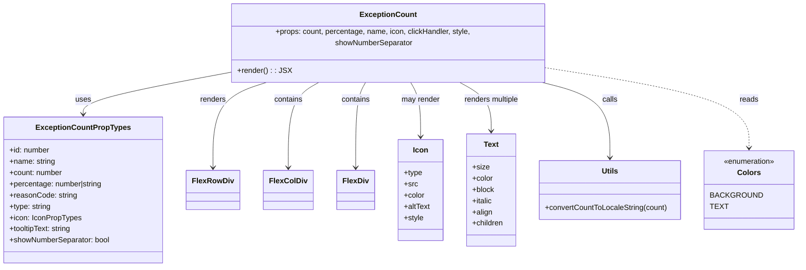

# Diagram: web/portal/src/components/molecules/ExceptionCount.molecule.js


> Auto-generated by Obscura crawlers

## Diagram 1



### SVG

<svg id="container" width="1668.484375" xmlns="http://www.w3.org/2000/svg" class="classDiagram" height="546" viewBox="0 0 1668.484375 546" role="graphics-document document" aria-roledescription="class"><style>#container{font-family:"trebuchet ms",verdana,arial,sans-serif;font-size:16px;fill:#333;}@keyframes edge-animation-frame{from{stroke-dashoffset:0;}}@keyframes dash{to{stroke-dashoffset:0;}}#container .edge-animation-slow{stroke-dasharray:9,5!important;stroke-dashoffset:900;animation:dash 50s linear infinite;stroke-linecap:round;}#container .edge-animation-fast{stroke-dasharray:9,5!important;stroke-dashoffset:900;animation:dash 20s linear infinite;stroke-linecap:round;}#container .error-icon{fill:#552222;}#container .error-text{fill:#552222;stroke:#552222;}#container .edge-thickness-normal{stroke-width:1px;}#container .edge-thickness-thick{stroke-width:3.5px;}#container .edge-pattern-solid{stroke-dasharray:0;}#container .edge-thickness-invisible{stroke-width:0;fill:none;}#container .edge-pattern-dashed{stroke-dasharray:3;}#container .edge-pattern-dotted{stroke-dasharray:2;}#container .marker{fill:#333333;stroke:#333333;}#container .marker.cross{stroke:#333333;}#container svg{font-family:"trebuchet ms",verdana,arial,sans-serif;font-size:16px;}#container p{margin:0;}#container g.classGroup text{fill:#9370DB;stroke:none;font-family:"trebuchet ms",verdana,arial,sans-serif;font-size:10px;}#container g.classGroup text .title{font-weight:bolder;}#container .nodeLabel,#container .edgeLabel{color:#131300;}#container .edgeLabel .label rect{fill:#ECECFF;}#container .label text{fill:#131300;}#container .labelBkg{background:#ECECFF;}#container .edgeLabel .label span{background:#ECECFF;}#container .classTitle{font-weight:bolder;}#container .node rect,#container .node circle,#container .node ellipse,#container .node polygon,#container .node path{fill:#ECECFF;stroke:#9370DB;stroke-width:1px;}#container .divider{stroke:#9370DB;stroke-width:1;}#container g.clickable{cursor:pointer;}#container g.classGroup rect{fill:#ECECFF;stroke:#9370DB;}#container g.classGroup line{stroke:#9370DB;stroke-width:1;}#container .classLabel .box{stroke:none;stroke-width:0;fill:#ECECFF;opacity:0.5;}#container .classLabel .label{fill:#9370DB;font-size:10px;}#container .relation{stroke:#333333;stroke-width:1;fill:none;}#container .dashed-line{stroke-dasharray:3;}#container .dotted-line{stroke-dasharray:1 2;}#container #compositionStart,#container .composition{fill:#333333!important;stroke:#333333!important;stroke-width:1;}#container #compositionEnd,#container .composition{fill:#333333!important;stroke:#333333!important;stroke-width:1;}#container #dependencyStart,#container .dependency{fill:#333333!important;stroke:#333333!important;stroke-width:1;}#container #dependencyStart,#container .dependency{fill:#333333!important;stroke:#333333!important;stroke-width:1;}#container #extensionStart,#container .extension{fill:transparent!important;stroke:#333333!important;stroke-width:1;}#container #extensionEnd,#container .extension{fill:transparent!important;stroke:#333333!important;stroke-width:1;}#container #aggregationStart,#container .aggregation{fill:transparent!important;stroke:#333333!important;stroke-width:1;}#container #aggregationEnd,#container .aggregation{fill:transparent!important;stroke:#333333!important;stroke-width:1;}#container #lollipopStart,#container .lollipop{fill:#ECECFF!important;stroke:#333333!important;stroke-width:1;}#container #lollipopEnd,#container .lollipop{fill:#ECECFF!important;stroke:#333333!important;stroke-width:1;}#container .edgeTerminals{font-size:11px;line-height:initial;}#container .classTitleText{text-anchor:middle;font-size:18px;fill:#333;}#container .label-icon{display:inline-block;height:1em;overflow:visible;vertical-align:-0.125em;}#container .node .label-icon path{fill:currentColor;stroke:revert;stroke-width:revert;}#container :root{--mermaid-font-family:"trebuchet ms",verdana,arial,sans-serif;}</style><g><defs><marker id="container_class-aggregationStart" class="marker aggregation class" refX="18" refY="7" markerWidth="190" markerHeight="240" orient="auto"><path d="M 18,7 L9,13 L1,7 L9,1 Z"></path></marker></defs><defs><marker id="container_class-aggregationEnd" class="marker aggregation class" refX="1" refY="7" markerWidth="20" markerHeight="28" orient="auto"><path d="M 18,7 L9,13 L1,7 L9,1 Z"></path></marker></defs><defs><marker id="container_class-extensionStart" class="marker extension class" refX="18" refY="7" markerWidth="190" markerHeight="240" orient="auto"><path d="M 1,7 L18,13 V 1 Z"></path></marker></defs><defs><marker id="container_class-extensionEnd" class="marker extension class" refX="1" refY="7" markerWidth="20" markerHeight="28" orient="auto"><path d="M 1,1 V 13 L18,7 Z"></path></marker></defs><defs><marker id="container_class-compositionStart" class="marker composition class" refX="18" refY="7" markerWidth="190" markerHeight="240" orient="auto"><path d="M 18,7 L9,13 L1,7 L9,1 Z"></path></marker></defs><defs><marker id="container_class-compositionEnd" class="marker composition class" refX="1" refY="7" markerWidth="20" markerHeight="28" orient="auto"><path d="M 18,7 L9,13 L1,7 L9,1 Z"></path></marker></defs><defs><marker id="container_class-dependencyStart" class="marker dependency class" refX="6" refY="7" markerWidth="190" markerHeight="240" orient="auto"><path d="M 5,7 L9,13 L1,7 L9,1 Z"></path></marker></defs><defs><marker id="container_class-dependencyEnd" class="marker dependency class" refX="13" refY="7" markerWidth="20" markerHeight="28" orient="auto"><path d="M 18,7 L9,13 L14,7 L9,1 Z"></path></marker></defs><defs><marker id="container_class-lollipopStart" class="marker lollipop class" refX="13" refY="7" markerWidth="190" markerHeight="240" orient="auto"><circle stroke="black" fill="transparent" cx="7" cy="7" r="6"></circle></marker></defs><defs><marker id="container_class-lollipopEnd" class="marker lollipop class" refX="1" refY="7" markerWidth="190" markerHeight="240" orient="auto"><circle stroke="black" fill="transparent" cx="7" cy="7" r="6"></circle></marker></defs><g class="root"><g class="clusters"></g><g class="edgePaths"><path d="M470.904,137.939L421.7,146.449C372.495,154.959,274.085,171.98,224.881,185.656C175.676,199.333,175.676,209.667,175.676,214.833L175.676,220" id="id_ExceptionCount_ExceptionCountPropTypes_1" class="edge-thickness-normal edge-pattern-solid relation" style=";;;" data-edge="true" data-et="edge" data-id="id_ExceptionCount_ExceptionCountPropTypes_1" data-points="W3sieCI6NDcwLjkwNDI5Njg3NSwieSI6MTM3LjkzODY2ODU1OTE5MTV9LHsieCI6MTc1LjY3NTc4MTI1LCJ5IjoxODl9LHsieCI6MTc1LjY3NTc4MTI1LCJ5IjoyMjZ9XQ==" marker-end="url(#container_class-dependencyEnd)"></path><path d="M568.801,152L548.495,158.167C528.188,164.333,487.574,176.667,467.268,207C446.961,237.333,446.961,285.667,446.961,309.833L446.961,334" id="id_ExceptionCount_FlexRowDiv_2" class="edge-thickness-normal edge-pattern-solid relation" style=";;;" data-edge="true" data-et="edge" data-id="id_ExceptionCount_FlexRowDiv_2" data-points="W3sieCI6NTY4LjgwMTQ0NDIzNzM4NTMsInkiOjE1Mn0seyJ4Ijo0NDYuOTYwOTM3NSwieSI6MTg5fSx7IngiOjQ0Ni45NjA5Mzc1LCJ5IjozNDB9XQ==" marker-end="url(#container_class-dependencyEnd)"></path><path d="M670.015,152L658.377,158.167C646.739,164.333,623.463,176.667,611.825,207C600.188,237.333,600.188,285.667,600.188,309.833L600.188,334" id="id_ExceptionCount_FlexColDiv_3" class="edge-thickness-normal edge-pattern-solid relation" style=";;;" data-edge="true" data-et="edge" data-id="id_ExceptionCount_FlexColDiv_3" data-points="W3sieCI6NjcwLjAxNTMyMDM4NDE3NDMsInkiOjE1Mn0seyJ4Ijo2MDAuMTg3NSwieSI6MTg5fSx7IngiOjYwMC4xODc1LCJ5IjozNDB9XQ==" marker-end="url(#container_class-dependencyEnd)"></path><path d="M761.006,152L757.161,158.167C753.317,164.333,745.627,176.667,741.782,207C737.938,237.333,737.938,285.667,737.938,309.833L737.938,334" id="id_ExceptionCount_FlexDiv_4" class="edge-thickness-normal edge-pattern-solid relation" style=";;;" data-edge="true" data-et="edge" data-id="id_ExceptionCount_FlexDiv_4" data-points="W3sieCI6NzYxLjAwNjE0NjA3MjI0NzcsInkiOjE1Mn0seyJ4Ijo3MzcuOTM3NSwieSI6MTg5fSx7IngiOjczNy45Mzc1LCJ5IjozNDB9XQ==" marker-end="url(#container_class-dependencyEnd)"></path><path d="M850.787,152L854.632,158.167C858.476,164.333,866.166,176.667,870.011,196C873.855,215.333,873.855,241.667,873.855,254.833L873.855,268" id="id_ExceptionCount_Icon_5" class="edge-thickness-normal edge-pattern-solid relation" style=";;;" data-edge="true" data-et="edge" data-id="id_ExceptionCount_Icon_5" data-points="W3sieCI6ODUwLjc4NjgyMjY3Nzc1MjMsInkiOjE1Mn0seyJ4Ijo4NzMuODU1NDY4NzUsInkiOjE4OX0seyJ4Ijo4NzMuODU1NDY4NzUsInkiOjI3NH1d" marker-end="url(#container_class-dependencyEnd)"></path><path d="M950.68,152L963.08,158.167C975.48,164.333,1000.281,176.667,1012.682,194C1025.082,211.333,1025.082,233.667,1025.082,244.833L1025.082,256" id="id_ExceptionCount_Text_6" class="edge-thickness-normal edge-pattern-solid relation" style=";;;" data-edge="true" data-et="edge" data-id="id_ExceptionCount_Text_6" data-points="W3sieCI6OTUwLjY3OTU5NzkwNzExMDEsInkiOjE1Mn0seyJ4IjoxMDI1LjA4MjAzMTI1LCJ5IjoxODl9LHsieCI6MTAyNS4wODIwMzEyNSwieSI6MjYyfV0=" marker-end="url(#container_class-dependencyEnd)"></path><path d="M1119.097,152L1145.922,158.167C1172.747,164.333,1226.397,176.667,1253.222,203.5C1280.047,230.333,1280.047,271.667,1280.047,292.333L1280.047,313" id="id_ExceptionCount_Utils_7" class="edge-thickness-normal edge-pattern-solid relation" style=";;;" data-edge="true" data-et="edge" data-id="id_ExceptionCount_Utils_7" data-points="W3sieCI6MTExOS4wOTY3NDI0MDI1MjMsInkiOjE1Mn0seyJ4IjoxMjgwLjA0Njg3NSwieSI6MTg5fSx7IngiOjEyODAuMDQ2ODc1LCJ5IjozMTl9XQ==" marker-end="url(#container_class-dependencyEnd)"></path><path d="M1140.889,127.723L1212.578,137.936C1284.268,148.148,1427.648,168.574,1499.338,195.954C1571.027,223.333,1571.027,257.667,1571.027,274.833L1571.027,292" id="id_ExceptionCount_Colors_8" class="edge-thickness-normal edge-pattern-dashed relation" style=";;;" data-edge="true" data-et="edge" data-id="id_ExceptionCount_Colors_8" data-points="W3sieCI6MTE0MC44ODg2NzE4NzUsInkiOjEyNy43MjI3NDk2MzE3Nzc2NX0seyJ4IjoxNTcxLjAyNzM0Mzc1LCJ5IjoxODl9LHsieCI6MTU3MS4wMjczNDM3NSwieSI6Mjk4fV0=" marker-end="url(#container_class-dependencyEnd)"></path></g><g class="edgeLabels"><g class="edgeLabel" transform="translate(175.67578125, 189)"><g class="label" data-id="id_ExceptionCount_ExceptionCountPropTypes_1" transform="translate(-16.4921875, -12)"><foreignObject width="32.984375" height="24"><div xmlns="http://www.w3.org/1999/xhtml" class="labelBkg" style="display: table-cell; white-space: nowrap; line-height: 1.5; max-width: 200px; text-align: center;"><span class="edgeLabel"><p>uses</p></span></div></foreignObject></g></g><g class="edgeLabel" transform="translate(446.9609375, 189)"><g class="label" data-id="id_ExceptionCount_FlexRowDiv_2" transform="translate(-27.75, -12)"><foreignObject width="55.5" height="24"><div xmlns="http://www.w3.org/1999/xhtml" class="labelBkg" style="display: table-cell; white-space: nowrap; line-height: 1.5; max-width: 200px; text-align: center;"><span class="edgeLabel"><p>renders</p></span></div></foreignObject></g></g><g class="edgeLabel" transform="translate(600.1875, 189)"><g class="label" data-id="id_ExceptionCount_FlexColDiv_3" transform="translate(-30.890625, -12)"><foreignObject width="61.78125" height="24"><div xmlns="http://www.w3.org/1999/xhtml" class="labelBkg" style="display: table-cell; white-space: nowrap; line-height: 1.5; max-width: 200px; text-align: center;"><span class="edgeLabel"><p>contains</p></span></div></foreignObject></g></g><g class="edgeLabel" transform="translate(737.9375, 189)"><g class="label" data-id="id_ExceptionCount_FlexDiv_4" transform="translate(-30.890625, -12)"><foreignObject width="61.78125" height="24"><div xmlns="http://www.w3.org/1999/xhtml" class="labelBkg" style="display: table-cell; white-space: nowrap; line-height: 1.5; max-width: 200px; text-align: center;"><span class="edgeLabel"><p>contains</p></span></div></foreignObject></g></g><g class="edgeLabel" transform="translate(873.85546875, 189)"><g class="label" data-id="id_ExceptionCount_Icon_5" transform="translate(-41.2734375, -12)"><foreignObject width="82.546875" height="24"><div xmlns="http://www.w3.org/1999/xhtml" class="labelBkg" style="display: table-cell; white-space: nowrap; line-height: 1.5; max-width: 200px; text-align: center;"><span class="edgeLabel"><p>may render</p></span></div></foreignObject></g></g><g class="edgeLabel" transform="translate(1025.08203125, 189)"><g class="label" data-id="id_ExceptionCount_Text_6" transform="translate(-60.28125, -12)"><foreignObject width="120.5625" height="24"><div xmlns="http://www.w3.org/1999/xhtml" class="labelBkg" style="display: table-cell; white-space: nowrap; line-height: 1.5; max-width: 200px; text-align: center;"><span class="edgeLabel"><p>renders multiple</p></span></div></foreignObject></g></g><g class="edgeLabel" transform="translate(1280.046875, 189)"><g class="label" data-id="id_ExceptionCount_Utils_7" transform="translate(-16.4453125, -12)"><foreignObject width="32.890625" height="24"><div xmlns="http://www.w3.org/1999/xhtml" class="labelBkg" style="display: table-cell; white-space: nowrap; line-height: 1.5; max-width: 200px; text-align: center;"><span class="edgeLabel"><p>calls</p></span></div></foreignObject></g></g><g class="edgeLabel" transform="translate(1571.02734375, 189)"><g class="label" data-id="id_ExceptionCount_Colors_8" transform="translate(-20.0078125, -12)"><foreignObject width="40.015625" height="24"><div xmlns="http://www.w3.org/1999/xhtml" class="labelBkg" style="display: table-cell; white-space: nowrap; line-height: 1.5; max-width: 200px; text-align: center;"><span class="edgeLabel"><p>reads</p></span></div></foreignObject></g></g></g><g class="nodes"><g class="node default" id="classId-ExceptionCount-0" transform="translate(805.896484375, 80)"><g class="basic label-container"><path d="M-334.9921875 -72 L334.9921875 -72 L334.9921875 72 L-334.9921875 72" stroke="none" stroke-width="0" fill="#ECECFF" style=""></path><path d="M-334.9921875 -72 C-142.73150608591428 -72, 49.52917532817145 -72, 334.9921875 -72 M-334.9921875 -72 C-133.5793813821197 -72, 67.83342473576062 -72, 334.9921875 -72 M334.9921875 -72 C334.9921875 -21.300566962542952, 334.9921875 29.398866074914096, 334.9921875 72 M334.9921875 -72 C334.9921875 -41.71417668360148, 334.9921875 -11.42835336720296, 334.9921875 72 M334.9921875 72 C197.38530832216227 72, 59.77842914432455 72, -334.9921875 72 M334.9921875 72 C138.6994136541949 72, -57.5933601916102 72, -334.9921875 72 M-334.9921875 72 C-334.9921875 25.37079801462503, -334.9921875 -21.25840397074994, -334.9921875 -72 M-334.9921875 72 C-334.9921875 22.853624292574338, -334.9921875 -26.292751414851324, -334.9921875 -72" stroke="#9370DB" stroke-width="1.3" fill="none" stroke-dasharray="0 0" style=""></path></g><g class="annotation-group text" transform="translate(0, -48)"></g><g class="label-group text" transform="translate(-57.09375, -48)"><g class="label" style="font-weight: bolder" transform="translate(0,-12)"><foreignObject width="114.1875" height="24"><div xmlns="http://www.w3.org/1999/xhtml" style="display: table-cell; white-space: nowrap; line-height: 1.5; max-width: 163px; text-align: center;"><span class="nodeLabel markdown-node-label" style=""><p>ExceptionCount</p></span></div></foreignObject></g></g><g class="members-group text" transform="translate(-322.9921875, 0)"><g class="label" style="" transform="translate(0,-12)"><foreignObject width="588.890625" height="24"><div xmlns="http://www.w3.org/1999/xhtml" style="display: table-cell; white-space: nowrap; line-height: 1.5; max-width: 647px; text-align: center;"><span class="nodeLabel markdown-node-label" style=""><p>+props: count, percentage, name, icon, clickHandler, style, showNumberSeparator</p></span></div></foreignObject></g></g><g class="methods-group text" transform="translate(-322.9921875, 48)"><g class="label" style="" transform="translate(0,-12)"><foreignObject width="109.140625" height="24"><div xmlns="http://www.w3.org/1999/xhtml" style="display: table-cell; white-space: nowrap; line-height: 1.5; max-width: 167px; text-align: center;"><span class="nodeLabel markdown-node-label" style=""><p>+render() : : JSX</p></span></div></foreignObject></g></g><g class="divider" style=""><path d="M-334.9921875 -24 C-115.79031534937883 -24, 103.41155680124234 -24, 334.9921875 -24 M-334.9921875 -24 C-124.99463684705358 -24, 85.00291380589283 -24, 334.9921875 -24" stroke="#9370DB" stroke-width="1.3" fill="none" stroke-dasharray="0 0" style=""></path></g><g class="divider" style=""><path d="M-334.9921875 24 C-85.78390389130573 24, 163.42437971738855 24, 334.9921875 24 M-334.9921875 24 C-187.0576978987595 24, -39.123208297519 24, 334.9921875 24" stroke="#9370DB" stroke-width="1.3" fill="none" stroke-dasharray="0 0" style=""></path></g></g><g class="node default" id="classId-ExceptionCountPropTypes-1" transform="translate(175.67578125, 382)"><g class="basic label-container"><path d="M-167.67578125 -156 L167.67578125 -156 L167.67578125 156 L-167.67578125 156" stroke="none" stroke-width="0" fill="#ECECFF" style=""></path><path d="M-167.67578125 -156 C-80.18812709476005 -156, 7.299527060479903 -156, 167.67578125 -156 M-167.67578125 -156 C-94.62810757448828 -156, -21.580433898976565 -156, 167.67578125 -156 M167.67578125 -156 C167.67578125 -31.84577968736903, 167.67578125 92.30844062526194, 167.67578125 156 M167.67578125 -156 C167.67578125 -78.11463740054424, 167.67578125 -0.2292748010884793, 167.67578125 156 M167.67578125 156 C39.87662411673695 156, -87.9225330165261 156, -167.67578125 156 M167.67578125 156 C60.40569113644307 156, -46.864398977113865 156, -167.67578125 156 M-167.67578125 156 C-167.67578125 45.370851136307564, -167.67578125 -65.25829772738487, -167.67578125 -156 M-167.67578125 156 C-167.67578125 76.23378124172348, -167.67578125 -3.5324375165530455, -167.67578125 -156" stroke="#9370DB" stroke-width="1.3" fill="none" stroke-dasharray="0 0" style=""></path></g><g class="annotation-group text" transform="translate(0, -132)"></g><g class="label-group text" transform="translate(-95.3515625, -132)"><g class="label" style="font-weight: bolder" transform="translate(0,-12)"><foreignObject width="190.703125" height="24"><div xmlns="http://www.w3.org/1999/xhtml" style="display: table-cell; white-space: nowrap; line-height: 1.5; max-width: 238px; text-align: center;"><span class="nodeLabel markdown-node-label" style=""><p>ExceptionCountPropTypes</p></span></div></foreignObject></g></g><g class="members-group text" transform="translate(-155.67578125, -84)"><g class="label" style="" transform="translate(0,-12)"><foreignObject width="86.953125" height="24"><div xmlns="http://www.w3.org/1999/xhtml" style="display: table-cell; white-space: nowrap; line-height: 1.5; max-width: 145px; text-align: center;"><span class="nodeLabel markdown-node-label" style=""><p>+id: number</p></span></div></foreignObject></g><g class="label" style="" transform="translate(0,12)"><foreignObject width="98.21875" height="24"><div xmlns="http://www.w3.org/1999/xhtml" style="display: table-cell; white-space: nowrap; line-height: 1.5; max-width: 156px; text-align: center;"><span class="nodeLabel markdown-node-label" style=""><p>+name: string</p></span></div></foreignObject></g><g class="label" style="" transform="translate(0,36)"><foreignObject width="114.078125" height="24"><div xmlns="http://www.w3.org/1999/xhtml" style="display: table-cell; white-space: nowrap; line-height: 1.5; max-width: 172px; text-align: center;"><span class="nodeLabel markdown-node-label" style=""><p>+count: number</p></span></div></foreignObject></g><g class="label" style="" transform="translate(0,60)"><foreignObject width="201.28125" height="24"><div xmlns="http://www.w3.org/1999/xhtml" style="display: table-cell; white-space: nowrap; line-height: 1.5; max-width: 259px; text-align: center;"><span class="nodeLabel markdown-node-label" style=""><p>+percentage: number|string</p></span></div></foreignObject></g><g class="label" style="" transform="translate(0,84)"><foreignObject width="142.96875" height="24"><div xmlns="http://www.w3.org/1999/xhtml" style="display: table-cell; white-space: nowrap; line-height: 1.5; max-width: 201px; text-align: center;"><span class="nodeLabel markdown-node-label" style=""><p>+reasonCode: string</p></span></div></foreignObject></g><g class="label" style="" transform="translate(0,108)"><foreignObject width="89.421875" height="24"><div xmlns="http://www.w3.org/1999/xhtml" style="display: table-cell; white-space: nowrap; line-height: 1.5; max-width: 147px; text-align: center;"><span class="nodeLabel markdown-node-label" style=""><p>+type: string</p></span></div></foreignObject></g><g class="label" style="" transform="translate(0,132)"><foreignObject width="152.125" height="24"><div xmlns="http://www.w3.org/1999/xhtml" style="display: table-cell; white-space: nowrap; line-height: 1.5; max-width: 209px; text-align: center;"><span class="nodeLabel markdown-node-label" style=""><p>+icon: IconPropTypes</p></span></div></foreignObject></g><g class="label" style="" transform="translate(0,156)"><foreignObject width="135.890625" height="24"><div xmlns="http://www.w3.org/1999/xhtml" style="display: table-cell; white-space: nowrap; line-height: 1.5; max-width: 194px; text-align: center;"><span class="nodeLabel markdown-node-label" style=""><p>+tooltipText: string</p></span></div></foreignObject></g><g class="label" style="" transform="translate(0,180)"><foreignObject width="216" height="24"><div xmlns="http://www.w3.org/1999/xhtml" style="display: table-cell; white-space: nowrap; line-height: 1.5; max-width: 274px; text-align: center;"><span class="nodeLabel markdown-node-label" style=""><p>+showNumberSeparator: bool</p></span></div></foreignObject></g></g><g class="methods-group text" transform="translate(-155.67578125, 156)"></g><g class="divider" style=""><path d="M-167.67578125 -108 C-85.22395529250822 -108, -2.7721293350164444 -108, 167.67578125 -108 M-167.67578125 -108 C-76.1506444741838 -108, 15.374492301632387 -108, 167.67578125 -108" stroke="#9370DB" stroke-width="1.3" fill="none" stroke-dasharray="0 0" style=""></path></g><g class="divider" style=""><path d="M-167.67578125 132 C-61.68426653093668 132, 44.307248188126636 132, 167.67578125 132 M-167.67578125 132 C-57.908854651988605 132, 51.85807194602279 132, 167.67578125 132" stroke="#9370DB" stroke-width="1.3" fill="none" stroke-dasharray="0 0" style=""></path></g></g><g class="node default" id="classId-Icon-2" transform="translate(873.85546875, 382)"><g class="basic label-container"><path d="M-47.78515625 -108 L47.78515625 -108 L47.78515625 108 L-47.78515625 108" stroke="none" stroke-width="0" fill="#ECECFF" style=""></path><path d="M-47.78515625 -108 C-12.346488916316005 -108, 23.09217841736799 -108, 47.78515625 -108 M-47.78515625 -108 C-27.253083956864934 -108, -6.721011663729868 -108, 47.78515625 -108 M47.78515625 -108 C47.78515625 -46.16348029476198, 47.78515625 15.673039410476036, 47.78515625 108 M47.78515625 -108 C47.78515625 -32.17887848985694, 47.78515625 43.64224302028612, 47.78515625 108 M47.78515625 108 C10.024805090108138 108, -27.735546069783723 108, -47.78515625 108 M47.78515625 108 C12.34002633330578 108, -23.10510358338844 108, -47.78515625 108 M-47.78515625 108 C-47.78515625 56.76295480407825, -47.78515625 5.525909608156496, -47.78515625 -108 M-47.78515625 108 C-47.78515625 24.057382227844144, -47.78515625 -59.88523554431171, -47.78515625 -108" stroke="#9370DB" stroke-width="1.3" fill="none" stroke-dasharray="0 0" style=""></path></g><g class="annotation-group text" transform="translate(0, -84)"></g><g class="label-group text" transform="translate(-15.3046875, -84)"><g class="label" style="font-weight: bolder" transform="translate(0,-12)"><foreignObject width="30.609375" height="24"><div xmlns="http://www.w3.org/1999/xhtml" style="display: table-cell; white-space: nowrap; line-height: 1.5; max-width: 81px; text-align: center;"><span class="nodeLabel markdown-node-label" style=""><p>Icon</p></span></div></foreignObject></g></g><g class="members-group text" transform="translate(-35.78515625, -36)"><g class="label" style="" transform="translate(0,-12)"><foreignObject width="39.703125" height="24"><div xmlns="http://www.w3.org/1999/xhtml" style="display: table-cell; white-space: nowrap; line-height: 1.5; max-width: 97px; text-align: center;"><span class="nodeLabel markdown-node-label" style=""><p>+type</p></span></div></foreignObject></g><g class="label" style="" transform="translate(0,12)"><foreignObject width="28.8125" height="24"><div xmlns="http://www.w3.org/1999/xhtml" style="display: table-cell; white-space: nowrap; line-height: 1.5; max-width: 87px; text-align: center;"><span class="nodeLabel markdown-node-label" style=""><p>+src</p></span></div></foreignObject></g><g class="label" style="" transform="translate(0,36)"><foreignObject width="44.796875" height="24"><div xmlns="http://www.w3.org/1999/xhtml" style="display: table-cell; white-space: nowrap; line-height: 1.5; max-width: 103px; text-align: center;"><span class="nodeLabel markdown-node-label" style=""><p>+color</p></span></div></foreignObject></g><g class="label" style="" transform="translate(0,60)"><foreignObject width="56.265625" height="24"><div xmlns="http://www.w3.org/1999/xhtml" style="display: table-cell; white-space: nowrap; line-height: 1.5; max-width: 114px; text-align: center;"><span class="nodeLabel markdown-node-label" style=""><p>+altText</p></span></div></foreignObject></g><g class="label" style="" transform="translate(0,84)"><foreignObject width="42.359375" height="24"><div xmlns="http://www.w3.org/1999/xhtml" style="display: table-cell; white-space: nowrap; line-height: 1.5; max-width: 100px; text-align: center;"><span class="nodeLabel markdown-node-label" style=""><p>+style</p></span></div></foreignObject></g></g><g class="methods-group text" transform="translate(-35.78515625, 108)"></g><g class="divider" style=""><path d="M-47.78515625 -60 C-13.302926999597226 -60, 21.17930225080555 -60, 47.78515625 -60 M-47.78515625 -60 C-13.504409865136402 -60, 20.776336519727195 -60, 47.78515625 -60" stroke="#9370DB" stroke-width="1.3" fill="none" stroke-dasharray="0 0" style=""></path></g><g class="divider" style=""><path d="M-47.78515625 84 C-9.868446104148298 84, 28.048264041703405 84, 47.78515625 84 M-47.78515625 84 C-12.647526850150307 84, 22.490102549699387 84, 47.78515625 84" stroke="#9370DB" stroke-width="1.3" fill="none" stroke-dasharray="0 0" style=""></path></g></g><g class="node default" id="classId-Text-3" transform="translate(1025.08203125, 382)"><g class="basic label-container"><path d="M-53.44140625 -120 L53.44140625 -120 L53.44140625 120 L-53.44140625 120" stroke="none" stroke-width="0" fill="#ECECFF" style=""></path><path d="M-53.44140625 -120 C-10.896147129087197 -120, 31.649111991825606 -120, 53.44140625 -120 M-53.44140625 -120 C-22.35986981426171 -120, 8.72166662147658 -120, 53.44140625 -120 M53.44140625 -120 C53.44140625 -66.80080215326873, 53.44140625 -13.601604306537453, 53.44140625 120 M53.44140625 -120 C53.44140625 -31.784618594287593, 53.44140625 56.43076281142481, 53.44140625 120 M53.44140625 120 C28.673156107022574 120, 3.904905964045149 120, -53.44140625 120 M53.44140625 120 C13.207210394983747 120, -27.026985460032506 120, -53.44140625 120 M-53.44140625 120 C-53.44140625 65.50713317063938, -53.44140625 11.014266341278741, -53.44140625 -120 M-53.44140625 120 C-53.44140625 42.427323942943204, -53.44140625 -35.14535211411359, -53.44140625 -120" stroke="#9370DB" stroke-width="1.3" fill="none" stroke-dasharray="0 0" style=""></path></g><g class="annotation-group text" transform="translate(0, -96)"></g><g class="label-group text" transform="translate(-15.3828125, -96)"><g class="label" style="font-weight: bolder" transform="translate(0,-12)"><foreignObject width="30.765625" height="24"><div xmlns="http://www.w3.org/1999/xhtml" style="display: table-cell; white-space: nowrap; line-height: 1.5; max-width: 80px; text-align: center;"><span class="nodeLabel markdown-node-label" style=""><p>Text</p></span></div></foreignObject></g></g><g class="members-group text" transform="translate(-41.44140625, -48)"><g class="label" style="" transform="translate(0,-12)"><foreignObject width="35.578125" height="24"><div xmlns="http://www.w3.org/1999/xhtml" style="display: table-cell; white-space: nowrap; line-height: 1.5; max-width: 93px; text-align: center;"><span class="nodeLabel markdown-node-label" style=""><p>+size</p></span></div></foreignObject></g><g class="label" style="" transform="translate(0,12)"><foreignObject width="44.796875" height="24"><div xmlns="http://www.w3.org/1999/xhtml" style="display: table-cell; white-space: nowrap; line-height: 1.5; max-width: 103px; text-align: center;"><span class="nodeLabel markdown-node-label" style=""><p>+color</p></span></div></foreignObject></g><g class="label" style="" transform="translate(0,36)"><foreignObject width="47.28125" height="24"><div xmlns="http://www.w3.org/1999/xhtml" style="display: table-cell; white-space: nowrap; line-height: 1.5; max-width: 105px; text-align: center;"><span class="nodeLabel markdown-node-label" style=""><p>+block</p></span></div></foreignObject></g><g class="label" style="" transform="translate(0,60)"><foreignObject width="43.5625" height="24"><div xmlns="http://www.w3.org/1999/xhtml" style="display: table-cell; white-space: nowrap; line-height: 1.5; max-width: 101px; text-align: center;"><span class="nodeLabel markdown-node-label" style=""><p>+italic</p></span></div></foreignObject></g><g class="label" style="" transform="translate(0,84)"><foreignObject width="43.1875" height="24"><div xmlns="http://www.w3.org/1999/xhtml" style="display: table-cell; white-space: nowrap; line-height: 1.5; max-width: 101px; text-align: center;"><span class="nodeLabel markdown-node-label" style=""><p>+align</p></span></div></foreignObject></g><g class="label" style="" transform="translate(0,108)"><foreignObject width="67.5" height="24"><div xmlns="http://www.w3.org/1999/xhtml" style="display: table-cell; white-space: nowrap; line-height: 1.5; max-width: 125px; text-align: center;"><span class="nodeLabel markdown-node-label" style=""><p>+children</p></span></div></foreignObject></g></g><g class="methods-group text" transform="translate(-41.44140625, 120)"></g><g class="divider" style=""><path d="M-53.44140625 -72 C-31.60457544083626 -72, -9.767744631672521 -72, 53.44140625 -72 M-53.44140625 -72 C-20.410677214079072 -72, 12.620051821841855 -72, 53.44140625 -72" stroke="#9370DB" stroke-width="1.3" fill="none" stroke-dasharray="0 0" style=""></path></g><g class="divider" style=""><path d="M-53.44140625 96 C-19.431257756960548 96, 14.578890736078904 96, 53.44140625 96 M-53.44140625 96 C-19.195243782625703 96, 15.050918684748595 96, 53.44140625 96" stroke="#9370DB" stroke-width="1.3" fill="none" stroke-dasharray="0 0" style=""></path></g></g><g class="node default" id="classId-FlexRowDiv-4" transform="translate(446.9609375, 382)"><g class="basic label-container"><path d="M-53.609375 -42 L53.609375 -42 L53.609375 42 L-53.609375 42" stroke="none" stroke-width="0" fill="#ECECFF" style=""></path><path d="M-53.609375 -42 C-15.312879721201732 -42, 22.983615557596536 -42, 53.609375 -42 M-53.609375 -42 C-24.55949748845274 -42, 4.490380023094517 -42, 53.609375 -42 M53.609375 -42 C53.609375 -14.003923627329389, 53.609375 13.992152745341222, 53.609375 42 M53.609375 -42 C53.609375 -13.072537248765133, 53.609375 15.854925502469733, 53.609375 42 M53.609375 42 C12.416757226307432 42, -28.775860547385136 42, -53.609375 42 M53.609375 42 C20.882727330375623 42, -11.843920339248754 42, -53.609375 42 M-53.609375 42 C-53.609375 8.478224781822917, -53.609375 -25.043550436354167, -53.609375 -42 M-53.609375 42 C-53.609375 12.651012489558575, -53.609375 -16.69797502088285, -53.609375 -42" stroke="#9370DB" stroke-width="1.3" fill="none" stroke-dasharray="0 0" style=""></path></g><g class="annotation-group text" transform="translate(0, -18)"></g><g class="label-group text" transform="translate(-41.609375, -18)"><g class="label" style="font-weight: bolder" transform="translate(0,-12)"><foreignObject width="83.21875" height="24"><div xmlns="http://www.w3.org/1999/xhtml" style="display: table-cell; white-space: nowrap; line-height: 1.5; max-width: 132px; text-align: center;"><span class="nodeLabel markdown-node-label" style=""><p>FlexRowDiv</p></span></div></foreignObject></g></g><g class="members-group text" transform="translate(-41.609375, 30)"></g><g class="methods-group text" transform="translate(-41.609375, 60)"></g><g class="divider" style=""><path d="M-53.609375 6 C-15.576125674601194 6, 22.457123650797612 6, 53.609375 6 M-53.609375 6 C-12.623175299562469 6, 28.363024400875062 6, 53.609375 6" stroke="#9370DB" stroke-width="1.3" fill="none" stroke-dasharray="0 0" style=""></path></g><g class="divider" style=""><path d="M-53.609375 24 C-22.184153239648467 24, 9.241068520703067 24, 53.609375 24 M-53.609375 24 C-23.795062100222925 24, 6.01925079955415 24, 53.609375 24" stroke="#9370DB" stroke-width="1.3" fill="none" stroke-dasharray="0 0" style=""></path></g></g><g class="node default" id="classId-FlexColDiv-5" transform="translate(600.1875, 382)"><g class="basic label-container"><path d="M-49.6171875 -42 L49.6171875 -42 L49.6171875 42 L-49.6171875 42" stroke="none" stroke-width="0" fill="#ECECFF" style=""></path><path d="M-49.6171875 -42 C-23.239372119214448 -42, 3.138443261571105 -42, 49.6171875 -42 M-49.6171875 -42 C-22.012282328349006 -42, 5.592622843301989 -42, 49.6171875 -42 M49.6171875 -42 C49.6171875 -15.212316879802664, 49.6171875 11.575366240394672, 49.6171875 42 M49.6171875 -42 C49.6171875 -18.616634816376084, 49.6171875 4.766730367247831, 49.6171875 42 M49.6171875 42 C19.41753288090359 42, -10.78212173819282 42, -49.6171875 42 M49.6171875 42 C24.901405444190058 42, 0.18562338838011527 42, -49.6171875 42 M-49.6171875 42 C-49.6171875 10.8024236911882, -49.6171875 -20.3951526176236, -49.6171875 -42 M-49.6171875 42 C-49.6171875 19.162947631942252, -49.6171875 -3.6741047361154955, -49.6171875 -42" stroke="#9370DB" stroke-width="1.3" fill="none" stroke-dasharray="0 0" style=""></path></g><g class="annotation-group text" transform="translate(0, -18)"></g><g class="label-group text" transform="translate(-37.6171875, -18)"><g class="label" style="font-weight: bolder" transform="translate(0,-12)"><foreignObject width="75.234375" height="24"><div xmlns="http://www.w3.org/1999/xhtml" style="display: table-cell; white-space: nowrap; line-height: 1.5; max-width: 124px; text-align: center;"><span class="nodeLabel markdown-node-label" style=""><p>FlexColDiv</p></span></div></foreignObject></g></g><g class="members-group text" transform="translate(-37.6171875, 30)"></g><g class="methods-group text" transform="translate(-37.6171875, 60)"></g><g class="divider" style=""><path d="M-49.6171875 6 C-21.362059305352275 6, 6.893068889295449 6, 49.6171875 6 M-49.6171875 6 C-13.730616864228473 6, 22.155953771543054 6, 49.6171875 6" stroke="#9370DB" stroke-width="1.3" fill="none" stroke-dasharray="0 0" style=""></path></g><g class="divider" style=""><path d="M-49.6171875 24 C-19.23025507796632 24, 11.156677344067361 24, 49.6171875 24 M-49.6171875 24 C-11.226648221783584 24, 27.16389105643283 24, 49.6171875 24" stroke="#9370DB" stroke-width="1.3" fill="none" stroke-dasharray="0 0" style=""></path></g></g><g class="node default" id="classId-FlexDiv-6" transform="translate(737.9375, 382)"><g class="basic label-container"><path d="M-38.1328125 -42 L38.1328125 -42 L38.1328125 42 L-38.1328125 42" stroke="none" stroke-width="0" fill="#ECECFF" style=""></path><path d="M-38.1328125 -42 C-11.664539248045127 -42, 14.803734003909746 -42, 38.1328125 -42 M-38.1328125 -42 C-21.56606921452403 -42, -4.999325929048062 -42, 38.1328125 -42 M38.1328125 -42 C38.1328125 -23.169505640493092, 38.1328125 -4.339011280986185, 38.1328125 42 M38.1328125 -42 C38.1328125 -11.87621512395937, 38.1328125 18.24756975208126, 38.1328125 42 M38.1328125 42 C9.594426361450381 42, -18.943959777099238 42, -38.1328125 42 M38.1328125 42 C13.281267942668944 42, -11.570276614662113 42, -38.1328125 42 M-38.1328125 42 C-38.1328125 11.044151638483324, -38.1328125 -19.91169672303335, -38.1328125 -42 M-38.1328125 42 C-38.1328125 10.384942263659504, -38.1328125 -21.230115472680993, -38.1328125 -42" stroke="#9370DB" stroke-width="1.3" fill="none" stroke-dasharray="0 0" style=""></path></g><g class="annotation-group text" transform="translate(0, -18)"></g><g class="label-group text" transform="translate(-26.1328125, -18)"><g class="label" style="font-weight: bolder" transform="translate(0,-12)"><foreignObject width="52.265625" height="24"><div xmlns="http://www.w3.org/1999/xhtml" style="display: table-cell; white-space: nowrap; line-height: 1.5; max-width: 101px; text-align: center;"><span class="nodeLabel markdown-node-label" style=""><p>FlexDiv</p></span></div></foreignObject></g></g><g class="members-group text" transform="translate(-26.1328125, 30)"></g><g class="methods-group text" transform="translate(-26.1328125, 60)"></g><g class="divider" style=""><path d="M-38.1328125 6 C-15.568978129533722 6, 6.994856240932556 6, 38.1328125 6 M-38.1328125 6 C-20.167173785747547 6, -2.201535071495094 6, 38.1328125 6" stroke="#9370DB" stroke-width="1.3" fill="none" stroke-dasharray="0 0" style=""></path></g><g class="divider" style=""><path d="M-38.1328125 24 C-19.615536356289326 24, -1.0982602125786514 24, 38.1328125 24 M-38.1328125 24 C-12.360527278220474 24, 13.411757943559053 24, 38.1328125 24" stroke="#9370DB" stroke-width="1.3" fill="none" stroke-dasharray="0 0" style=""></path></g></g><g class="node default" id="classId-Colors-7" transform="translate(1571.02734375, 382)"><g class="basic label-container"><path d="M-89.45703125 -84 L89.45703125 -84 L89.45703125 84 L-89.45703125 84" stroke="none" stroke-width="0" fill="#ECECFF" style=""></path><path d="M-89.45703125 -84 C-34.66040769123243 -84, 20.136215867535142 -84, 89.45703125 -84 M-89.45703125 -84 C-39.64964335511 -84, 10.157744539779998 -84, 89.45703125 -84 M89.45703125 -84 C89.45703125 -40.417512563515764, 89.45703125 3.1649748729684717, 89.45703125 84 M89.45703125 -84 C89.45703125 -28.323419973397307, 89.45703125 27.353160053205386, 89.45703125 84 M89.45703125 84 C20.754471141515438 84, -47.948088966969124 84, -89.45703125 84 M89.45703125 84 C47.73724940242335 84, 6.017467554846704 84, -89.45703125 84 M-89.45703125 84 C-89.45703125 45.387277869664146, -89.45703125 6.774555739328292, -89.45703125 -84 M-89.45703125 84 C-89.45703125 32.43912767752898, -89.45703125 -19.12174464494204, -89.45703125 -84" stroke="#9370DB" stroke-width="1.3" fill="none" stroke-dasharray="0 0" style=""></path></g><g class="annotation-group text" transform="translate(-55.5546875, -60)"><g class="label" style="" transform="translate(0,-12)"><foreignObject width="111.109375" height="24"><div xmlns="http://www.w3.org/1999/xhtml" style="display: table-cell; white-space: nowrap; line-height: 1.5; max-width: 161px; text-align: center;"><span class="nodeLabel markdown-node-label" style=""><p>«enumeration»</p></span></div></foreignObject></g></g><g class="label-group text" transform="translate(-23.1015625, -36)"><g class="label" style="font-weight: bolder" transform="translate(0,-12)"><foreignObject width="46.203125" height="24"><div xmlns="http://www.w3.org/1999/xhtml" style="display: table-cell; white-space: nowrap; line-height: 1.5; max-width: 95px; text-align: center;"><span class="nodeLabel markdown-node-label" style=""><p>Colors</p></span></div></foreignObject></g></g><g class="members-group text" transform="translate(-77.45703125, 12)"><g class="label" style="" transform="translate(0,-12)"><foreignObject width="99.359375" height="24"><div xmlns="http://www.w3.org/1999/xhtml" style="display: table-cell; white-space: nowrap; line-height: 1.5; max-width: 149px; text-align: center;"><span class="nodeLabel markdown-node-label" style=""><p>BACKGROUND</p></span></div></foreignObject></g><g class="label" style="" transform="translate(0,12)"><foreignObject width="33.75" height="24"><div xmlns="http://www.w3.org/1999/xhtml" style="display: table-cell; white-space: nowrap; line-height: 1.5; max-width: 84px; text-align: center;"><span class="nodeLabel markdown-node-label" style=""><p>TEXT</p></span></div></foreignObject></g></g><g class="methods-group text" transform="translate(-77.45703125, 84)"></g><g class="divider" style=""><path d="M-89.45703125 -12 C-37.010757036337175 -12, 15.43551717732565 -12, 89.45703125 -12 M-89.45703125 -12 C-32.10256843545684 -12, 25.251894379086323 -12, 89.45703125 -12" stroke="#9370DB" stroke-width="1.3" fill="none" stroke-dasharray="0 0" style=""></path></g><g class="divider" style=""><path d="M-89.45703125 60 C-44.78749900463124 60, -0.11796675926248668 60, 89.45703125 60 M-89.45703125 60 C-47.926371679957505 60, -6.39571210991501 60, 89.45703125 60" stroke="#9370DB" stroke-width="1.3" fill="none" stroke-dasharray="0 0" style=""></path></g></g><g class="node default" id="classId-Utils-8" transform="translate(1280.046875, 382)"><g class="basic label-container"><path d="M-151.5234375 -63 L151.5234375 -63 L151.5234375 63 L-151.5234375 63" stroke="none" stroke-width="0" fill="#ECECFF" style=""></path><path d="M-151.5234375 -63 C-79.29038152382519 -63, -7.057325547650379 -63, 151.5234375 -63 M-151.5234375 -63 C-33.22331251065657 -63, 85.07681247868686 -63, 151.5234375 -63 M151.5234375 -63 C151.5234375 -30.55531348235411, 151.5234375 1.8893730352917828, 151.5234375 63 M151.5234375 -63 C151.5234375 -22.447797524851516, 151.5234375 18.104404950296967, 151.5234375 63 M151.5234375 63 C84.76198556888131 63, 18.00053363776263 63, -151.5234375 63 M151.5234375 63 C60.34116230685105 63, -30.841112886297907 63, -151.5234375 63 M-151.5234375 63 C-151.5234375 16.969436986851207, -151.5234375 -29.061126026297586, -151.5234375 -63 M-151.5234375 63 C-151.5234375 36.04032087609879, -151.5234375 9.080641752197586, -151.5234375 -63" stroke="#9370DB" stroke-width="1.3" fill="none" stroke-dasharray="0 0" style=""></path></g><g class="annotation-group text" transform="translate(0, -39)"></g><g class="label-group text" transform="translate(-16.796875, -39)"><g class="label" style="font-weight: bolder" transform="translate(0,-12)"><foreignObject width="33.59375" height="24"><div xmlns="http://www.w3.org/1999/xhtml" style="display: table-cell; white-space: nowrap; line-height: 1.5; max-width: 83px; text-align: center;"><span class="nodeLabel markdown-node-label" style=""><p>Utils</p></span></div></foreignObject></g></g><g class="members-group text" transform="translate(-139.5234375, 9)"></g><g class="methods-group text" transform="translate(-139.5234375, 39)"><g class="label" style="" transform="translate(0,-12)"><foreignObject width="262.25" height="24"><div xmlns="http://www.w3.org/1999/xhtml" style="display: table-cell; white-space: nowrap; line-height: 1.5; max-width: 320px; text-align: center;"><span class="nodeLabel markdown-node-label" style=""><p>+convertCountToLocaleString(count)</p></span></div></foreignObject></g></g><g class="divider" style=""><path d="M-151.5234375 -15 C-59.053249021733876 -15, 33.41693945653225 -15, 151.5234375 -15 M-151.5234375 -15 C-41.25498220210363 -15, 69.01347309579273 -15, 151.5234375 -15" stroke="#9370DB" stroke-width="1.3" fill="none" stroke-dasharray="0 0" style=""></path></g><g class="divider" style=""><path d="M-151.5234375 9 C-44.531353942568884 9, 62.46072961486223 9, 151.5234375 9 M-151.5234375 9 C-34.01049344764836 9, 83.50245060470328 9, 151.5234375 9" stroke="#9370DB" stroke-width="1.3" fill="none" stroke-dasharray="0 0" style=""></path></g></g></g></g></g></svg>

## Diagram 2

```mermaid
graph TD
    FR[FlexRowDiv\n(container)] --> FC[FlexColDiv]
    FC --> FInner[FlexDiv\n(justify center)]
    FInner --> Span[span (icon container)]
    Span -->|renders if icon.src| IconComp[Icon\n(type, src, color, altText, style)]
    FInner --> CountText[Text (size24)\nshows count or formatted count]
    FInner --> PercentCond{percentage present?}
    PercentCond -->|yes| PercentText[Text (size16)\nshows percentage or "0.0%"]
    FC --> NameText[Text (
```

> SVG rendering failed for this diagram.
