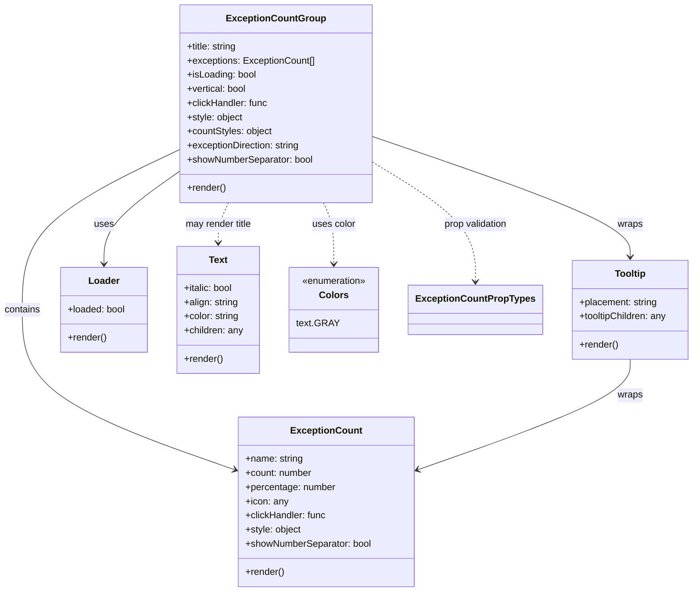

# Diagram: web/portal/src/components/molecules/ExceptionCountGroup.molecule.js


> Auto-generated by Obscura crawlers

## Diagram 1



### SVG

<svg id="container" width="1165.5625" xmlns="http://www.w3.org/2000/svg" class="classDiagram" height="1004" viewBox="0 0 1165.5625 1004" role="graphics-document document" aria-roledescription="class"><style>#container{font-family:"trebuchet ms",verdana,arial,sans-serif;font-size:16px;fill:#333;}@keyframes edge-animation-frame{from{stroke-dashoffset:0;}}@keyframes dash{to{stroke-dashoffset:0;}}#container .edge-animation-slow{stroke-dasharray:9,5!important;stroke-dashoffset:900;animation:dash 50s linear infinite;stroke-linecap:round;}#container .edge-animation-fast{stroke-dasharray:9,5!important;stroke-dashoffset:900;animation:dash 20s linear infinite;stroke-linecap:round;}#container .error-icon{fill:#552222;}#container .error-text{fill:#552222;stroke:#552222;}#container .edge-thickness-normal{stroke-width:1px;}#container .edge-thickness-thick{stroke-width:3.5px;}#container .edge-pattern-solid{stroke-dasharray:0;}#container .edge-thickness-invisible{stroke-width:0;fill:none;}#container .edge-pattern-dashed{stroke-dasharray:3;}#container .edge-pattern-dotted{stroke-dasharray:2;}#container .marker{fill:#333333;stroke:#333333;}#container .marker.cross{stroke:#333333;}#container svg{font-family:"trebuchet ms",verdana,arial,sans-serif;font-size:16px;}#container p{margin:0;}#container g.classGroup text{fill:#9370DB;stroke:none;font-family:"trebuchet ms",verdana,arial,sans-serif;font-size:10px;}#container g.classGroup text .title{font-weight:bolder;}#container .nodeLabel,#container .edgeLabel{color:#131300;}#container .edgeLabel .label rect{fill:#ECECFF;}#container .label text{fill:#131300;}#container .labelBkg{background:#ECECFF;}#container .edgeLabel .label span{background:#ECECFF;}#container .classTitle{font-weight:bolder;}#container .node rect,#container .node circle,#container .node ellipse,#container .node polygon,#container .node path{fill:#ECECFF;stroke:#9370DB;stroke-width:1px;}#container .divider{stroke:#9370DB;stroke-width:1;}#container g.clickable{cursor:pointer;}#container g.classGroup rect{fill:#ECECFF;stroke:#9370DB;}#container g.classGroup line{stroke:#9370DB;stroke-width:1;}#container .classLabel .box{stroke:none;stroke-width:0;fill:#ECECFF;opacity:0.5;}#container .classLabel .label{fill:#9370DB;font-size:10px;}#container .relation{stroke:#333333;stroke-width:1;fill:none;}#container .dashed-line{stroke-dasharray:3;}#container .dotted-line{stroke-dasharray:1 2;}#container #compositionStart,#container .composition{fill:#333333!important;stroke:#333333!important;stroke-width:1;}#container #compositionEnd,#container .composition{fill:#333333!important;stroke:#333333!important;stroke-width:1;}#container #dependencyStart,#container .dependency{fill:#333333!important;stroke:#333333!important;stroke-width:1;}#container #dependencyStart,#container .dependency{fill:#333333!important;stroke:#333333!important;stroke-width:1;}#container #extensionStart,#container .extension{fill:transparent!important;stroke:#333333!important;stroke-width:1;}#container #extensionEnd,#container .extension{fill:transparent!important;stroke:#333333!important;stroke-width:1;}#container #aggregationStart,#container .aggregation{fill:transparent!important;stroke:#333333!important;stroke-width:1;}#container #aggregationEnd,#container .aggregation{fill:transparent!important;stroke:#333333!important;stroke-width:1;}#container #lollipopStart,#container .lollipop{fill:#ECECFF!important;stroke:#333333!important;stroke-width:1;}#container #lollipopEnd,#container .lollipop{fill:#ECECFF!important;stroke:#333333!important;stroke-width:1;}#container .edgeTerminals{font-size:11px;line-height:initial;}#container .classTitleText{text-anchor:middle;font-size:18px;fill:#333;}#container .label-icon{display:inline-block;height:1em;overflow:visible;vertical-align:-0.125em;}#container .node .label-icon path{fill:currentColor;stroke:revert;stroke-width:revert;}#container :root{--mermaid-font-family:"trebuchet ms",verdana,arial,sans-serif;}</style><g><defs><marker id="container_class-aggregationStart" class="marker aggregation class" refX="18" refY="7" markerWidth="190" markerHeight="240" orient="auto"><path d="M 18,7 L9,13 L1,7 L9,1 Z"></path></marker></defs><defs><marker id="container_class-aggregationEnd" class="marker aggregation class" refX="1" refY="7" markerWidth="20" markerHeight="28" orient="auto"><path d="M 18,7 L9,13 L1,7 L9,1 Z"></path></marker></defs><defs><marker id="container_class-extensionStart" class="marker extension class" refX="18" refY="7" markerWidth="190" markerHeight="240" orient="auto"><path d="M 1,7 L18,13 V 1 Z"></path></marker></defs><defs><marker id="container_class-extensionEnd" class="marker extension class" refX="1" refY="7" markerWidth="20" markerHeight="28" orient="auto"><path d="M 1,1 V 13 L18,7 Z"></path></marker></defs><defs><marker id="container_class-compositionStart" class="marker composition class" refX="18" refY="7" markerWidth="190" markerHeight="240" orient="auto"><path d="M 18,7 L9,13 L1,7 L9,1 Z"></path></marker></defs><defs><marker id="container_class-compositionEnd" class="marker composition class" refX="1" refY="7" markerWidth="20" markerHeight="28" orient="auto"><path d="M 18,7 L9,13 L1,7 L9,1 Z"></path></marker></defs><defs><marker id="container_class-dependencyStart" class="marker dependency class" refX="6" refY="7" markerWidth="190" markerHeight="240" orient="auto"><path d="M 5,7 L9,13 L1,7 L9,1 Z"></path></marker></defs><defs><marker id="container_class-dependencyEnd" class="marker dependency class" refX="13" refY="7" markerWidth="20" markerHeight="28" orient="auto"><path d="M 18,7 L9,13 L14,7 L9,1 Z"></path></marker></defs><defs><marker id="container_class-lollipopStart" class="marker lollipop class" refX="13" refY="7" markerWidth="190" markerHeight="240" orient="auto"><circle stroke="black" fill="transparent" cx="7" cy="7" r="6"></circle></marker></defs><defs><marker id="container_class-lollipopEnd" class="marker lollipop class" refX="1" refY="7" markerWidth="190" markerHeight="240" orient="auto"><circle stroke="black" fill="transparent" cx="7" cy="7" r="6"></circle></marker></defs><g class="root"><g class="clusters"></g><g class="edgePaths"><path d="M310.414,252.163L265.16,273.635C219.906,295.108,129.398,338.054,84.145,383.694C38.891,429.333,38.891,477.667,38.891,526C38.891,574.333,38.891,622.667,98.042,667.863C157.193,713.059,275.495,755.119,334.647,776.148L393.798,797.178" id="id_ExceptionCountGroup_ExceptionCount_1" class="edge-thickness-normal edge-pattern-solid relation" style=";;;" data-edge="true" data-et="edge" data-id="id_ExceptionCountGroup_ExceptionCount_1" data-points="W3sieCI6MzEwLjQxNDA2MjUsInkiOjI1Mi4xNjI1NTczMDA1NjY5fSx7IngiOjM4Ljg5MDYyNSwieSI6MzgxfSx7IngiOjM4Ljg5MDYyNSwieSI6NTI2fSx7IngiOjM4Ljg5MDYyNSwieSI6NjcxfSx7IngiOjM5OS40NTExNzE4NzUsInkiOjc5OS4xODc5OTM2OTMwMDU5fV0=" marker-end="url(#container_class-dependencyEnd)"></path><path d="M631.438,232.134L702.382,256.945C773.327,281.756,915.216,331.378,986.161,365.356C1057.105,399.333,1057.105,417.667,1057.105,426.833L1057.105,436" id="id_ExceptionCountGroup_Tooltip_2" class="edge-thickness-normal edge-pattern-solid relation" style=";;;" data-edge="true" data-et="edge" data-id="id_ExceptionCountGroup_Tooltip_2" data-points="W3sieCI6NjMxLjQzNzUsInkiOjIzMi4xMzQ0OTc3NDA5MzM3NH0seyJ4IjoxMDU3LjEwNTQ2ODc1LCJ5IjozODF9LHsieCI6MTA1Ny4xMDU0Njg3NSwieSI6NDQyfV0=" marker-end="url(#container_class-dependencyEnd)"></path><path d="M310.414,288.748L288.525,304.124C266.637,319.499,222.859,350.249,200.971,376.791C179.082,403.333,179.082,425.667,179.082,436.833L179.082,448" id="id_ExceptionCountGroup_Loader_3" class="edge-thickness-normal edge-pattern-solid relation" style=";;;" data-edge="true" data-et="edge" data-id="id_ExceptionCountGroup_Loader_3" data-points="W3sieCI6MzEwLjQxNDA2MjUsInkiOjI4OC43NDgzNTM2NzgxMjR9LHsieCI6MTc5LjA4MjAzMTI1LCJ5IjozODF9LHsieCI6MTc5LjA4MjAzMTI1LCJ5Ijo0NTR9XQ==" marker-end="url(#container_class-dependencyEnd)"></path><path d="M1057.105,610L1057.105,620.167C1057.105,630.333,1057.105,650.667,997.954,681.863C938.803,713.059,820.501,755.119,761.349,776.148L702.198,797.178" id="id_Tooltip_ExceptionCount_4" class="edge-thickness-normal edge-pattern-solid relation" style=";;;" data-edge="true" data-et="edge" data-id="id_Tooltip_ExceptionCount_4" data-points="W3sieCI6MTA1Ny4xMDU0Njg3NSwieSI6NjEwfSx7IngiOjEwNTcuMTA1NDY4NzUsInkiOjY3MX0seyJ4Ijo2OTYuNTQ0OTIxODc1LCJ5Ijo3OTkuMTg3OTkzNjkzMDA1OX1d" marker-end="url(#container_class-dependencyEnd)"></path><path d="M391.318,344L388.396,350.167C385.474,356.333,379.629,368.667,376.707,380C373.785,391.333,373.785,401.667,373.785,406.833L373.785,412" id="id_ExceptionCountGroup_Text_5" class="edge-thickness-normal edge-pattern-dashed relation" style=";;;" data-edge="true" data-et="edge" data-id="id_ExceptionCountGroup_Text_5" data-points="W3sieCI6MzkxLjMxNzg1NDQyMDczMTcsInkiOjM0NH0seyJ4IjozNzMuNzg1MTU2MjUsInkiOjM4MX0seyJ4IjozNzMuNzg1MTU2MjUsInkiOjQxOH1d" marker-end="url(#container_class-dependencyEnd)"></path><path d="M550.534,344L553.456,350.167C556.378,356.333,562.222,368.667,565.144,386C568.066,403.333,568.066,425.667,568.066,436.833L568.066,448" id="id_ExceptionCountGroup_Colors_6" class="edge-thickness-normal edge-pattern-dashed relation" style=";;;" data-edge="true" data-et="edge" data-id="id_ExceptionCountGroup_Colors_6" data-points="W3sieCI6NTUwLjUzMzcwODA3OTI2ODMsInkiOjM0NH0seyJ4Ijo1NjguMDY2NDA2MjUsInkiOjM4MX0seyJ4Ijo1NjguMDY2NDA2MjUsInkiOjQ1NH1d" marker-end="url(#container_class-dependencyEnd)"></path><path d="M631.438,276.206L659.414,293.672C687.391,311.138,743.344,346.069,771.32,379.701C799.297,413.333,799.297,445.667,799.297,461.833L799.297,478" id="id_ExceptionCountGroup_ExceptionCountPropTypes_7" class="edge-thickness-normal edge-pattern-dashed relation" style=";;;" data-edge="true" data-et="edge" data-id="id_ExceptionCountGroup_ExceptionCountPropTypes_7" data-points="W3sieCI6NjMxLjQzNzUsInkiOjI3Ni4yMDY0NTIzMDM2Mjk0fSx7IngiOjc5OS4yOTY4NzUsInkiOjM4MX0seyJ4Ijo3OTkuMjk2ODc1LCJ5Ijo0ODR9XQ==" marker-end="url(#container_class-dependencyEnd)"></path></g><g class="edgeLabels"><g class="edgeLabel" transform="translate(38.890625, 526)"><g class="label" data-id="id_ExceptionCountGroup_ExceptionCount_1" transform="translate(-30.890625, -12)"><foreignObject width="61.78125" height="24"><div xmlns="http://www.w3.org/1999/xhtml" class="labelBkg" style="display: table-cell; white-space: nowrap; line-height: 1.5; max-width: 200px; text-align: center;"><span class="edgeLabel"><p>contains</p></span></div></foreignObject></g></g><g class="edgeLabel" transform="translate(1057.10546875, 381)"><g class="label" data-id="id_ExceptionCountGroup_Tooltip_2" transform="translate(-21.390625, -12)"><foreignObject width="42.78125" height="24"><div xmlns="http://www.w3.org/1999/xhtml" class="labelBkg" style="display: table-cell; white-space: nowrap; line-height: 1.5; max-width: 200px; text-align: center;"><span class="edgeLabel"><p>wraps</p></span></div></foreignObject></g></g><g class="edgeLabel" transform="translate(179.08203125, 381)"><g class="label" data-id="id_ExceptionCountGroup_Loader_3" transform="translate(-16.4921875, -12)"><foreignObject width="32.984375" height="24"><div xmlns="http://www.w3.org/1999/xhtml" class="labelBkg" style="display: table-cell; white-space: nowrap; line-height: 1.5; max-width: 200px; text-align: center;"><span class="edgeLabel"><p>uses</p></span></div></foreignObject></g></g><g class="edgeLabel" transform="translate(1057.10546875, 671)"><g class="label" data-id="id_Tooltip_ExceptionCount_4" transform="translate(-21.390625, -12)"><foreignObject width="42.78125" height="24"><div xmlns="http://www.w3.org/1999/xhtml" class="labelBkg" style="display: table-cell; white-space: nowrap; line-height: 1.5; max-width: 200px; text-align: center;"><span class="edgeLabel"><p>wraps</p></span></div></foreignObject></g></g><g class="edgeLabel" transform="translate(373.78515625, 381)"><g class="label" data-id="id_ExceptionCountGroup_Text_5" transform="translate(-58.015625, -12)"><foreignObject width="116.03125" height="24"><div xmlns="http://www.w3.org/1999/xhtml" class="labelBkg" style="display: table-cell; white-space: nowrap; line-height: 1.5; max-width: 200px; text-align: center;"><span class="edgeLabel"><p>may render title</p></span></div></foreignObject></g></g><g class="edgeLabel" transform="translate(568.06640625, 381)"><g class="label" data-id="id_ExceptionCountGroup_Colors_6" transform="translate(-37.015625, -12)"><foreignObject width="74.03125" height="24"><div xmlns="http://www.w3.org/1999/xhtml" class="labelBkg" style="display: table-cell; white-space: nowrap; line-height: 1.5; max-width: 200px; text-align: center;"><span class="edgeLabel"><p>uses color</p></span></div></foreignObject></g></g><g class="edgeLabel" transform="translate(799.296875, 381)"><g class="label" data-id="id_ExceptionCountGroup_ExceptionCountPropTypes_7" transform="translate(-55.46875, -12)"><foreignObject width="110.9375" height="24"><div xmlns="http://www.w3.org/1999/xhtml" class="labelBkg" style="display: table-cell; white-space: nowrap; line-height: 1.5; max-width: 200px; text-align: center;"><span class="edgeLabel"><p>prop validation</p></span></div></foreignObject></g></g></g><g class="nodes"><g class="node default" id="classId-ExceptionCountGroup-0" transform="translate(470.92578125, 176)"><g class="basic label-container"><path d="M-160.51171875 -168 L160.51171875 -168 L160.51171875 168 L-160.51171875 168" stroke="none" stroke-width="0" fill="#ECECFF" style=""></path><path d="M-160.51171875 -168 C-67.39163600253679 -168, 25.72844674492643 -168, 160.51171875 -168 M-160.51171875 -168 C-71.41693045797844 -168, 17.677857834043124 -168, 160.51171875 -168 M160.51171875 -168 C160.51171875 -41.82988648479383, 160.51171875 84.34022703041234, 160.51171875 168 M160.51171875 -168 C160.51171875 -38.09084110395605, 160.51171875 91.8183177920879, 160.51171875 168 M160.51171875 168 C67.65212165400861 168, -25.20747544198278 168, -160.51171875 168 M160.51171875 168 C36.6555139271848 168, -87.2006908956304 168, -160.51171875 168 M-160.51171875 168 C-160.51171875 56.32221701751986, -160.51171875 -55.35556596496028, -160.51171875 -168 M-160.51171875 168 C-160.51171875 67.95792391634416, -160.51171875 -32.084152167311686, -160.51171875 -168" stroke="#9370DB" stroke-width="1.3" fill="none" stroke-dasharray="0 0" style=""></path></g><g class="annotation-group text" transform="translate(0, -144)"></g><g class="label-group text" transform="translate(-79.2421875, -144)"><g class="label" style="font-weight: bolder" transform="translate(0,-12)"><foreignObject width="158.484375" height="24"><div xmlns="http://www.w3.org/1999/xhtml" style="display: table-cell; white-space: nowrap; line-height: 1.5; max-width: 207px; text-align: center;"><span class="nodeLabel markdown-node-label" style=""><p>ExceptionCountGroup</p></span></div></foreignObject></g></g><g class="members-group text" transform="translate(-148.51171875, -96)"><g class="label" style="" transform="translate(0,-12)"><foreignObject width="86.859375" height="24"><div xmlns="http://www.w3.org/1999/xhtml" style="display: table-cell; white-space: nowrap; line-height: 1.5; max-width: 145px; text-align: center;"><span class="nodeLabel markdown-node-label" style=""><p>+title: string</p></span></div></foreignObject></g><g class="label" style="" transform="translate(0,12)"><foreignObject width="217.78125" height="24"><div xmlns="http://www.w3.org/1999/xhtml" style="display: table-cell; white-space: nowrap; line-height: 1.5; max-width: 275px; text-align: center;"><span class="nodeLabel markdown-node-label" style=""><p>+exceptions: ExceptionCount[]</p></span></div></foreignObject></g><g class="label" style="" transform="translate(0,36)"><foreignObject width="118.171875" height="24"><div xmlns="http://www.w3.org/1999/xhtml" style="display: table-cell; white-space: nowrap; line-height: 1.5; max-width: 176px; text-align: center;"><span class="nodeLabel markdown-node-label" style=""><p>+isLoading: bool</p></span></div></foreignObject></g><g class="label" style="" transform="translate(0,60)"><foreignObject width="102.65625" height="24"><div xmlns="http://www.w3.org/1999/xhtml" style="display: table-cell; white-space: nowrap; line-height: 1.5; max-width: 160px; text-align: center;"><span class="nodeLabel markdown-node-label" style=""><p>+vertical: bool</p></span></div></foreignObject></g><g class="label" style="" transform="translate(0,84)"><foreignObject width="138.640625" height="24"><div xmlns="http://www.w3.org/1999/xhtml" style="display: table-cell; white-space: nowrap; line-height: 1.5; max-width: 196px; text-align: center;"><span class="nodeLabel markdown-node-label" style=""><p>+clickHandler: func</p></span></div></foreignObject></g><g class="label" style="" transform="translate(0,108)"><foreignObject width="95.90625" height="24"><div xmlns="http://www.w3.org/1999/xhtml" style="display: table-cell; white-space: nowrap; line-height: 1.5; max-width: 153px; text-align: center;"><span class="nodeLabel markdown-node-label" style=""><p>+style: object</p></span></div></foreignObject></g><g class="label" style="" transform="translate(0,132)"><foreignObject width="145.765625" height="24"><div xmlns="http://www.w3.org/1999/xhtml" style="display: table-cell; white-space: nowrap; line-height: 1.5; max-width: 203px; text-align: center;"><span class="nodeLabel markdown-node-label" style=""><p>+countStyles: object</p></span></div></foreignObject></g><g class="label" style="" transform="translate(0,156)"><foreignObject width="194.34375" height="24"><div xmlns="http://www.w3.org/1999/xhtml" style="display: table-cell; white-space: nowrap; line-height: 1.5; max-width: 252px; text-align: center;"><span class="nodeLabel markdown-node-label" style=""><p>+exceptionDirection: string</p></span></div></foreignObject></g><g class="label" style="" transform="translate(0,180)"><foreignObject width="216" height="24"><div xmlns="http://www.w3.org/1999/xhtml" style="display: table-cell; white-space: nowrap; line-height: 1.5; max-width: 274px; text-align: center;"><span class="nodeLabel markdown-node-label" style=""><p>+showNumberSeparator: bool</p></span></div></foreignObject></g></g><g class="methods-group text" transform="translate(-148.51171875, 144)"><g class="label" style="" transform="translate(0,-12)"><foreignObject width="66.609375" height="24"><div xmlns="http://www.w3.org/1999/xhtml" style="display: table-cell; white-space: nowrap; line-height: 1.5; max-width: 124px; text-align: center;"><span class="nodeLabel markdown-node-label" style=""><p>+render()</p></span></div></foreignObject></g></g><g class="divider" style=""><path d="M-160.51171875 -120 C-65.54011382818818 -120, 29.431491093623634 -120, 160.51171875 -120 M-160.51171875 -120 C-47.45367895377592 -120, 65.60436084244816 -120, 160.51171875 -120" stroke="#9370DB" stroke-width="1.3" fill="none" stroke-dasharray="0 0" style=""></path></g><g class="divider" style=""><path d="M-160.51171875 120 C-94.5690797029162 120, -28.626440655832397 120, 160.51171875 120 M-160.51171875 120 C-77.42475024304873 120, 5.662218263902531 120, 160.51171875 120" stroke="#9370DB" stroke-width="1.3" fill="none" stroke-dasharray="0 0" style=""></path></g></g><g class="node default" id="classId-ExceptionCount-1" transform="translate(547.998046875, 852)"><g class="basic label-container"><path d="M-148.546875 -144 L148.546875 -144 L148.546875 144 L-148.546875 144" stroke="none" stroke-width="0" fill="#ECECFF" style=""></path><path d="M-148.546875 -144 C-43.85948959821806 -144, 60.82789580356388 -144, 148.546875 -144 M-148.546875 -144 C-79.75550468161416 -144, -10.964134363228311 -144, 148.546875 -144 M148.546875 -144 C148.546875 -45.51172770923816, 148.546875 52.97654458152368, 148.546875 144 M148.546875 -144 C148.546875 -66.473482295946, 148.546875 11.053035408108002, 148.546875 144 M148.546875 144 C85.11908000392424 144, 21.691285007848464 144, -148.546875 144 M148.546875 144 C67.58554158933451 144, -13.375791821330978 144, -148.546875 144 M-148.546875 144 C-148.546875 74.73142314918948, -148.546875 5.462846298378963, -148.546875 -144 M-148.546875 144 C-148.546875 32.85251453135436, -148.546875 -78.29497093729128, -148.546875 -144" stroke="#9370DB" stroke-width="1.3" fill="none" stroke-dasharray="0 0" style=""></path></g><g class="annotation-group text" transform="translate(0, -120)"></g><g class="label-group text" transform="translate(-57.09375, -120)"><g class="label" style="font-weight: bolder" transform="translate(0,-12)"><foreignObject width="114.1875" height="24"><div xmlns="http://www.w3.org/1999/xhtml" style="display: table-cell; white-space: nowrap; line-height: 1.5; max-width: 163px; text-align: center;"><span class="nodeLabel markdown-node-label" style=""><p>ExceptionCount</p></span></div></foreignObject></g></g><g class="members-group text" transform="translate(-136.546875, -72)"><g class="label" style="" transform="translate(0,-12)"><foreignObject width="98.21875" height="24"><div xmlns="http://www.w3.org/1999/xhtml" style="display: table-cell; white-space: nowrap; line-height: 1.5; max-width: 156px; text-align: center;"><span class="nodeLabel markdown-node-label" style=""><p>+name: string</p></span></div></foreignObject></g><g class="label" style="" transform="translate(0,12)"><foreignObject width="114.078125" height="24"><div xmlns="http://www.w3.org/1999/xhtml" style="display: table-cell; white-space: nowrap; line-height: 1.5; max-width: 172px; text-align: center;"><span class="nodeLabel markdown-node-label" style=""><p>+count: number</p></span></div></foreignObject></g><g class="label" style="" transform="translate(0,36)"><foreignObject width="153.203125" height="24"><div xmlns="http://www.w3.org/1999/xhtml" style="display: table-cell; white-space: nowrap; line-height: 1.5; max-width: 211px; text-align: center;"><span class="nodeLabel markdown-node-label" style=""><p>+percentage: number</p></span></div></foreignObject></g><g class="label" style="" transform="translate(0,60)"><foreignObject width="72.46875" height="24"><div xmlns="http://www.w3.org/1999/xhtml" style="display: table-cell; white-space: nowrap; line-height: 1.5; max-width: 130px; text-align: center;"><span class="nodeLabel markdown-node-label" style=""><p>+icon: any</p></span></div></foreignObject></g><g class="label" style="" transform="translate(0,84)"><foreignObject width="138.640625" height="24"><div xmlns="http://www.w3.org/1999/xhtml" style="display: table-cell; white-space: nowrap; line-height: 1.5; max-width: 196px; text-align: center;"><span class="nodeLabel markdown-node-label" style=""><p>+clickHandler: func</p></span></div></foreignObject></g><g class="label" style="" transform="translate(0,108)"><foreignObject width="95.90625" height="24"><div xmlns="http://www.w3.org/1999/xhtml" style="display: table-cell; white-space: nowrap; line-height: 1.5; max-width: 153px; text-align: center;"><span class="nodeLabel markdown-node-label" style=""><p>+style: object</p></span></div></foreignObject></g><g class="label" style="" transform="translate(0,132)"><foreignObject width="216" height="24"><div xmlns="http://www.w3.org/1999/xhtml" style="display: table-cell; white-space: nowrap; line-height: 1.5; max-width: 274px; text-align: center;"><span class="nodeLabel markdown-node-label" style=""><p>+showNumberSeparator: bool</p></span></div></foreignObject></g></g><g class="methods-group text" transform="translate(-136.546875, 120)"><g class="label" style="" transform="translate(0,-12)"><foreignObject width="66.609375" height="24"><div xmlns="http://www.w3.org/1999/xhtml" style="display: table-cell; white-space: nowrap; line-height: 1.5; max-width: 124px; text-align: center;"><span class="nodeLabel markdown-node-label" style=""><p>+render()</p></span></div></foreignObject></g></g><g class="divider" style=""><path d="M-148.546875 -96 C-48.52568707921904 -96, 51.49550084156192 -96, 148.546875 -96 M-148.546875 -96 C-77.91512438658378 -96, -7.283373773167568 -96, 148.546875 -96" stroke="#9370DB" stroke-width="1.3" fill="none" stroke-dasharray="0 0" style=""></path></g><g class="divider" style=""><path d="M-148.546875 96 C-73.83112806702542 96, 0.8846188659491645 96, 148.546875 96 M-148.546875 96 C-61.34436378772102 96, 25.858147424557956 96, 148.546875 96" stroke="#9370DB" stroke-width="1.3" fill="none" stroke-dasharray="0 0" style=""></path></g></g><g class="node default" id="classId-Tooltip-2" transform="translate(1057.10546875, 526)"><g class="basic label-container"><path d="M-100.45703125 -84 L100.45703125 -84 L100.45703125 84 L-100.45703125 84" stroke="none" stroke-width="0" fill="#ECECFF" style=""></path><path d="M-100.45703125 -84 C-37.62783276337378 -84, 25.201365723252437 -84, 100.45703125 -84 M-100.45703125 -84 C-60.17139963221084 -84, -19.885768014421686 -84, 100.45703125 -84 M100.45703125 -84 C100.45703125 -31.2915096056129, 100.45703125 21.416980788774197, 100.45703125 84 M100.45703125 -84 C100.45703125 -35.82892282905161, 100.45703125 12.342154341896773, 100.45703125 84 M100.45703125 84 C21.8024773457511 84, -56.8520765584978 84, -100.45703125 84 M100.45703125 84 C26.527198190684658 84, -47.402634868630685 84, -100.45703125 84 M-100.45703125 84 C-100.45703125 34.9619143576798, -100.45703125 -14.076171284640395, -100.45703125 -84 M-100.45703125 84 C-100.45703125 49.212913370822875, -100.45703125 14.42582674164575, -100.45703125 -84" stroke="#9370DB" stroke-width="1.3" fill="none" stroke-dasharray="0 0" style=""></path></g><g class="annotation-group text" transform="translate(0, -60)"></g><g class="label-group text" transform="translate(-25.7265625, -60)"><g class="label" style="font-weight: bolder" transform="translate(0,-12)"><foreignObject width="51.453125" height="24"><div xmlns="http://www.w3.org/1999/xhtml" style="display: table-cell; white-space: nowrap; line-height: 1.5; max-width: 101px; text-align: center;"><span class="nodeLabel markdown-node-label" style=""><p>Tooltip</p></span></div></foreignObject></g></g><g class="members-group text" transform="translate(-88.45703125, -12)"><g class="label" style="" transform="translate(0,-12)"><foreignObject width="134.21875" height="24"><div xmlns="http://www.w3.org/1999/xhtml" style="display: table-cell; white-space: nowrap; line-height: 1.5; max-width: 192px; text-align: center;"><span class="nodeLabel markdown-node-label" style=""><p>+placement: string</p></span></div></foreignObject></g><g class="label" style="" transform="translate(0,12)"><foreignObject width="151.1875" height="24"><div xmlns="http://www.w3.org/1999/xhtml" style="display: table-cell; white-space: nowrap; line-height: 1.5; max-width: 209px; text-align: center;"><span class="nodeLabel markdown-node-label" style=""><p>+tooltipChildren: any</p></span></div></foreignObject></g></g><g class="methods-group text" transform="translate(-88.45703125, 60)"><g class="label" style="" transform="translate(0,-12)"><foreignObject width="66.609375" height="24"><div xmlns="http://www.w3.org/1999/xhtml" style="display: table-cell; white-space: nowrap; line-height: 1.5; max-width: 124px; text-align: center;"><span class="nodeLabel markdown-node-label" style=""><p>+render()</p></span></div></foreignObject></g></g><g class="divider" style=""><path d="M-100.45703125 -36 C-48.55176414833127 -36, 3.353502953337454 -36, 100.45703125 -36 M-100.45703125 -36 C-47.640423039252205 -36, 5.1761851714955895 -36, 100.45703125 -36" stroke="#9370DB" stroke-width="1.3" fill="none" stroke-dasharray="0 0" style=""></path></g><g class="divider" style=""><path d="M-100.45703125 36 C-32.4669120868993 36, 35.5232070762014 36, 100.45703125 36 M-100.45703125 36 C-39.141820051860485 36, 22.17339114627903 36, 100.45703125 36" stroke="#9370DB" stroke-width="1.3" fill="none" stroke-dasharray="0 0" style=""></path></g></g><g class="node default" id="classId-Loader-3" transform="translate(179.08203125, 526)"><g class="basic label-container"><path d="M-74.30078125 -72 L74.30078125 -72 L74.30078125 72 L-74.30078125 72" stroke="none" stroke-width="0" fill="#ECECFF" style=""></path><path d="M-74.30078125 -72 C-19.77901845596655 -72, 34.7427443380669 -72, 74.30078125 -72 M-74.30078125 -72 C-35.93075709105113 -72, 2.4392670678977453 -72, 74.30078125 -72 M74.30078125 -72 C74.30078125 -35.41893644099413, 74.30078125 1.162127118011739, 74.30078125 72 M74.30078125 -72 C74.30078125 -14.77389786323527, 74.30078125 42.45220427352946, 74.30078125 72 M74.30078125 72 C39.142271092541016 72, 3.9837609350820316 72, -74.30078125 72 M74.30078125 72 C20.154497978289754 72, -33.99178529342049 72, -74.30078125 72 M-74.30078125 72 C-74.30078125 15.01782067224179, -74.30078125 -41.96435865551642, -74.30078125 -72 M-74.30078125 72 C-74.30078125 20.712797134114673, -74.30078125 -30.574405731770653, -74.30078125 -72" stroke="#9370DB" stroke-width="1.3" fill="none" stroke-dasharray="0 0" style=""></path></g><g class="annotation-group text" transform="translate(0, -48)"></g><g class="label-group text" transform="translate(-25.3046875, -48)"><g class="label" style="font-weight: bolder" transform="translate(0,-12)"><foreignObject width="50.609375" height="24"><div xmlns="http://www.w3.org/1999/xhtml" style="display: table-cell; white-space: nowrap; line-height: 1.5; max-width: 101px; text-align: center;"><span class="nodeLabel markdown-node-label" style=""><p>Loader</p></span></div></foreignObject></g></g><g class="members-group text" transform="translate(-62.30078125, 0)"><g class="label" style="" transform="translate(0,-12)"><foreignObject width="99.296875" height="24"><div xmlns="http://www.w3.org/1999/xhtml" style="display: table-cell; white-space: nowrap; line-height: 1.5; max-width: 157px; text-align: center;"><span class="nodeLabel markdown-node-label" style=""><p>+loaded: bool</p></span></div></foreignObject></g></g><g class="methods-group text" transform="translate(-62.30078125, 48)"><g class="label" style="" transform="translate(0,-12)"><foreignObject width="66.609375" height="24"><div xmlns="http://www.w3.org/1999/xhtml" style="display: table-cell; white-space: nowrap; line-height: 1.5; max-width: 124px; text-align: center;"><span class="nodeLabel markdown-node-label" style=""><p>+render()</p></span></div></foreignObject></g></g><g class="divider" style=""><path d="M-74.30078125 -24 C-41.22719539243193 -24, -8.153609534863861 -24, 74.30078125 -24 M-74.30078125 -24 C-39.90563158692052 -24, -5.510481923841041 -24, 74.30078125 -24" stroke="#9370DB" stroke-width="1.3" fill="none" stroke-dasharray="0 0" style=""></path></g><g class="divider" style=""><path d="M-74.30078125 24 C-19.07951960776625 24, 36.1417420344675 24, 74.30078125 24 M-74.30078125 24 C-23.864830980956533 24, 26.571119288086933 24, 74.30078125 24" stroke="#9370DB" stroke-width="1.3" fill="none" stroke-dasharray="0 0" style=""></path></g></g><g class="node default" id="classId-Text-4" transform="translate(373.78515625, 526)"><g class="basic label-container"><path d="M-70.40234375 -108 L70.40234375 -108 L70.40234375 108 L-70.40234375 108" stroke="none" stroke-width="0" fill="#ECECFF" style=""></path><path d="M-70.40234375 -108 C-25.449866100701385 -108, 19.50261154859723 -108, 70.40234375 -108 M-70.40234375 -108 C-38.872586969265555 -108, -7.34283018853111 -108, 70.40234375 -108 M70.40234375 -108 C70.40234375 -24.870735899975216, 70.40234375 58.25852820004957, 70.40234375 108 M70.40234375 -108 C70.40234375 -40.83525557804302, 70.40234375 26.329488843913964, 70.40234375 108 M70.40234375 108 C20.204619245917478 108, -29.993105258165045 108, -70.40234375 108 M70.40234375 108 C31.303585761940617 108, -7.7951722261187655 108, -70.40234375 108 M-70.40234375 108 C-70.40234375 63.90273193527085, -70.40234375 19.8054638705417, -70.40234375 -108 M-70.40234375 108 C-70.40234375 57.694085898631904, -70.40234375 7.388171797263809, -70.40234375 -108" stroke="#9370DB" stroke-width="1.3" fill="none" stroke-dasharray="0 0" style=""></path></g><g class="annotation-group text" transform="translate(0, -84)"></g><g class="label-group text" transform="translate(-15.3828125, -84)"><g class="label" style="font-weight: bolder" transform="translate(0,-12)"><foreignObject width="30.765625" height="24"><div xmlns="http://www.w3.org/1999/xhtml" style="display: table-cell; white-space: nowrap; line-height: 1.5; max-width: 80px; text-align: center;"><span class="nodeLabel markdown-node-label" style=""><p>Text</p></span></div></foreignObject></g></g><g class="members-group text" transform="translate(-58.40234375, -36)"><g class="label" style="" transform="translate(0,-12)"><foreignObject width="84.578125" height="24"><div xmlns="http://www.w3.org/1999/xhtml" style="display: table-cell; white-space: nowrap; line-height: 1.5; max-width: 142px; text-align: center;"><span class="nodeLabel markdown-node-label" style=""><p>+italic: bool</p></span></div></foreignObject></g><g class="label" style="" transform="translate(0,12)"><foreignObject width="92.90625" height="24"><div xmlns="http://www.w3.org/1999/xhtml" style="display: table-cell; white-space: nowrap; line-height: 1.5; max-width: 151px; text-align: center;"><span class="nodeLabel markdown-node-label" style=""><p>+align: string</p></span></div></foreignObject></g><g class="label" style="" transform="translate(0,36)"><foreignObject width="94.65625" height="24"><div xmlns="http://www.w3.org/1999/xhtml" style="display: table-cell; white-space: nowrap; line-height: 1.5; max-width: 153px; text-align: center;"><span class="nodeLabel markdown-node-label" style=""><p>+color: string</p></span></div></foreignObject></g><g class="label" style="" transform="translate(0,60)"><foreignObject width="101.421875" height="24"><div xmlns="http://www.w3.org/1999/xhtml" style="display: table-cell; white-space: nowrap; line-height: 1.5; max-width: 159px; text-align: center;"><span class="nodeLabel markdown-node-label" style=""><p>+children: any</p></span></div></foreignObject></g></g><g class="methods-group text" transform="translate(-58.40234375, 84)"><g class="label" style="" transform="translate(0,-12)"><foreignObject width="66.609375" height="24"><div xmlns="http://www.w3.org/1999/xhtml" style="display: table-cell; white-space: nowrap; line-height: 1.5; max-width: 124px; text-align: center;"><span class="nodeLabel markdown-node-label" style=""><p>+render()</p></span></div></foreignObject></g></g><g class="divider" style=""><path d="M-70.40234375 -60 C-27.453911363346144 -60, 15.494521023307712 -60, 70.40234375 -60 M-70.40234375 -60 C-20.933985101766524 -60, 28.534373546466952 -60, 70.40234375 -60" stroke="#9370DB" stroke-width="1.3" fill="none" stroke-dasharray="0 0" style=""></path></g><g class="divider" style=""><path d="M-70.40234375 60 C-23.688500270564106 60, 23.02534320887179 60, 70.40234375 60 M-70.40234375 60 C-14.634732979143756 60, 41.13287779171249 60, 70.40234375 60" stroke="#9370DB" stroke-width="1.3" fill="none" stroke-dasharray="0 0" style=""></path></g></g><g class="node default" id="classId-Colors-5" transform="translate(568.06640625, 526)"><g class="basic label-container"><path d="M-73.87890625 -72 L73.87890625 -72 L73.87890625 72 L-73.87890625 72" stroke="none" stroke-width="0" fill="#ECECFF" style=""></path><path d="M-73.87890625 -72 C-26.662386453201535 -72, 20.55413334359693 -72, 73.87890625 -72 M-73.87890625 -72 C-33.26788080051331 -72, 7.343144648973379 -72, 73.87890625 -72 M73.87890625 -72 C73.87890625 -27.343967418831163, 73.87890625 17.312065162337674, 73.87890625 72 M73.87890625 -72 C73.87890625 -41.48298787599716, 73.87890625 -10.965975751994321, 73.87890625 72 M73.87890625 72 C38.013636908040546 72, 2.1483675660810917 72, -73.87890625 72 M73.87890625 72 C30.902649275137065 72, -12.07360769972587 72, -73.87890625 72 M-73.87890625 72 C-73.87890625 29.54524258406702, -73.87890625 -12.909514831865962, -73.87890625 -72 M-73.87890625 72 C-73.87890625 27.83209769479179, -73.87890625 -16.335804610416417, -73.87890625 -72" stroke="#9370DB" stroke-width="1.3" fill="none" stroke-dasharray="0 0" style=""></path></g><g class="annotation-group text" transform="translate(-55.5546875, -48)"><g class="label" style="" transform="translate(0,-12)"><foreignObject width="111.109375" height="24"><div xmlns="http://www.w3.org/1999/xhtml" style="display: table-cell; white-space: nowrap; line-height: 1.5; max-width: 161px; text-align: center;"><span class="nodeLabel markdown-node-label" style=""><p>«enumeration»</p></span></div></foreignObject></g></g><g class="label-group text" transform="translate(-23.1015625, -24)"><g class="label" style="font-weight: bolder" transform="translate(0,-12)"><foreignObject width="46.203125" height="24"><div xmlns="http://www.w3.org/1999/xhtml" style="display: table-cell; white-space: nowrap; line-height: 1.5; max-width: 95px; text-align: center;"><span class="nodeLabel markdown-node-label" style=""><p>Colors</p></span></div></foreignObject></g></g><g class="members-group text" transform="translate(-61.87890625, 24)"><g class="label" style="" transform="translate(0,-12)"><foreignObject width="68.203125" height="24"><div xmlns="http://www.w3.org/1999/xhtml" style="display: table-cell; white-space: nowrap; line-height: 1.5; max-width: 118px; text-align: center;"><span class="nodeLabel markdown-node-label" style=""><p>text.GRAY</p></span></div></foreignObject></g></g><g class="methods-group text" transform="translate(-61.87890625, 72)"></g><g class="divider" style=""><path d="M-73.87890625 0 C-18.0094441911965 0, 37.860017867607 0, 73.87890625 0 M-73.87890625 0 C-35.46842604021816 0, 2.9420541695636757 0, 73.87890625 0" stroke="#9370DB" stroke-width="1.3" fill="none" stroke-dasharray="0 0" style=""></path></g><g class="divider" style=""><path d="M-73.87890625 48 C-15.320013044845808 48, 43.23888016030838 48, 73.87890625 48 M-73.87890625 48 C-16.28350079469741 48, 41.31190466060518 48, 73.87890625 48" stroke="#9370DB" stroke-width="1.3" fill="none" stroke-dasharray="0 0" style=""></path></g></g><g class="node default" id="classId-ExceptionCountPropTypes-6" transform="translate(799.296875, 526)"><g class="basic label-container"><path d="M-107.3515625 -42 L107.3515625 -42 L107.3515625 42 L-107.3515625 42" stroke="none" stroke-width="0" fill="#ECECFF" style=""></path><path d="M-107.3515625 -42 C-43.99772884602122 -42, 19.356104807957564 -42, 107.3515625 -42 M-107.3515625 -42 C-32.48311711341806 -42, 42.38532827316388 -42, 107.3515625 -42 M107.3515625 -42 C107.3515625 -8.5187581598584, 107.3515625 24.9624836802832, 107.3515625 42 M107.3515625 -42 C107.3515625 -18.327615607499872, 107.3515625 5.344768785000255, 107.3515625 42 M107.3515625 42 C47.13263447650652 42, -13.086293546986965 42, -107.3515625 42 M107.3515625 42 C30.84256714704115 42, -45.6664282059177 42, -107.3515625 42 M-107.3515625 42 C-107.3515625 8.472166717397172, -107.3515625 -25.055666565205655, -107.3515625 -42 M-107.3515625 42 C-107.3515625 9.665124545111702, -107.3515625 -22.669750909776596, -107.3515625 -42" stroke="#9370DB" stroke-width="1.3" fill="none" stroke-dasharray="0 0" style=""></path></g><g class="annotation-group text" transform="translate(0, -18)"></g><g class="label-group text" transform="translate(-95.3515625, -18)"><g class="label" style="font-weight: bolder" transform="translate(0,-12)"><foreignObject width="190.703125" height="24"><div xmlns="http://www.w3.org/1999/xhtml" style="display: table-cell; white-space: nowrap; line-height: 1.5; max-width: 238px; text-align: center;"><span class="nodeLabel markdown-node-label" style=""><p>ExceptionCountPropTypes</p></span></div></foreignObject></g></g><g class="members-group text" transform="translate(-95.3515625, 30)"></g><g class="methods-group text" transform="translate(-95.3515625, 60)"></g><g class="divider" style=""><path d="M-107.3515625 6 C-22.939840552811262 6, 61.471881394377476 6, 107.3515625 6 M-107.3515625 6 C-24.93905110314759 6, 57.47346029370482 6, 107.3515625 6" stroke="#9370DB" stroke-width="1.3" fill="none" stroke-dasharray="0 0" style=""></path></g><g class="divider" style=""><path d="M-107.3515625 24 C-53.43967478373564 24, 0.4722129325287199 24, 107.3515625 24 M-107.3515625 24 C-37.44135633549776 24, 32.46884982900448 24, 107.3515625 24" stroke="#9370DB" stroke-width="1.3" fill="none" stroke-dasharray="0 0" style=""></path></g></g></g></g></g></svg>

## Diagram 2

```mermaid
flowchart LR
    A[Start: ExceptionCountGroup render] --> B{isLoading prop nil?}
    B -- Yes --> C[loaded = true]
    B -- No --> D[loaded = !isLoading]
    C --> E{title present?}
    D --> E
    E -- Yes --> F[Render <Text> title]
    E -- No --> G[Skip title]
    F --> H[Render <Loader loaded={loaded}>]
    G --> H
    H --> I[Render container div with exceptionContainerStyles]
    I --> J[exceptions.map -> for each exception]
    J --> K[Tooltip: placement="top"]
    K --> L{tooltipWithTextOrLoader?}
    L -- Yes --> M[tooltipChildren = tooltipWithTextOrLoader]
    L -- No --> N{tooltipText?}
    N -- Yes --> O[tooltipChildren = <Text>{tooltipText}</Text>]
    N -- No --> P[tooltipChildren = null]
    M --> Q[Inside Tooltip render <ExceptionCount ... />]
    O --> Q
    P --> Q
    Q --> R[ExceptionCount receives clickHandler bound to exception]
    R --> S[End rendering of one exception] 
    S --> J
    J --> T[All exceptions rendered] 
    T --> U[End]
```

> SVG rendering failed for this diagram.
