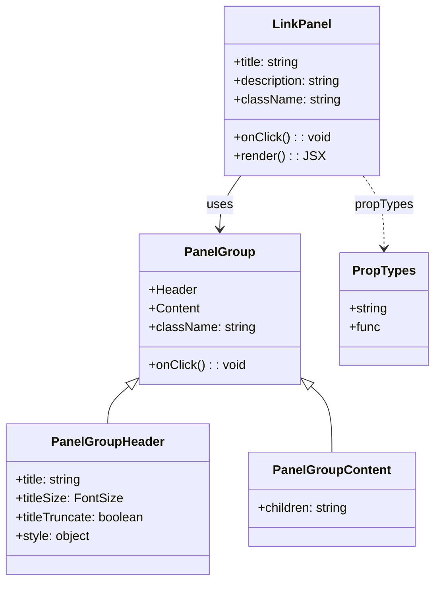

# Diagram: web/portal/src/components/molecules/LinkPanel.molecule.js


> Auto-generated by Obscura crawlers

## Diagram 1



### SVG

<svg id="container" width="552.236328125" xmlns="http://www.w3.org/2000/svg" class="classDiagram" height="740" viewBox="0 0 552.236328125 740" role="graphics-document document" aria-roledescription="class"><style>#container{font-family:"trebuchet ms",verdana,arial,sans-serif;font-size:16px;fill:#333;}@keyframes edge-animation-frame{from{stroke-dashoffset:0;}}@keyframes dash{to{stroke-dashoffset:0;}}#container .edge-animation-slow{stroke-dasharray:9,5!important;stroke-dashoffset:900;animation:dash 50s linear infinite;stroke-linecap:round;}#container .edge-animation-fast{stroke-dasharray:9,5!important;stroke-dashoffset:900;animation:dash 20s linear infinite;stroke-linecap:round;}#container .error-icon{fill:#552222;}#container .error-text{fill:#552222;stroke:#552222;}#container .edge-thickness-normal{stroke-width:1px;}#container .edge-thickness-thick{stroke-width:3.5px;}#container .edge-pattern-solid{stroke-dasharray:0;}#container .edge-thickness-invisible{stroke-width:0;fill:none;}#container .edge-pattern-dashed{stroke-dasharray:3;}#container .edge-pattern-dotted{stroke-dasharray:2;}#container .marker{fill:#333333;stroke:#333333;}#container .marker.cross{stroke:#333333;}#container svg{font-family:"trebuchet ms",verdana,arial,sans-serif;font-size:16px;}#container p{margin:0;}#container g.classGroup text{fill:#9370DB;stroke:none;font-family:"trebuchet ms",verdana,arial,sans-serif;font-size:10px;}#container g.classGroup text .title{font-weight:bolder;}#container .nodeLabel,#container .edgeLabel{color:#131300;}#container .edgeLabel .label rect{fill:#ECECFF;}#container .label text{fill:#131300;}#container .labelBkg{background:#ECECFF;}#container .edgeLabel .label span{background:#ECECFF;}#container .classTitle{font-weight:bolder;}#container .node rect,#container .node circle,#container .node ellipse,#container .node polygon,#container .node path{fill:#ECECFF;stroke:#9370DB;stroke-width:1px;}#container .divider{stroke:#9370DB;stroke-width:1;}#container g.clickable{cursor:pointer;}#container g.classGroup rect{fill:#ECECFF;stroke:#9370DB;}#container g.classGroup line{stroke:#9370DB;stroke-width:1;}#container .classLabel .box{stroke:none;stroke-width:0;fill:#ECECFF;opacity:0.5;}#container .classLabel .label{fill:#9370DB;font-size:10px;}#container .relation{stroke:#333333;stroke-width:1;fill:none;}#container .dashed-line{stroke-dasharray:3;}#container .dotted-line{stroke-dasharray:1 2;}#container #compositionStart,#container .composition{fill:#333333!important;stroke:#333333!important;stroke-width:1;}#container #compositionEnd,#container .composition{fill:#333333!important;stroke:#333333!important;stroke-width:1;}#container #dependencyStart,#container .dependency{fill:#333333!important;stroke:#333333!important;stroke-width:1;}#container #dependencyStart,#container .dependency{fill:#333333!important;stroke:#333333!important;stroke-width:1;}#container #extensionStart,#container .extension{fill:transparent!important;stroke:#333333!important;stroke-width:1;}#container #extensionEnd,#container .extension{fill:transparent!important;stroke:#333333!important;stroke-width:1;}#container #aggregationStart,#container .aggregation{fill:transparent!important;stroke:#333333!important;stroke-width:1;}#container #aggregationEnd,#container .aggregation{fill:transparent!important;stroke:#333333!important;stroke-width:1;}#container #lollipopStart,#container .lollipop{fill:#ECECFF!important;stroke:#333333!important;stroke-width:1;}#container #lollipopEnd,#container .lollipop{fill:#ECECFF!important;stroke:#333333!important;stroke-width:1;}#container .edgeTerminals{font-size:11px;line-height:initial;}#container .classTitleText{text-anchor:middle;font-size:18px;fill:#333;}#container .label-icon{display:inline-block;height:1em;overflow:visible;vertical-align:-0.125em;}#container .node .label-icon path{fill:currentColor;stroke:revert;stroke-width:revert;}#container :root{--mermaid-font-family:"trebuchet ms",verdana,arial,sans-serif;}</style><g><defs><marker id="container_class-aggregationStart" class="marker aggregation class" refX="18" refY="7" markerWidth="190" markerHeight="240" orient="auto"><path d="M 18,7 L9,13 L1,7 L9,1 Z"></path></marker></defs><defs><marker id="container_class-aggregationEnd" class="marker aggregation class" refX="1" refY="7" markerWidth="20" markerHeight="28" orient="auto"><path d="M 18,7 L9,13 L1,7 L9,1 Z"></path></marker></defs><defs><marker id="container_class-extensionStart" class="marker extension class" refX="18" refY="7" markerWidth="190" markerHeight="240" orient="auto"><path d="M 1,7 L18,13 V 1 Z"></path></marker></defs><defs><marker id="container_class-extensionEnd" class="marker extension class" refX="1" refY="7" markerWidth="20" markerHeight="28" orient="auto"><path d="M 1,1 V 13 L18,7 Z"></path></marker></defs><defs><marker id="container_class-compositionStart" class="marker composition class" refX="18" refY="7" markerWidth="190" markerHeight="240" orient="auto"><path d="M 18,7 L9,13 L1,7 L9,1 Z"></path></marker></defs><defs><marker id="container_class-compositionEnd" class="marker composition class" refX="1" refY="7" markerWidth="20" markerHeight="28" orient="auto"><path d="M 18,7 L9,13 L1,7 L9,1 Z"></path></marker></defs><defs><marker id="container_class-dependencyStart" class="marker dependency class" refX="6" refY="7" markerWidth="190" markerHeight="240" orient="auto"><path d="M 5,7 L9,13 L1,7 L9,1 Z"></path></marker></defs><defs><marker id="container_class-dependencyEnd" class="marker dependency class" refX="13" refY="7" markerWidth="20" markerHeight="28" orient="auto"><path d="M 18,7 L9,13 L14,7 L9,1 Z"></path></marker></defs><defs><marker id="container_class-lollipopStart" class="marker lollipop class" refX="13" refY="7" markerWidth="190" markerHeight="240" orient="auto"><circle stroke="black" fill="transparent" cx="7" cy="7" r="6"></circle></marker></defs><defs><marker id="container_class-lollipopEnd" class="marker lollipop class" refX="1" refY="7" markerWidth="190" markerHeight="240" orient="auto"><circle stroke="black" fill="transparent" cx="7" cy="7" r="6"></circle></marker></defs><g class="root"><g class="clusters"></g><g class="edgePaths"><path d="M307.893,224L303.496,230.167C299.098,236.333,290.304,248.667,285.907,260C281.51,271.333,281.51,281.667,281.51,286.833L281.51,292" id="id_LinkPanel_PanelGroup_1" class="edge-thickness-normal edge-pattern-solid relation" style=";;;" data-edge="true" data-et="edge" data-id="id_LinkPanel_PanelGroup_1" data-points="W3sieCI6MzA3Ljg5MjY5OTM1MzQ0ODMsInkiOjIyNH0seyJ4IjoyODEuNTA5NzY1NjI1LCJ5IjoyNjF9LHsieCI6MjgxLjUwOTc2NTYyNSwieSI6Mjk4fV0=" marker-end="url(#container_class-dependencyEnd)"></path><path d="M167.489,490.328L162.622,494.44C157.754,498.552,148.02,506.776,143.152,515.055C138.285,523.333,138.285,531.667,138.285,535.833L138.285,540" id="id_PanelGroup_PanelGroupHeader_2" class="edge-thickness-normal edge-pattern-solid relation" style=";;;" data-edge="true" data-et="edge" data-id="id_PanelGroup_PanelGroupHeader_2" data-points="W3sieCI6MTgwLjY2NjAxNTYyNSwieSI6NDc5LjE5NTUxMDc2NjI1MTd9LHsieCI6MTM4LjI4NTE1NjI1LCJ5Ijo1MTV9LHsieCI6MTM4LjI4NTE1NjI1LCJ5Ijo1NDB9XQ==" marker-start="url(#container_class-extensionStart)"></path><path d="M395.531,490.328L400.398,494.44C405.265,498.552,415,506.776,419.867,521.055C424.734,535.333,424.734,555.667,424.734,565.833L424.734,576" id="id_PanelGroup_PanelGroupContent_3" class="edge-thickness-normal edge-pattern-solid relation" style=";;;" data-edge="true" data-et="edge" data-id="id_PanelGroup_PanelGroupContent_3" data-points="W3sieCI6MzgyLjM1MzUxNTYyNSwieSI6NDc5LjE5NTUxMDc2NjI1MTd9LHsieCI6NDI0LjczNDM3NSwieSI6NTE1fSx7IngiOjQyNC43MzQzNzUsInkiOjU3Nn1d" marker-start="url(#container_class-extensionStart)"></path><path d="M461.912,224L466.309,230.167C470.706,236.333,479.501,248.667,483.898,264C488.295,279.333,488.295,297.667,488.295,306.833L488.295,316" id="id_LinkPanel_PropTypes_4" class="edge-thickness-normal edge-pattern-dashed relation" style=";;;" data-edge="true" data-et="edge" data-id="id_LinkPanel_PropTypes_4" data-points="W3sieCI6NDYxLjkxMTk4ODE0NjU1MTcsInkiOjIyNH0seyJ4Ijo0ODguMjk0OTIxODc1LCJ5IjoyNjF9LHsieCI6NDg4LjI5NDkyMTg3NSwieSI6MzIyfV0=" marker-end="url(#container_class-dependencyEnd)"></path></g><g class="edgeLabels"><g class="edgeLabel" transform="translate(281.509765625, 261)"><g class="label" data-id="id_LinkPanel_PanelGroup_1" transform="translate(-16.4921875, -12)"><foreignObject width="32.984375" height="24"><div xmlns="http://www.w3.org/1999/xhtml" class="labelBkg" style="display: table-cell; white-space: nowrap; line-height: 1.5; max-width: 200px; text-align: center;"><span class="edgeLabel"><p>uses</p></span></div></foreignObject></g></g><g class="edgeLabel"><g class="label" data-id="id_PanelGroup_PanelGroupHeader_2" transform="translate(0, 0)"><foreignObject width="0" height="0"><div xmlns="http://www.w3.org/1999/xhtml" class="labelBkg" style="display: table-cell; white-space: nowrap; line-height: 1.5; max-width: 200px; text-align: center;"><span class="edgeLabel"></span></div></foreignObject></g></g><g class="edgeLabel"><g class="label" data-id="id_PanelGroup_PanelGroupContent_3" transform="translate(0, 0)"><foreignObject width="0" height="0"><div xmlns="http://www.w3.org/1999/xhtml" class="labelBkg" style="display: table-cell; white-space: nowrap; line-height: 1.5; max-width: 200px; text-align: center;"><span class="edgeLabel"></span></div></foreignObject></g></g><g class="edgeLabel" transform="translate(488.294921875, 261)"><g class="label" data-id="id_LinkPanel_PropTypes_4" transform="translate(-37.625, -12)"><foreignObject width="75.25" height="24"><div xmlns="http://www.w3.org/1999/xhtml" class="labelBkg" style="display: table-cell; white-space: nowrap; line-height: 1.5; max-width: 200px; text-align: center;"><span class="edgeLabel"><p>propTypes</p></span></div></foreignObject></g></g></g><g class="nodes"><g class="node default" id="classId-LinkPanel-0" transform="translate(384.90234375, 116)"><g class="basic label-container"><path d="M-99.94140625 -108 L99.94140625 -108 L99.94140625 108 L-99.94140625 108" stroke="none" stroke-width="0" fill="#ECECFF" style=""></path><path d="M-99.94140625 -108 C-39.66484863077364 -108, 20.61170898845272 -108, 99.94140625 -108 M-99.94140625 -108 C-41.005728304464405 -108, 17.92994964107119 -108, 99.94140625 -108 M99.94140625 -108 C99.94140625 -37.90438017493024, 99.94140625 32.19123965013952, 99.94140625 108 M99.94140625 -108 C99.94140625 -46.695513468406524, 99.94140625 14.608973063186951, 99.94140625 108 M99.94140625 108 C20.2167156801125 108, -59.507974889775 108, -99.94140625 108 M99.94140625 108 C45.01679622311701 108, -9.907813803765976 108, -99.94140625 108 M-99.94140625 108 C-99.94140625 55.31298973551303, -99.94140625 2.6259794710260564, -99.94140625 -108 M-99.94140625 108 C-99.94140625 24.574774795350393, -99.94140625 -58.850450409299214, -99.94140625 -108" stroke="#9370DB" stroke-width="1.3" fill="none" stroke-dasharray="0 0" style=""></path></g><g class="annotation-group text" transform="translate(0, -84)"></g><g class="label-group text" transform="translate(-35.5703125, -84)"><g class="label" style="font-weight: bolder" transform="translate(0,-12)"><foreignObject width="71.140625" height="24"><div xmlns="http://www.w3.org/1999/xhtml" style="display: table-cell; white-space: nowrap; line-height: 1.5; max-width: 120px; text-align: center;"><span class="nodeLabel markdown-node-label" style=""><p>LinkPanel</p></span></div></foreignObject></g></g><g class="members-group text" transform="translate(-87.94140625, -36)"><g class="label" style="" transform="translate(0,-12)"><foreignObject width="86.859375" height="24"><div xmlns="http://www.w3.org/1999/xhtml" style="display: table-cell; white-space: nowrap; line-height: 1.5; max-width: 145px; text-align: center;"><span class="nodeLabel markdown-node-label" style=""><p>+title: string</p></span></div></foreignObject></g><g class="label" style="" transform="translate(0,12)"><foreignObject width="140.3125" height="24"><div xmlns="http://www.w3.org/1999/xhtml" style="display: table-cell; white-space: nowrap; line-height: 1.5; max-width: 198px; text-align: center;"><span class="nodeLabel markdown-node-label" style=""><p>+description: string</p></span></div></foreignObject></g><g class="label" style="" transform="translate(0,36)"><foreignObject width="135.359375" height="24"><div xmlns="http://www.w3.org/1999/xhtml" style="display: table-cell; white-space: nowrap; line-height: 1.5; max-width: 193px; text-align: center;"><span class="nodeLabel markdown-node-label" style=""><p>+className: string</p></span></div></foreignObject></g></g><g class="methods-group text" transform="translate(-87.94140625, 60)"><g class="label" style="" transform="translate(0,-12)"><foreignObject width="122.546875" height="24"><div xmlns="http://www.w3.org/1999/xhtml" style="display: table-cell; white-space: nowrap; line-height: 1.5; max-width: 180px; text-align: center;"><span class="nodeLabel markdown-node-label" style=""><p>+onClick() : : void</p></span></div></foreignObject></g><g class="label" style="" transform="translate(0,12)"><foreignObject width="109.140625" height="24"><div xmlns="http://www.w3.org/1999/xhtml" style="display: table-cell; white-space: nowrap; line-height: 1.5; max-width: 167px; text-align: center;"><span class="nodeLabel markdown-node-label" style=""><p>+render() : : JSX</p></span></div></foreignObject></g></g><g class="divider" style=""><path d="M-99.94140625 -60 C-35.62029890766594 -60, 28.70080843466812 -60, 99.94140625 -60 M-99.94140625 -60 C-48.835643782694405 -60, 2.270118684611191 -60, 99.94140625 -60" stroke="#9370DB" stroke-width="1.3" fill="none" stroke-dasharray="0 0" style=""></path></g><g class="divider" style=""><path d="M-99.94140625 36 C-50.75898887365948 36, -1.576571497318966 36, 99.94140625 36 M-99.94140625 36 C-46.1892218726488 36, 7.562962504702398 36, 99.94140625 36" stroke="#9370DB" stroke-width="1.3" fill="none" stroke-dasharray="0 0" style=""></path></g></g><g class="node default" id="classId-PanelGroup-1" transform="translate(281.509765625, 394)"><g class="basic label-container"><path d="M-100.84375 -96 L100.84375 -96 L100.84375 96 L-100.84375 96" stroke="none" stroke-width="0" fill="#ECECFF" style=""></path><path d="M-100.84375 -96 C-56.62285015169598 -96, -12.401950303391956 -96, 100.84375 -96 M-100.84375 -96 C-48.03836495778017 -96, 4.767020084439665 -96, 100.84375 -96 M100.84375 -96 C100.84375 -57.027047202482514, 100.84375 -18.054094404965028, 100.84375 96 M100.84375 -96 C100.84375 -19.61910492170655, 100.84375 56.7617901565869, 100.84375 96 M100.84375 96 C22.93000374236047 96, -54.98374251527906 96, -100.84375 96 M100.84375 96 C56.57658667026841 96, 12.309423340536824 96, -100.84375 96 M-100.84375 96 C-100.84375 25.277801714446355, -100.84375 -45.44439657110729, -100.84375 -96 M-100.84375 96 C-100.84375 49.91777041395832, -100.84375 3.8355408279166454, -100.84375 -96" stroke="#9370DB" stroke-width="1.3" fill="none" stroke-dasharray="0 0" style=""></path></g><g class="annotation-group text" transform="translate(0, -72)"></g><g class="label-group text" transform="translate(-42.328125, -72)"><g class="label" style="font-weight: bolder" transform="translate(0,-12)"><foreignObject width="84.65625" height="24"><div xmlns="http://www.w3.org/1999/xhtml" style="display: table-cell; white-space: nowrap; line-height: 1.5; max-width: 134px; text-align: center;"><span class="nodeLabel markdown-node-label" style=""><p>PanelGroup</p></span></div></foreignObject></g></g><g class="members-group text" transform="translate(-88.84375, -24)"><g class="label" style="" transform="translate(0,-12)"><foreignObject width="60.59375" height="24"><div xmlns="http://www.w3.org/1999/xhtml" style="display: table-cell; white-space: nowrap; line-height: 1.5; max-width: 119px; text-align: center;"><span class="nodeLabel markdown-node-label" style=""><p>+Header</p></span></div></foreignObject></g><g class="label" style="" transform="translate(0,12)"><foreignObject width="64.765625" height="24"><div xmlns="http://www.w3.org/1999/xhtml" style="display: table-cell; white-space: nowrap; line-height: 1.5; max-width: 122px; text-align: center;"><span class="nodeLabel markdown-node-label" style=""><p>+Content</p></span></div></foreignObject></g><g class="label" style="" transform="translate(0,36)"><foreignObject width="135.359375" height="24"><div xmlns="http://www.w3.org/1999/xhtml" style="display: table-cell; white-space: nowrap; line-height: 1.5; max-width: 193px; text-align: center;"><span class="nodeLabel markdown-node-label" style=""><p>+className: string</p></span></div></foreignObject></g></g><g class="methods-group text" transform="translate(-88.84375, 72)"><g class="label" style="" transform="translate(0,-12)"><foreignObject width="122.546875" height="24"><div xmlns="http://www.w3.org/1999/xhtml" style="display: table-cell; white-space: nowrap; line-height: 1.5; max-width: 180px; text-align: center;"><span class="nodeLabel markdown-node-label" style=""><p>+onClick() : : void</p></span></div></foreignObject></g></g><g class="divider" style=""><path d="M-100.84375 -48 C-24.749405017714523 -48, 51.344939964570955 -48, 100.84375 -48 M-100.84375 -48 C-59.5259119853676 -48, -18.2080739707352 -48, 100.84375 -48" stroke="#9370DB" stroke-width="1.3" fill="none" stroke-dasharray="0 0" style=""></path></g><g class="divider" style=""><path d="M-100.84375 48 C-25.54214844827891 48, 49.75945310344218 48, 100.84375 48 M-100.84375 48 C-32.03551770346351 48, 36.772714593072976 48, 100.84375 48" stroke="#9370DB" stroke-width="1.3" fill="none" stroke-dasharray="0 0" style=""></path></g></g><g class="node default" id="classId-PanelGroupHeader-2" transform="translate(138.28515625, 636)"><g class="basic label-container"><path d="M-130.28515625 -96 L130.28515625 -96 L130.28515625 96 L-130.28515625 96" stroke="none" stroke-width="0" fill="#ECECFF" style=""></path><path d="M-130.28515625 -96 C-49.0495838323199 -96, 32.18598858536021 -96, 130.28515625 -96 M-130.28515625 -96 C-47.479696327815034 -96, 35.32576359436993 -96, 130.28515625 -96 M130.28515625 -96 C130.28515625 -24.11759963872163, 130.28515625 47.76480072255674, 130.28515625 96 M130.28515625 -96 C130.28515625 -27.964400042166034, 130.28515625 40.07119991566793, 130.28515625 96 M130.28515625 96 C48.3909182196074 96, -33.5033198107852 96, -130.28515625 96 M130.28515625 96 C28.35269364198433 96, -73.57976896603134 96, -130.28515625 96 M-130.28515625 96 C-130.28515625 38.29266597297948, -130.28515625 -19.414668054041044, -130.28515625 -96 M-130.28515625 96 C-130.28515625 45.61299134164628, -130.28515625 -4.774017316707443, -130.28515625 -96" stroke="#9370DB" stroke-width="1.3" fill="none" stroke-dasharray="0 0" style=""></path></g><g class="annotation-group text" transform="translate(0, -72)"></g><g class="label-group text" transform="translate(-68.8046875, -72)"><g class="label" style="font-weight: bolder" transform="translate(0,-12)"><foreignObject width="137.609375" height="24"><div xmlns="http://www.w3.org/1999/xhtml" style="display: table-cell; white-space: nowrap; line-height: 1.5; max-width: 187px; text-align: center;"><span class="nodeLabel markdown-node-label" style=""><p>PanelGroupHeader</p></span></div></foreignObject></g></g><g class="members-group text" transform="translate(-118.28515625, -24)"><g class="label" style="" transform="translate(0,-12)"><foreignObject width="86.859375" height="24"><div xmlns="http://www.w3.org/1999/xhtml" style="display: table-cell; white-space: nowrap; line-height: 1.5; max-width: 145px; text-align: center;"><span class="nodeLabel markdown-node-label" style=""><p>+title: string</p></span></div></foreignObject></g><g class="label" style="" transform="translate(0,12)"><foreignObject width="134.6875" height="24"><div xmlns="http://www.w3.org/1999/xhtml" style="display: table-cell; white-space: nowrap; line-height: 1.5; max-width: 192px; text-align: center;"><span class="nodeLabel markdown-node-label" style=""><p>+titleSize: FontSize</p></span></div></foreignObject></g><g class="label" style="" transform="translate(0,36)"><foreignObject width="167.765625" height="24"><div xmlns="http://www.w3.org/1999/xhtml" style="display: table-cell; white-space: nowrap; line-height: 1.5; max-width: 225px; text-align: center;"><span class="nodeLabel markdown-node-label" style=""><p>+titleTruncate: boolean</p></span></div></foreignObject></g><g class="label" style="" transform="translate(0,60)"><foreignObject width="95.90625" height="24"><div xmlns="http://www.w3.org/1999/xhtml" style="display: table-cell; white-space: nowrap; line-height: 1.5; max-width: 153px; text-align: center;"><span class="nodeLabel markdown-node-label" style=""><p>+style: object</p></span></div></foreignObject></g></g><g class="methods-group text" transform="translate(-118.28515625, 96)"></g><g class="divider" style=""><path d="M-130.28515625 -48 C-68.64728463564292 -48, -7.009413021285837 -48, 130.28515625 -48 M-130.28515625 -48 C-35.327640030044094 -48, 59.62987618991181 -48, 130.28515625 -48" stroke="#9370DB" stroke-width="1.3" fill="none" stroke-dasharray="0 0" style=""></path></g><g class="divider" style=""><path d="M-130.28515625 72 C-69.39629723093961 72, -8.507438211879204 72, 130.28515625 72 M-130.28515625 72 C-53.328164541669594 72, 23.628827166660813 72, 130.28515625 72" stroke="#9370DB" stroke-width="1.3" fill="none" stroke-dasharray="0 0" style=""></path></g></g><g class="node default" id="classId-PanelGroupContent-3" transform="translate(424.734375, 636)"><g class="basic label-container"><path d="M-106.1640625 -60 L106.1640625 -60 L106.1640625 60 L-106.1640625 60" stroke="none" stroke-width="0" fill="#ECECFF" style=""></path><path d="M-106.1640625 -60 C-51.3193299829282 -60, 3.525402534143595 -60, 106.1640625 -60 M-106.1640625 -60 C-59.531564993126686 -60, -12.899067486253372 -60, 106.1640625 -60 M106.1640625 -60 C106.1640625 -20.651071692385493, 106.1640625 18.697856615229014, 106.1640625 60 M106.1640625 -60 C106.1640625 -22.43267234467826, 106.1640625 15.134655310643481, 106.1640625 60 M106.1640625 60 C53.144783334642945 60, 0.1255041692858896 60, -106.1640625 60 M106.1640625 60 C43.38427603099249 60, -19.395510438015023 60, -106.1640625 60 M-106.1640625 60 C-106.1640625 13.906088305956807, -106.1640625 -32.187823388086386, -106.1640625 -60 M-106.1640625 60 C-106.1640625 17.413700809534575, -106.1640625 -25.17259838093085, -106.1640625 -60" stroke="#9370DB" stroke-width="1.3" fill="none" stroke-dasharray="0 0" style=""></path></g><g class="annotation-group text" transform="translate(0, -36)"></g><g class="label-group text" transform="translate(-71.125, -36)"><g class="label" style="font-weight: bolder" transform="translate(0,-12)"><foreignObject width="142.25" height="24"><div xmlns="http://www.w3.org/1999/xhtml" style="display: table-cell; white-space: nowrap; line-height: 1.5; max-width: 191px; text-align: center;"><span class="nodeLabel markdown-node-label" style=""><p>PanelGroupContent</p></span></div></foreignObject></g></g><g class="members-group text" transform="translate(-94.1640625, 12)"><g class="label" style="" transform="translate(0,-12)"><foreignObject width="117.203125" height="24"><div xmlns="http://www.w3.org/1999/xhtml" style="display: table-cell; white-space: nowrap; line-height: 1.5; max-width: 175px; text-align: center;"><span class="nodeLabel markdown-node-label" style=""><p>+children: string</p></span></div></foreignObject></g></g><g class="methods-group text" transform="translate(-94.1640625, 60)"></g><g class="divider" style=""><path d="M-106.1640625 -12 C-23.875004212975554 -12, 58.41405407404889 -12, 106.1640625 -12 M-106.1640625 -12 C-50.30177317629407 -12, 5.56051614741186 -12, 106.1640625 -12" stroke="#9370DB" stroke-width="1.3" fill="none" stroke-dasharray="0 0" style=""></path></g><g class="divider" style=""><path d="M-106.1640625 36 C-38.56007946197903 36, 29.04390357604194 36, 106.1640625 36 M-106.1640625 36 C-39.130145879343814 36, 27.90377074131237 36, 106.1640625 36" stroke="#9370DB" stroke-width="1.3" fill="none" stroke-dasharray="0 0" style=""></path></g></g><g class="node default" id="classId-PropTypes-4" transform="translate(488.294921875, 394)"><g class="basic label-container"><path d="M-55.94140625 -72 L55.94140625 -72 L55.94140625 72 L-55.94140625 72" stroke="none" stroke-width="0" fill="#ECECFF" style=""></path><path d="M-55.94140625 -72 C-18.001338613398033 -72, 19.938729023203933 -72, 55.94140625 -72 M-55.94140625 -72 C-13.337296421872153 -72, 29.266813406255693 -72, 55.94140625 -72 M55.94140625 -72 C55.94140625 -39.320837233380814, 55.94140625 -6.6416744667616285, 55.94140625 72 M55.94140625 -72 C55.94140625 -21.599939661448346, 55.94140625 28.80012067710331, 55.94140625 72 M55.94140625 72 C15.432066536950245 72, -25.07727317609951 72, -55.94140625 72 M55.94140625 72 C20.00665556311337 72, -15.92809512377326 72, -55.94140625 72 M-55.94140625 72 C-55.94140625 33.07304929050497, -55.94140625 -5.853901418990063, -55.94140625 -72 M-55.94140625 72 C-55.94140625 40.234689503292294, -55.94140625 8.469379006584589, -55.94140625 -72" stroke="#9370DB" stroke-width="1.3" fill="none" stroke-dasharray="0 0" style=""></path></g><g class="annotation-group text" transform="translate(0, -48)"></g><g class="label-group text" transform="translate(-38.2578125, -48)"><g class="label" style="font-weight: bolder" transform="translate(0,-12)"><foreignObject width="76.515625" height="24"><div xmlns="http://www.w3.org/1999/xhtml" style="display: table-cell; white-space: nowrap; line-height: 1.5; max-width: 125px; text-align: center;"><span class="nodeLabel markdown-node-label" style=""><p>PropTypes</p></span></div></foreignObject></g></g><g class="members-group text" transform="translate(-43.94140625, 0)"><g class="label" style="" transform="translate(0,-12)"><foreignObject width="49.625" height="24"><div xmlns="http://www.w3.org/1999/xhtml" style="display: table-cell; white-space: nowrap; line-height: 1.5; max-width: 108px; text-align: center;"><span class="nodeLabel markdown-node-label" style=""><p>+string</p></span></div></foreignObject></g><g class="label" style="" transform="translate(0,12)"><foreignObject width="39.453125" height="24"><div xmlns="http://www.w3.org/1999/xhtml" style="display: table-cell; white-space: nowrap; line-height: 1.5; max-width: 97px; text-align: center;"><span class="nodeLabel markdown-node-label" style=""><p>+func</p></span></div></foreignObject></g></g><g class="methods-group text" transform="translate(-43.94140625, 72)"></g><g class="divider" style=""><path d="M-55.94140625 -24 C-18.215779377275155 -24, 19.50984749544969 -24, 55.94140625 -24 M-55.94140625 -24 C-23.668973222729868 -24, 8.603459804540265 -24, 55.94140625 -24" stroke="#9370DB" stroke-width="1.3" fill="none" stroke-dasharray="0 0" style=""></path></g><g class="divider" style=""><path d="M-55.94140625 48 C-16.0162226496385 48, 23.908960950723 48, 55.94140625 48 M-55.94140625 48 C-13.70035945035221 48, 28.54068734929558 48, 55.94140625 48" stroke="#9370DB" stroke-width="1.3" fill="none" stroke-dasharray="0 0" style=""></path></g></g></g></g></g></svg>

## Diagram 2

```mermaid
flowchart TD
    A[LinkPanel Component] --> B[PanelGroup Wrapper]
    B --> C[PanelGroup.Header]
    B --> D[PanelGroup.Content]
    A --> E[Props: title, description, onClick, className]
    E --> C
    E --> D
    E --> B
    B -. onClick prop .-> F[onClick handler]
    C -->|renders title| G[Title text (FontSize.size18)]
    D -->|renders description| H[Description text]
```

> SVG rendering failed for this diagram.
