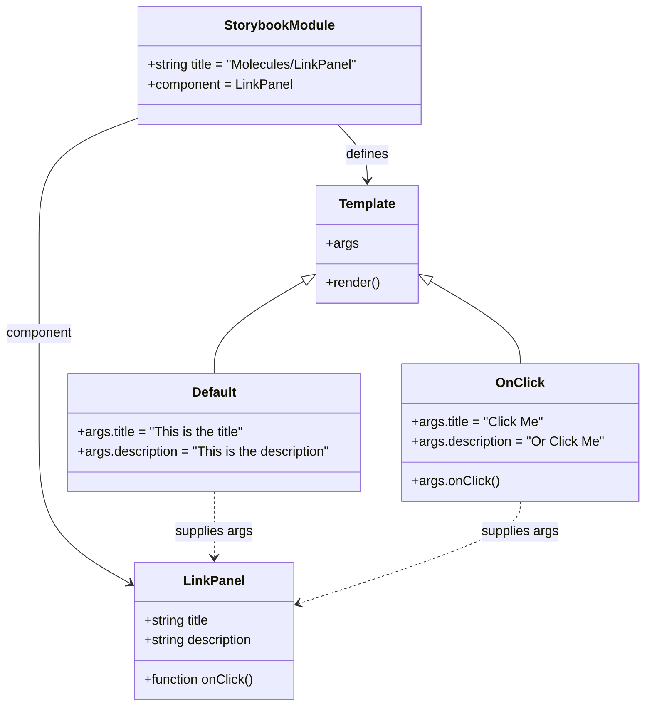

# Diagram: web/portal/src/components/molecules/LinkPanel.molecule.stories.js

> Auto-generated by Obscura crawlers

## Mermaid

### SVG

<svg id="container" width="793.109375" xmlns="http://www.w3.org/2000/svg" class="classDiagram" height="862" viewBox="0 0 793.109375 862" role="graphics-document document" aria-roledescription="class"><g><defs><marker id="container_class-aggregationStart" class="marker aggregation class" refX="18" refY="7" markerWidth="190" markerHeight="240" orient="auto"><path d="M 18,7 L9,13 L1,7 L9,1 Z"></path></marker></defs><defs><marker id="container_class-aggregationEnd" class="marker aggregation class" refX="1" refY="7" markerWidth="20" markerHeight="28" orient="auto"><path d="M 18,7 L9,13 L1,7 L9,1 Z"></path></marker></defs><defs><marker id="container_class-extensionStart" class="marker extension class" refX="18" refY="7" markerWidth="190" markerHeight="240" orient="auto"><path d="M 1,7 L18,13 V 1 Z"></path></marker></defs><defs><marker id="container_class-extensionEnd" class="marker extension class" refX="1" refY="7" markerWidth="20" markerHeight="28" orient="auto"><path d="M 1,1 V 13 L18,7 Z"></path></marker></defs><defs><marker id="container_class-compositionStart" class="marker composition class" refX="18" refY="7" markerWidth="190" markerHeight="240" orient="auto"><path d="M 18,7 L9,13 L1,7 L9,1 Z"></path></marker></defs><defs><marker id="container_class-compositionEnd" class="marker composition class" refX="1" refY="7" markerWidth="20" markerHeight="28" orient="auto"><path d="M 18,7 L9,13 L1,7 L9,1 Z"></path></marker></defs><defs><marker id="container_class-dependencyStart" class="marker dependency class" refX="6" refY="7" markerWidth="190" markerHeight="240" orient="auto"><path d="M 5,7 L9,13 L1,7 L9,1 Z"></path></marker></defs><defs><marker id="container_class-dependencyEnd" class="marker dependency class" refX="13" refY="7" markerWidth="20" markerHeight="28" orient="auto"><path d="M 18,7 L9,13 L14,7 L9,1 Z"></path></marker></defs><defs><marker id="container_class-lollipopStart" class="marker lollipop class" refX="13" refY="7" markerWidth="190" markerHeight="240" orient="auto"><circle stroke="black" fill="transparent" cx="7" cy="7" r="6"></circle></marker></defs><defs><marker id="container_class-lollipopEnd" class="marker lollipop class" refX="1" refY="7" markerWidth="190" markerHeight="240" orient="auto"><circle stroke="black" fill="transparent" cx="7" cy="7" r="6"></circle></marker></defs><g class="root"><g class="clusters"></g><g class="edgePaths"><path d="M169.609,144.75L149.548,152.125C129.487,159.5,89.365,174.25,69.303,199.792C49.242,225.333,49.242,261.667,49.242,298C49.242,334.333,49.242,370.667,49.242,409C49.242,447.333,49.242,487.667,49.242,528C49.242,568.333,49.242,608.667,68.293,639.428C87.343,670.19,125.444,691.38,144.495,701.975L163.545,712.57" id="id_StorybookModule_LinkPanel_1" class="edge-thickness-normal edge-pattern-solid relation" style=";;;" data-edge="true" data-et="edge" data-id="id_StorybookModule_LinkPanel_1" data-points="W3sieCI6MTY5LjYwOTM3NSwieSI6MTQ0Ljc1MDM0MjUzNzk0MjY2fSx7IngiOjQ5LjI0MjE4NzUsInkiOjE4OX0seyJ4Ijo0OS4yNDIxODc1LCJ5IjoyOTh9LHsieCI6NDkuMjQyMTg3NSwieSI6NDA3fSx7IngiOjQ5LjI0MjE4NzUsInkiOjUyOH0seyJ4Ijo0OS4yNDIxODc1LCJ5Ijo2NDl9LHsieCI6MTY4Ljc4OTA2MjUsInkiOjcxNS40ODYyMzgwMzc5NTUzfV0=" marker-end="url(#container_class-dependencyEnd)"></path><path d="M417.599,152L423.753,158.167C429.908,164.333,442.217,176.667,448.371,188C454.525,199.333,454.525,209.667,454.525,214.833L454.525,220" id="id_StorybookModule_Template_2" class="edge-thickness-normal edge-pattern-solid relation" style=";;;" data-edge="true" data-et="edge" data-id="id_StorybookModule_Template_2" data-points="W3sieCI6NDE3LjU5ODk4MjIyNDc3MDYsInkiOjE1Mn0seyJ4Ijo0NTQuNTI1MzkwNjI1LCJ5IjoxODl9LHsieCI6NDU0LjUyNTM5MDYyNSwieSI6MjI2fV0=" marker-end="url(#container_class-dependencyEnd)"></path><path d="M377.346,342.815L358.923,353.513C340.5,364.21,303.654,385.605,285.232,404.469C266.809,423.333,266.809,439.667,266.809,447.833L266.809,456" id="id_Template_Default_3" class="edge-thickness-normal edge-pattern-solid relation" style=";;;" data-edge="true" data-et="edge" data-id="id_Template_Default_3" data-points="W3sieCI6MzkyLjI2MzY3MTg3NSwieSI6MzM0LjE1MzAxMDU4MTUxNTF9LHsieCI6MjY2LjgwODU5Mzc1LCJ5Ijo0MDd9LHsieCI6MjY2LjgwODU5Mzc1LCJ5Ijo0NTZ9XQ==" marker-start="url(#container_class-extensionStart)"></path><path d="M531.705,342.815L550.128,353.513C568.55,364.21,605.396,385.605,623.819,402.469C642.242,419.333,642.242,431.667,642.242,437.833L642.242,444" id="id_Template_OnClick_4" class="edge-thickness-normal edge-pattern-solid relation" style=";;;" data-edge="true" data-et="edge" data-id="id_Template_OnClick_4" data-points="W3sieCI6NTE2Ljc4NzEwOTM3NSwieSI6MzM0LjE1MzAxMDU4MTUxNTF9LHsieCI6NjQyLjI0MjE4NzUsInkiOjQwN30seyJ4Ijo2NDIuMjQyMTg3NSwieSI6NDQ0fV0=" marker-start="url(#container_class-extensionStart)"></path><path d="M266.809,600L266.809,608.167C266.809,616.333,266.809,632.667,266.809,646C266.809,659.333,266.809,669.667,266.809,674.833L266.809,680" id="id_Default_LinkPanel_5" class="edge-thickness-normal edge-pattern-dashed relation" style=";;;" data-edge="true" data-et="edge" data-id="id_Default_LinkPanel_5" data-points="W3sieCI6MjY2LjgwODU5Mzc1LCJ5Ijo2MDB9LHsieCI6MjY2LjgwODU5Mzc1LCJ5Ijo2NDl9LHsieCI6MjY2LjgwODU5Mzc1LCJ5Ijo2ODZ9XQ==" marker-end="url(#container_class-dependencyEnd)"></path><path d="M642.242,612L642.242,618.167C642.242,624.333,642.242,636.667,596.958,657.428C551.674,678.189,461.107,707.379,415.823,721.974L370.539,736.568" id="id_OnClick_LinkPanel_6" class="edge-thickness-normal edge-pattern-dashed relation" style=";;;" data-edge="true" data-et="edge" data-id="id_OnClick_LinkPanel_6" data-points="W3sieCI6NjQyLjI0MjE4NzUsInkiOjYxMn0seyJ4Ijo2NDIuMjQyMTg3NSwieSI6NjQ5fSx7IngiOjM2NC44MjgxMjUsInkiOjczOC40MDg4OTE4MDIxODcxfV0=" marker-end="url(#container_class-dependencyEnd)"></path></g><g class="edgeLabels"><g class="edgeLabel" transform="translate(49.2421875, 407)"><g class="label" data-id="id_StorybookModule_LinkPanel_1" transform="translate(-41.2421875, -12)"><foreignObject width="82.484375" height="24">

component

</foreignObject></g></g><g class="edgeLabel" transform="translate(454.525390625, 189)"><g class="label" data-id="id_StorybookModule_Template_2" transform="translate(-26.53125, -12)"><foreignObject width="53.0625" height="24">

defines

</foreignObject></g></g><g class="edgeLabel"><g class="label" data-id="id_Template_Default_3" transform="translate(0, 0)"><foreignObject width="0" height="0">

</foreignObject></g></g><g class="edgeLabel"><g class="label" data-id="id_Template_OnClick_4" transform="translate(0, 0)"><foreignObject width="0" height="0">

</foreignObject></g></g><g class="edgeLabel" transform="translate(266.80859375, 649)"><g class="label" data-id="id_Default_LinkPanel_5" transform="translate(-47.875, -12)"><foreignObject width="95.75" height="24">

supplies args

</foreignObject></g></g><g class="edgeLabel" transform="translate(642.2421875, 649)"><g class="label" data-id="id_OnClick_LinkPanel_6" transform="translate(-47.875, -12)"><foreignObject width="95.75" height="24">

supplies args

</foreignObject></g></g></g><g class="nodes"><g class="node default" id="classId-LinkPanel-0" transform="translate(266.80859375, 770)"><g class="basic label-container"><path d="M-98.01953125 -84 L98.01953125 -84 L98.01953125 84 L-98.01953125 84" stroke="none" stroke-width="0" fill="#ECECFF" style=""></path><path d="M-98.01953125 -84 C-32.60036247085195 -84, 32.818806308296104 -84, 98.01953125 -84 M-98.01953125 -84 C-32.33588781508698 -84, 33.347755619826046 -84, 98.01953125 -84 M98.01953125 -84 C98.01953125 -25.923657725046056, 98.01953125 32.15268454990789, 98.01953125 84 M98.01953125 -84 C98.01953125 -37.014899555559154, 98.01953125 9.970200888881692, 98.01953125 84 M98.01953125 84 C25.302890779333993 84, -47.413749691332015 84, -98.01953125 84 M98.01953125 84 C29.903860447251574 84, -38.21181035549685 84, -98.01953125 84 M-98.01953125 84 C-98.01953125 43.22778387289732, -98.01953125 2.4555677457946388, -98.01953125 -84 M-98.01953125 84 C-98.01953125 44.94087062582951, -98.01953125 5.881741251659022, -98.01953125 -84" stroke="#9370DB" stroke-width="1.3" fill="none" stroke-dasharray="0 0" style=""></path></g><g class="annotation-group text" transform="translate(0, -60)"></g><g class="label-group text" transform="translate(-35.5703125, -60)"><g class="label" style="font-weight: bolder" transform="translate(0,-12)"><foreignObject width="71.140625" height="24">

LinkPanel

</foreignObject></g></g><g class="members-group text" transform="translate(-86.01953125, -12)"><g class="label" style="" transform="translate(0,-12)"><foreignObject width="83.09375" height="24">

+string title

</foreignObject></g><g class="label" style="" transform="translate(0,12)"><foreignObject width="136.46875" height="24">

+string description

</foreignObject></g></g><g class="methods-group text" transform="translate(-86.01953125, 60)"><g class="label" style="" transform="translate(0,-12)"><foreignObject width="135.625" height="24">

+function onClick()

</foreignObject></g></g><g class="divider" style=""><path d="M-98.01953125 -36 C-52.5025886653827 -36, -6.985646080765406 -36, 98.01953125 -36 M-98.01953125 -36 C-52.205483671990905 -36, -6.39143609398181 -36, 98.01953125 -36" stroke="#9370DB" stroke-width="1.3" fill="none" stroke-dasharray="0 0" style=""></path></g><g class="divider" style=""><path d="M-98.01953125 36 C-34.36066793235243 36, 29.298195385295145 36, 98.01953125 36 M-98.01953125 36 C-58.4857716270507 36, -18.952012004101405 36, 98.01953125 36" stroke="#9370DB" stroke-width="1.3" fill="none" stroke-dasharray="0 0" style=""></path></g></g><g class="node default" id="classId-StorybookModule-1" transform="translate(345.7421875, 80)"><g class="basic label-container"><path d="M-176.1328125 -72 L176.1328125 -72 L176.1328125 72 L-176.1328125 72" stroke="none" stroke-width="0" fill="#ECECFF" style=""></path><path d="M-176.1328125 -72 C-45.50657782200935 -72, 85.1196568559813 -72, 176.1328125 -72 M-176.1328125 -72 C-51.17694088142446 -72, 73.77893073715109 -72, 176.1328125 -72 M176.1328125 -72 C176.1328125 -37.404409691141446, 176.1328125 -2.8088193822828913, 176.1328125 72 M176.1328125 -72 C176.1328125 -15.275458244191846, 176.1328125 41.44908351161631, 176.1328125 72 M176.1328125 72 C76.58861878008842 72, -22.95557493982315 72, -176.1328125 72 M176.1328125 72 C76.20266358534082 72, -23.72748532931837 72, -176.1328125 72 M-176.1328125 72 C-176.1328125 18.977755209359742, -176.1328125 -34.044489581280516, -176.1328125 -72 M-176.1328125 72 C-176.1328125 16.744384563131263, -176.1328125 -38.511230873737475, -176.1328125 -72" stroke="#9370DB" stroke-width="1.3" fill="none" stroke-dasharray="0 0" style=""></path></g><g class="annotation-group text" transform="translate(0, -48)"></g><g class="label-group text" transform="translate(-65.171875, -48)"><g class="label" style="font-weight: bolder" transform="translate(0,-12)"><foreignObject width="130.34375" height="24">

StorybookModule

</foreignObject></g></g><g class="members-group text" transform="translate(-164.1328125, 0)"><g class="label" style="" transform="translate(0,-12)"><foreignObject width="263.09375" height="24">

+string title = "Molecules/LinkPanel"

</foreignObject></g><g class="label" style="" transform="translate(0,12)"><foreignObject width="176.90625" height="24">

+component = LinkPanel

</foreignObject></g></g><g class="methods-group text" transform="translate(-164.1328125, 72)"></g><g class="divider" style=""><path d="M-176.1328125 -24 C-62.20692154769735 -24, 51.7189694046053 -24, 176.1328125 -24 M-176.1328125 -24 C-75.2487434191555 -24, 25.635325661688995 -24, 176.1328125 -24" stroke="#9370DB" stroke-width="1.3" fill="none" stroke-dasharray="0 0" style=""></path></g><g class="divider" style=""><path d="M-176.1328125 48 C-101.7189302329288 48, -27.305047965857597 48, 176.1328125 48 M-176.1328125 48 C-77.87806613516665 48, 20.376680229666704 48, 176.1328125 48" stroke="#9370DB" stroke-width="1.3" fill="none" stroke-dasharray="0 0" style=""></path></g></g><g class="node default" id="classId-Template-2" transform="translate(454.525390625, 298)"><g class="basic label-container"><path d="M-62.26171875 -72 L62.26171875 -72 L62.26171875 72 L-62.26171875 72" stroke="none" stroke-width="0" fill="#ECECFF" style=""></path><path d="M-62.26171875 -72 C-21.108750812025463 -72, 20.044217125949075 -72, 62.26171875 -72 M-62.26171875 -72 C-35.972395673208275 -72, -9.683072596416551 -72, 62.26171875 -72 M62.26171875 -72 C62.26171875 -17.194131348167744, 62.26171875 37.61173730366451, 62.26171875 72 M62.26171875 -72 C62.26171875 -29.663791368520087, 62.26171875 12.672417262959826, 62.26171875 72 M62.26171875 72 C32.18678637196049 72, 2.111853993920974 72, -62.26171875 72 M62.26171875 72 C35.97238247918058 72, 9.683046208361155 72, -62.26171875 72 M-62.26171875 72 C-62.26171875 33.45717613731985, -62.26171875 -5.085647725360303, -62.26171875 -72 M-62.26171875 72 C-62.26171875 21.699658604009535, -62.26171875 -28.60068279198093, -62.26171875 -72" stroke="#9370DB" stroke-width="1.3" fill="none" stroke-dasharray="0 0" style=""></path></g><g class="annotation-group text" transform="translate(0, -48)"></g><g class="label-group text" transform="translate(-33.9140625, -48)"><g class="label" style="font-weight: bolder" transform="translate(0,-12)"><foreignObject width="67.828125" height="24">

Template

</foreignObject></g></g><g class="members-group text" transform="translate(-50.26171875, 0)"><g class="label" style="" transform="translate(0,-12)"><foreignObject width="38.078125" height="24">

+args

</foreignObject></g></g><g class="methods-group text" transform="translate(-50.26171875, 48)"><g class="label" style="" transform="translate(0,-12)"><foreignObject width="66.609375" height="24">

+render()

</foreignObject></g></g><g class="divider" style=""><path d="M-62.26171875 -24 C-15.460035780132813 -24, 31.341647189734374 -24, 62.26171875 -24 M-62.26171875 -24 C-19.976066482346262 -24, 22.309585785307476 -24, 62.26171875 -24" stroke="#9370DB" stroke-width="1.3" fill="none" stroke-dasharray="0 0" style=""></path></g><g class="divider" style=""><path d="M-62.26171875 24 C-31.429239071297328 24, -0.5967593925946559 24, 62.26171875 24 M-62.26171875 24 C-26.111978751449946 24, 10.037761247100107 24, 62.26171875 24" stroke="#9370DB" stroke-width="1.3" fill="none" stroke-dasharray="0 0" style=""></path></g></g><g class="node default" id="classId-Default-3" transform="translate(266.80859375, 528)"><g class="basic label-container"><path d="M-182.56640625 -72 L182.56640625 -72 L182.56640625 72 L-182.56640625 72" stroke="none" stroke-width="0" fill="#ECECFF" style=""></path><path d="M-182.56640625 -72 C-102.49960824804367 -72, -22.432810246087342 -72, 182.56640625 -72 M-182.56640625 -72 C-98.66626699572086 -72, -14.766127741441721 -72, 182.56640625 -72 M182.56640625 -72 C182.56640625 -33.81496217079857, 182.56640625 4.370075658402854, 182.56640625 72 M182.56640625 -72 C182.56640625 -27.505276278218183, 182.56640625 16.989447443563634, 182.56640625 72 M182.56640625 72 C80.24881977580425 72, -22.0687666983915 72, -182.56640625 72 M182.56640625 72 C91.0914368092821 72, -0.3835326314357985 72, -182.56640625 72 M-182.56640625 72 C-182.56640625 23.128454119801418, -182.56640625 -25.743091760397164, -182.56640625 -72 M-182.56640625 72 C-182.56640625 35.6125730794938, -182.56640625 -0.7748538410124013, -182.56640625 -72" stroke="#9370DB" stroke-width="1.3" fill="none" stroke-dasharray="0 0" style=""></path></g><g class="annotation-group text" transform="translate(0, -48)"></g><g class="label-group text" transform="translate(-26.7109375, -48)"><g class="label" style="font-weight: bolder" transform="translate(0,-12)"><foreignObject width="53.421875" height="24">

Default

</foreignObject></g></g><g class="members-group text" transform="translate(-170.56640625, 0)"><g class="label" style="" transform="translate(0,-12)"><foreignObject width="207.359375" height="24">

+args.title = "This is the title"

</foreignObject></g><g class="label" style="" transform="translate(0,12)"><foreignObject width="314.421875" height="24">

+args.description = "This is the description"

</foreignObject></g></g><g class="methods-group text" transform="translate(-170.56640625, 72)"></g><g class="divider" style=""><path d="M-182.56640625 -24 C-104.59031832918535 -24, -26.6142304083707 -24, 182.56640625 -24 M-182.56640625 -24 C-64.92469409322725 -24, 52.71701806354551 -24, 182.56640625 -24" stroke="#9370DB" stroke-width="1.3" fill="none" stroke-dasharray="0 0" style=""></path></g><g class="divider" style=""><path d="M-182.56640625 48 C-70.91691217500613 48, 40.732581899987736 48, 182.56640625 48 M-182.56640625 48 C-83.21035639955207 48, 16.145693450895862 48, 182.56640625 48" stroke="#9370DB" stroke-width="1.3" fill="none" stroke-dasharray="0 0" style=""></path></g></g><g class="node default" id="classId-OnClick-4" transform="translate(642.2421875, 528)"><g class="basic label-container"><path d="M-142.8671875 -84 L142.8671875 -84 L142.8671875 84 L-142.8671875 84" stroke="none" stroke-width="0" fill="#ECECFF" style=""></path><path d="M-142.8671875 -84 C-55.27831849923186 -84, 32.310550501536284 -84, 142.8671875 -84 M-142.8671875 -84 C-64.80888810762731 -84, 13.249411284745378 -84, 142.8671875 -84 M142.8671875 -84 C142.8671875 -43.33699325679751, 142.8671875 -2.6739865135950254, 142.8671875 84 M142.8671875 -84 C142.8671875 -17.494401982336996, 142.8671875 49.01119603532601, 142.8671875 84 M142.8671875 84 C53.4667147280678 84, -35.9337580438644 84, -142.8671875 84 M142.8671875 84 C67.62778315237688 84, -7.611621195246244 84, -142.8671875 84 M-142.8671875 84 C-142.8671875 44.86101972183005, -142.8671875 5.722039443660094, -142.8671875 -84 M-142.8671875 84 C-142.8671875 42.222686683457844, -142.8671875 0.44537336691568896, -142.8671875 -84" stroke="#9370DB" stroke-width="1.3" fill="none" stroke-dasharray="0 0" style=""></path></g><g class="annotation-group text" transform="translate(0, -60)"></g><g class="label-group text" transform="translate(-27.546875, -60)"><g class="label" style="font-weight: bolder" transform="translate(0,-12)"><foreignObject width="55.09375" height="24">

OnClick

</foreignObject></g></g><g class="members-group text" transform="translate(-130.8671875, -12)"><g class="label" style="" transform="translate(0,-12)"><foreignObject width="159" height="24">

+args.title = "Click Me"

</foreignObject></g><g class="label" style="" transform="translate(0,12)"><foreignObject width="234.1875" height="24">

+args.description = "Or Click Me"

</foreignObject></g></g><g class="methods-group text" transform="translate(-130.8671875, 60)"><g class="label" style="" transform="translate(0,-12)"><foreignObject width="104.6875" height="24">

+args.onClick()

</foreignObject></g></g><g class="divider" style=""><path d="M-142.8671875 -36 C-31.13493295289959 -36, 80.59732159420082 -36, 142.8671875 -36 M-142.8671875 -36 C-31.739366454422125 -36, 79.38845459115575 -36, 142.8671875 -36" stroke="#9370DB" stroke-width="1.3" fill="none" stroke-dasharray="0 0" style=""></path></g><g class="divider" style=""><path d="M-142.8671875 36 C-46.766920727081654 36, 49.33334604583669 36, 142.8671875 36 M-142.8671875 36 C-39.825746363902425 36, 63.21569477219515 36, 142.8671875 36" stroke="#9370DB" stroke-width="1.3" fill="none" stroke-dasharray="0 0" style=""></path></g></g></g></g></g></svg>
