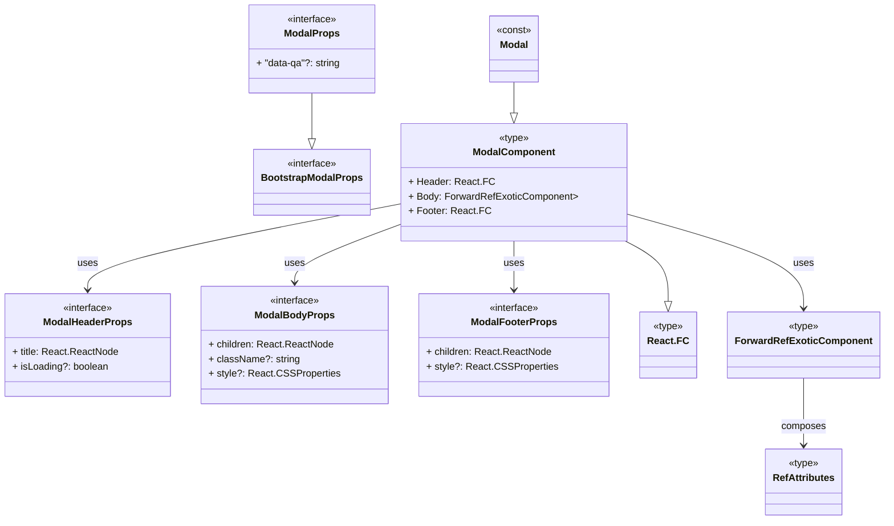

# Diagram: web/portal/src/components/molecules/Modal.molecule.d.ts

> Auto-generated by Obscura crawlers

## Mermaid

```mermaid
classDiagram
class ModalProps <<interface>> {
  + "data-qa"?: string
}
class BootstrapModalProps <<interface>>
ModalProps --|> BootstrapModalProps

class ModalHeaderProps <<interface>> {
  + title: React.ReactNode
  + isLoading?: boolean
}
class ModalBodyProps <<interface>> {
  + children: React.ReactNode
  + className?: string
  + style?: React.CSSProperties
}
class ModalFooterProps <<interface>> {
  + children: React.ReactNode
  + style?: React.CSSProperties
}

class React.FC <<type>>
class ForwardRefExoticComponent <<type>>
class RefAttributes <<type>>

class ModalComponent <<type>> {
  + Header: React.FC<ModalHeaderProps>
  + Body: ForwardRefExoticComponent<ModalBodyProps & RefAttributes<HTMLDivElement>>
  + Footer: React.FC<ModalFooterProps>
}
ModalComponent --|> React.FC
ModalComponent --> ModalHeaderProps : uses
ModalComponent --> ModalBodyProps : uses
ModalComponent --> ModalFooterProps : uses
ModalComponent --> ForwardRefExoticComponent : uses
ForwardRefExoticComponent --> RefAttributes : composes

class Modal <<const>>
Modal --|> ModalComponent
```

> SVG rendering failed for this diagram.
