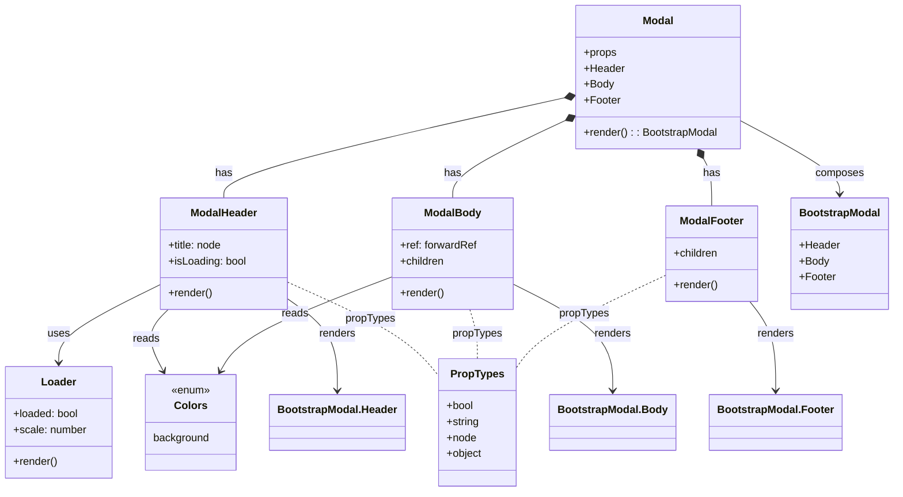

# Diagram: web/portal/src/components/molecules/Modal.molecule.js

> Auto-generated by Obscura crawlers

## Mermaid

### SVG

<svg id="container" width="1324.380859375" xmlns="http://www.w3.org/2000/svg" class="classDiagram" height="740" viewBox="0 0 1324.380859375 740" role="graphics-document document" aria-roledescription="class"><g><defs><marker id="container_class-aggregationStart" class="marker aggregation class" refX="18" refY="7" markerWidth="190" markerHeight="240" orient="auto"><path d="M 18,7 L9,13 L1,7 L9,1 Z"></path></marker></defs><defs><marker id="container_class-aggregationEnd" class="marker aggregation class" refX="1" refY="7" markerWidth="20" markerHeight="28" orient="auto"><path d="M 18,7 L9,13 L1,7 L9,1 Z"></path></marker></defs><defs><marker id="container_class-extensionStart" class="marker extension class" refX="18" refY="7" markerWidth="190" markerHeight="240" orient="auto"><path d="M 1,7 L18,13 V 1 Z"></path></marker></defs><defs><marker id="container_class-extensionEnd" class="marker extension class" refX="1" refY="7" markerWidth="20" markerHeight="28" orient="auto"><path d="M 1,1 V 13 L18,7 Z"></path></marker></defs><defs><marker id="container_class-compositionStart" class="marker composition class" refX="18" refY="7" markerWidth="190" markerHeight="240" orient="auto"><path d="M 18,7 L9,13 L1,7 L9,1 Z"></path></marker></defs><defs><marker id="container_class-compositionEnd" class="marker composition class" refX="1" refY="7" markerWidth="20" markerHeight="28" orient="auto"><path d="M 18,7 L9,13 L1,7 L9,1 Z"></path></marker></defs><defs><marker id="container_class-dependencyStart" class="marker dependency class" refX="6" refY="7" markerWidth="190" markerHeight="240" orient="auto"><path d="M 5,7 L9,13 L1,7 L9,1 Z"></path></marker></defs><defs><marker id="container_class-dependencyEnd" class="marker dependency class" refX="13" refY="7" markerWidth="20" markerHeight="28" orient="auto"><path d="M 18,7 L9,13 L14,7 L9,1 Z"></path></marker></defs><defs><marker id="container_class-lollipopStart" class="marker lollipop class" refX="13" refY="7" markerWidth="190" markerHeight="240" orient="auto"><circle stroke="black" fill="transparent" cx="7" cy="7" r="6"></circle></marker></defs><defs><marker id="container_class-lollipopEnd" class="marker lollipop class" refX="1" refY="7" markerWidth="190" markerHeight="240" orient="auto"><circle stroke="black" fill="transparent" cx="7" cy="7" r="6"></circle></marker></defs><g class="root"><g class="clusters"></g><g class="edgePaths"><path d="M837.059,147.827L753.207,166.689C669.354,185.551,501.649,223.276,417.796,248.305C333.943,273.333,333.943,285.667,333.943,291.833L333.943,298" id="id_Modal_ModalHeader_1" class="edge-thickness-normal edge-pattern-solid relation" style=";;;" data-edge="true" data-et="edge" data-id="id_Modal_ModalHeader_1" data-points="W3sieCI6ODUzLjg4ODY3MTg3NSwieSI6MTQ0LjA0MTUyODU1MTI1NzczfSx7IngiOjMzMy45NDMzNTkzNzUsInkiOjI2MX0seyJ4IjozMzMuOTQzMzU5Mzc1LCJ5IjoyOTh9XQ==" marker-start="url(#container_class-compositionStart)"></path><path d="M838.319,182.893L811.03,195.911C783.74,208.929,729.161,234.964,701.872,254.149C674.582,273.333,674.582,285.667,674.582,291.833L674.582,298" id="id_Modal_ModalBody_2" class="edge-thickness-normal edge-pattern-solid relation" style=";;;" data-edge="true" data-et="edge" data-id="id_Modal_ModalBody_2" data-points="W3sieCI6ODUzLjg4ODY3MTg3NSwieSI6MTc1LjQ2NjEwODkzNzE2NTQ3fSx7IngiOjY3NC41ODIwMzEyNSwieSI6MjYxfSx7IngiOjY3NC41ODIwMzEyNSwieSI6Mjk4fV0=" marker-start="url(#container_class-compositionStart)"></path><path d="M1042.876,239.294L1044.764,242.911C1046.651,246.529,1050.426,253.765,1052.314,265.549C1054.201,277.333,1054.201,293.667,1054.201,301.833L1054.201,310" id="id_Modal_ModalFooter_3" class="edge-thickness-normal edge-pattern-solid relation" style=";;;" data-edge="true" data-et="edge" data-id="id_Modal_ModalFooter_3" data-points="W3sieCI6MTAzNC44OTY3ODA3MTEyMDcsInkiOjIyNH0seyJ4IjoxMDU0LjIwMTE3MTg3NSwieSI6MjYxfSx7IngiOjEwNTQuMjAxMTcxODc1LCJ5IjozMTB9XQ==" marker-start="url(#container_class-compositionStart)"></path><path d="M238.4,428.911L213.251,441.259C188.102,453.607,137.803,478.304,112.653,497.818C87.504,517.333,87.504,531.667,87.504,538.833L87.504,546" id="id_ModalHeader_Loader_4" class="edge-thickness-normal edge-pattern-solid relation" style=";;;" data-edge="true" data-et="edge" data-id="id_ModalHeader_Loader_4" data-points="W3sieCI6MjM4LjQwMDM5MDYyNSwieSI6NDI4LjkxMDkxMDg2MzMxMTF9LHsieCI6ODcuNTAzOTA2MjUsInkiOjUwM30seyJ4Ijo4Ny41MDM5MDYyNSwieSI6NTUyfV0=" marker-end="url(#container_class-dependencyEnd)"></path><path d="M251.538,466L245.488,472.167C239.439,478.333,227.339,490.667,226.263,506.118C225.187,521.57,235.133,540.141,240.106,549.426L245.08,558.711" id="id_ModalHeader_Colors_5" class="edge-thickness-normal edge-pattern-solid relation" style=";;;" data-edge="true" data-et="edge" data-id="id_ModalHeader_Colors_5" data-points="W3sieCI6MjUxLjUzNzg4NDE2ODM4ODQyLCJ5Ijo0NjZ9LHsieCI6MjE1LjI0MDIzNDM3NSwieSI6NTAzfSx7IngiOjI0Ny45MTI1MzUyNDQzNjA5LCJ5Ijo1NjR9XQ==" marker-end="url(#container_class-dependencyEnd)"></path><path d="M584.367,416.92L547.303,431.267C510.24,445.614,436.112,474.307,393.77,497.95C351.428,521.594,340.872,540.188,335.593,549.485L330.315,558.782" id="id_ModalBody_Colors_6" class="edge-thickness-normal edge-pattern-solid relation" style=";;;" data-edge="true" data-et="edge" data-id="id_ModalBody_Colors_6" data-points="W3sieCI6NTg0LjM2NzE4NzUsInkiOjQxNi45MjAyNzQ5MTQwODkzNn0seyJ4IjozNjEuOTg0Mzc1LCJ5Ijo1MDN9LHsieCI6MzI3LjM1Mjk3MjI3NDQzNjA3LCJ5Ijo1NjR9XQ==" marker-end="url(#container_class-dependencyEnd)"></path><path d="M429.486,449.485L442.114,458.405C454.741,467.324,479.995,485.162,492.623,508.248C505.25,531.333,505.25,559.667,505.25,573.833L505.25,588" id="id_ModalHeader_BootstrapModal.Header_7" class="edge-thickness-normal edge-pattern-solid relation" style=";;;" data-edge="true" data-et="edge" data-id="id_ModalHeader_BootstrapModal.Header_7" data-points="W3sieCI6NDI5LjQ4NjMyODEyNSwieSI6NDQ5LjQ4NTQxMTk4NzM2NzM0fSx7IngiOjUwNS4yNSwieSI6NTAzfSx7IngiOjUwNS4yNSwieSI6NTk0fV0=" marker-end="url(#container_class-dependencyEnd)"></path><path d="M764.797,428.042L789.276,440.535C813.755,453.028,862.714,478.014,887.193,504.674C911.672,531.333,911.672,559.667,911.672,573.833L911.672,588" id="id_ModalBody_BootstrapModal.Body_8" class="edge-thickness-normal edge-pattern-solid relation" style=";;;" data-edge="true" data-et="edge" data-id="id_ModalBody_BootstrapModal.Body_8" data-points="W3sieCI6NzY0Ljc5Njg3NSwieSI6NDI4LjA0MTYwMTQ0OTg3MjN9LHsieCI6OTExLjY3MTg3NSwieSI6NTAzfSx7IngiOjkxMS42NzE4NzUsInkiOjU5NH1d" marker-end="url(#container_class-dependencyEnd)"></path><path d="M1110.866,454L1117.293,462.167C1123.721,470.333,1136.575,486.667,1143.002,509C1149.43,531.333,1149.43,559.667,1149.43,573.833L1149.43,588" id="id_ModalFooter_BootstrapModal.Footer_9" class="edge-thickness-normal edge-pattern-solid relation" style=";;;" data-edge="true" data-et="edge" data-id="id_ModalFooter_BootstrapModal.Footer_9" data-points="W3sieCI6MTExMC44NjYwNzM3MzQ1MDQyLCJ5Ijo0NTR9LHsieCI6MTE0OS40Mjk2ODc1LCJ5Ijo1MDN9LHsieCI6MTE0OS40Mjk2ODc1LCJ5Ijo1OTR9XQ==" marker-end="url(#container_class-dependencyEnd)"></path><path d="M1103.209,183.926L1126.784,196.772C1150.359,209.617,1197.508,235.309,1221.083,253.321C1244.658,271.333,1244.658,281.667,1244.658,286.833L1244.658,292" id="id_Modal_BootstrapModal_10" class="edge-thickness-normal edge-pattern-solid relation" style=";;;" data-edge="true" data-et="edge" data-id="id_Modal_BootstrapModal_10" data-points="W3sieCI6MTEwMy4yMDg5ODQzNzUsInkiOjE4My45MjU5MTQ1MDg4MzY4M30seyJ4IjoxMjQ0LjY1ODIwMzEyNSwieSI6MjYxfSx7IngiOjEyNDQuNjU4MjAzMTI1LCJ5IjoyOTh9XQ==" marker-end="url(#container_class-dependencyEnd)"></path><path d="M429.486,424.825L458.555,437.854C487.623,450.883,545.76,476.942,583.271,500.318C620.783,523.695,637.669,544.39,646.112,554.737L654.555,565.085" id="id_ModalHeader_PropTypes_11" class="edge-thickness-normal edge-pattern-dashed relation" style=";;;" data-edge="true" data-et="edge" data-id="id_ModalHeader_PropTypes_11" data-points="W3sieCI6NDI5LjQ4NjMyODEyNSwieSI6NDI0LjgyNDgzOTM4MTgzNzE0fSx7IngiOjYwMy44OTY0ODQzNzUsInkiOjUwM30seyJ4Ijo2NTQuNTU0Njg3NSwieSI6NTY1LjA4NDg1ODYyODk0Mzd9XQ=="></path><path d="M700.848,466L702.777,472.167C704.705,478.333,708.561,490.667,710.49,503C712.418,515.333,712.418,527.667,712.418,533.833L712.418,540" id="id_ModalBody_PropTypes_12" class="edge-thickness-normal edge-pattern-dashed relation" style=";;;" data-edge="true" data-et="edge" data-id="id_ModalBody_PropTypes_12" data-points="W3sieCI6NzAwLjg0ODMwMTkxMTE1NywieSI6NDY2fSx7IngiOjcxMi40MTc5Njg3NSwieSI6NTAzfSx7IngiOjcxMi40MTc5Njg3NSwieSI6NTQwfV0="></path><path d="M985.467,415.735L955.834,430.279C926.201,444.824,866.934,473.912,831.07,497.157C795.206,520.401,782.743,537.803,776.512,546.503L770.281,555.204" id="id_ModalFooter_PropTypes_13" class="edge-thickness-normal edge-pattern-dashed relation" style=";;;" data-edge="true" data-et="edge" data-id="id_ModalFooter_PropTypes_13" data-points="W3sieCI6OTg1LjQ2Njc5Njg3NSwieSI6NDE1LjczNTI1MDU0NDY2MjM0fSx7IngiOjgwNy42Njc5Njg3NSwieSI6NTAzfSx7IngiOjc3MC4yODEyNSwieSI6NTU1LjIwNDAyNzIzMDk3MTJ9XQ=="></path></g><g class="edgeLabels"><g class="edgeLabel" transform="translate(333.943359375, 261)"><g class="label" data-id="id_Modal_ModalHeader_1" transform="translate(-12.703125, -12)"><foreignObject width="25.40625" height="24">

has

</foreignObject></g></g><g class="edgeLabel" transform="translate(674.58203125, 261)"><g class="label" data-id="id_Modal_ModalBody_2" transform="translate(-12.703125, -12)"><foreignObject width="25.40625" height="24">

has

</foreignObject></g></g><g class="edgeLabel" transform="translate(1054.201171875, 261)"><g class="label" data-id="id_Modal_ModalFooter_3" transform="translate(-12.703125, -12)"><foreignObject width="25.40625" height="24">

has

</foreignObject></g></g><g class="edgeLabel" transform="translate(87.50390625, 503)"><g class="label" data-id="id_ModalHeader_Loader_4" transform="translate(-16.4921875, -12)"><foreignObject width="32.984375" height="24">

uses

</foreignObject></g></g><g class="edgeLabel" transform="translate(219.3402, 510.65474)"><g class="label" data-id="id_ModalHeader_Colors_5" transform="translate(-20.0078125, -12)"><foreignObject width="40.015625" height="24">

reads

</foreignObject></g></g><g class="edgeLabel" transform="translate(440.46805, 472.62062)"><g class="label" data-id="id_ModalBody_Colors_6" transform="translate(-20.0078125, -12)"><foreignObject width="40.015625" height="24">

reads

</foreignObject></g></g><g class="edgeLabel" transform="translate(505.25, 503)"><g class="label" data-id="id_ModalHeader_BootstrapModal.Header_7" transform="translate(-27.75, -12)"><foreignObject width="55.5" height="24">

renders

</foreignObject></g></g><g class="edgeLabel" transform="translate(911.671875, 503)"><g class="label" data-id="id_ModalBody_BootstrapModal.Body_8" transform="translate(-27.75, -12)"><foreignObject width="55.5" height="24">

renders

</foreignObject></g></g><g class="edgeLabel" transform="translate(1149.4296875, 503)"><g class="label" data-id="id_ModalFooter_BootstrapModal.Footer_9" transform="translate(-27.75, -12)"><foreignObject width="55.5" height="24">

renders

</foreignObject></g></g><g class="edgeLabel" transform="translate(1244.658203125, 261)"><g class="label" data-id="id_Modal_BootstrapModal_10" transform="translate(-36.453125, -12)"><foreignObject width="72.90625" height="24">

composes

</foreignObject></g></g><g class="edgeLabel" transform="translate(553.25168, 480.29968)"><g class="label" data-id="id_ModalHeader_PropTypes_11" transform="translate(-37.625, -12)"><foreignObject width="75.25" height="24">

propTypes

</foreignObject></g></g><g class="edgeLabel" transform="translate(712.41796875, 503)"><g class="label" data-id="id_ModalBody_PropTypes_12" transform="translate(-37.625, -12)"><foreignObject width="75.25" height="24">

propTypes

</foreignObject></g></g><g class="edgeLabel" transform="translate(867.74623, 473.51322)"><g class="label" data-id="id_ModalFooter_PropTypes_13" transform="translate(-37.625, -12)"><foreignObject width="75.25" height="24">

propTypes

</foreignObject></g></g></g><g class="nodes"><g class="node default" id="classId-Modal-0" transform="translate(978.548828125, 116)"><g class="basic label-container"><path d="M-124.66015625 -108 L124.66015625 -108 L124.66015625 108 L-124.66015625 108" stroke="none" stroke-width="0" fill="#ECECFF" style=""></path><path d="M-124.66015625 -108 C-45.849244166463265 -108, 32.96166791707347 -108, 124.66015625 -108 M-124.66015625 -108 C-62.81560906551342 -108, -0.9710618810268414 -108, 124.66015625 -108 M124.66015625 -108 C124.66015625 -31.56682653077823, 124.66015625 44.86634693844354, 124.66015625 108 M124.66015625 -108 C124.66015625 -47.94556375985717, 124.66015625 12.108872480285655, 124.66015625 108 M124.66015625 108 C31.091594566006947 108, -62.476967117986106 108, -124.66015625 108 M124.66015625 108 C46.68005066238784 108, -31.300054925224316 108, -124.66015625 108 M-124.66015625 108 C-124.66015625 46.190841720380696, -124.66015625 -15.618316559238608, -124.66015625 -108 M-124.66015625 108 C-124.66015625 47.295932901344585, -124.66015625 -13.40813419731083, -124.66015625 -108" stroke="#9370DB" stroke-width="1.3" fill="none" stroke-dasharray="0 0" style=""></path></g><g class="annotation-group text" transform="translate(0, -84)"></g><g class="label-group text" transform="translate(-22.4453125, -84)"><g class="label" style="font-weight: bolder" transform="translate(0,-12)"><foreignObject width="44.890625" height="24">

Modal

</foreignObject></g></g><g class="members-group text" transform="translate(-112.66015625, -36)"><g class="label" style="" transform="translate(0,-12)"><foreignObject width="49.515625" height="24">

+props

</foreignObject></g><g class="label" style="" transform="translate(0,12)"><foreignObject width="60.59375" height="24">

+Header

</foreignObject></g><g class="label" style="" transform="translate(0,36)"><foreignObject width="44.5" height="24">

+Body

</foreignObject></g><g class="label" style="" transform="translate(0,60)"><foreignObject width="54.40625" height="24">

+Footer

</foreignObject></g></g><g class="methods-group text" transform="translate(-112.66015625, 84)"><g class="label" style="" transform="translate(0,-12)"><foreignObject width="202.875" height="24">

+render() : : BootstrapModal

</foreignObject></g></g><g class="divider" style=""><path d="M-124.66015625 -60 C-70.32512416210704 -60, -15.990092074214076 -60, 124.66015625 -60 M-124.66015625 -60 C-58.65439945057565 -60, 7.351357348848694 -60, 124.66015625 -60" stroke="#9370DB" stroke-width="1.3" fill="none" stroke-dasharray="0 0" style=""></path></g><g class="divider" style=""><path d="M-124.66015625 60 C-51.01063282659523 60, 22.638890596809546 60, 124.66015625 60 M-124.66015625 60 C-71.78273599409474 60, -18.905315738189458 60, 124.66015625 60" stroke="#9370DB" stroke-width="1.3" fill="none" stroke-dasharray="0 0" style=""></path></g></g><g class="node default" id="classId-ModalHeader-1" transform="translate(333.943359375, 382)"><g class="basic label-container"><path d="M-95.54296875 -84 L95.54296875 -84 L95.54296875 84 L-95.54296875 84" stroke="none" stroke-width="0" fill="#ECECFF" style=""></path><path d="M-95.54296875 -84 C-25.001760515314388 -84, 45.539447719371225 -84, 95.54296875 -84 M-95.54296875 -84 C-32.16752788890544 -84, 31.20791297218912 -84, 95.54296875 -84 M95.54296875 -84 C95.54296875 -36.705960529619155, 95.54296875 10.58807894076169, 95.54296875 84 M95.54296875 -84 C95.54296875 -41.871029625207, 95.54296875 0.2579407495859982, 95.54296875 84 M95.54296875 84 C38.38024457039896 84, -18.782479609202085 84, -95.54296875 84 M95.54296875 84 C46.590512468857554 84, -2.361943812284892 84, -95.54296875 84 M-95.54296875 84 C-95.54296875 24.96318470729254, -95.54296875 -34.07363058541492, -95.54296875 -84 M-95.54296875 84 C-95.54296875 28.66054630877268, -95.54296875 -26.67890738245464, -95.54296875 -84" stroke="#9370DB" stroke-width="1.3" fill="none" stroke-dasharray="0 0" style=""></path></g><g class="annotation-group text" transform="translate(0, -60)"></g><g class="label-group text" transform="translate(-48.9140625, -60)"><g class="label" style="font-weight: bolder" transform="translate(0,-12)"><foreignObject width="97.828125" height="24">

ModalHeader

</foreignObject></g></g><g class="members-group text" transform="translate(-83.54296875, -12)"><g class="label" style="" transform="translate(0,-12)"><foreignObject width="82.234375" height="24">

+title: node

</foreignObject></g><g class="label" style="" transform="translate(0,12)"><foreignObject width="118.171875" height="24">

+isLoading: bool

</foreignObject></g></g><g class="methods-group text" transform="translate(-83.54296875, 60)"><g class="label" style="" transform="translate(0,-12)"><foreignObject width="66.609375" height="24">

+render()

</foreignObject></g></g><g class="divider" style=""><path d="M-95.54296875 -36 C-27.771175278767146 -36, 40.00061819246571 -36, 95.54296875 -36 M-95.54296875 -36 C-50.11744406028557 -36, -4.691919370571142 -36, 95.54296875 -36" stroke="#9370DB" stroke-width="1.3" fill="none" stroke-dasharray="0 0" style=""></path></g><g class="divider" style=""><path d="M-95.54296875 36 C-30.49166077006454 36, 34.55964720987092 36, 95.54296875 36 M-95.54296875 36 C-52.06308155421908 36, -8.583194358438163 36, 95.54296875 36" stroke="#9370DB" stroke-width="1.3" fill="none" stroke-dasharray="0 0" style=""></path></g></g><g class="node default" id="classId-ModalBody-2" transform="translate(674.58203125, 382)"><g class="basic label-container"><path d="M-90.21484375 -84 L90.21484375 -84 L90.21484375 84 L-90.21484375 84" stroke="none" stroke-width="0" fill="#ECECFF" style=""></path><path d="M-90.21484375 -84 C-31.906276610900115 -84, 26.40229052819977 -84, 90.21484375 -84 M-90.21484375 -84 C-35.78889504346701 -84, 18.637053663065984 -84, 90.21484375 -84 M90.21484375 -84 C90.21484375 -49.16901044396436, 90.21484375 -14.338020887928721, 90.21484375 84 M90.21484375 -84 C90.21484375 -33.1973922306719, 90.21484375 17.605215538656196, 90.21484375 84 M90.21484375 84 C47.44417542871622 84, 4.673507107432442 84, -90.21484375 84 M90.21484375 84 C20.908765389907913 84, -48.397312970184174 84, -90.21484375 84 M-90.21484375 84 C-90.21484375 45.961497669636906, -90.21484375 7.922995339273811, -90.21484375 -84 M-90.21484375 84 C-90.21484375 40.38936570919954, -90.21484375 -3.221268581600924, -90.21484375 -84" stroke="#9370DB" stroke-width="1.3" fill="none" stroke-dasharray="0 0" style=""></path></g><g class="annotation-group text" transform="translate(0, -60)"></g><g class="label-group text" transform="translate(-40.9921875, -60)"><g class="label" style="font-weight: bolder" transform="translate(0,-12)"><foreignObject width="81.984375" height="24">

ModalBody

</foreignObject></g></g><g class="members-group text" transform="translate(-78.21484375, -12)"><g class="label" style="" transform="translate(0,-12)"><foreignObject width="115.4375" height="24">

+ref: forwardRef

</foreignObject></g><g class="label" style="" transform="translate(0,12)"><foreignObject width="67.5" height="24">

+children

</foreignObject></g></g><g class="methods-group text" transform="translate(-78.21484375, 60)"><g class="label" style="" transform="translate(0,-12)"><foreignObject width="66.609375" height="24">

+render()

</foreignObject></g></g><g class="divider" style=""><path d="M-90.21484375 -36 C-32.50741707502022 -36, 25.200009599959557 -36, 90.21484375 -36 M-90.21484375 -36 C-38.57475763107404 -36, 13.065328487851914 -36, 90.21484375 -36" stroke="#9370DB" stroke-width="1.3" fill="none" stroke-dasharray="0 0" style=""></path></g><g class="divider" style=""><path d="M-90.21484375 36 C-52.680236568643885 36, -15.14562938728777 36, 90.21484375 36 M-90.21484375 36 C-29.493166068350284 36, 31.228511613299432 36, 90.21484375 36" stroke="#9370DB" stroke-width="1.3" fill="none" stroke-dasharray="0 0" style=""></path></g></g><g class="node default" id="classId-ModalFooter-3" transform="translate(1054.201171875, 382)"><g class="basic label-container"><path d="M-68.734375 -72 L68.734375 -72 L68.734375 72 L-68.734375 72" stroke="none" stroke-width="0" fill="#ECECFF" style=""></path><path d="M-68.734375 -72 C-28.0207639996676 -72, 12.692847000664798 -72, 68.734375 -72 M-68.734375 -72 C-17.376585049232496 -72, 33.98120490153501 -72, 68.734375 -72 M68.734375 -72 C68.734375 -24.23722259790044, 68.734375 23.525554804199118, 68.734375 72 M68.734375 -72 C68.734375 -16.868824641808978, 68.734375 38.262350716382045, 68.734375 72 M68.734375 72 C16.68956648590178 72, -35.35524202819644 72, -68.734375 72 M68.734375 72 C15.761777623177828 72, -37.210819753644344 72, -68.734375 72 M-68.734375 72 C-68.734375 23.370316999290708, -68.734375 -25.259366001418584, -68.734375 -72 M-68.734375 72 C-68.734375 19.01058461243033, -68.734375 -33.97883077513934, -68.734375 -72" stroke="#9370DB" stroke-width="1.3" fill="none" stroke-dasharray="0 0" style=""></path></g><g class="annotation-group text" transform="translate(0, -48)"></g><g class="label-group text" transform="translate(-45.96875, -48)"><g class="label" style="font-weight: bolder" transform="translate(0,-12)"><foreignObject width="91.9375" height="24">

ModalFooter

</foreignObject></g></g><g class="members-group text" transform="translate(-56.734375, 0)"><g class="label" style="" transform="translate(0,-12)"><foreignObject width="67.5" height="24">

+children

</foreignObject></g></g><g class="methods-group text" transform="translate(-56.734375, 48)"><g class="label" style="" transform="translate(0,-12)"><foreignObject width="66.609375" height="24">

+render()

</foreignObject></g></g><g class="divider" style=""><path d="M-68.734375 -24 C-19.187527679544502 -24, 30.359319640910996 -24, 68.734375 -24 M-68.734375 -24 C-36.93678963143586 -24, -5.139204262871708 -24, 68.734375 -24" stroke="#9370DB" stroke-width="1.3" fill="none" stroke-dasharray="0 0" style=""></path></g><g class="divider" style=""><path d="M-68.734375 24 C-35.59241079127972 24, -2.4504465825594366 24, 68.734375 24 M-68.734375 24 C-23.5215404865977 24, 21.6912940268046 24, 68.734375 24" stroke="#9370DB" stroke-width="1.3" fill="none" stroke-dasharray="0 0" style=""></path></g></g><g class="node default" id="classId-BootstrapModal-4" transform="translate(1244.658203125, 382)"><g class="basic label-container"><path d="M-71.72265625 -84 L71.72265625 -84 L71.72265625 84 L-71.72265625 84" stroke="none" stroke-width="0" fill="#ECECFF" style=""></path><path d="M-71.72265625 -84 C-34.11816098133195 -84, 3.4863342873361063 -84, 71.72265625 -84 M-71.72265625 -84 C-29.17677971000431 -84, 13.369096829991378 -84, 71.72265625 -84 M71.72265625 -84 C71.72265625 -29.477462128066044, 71.72265625 25.045075743867912, 71.72265625 84 M71.72265625 -84 C71.72265625 -37.48705853342977, 71.72265625 9.025882933140466, 71.72265625 84 M71.72265625 84 C31.306429451632027 84, -9.109797346735945 84, -71.72265625 84 M71.72265625 84 C20.118116738623456 84, -31.486422772753087 84, -71.72265625 84 M-71.72265625 84 C-71.72265625 24.206644867815214, -71.72265625 -35.58671026436957, -71.72265625 -84 M-71.72265625 84 C-71.72265625 36.823400029987454, -71.72265625 -10.353199940025092, -71.72265625 -84" stroke="#9370DB" stroke-width="1.3" fill="none" stroke-dasharray="0 0" style=""></path></g><g class="annotation-group text" transform="translate(0, -60)"></g><g class="label-group text" transform="translate(-58.8515625, -60)"><g class="label" style="font-weight: bolder" transform="translate(0,-12)"><foreignObject width="117.703125" height="24">

BootstrapModal

</foreignObject></g></g><g class="members-group text" transform="translate(-59.72265625, -12)"><g class="label" style="" transform="translate(0,-12)"><foreignObject width="60.59375" height="24">

+Header

</foreignObject></g><g class="label" style="" transform="translate(0,12)"><foreignObject width="44.5" height="24">

+Body

</foreignObject></g><g class="label" style="" transform="translate(0,36)"><foreignObject width="54.40625" height="24">

+Footer

</foreignObject></g></g><g class="methods-group text" transform="translate(-59.72265625, 84)"></g><g class="divider" style=""><path d="M-71.72265625 -36 C-16.34691563454517 -36, 39.02882498090966 -36, 71.72265625 -36 M-71.72265625 -36 C-41.45183896077341 -36, -11.181021671546816 -36, 71.72265625 -36" stroke="#9370DB" stroke-width="1.3" fill="none" stroke-dasharray="0 0" style=""></path></g><g class="divider" style=""><path d="M-71.72265625 60 C-30.332383726798348 60, 11.057888796403304 60, 71.72265625 60 M-71.72265625 60 C-29.576779134779137 60, 12.569097980441725 60, 71.72265625 60" stroke="#9370DB" stroke-width="1.3" fill="none" stroke-dasharray="0 0" style=""></path></g></g><g class="node default" id="classId-Loader-5" transform="translate(87.50390625, 636)"><g class="basic label-container"><path d="M-79.50390625 -84 L79.50390625 -84 L79.50390625 84 L-79.50390625 84" stroke="none" stroke-width="0" fill="#ECECFF" style=""></path><path d="M-79.50390625 -84 C-43.04396297915368 -84, -6.584019708307366 -84, 79.50390625 -84 M-79.50390625 -84 C-43.628152327913 -84, -7.752398405826 -84, 79.50390625 -84 M79.50390625 -84 C79.50390625 -20.497243094562045, 79.50390625 43.00551381087591, 79.50390625 84 M79.50390625 -84 C79.50390625 -24.29344019310483, 79.50390625 35.41311961379034, 79.50390625 84 M79.50390625 84 C30.115076532763233 84, -19.273753184473534 84, -79.50390625 84 M79.50390625 84 C39.04133128945975 84, -1.4212436710805036 84, -79.50390625 84 M-79.50390625 84 C-79.50390625 47.00905816158022, -79.50390625 10.018116323160442, -79.50390625 -84 M-79.50390625 84 C-79.50390625 40.19880986618125, -79.50390625 -3.6023802676375, -79.50390625 -84" stroke="#9370DB" stroke-width="1.3" fill="none" stroke-dasharray="0 0" style=""></path></g><g class="annotation-group text" transform="translate(0, -60)"></g><g class="label-group text" transform="translate(-25.3046875, -60)"><g class="label" style="font-weight: bolder" transform="translate(0,-12)"><foreignObject width="50.609375" height="24">

Loader

</foreignObject></g></g><g class="members-group text" transform="translate(-67.50390625, -12)"><g class="label" style="" transform="translate(0,-12)"><foreignObject width="99.296875" height="24">

+loaded: bool

</foreignObject></g><g class="label" style="" transform="translate(0,12)"><foreignObject width="109.703125" height="24">

+scale: number

</foreignObject></g></g><g class="methods-group text" transform="translate(-67.50390625, 60)"><g class="label" style="" transform="translate(0,-12)"><foreignObject width="66.609375" height="24">

+render()

</foreignObject></g></g><g class="divider" style=""><path d="M-79.50390625 -36 C-29.677929953780094 -36, 20.148046342439812 -36, 79.50390625 -36 M-79.50390625 -36 C-44.48304296701548 -36, -9.462179684030957 -36, 79.50390625 -36" stroke="#9370DB" stroke-width="1.3" fill="none" stroke-dasharray="0 0" style=""></path></g><g class="divider" style=""><path d="M-79.50390625 36 C-24.877826186893714 36, 29.748253876212573 36, 79.50390625 36 M-79.50390625 36 C-25.67279444672964 36, 28.15831735654072 36, 79.50390625 36" stroke="#9370DB" stroke-width="1.3" fill="none" stroke-dasharray="0 0" style=""></path></g></g><g class="node default" id="classId-Colors-6" transform="translate(286.4765625, 636)"><g class="basic label-container"><path d="M-69.46875 -72 L69.46875 -72 L69.46875 72 L-69.46875 72" stroke="none" stroke-width="0" fill="#ECECFF" style=""></path><path d="M-69.46875 -72 C-28.937139894425798 -72, 11.594470211148405 -72, 69.46875 -72 M-69.46875 -72 C-41.472025880064905 -72, -13.475301760129803 -72, 69.46875 -72 M69.46875 -72 C69.46875 -30.32254449927725, 69.46875 11.354911001445501, 69.46875 72 M69.46875 -72 C69.46875 -43.02166491759985, 69.46875 -14.043329835199707, 69.46875 72 M69.46875 72 C35.909159092014235 72, 2.3495681840284703 72, -69.46875 72 M69.46875 72 C30.664205319162186 72, -8.140339361675629 72, -69.46875 72 M-69.46875 72 C-69.46875 37.32234817043979, -69.46875 2.6446963408795767, -69.46875 -72 M-69.46875 72 C-69.46875 23.185849658518144, -69.46875 -25.62830068296371, -69.46875 -72" stroke="#9370DB" stroke-width="1.3" fill="none" stroke-dasharray="0 0" style=""></path></g><g class="annotation-group text" transform="translate(-29.53125, -48)"><g class="label" style="" transform="translate(0,-12)"><foreignObject width="59.0625" height="24">

«enum»

</foreignObject></g></g><g class="label-group text" transform="translate(-23.1015625, -24)"><g class="label" style="font-weight: bolder" transform="translate(0,-12)"><foreignObject width="46.203125" height="24">

Colors

</foreignObject></g></g><g class="members-group text" transform="translate(-57.46875, 24)"><g class="label" style="" transform="translate(0,-12)"><foreignObject width="85.40625" height="24">

background

</foreignObject></g></g><g class="methods-group text" transform="translate(-57.46875, 72)"></g><g class="divider" style=""><path d="M-69.46875 0 C-25.263045973946944 0, 18.94265805210611 0, 69.46875 0 M-69.46875 0 C-27.397199165468606 0, 14.674351669062787 0, 69.46875 0" stroke="#9370DB" stroke-width="1.3" fill="none" stroke-dasharray="0 0" style=""></path></g><g class="divider" style=""><path d="M-69.46875 48 C-21.415209159070464 48, 26.63833168185907 48, 69.46875 48 M-69.46875 48 C-21.391059813671667 48, 26.686630372656666 48, 69.46875 48" stroke="#9370DB" stroke-width="1.3" fill="none" stroke-dasharray="0 0" style=""></path></g></g><g class="node default" id="classId-PropTypes-7" transform="translate(712.41796875, 636)"><g class="basic label-container"><path d="M-57.86328125 -96 L57.86328125 -96 L57.86328125 96 L-57.86328125 96" stroke="none" stroke-width="0" fill="#ECECFF" style=""></path><path d="M-57.86328125 -96 C-27.302502060978085 -96, 3.2582771280438294 -96, 57.86328125 -96 M-57.86328125 -96 C-28.459222975741127 -96, 0.9448352985177451 -96, 57.86328125 -96 M57.86328125 -96 C57.86328125 -54.64663370624667, 57.86328125 -13.293267412493336, 57.86328125 96 M57.86328125 -96 C57.86328125 -46.39340090044177, 57.86328125 3.213198199116462, 57.86328125 96 M57.86328125 96 C20.002159284018866 96, -17.858962681962268 96, -57.86328125 96 M57.86328125 96 C13.971001456775788 96, -29.921278336448424 96, -57.86328125 96 M-57.86328125 96 C-57.86328125 44.053869303621774, -57.86328125 -7.892261392756453, -57.86328125 -96 M-57.86328125 96 C-57.86328125 21.133955808886654, -57.86328125 -53.73208838222669, -57.86328125 -96" stroke="#9370DB" stroke-width="1.3" fill="none" stroke-dasharray="0 0" style=""></path></g><g class="annotation-group text" transform="translate(0, -72)"></g><g class="label-group text" transform="translate(-38.2578125, -72)"><g class="label" style="font-weight: bolder" transform="translate(0,-12)"><foreignObject width="76.515625" height="24">

PropTypes

</foreignObject></g></g><g class="members-group text" transform="translate(-45.86328125, -24)"><g class="label" style="" transform="translate(0,-12)"><foreignObject width="40.875" height="24">

+bool

</foreignObject></g><g class="label" style="" transform="translate(0,12)"><foreignObject width="49.625" height="24">

+string

</foreignObject></g><g class="label" style="" transform="translate(0,36)"><foreignObject width="45" height="24">

+node

</foreignObject></g><g class="label" style="" transform="translate(0,60)"><foreignObject width="53.46875" height="24">

+object

</foreignObject></g></g><g class="methods-group text" transform="translate(-45.86328125, 96)"></g><g class="divider" style=""><path d="M-57.86328125 -48 C-27.95199923180196 -48, 1.9592827863960807 -48, 57.86328125 -48 M-57.86328125 -48 C-28.016006451900743 -48, 1.831268346198513 -48, 57.86328125 -48" stroke="#9370DB" stroke-width="1.3" fill="none" stroke-dasharray="0 0" style=""></path></g><g class="divider" style=""><path d="M-57.86328125 72 C-17.64166956610986 72, 22.579942117780277 72, 57.86328125 72 M-57.86328125 72 C-29.468140544635705 72, -1.0729998392714108 72, 57.86328125 72" stroke="#9370DB" stroke-width="1.3" fill="none" stroke-dasharray="0 0" style=""></path></g></g><g class="node default" id="classId-BootstrapModal.Header-8" transform="translate(505.25, 636)"><g class="basic label-container"><path d="M-99.3046875 -42 L99.3046875 -42 L99.3046875 42 L-99.3046875 42" stroke="none" stroke-width="0" fill="#ECECFF" style=""></path><path d="M-99.3046875 -42 C-52.68147192066758 -42, -6.058256341335166 -42, 99.3046875 -42 M-99.3046875 -42 C-52.46812541500399 -42, -5.631563330007978 -42, 99.3046875 -42 M99.3046875 -42 C99.3046875 -10.450596522548036, 99.3046875 21.098806954903928, 99.3046875 42 M99.3046875 -42 C99.3046875 -23.79449023441104, 99.3046875 -5.588980468822079, 99.3046875 42 M99.3046875 42 C35.410195423485256 42, -28.48429665302949 42, -99.3046875 42 M99.3046875 42 C22.232436730900417 42, -54.839814038199165 42, -99.3046875 42 M-99.3046875 42 C-99.3046875 8.588946769058019, -99.3046875 -24.822106461883962, -99.3046875 -42 M-99.3046875 42 C-99.3046875 14.762880801189723, -99.3046875 -12.474238397620553, -99.3046875 -42" stroke="#9370DB" stroke-width="1.3" fill="none" stroke-dasharray="0 0" style=""></path></g><g class="annotation-group text" transform="translate(0, -18)"></g><g class="label-group text" transform="translate(-87.3046875, -18)"><g class="label" style="font-weight: bolder" transform="translate(0,-12)"><foreignObject width="174.609375" height="24">

BootstrapModal.Header

</foreignObject></g></g><g class="members-group text" transform="translate(-87.3046875, 30)"></g><g class="methods-group text" transform="translate(-87.3046875, 60)"></g><g class="divider" style=""><path d="M-99.3046875 6 C-31.69111786625136 6, 35.92245176749728 6, 99.3046875 6 M-99.3046875 6 C-25.751570089302007 6, 47.80154732139599 6, 99.3046875 6" stroke="#9370DB" stroke-width="1.3" fill="none" stroke-dasharray="0 0" style=""></path></g><g class="divider" style=""><path d="M-99.3046875 24 C-47.16250062758109 24, 4.979686244837822 24, 99.3046875 24 M-99.3046875 24 C-36.70714988673061 24, 25.890387726538776 24, 99.3046875 24" stroke="#9370DB" stroke-width="1.3" fill="none" stroke-dasharray="0 0" style=""></path></g></g><g class="node default" id="classId-BootstrapModal.Body-9" transform="translate(911.671875, 636)"><g class="basic label-container"><path d="M-91.390625 -42 L91.390625 -42 L91.390625 42 L-91.390625 42" stroke="none" stroke-width="0" fill="#ECECFF" style=""></path><path d="M-91.390625 -42 C-30.95119943833631 -42, 29.48822612332738 -42, 91.390625 -42 M-91.390625 -42 C-41.340342896413944 -42, 8.709939207172113 -42, 91.390625 -42 M91.390625 -42 C91.390625 -12.175509689227784, 91.390625 17.648980621544432, 91.390625 42 M91.390625 -42 C91.390625 -9.057994842005975, 91.390625 23.88401031598805, 91.390625 42 M91.390625 42 C32.62063313883393 42, -26.14935872233214 42, -91.390625 42 M91.390625 42 C48.05215807880739 42, 4.713691157614775 42, -91.390625 42 M-91.390625 42 C-91.390625 22.434799364974864, -91.390625 2.869598729949729, -91.390625 -42 M-91.390625 42 C-91.390625 19.002986046125837, -91.390625 -3.9940279077483254, -91.390625 -42" stroke="#9370DB" stroke-width="1.3" fill="none" stroke-dasharray="0 0" style=""></path></g><g class="annotation-group text" transform="translate(0, -18)"></g><g class="label-group text" transform="translate(-79.390625, -18)"><g class="label" style="font-weight: bolder" transform="translate(0,-12)"><foreignObject width="158.78125" height="24">

BootstrapModal.Body

</foreignObject></g></g><g class="members-group text" transform="translate(-79.390625, 30)"></g><g class="methods-group text" transform="translate(-79.390625, 60)"></g><g class="divider" style=""><path d="M-91.390625 6 C-53.58650406630448 6, -15.782383132608956 6, 91.390625 6 M-91.390625 6 C-46.09884973859893 6, -0.8070744771978582 6, 91.390625 6" stroke="#9370DB" stroke-width="1.3" fill="none" stroke-dasharray="0 0" style=""></path></g><g class="divider" style=""><path d="M-91.390625 24 C-21.653763428865787 24, 48.083098142268426 24, 91.390625 24 M-91.390625 24 C-43.89446084018862 24, 3.6017033196227572 24, 91.390625 24" stroke="#9370DB" stroke-width="1.3" fill="none" stroke-dasharray="0 0" style=""></path></g></g><g class="node default" id="classId-BootstrapModal.Footer-10" transform="translate(1149.4296875, 636)"><g class="basic label-container"><path d="M-96.3671875 -42 L96.3671875 -42 L96.3671875 42 L-96.3671875 42" stroke="none" stroke-width="0" fill="#ECECFF" style=""></path><path d="M-96.3671875 -42 C-39.16913924928835 -42, 18.0289090014233 -42, 96.3671875 -42 M-96.3671875 -42 C-53.25261588243271 -42, -10.138044264865414 -42, 96.3671875 -42 M96.3671875 -42 C96.3671875 -13.921116486743248, 96.3671875 14.157767026513504, 96.3671875 42 M96.3671875 -42 C96.3671875 -17.66067596184347, 96.3671875 6.67864807631306, 96.3671875 42 M96.3671875 42 C56.3981731009441 42, 16.4291587018882 42, -96.3671875 42 M96.3671875 42 C48.08111089565899 42, -0.20496570868202468 42, -96.3671875 42 M-96.3671875 42 C-96.3671875 8.416504475407727, -96.3671875 -25.166991049184546, -96.3671875 -42 M-96.3671875 42 C-96.3671875 11.508318433483925, -96.3671875 -18.98336313303215, -96.3671875 -42" stroke="#9370DB" stroke-width="1.3" fill="none" stroke-dasharray="0 0" style=""></path></g><g class="annotation-group text" transform="translate(0, -18)"></g><g class="label-group text" transform="translate(-84.3671875, -18)"><g class="label" style="font-weight: bolder" transform="translate(0,-12)"><foreignObject width="168.734375" height="24">

BootstrapModal.Footer

</foreignObject></g></g><g class="members-group text" transform="translate(-84.3671875, 30)"></g><g class="methods-group text" transform="translate(-84.3671875, 60)"></g><g class="divider" style=""><path d="M-96.3671875 6 C-51.704457677561095 6, -7.04172785512219 6, 96.3671875 6 M-96.3671875 6 C-46.09323501860924 6, 4.180717462781516 6, 96.3671875 6" stroke="#9370DB" stroke-width="1.3" fill="none" stroke-dasharray="0 0" style=""></path></g><g class="divider" style=""><path d="M-96.3671875 24 C-33.10893899004063 24, 30.149309519918745 24, 96.3671875 24 M-96.3671875 24 C-23.020927989157272 24, 50.325331521685456 24, 96.3671875 24" stroke="#9370DB" stroke-width="1.3" fill="none" stroke-dasharray="0 0" style=""></path></g></g></g></g></g></svg>
