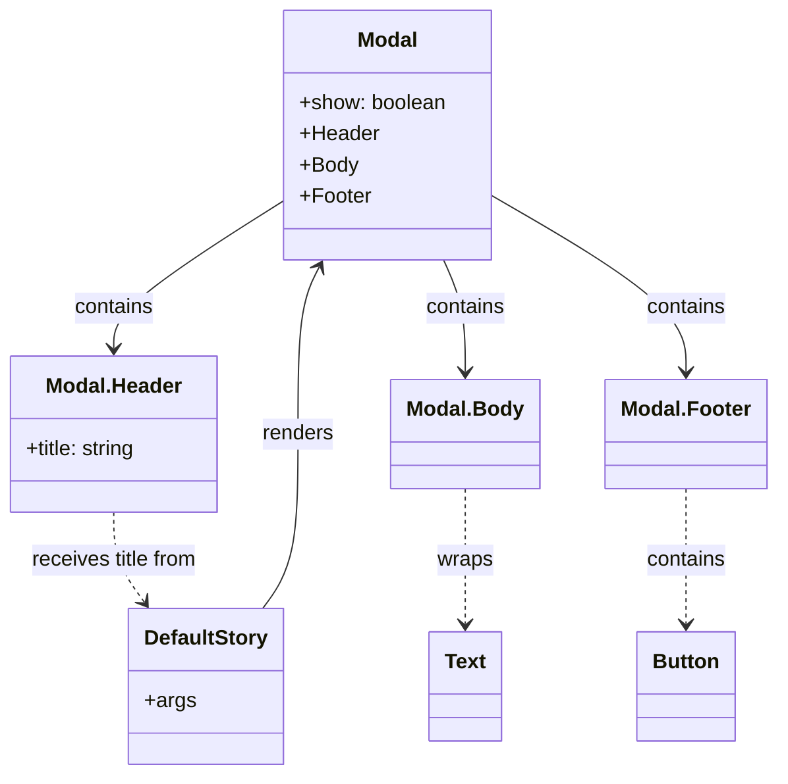

# Diagram: web/portal/src/components/molecules/Modal.molecule.stories.js


> Auto-generated by Obscura crawlers

## Diagram 1



### SVG

<svg id="container" width="592.0703125" xmlns="http://www.w3.org/2000/svg" class="classDiagram" height="596" viewBox="0 0 592.0703125 596" role="graphics-document document" aria-roledescription="class"><style>#container{font-family:"trebuchet ms",verdana,arial,sans-serif;font-size:16px;fill:#333;}@keyframes edge-animation-frame{from{stroke-dashoffset:0;}}@keyframes dash{to{stroke-dashoffset:0;}}#container .edge-animation-slow{stroke-dasharray:9,5!important;stroke-dashoffset:900;animation:dash 50s linear infinite;stroke-linecap:round;}#container .edge-animation-fast{stroke-dasharray:9,5!important;stroke-dashoffset:900;animation:dash 20s linear infinite;stroke-linecap:round;}#container .error-icon{fill:#552222;}#container .error-text{fill:#552222;stroke:#552222;}#container .edge-thickness-normal{stroke-width:1px;}#container .edge-thickness-thick{stroke-width:3.5px;}#container .edge-pattern-solid{stroke-dasharray:0;}#container .edge-thickness-invisible{stroke-width:0;fill:none;}#container .edge-pattern-dashed{stroke-dasharray:3;}#container .edge-pattern-dotted{stroke-dasharray:2;}#container .marker{fill:#333333;stroke:#333333;}#container .marker.cross{stroke:#333333;}#container svg{font-family:"trebuchet ms",verdana,arial,sans-serif;font-size:16px;}#container p{margin:0;}#container g.classGroup text{fill:#9370DB;stroke:none;font-family:"trebuchet ms",verdana,arial,sans-serif;font-size:10px;}#container g.classGroup text .title{font-weight:bolder;}#container .nodeLabel,#container .edgeLabel{color:#131300;}#container .edgeLabel .label rect{fill:#ECECFF;}#container .label text{fill:#131300;}#container .labelBkg{background:#ECECFF;}#container .edgeLabel .label span{background:#ECECFF;}#container .classTitle{font-weight:bolder;}#container .node rect,#container .node circle,#container .node ellipse,#container .node polygon,#container .node path{fill:#ECECFF;stroke:#9370DB;stroke-width:1px;}#container .divider{stroke:#9370DB;stroke-width:1;}#container g.clickable{cursor:pointer;}#container g.classGroup rect{fill:#ECECFF;stroke:#9370DB;}#container g.classGroup line{stroke:#9370DB;stroke-width:1;}#container .classLabel .box{stroke:none;stroke-width:0;fill:#ECECFF;opacity:0.5;}#container .classLabel .label{fill:#9370DB;font-size:10px;}#container .relation{stroke:#333333;stroke-width:1;fill:none;}#container .dashed-line{stroke-dasharray:3;}#container .dotted-line{stroke-dasharray:1 2;}#container #compositionStart,#container .composition{fill:#333333!important;stroke:#333333!important;stroke-width:1;}#container #compositionEnd,#container .composition{fill:#333333!important;stroke:#333333!important;stroke-width:1;}#container #dependencyStart,#container .dependency{fill:#333333!important;stroke:#333333!important;stroke-width:1;}#container #dependencyStart,#container .dependency{fill:#333333!important;stroke:#333333!important;stroke-width:1;}#container #extensionStart,#container .extension{fill:transparent!important;stroke:#333333!important;stroke-width:1;}#container #extensionEnd,#container .extension{fill:transparent!important;stroke:#333333!important;stroke-width:1;}#container #aggregationStart,#container .aggregation{fill:transparent!important;stroke:#333333!important;stroke-width:1;}#container #aggregationEnd,#container .aggregation{fill:transparent!important;stroke:#333333!important;stroke-width:1;}#container #lollipopStart,#container .lollipop{fill:#ECECFF!important;stroke:#333333!important;stroke-width:1;}#container #lollipopEnd,#container .lollipop{fill:#ECECFF!important;stroke:#333333!important;stroke-width:1;}#container .edgeTerminals{font-size:11px;line-height:initial;}#container .classTitleText{text-anchor:middle;font-size:18px;fill:#333;}#container .label-icon{display:inline-block;height:1em;overflow:visible;vertical-align:-0.125em;}#container .node .label-icon path{fill:currentColor;stroke:revert;stroke-width:revert;}#container :root{--mermaid-font-family:"trebuchet ms",verdana,arial,sans-serif;}</style><g><defs><marker id="container_class-aggregationStart" class="marker aggregation class" refX="18" refY="7" markerWidth="190" markerHeight="240" orient="auto"><path d="M 18,7 L9,13 L1,7 L9,1 Z"></path></marker></defs><defs><marker id="container_class-aggregationEnd" class="marker aggregation class" refX="1" refY="7" markerWidth="20" markerHeight="28" orient="auto"><path d="M 18,7 L9,13 L1,7 L9,1 Z"></path></marker></defs><defs><marker id="container_class-extensionStart" class="marker extension class" refX="18" refY="7" markerWidth="190" markerHeight="240" orient="auto"><path d="M 1,7 L18,13 V 1 Z"></path></marker></defs><defs><marker id="container_class-extensionEnd" class="marker extension class" refX="1" refY="7" markerWidth="20" markerHeight="28" orient="auto"><path d="M 1,1 V 13 L18,7 Z"></path></marker></defs><defs><marker id="container_class-compositionStart" class="marker composition class" refX="18" refY="7" markerWidth="190" markerHeight="240" orient="auto"><path d="M 18,7 L9,13 L1,7 L9,1 Z"></path></marker></defs><defs><marker id="container_class-compositionEnd" class="marker composition class" refX="1" refY="7" markerWidth="20" markerHeight="28" orient="auto"><path d="M 18,7 L9,13 L1,7 L9,1 Z"></path></marker></defs><defs><marker id="container_class-dependencyStart" class="marker dependency class" refX="6" refY="7" markerWidth="190" markerHeight="240" orient="auto"><path d="M 5,7 L9,13 L1,7 L9,1 Z"></path></marker></defs><defs><marker id="container_class-dependencyEnd" class="marker dependency class" refX="13" refY="7" markerWidth="20" markerHeight="28" orient="auto"><path d="M 18,7 L9,13 L14,7 L9,1 Z"></path></marker></defs><defs><marker id="container_class-lollipopStart" class="marker lollipop class" refX="13" refY="7" markerWidth="190" markerHeight="240" orient="auto"><circle stroke="black" fill="transparent" cx="7" cy="7" r="6"></circle></marker></defs><defs><marker id="container_class-lollipopEnd" class="marker lollipop class" refX="1" refY="7" markerWidth="190" markerHeight="240" orient="auto"><circle stroke="black" fill="transparent" cx="7" cy="7" r="6"></circle></marker></defs><g class="root"><g class="clusters"></g><g class="edgePaths"><path d="M205.115,468L209.68,461.833C214.246,455.667,223.377,443.333,227.942,421C232.508,398.667,232.508,366.333,232.508,334C232.508,301.667,232.508,269.333,235.198,247.891C237.888,226.448,243.268,215.897,245.958,210.621L248.649,205.345" id="id_DefaultStory_Modal_1" class="edge-thickness-normal edge-pattern-solid relation" style=";;;" data-edge="true" data-et="edge" data-id="id_DefaultStory_Modal_1" data-points="W3sieCI6MjA1LjExNDY3MDU4NjM0MDIsInkiOjQ2OH0seyJ4IjoyMzIuNTA3ODEyNSwieSI6NDMxfSx7IngiOjIzMi41MDc4MTI1LCJ5IjozMzR9LHsieCI6MjMyLjUwNzgxMjUsInkiOjIzN30seyJ4IjoyNTEuMzc0MDMwNzgwMDc1MiwieSI6MjAwfV0=" marker-end="url(#container_class-dependencyEnd)"></path><path d="M220.484,154.22L198.55,168.016C176.616,181.813,132.747,209.407,110.813,228.37C88.879,247.333,88.879,257.667,88.879,262.833L88.879,268" id="id_Modal_Modal.Header_2" class="edge-thickness-normal edge-pattern-solid relation" style=";;;" data-edge="true" data-et="edge" data-id="id_Modal_Modal.Header_2" data-points="W3sieCI6MjIwLjQ4NDM3NSwieSI6MTU0LjIxOTYwMDk2MDY1MDN9LHsieCI6ODguODc4OTA2MjUsInkiOjIzN30seyJ4Ijo4OC44Nzg5MDYyNSwieSI6Mjc0fV0=" marker-end="url(#container_class-dependencyEnd)"></path><path d="M342.812,200L345.541,206.167C348.271,212.333,353.729,224.667,356.458,239C359.188,253.333,359.188,269.667,359.188,277.833L359.188,286" id="id_Modal_Modal.Body_3" class="edge-thickness-normal edge-pattern-solid relation" style=";;;" data-edge="true" data-et="edge" data-id="id_Modal_Modal.Body_3" data-points="W3sieCI6MzQyLjgxMjAwMDcwNDg4NzIsInkiOjIwMH0seyJ4IjozNTkuMTg3NSwieSI6MjM3fSx7IngiOjM1OS4xODc1LCJ5IjoyOTJ9XQ==" marker-end="url(#container_class-dependencyEnd)"></path><path d="M380.164,151.449L404.156,165.707C428.148,179.966,476.133,208.483,500.125,230.908C524.117,253.333,524.117,269.667,524.117,277.833L524.117,286" id="id_Modal_Modal.Footer_4" class="edge-thickness-normal edge-pattern-solid relation" style=";;;" data-edge="true" data-et="edge" data-id="id_Modal_Modal.Footer_4" data-points="W3sieCI6MzgwLjE2NDA2MjUsInkiOjE1MS40NDg3NjE1ODU1ODkzNX0seyJ4Ijo1MjQuMTE3MTg3NSwieSI6MjM3fSx7IngiOjUyNC4xMTcxODc1LCJ5IjoyOTJ9XQ==" marker-end="url(#container_class-dependencyEnd)"></path><path d="M88.879,394L88.879,400.167C88.879,406.333,88.879,418.667,92.849,430.196C96.82,441.726,104.761,452.452,108.731,457.815L112.702,463.178" id="id_Modal.Header_DefaultStory_5" class="edge-thickness-normal edge-pattern-dashed relation" style=";;;" data-edge="true" data-et="edge" data-id="id_Modal.Header_DefaultStory_5" data-points="W3sieCI6ODguODc4OTA2MjUsInkiOjM5NH0seyJ4Ijo4OC44Nzg5MDYyNSwieSI6NDMxfSx7IngiOjExNi4yNzIwNDgxNjM2NTk4LCJ5Ijo0Njh9XQ==" marker-end="url(#container_class-dependencyEnd)"></path><path d="M359.188,376L359.188,385.167C359.188,394.333,359.188,412.667,359.188,430C359.188,447.333,359.188,463.667,359.188,471.833L359.188,480" id="id_Modal.Body_Text_6" class="edge-thickness-normal edge-pattern-dashed relation" style=";;;" data-edge="true" data-et="edge" data-id="id_Modal.Body_Text_6" data-points="W3sieCI6MzU5LjE4NzUsInkiOjM3Nn0seyJ4IjozNTkuMTg3NSwieSI6NDMxfSx7IngiOjM1OS4xODc1LCJ5Ijo0ODZ9XQ==" marker-end="url(#container_class-dependencyEnd)"></path><path d="M524.117,376L524.117,385.167C524.117,394.333,524.117,412.667,524.117,430C524.117,447.333,524.117,463.667,524.117,471.833L524.117,480" id="id_Modal.Footer_Button_7" class="edge-thickness-normal edge-pattern-dashed relation" style=";;;" data-edge="true" data-et="edge" data-id="id_Modal.Footer_Button_7" data-points="W3sieCI6NTI0LjExNzE4NzUsInkiOjM3Nn0seyJ4Ijo1MjQuMTE3MTg3NSwieSI6NDMxfSx7IngiOjUyNC4xMTcxODc1LCJ5Ijo0ODZ9XQ==" marker-end="url(#container_class-dependencyEnd)"></path></g><g class="edgeLabels"><g class="edgeLabel" transform="translate(232.5078125, 334)"><g class="label" data-id="id_DefaultStory_Modal_1" transform="translate(-27.75, -12)"><foreignObject width="55.5" height="24"><div xmlns="http://www.w3.org/1999/xhtml" class="labelBkg" style="display: table-cell; white-space: nowrap; line-height: 1.5; max-width: 200px; text-align: center;"><span class="edgeLabel"><p>renders</p></span></div></foreignObject></g></g><g class="edgeLabel" transform="translate(88.87890625, 237)"><g class="label" data-id="id_Modal_Modal.Header_2" transform="translate(-30.890625, -12)"><foreignObject width="61.78125" height="24"><div xmlns="http://www.w3.org/1999/xhtml" class="labelBkg" style="display: table-cell; white-space: nowrap; line-height: 1.5; max-width: 200px; text-align: center;"><span class="edgeLabel"><p>contains</p></span></div></foreignObject></g></g><g class="edgeLabel" transform="translate(359.1875, 237)"><g class="label" data-id="id_Modal_Modal.Body_3" transform="translate(-30.890625, -12)"><foreignObject width="61.78125" height="24"><div xmlns="http://www.w3.org/1999/xhtml" class="labelBkg" style="display: table-cell; white-space: nowrap; line-height: 1.5; max-width: 200px; text-align: center;"><span class="edgeLabel"><p>contains</p></span></div></foreignObject></g></g><g class="edgeLabel" transform="translate(524.1171875, 237)"><g class="label" data-id="id_Modal_Modal.Footer_4" transform="translate(-30.890625, -12)"><foreignObject width="61.78125" height="24"><div xmlns="http://www.w3.org/1999/xhtml" class="labelBkg" style="display: table-cell; white-space: nowrap; line-height: 1.5; max-width: 200px; text-align: center;"><span class="edgeLabel"><p>contains</p></span></div></foreignObject></g></g><g class="edgeLabel" transform="translate(88.87890625, 431)"><g class="label" data-id="id_Modal.Header_DefaultStory_5" transform="translate(-65.40625, -12)"><foreignObject width="130.8125" height="24"><div xmlns="http://www.w3.org/1999/xhtml" class="labelBkg" style="display: table-cell; white-space: nowrap; line-height: 1.5; max-width: 200px; text-align: center;"><span class="edgeLabel"><p>receives title from</p></span></div></foreignObject></g></g><g class="edgeLabel" transform="translate(359.1875, 431)"><g class="label" data-id="id_Modal.Body_Text_6" transform="translate(-21.390625, -12)"><foreignObject width="42.78125" height="24"><div xmlns="http://www.w3.org/1999/xhtml" class="labelBkg" style="display: table-cell; white-space: nowrap; line-height: 1.5; max-width: 200px; text-align: center;"><span class="edgeLabel"><p>wraps</p></span></div></foreignObject></g></g><g class="edgeLabel" transform="translate(524.1171875, 431)"><g class="label" data-id="id_Modal.Footer_Button_7" transform="translate(-30.890625, -12)"><foreignObject width="61.78125" height="24"><div xmlns="http://www.w3.org/1999/xhtml" class="labelBkg" style="display: table-cell; white-space: nowrap; line-height: 1.5; max-width: 200px; text-align: center;"><span class="edgeLabel"><p>contains</p></span></div></foreignObject></g></g></g><g class="nodes"><g class="node default" id="classId-Modal-0" transform="translate(300.32421875, 104)"><g class="basic label-container"><path d="M-79.83984375 -96 L79.83984375 -96 L79.83984375 96 L-79.83984375 96" stroke="none" stroke-width="0" fill="#ECECFF" style=""></path><path d="M-79.83984375 -96 C-44.82588400686763 -96, -9.811924263735264 -96, 79.83984375 -96 M-79.83984375 -96 C-17.45559851171297 -96, 44.92864672657406 -96, 79.83984375 -96 M79.83984375 -96 C79.83984375 -52.53079287728295, 79.83984375 -9.061585754565897, 79.83984375 96 M79.83984375 -96 C79.83984375 -55.558291895221224, 79.83984375 -15.116583790442448, 79.83984375 96 M79.83984375 96 C35.288756518516635 96, -9.26233071296673 96, -79.83984375 96 M79.83984375 96 C45.75189227344442 96, 11.663940796888838 96, -79.83984375 96 M-79.83984375 96 C-79.83984375 27.330561902019383, -79.83984375 -41.338876195961234, -79.83984375 -96 M-79.83984375 96 C-79.83984375 30.361642397885205, -79.83984375 -35.27671520422959, -79.83984375 -96" stroke="#9370DB" stroke-width="1.3" fill="none" stroke-dasharray="0 0" style=""></path></g><g class="annotation-group text" transform="translate(0, -72)"></g><g class="label-group text" transform="translate(-22.4453125, -72)"><g class="label" style="font-weight: bolder" transform="translate(0,-12)"><foreignObject width="44.890625" height="24"><div xmlns="http://www.w3.org/1999/xhtml" style="display: table-cell; white-space: nowrap; line-height: 1.5; max-width: 95px; text-align: center;"><span class="nodeLabel markdown-node-label" style=""><p>Modal</p></span></div></foreignObject></g></g><g class="members-group text" transform="translate(-67.83984375, -24)"><g class="label" style="" transform="translate(0,-12)"><foreignObject width="113.234375" height="24"><div xmlns="http://www.w3.org/1999/xhtml" style="display: table-cell; white-space: nowrap; line-height: 1.5; max-width: 171px; text-align: center;"><span class="nodeLabel markdown-node-label" style=""><p>+show: boolean</p></span></div></foreignObject></g><g class="label" style="" transform="translate(0,12)"><foreignObject width="60.59375" height="24"><div xmlns="http://www.w3.org/1999/xhtml" style="display: table-cell; white-space: nowrap; line-height: 1.5; max-width: 119px; text-align: center;"><span class="nodeLabel markdown-node-label" style=""><p>+Header</p></span></div></foreignObject></g><g class="label" style="" transform="translate(0,36)"><foreignObject width="44.5" height="24"><div xmlns="http://www.w3.org/1999/xhtml" style="display: table-cell; white-space: nowrap; line-height: 1.5; max-width: 102px; text-align: center;"><span class="nodeLabel markdown-node-label" style=""><p>+Body</p></span></div></foreignObject></g><g class="label" style="" transform="translate(0,60)"><foreignObject width="54.40625" height="24"><div xmlns="http://www.w3.org/1999/xhtml" style="display: table-cell; white-space: nowrap; line-height: 1.5; max-width: 113px; text-align: center;"><span class="nodeLabel markdown-node-label" style=""><p>+Footer</p></span></div></foreignObject></g></g><g class="methods-group text" transform="translate(-67.83984375, 96)"></g><g class="divider" style=""><path d="M-79.83984375 -48 C-34.93541830554806 -48, 9.969007138903876 -48, 79.83984375 -48 M-79.83984375 -48 C-17.561422969837487 -48, 44.716997810325026 -48, 79.83984375 -48" stroke="#9370DB" stroke-width="1.3" fill="none" stroke-dasharray="0 0" style=""></path></g><g class="divider" style=""><path d="M-79.83984375 72 C-27.28376695501383 72, 25.272309839972337 72, 79.83984375 72 M-79.83984375 72 C-32.52950574953887 72, 14.78083225092226 72, 79.83984375 72" stroke="#9370DB" stroke-width="1.3" fill="none" stroke-dasharray="0 0" style=""></path></g></g><g class="node default" id="classId-Modal.Header-1" transform="translate(88.87890625, 334)"><g class="basic label-container"><path d="M-80.87890625 -60 L80.87890625 -60 L80.87890625 60 L-80.87890625 60" stroke="none" stroke-width="0" fill="#ECECFF" style=""></path><path d="M-80.87890625 -60 C-38.80834000846426 -60, 3.2622262330714733 -60, 80.87890625 -60 M-80.87890625 -60 C-41.03340777811699 -60, -1.1879093062339763 -60, 80.87890625 -60 M80.87890625 -60 C80.87890625 -21.26242031668402, 80.87890625 17.475159366631956, 80.87890625 60 M80.87890625 -60 C80.87890625 -31.644522362449948, 80.87890625 -3.2890447248998953, 80.87890625 60 M80.87890625 60 C30.04389752212115 60, -20.7911112057577 60, -80.87890625 60 M80.87890625 60 C20.257833243010722 60, -40.363239763978555 60, -80.87890625 60 M-80.87890625 60 C-80.87890625 28.33381868797557, -80.87890625 -3.332362624048862, -80.87890625 -60 M-80.87890625 60 C-80.87890625 28.209303387339315, -80.87890625 -3.5813932253213707, -80.87890625 -60" stroke="#9370DB" stroke-width="1.3" fill="none" stroke-dasharray="0 0" style=""></path></g><g class="annotation-group text" transform="translate(0, -36)"></g><g class="label-group text" transform="translate(-50.8984375, -36)"><g class="label" style="font-weight: bolder" transform="translate(0,-12)"><foreignObject width="101.796875" height="24"><div xmlns="http://www.w3.org/1999/xhtml" style="display: table-cell; white-space: nowrap; line-height: 1.5; max-width: 152px; text-align: center;"><span class="nodeLabel markdown-node-label" style=""><p>Modal.Header</p></span></div></foreignObject></g></g><g class="members-group text" transform="translate(-68.87890625, 12)"><g class="label" style="" transform="translate(0,-12)"><foreignObject width="86.859375" height="24"><div xmlns="http://www.w3.org/1999/xhtml" style="display: table-cell; white-space: nowrap; line-height: 1.5; max-width: 145px; text-align: center;"><span class="nodeLabel markdown-node-label" style=""><p>+title: string</p></span></div></foreignObject></g></g><g class="methods-group text" transform="translate(-68.87890625, 60)"></g><g class="divider" style=""><path d="M-80.87890625 -12 C-35.03403289183643 -12, 10.810840466327136 -12, 80.87890625 -12 M-80.87890625 -12 C-18.91098164975918 -12, 43.05694295048164 -12, 80.87890625 -12" stroke="#9370DB" stroke-width="1.3" fill="none" stroke-dasharray="0 0" style=""></path></g><g class="divider" style=""><path d="M-80.87890625 36 C-18.90228923144619 36, 43.07432778710762 36, 80.87890625 36 M-80.87890625 36 C-46.4076668378633 36, -11.936427425726606 36, 80.87890625 36" stroke="#9370DB" stroke-width="1.3" fill="none" stroke-dasharray="0 0" style=""></path></g></g><g class="node default" id="classId-Modal.Body-2" transform="translate(359.1875, 334)"><g class="basic label-container"><path d="M-54.9765625 -42 L54.9765625 -42 L54.9765625 42 L-54.9765625 42" stroke="none" stroke-width="0" fill="#ECECFF" style=""></path><path d="M-54.9765625 -42 C-21.19515218928825 -42, 12.586258121423498 -42, 54.9765625 -42 M-54.9765625 -42 C-17.215453914943033 -42, 20.545654670113933 -42, 54.9765625 -42 M54.9765625 -42 C54.9765625 -23.41126354354896, 54.9765625 -4.822527087097917, 54.9765625 42 M54.9765625 -42 C54.9765625 -19.96275445490181, 54.9765625 2.074491090196382, 54.9765625 42 M54.9765625 42 C23.61333637854019 42, -7.7498897429196205 42, -54.9765625 42 M54.9765625 42 C13.874134801617174 42, -27.22829289676565 42, -54.9765625 42 M-54.9765625 42 C-54.9765625 14.406487803169444, -54.9765625 -13.187024393661112, -54.9765625 -42 M-54.9765625 42 C-54.9765625 19.14800410246878, -54.9765625 -3.703991795062443, -54.9765625 -42" stroke="#9370DB" stroke-width="1.3" fill="none" stroke-dasharray="0 0" style=""></path></g><g class="annotation-group text" transform="translate(0, -18)"></g><g class="label-group text" transform="translate(-42.9765625, -18)"><g class="label" style="font-weight: bolder" transform="translate(0,-12)"><foreignObject width="85.953125" height="24"><div xmlns="http://www.w3.org/1999/xhtml" style="display: table-cell; white-space: nowrap; line-height: 1.5; max-width: 135px; text-align: center;"><span class="nodeLabel markdown-node-label" style=""><p>Modal.Body</p></span></div></foreignObject></g></g><g class="members-group text" transform="translate(-42.9765625, 30)"></g><g class="methods-group text" transform="translate(-42.9765625, 60)"></g><g class="divider" style=""><path d="M-54.9765625 6 C-25.90179361751381 6, 3.1729752649723793 6, 54.9765625 6 M-54.9765625 6 C-21.708129472073338 6, 11.560303555853324 6, 54.9765625 6" stroke="#9370DB" stroke-width="1.3" fill="none" stroke-dasharray="0 0" style=""></path></g><g class="divider" style=""><path d="M-54.9765625 24 C-22.697683496404863 24, 9.581195507190273 24, 54.9765625 24 M-54.9765625 24 C-16.127127914454476 24, 22.722306671091047 24, 54.9765625 24" stroke="#9370DB" stroke-width="1.3" fill="none" stroke-dasharray="0 0" style=""></path></g></g><g class="node default" id="classId-Modal.Footer-3" transform="translate(524.1171875, 334)"><g class="basic label-container"><path d="M-59.953125 -42 L59.953125 -42 L59.953125 42 L-59.953125 42" stroke="none" stroke-width="0" fill="#ECECFF" style=""></path><path d="M-59.953125 -42 C-19.34276059970297 -42, 21.26760380059406 -42, 59.953125 -42 M-59.953125 -42 C-17.414382395198608 -42, 25.124360209602784 -42, 59.953125 -42 M59.953125 -42 C59.953125 -21.03587665194511, 59.953125 -0.07175330389021894, 59.953125 42 M59.953125 -42 C59.953125 -19.89932179824341, 59.953125 2.2013564035131807, 59.953125 42 M59.953125 42 C13.10206593666988 42, -33.74899312666024 42, -59.953125 42 M59.953125 42 C28.981612344210355 42, -1.9899003115792908 42, -59.953125 42 M-59.953125 42 C-59.953125 11.115995177849413, -59.953125 -19.768009644301173, -59.953125 -42 M-59.953125 42 C-59.953125 9.150582558095486, -59.953125 -23.698834883809027, -59.953125 -42" stroke="#9370DB" stroke-width="1.3" fill="none" stroke-dasharray="0 0" style=""></path></g><g class="annotation-group text" transform="translate(0, -18)"></g><g class="label-group text" transform="translate(-47.953125, -18)"><g class="label" style="font-weight: bolder" transform="translate(0,-12)"><foreignObject width="95.90625" height="24"><div xmlns="http://www.w3.org/1999/xhtml" style="display: table-cell; white-space: nowrap; line-height: 1.5; max-width: 146px; text-align: center;"><span class="nodeLabel markdown-node-label" style=""><p>Modal.Footer</p></span></div></foreignObject></g></g><g class="members-group text" transform="translate(-47.953125, 30)"></g><g class="methods-group text" transform="translate(-47.953125, 60)"></g><g class="divider" style=""><path d="M-59.953125 6 C-29.45404744525655 6, 1.045030109486902 6, 59.953125 6 M-59.953125 6 C-16.241999374641686 6, 27.469126250716627 6, 59.953125 6" stroke="#9370DB" stroke-width="1.3" fill="none" stroke-dasharray="0 0" style=""></path></g><g class="divider" style=""><path d="M-59.953125 24 C-15.102517779361463 24, 29.748089441277074 24, 59.953125 24 M-59.953125 24 C-26.897264920529985 24, 6.158595158940031 24, 59.953125 24" stroke="#9370DB" stroke-width="1.3" fill="none" stroke-dasharray="0 0" style=""></path></g></g><g class="node default" id="classId-Button-4" transform="translate(524.1171875, 528)"><g class="basic label-container"><path d="M-36.8359375 -42 L36.8359375 -42 L36.8359375 42 L-36.8359375 42" stroke="none" stroke-width="0" fill="#ECECFF" style=""></path><path d="M-36.8359375 -42 C-15.731109954921074 -42, 5.373717590157852 -42, 36.8359375 -42 M-36.8359375 -42 C-11.38347715572495 -42, 14.0689831885501 -42, 36.8359375 -42 M36.8359375 -42 C36.8359375 -11.972839681668233, 36.8359375 18.054320636663533, 36.8359375 42 M36.8359375 -42 C36.8359375 -11.612560004658462, 36.8359375 18.774879990683075, 36.8359375 42 M36.8359375 42 C19.635273659455002 42, 2.4346098189100047 42, -36.8359375 42 M36.8359375 42 C11.82808401085564 42, -13.17976947828872 42, -36.8359375 42 M-36.8359375 42 C-36.8359375 24.611599126884354, -36.8359375 7.223198253768707, -36.8359375 -42 M-36.8359375 42 C-36.8359375 19.39795525646737, -36.8359375 -3.2040894870652608, -36.8359375 -42" stroke="#9370DB" stroke-width="1.3" fill="none" stroke-dasharray="0 0" style=""></path></g><g class="annotation-group text" transform="translate(0, -18)"></g><g class="label-group text" transform="translate(-24.8359375, -18)"><g class="label" style="font-weight: bolder" transform="translate(0,-12)"><foreignObject width="49.671875" height="24"><div xmlns="http://www.w3.org/1999/xhtml" style="display: table-cell; white-space: nowrap; line-height: 1.5; max-width: 99px; text-align: center;"><span class="nodeLabel markdown-node-label" style=""><p>Button</p></span></div></foreignObject></g></g><g class="members-group text" transform="translate(-24.8359375, 30)"></g><g class="methods-group text" transform="translate(-24.8359375, 60)"></g><g class="divider" style=""><path d="M-36.8359375 6 C-10.207119990701976 6, 16.421697518596048 6, 36.8359375 6 M-36.8359375 6 C-14.642171805537906 6, 7.551593888924188 6, 36.8359375 6" stroke="#9370DB" stroke-width="1.3" fill="none" stroke-dasharray="0 0" style=""></path></g><g class="divider" style=""><path d="M-36.8359375 24 C-18.365666271990342 24, 0.10460495601931541 24, 36.8359375 24 M-36.8359375 24 C-13.149546640521468 24, 10.536844218957064 24, 36.8359375 24" stroke="#9370DB" stroke-width="1.3" fill="none" stroke-dasharray="0 0" style=""></path></g></g><g class="node default" id="classId-Text-5" transform="translate(359.1875, 528)"><g class="basic label-container"><path d="M-27.3828125 -42 L27.3828125 -42 L27.3828125 42 L-27.3828125 42" stroke="none" stroke-width="0" fill="#ECECFF" style=""></path><path d="M-27.3828125 -42 C-10.885380117921247 -42, 5.612052264157505 -42, 27.3828125 -42 M-27.3828125 -42 C-10.142102022375973 -42, 7.098608455248055 -42, 27.3828125 -42 M27.3828125 -42 C27.3828125 -11.193195322668327, 27.3828125 19.613609354663346, 27.3828125 42 M27.3828125 -42 C27.3828125 -17.438578613505463, 27.3828125 7.122842772989074, 27.3828125 42 M27.3828125 42 C12.237181000468958 42, -2.9084504990620843 42, -27.3828125 42 M27.3828125 42 C10.288973642823958 42, -6.804865214352084 42, -27.3828125 42 M-27.3828125 42 C-27.3828125 14.946067205708506, -27.3828125 -12.107865588582989, -27.3828125 -42 M-27.3828125 42 C-27.3828125 13.047133401192145, -27.3828125 -15.90573319761571, -27.3828125 -42" stroke="#9370DB" stroke-width="1.3" fill="none" stroke-dasharray="0 0" style=""></path></g><g class="annotation-group text" transform="translate(0, -18)"></g><g class="label-group text" transform="translate(-15.3828125, -18)"><g class="label" style="font-weight: bolder" transform="translate(0,-12)"><foreignObject width="30.765625" height="24"><div xmlns="http://www.w3.org/1999/xhtml" style="display: table-cell; white-space: nowrap; line-height: 1.5; max-width: 80px; text-align: center;"><span class="nodeLabel markdown-node-label" style=""><p>Text</p></span></div></foreignObject></g></g><g class="members-group text" transform="translate(-15.3828125, 30)"></g><g class="methods-group text" transform="translate(-15.3828125, 60)"></g><g class="divider" style=""><path d="M-27.3828125 6 C-8.09458771390485 6, 11.193637072190299 6, 27.3828125 6 M-27.3828125 6 C-8.985721420586739 6, 9.411369658826523 6, 27.3828125 6" stroke="#9370DB" stroke-width="1.3" fill="none" stroke-dasharray="0 0" style=""></path></g><g class="divider" style=""><path d="M-27.3828125 24 C-15.628277484315463 24, -3.873742468630926 24, 27.3828125 24 M-27.3828125 24 C-14.601777377029837 24, -1.8207422540596738 24, 27.3828125 24" stroke="#9370DB" stroke-width="1.3" fill="none" stroke-dasharray="0 0" style=""></path></g></g><g class="node default" id="classId-DefaultStory-6" transform="translate(160.693359375, 528)"><g class="basic label-container"><path d="M-58.25 -60 L58.25 -60 L58.25 60 L-58.25 60" stroke="none" stroke-width="0" fill="#ECECFF" style=""></path><path d="M-58.25 -60 C-21.991208169136428 -60, 14.267583661727144 -60, 58.25 -60 M-58.25 -60 C-14.585358369124847 -60, 29.079283261750305 -60, 58.25 -60 M58.25 -60 C58.25 -28.064661955230857, 58.25 3.8706760895382857, 58.25 60 M58.25 -60 C58.25 -14.292498639522826, 58.25 31.415002720954348, 58.25 60 M58.25 60 C19.436028786783183 60, -19.377942426433634 60, -58.25 60 M58.25 60 C14.887500872620407 60, -28.474998254759186 60, -58.25 60 M-58.25 60 C-58.25 23.36662220579499, -58.25 -13.266755588410021, -58.25 -60 M-58.25 60 C-58.25 16.259912197100647, -58.25 -27.480175605798706, -58.25 -60" stroke="#9370DB" stroke-width="1.3" fill="none" stroke-dasharray="0 0" style=""></path></g><g class="annotation-group text" transform="translate(0, -36)"></g><g class="label-group text" transform="translate(-46.25, -36)"><g class="label" style="font-weight: bolder" transform="translate(0,-12)"><foreignObject width="92.5" height="24"><div xmlns="http://www.w3.org/1999/xhtml" style="display: table-cell; white-space: nowrap; line-height: 1.5; max-width: 140px; text-align: center;"><span class="nodeLabel markdown-node-label" style=""><p>DefaultStory</p></span></div></foreignObject></g></g><g class="members-group text" transform="translate(-46.25, 12)"><g class="label" style="" transform="translate(0,-12)"><foreignObject width="38.078125" height="24"><div xmlns="http://www.w3.org/1999/xhtml" style="display: table-cell; white-space: nowrap; line-height: 1.5; max-width: 95px; text-align: center;"><span class="nodeLabel markdown-node-label" style=""><p>+args</p></span></div></foreignObject></g></g><g class="methods-group text" transform="translate(-46.25, 60)"></g><g class="divider" style=""><path d="M-58.25 -12 C-23.294217559264965 -12, 11.66156488147007 -12, 58.25 -12 M-58.25 -12 C-13.381701803460281 -12, 31.486596393079438 -12, 58.25 -12" stroke="#9370DB" stroke-width="1.3" fill="none" stroke-dasharray="0 0" style=""></path></g><g class="divider" style=""><path d="M-58.25 36 C-18.060246240914324 36, 22.12950751817135 36, 58.25 36 M-58.25 36 C-24.226383278566068 36, 9.797233442867864 36, 58.25 36" stroke="#9370DB" stroke-width="1.3" fill="none" stroke-dasharray="0 0" style=""></path></g></g></g></g></g></svg>

## Diagram 2

```mermaid
flowchart TD
    Args[Default.args] -->|title, show| StoryComponent[Default(args)]
    StoryComponent --> ModalShow{Modal show?}
    ModalShow -- true --> ModalBox[Modal]
    ModalBox --> Header[Modal.Header]
    ModalBox --> Body[Modal.Body]
    ModalBox --> Footer[Modal.Footer]
    Header -->|title| TitleText["Example Title"]
    Body --> TextBlock["<Text> with paragraphs and list"]
    Footer --> FooterButton[Button: "Button in the footer"]
    ModalShow -- false --> Hidden[Modal not rendered]
```

> SVG rendering failed for this diagram.
